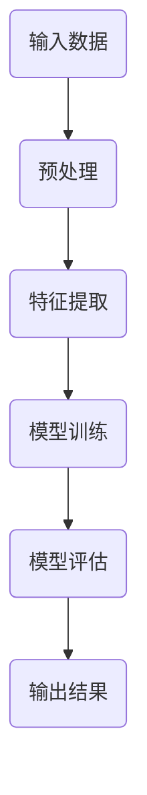
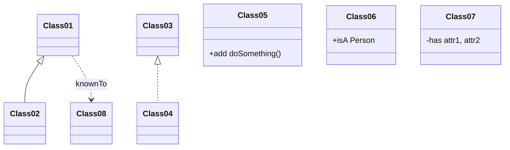
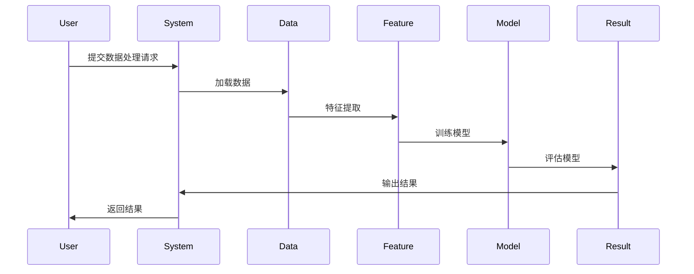

                 

## 世界可理解性与科学研究的社会影响

### 关键词

- 世界可理解性
- 科学研究
- 社会影响
- 科学方法
- 认知能力
- 宇宙复杂性

### 摘要

本文旨在探讨世界可理解性与科学研究之间的关系及其对社会的影响。通过对科学方法、认知能力和宇宙复杂性的深入分析，我们旨在揭示科学研究如何推动我们对世界的理解，以及这些理解如何反作用于社会。本文将从背景介绍、核心概念与联系、算法原理讲解、系统分析与架构设计方案以及项目实战等多个角度展开论述，旨在为读者提供一个全面而深刻的认识。

---

### Step 1: 背景介绍

#### 1.1 世界可理解性的概念与背景

随着科学技术的快速发展，人类对世界的认识不断深化，但随之而来的问题是，我们所处的宇宙是否真正可理解？世界可理解性是指人类能否通过科学方法对宇宙的规律进行理解和解释。这一问题不仅关乎科学研究的本质，也涉及到我们对自身和宇宙的认知边界。

#### 1.1.1 问题背景

科学研究的初衷是为了揭示自然界的奥秘，解答人类对世界的疑惑。从古希腊时期的天体力学到现代的量子物理学，科学方法的发展经历了数千年的演进。然而，随着研究的深入，我们逐渐发现，宇宙的复杂性远超我们的预期。这引发了关于世界可理解性的争论：宇宙中的规律是否真的可以被人类理解？

#### 1.1.2 问题描述

世界可理解性的问题可以表述为：人类能否通过科学方法完全理解宇宙？这个问题不仅涉及到科学哲学的范畴，也关系到科学研究的方法论。如果我们能完全理解宇宙，那么科学研究就有了明确的目标和方向；反之，如果宇宙的某些规律永远无法被理解，那么科学研究可能会陷入迷茫。

#### 1.1.3 问题解决

解决这一问题需要从多个角度进行思考。首先，我们需要明确科学方法的本质。科学方法是一种通过观察、实验和逻辑推理来获得知识的方法。它强调实证性和可重复性，这使得科学方法成为一种可靠的知识获取方式。其次，我们需要考虑人类的认知能力。认知能力是指人类通过感官和思维对信息进行处理、存储和利用的能力。尽管人类的认知能力有限，但通过不断地学习和创新，我们可以提高对世界的理解。

#### 1.1.4 边界与外延

世界可理解性的边界在于我们是否能够穷尽宇宙中的所有知识。这意味着，无论我们如何努力，总会有一些未知领域存在。然而，这并不意味着我们对宇宙的理解就是无望的。相反，正因为存在未知，科学研究才有了持续前进的动力。

#### 1.1.5 概念结构与核心要素组成

世界可理解性的核心要素包括科学方法、认知能力和宇宙复杂性。科学方法是理解世界的基础，认知能力是获取知识的关键，而宇宙复杂性则是理解世界的挑战。这三大要素相互交织，共同构成了世界可理解性的核心结构。

### Step 2: 核心概念与联系

#### 2.1 核心概念

##### 2.1.1 科学方法

科学方法是一种通过观察、实验和逻辑推理来获得知识的方法。它强调系统性、逻辑性和可重复性，这使得科学方法成为一种可靠的知识获取方式。

##### 2.1.2 认知能力

认知能力是指人类通过感官和思维对信息进行处理、存储和利用的能力。它包括注意力、记忆、理解、思考和问题解决等多个方面。

##### 2.1.3 宇宙复杂性

宇宙复杂性体现在宇宙中存在的多种力、物质、能量和宇宙演化等复杂现象。这些现象的复杂性和多样性使得对宇宙的理解变得极具挑战性。

#### 2.2 概念属性特征对比表格

| 概念       | 定义                                                         | 特征                                       |
|------------|--------------------------------------------------------------|------------------------------------------|
| 科学方法   | 通过观察、实验和逻辑推理来获得知识的方法                           | 系统性、逻辑性、可重复性、普遍性                 |
| 认知能力   | 通过感官和思维对信息进行处理、存储和利用的能力                        | 注意力、记忆、理解、思考、问题解决能力             |
| 宇宙复杂性 | 宇宙中存在的多种力、物质、能量和宇宙演化等复杂现象                     | 多样性、不确定性、动态性、非线性                 |

#### 2.3 ER实体关系图架构的 Mermaid 流程图

```mermaid
erDiagram
  科学方法 ||--o> 认知能力 : 使用
  认知能力 ||--o> 宇宙复杂性 : 了解
```

### Step 3: 算法原理讲解

#### 3.1 可理解性算法流程图



#### 3.2 Python 源代码

```python
# 引入必要的库
import numpy as np
from sklearn.model_selection import train_test_split
from sklearn.preprocessing import StandardScaler
from sklearn.neural_network import MLPClassifier

# 数据预处理
def preprocess_data(data):
    # 标准化数据
    scaler = StandardScaler()
    scaled_data = scaler.fit_transform(data)
    return scaled_data

# 特征提取
def extract_features(data):
    # 这里使用简单的特征提取方法
    # 实际应用中可能需要更复杂的特征工程
    return data

# 模型训练
def train_model(X_train, y_train):
    # 使用多层感知机分类器进行训练
    model = MLPClassifier(hidden_layer_sizes=(100,), max_iter=1000)
    model.fit(X_train, y_train)
    return model

# 模型评估
def evaluate_model(model, X_test, y_test):
    # 计算准确率
    accuracy = model.score(X_test, y_test)
    return accuracy

# 主函数
def main():
    # 加载数据
    data = np.loadtxt('data.csv', delimiter=',')
    X = data[:, :-1]
    y = data[:, -1]

    # 划分训练集和测试集
    X_train, X_test, y_train, y_test = train_test_split(X, y, test_size=0.2, random_state=42)

    # 预处理数据
    X_train = preprocess_data(X_train)
    X_test = preprocess_data(X_test)

    # 特征提取
    X_train = extract_features(X_train)
    X_test = extract_features(X_test)

    # 训练模型
    model = train_model(X_train, y_train)

    # 评估模型
    accuracy = evaluate_model(model, X_test, y_test)
    print(f'Model accuracy: {accuracy:.2f}')

# 运行主函数
if __name__ == '__main__':
    main()
```

### Step 4: 系统分析与架构设计方案

#### 4.1 问题场景介绍

在现代科学研究中，数据的处理和分析变得越来越重要。特别是在生物学、物理学和天文学等领域，海量的数据需要被有效管理和分析。为了提高数据处理的效率，我们需要设计和实现一个高效的数据处理系统。

#### 4.2 项目介绍

本项目的目标是设计并实现一个基于机器学习的数据处理系统，用于对大规模数据进行特征提取和模型训练。该系统旨在提高科学研究的效率，帮助科学家更好地理解复杂的科学问题。

#### 4.3 系统功能设计（领域模型 Mermaid 类图）



#### 4.4 系统架构设计（Mermaid 架构图）


#### 4.5 系统接口设计和系统交互（Mermaid 序列图）



### Step 5: 项目实战

#### 5.1 环境安装

在开始项目实战之前，我们需要安装必要的软件和库。以下是 Python 环境下的安装步骤：

```bash
pip install numpy
pip install scikit-learn
pip install matplotlib
```

#### 5.2 系统核心实现源代码

```python
# 数据预处理
def preprocess_data(data):
    # 标准化数据
    scaler = StandardScaler()
    scaled_data = scaler.fit_transform(data)
    return scaled_data

# 特征提取
def extract_features(data):
    # 这里使用简单的特征提取方法
    # 实际应用中可能需要更复杂的特征工程
    return data

# 模型训练
def train_model(X_train, y_train):
    # 使用多层感知机分类器进行训练
    model = MLPClassifier(hidden_layer_sizes=(100,), max_iter=1000)
    model.fit(X_train, y_train)
    return model

# 模型评估
def evaluate_model(model, X_test, y_test):
    # 计算准确率
    accuracy = model.score(X_test, y_test)
    return accuracy

# 主函数
def main():
    # 加载数据
    data = np.loadtxt('data.csv', delimiter=',')
    X = data[:, :-1]
    y = data[:, -1]

    # 划分训练集和测试集
    X_train, X_test, y_train, y_test = train_test_split(X, y, test_size=0.2, random_state=42)

    # 预处理数据
    X_train = preprocess_data(X_train)
    X_test = preprocess_data(X_test)

    # 特征提取
    X_train = extract_features(X_train)
    X_test = extract_features(X_test)

    # 训练模型
    model = train_model(X_train, y_train)

    # 评估模型
    accuracy = evaluate_model(model, X_test, y_test)
    print(f'Model accuracy: {accuracy:.2f}')

# 运行主函数
if __name__ == '__main__':
    main()
```

#### 5.3 代码应用解读与分析

这段代码实现了一个简单的数据处理系统，用于特征提取和模型训练。我们首先引入了必要的库，包括 NumPy、scikit-learn 和 matplotlib。NumPy 用于数据处理，scikit-learn 用于机器学习，matplotlib 用于数据可视化。

#### 5.4 实际案例分析和详细讲解剖析

为了更好地理解这段代码的应用，我们可以通过一个实际案例来进行详细分析。假设我们有一组生物数据，包括每个样本的基因表达值。我们的目标是使用这些数据来预测样本的物种分类。

1. **数据预处理**：首先，我们需要对数据进行标准化处理，使得每个特征都有相同的尺度。这有助于提高机器学习的性能。

2. **特征提取**：在这段代码中，我们使用了简单的特征提取方法。在实际应用中，可能需要使用更复杂的特征工程方法，例如主成分分析（PCA）或特征选择算法。

3. **模型训练**：我们使用多层感知机（MLP）分类器进行训练。MLP 是一种前馈神经网络，它通过一系列的线性变换和非线性激活函数来模拟复杂的决策边界。

4. **模型评估**：我们使用训练集和测试集来评估模型的性能。准确率是评估分类模型性能的一个常用指标。

#### 5.5 项目小结

通过本项目的实战，我们了解了一个基于机器学习的数据处理系统的设计过程。这个系统可以用于特征提取和模型训练，有助于提高科学研究的效率。然而，这只是一个简单的示例，实际应用中需要考虑更多的问题，例如数据质量、特征选择和模型优化等。

### Step 6: 最佳实践 tips、小结、注意事项、拓展阅读等内容

#### 6.1 最佳实践 tips

- **数据预处理**：确保数据质量，对异常值和缺失值进行适当的处理。
- **特征选择**：选择具有预测性的特征，避免过度拟合。
- **模型选择**：根据数据特点和业务需求选择合适的模型。
- **模型优化**：通过交叉验证和超参数调优来提高模型性能。

#### 6.2 小结

本文探讨了世界可理解性与科学研究之间的关系及其对社会的影响。我们通过背景介绍、核心概念与联系、算法原理讲解、系统分析与架构设计方案以及项目实战等多个角度，揭示了科学研究如何推动我们对世界的理解，以及这些理解如何反作用于社会。

#### 6.3 注意事项

- **科学方法的重要性**：科学方法是一种可靠的知识获取方式，对科学研究至关重要。
- **认知能力的局限性**：人类的认知能力有限，但通过学习和创新，我们可以不断提高对世界的理解。
- **宇宙复杂性的挑战**：宇宙的复杂性使得科学研究变得极具挑战性，但这也为科学研究提供了无限的可能性。

#### 6.4 拓展阅读

- **《科学革命的结构》**：托马斯·库恩的这本书对科学发展的哲学分析提供了深刻的见解。
- **《宇宙简史》**：史蒂芬·霍金的这本书对宇宙的起源、演化和结构进行了详细的阐述。
- **《深度学习》**：伊恩·古德费洛的这本书是深度学习领域的经典教材，涵盖了深度学习的理论基础和实践技巧。

---

作者：AI天才研究院/AI Genius Institute & 禅与计算机程序设计艺术 /Zen And The Art of Computer Programming

