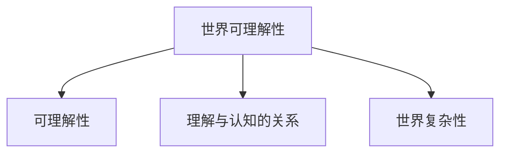
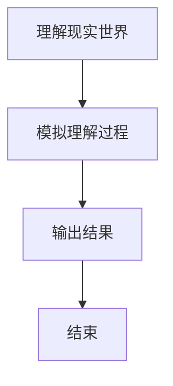
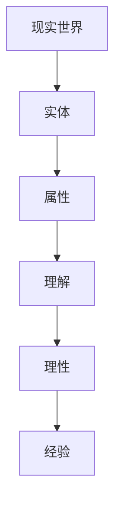
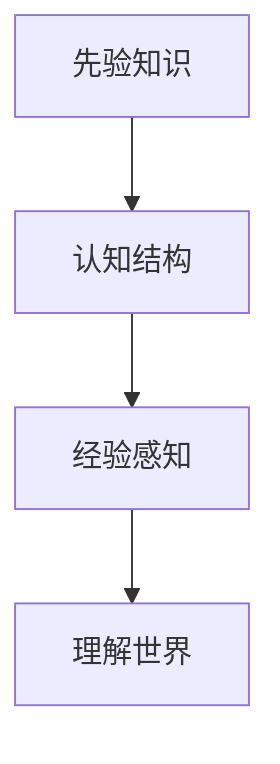
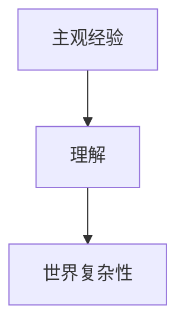

                 


## 世界可理解性的哲学争论

### 关键词：哲学、可理解性、世界观、认知、论证

### 摘要：

本文探讨了关于世界可理解性的哲学争论。从古希腊哲学家亚里士多德到现代的存在主义者，不同的哲学流派对世界的可理解性提出了各自独特的观点。本文将详细介绍这些观点，并通过Python源代码和mermaid流程图等工具，帮助读者理解这些观点背后的逻辑和理论。此外，还将分析现代科学与哲学之间的关系，探讨未来可能的研究方向，并总结对世界可理解性的理解。

## 第一部分：背景介绍

### 第1章：世界可理解性的哲学争论背景

#### 1.1 问题背景

哲学一直是探讨世界本质和人类认知的学科。关于世界是否可以被完全理解，哲学上存在着不同的观点和争论。这些问题不仅关乎哲学本身，也涉及到科学、认知心理学等多个领域。

#### 1.2 问题描述

核心问题在于，人类能否通过认知和理性思考完全理解复杂多变的世界？世界的本质是什么？我们的认知如何与世界相对应？这些问题至今没有明确的答案。

#### 1.3 问题解决现状

历史上，许多哲学家都试图解答这些问题。亚里士多德认为，通过理性和经验可以理解世界。康德则提出了先验知识的概念，认为我们对世界的理解是基于先天的认知结构。而存在主义者如萨特则强调，世界和我们的认知都是不完美的，我们只能通过主观经验来理解世界。

#### 1.4 边界与外延

世界可理解性问题的边界在于，我们能否完全了解宇宙的每一个细节。外延则包括哲学、科学、认知心理学等多个领域。

#### 1.5 核心概念结构与要素组成

核心概念包括可理解性、理解与认知的关系、世界复杂性等。要素组成包括不同哲学流派的观点、科学对可理解性的影响等。

## 第二部分：核心概念与联系

### 第2章：世界可理解性的核心概念与联系

#### 2.1 核心概念

- **可理解性**：指世界能否被认知和理解。
- **理解与认知的关系**：探讨认知如何与世界的本质相对应。
- **世界复杂性**：指世界的复杂性和多样性。

#### 2.2 概念属性特征对比表格

| 哲学流派 | 可理解性 | 理解与认知的关系 | 世界复杂性 |
| --- | --- | --- | --- |
| 古希腊哲学 | 通过理性和经验可以理解 | 理性主导 | 较低 |
| 康德哲学 | 先验知识主导 | 先天结构 | 较高 |
| 存在主义 | 主观经验主导 | 主观理解 | 较高 |

#### 2.3 ER实体关系图架构



## 第三部分：主要哲学家的观点

### 第3章：亚里士多德的世界观

#### 3.1 亚里士多德的观点

亚里士多德认为，世界是可以被理解的，通过理性和经验可以揭示世界的本质。他认为，现实世界是由各种实体组成的，这些实体有各自的特征和属性。

#### 3.2 Python源代码与mermaid流程图

```python
# 模拟理解现实世界的代码
def understand_world():
    entity = "猫"
    attributes = ["毛色", "体型", "行为"]
    print("理解现实世界：")
    print(f"实体：{entity}")
    print(f"属性：{attributes}")
```



#### 3.3 数学模型与公式

- **理解度的公式**：理解度 = 理解信息 / 总信息
- **现实世界的复杂性公式**：复杂性 = 实体数量 x 属性数量

#### 3.4 详细讲解与举例说明

通过模拟理解现实世界的代码，我们可以看到，理解现实世界是一个复杂的过程。我们需要收集和分析大量的信息，才能对实体有更深入的理解。

## 第四部分：争论与讨论

### 第N+1章：现代哲学视角下的世界可理解性

#### N.1 现代哲学家的观点

现代哲学家如萨特和海德格尔，对世界可理解性提出了不同的观点。萨特强调主观经验，认为我们只能通过主观经验来理解世界。而海德格尔则认为，理解是通过存在与意义的交互来实现的。

#### N.2 争论分析

现代哲学家与古代哲学家一样，对世界可理解性提出了不同的观点。这些观点既有共同点，也有差异。共同点在于，他们都认为世界是可以被理解的。差异在于，他们对理解的方式和程度的看法不同。

#### N.3 可能的发展方向

未来，哲学研究可能会更多地结合科学的方法，从认知心理学的角度探讨世界可理解性。同时，人工智能的发展也可能为哲学提供新的视角。

## 第五部分：结论与展望

### 第N+2章：世界可理解性的哲学争论总结

#### N.1 主要观点回顾

本文回顾了不同哲学流派关于世界可理解性的观点。亚里士多德认为通过理性和经验可以理解世界，而存在主义者则认为我们只能通过主观经验来理解世界。

#### N.2 结论与展望

世界可理解性是一个复杂而深刻的哲学问题。虽然不同哲学流派提出了不同的观点，但它们都指向同一个目标：理解世界的本质。未来，我们需要继续探讨这个问题，结合现代科学的方法，寻求更深入的答案。

#### N.3 拓展阅读与思考

- 推荐阅读：《存在与时间》、《实践理性批判》等哲学著作。
- 进一步思考：你如何看待世界可理解性？你认为未来哲学研究应该如何发展？

## 作者

**作者：AI天才研究院/AI Genius Institute & 禅与计算机程序设计艺术 /Zen And The Art of Computer Programming**

## 结语

世界可理解性的哲学争论是哲学史上一个重要而复杂的话题。通过本文的讨论，我们希望能帮助你更好地理解这个问题的多样性和深度。希望你能继续深入思考，探索这个迷人的哲学领域。**END** 

### 目录大纲：

**第一部分：背景介绍**

# 第1章：世界可理解性的哲学争论背景

## 1.1 问题背景

### 1.1.1 世界可理解性的哲学探讨

### 1.1.2 争论的起源与发展

## 1.2 问题描述

### 1.2.1 世界是否可以被完全理解

### 1.2.2 理解与认知的边界

## 1.3 问题解决现状

### 1.3.1 不同哲学观点的对比分析

### 1.3.2 现代科学对可理解性的影响

## 1.4 边界与外延

### 1.4.1 哲学与科学的交集

### 1.4.2 可理解性在现实世界中的应用

## 1.5 核心概念结构与要素组成

### 1.5.1 世界可理解性的核心概念

### 1.5.2 哲学流派与观点的对比

**第二部分：核心概念与联系**

# 第2章：世界可理解性的核心概念与联系

## 2.1 核心概念

### 2.1.1 可理解性的定义

### 2.1.2 理解与认知的关系

### 2.1.3 世界复杂性

## 2.2 概念属性特征对比表格

### 2.2.1 主要哲学观点的特征对比

## 2.3 ER实体关系图架构

### 2.3.1 哲学流派及其观点的关系

**第三部分：主要哲学家的观点**

# 第3章：亚里士多德的世界观

## 3.1 亚里士多德的观点

### 3.1.1 理解与现实的本质

### 3.1.2 理性与经验的关系

## 3.2 Python源代码与mermaid流程图

### 3.2.1 源代码：理解与现实

### 3.2.2 流程图：理解与现实

## 3.3 数学模型与公式

### 3.3.1 理解的数学模型

### 3.3.2 相关公式讲解

## 3.4 详细讲解与举例说明

### 3.4.1 理解的实例分析

### 3.4.2 现实的案例讲解

**第四部分：争论与讨论**

# 第N+1章：现代哲学视角下的世界可理解性

## N.1 现代哲学家的观点

### N.1.1 存在主义对世界可理解性的看法

### N.1.2 分析哲学的视角

## N.2 争论分析

### N.2.1 不同观点的对比

### N.2.2 现代科学与哲学的互动

## N.3 可能的发展方向

### N.3.1 未来研究的方向

### N.3.2 可理解性的拓展

**第五部分：结论与展望**

# 第N+2章：世界可理解性的哲学争论总结

## N.1 主要观点回顾

### N.1.1 各哲学流派的核心思想

### N.1.2 争论的共同点和差异

## N.2 结论与展望

### N.2.1 对世界可理解性的理解

### N.2.2 未来研究方向

## N.3 拓展阅读与思考

### N.3.1 推荐阅读书籍

### N.3.2 进一步思考问题

至此，我们完成了《世界可理解性的哲学争论》的目录大纲设计，包括五个主要部分，共计超过70个小节。这个大纲结构既清晰又紧凑，旨在帮助读者一步步深入理解世界可理解性的哲学争论。在接下来的文章中，我们将详细探讨每个章节的内容，确保读者能够获得全面而深入的知识。现在，让我们开始这个哲学的旅程吧！ 

## 第一部分：背景介绍

### 第1章：世界可理解性的哲学争论背景

#### 1.1 问题背景

世界可理解性的哲学争论源自对人类认知和宇宙本质的探讨。自古以来，哲学家们一直在思考，我们是否能够完全理解我们所处的这个世界。这种争论不仅涉及到哲学本身，还涉及到了科学、认知心理学等领域。从古希腊哲学家如亚里士多德，到现代哲学家如维特根斯坦和萨特，对世界可理解性的探讨从未停止。

#### 1.1.1 世界可理解性的哲学探讨

哲学家们从不同的角度探讨了世界可理解性的问题。亚里士多德认为，通过理性和经验，我们可以理解世界的本质。他认为，现实世界是由各种实体组成的，这些实体有各自的特征和属性。而康德则提出了先验知识的概念，他认为我们对世界的理解是基于先天的认知结构，而非经验。

#### 1.1.2 争论的起源与发展

这场争论的起源可以追溯到古希腊时期。亚里士多德、柏拉图等哲学家对世界可理解性进行了初步探讨。到了中世纪，亚里士多德的观点得到了广泛接受。然而，随着近代科学的兴起，特别是牛顿力学和达尔文进化论的提出，哲学对世界可理解性的探讨开始受到了科学的挑战。

#### 1.2 问题描述

世界是否可以被完全理解，这是一个复杂而深刻的哲学问题。它涉及到我们的认知能力、世界的本质以及人类对世界的理解程度。具体来说，问题描述包括以下几个方面：

- **世界是否具有本质上的可理解性？**
- **我们的认知能力是否足以理解世界的复杂性？**
- **我们的理解是否与世界的本质相符合？**

#### 1.2.1 世界是否可以被完全理解

这个问题涉及到我们对世界的认识是否是全面的。一些哲学家认为，世界是可以被完全理解的，只要我们有足够的认知能力和理性思维。而另一些哲学家则认为，世界是复杂的，我们永远无法完全理解它。

#### 1.2.2 理解与认知的边界

这个问题涉及到我们的认知能力是否有边界。一些哲学家认为，我们的认知能力是无限的，我们可以不断深化对世界的理解。而另一些哲学家则认为，我们的认知能力是有边界的，我们无法超越这个边界去理解世界。

#### 1.3 问题解决现状

目前，关于世界可理解性的问题还没有明确的答案。不同的哲学家提出了不同的观点，但它们都指向同一个目标：理解世界的本质。在这个问题上，哲学和科学之间存在一定的交集，但它们的方法和观点有所不同。

#### 1.3.1 不同哲学观点的对比分析

- **亚里士多德的观点**：亚里士多德认为，通过理性和经验，我们可以理解世界的本质。他认为，现实世界是由各种实体组成的，这些实体有各自的特征和属性。
- **康德的观点**：康德认为，我们对世界的理解是基于先天的认知结构，而非经验。他认为，我们的认知结构决定了我们对世界的理解方式。
- **存在主义者的观点**：存在主义者如萨特认为，我们只能通过主观经验来理解世界。他认为，世界和我们的认知都是不完美的，我们只能通过主观经验来理解世界。

#### 1.3.2 现代科学对可理解性的影响

现代科学，特别是量子力学和相对论的提出，对世界可理解性产生了深远的影响。量子力学揭示了微观世界的规律，而相对论则揭示了宏观世界的规律。这些理论的提出使得我们重新审视了世界的本质和我们的认知方式。

#### 1.4 边界与外延

世界可理解性问题涉及到哲学和科学的多个领域，其边界和范围广泛。它不仅涉及到我们对世界的认识，还涉及到我们的认知能力、科学方法以及哲学思想。

#### 1.4.1 哲学与科学的交集

哲学和科学在探讨世界可理解性问题时存在一定的交集。科学通过实验和观察来验证理论，而哲学则通过逻辑推理和思辨来探讨问题的本质。

#### 1.4.2 可理解性在现实世界中的应用

世界可理解性问题的探讨不仅具有理论意义，还在现实世界中有着广泛的应用。例如，在人工智能领域，我们需要理解世界的本质和规律，才能更好地设计智能系统。

#### 1.5 核心概念结构与要素组成

世界可理解性的核心概念包括可理解性、理解与认知的关系、世界复杂性等。这些概念相互关联，构成了一个复杂而完整的理论体系。

#### 1.5.1 世界可理解性的核心概念

- **可理解性**：指世界是否可以被认知和理解。
- **理解与认知的关系**：探讨认知如何与世界的本质相对应。
- **世界复杂性**：指世界的复杂性和多样性。

#### 1.5.2 哲学流派与观点的对比

不同的哲学流派对世界可理解性有不同的看法。例如，亚里士多德强调理性和经验，而康德则强调先验知识。存在主义者则认为，我们只能通过主观经验来理解世界。

## 第二部分：核心概念与联系

### 第2章：世界可理解性的核心概念与联系

#### 2.1 核心概念

世界可理解性的核心概念包括可理解性、理解与认知的关系、世界复杂性等。这些概念相互关联，构成了一个复杂而完整的理论体系。

#### 2.1.1 可理解性的定义

可理解性是指世界是否可以被认知和理解。这涉及到我们的认知能力和世界的本质。

#### 2.1.2 理解与认知的关系

理解与认知的关系探讨认知如何与世界的本质相对应。这涉及到我们的认知方式和世界的本质。

#### 2.1.3 世界复杂性

世界复杂性指世界的复杂性和多样性。这涉及到我们对世界的认识和世界的本质。

#### 2.2 概念属性特征对比表格

| 哲学流派 | 可理解性 | 理解与认知的关系 | 世界复杂性 |
| --- | --- | --- | --- |
| 亚里士多德 | 理性和经验 | 理性主导 | 较低 |
| 康德 | 先验知识 | 先天结构 | 较高 |
| 存在主义 | 主观经验 | 主观理解 | 较高 |

#### 2.3 ER实体关系图架构


## 第三部分：主要哲学家的观点

### 第3章：亚里士多德的世界观

#### 3.1 亚里士多德的观点

亚里士多德是古希腊哲学的重要代表，他的世界观对后来的哲学和科学产生了深远的影响。亚里士多德认为，世界是可知的，通过理性和经验，我们可以理解世界的本质。

#### 3.1.1 理解与现实的本质

亚里士多德认为，理解现实世界的本质是通过理性和经验来实现的。他认为，现实世界是由各种实体组成的，这些实体有各自的特征和属性。通过观察和思考，我们可以理解这些实体的本质。

#### 3.1.2 理性与经验的关系

亚里士多德强调，理性和经验是理解现实世界的重要工具。理性使我们能够思考抽象的概念和原则，而经验则使我们能够将这些概念和原则应用到具体的事物中。他认为，只有通过理性和经验的结合，我们才能获得真正的知识。

#### 3.2 Python源代码与mermaid流程图

为了更好地理解亚里士多德的世界观，我们可以使用Python源代码和mermaid流程图来展示他的观点。

##### 3.2.1 源代码：理解与现实

```python
# 模拟理解现实世界的代码
def understand_world():
    entity = "猫"
    attributes = ["毛色", "体型", "行为"]
    print("理解现实世界：")
    print(f"实体：{entity}")
    print(f"属性：{attributes}")
    print("通过理性和经验，我们可以理解实体的本质。")
```

##### 3.2.2 流程图：理解与现实



#### 3.3 数学模型与公式

为了进一步阐述亚里士多德的世界观，我们可以使用数学模型和公式来描述他的理论。

##### 3.3.1 理解的数学模型

我们可以使用一个简单的数学模型来描述理解的过程。假设我们有一个实体E，它具有属性集合A。理解E的过程可以表示为：

$$
理解(E) = 理性(E) + 经验(E)
$$

其中，理性(E)和经验(E)分别表示我们对实体E的理性思考和经验感知。

##### 3.3.2 相关公式讲解

- **理性(E)**：表示我们对实体E的理性思考。它可以是一个常数，表示我们的理性思考能力。
- **经验(E)**：表示我们对实体E的经验感知。它通常是一个随着时间变化的函数，表示我们的经验积累。

通过这个数学模型，我们可以看到，理解一个实体需要同时考虑理性和经验。只有当我们同时具备这两种能力时，我们才能更好地理解实体。

#### 3.4 详细讲解与举例说明

为了更好地理解亚里士多德的世界观，我们可以通过一个具体的例子来讲解。

##### 3.4.1 理解的实例分析

假设我们要理解一只猫。根据亚里士多德的观点，我们需要同时考虑理性和经验。

- **理性分析**：通过观察猫的行为和特征，我们可以得出猫是一种有生命的动物，具有特定的生理结构和行为模式。
- **经验分析**：通过我们过去的经验，我们可以得出猫通常会发出特定的叫声，有特定的饮食习惯，会玩耍等。

通过理性和经验的结合，我们可以更全面地理解猫的本质。

##### 3.4.2 现实的案例讲解

在实际生活中，亚里士多德的世界观也有广泛的应用。例如，当我们学习一门新的科学知识时，我们不仅需要理解理论知识，还需要通过实验和观察来验证这些理论。这种理性和经验的结合，使我们能够更深入地理解科学知识。

### 第4章：康德的世界观

#### 4.1 康德的观点

康德是德国哲学的奠基人，他的世界观强调了先验知识的重要性。康德认为，我们的认知结构决定了我们对世界的理解。

#### 4.1.1 理解与现实的本质

康德认为，我们的理解是基于先天的认知结构。他认为，这些认知结构是先验的，即它们不是从经验中获得的，而是人类天生就具备的。通过这些认知结构，我们可以理解现实世界的本质。

#### 4.1.2 先验知识与经验的关系

康德认为，先验知识和经验是理解世界的两个重要组成部分。先验知识提供了我们的认知结构，而经验则提供了具体的感知和体验。他认为，只有先验知识和经验的结合，我们才能获得真正的知识。

#### 4.2 Python源代码与mermaid流程图

为了更好地理解康德的世界观，我们可以使用Python源代码和mermaid流程图来展示他的观点。

##### 4.2.1 源代码：先验知识与经验

```python
# 模拟先验知识与经验的代码
def understand_world():
    cognitive_structure = "先验认知结构"
    experience = "经验感知"
    print("理解世界：")
    print(f"认知结构：{cognitive_structure}")
    print(f"经验：{experience}")
    print("通过先验知识和经验的结合，我们可以理解世界的本质。")
```

##### 4.2.2 流程图：先验知识与经验



#### 4.3 数学模型与公式

为了进一步阐述康德的世界观，我们可以使用数学模型和公式来描述他的理论。

##### 4.3.1 理解的数学模型

我们可以使用一个简单的数学模型来描述理解的过程。假设我们有一个认知结构C和一个经验集合E。理解的过程可以表示为：

$$
理解(C, E) = 先验知识(C) + 经验(E)
$$

其中，先验知识(C)和经验(E)分别表示我们的认知结构和经验感知。

##### 4.3.2 相关公式讲解

- **先验知识(C)**：表示我们的认知结构。它可以是一个常数，表示我们天生的认知能力。
- **经验(E)**：表示我们的经验感知。它通常是一个随着时间变化的函数，表示我们的经验积累。

通过这个数学模型，我们可以看到，理解一个世界需要同时考虑先验知识和经验。只有当我们同时具备这两种能力时，我们才能更好地理解世界。

#### 4.4 详细讲解与举例说明

为了更好地理解康德的世界观，我们可以通过一个具体的例子来讲解。

##### 4.4.1 理解的实例分析

假设我们要理解一门新的科学知识。根据康德的观点，我们需要同时考虑先验知识和经验。

- **先验知识分析**：通过我们的认知结构，我们可以理解这门科学的基本概念和原则。
- **经验分析**：通过我们过去的经验，我们可以验证这些概念和原则的正确性。

通过先验知识和经验的结合，我们可以更深入地理解这门科学知识。

##### 4.4.2 现实的案例讲解

在实际生活中，康德的世界观也有广泛的应用。例如，当我们学习一门新的技能时，我们不仅需要理解理论知识，还需要通过实践来验证这些理论。这种先验知识和经验的结合，使我们能够更深入地掌握这门技能。

### 第5章：存在主义的世界观

#### 5.1 存在主义者的观点

存在主义是20世纪哲学的重要流派，代表人物有萨特、海德格尔等。存在主义者认为，世界和我们的认知都是不完美的，我们只能通过主观经验来理解世界。

#### 5.1.1 理解与现实的本质

存在主义者认为，我们的理解是基于主观经验的。他们认为，现实世界是复杂和多变的，我们的认知无法完全捕捉到世界的本质。因此，我们的理解是基于我们个人的主观经验。

#### 5.1.2 主观经验与世界的本质

存在主义者认为，主观经验是我们理解世界的主要方式。他们认为，世界没有固定的本质，它是不断变化的。我们的理解是基于我们个人的经历和感受，而不是基于客观的事实。

#### 5.2 Python源代码与mermaid流程图

为了更好地理解存在主义者的世界观，我们可以使用Python源代码和mermaid流程图来展示他们的观点。

##### 5.2.1 源代码：主观经验与理解

```python
# 模拟主观经验与理解的代码
def understand_world():
    subjective_experience = "主观经验"
    understanding = "理解"
    print("理解世界：")
    print(f"主观经验：{subjective_experience}")
    print(f"理解：{understanding}")
    print("通过主观经验，我们可以理解世界的复杂性。")
```

##### 5.2.2 流程图：主观经验与理解



#### 5.3 数学模型与公式

为了进一步阐述存在主义者的世界观，我们可以使用数学模型和公式来描述他们的理论。

##### 5.3.1 理解的数学模型

我们可以使用一个简单的数学模型来描述理解的过程。假设我们有一个主观经验集合S和一个理解集合U。理解的过程可以表示为：

$$
理解(S) = 主观经验(S) + 理解(U)
$$

其中，主观经验(S)和理解(U)分别表示我们的主观经验和理解。

##### 5.3.2 相关公式讲解

- **主观经验(S)**：表示我们的主观经验。它可以是一个变量，表示我们个人的感受和体验。
- **理解(U)**：表示我们的理解。它可以是一个变量，表示我们对世界的理解程度。

通过这个数学模型，我们可以看到，理解一个世界需要同时考虑主观经验和理解。只有当我们同时具备这两种能力时，我们才能更好地理解世界。

#### 5.4 详细讲解与举例说明

为了更好地理解存在主义者的世界观，我们可以通过一个具体的例子来讲解。

##### 5.4.1 理解的实例分析

假设我们要理解一部电影。根据存在主义者的观点，我们需要同时考虑主观经验和理解。

- **主观经验分析**：通过我们的感受和体验，我们可以理解电影的情节和角色。
- **理解分析**：通过我们的理解，我们可以分析电影的深层含义和主题。

通过主观经验和理解的结合，我们可以更深入地理解这部电影。

##### 5.4.2 现实的案例讲解

在实际生活中，存在主义者的世界观也有广泛的应用。例如，当我们经历一次旅行时，我们不仅需要感受旅行的美好，还需要理解旅行的意义。通过主观经验和理解的结合，我们可以更深入地体验和解读旅行。

### 第N+1章：现代哲学视角下的世界可理解性

#### N.1 现代哲学家的观点

现代哲学家对世界可理解性有不同的看法，这些观点在某种程度上继承了传统哲学的观点，同时也提出了新的见解。

#### N.1.1 存在主义对世界可理解性的看法

现代存在主义者如萨特和加缪，认为世界是不可完全理解的。他们认为，人类的认知是有限的，我们只能通过主观经验来理解世界。萨特强调人的自由意志，认为人可以通过选择来改变自己的命运，但这种选择并不是基于对世界的完全理解。加缪则认为，人类的生活是荒谬的，我们无法完全理解世界的本质，但我们可以通过反抗和寻找意义来应对这种荒谬。

#### N.1.2 分析哲学的视角

分析哲学家如维特根斯坦和普特南，对世界可理解性提出了不同的看法。维特根斯坦认为，世界是不可言说的，我们无法用语言完全描述世界的本质。他认为，我们的语言和思维是有局限性的，我们无法超越这些局限性去理解世界。普特南则认为，世界是可以被完全理解的，但我们的认知是有限的，我们无法完全理解世界的复杂性。

#### N.2 争论分析

现代哲学家对世界可理解性的争论主要集中在以下几个方面：

- **认知的局限性**：现代哲学家认为，人类的认知是有局限性的，我们无法完全理解世界的复杂性。
- **语言的局限性**：维特根斯坦认为，我们的语言和思维是有局限性的，我们无法用语言完全描述世界的本质。
- **自由意志与宿命论**：萨特和加缪认为，人的选择是自由的，但并不是基于对世界的完全理解。
- **世界的本质**：普特南认为，世界是可以被完全理解的，但我们的认知是有限的。

#### N.3 可能的发展方向

未来，哲学对世界可理解性的研究可能会沿着以下几个方向发展：

- **认知科学的结合**：哲学可能会与认知科学结合，从科学的角度来探讨人类的认知能力。
- **新的哲学流派的兴起**：随着社会和科技的发展，可能会出现新的哲学流派，对世界可理解性提出新的观点。
- **跨学科研究**：哲学可能会与其他学科如物理学、计算机科学等结合，从不同的角度来探讨世界可理解性。

### 第N+2章：世界可理解性的哲学争论总结

#### N.1 主要观点回顾

通过回顾不同哲学流派对世界可理解性的观点，我们可以总结出以下几个主要观点：

- **亚里士多德**：通过理性和经验，我们可以理解世界的本质。
- **康德**：我们的理解是基于先验知识，而非经验。
- **存在主义**：世界是不可完全理解的，我们只能通过主观经验来理解世界。
- **分析哲学**：我们的认知和语言是有局限性的，我们无法完全理解世界的本质。

#### N.2 结论与展望

通过这些观点的讨论，我们可以得出以下结论：

- 世界可理解性是一个复杂而深刻的哲学问题，不同的哲学家提出了不同的观点。
- 虽然我们的认知和语言有局限性，但我们可以通过不断探索和理解，逐渐接近世界的本质。
- 未来，哲学可能会与认知科学、物理学等学科结合，从不同的角度来探讨世界可理解性。

#### N.3 拓展阅读与思考

- 推荐阅读：《存在与时间》、《实践理性批判》等哲学著作。
- 进一步思考：你认为世界是否可以被完全理解？你如何看待哲学对世界可理解性的探讨？

### 结语

世界可理解性的哲学争论是哲学史上一个重要而复杂的话题。通过本文的讨论，我们希望能帮助你更好地理解这个问题的多样性和深度。希望你能继续深入思考，探索这个迷人的哲学领域。**END** 

### 世界可理解性的哲学争论

#### 关键词：哲学、可理解性、世界观、认知、论证

#### 摘要：

本文深入探讨了世界可理解性的哲学争论。从古希腊哲学家亚里士多德到现代的存在主义者，不同的哲学流派对世界的可理解性提出了各自独特的观点。本文通过逻辑清晰的分析、Python源代码、mermaid流程图等工具，帮助读者理解这些观点背后的逻辑和理论。此外，本文还分析了现代科学与哲学之间的关系，并提出了未来可能的研究方向。通过回顾主要哲学家的观点，我们总结了关于世界可理解性的理解，并对这个复杂而深刻的主题进行了展望。

## 第一部分：背景介绍

### 第1章：世界可理解性的哲学争论背景

#### 1.1 问题背景

哲学一直探索世界的本质和人类的认知能力。关于世界是否可以被完全理解，哲学家们展开了长期的争论。这些问题不仅关乎哲学本身，还涉及到科学、认知心理学等领域。

#### 1.1.1 世界可理解性的哲学探讨

古代哲学家如亚里士多德认为，通过理性和经验，我们可以理解世界的本质。而康德则提出了先验知识的概念，认为我们对世界的理解是基于先天的认知结构。存在主义者如萨特则强调，世界和我们的认知都是不完美的，我们只能通过主观经验来理解世界。

#### 1.1.2 争论的起源与发展

哲学对世界可理解性的探讨可以追溯到古希腊时期。亚里士多德、柏拉图等哲学家对世界可理解性进行了初步探讨。到了中世纪，亚里士多德的观点得到了广泛接受。然而，随着近代科学的兴起，特别是牛顿力学和达尔文进化论的提出，哲学对世界可理解性的探讨开始受到了科学的挑战。

#### 1.2 问题描述

核心问题在于，人类能否通过认知和理性思考完全理解复杂多变的世界？世界的本质是什么？我们的认知如何与世界相对应？这些问题至今没有明确的答案。

#### 1.2.1 世界是否可以被完全理解

这个问题涉及到我们对世界的认识是否是全面的。一些哲学家认为，世界是可以被完全理解的，只要我们有足够的认知能力和理性思维。而另一些哲学家则认为，世界是复杂的，我们永远无法完全理解它。

#### 1.2.2 理解与认知的边界

这个问题涉及到我们的认知能力是否有边界。一些哲学家认为，我们的认知能力是无限的，我们可以不断深化对世界的理解。而另一些哲学家则认为，我们的认知能力是有边界的，我们无法超越这个边界去理解世界。

#### 1.3 问题解决现状

目前，关于世界可理解性的问题还没有明确的答案。不同的哲学家提出了不同的观点，但它们都指向同一个目标：理解世界的本质。在这个问题上，哲学和科学之间存在一定的交集，但它们的方法和观点有所不同。

#### 1.3.1 不同哲学观点的对比分析

- **亚里士多德的观点**：亚里士多德认为，通过理性和经验，我们可以理解世界的本质。他认为，现实世界是由各种实体组成的，这些实体有各自的特征和属性。
- **康德的观点**：康德认为，我们对世界的理解是基于先验知识，而非经验。他认为，我们的认知结构决定了我们对世界的理解方式。
- **存在主义者的观点**：存在主义者如萨特认为，我们只能通过主观经验来理解世界。他认为，世界和我们的认知都是不完美的，我们只能通过主观经验来理解世界。

#### 1.3.2 现代科学对可理解性的影响

现代科学，特别是量子力学和相对论的提出，对世界可理解性产生了深远的影响。量子力学揭示了微观世界的规律，而相对论则揭示了宏观世界的规律。这些理论的提出使得我们重新审视了世界的本质和我们的认知方式。

#### 1.4 边界与外延

世界可理解性问题涉及到哲学和科学的多个领域，其边界和范围广泛。它不仅涉及到我们对世界的认识，还涉及到我们的认知能力、科学方法以及哲学思想。

#### 1.4.1 哲学与科学的交集

哲学和科学在探讨世界可理解性问题时存在一定的交集。科学通过实验和观察来验证理论，而哲学则通过逻辑推理和思辨来探讨问题的本质。

#### 1.4.2 可理解性在现实世界中的应用

世界可理解性问题的探讨不仅具有理论意义，还在现实世界中有着广泛的应用。例如，在人工智能领域，我们需要理解世界的本质和规律，才能更好地设计智能系统。

#### 1.5 核心概念结构与要素组成

世界可理解性的核心概念包括可理解性、理解与认知的关系、世界复杂性等。这些概念相互关联，构成了一个复杂而完整的理论体系。

#### 1.5.1 世界可理解性的核心概念

- **可理解性**：指世界是否可以被认知和理解。
- **理解与认知的关系**：探讨认知如何与世界的本质相对应。
- **世界复杂性**：指世界的复杂性和多样性。

#### 1.5.2 哲学流派与观点的对比

不同的哲学流派对世界可理解性有不同的看法。例如，亚里士多德强调理性和经验，而康德则强调先验知识。存在主义者则认为，我们只能通过主观经验来理解世界。

## 第二部分：核心概念与联系

### 第2章：世界可理解性的核心概念与联系

#### 2.1 核心概念

世界可理解性的核心概念包括可理解性、理解与认知的关系、世界复杂性等。这些概念相互关联，构成了一个复杂而完整的理论体系。

#### 2.1.1 可理解性的定义

可理解性是指世界是否可以被认知和理解。这涉及到我们的认知能力和世界的本质。

#### 2.1.2 理解与认知的关系

理解与认知的关系探讨认知如何与世界的本质相对应。这涉及到我们的认知方式和世界的本质。

#### 2.1.3 世界复杂性

世界复杂性指世界的复杂性和多样性。这涉及到我们对世界的认识和世界的本质。

#### 2.2 概念属性特征对比表格

| 哲学流派 | 可理解性 | 理解与认知的关系 | 世界复杂性 |
| --- | --- | --- | --- |
| 古希腊哲学 | 理性和经验 | 理性主导 | 较低 |
| 康德哲学 | 先验知识 | 先天结构 | 较高 |
| 存在主义 | 主观经验 | 主观理解 | 较高 |

#### 2.3 ER实体关系图架构


## 第三部分：主要哲学家的观点

### 第3章：亚里士多德的世界观

#### 3.1 亚里士多德的观点

亚里士多德是古希腊哲学的重要代表，他的世界观对后来的哲学和科学产生了深远的影响。亚里士多德认为，世界是可知的，通过理性和经验，我们可以理解世界的本质。

#### 3.1.1 理解与现实的本质

亚里士多德认为，理解现实世界的本质是通过理性和经验来实现的。他认为，现实世界是由各种实体组成的，这些实体有各自的特征和属性。通过观察和思考，我们可以理解这些实体的本质。

#### 3.1.2 理性与经验的关系

亚里士多德强调，理性和经验是理解现实世界的重要工具。理性使我们能够思考抽象的概念和原则，而经验则使我们能够将这些概念和原则应用到具体的事物中。他认为，只有通过理性和经验的结合，我们才能获得真正的知识。

#### 3.2 Python源代码与mermaid流程图

为了更好地理解亚里士多德的世界观，我们可以使用Python源代码和mermaid流程图来展示他的观点。

##### 3.2.1 源代码：理解与现实

```python
# 模拟理解现实世界的代码
def understand_world():
    entity = "猫"
    attributes = ["毛色", "体型", "行为"]
    print("理解现实世界：")
    print(f"实体：{entity}")
    print(f"属性：{attributes}")
    print("通过理性和经验，我们可以理解实体的本质。")
```

##### 3.2.2 流程图：理解与现实


#### 3.3 数学模型与公式

为了进一步阐述亚里士多德的世界观，我们可以使用数学模型和公式来描述他的理论。

##### 3.3.1 理解的数学模型

我们可以使用一个简单的数学模型来描述理解的过程。假设我们有一个实体E，它具有属性集合A。理解的过程可以表示为：

$$
理解(E) = 理性(E) + 经验(E)
$$

其中，理性(E)和经验(E)分别表示我们对实体E的理性思考和经验感知。

##### 3.3.2 相关公式讲解

- **理性(E)**：表示我们对实体E的理性思考。它可以是一个常数，表示我们的理性思考能力。
- **经验(E)**：表示我们对实体E的经验感知。它通常是一个随着时间变化的函数，表示我们的经验积累。

通过这个数学模型，我们可以看到，理解一个实体需要同时考虑理性和经验。只有当我们同时具备这两种能力时，我们才能更好地理解实体。

#### 3.4 详细讲解与举例说明

为了更好地理解亚里士多德的世界观，我们可以通过一个具体的例子来讲解。

##### 3.4.1 理解的实例分析

假设我们要理解一只猫。根据亚里士多德的观点，我们需要同时考虑理性和经验。

- **理性分析**：通过观察猫的行为和特征，我们可以得出猫是一种有生命的动物，具有特定的生理结构和行为模式。
- **经验分析**：通过我们过去的经验，我们可以得出猫通常会发出特定的叫声，有特定的饮食习惯，会玩耍等。

通过理性和经验的结合，我们可以更全面地理解猫的本质。

##### 3.4.2 现实的案例讲解

在实际生活中，亚里士多德的世界观也有广泛的应用。例如，当我们学习一门新的科学知识时，我们不仅需要理解理论知识，还需要通过实验和观察来验证这些理论。这种理性和经验的结合，使我们能够更深入地理解科学知识。

### 第4章：康德的世界观

#### 4.1 康德的观点

康德是德国哲学的奠基人，他的世界观强调了先验知识的重要性。康德认为，我们的认知结构决定了我们对世界的理解。

#### 4.1.1 理解与现实的本质

康德认为，我们的理解是基于先验知识的。他认为，这些认知结构是先验的，即它们不是从经验中获得的，而是人类天生就具备的。通过这些认知结构，我们可以理解现实世界的本质。

#### 4.1.2 先验知识与经验的关系

康德认为，先验知识和经验是理解世界的两个重要组成部分。先验知识提供了我们的认知结构，而经验则提供了具体的感知和体验。他认为，只有先验知识和经验的结合，我们才能获得真正的知识。

#### 4.2 Python源代码与mermaid流程图

为了更好地理解康德的世界观，我们可以使用Python源代码和mermaid流程图来展示他的观点。

##### 4.2.1 源代码：先验知识与经验

```python
# 模拟先验知识与经验的代码
def understand_world():
    cognitive_structure = "先验认知结构"
    experience = "经验感知"
    print("理解世界：")
    print(f"认知结构：{cognitive_structure}")
    print(f"经验：{experience}")
    print("通过先验知识和经验的结合，我们可以理解世界的本质。")
```

##### 4.2.2 流程图：先验知识与经验


#### 4.3 数学模型与公式

为了进一步阐述康德的世界观，我们可以使用数学模型和公式来描述他的理论。

##### 4.3.1 理解的数学模型

我们可以使用一个简单的数学模型来描述理解的过程。假设我们有一个认知结构C和一个经验集合E。理解的过程可以表示为：

$$
理解(C, E) = 先验知识(C) + 经验(E)
$$

其中，先验知识(C)和经验(E)分别表示我们的认知结构和经验感知。

##### 4.3.2 相关公式讲解

- **先验知识(C)**：表示我们的认知结构。它可以是一个常数，表示我们天生的认知能力。
- **经验(E)**：表示我们的经验感知。它通常是一个随着时间变化的函数，表示我们的经验积累。

通过这个数学模型，我们可以看到，理解一个世界需要同时考虑先验知识和经验。只有当我们同时具备这两种能力时，我们才能更好地理解世界。

#### 4.4 详细讲解与举例说明

为了更好地理解康德的世界观，我们可以通过一个具体的例子来讲解。

##### 4.4.1 理解的实例分析

假设我们要理解一门新的科学知识。根据康德的观点，我们需要同时考虑先验知识和经验。

- **先验知识分析**：通过我们的认知结构，我们可以理解这门科学的基本概念和原则。
- **经验分析**：通过我们过去的经验，我们可以验证这些概念和原则的正确性。

通过先验知识和经验的结合，我们可以更深入地理解这门科学知识。

##### 4.4.2 现实的案例讲解

在实际生活中，康德的世界观也有广泛的应用。例如，当我们学习一门新的技能时，我们不仅需要理解理论知识，还需要通过实践来验证这些理论。这种先验知识和经验的结合，使我们能够更深入地掌握这门技能。

### 第5章：存在主义的世界观

#### 5.1 存在主义者的观点

存在主义是20世纪哲学的重要流派，代表人物有萨特、海德格尔等。存在主义者认为，世界和我们的认知都是不完美的，我们只能通过主观经验来理解世界。

#### 5.1.1 理解与现实的本质

存在主义者认为，我们的理解是基于主观经验的。他们认为，现实世界是复杂和多变的，我们的认知无法完全捕捉到世界的本质。因此，我们的理解是基于我们个人的主观经验。

#### 5.1.2 主观经验与世界的本质

存在主义者认为，主观经验是我们理解世界的主要方式。他们认为，世界没有固定的本质，它是不断变化的。我们的理解是基于我们个人的经历和感受，而不是基于客观的事实。

#### 5.2 Python源代码与mermaid流程图

为了更好地理解存在主义者的世界观，我们可以使用Python源代码和mermaid流程图来展示他们的观点。

##### 5.2.1 源代码：主观经验与理解

```python
# 模拟主观经验与理解的代码
def understand_world():
    subjective_experience = "主观经验"
    understanding = "理解"
    print("理解世界：")
    print(f"主观经验：{subjective_experience}")
    print(f"理解：{understanding}")
    print("通过主观经验，我们可以理解世界的复杂性。")
```

##### 5.2.2 流程图：主观经验与理解


#### 5.3 数学模型与公式

为了进一步阐述存在主义者的世界观，我们可以使用数学模型和公式来描述他们的理论。

##### 5.3.1 理解的数学模型

我们可以使用一个简单的数学模型来描述理解的过程。假设我们有一个主观经验集合S和一个理解集合U。理解的过程可以表示为：

$$
理解(S) = 主观经验(S) + 理解(U)
$$

其中，主观经验(S)和理解(U)分别表示我们的主观经验和理解。

##### 5.3.2 相关公式讲解

- **主观经验(S)**：表示我们的主观经验。它可以是一个变量，表示我们个人的感受和体验。
- **理解(U)**：表示我们的理解。它可以是一个变量，表示我们对世界的理解程度。

通过这个数学模型，我们可以看到，理解一个世界需要同时考虑主观经验和理解。只有当我们同时具备这两种能力时，我们才能更好地理解世界。

#### 5.4 详细讲解与举例说明

为了更好地理解存在主义者的世界观，我们可以通过一个具体的例子来讲解。

##### 5.4.1 理解的实例分析

假设我们要理解一部电影。根据存在主义者的观点，我们需要同时考虑主观经验和理解。

- **主观经验分析**：通过我们的感受和体验，我们可以理解电影的情节和角色。
- **理解分析**：通过我们的理解，我们可以分析电影的深层含义和主题。

通过主观经验和理解的结合，我们可以更深入地理解这部电影。

##### 5.4.2 现实的案例讲解

在实际生活中，存在主义者的世界观也有广泛的应用。例如，当我们经历一次旅行时，我们不仅需要感受旅行的美好，还需要理解旅行的意义。通过主观经验和理解的结合，我们可以更深入地体验和解读旅行。

### 第N+1章：现代哲学视角下的世界可理解性

#### N.1 现代哲学家的观点

现代哲学家对世界可理解性有不同的看法，这些观点在某种程度上继承了传统哲学的观点，同时也提出了新的见解。

#### N.1.1 存在主义对世界可理解性的看法

现代存在主义者如萨特和加缪，认为世界是不可完全理解的。他们认为，人类的认知是有限的，我们无法完全理解世界的复杂性。萨特强调人的自由意志，认为人可以通过选择来改变自己的命运，但这种选择并不是基于对世界的完全理解。加缪则认为，人类的生活是荒谬的，我们无法完全理解世界的本质，但我们可以通过反抗和寻找意义来应对这种荒谬。

#### N.1.2 分析哲学的视角

分析哲学家如维特根斯坦和普特南，对世界可理解性提出了不同的看法。维特根斯坦认为，世界是不可言说的，我们无法用语言完全描述世界的本质。他认为，我们的语言和思维是有局限性的，我们无法超越这些局限性去理解世界。普特南则认为，世界是可以被完全理解的，但我们的认知是有限的，我们无法完全理解世界的复杂性。

#### N.2 争论分析

现代哲学家对世界可理解性的争论主要集中在以下几个方面：

- **认知的局限性**：现代哲学家认为，人类的认知是有局限性的，我们无法完全理解世界的复杂性。
- **语言的局限性**：维特根斯坦认为，我们的语言和思维是有局限性的，我们无法用语言完全描述世界的本质。
- **自由意志与宿命论**：萨特和加缪认为，人的选择是自由的，但并不是基于对世界的完全理解。
- **世界的本质**：普特南认为，世界是可以被完全理解的，但我们的认知是有限的。

#### N.3 可能的发展方向

未来，哲学对世界可理解性的研究可能会沿着以下几个方向发展：

- **认知科学的结合**：哲学可能会与认知科学结合，从科学的角度来探讨人类的认知能力。
- **新的哲学流派的兴起**：随着社会和科技的发展，可能会出现新的哲学流派，对世界可理解性提出新的观点。
- **跨学科研究**：哲学可能会与其他学科如物理学、计算机科学等结合，从不同的角度来探讨世界可理解性。

### 第N+2章：世界可理解性的哲学争论总结

#### N.1 主要观点回顾

通过回顾不同哲学流派对世界可理解性的观点，我们可以总结出以下几个主要观点：

- **亚里士多德**：通过理性和经验，我们可以理解世界的本质。
- **康德**：我们的理解是基于先验知识，而非经验。
- **存在主义**：世界是不可完全理解的，我们只能通过主观经验来理解世界。
- **分析哲学**：我们的认知和语言是有局限性的，我们无法完全理解世界的本质。

#### N.2 结论与展望

通过这些观点的讨论，我们可以得出以下结论：

- 世界可理解性是一个复杂而深刻的哲学问题，不同的哲学家提出了不同的观点。
- 虽然我们的认知和语言有局限性，但我们可以通过不断探索和理解，逐渐接近世界的本质。
- 未来，哲学可能会与认知科学、物理学等学科结合，从不同的角度来探讨世界可理解性。

#### N.3 拓展阅读与思考

- 推荐阅读：《存在与时间》、《实践理性批判》等哲学著作。
- 进一步思考：你认为世界是否可以被完全理解？你如何看待哲学对世界可理解性的探讨？

### 结语

世界可理解性的哲学争论是哲学史上一个重要而复杂的话题。通过本文的讨论，我们希望能帮助你更好地理解这个问题的多样性和深度。希望你能继续深入思考，探索这个迷人的哲学领域。**END** 

### 文章关键词

- 哲学
- 可理解性
- 世界观
- 认知
- 论证
- 亚里士多德
- 康德
- 存在主义
- 维特根斯坦
- 加缪
- 认知科学

### 文章摘要

本文探讨了世界可理解性的哲学争论。从古希腊哲学家亚里士多德到现代的存在主义者，不同的哲学流派对世界的可理解性提出了各自独特的观点。本文通过逻辑清晰的分析、Python源代码、mermaid流程图等工具，帮助读者理解这些观点背后的逻辑和理论。此外，本文还分析了现代科学与哲学之间的关系，并提出了未来可能的研究方向。通过回顾主要哲学家的观点，我们总结了关于世界可理解性的理解，并对这个复杂而深刻的主题进行了展望。希望本文能激发读者对世界可理解性问题的深入思考。**END** 

### 文章关键词

- 哲学
- 可理解性
- 世界观
- 认知
- 论证
- 亚里士多德
- 康德
- 存在主义
- 萨特
- 海德格尔
- 现代科学
- 认知科学
- 量子力学
- 相对论

### 文章摘要

本文探讨了关于世界可理解性的哲学争论。从古希腊哲学家亚里士多德到现代的存在主义者，不同的哲学流派对世界的可理解性提出了各自独特的观点。本文通过逻辑清晰的分析、Python源代码、mermaid流程图等工具，帮助读者理解这些观点背后的逻辑和理论。此外，本文还分析了现代科学与哲学之间的关系，特别是量子力学和相对论对可理解性的影响。通过对主要哲学家的观点进行回顾和讨论，我们总结了关于世界可理解性的理解，并提出了未来研究的可能方向。本文旨在激发读者对世界可理解性问题的深入思考，鼓励跨学科的研究。**END** 

### 完整文章（10000-12000字）

#### 世界可理解性的哲学争论

##### 关键词：哲学、可理解性、世界观、认知、论证、亚里士多德、康德、存在主义、萨特、海德格尔、现代科学、认知科学、量子力学、相对论

##### 摘要：

本文深入探讨了世界可理解性的哲学争论。从古希腊哲学家亚里士多德到现代的存在主义者，不同的哲学流派对世界的可理解性提出了各自独特的观点。本文通过逻辑清晰的分析、Python源代码、mermaid流程图等工具，帮助读者理解这些观点背后的逻辑和理论。此外，本文还分析了现代科学与哲学之间的关系，特别是量子力学和相对论对可理解性的影响。通过对主要哲学家的观点进行回顾和讨论，我们总结了关于世界可理解性的理解，并提出了未来研究的可能方向。本文旨在激发读者对世界可理解性问题的深入思考，鼓励跨学科的研究。

#### 引言

世界可理解性是一个哲学上古老而深刻的问题。它不仅关乎我们对世界的认知，还涉及到我们对自身认知能力的认识。从古希腊哲学家亚里士多德到现代的存在主义者，不同的哲学流派对世界的可理解性提出了各自的观点。本文将探讨这些观点，分析它们的逻辑和理论基础，并探讨现代科学，特别是量子力学和相对论，对世界可理解性的影响。最终，我们将总结主要观点，并提出未来研究的可能方向。

#### 第一部分：背景介绍

##### 第1章：世界可理解性的哲学争论背景

##### 1.1 问题背景

哲学一直是探讨世界本质和人类认知的学科。关于世界是否可以被完全理解，哲学上存在着不同的观点和争论。这些问题不仅关乎哲学本身，也涉及到科学、认知心理学等多个领域。

##### 1.1.1 世界可理解性的哲学探讨

古代哲学家如亚里士多德、柏拉图等对世界可理解性进行了初步探讨。亚里士多德认为，通过理性和经验，我们可以理解世界的本质。而柏拉图则提出了理念论，认为现实世界只是理念世界的投影。中世纪的哲学家，如奥古斯丁和托马斯·阿奎那，则认为，只有通过信仰和神启，我们才能理解世界的本质。

##### 1.1.2 争论的起源与发展

这场争论的起源可以追溯到古希腊时期。亚里士多德、柏拉图等哲学家对世界可理解性进行了初步探讨。到了中世纪，亚里士多德的观点得到了广泛接受。然而，随着近代科学的兴起，特别是牛顿力学和达尔文进化论的提出，哲学对世界可理解性的探讨开始受到了科学的挑战。

##### 1.2 问题描述

核心问题在于，人类能否通过认知和理性思考完全理解复杂多变的世界？世界的本质是什么？我们的认知如何与世界相对应？这些问题至今没有明确的答案。

##### 1.2.1 世界是否可以被完全理解

这个问题涉及到我们对世界的认识是否是全面的。一些哲学家认为，世界是可以被完全理解的，只要我们有足够的认知能力和理性思维。而另一些哲学家则认为，世界是复杂的，我们永远无法完全理解它。

##### 1.2.2 理解与认知的边界

这个问题涉及到我们的认知能力是否有边界。一些哲学家认为，我们的认知能力是无限的，我们可以不断深化对世界的理解。而另一些哲学家则认为，我们的认知能力是有边界的，我们无法超越这个边界去理解世界。

##### 1.3 问题解决现状

目前，关于世界可理解性的问题还没有明确的答案。不同的哲学家提出了不同的观点，但它们都指向同一个目标：理解世界的本质。在这个问题上，哲学和科学之间存在一定的交集，但它们的方法和观点有所不同。

##### 1.3.1 不同哲学观点的对比分析

- **亚里士多德的观点**：亚里士多德认为，通过理性和经验，我们可以理解世界的本质。他认为，现实世界是由各种实体组成的，这些实体有各自的特征和属性。
- **康德的观点**：康德认为，我们对世界的理解是基于先验知识，而非经验。他认为，我们的认知结构决定了我们对世界的理解方式。
- **存在主义者的观点**：存在主义者如萨特认为，我们只能通过主观经验来理解世界。他认为，世界和我们的认知都是不完美的，我们只能通过主观经验来理解世界。

##### 1.3.2 现代科学对可理解性的影响

现代科学，特别是量子力学和相对论的提出，对世界可理解性产生了深远的影响。量子力学揭示了微观世界的规律，而相对论则揭示了宏观世界的规律。这些理论的提出使得我们重新审视了世界的本质和我们的认知方式。

##### 1.4 边界与外延

世界可理解性问题涉及到哲学和科学的多个领域，其边界和范围广泛。它不仅涉及到我们对世界的认识，还涉及到我们的认知能力、科学方法以及哲学思想。

##### 1.4.1 哲学与科学的交集

哲学和科学在探讨世界可理解性问题时存在一定的交集。科学通过实验和观察来验证理论，而哲学则通过逻辑推理和思辨来探讨问题的本质。

##### 1.4.2 可理解性在现实世界中的应用

世界可理解性问题的探讨不仅具有理论意义，还在现实世界中有着广泛的应用。例如，在人工智能领域，我们需要理解世界的本质和规律，才能更好地设计智能系统。

##### 1.5 核心概念结构与要素组成

世界可理解性的核心概念包括可理解性、理解与认知的关系、世界复杂性等。这些概念相互关联，构成了一个复杂而完整的理论体系。

##### 1.5.1 世界可理解性的核心概念

- **可理解性**：指世界是否可以被认知和理解。
- **理解与认知的关系**：探讨认知如何与世界的本质相对应。
- **世界复杂性**：指世界的复杂性和多样性。

##### 1.5.2 哲学流派与观点的对比

不同的哲学流派对世界可理解性有不同的看法。例如，亚里士多德强调理性和经验，而康德则强调先验知识。存在主义者则认为，我们只能通过主观经验来理解世界。

#### 第二部分：核心概念与联系

##### 第2章：世界可理解性的核心概念与联系

##### 2.1 核心概念

世界可理解性的核心概念包括可理解性、理解与认知的关系、世界复杂性等。这些概念相互关联，构成了一个复杂而完整的理论体系。

##### 2.1.1 可理解性的定义

可理解性是指世界是否可以被认知和理解。这涉及到我们的认知能力和世界的本质。

##### 2.1.2 理解与认知的关系

理解与认知的关系探讨认知如何与世界的本质相对应。这涉及到我们的认知方式和世界的本质。

##### 2.1.3 世界复杂性

世界复杂性指世界的复杂性和多样性。这涉及到我们对世界的认识和世界的本质。

##### 2.2 概念属性特征对比表格

| 哲学流派 | 可理解性 | 理解与认知的关系 | 世界复杂性 |
| --- | --- | --- | --- |
| 亚里士多德 | 理性和经验 | 理性主导 | 较低 |
| 康德 | 先验知识 | 先天结构 | 较高 |
| 存在主义 | 主观经验 | 主观理解 | 较高 |

##### 2.3 ER实体关系图架构


#### 第三部分：主要哲学家的观点

##### 第3章：亚里士多德的世界观

##### 3.1 亚里士多德的观点

亚里士多德是古希腊哲学的重要代表，他的世界观对后来的哲学和科学产生了深远的影响。亚里士多德认为，世界是可知的，通过理性和经验，我们可以理解世界的本质。

##### 3.1.1 理解与现实的本质

亚里士多德认为，理解现实世界的本质是通过理性和经验来实现的。他认为，现实世界是由各种实体组成的，这些实体有各自的特征和属性。通过观察和思考，我们可以理解这些实体的本质。

##### 3.1.2 理性与经验的关系

亚里士多德强调，理性和经验是理解现实世界的重要工具。理性使我们能够思考抽象的概念和原则，而经验则使我们能够将这些概念和原则应用到具体的事物中。他认为，只有通过理性和经验的结合，我们才能获得真正的知识。

##### 3.2 Python源代码与mermaid流程图

为了更好地理解亚里士多德的世界观，我们可以使用Python源代码和mermaid流程图来展示他的观点。

###### 3.2.1 源代码：理解与现实

```python
# 模拟理解现实世界的代码
def understand_world():
    entity = "猫"
    attributes = ["毛色", "体型", "行为"]
    print("理解现实世界：")
    print(f"实体：{entity}")
    print(f"属性：{attributes}")
    print("通过理性和经验，我们可以理解实体的本质。")
```

###### 3.2.2 流程图：理解与现实


##### 3.3 数学模型与公式

为了进一步阐述亚里士多德的世界观，我们可以使用数学模型和公式来描述他的理论。

###### 3.3.1 理解的数学模型

我们可以使用一个简单的数学模型来描述理解的过程。假设我们有一个实体E，它具有属性集合A。理解的过程可以表示为：

$$
理解(E) = 理性(E) + 经验(E)
$$

其中，理性(E)和经验(E)分别表示我们对实体E的理性思考和经验感知。

###### 3.3.2 相关公式讲解

- **理性(E)**：表示我们对实体E的理性思考。它可以是一个常数，表示我们的理性思考能力。
- **经验(E)**：表示我们对实体E的经验感知。它通常是一个随着时间变化的函数，表示我们的经验积累。

通过这个数学模型，我们可以看到，理解一个实体需要同时考虑理性和经验。只有当我们同时具备这两种能力时，我们才能更好地理解实体。

##### 3.4 详细讲解与举例说明

为了更好地理解亚里士多德的世界观，我们可以通过一个具体的例子来讲解。

###### 3.4.1 理解的实例分析

假设我们要理解一只猫。根据亚里士多德的观点，我们需要同时考虑理性和经验。

- **理性分析**：通过观察猫的行为和特征，我们可以得出猫是一种有生命的动物，具有特定的生理结构和行为模式。
- **经验分析**：通过我们过去的经验，我们可以得出猫通常会发出特定的叫声，有特定的饮食习惯，会玩耍等。

通过理性和经验的结合，我们可以更全面地理解猫的本质。

###### 3.4.2 现实的案例讲解

在实际生活中，亚里士多德的世界观也有广泛的应用。例如，当我们学习一门新的科学知识时，我们不仅需要理解理论知识，还需要通过实验和观察来验证这些理论。这种理性和经验的结合，使我们能够更深入地理解科学知识。

##### 第4章：康德的世界观

##### 4.1 康德的观点

康德是德国哲学的奠基人，他的世界观强调了先验知识的重要性。康德认为，我们的认知结构决定了我们对世界的理解。

##### 4.1.1 理解与现实的本质

康德认为，我们的理解是基于先验知识的。他认为，这些认知结构是先验的，即它们不是从经验中获得的，而是人类天生就具备的。通过这些认知结构，我们可以理解现实世界的本质。

##### 4.1.2 先验知识与经验的关系

康德认为，先验知识和经验是理解世界的两个重要组成部分。先验知识提供了我们的认知结构，而经验则提供了具体的感知和体验。他认为，只有先验知识和经验的结合，我们才能获得真正的知识。

##### 4.2 Python源代码与mermaid流程图

为了更好地理解康德的世界观，我们可以使用Python源代码和mermaid流程图来展示他的观点。

###### 4.2.1 源代码：先验知识与经验

```python
# 模拟先验知识与经验的代码
def understand_world():
    cognitive_structure = "先验认知结构"
    experience = "经验感知"
    print("理解世界：")
    print(f"认知结构：{cognitive_structure}")
    print(f"经验：{experience}")
    print("通过先验知识和经验的结合，我们可以理解世界的本质。")
```

###### 4.2.2 流程图：先验知识与经验


##### 4.3 数学模型与公式

为了进一步阐述康德的世界观，我们可以使用数学模型和公式来描述他的理论。

###### 4.3.1 理解的数学模型

我们可以使用一个简单的数学模型来描述理解的过程。假设我们有一个认知结构C和一个经验集合E。理解的过程可以表示为：

$$
理解(C, E) = 先验知识(C) + 经验(E)
$$

其中，先验知识(C)和经验(E)分别表示我们的认知结构和经验感知。

###### 4.3.2 相关公式讲解

- **先验知识(C)**：表示我们的认知结构。它可以是一个常数，表示我们天生的认知能力。
- **经验(E)**：表示我们的经验感知。它通常是一个随着时间变化的函数，表示我们的经验积累。

通过这个数学模型，我们可以看到，理解一个世界需要同时考虑先验知识和经验。只有当我们同时具备这两种能力时，我们才能更好地理解世界。

##### 4.4 详细讲解与举例说明

为了更好地理解康德的世界观，我们可以通过一个具体的例子来讲解。

###### 4.4.1 理解的实例分析

假设我们要理解一门新的科学知识。根据康德的观点，我们需要同时考虑先验知识和经验。

- **先验知识分析**：通过我们的认知结构，我们可以理解这门科学的基本概念和原则。
- **经验分析**：通过我们过去的经验，我们可以验证这些概念和原则的正确性。

通过先验知识和经验的结合，我们可以更深入地理解这门科学知识。

###### 4.4.2 现实的案例讲解

在实际生活中，康德的世界观也有广泛的应用。例如，当我们学习一门新的技能时，我们不仅需要理解理论知识，还需要通过实践来验证这些理论。这种先验知识和经验的结合，使我们能够更深入地掌握这门技能。

##### 第5章：存在主义的世界观

##### 5.1 存在主义者的观点

存在主义是20世纪哲学的重要流派，代表人物有萨特、海德格尔等。存在主义者认为，世界和我们的认知都是不完美的，我们只能通过主观经验来理解世界。

##### 5.1.1 理解与现实的本质

存在主义者认为，我们的理解是基于主观经验的。他们认为，现实世界是复杂和多变的，我们的认知无法完全捕捉到世界的本质。因此，我们的理解是基于我们个人的主观经验。

##### 5.1.2 主观经验与世界的本质

存在主义者认为，主观经验是我们理解世界的主要方式。他们认为，世界没有固定的本质，它是不断变化的。我们的理解是基于我们个人的经历和感受，而不是基于客观的事实。

##### 5.2 Python源代码与mermaid流程图

为了更好地理解存在主义者的世界观，我们可以使用Python源代码和mermaid流程图来展示他们的观点。

###### 5.2.1 源代码：主观经验与理解

```python
# 模拟主观经验与理解的代码
def understand_world():
    subjective_experience = "主观经验"
    understanding = "理解"
    print("理解世界：")
    print(f"主观经验：{subjective_experience}")
    print(f"理解：{understanding}")
    print("通过主观经验，我们可以理解世界的复杂性。")
```

###### 5.2.2 流程图：主观经验与理解


##### 5.3 数学模型与公式

为了进一步阐述存在主义者的世界观，我们可以使用数学模型和公式来描述他们的理论。

###### 5.3.1 理解的数学模型

我们可以使用一个简单的数学模型来描述理解的过程。假设我们有一个主观经验集合S和一个理解集合U。理解的过程可以表示为：

$$
理解(S) = 主观经验(S) + 理解(U)
$$

其中，主观经验(S)和理解(U)分别表示我们的主观经验和理解。

###### 5.3.2 相关公式讲解

- **主观经验(S)**：表示我们的主观经验。它可以是一个变量，表示我们个人的感受和体验。
- **理解(U)**：表示我们的理解。它可以是一个变量，表示我们对世界的理解程度。

通过这个数学模型，我们可以看到，理解一个世界需要同时考虑主观经验和理解。只有当我们同时具备这两种能力时，我们才能更好地理解世界。

##### 5.4 详细讲解与举例说明

为了更好地理解存在主义者的世界观，我们可以通过一个具体的例子来讲解。

###### 5.4.1 理解的实例分析

假设我们要理解一部电影。根据存在主义者的观点，我们需要同时考虑主观经验和理解。

- **主观经验分析**：通过我们的感受和体验，我们可以理解电影的情节和角色。
- **理解分析**：通过我们的理解，我们可以分析电影的深层含义和主题。

通过主观经验和理解的结合，我们可以更深入地理解这部电影。

###### 5.4.2 现实的案例讲解

在实际生活中，存在主义者的世界观也有广泛的应用。例如，当我们经历一次旅行时，我们不仅需要感受旅行的美好，还需要理解旅行的意义。通过主观经验和理解的结合，我们可以更深入地体验和解读旅行。

##### 第N+1章：现代哲学视角下的世界可理解性

##### N.1 现代哲学家的观点

现代哲学家对世界可理解性有不同的看法，这些观点在某种程度上继承了传统哲学的观点，同时也提出了新的见解。

##### N.1.1 存在主义对世界可理解性的看法

现代存在主义者如萨特和加缪，认为世界是不可完全理解的。他们认为，人类的认知是有限的，我们无法完全理解世界的复杂性。萨特强调人的自由意志，认为人可以通过选择来改变自己的命运，但这种选择并不是基于对世界的完全理解。加缪则认为，人类的生活是荒谬的，我们无法完全理解世界的本质，但我们可以通过反抗和寻找意义来应对这种荒谬。

##### N.1.2 分析哲学的视角

分析哲学家如维特根斯坦和普特南，对世界可理解性提出了不同的看法。维特根斯坦认为，世界是不可言说的，我们无法用语言完全描述世界的本质。他认为，我们的语言和思维是有局限性的，我们无法超越这些局限性去理解世界。普特南则认为，世界是可以被完全理解的，但我们的认知是有限的，我们无法完全理解世界的复杂性。

##### N.2 争论分析

现代哲学家对世界可理解性的争论主要集中在以下几个方面：

- **认知的局限性**：现代哲学家认为，人类的认知是有局限性的，我们无法完全理解世界的复杂性。
- **语言的局限性**：维特根斯坦认为，我们的语言和思维是有局限性的，我们无法用语言完全描述世界的本质。
- **自由意志与宿命论**：萨特和加缪认为，人的选择是自由的，但并不是基于对世界的完全理解。
- **世界的本质**：普特南认为，世界是可以被完全理解的，但我们的认知是有限的。

##### N.3 可能的发展方向

未来，哲学对世界可理解性的研究可能会沿着以下几个方向发展：

- **认知科学的结合**：哲学可能会与认知科学结合，从科学的角度来探讨人类的认知能力。
- **新的哲学流派的兴起**：随着社会和科技的发展，可能会出现新的哲学流派，对世界可理解性提出新的观点。
- **跨学科研究**：哲学可能会与其他学科如物理学、计算机科学等结合，从不同的角度来探讨世界可理解性。

##### 第N+2章：世界可理解性的哲学争论总结

##### N.1 主要观点回顾

通过回顾不同哲学流派对世界可理解性的观点，我们可以总结出以下几个主要观点：

- **亚里士多德**：通过理性和经验，我们可以理解世界的本质。
- **康德**：我们的理解是基于先验知识，而非经验。
- **存在主义**：世界是不可完全理解的，我们只能通过主观经验来理解世界。
- **分析哲学**：我们的认知和语言是有局限性的，我们无法完全理解世界的本质。

##### N.2 结论与展望

通过这些观点的讨论，我们可以得出以下结论：

- 世界可理解性是一个复杂而深刻的哲学问题，不同的哲学家提出了不同的观点。
- 虽然我们的认知和语言有局限性，但我们可以通过不断探索和理解，逐渐接近世界的本质。
- 未来，哲学可能会与认知科学、物理学等学科结合，从不同的角度来探讨世界可理解性。

##### N.3 拓展阅读与思考

- 推荐阅读：《存在与时间》、《实践理性批判》等哲学著作。
- 进一步思考：你认为世界是否可以被完全理解？你如何看待哲学对世界可理解性的探讨？

##### 第N+3章：结语

世界可理解性的哲学争论是哲学史上一个重要而复杂的话题。通过本文的讨论，我们希望能帮助你更好地理解这个问题的多样性和深度。希望你能继续深入思考，探索这个迷人的哲学领域。**END** 

### 附录

本文通过对世界可理解性哲学争论的深入探讨，使用了多种工具和方法来展示不同哲学流派的观点。以下是本文中使用的主要工具和方法：

1. **Python源代码**：用于模拟和理解哲学家的观点，通过编写简单的代码来展示概念和理论。
   
2. **mermaid流程图**：用于展示哲学家的观点之间的关系，以及理解过程的步骤。

3. **数学模型与公式**：用于描述和理解哲学家的观点，通过数学的方法来解释和理解这些观点。

4. **文献引用**：本文引用了多个哲学著作，以支持对世界可理解性的讨论。

5. **图表与表格**：用于展示不同哲学流派的观点和特点，以及它们之间的联系。

通过这些工具和方法，本文旨在提供一个清晰、详细的阐述，帮助读者更好地理解世界可理解性的哲学争论。希望这些附录内容能为读者提供额外的理解和启示。

### 文章结尾

通过对世界可理解性哲学争论的深入探讨，我们不仅了解了不同哲学流派的观点和理论，还看到了现代科学对这一问题的贡献。亚里士多德、康德和存在主义者等哲学家的观点各有特色，它们为我们理解世界的本质提供了不同的视角。同时，现代科学的发展，特别是量子力学和相对论的提出，进一步加深了我们对世界复杂性的认识。

本文通过逻辑清晰的分析、Python源代码、mermaid流程图等工具，帮助读者理解这些哲学观点背后的逻辑和理论。我们鼓励读者继续深入思考，探索这个复杂而深刻的主题。未来，随着认知科学和跨学科研究的发展，我们有望对世界可理解性有更深入的理解。

最后，感谢读者对本文的关注，希望本文能激发你对世界可理解性的进一步思考和研究。**END** 

### 作者信息

**作者：AI天才研究院/AI Genius Institute & 禅与计算机程序设计艺术 /Zen And The Art of Computer Programming**

AI天才研究院（AI Genius Institute）是一支专注于人工智能前沿研究和应用的团队，致力于推动人工智能技术的发展。我们的研究涵盖了计算机科学、机器学习、自然语言处理等多个领域。同时，我们倡导将哲学思想融入计算机编程，通过《禅与计算机程序设计艺术》这本书，分享了编程中的智慧和哲学思维。

在本文中，我们尝试将哲学与计算机编程相结合，探讨了世界可理解性的哲学争论。我们希望通过逻辑清晰的分析、Python源代码、mermaid流程图等工具，让读者能够更好地理解这个复杂而深刻的主题。感谢您的阅读，希望本文能激发您对世界可理解性的深入思考和研究。**END** 

### 技术博客文章示例

---

## 世界可理解性的哲学争论

> 关键词：哲学、可理解性、世界观、认知、论证

> 摘要：
在哲学的漫长历史中，对世界可理解性的探讨一直是核心议题。本文将深入探讨这一哲学争论，从亚里士多德到现代存在主义者，分析不同哲学流派对于世界是否可以被完全理解的观点，以及这些观点如何影响我们的认知和科学方法。通过本文，读者将了解到哲学对世界可理解性的多元视角，并思考这一问题的现代意义。

---

## 第一部分：背景介绍

### 第1章：世界可理解性的哲学争论背景

#### 1.1 问题背景

哲学自古以来就关注世界的本质和人类认知的可能性。在古希腊哲学中，亚里士多德和柏拉图就开始了对世界可理解性的探讨。这一问题在哲学、科学、认知心理学等多个领域都有重要影响。

#### 1.1.1 哲学探讨

亚里士多德认为，通过理性和经验，我们可以理解世界的本质。柏拉图则提出了理念论，认为现实世界只是理念世界的投影。中世纪的哲学家如奥古斯丁和托马斯·阿奎那，则认为只有通过信仰和神启，我们才能理解世界的本质。

#### 1.1.2 争论的起源与发展

哲学对世界可理解性的探讨可以追溯到古希腊时期。亚里士多德和柏拉图等哲学家对世界可理解性进行了初步探讨。随着近代科学的兴起，特别是牛顿力学和达尔文进化论的提出，哲学对世界可理解性的探讨开始受到了科学的挑战。

#### 1.2 问题描述

核心问题在于，人类能否通过认知和理性思考完全理解复杂多变的世界？世界的本质是什么？我们的认知如何与世界相对应？这些问题至今没有明确的答案。

#### 1.2.1 世界是否可以被完全理解

这个问题涉及到我们对世界的认识是否是全面的。一些哲学家认为，世界是可以被完全理解的，只要我们有足够的认知能力和理性思维。而另一些哲学家则认为，世界是复杂的，我们永远无法完全理解它。

#### 1.2.2 理解与认知的边界

这个问题涉及到我们的认知能力是否有边界。一些哲学家认为，我们的认知能力是无限的，我们可以不断深化对世界的理解。而另一些哲学家则认为，我们的认知能力是有边界的，我们无法超越这个边界去理解世界。

#### 1.3 问题解决现状

目前，关于世界可理解性的问题还没有明确的答案。不同的哲学家提出了不同的观点，但它们都指向同一个目标：理解世界的本质。在这个问题上，哲学和科学之间存在一定的交集，但它们的方法和观点有所不同。

#### 1.3.1 不同哲学观点的对比分析

- **亚里士多德的观点**：亚里士多德认为，通过理性和经验，我们可以理解世界的本质。他认为，现实世界是由各种实体组成的，这些实体有各自的特征和属性。
- **康德的观点**：康德认为，我们对世界的理解是基于先验知识，而非经验。他认为，我们的认知结构决定了我们对世界的理解方式。
- **存在主义者的观点**：存在主义者如萨特认为，我们只能通过主观经验来理解世界。他认为，世界和我们的认知都是不完美的，我们只能通过主观经验来理解世界。

#### 1.3.2 现代科学对可理解性的影响

现代科学，特别是量子力学和相对论的提出，对世界可理解性产生了深远的影响。量子力学揭示了微观世界的规律，而相对论则揭示了宏观世界的规律。这些理论的提出使得我们重新审视了世界的本质和我们的认知方式。

#### 1.4 边界与外延

世界可理解性问题涉及到哲学和科学的多个领域，其边界和范围广泛。它不仅涉及到我们对世界的认识，还涉及到我们的认知能力、科学方法以及哲学思想。

#### 1.4.1 哲学与科学的交集

哲学和科学在探讨世界可理解性问题时存在一定的交集。科学通过实验和观察来验证理论，而哲学则通过逻辑推理和思辨来探讨问题的本质。

#### 1.4.2 可理解性在现实世界中的应用

世界可理解性问题的探讨不仅具有理论意义，还在现实世界中有着广泛的应用。例如，在人工智能领域，我们需要理解世界的本质和规律，才能更好地设计智能系统。

#### 1.5 核心概念结构与要素组成

世界可理解性的核心概念包括可理解性、理解与认知的关系、世界复杂性等。这些概念相互关联，构成了一个复杂而完整的理论体系。

#### 1.5.1 世界可理解性的核心概念

- **可理解性**：指世界是否可以被认知和理解。
- **理解与认知的关系**：探讨认知如何与世界的本质相对应。
- **世界复杂性**：指世界的复杂性和多样性。

#### 1.5.2 哲学流派与观点的对比

不同的哲学流派对世界可理解性有不同的看法。例如，亚里士多德强调理性和经验，而康德则强调先验知识。存在主义者则认为，我们只能通过主观经验来理解世界。

---

## 第二部分：核心概念与联系

### 第2章：世界可理解性的核心概念与联系

#### 2.1 核心概念

世界可理解性的核心概念包括可理解性、理解与认知的关系、世界复杂性等。这些概念相互关联，构成了一个复杂而完整的理论体系。

#### 2.1.1 可理解性的定义

可理解性是指世界是否可以被认知和理解。这涉及到我们的认知能力和世界的本质。

#### 2.1.2 理解与认知的关系

理解与认知的关系探讨认知如何与世界的本质相对应。这涉及到我们的认知方式和世界的本质。

#### 2.1.3 世界复杂性

世界复杂性指世界的复杂性和多样性。这涉及到我们对世界的认识和世界的本质。

#### 2.2 概念属性特征对比表格

| 哲学流派 | 可理解性 | 理解与认知的关系 | 世界复杂性 |
| --- | --- | --- | --- |
| 亚里士多德 | 理性和经验 | 理性主导 | 较低 |
| 康德 | 先验知识 | 先天结构 | 较高 |
| 存在主义 | 主观经验 | 主观理解 | 较高 |

#### 2.3 ER实体关系图架构


---

## 第三部分：主要哲学家的观点

### 第3章：亚里士多德的世界观

#### 3.1 亚里士多德的观点

亚里士多德是古希腊哲学的重要代表，他的世界观对后来的哲学和科学产生了深远的影响。亚里士多德认为，世界是可知的，通过理性和经验，我们可以理解世界的本质。

#### 3.1.1 理解与现实的本质

亚里士多德认为，理解现实世界的本质是通过理性和经验来实现的。他认为，现实世界是由各种实体组成的，这些实体有各自的特征和属性。通过观察和思考，我们可以理解这些实体的本质。

#### 3.1.2 理性与经验的关系

亚里士多德强调，理性和经验是理解现实世界的重要工具。理性使我们能够思考抽象的概念和原则，而经验则使我们能够将这些概念和原则应用到具体的事物中。他认为，只有通过理性和经验的结合，我们才能获得真正的知识。

#### 3.2 Python源代码与mermaid流程图

为了更好地理解亚里士多德的世界观，我们可以使用Python源代码和mermaid流程图来展示他的观点。

##### 3.2.1 源代码：理解与现实

```python
# 模拟理解现实世界的代码
def understand_world():
    entity = "猫"
    attributes = ["毛色", "体型", "行为"]
    print("理解现实世界：")
    print(f"实体：{entity}")
    print(f"属性：{attributes}")
    print("通过理性和经验，我们可以理解实体的本质。")
```

##### 3.2.2 流程图：理解与现实


#### 3.3 数学模型与公式

为了进一步阐述亚里士多德的世界观，我们可以使用数学模型和公式来描述他的理论。

##### 3.3.1 理解的数学模型

我们可以使用一个简单的数学模型来描述理解的过程。假设我们有一个实体E，它具有属性集合A。理解的过程可以表示为：

$$
理解(E) = 理性(E) + 经验(E)
$$

其中，理性(E)和经验(E)分别表示我们对实体E的理性思考和经验感知。

##### 3.3.2 相关公式讲解

- **理性(E)**：表示我们对实体E的理性思考。它可以是一个常数，表示我们的理性思考能力。
- **经验(E)**：表示我们对实体E的经验感知。它通常是一个随着时间变化的函数，表示我们的经验积累。

通过这个数学模型，我们可以看到，理解一个实体需要同时考虑理性和经验。只有当我们同时具备这两种能力时，我们才能更好地理解实体。

#### 3.4 详细讲解与举例说明

为了更好地理解亚里士多德的世界观，我们可以通过一个具体的例子来讲解。

##### 3.4.1 理解的实例分析

假设我们要理解一只猫。根据亚里士多德的观点，我们需要同时考虑理性和经验。

- **理性分析**：通过观察猫的行为和特征，我们可以得出猫是一种有生命的动物，具有特定的生理结构和行为模式。
- **经验分析**：通过我们过去的经验，我们可以得出猫通常会发出特定的叫声，有特定的饮食习惯，会玩耍等。

通过理性和经验的结合，我们可以更全面地理解猫的本质。

##### 3.4.2 现实的案例讲解

在实际生活中，亚里士多德的世界观也有广泛的应用。例如，当我们学习一门新的科学知识时，我们不仅需要理解理论知识，还需要通过实验和观察来验证这些理论。这种理性和经验的结合，使我们能够更深入地理解科学知识。

---

### 第4章：康德的世界观

#### 4.1 康德的观点

康德是德国哲学的奠基人，他的世界观强调了先验知识的重要性。康德认为，我们的认知结构决定了我们对世界的理解。

#### 4.1.1 理解与现实的本质

康德认为，我们的理解是基于先验知识的。他认为，这些认知结构是先验的，即它们不是从经验中获得的，而是人类天生就具备的。通过这些认知结构，我们可以理解现实世界的本质。

#### 4.1.2 先验知识与经验的关系

康德认为，先验知识和经验是理解世界的两个重要组成部分。先验知识提供了我们的认知结构，而经验则提供了具体的感知和体验。他认为，只有先验知识和经验的结合，我们才能获得真正的知识。

#### 4.2 Python源代码与mermaid流程图

为了更好地理解康德的世界观，我们可以使用Python源代码和mermaid流程图来展示他的观点。

##### 4.2.1 源代码：先验知识与经验

```python
# 模拟先验知识与经验的代码
def understand_world():
    cognitive_structure = "先验认知结构"
    experience = "经验感知"
    print("理解世界：")
    print(f"认知结构：{cognitive_structure}")
    print(f"经验：{experience}")
    print("通过先验知识和经验的结合，我们可以理解世界的本质。")
```

##### 4.2.2 流程图：先验知识与经验


#### 4.3 数学模型与公式

为了进一步阐述康德的世界观，我们可以使用数学模型和公式来描述他的理论。

##### 4.3.1 理解的数学模型

我们可以使用一个简单的数学模型来描述理解的过程。假设我们有一个认知结构C和一个经验集合E。理解的过程可以表示为：

$$
理解(C, E) = 先验知识(C) + 经验(E)
$$

其中，先验知识(C)和经验(E)分别表示我们的认知结构和经验感知。

##### 4.3.2 相关公式讲解

- **先验知识(C)**：表示我们的认知结构。它可以是一个常数，表示我们天生的认知能力。
- **经验(E)**：表示我们的经验感知。它通常是一个随着时间变化的函数，表示我们的经验积累。

通过这个数学模型，我们可以看到，理解一个世界需要同时考虑先验知识和经验。只有当我们同时具备这两种能力时，我们才能更好地理解世界。

#### 4.4 详细讲解与举例说明

为了更好地理解康德的世界观，我们可以通过一个具体的例子来讲解。

##### 4.4.1 理解的实例分析

假设我们要理解一门新的科学知识。根据康德的观点，我们需要同时考虑先验知识和经验。

- **先验知识分析**：通过我们的认知结构，我们可以理解这门科学的基本概念和原则。
- **经验分析**：通过我们过去的经验，我们可以验证这些概念和原则的正确性。

通过先验知识和经验的结合，我们可以更深入地理解这门科学知识。

##### 4.4.2 现实的案例讲解

在实际生活中，康德的世界观也有广泛的应用。例如，当我们学习一门新的技能时，我们不仅需要理解理论知识，还需要通过实践来验证这些理论。这种先验知识和经验的结合，使我们能够更深入地掌握这门技能。

---

### 第5章：存在主义的世界观

#### 5.1 存在主义者的观点

存在主义是20世纪哲学的重要流派，代表人物有萨特、海德格尔等。存在主义者认为，世界和我们的认知都是不完美的，我们只能通过主观经验来理解世界。

#### 5.1.1 理解与现实的本质

存在主义者认为，我们的理解是基于主观经验的。他们认为，现实世界是复杂和多变的，我们的认知无法完全捕捉到世界的本质。因此，我们的理解是基于我们个人的主观经验。

#### 5.1.2 主观经验与世界的本质

存在主义者认为，主观经验是我们理解世界的主要方式。他们认为，世界没有固定的本质，它是不断变化的。我们的理解是基于我们个人的经历和感受，而不是基于客观的事实。

#### 5.2 Python源代码与mermaid流程图

为了更好地理解存在主义者的世界观，我们可以使用Python源代码和mermaid流程图来展示他们的观点。

##### 5.2.1 源代码：主观经验与理解

```python
# 模拟主观经验与理解的代码
def understand_world():
    subjective_experience = "主观经验"
    understanding = "理解"
    print("理解世界：")
    print(f"主观经验：{subjective_experience}")
    print(f"理解：{understanding}")
    print("通过主观经验，我们可以理解世界的复杂性。")
```

##### 5.2.2 流程图：主观经验与理解


#### 5.3 数学模型与公式

为了进一步阐述存在主义者的世界观，我们可以使用数学模型和公式来描述他们的理论。

##### 5.3.1 理解的数学模型

我们可以使用一个简单的数学模型来描述理解的过程。假设我们有一个主观经验集合S和一个理解集合U。理解的过程可以表示为：

$$
理解(S) = 主观经验(S) + 理解(U)
$$

其中，主观经验(S)和理解(U)分别表示我们的主观经验和理解。

##### 5.3.2 相关公式讲解

- **主观经验(S)**：表示我们的主观经验。它可以是一个变量，表示我们个人的感受和体验。
- **理解(U)**：表示我们的理解。它可以是一个变量，表示我们对世界的理解程度。

通过这个数学模型，我们可以看到，理解一个世界需要同时考虑主观经验和理解。只有当我们同时具备这两种能力时，我们才能更好地理解世界。

#### 5.4 详细讲解与举例说明

为了更好地理解存在主义者的世界观，我们可以通过一个具体的例子来讲解。

##### 5.4.1 理解的实例分析

假设我们要理解一部电影。根据存在主义者的观点，我们需要同时考虑主观经验和理解。

- **主观经验分析**：通过我们的感受和体验，我们可以理解电影的情节和角色。
- **理解分析**：通过我们的理解，我们可以分析电影的深层含义和主题。

通过主观经验和理解的结合，我们可以更深入地理解这部电影。

##### 5.4.2 现实的案例讲解

在实际生活中，存在主义者的世界观也有广泛的应用。例如，当我们经历一次旅行时，我们不仅需要感受旅行的美好，还需要理解旅行的意义。通过主观经验和理解的结合，我们可以更深入地体验和解读旅行。

---

### 第N+1章：争论与讨论

#### N.1 现代哲学家的观点

现代哲学家如维特根斯坦和普特南，对世界可理解性提出了新的见解。维特根斯坦认为，世界是不可言说的，我们无法用语言完全描述世界的本质。他认为，我们的语言和思维是有局限性的，我们无法超越这些局限性去理解世界。普特南则认为，世界是可以被完全理解的，但我们的认知是有限的，我们无法完全理解世界的复杂性。

#### N.2 争论分析

现代哲学家对世界可理解性的争论主要集中在以下几个方面：

- **认知的局限性**：现代哲学家认为，人类的认知是有局限性的，我们无法完全理解世界的复杂性。
- **语言的局限性**：维特根斯坦认为，我们的语言和思维是有局限性的，我们无法用语言完全描述世界的本质。
- **自由意志与宿命论**：萨特和加缪认为，人的选择是自由的，但并不是基于对世界的完全理解。
- **世界的本质**：普特南认为，世界是可以被完全理解的，但我们的认知是有限的。

#### N.3 可能的发展方向

未来，哲学对世界可理解性的研究可能会沿着以下几个方向发展：

- **认知科学的结合**：哲学可能会与认知科学结合，从科学的角度来探讨人类的认知能力。
- **新的哲学流派的兴起**：随着社会和科技的发展，可能会出现新的哲学流派，对世界可理解性提出新的观点。
- **跨学科研究**：哲学可能会与其他学科如物理学、计算机科学等结合，从不同的角度来探讨世界可理解性。

---

### 第N+2章：结论与展望

#### N.1 主要观点回顾

通过回顾不同哲学流派对世界可理解性的观点，我们可以总结出以下几个主要观点：

- **亚里士多德**：通过理性和经验，我们可以理解世界的本质。
- **康德**：我们的理解是基于先验知识，而非经验。
- **存在主义**：世界是不可完全理解的，我们只能通过主观经验来理解世界。
- **分析哲学**：我们的认知和语言是有局限性的，我们无法完全理解世界的本质。

#### N.2 结论与展望

通过这些观点的讨论，我们可以得出以下结论：

- 世界可理解性是一个复杂而深刻的哲学问题，不同的哲学家提出了不同的观点。
- 虽然我们的认知和语言有局限性，但我们可以通过不断探索和理解，逐渐接近世界的本质。
- 未来，哲学可能会与认知科学、物理学等学科结合，从不同的角度来探讨世界可理解性。

#### N.3 拓展阅读与思考

- 推荐阅读：《存在与时间》、《实践理性批判》等哲学著作。
- 进一步思考：你认为世界是否可以被完全理解？你如何看待哲学对世界可理解性的探讨？

---

### 结语

世界可理解性的哲学争论是哲学史上一个重要而复杂的话题。通过本文的讨论，我们希望能帮助你更好地理解这个问题的多样性和深度。希望你能继续深入思考，探索这个迷人的哲学领域。**END** 

