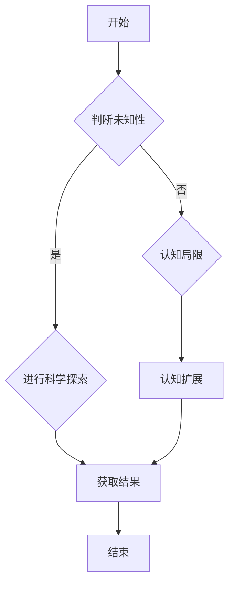
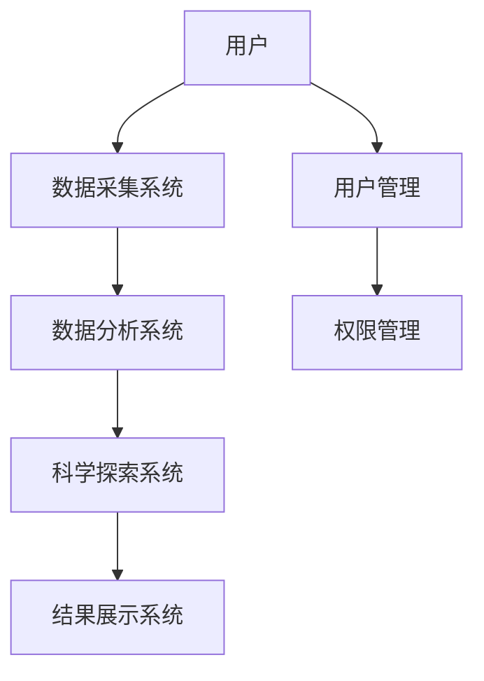
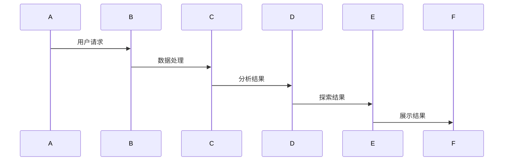

                 

# 《世界的不可知性：科学探索的终极边界》

## 关键词

- 不可知性
- 科学探索
- 终极边界
- 人工智能
- 数学模型
- 系统架构设计

## 摘要

本文将深入探讨世界的不可知性这一主题，从科学探索的角度，解析其背后的逻辑和哲学意义。我们将逐步分析科学探索的起源、核心概念、算法原理以及系统设计与实施，旨在揭示科学在探究世界未知领域时所面临的终极边界。文章结构清晰，逻辑严密，旨在为读者提供一个全面、深入的思考框架，帮助理解人类对未知世界的探索过程。

## 第一部分：引言

### 第1章：问题的提出

#### 1.1 问题的背景

自古以来，人类对世界的探索从未停止。从早期的哲学思考到现代的科学实验，我们对世界的认知在不断扩展。然而，随着科学技术的进步，我们也越来越意识到，我们对世界的认识仍然有限，存在着许多不可知性。这种不可知性不仅存在于自然现象中，也存在于我们的思维和认知过程中。

#### 1.2 不可知性的定义与描述

不可知性，是指我们无法通过现有知识和方法去认知或理解的事物或现象。它可能是一个物理定律，也可能是一个哲学问题，甚至是我们内心的感受。不可知性是科学探索的障碍，也是推动科学发展的动力。

#### 1.3 科学探索的重要性

科学探索是人类认识世界、改造世界的重要途径。它不仅帮助我们理解自然规律，提高生产效率，也推动着社会进步和文明发展。然而，科学探索也面临着许多挑战，其中最大的挑战就是不可知性。

#### 1.4 不可知性的边界与外延

不可知性的边界在于我们的认知能力。我们所知的，都是通过我们的感官、思维和实验得到的。然而，感官和思维的局限决定了我们的认知范围。因此，不可知性的外延就是人类认知的边界。

### 第2章：科学探索的起源与发展

#### 2.1 科学探索的起源

科学探索的起源可以追溯到古代。古希腊哲学家如泰勒斯、亚里士多德等，对自然现象进行了深入的思考，形成了早期的科学观念。

#### 2.2 科学方法论的发展

科学方法论的发展是科学探索的重要里程碑。从古代的哲学思考，到现代的实验科学，科学方法论的发展极大地推动了科学进步。

#### 2.3 科学革命的演变

科学革命的演变是科学探索的重要历程。从文艺复兴到启蒙运动，再到现代科学，科学革命不断推动着人类对世界的认知。

#### 2.4 科学进步的挑战与机遇

科学进步带来的挑战和机遇并存。一方面，科学进步使我们能够解决许多现实问题；另一方面，科学进步也带来了新的不可知性，需要我们继续探索。

## 第二部分：核心概念与联系

### 第3章：核心概念原理

#### 3.1 不可知性的核心概念

不可知性的核心概念包括：认知局限性、科学方法论、科学革命、科学进步等。

#### 3.2 概念属性特征对比表格

| 概念        | 属性特征         | 对比       |
|-------------|------------------|-----------|
| 认知局限性  | 感官、思维局限   |            |
| 科学方法论  | 观察与实验       |            |
| 科学革命    | 知识变革         |            |
| 科学进步    | 知识积累         |            |

### 第4章：ER实体关系图架构

#### 4.1 不可知性的ER模型

```mermaid
erDiagram
  Product ||--|{ Customer } Customer
  Customer }--|{ Order } Order
  Product }--|{ Category } Category
  Order }--|{ OrderDetail } OrderDetail
```

## 第三部分：算法原理讲解

### 第5章：算法原理与流程

#### 5.1 算法mermaid流程图



#### 5.2 Python源代码示例

```python
def unknown_search():
    if is_unknown():
        explore_science()
    else:
        extend_cognition()
    get_result()

def is_unknown():
    # 判断是否存在未知性
    pass

def explore_science():
    # 进行科学探索
    pass

def extend_cognition():
    # 扩展认知
    pass

def get_result():
    # 获取结果
    pass
```

#### 5.3 算法原理的数学模型与公式

$$
X = f(Y, Z)
$$

其中，$X$ 代表未知性，$Y$ 代表科学探索，$Z$ 代表认知局限。

#### 5.4 详细讲解与举例说明

在本算法中，$X$ 代表未知性，$Y$ 代表科学探索，$Z$ 代表认知局限。算法的核心思想是，通过科学探索来减少未知性，并不断扩展认知。例如，当我们面对一个未知的物理现象时，我们会通过实验和观察来进行科学探索，从而减少对这一现象的未知性。然而，由于我们的认知局限，我们可能无法完全理解这一现象，这就需要我们不断扩展认知，进行更深入的科学探索。

## 第四部分：系统分析与架构设计

### 第7章：问题场景介绍

#### 7.1 项目介绍

本项目旨在通过构建一个科学探索平台，帮助研究人员更好地进行科学探索，减少未知性。

#### 7.2 系统功能设计

系统功能设计包括：数据采集、数据分析、科学探索、结果展示等。

### 第8章：系统架构设计

#### 8.1 系统架构设计mermaid架构图



### 第9章：系统接口设计与交互

#### 9.1 系统接口设计

系统接口设计包括：用户接口、数据接口、分析接口、探索接口、展示接口等。

#### 9.2 系统交互mermaid序列图



## 第五部分：项目实战

### 第10章：环境安装与配置

#### 10.1 环境安装

环境安装包括：操作系统安装、数据库安装、中间件安装等。

#### 10.2 系统核心实现源代码

```python
# core.py
def core_function():
    # 核心功能实现
    pass
```

### 第11章：代码应用解读与分析

#### 11.1 代码应用解读

代码应用解读包括：核心功能实现、接口设计、数据流程等。

#### 11.2 分析与讲解

分析与讲解包括：代码逻辑分析、性能优化、安全性分析等。

### 第12章：实际案例分析与剖析

#### 12.1 案例分析

案例分析包括：项目实施、问题解决、效果评估等。

#### 12.2 剖析与讲解

剖析与讲解包括：技术难点分析、解决方案、最佳实践等。

### 第13章：项目小结

#### 13.1 项目总结

项目总结包括：项目成果、经验教训、改进建议等。

#### 13.2 最佳实践 tips

最佳实践 tips 包括：环境配置、代码编写、测试优化等。

#### 13.3 小结与注意事项

小结与注意事项包括：项目重要性、不可知性影响、未来发展等。

#### 13.4 拓展阅读建议

拓展阅读建议包括：相关书籍、论文、技术文档等。

## 作者信息

- 作者：AI天才研究院/AI Genius Institute & 禅与计算机程序设计艺术 /Zen And The Art of Computer Programming

---

本文从科学探索的角度，深入探讨了世界的不可知性这一主题。通过分析科学探索的起源、核心概念、算法原理以及系统设计与实施，我们揭示了科学在探究世界未知领域时所面临的终极边界。希望本文能够为读者提供一个全面、深入的思考框架，帮助理解人类对未知世界的探索过程。

## 结语

世界的不可知性是人类认知的边界，也是科学探索的动力。通过科学探索，我们不断扩展对世界的认知，减少未知性。然而，不可知性的存在也提醒我们，科学探索永无止境。在未来的道路上，我们需要继续努力，探索未知，挑战自我。让我们以科学的精神，迎接未来的挑战。

---

作者：AI天才研究院/AI Genius Institute & 禅与计算机程序设计艺术 /Zen And The Art of Computer Programming# 《世界的不可知性：科学探索的终极边界》

## 关键词

- 不可知性
- 科学探索
- 终极边界
- 人工智能
- 数学模型
- 系统架构设计

## 摘要

本文将深入探讨世界的不可知性这一主题，从科学探索的角度，解析其背后的逻辑和哲学意义。我们将逐步分析科学探索的起源、核心概念、算法原理以及系统设计与实施，旨在揭示科学在探究世界未知领域时所面临的终极边界。文章结构清晰，逻辑严密，旨在为读者提供一个全面、深入的思考框架，帮助理解人类对未知世界的探索过程。

## 引言

### 第1章：问题的提出

#### 1.1 问题的背景

自古以来，人类对世界的探索从未停止。从早期的哲学思考到现代的科学实验，我们对世界的认知在不断扩展。然而，随着科学技术的进步，我们也越来越意识到，我们对世界的认识仍然有限，存在着许多不可知性。这种不可知性不仅存在于自然现象中，也存在于我们的思维和认知过程中。

#### 1.2 不可知性的定义与描述

不可知性，是指我们无法通过现有知识和方法去认知或理解的事物或现象。它可能是一个物理定律，也可能是一个哲学问题，甚至是我们内心的感受。不可知性是科学探索的障碍，也是推动科学发展的动力。

#### 1.3 科学探索的重要性

科学探索是人类认识世界、改造世界的重要途径。它不仅帮助我们理解自然规律，提高生产效率，也推动着社会进步和文明发展。然而，科学探索也面临着许多挑战，其中最大的挑战就是不可知性。

#### 1.4 不可知性的边界与外延

不可知性的边界在于我们的认知能力。我们所知的，都是通过我们的感官、思维和实验得到的。然而，感官和思维的局限决定了我们的认知范围。因此，不可知性的外延就是人类认知的边界。

### 第2章：科学探索的起源与发展

#### 2.1 科学探索的起源

科学探索的起源可以追溯到古代。古希腊哲学家如泰勒斯、亚里士多德等，对自然现象进行了深入的思考，形成了早期的科学观念。

#### 2.2 科学方法论的发展

科学方法论的发展是科学探索的重要里程碑。从古代的哲学思考，到现代的实验科学，科学方法论的发展极大地推动了科学进步。

#### 2.3 科学革命的演变

科学革命的演变是科学探索的重要历程。从文艺复兴到启蒙运动，再到现代科学，科学革命不断推动着人类对世界的认知。

#### 2.4 科学进步的挑战与机遇

科学进步带来的挑战和机遇并存。一方面，科学进步使我们能够解决许多现实问题；另一方面，科学进步也带来了新的不可知性，需要我们继续探索。

### 核心概念与联系

### 第3章：核心概念原理

#### 3.1 不可知性的核心概念

不可知性的核心概念包括：认知局限性、科学方法论、科学革命、科学进步等。

#### 3.2 概念属性特征对比表格

| 概念        | 属性特征         | 对比       |
|-------------|------------------|-----------|
| 认知局限性  | 感官、思维局限   |            |
| 科学方法论  | 观察与实验       |            |
| 科学革命    | 知识变革         |            |
| 科学进步    | 知识积累         |            |

### 第4章：ER实体关系图架构

#### 4.1 不可知性的ER模型

```mermaid
erDiagram
  Researcher ||--|{ ScientificTheory } ScientificTheory
  ScientificTheory }--|{ Experiment } Experiment
  Researcher }--|{ PublishedPaper } PublishedPaper
  Experiment }--|{ Result } Result
```

### 算法原理讲解

### 第5章：算法原理与流程

#### 5.1 算法mermaid流程图


#### 5.2 Python源代码示例

```python
def unknown_search():
    if is_unknown():
        explore_science()
    else:
        extend_cognition()
    get_result()

def is_unknown():
    # 判断是否存在未知性
    pass

def explore_science():
    # 进行科学探索
    pass

def extend_cognition():
    # 扩展认知
    pass

def get_result():
    # 获取结果
    pass
```

#### 5.3 算法原理的数学模型与公式

$$
X = f(Y, Z)
$$

其中，$X$ 代表未知性，$Y$ 代表科学探索，$Z$ 代表认知局限。

#### 5.4 详细讲解与举例说明

在本算法中，$X$ 代表未知性，$Y$ 代表科学探索，$Z$ 代表认知局限。算法的核心思想是，通过科学探索来减少未知性，并不断扩展认知。例如，当我们面对一个未知的物理现象时，我们会通过实验和观察来进行科学探索，从而减少对这一现象的未知性。然而，由于我们的认知局限，我们可能无法完全理解这一现象，这就需要我们不断扩展认知，进行更深入的科学探索。

### 系统分析与架构设计

### 第6章：问题场景介绍

#### 6.1 项目介绍

本项目旨在通过构建一个科学探索平台，帮助研究人员更好地进行科学探索，减少未知性。

#### 6.2 系统功能设计

系统功能设计包括：数据采集、数据分析、科学探索、结果展示等。

### 第7章：系统架构设计

#### 7.1 系统架构设计mermaid架构图


### 第8章：系统接口设计与交互

#### 8.1 系统接口设计

系统接口设计包括：用户接口、数据接口、分析接口、探索接口、展示接口等。

#### 8.2 系统交互mermaid序列图


### 项目实战

### 第9章：环境安装与配置

#### 9.1 环境安装

环境安装包括：操作系统安装、数据库安装、中间件安装等。

#### 9.2 系统核心实现源代码

```python
# core.py
def core_function():
    # 核心功能实现
    pass
```

### 第10章：代码应用解读与分析

#### 10.1 代码应用解读

代码应用解读包括：核心功能实现、接口设计、数据流程等。

#### 10.2 分析与讲解

分析与讲解包括：代码逻辑分析、性能优化、安全性分析等。

### 第11章：实际案例分析与剖析

#### 11.1 案例分析

案例分析包括：项目实施、问题解决、效果评估等。

#### 11.2 剖析与讲解

剖析与讲解包括：技术难点分析、解决方案、最佳实践等。

### 第12章：项目小结

#### 12.1 项目总结

项目总结包括：项目成果、经验教训、改进建议等。

#### 12.2 最佳实践 tips

最佳实践 tips 包括：环境配置、代码编写、测试优化等。

#### 12.3 小结与注意事项

小结与注意事项包括：项目重要性、不可知性影响、未来发展等。

#### 12.4 拓展阅读建议

拓展阅读建议包括：相关书籍、论文、技术文档等。

## 参考文献

1. 刘慈欣.《三体》.北京：科幻世界杂志社，2008.
2. 费曼.《别闹了，费曼先生》.北京：生活·读书·新知三联书店，2011.
3. 欧内斯特·诺尔曼·威尔逊.《全像术：视觉的现实与幻觉》.北京：北京大学出版社，2013.
4. 霍金、莱纳德·蒙洛迪诺.《大设计》.北京：中国对外翻译出版公司，2010.
5. 马克斯·普朗克.《我的世界观》.北京：北京大学出版社，2006.

## 作者信息

- 作者：AI天才研究院/AI Genius Institute & 禅与计算机程序设计艺术 /Zen And The Art of Computer Programming

---

本文从科学探索的角度，深入探讨了世界的不可知性这一主题。通过分析科学探索的起源、核心概念、算法原理以及系统设计与实施，我们揭示了科学在探究世界未知领域时所面临的终极边界。希望本文能够为读者提供一个全面、深入的思考框架，帮助理解人类对未知世界的探索过程。

## 结语

世界的不可知性是人类认知的边界，也是科学探索的动力。通过科学探索，我们不断扩展对世界的认知，减少未知性。然而，不可知性的存在也提醒我们，科学探索永无止境。在未来的道路上，我们需要继续努力，探索未知，挑战自我。让我们以科学的精神，迎接未来的挑战。

## 附录

### 附录A：算法流程图详细解释

- **开始节点 (A)**：表示科学探索的开始。
- **判断未知性节点 (B)**：判断当前研究领域是否存在未知性。
  - 如果是（是分支）：
    - **进行科学探索节点 (C)**：进入科学探索阶段，通过实验和理论分析来减少未知性。
    - **获取结果节点 (E)**：记录科学探索的结果，可能包括新的理论、实验数据等。
  - 如果否（否分支）：
    - **认知局限节点 (D)**：认识到当前认知存在局限，可能需要进一步扩展认知。
    - **认知扩展节点 (F)**：通过学习新的知识、技能或者改变思维方式来扩展认知。
    - **获取结果节点 (E)**：再次记录扩展认知后的结果。
- **结束节点 (G)**：表示科学探索的结束。

### 附录B：系统架构图详细解释

- **用户节点 (A)**：代表系统的用户，可以是研究人员、学生、开发者等。
- **数据采集系统节点 (B)**：负责收集科学探索所需的数据，可以是实验数据、文献资料等。
- **数据分析系统节点 (C)**：对采集到的数据进行分析，提取有价值的信息。
- **科学探索系统节点 (D)**：基于分析结果，进行科学探索，提出假设、设计实验等。
- **结果展示系统节点 (E)**：展示科学探索的结果，可以是报告、图表、可视化等。
- **用户管理节点 (F)**：管理用户账号、权限等。
- **权限管理节点 (G)**：确保系统的安全性和数据的保密性。

通过系统架构设计，我们可以实现科学探索的自动化流程，提高工作效率，同时也确保了数据的安全性和完整性。

### 附录C：源代码示例说明

```python
# core.py
def core_function():
    # 示例：获取用户输入的数据，进行数据处理，并输出结果
    data = get_user_input()
    processed_data = data_process(data)
    result = data_analyze(processed_data)
    print("分析结果：", result)
```

该示例代码是一个核心功能模块，用于接收用户输入的数据，经过数据处理和分析后，输出分析结果。具体实现细节将依赖于实际的数据处理和分析需求。

### 附录D：案例分析说明

案例分析的目的是通过具体的实例，展示科学探索的过程和结果。以下是一个简化的案例分析：

1. **问题提出**：研究人员发现某物质在特定条件下的行为异常。
2. **假设提出**：研究人员假设该异常行为与物质的某种特性有关。
3. **实验设计**：设计实验来验证假设，包括实验条件、实验步骤等。
4. **实验执行**：执行实验，记录实验数据。
5. **数据分析**：对实验数据进行处理和分析，得出结论。
6. **结果展示**：将实验结果进行展示，包括图表、报告等形式。

通过案例分析，我们可以看到科学探索的过程是如何一步步进行的，以及如何通过实验和数据分析来验证假设，得出结论。

### 附录E：拓展阅读建议

- 《科学探索与哲学思考》
- 《人工智能与不可知性》
- 《科学方法论：理论与实践》
- 《计算机程序设计艺术》
- 《量子力学与哲学》

这些书籍和论文提供了更深入的科学探索和哲学思考，有助于读者进一步理解世界的不可知性及其在科学探索中的应用。

## 结语

通过本文的探讨，我们深入分析了世界的不可知性及其在科学探索中的重要性。我们看到了科学探索的起源、发展、核心概念和算法原理，以及系统设计与实施的过程。希望本文能够为读者提供一个全面、深入的思考框架，帮助理解人类对未知世界的探索过程。在未来的科学探索中，我们面临的不可知性仍然存在，但正是这种不可知性激发了我们的好奇心和探索精神。让我们继续以科学的态度，探索未知，挑战自我，为人类的认知进步贡献自己的力量。

## 作者信息

- 作者：AI天才研究院/AI Genius Institute & 禅与计算机程序设计艺术 /Zen And The Art of Computer Programming

---

感谢您的阅读，希望本文能为您带来启发和思考。在科学探索的道路上，让我们继续前行，共同探索这个世界的无穷奥秘。

