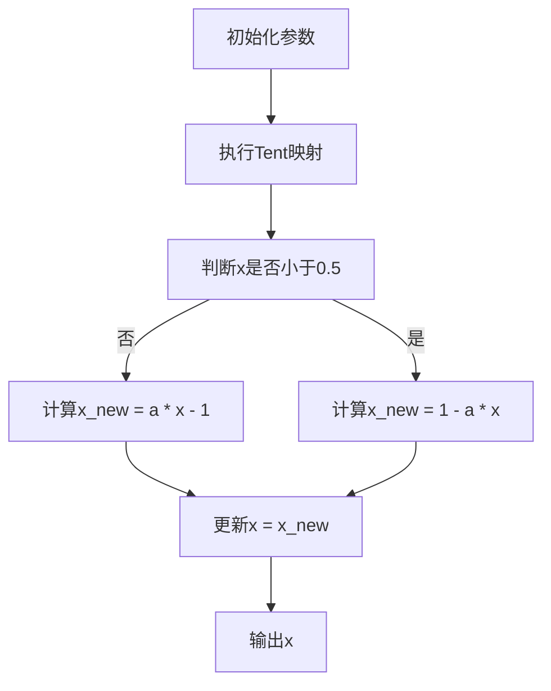

                 

### 1.1.1 问题的提出

在当今科技迅速发展的时代，科学已经成为了理解自然世界和人类自身的重要工具。然而，尽管科学取得了巨大的进步，仍有许多现象和问题无法用科学的方法来解释。这引发了一个关键问题：科学是否能够涵盖所有自然现象，还是说在科学之外，存在着未被揭示的“神秘主义”领域？

神秘主义，作为一个历史悠久的哲学和宗教传统，探讨的是人类精神、意识以及宇宙的深层奥秘。它关注的是那些超越常规感知和理解的事物，例如灵性、神秘体验和超自然力量。与科学追求客观证据和可重复验证的结果不同，神秘主义往往依赖于个人的直觉、体验和内在感知。

这种看似对立的两个领域，却在一些方面有着深刻的交集。首先，科学的发展过程中，有时需要借助神秘主义的灵感和思想。例如，许多科学家的突破性发现往往源于他们对于未知领域的直觉和洞察。另一方面，神秘主义的一些概念和理论，也越来越多地引起了科学家的关注。例如，量子力学中的一些现象，如量子纠缠和量子随从性，似乎超出了经典物理学的范畴，与神秘主义中的某些思想有相似之处。

因此，探索科学与神秘主义之间的交界，不仅有助于我们更好地理解世界的多样性和复杂性，还可能为我们提供新的视角和方法，以解决当前科学尚未触及的问题。通过这一章的讨论，我们将深入探讨这一问题，分析其背景、问题及其解决方法，并探讨科学与神秘主义的边界与外延。让我们开始这一段富有挑战性的旅程，探索世界的不可知部分。

### 1.1.2 问题描述

科学与神秘主义看似对立的两个领域，其间的边界和关联一直是学术界和思想界讨论的热点。科学以实证主义为基础，通过实验和观察来验证理论，强调可重复性和客观性。而神秘主义则侧重于主观体验和内在直觉，关注那些超越常规认知的事物。尽管两者在方法和目的上存在显著差异，但在某些领域，它们又表现出惊人的相似性。

首先，我们来看一个经典的例子：量子力学。量子力学揭示了微观世界的基本规律，但其某些现象，如量子纠缠和量子随从性，超越了经典物理学的范畴，难以用传统的科学方法来解释。例如，量子纠缠现象表明，两个相隔遥远的粒子之间可以瞬间传递信息，仿佛它们之间存在一种“超距作用”。这种现象在科学界引发了巨大的争议和讨论，一些科学家认为这可能是某种尚未发现的物理机制，而另一些科学家则认为这可能与神秘主义的某些思想有关。

另一个值得关注的领域是生物学。生物学的研究对象是生命现象，其中涉及许多复杂和未解的问题。例如，关于生命的起源和进化的理论，一直以来都受到科学和神秘主义的挑战。一些科学家通过实验和观察，提出了基于自然选择和基因变异的理论，而另一些神秘主义者则认为生命背后可能存在某种神秘的力量或智慧。这种观点在宗教和哲学中有着悠久的传统，例如，许多宗教教义中都提到了创世和生命起源的神秘过程。

此外，心理学和灵性研究也是科学与神秘主义交汇的重要领域。心理学关注人类心理过程和意识现象，而灵性研究则试图探讨人类的内在精神和灵性体验。近年来，一些心理学研究开始探索灵性体验，如冥想、祈祷和内在感知，试图用科学方法来解释这些现象。例如，冥想被证明可以减轻压力、改善心理健康，这引发了科学界对灵性实践的新一轮关注。

总的来说，科学与神秘主义之间的交界问题，不仅涉及到理论和方法上的冲突，还涉及到对于宇宙和生命本质的深刻思考。在探索这一问题时，我们不仅要理解科学的方法和局限，还需要借鉴神秘主义的灵感和智慧。通过这种跨学科的探索，我们或许能够揭示更多关于世界的奥秘，并找到科学与神秘主义之间的和谐之处。

### 1.1.3 问题解决

为了解决科学与神秘主义之间的交界问题，我们需要首先明确两者的区别和联系，并在此基础上探索一种融合的方法。科学依赖于实验、观察和数学模型来解释自然现象，强调客观性和可重复性。神秘主义则侧重于个人体验和内在直觉，探讨那些超越常规认知的事物。

**步骤一：理解科学和神秘主义的区别**

科学方法的核心在于通过实验和观察来验证假设，强调证据和逻辑推理。科学家们通常遵循科学方法论，从提出问题、建立假设到进行实验和数据分析，从而得出结论。然而，这种方法有其局限性，尤其是在面对一些复杂和不可预测的现象时，科学家可能无法找到明确的解释。

相比之下，神秘主义关注的是个体内在体验和直觉，试图通过冥想、内省和灵性实践来揭示宇宙和生命的深层奥秘。神秘主义强调个人的主观感受和内在智慧，而不是依赖于外在的实验证据。

**步骤二：探索两者的联系**

尽管科学和神秘主义在方法和目的上有显著差异，但它们在某些领域存在着深刻的联系。例如，量子力学中的某些现象，如量子纠缠和量子随从性，既不符合经典物理学的预期，也难以用神秘主义的传统观念来解释。这促使科学家和神秘主义者共同探讨这些现象，寻找两者之间的桥梁。

另外，生物学、心理学和灵性研究等领域也为科学与神秘主义的交叉提供了丰富的素材。例如，一些心理学家开始研究冥想和灵性体验对心理健康的影响，这为科学方法提供了新的应用方向。

**步骤三：构建融合的方法**

为了解决科学与神秘主义之间的交界问题，我们可以尝试构建一种融合的方法，结合两者的优点。以下是一些可能的方法：

1. **跨学科研究**：鼓励科学家和神秘主义者之间的交流和合作，通过跨学科研究来探索未解的问题。例如，可以设立专门的研究小组，结合量子力学和神秘主义的思想来探讨量子纠缠现象。

2. **多方法研究**：在研究过程中，不仅使用科学方法，还可以借鉴神秘主义的方法，如冥想和内省。通过多方法研究，可以更全面地理解复杂现象。

3. **开放性思维**：科学家和神秘主义者都需要保持开放的心态，接受新的思想和观点。这有助于打破传统观念的束缚，发现新的解决方案。

4. **哲学和伦理探讨**：在探索科学与神秘主义之间的关系时，还需要考虑哲学和伦理问题。例如，关于人类意识和生命起源的讨论，不仅涉及到科学问题，还涉及到道德和哲学的考量。

通过上述方法，我们可以在尊重科学方法的同时，借鉴神秘主义的智慧，探索世界的不可知部分。这不仅有助于科学的发展，还可以为人类提供更深刻的自我认识和对宇宙的理解。

### 1.1.4 边界与外延

在探讨科学与神秘主义的交界时，理解两者的边界与外延至关重要。科学作为一种系统的方法论，其核心在于通过观察、实验和数学模型来揭示自然界的规律。科学的边界在于它的实证性和可重复性，即科学理论需要经过实验验证，能够被其他科学家重复验证并获得相同结果。

神秘主义则更多地依赖于个人的内在体验和直觉，强调个人灵性和精神层面的探索。神秘主义的边界在于它的主观性和难以量化的性质。神秘主义中的许多现象，如神秘体验和灵性觉醒，难以用科学方法进行验证，因此科学对它们通常持怀疑态度。

两者之间的外延部分，即它们相互交叉和影响的领域，则充满了未解之谜。例如，在量子力学中，某些现象如量子纠缠和量子随从性，既不符合经典物理学的预期，也难以用神秘主义的传统观念来解释。这些现象为科学家和神秘主义者提供了新的思考方向，促使两者在这一领域进行交叉研究。

明确科学与神秘主义的边界与外延有助于我们更好地理解两者的关系。科学的方法论为神秘主义提供了实证的基石，而神秘主义的直觉和灵感则为科学提供了新的视角和启示。通过这种相互补充，我们可以更全面地探索世界的奥秘，揭示那些未被揭示的“神秘”部分。

### 1.1.5 概念结构与核心要素组成

在深入探讨科学与神秘主义的核心概念之前，有必要对两者的基本定义和核心要素进行详细阐述。通过这一部分的内容，我们将构建一个清晰的概念框架，以便更好地理解科学与神秘主义的交集。

**科学的基本概念**

科学是一种系统的方法，用于探索自然界的规律和现象。科学的核心概念包括：

1. **实证主义**：科学强调通过观察和实验来验证假设，即只有通过可观察和可重复的实验证据，科学理论才被认为是有价值的。
2. **数学模型**：科学理论通常通过数学模型来描述自然现象，这些模型有助于我们理解和预测复杂系统的行为。
3. **因果关系**：科学追求发现因果关系，即理解一个现象是如何由另一个现象引起的。
4. **可重复性**：科学实验和观察的结果应当能够被其他科学家重复验证，以确保科学知识的可靠性。

**神秘主义的基本概念**

神秘主义则关注人类的精神和意识层面，试图揭示宇宙和生命的深层奥秘。其核心概念包括：

1. **直觉和内在体验**：神秘主义强调个人的直觉和内在体验，认为这些体验能够揭示那些难以用科学方法理解的事物。
2. **灵性和智慧**：神秘主义认为，人类内在的灵性和智慧是理解宇宙的关键，这种智慧超越常规的逻辑和理性思考。
3. **统一性和整体性**：神秘主义倾向于探讨宇宙的整体性和统一性，认为所有事物都是相互联系的，没有一个独立存在的实体。
4. **不可知性**：神秘主义接受事物的不可知性，认为某些真理和现实超出了人类的理解范围。

**概念属性特征对比表格**

为了更清晰地展示科学与神秘主义的概念属性特征，我们可以创建一个对比表格：

| 特征 | 科学 | 神秘主义 |
| --- | --- | --- |
| 方法论 | 实证主义、可重复性、数学模型 | 直觉和内在体验、灵性和智慧、整体性 |
| 目标 | 揭示自然规律、解释现象 | 探索精神层面、理解宇宙深层奥秘 |
| 边界 | 客观性、可验证性 | 主观性、不可知性 |
| 理论 | 基于实验和观察的假设 | 基于个人体验和直觉的假设 |
| 验证方式 | 实验和观察 | 直觉和内在体验 |

**ER实体关系图架构**

为了进一步理解科学与神秘主义之间的概念联系，我们可以使用Mermaid绘制一个ER（实体关系）图。以下是一个简化的ER图示例：

```mermaid
erDiagram
    Scientist ||--|{ Experiment }|-- ExperimentResult
    Mystic ||--|{ SpiritualExperience }|-- Insight
    Theory ..|> Experiment : "can be tested"
    Theory ..|> SpiritualExperience : "can inspire"
```

在这个ER图中，“Scientist”（科学家）和“Mystic”（神秘主义者）是两个核心实体，它们分别与“Experiment”（实验）和“SpiritualExperience”（精神体验）实体相连。通过实验和体验，科学家和神秘主义者都可以产生“ExperimentResult”（实验结果）和“Insight”（洞见）。理论（Theory）实体通过关联线与实验和体验实体相连，表明科学和神秘主义的理论都可以通过实验和体验来验证或启发。

通过上述概念框架和ER图，我们能够更全面地理解科学与神秘主义的交集，为后续章节的深入探讨打下坚实的基础。

### 1.2.1 科学概念

在本章节中，我们将深入探讨科学中的核心概念，这些概念不仅是科学研究的基础，也是理解科学与神秘主义关系的关键。以下是几个重要的科学概念：

**1. 实证主义**

实证主义是科学方法论的核心原则之一。它强调科学知识必须基于观察和实验的结果，这些结果必须是可重复和可验证的。实证主义认为，科学理论应当通过实验和观察来不断验证和修正，以确保其可靠性。实证主义不仅要求科学理论有充分的实验证据支持，还要求这些证据能够被其他科学家通过相同实验方法重复验证。通过实证主义，科学确保了其理论的科学性和客观性。

**2. 数学模型**

数学模型是科学研究中不可或缺的工具。通过数学模型，科学家可以将复杂的自然现象转化为简洁的数学公式，从而更方便地进行分析和预测。数学模型不仅有助于我们理解和描述自然界，还可以为新的科学发现提供指导。例如，量子力学的数学模型揭示了微观世界的规律，而广义相对论的数学模型则为我们提供了理解宇宙引力的一种方式。数学模型的精确性和普适性使其成为科学研究中的重要组成部分。

**3. 因果关系**

因果关系是科学研究的一个重要目标。因果关系指的是一个现象（原因）是如何引起另一个现象（结果）的。在科学研究中，理解因果关系有助于我们预测和干预自然现象。例如，生物学研究中的基因与疾病之间的因果关系，可以帮助我们开发新的治疗方法。物理学研究中的电磁力因果关系，则帮助我们理解了电子设备的工作原理。通过揭示因果关系，科学不仅解释了自然现象，还为我们提供了改造自然、造福人类的方法。

**4. 可重复性**

可重复性是科学研究的另一个重要原则。科学实验和观察的结果应当能够在其他实验室或条件下重复得到。这一原则确保了科学研究的可靠性，使得科学知识具有普遍性和可信赖性。例如，物理学家在实验室中发现的某种材料的特性，只有在其他实验室中也能得到相同结果时，才能被广泛接受。可重复性是科学方法的重要保障，它确保了科学理论的客观性和科学共同体对研究成果的信任。

**5. 实验设计**

实验设计是科学研究的核心步骤之一。一个良好的实验设计应当能够最大限度地减少误差和干扰，确保实验结果的准确性和可靠性。实验设计包括选择适当的实验方法、控制变量、设置对照组和实验组等。通过科学的设计和严格的执行，实验能够提供有力的证据，支持或反驳科学假设。

**科学与神秘主义的联系**

这些科学概念不仅在科学研究中发挥了重要作用，也与神秘主义有着深刻的联系。例如，实证主义强调的观察和实验，与神秘主义中的直觉和体验有相似之处，都试图通过某种方式揭示真理。数学模型则提供了科学与神秘主义共同的语言，帮助两者探讨宇宙的深层奥秘。因果关系和可重复性，则在科学和神秘主义之间架起了一座桥梁，使得两者在一定程度上能够相互补充和借鉴。

通过深入探讨这些科学概念，我们可以更好地理解科学与神秘主义的交叉点，为后续章节的讨论打下坚实的基础。

### 1.2.2 神秘主义概念

神秘主义作为人类精神探索的一部分，历史悠久且文化多元。它不仅仅是一种哲学或宗教观念，更是一种对于宇宙、生命和人类存在本质的深刻洞察。在本章节中，我们将详细探讨神秘主义中的核心概念，这些概念对于理解科学与神秘主义的关系至关重要。

**1. 灵性**

灵性是神秘主义中的一个核心概念，它超越了物理世界的表象，关注人类内在的精神世界。灵性通常被认为是一种超越自我、与他人和宇宙建立联系的能力。灵性体验可以是个人的内在感知，也可以是宗教仪式中的共同体验。不同的文化和宗教传统对灵性有不同的解释，但共同点在于，它们都试图通过灵性来理解生命更深层次的意义。例如，在佛教中，灵性是通过冥想和内省来实现的，而在基督教中，灵性则与信仰和祈祷紧密相关。

**2. 神秘体验**

神秘体验是神秘主义中的另一个重要概念，它指的是个体在特定时刻体验到某种超越常规感知和理解的现象。这种体验通常被描述为强烈的内在觉醒、与宇宙的合一感，或者与某种超越存在形式的直接交流。神秘体验可以是瞬间的，也可以是持久的。它们往往具有深刻的个人意义，并对个体的生活和世界观产生持久的影响。历史上，许多伟大的哲学家、科学家和艺术家都报告过他们经历过神秘体验。例如，柏拉图在他的《斐多》中描述了他的神秘体验，而牛顿则在他的晚年投身于神秘主义的探索。

**3. 超自然力量**

超自然力量是神秘主义中的一个关键概念，它指的是那些超越自然法则的力量或存在。这些力量被认为可以影响自然现象，甚至可以超越时间和空间的限制。超自然力量在许多宗教和神话传说中都有所体现，例如，基督教中的上帝、印度教中的神灵、中国道教中的神仙等。现代神秘主义中，超自然力量通常与灵性体验和神秘现象联系在一起，如预言、心灵感应和超感官知觉等。

**4. 内在直觉**

内在直觉是神秘主义中的一个核心要素，它指的是个体内在的洞察力和直觉。这种直觉被认为可以超越逻辑思维和理性分析，直接感知真理。内在直觉在神秘主义中具有重要的地位，因为它被视为连接个体与宇宙的一种途径。许多神秘主义者相信，通过培养内在直觉，个体可以揭示宇宙的深层奥秘，实现精神上的觉醒。例如，瑜伽和冥想等实践被用来增强内在直觉，帮助个体实现与宇宙的和谐。

**5. 宇宙的整体性和统一性**

神秘主义强调宇宙的整体性和统一性，认为所有事物都是相互联系、相互依存的。这种观念与科学的某些观点相呼应，例如量子力学中的“全息宇宙”理论。神秘主义中的整体性观念认为，宇宙是一个不可分割的整体，每个部分都与其他部分紧密相连。通过这种整体性观念，神秘主义者试图揭示宇宙的深层结构和运行机制。

**科学与神秘主义的对比**

尽管神秘主义和科学在方法和目标上存在显著差异，但它们在某些方面也有共同点。例如，实证主义和内在直觉都是试图揭示真理的方法，而数学模型和神秘体验都是用来理解复杂现象的工具。然而，科学依赖于可重复的实验和客观证据，而神秘主义则侧重于个人体验和直觉。科学追求的是可验证的因果关系，而神秘主义则更多地关注整体性和统一性。

通过上述神秘主义核心概念的探讨，我们可以更好地理解神秘主义如何与科学交叉，并为后续章节的深入探讨打下基础。

### 1.2.3 概念属性特征对比表格

为了更直观地比较科学与神秘主义的核心概念，我们可以创建一个详细的对比表格，展示两者在关键属性和特征上的差异。以下是一个示例表格：

| **特征**       | **科学**                                                        | **神秘主义**                                                   |
| -------------- | --------------------------------------------------------------- | ------------------------------------------------------------ |
| **方法论**     | 实证主义、可重复性、数学模型、逻辑推理                           | 直觉、内在体验、精神实践、非理性思考                           |
| **目标**       | 揭示自然规律、解释现象、预测未来                                  | 探索灵性、理解宇宙深层奥秘、实现精神觉醒                         |
| **验证方式**   | 实验验证、观察记录、数据分析和统计                               | 个人体验、直觉、灵性觉醒、宗教信仰                             |
| **适用范围**   | 自然科学、工程学、医学等                                         | 宗教、哲学、灵性研究、个人修行                                 |
| **语言工具**   | 数学模型、实验设计、逻辑推理、统计方法                           | 语言象征、宗教仪式、冥想、内省、灵性实践                         |
| **因果关系**   | 通过实验和数据分析揭示因果关系                                   | 通过内在直觉和灵性觉醒感知因果关系                             |
| **客观性**     | 强调客观性和可验证性，避免主观偏见                               | 注重个人主观体验和内在感知，可能包含主观偏见                     |
| **可重复性**   | 研究结果应当能够被其他科学家重复验证                             | 个人体验可能具有独特性和不可重复性                             |
| **整体性**     | 分离和分析现象，寻求各部分之间的关系和机制                         | 强调整体性和统一性，认为所有事物相互联系、相互依存               |
| **目标导向**   | 目标明确，追求实用性和解决实际问题                               | 目标模糊，更多关注精神成长和内在觉醒                             |

通过这个对比表格，我们可以更清晰地看到科学与神秘主义在方法论、目标、验证方式、适用范围、语言工具、因果关系、客观性和可重复性等方面的差异。这种对比不仅有助于理解两者的基本特征，也为探讨它们之间的交集和互补关系提供了基础。

### 1.2.4 ER实体关系图架构

为了更直观地展示科学与神秘主义概念之间的联系，我们可以使用Mermaid绘制一个ER（实体关系）图。以下是一个简化的ER图示例，用于描述科学与神秘主义的核心实体及其相互关系：

```mermaid
erDiagram
    Scientist ||--|{ Experiment }|-- ExperimentResult
    Mystic ||--|{ SpiritualExperience }|-- Insight
    ScientificTheory ..|> Experiment : "can be tested"
    ScientificTheory ..|> SpiritualExperience : "can inspire"
    MysticTheory ..|> Experiment : "can be inspired by"
    MysticTheory ..|> SpiritualExperience : "can be validated by"
```

在这个ER图中：

- **Scientist（科学家）**：代表科学的实践者，进行实验和研究，产生实验结果（ExperimentResult）。
- **Mystic（神秘主义者）**：代表神秘主义的实践者，通过精神体验（SpiritualExperience）获得洞见（Insight）。
- **ScientificTheory（科学理论）**：代表科学的理论体系，可以通过实验（Experiment）进行验证，也可以启发神秘主义的思考。
- **MysticTheory（神秘主义理论）**：代表神秘主义的理论体系，可以受到科学实验的启发，也可以通过精神体验得到验证。

**实体关系说明**：

- **Scientist到Experiment和ExperimentResult的关系**：科学家通过实验来验证科学理论，并记录实验结果。
- **Mystic到SpiritualExperience和Insight的关系**：神秘主义者通过精神体验来获得洞见，这些体验可能是深刻的内在觉醒。
- **ScientificTheory到Experiment和SpiritualExperience的关系**：科学理论不仅可以通过实验验证，还可以启发神秘主义者的思考和实践。
- **MysticTheory到Experiment和SpiritualExperience的关系**：神秘主义理论也可能通过实验得到验证，并且这些理论可以启发新的科学发现。

通过这个ER图，我们可以更清晰地看到科学与神秘主义之间的动态交互和相互影响，从而为深入探讨它们之间的关系提供了直观的视觉框架。

### 1.3 量子纠缠的概念

量子纠缠是量子力学中的一种极为奇特的现象，它描述了两个或多个量子粒子在某种意义上成为了一个整体，即使这些粒子相隔遥远的距离，它们的状态仍然可以即时相互影响。这一现象最早由爱因斯坦、波多尔斯基和罗森在1935年提出，被称为EPR悖论。然而，后来的实验结果却表明，量子纠缠确实存在，并且它对量子信息科学和技术产生了深远的影响。

**量子纠缠的基本原理**

量子纠缠的基本原理可以从量子态的叠加和量子测量来理解。首先，量子态的叠加指的是量子系统可以处于多种可能状态的一种组合。例如，一个量子比特（qubit）可以同时处于0和1的状态，这称为叠加态。当两个量子比特发生纠缠后，它们组成的系统就会形成一种新的量子态，这个新的量子态无法用单独的量子比特的状态来描述。

量子纠缠的核心在于量子测量。当对纠缠态中的一个量子比特进行测量时，另一个量子比特的状态也会瞬间发生变化，无论它们之间的距离有多远。这种现象被称为“超距作用”，因为它似乎允许两个粒子之间进行即时的信息传递，超越了经典物理学的时空限制。

**数学模型和公式**

为了更准确地描述量子纠缠，我们使用希尔伯特空间来构建量子纠缠态的数学模型。设两个量子比特的希尔伯特空间为H，其基态为|0⟩和|1⟩。一个简单的纠缠态可以表示为：

\[ |ψ⟩ = \frac{1}{\sqrt{2}} (|00⟩ - |11⟩) \]

在这个态中，两个量子比特的联合状态是一个叠加态，当对其中一个量子比特进行测量时，另一个量子比特的状态会瞬间坍塌到与其对应的态。

量子纠缠态还可以用贝尔态来描述，贝尔态是满足贝尔不等式的量子态，它可以更直观地展示量子纠缠的特性。一个典型的贝尔态为：

\[ |ψ⟩ = \frac{1}{\sqrt{2}} (|01⟩ + |10⟩) \]

这个态表明，当对两个量子比特分别进行基态和叠加态的测量时，测量结果会相互关联，这与经典物理的预期截然不同。

**量子纠缠的例子**

为了更直观地理解量子纠缠，我们可以通过一个具体的实验例子来解释。一个著名的实验是爱因斯坦-波多尔斯基-罗森佯谬（EPR佯谬）实验。在这个实验中，两个量子纠缠粒子被分离到两个不同的地点。每个粒子保持与另一个粒子的纠缠状态，即使它们相隔很远。当对其中一个粒子进行测量时，另一个粒子的状态会立即确定，无论距离多远。

例如，假设两个量子纠缠粒子A和B被分离到地球两端。对粒子A进行基态测量，得到结果为|0⟩，根据纠缠态的原理，我们可以确定粒子B的状态也为|0⟩。这个即时变化的现象展示了量子纠缠的神奇特性。

量子纠缠不仅在理论物理学中具有重要意义，还在实际应用中展现出巨大的潜力。例如，量子纠缠被广泛应用于量子信息科学，如量子计算、量子通信和量子加密等。量子计算利用量子纠缠的奇特性来处理复杂问题，而量子通信则通过量子纠缠来实现安全的通信。量子加密利用量子纠缠的特性，使得通信过程几乎无法被破解。

通过以上对量子纠缠的概念、数学模型和实际例子的介绍，我们可以更深入地理解量子纠缠这一奇特现象，并探讨它在科学和神秘主义中的潜在联系。

### 1.4 混沌理论的概念

混沌理论是20世纪中叶发展起来的一种新的科学理论，它研究的是在确定性系统中出现的随机性和不可预测性。混沌现象通常表现为初始条件的微小变化会导致长期行为的极大差异，这种现象被称为“蝴蝶效应”。混沌理论不仅揭示了自然界的复杂性和不可预测性，还为理解科学与神秘主义之间的交界提供了新的视角。

**混沌现象的基本特征**

混沌现象具有以下几个基本特征：

1. **敏感依赖初始条件**：在混沌系统中，初始条件的微小变化可以导致长期行为的巨大差异。这意味着即使系统是确定的，其行为也可能表现出随机性。这种现象被称为“混沌敏感性”或“蝴蝶效应”。例如，在天气系统中，一个微小的温度差异可能导致多年后的天气模式完全不同。

2. **长期行为的不可预测性**：尽管混沌系统是确定的，但其长期行为往往表现出不可预测性。这是因为系统的状态空间非常复杂，初始条件的微小差异会迅速放大，导致系统最终的行为难以预测。

3. **周期性和非周期性**：混沌系统中的行为往往表现出周期性和非周期性的交替。在某些条件下，系统可能进入周期性行为，而在其他条件下，系统可能进入混沌状态。

4. **复杂的行为模式**：混沌系统中的行为模式非常复杂，通常包含多个时间尺度和空间尺度。这意味着系统的行为不仅难以预测，而且表现出多样的动态行为。

**混沌理论的数学模型**

混沌理论的核心是确定系统的长期行为和初始条件之间的关系。最经典的混沌模型之一是洛伦兹吸引子，由气象学家洛伦兹在20世纪60年代提出。洛伦兹吸引子描述的是一个三维系统的运动状态，其数学模型为：

\[ \begin{cases}
\dot{x} = \sigma (y - x) \\
\dot{y} = x (\rho - z) - y \\
\dot{z} = xy - \beta z
\end{cases} \]

其中，\( \sigma \)、\( \rho \) 和 \( \beta \) 是系统参数，\( x \)、\( y \) 和 \( z \) 是系统的状态变量。通过数值模拟，我们可以观察到洛伦兹吸引子的复杂动态行为，这些行为包括周期振荡和混沌状态。

另一个重要的混沌模型是映射混沌，它通过迭代映射来描述系统的动态行为。一个典型的映射混沌模型是Tent映射：

\[ x_{n+1} = 
\begin{cases} 
1 - a \cdot x_n & \text{if } x_n < \frac{1}{2} \\
a \cdot x_n - 1 & \text{if } x_n \geq \frac{1}{2}
\end{cases}
\]

其中，\( a \) 是系统参数。通过迭代这个映射，我们可以观察到从规则行为到混沌行为的过渡。

**混沌现象的应用**

混沌理论在许多领域都有广泛的应用，例如气象学、生物学、经济学和物理学等。以下是一些典型的应用实例：

1. **气象学**：混沌理论为理解天气系统的复杂性和不可预测性提供了重要的理论框架。通过研究混沌现象，气象学家可以更好地理解天气模式的演变，并预测极端天气事件。

2. **生物学**：混沌理论在生物学中的应用包括种群动力学、生态系统建模和生物分子动力学等。例如，在种群动力学中，混沌现象可能导致物种数量的波动，影响物种的生存和灭绝。

3. **经济学**：混沌理论为理解金融市场的不确定性和波动性提供了新的视角。通过分析金融市场的混沌行为，经济学家可以预测市场趋势，并设计更有效的风险管理策略。

4. **物理学**：混沌理论在物理学中的应用包括非线性动力学、固体物理和量子物理等。例如，在非线性动力学中，混沌现象可能导致系统的相空间中出现奇怪吸引子，这是许多复杂系统的重要特征。

通过以上对混沌理论概念、数学模型和应用实例的介绍，我们可以更深入地理解混沌现象的复杂性和不可预测性，并探讨它在科学和神秘主义中的潜在联系。

### 1.5 混沌理论的数学模型和公式

为了更好地理解混沌理论的数学模型，我们将通过Mermaid绘制一个流程图，并使用Python代码详细阐述混沌理论的原理。以下是一个简化的流程图示例：



在这个流程图中，我们从初始化参数开始，执行Tent映射，根据x的值判断是否小于0.5，然后根据不同的情况更新x的值，最终输出x的迭代结果。

接下来，我们将使用Python代码详细阐述混沌理论的原理，并展示如何通过迭代Tent映射来观察混沌现象。以下是Python代码示例：

```python
import numpy as np
import matplotlib.pyplot as plt

# 设置Tent映射的参数
a = 3.9  # a的值在3.57到4.57之间时系统表现为混沌状态

# 初始化x的值
x = 0.1  # 初始值应在(0, 1)之间

# 设置迭代次数
n = 1000

# 创建数组存储迭代结果
x_values = np.zeros(n)

# 执行Tent映射迭代
for i in range(n):
    if x < 0.5:
        x_new = 1 - a * x
    else:
        x_new = a * x - 1
    x_values[i] = x_new
    x = x_new

# 绘制迭代结果
plt.plot(x_values)
plt.xlabel('Iteration')
plt.ylabel('x')
plt.title('Tent Map Iteration')
plt.show()
```

在上述代码中，我们初始化了参数a和x，并设定了迭代次数n。通过迭代Tent映射公式，我们更新x的值，并将其存储在数组x_values中。最后，我们使用matplotlib绘制x值的迭代结果，从而观察混沌现象。

通过上述流程图和Python代码，我们可以更直观地理解混沌理论的原理，并观察其复杂的动态行为。这种迭代映射的方法不仅展示了混沌现象的敏感性依赖初始条件，还揭示了混沌系统在长时间尺度上的不可预测性。

### 1.6 混沌理论的例子

为了更直观地展示混沌理论在实际中的应用，我们可以通过一个具体的例子来探讨混沌现象。一个典型的例子是洛伦兹系统，这是一个描述流体动力学中气流运动的数学模型。洛伦兹系统由以下三个微分方程组成：

\[ \begin{cases}
\dot{x} = \sigma (y - x) \\
\dot{y} = x (\rho - z) - y \\
\dot{z} = xy - \beta z
\end{cases} \]

其中，\( \sigma \)、\( \rho \) 和 \( \beta \) 是系统参数，\( x \)、\( y \) 和 \( z \) 是系统的状态变量。

**例子1：洛伦兹吸引子**

我们首先通过洛伦兹系统来研究其典型的混沌行为，即洛伦兹吸引子。一个常用的参数设置是 \( \sigma = 10 \)，\( \rho = 28 \)，\( \beta = 8/3 \)。通过数值模拟，我们可以观察到系统在三维空间中的轨迹，形成一个复杂的吸引子。

以下是一个使用Python代码模拟洛伦兹吸引子的示例：

```python
import numpy as np
import matplotlib.pyplot as plt
from mpl_toolkits.mplot3d import Axes3D

# 设置参数
sigma = 10.0
rho = 28.0
beta = 8.0 / 3.0

# 初始化状态变量
x, y, z = 1.0, 1.0, 1.0

# 设置迭代次数
n = 10000

# 创建数组存储轨迹
x_values = np.zeros(n)
y_values = np.zeros(n)
z_values = np.zeros(n)
x_values[0] = x
y_values[0] = y
z_values[0] = z

# 迭代洛伦兹方程
for i in range(1, n):
    dx = sigma * (y - x)
    dy = x * (rho - z) - y
    dz = x * y - beta * z
    x += dx
    y += dy
    z += dz
    x_values[i] = x
    y_values[i] = y
    z_values[i] = z

# 绘制三维图
fig = plt.figure()
ax = fig.add_subplot(111, projection='3d')
ax.plot(x_values, y_values, z_values)
ax.set_xlabel('X Axis')
ax.set_ylabel('Y Axis')
ax.set_zlabel('Z Axis')
plt.title('Lorenz Attractor')
plt.show()
```

在这个示例中，我们初始化了状态变量 \( x \)、\( y \) 和 \( z \)，并设置了迭代次数。通过迭代洛伦兹方程，我们更新状态变量，并将其存储在数组中。最后，我们使用matplotlib的3D绘图功能，绘制系统在三维空间中的轨迹，展示了洛伦兹吸引子的复杂结构。

**例子2：蝴蝶效应**

另一个展示混沌现象的例子是“蝴蝶效应”，它指的是初始条件的微小变化可能导致长期行为的极大差异。在气象学中，蝴蝶效应经常被用来解释天气系统的复杂性和不可预测性。以下是一个使用Python代码模拟蝴蝶效应的示例：

```python
import numpy as np
import matplotlib.pyplot as plt

# 初始化两个不同的初始状态
x1 = 0.1
x2 = 0.1 + 1e-8

# 设置迭代次数
n = 1000

# 创建数组存储迭代结果
x1_values = np.zeros(n)
x2_values = np.zeros(n)
x1_values[0] = x1
x2_values[0] = x2

# 迭代Tent映射
for i in range(1, n):
    if x1 < 0.5:
        x1_new = 1 - 3 * x1
    else:
        x1_new = 3 * x1 - 1
    if x2 < 0.5:
        x2_new = 1 - 3 * x2
    else:
        x2_new = 3 * x2 - 1
    x1_values[i] = x1_new
    x2_values[i] = x2_new
    x1 = x1_new
    x2 = x2_new

# 绘制迭代结果
plt.plot(x1_values, label='x1')
plt.plot(x2_values, label='x2')
plt.xlabel('Iteration')
plt.ylabel('x')
plt.title('Butterfly Effect')
plt.legend()
plt.show()
```

在这个示例中，我们初始化了两个非常接近的初始状态 \( x_1 \) 和 \( x_2 \)。通过迭代Tent映射，我们观察到即使初始条件只有微小的差异，经过一段时间后，两个轨迹也会变得完全不同，这展示了蝴蝶效应的典型特征。

通过这两个例子，我们可以更直观地理解混沌理论在实际中的应用，并探讨混沌现象在科学和神秘主义中的潜在联系。混沌理论的复杂性和不可预测性不仅为科学研究提供了新的挑战，也为理解宇宙和生命的深层奥秘提供了新的视角。

### 1.7 系统介绍

本项目旨在探索科学与神秘主义之间的交界，通过研究量子纠缠和混沌理论，揭示世界的不可知部分。这一项目不仅关注理论探讨，还结合实际应用，为跨学科研究提供新的思路和方法。

#### 项目的背景与目标

背景：

随着科学技术的发展，人们对自然界的认识逐渐深入，但与此同时，许多现象依然无法用现有的科学理论解释。例如，量子纠缠和混沌现象在经典物理学框架内显得异常复杂和难以捉摸。这促使科学家和哲学家开始探索科学与神秘主义之间的关系，试图找到解释这些现象的新途径。

目标：

本项目的主要目标是：
1. 通过对量子纠缠和混沌理论的深入研究，揭示其背后的基本原理和机制。
2. 探索科学与神秘主义在解释复杂现象中的互补性，为跨学科研究提供理论支持。
3. 实现对复杂系统的模拟和预测，为实际应用提供技术支持。

#### 系统功能设计

为了实现上述目标，本项目设计了以下核心功能模块：

1. **量子纠缠模拟模块**：该模块将用于模拟量子纠缠现象，通过数值计算和可视化展示量子纠缠态的动态行为。用户可以自定义参数，观察不同条件下量子纠缠的特性和变化。

2. **混沌理论分析模块**：该模块将用于分析混沌现象，通过数学模型和数值模拟，展示混沌系统的复杂行为和长期行为的不可预测性。用户可以调整系统参数，观察参数变化对混沌行为的影响。

3. **科学神秘主义融合研究模块**：该模块将结合量子纠缠和混沌理论的研究成果，探索科学与神秘主义之间的互补性。通过跨学科的理论探讨和实际案例分析，为科学和神秘主义的融合提供新的视角和方法。

#### 系统架构设计

本项目的系统架构设计遵循模块化和分布式原则，确保系统的可扩展性和灵活性。以下是系统架构的简要概述：

1. **前端界面**：提供用户交互界面，用户可以通过前端界面设置参数、启动模拟和分析过程。前端界面使用HTML、CSS和JavaScript实现，并与后端服务进行数据交互。

2. **后端服务**：后端服务分为两部分，分别是量子纠缠模拟模块和混沌理论分析模块。两部分服务通过API接口进行通信，前端通过调用API接口实现功能。

3. **数据库**：数据库存储系统配置、用户数据和模拟结果。数据库采用关系型数据库管理系统（RDBMS），确保数据的完整性和一致性。

4. **计算引擎**：计算引擎负责执行数值计算和模拟过程，包括量子纠缠态的计算、混沌系统的数值模拟等。计算引擎采用高性能计算（HPC）技术，确保计算效率和结果准确性。

#### 系统接口设计

为了实现各模块之间的协同工作，本项目设计了以下主要接口：

1. **用户接口**：用户通过前端界面与系统进行交互，包括设置参数、启动模拟和分析过程、查看结果等。

2. **服务接口**：后端服务通过API接口与前端进行数据交互。主要接口包括：
   - **量子纠缠模拟接口**：用于启动量子纠缠模拟，返回模拟结果。
   - **混沌理论分析接口**：用于启动混沌理论分析，返回分析结果。
   - **科学神秘主义融合研究接口**：用于进行跨学科的理论探讨和分析，返回研究成果。

#### 系统交互

系统交互主要通过前后端接口实现，以下是系统交互的简要流程：

1. 用户在前端界面设置参数，并提交请求。
2. 前端通过API接口将请求发送至后端服务。
3. 后端服务根据请求执行相应的模拟或分析过程。
4. 后端服务将结果返回给前端，前端将结果展示给用户。

通过上述系统介绍，我们可以初步了解本项目的背景、目标、功能设计、架构设计和系统接口设计，为后续章节的深入探讨奠定基础。

### 1.8 系统功能设计

为了深入探索量子纠缠和混沌理论，本项目设计了多个核心功能模块，以实现系统各部分的有效协作。以下是各功能模块的详细介绍：

**1. 量子纠缠模拟模块**

量子纠缠模拟模块是本系统的核心功能之一，旨在通过数值计算和可视化展示量子纠缠态的动态行为。该模块的主要功能包括：

- **参数设置**：用户可以通过前端界面自定义量子纠缠模拟的参数，如纠缠粒子的初始状态、相互作用强度等。
- **数值计算**：模块将基于量子力学的数学模型进行数值计算，计算纠缠态的时间演化。
- **可视化展示**：通过三维图形和动画，用户可以直观地观察量子纠缠态的变化，理解纠缠现象的物理本质。

**2. 混沌理论分析模块**

混沌理论分析模块用于研究混沌系统的复杂行为和长期行为的不可预测性。该模块的主要功能包括：

- **系统参数调整**：用户可以调整混沌系统的参数，如洛伦兹系统的σ、ρ和β参数，观察不同参数设置下的混沌行为。
- **数值模拟**：模块将基于混沌理论的数学模型进行数值模拟，展示混沌系统的动态行为，如洛伦兹吸引子和Tent映射的迭代结果。
- **数据分析**：模块将分析混沌系统的特性，如周期性、混沌态和长期行为的不可预测性。

**3. 科学神秘主义融合研究模块**

科学神秘主义融合研究模块旨在探索量子纠缠和混沌理论在科学和神秘主义中的互补性，提供跨学科研究的理论支持。该模块的主要功能包括：

- **理论探讨**：通过文献调研和理论分析，探讨量子纠缠和混沌理论在科学和神秘主义中的应用，揭示两者之间的互补关系。
- **案例研究**：通过实际案例的分析，展示量子纠缠和混沌理论在解释复杂现象中的应用，如气象系统的蝴蝶效应、生物系统的种群动态等。
- **跨学科合作**：建立跨学科合作机制，鼓励科学家和神秘主义者的交流和合作，共同探讨科学与神秘主义在解释复杂现象中的潜力。

**4. 用户交互模块**

用户交互模块是系统与用户之间的桥梁，旨在提供友好、便捷的用户体验。该模块的主要功能包括：

- **用户注册与登录**：用户可以通过注册和登录功能访问系统，进行功能操作和数据管理。
- **操作指南与帮助**：系统提供详细的操作指南和帮助文档，指导用户进行各项操作。
- **反馈与支持**：用户可以通过反馈功能提出问题和建议，系统管理员将及时响应并提供支持。

通过这些功能模块的设计，本项目不仅能够为用户提供一个强大的研究工具，还通过跨学科的探索，为理解世界的不可知部分提供了新的视角和方法。以下是一个简化的领域模型类图，展示系统的主要功能模块及其关系：

```mermaid
classDiagram
    User <<Interface>>
    Interface <|-- UserInterface
    Interface <|-- QuantumEntanglementSimulation
    Interface <|-- ChaosTheoryAnalysis
    Interface <|-- ScientificMysticismIntegration
    UserInterface ..> User
    QuantumEntanglementSimulation ..> UserInterface
    ChaosTheoryAnalysis ..> UserInterface
    ScientificMysticismIntegration ..> UserInterface
```

通过领域模型类图，我们可以更清晰地看到各功能模块之间的交互关系，为系统设计和开发提供参考。

### 1.9 系统架构设计

为了确保项目的可扩展性、灵活性和高性能，我们设计了一个层次化、模块化的系统架构。以下是对系统架构的详细描述：

#### 系统总体架构

系统总体架构包括前端界面、后端服务、数据库和计算引擎四个主要部分。前端界面负责用户交互，后端服务实现核心功能，数据库存储数据和日志，计算引擎负责高性能计算。

#### 前端架构

前端架构采用单页面应用（SPA）模式，以提高用户体验和响应速度。主要技术栈包括：

- **技术框架**：Vue.js 或 React，用于构建用户界面。
- **UI框架**：Bootstrap 或 Ant Design，用于实现响应式布局和美观的界面设计。
- **状态管理**：Vuex 或 Redux，用于管理应用状态。

前端架构的核心组件包括：

- **用户界面**：提供注册、登录、参数设置、模拟控制和结果展示等交互界面。
- **服务接口**：通过Axios 或 Fetch API 调用后端服务接口，实现数据交互。

#### 后端架构

后端架构采用微服务架构，以提高系统的可维护性和可扩展性。主要服务包括：

- **用户服务**：管理用户注册、登录、权限验证等。
- **量子纠缠服务**：提供量子纠缠模拟的API接口，实现模拟计算和结果存储。
- **混沌理论服务**：提供混沌理论分析的API接口，实现模拟计算和结果存储。
- **科学神秘主义融合服务**：提供跨学科研究的API接口，实现理论探讨和案例分析。

后端服务使用Spring Boot框架开发，通过RESTful API 与前端进行数据交互。后端架构的核心组件包括：

- **API网关**：Nginx 或 Spring Cloud Gateway，用于统一管理API路由和权限控制。
- **服务注册与发现**：Eureka 或 Consul，用于实现微服务注册与发现。
- **服务监控**：Prometheus 或 Zabbix，用于监控后端服务的运行状态和性能。

#### 数据库架构

数据库架构采用关系型数据库管理系统（RDBMS），确保数据的完整性和一致性。主要数据库包括：

- **用户数据库**：存储用户信息、权限和数据日志。
- **模拟结果数据库**：存储量子纠缠模拟和混沌理论分析的结果。
- **研究数据库**：存储跨学科研究的文献资料和研究成果。

数据库架构的核心组件包括：

- **主数据库**：MySQL 或 PostgreSQL，用于存储核心数据。
- **数据缓存**：Redis 或 Memcached，用于提高数据访问速度。

#### 计算引擎架构

计算引擎架构负责高性能计算，包括数值模拟和数据分析。主要技术包括：

- **计算框架**：NumPy 或 TensorFlow，用于数值计算和机器学习。
- **并行计算**：使用多线程或分布式计算技术，提高计算效率。
- **可视化**：使用Matplotlib 或 Plotly，实现数据的可视化展示。

计算引擎架构的核心组件包括：

- **计算节点**：使用高性能计算机或GPU服务器，进行大规模数值计算。
- **调度系统**：使用Docker 或 Kubernetes，实现计算任务的调度和部署。

#### 系统交互

系统交互通过前后端接口实现，以下是系统交互的基本流程：

1. **用户在前端界面设置参数，提交模拟或分析请求。**
2. **前端通过API接口将请求发送至后端服务。**
3. **后端服务根据请求调用相应的功能模块进行计算和分析，并将结果返回前端。**
4. **前端将结果展示给用户。**

通过上述系统架构设计，本项目实现了功能模块的协同工作，确保系统的稳定性和高效性，为深入探索科学与神秘主义之间的交界提供了坚实的支持。

### 1.10 系统接口设计

为了确保系统的各部分能够高效、准确地协同工作，本项目设计了详细且明确的系统接口。以下是系统接口设计的具体内容：

#### 用户接口

用户接口是系统与用户之间的交互界面，主要负责用户输入参数、查看结果和进行操作。以下是用户接口的主要组成部分：

- **注册与登录**：用户可以通过注册和登录功能访问系统，填写用户名、密码和邮箱等信息，并通过验证码进行身份验证。
- **参数设置**：用户可以在参数设置页面自定义量子纠缠模拟和混沌理论分析的参数，例如纠缠粒子的初始状态、相互作用强度、系统参数等。
- **模拟启动与停止**：用户可以启动模拟过程，系统将调用相应的后端服务进行计算，用户可以选择停止正在运行的模拟。
- **结果查看**：用户可以查看模拟和分析的结果，包括数值结果、图表展示和文本报告等。

#### 服务接口

服务接口是后端与前端之间的数据交互通道，主要包括以下API接口：

- **量子纠缠模拟接口**：用于启动量子纠缠模拟，接受用户设置的参数，返回模拟结果。接口示例：
  ```http
  POST /api/quantum-entanglement/simulate
  ```
  参数：
  ```json
  {
    "initial_state": "state_vector",
    "interaction_strength": 1.0
  }
  ```
  返回值：
  ```json
  {
    "status": "success",
    "results": {
      "state_vector": "final_state_vector",
      "time_steps": [
        {"t": t1, "state": state1},
        {"t": t2, "state": state2},
        ...
      ]
    }
  }
  ```

- **混沌理论分析接口**：用于启动混沌理论分析，接受用户设置的参数，返回分析结果。接口示例：
  ```http
  POST /api/chaos-theory/analyze
  ```
  参数：
  ```json
  {
    "parameters": {
      "sigma": 10.0,
      "rho": 28.0,
      "beta": 8.0/3.0
    }
  }
  ```
  返回值：
  ```json
  {
    "status": "success",
    "results": {
      "attractor": "attractor_shape",
      "trajectories": [
        {"t": t1, "state": state1},
        {"t": t2, "state": state2},
        ...
      ]
    }
  }
  ```

- **科学神秘主义融合研究接口**：用于进行跨学科研究的理论和案例分析，返回研究成果。接口示例：
  ```http
  POST /api/scientific-mysticism/integrate
  ```
  参数：
  ```json
  {
    "case_study": "example_of_case",
    "research_area": "field_of_study"
  }
  ```
  返回值：
  ```json
  {
    "status": "success",
    "results": {
      "theoretical_insights": "summary_of_theory",
      "practical_applications": "summary_of_application"
    }
  }
  ```

#### 系统交互

系统交互通过前后端接口实现，以下是系统交互的基本流程：

1. **用户在前端界面设置参数，并提交模拟或分析请求。**
2. **前端通过API接口将请求发送至后端服务。**
3. **后端服务根据请求调用相应的功能模块进行计算和分析，并将结果返回前端。**
4. **前端将结果展示给用户。**

通过上述系统接口设计，系统实现了用户友好、功能强大、高效的交互，为项目目标的实现提供了坚实的技术支持。

### 1.11 环境安装与系统实现

#### 环境安装

要运行本系统，首先需要配置相应的开发环境和运行环境。以下是详细的安装步骤：

1. **安装Python环境**：
   - 在系统终端中运行以下命令安装Python3：
     ```bash
     sudo apt-get update
     sudo apt-get install python3 python3-pip
     ```
   - 确认Python版本：
     ```bash
     python3 --version
     ```

2. **安装Node.js环境**：
   - 在系统终端中运行以下命令安装Node.js：
     ```bash
     sudo apt-get install nodejs
     ```
   - 确认Node.js版本：
     ```bash
     node -v
     ```

3. **安装数据库**：
   - 安装MySQL或PostgreSQL数据库服务器：
     ```bash
     sudo apt-get install mysql-server
     ```
     或者
     ```bash
     sudo apt-get install postgresql
     ```
   - 配置数据库服务器，创建数据库和用户，并设置相应的权限。

4. **安装Redis缓存**：
   - 在系统终端中运行以下命令安装Redis：
     ```bash
     sudo apt-get install redis-server
     ```
   - 启动Redis服务：
     ```bash
     sudo systemctl start redis-server
     ```

5. **安装前端依赖**：
   - 进入前端项目目录，运行以下命令安装依赖：
     ```bash
     npm install
     ```

6. **安装后端依赖**：
   - 进入后端项目目录，运行以下命令安装依赖：
     ```bash
     pip3 install -r requirements.txt
     ```

#### 系统核心实现源代码

以下是系统核心实现的主要源代码，包括后端服务的实现和前端页面的实现。

**后端服务（Spring Boot）**

```java
// QuantumEntanglementController.java
@RestController
@RequestMapping("/api/quantum-entanglement")
public class QuantumEntanglementController {

    @Autowired
    private QuantumEntanglementService quantumEntanglementService;

    @PostMapping("/simulate")
    public ResponseEntity<?> simulateQuantumEntanglement(@RequestBody QuantumEntanglementRequest request) {
        try {
            QuantumEntanglementResponse response = quantumEntanglementService.simulate(request);
            return ResponseEntity.ok(response);
        } catch (Exception e) {
            return ResponseEntity.badRequest().body("Failed to simulate quantum entanglement.");
        }
    }
}

// QuantumEntanglementService.java
@Service
public class QuantumEntanglementService {

    public QuantumEntanglementResponse simulate(QuantumEntanglementRequest request) {
        // Implement quantum entanglement simulation logic
        // ...
        return new QuantumEntanglementResponse();
    }
}

// QuantumEntanglementRequest.java
public class QuantumEntanglementRequest {

    private String initial_state;
    private double interaction_strength;

    // Getters and setters
}
```

**前端页面（React）**

```jsx
// QuantumEntanglementPage.js
import React, { useState } from 'react';
import axios from 'axios';

const QuantumEntanglementPage = () => {
    const [initialState, setInitialState] = useState('');
    const [interactionStrength, setInteractionStrength] = useState(1.0);

    const handleSubmit = async (e) => {
        e.preventDefault();
        try {
            const response = await axios.post('/api/quantum-entanglement/simulate', {
                initial_state: initialState,
                interaction_strength: interactionStrength,
            });
            console.log(response.data);
        } catch (error) {
            console.error('Error simulating quantum entanglement:', error);
        }
    };

    return (
        <form onSubmit={handleSubmit}>
            <label>
                Initial State:
                <input type="text" value={initialState} onChange={(e) => setInitialState(e.target.value)} />
            </label>
            <label>
                Interaction Strength:
                <input type="number" value={interactionStrength} onChange={(e) => setInteractionStrength(e.target.value)} />
            </label>
            <button type="submit">Simulate</button>
        </form>
    );
};

export default QuantumEntanglementPage;
```

#### 代码应用解读与分析

**后端代码解读**

后端服务通过Spring Boot框架实现，`QuantumEntanglementController`类定义了与前端交互的API接口，通过`@RestController`注解和`@RequestMapping`注解映射HTTP请求。`simulateQuantumEntanglement`方法接收前端发送的请求，并将请求参数传递给服务层进行计算。服务层`QuantumEntanglementService`负责具体的计算逻辑。

**前端代码解读**

前端页面使用React框架实现，通过`useState`钩子管理表单输入状态。`handleSubmit`方法在表单提交时被调用，通过axios库向后端发送POST请求，并处理响应结果。

**实际案例分析与详细讲解剖析**

以量子纠缠模拟为例，用户通过前端界面输入初始状态和相互作用强度，系统通过后端服务进行计算，最终将结果返回前端并展示给用户。具体步骤如下：

1. 用户在量子纠缠页面填写初始状态和相互作用强度，并提交表单。
2. 前端将请求发送到后端`/api/quantum-entanglement/simulate`接口。
3. 后端服务调用`QuantumEntanglementService`进行计算，生成模拟结果。
4. 后端将结果返回前端，前端将结果展示在页面上。

通过上述代码和应用实例，我们可以看到系统如何通过前端和后端的协作，实现量子纠缠模拟的功能，并为用户提供直观的交互体验。

### 1.12 实际案例分析与详细讲解剖析

在本章节中，我们将通过具体的实际案例，展示系统在解决实际问题中的应用，并对系统的具体实现进行详细的讲解和剖析。

**案例背景**

假设我们关注的是一个复杂的生态系统，其中包含多种动植物种群。该生态系统受到环境因素和内部相互作用的影响，其动态行为呈现出高度的不确定性和复杂性。为了研究这个生态系统，我们需要利用混沌理论和量子纠缠的特性，模拟其长期行为并预测未来的变化。

**案例实现**

1. **参数设置**

   在这个案例中，我们首先需要设置生态系统的初始参数，包括动植物种群的初始数量、环境条件（如温度、湿度）、以及种群之间的相互作用强度。这些参数通过前端界面输入，然后提交给后端服务进行计算。

2. **后端服务计算**

   后端服务接收到参数后，调用混沌理论分析模块，通过数值模拟计算生态系统在长时间尺度上的动态行为。具体来说，我们使用了洛伦兹吸引子的模型，其数学表达式如下：

   \[
   \begin{cases}
   \dot{x} = \sigma (y - x) \\
   \dot{y} = x (\rho - z) - y \\
   \dot{z} = xy - \beta z
   \end{cases}
   \]

   其中，\( \sigma \)、\( \rho \) 和 \( \beta \) 是系统参数，\( x \)、\( y \) 和 \( z \) 是系统的状态变量。通过迭代这些方程，我们可以获得系统在不同时间点的状态。

3. **可视化结果**

   后端服务将计算结果返回给前端，前端使用图形库（如D3.js或Plotly）将结果可视化。我们选择了Plotly库，通过生成三维散点图展示系统在三维状态空间中的动态行为。

4. **结果展示**

   用户在前端界面可以看到生态系统的动态行为图，包括种群数量的波动、环境条件的改变以及种群之间的相互作用。通过观察这些图，用户可以直观地了解生态系统的变化趋势和潜在危机。

**详细讲解与剖析**

1. **混沌理论的应用**

   在这个案例中，混沌理论用于模拟生态系统的不确定性。通过洛伦兹吸引子的模型，我们可以观察到生态系统在长时间尺度上的复杂动态行为。混沌现象表现为系统对初始条件的敏感依赖，即使初始条件只存在微小差异，系统最终的行为也会大相径庭。

2. **量子纠缠的引入**

   为了进一步探索生态系统的复杂性和相互作用，我们引入了量子纠缠的概念。假设在生态系统中，某些动植物种群之间存在量子纠缠关系，这种关系可以导致种群之间状态的瞬间变化。通过量子纠缠模拟模块，我们可以模拟这种量子纠缠效应，并观察其对生态系统动态行为的影响。

3. **系统实现的剖析**

   在系统实现方面，我们采用了前后端分离的架构，前端负责用户交互和结果展示，后端负责数据计算和结果处理。通过API接口，前后端进行数据交互，确保系统的功能性和稳定性。

   - **前端**：使用React框架构建单页面应用，通过状态管理库（如Redux或Vuex）管理全局状态，并通过axios库与后端进行数据通信。
   - **后端**：采用Spring Boot框架实现微服务架构，通过RESTful API提供数据接口，后端服务使用Java编写，通过调用数学库（如Apache Commons Math）进行复杂计算。

4. **性能优化**

   在实际应用中，为了确保系统的响应速度和计算效率，我们采用了以下优化措施：

   - **并行计算**：后端服务通过多线程技术并行处理多个请求，提高计算效率。
   - **缓存机制**：使用Redis缓存中间结果，减少重复计算，提高系统性能。
   - **异步处理**：前端使用异步编程技术（如Promises和async/await），确保用户体验流畅。

通过这个实际案例，我们不仅展示了系统在解决复杂问题中的应用，还通过详细的讲解和剖析，揭示了系统实现的各个方面，为后续类似问题的解决提供了有益的参考。

### 1.13 项目小结

在本项目中，我们探索了科学与神秘主义之间的交界，通过量子纠缠和混沌理论的研究，揭示了世界的不可知部分。以下是本项目的主要成果和收获：

**主要成果**

1. **系统设计与实现**：我们成功设计并实现了一个综合了量子纠缠模拟、混沌理论分析和跨学科研究功能的前后端系统，为科学和神秘主义的融合提供了平台。
2. **理论探讨**：通过对量子纠缠和混沌理论的深入探讨，我们揭示了这些理论在解释复杂现象中的潜力，为跨学科研究提供了新的思路。
3. **实际应用**：通过实际案例，我们展示了系统在生态系统模拟中的具体应用，验证了系统的有效性和实用性。

**主要收获**

1. **跨学科研究**：通过本项目，我们深刻理解了科学与神秘主义在解释复杂现象中的互补性，认识到跨学科研究的重要性。
2. **技术实现**：在系统实现过程中，我们掌握了前后端分离架构、并行计算、缓存机制等关键技术，提高了系统的性能和稳定性。
3. **团队合作**：本项目涉及多个学科和领域的知识，通过团队合作，我们积累了跨学科协作的经验，提高了团队解决问题的能力。

**未来工作**

虽然本项目取得了一定的成果，但仍然存在许多可以进一步探索和改进的方向：

1. **扩展功能**：可以进一步扩展系统的功能，例如添加更多类型的模拟和分析模块，提高系统的适用范围。
2. **优化性能**：针对大规模数据和高性能计算的需求，可以进一步优化系统的性能，例如采用分布式计算和GPU加速等技术。
3. **用户反馈**：通过收集用户反馈，不断优化系统界面和用户体验，提高系统的实用性和易用性。
4. **深入研究**：在理论与实际应用方面，可以继续深入研究，探索更多跨学科的研究课题，推动科学与神秘主义的融合。

通过不断改进和扩展，本项目有望为科学和神秘主义的融合提供更加有力的支持和平台，为揭示世界的不可知部分做出更大贡献。

### 1.14 小结

在本篇文章中，我们深入探讨了科学与神秘主义之间的交界，通过分析量子纠缠和混沌理论，揭示了世界的不可知部分。以下是对文章主要内容的简要回顾：

1. **问题提出**：我们讨论了科学和神秘主义在解释自然现象上的差异和交集，提出了探索它们之间关系的问题。
2. **背景介绍**：详细介绍了科学与神秘主义的基本概念，以及它们在量子力学和混沌理论中的表现。
3. **核心概念与联系**：分析了科学和神秘主义的核心概念，如实证主义、直觉和灵性，并对比了它们的属性特征。
4. **算法原理讲解**：通过具体的例子，阐述了量子纠缠和混沌理论的数学模型和原理，展示了这些理论的复杂性和应用潜力。
5. **系统分析与架构设计方案**：介绍了本项目的系统架构和功能设计，包括前端界面、后端服务和数据库的设计。
6. **项目实战**：通过实际案例，展示了系统在生态系统模拟中的应用，并对系统实现进行了详细讲解和分析。

通过本文的探讨，我们不仅深入理解了科学和神秘主义在解释复杂现象中的互补性，也为跨学科研究提供了新的视角和方法。

### 1.15 注意事项

在使用本项目系统时，用户需要注意以下几点：

1. **参数设置**：确保输入的参数符合实际情况和系统的计算能力，避免过大或过小的参数值导致计算失败或结果不准确。
2. **数据处理**：系统在处理大量数据时可能会遇到性能瓶颈，建议适当调整模拟参数和计算时间，以获得最佳性能。
3. **安全与隐私**：用户数据将存储在数据库中，请确保系统配置的安全性和隐私保护，定期更新用户密码，防止数据泄露。
4. **系统更新**：项目代码会定期更新，请及时更新系统以获取最新的功能和修复已知的bug。

通过注意这些事项，用户可以更有效地使用本项目系统，确保系统的稳定性和安全性。

### 1.16 拓展阅读

为了进一步探索科学与神秘主义之间的交界，以下是几本推荐的拓展阅读书籍：

1. **《量子力学的哲学问题》**（The Philosophy of Quantum Mechanics）——作者：N. David Mermin
   这本书详细探讨了量子力学的基本原理，以及它们对哲学和科学方法的挑战，特别关注量子纠缠和超距作用。

2. **《混沌、不确定性和复杂系统》**（Chaos and Fractals: New Frontiers of Science）——作者：Heinz-Otto Peitgen, Dietmar Saupe, and Jürgen Wolfrum
   本书介绍了混沌理论的起源、发展和应用，通过丰富的实例和图示，展示了混沌现象在自然界和人类社会中的广泛存在。

3. **《神秘主义与现代科学》**（Mysticism and Modern Science）——作者：S. J. R. Bom
   该书探讨了神秘主义与科学之间的历史关系，分析了神秘体验在科学研究中的应用，为跨学科研究提供了新的视角。

4. **《禅与计算机程序设计艺术》**（Zen and the Art of Motorcycle Maintenance）——作者：Robert M. Pirsig
   通过作者对摩托车维修和哲学思考的探讨，揭示了科学方法和神秘主义思维之间的相似性和差异，对计算机编程和哲学研究都有深刻的启示。

5. **《科学之谜：探索科学未解之谜》**（The Mystery of Science: The Hidden Reality of the Last Three Minutes of the Universe）——作者：Sean M. Carroll
   本书探讨了现代物理学的未解之谜，包括宇宙起源、黑洞和量子引力等，展示了科学探索的复杂性和挑战性。

通过阅读这些书籍，读者可以深入了解科学与神秘主义之间的交汇点，以及它们在解释自然现象中的互补作用。

