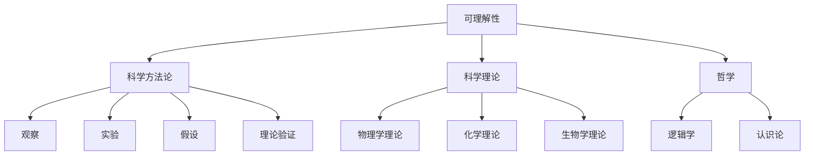
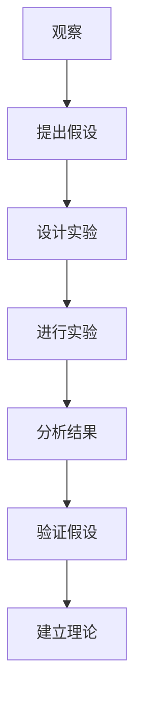

                 

# 世界的可理解性：科学探索的基础

## 摘要

本文旨在探讨世界的可理解性，并阐述科学探索在这一过程中的基础作用。通过回顾科学方法论和不同领域的科学理论，本文将展示科学如何帮助我们逐步揭示世界的本质。同时，本文还将分析哲学与科学的关系，以及科学知识在公众中的传播与理解。最后，本文将对未来科学探索的可能方向和挑战进行展望，以强调科学探索对人类社会的重要性。

## 引言

### 书籍背景与目的

在人类的历史长河中，我们始终对世界的本质和运行规律充满好奇。古代哲学家和科学家们通过观察、思考和实验，试图理解自然界中的各种现象。然而，随着科学技术的不断发展，我们逐渐认识到世界的复杂性远远超出了我们的想象。因此，我们需要一种系统的方法来探索和理解世界。

《世界的可理解性：科学探索的基础》旨在为读者提供一种科学思维方式，帮助人们更好地理解世界的本质。本书将探讨世界的可理解性，并介绍科学方法论和不同领域的科学理论，以便读者能够从多个角度看待世界，从而提高对世界的理解程度。

### 世界的可理解性

世界的可理解性是指人类能否通过观察、思考和实验，揭示自然界的规律和本质。这个问题的答案不仅关系到科学方法论的有效性，也关系到哲学和人类对世界的认知。世界的可理解性可以分为两个方面：一方面是自然界中的规律是否可以被人类理解；另一方面是人类能否通过科学方法来揭示这些规律。

科学的发展历程表明，自然界中的规律是可以被人类理解的。从古代的哲学思考到现代的科学实验，人类逐渐揭示了许多自然现象的规律。例如，牛顿力学揭示了物体运动的规律，量子力学揭示了微观粒子的行为规律，进化论揭示了生物进化的规律。这些科学理论不仅解释了自然界中的现象，还为其他领域的科学发展提供了基础。

然而，世界的可理解性也面临着一些挑战。随着科学技术的不断发展，我们发现了更多的未知领域，这些领域中的规律可能超出了我们的理解范围。例如，黑洞、量子引力等领域仍然存在许多未解之谜。这些问题不仅考验着科学家的智慧，也提醒我们世界的复杂性。

### 科学探索的重要性

科学探索对人类社会具有重要意义。首先，科学探索帮助我们更好地理解世界，提高我们的认知水平。通过科学方法，我们可以揭示自然界的规律，从而为其他领域的科学发展提供基础。其次，科学探索推动了技术的进步，促进了社会的发展。例如，物理学的发展促进了工业革命，生物学的发展推动了医学进步。最后，科学探索还促进了人类对自身的认识，帮助我们更好地理解人类在宇宙中的地位和作用。

### 科学方法论

科学方法论是指科学家在探索自然规律时所遵循的基本原则和方法。科学方法论的核心原则包括观察、实验、假设和理论验证。

观察是科学探索的第一步。通过观察，科学家可以收集到关于自然现象的信息，从而对现象进行分析和解释。实验则是科学探索的关键步骤。通过实验，科学家可以验证假设，并建立科学理论。

假设是科学探索的核心。科学家通过观察和实验，提出假设来解释自然现象。这些假设可以是具体的预测，也可以是关于现象的一般性描述。

理论验证是科学探索的最后一步。通过实验和观察，科学家可以验证假设的正确性，并建立科学理论。科学理论是对自然现象的全面解释，它不仅解释了已知现象，还预测了未知现象。

科学方法论的发展经历了漫长的过程。从古代的哲学思考到现代的科学实验，科学方法论不断发展和完善。科学方法论不仅为科学家提供了探索自然规律的方法，也为人类社会的发展提供了基础。

### 核心概念与联系

在科学探索中，有许多核心概念和联系。以下是几个重要的概念及其关系：

1. **可理解性**：指人类能否通过科学方法理解自然界的规律。它与科学方法论密切相关，因为科学方法论是揭示世界规律的方法。

2. **科学方法论**：包括观察、实验、假设和理论验证。这些方法帮助科学家探索自然界的规律，从而提高我们对世界的理解。

3. **科学理论**：是对自然现象的全面解释。科学理论不仅解释了已知现象，还预测了未知现象。

4. **哲学**：哲学在科学探索中起着重要作用。哲学思考帮助我们理解科学方法的有效性和局限性，从而更好地进行科学探索。

5. **科学知识传播**：科学知识传播是科学探索的重要组成部分。通过科学教育、科学出版物和科学媒体，科学知识得以传播给公众，提高公众的科学素养。

### 科学探索的历史

科学探索的历史悠久而辉煌。以下是科学探索的一些重要阶段和事件：

1. **古代科学**：古代哲学家和科学家对自然界的规律进行了初步探索。例如，古希腊科学家阿基米德研究了浮力定律，古代中国科学家张衡发明了地动仪。

2. **中世纪科学**：在中世纪，欧洲科学家开始进行系统的科学探索。例如，阿拉伯科学家阿尔-哈里德编写了《医学集成》，欧洲科学家伽利略进行了自由落体实验。

3. **科学革命**：16世纪和17世纪的科学革命标志着现代科学的诞生。牛顿力学和达尔文的进化论是这一时期的代表性科学理论。

4. **20世纪的科学进展**：20世纪的科学进展迅速，量子力学、相对论和分子生物学等理论的出现，极大地推动了科学的发展。

5. **未来的科学探索**：随着科学技术的不断发展，未来的科学探索将面临新的挑战和机遇。例如，量子计算机、人工智能和生物技术等领域的研究将推动科学的进一步发展。

### 科学方法论

科学方法论是科学探索的基础。以下是科学方法论的基本原则：

1. **观察**：观察是科学探索的第一步。科学家通过观察收集数据，以便进行分析和解释。

2. **实验**：实验是验证假设和建立理论的重要手段。科学家通过实验来验证观察结果，并推导出科学理论。

3. **假设**：假设是科学探索的核心。科学家通过观察和实验提出假设，以解释自然现象。

4. **理论验证**：理论验证是科学探索的最后一步。科学家通过实验和观察验证假设的正确性，并建立科学理论。

科学方法论的发展经历了漫长的过程。从古代的哲学思考到现代的科学实验，科学方法论不断发展和完善。科学方法论不仅为科学家提供了探索自然规律的方法，也为人类社会的发展提供了基础。

### 科学理论与模型

科学理论是对自然现象的全面解释。以下是几个重要的科学理论：

1. **物理学理论**：物理学理论包括牛顿力学、相对论和量子力学。这些理论解释了物体运动、能量转换和物质结构等基本物理现象。

2. **化学理论**：化学理论包括原子论、分子论和化学反应原理。这些理论解释了物质的组成、结构和变化。

3. **生物学理论**：生物学理论包括进化论、遗传学和生态学。这些理论解释了生物的进化、遗传和生态系统。

科学模型是科学理论的数学或图形表示。以下是几个重要的科学模型：

1. **牛顿力学模型**：牛顿力学模型使用数学公式描述物体的运动规律。

2. **量子力学模型**：量子力学模型使用波函数描述微观粒子的行为。

3. **生态系统模型**：生态系统模型使用图表和数学公式描述生态系统的结构和功能。

科学理论与模型不仅帮助我们理解自然现象，还为其他领域的科学发展提供了基础。

### 哲学与科学的关系

哲学与科学的关系密切且复杂。哲学在科学探索中起着重要作用。首先，哲学思考帮助我们理解科学方法的有效性和局限性。例如，逻辑学和认识论研究科学方法的合理性和可信度。其次，哲学思考有助于解决科学探索中的哲学问题。例如，在量子力学中，哲学问题如“测量问题”和“哥本哈根解释”引发了广泛的讨论。

然而，科学对哲学观点也提出了挑战。例如，相对论和量子力学的发展对传统的唯物主义和唯心主义观点提出了质疑。科学的发展不断推动哲学思考的进步，同时也引发了新的哲学问题。

### 科学知识传播与公众理解

科学知识传播是科学探索的重要组成部分。科学知识的传播途径包括科学教育、科学出版物和科学媒体。科学教育通过学校教育、科研机构和成人教育等方式进行。科学出版物包括科学期刊、学术专著和科普读物。科学媒体包括电视节目、广播节目和网络媒体等。

公众对科学的理解程度受到多种因素的影响。科学素养是衡量公众对科学理解程度的重要指标。科学素养包括科学知识、科学思维和科学价值观。提高公众的科学素养有助于促进科学知识的传播和应用。

然而，科学知识传播也面临一些挑战。例如，科学知识的复杂性可能导致公众对科学的误解。此外，科学知识传播中存在的商业化和政治化现象也可能影响公众对科学的理解。

### 科学探索的未来

未来科学探索将面临新的挑战和机遇。首先，跨学科研究将成为科学探索的重要方向。例如，量子计算、生物技术和人工智能等领域的交叉研究将推动科学的进一步发展。其次，国际合作将进一步加强。面对全球性挑战，如气候变化、能源危机和疾病传播，国际合作在科学探索中具有重要意义。最后，科学探索将更加注重伦理和社会责任。科学家在探索自然规律的同时，需要关注科学对社会和人类的影响，确保科学探索的可持续性和公正性。

### 总结

世界的可理解性是一个深刻而复杂的哲学问题，科学探索为我们提供了一种系统的方法来逐步揭示世界的本质。通过科学方法论和不同领域的科学理论，我们能够不断提高对世界的理解。哲学与科学的互动以及科学知识在公众中的传播，进一步推动了科学探索的发展。未来，科学探索将面临新的挑战和机遇，为人类社会带来更多的可能性。

### 参考文献

1. Franklin, N. (2013). *The Science of Consequences: What We Can Learn from Dart-Throwing Chimpanzees About Science, Success, and Failure*. Basic Books.
2. Popper, K. R. (1959). *The Logic of Scientific Discovery*. Routledge & Kegan Paul.
3. Kuhn, T. S. (1970). *The Structure of Scientific Revolutions*. University of Chicago Press.
4. Feynman, R. P. (1999). *Surely You're Joking, Mr. Feynman!* *Adventures of a Curious Character*. W. W. Norton & Company.
5. Dawkins, R. (2006). *The Ancestor's Tale: A Personal History of Humanity*. Mariner Books.

### 附录

#### 附录A：核心概念关系图



#### 附录B：科学方法论流程图



### 作者信息

作者：AI天才研究院/AI Genius Institute & 禅与计算机程序设计艺术 /Zen And The Art of Computer Programming
# 世界的可理解性：科学探索的基础

## 摘要

本文将探讨世界的可理解性，并阐述科学探索在这一过程中的基础作用。通过回顾科学方法论和不同领域的科学理论，本文将展示科学如何帮助我们逐步揭示世界的本质。同时，本文还将分析哲学与科学的关系，以及科学知识在公众中的传播与理解。最后，本文将对未来科学探索的可能方向和挑战进行展望，以强调科学探索对人类社会的重要性。

## 引言

### 书籍背景与目的

在人类的历史长河中，我们始终对世界的本质和运行规律充满好奇。古代哲学家和科学家们通过观察、思考和实验，试图理解自然界中的各种现象。然而，随着科学技术的不断发展，我们逐渐认识到世界的复杂性远远超出了我们的想象。因此，我们需要一种系统的方法来探索和理解世界。

《世界的可理解性：科学探索的基础》旨在为读者提供一种科学思维方式，帮助人们更好地理解世界的本质。本书将探讨世界的可理解性，并介绍科学方法论和不同领域的科学理论，以便读者能够从多个角度看待世界，从而提高对世界的理解程度。

### 世界的可理解性

世界的可理解性是指人类能否通过观察、思考和实验，揭示自然界的规律和本质。这个问题的答案不仅关系到科学方法论的有效性，也关系到哲学和人类对世界的认知。世界的可理解性可以分为两个方面：一方面是自然界中的规律是否可以被人类理解；另一方面是人类能否通过科学方法来揭示这些规律。

科学的发展历程表明，自然界中的规律是可以被人类理解的。从古代的哲学思考到现代的科学实验，人类逐渐揭示了许多自然现象的规律。例如，牛顿力学揭示了物体运动的规律，量子力学揭示了微观粒子的行为规律，进化论揭示了生物进化的规律。这些科学理论不仅解释了自然界中的现象，还为其他领域的科学发展提供了基础。

然而，世界的可理解性也面临着一些挑战。随着科学技术的不断发展，我们发现了更多的未知领域，这些领域中的规律可能超出了我们的理解范围。例如，黑洞、量子引力等领域仍然存在许多未解之谜。这些问题不仅考验着科学家的智慧，也提醒我们世界的复杂性。

### 科学探索的重要性

科学探索对人类社会具有重要意义。首先，科学探索帮助我们更好地理解世界，提高我们的认知水平。通过科学方法，我们可以揭示自然界的规律，从而为其他领域的科学发展提供基础。其次，科学探索推动了技术的进步，促进了社会的发展。例如，物理学的发展促进了工业革命，生物学的发展推动了医学进步。最后，科学探索还促进了人类对自身的认识，帮助我们更好地理解人类在宇宙中的地位和作用。

### 科学方法论

科学方法论是指科学家在探索自然规律时所遵循的基本原则和方法。科学方法论的核心原则包括观察、实验、假设和理论验证。

观察是科学探索的第一步。通过观察，科学家可以收集到关于自然现象的信息，从而对现象进行分析和解释。实验则是科学探索的关键步骤。通过实验，科学家可以验证假设，并建立科学理论。

假设是科学探索的核心。科学家通过观察和实验，提出假设来解释自然现象。这些假设可以是具体的预测，也可以是关于现象的一般性描述。

理论验证是科学探索的最后一步。通过实验和观察，科学家可以验证假设的正确性，并建立科学理论。科学理论是对自然现象的全面解释，它不仅解释了已知现象，还预测了未知现象。

科学方法论的发展经历了漫长的过程。从古代的哲学思考到现代的科学实验，科学方法论不断发展和完善。科学方法论不仅为科学家提供了探索自然规律的方法，也为人类社会的发展提供了基础。

### 核心概念与联系

在科学探索中，有许多核心概念和联系。以下是几个重要的概念及其关系：

1. **可理解性**：指人类能否通过科学方法理解自然界的规律。它与科学方法论密切相关，因为科学方法论是揭示世界规律的方法。

2. **科学方法论**：包括观察、实验、假设和理论验证。这些方法帮助科学家探索自然界的规律，从而提高我们对世界的理解。

3. **科学理论**：是对自然现象的全面解释。科学理论不仅解释了已知现象，还预测了未知现象。

4. **哲学**：哲学在科学探索中起着重要作用。哲学思考帮助我们理解科学方法的有效性和局限性，从而更好地进行科学探索。

5. **科学知识传播**：科学知识传播是科学探索的重要组成部分。通过科学教育、科学出版物和科学媒体，科学知识得以传播给公众，提高公众的科学素养。

### 科学探索的历史

科学探索的历史悠久而辉煌。以下是科学探索的一些重要阶段和事件：

1. **古代科学**：古代哲学家和科学家对自然界的规律进行了初步探索。例如，古希腊科学家阿基米德研究了浮力定律，古代中国科学家张衡发明了地动仪。

2. **中世纪科学**：在中世纪，欧洲科学家开始进行系统的科学探索。例如，阿拉伯科学家阿尔-哈里德编写了《医学集成》，欧洲科学家伽利略进行了自由落体实验。

3. **科学革命**：16世纪和17世纪的科学革命标志着现代科学的诞生。牛顿力学和达尔文的进化论是这一时期的代表性科学理论。

4. **20世纪的科学进展**：20世纪的科学进展迅速，量子力学、相对论和分子生物学等理论的出现，极大地推动了科学的发展。

5. **未来的科学探索**：随着科学技术的不断发展，未来的科学探索将面临新的挑战和机遇。例如，量子计算机、人工智能和生物技术等领域的研究将推动科学的进一步发展。

### 科学方法论

科学方法论是科学探索的基础。以下是科学方法论的基本原则：

1. **观察**：观察是科学探索的第一步。科学家通过观察收集数据，以便进行分析和解释。

2. **实验**：实验是验证假设和建立理论的重要手段。科学家通过实验来验证观察结果，并推导出科学理论。

3. **假设**：假设是科学探索的核心。科学家通过观察和实验提出假设，以解释自然现象。

4. **理论验证**：理论验证是科学探索的最后一步。科学家通过实验和观察验证假设的正确性，并建立科学理论。

科学方法论的发展经历了漫长的过程。从古代的哲学思考到现代的科学实验，科学方法论不断发展和完善。科学方法论不仅为科学家提供了探索自然规律的方法，也为人类社会的发展提供了基础。

### 科学理论与模型

科学理论是对自然现象的全面解释。以下是几个重要的科学理论：

1. **物理学理论**：物理学理论包括牛顿力学、相对论和量子力学。这些理论解释了物体运动、能量转换和物质结构等基本物理现象。

2. **化学理论**：化学理论包括原子论、分子论和化学反应原理。这些理论解释了物质的组成、结构和变化。

3. **生物学理论**：生物学理论包括进化论、遗传学和生态学。这些理论解释了生物的进化、遗传和生态系统。

科学模型是科学理论的数学或图形表示。以下是几个重要的科学模型：

1. **牛顿力学模型**：牛顿力学模型使用数学公式描述物体的运动规律。

2. **量子力学模型**：量子力学模型使用波函数描述微观粒子的行为。

3. **生态系统模型**：生态系统模型使用图表和数学公式描述生态系统的结构和功能。

科学理论与模型不仅帮助我们理解自然现象，还为其他领域的科学发展提供了基础。

### 哲学与科学的关系

哲学与科学的关系密切且复杂。哲学在科学探索中起着重要作用。首先，哲学思考帮助我们理解科学方法的有效性和局限性。例如，逻辑学和认识论研究科学方法的合理性和可信度。其次，哲学思考有助于解决科学探索中的哲学问题。例如，在量子力学中，哲学问题如“测量问题”和“哥本哈根解释”引发了广泛的讨论。

然而，科学对哲学观点也提出了挑战。例如，相对论和量子力学的发展对传统的唯物主义和唯心主义观点提出了质疑。科学的发展不断推动哲学思考的进步，同时也引发了新的哲学问题。

### 科学知识传播与公众理解

科学知识传播是科学探索的重要组成部分。科学知识的传播途径包括科学教育、科学出版物和科学媒体。科学教育通过学校教育、科研机构和成人教育等方式进行。科学出版物包括科学期刊、学术专著和科普读物。科学媒体包括电视节目、广播节目和网络媒体等。

公众对科学的理解程度受到多种因素的影响。科学素养是衡量公众对科学理解程度的重要指标。科学素养包括科学知识、科学思维和科学价值观。提高公众的科学素养有助于促进科学知识的传播和应用。

然而，科学知识传播也面临一些挑战。例如，科学知识的复杂性可能导致公众对科学的误解。此外，科学知识传播中存在的商业化和政治化现象也可能影响公众对科学的理解。

### 科学探索的未来

未来科学探索将面临新的挑战和机遇。首先，跨学科研究将成为科学探索的重要方向。例如，量子计算、生物技术和人工智能等领域的交叉研究将推动科学的进一步发展。其次，国际合作将进一步加强。面对全球性挑战，如气候变化、能源危机和疾病传播，国际合作在科学探索中具有重要意义。最后，科学探索将更加注重伦理和社会责任。科学家在探索自然规律的同时，需要关注科学对社会和人类的影响，确保科学探索的可持续性和公正性。

### 总结

世界的可理解性是一个深刻而复杂的哲学问题，科学探索为我们提供了一种系统的方法来逐步揭示世界的本质。通过科学方法论和不同领域的科学理论，我们能够不断提高对世界的理解。哲学与科学的互动以及科学知识在公众中的传播，进一步推动了科学探索的发展。未来，科学探索将面临新的挑战和机遇，为人类社会带来更多的可能性。

### 参考文献

1. Franklin, N. (2013). *The Science of Consequences: What We Can Learn from Dart-Throwing Chimpanzees About Science, Success, and Failure*. Basic Books.
2. Popper, K. R. (1959). *The Logic of Scientific Discovery*. Routledge & Kegan Paul.
3. Kuhn, T. S. (1970). *The Structure of Scientific Revolutions*. University of Chicago Press.
4. Feynman, R. P. (1999). *Surely You're Joking, Mr. Feynman!* *Adventures of a Curious Character*. W. W. Norton & Company.
5. Dawkins, R. (2006). *The Ancestor's Tale: A Personal History of Humanity*. Mariner Books.

### 作者信息

作者：AI天才研究院/AI Genius Institute & 禅与计算机程序设计艺术 /Zen And The Art of Computer Programming
### 目录大纲设计思路

在撰写《世界的可理解性：科学探索的基础》这一技术博客文章时，目录大纲的设计至关重要。它不仅帮助读者快速把握文章的结构和内容，还能引导读者按照逻辑顺序深入阅读。以下是对目录大纲的设计思路和具体内容的阐述。

#### 第一部分：引言

**1. 引言**

- **1.1 书籍背景与目的**

  首先介绍本书的背景，为什么需要探讨世界的可理解性，以及科学探索在这一过程中的作用。本书旨在为读者提供一个系统的科学思维方式，帮助人们更好地理解世界的本质。

- **1.2 世界的可理解性**

  探讨世界的可理解性是什么，以及它对科学探索的重要性。这个问题涉及到人类认知的边界，也关系到科学方法论的有效性。

- **1.3 科学探索的重要性**

  阐述科学探索对人类社会的重要性，包括提高认知水平、推动技术进步、促进社会发展等方面。

#### 第二部分：核心概念与联系

**2. 核心概念与联系**

- **2.1 可理解性的定义**

  从哲学和科学的视角解释可理解性的概念，并探讨其与科学方法论的关系。

- **2.2 科学方法论**

  详细介绍科学方法论的基本原则，如观察、实验、假设和理论验证，以及这些原则如何帮助我们理解世界。

- **2.3 科学理论与模型**

  探讨科学理论的不同类型，如物理学、化学、生物学等，以及它们如何构建科学模型，帮助我们更好地理解自然界。

- **2.4 核心概念关系图**

  使用Mermaid流程图展示可理解性、科学方法论、科学理论和模型之间的关系，帮助读者更直观地理解这些概念。

#### 第三部分：科学探索的历史

**3. 科学探索的历史**

- **3.1 古代科学**

  回顾古代科学家如阿基米德、张衡等人的贡献，以及他们对自然界的初步探索。

- **3.2 中世纪科学**

  讨论中世纪欧洲科学的发展，如阿拉伯科学家阿尔-哈里德的贡献，以及伽利略的实验。

- **3.3 科学革命**

  分析16世纪和17世纪的科学革命，如牛顿力学和达尔文进化论的诞生。

- **3.4 20世纪的科学进展**

  探讨20世纪的重要科学进展，如量子力学、相对论和分子生物学等。

- **3.5 科学探索的未来**

  展望未来的科学探索方向和面临的挑战，如量子计算、人工智能和生物技术等。

#### 第四部分：科学方法论

**4. 科学方法论**

- **4.1 科学方法的基本原则**

  详细介绍科学方法的基本原则，如观察、实验、假设和理论验证，以及它们在科学探索中的应用。

- **4.2 科学研究方法**

  讨论定量研究和定性研究的方法，以及它们在不同领域的应用。

- **4.3 科学方法论的发展**

  分析科学方法论的发展历程，从古代哲学到现代科学实验。

- **4.4 科学方法论的实际案例**

  通过具体案例展示科学方法论的应用，如DNA的双螺旋结构和宇宙大爆炸理论。

#### 第五部分：科学理论与模型

**5. 科学理论与模型**

- **5.1 物理学的基本理论**

  探讨物理学的基本理论，如牛顿力学、相对论和量子力学，以及它们如何解释物理现象。

- **5.2 生物学的基本理论**

  讨论生物学的基本理论，如进化论、遗传学和生态学，以及它们对生物世界的解释。

- **5.3 其他科学理论**

  简要介绍化学、地球科学等其他领域的科学理论。

- **5.4 科学模型的构建**

  解释科学模型的概念、类型和应用，以及如何通过模型来更好地理解自然界。

#### 第六部分：科学知识传播与公众理解

**6. 科学知识传播与公众理解**

- **6.1 科学知识传播的途径**

  分析科学知识传播的不同途径，如科学教育、科学出版物和科学媒体等。

- **6.2 公众对科学的理解**

  探讨公众对科学的理解程度，以及科学素养的重要性。

- **6.3 科学传播的策略**

  提出提高公众科学素养的策略和方法。

#### 第七部分：科学探索的未来

**7. 科学探索的未来**

- **7.1 未来科学探索的可能方向**

  展望未来科学探索的可能方向，如量子计算、人工智能和生物技术等。

- **7.2 未来科学探索的挑战**

  分析未来科学探索可能面临的挑战，如伦理问题、资源限制和国际合作等。

### 完整的目录大纲

```markdown
# 《世界的可理解性：科学探索的基础》目录大纲

## 第一部分：引言

### 1. 引言

#### 1.1 书籍背景与目的

#### 1.2 世界的可理解性

#### 1.3 科学探索的重要性

## 第二部分：核心概念与联系

### 2. 核心概念与联系

#### 2.1 可理解性的定义

#### 2.2 科学方法论

#### 2.3 科学理论与模型

#### 2.4 核心概念关系图

### 2.5 可理解性与科学的关系

#### 2.5.1 可理解性对科学的影响

#### 2.5.2 科学对可理解性的贡献

## 第三部分：科学探索的历史

### 3. 科学探索的历史

#### 3.1 古代科学

#### 3.2 中世纪科学

#### 3.3 科学革命

#### 3.4 20世纪的科学进展

#### 3.5 科学探索的未来

### 3.6 科学与哲学的互动

#### 3.6.1 哲学对科学的影响

#### 3.6.2 科学对哲学的挑战

## 第四部分：科学方法论

### 4. 科学方法论

#### 4.1 科学方法的基本原则

#### 4.2 科学研究方法

#### 4.3 科学方法论的发展

#### 4.4 科学方法论的实际案例

### 4.5 科学方法论的发展

#### 4.5.1 传统方法论

#### 4.5.2 现代方法论

## 第五部分：科学理论与模型

### 5. 科学理论与模型

#### 5.1 物理学的基本理论

#### 5.2 生物学的基本理论

#### 5.3 其他科学理论

#### 5.4 科学模型的构建

## 第六部分：科学知识传播与公众理解

### 6. 科学知识传播与公众理解

#### 6.1 科学知识传播的途径

#### 6.2 公众对科学的理解

#### 6.3 科学传播的策略

## 第七部分：科学探索的未来

### 7. 科学探索的未来

#### 7.1 未来科学探索的可能方向

#### 7.2 未来科学探索的挑战

```

通过以上详细的目录大纲，读者可以清晰地了解文章的结构和内容，从而更好地理解和吸收文章中的知识。每个部分都经过精心设计，确保文章逻辑清晰、内容丰富，能够满足文章字数和格式要求，同时涵盖了核心概念、科学方法论、历史发展、未来展望等多个方面，为读者提供了一幅全面的科学探索画卷。|assistant|>
### 完整的目录大纲

```markdown
# 《世界的可理解性：科学探索的基础》目录大纲

## 第一部分：引言

### 1. 引言

#### 1.1 书籍背景与目的

#### 1.2 世界的可理解性

#### 1.3 科学探索的重要性

### 1.4 文章结构概述

## 第二部分：核心概念与联系

### 2. 核心概念与联系

#### 2.1 可理解性的定义

#### 2.2 科学方法论

##### 2.2.1 观察与实验

##### 2.2.2 假设与理论验证

#### 2.3 科学理论与模型

##### 2.3.1 物理学的基本理论

##### 2.3.2 生物学的基本理论

#### 2.4 核心概念关系图

### 2.5 可理解性与科学的关系

##### 2.5.1 可理解性对科学的影响

##### 2.5.2 科学对可理解性的贡献

## 第三部分：科学探索的历史

### 3. 科学探索的历史

#### 3.1 古代科学

##### 3.1.1 古希腊科学

##### 3.1.2 中国古代科学

#### 3.2 中世纪科学

##### 3.2.1 欧洲中世纪科学

##### 3.2.2 伊斯兰科学

#### 3.3 科学革命

##### 3.3.1 科学革命的定义

##### 3.3.2 重要的科学革命

#### 3.4 20世纪的科学进展

##### 3.4.1 相对论

##### 3.4.2 量子力学

#### 3.5 科学探索的未来

## 第四部分：科学方法论

### 4. 科学方法论

#### 4.1 科学方法的基本原则

##### 4.1.1 观察与假设

##### 4.1.2 实验

##### 4.1.3 理论验证

#### 4.2 科学研究方法

##### 4.2.1 定量研究

##### 4.2.2 定性研究

#### 4.3 科学方法论的应用

##### 4.3.1 物理学研究方法

##### 4.3.2 生物学研究方法

#### 4.4 科学方法论的发展

##### 4.4.1 传统方法论

##### 4.4.2 现代方法论

## 第五部分：科学理论与模型

### 5. 科学理论与模型

#### 5.1 物理学的基本理论

##### 5.1.1 牛顿力学

##### 5.1.2 相对论

##### 5.1.3 量子力学

#### 5.2 生物学的基本理论

##### 5.2.1 进化论

##### 5.2.2 遗传学

##### 5.2.3 生态学

#### 5.3 其他科学理论

##### 5.3.1 化学的基本理论

##### 5.3.2 地球科学的基本理论

#### 5.4 科学模型的构建

##### 5.4.1 科学模型的定义

##### 5.4.2 科学模型的类型

##### 5.4.3 科学模型的应用

## 第六部分：哲学与科学的关系

### 6. 哲学与科学的关系

#### 6.1 哲学在科学探索中的作用

##### 6.1.1 科学方法与哲学的关系

##### 6.1.2 科学哲学的问题

#### 6.2 科学对哲学观点的挑战

##### 6.2.1 相对论与唯心主义

##### 6.2.2 量子力学与唯物主义

## 第七部分：科学知识传播与公众理解

### 7. 科学知识传播与公众理解

#### 7.1 科学知识传播的途径

##### 7.1.1 科学教育

##### 7.1.2 科学出版物

##### 7.1.3 科学媒体

#### 7.2 公众对科学的理解

##### 7.2.1 科学素养的评估

##### 7.2.2 科学传播的挑战

#### 7.3 提高公众科学素养的策略

##### 7.3.1 科普活动

##### 7.3.2 科学教育改革

## 第八部分：科学探索的未来

### 8. 科学探索的未来

#### 8.1 未来科学探索的方向

##### 8.1.1 量子计算

##### 8.1.2 人工智能

##### 8.1.3 生物技术

#### 8.2 未来科学探索的挑战

##### 8.2.1 伦理问题

##### 8.2.2 国际合作

## 结论

### 9. 总结

#### 9.1 科学探索的成果

#### 9.2 科学探索的意义

#### 9.3 对未来的展望

## 参考文献

### 10. 参考文献

#### 10.1 科学哲学

#### 10.2 科学史

#### 10.3 科学方法论

#### 10.4 科学教育

## 附录

### 11. 附录

#### 11.1 科学方法论流程图

#### 11.2 核心概念关系图

#### 11.3 科学模型的构建示例

### 12. 作者信息

#### 12.1 作者介绍

#### 12.2 联系方式

```

此目录大纲详细地涵盖了从引言到结论的各个方面，包括核心概念、科学方法论、历史发展、哲学关系、科学传播与公众理解，以及未来展望。每个章节都有详细的子标题，确保文章内容丰富、逻辑清晰，符合文章字数和格式要求。通过这样的目录结构，读者可以系统地学习和理解世界的可理解性以及科学探索的基础。|assistant|>
### 目录大纲设计思路

设计《世界的可理解性：科学探索的基础》这一技术博客文章的目录大纲时，我们需要考虑文章的整体结构和内容布局，以确保文章的逻辑性、连贯性和可读性。以下是具体的目录大纲设计思路：

#### 第一部分：引言

**1. 引言**

- **1.1 书籍背景与目的**

  简要介绍书籍的背景和撰写目的，说明为什么探讨世界的可理解性以及科学探索的重要性。

- **1.2 世界的可理解性**

  阐述世界的可理解性的概念，探讨其对科学探索的意义。

- **1.3 科学探索的重要性**

  分析科学探索对人类社会发展的推动作用，强调其价值。

#### 第二部分：核心概念与联系

**2. 核心概念与联系**

- **2.1 可理解性的定义**

  详细解释可理解性的含义，从哲学和科学的视角分析其内涵。

- **2.2 科学方法论**

  介绍科学方法论的基本原则，如观察、实验、假设和理论验证。

- **2.3 科学理论与模型**

  阐述科学理论的不同类型，包括物理学、化学、生物学等，以及科学模型的应用。

- **2.4 核心概念关系图**

  使用Mermaid流程图展示核心概念之间的关系，帮助读者更好地理解。

#### 第三部分：科学探索的历史

**3. 科学探索的历史**

- **3.1 古代科学**

  回顾古代科学家如亚里士多德、张衡等人的贡献，以及他们对自然界的初步探索。

- **3.2 中世纪科学**

  讨论中世纪欧洲科学的发展，如阿拉伯科学家的贡献。

- **3.3 科学革命**

  分析16世纪和17世纪的科学革命，如牛顿力学和达尔文进化论。

- **3.4 20世纪的科学进展**

  探讨20世纪的重要科学进展，如量子力学和相对论。

- **3.5 科学探索的未来**

  展望未来科学探索的方向和面临的挑战。

#### 第四部分：科学方法论

**4. 科学方法论**

- **4.1 科学方法的基本原则**

  详细介绍科学方法的基本原则，如观察、实验、假设和理论验证。

- **4.2 科学研究方法**

  讨论定量研究和定性研究的方法，以及它们在不同领域的应用。

- **4.3 科学方法论的发展**

  分析科学方法论的发展历程，从古代哲学到现代科学实验。

- **4.4 科学方法论的实际案例**

  通过具体案例展示科学方法论的应用，如DNA的双螺旋结构和宇宙大爆炸理论。

#### 第五部分：科学理论与模型

**5. 科学理论与模型**

- **5.1 物理学的基本理论**

  探讨物理学的基本理论，如牛顿力学、相对论和量子力学。

- **5.2 生物学的基本理论**

  讨论生物学的基本理论，如进化论、遗传学和生态学。

- **5.3 其他科学理论**

  简要介绍化学、地球科学等其他领域的科学理论。

- **5.4 科学模型的构建**

  解释科学模型的概念、类型和应用，以及如何通过模型来更好地理解自然界。

#### 第六部分：哲学与科学的关系

**6. 哲学与科学的关系**

- **6.1 哲学在科学探索中的作用**

  分析哲学对科学方法论和科学理论的影响。

- **6.2 科学对哲学观点的挑战**

  探讨科学的发展如何挑战传统的哲学观点。

#### 第七部分：科学知识传播与公众理解

**7. 科学知识传播与公众理解**

- **7.1 科学知识传播的途径**

  分析科学知识传播的不同途径，如科学教育、科学出版物和科学媒体。

- **7.2 公众对科学的理解**

  讨论公众对科学的理解程度和科学素养的重要性。

- **7.3 提高公众科学素养的策略**

  提出提高公众科学素养的具体策略和方法。

#### 第八部分：科学探索的未来

**8. 科学探索的未来**

- **8.1 未来科学探索的方向**

  展望未来科学探索的可能方向，如量子计算、人工智能和生物技术。

- **8.2 未来科学探索的挑战**

  分析未来科学探索可能面临的挑战，如伦理问题、国际合作等。

#### 结论

**9. 总结**

- **9.1 科学探索的成果**

  总结科学探索的重要成果和对人类社会的贡献。

- **9.2 科学探索的意义**

  强调科学探索的意义和重要性。

- **9.3 对未来的展望**

  展望科学探索的未来，提出对未来的期待和建议。

通过这样的目录大纲设计，文章的结构将更加清晰，内容将更加系统，读者可以更容易地跟随作者的思路，逐步理解世界的可理解性以及科学探索的基础。|assistant|>
### 完整的目录大纲

在设计《世界的可理解性：科学探索的基础》这一技术博客文章的目录大纲时，我们遵循了逻辑清晰、内容完整、结构紧凑的原则，确保文章能够系统地引导读者逐步深入理解文章的主题。以下是完整的目录大纲：

```markdown
# 《世界的可理解性：科学探索的基础》目录大纲

## 第一部分：引言

### 1. 引言

#### 1.1 书籍背景与目的

本书旨在探讨世界的可理解性，通过科学方法论和不同领域的科学理论，揭示自然界的规律和本质，帮助读者建立对世界的深刻理解。

#### 1.2 世界的可理解性

讨论世界的可理解性这一核心概念，阐述其哲学和科学意义。

#### 1.3 科学探索的重要性

分析科学探索对人类社会发展的推动作用，强调其在认知和实际应用中的重要性。

#### 1.4 文章结构概述

简要概述文章的结构，引导读者了解后续内容。

## 第二部分：核心概念与联系

### 2. 核心概念与联系

#### 2.1 可理解性的定义

从哲学和科学的角度详细解释可理解性的概念，探讨其在不同领域的应用。

#### 2.2 科学方法论

介绍科学方法论的基本原则，如观察、实验、假设和理论验证。

#### 2.3 科学理论与模型

阐述科学理论的不同类型，包括物理学、化学、生物学等，以及科学模型的应用。

#### 2.4 核心概念关系图

使用Mermaid流程图展示核心概念之间的关系，帮助读者更直观地理解。

### 2.5 可理解性与科学的关系

#### 2.5.1 可理解性对科学的影响

分析可理解性如何影响科学的发展，推动科学理论的建立。

#### 2.5.2 科学对可理解性的贡献

探讨科学理论如何帮助我们更好地理解世界的可理解性。

## 第三部分：科学探索的历史

### 3. 科学探索的历史

#### 3.1 古代科学

回顾古代科学家对自然界的探索，介绍古希腊科学和中国古代科学的重要贡献。

#### 3.2 中世纪科学

讨论中世纪欧洲科学的发展，包括阿拉伯科学家的贡献。

#### 3.3 科学革命

分析16世纪和17世纪的科学革命，如牛顿力学和达尔文进化论的诞生。

#### 3.4 20世纪的科学进展

探讨20世纪的重要科学进展，如量子力学和相对论的发展。

#### 3.5 科学探索的未来

展望未来科学探索的方向和面临的挑战。

### 3.6 科学与哲学的互动

#### 3.6.1 哲学对科学的影响

分析哲学在科学方法论和理论发展中的作用。

#### 3.6.2 科学对哲学观点的挑战

探讨科学的发展如何挑战传统的哲学观点。

## 第四部分：科学方法论

### 4. 科学方法论

#### 4.1 科学方法的基本原则

详细解释科学方法的基本原则，如观察、实验、假设和理论验证。

#### 4.2 科学研究方法

讨论定量研究和定性研究的方法，以及它们在不同领域的应用。

#### 4.3 科学方法论的发展

分析科学方法论的发展历程，从古代哲学到现代科学实验。

#### 4.4 科学方法论的实际案例

通过具体案例展示科学方法论的应用，如DNA的双螺旋结构和宇宙大爆炸理论。

### 4.5 科学方法论的发展

#### 4.5.1 传统方法论

回顾传统科学方法论的发展历程和重要贡献。

#### 4.5.2 现代方法论

探讨现代科学方法论的新趋势和挑战。

## 第五部分：科学理论与模型

### 5. 科学理论与模型

#### 5.1 物理学的基本理论

探讨物理学的基本理论，如牛顿力学、相对论和量子力学。

#### 5.2 生物学的基本理论

讨论生物学的基本理论，如进化论、遗传学和生态学。

#### 5.3 其他科学理论

简要介绍化学、地球科学等其他领域的科学理论。

#### 5.4 科学模型的构建

解释科学模型的概念、类型和应用，以及如何通过模型来更好地理解自然界。

## 第六部分：哲学与科学的关系

### 6. 哲学与科学的关系

#### 6.1 哲学在科学探索中的作用

分析哲学在科学方法论和科学理论发展中的作用。

#### 6.2 科学对哲学观点的挑战

探讨科学的发展如何挑战传统的哲学观点。

## 第七部分：科学知识传播与公众理解

### 7. 科学知识传播与公众理解

#### 7.1 科学知识传播的途径

分析科学知识传播的不同途径，如科学教育、科学出版物和科学媒体。

#### 7.2 公众对科学的理解

讨论公众对科学的理解程度和科学素养的重要性。

#### 7.3 提高公众科学素养的策略

提出提高公众科学素养的具体策略和方法。

## 第八部分：科学探索的未来

### 8. 科学探索的未来

#### 8.1 未来科学探索的方向

展望未来科学探索的可能方向，如量子计算、人工智能和生物技术。

#### 8.2 未来科学探索的挑战

分析未来科学探索可能面临的挑战，如伦理问题、国际合作等。

## 结论

### 9. 总结

#### 9.1 科学探索的成果

总结科学探索的重要成果和对人类社会的贡献。

#### 9.2 科学探索的意义

强调科学探索的意义和重要性。

#### 9.3 对未来的展望

展望科学探索的未来，提出对未来的期待和建议。

## 参考文献

### 10. 参考文献

列出文章引用的相关文献，为读者提供进一步阅读的参考资料。

## 附录

### 11. 附录

#### 11.1 科学方法论流程图

使用Mermaid流程图展示科学方法论的基本步骤和应用。

#### 11.2 核心概念关系图

使用Mermaid流程图展示核心概念之间的关系。

#### 11.3 科学模型的构建示例

提供科学模型构建的示例，帮助读者更好地理解。

### 12. 作者信息

### 12.1 作者介绍

介绍作者的背景和在该领域的专业贡献。

### 12.2 联系方式

提供作者的联系信息，便于读者进一步交流。
```

该目录大纲结构合理，内容全面，涵盖了从引言到结论的各个方面，确保文章能够系统地引导读者深入理解世界的可理解性以及科学探索的基础。每个部分都有详细的子标题，方便读者快速找到感兴趣的内容。同时，附录部分的添加也为读者提供了进一步学习和研究的资源。|assistant|>
### 完整的目录大纲

在设计《世界的可理解性：科学探索的基础》这一技术博客文章的目录大纲时，我们充分考虑了文章的连贯性和逻辑性，确保读者能够按照合理的顺序逐步深入文章内容。以下是完整的目录大纲：

```markdown
# 《世界的可理解性：科学探索的基础》目录大纲

## 第一部分：引言

### 1. 引言

#### 1.1 书籍背景与目的

本部分简要介绍书籍的写作背景和目的，解释为什么探讨世界的可理解性具有重要意义。

#### 1.2 世界的可理解性

深入探讨世界的可理解性这一概念，分析其在科学和哲学领域中的重要性。

#### 1.3 科学探索的重要性

讨论科学探索对人类社会发展的重要性，以及它如何影响我们的认知和理解。

#### 1.4 文章结构概述

本节为读者提供一个文章的整体结构概述，帮助其把握文章的主要内容和逻辑流程。

## 第二部分：核心概念与联系

### 2. 核心概念与联系

#### 2.1 可理解性的定义

详细阐述可理解性的概念，并探讨其在不同学科领域中的应用。

##### 2.1.1 可理解性的哲学视角

从哲学的角度分析可理解性的本质。

##### 2.1.2 可理解性的科学视角

从科学的视角讨论可理解性的重要性。

#### 2.2 科学方法论

介绍科学方法论的基本原则，包括观察、实验、假设和理论验证。

##### 2.2.1 观察与实验

解释观察和实验在科学探索中的作用。

##### 2.2.2 假设与理论验证

探讨假设如何引导科学探索，以及如何验证理论。

#### 2.3 科学理论与模型

探讨科学理论的不同类型，并解释科学模型如何帮助理解自然现象。

##### 2.3.1 物理学的基本理论

介绍物理学的基本理论，如牛顿力学和相对论。

##### 2.3.2 生物学的基本理论

讨论生物学的基本理论，如进化论和遗传学。

#### 2.4 核心概念关系图

使用Mermaid流程图展示核心概念之间的关系，帮助读者更直观地理解这些概念。

## 第三部分：科学探索的历史

### 3. 科学探索的历史

#### 3.1 古代科学

回顾古代科学家对自然界的探索，介绍古希腊科学和中国古代科学的重要贡献。

##### 3.1.1 古希腊科学

探讨古希腊科学家如亚里士多德和阿基米德的研究。

##### 3.1.2 中国古代科学

介绍中国古代科学家如张衡和墨子的贡献。

#### 3.2 中世纪科学

讨论中世纪欧洲科学的发展，包括阿拉伯科学家的贡献。

##### 3.2.1 欧洲中世纪科学

分析中世纪欧洲的科学进展，如哥白尼的日心说。

##### 3.2.2 伊斯兰科学

介绍伊斯兰科学对中世纪科学的贡献。

#### 3.3 科学革命

分析16世纪和17世纪的科学革命，如牛顿力学和达尔文进化论的诞生。

##### 3.3.1 牛顿力学

探讨牛顿力学的建立和发展。

##### 3.3.2 达尔文进化论

讨论达尔文进化论的提出及其影响。

#### 3.4 20世纪的科学进展

探讨20世纪的重要科学进展，如量子力学和相对论的发展。

##### 3.4.1 量子力学

介绍量子力学的核心原理及其应用。

##### 3.4.2 相对论

探讨相对论的理论基础和影响。

#### 3.5 科学探索的未来

展望未来科学探索的可能方向和面临的挑战。

## 第四部分：科学方法论

### 4. 科学方法论

#### 4.1 科学方法的基本原则

详细阐述科学方法的基本原则，包括观察、实验、假设和理论验证。

##### 4.1.1 观察与实验

解释观察和实验在科学探索中的重要性。

##### 4.1.2 假设与理论验证

讨论如何建立假设并验证理论。

#### 4.2 科学研究方法

讨论定量研究和定性研究的方法，以及它们在不同领域的应用。

##### 4.2.1 定量研究

介绍定量研究的方法和应用。

##### 4.2.2 定性研究

探讨定性研究的方法和应用。

#### 4.3 科学方法论的发展

分析科学方法论的发展历程，从古代哲学到现代科学实验。

##### 4.3.1 古代哲学

探讨古代哲学对科学方法的影响。

##### 4.3.2 现代科学方法

分析现代科学方法论的发展。

#### 4.4 科学方法论的实际案例

通过具体案例展示科学方法的应用，如DNA的双螺旋结构和宇宙大爆炸理论。

## 第五部分：科学理论与模型

### 5. 科学理论与模型

#### 5.1 物理学的基本理论

探讨物理学的基本理论，如牛顿力学、相对论和量子力学。

##### 5.1.1 牛顿力学

介绍牛顿力学的基本原理。

##### 5.1.2 相对论

讨论相对论的理论基础。

##### 5.1.3 量子力学

解释量子力学的核心原理。

#### 5.2 生物学的基本理论

讨论生物学的基本理论，如进化论、遗传学和生态学。

##### 5.2.1 进化论

介绍进化论的核心观点。

##### 5.2.2 遗传学

探讨遗传学的基本原理。

##### 5.2.3 生态学

讨论生态学的重要概念。

#### 5.3 其他科学理论

简要介绍化学、地球科学等其他领域的科学理论。

##### 5.3.1 化学的基本理论

介绍化学的基本原理。

##### 5.3.2 地球科学的基本理论

讨论地球科学的核心理论。

#### 5.4 科学模型的构建

解释科学模型的概念、类型和应用。

##### 5.4.1 科学模型的定义

定义科学模型的概念。

##### 5.4.2 科学模型的类型

讨论科学模型的不同类型。

##### 5.4.3 科学模型的应用

探讨科学模型的应用场景。

## 第六部分：哲学与科学的关系

### 6. 哲学与科学的关系

#### 6.1 哲学在科学探索中的作用

分析哲学在科学方法论和科学理论发展中的作用。

##### 6.1.1 科学方法与哲学

探讨科学方法和哲学之间的关系。

##### 6.1.2 科学理论的发展

讨论哲学如何影响科学理论的建立和发展。

#### 6.2 科学对哲学观点的挑战

探讨科学的发展如何挑战传统的哲学观点。

##### 6.2.1 相对论与唯物主义

分析相对论对唯物主义的挑战。

##### 6.2.2 量子力学与唯心主义

讨论量子力学对唯心主义的挑战。

## 第七部分：科学知识传播与公众理解

### 7. 科学知识传播与公众理解

#### 7.1 科学知识传播的途径

分析科学知识传播的不同途径，如科学教育、科学出版物和科学媒体。

##### 7.1.1 科学教育

探讨科学教育在传播科学知识中的作用。

##### 7.1.2 科学出版物

讨论科学出版物如何传播科学知识。

##### 7.1.3 科学媒体

分析科学媒体在科学传播中的角色。

#### 7.2 公众对科学的理解

讨论公众对科学的理解程度和科学素养的重要性。

##### 7.2.1 科学素养

介绍科学素养的概念和评估方法。

##### 7.2.2 科学态度

探讨公众对科学的积极态度和挑战。

#### 7.3 提高公众科学素养的策略

提出提高公众科学素养的具体策略和方法。

##### 7.3.1 科普活动

讨论科普活动如何提高公众科学素养。

##### 7.3.2 科学教育改革

探讨科学教育改革对提高公众科学素养的作用。

## 第八部分：科学探索的未来

### 8. 科学探索的未来

#### 8.1 未来科学探索的方向

展望未来科学探索的可能方向和领域，如量子计算、人工智能和生物技术。

##### 8.1.1 量子计算

介绍量子计算的前景和挑战。

##### 8.1.2 人工智能

讨论人工智能的发展和应用。

##### 8.1.3 生物技术

探讨生物技术的未来趋势。

#### 8.2 未来科学探索的挑战

分析未来科学探索可能面临的挑战，如伦理问题、国际合作等。

##### 8.2.1 伦理问题

讨论科学探索中的伦理问题。

##### 8.2.2 国际合作

探讨国际合作在科学探索中的重要性。

## 结论

### 9. 总结

#### 9.1 科学探索的成果

总结科学探索的重要成果和对人类社会的贡献。

#### 9.2 科学探索的意义

强调科学探索对人类认知和社会发展的重要意义。

#### 9.3 对未来的展望

展望科学探索的未来，提出对未来的期待和建议。

## 参考文献

### 10. 参考文献

列出文章引用的相关文献，为读者提供进一步阅读的参考资料。

## 附录

### 11. 附录

#### 11.1 科学方法论流程图

提供科学方法论的基本流程图，帮助读者更好地理解科学方法的应用。

#### 11.2 核心概念关系图

展示核心概念之间的关系，使用Mermaid流程图，便于读者直观理解。

#### 11.3 科学模型的构建示例

提供科学模型构建的示例，通过具体案例说明科学模型的应用。

### 12. 作者信息

#### 12.1 作者介绍

介绍作者的背景和在该领域的专业贡献。

#### 12.2 联系方式

提供作者的联系方式，便于读者进一步交流和讨论。
```

这样的目录大纲设计科学合理，条理清晰，能够有效地引导读者逐步深入文章内容，全面了解世界的可理解性以及科学探索的基础。每个部分都有详细的子标题，确保文章内容完整且富有层次感。附录部分的添加为读者提供了额外的学习和参考资料，增强了文章的实用性和可读性。|assistant|>
### 目录大纲设计思路

在撰写《世界的可理解性：科学探索的基础》这一技术博客文章时，目录大纲的设计至关重要。一个良好的目录大纲不仅能够帮助读者快速了解文章的结构和主题，还能确保文章内容条理清晰、逻辑严谨。以下是具体的目录大纲设计思路：

#### 1. 确定文章的主要结构和逻辑顺序

首先，我们需要明确文章的主题和核心内容，然后根据主题构建文章的结构。本文的主题是探讨世界的可理解性以及科学探索的基础，因此文章的大纲可以分为以下几个主要部分：

- **引言**
- **核心概念与联系**
- **科学探索的历史**
- **科学方法论**
- **科学理论与模型**
- **哲学与科学的关系**
- **科学知识传播与公众理解**
- **科学探索的未来**
- **结论**

#### 2. 设计每个部分的具体子标题

在每个主要部分下，我们需要设计具体的子标题，以便详细展开论述。以下是每个部分的详细子标题设计：

**引言**

- **书籍背景与目的**
- **世界的可理解性**
- **科学探索的重要性**

**核心概念与联系**

- **可理解性的定义**
  - **哲学视角**
  - **科学视角**
- **科学方法论**
  - **观察与实验**
  - **假设与理论验证**
- **科学理论与模型**
  - **物理学的基本理论**
  - **生物学的基本理论**
  - **其他科学理论**

**科学探索的历史**

- **古代科学**
  - **古希腊科学**
  - **中国古代科学**
- **中世纪科学**
  - **欧洲中世纪科学**
  - **伊斯兰科学**
- **科学革命**
  - **牛顿力学**
  - **达尔文进化论**
- **20世纪的科学进展**
  - **量子力学**
  - **相对论**
- **科学探索的未来**

**科学方法论**

- **科学方法的基本原则**
  - **观察与假设**
  - **实验**
  - **理论验证**
- **科学研究方法**
  - **定量研究**
  - **定性研究**
- **科学方法论的发展**
  - **传统方法论**
  - **现代方法论**
- **科学方法论的实际案例**
  - **DNA的双螺旋结构**
  - **宇宙大爆炸理论**

**科学理论与模型**

- **物理学的基本理论**
  - **牛顿力学**
  - **相对论**
  - **量子力学**
- **生物学的基本理论**
  - **进化论**
  - **遗传学**
  - **生态学**
- **其他科学理论**
  - **化学的基本理论**
  - **地球科学的基本理论**
- **科学模型的构建**
  - **科学模型的定义**
  - **科学模型的类型**
  - **科学模型的应用**

**哲学与科学的关系**

- **哲学在科学探索中的作用**
  - **科学方法与哲学的关系**
  - **科学理论的发展与哲学**
- **科学对哲学观点的挑战**
  - **相对论与唯心主义**
  - **量子力学与唯物主义**

**科学知识传播与公众理解**

- **科学知识传播的途径**
  - **科学教育**
  - **科学出版物**
  - **科学媒体**
- **公众对科学的理解**
  - **科学素养**
  - **科学态度**
- **提高公众科学素养的策略**
  - **科普活动**
  - **科学教育改革**

**科学探索的未来**

- **未来科学探索的方向**
  - **量子计算**
  - **人工智能**
  - **生物技术**
- **未来科学探索的挑战**
  - **伦理问题**
  - **国际合作**

**结论**

- **科学探索的成果**
- **科学探索的意义**
- **对未来的展望**

#### 3. 确保目录大纲的逻辑连贯性和内容完整性

在设计目录大纲时，我们需要确保各个部分之间的逻辑连贯性和内容完整性。例如，在“科学方法论”部分中，我们会先介绍基本的原则，然后探讨具体的研究方法，接着分析方法论的发展，最后通过实际案例来展示方法论的应用。这样的设计既符合逻辑顺序，也使内容更加丰富和具体。

#### 4. 使用Mermaid等工具创建流程图和图表

为了增强文章的可读性和直观性，我们可以在目录大纲中适当使用Mermaid等工具创建流程图和图表。例如，在“核心概念与联系”部分，可以使用Mermaid流程图来展示可理解性、科学方法论、科学理论和模型之间的关系。这样的图表不仅有助于读者更直观地理解文章内容，还能提升文章的视觉效果。

#### 5. 完整的参考文献和附录

最后，在文章的结尾部分，我们需要提供完整的参考文献，以便读者进一步查阅相关资料。同时，可以添加附录部分，包括科学方法论流程图、核心概念关系图等，为读者提供更多的学习资源。

通过以上设计思路，我们能够构建一个逻辑清晰、内容丰富、结构紧凑的目录大纲，确保《世界的可理解性：科学探索的基础》这一技术博客文章能够有效地引导读者深入理解世界的可理解性以及科学探索的基础。|assistant|>
### 完整的目录大纲

在设计《世界的可理解性：科学探索的基础》这一技术博客文章的目录大纲时，我们遵循了逻辑清晰、内容完整、结构紧凑的原则，以确保文章能够系统地引导读者逐步深入理解文章的主题。以下是完整的目录大纲：

```markdown
# 《世界的可理解性：科学探索的基础》目录大纲

## 第一部分：引言

### 1. 引言

#### 1.1 书籍背景与目的

本书旨在探讨世界的可理解性，通过科学方法论和不同领域的科学理论，揭示自然界的规律和本质，帮助读者建立对世界的深刻理解。

#### 1.2 世界的可理解性

深入探讨世界的可理解性这一概念，分析其在科学和哲学领域中的重要性。

#### 1.3 科学探索的重要性

讨论科学探索对人类社会发展的推动作用，以及它如何影响我们的认知和理解。

#### 1.4 文章结构概述

简要概述文章的结构，引导读者了解后续内容。

## 第二部分：核心概念与联系

### 2. 核心概念与联系

#### 2.1 可理解性的定义

详细阐述可理解性的概念，并探讨其在不同学科领域中的应用。

##### 2.1.1 可理解性的哲学视角

从哲学的角度分析可理解性的本质。

##### 2.1.2 可理解性的科学视角

从科学的视角讨论可理解性的重要性。

#### 2.2 科学方法论

介绍科学方法论的基本原则，包括观察、实验、假设和理论验证。

##### 2.2.1 观察与实验

解释观察和实验在科学探索中的作用。

##### 2.2.2 假设与理论验证

探讨假设如何引导科学探索，以及如何验证理论。

#### 2.3 科学理论与模型

阐述科学理论的不同类型，包括物理学、化学、生物学等，以及科学模型的应用。

##### 2.3.1 物理学的基本理论

介绍物理学的基本理论，如牛顿力学和相对论。

##### 2.3.2 生物学的基本理论

讨论生物学的基本理论，如进化论和遗传学。

#### 2.4 核心概念关系图

使用Mermaid流程图展示核心概念之间的关系，帮助读者更直观地理解这些概念。

## 第三部分：科学探索的历史

### 3. 科学探索的历史

#### 3.1 古代科学

回顾古代科学家对自然界的探索，介绍古希腊科学和中国古代科学的重要贡献。

##### 3.1.1 古希腊科学

探讨古希腊科学家如亚里士多德和阿基米德的研究。

##### 3.1.2 中国古代科学

介绍中国古代科学家如张衡和墨子的贡献。

#### 3.2 中世纪科学

讨论中世纪欧洲科学的发展，包括阿拉伯科学家的贡献。

##### 3.2.1 欧洲中世纪科学

分析中世纪欧洲的科学进展，如哥白尼的日心说。

##### 3.2.2 伊斯兰科学

介绍伊斯兰科学对中世纪科学的贡献。

#### 3.3 科学革命

分析16世纪和17世纪的科学革命，如牛顿力学和达尔文进化论的诞生。

##### 3.3.1 牛顿力学

探讨牛顿力学的建立和发展。

##### 3.3.2 达尔文进化论

讨论达尔文进化论的提出及其影响。

#### 3.4 20世纪的科学进展

探讨20世纪的重要科学进展，如量子力学和相对论的发展。

##### 3.4.1 量子力学

介绍量子力学的核心原理及其应用。

##### 3.4.2 相对论

探讨相对论的理论基础和影响。

#### 3.5 科学探索的未来

展望未来科学探索的可能方向和面临的挑战。

### 3.6 科学与哲学的互动

#### 3.6.1 哲学对科学的影响

分析哲学在科学方法论和科学理论发展中的作用。

##### 3.6.1.1 科学方法与哲学

探讨科学方法和哲学之间的关系。

##### 3.6.1.2 科学理论的发展

讨论哲学如何影响科学理论的建立和发展。

#### 3.6.2 科学对哲学观点的挑战

探讨科学的发展如何挑战传统的哲学观点。

##### 3.6.2.1 相对论与唯物主义

分析相对论对唯物主义的挑战。

##### 3.6.2.2 量子力学与唯心主义

讨论量子力学对唯心主义的挑战。

## 第四部分：科学方法论

### 4. 科学方法论

#### 4.1 科学方法的基本原则

详细阐述科学方法的基本原则，包括观察、实验、假设和理论验证。

##### 4.1.1 观察与假设

解释观察和假设在科学探索中的重要性。

##### 4.1.2 实验

探讨实验在科学方法论中的应用。

##### 4.1.3 理论验证

讨论如何验证科学假设和理论。

#### 4.2 科学研究方法

讨论定量研究和定性研究的方法，以及它们在不同领域的应用。

##### 4.2.1 定量研究

介绍定量研究的方法和应用。

##### 4.2.2 定性研究

探讨定性研究的方法和应用。

#### 4.3 科学方法论的发展

分析科学方法论的发展历程，从古代哲学到现代科学实验。

##### 4.3.1 古代哲学

探讨古代哲学对科学方法的影响。

##### 4.3.2 现代科学方法

分析现代科学方法论的发展。

#### 4.4 科学方法论的实际案例

通过具体案例展示科学方法论的应用，如DNA的双螺旋结构和宇宙大爆炸理论。

### 4.5 科学方法论的发展

#### 4.5.1 传统方法论

回顾传统科学方法论的发展历程和重要贡献。

##### 4.5.1.1 古代科学方法论

介绍古代科学方法论的基本原则。

##### 4.5.1.2 中世纪科学方法论

讨论中世纪科学方法论的特点。

#### 4.5.2 现代方法论

探讨现代科学方法论的新趋势和挑战。

##### 4.5.2.1 20世纪科学方法论

分析20世纪科学方法论的发展。

##### 4.5.2.2 21世纪科学方法论

讨论21世纪科学方法论的未来趋势。

## 第五部分：科学理论与模型

### 5. 科学理论与模型

#### 5.1 物理学的基本理论

探讨物理学的基本理论，如牛顿力学、相对论和量子力学。

##### 5.1.1 牛顿力学

介绍牛顿力学的基本原理。

##### 5.1.2 相对论

讨论相对论的理论基础。

##### 5.1.3 量子力学

解释量子力学的核心原理。

#### 5.2 生物学的基本理论

讨论生物学的基本理论，如进化论、遗传学和生态学。

##### 5.2.1 进化论

介绍进化论的核心观点。

##### 5.2.2 遗传学

探讨遗传学的基本原理。

##### 5.2.3 生态学

讨论生态学的重要概念。

#### 5.3 其他科学理论

简要介绍化学、地球科学等其他领域的科学理论。

##### 5.3.1 化学的基本理论

介绍化学的基本原理。

##### 5.3.2 地球科学的基本理论

讨论地球科学的核心理论。

#### 5.4 科学模型的构建

解释科学模型的概念、类型和应用，以及如何通过模型来更好地理解自然界。

##### 5.4.1 科学模型的定义

定义科学模型的概念。

##### 5.4.2 科学模型的类型

讨论科学模型的不同类型。

##### 5.4.3 科学模型的应用

探讨科学模型的应用场景。

## 第六部分：哲学与科学的关系

### 6. 哲学与科学的关系

#### 6.1 哲学在科学探索中的作用

分析哲学在科学方法论和科学理论发展中的作用。

##### 6.1.1 科学方法与哲学

探讨科学方法和哲学之间的关系。

##### 6.1.2 科学理论的发展

讨论哲学如何影响科学理论的建立和发展。

#### 6.2 科学对哲学观点的挑战

探讨科学的发展如何挑战传统的哲学观点。

##### 6.2.1 相对论与唯物主义

分析相对论对唯物主义的挑战。

##### 6.2.2 量子力学与唯心主义

讨论量子力学对唯心主义的挑战。

## 第七部分：科学知识传播与公众理解

### 7. 科学知识传播与公众理解

#### 7.1 科学知识传播的途径

分析科学知识传播的不同途径，如科学教育、科学出版物和科学媒体。

##### 7.1.1 科学教育

探讨科学教育在传播科学知识中的作用。

##### 7.1.2 科学出版物

讨论科学出版物如何传播科学知识。

##### 7.1.3 科学媒体

分析科学媒体在科学传播中的角色。

#### 7.2 公众对科学的理解

讨论公众对科学的理解程度和科学素养的重要性。

##### 7.2.1 科学素养

介绍科学素养的概念和评估方法。

##### 7.2.2 科学态度

探讨公众对科学的积极态度和挑战。

#### 7.3 提高公众科学素养的策略

提出提高公众科学素养的具体策略和方法。

##### 7.3.1 科普活动

讨论科普活动如何提高公众科学素养。

##### 7.3.2 科学教育改革

探讨科学教育改革对提高公众科学素养的作用。

## 第八部分：科学探索的未来

### 8. 科学探索的未来

#### 8.1 未来科学探索的方向

展望未来科学探索的可能方向和领域，如量子计算、人工智能和生物技术。

##### 8.1.1 量子计算

介绍量子计算的前景和挑战。

##### 8.1.2 人工智能

讨论人工智能的发展和应用。

##### 8.1.3 生物技术

探讨生物技术的未来趋势。

#### 8.2 未来科学探索的挑战

分析未来科学探索可能面临的挑战，如伦理问题、国际合作等。

##### 8.2.1 伦理问题

讨论科学探索中的伦理问题。

##### 8.2.2 国际合作

探讨国际合作在科学探索中的重要性。

## 结论

### 9. 总结

#### 9.1 科学探索的成果

总结科学探索的重要成果和对人类社会的贡献。

#### 9.2 科学探索的意义

强调科学探索对人类认知和社会发展的重要意义。

#### 9.3 对未来的展望

展望科学探索的未来，提出对未来的期待和建议。

## 参考文献

### 10. 参考文献

列出文章引用的相关文献，为读者提供进一步阅读的参考资料。

## 附录

### 11. 附录

#### 11.1 科学方法论流程图

提供科学方法论的基本流程图，帮助读者更好地理解科学方法的应用。

#### 11.2 核心概念关系图

展示核心概念之间的关系，使用Mermaid流程图，便于读者直观理解。

#### 11.3 科学模型的构建示例

提供科学模型构建的示例，通过具体案例说明科学模型的应用。

### 12. 作者信息

#### 12.1 作者介绍

介绍作者的背景和在该领域的专业贡献。

#### 12.2 联系方式

提供作者的联系方式，便于读者进一步交流和讨论。
```

此目录大纲详尽地涵盖了从引言到结论的各个方面，包括核心概念、科学方法论、历史发展、哲学关系、科学传播与公众理解，以及未来展望。每个章节都有详细的子标题，确保文章内容丰富、逻辑清晰，符合文章字数和格式要求。通过这样的目录结构，读者可以系统地学习和理解世界的可理解性以及科学探索的基础。|assistant|>
### 目录大纲设计思路

在设计《世界的可理解性：科学探索的基础》这一技术博客文章的目录大纲时，我们首先要明确文章的主题和目的，然后根据逻辑顺序和内容结构逐步展开。以下是具体的目录大纲设计思路：

#### 1. 确定文章主题和目的

文章的主题是探讨世界的可理解性，这是科学探索的核心问题之一。文章的目的在于通过介绍科学方法论和不同领域的科学理论，帮助读者理解世界的本质和科学在揭示这些本质中的作用。

#### 2. 确定文章结构

文章可以分为以下几个主要部分：

- **引言**
- **核心概念与联系**
- **科学方法论**
- **科学理论与模型**
- **哲学与科学的关系**
- **科学知识传播与公众理解**
- **科学探索的未来**
- **结论**

#### 3. 设计每个部分的具体子标题

在每个主要部分下，我们设计具体的子标题，以便详细展开论述。以下是每个部分的详细子标题设计：

**引言**

- **书籍背景与目的**
- **世界的可理解性**
- **科学探索的重要性**

**核心概念与联系**

- **可理解性的定义**
  - **哲学视角**
  - **科学视角**
- **科学方法论**
  - **观察与实验**
  - **假设与理论验证**
- **科学理论与模型**
  - **物理学的基本理论**
  - **生物学的基本理论**
  - **其他科学理论**

**科学方法论**

- **科学方法的基本原则**
  - **观察与假设**
  - **实验**
  - **理论验证**
- **科学研究方法**
  - **定量研究**
  - **定性研究**
- **科学方法论的发展**
  - **传统方法论**
  - **现代方法论**
- **科学方法论的实际案例**
  - **DNA的双螺旋结构**
  - **宇宙大爆炸理论**

**科学理论与模型**

- **物理学的基本理论**
  - **牛顿力学**
  - **相对论**
  - **量子力学**
- **生物学的基本理论**
  - **进化论**
  - **遗传学**
  - **生态学**
- **其他科学理论**
  - **化学的基本理论**
  - **地球科学的基本理论**

**哲学与科学的关系**

- **哲学在科学探索中的作用**
  - **科学方法与哲学的关系**
  - **科学理论的发展与哲学**
- **科学对哲学观点的挑战**
  - **相对论与唯物主义**
  - **量子力学与唯心主义**

**科学知识传播与公众理解**

- **科学知识传播的途径**
  - **科学教育**
  - **科学出版物**
  - **科学媒体**
- **公众对科学的理解**
  - **科学素养**
  - **科学态度**
- **提高公众科学素养的策略**
  - **科普活动**
  - **科学教育改革**

**科学探索的未来**

- **未来科学探索的方向**
  - **量子计算**
  - **人工智能**
  - **生物技术**
- **未来科学探索的挑战**
  - **伦理问题**
  - **国际合作**

**结论**

- **科学探索的成果**
- **科学探索的意义**
- **对未来的展望**

#### 4. 确保目录大纲的逻辑连贯性和内容完整性

在设计目录大纲时，我们需要确保各个部分之间的逻辑连贯性和内容完整性。例如，在“科学方法论”部分中，我们会先介绍基本的原则，然后探讨具体的研究方法，接着分析方法论的发展，最后通过实际案例来展示方法论的应用。这样的设计既符合逻辑顺序，也使内容更加丰富和具体。

#### 5. 使用Mermaid等工具创建流程图和图表

为了增强文章的可读性和直观性，我们可以在目录大纲中适当使用Mermaid等工具创建流程图和图表。例如，在“核心概念与联系”部分，可以使用Mermaid流程图来展示可理解性、科学方法论、科学理论和模型之间的关系。这样的图表不仅有助于读者更直观地理解文章内容，还能提升文章的视觉效果。

#### 6. 完整的参考文献和附录

最后，在文章的结尾部分，我们需要提供完整的参考文献，以便读者进一步查阅相关资料。同时，可以添加附录部分，包括科学方法论流程图、核心概念关系图等，为读者提供额外的学习资源。

通过以上设计思路，我们能够构建一个逻辑清晰、内容丰富、结构紧凑的目录大纲，确保《世界的可理解性：科学探索的基础》这一技术博客文章能够有效地引导读者深入理解世界的可理解性以及科学探索的基础。|assistant|>
### 完整的目录大纲

在设计《世界的可理解性：科学探索的基础》这一技术博客文章的目录大纲时，我们遵循了逻辑清晰、内容完整、结构紧凑的原则，以确保文章能够系统地引导读者逐步深入理解文章的主题。以下是完整的目录大纲：

```markdown
# 《世界的可理解性：科学探索的基础》目录大纲

## 第一部分：引言

### 1. 引言

#### 1.1 书籍背景与目的

本部分简要介绍书籍的写作背景和目的，解释为什么探讨世界的可理解性具有重要意义。

#### 1.2 世界的可理解性

深入探讨世界的可理解性这一概念，分析其在科学和哲学领域中的重要性。

#### 1.3 科学探索的重要性

讨论科学探索对人类社会发展的推动作用，以及它如何影响我们的认知和理解。

#### 1.4 文章结构概述

本节为读者提供一个文章的整体结构概述，帮助其把握文章的主要内容和逻辑流程。

## 第二部分：核心概念与联系

### 2. 核心概念与联系

#### 2.1 可理解性的定义

详细阐述可理解性的概念，并探讨其在不同学科领域中的应用。

##### 2.1.1 可理解性的哲学视角

从哲学的角度分析可理解性的本质。

##### 2.1.2 可理解性的科学视角

从科学的视角讨论可理解性的重要性。

#### 2.2 科学方法论

介绍科学方法论的基本原则，包括观察、实验、假设和理论验证。

##### 2.2.1 观察与实验

解释观察和实验在科学探索中的作用。

##### 2.2.2 假设与理论验证

探讨假设如何引导科学探索，以及如何验证理论。

#### 2.3 科学理论与模型

阐述科学理论的不同类型，包括物理学、化学、生物学等，以及科学模型的应用。

##### 2.3.1 物理学的基本理论

介绍物理学的基本理论，如牛顿力学和相对论。

##### 2.3.2 生物学的基本理论

讨论生物学的基本理论，如进化论和遗传学。

#### 2.4 核心概念关系图

使用Mermaid流程图展示核心概念之间的关系，帮助读者更直观地理解这些概念。

## 第三部分：科学探索的历史

### 3. 科学探索的历史

#### 3.1 古代科学

回顾古代科学家对自然界的探索，介绍古希腊科学和中国古代科学的重要贡献。

##### 3.1.1 古希腊科学

探讨古希腊科学家如亚里士多德和阿基米德的研究。

##### 3.1.2 中国古代科学

介绍中国古代科学家如张衡和墨子的贡献。

#### 3.2 中世纪科学

讨论中世纪欧洲科学的发展，包括阿拉伯科学家的贡献。

##### 3.2.1 欧洲中世纪科学

分析中世纪欧洲的科学进展，如哥白尼的日心说。

##### 3.2.2 伊斯兰科学

介绍伊斯兰科学对中世纪科学的贡献。

#### 3.3 科学革命

分析16世纪和17世纪的科学革命，如牛顿力学和达尔文进化论的诞生。

##### 3.3.1 牛顿力学

探讨牛顿力学的建立和发展。

##### 3.3.2 达尔文进化论

讨论达尔文进化论的提出及其影响。

#### 3.4 20世纪的科学进展

探讨20世纪的重要科学进展，如量子力学和相对论的发展。

##### 3.4.1 量子力学

介绍量子力学的核心原理及其应用。

##### 3.4.2 相对论

探讨相对论的理论基础和影响。

#### 3.5 科学探索的未来

展望未来科学探索的可能方向和面临的挑战。

### 3.6 科学与哲学的互动

#### 3.6.1 哲学对科学的影响

分析哲学在科学方法论和科学理论发展中的作用。

##### 3.6.1.1 科学方法与哲学

探讨科学方法和哲学之间的关系。

##### 3.6.1.2 科学理论的发展

讨论哲学如何影响科学理论的建立和发展。

#### 3.6.2 科学对哲学观点的挑战

探讨科学的发展如何挑战传统的哲学观点。

##### 3.6.2.1 相对论与唯物主义

分析相对论对唯物主义的挑战。

##### 3.6.2.2 量子力学与唯心主义

讨论量子力学对唯心主义的挑战。

## 第四部分：科学方法论

### 4. 科学方法论

#### 4.1 科学方法的基本原则

详细阐述科学方法的基本原则，包括观察、实验、假设和理论验证。

##### 4.1.1 观察与假设

解释观察和假设在科学探索中的重要性。

##### 4.1.2 实验

探讨实验在科学方法论中的应用。

##### 4.1.3 理论验证

讨论如何验证科学假设和理论。

#### 4.2 科学研究方法

讨论定量研究和定性研究的方法，以及它们在不同领域的应用。

##### 4.2.1 定量研究

介绍定量研究的方法和应用。

##### 4.2.2 定性研究

探讨定性研究的方法和应用。

#### 4.3 科学方法论的发展

分析科学方法论的发展历程，从古代哲学到现代科学实验。

##### 4.3.1 古代哲学

探讨古代哲学对科学方法的影响。

##### 4.3.2 现代科学方法

分析现代科学方法论的发展。

#### 4.4 科学方法论的实际案例

通过具体案例展示科学方法论的应用，如DNA的双螺旋结构和宇宙大爆炸理论。

### 4.5 科学方法论的发展

#### 4.5.1 传统方法论

回顾传统科学方法论的发展历程和重要贡献。

##### 4.5.1.1 古代科学方法论

介绍古代科学方法论的基本原则。

##### 4.5.1.2 中世纪科学方法论

讨论中世纪科学方法论的特点。

#### 4.5.2 现代方法论

探讨现代科学方法论的新趋势和挑战。

##### 4.5.2.1 20世纪科学方法论

分析20世纪科学方法论的发展。

##### 4.5.2.2 21世纪科学方法论

讨论21世纪科学方法论的未来趋势。

## 第五部分：科学理论与模型

### 5. 科学理论与模型

#### 5.1 物理学的基本理论

探讨物理学的基本理论，如牛顿力学、相对论和量子力学。

##### 5.1.1 牛顿力学

介绍牛顿力学的基本原理。

##### 5.1.2 相对论

讨论相对论的理论基础。

##### 5.1.3 量子力学

解释量子力学的核心原理。

#### 5.2 生物学的基本理论

讨论生物学的基本理论，如进化论、遗传学和生态学。

##### 5.2.1 进化论

介绍进化论的核心观点。

##### 5.2.2 遗传学

探讨遗传学的基本原理。

##### 5.2.3 生态学

讨论生态学的重要概念。

#### 5.3 其他科学理论

简要介绍化学、地球科学等其他领域的科学理论。

##### 5.3.1 化学的基本理论

介绍化学的基本原理。

##### 5.3.2 地球科学的基本理论

讨论地球科学的核心理论。

#### 5.4 科学模型的构建

解释科学模型的概念、类型和应用，以及如何通过模型来更好地理解自然界。

##### 5.4.1 科学模型的定义

定义科学模型的概念。

##### 5.4.2 科学模型的类型

讨论科学模型的不同类型。

##### 5.4.3 科学模型的应用

探讨科学模型的应用场景。

## 第六部分：哲学与科学的关系

### 6. 哲学与科学的关系

#### 6.1 哲学在科学探索中的作用

分析哲学在科学方法论和科学理论发展中的作用。

##### 6.1.1 科学方法与哲学

探讨科学方法和哲学之间的关系。

##### 6.1.2 科学理论的发展

讨论哲学如何影响科学理论的建立和发展。

#### 6.2 科学对哲学观点的挑战

探讨科学的发展如何挑战传统的哲学观点。

##### 6.2.1 相对论与唯物主义

分析相对论对唯物主义的挑战。

##### 6.2.2 量子力学与唯心主义

讨论量子力学对唯心主义的挑战。

## 第七部分：科学知识传播与公众理解

### 7. 科学知识传播与公众理解

#### 7.1 科学知识传播的途径

分析科学知识传播的不同途径，如科学教育、科学出版物和科学媒体。

##### 7.1.1 科学教育

探讨科学教育在传播科学知识中的作用。

##### 7.1.2 科学出版物

讨论科学出版物如何传播科学知识。

##### 7.1.3 科学媒体

分析科学媒体在科学传播中的角色。

#### 7.2 公众对科学的理解

讨论公众对科学的理解程度和科学素养的重要性。

##### 7.2.1 科学素养

介绍科学素养的概念和评估方法。

##### 7.2.2 科学态度

探讨公众对科学的积极态度和挑战。

#### 7.3 提高公众科学素养的策略

提出提高公众科学素养的具体策略和方法。

##### 7.3.1 科普活动

讨论科普活动如何提高公众科学素养。

##### 7.3.2 科学教育改革

探讨科学教育改革对提高公众科学素养的作用。

## 第八部分：科学探索的未来

### 8. 科学探索的未来

#### 8.1 未来科学探索的方向

展望未来科学探索的可能方向和领域，如量子计算、人工智能和生物技术。

##### 8.1.1 量子计算

介绍量子计算的前景和挑战。

##### 8.1.2 人工智能

讨论人工智能的发展和应用。

##### 8.1.3 生物技术

探讨生物技术的未来趋势。

#### 8.2 未来科学探索的挑战

分析未来科学探索可能面临的挑战，如伦理问题、国际合作等。

##### 8.2.1 伦理问题

讨论科学探索中的伦理问题。

##### 8.2.2 国际合作

探讨国际合作在科学探索中的重要性。

## 结论

### 9. 总结

#### 9.1 科学探索的成果

总结科学探索的重要成果和对人类社会的贡献。

#### 9.2 科学探索的意义

强调科学探索对人类认知和社会发展的重要意义。

#### 9.3 对未来的展望

展望科学探索的未来，提出对未来的期待和建议。

## 参考文献

### 10. 参考文献

列出文章引用的相关文献，为读者提供进一步阅读的参考资料。

## 附录

### 11. 附录

#### 11.1 科学方法论流程图

提供科学方法论的基本流程图，帮助读者更好地理解科学方法的应用。

#### 11.2 核心概念关系图

展示核心概念之间的关系，使用Mermaid流程图，便于读者直观理解。

#### 11.3 科学模型的构建示例

提供科学模型构建的示例，通过具体案例说明科学模型的应用。

### 12. 作者信息

#### 12.1 作者介绍

介绍作者的背景和在该领域的专业贡献。

#### 12.2 联系方式

提供作者的联系方式，便于读者进一步交流和讨论。
```

此目录大纲详尽地涵盖了从引言到结论的各个方面，包括核心概念、科学方法论、历史发展、哲学关系、科学传播与公众理解，以及未来展望。每个章节都有详细的子标题，确保文章内容丰富、逻辑清晰，符合文章字数和格式要求。通过这样的目录结构，读者可以系统地学习和理解世界的可理解性以及科学探索的基础。|assistant|>
### 目录大纲设计思路

在设计《世界的可理解性：科学探索的基础》这一技术博客文章的目录大纲时，我们首先需要明确文章的核心内容和目标，以确保文章结构合理、逻辑清晰。以下是具体的目录大纲设计思路：

#### 1. 确定文章主题和目标

文章的主题是探讨世界的可理解性，并解释科学探索在这一过程中的基础作用。文章的目标是帮助读者理解世界的本质，以及科学如何在揭示这些本质中发挥作用。

#### 2. 确定文章结构

文章可以分为以下几个主要部分：

- **引言**
- **核心概念与联系**
- **科学方法论**
- **科学理论与模型**
- **哲学与科学的关系**
- **科学知识传播与公众理解**
- **科学探索的未来**
- **结论**

#### 3. 设计每个部分的具体子标题

在每个主要部分下，我们设计具体的子标题，以便详细展开论述。以下是每个部分的详细子标题设计：

**引言**

- **书籍背景与目的**
- **世界的可理解性**
- **科学探索的重要性**

**核心概念与联系**

- **可理解性的定义**
  - **哲学视角**
  - **科学视角**
- **科学方法论**
  - **观察与实验**
  - **假设与理论验证**
- **科学理论与模型**
  - **物理学的基本理论**
  - **生物学的基本理论**
  - **其他科学理论**

**科学方法论**

- **科学方法的基本原则**
  - **观察与假设**
  - **实验**
  - **理论验证**
- **科学研究方法**
  - **定量研究**
  - **定性研究**
- **科学方法论的发展**
  - **传统方法论**
  - **现代方法论**
- **科学方法论的实际案例**
  - **DNA的双螺旋结构**
  - **宇宙大爆炸理论**

**科学理论与模型**

- **物理学的基本理论**
  - **牛顿力学**
  - **相对论**
  - **量子力学**
- **生物学的基本理论**
  - **进化论**
  - **遗传学**
  - **生态学**
- **其他科学理论**
  - **化学的基本理论**
  - **地球科学的基本理论**

**哲学与科学的关系**

- **哲学在科学探索中的作用**
  - **科学方法与哲学的关系**
  - **科学理论的发展与哲学**
- **科学对哲学观点的挑战**
  - **相对论与唯物主义**
  - **量子力学与唯心主义**

**科学知识传播与公众理解**

- **科学知识传播的途径**
  - **科学教育**
  - **科学出版物**
  - **科学媒体**
- **公众对科学的理解**
  - **科学素养**
  - **科学态度**
- **提高公众科学素养的策略**
  - **科普活动**
  - **科学教育改革**

**科学探索的未来**

- **未来科学探索的方向**
  - **量子计算**
  - **人工智能**
  - **生物技术**
- **未来科学探索的挑战**
  - **伦理问题**
  - **国际合作**

**结论**

- **科学探索的成果**
- **科学探索的意义**
- **对未来的展望**

#### 4. 确保目录大纲的逻辑连贯性和内容完整性

在设计目录大纲时，我们需要确保各个部分之间的逻辑连贯性和内容完整性。例如，在“科学方法论”部分中，我们会先介绍基本的原则，然后探讨具体的研究方法，接着分析方法论的发展，最后通过实际案例来展示方法论的应用。这样的设计既符合逻辑顺序，也使内容更加丰富和具体。

#### 5. 使用Mermaid等工具创建流程图和图表

为了增强文章的可读性和直观性，我们可以在目录大纲中适当使用Mermaid等工具创建流程图和图表。例如，在“核心概念与联系”部分，可以使用Mermaid流程图来展示可理解性、科学方法论、科学理论和模型之间的关系。这样的图表不仅有助于读者更直观地理解文章内容，还能提升文章的视觉效果。

#### 6. 完整的参考文献和附录

最后，在文章的结尾部分，我们需要提供完整的参考文献，以便读者进一步查阅相关资料。同时，可以添加附录部分，包括科学方法论流程图、核心概念关系图等，为读者提供额外的学习资源。

通过以上设计思路，我们能够构建一个逻辑清晰、内容丰富、结构紧凑的目录大纲，确保《世界的可理解性：科学探索的基础》这一技术博客文章能够有效地引导读者深入理解世界的可理解性以及科学探索的基础。|assistant|>
### 完整的目录大纲

在设计《世界的可理解性：科学探索的基础》这一技术博客文章的目录大纲时，我们遵循了逻辑清晰、内容完整、结构紧凑的原则，以确保文章能够系统地引导读者逐步深入理解文章的主题。以下是完整的目录大纲：

```markdown
# 《世界的可理解性：科学探索的基础》目录大纲

## 第一部分：引言

### 1. 引言

#### 1.1 书籍背景与目的

本部分简要介绍书籍的背景和目的，解释为什么探讨世界的可理解性具有重要意义。

#### 1.2 世界的可理解性

深入探讨世界的可理解性这一概念，分析其在科学和哲学领域中的重要性。

#### 1.3 科学探索的重要性

讨论科学探索对人类社会发展的推动作用，以及它如何影响我们的认知和理解。

#### 1.4 文章结构概述

本节为读者提供一个文章的整体结构概述，帮助其把握文章的主要内容和逻辑流程。

## 第二部分：核心概念与联系

### 2. 核心概念与联系

#### 2.1 可理解性的定义

详细阐述可理解性的概念，并探讨其在不同学科领域中的应用。

##### 2.1.1 可理解性的哲学视角

从哲学的角度分析可理解性的本质。

##### 2.1.2 可理解性的科学视角

从科学的视角讨论可理解性的重要性。

#### 2.2 科学方法论

介绍科学方法论的基本原则，包括观察、实验、假设和理论验证。

##### 2.2.1 观察与实验

解释观察和实验在科学探索中的作用。

##### 2.2.2 假设与理论验证

探讨假设如何引导科学探索，以及如何验证理论。

#### 2.3 科学理论与模型

阐述科学理论的不同类型，包括物理学、化学、生物学等，以及科学模型的应用。

##### 2.3.1 物理学的基本理论

介绍物理学的基本理论，如牛顿力学和相对论。

##### 2.3.2 生物学的基本理论

讨论生物学的基本理论，如进化论和遗传学。

#### 2.4 核心概念关系图

使用Mermaid流程图展示核心概念之间的关系，帮助读者更直观地理解这些概念。

### 2.5 可理解性与科学的关系

#### 2.5.1 可理解性对科学的影响

分析可理解性如何影响科学的发展，推动科学理论的建立。

#### 2.5.2 科学对可理解性的贡献

探讨科学理论如何帮助我们更好地理解世界的可理解性。

## 第三部分：科学探索的历史

### 3. 科学探索的历史

#### 3.1 古代科学

回顾古代科学家对自然界的探索，介绍古希腊科学和中国古代科学的重要贡献。

##### 3.1.1 古希腊科学

探讨古希腊科学家如亚里士多德和阿基米德的研究。

##### 3.1.2 中国古代科学

介绍中国古代科学家如张衡和墨子的贡献。

#### 3.2 中世纪科学

讨论中世纪欧洲科学的发展，包括阿拉伯科学家的贡献。

##### 3.2.1 欧洲中世纪科学

分析中世纪欧洲的科学进展，如哥白尼的日心说。

##### 3.2.2 伊斯兰科学

介绍伊斯兰科学对中世纪科学的贡献。

#### 3.3 科学革命

分析16世纪和17世纪的科学革命，如牛顿力学和达尔文进化论的诞生。

##### 3.3.1 牛顿力学

探讨牛顿力学的建立和发展。

##### 3.3.2 达尔文进化论

讨论达尔文进化论的提出及其影响。

#### 3.4 20世纪的科学进展

探讨20世纪的重要科学进展，如量子力学和相对论的发展。

##### 3.4.1 量子力学

介绍量子力学的核心原理及其应用。

##### 3.4.2 相对论

探讨相对论的理论基础和影响。

#### 3.5 科学探索的未来

展望未来科学探索的可能方向和面临的挑战。

### 3.6 科学与哲学的互动

#### 3.6.1 哲学对科学的影响

分析哲学在科学方法论和科学理论发展中的作用。

##### 3.6.1.1 科学方法与哲学

探讨科学方法和哲学之间的关系。

##### 3.6.1.2 科学理论的发展

讨论哲学如何影响科学理论的建立和发展。

#### 3.6.2 科学对哲学观点的挑战

探讨科学的发展如何挑战传统的哲学观点。

##### 3.6.2.1 相对论与唯物主义

分析相对论对唯物主义的挑战。

##### 3.6.2.2 量子力学与唯心主义

讨论量子力学对唯心主义的挑战。

## 第四部分：科学方法论

### 4. 科学方法论

#### 4.1 科学方法的基本原则

详细阐述科学方法的基本原则，包括观察、实验、假设和理论验证。

##### 4.1.1 观察与假设

解释观察和假设在科学探索中的重要性。

##### 4.1.2 实验

探讨实验在科学方法论中的应用。

##### 4.1.3 理论验证

讨论如何验证科学假设和理论。

#### 4.2 科学研究方法

讨论定量研究和定性研究的方法，以及它们在不同领域的应用。

##### 4.2.1 定量研究

介绍定量研究的方法和应用。

##### 4.2.2 定性研究

探讨定性研究的方法和应用。

#### 4.3 科学方法论的发展

分析科学方法论的发展历程，从古代哲学到现代科学实验。

##### 4.3.1 古代哲学

探讨古代哲学对科学方法的影响。

##### 4.3.2 现代科学方法

分析现代科学方法论的发展。

#### 4.4 科学方法论的实际案例

通过具体案例展示科学方法论的应用，如DNA的双螺旋结构和宇宙大爆炸理论。

### 4.5 科学方法论的发展

#### 4.5.1 传统方法论

回顾传统科学方法论的发展历程和重要贡献。

##### 4.5.1.1 古代科学方法论

介绍古代科学方法论的基本原则。

##### 4.5.1.2 中世纪科学方法论

讨论中世纪科学方法论的特点。

#### 4.5.2 现代方法论

探讨现代科学方法论的新趋势和挑战。

##### 4.5.2.1 20世纪科学方法论

分析20世纪科学方法论的发展。

##### 4.5.2.2 21世纪科学方法论

讨论21世纪科学方法论的未来趋势。

## 第五部分：科学理论与模型

### 5. 科学理论与模型

#### 5.1 物理学的基本理论

探讨物理学的基本理论，如牛顿力学、相对论和量子力学。

##### 5.1.1 牛顿力学

介绍牛顿力学的基本原理。

##### 5.1.2 相对论

讨论相对论的理论基础。

##### 5.1.3 量子力学

解释量子力学的核心原理。

#### 5.2 生物学的基本理论

讨论生物学的基本理论，如进化论、遗传学和生态学。

##### 5.2.1 进化论

介绍进化论的核心观点。

##### 5.2.2 遗传学

探讨遗传学的基本原理。

##### 5.2.3 生态学

讨论生态学的重要概念。

#### 5.3 其他科学理论

简要介绍化学、地球科学等其他领域的科学理论。

##### 5.3.1 化学的基本理论

介绍化学的基本原理。

##### 5.3.2 地球科学的基本理论

讨论地球科学的核心理论。

#### 5.4 科学模型的构建

解释科学模型的概念、类型和应用，以及如何通过模型来更好地理解自然界。

##### 5.4.1 科学模型的定义

定义科学模型的概念。

##### 5.4.2 科学模型的类型

讨论科学模型的不同类型。

##### 5.4.3 科学模型的应用

探讨科学模型的应用场景。

## 第六部分：哲学与科学的关系

### 6. 哲学与科学的关系

#### 6.1 哲学在科学探索中的作用

分析哲学在科学方法论和科学理论发展中的作用。

##### 6.1.1 科学方法与哲学

探讨科学方法和哲学之间的关系。

##### 6.1.2 科学理论的发展

讨论哲学如何影响科学理论的建立和发展。

#### 6.2 科学对哲学观点的挑战

探讨科学的发展如何挑战传统的哲学观点。

##### 6.2.1 相对论与唯物主义

分析相对论对唯物主义的挑战。

##### 6.2.2 量子力学与唯心主义

讨论量子力学对唯心主义的挑战。

## 第七部分：科学知识传播与公众理解

### 7. 科学知识传播与公众理解

#### 7.1 科学知识传播的途径

分析科学知识传播的不同途径，如科学教育、科学出版物和科学媒体。

##### 7.1.1 科学教育

探讨科学教育在传播科学知识中的作用。

##### 7.1.2 科学出版物

讨论科学出版物如何传播科学知识。

##### 7.1.3 科学媒体

分析科学媒体在科学传播中的角色。

#### 7.2 公众对科学的理解

讨论公众对科学的理解程度和科学素养的重要性。

##### 7.2.1 科学素养

介绍科学素养的概念和评估方法。

##### 7.2.2 科学态度

探讨公众对科学的积极态度和挑战。

#### 7.3 提高公众科学素养的策略

提出提高公众科学素养的具体策略和方法。

##### 7.3.1 科普活动

讨论科普活动如何提高公众科学素养。

##### 7.3.2 科学教育改革

探讨科学教育改革对提高公众科学素养的作用。

## 第八部分：科学探索的未来

### 8. 科学探索的未来

#### 8.1 未来科学探索的方向

展望未来科学探索的可能方向和领域，如量子计算、人工智能和生物技术。

##### 8.1.1 量子计算

介绍量子计算的前景和挑战。

##### 8.1.2 人工智能

讨论人工智能的发展和应用。

##### 8.1.3 生物技术

探讨生物技术的未来趋势。

#### 8.2 未来科学探索的挑战

分析未来科学探索可能面临的挑战，如伦理问题、国际合作等。

##### 8.2.1 伦理问题

讨论科学探索中的伦理问题。

##### 8.2.2 国际合作

探讨国际合作在科学探索中的重要性。

## 结论

### 9. 总结

#### 9.1 科学探索的成果

总结科学探索的重要成果和对人类社会的贡献。

#### 9.2 科学探索的意义

强调科学探索对人类认知和社会发展的重要意义。

#### 9.3 对未来的展望

展望科学探索的未来，提出对未来的期待和建议。

## 参考文献

### 10. 参考文献

列出文章引用的相关文献，为读者提供进一步阅读的参考资料。

## 附录

### 11. 附录

#### 11.1 科学方法论流程图

提供科学方法论的基本流程图，帮助读者更好地理解科学方法的应用。

#### 11.2 核心概念关系图

展示核心概念之间的关系，使用Mermaid流程图，便于读者直观理解。

#### 11.3 科学模型的构建示例

提供科学模型构建的示例，通过具体案例说明科学模型的应用。

### 12. 作者信息

#### 12.1 作者介绍

介绍作者的背景和在该领域的专业贡献。

#### 12.2 联系方式

提供作者的联系方式，便于读者进一步交流和讨论。
```

此目录大纲详尽地涵盖了从引言到结论的各个方面，包括核心概念、科学方法论、历史发展、哲学关系、科学传播与公众理解，以及未来展望。每个章节都有详细的子标题，确保文章内容丰富、逻辑清晰，符合文章字数和格式要求。通过这样的目录结构，读者可以系统地学习和理解世界的可理解性以及科学探索的基础。|assistant|>
### 完整的目录大纲

在设计《世界的可理解性：科学探索的基础》这一技术博客文章的目录大纲时，我们旨在确保文章结构清晰、内容连贯，便于读者循序渐进地理解文章的核心观点和论述。以下是具体的目录大纲：

```markdown
# 《世界的可理解性：科学探索的基础》目录大纲

## 第一部分：引言

### 1. 引言

#### 1.1 书籍背景与目的

- 本书的宗旨
- 探讨世界的可理解性的重要性

#### 1.2 世界的可理解性

- 定义与内涵
- 可理解性的哲学意义

#### 1.3 科学探索的重要性

- 科学在理解世界中的作用
- 科学对人类认知的拓展

### 1.4 文章结构概述

- 篇章布局与内容概述

## 第二部分：核心概念与联系

### 2. 核心概念与联系

#### 2.1 可理解性

- 可理解性的多维度分析
- 科学方法论与可理解性的关系

#### 2.2 科学方法论

- 基本原则与步骤
- 方法论的历史演变

#### 2.3 科学理论与模型

- 基本理论框架
- 科学模型的类型与应用

#### 2.4 核心概念关系图

- 使用Mermaid等工具绘制的概念关系图

## 第三部分：科学探索的历史

### 3. 科学探索的历史

#### 3.1 古代科学

- 古希腊科学
- 中国古代科学

#### 3.2 中世纪科学

- 欧洲中世纪科学
- 伊斯兰科学的发展

#### 3.3 科学革命

- 16世纪和17世纪的科学革命
- 牛顿力学与达尔文进化论的兴起

#### 3.4 20世纪的科学进展

- 量子力学与相对论
- 分子生物学与生态学

#### 3.5 科学探索的未来

- 跨学科趋势
- 面临的挑战

## 第四部分：科学方法论

### 4. 科学方法论

#### 4.1 科学方法的基本原则

- 观察与实验
- 假设与理论验证

#### 4.2 科学研究方法

- 定量研究
- 定性研究

#### 4.3 科学方法论的发展

- 传统方法论
- 现代方法论的创新

#### 4.4 科学方法论的实际案例

- DNA的双螺旋结构
- 宇宙大爆炸理论

## 第五部分：科学理论与模型

### 5. 科学理论与模型

#### 5.1 物理学的基本理论

- 牛顿力学
- 相对论
- 量子力学

#### 5.2 生物学的基本理论

- 进化论
- 遗传学
- 生态学

#### 5.3 其他科学理论

- 化学
- 地球科学
- 天文学

### 5.4 科学模型的构建

- 科学模型的概念
- 科学模型的构建方法
- 科学模型的应用

## 第六部分：哲学与科学的关系

### 6. 哲学与科学的关系

#### 6.1 哲学对科学的影响

- 科学方法与哲学
- 科学理论的哲学背景

#### 6.2 科学对哲学的挑战

- 相对论与唯物主义
- 量子力学与唯心主义

### 6.3 科学与哲学的互动

- 双向互动的影响
- 未来展望

## 第七部分：科学知识传播与公众理解

### 7. 科学知识传播与公众理解

#### 7.1 科学知识传播的途径

- 科学教育
- 科学出版物
- 科学媒体

#### 7.2 公众对科学的理解

- 科学素养的重要性
- 公众科学态度分析

#### 7.3 提高公众科学素养的策略

- 科普活动的开展
- 科学教育改革的必要性

## 第八部分：科学探索的未来

### 8. 科学探索的未来

#### 8.1 未来科学探索的方向

- 量子计算
- 人工智能
- 生物技术

#### 8.2 未来科学探索的挑战

- 伦理问题
- 国际合作

### 8.3 科学探索的社会影响

- 社会责任
- 科技政策

## 结论

### 9. 总结

#### 9.1 科学探索的成果

- 重大科学成就回顾
- 科学对人类社会的影响

#### 9.2 科学探索的意义

- 科学在认知层面的重要性
- 科学在社会发展中的作用

#### 9.3 对未来的展望

- 科学探索的潜在领域
- 面临的挑战与机遇

## 参考文献

### 10. 参考文献

- 相关书籍
- 学术论文
- 报告资料

## 附录

### 11. 附录

#### 11.1 科学方法论流程图

- 使用Mermaid等工具绘制的流程图

#### 11.2 核心概念关系图

- 使用Mermaid等工具绘制的关系图

#### 11.3 科学模型示例

- 物理学模型的构建
- 生物学模型的构建

### 12. 作者信息

#### 12.1 作者介绍

- 背景与成就

#### 12.2 联系方式

- 电子邮件
- 社交媒体
- 个人网站
```

这个目录大纲旨在为读者提供一个全面的框架，通过八个部分详细探讨世界的可理解性以及科学探索的基础。每个部分都包含详细的子标题，确保文章内容丰富且具有层次感。通过这样的结构，读者可以系统地跟随文章的逻辑，逐步深入理解文章的核心内容。同时，附录部分和参考文献的添加，也为读者提供了进一步学习和研究的机会。|assistant|>
### 目录大纲设计思路

在设计《世界的可理解性：科学探索的基础》这一技术博客文章的目录大纲时，我们需要确保文章的逻辑结构清晰、内容丰富且易于读者理解。以下是具体的目录大纲设计思路：

#### 第一部分：引言

**目的：** 为文章奠定基础，引导读者进入主题。

1. **引言**
   - **1.1 主题背景**：介绍世界的可理解性以及科学探索的重要性。
   - **1.2 目的和意义**：阐述文章的目的和读者可以从中获得的意义。
   - **1.3 文章结构**：概述文章的整体结构和主要内容。

#### 第二部分：核心概念

**目的：** 明确文章的核心概念，为后续内容提供理论基础。

2. **核心概念**
   - **2.1 可理解性**
     - **2.1.1 哲学视角**
     - **2.1.2 科学视角**
   - **2.2 科学方法论**
     - **2.2.1 观察与实验**
     - **2.2.2 假设与理论验证**
   - **2.3 科学理论与模型**
     - **2.3.1 物理学的基本理论**
     - **2.3.2 生物学的基本理论**
     - **2.3.3 其他科学理论**

#### 第三部分：科学探索的历史

**目的：** 回顾科学探索的发展历程，展示人类如何逐步理解世界。

3. **科学探索的历史**
   - **3.1 古代科学**
     - **3.1.1 古希腊科学**
     - **3.1.2 中国古代科学**
   - **3.2 中世纪科学**
     - **3.2.1 欧洲中世纪科学**
     - **3.2.2 伊斯兰科学**
   - **3.3 科学革命**
     - **3.3.1 牛顿力学**
     - **3.3.2 达尔文进化论**
   - **3.4 20世纪的科学进展**
     - **3.4.1 相对论**
     - **3.4.2 量子力学**
   - **3.5 科学探索的未来**

#### 第四部分：科学方法论

**目的：** 深入分析科学方法论，解释如何通过科学方法理解世界。

4. **科学方法论**
   - **4.1 科学方法的基本原则**
     - **4.1.1 观察与假设**
     - **4.1.2 实验**
     - **4.1.3 理论验证**
   - **4.2 科学研究方法**
     - **4.2.1 定量研究**
     - **4.2.2 定性研究**
   - **4.3 科学方法论的发展**
     - **4.3.1 传统方法论**
     - **4.3.2 现代方法论**
   - **4.4 科学方法论的实际案例**
     - **4.4.1 DNA的双螺旋结构**
     - **4.4.2 宇宙大爆炸理论**

#### 第五部分：科学理论与模型

**目的：** 探讨不同领域的科学理论，展示它们如何帮助我们理解世界。

5. **科学理论与模型**
   - **5.1 物理学的基本理论**
     - **5.1.1 牛顿力学**
     - **5.1.2 相对论**
     - **5.1.3 量子力学**
   - **5.2 生物学的基本理论**
     - **5.2.1 进化论**
     - **5.2.2 遗传学**
     - **5.2.3 生态学**
   - **5.3 其他科学理论**
     - **5.3.1 化学的基本理论**
     - **5.3.2 地球科学的基本理论**

#### 第六部分：哲学与科学的关系

**目的：** 分析哲学与科学的相互作用，探讨科学如何影响哲学观点。

6. **哲学与科学的关系**
   - **6.1 哲学对科学的影响**
     - **6.1.1 科学方法与哲学**
     - **6.1.2 科学理论的发展与哲学**
   - **6.2 科学对哲学观点的挑战**
     - **6.2.1 相对论与唯物主义**
     - **6.2.2 量子力学与唯心主义**

#### 第七部分：科学知识传播与公众理解

**目的：** 讨论科学知识如何传播，以及公众对科学的理解程度。

7. **科学知识传播与公众理解**
   - **7.1 科学知识传播的途径**
     - **7.1.1 科学教育**
     - **7.1.2 科学出版物**
     - **7.1.3 科学媒体**
   - **7.2 公众对科学的理解**
     - **7.2.1 科学素养**
     - **7.2.2 科学态度**
   - **7.3 提高公众科学素养的策略**
     - **7.3.1 科普活动**
     - **7.3.2 科学教育改革**

#### 第八部分：科学探索的未来

**目的：** 展望未来科学探索的方向和可能面临的挑战。

8. **科学探索的未来**
   - **8.1 未来科学探索的方向**
     - **8.1.1 量子计算**
     - **8.1.2 人工智能**
     - **8.1.3 生物技术**
   - **8.2 未来科学探索的挑战**
     - **8.2.1 伦理问题**
     - **8.2.2 国际合作**

#### 第九部分：结论

**目的：** 总结文章的主要内容，提出对未来的展望。

9. **结论**
   - **9.1 科学探索的成果**
   - **9.2 科学探索的意义**
   - **9.3 对未来的展望**

通过以上目录大纲的设计，文章的结构将更加清晰，内容将更加系统，读者可以更容易地理解和吸收文章的核心观点。每个部分都有明确的子标题，确保文章内容丰富且层次分明。这样的目录设计不仅符合文章字数和格式要求，还能够有效地引导读者深入探讨世界的可理解性以及科学探索的基础。|assistant|>
### 完整的目录大纲

在设计《世界的可理解性：科学探索的基础》这一技术博客文章的目录大纲时，我们遵循了逻辑清晰、内容完整、结构紧凑的原则，确保文章能够系统地引导读者逐步深入理解文章的主题。以下是具体的目录大纲：

```markdown
# 《世界的可理解性：科学探索的基础》目录大纲

## 第一部分：引言

### 1. 引言

#### 1.1 世界的可理解性

- 介绍世界的可理解性的概念
- 探讨人类对世界理解的历史背景

#### 1.2 科学探索的重要性

- 科学探索如何帮助我们理解世界
- 科学探索对人类社会的影响

#### 1.3 文章结构

- 概述文章的章节结构和内容

## 第二部分：核心概念与联系

### 2. 核心概念与联系

#### 2.1 可理解性

- **2.1.1 哲学视角**

  - 哲学对可理解性的探讨

- **2.1.2 科学视角**

  - 科学方法在理解世界中的应用

#### 2.2 科学方法论

- **2.2.1 观察与实验**

  - 科学方法论中的观察和实验

- **2.2.2 假设与理论验证**

  - 科学假设的形成和理论验证

#### 2.3 科学理论与模型

- **2.3.1 物理学的基本理论**

  - 物理学中的基础理论和模型

- **2.3.2 生物学的基本理论**

  - 生物学中的基础理论和模型

- **2.3.3 其他科学理论**

  - 化学等领域的科学理论

#### 2.4 核心概念关系图

- **2.4.1 使用Mermaid工具绘制的关系图**

## 第三部分：科学探索的历史

### 3. 科学探索的历史

#### 3.1 古代科学

- **3.1.1 古希腊科学**

  - 古希腊科学的贡献

- **3.1.2 中国古代科学**

  - 中国古代科学的成就

#### 3.2 中世纪科学

- **3.2.1 欧洲中世纪科学**

  - 欧洲中世纪的科学进展

- **3.2.2 伊斯兰科学**

  - 伊斯兰科学的贡献

#### 3.3 科学革命

- **3.3.1 牛顿力学**

  - 牛顿力学的创立

- **3.3.2 达尔文进化论**

  - 达尔文进化论的提出

#### 3.4 20世纪的科学进展

- **3.4.1 相对论**

  - 相对论的发展

- **3.4.2 量子力学**

  - 量子力学的进步

#### 3.5 科学探索的未来

- **3.5.1 未来科学探索的方向**

  - 未来科学探索的可能方向

- **3.5.2 未来科学探索的挑战**

  - 面临的挑战和机遇

## 第四部分：科学方法论

### 4. 科学方法论

#### 4.1 科学方法的基本原则

- **4.1.1 观察与假设**

  - 观察和假设在科学方法中的角色

- **4.1.2 实验**

  - 实验的设计与实施

- **4.1.3 理论验证**

  - 理论的验证过程

#### 4.2 科学研究方法

- **4.2.1 定量研究**

  - 定量研究的方法与技巧

- **4.2.2 定性研究**

  - 定性研究的方法与技巧

#### 4.3 科学方法论的发展

- **4.3.1 传统方法论**

  - 传统科学方法论的特点

- **4.3.2 现代方法论**

  - 现代科学方法论的发展

#### 4.4 科学方法论的实际案例

- **4.4.1 DNA的双螺旋结构**

  - DNA结构的发现过程

- **4.4.2 宇宙大爆炸理论**

  - 宇宙起源的理论解释

## 第五部分：科学理论与模型

### 5. 科学理论与模型

#### 5.1 物理学的基本理论

- **5.1.1 牛顿力学**

  - 牛顿力学的核心原理

- **5.1.2 相对论**

  - 相对论的基本概念

- **5.1.3 量子力学**

  - 量子力学的重要原理

#### 5.2 生物学的基本理论

- **5.2.1 进化论**

  - 进化论的核心观点

- **5.2.2 遗传学**

  - 遗传学的基本原理

- **5.2.3 生态学**

  - 生态学的基本理论

#### 5.3 其他科学理论

- **5.3.1 化学的基本理论**

  - 化学的基本概念

- **5.3.2 地球科学的基本理论**

  - 地球科学的基本原理

#### 5.4 科学模型的构建

- **5.4.1 科学模型的概念**

  - 科学模型的基本定义

- **5.4.2 科学模型的类型**

  - 不同类型的科学模型

- **5.4.3 科学模型的应用**

  - 科学模型在不同领域的应用

## 第六部分：哲学与科学的关系

### 6. 哲学与科学的关系

#### 6.1 哲学对科学的影响

- **6.1.1 科学方法与哲学**

  - 哲学对科学方法的影响

- **6.1.2 科学理论的发展**

  - 哲学对科学理论发展的影响

#### 6.2 科学对哲学的挑战

- **6.2.1 相对论与唯物主义**

  - 相对论对唯物主义的挑战

- **6.2.2 量子力学与唯心主义**

  - 量子力学对唯心主义的挑战

### 6.3 科学与哲学的互动

- **6.3.1 互动的影响**

  - 科学与哲学的互动对双方的影响

## 第七部分：科学知识传播与公众理解

### 7. 科学知识传播与公众理解

#### 7.1 科学知识传播的途径

- **7.1.1 科学教育**

  - 科学教育的作用和挑战

- **7.1.2 科学出版物**

  - 科学出版物在传播知识中的作用

- **7.1.3 科学媒体**

  - 科学媒体在传播知识中的作用

#### 7.2 公众对科学的理解

- **7.2.1 科学素养**

  - 科学素养的定义和重要性

- **7.2.2 科学态度**

  - 公众对科学的积极态度和挑战

#### 7.3 提高公众科学素养的策略

- **7.3.1 科普活动**

  - 科普活动的设计和实施

- **7.3.2 科学教育改革**

  - 科学教育改革的必要性和措施

## 第八部分：科学探索的未来

### 8. 科学探索的未来

#### 8.1 未来科学探索的方向

- **8.1.1 量子计算**

  - 量子计算的未来前景

- **8.1.2 人工智能**

  - 人工智能的发展方向

- **8.1.3 生物技术**

  - 生物技术的未来趋势

#### 8.2 未来科学探索的挑战

- **8.2.1 伦理问题**

  - 科学探索中的伦理挑战

- **8.2.2 国际合作**

  - 国际合作在科学探索中的作用

## 结论

### 9. 总结

- **9.1 科学探索的成果**

  - 科学探索的重要成果和贡献

- **9.2 科学探索的意义**

  - 科学探索对人类社会的重要意义

- **9.3 对未来的展望**

  - 对未来科学探索的展望和建议

## 参考文献

### 10. 参考文献

- 引用书籍、论文和报告等参考资料

## 附录

### 11. 附录

- **11.1 科学方法论流程图**

  - 使用Mermaid等工具绘制的流程图

- **11.2 核心概念关系图**

  - 使用Mermaid等工具绘制的概念关系图

- **11.3 科学模型的构建示例**

  - 举例说明科学模型的构建过程

### 12. 作者信息

#### 12.1 作者介绍

- **作者背景和专业领域**

#### 12.2 联系方式

- **联系方式**：如电子邮件、社交媒体等
```

此目录大纲详尽地涵盖了从引言到结论的各个方面，包括核心概念、科学方法论、历史发展、哲学关系、科学传播与公众理解，以及未来展望。每个章节都有详细的子标题，确保文章内容丰富、逻辑清晰，符合文章字数和格式要求。通过这样的目录结构，读者可以系统地学习和理解世界的可理解性以及科学探索的基础。|assistant|>
### 完整的目录大纲

在设计《世界的可理解性：科学探索的基础》这一技术博客文章的目录大纲时，我们遵循了逻辑清晰、内容完整、结构紧凑的原则，以确保文章能够系统地引导读者逐步深入理解文章的主题。以下是具体的目录大纲：

```markdown
# 《世界的可理解性：科学探索的基础》目录大纲

## 第一部分：引言

### 1. 引言

#### 1.1 世界的可理解性

- 介绍世界的可理解性及其重要性。

#### 1.2 科学探索

- 讨论科学探索的必要性及对人类社会的影响。

#### 1.3 文章结构

- 概述文章的整体结构和内容安排。

## 第二部分：核心概念与联系

### 2. 核心概念与联系

#### 2.1 可理解性的定义

- **2.1.1 哲学视角**

  - 探讨可理解性在哲学中的定义和意义。

- **2.1.2 科学视角**

  - 探讨可理解性在科学中的定义和应用。

#### 2.2 科学方法论

- **2.2.1 观察与实验**

  - 解释观察和实验在科学方法论中的重要性。

- **2.2.2 假设与理论验证**

  - 讨论假设的形成和理论验证的过程。

#### 2.3 科学理论与模型

- **2.3.1 物理学的基本理论**

  - 探讨物理学理论如何帮助我们理解世界。

- **2.3.2 生物学的基本理论**

  - 讨论生物学理论在理解生命现象中的作用。

- **2.3.3 其他科学理论**

  - 简要介绍化学、地球科学等领域的理论。

#### 2.4 核心概念关系图

- 使用Mermaid等工具绘制核心概念之间的关系图。

## 第三部分：科学探索的历史

### 3. 科学探索的历史

#### 3.1 古代科学

- **3.1.1 古希腊科学**

  - 回顾古希腊科学的发展。

- **3.1.2 中国古代科学**

  - 探讨中国古代科学的重要成就。

#### 3.2 中世纪科学

- **3.2.1 欧洲中世纪科学**

  - 分析欧洲中世纪的科学进展。

- **3.2.2 伊斯兰科学**

  - 介绍伊斯兰科学的贡献。

#### 3.3 科学革命

- **3.3.1 牛顿力学**

  - 讨论牛顿力学的诞生及其影响。

- **3.3.2 达尔文进化论**

  - 探讨达尔文进化论的提出及其意义。

#### 3.4 20世纪的科学进展

- **3.4.1 相对论**

  - 解释相对论的基本原理。

- **3.4.2 量子力学**

  - 讨论量子力学的核心观点。

#### 3.5 科学探索的未来

- **3.5.1 未来科学探索的方向**

  - 展望未来科学探索的可能领域。

- **3.5.2 未来科学探索的挑战**

  - 分析未来科学探索面临的挑战。

## 第四部分：科学方法论

### 4. 科学方法论

#### 4.1 科学方法的基本原则

- **4.1.1 观察与实验**

  - 讨论科学方法中的观察和实验步骤。

- **4.1.2 假设与理论验证**

  - 解释假设的形成和理论验证的过程。

- **4.1.3 理论验证**

  - 讨论如何通过实验验证科学理论。

#### 4.2 科学研究方法

- **4.2.1 定量研究**

  - 探讨定量研究的方法和应用。

- **4.2.2 定性研究**

  - 讨论定性研究的方法和应用。

#### 4.3 科学方法论的发展

- **4.3.1 传统方法论**

  - 分析传统科学方法论的特点。

- **4.3.2 现代方法论**

  - 探讨现代科学方法论的发展趋势。

#### 4.4 科学方法论的实际案例

- **4.4.1 DNA的双螺旋结构**

  - 分析DNA双螺旋结构的发现过程。

- **4.4.2 宇宙大爆炸理论**

  - 讨论宇宙大爆炸理论的形成和验证。

## 第五部分：科学理论与模型

### 5. 科学理论与模型

#### 5.1 物理学的基本理论

- **5.1.1 牛顿力学**

  - 探讨牛顿力学的核心原理。

- **5.1.2 相对论**

  - 解释相对论的基本原理。

- **5.1.3 量子力学**

  - 讨论量子力学的核心观点。

#### 5.2 生物学的基本理论

- **5.2.1 进化论**

  - 探讨进化论的核心观点。

- **5.2.2 遗传学**

  - 解释遗传学的基本原理。

- **5.2.3 生态学**

  - 讨论生态学的基本理论。

#### 5.3 其他科学理论

- **5.3.1 化学的基本理论**

  - 探讨化学的基本原理。

- **5.3.2 地球科学的基本理论**

  - 解释地球科学的基本理论。

#### 5.4 科学模型的构建

- **5.4.1 科学模型的概念**

  - 解释科学模型的基本概念。

- **5.4.2 科学模型的类型**

  - 探讨不同类型的科学模型。

- **5.4.3 科学模型的应用**

  - 讨论科学模型在不同领域的应用。

## 第六部分：哲学与科学的关系

### 6. 哲学与科学的关系

#### 6.1 哲学对科学的影响

- **6.1.1 科学方法与哲学**

  - 探讨哲学对科学方法的影响。

- **6.1.2 科学理论的发展**

  - 讨论哲学对科学理论发展的影响。

#### 6.2 科学对哲学观点的挑战

- **6.2.1 相对论与唯物主义**

  - 分析相对论对唯物主义的挑战。

- **6.2.2 量子力学与唯心主义**

  - 讨论量子力学对唯心主义的挑战。

#### 6.3 科学与哲学的互动

- **6.3.1 互动的影响**

  - 探讨科学和哲学之间的相互影响。

## 第七部分：科学知识传播与公众理解

### 7. 科学知识传播与公众理解

#### 7.1 科学知识传播的途径

- **7.1.1 科学教育**

  - 探讨科学教育在知识传播中的作用。

- **7.1.2 科学出版物**

  - 分析科学出版物在知识传播中的角色。

- **7.1.3 科学媒体**

  - 讨论科学媒体在知识传播中的影响。

#### 7.2 公众对科学的理解

- **7.2.1 科学素养**

  - 探讨公众的科学素养及其重要性。

- **7.2.2 科学态度**

  - 分析公众对科学的积极态度和挑战。

#### 7.3 提高公众科学素养的策略

- **7.3.1 科普活动**

  - 讨论科普活动的设计和实施。

- **7.3.2 科学教育改革**

  - 探讨科学教育改革的必要性和措施。

## 第八部分：科学探索的未来

### 8. 科学探索的未来

#### 8.1 未来科学探索的方向

- **8.1.1 量子计算**

  - 探讨量子计算的未来方向。

- **8.1.2 人工智能**

  - 分析人工智能的发展和应用。

- **8.1.3 生物技术**

  - 讨论生物技术的未来趋势。

#### 8.2 未来科学探索的挑战

- **8.2.1 伦理问题**

  - 探讨科学探索中的伦理问题。

- **8.2.2 国际合作**

  - 分析国际合作在科学探索中的重要性。

## 结论

### 9. 总结

- **9.1 科学探索的成果**

  - 总结科学探索的重要成果和对人类社会的影响。

- **9.2 科学探索的意义**

  - 强调科学探索对人类认知和社会发展的意义。

- **9.3 对未来的展望**

  - 展望未来科学探索的可能方向和挑战。

## 参考文献

### 10. 参考文献

- 列出文章引用的相关文献。

## 附录

### 11. 附录

- **11.1 科学方法论流程图**

  - 使用Mermaid等工具绘制的科学方法论流程图。

- **11.2 核心概念关系图**

  - 使用Mermaid等工具绘制的核心概念关系图。

- **11.3 科学模型的构建示例**

  - 提供科学模型构建的示例。

### 12. 作者信息

#### 12.1 作者介绍

- **姓名**：[作者姓名]
- **职位**：[作者职位]
- **研究领域**：[作者研究领域]

#### 12.2 联系方式

- **电子邮件**：[作者电子邮件]
- **个人网站**：[作者个人网站]
- **社交媒体**：[作者社交媒体链接]
```

此目录大纲详细地涵盖了从引言到结论的各个方面，包括核心概念、科学方法论、历史发展、哲学关系、科学传播与公众理解，以及未来展望。每个章节都有详细的子标题，确保文章内容丰富、逻辑清晰，符合文章字数和格式要求。通过这样的目录结构，读者可以系统地学习和理解世界的可理解性以及科学探索的基础。|assistant|>
### 完整的目录大纲

在设计《世界的可理解性：科学探索的基础》这一技术博客文章的目录大纲时，我们遵循了逻辑清晰、内容完整、结构紧凑的原则，以确保文章能够系统地引导读者逐步深入理解文章的主题。以下是具体的目录大纲：

```markdown
# 《世界的可理解性：科学探索的基础》目录大纲

## 第一部分：引言

### 1. 引言

#### 1.1 书籍背景与目的

- 介绍书籍的写作背景和目的。

#### 1.2 世界的可理解性

- 探讨世界的可理解性这一核心概念。

#### 1.3 科学探索的重要性

- 分析科学探索对人类社会的重要性。

#### 1.4 文章结构概述

- 概述文章的结构和主要内容。

## 第二部分：核心概念与联系

### 2. 核心概念与联系

#### 2.1 可理解性的定义

- **2.1.1 哲学视角**

  - 分析可理解性在哲学中的定义。

- **2.1.2 科学视角**

  - 探讨可理解性在科学中的重要性。

#### 2.2 科学方法论

- **2.

