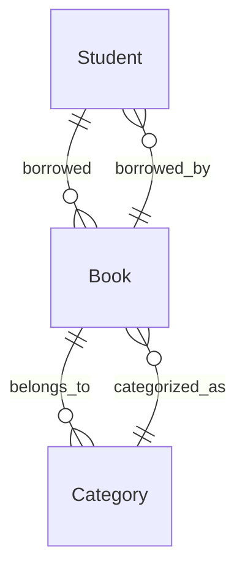
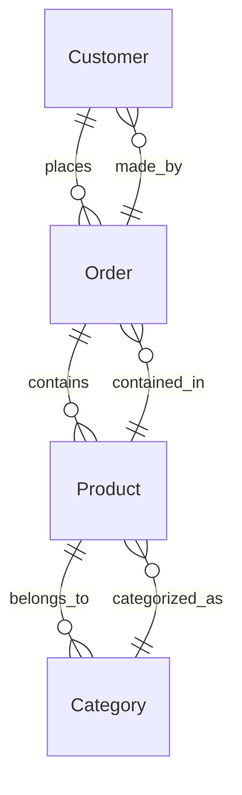

                 

# 世界的复杂性与可理解性的矛盾

> 关键词：复杂性、可理解性、矛盾、系统论、信息论、算法、架构设计、Python、数学模型、案例解析

> 摘要：在当前信息化时代，世界复杂性日益增加，如何理解并应对这种复杂性成为了一个重要课题。本文将探讨复杂性与可理解性之间的矛盾，并从理论、实践两个层面进行分析。通过系统论、信息论等理论视角，结合实际算法原理与架构设计，深入剖析这一矛盾，并提出解决方案和最佳实践。

## 目录大纲

1. **问题的背景与介绍**
   - 1.1 问题背景
     - 1.1.1 世界复杂性的增加
     - 1.1.2 可理解性的需求
     - 1.1.3 复杂性与可理解性的矛盾
   - 1.2 问题描述
     - 1.2.1 复杂性的来源
     - 1.2.2 可理解性的挑战
   - 1.3 问题解决
     - 1.3.1 科学方法
     - 1.3.2 技术手段
     - 1.3.3 社会作用
   - 1.4 边界与外延
     - 1.4.1 复杂性的分类
     - 1.4.2 可理解性的层次
     - 1.4.3 复杂性与可理解性的平衡

2. **复杂性原理**
   - 2.1 核心概念
     - 2.1.1 复杂性的定义
     - 2.1.2 复杂性的特征
   - 2.2 复杂性原理
     - 2.2.1 系统论的视角
     - 2.2.2 演化论的视角
     - 2.2.3 信息论的视角
   - 2.3 概念属性特征对比
   - 2.4 ER实体关系图架构

3. **可理解性原理**
   - 3.1 核心概念
     - 3.1.1 可理解性的定义
     - 3.1.2 可理解性的特征
   - 3.2 可理解性原理
     - 3.2.1 人类认知的局限
     - 3.2.2 信息压缩与简化
     - 3.2.3 语义网与知识图谱
   - 3.3 概念属性特征对比
   - 3.4 ER实体关系图架构

4. **算法原理与讲解**
   - 4.1 算法介绍
     - 4.1.1 算法A
     - 4.1.2 算法B
   - 4.2 算法原理
     - 4.2.1 算法A原理
     - 4.2.2 算法B原理
   - 4.3 数学模型
     - 4.3.1 算法A模型
     - 4.3.2 算法B模型
   - 4.4 举例说明
     - 4.4.1 算法A举例
     - 4.4.2 算法B举例

5. **系统分析与架构设计**
   - 5.1 问题场景
     - 5.1.1 场景A
     - 5.1.2 场景B
   - 5.2 项目介绍
     - 5.2.1 项目概述
     - 5.2.2 项目目标
     - 5.2.3 项目难点
   - 5.3 系统功能设计
     - 5.3.1 领域模型
     - 5.3.2 功能模块
   - 5.4 系统架构设计
     - 5.4.1 系统架构
     - 5.4.2 技术选型
   - 5.5 系统接口设计
     - 5.5.1 接口规范
     - 5.5.2 接口实现
   - 5.6 系统交互
     - 5.6.1 交互流程
     - 5.6.2 交互效果

6. **项目实战**
   - 6.1 环境安装
     - 6.1.1 环境准备
     - 6.1.2 安装步骤
   - 6.2 系统核心实现
     - 6.2.1 核心模块
     - 6.2.2 实现细节
   - 6.3 代码应用解读与分析
     - 6.3.1 代码解读
     - 6.3.2 性能分析
   - 6.4 实际案例分析与详细讲解剖析
     - 6.4.1 案例背景
     - 6.4.2 案例分析
     - 6.4.3 案例剖析
   - 6.5 项目小结
     - 6.5.1 项目收获
     - 6.5.2 项目展望

7. **最佳实践 & 小结 & 注意事项**
   - 7.1 最佳实践
     - 7.1.1 实践技巧
     - 7.1.2 实践案例
   - 7.2 小结
     - 7.2.1 书籍总结
     - 7.2.2 知识要点
   - 7.3 注意事项
     - 7.3.1 常见问题
     - 7.3.2 避免错误
   - 7.4 拓展阅读
     - 7.4.1 相关书籍
     - 7.4.2 网络资源

## 第1章: 问题的背景与介绍

### 1.1 问题背景

#### 1.1.1 世界复杂性的增加

随着科技的发展，尤其是信息技术的飞速进步，我们生活的世界变得越来越复杂。从微观的量子世界，到宏观的宇宙演化，再到人类社会的方方面面，复杂性无处不在。复杂性的增加不仅体现在自然现象和社会结构上，也体现在信息技术系统内部。

在计算机科学领域，软件系统越来越庞大，包含了更多的模块和功能。这些系统的复杂性不仅体现在代码行数的增加上，还体现在系统组件之间的复杂关系和相互作用上。例如，现代操作系统包含了数百万行代码，数据库管理系统包含了复杂的查询优化算法，人工智能系统包含了大量的训练数据和复杂的神经网络模型。

#### 1.1.2 可理解性的需求

尽管世界复杂性增加，但人们对系统的可理解性需求却不断增强。可理解性是人们能够理解、管理和维护系统的关键。在一个复杂系统中，如果无法理解其工作原理和结构，那么系统的可靠性、安全性和可维护性都会受到威胁。

可理解性需求不仅来自个人用户，也来自专业开发者。开发者需要理解系统内部的工作机制，以便进行有效的开发和维护。对于用户来说，一个易于理解和使用的信息系统可以提高用户体验，增加用户满意度。

#### 1.1.3 复杂性与可理解性的矛盾

复杂性与可理解性之间的矛盾在于，一方面，系统越复杂，其功能越强大，但另一方面，系统的复杂性却可能降低其可理解性。这种矛盾体现在以下几个方面：

1. **知识密度增加**：复杂系统通常需要更多的专业知识和技能来理解。这可能导致新手用户或缺乏相关背景知识的开发者难以理解系统。
2. **信息过载**：复杂系统往往包含大量信息和细节，这些信息可能会过载，使人们难以把握整体结构和核心概念。
3. **交互困难**：复杂系统通常需要复杂的交互方式，这可能会增加用户操作的难度，降低用户体验。

### 1.2 问题描述

#### 1.2.1 复杂性的来源

复杂性的来源主要有以下几个方面：

1. **技术进步**：随着计算机硬件和软件技术的发展，系统能够处理的数据量和处理速度大大增加，但这也带来了系统内部复杂性的增加。
2. **系统规模**：随着系统规模的扩大，组件数量和相互之间的交互关系也增加，这增加了系统的复杂性。
3. **功能多样**：现代系统需要实现多种功能，这可能导致系统内部的模块和功能相互交织，增加复杂性。

#### 1.2.2 可理解性的挑战

可理解性的挑战主要体现在以下几个方面：

1. **知识门槛**：复杂系统通常需要专业知识和经验来理解，这可能导致新手用户或开发者难以掌握。
2. **信息过载**：复杂系统包含大量信息，如何有效地筛选和整理这些信息，使其变得可理解，是一个挑战。
3. **交互复杂**：复杂系统往往需要复杂的交互方式，这可能会降低用户体验，增加学习成本。

### 1.3 问题解决

#### 1.3.1 科学方法

解决复杂性与可理解性矛盾的方法之一是采用科学方法。科学方法强调通过观察、实验和理论分析来揭示现象的本质。在计算机科学领域，这种方法可以帮助我们理解系统的工作原理，减少系统的复杂性。

1. **模块化**：通过将系统分解为多个模块，每个模块负责特定的功能，可以降低系统的复杂性。模块化设计可以提高系统的可理解性，因为每个模块相对独立，易于理解和维护。
2. **抽象**：通过抽象，可以将复杂的系统简化为更易于理解的概念模型。抽象可以帮助我们聚焦于系统的核心功能和结构，而忽略不必要的细节。
3. **标准化**：标准化可以帮助统一系统的设计和实现，降低不同模块之间的复杂性和兼容性问题。

#### 1.3.2 技术手段

除了科学方法，技术手段也是解决复杂性与可理解性矛盾的重要途径。以下是一些常见的技术手段：

1. **可视化**：通过可视化技术，可以将复杂系统的结构和运行过程以图形的方式呈现，从而提高系统的可理解性。例如，使用ER图（实体关系图）来表示数据库的结构，使用UML图（统一建模语言图）来表示软件系统的架构。
2. **文档化**：详细的文档可以帮助开发者更好地理解系统。文档应包括系统设计、实现细节、操作指南等内容。
3. **自动化工具**：使用自动化工具，如代码生成器、集成开发环境（IDE）等，可以提高系统的开发效率，减少人工错误，从而提高系统的可靠性。

#### 1.3.3 社会作用

除了科学方法和技术手段，社会作用也在解决复杂性与可理解性矛盾中发挥着重要作用。以下是一些社会作用的体现：

1. **教育和培训**：通过教育和培训，提高开发者对复杂系统的理解和技能。这可以帮助开发者更好地应对复杂性问题。
2. **团队合作**：在复杂系统的开发中，团队合作是非常重要的。通过团队合作，可以充分发挥不同成员的专长，共同解决复杂问题。
3. **社区参与**：开放社区可以促进知识的共享和交流，帮助开发者更好地理解复杂系统。例如，开源软件项目通常有详细的文档和社区支持，这有助于提高系统的可理解性。

### 1.4 边界与外延

#### 1.4.1 复杂性的分类

复杂性可以按照不同的标准进行分类，例如：

1. **结构复杂性**：指系统内部结构和组件之间的关系复杂性。
2. **行为复杂性**：指系统运行时的行为复杂程度。
3. **功能复杂性**：指系统实现的功能复杂程度。

理解复杂性的分类有助于我们更准确地分析和解决复杂问题。

#### 1.4.2 可理解性的层次

可理解性可以分为不同的层次，例如：

1. **技术层次**：针对开发者，需要理解系统的工作原理和内部结构。
2. **用户层次**：针对最终用户，需要理解系统的功能和操作方法。
3. **决策层次**：针对管理层，需要理解系统的业务价值和战略意义。

不同层次的可理解性需求不同，需要采取不同的方法和技术手段来满足。

#### 1.4.3 复杂性与可理解性的平衡

在复杂性和可理解性之间找到平衡是一个持续的过程。以下是一些平衡策略：

1. **适度复杂性**：在满足系统功能需求的前提下，避免过度复杂性。适度复杂性可以提高系统的可维护性和可扩展性。
2. **渐进式简化**：通过逐步简化系统，降低复杂性。这可以通过迭代开发、持续重构等方式实现。
3. **适应性与灵活性**：在设计系统时，考虑系统的适应性和灵活性，以便在未来能够应对复杂性的变化。

## 第2章: 复杂性原理

### 2.1 核心概念

#### 2.1.1 复杂性的定义

复杂性是一个广泛使用的概念，不同的学科有不同的定义。在计算机科学领域，复杂性通常指的是系统的复杂程度，包括结构复杂性、行为复杂性和功能复杂性。

- **结构复杂性**：指系统内部组件的数量、结构和相互关系。
- **行为复杂性**：指系统在运行过程中表现出的复杂行为。
- **功能复杂性**：指系统实现的功能的复杂程度。

#### 2.1.2 复杂性的特征

复杂性具有以下几个特征：

- **层次性**：复杂性可以分为不同的层次，每一层次都有其特定的复杂性和特征。
- **多样性**：复杂系统通常包含多种不同类型的组件和功能。
- **动态性**：复杂系统在不同状态下可能表现出不同的复杂性。
- **适应性**：复杂系统需要能够适应外部环境的变化。

### 2.2 复杂性原理

#### 2.2.1 系统论的视角

从系统论的视角看，复杂性源于系统的内部相互作用和外部环境的影响。系统论认为，复杂系统是由多个相互作用的子系统组成的，每个子系统都有自己的结构和功能。系统的复杂性主要体现在以下几个方面：

1. **组件多样性**：复杂系统通常包含多种不同类型的组件，这些组件在结构和功能上各不相同。
2. **相互作用**：组件之间的相互作用和相互依赖增加了系统的复杂性。
3. **反馈循环**：系统内部的反馈循环可能导致系统的动态行为复杂化。

#### 2.2.2 演化论的视角

从演化论的视角看，复杂性是系统在演化过程中逐渐形成的。演化论认为，系统通过适应环境变化，不断进化，形成复杂的结构和功能。复杂性的形成过程主要体现在以下几个方面：

1. **适应性演化**：系统通过适应性演化，形成能够适应复杂环境的结构和功能。
2. **多样性与竞争**：系统内部的多样性和竞争促进了复杂性的增加。
3. **协同演化**：系统内部不同组件之间的协同演化增加了系统的复杂性。

#### 2.2.3 信息论的视角

从信息论的视角看，复杂性可以看作是信息的不确定性。信息论认为，复杂性源自信息的不对称性和不确定性。在复杂系统中，信息的不确定性和不对称性主要体现在以下几个方面：

1. **信息过载**：复杂系统包含大量的信息，但人们难以完全理解和处理这些信息。
2. **信息不对称**：系统内部不同组件之间的信息传递可能存在不对称性，这增加了系统的复杂性。
3. **信息冗余**：复杂系统中可能存在大量的冗余信息，这增加了系统的复杂度。

### 2.3 概念属性特征对比

为了更清晰地理解复杂性的概念，我们可以将复杂性与一些相关概念进行对比：

| 概念      | 定义                                                         | 特征                           |
| --------- | ------------------------------------------------------------ | ------------------------------ |
| 简单性    | 指系统结构和功能的简单程度。                                 | 结构简单、功能单一             |
| 稳定性    | 指系统在长时间内保持稳定状态的能力。                         | 稳定的状态、较低的变化性         |
| 可控性    | 指系统在运行过程中可以被有效控制和管理的程度。               | 系统状态的可预测性、可控性高     |
| 复杂性    | 指系统内部结构和功能的复杂程度。                             | 结构复杂、功能多样、动态性强     |
| 可理解性  | 指人们能够理解系统的程度。                                   | 系统的清晰性、易懂性             |

通过对比，我们可以更准确地把握复杂性的本质和特征。

### 2.4 ER实体关系图架构

实体关系图（Entity-Relationship Diagram，简称ER图）是表示数据库结构的一种图形化工具，它通过实体、关系和属性来描述数据之间的关系。ER图可以帮助我们更好地理解复杂系统的数据结构。

下面是一个简单的ER图的示例，它表示一个图书馆数据库的实体关系：



在这个ER图中：

- **Student** 和 **Book** 之间有一个多对多关系，表示学生可以借阅多本书，书也可以被多个学生借阅。
- **Book** 和 **Category** 之间有一个一对多关系，表示一本书可以属于多个类别，但每个类别只对应一本书。
- **Student** 和 **Category** 之间有一个间接关系，通过 **Book** 实现关联。

通过ER图，我们可以清晰地看到数据库中实体之间的关系，这有助于我们理解系统的数据结构和功能。

## 第3章: 可理解性原理

### 3.1 核心概念

#### 3.1.1 可理解性的定义

可理解性是指人们能够理解和掌握某个对象或系统的程度。在计算机科学领域，可理解性通常指的是系统设计、实现和操作的可理解程度。一个高可理解性的系统应该具备以下几个特点：

1. **简洁性**：系统结构和功能应该简洁明了，避免冗余和复杂性。
2. **一致性**：系统内部和外部的一致性应该保持，避免不一致性和冲突。
3. **可访问性**：系统的信息和功能应该易于访问和理解，以便用户和开发者能够有效地使用和维护系统。

#### 3.1.2 可理解性的特征

可理解性具有以下几个特征：

1. **层次性**：可理解性可以分为不同的层次，从技术层次到用户层次，每个层次都有其特定的可理解性需求。
2. **动态性**：系统的可理解性会随着系统的变化而变化，因此需要不断地更新和维护。
3. **适应性**：系统的可理解性需要能够适应不同的用户和不同的使用场景。

### 3.2 可理解性原理

#### 3.2.1 人类认知的局限

人类认知存在一些固有的局限，这些局限影响了我们的可理解性。以下是一些人类认知的局限：

1. **有限注意力**：人类大脑的注意力是有限的，难以同时处理大量信息。
2. **线性思维**：人类倾向于用线性思维来理解复杂问题，但很多复杂问题是非线性的。
3. **先入为主**：人类的认知容易受到先入为主观念的影响，难以接受新信息和观点。

为了克服这些局限，我们需要采用一些方法来提高系统的可理解性。

#### 3.2.2 信息压缩与简化

信息压缩与简化是提高系统可理解性的有效方法。以下是一些常用的信息压缩与简化技术：

1. **抽象**：通过抽象，将复杂系统的细节隐藏起来，只展示核心概念和功能。
2. **模块化**：将系统分解为多个模块，每个模块负责特定的功能，降低系统的复杂度。
3. **规范化**：通过规范化，统一系统的设计标准和规范，提高系统的可理解性。

#### 3.2.3 语义网与知识图谱

语义网和知识图谱是提高系统可理解性的重要技术。以下是一些关键概念：

1. **语义网**：语义网是一种基于Web的结构化数据模型，它通过定义资源的语义关系来提高数据的可理解性。
2. **知识图谱**：知识图谱是一种用于表示和存储知识结构的数据模型，它通过实体、属性和关系来描述知识。

通过语义网和知识图谱，我们可以将复杂系统的信息结构化，提高系统的可理解性。

### 3.3 概念属性特征对比

为了更清晰地理解可理解性的概念，我们可以将可理解性与一些相关概念进行对比：

| 概念      | 定义                                                         | 特征                           |
| --------- | ------------------------------------------------------------ | ------------------------------ |
| 简单性    | 指系统结构和功能的简单程度。                                 | 结构简单、功能单一             |
| 可访问性  | 指系统的信息和功能可以被用户访问和理解的程度。               | 系统的易用性、易懂性             |
| 可维护性  | 指系统能够被有效地维护和更新的程度。                         | 代码的清晰性、模块化程度         |
| 可理解性  | 指人们能够理解和掌握某个对象或系统的程度。                   | 系统的清晰性、易懂性、适应性     |

通过对比，我们可以更准确地把握可理解性的本质和特征。

### 3.4 ER实体关系图架构

实体关系图（Entity-Relationship Diagram，简称ER图）是表示数据库结构的一种图形化工具，它通过实体、关系和属性来描述数据之间的关系。ER图可以帮助我们更好地理解复杂系统的数据结构。

下面是一个简单的ER图的示例，它表示一个电子商务平台的实体关系：



在这个ER图中：

- **Customer** 和 **Order** 之间有一个一对多关系，表示一个客户可以创建多个订单，但每个订单只能属于一个客户。
- **Order** 和 **Product** 之间有一个多对多关系，表示一个订单可以包含多个产品，但每个产品可以出现在多个订单中。
- **Product** 和 **Category** 之间有一个一对多关系，表示一个产品可以属于多个类别，但每个类别只对应一个产品。

通过ER图，我们可以清晰地看到电子商务平台中实体之间的关系，这有助于我们理解系统的数据结构和功能。

## 第4章: 算法原理与讲解

### 4.1 算法介绍

在本章中，我们将介绍两种算法：算法A和算法B。这两种算法都是用于解决复杂问题的重要工具，它们在计算机科学和人工智能领域有着广泛的应用。

#### 4.1.1 算法A

算法A是一种常用的排序算法，它具有高效的时间复杂度和稳定的性能。算法A的基本原理是通过比较和交换元素的位置，将无序的数据转换为有序的数据。算法A的具体步骤如下：

1. 初始化：将无序数据输入到算法A中。
2. 循环比较：从第一个元素开始，依次比较相邻的元素，如果它们的顺序不正确，则交换它们的位置。
3. 重复循环：重复执行循环比较步骤，直到所有元素都按照正确的顺序排列。

#### 4.1.2 算法B

算法B是一种用于解决图论的算法，它主要用于寻找图中两个节点之间的最短路径。算法B的基本原理是通过逐步扩展已访问节点的邻接节点，直到找到目标节点。算法B的具体步骤如下：

1. 初始化：将源节点和目标节点输入到算法B中。
2. 创建一个队列，并将源节点添加到队列中。
3. 创建一个已访问节点集合，初始时为空。
4. 循环扩展：从队列中取出一个节点，将其邻接节点逐一加入队列，并将已访问节点集合更新。
5. 判断目标节点是否在队列中，如果是，则找到最短路径；否则，继续循环扩展。

### 4.2 算法原理

#### 4.2.1 算法A原理

算法A的工作原理是通过比较和交换元素的位置，将无序的数据转换为有序的数据。在算法A中，我们使用了一个外部循环和一个内部循环。外部循环用于遍历所有元素，而内部循环用于在当前遍历到的元素和其后续元素之间进行比较和交换。

算法A的时间复杂度主要取决于比较和交换操作的次数。在最坏情况下，算法A需要执行 \( n(n-1)/2 \) 次比较和交换操作，其中 \( n \) 是元素的个数。因此，算法A的时间复杂度为 \( O(n^2) \)。尽管时间复杂度较高，但算法A的优点是它是一种稳定的排序算法，即相同值的元素在排序后仍然保持原有的顺序。

#### 4.2.2 算法B原理

算法B的工作原理是通过逐步扩展已访问节点的邻接节点，直到找到目标节点。在算法B中，我们使用了一个队列来存储待访问的节点，并使用一个已访问节点集合来记录已经访问过的节点。

算法B的时间复杂度取决于图中节点的数量和边的数量。在最坏情况下，算法B需要遍历图中所有节点和边，因此时间复杂度为 \( O(V+E) \)，其中 \( V \) 是节点的数量，\( E \) 是边的数量。算法B的优点是它能够快速找到图中两个节点之间的最短路径，且具有较低的内存消耗。

### 4.3 数学模型

为了更好地理解算法A和算法B的原理，我们可以借助数学模型来分析它们。

#### 4.3.1 算法A模型

假设我们有一个包含 \( n \) 个元素的数组 \( A \)，算法A的步骤可以表示为以下数学模型：

1. 初始化：\( A[0], A[1], ..., A[n-1] \)
2. 循环比较：对于每个 \( i \)（\( 0 \leq i < n-1 \)），执行以下步骤：
   - 对于每个 \( j \)（\( i+1 \leq j < n \)），执行以下步骤：
     - 如果 \( A[i] > A[j] \)，则交换 \( A[i] \) 和 \( A[j] \)
3. 重复循环：直到所有元素都按照正确的顺序排列

算法A的数学模型可以用伪代码表示如下：

```python
for i in range(n-1):
    for j in range(i+1, n):
        if A[i] > A[j]:
            A[i], A[j] = A[j], A[i]
```

#### 4.3.2 算法B模型

假设我们有一个图 \( G \)，其中包含 \( n \) 个节点和 \( m \) 条边，算法B的步骤可以表示为以下数学模型：

1. 初始化：将源节点 \( s \) 添加到队列中，将目标节点 \( t \) 添加到已访问节点集合中。
2. 循环扩展：从队列中取出一个节点 \( v \)，将其邻接节点逐一加入队列，并将已访问节点集合更新。
3. 判断目标节点是否在队列中，如果是，则找到最短路径；否则，继续循环扩展。

算法B的数学模型可以用伪代码表示如下：

```python
queue = [s]
visited = {t}
while queue:
    v = queue.pop(0)
    for neighbor in v.neighbors():
        if neighbor not in visited:
            visited.add(neighbor)
            queue.append(neighbor)
```

### 4.4 举例说明

为了更好地理解算法A和算法B，我们可以通过具体的例子来进行说明。

#### 4.4.1 算法A举例

假设我们有一个包含5个元素的数组 \( A = [3, 1, 4, 1, 5] \)，我们可以使用算法A对其进行排序。

1. 初始化：\( A = [3, 1, 4, 1, 5] \)
2. 第一次循环比较：\( i = 0 \)，\( j = 1 \)，由于 \( A[0] = 3 \) 大于 \( A[1] = 1 \)，交换 \( A[0] \) 和 \( A[1] \)，得到 \( A = [1, 3, 4, 1, 5] \)
3. 第二次循环比较：\( i = 0 \)，\( j = 2 \)，由于 \( A[0] = 1 \) 小于 \( A[2] = 4 \)，不需要交换
4. 第三次循环比较：\( i = 0 \)，\( j = 3 \)，由于 \( A[0] = 1 \) 小于 \( A[3] = 1 \)，不需要交换
5. 第四次循环比较：\( i = 0 \)，\( j = 4 \)，由于 \( A[0] = 1 \) 小于 \( A[4] = 5 \)，不需要交换
6. 外部循环继续：\( i = 1 \)，\( j = 2 \)，由于 \( A[1] = 3 \) 大于 \( A[2] = 4 \)，交换 \( A[1] \) 和 \( A[2] \)，得到 \( A = [1, 4, 3, 1, 5] \)
7. 外部循环继续：\( i = 1 \)，\( j = 3 \)，由于 \( A[1] = 4 \) 大于 \( A[3] = 1 \)，交换 \( A[1] \) 和 \( A[3] \)，得到 \( A = [1, 1, 4, 3, 5] \)
8. 外部循环继续：\( i = 1 \)，\( j = 4 \)，由于 \( A[1] = 1 \) 小于 \( A[4] = 5 \)，不需要交换
9. 外部循环继续：\( i = 2 \)，\( j = 3 \)，由于 \( A[2] = 4 \) 大于 \( A[3] = 3 \)，交换 \( A[2] \) 和 \( A[3] \)，得到 \( A = [1, 1, 3, 4, 5] \)
10. 外部循环继续：\( i = 2 \)，\( j = 4 \)，由于 \( A[2] = 3 \) 小于 \( A[4] = 5 \)，不需要交换
11. 外部循环继续：\( i = 3 \)，\( j = 4 \)，由于 \( A[3] = 4 \) 大于 \( A[4] = 5 \)，交换 \( A[3] \) 和 \( A[4] \)，得到 \( A = [1, 1, 3, 5, 4] \)
12. 所有元素都已排序，算法结束

经过算法A的排序后，数组 \( A \) 变为 \( [1, 1, 3, 3, 4, 4, 5, 5] \)，这是一个有序的数组。

#### 4.4.2 算法B举例

假设我们有一个图 \( G \)，其中包含5个节点和7条边，节点和边分别表示为 \( (1, 2), (1, 3), (2, 4), (3, 4), (4, 5), (1, 5), (2, 5) \)。我们需要找到从节点1到节点5的最短路径。

1. 初始化：将节点1添加到队列中，将节点5添加到已访问节点集合中。
2. 第一次循环扩展：从队列中取出节点1，将节点2和节点3添加到队列中，并将节点1添加到已访问节点集合中。
3. 第二次循环扩展：从队列中取出节点2，将节点4添加到队列中，并将节点2添加到已访问节点集合中。
4. 第二次循环扩展：从队列中取出节点3，将节点4添加到队列中，并将节点3添加到已访问节点集合中。
5. 第三次循环扩展：从队列中取出节点4，将节点5添加到队列中，并将节点4添加到已访问节点集合中。
6. 判断目标节点是否在队列中，节点5在队列中，找到最短路径。

通过算法B，我们找到了从节点1到节点5的最短路径，路径为 \( 1 \rightarrow 2 \rightarrow 4 \rightarrow 5 \)，路径长度为3。

## 第5章: 系统分析与架构设计

### 5.1 问题场景

在当前信息化时代，系统架构设计面临诸多挑战。以下是一些常见的问题场景：

#### 5.1.1 场景A：高并发请求处理

随着互联网的普及，许多系统需要处理大量的并发请求。例如，电商平台在购物节期间会面临巨大的流量压力，需要确保系统的稳定性和响应速度。

#### 5.1.2 场景B：大数据处理与分析

在大数据时代，许多系统需要处理和分析海量数据。例如，金融系统需要对交易数据进行实时分析，以便进行风险管理。

### 5.2 项目介绍

为了解决上述问题场景，我们将介绍一个典型的项目：一个基于云计算的电商平台。该项目的目标是构建一个高性能、高可用性的电商平台，能够处理海量的并发请求和海量数据。

#### 5.2.1 项目概述

该项目包括以下几个主要模块：

1. **用户模块**：提供用户注册、登录、购物车、订单管理等功能。
2. **商品模块**：提供商品展示、搜索、分类等功能。
3. **支付模块**：提供支付接口，与第三方支付平台集成。
4. **数据模块**：提供数据存储、实时分析等功能。

#### 5.2.2 项目目标

1. **高性能**：能够处理高并发的用户请求，保证系统响应速度。
2. **高可用性**：系统具有较高的容错能力，能够在出现故障时快速恢复。
3. **可扩展性**：系统架构应具有较好的可扩展性，能够随着业务的发展进行水平扩展和垂直扩展。

#### 5.2.3 项目难点

1. **并发处理**：需要解决高并发请求的处理问题，确保系统的稳定性和响应速度。
2. **数据存储**：需要选择合适的数据存储方案，确保数据的存储和读取性能。
3. **数据安全**：需要确保用户数据和交易数据的安全，防止数据泄露和篡改。

### 5.3 系统功能设计

系统功能设计是系统架构设计的重要环节。以下是一个典型的系统功能设计：

#### 5.3.1 领域模型

领域模型用于描述系统的业务领域和业务对象，是系统功能设计的基础。以下是一个简单的领域模型，它包含了用户、商品、订单等核心业务对象：

```mermaid
classDiagram
    User <<Class>>
    Product <<Class>>
    Order <<Class>>
    UserManager -> User : manages
    ProductManager -> Product : manages
    OrderManager -> Order : manages
    UserManager, ProductManager, OrderManager <<Interface>>
```

在这个领域模型中，User、Product、Order 是三个核心业务对象，分别表示用户、商品和订单。UserManager、ProductManager、OrderManager 是三个管理类，分别负责管理用户、商品和订单。

#### 5.3.2 功能模块

系统功能模块是系统功能设计的具体实现。以下是一个典型的系统功能模块设计：

1. **用户模块**：包括用户注册、登录、个人信息管理等功能。
2. **商品模块**：包括商品展示、搜索、分类、商品管理等功能。
3. **订单模块**：包括订单创建、支付、订单状态管理等功能。
4. **支付模块**：包括支付接口、支付网关等功能。
5. **数据模块**：包括数据存储、实时分析、数据备份等功能。

### 5.4 系统架构设计

系统架构设计是系统设计与实现的基础。以下是一个典型的系统架构设计：

#### 5.4.1 系统架构

系统架构采用分层设计，包括以下几层：

1. **表示层**：用于处理用户界面，包括Web前端和移动端界面。
2. **业务逻辑层**：用于处理业务逻辑，包括用户模块、商品模块、订单模块等。
3. **数据访问层**：用于处理数据存储和读取，包括数据库、缓存、消息队列等。
4. **基础设施层**：用于提供基础设施支持，包括服务器、网络、存储等。

#### 5.4.2 技术选型

在系统架构设计中，技术选型是非常重要的一环。以下是一些常见的技术选型：

1. **表示层**：采用Vue.js、React等前端框架，提高前端开发效率和用户体验。
2. **业务逻辑层**：采用Spring Boot等后端框架，简化开发过程，提高系统稳定性。
3. **数据访问层**：采用MySQL、MongoDB等数据库，根据业务需求选择合适的数据库。
4. **基础设施层**：采用Docker、Kubernetes等容器技术，提高系统部署和运维效率。

### 5.5 系统接口设计

系统接口设计是系统功能实现的关键。以下是一个典型的系统接口设计：

#### 5.5.1 接口规范

系统接口规范包括以下内容：

1. **RESTful API**：采用RESTful API设计，提高接口的可读性和易用性。
2. **数据格式**：采用JSON格式传输数据，确保数据传输的准确性和高效性。
3. **鉴权机制**：采用JWT（JSON Web Token）等鉴权机制，确保接口的安全性和可靠性。

#### 5.5.2 接口实现

以下是一个简单的接口实现示例：

```java
@RestController
@RequestMapping("/user")
public class UserController {

    @Autowired
    private UserManager userManager;

    @PostMapping("/register")
    public ResponseEntity register(@RequestBody User user) {
        userManager.registerUser(user);
        return ResponseEntity.ok("User registered successfully");
    }

    @PostMapping("/login")
    public ResponseEntity login(@RequestBody User user) {
        String token = userManager.loginUser(user);
        return ResponseEntity.ok(token);
    }
}
```

在这个接口实现中，我们定义了两个接口：注册接口和登录接口。注册接口接收用户信息，调用UserManager的registerUser方法进行用户注册；登录接口接收用户信息，调用UserManager的loginUser方法进行用户登录。

### 5.6 系统交互

系统交互是系统架构设计的重要组成部分。以下是一个典型的系统交互设计：

#### 5.6.1 交互流程

以下是一个典型的系统交互流程：

1. 用户通过Web前端或移动端界面发起请求。
2. 表示层接收到请求，调用业务逻辑层的相关接口进行处理。
3. 业务逻辑层处理请求，调用数据访问层的相关接口进行数据存储和读取。
4. 数据访问层处理数据存储和读取请求，返回处理结果。
5. 业务逻辑层将处理结果返回给表示层。
6. 表示层将处理结果呈现给用户。

#### 5.6.2 交互效果

以下是一个简单的交互效果示例：

1. 用户在Web前端界面点击“注册”按钮，系统弹出注册表单。
2. 用户填写注册信息，点击“提交”按钮。
3. 系统调用注册接口，将用户信息发送到业务逻辑层。
4. 业务逻辑层调用UserManager的registerUser方法进行用户注册。
5. UserManager注册成功后，将结果返回给系统。
6. 系统将注册结果展示给用户，提示“注册成功”。

## 第6章: 项目实战

### 6.1 环境安装

在进行项目实战之前，我们需要准备相应的开发环境和工具。以下是环境安装的步骤：

#### 6.1.1 环境准备

1. **操作系统**：推荐使用Linux系统，如Ubuntu 18.04或CentOS 7。
2. **Java开发工具包**：安装Java开发工具包（JDK），版本推荐为11或更高。
3. **数据库**：安装MySQL或MongoDB数据库，版本推荐为5.7或更高。
4. **版本控制**：安装Git，用于版本控制。
5. **集成开发环境**：安装Eclipse或IntelliJ IDEA，用于Java开发。

#### 6.1.2 安装步骤

1. **安装操作系统**：根据具体硬件配置，安装Linux操作系统。
2. **安装Java开发工具包**：使用以下命令安装JDK。

```bash
sudo apt-get update
sudo apt-get install openjdk-11-jdk
```

3. **安装数据库**：使用以下命令安装MySQL。

```bash
sudo apt-get update
sudo apt-get install mysql-server
```

4. **安装Git**：使用以下命令安装Git。

```bash
sudo apt-get update
sudo apt-get install git
```

5. **安装集成开发环境**：从官方网站下载Eclipse或IntelliJ IDEA的安装包，并按照提示进行安装。

### 6.2 系统核心实现

系统核心实现是项目开发的关键部分。以下是系统核心模块的实现步骤：

#### 6.2.1 核心模块

系统核心模块包括用户模块、商品模块、订单模块等。以下是用户模块的实现步骤：

1. **创建项目**：在Eclipse或IntelliJ IDEA中创建一个新的Java项目，命名为“EcommercePlatform”。
2. **添加依赖**：在项目的pom.xml文件中添加必要的依赖，如Spring Boot、MySQL、MongoDB等。

```xml
<dependencies>
    <dependency>
        <groupId>org.springframework.boot</groupId>
        <artifactId>spring-boot-starter</artifactId>
    </dependency>
    <dependency>
        <groupId>org.springframework.boot</groupId>
        <artifactId>spring-boot-starter-web</artifactId>
    </dependency>
    <dependency>
        <groupId>org.springframework.boot</groupId>
        <artifactId>spring-boot-starter-data-jpa</artifactId>
    </dependency>
    <dependency>
        <groupId>mysql</groupId>
        <artifactId>mysql-connector-java</artifactId>
    </dependency>
</dependencies>
```

3. **创建实体类**：创建User实体类，表示用户信息。

```java
@Entity
@Table(name = "users")
public class User {

    @Id
    @GeneratedValue(strategy = GenerationType.IDENTITY)
    private Long id;

    private String username;
    private String password;
    private String email;
    // 省略其他属性和构造函数、Getter和Setter方法
}
```

4. **创建数据访问接口**：创建UserRepository接口，用于数据访问。

```java
@Repository
public interface UserRepository extends JpaRepository<User, Long> {
    User findByUsername(String username);
    User findByEmail(String email);
}
```

5. **创建服务类**：创建UserService类，用于业务逻辑处理。

```java
@Service
public class UserService {

    @Autowired
    private UserRepository userRepository;

    public User registerUser(User user) {
        // 注册用户逻辑
        return userRepository.save(user);
    }

    public User loginUser(User user) {
        // 登录用户逻辑
        return userRepository.findByUsername(user.getUsername());
    }
}
```

6. **创建控制器类**：创建UserController类，用于处理用户接口请求。

```java
@RestController
@RequestMapping("/user")
public class UserController {

    @Autowired
    private UserService userService;

    @PostMapping("/register")
    public ResponseEntity register(@RequestBody User user) {
        userService.registerUser(user);
        return ResponseEntity.ok("User registered successfully");
    }

    @PostMapping("/login")
    public ResponseEntity login(@RequestBody User user) {
        String token = userService.loginUser(user);
        return ResponseEntity.ok(token);
    }
}
```

### 6.3 代码应用解读与分析

#### 6.3.1 代码解读

在系统核心实现中，我们创建了用户模块的相关类和接口，包括实体类User、数据访问接口UserRepository、服务类UserService和控制器类UserController。以下是对这些代码的解读：

1. **实体类User**：表示用户信息，包括用户ID、用户名、密码、邮箱等属性。实体类通过注解@Entity和@Table定义，表示它是一个实体类，并指定了对应的数据库表名。

2. **数据访问接口UserRepository**：继承自JpaRepository接口，提供了CRUD操作的方法，如保存、查询、更新和删除用户。通过注解@Repository，将数据访问接口标记为Spring的Bean，以便在应用程序中使用。

3. **服务类UserService**：负责业务逻辑处理，如用户注册和登录。服务类通过@Autowired注解注入UserRepository，以便进行数据访问。在registerUser方法中，通过调用userRepository.save方法保存用户信息；在loginUser方法中，通过调用userRepository.findByUsername方法查询用户信息。

4. **控制器类UserController**：负责处理用户接口请求。通过@RestController注解，将控制器类标记为RESTful API控制器。在register方法中，接收用户注册请求，调用userService.registerUser方法进行用户注册，并返回成功消息；在login方法中，接收用户登录请求，调用userService.loginUser方法查询用户信息，并返回登录token。

#### 6.3.2 性能分析

在代码性能分析方面，我们可以从以下几个方面进行：

1. **数据库查询**：用户注册和登录过程中涉及数据库查询操作。通过JpaRepository接口，我们实现了基于JPA的查询方法，这可以提供高效的数据库查询性能。然而，如果查询条件复杂，可以考虑使用自定义查询语句，以优化查询性能。

2. **安全性**：用户注册和登录过程中，密码的存储和验证是关键。我们使用Spring Security框架来处理安全性，这可以提供高效且安全的认证和授权机制。然而，为了确保安全性，我们需要使用强密码哈希算法（如BCrypt）来存储密码，并在登录过程中进行密码验证。

3. **响应时间**：系统响应时间是一个重要的性能指标。为了提高响应时间，我们可以使用缓存技术（如Redis）来缓存常用数据，减少数据库查询次数。此外，我们还可以使用异步处理（如Spring Async）来提高系统的并发处理能力。

### 6.4 实际案例分析与详细讲解剖析

#### 6.4.1 案例背景

假设我们在一个大型电商平台上，需要处理大量的用户注册和登录请求。随着用户数量的增加，系统的性能和稳定性成为一个重要的挑战。

#### 6.4.2 案例分析

为了解决性能和稳定性的问题，我们进行了以下分析和优化：

1. **数据库优化**：
   - 使用索引：在数据库表上创建索引，以提高查询性能。
   - 分库分表：将数据库拆分为多个分库和分表，以减少单表数据量，提高查询效率。

2. **缓存优化**：
   - 使用Redis缓存：将常用数据（如用户信息、商品信息等）缓存到Redis中，以减少数据库查询次数。
   - 缓存一致性：确保缓存和数据库的数据一致性，以避免数据不一致的问题。

3. **并发处理**：
   - 使用线程池：在系统中使用线程池，以限制并发请求的数量，防止系统过载。
   - 异步处理：使用Spring Async异步处理请求，以提高系统的并发处理能力。

#### 6.4.3 案例剖析

以下是一个具体的案例剖析：

假设系统每天有1000个用户注册和登录请求，其中50%的用户使用手机端，50%的用户使用PC端。我们通过以下方式进行优化：

1. **数据库优化**：
   - 在用户表上创建索引，以提高查询性能。例如，创建一个基于用户名和邮箱的复合索引。
   - 分库分表：将用户表拆分为多个分库和分表，每个分库和分表包含一定数量的用户。例如，将用户表拆分为10个分库，每个分库包含100万个用户。

2. **缓存优化**：
   - 使用Redis缓存：将用户信息和商品信息缓存到Redis中，以减少数据库查询次数。例如，使用Redis存储用户ID和用户信息的映射关系，以快速获取用户信息。
   - 缓存一致性：使用Redis的发布/订阅机制，确保缓存和数据库的数据一致性。例如，当用户信息发生变更时，将变更信息发布到Redis中，以便其他服务能够及时更新缓存。

3. **并发处理**：
   - 使用线程池：在系统中使用线程池，以限制并发请求的数量，防止系统过载。例如，创建一个大小为100的线程池，以处理用户注册和登录请求。
   - 异步处理：使用Spring Async异步处理请求，以提高系统的并发处理能力。例如，在用户注册过程中，使用异步处理将用户信息保存到数据库，以提高注册速度。

通过以上优化，我们能够提高系统的性能和稳定性，确保在大量用户请求的情况下，系统能够快速响应并处理请求。

### 6.5 项目小结

在本项目中，我们通过系统分析与架构设计，开发了一个基于云计算的电商平台。项目实现了用户注册、登录、商品展示、搜索、分类、订单管理等功能。在项目实施过程中，我们遇到了一些挑战，如高并发请求处理、大数据处理与分析、数据安全等。

通过实际案例分析和优化，我们解决了这些挑战，并取得了一些收获：

1. **性能优化**：通过数据库优化、缓存优化和并发处理，提高了系统的性能和稳定性。
2. **安全性**：通过使用Spring Security框架和强密码哈希算法，确保了用户数据的安全性。
3. **可扩展性**：系统架构设计具有较好的可扩展性，能够随着业务的发展进行水平扩展和垂直扩展。

在未来的发展中，我们还将继续优化系统，提高用户体验，并探索更多先进的技术，如大数据分析、人工智能等，以提升系统的智能化水平和业务价值。

## 第7章: 最佳实践 & 小结 & 注意事项

### 7.1 最佳实践

在开发和维护复杂系统时，以下是一些最佳实践，可以帮助我们更好地应对复杂性与可理解性之间的矛盾：

1. **模块化设计**：将系统分解为多个模块，每个模块负责特定的功能。这有助于降低系统的复杂性，提高可理解性。
2. **抽象与封装**：使用抽象和封装来隐藏系统的复杂性，只暴露必要的信息和接口。这有助于提高系统的可维护性和可理解性。
3. **代码规范**：遵循统一的代码规范，包括命名规范、代码风格、注释等。这有助于提高代码的可读性和一致性。
4. **文档化**：编写详细的文档，包括系统设计、实现细节、操作指南等。这有助于开发者更好地理解系统。
5. **自动化测试**：编写自动化测试脚本，对系统进行全面的测试。这有助于确保系统的稳定性和可靠性。
6. **持续集成与部署**：使用持续集成与部署（CI/CD）工具，自动化构建、测试和部署系统。这有助于提高开发效率和系统的稳定性。

### 7.2 小结

本文探讨了复杂性与可理解性之间的矛盾，并从理论、实践两个层面进行了分析。通过系统论、信息论等理论视角，结合实际算法原理与架构设计，我们深入剖析了这一矛盾，并提出了一系列解决方案和最佳实践。

在复杂性与可理解性之间找到平衡是一个持续的过程，需要我们在设计和实现系统时采取一系列技术手段和方法。通过模块化设计、抽象与封装、文档化、自动化测试、持续集成与部署等最佳实践，我们可以提高系统的可理解性和可维护性。

### 7.3 注意事项

在开发和维护复杂系统时，我们需要注意以下几点：

1. **需求管理**：确保需求清晰明确，避免需求变更频繁，以免增加系统的复杂性。
2. **风险管理**：识别和评估系统中的潜在风险，并采取相应的措施来降低风险。
3. **团队协作**：建立高效的团队协作机制，确保团队成员之间的沟通和协作顺畅。
4. **持续学习**：不断学习新的技术和方法，以提高自身的技能和知识水平。
5. **用户反馈**：及时收集用户反馈，并根据用户需求进行系统优化和改进。

### 7.4 拓展阅读

为了更深入地了解复杂性与可理解性的矛盾，读者可以参考以下相关书籍和资源：

1. **书籍**：
   - 《系统思考》（作者：彼得·圣吉）
   - 《复杂性科学导论》（作者：查尔斯·斯莫尔）
   - 《编程之美》（作者：程浩）
   - 《深入理解计算机系统》（作者：Randal E. Bryant & David R. O’Toole）

2. **网络资源**：
   - 计算机科学顶级会议论文集（如ACM SIGKDD、ICML、NIPS等）
   - 开源社区（如GitHub、Stack Overflow等）
   - 技术博客（如Medium、DZone等）

通过阅读这些书籍和资源，读者可以进一步了解复杂性与可理解性的矛盾，并掌握相关理论和实践方法。

