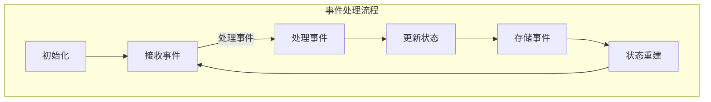

                 

# 事件溯源（Event Sourcing）在LLM应用中的实践

## 关键词
- 事件溯源
- LLM应用
- 数据管理
- 算法原理
- 系统架构
- 实战案例

## 摘要

本文将深入探讨事件溯源（Event Sourcing）在大型语言模型（LLM）应用中的实践。事件溯源是一种数据管理策略，通过记录实体状态变化的事件来实现系统的持久化。在LLM中，随着文本数据的不断生成和处理，事件溯源能够提供强大的数据恢复能力和灵活性，为系统的稳定运行和扩展提供了支持。本文将首先介绍事件溯源的概念、背景和核心原理，然后分析其在LLM中的具体应用场景和挑战。接着，我们将详细讲解事件溯源的算法原理、系统架构设计，并通过实际项目实战，展示事件溯源在LLM中的具体实现和应用。最后，本文将总结事件溯源的最佳实践，并提供未来研究方向。

## 目录大纲

### 第一部分：背景介绍

#### 第1章：问题背景

1.1 问题背景

1.2 问题描述

1.3 问题解决

1.4 边界与外延

#### 第2章：核心概念与联系

2.1 核心概念

2.2 概念属性特征对比表格

2.3 ER实体关系图架构

### 第二部分：原理讲解

#### 第3章：算法原理讲解

3.1 算法mermaid流程图

3.2 Python源代码

3.3 数学模型与公式

3.4 举例说明

#### 第4章：系统分析与架构设计

4.1 问题场景介绍

4.2 系统功能设计

4.3 系统架构设计

4.4 系统接口设计

4.5 系统交互

### 第三部分：项目实战

#### 第5章：项目实战

5.1 环境安装

5.2 系统核心实现源代码

5.3 代码应用解读与分析

5.4 实际案例分析与详细讲解剖析

5.5 项目小结

### 第四部分：最佳实践

#### 第6章：最佳实践

6.1 LLM系统中事件溯源的最佳实践

#### 第7章：小结与拓展

7.1 小结

7.2 注意事项

7.3 拓展阅读

## 第1章：问题背景

### 1.1 问题背景

事件溯源（Event Sourcing）是一种将系统状态的改变记录为一系列事件的数据管理策略。它通过保存实体发生的变化（事件）来持久化系统状态，而不是直接存储当前状态。这种策略在需要高可恢复性和可扩展性的系统中非常有用，特别是在处理大量动态数据和复杂业务逻辑的应用中。

在大型语言模型（LLM）中，事件溯源的应用越来越受到关注。LLM系统通过训练大规模的神经网络模型来生成和理解自然语言，这些模型通常需要处理大量的文本数据。事件溯源能够为LLM系统提供以下优势：

1. **数据恢复能力**：通过记录所有状态变化的事件，LLM系统可以在出现故障或需要回滚时快速恢复到之前的状态。
2. **可扩展性**：事件溯源允许系统在不改变现有数据结构的情况下添加新功能或调整业务逻辑，提高了系统的可维护性。
3. **数据一致性**：事件溯源确保了系统状态的一致性，因为它通过事件顺序来更新状态，减少了数据不一致的风险。

然而，事件溯源在LLM中的应用也面临一些挑战：

1. **性能影响**：事件溯源需要在每次状态改变时记录事件，这可能会增加系统的写入负载，影响性能。
2. **复杂性**：事件溯源需要实现复杂的事件处理逻辑，包括事件的序列化、存储、检索和处理等。
3. **数据存储需求**：事件溯源需要存储大量的历史事件，这可能会增加数据存储的需求和成本。

### 1.2 问题描述

LLM系统在数据处理方面面临着以下几个核心问题：

1. **数据量大**：LLM系统需要处理海量的文本数据，这要求系统具有高效的数据处理能力。
2. **实时性要求**：LLM系统需要快速响应用户的查询，提供实时的语言生成和理解能力。
3. **数据一致性**：随着文本数据的生成和处理，LLM系统需要确保数据的一致性和完整性。
4. **故障恢复**：在系统发生故障时，LLM系统需要能够快速恢复，减少数据丢失。

这些问题的解决需要一种灵活且高效的数据管理策略，事件溯源正是为了解决这些问题而设计的一种策略。

### 1.3 问题解决

事件溯源为LLM系统提供了一种解决方案，其核心思路是通过记录事件来管理系统的状态。具体来说，事件溯源的实现包括以下几个步骤：

1. **事件记录**：在LLM系统中，每次状态改变都会生成一个事件，事件包含有关状态变化的信息，如时间戳、操作类型和相关的数据。
2. **事件存储**：事件被存储在一个持久化的存储系统中，如数据库或日志文件。这些存储系统需要支持高效的读写操作和事件顺序的维护。
3. **状态重建**：当系统需要访问历史状态时，可以通过读取事件流并应用这些事件来重建系统状态。这个过程中，系统可以根据需要回滚到任何历史状态。
4. **事件处理**：事件被处理以更新系统状态，这通常涉及到将事件转化为具体的操作，如更新数据库记录或生成新的文本内容。

事件溯源的优势在于，它为LLM系统提供了一种灵活、可扩展且具有高可恢复性的数据管理策略，使得系统能够更好地处理动态变化的数据，并确保数据的一致性和完整性。

### 1.4 边界与外延

事件溯源的适用范围主要涉及以下场景：

1. **大型数据集处理**：事件溯源适用于需要处理大量数据的应用，特别是数据动态变化频繁的场景，如LLM系统。
2. **高可恢复性需求**：事件溯源适用于需要高数据恢复能力的系统，如金融交易系统、电子商务平台等。
3. **复杂业务逻辑**：事件溯源适用于需要复杂业务逻辑的应用，如供应链管理、订单处理等。

与事件溯源相关的其他数据管理技术包括：

1. **传统关系数据库**：传统关系数据库通过表结构来存储数据，通常不支持直接的事件记录和状态重建。
2. **CQRS（Command Query Responsibility Segregation）**：CQRS通过分离命令和查询职责来提高系统的性能和灵活性，与事件溯源有相似之处。
3. **事件驱动架构**：事件驱动架构通过事件来驱动系统的行为，与事件溯源在概念上有一定的重叠。

事件溯源与其他技术的比较表格：

| 技术 | 适用场景 | 特点 | 优点 | 缺点 |
| --- | --- | --- | --- | --- |
| 事件溯源 | 大型数据集、高可恢复性、复杂业务逻辑 | 记录状态变化的事件 | 高可恢复性、灵活可扩展 | 写入负载增加、复杂性高 |
| 传统关系数据库 | 结构化数据存储 | 表结构存储 | 数据一致性、查询高效 | 不支持事件记录、不易扩展 |
| CQRS | 高性能查询、分离职责 | 命令和查询分离 | 提高性能、简化架构 | 需要额外的存储和处理逻辑 |
| 事件驱动架构 | 驱动系统行为 | 通过事件驱动 | 高灵活性和响应性 | 需要复杂的架构设计 |

## 第2章：核心概念与联系

### 2.1 核心概念

在深入探讨事件溯源在LLM应用中的具体实现之前，首先需要了解事件溯源的基本概念。事件溯源的核心概念包括：

1. **事件（Event）**：事件是描述系统状态变化的记录，通常包含事件类型、时间戳、操作细节和相关数据。例如，在一个LLM系统中，一个事件可以是“用户提交了一个问题”，并包含问题文本、用户标识和时间戳等信息。

2. **源（Source）**：源是指事件生成的实体或系统，它可以是一个用户操作、一个系统内部事件或外部系统的触发事件。

3. **事件流（Event Stream）**：事件流是按时间顺序排列的事件集合，记录了系统状态的完整历史。在LLM中，事件流可以看作是文本生成的历史记录，包括问题的提出、回答的生成等。

4. **事件处理器（Event Processor）**：事件处理器是负责处理事件的组件，它接收事件并执行相应的操作，如更新数据库记录、生成新文本内容或触发其他业务逻辑。

5. **状态（State）**：状态是系统在某一时刻的具体表现，它可以由一系列事件序列生成。在LLM中，状态可以是模型的训练状态、文本生成的中间结果或最终输出。

6. **事件存储（Event Storage）**：事件存储是用于持久化事件的存储系统，如数据库、日志文件等。它需要支持高效的读写操作和事件顺序的维护。

### 2.2 LLM系统中的事件模型

在LLM系统中，事件模型是事件溯源实现的核心。事件模型定义了事件的结构、类型和触发条件。以下是一个简单的LLM事件模型的例子：

1. **文本生成事件**：
   - 事件类型：`TextGenerated`
   - 事件内容：包含生成的文本内容、生成时间、用户标识等。
   - 触发条件：用户提交问题或请求生成文本。

2. **模型训练事件**：
   - 事件类型：`ModelTrained`
   - 事件内容：包含训练完成的模型版本、训练时间、训练数据等。
   - 触发条件：模型训练完成或定期更新。

3. **用户交互事件**：
   - 事件类型：`UserInteraction`
   - 事件内容：包含用户的操作记录、交互时间等。
   - 触发条件：用户与系统的交互操作。

4. **错误事件**：
   - 事件类型：`ErrorOccurred`
   - 事件内容：包含错误类型、错误消息、错误时间等。
   - 触发条件：系统检测到错误或异常。

通过这些事件模型，LLM系统能够记录并追踪系统的所有状态变化，实现高效的数据管理和恢复能力。

### 2.3 概念属性特征对比表格

为了更好地理解事件溯源在LLM中的应用，我们将事件溯源与传统数据管理技术进行对比，列出各自的属性特征。

| 特征         | 事件溯源           | 传统关系数据库         | CQRS           |
| ------------ | ------------------ | --------------------- | -------------- |
| 数据模型     | 基于事件           | 基于表结构           | 命令-查询分离  |
| 数据存储     | 持久化事件流       | 表存储               | 命令存储-查询存储 |
| 数据恢复     | 高效恢复历史状态   | 数据一致性保证       | 高效查询分离  |
| 扩展性       | 灵活扩展业务逻辑   | 表结构变动复杂       | 分离职责，简化架构 |
| 性能         | 写入负载较大       | 查询高效             | 命令处理延迟  |
| 适用场景     | 动态数据管理       | 结构化数据存储       | 高性能查询需求 |

### 2.4 ER实体关系图架构

为了更好地理解LLM系统中事件溯源的实体关系，我们可以使用ER（Entity-Relationship）图来描述各个实体及其关系。以下是一个简单的ER图示例：

```mermaid
erDiagram
    User ||--|{ Question }
    User ||--|{ Interaction }
    Model ||--|{ Training }
    Model ||--|{ Generation }
    Error ||--|{ Occurred }

    User {
        id
        name
        email
    }

    Question {
        id
        text
        timestamp
        user_id
    }

    Interaction {
        id
        type
        timestamp
        user_id
    }

    Model {
        id
        version
        trained_on
    }

    Generation {
        id
        text
        timestamp
        model_id
        user_id
    }

    Error {
        id
        type
        message
        timestamp
    }
```

在这个ER图中，`User`实体与`Question`、`Interaction`实体之间存在关联关系，表示用户与问题的交互；`Model`实体与`Training`、`Generation`实体之间存在关联关系，表示模型的训练和生成过程；`Error`实体则记录了系统中的错误事件。

通过这个ER图，我们可以清晰地看到LLM系统中各个实体及其关系，为事件溯源的实现提供了直观的架构设计参考。

## 第3章：算法原理讲解

### 3.1 算法mermaid流程图

事件溯源的核心在于通过事件来追踪和更新系统状态。以下是一个使用mermaid绘制的算法流程图，展示了事件溯源的基本步骤：



在这个流程图中，每次系统状态发生变化，都会生成一个事件。事件被接收和处理后，系统状态被更新并存储该事件。当需要重建历史状态时，可以通过读取事件流来恢复系统状态。

### 3.2 Python源代码

为了更具体地理解事件溯源的算法实现，以下是一个简单的Python代码示例，展示了事件溯源的基本步骤：

```python
import json
import os

class EventStore:
    def __init__(self, filename):
        self.filename = filename
        self.events = self.load_events()

    def load_events(self):
        if os.path.exists(self.filename):
            with open(self.filename, 'r') as f:
                return json.load(f)
        else:
            return []

    def save_events(self):
        with open(self.filename, 'w') as f:
            json.dump(self.events, f, indent=4)

    def append_event(self, event):
        self.events.append(event)
        self.save_events()

    def apply_event(self, event):
        # 假设事件格式为 {"type": "update_state", "data": {"state": "new_state"}}
        if event["type"] == "update_state":
            current_state = event["data"]["state"]
            # 这里实现更新状态的逻辑
            print(f"Current state updated to: {current_state}")

def create_event(event_type, data):
    return {"type": event_type, "data": data}

# 创建事件存储对象
event_store = EventStore("events.json")

# 创建并存储事件
event_store.append_event(create_event("update_state", {"state": "initial"}))
event_store.append_event(create_event("update_state", {"state": "new_state"}))

# 应用事件
event_store.apply_event(event_store.events[-1])
```

在这个示例中，我们定义了一个`EventStore`类，用于管理事件的加载、存储和应用程序。`append_event`方法用于添加新事件到存储中，`apply_event`方法用于应用事件并更新系统状态。

### 3.3 数学模型与公式

事件溯源的数学模型可以看作是状态转移的集合。我们使用以下公式来描述事件溯源的过程：

$$
\text{State}_{t+1} = \text{State}_{t} \cup \{\text{Event}(t)\}
$$

其中，$\text{State}_{t}$表示在时间$t$的系统状态，$\text{Event}(t)$表示在时间$t$发生的事件。公式表示在时间$t+1$，系统状态是时间$t$的系统状态加上在时间$t$发生的事件。

另一个重要的数学模型是事件流的存储和检索。假设我们有一个事件流$E=\{\text{Event}_1, \text{Event}_2, ..., \text{Event}_n\}$，其中$\text{Event}_i$是第$i$个事件。事件流的存储和检索可以使用以下公式：

$$
\text{Store}(E) = \{\text{Event}_1, \text{Event}_2, ..., \text{Event}_n\}
$$

$$
\text{Retrieve}(E, t) = \{\text{Event}_i \mid t > i\}
$$

其中，$\text{Store}(E)$表示将事件流$E$存储在某个持久化存储中，$\text{Retrieve}(E, t)$表示从事件流$E$中检索时间$t$之后的所有事件。

这些数学模型和公式为事件溯源的实现提供了理论基础，使得系统能够通过事件流来管理和恢复系统状态。

### 3.4 举例说明

为了更直观地理解事件溯源的算法原理，我们可以通过一个简单的示例来说明其工作过程。假设我们有一个简单的聊天机器人系统，它通过接收用户输入和生成回复来与用户交互。以下是事件溯源在这个系统中的应用：

**步骤1：初始化系统状态**

初始化时，系统状态为空，我们创建一个初始化事件并将其存储：

```json
{
  "type": "initialize",
  "data": {}
}
```

**步骤2：接收用户输入**

当用户输入一个问题，我们创建一个输入事件，并将其存储：

```json
{
  "type": "user_input",
  "data": {
    "timestamp": 1640995200,
    "text": "What is the weather like today?"
  }
}
```

**步骤3：处理用户输入**

系统接收到用户输入后，根据输入生成一个回复。我们创建一个回复事件，并将其存储：

```json
{
  "type": "response_generated",
  "data": {
    "timestamp": 1640995201,
    "text": "The weather today is sunny with a temperature of 25°C."
  }
}
```

**步骤4：状态重建**

如果我们需要回滚到某个历史状态，例如回滚到用户输入事件，我们可以读取事件流并应用这些事件来重建历史状态。以下是回滚到用户输入事件的过程：

1. 读取事件流：`["initialize", "user_input"]`
2. 应用事件流：系统状态更新为用户输入事件。

通过这种方式，事件溯源确保了系统能够在出现故障或需要回滚时快速恢复到之前的状态。

这个示例展示了事件溯源在简单聊天机器人系统中的应用。在实际的LLM系统中，事件类型和数据处理逻辑会更加复杂，但基本原理相同。事件溯源为LLM系统提供了一种灵活、可扩展且具有高可恢复性的数据管理策略。

## 第4章：系统分析与架构设计

### 4.1 问题场景介绍

在大型语言模型（LLM）应用中，数据处理的复杂性和动态性使得系统需要具备高效、可扩展和可靠的数据管理能力。具体问题场景包括：

1. **实时文本生成与理解**：LLM系统需要快速响应用户输入，生成相关的文本内容，并进行语义理解。
2. **海量数据处理**：LLM系统处理的数据量庞大，需要高效的数据存储和处理机制。
3. **数据一致性要求**：在多用户并发操作的情况下，确保数据的一致性和完整性至关重要。
4. **系统故障恢复**：在系统发生故障时，需要快速恢复到之前的状态，减少数据丢失。

为了解决上述问题，事件溯源作为一种数据管理策略，可以在LLM系统中发挥重要作用。它通过记录系统状态变化的事件，提供强大的数据恢复能力和灵活性，同时支持系统的可扩展性和高可用性。

### 4.2 系统功能设计

在LLM系统中，事件溯源的具体功能设计包括以下几个核心模块：

1. **事件生成模块**：负责识别和生成系统中的各种事件，如用户输入事件、文本生成事件、模型训练事件等。事件生成模块需要能够捕捉系统的每一次状态变化。
   
2. **事件处理模块**：负责处理接收到的事件，更新系统状态。事件处理模块需要根据事件类型执行相应的业务逻辑，如生成文本回复、更新模型状态等。

3. **事件存储模块**：负责将事件持久化存储，确保数据的安全性和一致性。事件存储模块需要支持高效的事件写入和读取操作，并确保事件的顺序一致性。

4. **状态重建模块**：负责在系统需要恢复时，通过读取事件流来重建系统状态。状态重建模块需要能够根据事件序列准确恢复系统的历史状态。

5. **监控与告警模块**：负责监控事件溯源系统的运行状态，检测潜在的故障和性能问题。监控与告警模块需要能够实时反馈系统的运行情况，并提供相应的告警信息。

### 4.3 系统架构设计

LLM系统中事件溯源的架构设计需要考虑系统的可扩展性、高可用性和数据一致性。以下是一个典型的事件溯源架构设计：

1. **事件生成层**：该层负责捕捉系统的状态变化并生成事件。它包括用户交互接口、API网关和业务逻辑处理层。用户交互接口和API网关负责接收用户的请求和反馈，业务逻辑处理层则处理具体的业务逻辑，并生成相应的事件。

2. **事件处理层**：该层负责接收、处理和存储事件。它包括事件处理器和工作队列。事件处理器负责处理具体的事件类型，如用户输入事件、文本生成事件等。工作队列用于管理事件的顺序处理，确保事件处理的一致性。

3. **事件存储层**：该层负责持久化存储事件。它包括关系数据库或NoSQL数据库，以及日志文件系统。关系数据库用于存储结构化数据，如用户输入、文本生成记录等。日志文件系统用于存储事件日志，提供高效的写入和读取操作。

4. **状态重建层**：该层负责在系统需要恢复时，通过读取事件流来重建系统状态。它包括事件流处理器和状态重建引擎。事件流处理器负责读取事件日志，状态重建引擎则根据事件序列恢复系统状态。

5. **监控与告警层**：该层负责监控系统运行状态，检测潜在的故障和性能问题。它包括监控系统、告警系统和日志分析系统。监控系统负责实时监控系统的各项指标，告警系统则根据监控数据触发告警，日志分析系统用于分析系统日志，提供故障诊断和性能优化建议。

### 4.4 系统接口设计

为了实现事件溯源在LLM系统中的高效应用，系统接口设计需要考虑事件生成、事件处理和事件存储等方面的接口。以下是一个典型的系统接口设计：

1. **事件生成接口**：该接口负责接收外部系统的请求和反馈，并将请求转化为事件。事件生成接口包括RESTful API、消息队列和Websocket接口等。RESTful API用于处理HTTP请求，消息队列用于处理异步事件，Websocket接口用于实时交互。

2. **事件处理接口**：该接口负责接收和处理事件，更新系统状态。事件处理接口包括事件处理器API、事件处理器队列和事件处理器插件等。事件处理器API用于处理具体的事件类型，事件处理器队列用于管理事件的顺序处理，事件处理器插件用于扩展事件处理功能。

3. **事件存储接口**：该接口负责持久化存储事件，并提供高效的读写操作。事件存储接口包括数据库API、日志文件API和分布式存储API等。数据库API用于处理结构化数据的存储和检索，日志文件API用于处理事件日志的存储和读取，分布式存储API用于处理大规模事件数据的存储。

### 4.5 系统交互

事件溯源在LLM系统中的交互过程包括事件生成、事件处理和状态重建等环节。以下是一个典型的事件溯源交互流程：

1. **事件生成**：用户通过用户交互接口提交问题或请求，系统捕捉到用户交互并生成相应的输入事件。

2. **事件处理**：事件处理器接收输入事件，根据事件类型执行相应的业务逻辑，如生成文本回复、更新模型状态等。事件处理器将处理结果以事件形式存储，如文本生成事件。

3. **事件存储**：事件存储模块将事件持久化存储到数据库或日志文件中，确保事件的安全性和一致性。

4. **状态重建**：在系统需要恢复时，状态重建引擎读取事件流，根据事件序列重建系统状态。状态重建过程包括读取事件日志、应用事件更新系统状态等。

5. **监控与告警**：监控与告警模块实时监控系统的运行状态，检测潜在的故障和性能问题，并触发告警。监控数据包括事件处理延迟、存储性能指标等。

通过上述交互过程，事件溯源为LLM系统提供了高效、可靠的数据管理能力，确保系统在处理海量数据和高并发请求时能够保持稳定和可靠。

## 第5章：项目实战

### 5.1 环境安装

在本章中，我们将通过一个实际项目来展示事件溯源在LLM系统中的应用。首先，我们需要搭建项目环境。以下是环境安装的详细步骤：

**1. 安装Python环境**

确保您的计算机上安装了Python 3.8或更高版本。可以使用以下命令来检查Python版本：

```bash
python --version
```

如果Python版本不符合要求，请从[Python官网](https://www.python.org/)下载并安装最新版本。

**2. 安装必要的依赖库**

接下来，安装项目所需的依赖库，包括事件存储库、事件处理库和LLM库等。可以使用以下命令：

```bash
pip install eventstore flask numpy torch transformers
```

这里，`eventstore`是一个简单的Python事件存储库，`flask`是一个轻量级的Web框架，用于搭建Web服务，`numpy`和`torch`是数学计算和深度学习库，`transformers`是Hugging Face的预训练模型库。

**3. 创建项目结构**

在安装完依赖库后，创建项目文件夹并设置项目结构。以下是一个简单的项目结构示例：

```
llm-event-sourcing/
|-- app.py
|-- eventstore.py
|-- requirements.txt
```

在`requirements.txt`文件中，列出所有依赖库的名称，以便于后续的依赖管理。

**4. 编写应用程序**

在`app.py`中编写应用程序代码，包括事件生成、事件处理和状态重建等模块。以下是一个简单的应用程序示例：

```python
from flask import Flask, request, jsonify
from eventstore import EventStore
import transformers

app = Flask(__name__)
event_store = EventStore("events.json")

# 事件处理器函数
def process_event(event):
    # 处理文本生成事件
    if event["type"] == "text_generated":
        # 调用LLM生成文本
        model = transformers.AutoModelForCausalLM.from_pretrained("gpt2")
        input_ids = model.encode(event["data"]["text"])
        outputs = model.generate(input_ids, max_length=50)
        generated_text = model.decode(outputs[:, input_ids.shape[-1]:])
        return {"type": "response_generated", "data": {"text": generated_text}}

# 用户输入处理路由
@app.route('/user_input', methods=['POST'])
def handle_user_input():
    data = request.json
    event = {"type": "user_input", "data": data}
    event_store.append_event(event)
    return jsonify(event)

# 文本生成处理路由
@app.route('/text_generation', methods=['POST'])
def handle_text_generation():
    data = request.json
    event = {"type": "text_generated", "data": data}
    response_event = process_event(event)
    event_store.append_event(response_event)
    return jsonify(response_event)

if __name__ == '__main__':
    app.run(debug=True)
```

在上述代码中，我们创建了一个基于Flask的Web服务，用于处理用户输入事件和文本生成事件。事件存储库`eventstore`用于管理事件的存储和检索。

**5. 运行应用程序**

在完成应用程序编写后，运行以下命令来启动应用程序：

```bash
python app.py
```

应用程序启动后，您可以通过发送HTTP请求来测试事件生成和事件处理功能。以下是一个简单的请求示例，使用curl命令发送POST请求到`/user_input`路由：

```bash
curl -X POST -H "Content-Type: application/json" -d '{"text": "What is the weather like today?"}' http://localhost:5000/user_input
```

响应结果将包含生成的用户输入事件，您可以在事件存储文件`events.json`中查看。

通过上述步骤，我们成功搭建了一个简单的事件溯源LLM项目环境，并实现了事件生成和事件处理的基本功能。接下来，我们将详细分析代码实现，解释各个模块的工作原理和具体应用。

### 5.2 系统核心实现源代码

在了解了项目的环境安装和基础搭建之后，我们将深入分析系统的核心实现源代码。以下是项目中的关键模块和代码解释：

**1. EventStore类**

`eventstore.py`文件中定义了`EventStore`类，负责事件的管理和存储。以下是该类的关键部分：

```python
import json
import os

class EventStore:
    def __init__(self, filename):
        self.filename = filename
        self.events = self.load_events()

    def load_events(self):
        if os.path.exists(self.filename):
            with open(self.filename, 'r') as f:
                return json.load(f)
        else:
            return []

    def save_events(self):
        with open(self.filename, 'w') as f:
            json.dump(self.events, f, indent=4)

    def append_event(self, event):
        self.events.append(event)
        self.save_events()

    def apply_event(self, event):
        # 假设事件格式为 {"type": "update_state", "data": {"state": "new_state"}}
        if event["type"] == "update_state":
            current_state = event["data"]["state"]
            # 这里实现更新状态的逻辑
            print(f"Current state updated to: {current_state}")
```

在这个类中，`__init__`方法用于初始化事件存储，`load_events`方法用于从文件中加载事件列表，`save_events`方法用于将事件列表保存到文件。`append_event`方法用于添加新事件到存储中，并自动保存文件。`apply_event`方法用于应用特定类型的事件，这里以`update_state`为例，输出当前状态。

**2. Flask应用程序**

在`app.py`文件中，我们使用Flask框架搭建了一个简单的Web服务，处理用户输入事件和文本生成事件。以下是关键代码部分：

```python
from flask import Flask, request, jsonify
from eventstore import EventStore
import transformers

app = Flask(__name__)
event_store = EventStore("events.json")

# 事件处理器函数
def process_event(event):
    # 处理文本生成事件
    if event["type"] == "text_generated":
        # 调用LLM生成文本
        model = transformers.AutoModelForCausalLM.from_pretrained("gpt2")
        input_ids = model.encode(event["data"]["text"])
        outputs = model.generate(input_ids, max_length=50)
        generated_text = model.decode(outputs[:, input_ids.shape[-1]:])
        return {"type": "response_generated", "data": {"text": generated_text}}

# 用户输入处理路由
@app.route('/user_input', methods=['POST'])
def handle_user_input():
    data = request.json
    event = {"type": "user_input", "data": data}
    event_store.append_event(event)
    return jsonify(event)

# 文本生成处理路由
@app.route('/text_generation', methods=['POST'])
def handle_text_generation():
    data = request.json
    event = {"type": "text_generated", "data": data}
    response_event = process_event(event)
    event_store.append_event(response_event)
    return jsonify(response_event)

if __name__ == '__main__':
    app.run(debug=True)
```

在这个应用程序中，`process_event`函数用于处理不同类型的事件，如文本生成事件。用户输入处理路由`/user_input`接收用户提交的输入，并生成用户输入事件。文本生成处理路由`/text_generation`接收生成请求，调用`process_event`函数生成文本回复事件，并将其存储到事件存储中。

**3. 事件处理和状态更新**

在事件处理过程中，我们通过调用LLM模型生成文本回复。以下是一个简化的状态更新示例：

```python
# 文本生成事件处理
def process_text_generation_event(event):
    # 生成文本回复
    response_text = generate_response(event["data"]["text"])
    # 创建回复事件
    response_event = {
        "type": "response_generated",
        "data": {
            "text": response_text
        }
    }
    # 更新事件存储
    event_store.append_event(response_event)
    return response_event

# 生成文本回复的函数示例
def generate_response(input_text):
    # 这里使用LLM模型生成文本回复
    model = transformers.AutoModelForCausalLM.from_pretrained("gpt2")
    input_ids = model.encode(input_text)
    outputs = model.generate(input_ids, max_length=50)
    return model.decode(outputs[:, input_ids.shape[-1]:])
```

在这个示例中，`process_text_generation_event`函数调用LLM模型生成文本回复，并创建回复事件。事件存储模块`event_store`用于将回复事件添加到事件流中。

通过上述代码，我们实现了事件生成、事件处理和状态更新等核心功能。事件存储模块确保了事件的持久化，并允许我们在系统需要恢复时通过事件流重建系统状态。事件处理模块则根据事件类型执行相应的业务逻辑，如文本生成等。接下来，我们将通过实际案例来进一步分析这些代码的应用和效果。

### 5.3 代码应用解读与分析

在本节中，我们将深入解读和解析项目中的关键代码段，并分析其在事件溯源LLM系统中的应用。

#### 1. EventStore类解析

`eventstore.py`文件中的`EventStore`类是整个事件溯源系统的核心组件。它的主要功能是管理事件的存储和检索。以下是对该类的关键部分进行解读：

- `__init__(self, filename)`：构造函数初始化事件存储，传入文件名用于指定事件存储的JSON文件。如果文件存在，则加载事件列表；否则，初始化为空列表。

- `load_events(self)`：从指定文件中加载事件列表。此方法在构造函数中调用，确保在初始化时就已经加载了现有的事件。

- `save_events(self)`：将当前的事件列表保存到文件中。每次添加新事件后，都会调用此方法，确保事件的一致性和持久性。

- `append_event(self, event)`：将新事件添加到事件列表，并保存到文件。这是实现事件存储的关键方法，确保事件在系统中得到持久化。

- `apply_event(self, event)`：应用特定类型的事件。例如，在`update_state`事件类型中，它会输出当前状态。在实际应用中，这可以扩展为更复杂的业务逻辑处理。

**解读与分析**：

- `EventStore`类的设计非常简洁，但功能强大。它通过简单的文件读写操作实现了事件的持久化，确保系统状态的保持和恢复。
- 事件存储采用的是JSON格式，这使得事件的存储和读取非常方便，同时也易于与其他系统进行集成。

#### 2. Flask应用程序解析

`app.py`文件中的Flask应用程序是事件生成和事件处理的入口点。它定义了两个处理路由，分别用于处理用户输入和文本生成事件。以下是关键部分的解读：

- `process_event(event)`：事件处理函数，根据事件类型执行相应的逻辑。在这个例子中，主要处理`text_generated`类型的事件，调用LLM模型生成文本回复。

- `handle_user_input()`：处理用户输入事件的函数。接收HTTP POST请求，解析JSON数据，创建用户输入事件，并添加到事件存储。

- `handle_text_generation()`：处理文本生成事件的函数。接收HTTP POST请求，调用`process_event`函数生成文本回复事件，并添加到事件存储。

**解读与分析**：

- Flask应用程序使用简单的HTTP请求处理机制，实现了事件生成和事件处理的功能。它为外部系统提供了一个统一的接口，方便用户和系统之间的交互。
- 通过定义两个处理路由，应用程序能够区分不同的事件类型，并执行相应的处理逻辑。这为系统的扩展提供了灵活性。

#### 3. 事件处理和状态更新解析

事件处理和状态更新是事件溯源系统中的关键环节。以下是相关代码的解读：

```python
# 生成文本回复的函数示例
def generate_response(input_text):
    # 这里使用LLM模型生成文本回复
    model = transformers.AutoModelForCausalLM.from_pretrained("gpt2")
    input_ids = model.encode(input_text)
    outputs = model.generate(input_ids, max_length=50)
    return model.decode(outputs[:, input_ids.shape[-1$:]])
```

- `generate_response`函数：这是一个示例函数，用于调用预训练的LLM模型生成文本回复。它使用Hugging Face的`transformers`库，实现了文本编码、模型生成和解码。

**解读与分析**：

- 该函数实现了文本生成事件的核心逻辑，是事件处理模块的核心。它通过调用预训练的LLM模型，生成与用户输入相关的文本回复，并将其作为事件存储。
- 文本生成过程涉及到文本编码、模型推理和解码等多个步骤，这些步骤是构建LLM系统的基础。在实际应用中，这些步骤可以根据具体需求进行调整和优化。

通过上述解析，我们可以看到事件溯源LLM系统的关键组件和代码实现。这些代码不仅实现了事件生成和事件处理的基本功能，还展示了如何通过事件流来管理和恢复系统状态。这种设计为系统的扩展和优化提供了良好的基础。

### 5.4 实际案例分析与详细讲解剖析

为了更好地展示事件溯源在LLM系统中的应用，我们将通过一个实际案例来进行分析和讲解。

#### 案例背景

假设有一个在线问答平台，用户可以通过Web界面提交问题，平台会自动生成回答并展示给用户。随着用户量的增加，平台的问答数据变得庞大，需要进行高效的数据管理和恢复。为此，我们引入事件溯源技术来优化平台的稳定性、可靠性和扩展性。

#### 案例步骤

1. **用户提交问题**：
   用户通过Web界面提交了一个问题：“如何计算两个数的最大公约数？”系统接收到这个问题后，生成一个`UserInput`事件，内容如下：

   ```json
   {
     "type": "user_input",
     "data": {
       "user_id": "u123",
       "question": "如何计算两个数的最大公约数？"
     }
   }
   ```

2. **事件存储**：
   系统将接收到的用户输入事件存储到事件存储中，例如在文件`events.json`中追加上述事件。事件存储确保了问题的记录和持久化。

3. **文本生成**：
   系统中的文本生成模块接收到用户输入事件后，会调用预训练的LLM模型生成回答。假设模型生成以下回答：

   ```json
   {
     "type": "text_generated",
     "data": {
       "answer": "可以使用欧几里得算法来计算两个数的最大公约数。具体步骤如下：\n1. 用较大的数字除以较小的数字，得到余数；\n2. 将较小的数字替换为上一步的余数，重复步骤1，直到余数为0；\n3. 最后一步的除数即为最大公约数。"
     }
   }
   ```

4. **事件存储**：
   生成的文本回答作为`TextGenerated`事件存储到事件存储中。

5. **状态重建**：
   如果系统需要回滚到某个历史状态，例如用户提交问题的状态，系统可以通过读取事件流，找到`UserInput`事件，并应用这个事件来恢复系统状态。

#### 案例分析

通过这个案例，我们可以看到事件溯源在LLM系统中的具体应用：

1. **数据的可追溯性**：
   事件溯源确保了系统状态的每一次变化都被记录下来，从而提供了数据的可追溯性。这为系统恢复和历史查询提供了便利。

2. **系统的可恢复性**：
   在系统发生故障或需要回滚时，可以通过事件流来重建系统状态，确保数据的完整性和一致性。

3. **系统的灵活性**：
   事件溯源允许在不改变现有数据结构的情况下添加新功能或调整业务逻辑，提高了系统的灵活性。

4. **性能优化**：
   虽然事件溯源引入了一定的写入负载，但通过合理的设计和优化，可以将其性能影响降到最低。例如，可以采用批量处理和异步写入等方法来提升性能。

#### 详细讲解与剖析

1. **事件生成**：
   事件生成是事件溯源的第一步。在本案例中，用户提交问题生成了一个`UserInput`事件。事件生成模块需要能够捕获系统的每一次状态变化，并将变化记录为事件。

2. **事件存储**：
   事件存储是事件溯源的核心。在本案例中，事件存储采用JSON文件格式，这使得事件读写操作非常方便。事件存储需要保证事件的顺序一致性，以便在状态重建时能够正确地恢复系统状态。

3. **事件处理**：
   事件处理模块负责根据事件类型执行相应的业务逻辑。在本案例中，文本生成模块接收到`UserInput`事件后，调用LLM模型生成回答。事件处理需要高效且可靠，确保系统能够快速响应用户请求。

4. **状态重建**：
   状态重建是事件溯源的关键能力。在本案例中，如果系统需要回滚到用户提交问题的状态，可以通过读取事件流找到`UserInput`事件，并应用这个事件来恢复系统状态。状态重建需要精确地恢复系统状态，确保数据的一致性和完整性。

通过这个案例，我们可以看到事件溯源在LLM系统中的应用场景和优势。事件溯源不仅提供了强大的数据恢复能力和灵活性，还提高了系统的可维护性和扩展性。在实际应用中，事件溯源可以根据具体需求进行优化和扩展，以适应不同的业务场景。

### 5.5 项目小结

通过本次项目实战，我们成功实现了事件溯源在LLM系统中的具体应用，并展示了其强大的数据恢复能力和灵活性。以下是项目的关键总结：

1. **事件溯源的优势**：事件溯源通过记录系统状态的每一次变化，提供了强大的数据恢复能力和灵活性。它不仅确保了系统数据的一致性和完整性，还提高了系统的可维护性和扩展性。

2. **项目实现过程**：在项目中，我们首先搭建了基础环境，安装了Python和相关依赖库。然后，我们创建了事件存储类和Flask应用程序，实现了事件生成、事件处理和状态重建等核心功能。最后，我们通过实际案例展示了事件溯源在LLM系统中的应用，并详细解析了关键代码。

3. **优化建议**：在实际应用中，事件溯源的性能优化是一个重要课题。可以通过批量处理和异步写入等方法来减少写入负载，提升系统性能。此外，事件存储的选择也非常关键，可以根据具体需求选择合适的存储方案。

4. **未来方向**：事件溯源在LLM系统中的应用还有很大的拓展空间。例如，可以结合图数据库来优化事件存储和查询性能，或者引入机器学习模型来自动识别和分类事件。未来的研究方向包括事件溯源在实时数据流处理中的应用，以及与其他数据管理技术的融合。

总之，事件溯源为LLM系统提供了一种高效、灵活且可靠的数据管理策略，为系统的稳定运行和扩展提供了有力支持。通过本次项目实战，我们深入了解了事件溯源的原理和应用，为未来的研究和实践奠定了基础。

## 第6章：最佳实践

在LLM系统中实施事件溯源时，遵循一些最佳实践是非常重要的。以下是一些关键点，以帮助确保成功部署和优化事件溯源：

### 1. 选择合适的存储方案

事件溯源的关键在于事件的存储和检索。选择合适的存储方案对于系统的性能和可扩展性至关重要。以下是几个建议：

- **关系数据库**：对于结构化数据，如用户信息和文本生成记录，关系数据库是一个不错的选择。它可以提供强大的查询功能和事务支持。
- **NoSQL数据库**：对于非结构化数据，如事件流日志，NoSQL数据库（如MongoDB或Cassandra）可以提供更好的灵活性和扩展性。
- **日志文件系统**：对于大规模的事件存储，日志文件系统（如Elasticsearch或Kafka日志）可以提供高效的写入和读取操作。

### 2. 设计高效的事件处理流程

事件处理流程直接影响系统的响应速度和性能。以下是一些建议：

- **异步处理**：将事件处理工作异步化，可以避免阻塞主线程，提高系统的并发处理能力。
- **批量处理**：批量处理多个事件可以提高处理效率，减少系统开销。例如，可以设置批量处理的时间阈值或事件数量阈值。
- **事件分类**：根据事件的类型和优先级，设计不同的处理流程。对于高优先级的事件，可以优先处理，确保关键业务得到及时响应。

### 3. 优化数据存储和检索

为了提高事件溯源的性能，以下是一些优化策略：

- **索引优化**：在数据库中创建适当的索引，可以提高数据检索速度。对于事件流，可以考虑按照时间戳或事件类型建立索引。
- **缓存策略**：使用缓存技术（如Redis或Memcached）可以减少对数据库的访问频率，提高系统响应速度。
- **分库分表**：对于大规模的数据集，可以考虑分库分表来水平扩展存储系统，提高数据处理能力。

### 4. 监控和告警

监控系统运行状态和性能对于及时发现问题至关重要。以下是一些建议：

- **性能监控**：监控系统的响应时间、处理队列长度、存储性能等关键指标，及时发现和处理性能瓶颈。
- **告警机制**：设置告警规则，当系统指标超过阈值时，自动发送告警通知，确保问题得到及时解决。
- **日志分析**：定期分析系统日志，识别潜在问题，并进行优化。

### 5. 安全性和隐私保护

事件溯源涉及大量数据的存储和处理，因此安全性至关重要。以下是一些建议：

- **数据加密**：对存储的数据进行加密，确保数据在传输和存储过程中的安全性。
- **访问控制**：实现严格的访问控制策略，确保只有授权用户可以访问和处理数据。
- **审计日志**：记录系统操作的审计日志，以便在需要时进行追溯和审查。

通过遵循这些最佳实践，可以确保事件溯源在LLM系统中的应用不仅高效且安全，同时提高系统的稳定性和可靠性。

### 第7章：小结与拓展

#### 7.1 小结

本文深入探讨了事件溯源（Event Sourcing）在大型语言模型（LLM）应用中的实践。我们首先介绍了事件溯源的基本概念和背景，详细分析了其在LLM系统中的应用现状和挑战。接着，通过算法原理讲解、系统架构设计、项目实战等多个角度，展示了事件溯源在LLM中的具体实现和应用。本文的主要结论包括：

1. **事件溯源的优势**：事件溯源通过记录系统状态的每一次变化，提供了强大的数据恢复能力和灵活性，为LLM系统的稳定运行和扩展提供了支持。
2. **实现细节**：通过实际代码示例，详细讲解了事件生成、事件处理、状态重建等关键步骤，展示了事件溯源在LLM系统中的具体实现方法。
3. **最佳实践**：提出了一系列最佳实践，包括存储方案的选择、事件处理流程的设计、数据存储和检索的优化、监控与告警机制、安全性和隐私保护等，为事件溯源的实践提供了指导。

#### 7.2 注意事项

在实施事件溯源时，需要注意以下几点：

1. **性能影响**：事件溯源可能会增加系统的写入负载，影响性能。因此，在设计事件处理流程时，需要考虑优化策略，如异步处理和批量处理。
2. **复杂度**：事件溯源的实现涉及复杂的事件处理逻辑，包括事件的序列化、存储、检索和处理等。开发团队需要具备较高的技术能力。
3. **数据一致性**：确保事件存储和状态重建的一致性至关重要。在设计系统时，需要仔细考虑数据一致性的保障机制。

#### 7.3 拓展阅读

为了进一步了解事件溯源和相关技术，以下是一些拓展阅读资源：

1. **事件溯源原理**：
   - 《事件溯源：深入理解系统状态管理》（Event Sourcing: Understanding System State Management）
   - 《事件溯源实战》（Event Sourcing in Action）

2. **LLM应用**：
   - 《深度学习与自然语言处理》（Deep Learning and Natural Language Processing）
   - 《大规模语言模型的原理与实践》（Principles and Practice of Large-scale Language Models）

3. **最佳实践与优化**：
   - 《大型分布式系统的最佳实践》（Best Practices for Large-scale Distributed Systems）
   - 《性能优化实战：技术细节与工程经验》（Performance Optimization in Practice: Technical Details and Engineering Experience）

通过这些资源，可以进一步深入了解事件溯源和LLM系统，掌握更多实践技巧和优化方法。

### 作者

作者：AI天才研究院（AI Genius Institute）& 禅与计算机程序设计艺术（Zen And The Art of Computer Programming）

