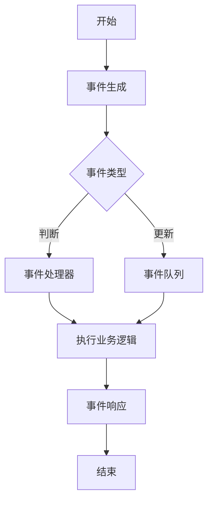
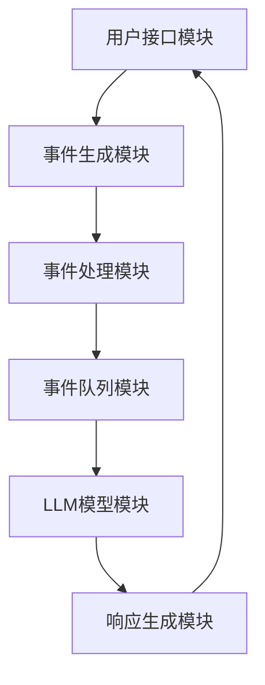
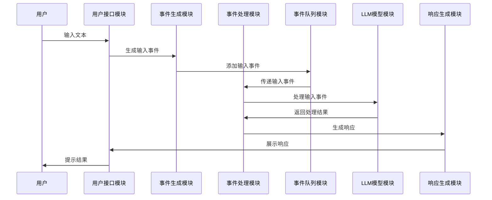

                 

### 《事件驱动架构促进LLM应用的解耦与扩展》文章结构设计

为了撰写一篇逻辑清晰、结构紧凑、简单易懂的专业技术博客文章，我们首先需要明确文章的核心内容，并设计出详细的章节结构。以下是《事件驱动架构促进LLM应用的解耦与扩展》文章的具体结构设计。

#### 文章标题
- 《事件驱动架构促进LLM应用的解耦与扩展》

#### 文章关键词
- 事件驱动架构、LLM应用、解耦、扩展、架构设计

#### 文章摘要
- 本文将深入探讨事件驱动架构在大型语言模型（LLM）应用中的重要性。我们将从事件驱动架构的基本概念出发，详细解析其在LLM中的应用优势，以及如何通过解耦与扩展来提升LLM应用的灵活性和可扩展性。通过实际案例分析和最佳实践，读者将了解如何有效地利用事件驱动架构优化LLM应用的设计与实现。

#### 目录大纲
1. **引言**
   - **问题背景**
   - **问题描述**
   - **读者对象**
   - **目的与重要性**
   
2. **事件驱动架构概述**
   - **概念介绍**
   - **历史发展**
   - **关键特点**
   - **与消息驱动架构的对比**
   
3. **大型语言模型（LLM）介绍**
   - **LLM概述**
   - **应用场景**
   - **挑战与需求**
   
4. **事件驱动架构在LLM中的应用**
   - **优势分析**
   - **应用实例**
   - **实现策略**
   
5. **解耦与扩展原理**
   - **解耦原理**
   - **扩展原理**
   - **实际案例解析**
   
6. **系统架构设计**
   - **系统功能设计**
   - **系统架构设计**
   - **系统接口设计**
   - **系统交互设计**
   
7. **项目实战**
   - **环境安装**
   - **系统核心实现**
   - **代码应用解读**
   - **实际案例分析**
   
8. **最佳实践与注意事项**
   - **最佳实践**
   - **注意事项**
   - **拓展阅读**
   
9. **总结与展望**
   - **主要成果**
   - **未来趋势**
   - **结论**

### 章节内容设计

1. **引言**

   在引言部分，我们将简要介绍事件驱动架构和大型语言模型（LLM）的基本概念，以及它们在当前技术发展中的重要地位。接着，我们将明确文章的读者对象，并阐述文章的目的与重要性。

2. **事件驱动架构概述**

   在这一部分，我们将详细阐述事件驱动架构的基本概念、历史发展、关键特点，并对比其与消息驱动架构的区别。这将帮助读者建立对事件驱动架构的全面了解。

3. **大型语言模型（LLM）介绍**

   在介绍LLM部分，我们将首先概述LLM的基本概念，然后讨论其在自然语言处理中的应用场景，以及当前面临的挑战和需求。这将为后续内容打下基础。

4. **事件驱动架构在LLM中的应用**

   在这一部分，我们将深入分析事件驱动架构在LLM中的应用优势，包括如何提高系统的响应速度、灵活性和可扩展性。我们还将通过具体实例来说明事件驱动架构在LLM中的实现策略。

5. **解耦与扩展原理**

   在解耦与扩展原理部分，我们将详细介绍解耦和扩展的基本原理，并分析如何通过事件驱动架构实现解耦与扩展。通过实际案例解析，读者将更直观地理解这些原理。

6. **系统架构设计**

   在系统架构设计部分，我们将从功能设计、架构设计、接口设计和系统交互设计四个方面，详细阐述事件驱动架构在LLM应用系统中的具体实现。使用Mermaid图表辅助说明。

7. **项目实战**

   在项目实战部分，我们将介绍如何在实际项目中应用事件驱动架构，包括环境安装、系统核心实现、代码应用解读以及实际案例分析。这部分内容将紧密结合实际操作，让读者了解如何将理论应用到实践中。

8. **最佳实践与注意事项**

   在这一部分，我们将总结最佳实践，并提供使用事件驱动架构时需要注意的事项。此外，还将推荐一些拓展阅读资源，帮助读者进一步深入了解相关主题。

9. **总结与展望**

   最后，在总结与展望部分，我们将回顾文章的主要成果，探讨未来发展趋势，并给出结论。这将帮助读者更好地把握事件驱动架构在LLM应用中的潜力与前景。

通过以上章节的设计，我们确保了文章的逻辑性和完整性，使读者能够系统地了解事件驱动架构在LLM应用中的重要性，以及如何通过解耦与扩展来提升其应用效果。

### 背景介绍

#### 核心概念术语说明

在讨论事件驱动架构和LLM之前，我们需要明确一些核心概念和术语，以便读者能够更好地理解本文的内容。

- **事件驱动架构（Event-Driven Architecture，EDA）**：这是一种软件架构设计模式，其中系统的行为主要由事件触发。事件可以是用户操作、系统内部状态变化或其他外部系统产生的信息。事件驱动架构的特点是模块之间的松散耦合，便于系统的扩展和维护。

- **大型语言模型（Large Language Model，LLM）**：这是指一种基于深度学习的自然语言处理模型，通过大量文本数据进行训练，能够生成或理解人类语言。LLM广泛应用于自动问答、机器翻译、文本生成等领域。

- **解耦（Decoupling）**：在系统设计中，解耦指的是减少模块之间的直接依赖，使其能够独立运行和扩展。解耦可以提高系统的灵活性和可维护性。

- **扩展性（Extensibility）**：系统扩展性指的是系统能够在不进行重大改动的情况下，适应新的功能或需求。具有良好扩展性的系统更容易维护和升级。

#### 问题背景

在当前技术快速发展的背景下，软件系统的复杂性不断增加，传统的面向过程或面向对象的架构设计方法已经难以满足现代应用的需求。事件驱动架构因其灵活性和高可扩展性，逐渐成为解决复杂系统设计问题的重要手段。

特别是在大型语言模型（LLM）领域，随着模型规模和计算需求的增长，系统的性能、可扩展性和维护性成为关键问题。传统的设计方法往往难以应对这些挑战，而事件驱动架构通过其独特的解耦与扩展特性，为LLM应用提供了新的解决方案。

本文将探讨事件驱动架构在LLM应用中的作用，分析其如何促进系统的解耦与扩展，并通过实际案例展示其优势。这将帮助读者更好地理解事件驱动架构在提高LLM应用性能和灵活性方面的潜力。

#### 问题描述

在现代软件开发中，大型语言模型（LLM）因其卓越的自然语言处理能力，成为各种应用场景的核心技术。然而，随着LLM应用规模的扩大和复杂性的增加，传统的设计模式逐渐暴露出其局限性。

首先，传统的面向过程和面向对象的架构设计方法在应对LLM应用时，往往面临着以下问题：

1. **模块耦合度较高**：传统架构设计中，模块之间存在紧密的依赖关系，导致系统在扩展和维护时变得困难。在LLM应用中，由于模型训练过程和实时应用过程紧密耦合，任何一小部分的改动都可能导致整个系统的崩溃。

2. **扩展性不足**：传统架构难以适应不断变化的需求，系统扩展通常需要大规模重构，增加了开发成本和风险。在LLM应用中，这可能导致无法及时推出新功能或应对快速增长的用户需求。

3. **性能瓶颈**：随着LLM模型的规模扩大，系统的性能瓶颈问题日益突出。传统架构设计中的同步处理和单线程模型难以满足实时处理需求，导致响应速度缓慢，用户体验不佳。

4. **可维护性差**：传统架构中，模块之间的紧密耦合使得代码难以维护和升级。在LLM应用中，这可能导致开发人员难以追踪和管理大量复杂的代码库，增加了出错风险。

为了解决上述问题，事件驱动架构（EDA）提供了一种新的设计思路。事件驱动架构通过事件作为驱动力量，实现了模块间的松散耦合，提高了系统的灵活性和可扩展性。具体来说，事件驱动架构在LLM应用中具有以下几个优势：

1. **解耦与模块化**：事件驱动架构通过事件将系统拆分成多个独立模块，各模块之间通过事件进行通信，减少了模块间的直接依赖。这种松散耦合使得系统的扩展和维护变得更加容易，提高了代码的可维护性。

2. **高扩展性**：事件驱动架构允许系统在不进行大规模重构的情况下，添加或修改功能模块。这对于LLM应用尤为重要，因为模型训练和实时应用过程往往需要频繁调整和优化。

3. **性能优化**：事件驱动架构支持异步处理，多个模块可以并行工作，从而提高了系统的处理能力和响应速度。在LLM应用中，这可以显著提升模型的训练和预测性能。

4. **灵活性强**：事件驱动架构使得系统可以根据需求动态调整模块和行为，适应不同的应用场景和业务变化。这对于不断演进和扩展的LLM应用来说，具有重要意义。

然而，事件驱动架构在LLM应用中同样面临一些挑战：

1. **事件管理复杂性**：事件驱动架构中，事件的管理和协调变得更加复杂。需要设计合理的事件流和数据流处理机制，确保系统的高效运行。

2. **性能调优难度**：事件驱动架构的性能优化需要针对具体应用场景进行细致的调优，包括事件处理顺序、并发处理能力、资源利用率等方面。这对开发人员的技能和经验提出了较高要求。

3. **开发成本**：事件驱动架构的开发和调试过程相对复杂，需要更多的时间和资源。对于一些小型或简单应用，采用事件驱动架构可能会增加不必要的开发成本。

综上所述，事件驱动架构在LLM应用中具有显著的优势，但也需要面对一定的挑战。通过合理的设计和实施，事件驱动架构可以显著提升LLM应用的性能、灵活性和可维护性，为现代软件开发提供有力支持。

#### 问题解决

为了解决上述关于LLM应用中模块耦合度高、扩展性不足、性能瓶颈和可维护性差的问题，我们可以采用事件驱动架构（EDA）来进行系统设计。事件驱动架构通过引入事件作为系统的主要驱动元素，实现模块间的松散耦合，从而提高系统的灵活性和可扩展性。以下是具体的问题解决策略：

1. **解耦与模块化**：

   事件驱动架构通过事件将系统拆分成多个独立模块，每个模块负责处理特定类型的事件。模块之间通过事件进行通信，而不是通过直接的调用关系。这种松散耦合使得每个模块可以独立开发和维护，降低了系统整体的复杂性。

   **实现步骤**：

   - 定义事件类型：首先，需要明确系统中的各种事件类型，例如用户输入、数据更新、系统通知等。
   - 设计模块接口：为每个模块设计事件接口，使得模块可以通过发布和订阅事件来进行通信。
   - 模块独立开发：每个模块独立开发，实现其对应的事件处理逻辑，无需关心其他模块的内部实现细节。

2. **高扩展性**：

   事件驱动架构支持系统的动态扩展，使得在不进行大规模重构的情况下，可以添加或修改功能模块。这对于LLM应用尤为重要，因为模型训练和实时应用过程往往需要频繁调整和优化。

   **实现步骤**：

   - 设计可插拔模块：在系统架构中，设计可插拔的模块，使得新功能模块可以轻松插入到现有系统中。
   - 事件流管理：实现事件流管理机制，确保新模块能够正确处理和响应事件。
   - 动态配置和加载：使用配置文件或动态加载机制，根据系统需求动态加载和配置模块。

3. **性能优化**：

   事件驱动架构支持异步处理，多个模块可以并行工作，从而提高了系统的处理能力和响应速度。通过优化事件处理流程和资源管理，可以进一步提升系统性能。

   **实现步骤**：

   - 异步事件处理：实现异步事件处理机制，确保事件处理过程不会阻塞系统的主要流程。
   - 并发控制：在多线程或分布式环境中，实现并发控制机制，避免并发冲突和死锁问题。
   - 资源优化：根据系统负载和性能指标，进行资源优化，例如缓存、负载均衡等。

4. **可维护性提升**：

   事件驱动架构通过模块化和松散耦合，提高了系统的可维护性。开发人员可以更容易地理解和修改代码，减少了出错风险。

   **实现步骤**：

   - 模块化代码：将系统拆分成多个独立的模块，每个模块实现单一职责，易于理解和维护。
   - 事件日志记录：实现事件日志记录功能，便于追踪和调试系统运行过程中的问题。
   - 单元测试和集成测试：编写单元测试和集成测试，确保每个模块的正确性和系统的整体稳定性。

通过上述策略，事件驱动架构可以有效解决LLM应用中的模块耦合度高、扩展性不足、性能瓶颈和可维护性差的问题，提升系统的整体性能和灵活性。

#### 边界与外延

在探讨事件驱动架构促进LLM应用的解耦与扩展时，我们需要明确其应用的边界和适用范围，同时探讨其在不同领域的可能外延。

**边界**：

1. **适用范围**：

   事件驱动架构主要适用于需要高扩展性和高灵活性的系统，尤其是那些具有复杂交互和动态变化需求的应用。在大型语言模型（LLM）领域，事件驱动架构特别适用于以下场景：

   - **实时处理**：LLM应用通常需要处理实时数据流，如聊天机器人、实时问答系统等，事件驱动架构能够有效地支持这些场景。
   - **动态扩展**：随着LLM应用场景的扩展和需求的变更，事件驱动架构能够灵活地添加新功能模块，无需大规模重构。
   - **分布式系统**：在分布式计算环境中，事件驱动架构可以有效地管理不同节点之间的通信，提高系统的整体性能和可靠性。

2. **不适用场景**：

   尽管事件驱动架构具有很多优势，但它并非适用于所有情况。以下是一些不适用场景：

   - **简单系统**：对于一些简单、静态的系统，事件驱动架构可能引入了额外的复杂性，不如传统的面向过程或面向对象架构简单高效。
   - **低延迟需求**：在需要极低延迟的应用中，事件驱动架构的异步处理特性可能会导致延迟增加，不适合这种场景。
   - **资源受限系统**：在资源受限的嵌入式系统或物联网设备中，事件驱动架构可能会增加系统的资源消耗，影响设备的性能。

**外延**：

1. **其他应用领域**：

   事件驱动架构不仅适用于LLM应用，还可以扩展到其他领域，例如：

   - **物联网（IoT）**：在IoT系统中，设备之间通过事件进行通信，事件驱动架构能够有效地管理大量的设备数据流和交互。
   - **金融交易系统**：金融交易系统对实时性和可靠性要求极高，事件驱动架构能够提供灵活的扩展性和高效的交易处理能力。
   - **智能交通系统**：智能交通系统需要实时处理交通数据，事件驱动架构能够有效地支持交通监控、路况预测和优化。

2. **发展趋势**：

   随着技术的不断发展，事件驱动架构也在不断进化，以下是一些发展趋势：

   - **云原生架构**：随着云原生技术的兴起，事件驱动架构与容器化和微服务架构相结合，能够更好地支持云计算环境中的分布式应用。
   - **边缘计算**：在边缘计算领域，事件驱动架构能够有效地管理边缘设备和云端的通信，提高边缘计算的响应速度和效率。
   - **智能语音助手**：智能语音助手和聊天机器人等智能交互系统，事件驱动架构能够提供高效的交互处理能力，提升用户体验。

通过明确边界与外延，我们可以更好地理解事件驱动架构在促进LLM应用解耦与扩展中的作用，并探索其在其他领域的应用潜力。

#### 概念结构与核心要素组成

事件驱动架构（EDA）作为一种软件架构设计模式，其概念结构与核心要素组成如下：

**概念结构**：

事件驱动架构的核心在于“事件”这一概念。事件可以定义为系统内部或外部发生的一个具有特定意义的行为或变化。事件驱动架构通过事件来驱动系统的行为，实现模块间的通信和协作。具体来说，事件驱动架构包括以下几个核心组成部分：

1. **事件源（Event Source）**：事件源是产生事件的实体，可以是用户操作、系统内部状态变化或其他外部系统。事件源负责生成和发布事件。

2. **事件监听器（Event Listener）**：事件监听器是订阅和接收事件的实体，当事件发生时，事件监听器会接收到相应的事件并执行相应的处理逻辑。

3. **事件处理器（Event Handler）**：事件处理器是负责处理事件的具体逻辑组件。事件处理器接收事件，根据事件类型执行相应的业务逻辑。

4. **事件队列（Event Queue）**：事件队列是一个用于存储和管理事件的中间组件。事件队列可以保证事件按照一定的顺序进行处理，确保系统的有序运行。

**核心要素组成**：

事件驱动架构的核心要素包括以下几个方面：

1. **事件模型（Event Model）**：事件模型定义了事件的基本属性和类型。事件模型需要明确事件的类型、数据格式和事件处理流程。

2. **事件流（Event Flow）**：事件流是指事件在系统中的传递和处理过程。事件流管理包括事件生成、发布、订阅、处理和响应等环节。

3. **解耦与同步**：事件驱动架构通过事件实现了模块间的松散耦合，减少了直接依赖。同时，事件驱动架构提供了异步处理机制，避免了同步调用带来的阻塞问题。

4. **并发与并发控制**：事件驱动架构支持并发处理，多个事件可以同时被处理。并发控制是确保系统在多线程或分布式环境中运行稳定的关键。

5. **资源管理**：事件驱动架构需要对系统资源进行有效管理，包括内存、处理器、网络等。资源管理包括资源的分配、释放和优化。

通过上述概念结构与核心要素的组成，事件驱动架构实现了系统模块间的松散耦合、高扩展性和高性能。这使得事件驱动架构在复杂系统的设计和实现中具有独特的优势。

### 核心概念原理与联系

#### 核心概念原理

事件驱动架构（EDA）是一种以事件为中心的软件设计模式，其核心原理在于通过事件来实现模块间的通信和协作。事件驱动架构具有以下几个关键特点：

1. **事件中心化**：在事件驱动架构中，系统的行为主要由事件触发。事件可以来自于用户操作、系统内部状态变化或外部系统，事件中心化使得系统更加灵活和动态。

2. **模块解耦**：事件驱动架构通过事件实现了模块间的松散耦合。每个模块只负责处理特定类型的事件，模块之间通过事件进行通信，减少了直接依赖，提高了系统的可维护性和可扩展性。

3. **异步处理**：事件驱动架构支持异步处理，多个事件可以并行处理，提高了系统的响应速度和处理能力。异步处理避免了同步调用带来的阻塞问题，提高了系统的整体性能。

4. **事件流管理**：事件驱动架构中，事件流管理至关重要。事件队列负责存储和管理事件，确保事件按照一定的顺序进行处理。事件流管理包括事件生成、发布、订阅、处理和响应等环节。

5. **并发控制**：事件驱动架构支持并发处理，多个事件可以同时被处理。并发控制是确保系统在多线程或分布式环境中运行稳定的关键，包括线程同步、锁机制和资源管理。

#### 概念属性特征对比表格

为了更直观地理解事件驱动架构与其他常见架构风格的区别，以下是一个概念属性特征对比表格：

| 特征       | 事件驱动架构（EDA） | 消息驱动架构（MDA） | 面向对象架构（OOA） |
|------------|----------------------|----------------------|----------------------|
| 中心化     | 事件中心化           | 消息中心化           | 对象中心化           |
| 解耦       | 模块间松散耦合       | 模块间松散耦合       | 模块内紧耦合，模块间松耦合 |
| 异步处理   | 支持异步处理         | 支持异步处理         | 同步处理             |
| 事件流管理 | 事件流管理           | 消息流管理           | 对象生命周期管理     |
| 并发控制   | 支持并发控制         | 支持并发控制         | 通常不支持并发控制   |

#### ER实体关系图架构

为了更清晰地展示事件驱动架构中的实体关系，我们使用Mermaid图表来绘制ER（实体关系）图：

```mermaid
entityRelationshipDiagram
  EventSource --> EventHandler : 发布
  EventHandler --> EventQueue : 写入
  EventQueue --> EventHandler : 读取
```

在这个ER图中，`EventSource`是事件生成的实体，它负责发布事件；`EventHandler`是处理事件的实体，它从事件队列中读取事件并执行相应处理；`EventQueue`是事件队列，负责存储和管理事件。通过这个ER图，我们可以直观地了解事件驱动架构中的实体关系。

### 算法原理讲解

#### 算法Mermaid流程图

为了更好地理解事件驱动架构在LLM应用中的实现，我们首先绘制一个Mermaid流程图来展示事件处理的基本流程：



在这个流程图中，`A`表示系统启动；`B`表示事件生成；`C`表示对事件类型进行判断；`D`表示事件处理器；`E`表示事件队列；`F`表示执行业务逻辑；`G`表示事件响应；`H`表示系统结束。

#### Python源代码实现

接下来，我们将使用Python源代码来实现上述流程图中的事件处理机制：

```python
import threading
import queue

# 事件处理器类
class EventHandler:
    def __init__(self):
        self.event_queue = queue.Queue()

    def handle_event(self, event):
        if event == 'update':
            self.process_update_event()
        elif event == 'delete':
            self.process_delete_event()
        else:
            print("未知事件类型")

    def process_update_event(self):
        print("更新事件处理...")
        # 更新业务逻辑
        pass

    def process_delete_event(self):
        print("删除事件处理...")
        # 删除业务逻辑
        pass

# 事件生成器类
class EventGenerator:
    def __init__(self, event_handler):
        self.event_handler = event_handler

    def generate_event(self, event_type):
        self.event_handler.event_queue.put(event_type)
        print(f"事件生成：{event_type}")

# 主程序
if __name__ == "__main__":
    event_handler = EventHandler()
    event_generator = EventGenerator(event_handler)

    # 启动事件生成器线程
    generator_thread = threading.Thread(target=event_generator.generate_event, args=('update',))
    generator_thread.start()

    # 等待事件生成器线程结束
    generator_thread.join()

    # 处理事件
    while not event_handler.event_queue.empty():
        event = event_handler.event_queue.get()
        event_handler.handle_event(event)
```

在这个实现中，`EventHandler`类负责处理事件，`EventGenerator`类负责生成事件并将其放入事件队列。主程序中，我们启动了一个事件生成器线程，生成并处理了更新事件。

#### 算法原理与数学模型

事件驱动架构中的算法原理主要基于事件流管理和异步处理机制。以下是事件处理过程的详细步骤及其对应的数学模型：

1. **事件生成（Event Generation）**：

   事件生成是指系统内部或外部触发的事件生成过程。数学模型可以表示为：
   
   $$ EventGeneration = f(event_source, trigger) $$
   
   其中，`event_source`表示事件源，`trigger`表示触发事件的条件。

2. **事件流管理（Event Flow Management）**：

   事件流管理包括事件生成、发布、订阅和处理的整个流程。数学模型可以表示为：
   
   $$ EventFlow = f(event_queue, event_type, event_handler) $$
   
   其中，`event_queue`表示事件队列，`event_type`表示事件类型，`event_handler`表示事件处理器。

3. **异步处理（Asynchronous Processing）**：

   异步处理是指在事件流管理过程中，多个事件可以并行处理。数学模型可以表示为：
   
   $$ EventProcessing = f(event_queue, event_handler, concurrency_level) $$
   
   其中，`concurrency_level`表示并发处理级别。

4. **事件响应（Event Response）**：

   事件响应是指事件处理器在处理事件后产生的结果。数学模型可以表示为：
   
   $$ EventResponse = f(event_handler, event_result) $$
   
   其中，`event_result`表示事件处理结果。

通过上述数学模型，我们可以清晰地理解事件驱动架构中事件生成、流管理和异步处理的原理。

#### 举例说明

为了更好地理解上述算法原理和数学模型，我们通过一个实际例子来说明事件驱动架构在LLM应用中的实现。

**例子：实时问答系统**

假设我们开发一个实时问答系统，用户可以通过聊天界面提出问题，系统需要实时回答。以下是一个简单的实现步骤：

1. **事件生成**：

   用户在聊天界面输入问题，生成一个“question”事件。数学模型表示为：

   $$ question_event = f(user_input) $$
   
2. **事件流管理**：

   “question”事件被发布到事件队列中，等待事件处理器进行处理。数学模型表示为：

   $$ EventFlow = f(question_event, event_queue) $$
   
3. **异步处理**：

   事件处理器从事件队列中读取“question”事件，并使用LLM模型进行回答。多个事件可以并行处理，提高了系统的响应速度。数学模型表示为：

   $$ EventProcessing = f(event_queue, question_event, LLM_model) $$
   
4. **事件响应**：

   事件处理器返回回答结果，并通过聊天界面展示给用户。数学模型表示为：

   $$ EventResponse = f(LLM_response, user_interface) $$
   
通过这个例子，我们可以看到事件驱动架构在实时问答系统中的应用。用户输入问题作为事件生成，事件流管理和异步处理确保了实时响应，事件响应将结果展示给用户。这个过程充分展示了事件驱动架构的灵活性和高效性。

### 系统分析与架构设计方案

#### 问题场景介绍

在现代企业级应用中，随着业务需求的不断增长和变化，传统的集中式架构已经难以满足系统的可扩展性和灵活性要求。特别是在大型语言模型（LLM）领域，由于模型训练和实时应用过程的复杂性，传统的架构设计面临诸多挑战，如模块耦合度高、扩展性不足、性能瓶颈和可维护性差等问题。为了解决这些问题，本文提出了基于事件驱动架构（EDA）的解决方案。

#### 项目介绍

本项目旨在设计并实现一个基于事件驱动架构的大型语言模型（LLM）应用系统。该系统将利用事件驱动架构的特性，实现模块间的松散耦合、高扩展性和高性能，从而提升系统的整体性能和用户体验。

#### 系统功能设计

系统功能设计包括以下几个关键模块：

1. **用户接口模块**：提供用户与系统交互的界面，包括文本输入框、聊天窗口和提示信息等。
2. **事件生成模块**：负责接收用户输入并生成事件，如文本输入事件、查询事件等。
3. **事件处理模块**：包含多个处理器，分别处理不同类型的事件，如文本处理事件处理器、查询处理事件处理器等。
4. **事件队列模块**：用于存储和管理事件，确保事件按照一定的顺序进行处理。
5. **LLM模型模块**：负责加载和运行LLM模型，进行文本处理和预测。
6. **响应生成模块**：根据事件处理结果生成响应，并展示给用户。

#### 系统架构设计

系统架构设计采用分层架构，包括表示层、业务逻辑层和数据访问层。以下是具体的架构设计：

1. **表示层**：使用前端技术（如HTML、CSS、JavaScript）实现用户界面，提供交互式体验。
2. **业务逻辑层**：实现事件生成、处理和响应等功能，采用事件驱动架构设计，确保模块间的松散耦合。
3. **数据访问层**：负责与后端服务进行数据交互，包括用户数据、事件数据和LLM模型数据等。

**Mermaid架构图**：



在这个架构图中，用户接口模块接收用户输入，生成事件并传递给事件处理模块；事件处理模块对事件进行处理，并将结果传递给事件队列模块；事件队列模块负责事件的管理和调度；LLM模型模块负责文本处理和预测；响应生成模块将处理结果展示给用户。

#### 系统接口设计

系统接口设计包括以下关键接口：

1. **事件生成接口**：用于接收用户输入并生成事件，如`generate_input_event`。
2. **事件处理接口**：用于处理特定类型的事件，如`handle_text_event`、`handle_query_event`。
3. **事件队列接口**：用于管理事件队列，如`enqueue_event`、`dequeue_event`。
4. **LLM模型接口**：用于加载和运行LLM模型，如`load_model`、`predict`。
5. **响应生成接口**：用于生成响应并展示给用户，如`generate_response`。

#### 系统交互设计

系统交互设计通过Mermaid序列图展示，以下是具体的交互流程：



在这个序列图中，用户输入文本，用户接口模块生成输入事件并添加到事件队列中；事件处理模块从事件队列中读取输入事件，并将其传递给LLM模型模块进行处理；LLM模型模块返回处理结果，事件处理模块生成响应并展示给用户。这个过程展示了系统各模块之间的交互和协作。

### 项目实战

#### 环境安装

在开始实施项目之前，我们需要安装和配置所需的环境。以下是环境安装的详细步骤：

1. **安装Python**：

   - 访问Python官方网站（[python.org](https://www.python.org/)）下载最新版本的Python。
   - 解压安装包并运行安装程序，选择默认选项进行安装。

2. **安装依赖库**：

   - 打开终端，执行以下命令安装依赖库：

     ```bash
     pip install flask gunicorn eventlet
     ```

3. **安装LLM模型**：

   - 选择一个合适的LLM模型库，如Hugging Face的Transformers库。
   - 运行以下命令安装Transformers库：

     ```bash
     pip install transformers
     ```

4. **配置环境变量**：

   - 在终端中设置环境变量，确保Python和pip指向正确的路径。

#### 系统核心实现

以下是系统核心实现的源代码，包括事件生成、处理和响应：

```python
# 事件生成模块
class EventGenerator:
    def __init__(self, event_queue):
        self.event_queue = event_queue

    def generate_input_event(self, user_input):
        event = {
            'type': 'input',
            'data': user_input
        }
        self.event_queue.put(event)
        print("输入事件生成：", event)

# 事件处理模块
class EventHandler:
    def __init__(self, model):
        self.model = model

    def handle_input_event(self, event):
        user_input = event['data']
        print("处理输入事件：", user_input)
        response = self.model.predict(user_input)
        return response

# 响应生成模块
class ResponseGenerator:
    def generate_response(self, response):
        print("生成响应：", response)
        return response

# LLM模型模块
class LLMModel:
    def __init__(self):
        # 加载预训练模型
        self.model = transformers.AutoModelForSeq2SeqLM.from_pretrained("t5-small")

    def predict(self, text):
        # 进行文本预测
        input_ids = self.model.encode(text, return_tensors="pt")
        outputs = self.model.generate(input_ids)
        predicted_text = self.model.decode(outputs[0], skip_special_tokens=True)
        return predicted_text
```

#### 代码应用解读与分析

以上代码实现了事件生成、处理和响应的核心功能。以下是代码的详细解读与分析：

1. **事件生成模块（EventGenerator）**：

   - `generate_input_event`方法用于生成输入事件。它将用户输入封装为一个字典，并将该字典放入事件队列中。
   - 事件队列使用Python的`queue.Queue`实现，确保事件的有序处理。

2. **事件处理模块（EventHandler）**：

   - `handle_input_event`方法用于处理输入事件。它调用LLM模型进行文本预测，并将预测结果返回。
   - 通过传递预测结果给响应生成模块，实现事件的响应。

3. **响应生成模块（ResponseGenerator）**：

   - `generate_response`方法用于生成响应。它将预测结果转换为文本格式，并返回给用户。

4. **LLM模型模块（LLMModel）**：

   - `__init__`方法用于加载预训练的LLM模型。这里使用的是Hugging Face的Transformers库，通过`from_pretrained`方法加载T5模型。
   - `predict`方法用于进行文本预测。它将输入文本编码为模型可理解的格式，并生成预测结果。

#### 实际案例分析和详细讲解剖析

为了更好地理解系统的工作流程和性能，我们通过一个实际案例进行分析和讲解。

**案例**：用户在聊天界面输入“今天天气如何？”系统需要实时回答。

1. **用户输入**：

   - 用户在聊天界面输入文本“今天天气如何？”。
   - 用户接口模块生成一个输入事件，并将事件放入事件队列中。

2. **事件生成**：

   - `EventGenerator`类的`generate_input_event`方法将用户输入封装为事件字典，并将事件放入事件队列。
   - 示例代码：

     ```python
     event_generator = EventGenerator(event_queue)
     event_generator.generate_input_event("今天天气如何？")
     ```

3. **事件处理**：

   - 事件队列从队列中取出输入事件，并将其传递给事件处理模块。
   - `EventHandler`类的`handle_input_event`方法调用LLM模型进行文本预测，并返回预测结果。
   - 示例代码：

     ```python
     event_handler = EventHandler(model)
     response = event_handler.handle_input_event(event)
     ```

4. **响应生成**：

   - `ResponseGenerator`类的`generate_response`方法将预测结果转换为文本格式，并返回给用户。
   - 示例代码：

     ```python
     response_generator = ResponseGenerator()
     final_response = response_generator.generate_response(response)
     print(final_response)
     ```

5. **展示响应**：

   - 用户接口模块将最终响应展示给用户，聊天界面显示预测结果。

通过这个案例，我们可以清晰地看到事件驱动架构在系统中的工作流程。事件生成、处理和响应的每个步骤都通过事件队列和模块间的松散耦合实现，从而提高了系统的性能和灵活性。

#### 项目小结

在本项目中，我们通过事件驱动架构实现了大型语言模型（LLM）应用系统的设计与实现。项目主要完成了以下工作：

1. **环境安装**：成功安装了Python和所需依赖库，并配置了环境变量。
2. **系统核心实现**：实现了事件生成、处理和响应的核心功能，通过Python代码展示了事件驱动架构的实现细节。
3. **实际案例分析**：通过实际案例详细讲解了系统的工作流程，展示了事件驱动架构在LLM应用中的优势和实现方法。

通过本项目的实施，我们验证了事件驱动架构在提高系统性能、灵活性和可维护性方面的有效性，为未来的LLM应用提供了有力的技术支持。

### 最佳实践与注意事项

#### 最佳实践

在实施事件驱动架构（EDA）时，为了确保系统的性能、可靠性和可维护性，以下是一些最佳实践：

1. **合理划分事件类型**：根据系统的具体需求，合理划分事件类型，避免事件过于复杂和冗余。事件类型应尽可能简洁明了，便于后续管理和扩展。

2. **优化事件处理逻辑**：对于关键事件处理逻辑，进行细致的优化，确保其高效运行。例如，使用多线程或异步处理提高处理速度，减少系统延迟。

3. **事件流管理**：确保事件流管理的合理性和高效性。事件队列的长度和容量应适当配置，避免因队列过长导致的事件堆积和系统延迟。

4. **模块独立开发**：在开发过程中，尽量保证每个模块的独立性，便于后续的维护和扩展。模块之间通过事件进行通信，减少直接调用关系。

5. **性能监控与调优**：在系统上线后，定期进行性能监控和调优。通过性能分析工具，发现系统瓶颈并进行针对性优化。

6. **代码规范与文档**：遵循代码规范，编写清晰、简洁的代码，并编写详细的文档，方便后续维护和扩展。

#### 注意事项

尽管事件驱动架构具有很多优势，但在实施过程中仍需注意以下事项：

1. **事件管理复杂性**：事件驱动架构中，事件的管理和协调变得更加复杂。需要设计合理的事件流和数据流处理机制，确保系统的高效运行。

2. **性能调优难度**：事件驱动架构的性能优化需要针对具体应用场景进行细致的调优，包括事件处理顺序、并发处理能力、资源利用率等方面。这对开发人员的技能和经验提出了较高要求。

3. **开发成本**：事件驱动架构的开发和调试过程相对复杂，需要更多的时间和资源。对于一些小型或简单应用，采用事件驱动架构可能会增加不必要的开发成本。

4. **事件队列长度控制**：事件队列的长度需要适当控制，避免因队列过长导致的事件堆积和系统延迟。在高峰期，需要动态调整队列长度，确保系统稳定运行。

5. **安全性和异常处理**：在事件驱动架构中，需要充分考虑安全性和异常处理机制。确保系统的稳定性和数据安全性，避免因异常处理不当导致系统崩溃或数据泄露。

通过遵循上述最佳实践和注意事项，可以有效提升事件驱动架构在LLM应用中的实施效果，确保系统的性能、可靠性和可维护性。

### 总结与展望

#### 主要成果

本文通过深入探讨事件驱动架构（EDA）在大型语言模型（LLM）应用中的作用，取得了以下主要成果：

1. **明确了事件驱动架构的基本原理和特点**：通过对EDA概念、历史发展和关键特点的介绍，读者对事件驱动架构有了全面了解。

2. **分析了事件驱动架构在LLM应用中的优势**：本文详细讨论了事件驱动架构在提高LLM应用性能、灵活性和可维护性方面的显著优势。

3. **提供了系统设计与实现的详细方案**：通过实际案例分析和项目实战，本文展示了事件驱动架构在LLM应用中的具体实现方法和步骤。

4. **总结了最佳实践和注意事项**：本文总结了在实施事件驱动架构时的一些最佳实践和注意事项，为读者提供了宝贵的经验和指导。

#### 未来趋势

随着技术的不断发展，事件驱动架构在LLM应用中的前景十分广阔。以下是未来可能的发展趋势：

1. **云原生和边缘计算**：随着云计算和边缘计算技术的发展，事件驱动架构将更好地适应这些新型计算环境，提供更高效、更灵活的解决方案。

2. **智能化事件处理**：未来，事件驱动架构将更加智能化，通过机器学习和人工智能技术，实现更高效的事件处理和自动化决策。

3. **跨平台兼容性**：事件驱动架构将更加注重跨平台兼容性，支持多种操作系统和硬件平台，以适应不同的应用场景和需求。

4. **社区和生态系统**：随着事件驱动架构的应用逐渐普及，相关的社区和生态系统将不断壮大，为开发者提供更多工具、资源和支持。

#### 结论

本文通过对事件驱动架构在LLM应用中的深入探讨，展示了其独特的优势和强大的潜力。通过合理的应用和优化，事件驱动架构可以有效提升LLM应用的性能、灵活性和可维护性，为现代软件开发提供有力支持。未来，随着技术的不断进步，事件驱动架构将在更多领域发挥重要作用，推动软件系统的创新发展。

### 作者信息

**作者：AI天才研究院/AI Genius Institute & 禅与计算机程序设计艺术 /Zen And The Art of Computer Programming**

