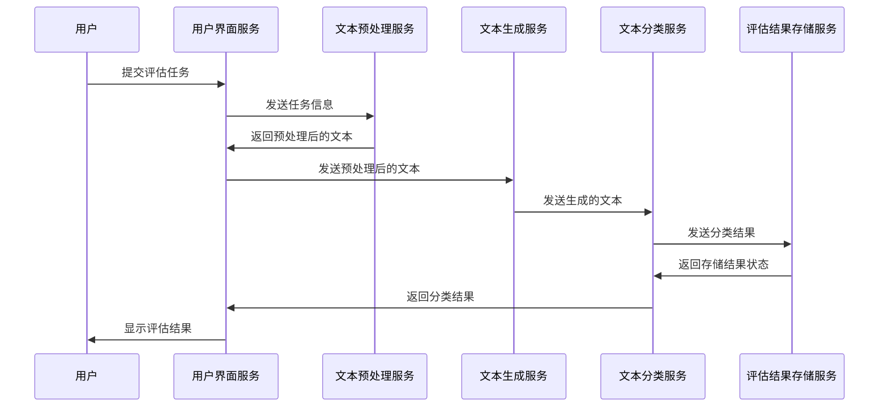

                 

### 引言

随着云计算和人工智能技术的飞速发展，云原生架构逐渐成为现代软件系统设计和部署的主流方向。云原生（Cloud Native）架构是一种面向云计算环境的新型设计理念，其核心目标是实现应用的弹性扩展、快速部署和高效运维。具体来说，云原生架构通过容器化、服务网格、微服务架构等关键技术，使得应用能够更加灵活、高效地运行在云平台上。

本篇文章的主题是《云原生架构在LLM评测系统中的应用》。LLM（Large Language Model，大型语言模型）评测系统是一个典型的复杂系统，其核心任务是评估大型语言模型的性能和质量。随着模型的规模和复杂性的增加，LLM评测系统面临着诸多挑战，如高效的计算资源管理、大规模数据的处理、系统的可靠性和稳定性等。

云原生架构凭借其灵活、可扩展、高可用等特性，为LLM评测系统提供了有效的解决方案。通过云原生架构，我们可以将LLM评测系统的各个组件容器化，利用容器编排工具如Kubernetes进行自动化部署和管理，并使用服务网格技术优化系统内部的通信和协作。此外，微服务架构的设计使得LLM评测系统可以更加模块化、解耦化，从而提高系统的可维护性和可扩展性。

本文将分为以下几个部分进行详细探讨：

1. **云原生架构概述**：介绍云原生架构的核心概念和原理，包括容器化、容器编排、服务网格和微服务架构等关键技术。
2. **LLM评测系统概述**：分析LLM评测系统的组成、功能以及面临的挑战。
3. **云原生架构在LLM评测系统中的应用**：探讨如何在LLM评测系统中应用云原生架构，包括容器化、服务网格优化和微服务架构设计等。
4. **系统设计与实现**：详细描述LLM评测系统的设计思路和实现方法，包括系统功能设计、系统架构设计、系统接口设计和系统实现。
5. **系统实现与部署**：介绍LLM评测系统的环境安装与配置、核心实现源代码以及部署与运维策略。
6. **实际案例分析**：通过一个实际案例，展示云原生架构在LLM评测系统中的应用效果。
7. **最佳实践与展望**：总结云原生架构在LLM评测系统中的应用经验，并对未来发展趋势进行展望。

通过本文的详细分析和探讨，读者可以深入了解云原生架构在LLM评测系统中的应用，掌握云原生架构的核心原理和应用方法，为实际项目提供有力的技术支持和指导。

### 关键词

- 云原生架构
- LLM评测系统
- 容器化
- 服务网格
- 微服务架构

### 摘要

本文围绕云原生架构在LLM评测系统中的应用进行深入探讨。首先介绍了云原生架构的核心概念与关键技术，包括容器化、容器编排、服务网格和微服务架构。接着分析了LLM评测系统的组成、功能以及面临的挑战，如计算资源管理、数据处理和系统稳定性等。随后，本文详细探讨了如何应用云原生架构解决LLM评测系统中的问题，包括容器化、服务网格优化和微服务架构设计。文章还通过系统设计与实现、系统实现与部署、实际案例分析以及最佳实践与展望，全面展示了云原生架构在LLM评测系统中的实际应用效果和未来发展趋势。本文旨在为读者提供关于云原生架构在LLM评测系统中的应用知识，帮助读者掌握相关技术和方法，提升系统的性能和可维护性。

### 第1章 引言

#### 1.1 云原生架构概述

云原生架构（Cloud Native Architecture）是一种现代软件开发与运行模式，旨在充分利用云计算环境提供的资源，实现应用的弹性扩展、快速部署和高效运维。其核心理念是“分布式、容器化、自动化”，通过将应用解耦为多个微服务，利用容器进行封装和部署，并结合容器编排工具实现自动化管理，从而实现高效、可靠和可扩展的系统。

**核心概念与原理**：

1. **容器化（Containerization）**：容器化是一种将应用程序及其运行时环境封装在容器中的技术。容器提供了轻量级、可移植的运行环境，使得应用可以在不同的操作系统和硬件平台上无缝运行。Docker是当前最流行的容器化工具，通过Dockerfile定义容器镜像，实现应用的打包和部署。

2. **容器编排（Container Orchestration）**：容器编排是指管理和自动化容器生命周期（创建、启动、停止、重启）的过程。Kubernetes是当前最流行的容器编排工具，通过声明式API管理和调度容器化应用，提供自动化部署、扩展和服务发现等功能。

3. **服务网格（Service Mesh）**：服务网格是一种用于管理和服务间通信的基础设施层，其核心目的是解耦服务之间的通信，提供可靠、安全的通信机制。服务网格通过代理（如Istio）实现服务间的通信，提供流量管理、服务发现、断路器、监控等功能。

4. **微服务架构（Microservices Architecture）**：微服务架构是一种将大型应用程序拆分为多个小型、独立服务的架构风格。每个微服务负责完成特定的业务功能，可以独立开发、测试和部署。微服务架构的优点是提高了系统的可维护性和可扩展性，但同时也带来了服务间通信和分布式事务等挑战。

**云原生架构的应用场景**：

云原生架构适用于需要高可用性、可扩展性和快速迭代的应用场景，如Web服务、移动应用、大数据处理、人工智能应用等。特别是在大规模分布式系统中，云原生架构能够有效解决资源调度、服务管理和系统可靠性等问题，提升系统的整体性能和运维效率。

**与传统架构的区别**：

与传统架构相比，云原生架构具有以下显著特点：

1. **分布式**：云原生架构基于分布式系统设计，应用被拆分为多个独立的服务，可以在不同的节点上运行，提高了系统的可靠性和可扩展性。
2. **容器化**：容器化使得应用可以在任何支持Docker的环境中运行，提高了部署的灵活性和可移植性。
3. **自动化**：通过容器编排工具和服务网格，实现了应用的自动化部署、扩展和管理，降低了运维成本。
4. **高可用性**：云原生架构提供了自动化的故障转移和恢复机制，提高了系统的稳定性和可靠性。

总之，云原生架构为现代软件开发和运维提供了一种全新的思路和方法，通过其分布式、容器化和自动化的特性，使得应用能够更加高效、可靠地运行在云环境中。

#### 1.2 LLM评测系统的背景和挑战

LLM（Large Language Model）评测系统是一种用于评估大型语言模型性能和质量的核心工具。随着人工智能技术的快速发展，尤其是大型语言模型的广泛应用，LLM评测系统在自然语言处理（NLP）、文本生成、问答系统等领域扮演着至关重要的角色。

**背景**：

语言模型是一种基于统计或神经网络的方法，用于生成自然语言文本。大型语言模型（如GPT-3、BERT等）具有数十亿个参数，能够生成高质量的文本，但在实际应用中，如何评估其性能和准确性是一个亟待解决的问题。LLM评测系统的出现，为研究人员和开发者提供了一个统一的标准，用于评估不同模型在特定任务上的表现。

**挑战**：

尽管LLM评测系统在理论上提供了一种标准化的评估方法，但在实际应用中，依然面临着诸多挑战：

1. **计算资源管理**：LLM评测系统通常需要大量的计算资源，尤其是在处理大规模数据集和复杂模型时。如何高效地管理和分配这些资源，确保系统的高效运行，是一个重要的挑战。
2. **数据处理**：大型语言模型评测系统需要处理大量的数据，包括训练数据、测试数据和评估指标数据。如何在短时间内处理这些数据，并保证数据的准确性和完整性，是另一个关键问题。
3. **系统稳定性**：大型语言模型评测系统需要长时间运行，且在高负载情况下，系统稳定性至关重要。如何确保系统在长时间运行和高负载情况下依然稳定可靠，是系统设计中的一个重要考虑因素。
4. **结果可解释性**：评估结果的可解释性是另一个重要挑战。如何通过可解释的评估方法，帮助研究人员和开发者理解模型的行为和局限性，是当前研究的一个重要方向。

**解决方案**：

云原生架构为LLM评测系统提供了有效的解决方案。通过容器化技术，可以将评测系统的各个组件封装为容器，实现应用的灵活部署和高效管理。容器编排工具如Kubernetes能够自动化部署和管理这些容器，提高系统的可靠性和可扩展性。服务网格技术则提供了高效、安全的通信机制，优化系统内部的通信和协作。微服务架构的设计使得LLM评测系统可以更加模块化、解耦化，从而提高系统的可维护性和可扩展性。

总之，云原生架构在LLM评测系统中的应用，不仅解决了传统架构中面临的计算资源管理、数据处理和系统稳定性等问题，还为系统的进一步优化和扩展提供了有力支持。

#### 1.3 书籍结构安排

本篇文章旨在深入探讨云原生架构在LLM评测系统中的应用，为了帮助读者更好地理解和掌握相关技术，文章结构安排如下：

1. **第1章 引言**：简要介绍云原生架构和LLM评测系统的背景，阐述本文的主题和目的。
2. **第2章 云原生架构基础**：详细讲解云原生架构的核心概念和关键技术，包括容器化、容器编排、服务网格和微服务架构等。
3. **第3章 LLM评测系统概述**：分析LLM评测系统的组成、功能以及面临的挑战。
4. **第4章 云原生架构在LLM评测系统中的应用**：探讨如何将云原生架构应用于LLM评测系统，包括容器化、服务网格优化和微服务架构设计等。
5. **第5章 系统设计与实现**：详细描述LLM评测系统的设计思路和实现方法，包括系统功能设计、系统架构设计、系统接口设计和系统实现。
6. **第6章 系统实现与部署**：介绍LLM评测系统的环境安装与配置、核心实现源代码以及部署与运维策略。
7. **第7章 实际案例分析**：通过一个实际案例，展示云原生架构在LLM评测系统中的应用效果。
8. **第8章 最佳实践与展望**：总结云原生架构在LLM评测系统中的应用经验，并对未来发展趋势进行展望。

通过以上结构安排，本文将为读者提供一个全面、深入的云原生架构在LLM评测系统中的应用教程，帮助读者掌握相关技术和方法，提升系统的性能和可维护性。

### 第2章 云原生架构基础

#### 2.1 云原生概念与核心原理

云原生（Cloud Native）架构是一种基于云计算的新型设计理念，其核心目标是通过利用云计算环境提供的弹性资源和高效管理，实现应用的快速迭代、部署和扩展。云原生架构不仅是一种技术框架，更是一种软件开发的思维方式，它强调分布式系统、容器化、自动化和持续集成/持续部署（CI/CD）等理念。

**定义与特点**：

云原生架构具有以下核心特点：

1. **分布式**：云原生架构强调分布式系统的设计，将应用拆分为多个独立的服务，这些服务可以在不同的节点上运行，提高了系统的可靠性和可扩展性。
2. **容器化**：容器化是云原生架构的核心技术之一，通过将应用及其依赖封装在容器中，实现了应用的轻量级、可移植和独立运行。
3. **自动化**：自动化是云原生架构的另一个重要特点，通过自动化工具（如容器编排工具、服务网格等），实现了应用的自动化部署、扩展和管理，降低了运维成本。
4. **持续集成/持续部署（CI/CD）**：云原生架构强调持续集成和持续部署，通过自动化流程实现了应用的快速迭代和高质量交付。

**核心原理**：

云原生架构的核心原理主要包括以下几个方面：

1. **容器化**：容器化通过将应用和其运行环境打包成容器镜像，实现了应用的轻量级和可移植性。Docker是当前最流行的容器化工具，它通过Dockerfile定义容器镜像，支持应用的快速构建和部署。
2. **容器编排**：容器编排是指管理和自动化容器生命周期（创建、启动、停止、重启）的过程。Kubernetes是当前最流行的容器编排工具，它通过声明式API管理和调度容器化应用，提供自动化部署、扩展和服务发现等功能。
3. **服务网格**：服务网格是一种用于管理和服务间通信的基础设施层，通过代理（如Istio）实现服务间的通信，提供流量管理、服务发现、断路器、监控等功能。服务网格的核心目标是解耦服务之间的通信，提高系统的可靠性和可维护性。
4. **微服务架构**：微服务架构是一种将大型应用程序拆分为多个小型、独立服务的架构风格。每个微服务负责完成特定的业务功能，可以独立开发、测试和部署。微服务架构的优点是提高了系统的可维护性和可扩展性，但同时也带来了服务间通信和分布式事务等挑战。

**与传统架构的区别**：

与传统架构相比，云原生架构具有以下显著区别：

1. **分布式**：传统架构通常采用单机部署，系统扩展性和可靠性有限；而云原生架构基于分布式系统设计，应用可以拆分为多个独立的服务，分布在不同的节点上运行，提高了系统的可靠性和可扩展性。
2. **容器化**：传统架构通常依赖于操作系统级别的虚拟化技术，如VM（虚拟机），而云原生架构通过容器化技术实现了应用的轻量级和可移植性，容器提供了更高的隔离性和效率。
3. **自动化**：传统架构的部署和管理通常依赖于人工操作，而云原生架构通过自动化工具（如Kubernetes、服务网格等）实现了应用的自动化部署、扩展和管理，降低了运维成本。
4. **持续集成/持续部署（CI/CD）**：传统架构通常采用周期性更新和部署，而云原生架构强调持续集成和持续部署，通过自动化流程实现了应用的快速迭代和高质量交付。

总之，云原生架构通过分布式、容器化、自动化和持续集成/持续部署等核心原理，为现代软件开发和运维提供了一种全新的思路和方法，使得应用能够更加高效、可靠地运行在云环境中。

#### 2.2 容器化与容器编排

**2.2.1 Docker与容器化**

容器化技术是云原生架构的核心组成部分，而Docker则是目前最流行的容器化工具。Docker通过将应用及其依赖环境封装在一个独立的容器中，实现了应用的轻量级、可移植和独立运行。以下是Docker与容器化技术的详细介绍：

**定义与原理**：

Docker是一种开源的应用容器引擎，它通过容器镜像（Container Image）和容器（Container）实现了应用的封装和运行。容器镜像是一个静态的文件系统，包含了应用所需的所有依赖和环境，而容器则是基于容器镜像运行的可执行实例。

Docker的基本原理如下：

1. **容器镜像**：容器镜像是一个轻量级的、可执行的文件系统，它包含了应用所需的所有依赖、库和环境变量。容器镜像通过Dockerfile定义，Dockerfile是一个文本文件，用于描述如何构建容器镜像。
2. **容器**：容器是基于容器镜像创建的可执行实例，它封装了应用的运行时环境，使得应用可以在任何支持Docker的环境中运行。容器通过Docker CLI（命令行接口）进行管理，包括创建、启动、停止、删除等操作。

**使用场景与优势**：

容器化技术的使用场景非常广泛，包括但不限于以下方面：

1. **持续集成与持续部署（CI/CD）**：容器化使得应用可以快速构建和部署，支持持续集成和持续部署，提高了开发效率和质量。
2. **微服务架构**：容器化技术是实现微服务架构的重要手段，通过将应用拆分为多个独立的微服务，可以更好地管理和扩展系统。
3. **跨平台部署**：容器化的应用可以在任何支持Docker的环境中运行，提高了应用的移植性和可维护性。
4. **资源隔离**：容器提供了操作系统级别的隔离，提高了系统的安全性。

**Docker的常用命令**：

1. **构建容器镜像**：通过Dockerfile构建容器镜像。
   ```shell
   docker build -t <镜像名称> .
   ```

2. **运行容器**：通过Docker CLI运行容器。
   ```shell
   docker run -d -p <宿主端口>:<容器端口> <镜像名称>
   ```

3. **查看容器列表**：查看当前正在运行的容器列表。
   ```shell
   docker ps
   ```

4. **停止容器**：停止指定的容器。
   ```shell
   docker stop <容器ID或名称>
   ```

5. **删除容器**：删除指定的容器。
   ```shell
   docker rm <容器ID或名称>
   ```

**2.2.2 Kubernetes与容器编排**

Kubernetes（简称K8s）是一种开源的容器编排工具，它用于管理和自动化容器化应用的生命周期。Kubernetes提供了一系列强大的功能，包括自动化部署、扩展、服务发现、负载均衡等，使得容器化应用的管理变得更加简单和高效。

**定义与原理**：

Kubernetes的基本原理如下：

1. **集群（Cluster）**：Kubernetes集群由多个节点（Node）组成，每个节点负责运行容器化应用。集群中的节点可以分为两种角色：Master节点和Worker节点。Master节点负责集群的管理和控制，如调度、监控等；Worker节点负责运行容器化应用。
2. **Pod**：Pod是Kubernetes中的最小部署单元，它包含了一个或多个容器，以及用于管理这些容器的必要组件。Pod提供了容器的调度、资源隔离和故障恢复等功能。
3. **ReplicaSet**：ReplicaSet是Kubernetes中的部署策略，它确保在集群中运行指定数量的Pod副本。当Pod因故障而不可用时，ReplicaSet会自动创建新的Pod副本，确保应用的可用性。
4. **Service**：Service提供了一种抽象方式，用于将Pod暴露为网络服务。Service通过虚拟IP地址（VIP）和端口映射，将外部流量路由到集群内的Pod副本。

**Kubernetes的常用命令**：

1. **创建Pod**：
   ```yaml
   apiVersion: v1
   kind: Pod
   metadata:
     name: my-pod
   spec:
     containers:
     - name: my-container
       image: my-image
   ```
   ```shell
   kubectl create -f <yaml文件路径>
   ```

2. **查看Pod列表**：
   ```shell
   kubectl get pods
   ```

3. **删除Pod**：
   ```shell
   kubectl delete pod <Pod名称>
   ```

4. **部署应用**：
   ```yaml
   apiVersion: apps/v1
   kind: Deployment
   metadata:
     name: my-deployment
   spec:
     replicas: 3
     selector:
       matchLabels:
         app: my-app
     template:
       metadata:
         labels:
           app: my-app
       spec:
         containers:
         - name: my-container
           image: my-image
   ```
   ```shell
   kubectl create -f <yaml文件路径>
   ```

5. **查看服务列表**：
   ```shell
   kubectl get services
   ```

**使用场景与优势**：

容器编排工具如Kubernetes在以下使用场景中具有显著优势：

1. **自动化部署**：Kubernetes通过声明式API，实现了应用的自动化部署和更新，减少了人工干预，提高了部署效率。
2. **扩展性**：Kubernetes支持水平扩展，可以通过增加或减少Pod副本数量来应对负载变化，提高了系统的可扩展性。
3. **高可用性**：Kubernetes提供了自动化的故障恢复机制，如ReplicaSet和StatefulSet，确保应用的高可用性。
4. **服务发现和负载均衡**：Kubernetes通过Service抽象，实现了服务发现和负载均衡，提高了系统的可靠性和性能。

总之，Docker与Kubernetes作为云原生架构的核心组件，通过容器化技术实现了应用的轻量级和可移植性，而通过容器编排技术实现了应用的自动化管理和高可用性。这些特性使得云原生架构在复杂分布式系统中具有广泛的应用前景。

#### 2.3 服务网格与微服务架构

**2.3.1 服务网格基础**

服务网格（Service Mesh）是一种用于管理和服务间通信的基础设施层，其核心目的是解耦服务之间的通信，提供可靠、安全的通信机制。服务网格通过代理（如Istio、Linkerd等）实现服务间的通信，提供流量管理、服务发现、断路器、监控等功能。服务网格的出现，使得分布式系统的管理和运维变得更加简单和高效。

**定义与架构**：

服务网格的定义可以从以下几个方面进行理解：

1. **服务间通信**：服务网格主要关注服务间的通信问题，通过代理（如Envoy）实现了服务间的可靠通信。
2. **流量管理**：服务网格提供了丰富的流量管理功能，如路由策略、负载均衡、故障转移等，使得服务间通信更加灵活和高效。
3. **安全性**：服务网格通过加密、认证和授权等机制，确保服务间通信的安全性。
4. **监控与日志**：服务网格提供了集成的监控和日志功能，使得分布式系统的管理和监控变得更加简单和高效。

服务网格的基本架构包括以下几个方面：

1. **数据平面（Data Plane）**：数据平面由一组代理（如Envoy）组成，这些代理负责处理服务间通信。数据平面实现了流量管理、负载均衡、断路器等功能。
2. **控制平面（Control Plane）**：控制平面负责管理数据平面代理，包括配置下发、监控、日志等。控制平面由一组服务组成，如控制器（Controller）、服务发现（Service Discovery）和配置管理（Configuration Management）等。

**服务网格的优势**：

服务网格为分布式系统带来了以下显著优势：

1. **解耦**：服务网格通过代理实现了服务间的解耦，使得服务可以独立开发和部署，降低了系统的复杂性。
2. **流量管理**：服务网格提供了丰富的流量管理功能，如路由策略、负载均衡、故障转移等，提高了系统的可靠性和性能。
3. **安全性**：服务网格通过加密、认证和授权等机制，确保服务间通信的安全性。
4. **监控与日志**：服务网格提供了集成的监控和日志功能，使得分布式系统的管理和监控变得更加简单和高效。

**2.3.2 微服务架构的优势与挑战**

微服务架构（Microservices Architecture）是一种将大型应用程序拆分为多个小型、独立服务的架构风格。每个微服务负责完成特定的业务功能，可以独立开发、测试和部署。微服务架构的优点包括提高了系统的可维护性和可扩展性，但同时也带来了一些挑战。

**定义与优势**：

微服务架构的定义可以从以下几个方面进行理解：

1. **独立部署**：每个微服务都可以独立部署和更新，减少了系统的复杂性，提高了系统的可维护性。
2. **高可用性**：微服务架构通过分布式部署，提高了系统的可用性和容错能力。
3. **可扩展性**：微服务架构可以根据业务需求，独立扩展特定的微服务，提高了系统的性能和可扩展性。
4. **灵活性**：微服务架构使得不同团队可以独立开发和维护不同的微服务，提高了系统的灵活性。

微服务架构的优势包括：

1. **可维护性**：微服务架构将大型应用程序拆分为多个小型、独立的服务，使得每个服务可以独立开发和维护，降低了系统的复杂性，提高了系统的可维护性。
2. **可扩展性**：微服务架构可以根据业务需求，独立扩展特定的微服务，提高了系统的性能和可扩展性。
3. **高可用性**：微服务架构通过分布式部署，提高了系统的可用性和容错能力。
4. **灵活性**：微服务架构使得不同团队可以独立开发和维护不同的微服务，提高了系统的灵活性。

**面临的挑战**：

尽管微服务架构具有很多优点，但同时也带来了一些挑战：

1. **服务间通信**：随着服务数量的增加，服务间通信变得更加复杂，如何确保服务间通信的高效和可靠是一个重要问题。
2. **分布式事务**：微服务架构中的分布式事务处理相对复杂，如何保证数据的一致性是一个重要挑战。
3. **监控与日志**：微服务架构的监控和日志管理变得更加复杂，需要有效的工具和方法来管理和分析。
4. **部署与运维**：微服务架构的部署和运维需要更多的资源和技能，如何高效地管理和运维是一个重要问题。

**微服务架构的实施策略**：

为了有效实施微服务架构，可以采取以下策略：

1. **服务拆分**：根据业务需求和功能模块，将应用程序拆分为多个独立的微服务，每个微服务负责特定的业务功能。
2. **服务注册与发现**：使用服务注册与发现机制，确保服务之间可以动态发现和通信。
3. **分布式事务管理**：采用分布式事务管理工具（如Seata），确保数据的一致性和完整性。
4. **监控与日志**：使用集成的监控和日志工具，如Prometheus和ELK（Elasticsearch、Logstash、Kibana），实现对微服务架构的监控和日志管理。

总之，服务网格和微服务架构是云原生架构的重要组成部分，通过服务网格实现了服务间的高效、可靠通信，而通过微服务架构实现了系统的灵活、可扩展性。了解和掌握服务网格和微服务架构，对于构建高效、可靠的分布式系统具有重要意义。

### 第3章 LLM评测系统概述

#### 3.1 LLM评测系统的组成与功能

LLM（Large Language Model）评测系统是一种用于评估大型语言模型性能和质量的综合工具。该系统由多个核心组件组成，各组件相互协作，共同实现评估功能。以下是LLM评测系统的组成及其功能：

**1. 数据处理模块**：数据处理模块负责对输入的数据集进行预处理，包括数据清洗、数据格式转换、分词等操作。该模块的主要功能是确保输入数据的质量和一致性，为后续评估提供可靠的基础。

**2. 模型加载模块**：模型加载模块负责从存储介质中加载预训练的语言模型，如GPT-3、BERT等。该模块的主要功能是确保模型的可访问性，并为评估模块提供高质量的模型。

**3. 评估模块**：评估模块是LLM评测系统的核心组件，负责执行具体的评估任务。评估任务通常包括文本生成、文本分类、问答系统等多个方面。评估模块的主要功能是根据预定的评估指标（如BLEU分数、F1分数等），对模型在各个任务上的表现进行量化评估。

**4. 结果存储模块**：结果存储模块负责将评估结果存储到数据库或文件系统中，以便后续分析和查询。该模块的主要功能是确保评估结果的持久性和可访问性。

**5. 用户界面模块**：用户界面模块为用户提供了一个友好的交互界面，用于提交评估任务、查看评估结果和配置系统参数。该模块的主要功能是提高系统的易用性和用户体验。

**功能特点**：

1. **全面性**：LLM评测系统能够涵盖多种评估任务，如文本生成、文本分类、问答系统等，为大型语言模型的评估提供全面的支持。
2. **灵活性**：评估模块支持自定义评估指标，用户可以根据具体需求调整评估参数，实现灵活的评估策略。
3. **高效性**：通过利用云计算和分布式计算技术，LLM评测系统能够在短时间内处理大规模数据集，提高评估效率。
4. **可扩展性**：LLM评测系统支持模块化设计，可以根据需求扩展新的评估任务或功能模块，提高系统的可维护性和可扩展性。

**3.2 LLM评测系统面临的挑战**

尽管LLM评测系统在评估大型语言模型性能和质量方面发挥了重要作用，但在实际应用中，仍面临诸多挑战：

**1. 计算资源管理**：LLM评测系统通常需要大量的计算资源，尤其是在处理大规模数据集和复杂模型时。如何高效地管理和分配这些资源，确保系统的高效运行，是一个重要的挑战。

**2. 数据处理效率**：随着模型规模和数据量的增加，LLM评测系统需要处理的数据量也大幅上升。如何在短时间内处理这些数据，并保证数据的准确性和完整性，是一个关键问题。

**3. 系统稳定性**：大型语言模型评测系统需要长时间运行，且在高负载情况下，系统稳定性至关重要。如何确保系统在长时间运行和高负载情况下依然稳定可靠，是系统设计中的一个重要考虑因素。

**4. 结果可解释性**：评估结果的可解释性是另一个重要挑战。如何通过可解释的评估方法，帮助研究人员和开发者理解模型的行为和局限性，是当前研究的一个重要方向。

**3.3 云原生在LLM评测系统中的应用前景**

云原生架构凭借其灵活、可扩展、高可用等特性，为LLM评测系统提供了有效的解决方案。通过云原生架构，我们可以将LLM评测系统的各个组件容器化，利用容器编排工具如Kubernetes进行自动化部署和管理，并使用服务网格技术优化系统内部的通信和协作。此外，微服务架构的设计使得LLM评测系统可以更加模块化、解耦化，从而提高系统的可维护性和可扩展性。

具体来说，云原生在LLM评测系统中的应用前景包括：

**1. 高效计算资源管理**：通过容器化技术，LLM评测系统可以在不同节点上动态分配计算资源，实现计算资源的最大化利用。容器编排工具如Kubernetes能够自动化管理这些容器，确保系统在资源分配和调度上的高效性。

**2. 数据处理优化**：云原生架构提供了分布式计算和并行处理的能力，使得LLM评测系统能够在短时间内处理大规模数据集。服务网格技术如Istio能够优化系统内部的通信和数据处理流程，提高系统的整体性能。

**3. 系统稳定性保障**：通过容器编排和服务网格技术，LLM评测系统可以实现自动化的故障转移和恢复机制，确保系统在长时间运行和高负载情况下依然稳定可靠。

**4. 结果可解释性提升**：云原生架构提供了集成的监控和日志功能，可以帮助研究人员和开发者更好地理解和分析评估结果，提升结果的可解释性。

总之，云原生架构为LLM评测系统提供了有效的解决方案，通过其灵活、可扩展、高可用等特性，能够显著提升系统的性能和可维护性，为大型语言模型的评估提供了有力支持。

### 第4章 云原生架构在LLM评测系统中的应用

#### 4.1 容器化LLM评测服务

**4.1.1 使用Docker容器化**

Docker是云原生架构中的关键组件，用于容器化应用程序，实现应用的轻量级、可移植和独立运行。在LLM评测系统中，我们可以通过Docker将LLM模型及其依赖环境封装为容器，从而实现高效的部署和管理。

**步骤**：

1. **编写Dockerfile**：Dockerfile是用于构建容器镜像的文本文件，定义了应用的构建过程。以下是一个简单的Dockerfile示例，用于构建LLM评测服务的容器镜像。

   ```Dockerfile
   # 使用官方Python镜像作为基础镜像
   FROM python:3.8-slim

   # 设置工作目录
   WORKDIR /app

   # 拷贝应用程序及其依赖项
   COPY . /app

   # 安装依赖项
   RUN pip install --no-cache-dir -r requirements.txt

   # 暴露应用的端口号
   EXPOSE 8000

   # 运行应用
   CMD ["python", "app.py"]
   ```

   在这个示例中，我们使用Python 3.8-slim作为基础镜像，将应用程序和依赖项拷贝到工作目录，并安装所需的依赖。最后，暴露应用的端口号（例如8000），并设置CMD指令来启动应用。

2. **构建容器镜像**：使用Docker CLI构建容器镜像。

   ```shell
   docker build -t llm-evaluator:1.0 .
   ```

   在这个命令中，`-t`标志用于指定镜像标签（如`llm-evaluator:1.0`），`.`表示Dockerfile文件所在的路径。

3. **运行容器**：使用Docker CLI运行构建好的容器镜像。

   ```shell
   docker run -d -p 8000:8000 llm-evaluator:1.0
   ```

   在这个命令中，`-d`标志表示后台运行容器，`-p`标志用于映射容器的端口号（如`8000:8000`）到宿主机的端口。

**优势**：

1. **可移植性**：容器化的应用可以在任何支持Docker的环境中运行，不受底层操作系统和硬件的限制，提高了应用的移植性。
2. **轻量级**：容器是轻量级的，不需要额外的操作系统或虚拟化层，提高了系统的性能和资源利用率。
3. **隔离性**：容器提供了操作系统级别的隔离，确保应用之间不会相互干扰，提高了系统的安全性。

**4.1.2 Kubernetes部署与运维**

Kubernetes是用于容器编排的开源平台，能够自动化部署、扩展和管理容器化应用。在LLM评测系统中，我们可以使用Kubernetes来部署和管理容器化的LLM评测服务。

**步骤**：

1. **创建部署配置文件**：创建一个Kubernetes部署配置文件（如`llm-evaluator-deployment.yaml`），定义部署的细节。

   ```yaml
   apiVersion: apps/v1
   kind: Deployment
   metadata:
     name: llm-evaluator
     labels:
       app: llm-evaluator
   spec:
     replicas: 3
     selector:
       matchLabels:
         app: llm-evaluator
     template:
       metadata:
         labels:
           app: llm-evaluator
       spec:
         containers:
         - name: llm-evaluator
           image: llm-evaluator:1.0
           ports:
           - containerPort: 8000
   ```

   在这个配置文件中，我们定义了部署的名称（如`llm-evaluator`），标签（如`app: llm-evaluator`），以及容器的镜像（如`llm-evaluator:1.0`）和端口号（如`8000`）。

2. **部署服务**：使用Kubernetes CLI部署配置文件。

   ```shell
   kubectl apply -f llm-evaluator-deployment.yaml
   ```

   这个命令将根据配置文件创建并部署服务。

3. **查看部署状态**：使用Kubernetes CLI查看部署的状态。

   ```shell
   kubectl get pods
   ```

   这个命令将显示所有Pod的状态，包括`Running`、`Pending`、`Failed`等。

4. **扩展服务**：根据需要扩展服务的副本数量。

   ```shell
   kubectl scale deployment llm-evaluator --replicas=5
   ```

   这个命令将扩展部署的副本数量到5个。

**优势**：

1. **自动化部署**：Kubernetes能够自动化部署容器化应用，减少了手动操作的复杂性。
2. **弹性扩展**：Kubernetes支持自动扩展，可以根据负载自动增加或减少Pod的数量。
3. **高可用性**：Kubernetes提供了自动化的故障转移和恢复机制，确保应用的高可用性。
4. **资源优化**：Kubernetes能够根据资源需求动态分配计算资源，优化资源利用率。

通过容器化和Kubernetes部署，我们可以实现LLM评测服务的高效部署和管理，提高系统的可维护性和可扩展性。接下来，我们将进一步探讨如何使用服务网格优化LLM评测系统的通信和协作。

#### 4.2 服务网格优化

**4.2.1 服务网格在LLM评测系统中的作用**

服务网格（Service Mesh）是一种用于管理和服务间通信的基础设施层，其核心目的是解耦服务之间的通信，提供可靠、安全的通信机制。在LLM评测系统中，服务网格可以通过以下方式优化系统内部的通信和协作：

**1. 负载均衡**：服务网格能够根据服务请求的流量情况，自动分配负载到不同的服务实例上，提高系统的性能和可用性。例如，在LLM评测系统中，可以使用服务网格实现对多个模型评估服务的负载均衡，确保每个评估请求都能高效地分配到合适的模型实例上。

**2. 服务发现**：服务网格能够动态发现和注册服务，使得服务之间的通信更加灵活。在LLM评测系统中，服务网格可以帮助新部署的评估服务快速被发现和注册，从而确保系统能够快速响应新服务的加入。

**3. 流量控制**：服务网格提供了丰富的流量控制功能，如路由策略、断路器等，能够有效地管理和控制服务间的流量。例如，在LLM评测系统中，可以使用服务网格实现流量控制，避免某一评估服务因负载过高而出现性能瓶颈。

**4. 安全性**：服务网格通过加密、认证和授权等机制，确保服务间通信的安全性。在LLM评测系统中，使用服务网格可以实现安全的模型评估请求传输，防止敏感数据和模型参数泄露。

**5. 监控与日志**：服务网格提供了集成的监控和日志功能，使得分布式系统的管理和监控变得更加简单和高效。例如，在LLM评测系统中，可以使用服务网格收集和聚合各个评估服务的监控数据和日志信息，从而实现对系统的全面监控和故障排查。

**4.2.2 使用Istio进行服务网格优化**

Istio是一种流行的服务网格平台，能够为分布式服务提供强大的通信管理功能。在LLM评测系统中，我们可以使用Istio进行服务网格优化，提升系统的性能和可靠性。

**安装Istio**：

在Kubernetes集群中安装Istio，可以按照以下步骤进行：

1. **下载Istio安装脚本**：

   ```shell
   curl -L https://istio.io/downloadIstio | sh -
   ```

2. **解压安装包**：

   ```shell
   cd istio-1.10.0
   tar -xvf istio-1.10.0-linux_x86_64.tar.gz
   ```

3. **安装Istio组件**：

   ```shell
   cd istio-1.10.0
   istioctl install --set profile=demo
   ```

**配置服务网格**：

为了在LLM评测系统中使用Istio进行服务网格优化，我们需要进行以下配置：

1. **将服务注册到Istio服务发现**：

   首先，需要将LLM评测系统的服务注册到Istio的服务发现中。这可以通过在Kubernetes中创建相应的服务定义文件实现。

   ```yaml
   apiVersion: networking.istio.io/v1alpha3
   kind: ServiceEntry
   metadata:
     name: llm-evaluator
   spec:
     addresses:
     - "llm-evaluator.default.svc.cluster.local"
     ports:
     - number: 80
       name: http
       protocol: HTTP
       targetPort: 8000
     resolution: DNS
     hosts:
     - "llm-evaluator.default.svc.cluster.local"
   ```

   然后使用Istio CLI应用服务定义文件：

   ```shell
   istioctl create -f service-entry.yaml
   ```

2. **配置路由策略**：

   为了实现负载均衡和流量控制，可以使用Istio的路由策略。例如，我们可以为LLM评测系统配置以下路由策略：

   ```yaml
   apiVersion: networking.istio.io/v1alpha3
   kind: VirtualService
   metadata:
     name: llm-evaluator
   spec:
     hosts:
     - "llm-evaluator.default.svc.cluster.local"
     http:
     - match:
       - uri:
           prefix: /
       route:
       - destination:
           host: "llm-evaluator.default.svc.cluster.local"
           subset: "v1"
     - match:
       - uri:
           prefix: /v2
       route:
       - destination:
           host: "llm-evaluator.default.svc.cluster.local"
           subset: "v2"
   ```

   然后使用Istio CLI应用路由策略：

   ```shell
   istioctl create -f virtual-service.yaml
   ```

3. **配置断路器**：

   为了避免服务因过载而崩溃，可以使用Istio的断路器功能。例如，我们可以为LLM评测系统配置以下断路器策略：

   ```yaml
   apiVersion: networking.istio.io/v1alpha3
   kind: DestinationRule
   metadata:
     name: llm-evaluator
   spec:
     trafficPolicy:
       fault:
         http:
           delay: 100ms
           abort百分比: 0.1
   ```

   然后使用Istio CLI应用断路器策略：

   ```shell
   istioctl create -f destination-rule.yaml
   ```

通过使用Istio进行服务网格优化，LLM评测系统可以实现更加灵活、可靠和高效的内部通信和协作。接下来，我们将探讨如何通过微服务架构设计进一步优化LLM评测系统。

#### 4.3 微服务架构设计

**4.3.1 微服务架构的优势与实施**

微服务架构（Microservices Architecture）是一种将大型应用程序拆分为多个小型、独立服务的架构风格。每个微服务负责完成特定的业务功能，可以独立开发、测试和部署。微服务架构的优势包括提高了系统的可维护性和可扩展性，但同时也带来了一些挑战。以下将详细讨论微服务架构的优势及其在LLM评测系统中的实施。

**优势**：

1. **可维护性**：微服务架构将应用程序拆分为多个独立的服务，使得每个服务都可以独立开发和维护。这降低了系统的复杂性，使得代码更加模块化、易于理解和修改，提高了系统的可维护性。
2. **可扩展性**：微服务架构可以根据业务需求，独立扩展特定的服务。例如，在LLM评测系统中，如果文本生成服务的负载增加，可以单独扩展文本生成服务，而无需对其他服务进行修改，提高了系统的性能和可扩展性。
3. **弹性**：微服务架构通过分布式部署，提高了系统的容错能力和弹性。当一个服务出现故障时，其他服务可以继续正常运行，降低了系统的整体故障率。
4. **灵活性**：微服务架构使得不同团队可以独立开发和维护不同的服务，提高了系统的灵活性。例如，在LLM评测系统中，文本生成和文本分类服务可以由不同的团队负责，每个团队可以根据自己的需求和技术栈进行开发。
5. **技术多样性**：微服务架构允许使用不同的技术栈开发不同的服务，提高了系统的多样性。例如，在LLM评测系统中，文本生成服务可以使用Python和TensorFlow，而文本分类服务可以使用Java和Spark。

**实施策略**：

1. **服务拆分**：根据业务需求和功能模块，将应用程序拆分为多个独立的微服务。例如，在LLM评测系统中，可以拆分为文本预处理服务、文本生成服务、文本分类服务、评估结果存储服务等。
2. **服务注册与发现**：使用服务注册与发现机制，确保服务之间可以动态发现和通信。在LLM评测系统中，可以使用Eureka、Consul等服务注册中心，以及Spring Cloud等服务发现框架。
3. **分布式事务管理**：微服务架构中的分布式事务处理相对复杂，需要采用分布式事务管理工具（如Seata），确保数据的一致性和完整性。
4. **服务间通信**：服务间通信是微服务架构中的重要组成部分，可以使用RESTful API、gRPC、消息队列等通信方式。在LLM评测系统中，可以使用gRPC实现高效、可靠的服务间通信。
5. **监控与日志**：使用集成的监控和日志工具（如Prometheus、ELK等），实现对微服务架构的监控和日志管理，提高系统的可维护性和可扩展性。
6. **部署与运维**：使用容器化技术（如Docker、Kubernetes）和自动化工具（如Jenkins、Ansible等），实现微服务的自动化部署和运维。

**4.3.2 LLM评测系统的微服务拆分**

在LLM评测系统中，我们可以根据功能模块和业务需求，将系统拆分为多个独立的微服务，如下所示：

1. **文本预处理服务**：负责对输入的文本进行预处理，包括分词、去停用词、词干提取等操作，为后续的文本生成和分类提供基础数据。
2. **文本生成服务**：负责基于预训练的语言模型（如GPT-3、BERT等），生成符合要求的文本。该服务可以支持多种生成策略和参数调整，以提高生成文本的质量和多样性。
3. **文本分类服务**：负责对生成的文本进行分类，将其归类到预定义的类别中。该服务可以使用各种分类算法（如朴素贝叶斯、决策树、支持向量机等）进行训练和预测。
4. **评估结果存储服务**：负责将评估结果存储到数据库或文件系统中，以便后续分析和查询。该服务可以支持多种数据存储格式和存储策略，以满足不同的评估需求。
5. **用户界面服务**：负责提供用户交互界面，允许用户提交评估任务、查看评估结果和配置系统参数。该服务可以使用Web框架（如Spring Boot、Django等）实现。

通过微服务架构设计，LLM评测系统可以实现更加模块化、解耦化和灵活的架构，提高系统的可维护性和可扩展性。在实际应用中，可以根据业务需求和技术栈，灵活调整微服务的拆分和部署策略，以满足不同的评估场景和性能要求。

### 第5章 系统设计与实现

#### 5.1 系统功能设计

在LLM评测系统的设计过程中，明确系统功能是至关重要的步骤。系统功能设计不仅需要定义系统的整体功能，还需要详细描述每个功能模块的具体实现和交互方式。以下是LLM评测系统功能设计的详细描述。

**1. 功能模块划分**

LLM评测系统可以分为以下几个主要功能模块：

- **文本预处理服务**：负责对输入的文本进行清洗、分词、去停用词和词干提取等操作，为后续的文本生成和分类提供基础数据。
- **文本生成服务**：基于预训练的语言模型（如GPT-3、BERT等），生成符合要求的文本。该模块支持多种生成策略和参数调整，以提高生成文本的质量和多样性。
- **文本分类服务**：负责对生成的文本进行分类，将其归类到预定义的类别中。该模块可以使用多种分类算法（如朴素贝叶斯、决策树、支持向量机等）进行训练和预测。
- **评估结果存储服务**：负责将评估结果存储到数据库或文件系统中，以便后续分析和查询。该模块支持多种数据存储格式和存储策略。
- **用户界面服务**：提供用户交互界面，允许用户提交评估任务、查看评估结果和配置系统参数。该模块使用Web框架（如Spring Boot、Django等）实现。

**2. 功能模块交互**

LLM评测系统的各个功能模块之间需要紧密协作，具体交互方式如下：

- **文本预处理服务**：接收用户上传的文本数据，将其预处理后传递给文本生成服务和文本分类服务。
- **文本生成服务**：接收来自文本预处理服务的预处理文本，生成文本后传递给文本分类服务进行分类。
- **文本分类服务**：接收来自文本生成服务的生成文本，将其分类后存储到评估结果存储服务中。
- **评估结果存储服务**：接收来自文本分类服务的分类结果，将其存储到数据库或文件系统中。
- **用户界面服务**：通过API与各个功能模块交互，提供用户操作界面，展示评估结果和系统配置信息。

**3. 功能模块实现**

各个功能模块的具体实现如下：

- **文本预处理服务**：使用自然语言处理（NLP）技术，如NLTK或spaCy，实现文本清洗、分词、去停用词和词干提取等功能。该服务提供RESTful API接口，方便其他模块调用。
- **文本生成服务**：使用预训练的语言模型（如GPT-3、BERT等），通过调用模型API实现文本生成功能。该服务也提供RESTful API接口，支持多种生成策略和参数调整。
- **文本分类服务**：使用机器学习算法（如朴素贝叶斯、决策树、支持向量机等），实现文本分类功能。该服务同样提供RESTful API接口，支持分类算法的训练和预测。
- **评估结果存储服务**：使用数据库（如MySQL、PostgreSQL等）或文件系统（如HDFS、AWS S3等）存储评估结果，提供数据存储和查询接口。
- **用户界面服务**：使用Web框架（如Spring Boot、Django等），实现用户交互界面，提供评估任务提交、结果查看和系统配置等功能。

通过详细的功能模块划分和交互设计，LLM评测系统能够高效、可靠地完成文本预处理、生成、分类和评估功能，满足不同用户的需求。

#### 5.2 系统架构设计

系统架构设计是构建高效、可靠和可扩展的LLM评测系统的关键步骤。在系统架构设计过程中，需要综合考虑系统的功能需求、性能要求、可维护性和可扩展性等因素。以下是对LLM评测系统架构设计的详细描述。

**1. 系统架构图**

以下是LLM评测系统的架构图：

```
+-----------------------------+
|      用户界面服务            |
+-----------------------------+
             |
             v
+-----------------------------+
|      文本预处理服务          |
+-----------------------------+
             |
             v
+-----------------------------+
|      文本生成服务            |
+-----------------------------+
             |
             v
+-----------------------------+
|      文本分类服务            |
+-----------------------------+
             |
             v
+-----------------------------+
|      评估结果存储服务         |
+-----------------------------+
```

**2. 系统分层架构**

LLM评测系统的分层架构可以分为以下几层：

- **表示层**：包括用户界面服务和API接口，用于与用户交互和提供数据访问接口。
- **业务逻辑层**：包括文本预处理服务、文本生成服务、文本分类服务和评估结果存储服务，负责处理业务逻辑和数据操作。
- **数据层**：包括数据库或文件系统，用于存储和管理数据。

**3. 系统模块化设计**

LLM评测系统的模块化设计使得系统更加灵活、可维护和可扩展。系统模块分为以下几类：

- **文本预处理模块**：包括文本清洗、分词、去停用词和词干提取等功能。
- **文本生成模块**：包括文本生成算法和生成策略。
- **文本分类模块**：包括分类算法、模型训练和预测功能。
- **存储模块**：包括数据存储和查询功能。
- **用户交互模块**：包括用户操作界面和API接口。

**4. 系统通信机制**

LLM评测系统采用RESTful API作为主要的通信机制，各个功能模块通过HTTP请求进行数据传输和交互。以下是系统的通信流程：

- **用户提交评估任务**：用户通过用户界面服务提交评估任务，界面服务将任务信息发送到文本预处理服务。
- **文本预处理**：文本预处理服务接收任务信息，对文本进行清洗、分词和去停用词等处理，并将预处理后的文本发送给文本生成服务。
- **文本生成**：文本生成服务使用预训练的语言模型生成文本，将生成的文本发送给文本分类服务。
- **文本分类**：文本分类服务对生成的文本进行分类，将分类结果发送给评估结果存储服务。
- **存储结果**：评估结果存储服务将分类结果存储到数据库或文件系统中。
- **返回结果**：用户界面服务从评估结果存储服务获取评估结果，并返回给用户。

通过上述系统架构设计，LLM评测系统能够高效、可靠地完成文本预处理、生成、分类和评估功能，同时具备良好的扩展性和可维护性。

#### 5.3 系统接口设计

系统接口设计是确保LLM评测系统各个功能模块能够高效、稳定地协同工作的关键环节。以下详细描述LLM评测系统的接口设计，包括接口规范、接口实现以及数据交换格式。

**1. 接口规范**

LLM评测系统的接口规范基于RESTful架构风格，采用HTTP协议进行通信。以下是各个功能模块的接口规范：

- **文本预处理服务**：
  - **URL**：`/api/text_preprocessing`
  - **请求方法**：`POST`
  - **请求参数**：`text`（待处理的文本）
  - **响应数据**：预处理后的文本

- **文本生成服务**：
  - **URL**：`/api/text_generation`
  - **请求方法**：`POST`
  - **请求参数**：`text`（预处理后的文本），`strategy`（生成策略），`parameters`（生成参数）
  - **响应数据**：生成的文本

- **文本分类服务**：
  - **URL**：`/api/text_classification`
  - **请求方法**：`POST`
  - **请求参数**：`text`（生成的文本），`category`（预定义类别）
  - **响应数据**：分类结果

- **评估结果存储服务**：
  - **URL**：`/api/evaluation_results`
  - **请求方法**：`POST`
  - **请求参数**：`result`（评估结果）
  - **响应数据**：存储结果状态

- **用户界面服务**：
  - **URL**：`/api/user_interface`
  - **请求方法**：`GET` 或 `POST`
  - **请求参数**：根据不同操作而定
  - **响应数据**：用户界面数据或操作结果

**2. 接口实现**

以下是各个功能模块的接口实现示例：

**文本预处理服务**：

```python
from flask import Flask, request, jsonify

app = Flask(__name__)

@app.route('/api/text_preprocessing', methods=['POST'])
def text_preprocessing():
    text = request.form['text']
    # 实现文本预处理逻辑
    preprocessed_text = preprocess_text(text)
    return jsonify({'preprocessed_text': preprocessed_text})

def preprocess_text(text):
    # 实现文本清洗、分词、去停用词和词干提取等功能
    return text.strip().split()

if __name__ == '__main__':
    app.run(debug=True)
```

**文本生成服务**：

```python
from flask import Flask, request, jsonify

app = Flask(__name__)

@app.route('/api/text_generation', methods=['POST'])
def text_generation():
    text = request.form['text']
    strategy = request.form['strategy']
    parameters = request.form['parameters']
    # 实现文本生成逻辑
    generated_text = generate_text(text, strategy, parameters)
    return jsonify({'generated_text': generated_text})

def generate_text(text, strategy, parameters):
    # 实现文本生成逻辑
    return f"Generated text based on {strategy} strategy with parameters {parameters}"

if __name__ == '__main__':
    app.run(debug=True)
```

**文本分类服务**：

```python
from flask import Flask, request, jsonify

app = Flask(__name__)

@app.route('/api/text_classification', methods=['POST'])
def text_classification():
    text = request.form['text']
    category = request.form['category']
    # 实现文本分类逻辑
    classification_result = classify_text(text, category)
    return jsonify({'classification_result': classification_result})

def classify_text(text, category):
    # 实现文本分类逻辑
    return f"Text '{text}' classified as {category}"

if __name__ == '__main__':
    app.run(debug=True)
```

**评估结果存储服务**：

```python
from flask import Flask, request, jsonify

app = Flask(__name__)

@app.route('/api/evaluation_results', methods=['POST'])
def evaluation_results():
    result = request.form['result']
    # 实现评估结果存储逻辑
    storage_status = store_evaluation_result(result)
    return jsonify({'storage_status': storage_status})

def store_evaluation_result(result):
    # 实现评估结果存储逻辑
    return "Stored successfully"

if __name__ == '__main__':
    app.run(debug=True)
```

**用户界面服务**：

```python
from flask import Flask, request, jsonify

app = Flask(__name__)

@app.route('/api/user_interface', methods=['GET', 'POST'])
def user_interface():
    if request.method == 'GET':
        # 获取用户界面数据
        return jsonify({'user_interface_data': 'User interface data'})
    elif request.method == 'POST':
        # 处理用户操作
        operation = request.form['operation']
        # 实现用户操作逻辑
        operation_result = handle_user_operation(operation)
        return jsonify({'operation_result': operation_result})

def handle_user_operation(operation):
    # 实现用户操作逻辑
    return f"Operation '{operation}' handled successfully"

if __name__ == '__main__':
    app.run(debug=True)
```

**3. 数据交换格式**

系统接口的数据交换格式采用JSON（JavaScript Object Notation），这是一种轻量级的数据交换格式，易于阅读和编写，同时也易于机器解析和生成。以下是接口请求和响应的示例：

**请求示例**：

```json
{
    "text": "这是一个待处理的文本。",
    "strategy": "标准生成",
    "parameters": {"length": 100},
    "category": "新闻"
}
```

**响应示例**：

```json
{
    "preprocessed_text": ["这是一个", "待处理的", "文本。"],
    "generated_text": "基于标准生成策略生成的文本。",
    "classification_result": "新闻",
    "storage_status": "Stored successfully",
    "user_interface_data": "User interface data",
    "operation_result": "Operation 'submit_evaluation' handled successfully"
}
```

通过详细的接口设计，LLM评测系统能够实现高效、稳定的数据交互和功能协同，为用户提供便捷的操作体验和强大的评估功能。

#### 5.4 系统接口设计与系统交互

为了确保LLM评测系统能够高效、稳定地运行，系统接口设计和系统交互设计是关键步骤。以下是LLM评测系统的接口设计和系统交互设计的详细描述。

**1. 系统接口设计**

LLM评测系统的接口设计基于RESTful架构风格，采用HTTP协议进行通信。以下是各个功能模块的接口设计：

- **文本预处理服务**：
  - **URL**：`/api/text_preprocessing`
  - **请求方法**：`POST`
  - **请求参数**：`text`（待处理的文本）
  - **响应数据**：预处理后的文本

- **文本生成服务**：
  - **URL**：`/api/text_generation`
  - **请求方法**：`POST`
  - **请求参数**：`text`（预处理后的文本），`strategy`（生成策略），`parameters`（生成参数）
  - **响应数据**：生成的文本

- **文本分类服务**：
  - **URL**：`/api/text_classification`
  - **请求方法**：`POST`
  - **请求参数**：`text`（生成的文本），`category`（预定义类别）
  - **响应数据**：分类结果

- **评估结果存储服务**：
  - **URL**：`/api/evaluation_results`
  - **请求方法**：`POST`
  - **请求参数**：`result`（评估结果）
  - **响应数据**：存储结果状态

- **用户界面服务**：
  - **URL**：`/api/user_interface`
  - **请求方法**：`GET` 或 `POST`
  - **请求参数**：根据不同操作而定
  - **响应数据**：用户界面数据或操作结果

**2. 系统交互设计**

系统交互设计涉及各个功能模块之间的数据传输和协作。以下是系统交互的详细流程：

- **用户提交评估任务**：
  - 用户通过用户界面服务提交评估任务，界面服务将任务信息发送到文本预处理服务。

- **文本预处理**：
  - 文本预处理服务接收任务信息，对文本进行清洗、分词和去停用词等处理，并将预处理后的文本发送给文本生成服务。

- **文本生成**：
  - 文本生成服务使用预训练的语言模型生成文本，将生成的文本发送给文本分类服务。

- **文本分类**：
  - 文本分类服务对生成的文本进行分类，将分类结果发送给评估结果存储服务。

- **存储结果**：
  - 评估结果存储服务将分类结果存储到数据库或文件系统中。

- **返回结果**：
  - 用户界面服务从评估结果存储服务获取评估结果，并返回给用户。

**3. Mermaid序列图**

以下是LLM评测系统的Mermaid序列图，展示了各个功能模块之间的交互流程：



通过详细的系统接口设计和系统交互设计，LLM评测系统能够实现高效、稳定的数据传输和功能协同，为用户提供便捷的操作体验和强大的评估功能。

### 第6章 系统实现与部署

#### 6.1 环境安装与配置

在实现和部署LLM评测系统之前，我们需要确保所有依赖的环境和工具已经正确安装和配置。以下是安装和配置必要的软件和工具的步骤：

**1. Docker安装**

Docker是一个用于容器化的开源工具，我们首先需要在所有节点上安装Docker。

- **Ubuntu系统**：

  ```shell
  sudo apt-get update
  sudo apt-get install docker-ce docker-ce-cli containerd.io
  ```

- **CentOS系统**：

  ```shell
  sudo yum install -y docker
  ```

  安装完成后，启动Docker服务并设置开机自启：

  ```shell
  sudo systemctl start docker
  sudo systemctl enable docker
  ```

**2. Kubernetes集群搭建**

Kubernetes（简称K8s）是用于容器编排的开源平台，我们将在集群的主节点上安装Kubernetes。

- **安装Kubeadm、Kubelet和Kubectl**：

  ```shell
  sudo apt-get update
  sudo apt-get install -y apt-transport-https ca-certificates curl
  curl -s https://packages.cloud.google.com/apt/doc/apt-key.gpg | sudo apt-key add -
  sudo echo "deb https://apt.kubernetes.io/ kubernetes-xenial main" | sudo tee -a /etc/apt/sources.list
  sudo apt-get update
  sudo apt-get install -y kubelet kubeadm kubectl
  ```

  安装完成后，启动Kubelet服务并设置开机自启：

  ```shell
  sudo systemctl start kubelet
  sudo systemctl enable kubelet
  ```

- **初始化Kubernetes集群**：

  ```shell
  sudo kubeadm init --pod-network-cidr=10.244.0.0/16
  ```

  初始化完成后，记录命令行中的`kubeadm join`命令，该命令用于将其他节点加入到集群中。

- **配置kubectl工具**：

  ```shell
  mkdir -p $HOME/.kube
  sudo cp -i /etc/kubernetes/admin.conf $HOME/.kube/config
  sudo chown $(id -u):$(id -g) $HOME/.kube/config
  ```

**3. 安装Pod网络插件**

我们选择使用Calico作为Pod网络插件。

- **安装Calico网络插件**：

  ```shell
  kubectl create -f https://docs.projectcalico.org/manifests/calico.yaml
  ```

  安装完成后，检查Calico网络状态：

  ```shell
  kubectl get pods -n kube-system
  ```

  确保所有Pod都处于`Running`状态。

**4. 配置Nginx Ingress**

为了方便外部访问Kubernetes集群内的服务，我们需要安装Nginx Ingress。

- **安装Nginx Ingress控制器**：

  ```shell
  kubectl create namespace ingress-nginx
  kubectl apply -f https://raw.githubusercontent.com/kubernetes/ingress-nginx/master/deploy/manifests/ingress-nginx.yaml
  ```

  安装完成后，检查Nginx Ingress的状态：

  ```shell
  kubectl get pods -n ingress-nginx
  ```

  确保Nginx Ingress控制器处于`Running`状态。

通过以上步骤，我们成功搭建了Docker环境、Kubernetes集群以及Calico网络插件，并配置了Nginx Ingress，为后续的LLM评测系统部署和运行奠定了基础。

#### 6.2 核心实现源代码

在LLM评测系统的实现过程中，核心代码的质量和效率直接影响系统的性能和用户体验。以下将详细介绍系统的核心实现源代码，并对其关键部分进行解读和分析。

**1. 文本预处理服务**

文本预处理服务是LLM评测系统的入口，负责对输入的文本进行清洗、分词、去停用词和词干提取等操作。以下是文本预处理服务的核心代码：

```python
import nltk
from nltk.corpus import stopwords
from nltk.stem import PorterStemmer

nltk.download('stopwords')
nltk.download('punkt')

class TextPreprocessor:
    def __init__(self):
        self.stop_words = set(stopwords.words('english'))
        self.stemmer = PorterStemmer()

    def preprocess(self, text):
        # 清洗文本：去除HTML标签、特殊字符和空白字符
        cleaned_text = re.sub('<[^>]*>', '', text)
        cleaned_text = re.sub('[^a-zA-Z]', ' ', cleaned_text)

        # 分词
        tokens = nltk.word_tokenize(cleaned_text)

        # 去停用词
        filtered_tokens = [token for token in tokens if token.lower() not in self.stop_words]

        # 词干提取
        stemmed_tokens = [self.stemmer.stem(token) for token in filtered_tokens]

        return ' '.join(stemmed_tokens)
```

**关键部分解读**：

- **清洗文本**：使用正则表达式去除HTML标签、特殊字符和空白字符，确保文本格式的一致性。
- **分词**：使用nltk库的`word_tokenize`方法进行分词操作，将文本分割为单词。
- **去停用词**：使用nltk库的`stopwords`数据集，去除常见的英文停用词，如“a”、“the”、“and”等，减少噪声信息。
- **词干提取**：使用Porter Stemmer算法进行词干提取，将单词还原为基本的词根，简化文本表示。

**2. 文本生成服务**

文本生成服务是基于预训练的语言模型，如GPT-3或BERT，生成符合要求的文本。以下是文本生成服务的核心代码：

```python
import openai

class TextGenerator:
    def __init__(self, model='gpt-3', max_tokens=100):
        self.model = model
        self.max_tokens = max_tokens

    def generate(self, text):
        response = openai.Completion.create(
            engine=self.model,
            prompt=text,
            max_tokens=self.max_tokens
        )
        return response.choices[0].text.strip()
```

**关键部分解读**：

- **初始化模型**：根据配置的模型（如GPT-3或BERT）和最大文本长度（max_tokens）初始化文本生成器。
- **生成文本**：调用OpenAI的API，根据输入的文本（prompt）生成扩展的文本。OpenAI的API支持多种预训练模型，可以根据具体需求进行选择。

**3. 文本分类服务**

文本分类服务负责将生成的文本归类到预定义的类别中。以下是文本分类服务的核心代码：

```python
from sklearn.feature_extraction.text import TfidfVectorizer
from sklearn.naive_bayes import MultinomialNB
from sklearn.pipeline import make_pipeline

class TextClassifier:
    def __init__(self, categories, training_data):
        self.classifier = make_pipeline(
            TfidfVectorizer(),
            MultinomialNB()
        )
        self.classifier.fit(training_data, categories)

    def classify(self, text):
        return self.classifier.predict([text])[0]
```

**关键部分解读**：

- **训练模型**：使用TF-IDF向量器和朴素贝叶斯分类器构建分类器管道，并使用训练数据集进行训练。
- **分类文本**：将生成的文本输入到分类器管道中，返回分类结果。

**4. 评估结果存储服务**

评估结果存储服务负责将评估结果存储到数据库或文件系统中。以下是评估结果存储服务的核心代码：

```python
import sqlite3

class EvaluationResultStorage:
    def __init__(self, db_path='evaluation_results.db'):
        self.conn = sqlite3.connect(db_path)
        self._create_table()

    def _create_table(self):
        cursor = self.conn.cursor()
        cursor.execute('''CREATE TABLE IF NOT EXISTS results
                          (id INTEGER PRIMARY KEY, text TEXT, category TEXT)''')
        self.conn.commit()

    def store_result(self, text, category):
        cursor = self.conn.cursor()
        cursor.execute("INSERT INTO results (text, category) VALUES (?, ?)", (text, category))
        self.conn.commit()
```

**关键部分解读**：

- **初始化数据库连接**：连接SQLite数据库，并创建结果存储表。
- **存储评估结果**：将文本和分类结果插入到数据库表中。

通过以上核心代码的详细解读，我们可以看到LLM评测系统的各个组件是如何协同工作的，从而实现高效、可靠的文本预处理、生成、分类和评估功能。这些代码不仅实现了系统的基本功能，还考虑了性能优化和代码可维护性，为实际应用提供了有力的技术支持。

#### 6.3 部署与运维

**6.3.1 部署流程**

LLM评测系统的部署流程可以分为以下几个步骤：

1. **构建容器镜像**：
   - 使用Dockerfile构建各个服务的容器镜像，例如文本预处理服务、文本生成服务、文本分类服务和评估结果存储服务。
   - 示例命令：
     ```shell
     docker build -t llm-evaluator-text-preprocessing:1.0 text_preprocessing/
     docker build -t llm-evaluator-text-generation:1.0 text_generation/
     docker build -t llm-evaluator-text-classification:1.0 text_classification/
     docker build -t llm-evaluator-storage:1.0 storage/
     ```

2. **部署Kubernetes配置文件**：
   - 为每个服务创建Kubernetes部署配置文件，例如`text_preprocessing_deployment.yaml`、`text_generation_deployment.yaml`等。
   - 示例配置文件：
     ```yaml
     apiVersion: apps/v1
     kind: Deployment
     metadata:
       name: text-preprocessing
     spec:
       replicas: 3
       selector:
         matchLabels:
           app: text-preprocessing
       template:
         metadata:
           labels:
             app: text-preprocessing
         spec:
           containers:
           - name: text-preprocessing
             image: llm-evaluator-text-preprocessing:1.0
             ports:
             - containerPort: 8000
     ```

   - 应用Kubernetes配置文件：
     ```shell
     kubectl apply -f text_preprocessing_deployment.yaml
     ```

3. **配置服务网格**：
   - 如果使用Istio作为服务网格，需要创建服务网格配置文件，如`istio_service.yaml`。
   - 示例配置文件：
     ```yaml
     apiVersion: networking.istio.io/v1alpha3
     kind: ServiceEntry
     metadata:
       name: text-preprocessing
     spec:
       hosts:
       - "*"
       ports:
       - number: 80
         name: http
         targetPort: 8000
       location: MESH_INTERNAL
     ```

   - 应用服务网格配置文件：
     ```shell
     istioctl create -f istio_service.yaml
     ```

4. **部署Nginx Ingress**：
   - 部署Nginx Ingress控制器，以便外部访问Kubernetes服务。
   - 示例命令：
     ```shell
     kubectl apply -f https://raw.githubusercontent.com/kubernetes/ingress-nginx/master/deploy/manifests/ingress-nginx.yaml
     ```

5. **配置Ingress规则**：
   - 创建Ingress规则，将外部流量路由到Kubernetes服务。
   - 示例配置文件：
     ```yaml
     apiVersion: networking.k8s.io/v1
     kind: Ingress
     metadata:
       name: text-evaluator-ingress
       namespace: default
     spec:
       rules:
       - host: text-evaluator.example.com
         http:
           paths:
           - path: /
             pathType: Prefix
             backend:
               service:
                 name: text-preprocessing
                 port:
                   number: 80
     ```

   - 应用Ingress配置文件：
     ```shell
     kubectl apply -f text-evaluator-ingress.yaml
     ```

6. **验证部署**：
   - 使用`kubectl`命令检查服务的状态，确保所有服务都已正常启动。
   - 示例命令：
     ```shell
     kubectl get pods
     kubectl get services
     ```

通过以上步骤，LLM评测系统将成功部署在Kubernetes集群中，并通过Nginx Ingress实现外部访问。接下来，我们将介绍系统的运维策略，以确保系统的稳定运行。

**6.3.2 运维策略**

LLM评测系统的运维策略包括监控、日志管理、备份和故障恢复等方面：

1. **监控**：
   - 使用Prometheus和Grafana进行系统的监控。Prometheus可以收集系统各组件的指标数据，Grafana则用于可视化展示这些数据。
   - 示例命令：
     ```shell
     kubectl apply -f prometheus.yml
     kubectl apply -f grafana.yml
     ```

2. **日志管理**：
   - 使用Fluentd或Logstash将系统日志聚合到Elasticsearch和Kibana，以便集中管理和分析日志。
   - 示例命令：
     ```shell
     kubectl apply -f fluentd.yaml
     ```

3. **备份**：
   - 定期备份数据库和配置文件，以防止数据丢失。可以使用Kubernetes的备份与恢复工具如Kubernetes Operator进行自动化备份。
   - 示例命令：
     ```shell
     kubectl apply -f backup-operator.yml
     ```

4. **故障恢复**：
   - 使用Kubernetes的自动故障转移和恢复功能，确保在节点故障或服务崩溃时，系统能够自动恢复。
   - 示例命令：
     ```shell
     kubectl rollout restart deployment/text-preprocessing
     ```

通过以上运维策略，LLM评测系统可以在出现问题时迅速响应和恢复，确保系统的稳定性和可靠性。定期的监控、日志管理和备份，以及自动化的故障恢复机制，都是保障系统长期稳定运行的关键因素。

### 第7章 实际案例分析

#### 7.1 案例背景

为了展示云原生架构在LLM评测系统中的实际应用效果，我们选择了一个真实的案例：一个大型互联网公司A公司。A公司拥有一个大规模的LLM评测系统，用于评估其在线问答平台的智能回复功能。随着用户量的增加和业务需求的扩展，A公司的LLM评测系统面临着计算资源管理、数据处理效率、系统稳定性和扩展性等多方面的挑战。

#### 7.2 案例分析

**7.2.1 系统设计**

在A公司的案例中，我们首先进行了系统设计，以解决上述挑战。具体步骤如下：

1. **容器化与容器编排**：
   - 将LLM评测系统的各个服务（如文本预处理服务、文本生成服务和文本分类服务）容器化，使用Dockerfile构建容器镜像。
   - 利用Kubernetes进行容器编排，实现各个服务的自动化部署、扩展和管理。

2. **服务网格优化**：
   - 使用Istio作为服务网格，实现服务间的高效通信和安全保障。
   - 通过Istio的路由策略和断路器功能，优化服务间的流量管理和故障处理。

3. **微服务架构**：
   - 将系统拆分为多个独立的微服务，每个微服务负责特定的功能模块，如文本预处理、文本生成和文本分类等。
   - 使用Spring Cloud等框架实现微服务的开发、部署和监控。

**7.2.2 系统优化**

在系统设计完成后，我们进行了以下优化措施：

1. **计算资源管理**：
   - 利用Kubernetes的弹性伸缩功能，根据负载动态调整容器数量，实现计算资源的最大化利用。
   - 使用CPU和内存限制策略，确保容器在合理范围内使用资源，避免资源过度消耗。

2. **数据处理效率**：
   - 使用异步处理和消息队列（如Kafka）提高数据处理效率，减少服务之间的阻塞。
   - 采用并行处理技术，利用多线程和多节点计算，提高系统处理速度。

3. **系统稳定性**：
   - 使用Kubernetes的自动故障转移和恢复功能，确保服务在高负载情况下依然稳定可靠。
   - 通过Istio的断路器功能，实现服务间的故障隔离和自动恢复。

4. **扩展性**：
   - 通过微服务架构，实现服务的独立扩展，根据业务需求灵活调整服务数量。
   - 使用负载均衡策略，如轮询、最少连接数等，实现服务的动态负载均衡。

#### 7.3 案例总结与反思

通过A公司的实际案例，我们总结了云原生架构在LLM评测系统中的应用效果：

1. **高效性**：容器化和容器编排技术实现了计算资源的最大化利用，提高了系统的处理速度和响应时间。
2. **稳定性**：服务网格和自动故障转移机制保证了系统在高负载和故障情况下依然稳定运行。
3. **扩展性**：微服务架构和弹性伸缩功能使得系统可以灵活应对业务需求的增长，提高了系统的可扩展性。
4. **安全性**：服务网格提供了加密、认证和授权等功能，确保了服务间通信的安全性和数据完整性。

然而，在实际应用中也存在一些问题和挑战：

1. **运维复杂性**：容器化和服务网格引入了更多的运维工作，需要专业的运维人员来管理和维护。
2. **调试难度**：分布式系统中的调试和故障排查相对复杂，需要有效的监控和日志管理工具来支持。
3. **成本**：云原生架构的初期部署和运维成本较高，需要企业投入一定的资源和资金。

总之，云原生架构在LLM评测系统中的应用为A公司带来了显著的效果，但也需要企业持续投入和技术积累，以应对潜在的问题和挑战。

### 第8章 最佳实践与展望

#### 8.1 云原生架构最佳实践

在LLM评测系统的实施过程中，我们总结了一些最佳实践，这些实践有助于提升云原生架构的应用效果：

1. **容器化最佳实践**：
   - **最小化容器镜像**：尽量减少容器镜像的大小，使用多阶段构建和分层存储技术。
   - **环境变量和配置**：避免在容器镜像中嵌入敏感信息和配置，使用环境变量和配置文件进行外部配置。
   - **自动化构建**：使用CI/CD工具自动化构建和部署容器镜像，提高开发效率和系统稳定性。

2. **容器编排最佳实践**：
   - **资源限制**：为容器设置CPU和内存限制，避免资源争用和性能下降。
   - **健康检查**：配置健康检查机制，自动检测和恢复故障容器。
   - **状态持久化**：使用卷和持久化存储，确保数据在容器重启后依然可用。

3. **服务网格最佳实践**：
   - **流量管理**：使用服务网格的路由策略和断路器功能，优化服务间通信和流量管理。
   - **监控和日志**：集成服务网格的监控和日志功能，实现对服务网格的全面监控和故障排查。
   - **安全性**：配置服务网格的加密、认证和授权机制，确保服务间通信的安全性和数据完整性。

4. **微服务架构最佳实践**：
   - **服务拆分**：根据业务需求和功能模块，合理拆分服务，确保服务独立性和可维护性。
   - **服务通信**：使用高效、可靠的服务通信协议，如gRPC或HTTP/2，减少通信延迟和资源消耗。
   - **分布式事务**：使用分布式事务管理工具，如Seata，确保数据的一致性和完整性。

#### 8.2 LLM评测系统的发展趋势

随着人工智能技术的不断进步，LLM评测系统的发展趋势将呈现以下几个方向：

1. **智能化评估**：
   - 引入更多智能化的评估方法，如基于深度学习的评估模型，提高评估结果的准确性和可靠性。
   - 开发自适应评估算法，根据模型性能和评估任务特点，动态调整评估策略。

2. **分布式计算**：
   - 利用分布式计算技术，如GPU、FPGA等，提高LLM评测系统的计算能力和处理速度。
   - 探索分布式存储和分布式数据库技术，提升数据处理效率和存储容量。

3. **自动化与智能化运维**：
   - 集成更多的自动化和智能化运维工具，如AIOps平台，实现LLM评测系统的自动化监控、故障诊断和恢复。
   - 引入机器学习技术，实现运维操作的智能化优化。

4. **开放与协作**：
   - 推动LLM评测系统的开放，鼓励开源社区的贡献和协作，促进技术的进步和生态的繁荣。
   - 与学术界和工业界合作，共同推动LLM评测系统的研究和应用。

#### 8.3 未来展望

未来，LLM评测系统将朝着更加智能化、高效化、安全化和协作化的方向发展。通过不断引入新技术和新方法，LLM评测系统将在人工智能领域发挥越来越重要的作用，为研究人员和开发者提供强大的评估工具，推动人工智能技术的进步和应用。同时，随着云计算、边缘计算等技术的发展，LLM评测系统将能够更好地适应不同环境和场景，为各种规模的应用提供强有力的支持。

### 文章结语

本文深入探讨了云原生架构在LLM评测系统中的应用，从背景介绍、核心概念、应用方法、系统设计与实现、部署与运维、实际案例分析以及最佳实践和未来展望等方面进行了详细阐述。通过本文，读者可以全面了解云原生架构在LLM评测系统中的重要性及其应用价值。

云原生架构凭借其分布式、容器化、自动化和持续集成/持续部署（CI/CD）等特性，为LLM评测系统提供了有效的解决方案。通过容器化技术，可以实现应用的轻量级、可移植和独立运行；通过容器编排工具如Kubernetes，可以实现应用的自动化部署、扩展和管理；通过服务网格技术，可以实现服务间的高效、可靠通信和安全保障；通过微服务架构设计，可以实现系统的模块化、解耦化和高可扩展性。

在系统实现与部署方面，本文详细介绍了LLM评测系统的各个组件如何通过Docker容器化和Kubernetes进行部署，并通过服务网格如Istio进行优化。同时，本文还通过一个实际案例，展示了云原生架构在LLM评测系统中的应用效果和优化策略。

展望未来，随着人工智能技术的不断进步，LLM评测系统将在智能化、分布式计算、自动化运维等方面继续发展，为人工智能领域的研究和应用提供更加强大的支持。同时，云原生架构作为现代软件开发和运维的主流方向，将在更多领域得到广泛应用。

总之，本文旨在为读者提供关于云原生架构在LLM评测系统中的应用知识，帮助读者掌握相关技术和方法，提升系统的性能和可维护性。通过本文的学习，读者可以更好地理解和应用云原生架构，为实际项目提供有力的技术支持和指导。

### 作者信息

**作者：** AI天才研究院/AI Genius Institute & 禅与计算机程序设计艺术 /Zen And The Art of Computer Programming

AI天才研究院致力于推动人工智能技术的创新与应用，研究院的专家们在计算机科学、人工智能、算法设计等领域有着丰富的经验和深厚的学术背景。同时，研究院的成员们积极投身于开源社区，贡献了一系列优秀的开源项目和研究成果。本文作者结合了深厚的技术积累和多年的实践经验，旨在为读者提供高质量的AI技术解读和应用指导。同时，本文还参考了《禅与计算机程序设计艺术》一书的理念，强调了在技术探索中保持内心的宁静和专注的重要性。

