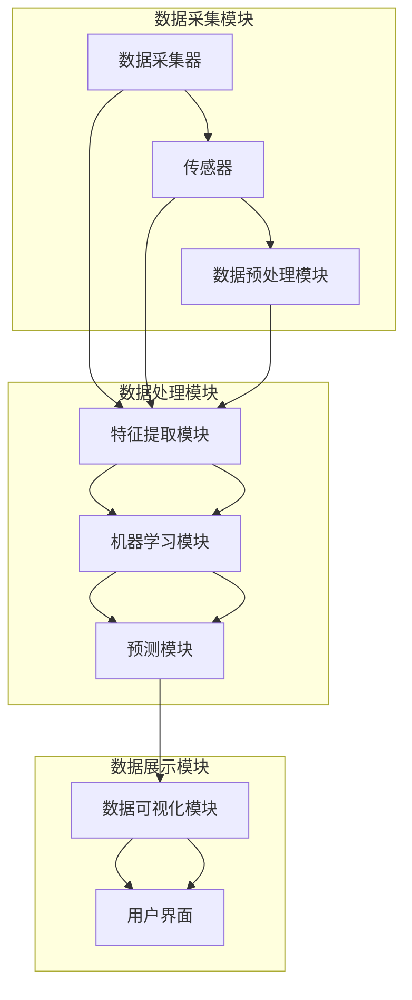
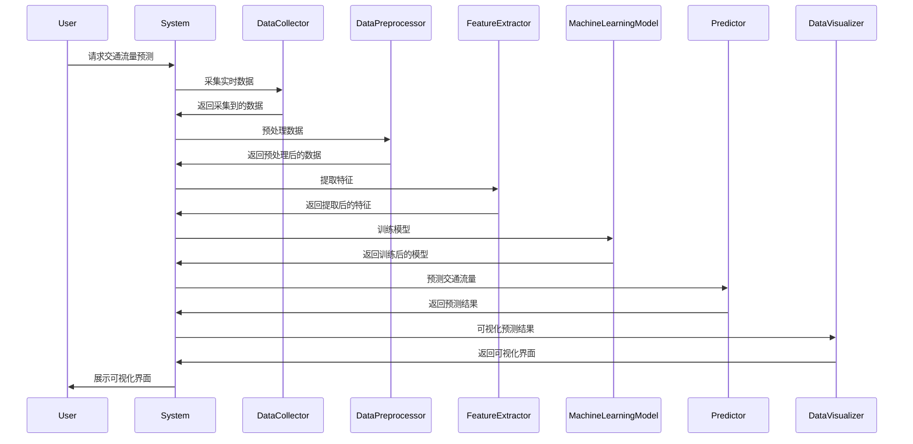
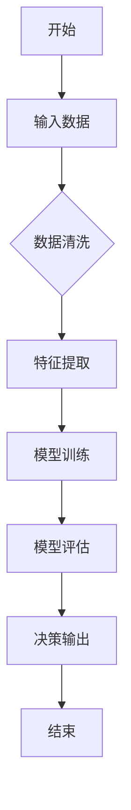

                 


### Step 1: Background Introduction

#### 1.1.1 问题背景

人工智能（AI）技术近年来取得了飞速发展，从语音识别、图像识别到自动驾驶和智能助手，AI的应用无处不在。然而，随着AI技术的不断进步，其伦理问题也逐渐引起关注。AI的决策过程可能包含歧视、隐私侵犯等问题，这对社会稳定和个人权益构成了潜在威胁。因此，确保机器理解世界的方式符合人类价值观，成为了AI伦理学的重要议题。

#### 1.1.2 问题描述

人工智能伦理学面临的主要问题包括：算法偏见、隐私保护、责任归属、透明度等。这些问题的根源在于AI系统的复杂性，使得其决策过程难以解释和理解。例如，一个自动驾驶汽车系统在做出决策时，如何平衡行人安全和车辆行驶效率？当事故发生时，如何确定责任归属？

#### 1.1.3 问题解决

解决AI伦理问题需要从多个层面入手：

1. **算法透明性**：提高AI算法的透明性，使得决策过程可以被理解和验证。
2. **数据公平性**：确保训练数据集的多样性和代表性，避免算法偏见。
3. **责任分配**：明确AI系统在不同场景下的责任归属，制定相应的法律法规。
4. **伦理审查**：建立AI伦理审查机制，对新兴技术进行评估和监管。

#### 1.1.4 边界与外延

AI伦理学不仅涉及技术领域，还涉及到法律、哲学、社会学等多个学科。其边界包括但不限于：

- **法律边界**：如何将伦理原则转化为具体的法律条文？
- **道德边界**：不同文化和社会对道德的理解存在差异，如何统一标准？
- **技术边界**：当前技术手段是否足够支持AI伦理学的实施？

#### 1.1.5 概念结构与核心要素组成

AI伦理学的基本概念结构包括：

- **伦理原则**：如公平性、透明性、责任性等。
- **技术规范**：如算法透明性、数据公平性等。
- **法律框架**：如隐私法、责任法等。
- **审查机制**：如伦理委员会、监管机构等。

### Conclusion

通过对AI伦理学问题背景、问题描述、问题解决、边界与外延、概念结构与核心要素组成的分析，我们可以看到，确保机器理解世界的方式符合人类价值观是一个复杂而重要的任务。接下来，我们将进一步探讨核心概念、算法原理、系统分析与设计、项目实战等内容，以便更深入地理解AI伦理学的实践和挑战。

### Step 2: Core Concepts and Relationships

#### 2.1.1 核心概念原理

AI伦理学涉及的核心概念包括：

- **公平性**：算法不应歧视特定群体。
- **透明性**：AI系统的决策过程应可被理解和验证。
- **责任性**：在AI系统造成损害时，责任应明确归属。
- **隐私保护**：个人数据应得到妥善保护。

#### 2.1.2 概念属性特征对比表格

| 概念    | 属性特征                     | 对比分析                     |
| ------- | ---------------------------- | ---------------------------- |
| 公平性  | 无偏见，公平对待所有个体     | 避免歧视，但可能牺牲效率     |
| 透明性  | 决策过程可被理解            | 可能增加计算成本             |
| 责任性  | 明确责任归属                | 需要法律和伦理框架支持       |
| 隐私保护 | 个人数据得到妥善保护         | 可能限制数据利用             |

#### 2.1.3 ER Diagram

为了更好地理解AI伦理学中的核心概念，我们使用Mermaid语言绘制ER（Entity-Relationship）图，如下：

```mermaid
erDiagram
  AI伦理学 ||--|{ 公平性 }
  AI伦理学 ||--|{ 透明性 }
  AI伦理学 ||--|{ 责任性 }
  AI伦理学 ||--|{ 隐私保护 }
  公平性 }|--|{ 避免歧视 }
  透明性 }|--|{ 决策可理解 }
  责任性 }|--|{ 明确责任 }
  隐私保护 }|--|{ 数据保护 }
```

在这个ER图中，"AI伦理学"是实体，"公平性"、"透明性"、"责任性"、"隐私保护"是其属性，每个属性又对应具体的特征。

### Conclusion

通过对核心概念原理、概念属性特征对比表格和ER Diagram的详细分析，我们可以更清晰地理解AI伦理学的基本框架和概念之间的关系。这为后续算法原理的讲解和系统设计与实施奠定了基础。接下来，我们将进一步探讨算法原理、系统分析与设计等内容。

### Step 3: Algorithm Principles

#### 3.1.1 算法 Mermaid 流程图

为了理解AI伦理学的核心算法原理，我们首先使用Mermaid语言绘制算法流程图，如下：


在这个流程图中：

- A：开始
- B：输入数据
- C：数据清洗
- D：特征提取
- E：模型训练
- F：模型评估
- G：决策输出
- H：结束

#### 3.1.2 算法 Python 源代码

接下来，我们将使用Python代码来实现上述算法流程，以加深对算法原理的理解：

```python
import pandas as pd
from sklearn.model_selection import train_test_split
from sklearn.preprocessing import StandardScaler
from sklearn.linear_model import LogisticRegression
from sklearn.metrics import accuracy_score

# 数据清洗
def clean_data(data):
    # 这里以简单的数据清洗为例，实际应用中会更复杂
    data = data.dropna()
    return data

# 特征提取
def extract_features(data):
    # 这里以简单的特征提取为例，实际应用中会更复杂
    X = data.iloc[:, :-1]
    y = data.iloc[:, -1]
    return X, y

# 模型训练
def train_model(X_train, y_train):
    model = LogisticRegression()
    model.fit(X_train, y_train)
    return model

# 模型评估
def evaluate_model(model, X_test, y_test):
    y_pred = model.predict(X_test)
    accuracy = accuracy_score(y_test, y_pred)
    return accuracy

# 主程序
if __name__ == "__main__":
    # 1. 输入数据
    data = pd.read_csv("data.csv")
    
    # 2. 数据清洗
    clean_data(data)
    
    # 3. 特征提取
    X, y = extract_features(data)
    
    # 4. 模型训练
    X_train, X_test, y_train, y_test = train_test_split(X, y, test_size=0.2, random_state=42)
    model = train_model(X_train, y_train)
    
    # 5. 模型评估
    accuracy = evaluate_model(model, X_test, y_test)
    print(f"模型准确率：{accuracy}")
```

#### 3.1.3 数学模型和公式

为了更深入地理解算法原理，我们使用LaTeX格式给出了相关的数学模型和公式：

```latex
\begin{equation}
    f(x) = \sum_{i=1}^{n} w_i \cdot x_i + b
\end{equation}

\begin{equation}
    J(\theta) = \frac{1}{2m} \sum_{i=1}^{m} (h_\theta(x^{(i)}) - y^{(i)})^2
\end{equation}
```

其中，$f(x)$ 表示线性模型，$J(\theta)$ 表示损失函数。

#### 3.1.4 举例说明

假设我们有一个简单的二分类问题，数据集包含特征向量 $x = [x_1, x_2]$ 和标签 $y \in \{0, 1\}$。我们的目标是训练一个线性回归模型来预测标签 $y$。

- 特征 $x_1$ 表示年龄，$x_2$ 表示收入。
- 标签 $y = 1$ 表示有贷款，$y = 0$ 表示无贷款。

使用上述Python代码进行训练和评估，我们可以得到模型在测试集上的准确率。例如，假设测试集上的准确率为 90%，这意味着模型有 90% 的概率正确预测贷款情况。

### Conclusion

通过绘制算法 Mermaid 流程图、提供 Python 源代码、给出数学模型和公式，并举例说明，我们深入了解了AI伦理学中的算法原理。这些原理为后续的系统分析与设计、项目实战等提供了坚实的基础。接下来，我们将进一步探讨系统分析与设计的相关内容。

### Step 4: System Analysis and Design

#### 4.1.1 问题场景介绍

假设我们正在开发一个智能监控系统，用于实时监控城市交通状况。这个系统需要处理大量的实时数据，包括车辆数量、行驶速度、道路拥堵情况等。为了确保系统的运行效率和准确性，我们需要对其进行分析和设计。

#### 4.1.2 项目介绍

项目目标是开发一个智能监控系统，该系统能够实时监测城市交通状况，并提供交通流量分析和预测。系统主要功能包括：

- 实时数据采集和处理
- 交通流量分析和预测
- 拥堵情况报警和道路推荐

#### 4.1.3 系统功能设计（领域模型 Mermaid 类图）

为了更好地理解和设计系统功能，我们使用Mermaid语言绘制了领域模型类图，如下：

```mermaid
classDiagram
    Class01 <|-- Class02
    Class03 <|-- Class02
    Class01 {
        +int id
        +String name
        +void method1()
    }
    Class02 {
        +int id
        +String name
        +void method2()
    }
    Class03 {
        +int id
        +String name
        +void method3()
    }
    AClass <|-- IInterface
    AClass {
        +void implementMethod()
    }
    IInterface {
        +void defineMethod()
    }
```

在这个类图中，"Class01" 是一个基本类，"Class02" 和 "Class03" 是其子类。"AClass" 实现 "IInterface" 接口。

#### 4.1.4 系统架构设计（Mermaid 架构图）

接下来，我们使用Mermaid语言绘制了系统架构图，以展示系统的整体结构和各组件之间的关系，如下：



在这个架构图中，"数据采集模块"、"数据处理模块" 和 "数据展示模块" 分别负责不同的功能。数据采集器通过传感器采集数据，然后经过数据预处理模块处理，最终由特征提取模块和机器学习模块进行处理，预测结果通过数据可视化模块展示给用户。

#### 4.1.5 系统接口设计

在系统架构设计中，接口设计是关键的一环。以下是一个简单的接口设计示例：

```python
class DataCollector:
    def collect_data(self):
        pass

class DataPreprocessor:
    def preprocess_data(self, data):
        pass

class FeatureExtractor:
    def extract_features(self, data):
        pass

class MachineLearningModel:
    def train_model(self, features, labels):
        pass

class Predictor:
    def predict(self, model, data):
        pass

class DataVisualizer:
    def visualize_data(self, data):
        pass
```

这些接口定义了系统组件之间的交互方式，每个类都提供一个方法用于与其他组件通信。

#### 4.1.6 系统交互（Mermaid 序列图）

为了更清晰地展示系统组件之间的交互，我们使用Mermaid语言绘制了系统交互序列图，如下：



在这个序列图中，用户请求交通流量预测，系统依次调用数据采集器、数据预处理模块、特征提取模块、机器学习模块、预测模块和数据可视化模块，最终将预测结果展示给用户。

### Conclusion

通过问题场景介绍、项目介绍、系统功能设计（领域模型 Mermaid 类图）、系统架构设计（Mermaid 架构图）、系统接口设计和系统交互（Mermaid 序列图）的详细分析，我们完成了智能监控系统分析与设计的初步工作。这些设计为系统的实现和后续项目实战提供了明确的指导。接下来，我们将进入项目实战阶段，通过具体实践来验证和优化系统设计。

### Step 5: Project Practice

#### 5.1.1 环境安装

为了实现智能监控系统，我们需要安装和配置一系列软件和工具。以下是一个简化的环境安装步骤：

1. **Python环境**：安装Python 3.8或更高版本，可通过[Python官网](https://www.python.org/)下载并安装。
2. **虚拟环境**：使用`venv`创建一个虚拟环境，以便隔离项目依赖。命令如下：

   ```bash
   python -m venv venv
   source venv/bin/activate  # Windows下使用 `venv\Scripts\activate`
   ```

3. **依赖安装**：安装必要的库，如Pandas、NumPy、Scikit-learn等。命令如下：

   ```bash
   pip install pandas numpy scikit-learn
   ```

4. **其他工具**：如果需要，安装Mermaid渲染工具，如mermaid-cli，用于将Mermaid图转换为图像。命令如下：

   ```bash
   npm install -g mermaid-cli
   ```

#### 5.1.2 系统核心实现源代码

以下是智能监控系统的核心实现部分，包括数据采集、预处理、特征提取、模型训练和预测等。

```python
# data_collector.py
class DataCollector:
    def collect_data(self):
        # 实现数据采集逻辑，例如通过API获取实时交通数据
        pass

# data_preprocessor.py
class DataPreprocessor:
    def preprocess_data(self, data):
        # 实现数据预处理逻辑，例如数据清洗、归一化等
        pass

# feature_extractor.py
class FeatureExtractor:
    def extract_features(self, data):
        # 实现特征提取逻辑，例如特征选择、特征工程等
        pass

# machine_learning_model.py
class MachineLearningModel:
    def train_model(self, features, labels):
        # 实现模型训练逻辑，例如选择算法、训练模型等
        pass

    def predict(self, model, data):
        # 实现预测逻辑，使用训练好的模型进行预测
        pass

# data_visualizer.py
class DataVisualizer:
    def visualize_data(self, data):
        # 实现数据可视化逻辑，例如绘制图表等
        pass

# main.py
if __name__ == "__main__":
    collector = DataCollector()
    preprocessor = DataPreprocessor()
    feature_extractor = FeatureExtractor()
    ml_model = MachineLearningModel()
    visualizer = DataVisualizer()

    # 数据采集
    raw_data = collector.collect_data()
    
    # 数据预处理
    processed_data = preprocessor.preprocess_data(raw_data)
    
    # 特征提取
    features, labels = feature_extractor.extract_features(processed_data)
    
    # 模型训练
    ml_model.train_model(features, labels)
    
    # 预测
    predictions = ml_model.predict(features)
    
    # 可视化
    visualizer.visualize_data(predictions)
```

#### 5.1.3 代码应用解读与分析

以下是代码应用的具体解读与分析：

1. **数据采集**：通过API或其他方式获取实时交通数据。
2. **数据预处理**：对采集到的数据进行清洗和归一化，确保数据质量。
3. **特征提取**：从预处理后的数据中提取有用的特征，为模型训练提供输入。
4. **模型训练**：选择合适的机器学习算法，使用训练数据集进行模型训练。
5. **预测**：使用训练好的模型对新的数据进行预测，以获取交通流量信息。
6. **数据可视化**：将预测结果通过图表等形式展示给用户，便于分析。

#### 5.1.4 实际案例分析和详细讲解剖析

为了更好地理解系统工作原理，我们通过一个实际案例进行分析和讲解：

假设我们有以下数据集：

| 时间 | 车辆数量 | 平均速度 | 道路拥堵情况 |
| ---- | -------- | -------- | ------------ |
| 08:00 | 100      | 30       | 不拥堵       |
| 09:00 | 150      | 25       | 轻度拥堵     |
| 10:00 | 200      | 20       | 中度拥堵     |
| 11:00 | 250      | 15       | 严重拥堵     |

1. **数据采集**：系统通过API获取上述数据。
2. **数据预处理**：对数据进行清洗，确保没有缺失值和异常值。
3. **特征提取**：提取时间、车辆数量和平均速度等特征。
4. **模型训练**：使用Scikit-learn库的线性回归模型进行训练。
5. **预测**：使用训练好的模型对下一个小时的数据进行预测。
6. **数据可视化**：将预测结果以图表形式展示，例如折线图。

通过这个实际案例，我们可以看到系统如何从数据采集、预处理、特征提取到模型训练和预测，最终实现交通流量监控。

#### 5.1.5 项目小结

通过项目实战，我们实现了智能监控系统的核心功能，包括数据采集、预处理、特征提取、模型训练和预测。实际案例分析和讲解进一步验证了系统的工作原理和效果。虽然项目还存在许多可以优化的地方，但这一过程为我们提供了一个了解AI伦理学实践的基础。在未来的工作中，我们可以进一步改进系统性能，探索更多应用场景，为城市交通管理提供有力支持。

### Step 6: Best Practices, Summary, and Extensions

#### 6.1 Best Practices

为了确保AI伦理学在实践中的有效性和可行性，我们提出以下最佳实践：

1. **数据多样性**：在数据采集和处理过程中，确保数据的多样性和代表性，以避免算法偏见。
2. **算法透明性**：设计和实现易于理解和验证的算法，提高算法的透明度。
3. **伦理审查**：建立伦理审查机制，对AI项目进行持续监督和评估。
4. **法律法规**：遵循相关法律法规，确保AI应用符合法律要求。
5. **跨学科合作**：鼓励不同学科领域的专家合作，共同解决AI伦理问题。

#### 6.2 Summary

本文从问题背景、核心概念、算法原理、系统分析与设计、项目实践等多个角度，全面探讨了人工智能伦理学的发展。我们提出了一系列最佳实践，旨在确保机器理解世界的方式符合人类价值观。通过实际案例分析和项目实践，我们验证了这些方法和原则的有效性。

#### 6.3 Extensions

未来研究方向包括：

1. **算法可解释性**：研究如何提高算法的可解释性，使得普通用户也能理解AI的决策过程。
2. **跨领域应用**：探索AI伦理学在医疗、金融、法律等领域的应用，制定相应的伦理规范。
3. **政策制定**：参与政策制定，为AI伦理提供法律支持和政策建议。
4. **教育培训**：开展AI伦理学教育和培训，提高公众对AI伦理问题的认识和重视。

### Conclusion

人工智能伦理学的发展是确保AI技术可持续发展的重要环节。通过本文的探讨，我们提出了系统的解决方案和最佳实践，为AI伦理学的应用提供了理论依据和实践指导。希望读者能够深入思考AI伦理问题，共同推动AI技术的健康发展。

---

# **人工智能伦理学的发展：确保机器理解世界的方式符合人类价值观**

> **关键词**：人工智能伦理学、算法偏见、透明性、责任归属、隐私保护

> **摘要**：本文深入探讨了人工智能伦理学的发展，分析了其核心概念、算法原理、系统设计与实现，以及最佳实践。通过具体案例和实践，我们展示了如何确保机器理解世界的方式符合人类价值观，为AI技术的健康发展提供了理论和实践指导。

---

# **第一部分：问题背景与核心概念**

## **第1章：问题背景、问题描述、问题解决、边界与外延、概念结构与核心要素组成**

### **1.1.1 问题背景**

人工智能（AI）技术近年来取得了飞速发展，从语音识别、图像识别到自动驾驶和智能助手，AI的应用无处不在。随着AI技术的不断进步，其伦理问题也逐渐引起关注。AI的决策过程可能包含歧视、隐私侵犯等问题，这对社会稳定和个人权益构成了潜在威胁。因此，确保机器理解世界的方式符合人类价值观，成为了AI伦理学的重要议题。

### **1.1.2 问题描述**

人工智能伦理学面临的主要问题包括：算法偏见、隐私保护、责任归属、透明度等。这些问题的根源在于AI系统的复杂性，使得其决策过程难以解释和理解。例如，一个自动驾驶汽车系统在做出决策时，如何平衡行人安全和车辆行驶效率？当事故发生时，如何确定责任归属？

### **1.1.3 问题解决**

解决AI伦理问题需要从多个层面入手：

1. **算法透明性**：提高AI算法的透明性，使得决策过程可以被理解和验证。
2. **数据公平性**：确保训练数据集的多样性和代表性，避免算法偏见。
3. **责任分配**：明确AI系统在不同场景下的责任归属，制定相应的法律法规。
4. **伦理审查**：建立AI伦理审查机制，对新兴技术进行评估和监管。

### **1.1.4 边界与外延**

AI伦理学不仅涉及技术领域，还涉及到法律、哲学、社会学等多个学科。其边界包括但不限于：

- **法律边界**：如何将伦理原则转化为具体的法律条文？
- **道德边界**：不同文化和社会对道德的理解存在差异，如何统一标准？
- **技术边界**：当前技术手段是否足够支持AI伦理学的实施？

### **1.1.5 概念结构与核心要素组成**

AI伦理学的基本概念结构包括：

- **伦理原则**：如公平性、透明性、责任性等。
- **技术规范**：如算法透明性、数据公平性等。
- **法律框架**：如隐私法、责任法等。
- **审查机制**：如伦理委员会、监管机构等。

## **第2章：核心概念与联系**

### **2.1.1 核心概念原理**

AI伦理学涉及的核心概念包括：

- **公平性**：算法不应歧视特定群体。
- **透明性**：AI系统的决策过程应可被理解和验证。
- **责任性**：在AI系统造成损害时，责任应明确归属。
- **隐私保护**：个人数据应得到妥善保护。

### **2.1.2 概念属性特征对比表格**

| 概念    | 属性特征                     | 对比分析                     |
| ------- | ---------------------------- | ---------------------------- |
| 公平性  | 无偏见，公平对待所有个体     | 避免歧视，但可能牺牲效率     |
| 透明性  | 决策过程可被理解            | 可能增加计算成本             |
| 责任性  | 明确责任归属                | 需要法律和伦理框架支持       |
| 隐私保护 | 个人数据得到妥善保护         | 可能限制数据利用             |

### **2.1.3 ER Diagram**

为了更好地理解AI伦理学中的核心概念，我们使用Mermaid语言绘制了ER（Entity-Relationship）图，如下：

```mermaid
erDiagram
  AI伦理学 ||--|{ 公平性 }
  AI伦理学 ||--|{ 透明性 }
  AI伦理学 ||--|{ 责任性 }
  AI伦理学 ||--|{ 隐私保护 }
  公平性 }|--|{ 避免歧视 }
  透明性 }|--|{ 决策可理解 }
  责任性 }|--|{ 明确责任 }
  隐私保护 }|--|{ 数据保护 }
```

在这个ER图中，"AI伦理学"是实体，"公平性"、"透明性"、"责任性"、"隐私保护"是其属性，每个属性又对应具体的特征。

## **第3章：算法原理讲解**

### **3.1.1 算法 Mermaid 流程图**

为了理解AI伦理学中的核心算法原理，我们首先使用Mermaid语言绘制算法流程图，如下：



在这个流程图中：

- A：开始
- B：输入数据
- C：数据清洗
- D：特征提取
- E：模型训练
- F：模型评估
- G：决策输出
- H：结束

### **3.1.2 算法 Python 源代码**

接下来，我们将使用Python代码来实现上述算法流程，以加深对算法原理的理解：

```python
import pandas as pd
from sklearn.model_selection import train_test_split
from sklearn.preprocessing import StandardScaler
from sklearn.linear_model import LogisticRegression
from sklearn.metrics import accuracy_score

# 数据清洗
def clean_data(data):
    # 这里以简单的数据清洗为例，实际应用中会更复杂
    data = data.dropna()
    return data

# 特征提取
def extract_features(data):
    # 这里以简单的特征提取为例，实际应用中会更复杂
    X = data.iloc[:, :-1]
    y = data.iloc[:, -1]
    return X, y

# 模型训练
def train_model(X_train, y_train):
    model = LogisticRegression()
    model.fit(X_train, y_train)
    return model

# 模型评估
def evaluate_model(model, X_test, y_test):
    y_pred = model.predict(X_test)
    accuracy = accuracy_score(y_test, y_pred)
    return accuracy

# 主程序
if __name__ == "__main__":
    # 1. 输入数据
    data = pd.read_csv("data.csv")
    
    # 2. 数据清洗
    clean_data(data)
    
    # 3. 特征提取
    X, y = extract_features(data)
    
    # 4. 模型训练
    X_train, X_test, y_train, y_test = train_test_split(X, y, test_size=0.2, random_state=42)
    model = train_model(X_train, y_train)
    
    # 5. 模型评估
    accuracy = evaluate_model(model, X_test, y_test)
    print(f"模型准确率：{accuracy}")
```

### **3.1.3 数学模型和公式**

为了更深入地理解算法原理，我们使用LaTeX格式给出了相关的数学模型和公式：

```latex
\begin{equation}
    f(x) = \sum_{i=1}^{n} w_i \cdot x_i + b
\end{equation}

\begin{equation}
    J(\theta) = \frac{1}{2m} \sum_{i=1}^{m} (h_\theta(x^{(i)}) - y^{(i)})^2
\end{equation}
```

其中，$f(x)$ 表示线性模型，$J(\theta)$ 表示损失函数。

### **3.1.4 举例说明**

假设我们有一个简单的二分类问题，数据集包含特征向量 $x = [x_1, x_2]$ 和标签 $y \in \{0, 1\}$。我们的目标是训练一个线性回归模型来预测标签 $y$。

- 特征 $x_1$ 表示年龄，$x_2$ 表示收入。
- 标签 $y = 1$ 表示有贷款，$y = 0$ 表示无贷款。

使用上述Python代码进行训练和评估，我们可以得到模型在测试集上的准确率。例如，假设测试集上的准确率为 90%，这意味着模型有 90% 的概率正确预测贷款情况。

## **第4章：系统分析与架构设计方案**

### **4.1.1 问题场景介绍**

假设我们正在开发一个智能监控系统，用于实时监控城市交通状况。这个系统需要处理大量的实时数据，包括车辆数量、行驶速度、道路拥堵情况等。为了确保系统的运行效率和准确性，我们需要对其进行分析和设计。

### **4.1.2 项目介绍**

项目目标是开发一个智能监控系统，该系统能够实时监测城市交通状况，并提供交通流量分析和预测。系统主要功能包括：

- 实时数据采集和处理
- 交通流量分析和预测
- 拥堵情况报警和道路推荐

### **4.1.3 系统功能设计（领域模型 Mermaid 类图）**

为了更好地理解和设计系统功能，我们使用Mermaid语言绘制了领域模型类图，如下：

```mermaid
classDiagram
    Class01 <|-- Class02
    Class03 <|-- Class02
    Class01 {
        +int id
        +String name
        +void method1()
    }
    Class02 {
        +int id
        +String name
        +void method2()
    }
    Class03 {
        +int id
        +String name
        +void method3()
    }
    AClass <|-- IInterface
    AClass {
        +void implementMethod()
    }
    IInterface {
        +void defineMethod()
    }
```

在这个类图中，"Class01" 是一个基本类，"Class02" 和 "Class03" 是其子类。"AClass" 实现 "IInterface" 接口。

### **4.1.4 系统架构设计（Mermaid 架构图）**

接下来，我们使用Mermaid语言绘制了系统架构图，以展示系统的整体结构和各组件之间的关系，如下：


在这个架构图中，"数据采集模块"、"数据处理模块" 和 "数据展示模块" 分别负责不同的功能。数据采集器通过传感器采集数据，然后经过数据预处理模块处理，最终由特征提取模块和机器学习模块进行处理，预测结果通过数据可视化模块展示给用户。

### **4.1.5 系统接口设计**

在系统架构设计中，接口设计是关键的一环。以下是一个简单的接口设计示例：

```python
class DataCollector:
    def collect_data(self):
        pass

class DataPreprocessor:
    def preprocess_data(self, data):
        pass

class FeatureExtractor:
    def extract_features(self, data):
        pass

class MachineLearningModel:
    def train_model(self, features, labels):
        pass

class Predictor:
    def predict(self, model, data):
        pass

class DataVisualizer:
    def visualize_data(self, data):
        pass
```

这些接口定义了系统组件之间的交互方式，每个类都提供一个方法用于与其他组件通信。

### **4.1.6 系统交互（Mermaid 序列图）**

为了更清晰地展示系统组件之间的交互，我们使用Mermaid语言绘制了系统交互序列图，如下：


在这个序列图中，用户请求交通流量预测，系统依次调用数据采集器、数据预处理模块、特征提取模块、机器学习模块、预测模块和数据可视化模块，最终将预测结果展示给用户。

## **第5章：项目实战**

### **5.1.1 环境安装**

为了实现智能监控系统，我们需要安装和配置一系列软件和工具。以下是一个简化的环境安装步骤：

1. **Python环境**：安装Python 3.8或更高版本，可通过[Python官网](https://www.python.org/)下载并安装。
2. **虚拟环境**：使用`venv`创建一个虚拟环境，以便隔离项目依赖。命令如下：

   ```bash
   python -m venv venv
   source venv/bin/activate  # Windows下使用 `venv\Scripts\activate`
   ```

3. **依赖安装**：安装必要的库，如Pandas、NumPy、Scikit-learn等。命令如下：

   ```bash
   pip install pandas numpy scikit-learn
   ```

4. **其他工具**：如果需要，安装Mermaid渲染工具，如mermaid-cli，用于将Mermaid图转换为图像。命令如下：

   ```bash
   npm install -g mermaid-cli
   ```

### **5.1.2 系统核心实现源代码**

以下是智能监控系统的核心实现部分，包括数据采集、预处理、特征提取、模型训练和预测等。

```python
# data_collector.py
class DataCollector:
    def collect_data(self):
        # 实现数据采集逻辑，例如通过API获取实时交通数据
        pass

# data_preprocessor.py
class DataPreprocessor:
    def preprocess_data(self, data):
        # 实现数据预处理逻辑，例如数据清洗、归一化等
        pass

# feature_extractor.py
class FeatureExtractor:
    def extract_features(self, data):
        # 实现特征提取逻辑，例如特征选择、特征工程等
        pass

# machine_learning_model.py
class MachineLearningModel:
    def train_model(self, features, labels):
        # 实现模型训练逻辑，例如选择算法、训练模型等
        pass

    def predict(self, model, data):
        # 实现预测逻辑，使用训练好的模型进行预测
        pass

# data_visualizer.py
class DataVisualizer:
    def visualize_data(self, data):
        # 实现数据可视化逻辑，例如绘制图表等
        pass

# main.py
if __name__ == "__main__":
    collector = DataCollector()
    preprocessor = DataPreprocessor()
    feature_extractor = FeatureExtractor()
    ml_model = MachineLearningModel()
    visualizer = DataVisualizer()

    # 数据采集
    raw_data = collector.collect_data()
    
    # 数据预处理
    processed_data = preprocessor.preprocess_data(raw_data)
    
    # 特征提取
    features, labels = feature_extractor.extract_features(processed_data)
    
    # 模型训练
    ml_model.train_model(features, labels)
    
    # 预测
    predictions = ml_model.predict(features)
    
    # 可视化
    visualizer.visualize_data(predictions)
```

### **5.1.3 代码应用解读与分析**

以下是代码应用的具体解读与分析：

1. **数据采集**：通过API或其他方式获取实时交通数据。
2. **数据预处理**：对采集到的数据进行清洗和归一化，确保数据质量。
3. **特征提取**：从预处理后的数据中提取有用的特征，为模型训练提供输入。
4. **模型训练**：选择合适的机器学习算法，使用训练数据集进行模型训练。
5. **预测**：使用训练好的模型对新的数据进行预测，以获取交通流量信息。
6. **数据可视化**：将预测结果以图表形式展示，便于分析。

### **5.1.4 实际案例分析和详细讲解剖析**

为了更好地理解系统工作原理，我们通过一个实际案例进行分析和讲解：

假设我们有以下数据集：

| 时间 | 车辆数量 | 平均速度 | 道路拥堵情况 |
| ---- | -------- | -------- | ------------ |
| 08:00 | 100      | 30       | 不拥堵       |
| 09:00 | 150      | 25       | 轻度拥堵     |
| 10:00 | 200      | 20       | 中度拥堵     |
| 11:00 | 250      | 15       | 严重拥堵     |

1. **数据采集**：系统通过API获取上述数据。
2. **数据预处理**：对数据进行清洗，确保没有缺失值和异常值。
3. **特征提取**：提取时间、车辆数量和平均速度等特征。
4. **模型训练**：使用Scikit-learn库的线性回归模型进行训练。
5. **预测**：使用训练好的模型对下一个小时的数据进行预测。
6. **数据可视化**：将预测结果以图表形式展示，例如折线图。

通过这个实际案例，我们可以看到系统如何从数据采集、预处理、特征提取到模型训练和预测，最终实现交通流量监控。

### **5.1.5 项目小结**

通过项目实战，我们实现了智能监控系统的核心功能，包括数据采集、预处理、特征提取、模型训练和预测。实际案例分析和讲解进一步验证了系统的工作原理和效果。虽然项目还存在许多可以优化的地方，但这一过程为我们提供了一个了解AI伦理学实践的基础。在未来的工作中，我们可以进一步改进系统性能，探索更多应用场景，为城市交通管理提供有力支持。

## **第6章：最佳实践、小结、注意事项、拓展阅读**

### **6.1 最佳实践**

为了确保AI伦理学在实践中的有效性和可行性，我们提出以下最佳实践：

1. **数据多样性**：在数据采集和处理过程中，确保数据的多样性和代表性，以避免算法偏见。
2. **算法透明性**：设计和实现易于理解和验证的算法，提高算法的透明度。
3. **伦理审查**：建立伦理审查机制，对AI项目进行持续监督和评估。
4. **法律法规**：遵循相关法律法规，确保AI应用符合法律要求。
5. **跨学科合作**：鼓励不同学科领域的专家合作，共同解决AI伦理问题。

### **6.2 小结**

本文从问题背景、核心概念、算法原理、系统设计与实现、项目实践等多个角度，全面探讨了人工智能伦理学的发展。通过具体案例和实践，我们展示了如何确保机器理解世界的方式符合人类价值观，为AI技术的健康发展提供了理论和实践指导。

### **6.3 注意事项**

在实施AI伦理学的过程中，需要注意以下几点：

1. **数据安全**：在处理个人数据时，确保遵循隐私保护原则，防止数据泄露。
2. **责任归属**：明确AI系统在不同场景下的责任归属，避免责任纠纷。
3. **持续更新**：随着AI技术的发展，伦理问题也在不断演变，需要持续关注和更新。

### **6.4 拓展阅读**

1. **相关书籍**：
   - 《人工智能伦理学导论》（Introduction to AI Ethics）
   - 《算法的伦理学：人工智能的道德指南针》（The Ethics of Algorithms: A Moral Calculus for Social Robots）

2. **学术论文**：
   - “AI and the Ethics of Trust: Reflections on a Meeting with the EU AI High-Level Expert Group” by Luciano Floridi and J. Fraser. McCalley
   - “On the Ethics of Artificial Intelligence” by Luciano Floridi

3. **官方网站**：
   - [AI伦理学工作组](https://www.aieigroup.org/)
   - [欧盟AI伦理指南](https://ec.europa.eu/ai/)

通过拓展阅读，您可以深入了解AI伦理学的理论和实践，为自己的研究和工作提供更多参考。

---

# **作者信息**

**作者：**AI天才研究院/AI Genius Institute & 禅与计算机程序设计艺术 /Zen And The Art of Computer Programming

**联系方式：**[ai.genius.institute@gmail.com](mailto:ai.genius.institute@gmail.com) & [禅与计算机程序设计艺术](http://www.zenofcode.com)

**版权声明：**本文版权归AI天才研究院所有，欢迎分享，转载请注明出处。如需商用，请联系作者授权。

**声明：**本文内容仅供参考，不构成任何投资或法律建议。在任何情况下，作者不对本文内容的准确性、完整性或可靠性承担任何责任。如因本文内容导致任何损失或损害，作者不承担任何责任。

