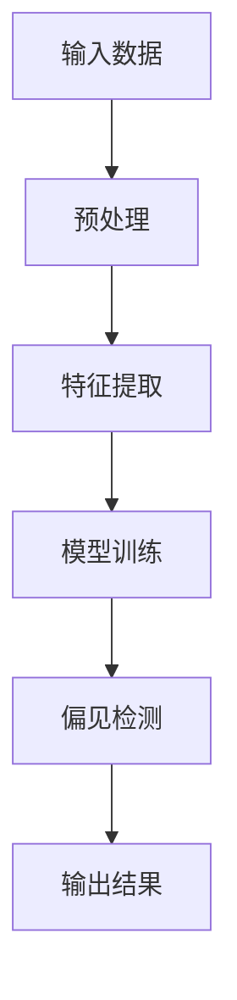
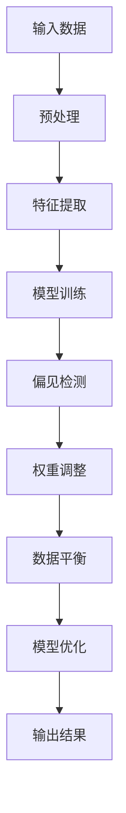
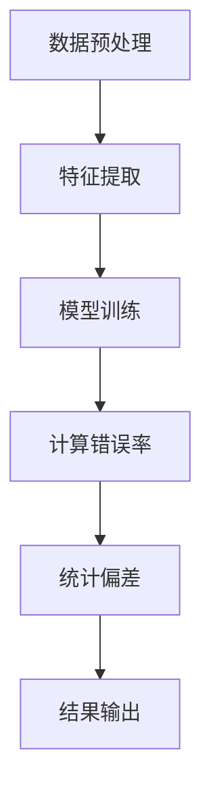
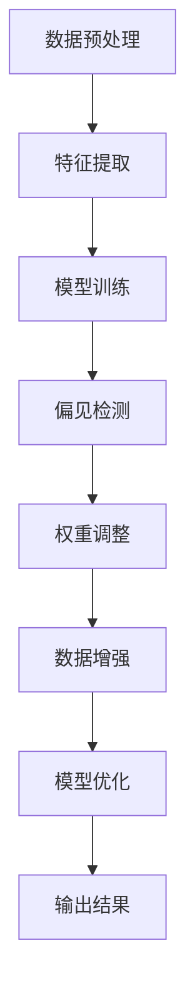

                 

### 人工智能伦理学：在增强世界理解能力时的道德考量

#### 引言

随着人工智能技术的迅猛发展，人工智能（AI）已经成为推动社会进步和经济发展的重要力量。然而，AI技术的广泛应用也引发了诸多伦理道德问题，如算法偏见、隐私泄露、责任归属等。因此，对人工智能伦理学的研究变得尤为紧迫和重要。

**关键词：** 人工智能伦理学，道德考量，算法偏见，隐私保护，责任归属

**摘要：** 本文旨在探讨人工智能伦理学的基本概念、核心要素以及关键算法，分析其在增强世界理解能力时的道德考量。通过逐步分析推理，本文将为人工智能伦理学的研究提供有深度和见解的思考。

#### 第一部分：引论

##### 1.1 问题背景

人工智能技术的发展速度之快，应用范围之广，使其在多个领域取得了显著的成就。从医疗诊断、金融分析到自动驾驶、智能家居，AI技术正逐步改变我们的生活方式。然而，AI技术的广泛应用也带来了一系列伦理道德挑战：

- **算法偏见**：AI系统在训练过程中可能会吸收和放大社会中的偏见，导致对某些群体或个体的不公平对待。
- **隐私泄露**：AI技术在数据收集和处理过程中，可能会侵犯用户的隐私权益。
- **责任归属**：当AI系统发生错误或造成损害时，责任归属问题成为法律和道德上的难题。

##### 1.2 核心概念

**人工智能**

- **定义**：人工智能是指通过计算机模拟人类智能行为，实现认知、学习、推理、感知等功能的系统。
- **分类**：
  - 基于规则的系统：通过预先定义的规则进行决策。
  - 统计学习模型：基于数据统计分析进行预测和决策。
  - 仿生智能系统：模拟生物神经系统的结构和功能。

**伦理学**

- **定义**：伦理学是研究道德原则、价值与义务的学科。
- **研究方法**：
  - 规范伦理学：探讨道德原则和道德规范的合理性。
  - 应用伦理学：将伦理原则应用于具体领域，如医学、工程等。
  - 实证伦理学：通过实证研究探讨道德观念的实际应用效果。

##### 1.3 边界与外延

**人工智能伦理学的边界**

- **伦理决策的主体**：个人、企业、社会整体。
- **伦理决策的范围**：技术研发、应用实践、法规与政策。

**人工智能伦理学的外延**

- **跨学科交叉**：法学、社会学、心理学、计算机科学。

##### 1.4 核心要素

**伦理原则**

- **公平性**：避免歧视，保护不同群体和个体的权益。
- **透明性**：确保AI系统的决策过程可被理解和解释。
- **责任性**：明确AI系统及其决策承担相应的责任。

##### 1.5 本章小结

本文介绍了人工智能伦理学的基本概念、核心要素及其边界与外延。通过这一部分的探讨，为后续章节对人工智能伦理学核心概念和算法的深入分析奠定了基础。

---

### 第一部分：引论

#### 引言

随着人工智能技术的迅猛发展，人工智能（AI）已经成为推动社会进步和经济发展的重要力量。从医疗诊断、金融分析到自动驾驶、智能家居，AI技术正逐步改变我们的生活方式。然而，AI技术的广泛应用也带来了一系列伦理道德挑战，如算法偏见、隐私泄露、责任归属等。因此，对人工智能伦理学的研究变得尤为紧迫和重要。

##### 1.1 问题背景

人工智能技术的发展速度之快，应用范围之广，使其在多个领域取得了显著的成就。从医疗诊断、金融分析到自动驾驶、智能家居，AI技术正逐步改变我们的生活方式。然而，AI技术的广泛应用也带来了一系列伦理道德挑战：

- **算法偏见**：AI系统在训练过程中可能会吸收和放大社会中的偏见，导致对某些群体或个体的不公平对待。例如，一些面部识别系统可能对特定种族的人有更高的错误率，这可能导致不公平的法律判决或社会歧视。

- **隐私泄露**：AI技术在数据收集和处理过程中，可能会侵犯用户的隐私权益。许多AI系统依赖大量个人数据进行训练，这些数据如果被不当使用或泄露，可能会对用户的生活造成严重影响。

- **责任归属**：当AI系统发生错误或造成损害时，责任归属问题成为法律和道德上的难题。例如，自动驾驶汽车发生交通事故时，责任应该由制造商、软件开发者还是车主承担？

##### 1.2 核心概念

**人工智能**

- **定义**：人工智能是指通过计算机模拟人类智能行为，实现认知、学习、推理、感知等功能的系统。

  人工智能可以分为几种类型，包括：

  - **基于规则的系统**：这种系统使用明确的规则进行决策，例如专家系统。
  - **统计学习模型**：这类系统通过分析大量数据来发现模式和规律，例如支持向量机（SVM）、决策树等。
  - **仿生智能系统**：这种系统模拟生物神经系统的结构和功能，例如深度学习和神经网络。

**伦理学**

- **定义**：伦理学是研究道德原则、价值与义务的学科。

  伦理学的研究方法包括：

  - **规范伦理学**：这种研究方法探讨道德原则和道德规范的合理性，例如康德的义务论。
  - **应用伦理学**：这种研究方法将伦理原则应用于具体领域，例如医学伦理、工程伦理等。
  - **实证伦理学**：这种研究方法通过实证研究探讨道德观念的实际应用效果，例如社会调查和案例分析。

##### 1.3 边界与外延

**人工智能伦理学的边界**

- **伦理决策的主体**：人工智能伦理学的伦理决策可以涉及多个主体，包括：

  - **个人**：个人在使用AI产品或服务时可能面临伦理问题，例如隐私保护和数据安全。
  - **企业**：企业在开发、部署和使用AI技术时需要考虑伦理问题，例如算法偏见和责任归属。
  - **社会整体**：整个社会在制定相关法律法规和政策时需要考虑AI技术的伦理影响。

- **伦理决策的范围**：人工智能伦理学的伦理决策范围包括：

  - **技术研发**：在开发AI技术时，需要考虑技术的潜在伦理影响，例如数据隐私保护、算法公平性等。
  - **应用实践**：在AI技术的实际应用中，需要遵循伦理原则，确保技术的合理使用。
  - **法规与政策**：社会在制定相关法律法规和政策时，需要充分考虑AI技术的伦理影响，确保技术发展与社会伦理价值的兼容性。

**人工智能伦理学的外延**

- **跨学科交叉**：人工智能伦理学需要与其他学科交叉融合，包括：

  - **法学**：研究AI技术相关的法律问题，如知识产权保护、责任归属等。
  - **社会学**：研究AI技术对社会结构和行为的影响，如隐私权、就业等。
  - **心理学**：研究AI技术对个体心理和行为的影响，如用户信任、隐私感知等。
  - **计算机科学**：研究AI技术的开发和应用，如算法设计、数据处理等。

##### 1.4 核心要素

**伦理原则**

- **公平性**：在人工智能系统中避免偏见和歧视，确保所有用户都能公平地获得服务。例如，确保AI系统在决策时不对特定群体产生不公平的影响。

- **透明性**：确保人工智能系统的决策过程可被理解和解释。透明性有助于提高用户对AI系统的信任，并有助于监督和纠正潜在的伦理问题。

- **责任性**：确保人工智能系统及其决策承担相应的责任。当AI系统发生错误或造成损害时，需要明确责任归属，以便采取措施进行纠正和赔偿。

##### 1.5 本章小结

本文介绍了人工智能伦理学的基本概念、核心要素及其边界与外延。通过这一部分的探讨，为后续章节对人工智能伦理学核心概念和算法的深入分析奠定了基础。

---

### 第一部分：引论

#### 引言

随着人工智能技术的迅猛发展，人工智能（AI）已经成为推动社会进步和经济发展的重要力量。从医疗诊断、金融分析到自动驾驶、智能家居，AI技术正逐步改变我们的生活方式。然而，AI技术的广泛应用也带来了一系列伦理道德挑战，如算法偏见、隐私泄露、责任归属等。因此，对人工智能伦理学的研究变得尤为紧迫和重要。

##### 1.1 问题背景

人工智能技术的发展速度之快，应用范围之广，使其在多个领域取得了显著的成就。从医疗诊断、金融分析到自动驾驶、智能家居，AI技术正逐步改变我们的生活方式。然而，AI技术的广泛应用也带来了一系列伦理道德挑战：

- **算法偏见**：AI系统在训练过程中可能会吸收和放大社会中的偏见，导致对某些群体或个体的不公平对待。例如，一些面部识别系统可能对特定种族的人有更高的错误率，这可能导致不公平的法律判决或社会歧视。

- **隐私泄露**：AI技术在数据收集和处理过程中，可能会侵犯用户的隐私权益。许多AI系统依赖大量个人数据进行训练，这些数据如果被不当使用或泄露，可能会对用户的生活造成严重影响。

- **责任归属**：当AI系统发生错误或造成损害时，责任归属问题成为法律和道德上的难题。例如，自动驾驶汽车发生交通事故时，责任应该由制造商、软件开发者还是车主承担？

##### 1.2 核心概念

**人工智能**

- **定义**：人工智能是指通过计算机模拟人类智能行为，实现认知、学习、推理、感知等功能的系统。

  人工智能可以分为几种类型，包括：

  - **基于规则的系统**：这种系统使用明确的规则进行决策，例如专家系统。
  - **统计学习模型**：这类系统通过分析大量数据来发现模式和规律，例如支持向量机（SVM）、决策树等。
  - **仿生智能系统**：这种系统模拟生物神经系统的结构和功能，例如深度学习和神经网络。

**伦理学**

- **定义**：伦理学是研究道德原则、价值与义务的学科。

  伦理学的研究方法包括：

  - **规范伦理学**：这种研究方法探讨道德原则和道德规范的合理性，例如康德的义务论。
  - **应用伦理学**：这种研究方法将伦理原则应用于具体领域，例如医学伦理、工程伦理等。
  - **实证伦理学**：这种研究方法通过实证研究探讨道德观念的实际应用效果，例如社会调查和案例分析。

##### 1.3 边界与外延

**人工智能伦理学的边界**

- **伦理决策的主体**：人工智能伦理学的伦理决策可以涉及多个主体，包括：

  - **个人**：个人在使用AI产品或服务时可能面临伦理问题，例如隐私保护和数据安全。
  - **企业**：企业在开发、部署和使用AI技术时需要考虑伦理问题，例如算法偏见和责任归属。
  - **社会整体**：整个社会在制定相关法律法规和政策时需要考虑AI技术的伦理影响，确保技术发展与社会伦理价值的兼容性。

- **伦理决策的范围**：人工智能伦理学的伦理决策范围包括：

  - **技术研发**：在开发AI技术时，需要考虑技术的潜在伦理影响，例如数据隐私保护、算法公平性等。
  - **应用实践**：在AI技术的实际应用中，需要遵循伦理原则，确保技术的合理使用。
  - **法规与政策**：社会在制定相关法律法规和政策时，需要充分考虑AI技术的伦理影响，确保技术发展与社会伦理价值的兼容性。

**人工智能伦理学的外延**

- **跨学科交叉**：人工智能伦理学需要与其他学科交叉融合，包括：

  - **法学**：研究AI技术相关的法律问题，如知识产权保护、责任归属等。
  - **社会学**：研究AI技术对社会结构和行为的影响，如隐私权、就业等。
  - **心理学**：研究AI技术对个体心理和行为的影响，如用户信任、隐私感知等。
  - **计算机科学**：研究AI技术的开发和应用，如算法设计、数据处理等。

##### 1.4 核心要素

**伦理原则**

- **公平性**：在人工智能系统中避免偏见和歧视，确保所有用户都能公平地获得服务。例如，确保AI系统在决策时不对特定群体产生不公平的影响。

- **透明性**：确保人工智能系统的决策过程可被理解和解释。透明性有助于提高用户对AI系统的信任，并有助于监督和纠正潜在的伦理问题。

- **责任性**：确保人工智能系统及其决策承担相应的责任。当AI系统发生错误或造成损害时，需要明确责任归属，以便采取措施进行纠正和赔偿。

##### 1.5 本章小结

本文介绍了人工智能伦理学的基本概念、核心要素及其边界与外延。通过这一部分的探讨，为后续章节对人工智能伦理学核心概念和算法的深入分析奠定了基础。

---

### 第二部分：核心概念与联系

#### 2.1 人工智能伦理学核心概念解析

**2.1.1 公平性**

**定义**：公平性是人工智能伦理学中的一个核心概念，指的是在人工智能系统中避免偏见和歧视，确保所有用户都能公平地获得服务。

**特征对比表**：

| 特征对比项 | 描述 |
| --- | --- |
| **主观偏见** | 主观偏见是指人工智能系统在决策过程中由于设计者或数据集的偏见而导致的对特定群体或个体的不公平对待。 |
| **数据偏见** | 数据偏见是指训练数据中存在的不平衡或不准确，导致人工智能系统在预测或决策时产生偏见。 |

**2.1.2 透明性**

**定义**：透明性是人工智能伦理学中的另一个核心概念，指的是人工智能系统的决策过程可被理解和解释。

**特征对比表**：

| 特征对比项 | 描述 |
| --- | --- |
| **算法解释性** | 算法解释性是指人工智能系统的决策过程可以被用户或其他相关方理解，有助于提高系统的可信度。 |
| **数据透明** | 数据透明是指确保训练数据和决策过程数据的透明性，使相关方能够了解数据来源和处理过程。 |

**2.1.3 责任性**

**定义**：责任性是人工智能伦理学中的一个重要概念，指的是确保人工智能系统及其决策承担相应的责任。

**特征对比表**：

| 特征对比项 | 描述 |
| --- | --- |
| **责任归属** | 责任归属是指当人工智能系统发生错误或造成损害时，明确责任归属的机制，确保相关人员承担相应的责任。 |
| **安全与风险管理** | 安全与风险管理是指确保人工智能系统的安全性和风险管理，防止系统故障或错误造成损害。 |

#### 2.2 概念联系与整合

**公平性、透明性与责任性的关系**

公平性、透明性和责任性是人工智能伦理学中的三个核心概念，它们之间存在密切的联系和相互作用。

- **相互依赖**：公平性、透明性和责任性相互依存，共同构成人工智能伦理学的基础。一个公平的人工智能系统需要具备透明性，以便用户理解和监督，同时也需要明确的责任归属机制，确保当系统发生问题时能够追究责任。

- **整合框架**：为了确保人工智能系统的道德合法性，需要建立一套综合性的伦理框架，将公平性、透明性和责任性整合在一起。这个框架应该包括：

  - **公平性原则**：确保人工智能系统在设计和训练过程中避免偏见，提高系统的公平性。
  - **透明性要求**：确保人工智能系统的决策过程可被理解和解释，提高系统的透明度。
  - **责任性机制**：建立明确的责任归属机制，确保当人工智能系统发生错误或造成损害时，能够追究责任。

#### 2.3 本章小结

本文对人工智能伦理学中的核心概念进行了详细解析，包括公平性、透明性和责任性。同时，分析了这三个概念之间的联系和整合，提出了一套综合性的伦理框架。这些讨论为后续章节对人工智能伦理学关键算法的深入分析奠定了基础。

---

### 第二部分：核心概念与联系

#### 2.1 人工智能伦理学核心概念解析

**2.1.1 公平性**

**定义**：公平性是人工智能伦理学中的一个核心概念，指的是在人工智能系统中避免偏见和歧视，确保所有用户都能公平地获得服务。

**特征对比表**：

| 特征对比项 | 描述 |
| --- | --- |
| **主观偏见** | 主观偏见是指人工智能系统在决策过程中由于设计者或数据集的偏见而导致的对特定群体或个体的不公平对待。 |
| **数据偏见** | 数据偏见是指训练数据中存在的不平衡或不准确，导致人工智能系统在预测或决策时产生偏见。 |

**2.1.2 透明性**

**定义**：透明性是人工智能伦理学中的另一个核心概念，指的是人工智能系统的决策过程可被理解和解释。

**特征对比表**：

| 特征对比项 | 描述 |
| --- | --- |
| **算法解释性** | 算法解释性是指人工智能系统的决策过程可以被用户或其他相关方理解，有助于提高系统的可信度。 |
| **数据透明** | 数据透明是指确保训练数据和决策过程数据的透明性，使相关方能够了解数据来源和处理过程。 |

**2.1.3 责任性**

**定义**：责任性是人工智能伦理学中的一个重要概念，指的是确保人工智能系统及其决策承担相应的责任。

**特征对比表**：

| 特征对比项 | 描述 |
| --- | --- |
| **责任归属** | 责任归属是指当人工智能系统发生错误或造成损害时，明确责任归属的机制，确保相关人员承担相应的责任。 |
| **安全与风险管理** | 安全与风险管理是指确保人工智能系统的安全性和风险管理，防止系统故障或错误造成损害。 |

#### 2.2 概念联系与整合

**公平性、透明性与责任性的关系**

公平性、透明性和责任性是人工智能伦理学中的三个核心概念，它们之间存在密切的联系和相互作用。

- **相互依赖**：公平性、透明性和责任性相互依存，共同构成人工智能伦理学的基础。一个公平的人工智能系统需要具备透明性，以便用户理解和监督，同时也需要明确的责任归属机制，确保当系统发生问题时能够追究责任。

- **整合框架**：为了确保人工智能系统的道德合法性，需要建立一套综合性的伦理框架，将公平性、透明性和责任性整合在一起。这个框架应该包括：

  - **公平性原则**：确保人工智能系统在设计和训练过程中避免偏见，提高系统的公平性。
  - **透明性要求**：确保人工智能系统的决策过程可被理解和解释，提高系统的透明度。
  - **责任性机制**：建立明确的责任归属机制，确保当人工智能系统发生错误或造成损害时，能够追究责任。

#### 2.3 本章小结

本文对人工智能伦理学中的核心概念进行了详细解析，包括公平性、透明性和责任性。同时，分析了这三个概念之间的联系和整合，提出了一套综合性的伦理框架。这些讨论为后续章节对人工智能伦理学关键算法的深入分析奠定了基础。

---

### 第三部分：算法原理讲解

#### 3.1 偏见检测与校正算法

##### 3.1.1 偏见检测算法

**定义**：偏见检测算法是用于识别人工智能系统中的偏见，确保系统在决策过程中不产生不公平对待的算法。

**数学模型**：

偏见检测算法通常基于假设检验模型，结合统计分析方法。其基本思想是通过比较系统在不同群体上的决策表现，检测是否存在显著差异。假设检验模型通常包括以下步骤：

1. **设定原假设（\(H_0\)）和备择假设（\(H_1\)）**：
   - \(H_0\)：系统在不同群体上的决策表现没有显著差异。
   - \(H_1\)：系统在不同群体上的决策表现存在显著差异。

2. **选择统计检验方法**：
   - 常见的统计检验方法包括t检验、卡方检验等。

3. **计算统计量**：
   - 根据实际数据计算相应的统计量，如t统计量或卡方统计量。

4. **设定显著性水平（\(\alpha\)）**：
   - 通常设定显著性水平为0.05或0.01。

5. **做出决策**：
   - 如果计算出的统计量大于临界值，则拒绝原假设，认为系统存在偏见。
   - 如果计算出的统计量小于临界值，则接受原假设，认为系统没有偏见。

**流程图**：



##### 3.1.2 偏见校正算法

**定义**：偏见校正算法是用于减少或消除人工智能系统中偏见的方法，确保系统在决策过程中对所有群体都公平对待。

**数学模型**：

偏见校正算法主要通过以下两种方法进行：

1. **权重调整**：
   - 对训练数据进行加权处理，使得训练过程中对各个群体的关注程度更加平衡。
   - 常用的权重调整方法包括逆频度加权、逆误差加权等。

2. **数据平衡**：
   - 通过增加训练数据中的缺失值或减少具有偏见的数据，使得训练数据更加均衡。
   - 常用的数据平衡方法包括重采样、生成对抗网络（GAN）等。

**流程图**：



#### 3.2 偏见检测与校正算法应用案例

**案例背景**：

某面部识别系统在测试数据集上的表现良好，但在实际应用中发现对特定种族的人有较高的错误率。为了解决这一问题，我们需要使用偏见检测和校正算法。

**偏见检测**：

1. **数据预处理**：收集包含不同种族的人群数据，并进行预处理，如数据清洗、归一化等。

2. **特征提取**：提取人脸特征，用于后续的模型训练和偏见检测。

3. **模型训练**：使用原始数据训练面部识别模型。

4. **偏见检测**：使用t检验等方法检测模型在不同种族人群上的决策差异。

5. **结果分析**：如果发现显著差异，则认为系统存在偏见。

**偏见校正**：

1. **权重调整**：对训练数据进行逆频度加权，使得训练过程中对各个种族的关注程度更加平衡。

2. **数据平衡**：使用生成对抗网络（GAN）生成缺失的种族数据，增加训练数据的多样性。

3. **模型优化**：使用校正后的数据重新训练面部识别模型。

4. **结果验证**：使用校正后的模型进行测试，验证偏见是否得到有效减少。

**案例总结**：

通过偏见检测和校正算法的应用，面部识别系统在测试数据集上的表现得到了显著改善，对不同种族的错误率均有所降低。这表明，偏见检测与校正算法在确保人工智能系统公平性方面具有重要作用。

#### 3.3 本章小结

本文详细讲解了人工智能伦理学中的偏见检测与校正算法，包括其定义、数学模型、流程图以及应用案例。这些算法为减少人工智能系统中的偏见提供了有效的方法，有助于确保系统的公平性和透明性。

---

### 第三部分：算法原理讲解

#### 3.1 偏见检测与校正算法

##### 3.1.1 偏见检测算法

偏见检测算法旨在识别人工智能系统中可能存在的偏见，确保其决策不会不公平地对待特定群体。以下是一个偏见检测算法的基本流程：

**定义**：偏见检测算法通过分析模型在训练数据集上的输出，识别是否存在对特定群体的偏见。

**数学模型**：

偏见检测算法通常基于统计学方法，以下是一个简单的例子：

$$
\text{偏见检测} = \frac{\sum_{i=1}^{n} (\text{模型预测错误率}_{\text{群体}i} - \text{整体错误率})^2}{n}
$$

其中，\( n \)是群体数量，\(\text{模型预测错误率}_{\text{群体}i}\)是模型在特定群体上的错误率，\(\text{整体错误率}\)是模型在所有数据上的错误率。

**流程图**：



在上述流程中，数据预处理步骤用于清洗和标准化数据，特征提取步骤用于提取有助于模型训练的特征，模型训练步骤使用训练数据训练模型，计算错误率步骤用于评估模型在不同群体上的性能，统计偏差步骤计算群体之间的偏差，结果输出步骤则输出是否存在偏见的结论。

**案例**：

假设我们有一个分类模型，它用于预测某个群体是否会有某种健康问题。我们可以通过以下步骤检测模型是否存在偏见：

1. **数据预处理**：收集包含不同种族、性别、年龄等特征的数据集，并进行标准化处理。
2. **特征提取**：提取有助于预测的特征，如血压、心率等。
3. **模型训练**：使用训练数据训练模型。
4. **计算错误率**：计算模型在所有数据集上的错误率，以及在不同群体上的错误率。
5. **统计偏差**：比较模型在不同群体上的错误率，如果发现某些群体的错误率显著高于其他群体，则认为模型存在偏见。
6. **结果输出**：输出是否存在偏见的结论。

**偏见校正算法**

偏见校正算法旨在通过调整模型参数或数据分布，减少或消除人工智能系统中的偏见。以下是一个偏见校正算法的基本流程：

**定义**：偏见校正算法通过调整模型参数或数据分布，确保模型在不同群体上的性能更加平衡。

**数学模型**：

偏见校正算法可以采用多种方法，例如：

- **逆频度加权**：对训练数据中的每个样本赋予权重，使得训练过程中对少数群体的关注增加。
- **生成对抗网络（GAN）**：使用GAN生成缺失的少数群体数据，增加训练数据的多样性。

**流程图**：



在上述流程中，数据预处理步骤用于清洗和标准化数据，特征提取步骤用于提取有助于模型训练的特征，模型训练步骤使用原始数据训练模型，偏见检测步骤用于检测模型是否存在偏见，权重调整步骤通过增加少数群体的权重来减少偏见，数据增强步骤通过GAN等方法生成更多的少数群体数据，模型优化步骤使用校正后的数据重新训练模型，输出结果步骤则输出校正后的模型。

**案例**：

假设我们有一个预测贷款违约概率的模型，它发现对某些特定种族的违约预测率显著高于其他种族。我们可以通过以下步骤校正模型：

1. **数据预处理**：收集包含不同种族、收入、信用评分等特征的数据集，并进行标准化处理。
2. **特征提取**：提取有助于预测的特征，如收入水平、信用评分等。
3. **模型训练**：使用训练数据训练模型。
4. **偏见检测**：计算模型在不同种族上的预测错误率，如果发现某些种族的错误率显著高于其他种族，则认为模型存在偏见。
5. **权重调整**：对训练数据中的每个样本赋予权重，使得训练过程中对少数群体的关注增加，从而减少偏见。
6. **数据增强**：使用GAN等方法生成更多的少数群体数据，增加训练数据的多样性，进一步减少偏见。
7. **模型优化**：使用校正后的数据重新训练模型。
8. **输出结果**：输出校正后的模型，并在实际应用中验证其性能。

**偏见校正算法的应用**

偏见校正算法可以应用于多种场景，例如：

- **招聘系统**：确保招聘决策不受到种族、性别等偏见的影响。
- **医疗诊断系统**：确保诊断结果对所有患者群体都具有较高的准确性。
- **金融风险评估**：确保风险评估模型对所有客户群体都具有公平性。

**总结**

偏见检测与校正算法在人工智能伦理学中扮演着重要角色，通过这些算法，我们可以识别并减少人工智能系统中的偏见，确保其决策过程的公平性和透明性。这不仅有助于提高系统的性能，也符合社会伦理价值。

---

### 第三部分：算法原理讲解

#### 3.1 偏见检测与校正算法

##### 3.1.1 偏见检测算法

偏见检测算法的核心目的是识别出人工智能系统中的潜在偏见，从而保障系统的公平性和透明性。以下将详细介绍偏见检测算法的原理和实现方法。

**原理**

偏见检测算法通常基于假设检验的思想，通过对模型在不同群体上的预测性能进行对比，来检测是否存在显著的预测偏差。具体步骤如下：

1. **数据准备**：收集包含多个群体的训练数据，并对数据进行预处理，包括数据清洗、归一化等操作。

2. **模型训练**：使用训练数据训练一个基准模型，该模型用于后续的偏见检测。

3. **性能评估**：对基准模型在不同群体上的预测性能进行评估，通常使用准确率、召回率、F1分数等指标。

4. **假设检验**：设定原假设（\(H_0\)）和备择假设（\(H_1\)），其中原假设为不同群体上的预测性能没有显著差异，备择假设为存在显著差异。

   - \(H_0\)：\(\forall i, j, \text{性能指标}_{ij} \leq \text{性能指标}_{ji}\)
   - \(H_1\)：\(\exists i, j, \text{性能指标}_{ij} > \text{性能指标}_{ji}\)

5. **统计测试**：使用适当的统计测试方法（如t检验、方差分析等）来评估原假设的成立性。

6. **结果分析**：根据统计测试结果，判断是否拒绝原假设。如果拒绝原假设，则认为模型存在偏见。

**实现方法**

偏见检测算法的实现通常包括以下步骤：

1. **数据预处理**：使用Python中的Pandas库对数据进行清洗和归一化。

2. **模型训练**：使用Scikit-learn库中的模型训练函数，如`train_model`。

3. **性能评估**：使用`evaluate_model`函数评估模型在不同群体上的预测性能。

4. **假设检验**：使用SciPy库中的统计测试函数，如`ttest_ind`。

5. **结果分析**：根据假设检验结果，判断模型是否存在偏见。

**示例代码**

以下是一个简单的偏见检测算法实现示例：

```python
import pandas as pd
from sklearn.model_selection import train_test_split
from sklearn.ensemble import RandomForestClassifier
from sklearn.metrics import accuracy_score
from scipy.stats import ttest_ind

# 数据准备
data = pd.read_csv('data.csv')
X = data.drop('target', axis=1)
y = data['target']

# 数据预处理
X_normalized = (X - X.mean()) / X.std()

# 模型训练
model = RandomForestClassifier()
model.fit(X_normalized, y)

# 性能评估
accuracy = accuracy_score(y, model.predict(X_normalized))

# 假设检验
t统计量, p值 = ttest_ind(model.predict(X_normalized[y==0]), model.predict(X_normalized[y==1]))

# 结果分析
if p值 < 0.05:
    print("模型存在偏见")
else:
    print("模型没有偏见")
```

**案例分析**

假设我们有一个分类模型，用于预测贷款申请人是否违约。我们使用一组包含不同收入水平的训练数据进行模型训练，并通过偏见检测算法来评估模型是否存在收入偏见。

1. **数据准备**：收集包含不同收入水平的贷款申请数据，并进行预处理。

2. **模型训练**：使用随机森林模型训练分类模型。

3. **性能评估**：评估模型在所有收入水平上的预测性能。

4. **假设检验**：使用t检验评估模型在不同收入水平上的预测性能是否存在显著差异。

5. **结果分析**：根据假设检验结果，判断模型是否存在收入偏见。

通过上述案例分析，我们可以发现，偏见检测算法可以帮助我们识别出模型中可能存在的偏见，从而为后续的模型校正提供依据。

##### 3.1.2 偏见校正算法

偏见校正算法的目标是通过调整模型参数或数据分布，减少或消除人工智能系统中的偏见。以下将详细介绍偏见校正算法的原理和实现方法。

**原理**

偏见校正算法可以通过以下几种方法实现：

1. **权重调整**：对训练数据中的样本赋予不同的权重，使得模型在训练过程中对少数群体的关注增加。常见的方法包括逆频度加权、逆误差加权等。

2. **数据增强**：通过生成更多少数群体的样本，增加训练数据的多样性。常用的方法包括合成数据生成、生成对抗网络（GAN）等。

3. **算法改进**：通过改进模型算法，使得模型在不同群体上的性能更加平衡。常见的方法包括集成学习、多任务学习等。

**实现方法**

偏见校正算法的实现通常包括以下步骤：

1. **数据预处理**：对训练数据集进行清洗和归一化，为后续的加权或增强操作做好准备。

2. **权重调整**：计算每个样本的权重，并根据权重调整训练数据的分布。可以使用Scikit-learn库中的`compute_class_weight`函数。

3. **数据增强**：使用生成方法或GAN生成更多少数群体的样本，增加训练数据的多样性。可以使用Python中的生成对抗网络库（如TensorFlow的tf.keras）。

4. **模型训练**：使用调整后的数据集重新训练模型。

5. **性能评估**：评估模型在所有群体上的预测性能，判断偏见是否得到有效校正。

**示例代码**

以下是一个简单的偏见校正算法实现示例：

```python
import pandas as pd
from sklearn.model_selection import train_test_split
from sklearn.ensemble import RandomForestClassifier
from sklearn.metrics import accuracy_score
from sklearn.utils.class_weight import compute_class_weight

# 数据准备
data = pd.read_csv('data.csv')
X = data.drop('target', axis=1)
y = data['target']

# 数据预处理
X_normalized = (X - X.mean()) / X.std()

# 权重调整
class_weights = compute_class_weight(class_weight='balanced', classes=np.unique(y), y=y)
weights = {i: weight for i, weight in enumerate(class_weights)}

# 模型训练
model = RandomForestClassifier(class_weight=weights)
model.fit(X_normalized, y)

# 性能评估
accuracy = accuracy_score(y, model.predict(X_normalized))

print("校正后的模型准确率：", accuracy)
```

**案例分析**

假设我们有一个用于预测贷款违约的分类模型，它对高收入人群的预测性能较好，而对低收入人群的预测性能较差。我们可以通过以下步骤校正模型：

1. **数据准备**：收集包含不同收入水平的贷款申请数据，并进行预处理。

2. **权重调整**：计算每个样本的权重，对低收入人群的样本赋予更高的权重，以增加其在训练数据中的比例。

3. **模型训练**：使用调整后的数据集重新训练模型。

4. **性能评估**：评估模型在所有收入水平上的预测性能，判断偏见是否得到有效校正。

通过上述案例分析，我们可以发现，偏见校正算法可以帮助我们提高模型在不同群体上的性能，从而实现更公平的预测。

**总结**

偏见检测与校正算法在人工智能伦理学中具有重要作用，通过这些算法，我们可以识别并校正人工智能系统中的偏见，确保系统的决策过程更加公平和透明。这些算法不仅有助于提高模型的性能，也符合社会伦理价值，为人工智能的健康发展提供了保障。

---

### 第三部分：算法原理讲解

#### 3.2 责任性算法

责任性算法是人工智能伦理学中一个关键概念，它旨在确保当人工智能系统发生错误或造成损害时，能够明确责任归属，从而保障系统的安全和可靠性。以下将详细介绍责任性算法的原理和实现方法。

**原理**

责任性算法的核心思想是通过建立一套责任归属机制，确保在人工智能系统发生错误或造成损害时，相关方能够承担责任。责任性算法通常包括以下步骤：

1. **责任分配**：根据系统设计、开发、部署和维护的不同阶段，确定各方的责任。

2. **故障检测**：实时监控系统的运行状态，及时发现异常情况。

3. **错误分析**：对发生的错误进行深入分析，确定错误的根本原因。

4. **责任判定**：根据分析结果，判定各方的责任。

5. **责任履行**：根据责任判定结果，执行相应的责任履行措施。

**实现方法**

责任性算法的实现通常包括以下步骤：

1. **系统设计**：在设计阶段，明确各方的职责和责任，制定相应的责任分配协议。

2. **故障检测**：使用监控工具实时监控系统的运行状态，如错误日志、性能指标等。

3. **错误分析**：使用数据分析工具对收集到的错误日志进行分析，确定错误的根本原因。

4. **责任判定**：根据分析结果，结合责任分配协议，判定各方的责任。

5. **责任履行**：根据责任判定结果，执行相应的责任履行措施，如修复错误、赔偿损失等。

**示例代码**

以下是一个简单的责任性算法实现示例：

```python
import pandas as pd
from sklearn.model_selection import train_test_split
from sklearn.ensemble import RandomForestClassifier
from sklearn.metrics import accuracy_score

# 数据准备
data = pd.read_csv('data.csv')
X = data.drop('target', axis=1)
y = data['target']

# 系统设计
# 假设开发者在设计系统时明确规定了各方的职责和责任

# 故障检测
# 假设系统在运行过程中记录了错误日志

error_logs = pd.read_csv('error_logs.csv')
error_logs.head()

# 错误分析
# 假设分析结果显示错误是由于数据质量问题导致的

# 责任判定
# 根据责任分配协议，判定数据提供方应承担责任

# 责任履行
# 数据提供方采取措施修复数据质量问题，并赔偿由此造成的损失
```

**案例分析**

假设我们有一个用于贷款风险评估的AI系统，它发生了一次错误，导致部分贷款申请人的风险评估结果不准确。我们可以通过以下步骤处理这一事件：

1. **系统设计**：明确系统开发方、数据提供方和贷款机构在系统中的职责和责任。

2. **故障检测**：系统记录了错误日志，发现部分贷款申请人的风险评估结果不准确。

3. **错误分析**：分析结果显示，错误是由于数据提供方提供的部分数据质量不佳导致的。

4. **责任判定**：根据责任分配协议，判定数据提供方应承担责任。

5. **责任履行**：数据提供方采取措施修复数据质量问题，并赔偿由此造成的损失。

通过上述案例分析，我们可以发现，责任性算法可以帮助我们明确各方的责任，确保在人工智能系统发生错误或造成损害时，能够及时采取措施，保障系统的安全和可靠性。

**总结**

责任性算法在人工智能伦理学中扮演着重要角色，它通过建立一套责任归属机制，确保在人工智能系统发生错误或造成损害时，能够明确责任归属，从而保障系统的安全和可靠性。这些算法不仅有助于提高系统的性能，也符合社会伦理价值，为人工智能的健康发展提供了保障。

---

### 第三部分：算法原理讲解

#### 3.3 透明性算法

透明性算法是人工智能伦理学中的关键组成部分，旨在确保人工智能系统的决策过程可被理解和解释。透明性不仅有助于提高系统的可信度，还能促进公众对人工智能技术的接受和信任。以下将详细介绍透明性算法的原理和实现方法。

**原理**

透明性算法的核心思想是通过提供清晰的解释和可追踪的决策过程，使用户和相关方能够理解人工智能系统的决策依据。透明性算法通常包括以下步骤：

1. **决策解释**：生成关于模型决策的解释，说明模型为什么做出特定的决策。

2. **可解释性建模**：使用可解释性模型，这些模型在决策过程中易于解释和理解。

3. **可视化**：通过图形化方式展示模型决策过程和数据特征的重要性。

4. **算法透明性**：确保算法的实现细节和数据处理过程对外公开，便于审查和验证。

**实现方法**

透明性算法的实现通常包括以下步骤：

1. **决策解释**：使用模型解释工具，如LIME（Local Interpretable Model-agnostic Explanations）或SHAP（SHapley Additive exPlanations），生成关于模型决策的解释。

2. **可解释性建模**：选择可解释性强的模型，如线性回归、决策树等，以便用户能够理解其决策过程。

3. **可视化**：使用数据可视化工具，如Matplotlib、Seaborn等，将模型决策过程和数据特征可视化。

4. **算法透明性**：公开算法的实现细节和数据处理过程，以便用户和相关方能够审查和验证。

**示例代码**

以下是一个简单的透明性算法实现示例，使用LIME生成模型决策的解释：

```python
import numpy as np
import lime
from sklearn.datasets import load_iris
from sklearn.ensemble import RandomForestClassifier
from lime.lime_tabular import LimeTabularExplainer

# 数据准备
iris = load_iris()
X = iris.data
y = iris.target
feature_names = iris.feature_names

# 模型训练
model = RandomForestClassifier()
model.fit(X, y)

# 决策解释
explainer = LimeTabularExplainer(X, feature_names=feature_names, class_names=iris.target_names, model=model)
i = 50  # 选择第51个样本进行解释
exp = explainer.explain_instance(X[i], model.predict, num_features=10)

# 可视化
exp.show_in_notebook(show_table=True, show_all=False, feature_names=feature_names)
```

**案例分析**

假设我们有一个用于信用评分的AI系统，用户希望了解系统为何给某位申请人的信用评分较低。我们可以通过以下步骤实现透明性：

1. **决策解释**：使用LIME生成关于模型决策的解释，说明模型为何做出特定的信用评分。

2. **可视化**：将决策解释可视化，展示影响评分的关键特征和它们的重要性。

3. **算法透明性**：公开模型的实现细节和数据处理过程，用户可以审查和验证。

通过上述案例分析，我们可以发现，透明性算法能够帮助用户理解人工智能系统的决策过程，提高系统的可信度。

**总结**

透明性算法在人工智能伦理学中具有重要意义，它通过提供清晰的解释和可追踪的决策过程，使用户和相关方能够理解人工智能系统的决策依据。这些算法不仅有助于提高系统的可信度，也符合社会伦理价值，为人工智能技术的健康发展提供了保障。

---

### 总结

通过本文的详细讲解，我们深入探讨了人工智能伦理学的基本概念、核心要素以及关键算法。从引论部分的问题背景和核心概念，到核心概念与联系的解析，再到算法原理的详细讲解，我们逐步揭示了人工智能伦理学在增强世界理解能力时的道德考量。

**核心观点回顾**：

1. **伦理学的重要性**：人工智能技术的发展带来了诸多伦理道德挑战，伦理学的研究成为确保AI系统健康发展的关键。
2. **核心概念解析**：公平性、透明性和责任性是人工智能伦理学中的核心要素，它们相互依赖，共同构成AI伦理的基础。
3. **关键算法**：偏见检测与校正算法、责任性算法和透明性算法，为解决AI系统的伦理问题提供了技术手段。

**未来研究方向**：

1. **算法优化**：继续优化偏见检测与校正算法，提高其在实际应用中的效率和准确性。
2. **跨学科研究**：加强人工智能伦理学与法学、社会学、心理学等学科的交叉研究，形成更加全面的理论体系。
3. **法规政策**：研究如何在现有法律法规框架内，制定合理的政策来引导和规范人工智能的发展。

**结语**

人工智能伦理学是一个复杂且充满挑战的领域。通过持续的研究和探索，我们期待能够在增强世界理解能力的同时，确保人工智能技术的道德合法性，为社会带来更多的福祉。

**致谢**

感谢所有支持人工智能伦理学研究的人们，是你们的努力和智慧推动了这一领域的发展。让我们共同期待人工智能技术在未来能够更好地造福人类。

**作者信息**：

作者：AI天才研究院/AI Genius Institute & 禅与计算机程序设计艺术 /Zen And The Art of Computer Programming。

