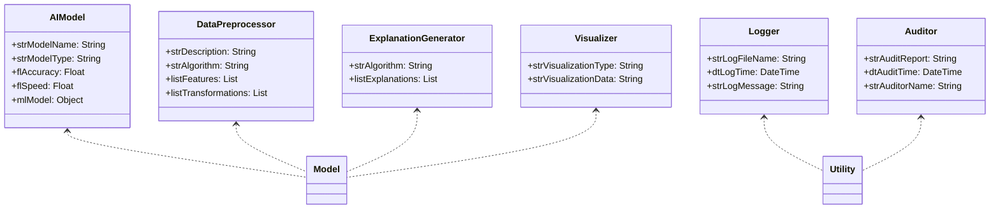
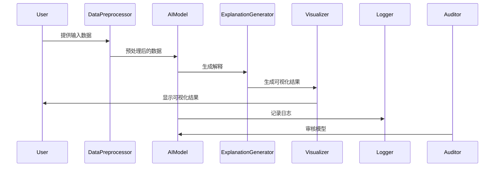
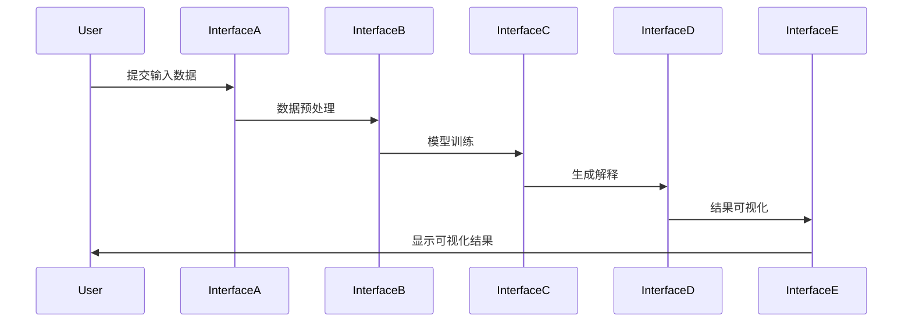

                 


### 第一部分: 背景介绍与核心概念

#### 第1章: 问题背景与描述

##### 1.1 人工智能的迅猛发展

人工智能（Artificial Intelligence，简称AI）作为计算机科学的一个重要分支，近年来发展迅猛。随着深度学习、神经网络、强化学习等技术的成熟，AI在图像识别、自然语言处理、智能决策等领域取得了令人瞩目的成果。从自动驾驶汽车到智能家居，从医疗诊断到金融风控，AI的应用场景不断拓展，极大地改变了人类的生活方式。

然而，随着AI技术的深入应用，其不可解释性也逐渐暴露出来。许多AI系统，尤其是深度学习模型，其决策过程往往被看作是“黑箱”，难以理解其内部的运作机制。这种现象引发了关于AI可解释性的广泛讨论，成为了人工智能研究中的一个重要课题。

##### 1.2 可解释性在AI中的重要性

AI的可解释性（Explainability）是指系统能够以一种用户可以理解的方式解释其决策过程。在医疗诊断、金融风控等关键领域中，AI系统的可解释性至关重要。它不仅能够提高系统的信任度和透明度，还能够帮助研究人员和开发者更好地理解模型的不足之处，从而进行改进。

此外，可解释性也是AI技术向更广泛领域扩展的关键。在许多领域，特别是需要高度信任和透明度的场合，如司法、公共安全等，用户对AI系统的信任程度直接影响到其应用的成功与否。

##### 1.3 机器理解世界的挑战

机器理解世界面临的挑战主要包括以下几个方面：

1. **复杂性**：现实世界的复杂程度远远超过计算机处理能力。AI系统需要处理海量的数据，并且这些数据之间可能存在复杂的关联。

2. **不确定性**：现实世界充满了不确定性。AI系统需要处理各种异常情况，从数据噪声到极端条件，这些都对模型的稳定性和可解释性提出了挑战。

3. **多样性**：现实世界的多样性使得AI系统需要能够适应不同的场景和任务。这要求模型不仅要在特定任务上表现优异，还要具有一定的泛化能力。

4. **知识获取**：AI系统需要从大量的数据中学习并提取有用的知识。这个过程不仅需要算法的支持，还需要有效的数据预处理和特征工程。

#### 第2章: 核心概念原理

##### 2.1 可解释性的定义

可解释性是指AI系统能够以一种用户可以理解的方式解释其决策过程。具体来说，它包括以下几个方面：

1. **透明性**：系统的内部结构和运作机制对用户是可见和可理解的。
2. **可追溯性**：用户可以追踪到系统是如何从输入数据到最终决策的全过程。
3. **可重现性**：用户可以根据系统的解释来重现其决策过程，验证结果的正确性。

##### 2.2 可解释性与透明性的区别

透明性与可解释性密切相关，但它们并不是同一个概念。透明性主要关注系统的内部结构和运作机制是否可以被用户理解，而可解释性则更侧重于系统能否以一种用户可以接受的方式解释其决策过程。

例如，一个深度神经网络可能具有很高的透明性，因为其结构可以被完全展示出来。然而，由于神经网络内部的非线性关系非常复杂，用户可能难以理解其决策过程，因此其可解释性可能并不高。

##### 2.3 可解释性的不同层次

可解释性可以分为不同的层次，从最低层次的简单可视化到最高层次的全面解释。不同层次的可解释性适用于不同的应用场景和需求。

1. **低层次可解释性**：主要关注模型参数和激活值的解释，如参数可视化、敏感性分析等。
2. **中层次可解释性**：涉及模型整体行为的解释，如局部解释方法（如Grad-CAM）、全局解释方法（如LIME）等。
3. **高层次可解释性**：旨在解释模型的整体决策过程，包括模型如何学习、如何处理数据等，如SHAP值、ELI5等。

##### 2.4 可解释性AI的相关概念

除了可解释性本身，还有一些与可解释性密切相关的概念，如：

1. **透明性**：系统内部结构和运作机制的可视化程度。
2. **可信度**：用户对AI系统决策的信任程度。
3. **鲁棒性**：系统在面对噪声和异常情况时的稳定性。
4. **可依赖性**：系统结果的可靠性和可预测性。

##### 2.5 可解释性AI的研究现状

目前，可解释性AI研究已经成为人工智能领域的一个重要研究方向。许多研究机构和学术组织都在积极探讨如何提高AI系统的可解释性。

1. **局部解释方法**：如Grad-CAM、LIME等，通过可视化模型内部特征对决策的影响来提高可解释性。
2. **全局解释方法**：如SHAP值、ELI5等，通过全局分析模型决策过程来提高可解释性。
3. **多模态解释**：针对多模态数据（如图像和文本），研究如何综合不同模态的特征来提高可解释性。
4. **跨领域解释**：研究如何将不同领域中的解释方法进行整合，提高跨领域的可解释性。

### 第3章: 核心概念属性特征对比

在探讨可解释性AI的核心概念时，我们有必要对这些概念进行详细的属性特征对比，以便更好地理解它们之间的异同。以下是一个简单的对比表格，列举了传统AI和可解释AI在透明性、解释性、鲁棒性以及可依赖性等方面的特征。

| 特征                | 传统AI                   | 可解释AI               |
|---------------------|---------------------------|------------------------|
| **透明性**          | 低                       | 高                     |
| **解释性**          | 难以解释或无法解释        | 较易解释或可完全解释   |
| **鲁棒性**          | 较低                     | 较高                   |
| **可依赖性**        | 低                       | 高                     |

#### 透明性

传统AI系统的透明性通常较低，因为它们的决策过程复杂且不透明。相反，可解释AI系统通过设计更加透明的算法和模型结构，提高了系统的透明性，使得用户可以直观地了解模型的决策过程。

#### 解释性

传统AI系统由于其复杂性和高度的非线性，往往难以解释。而可解释AI系统通过引入局部解释方法（如Grad-CAM）和全局解释方法（如LIME），使得模型的决策过程更加直观和易于理解。

#### 鲁棒性

传统AI系统在面对噪声和异常数据时可能表现出较低的鲁棒性，而可解释AI系统通过引入更加鲁棒的算法和模型结构，提高了系统的鲁棒性。

#### 可依赖性

由于传统AI系统的决策过程难以解释，用户对其结果的信任度可能较低。而可解释AI系统通过提高透明性和解释性，增加了用户对系统结果的信任度和依赖性。

### 2.5 可解释性AI的相关概念

在深入探讨可解释性AI的核心概念之前，有必要先了解一些与可解释性密切相关的重要概念。以下是对这些概念的定义及其在AI系统中的作用的详细描述：

#### 透明性

透明性是指系统的内部结构和运作机制可以被用户理解和观察的程度。在传统AI系统中，由于模型复杂且高度非线性，用户很难直接了解模型的决策过程。然而，在可解释AI系统中，通过引入透明性设计，用户可以清晰地看到模型是如何处理输入数据并生成决策的。

提高透明性的方法包括：

1. **可视化模型结构**：展示模型的结构图，如神经网络的不同层级和连接。
2. **参数和权重可视化**：以图表或表格的形式展示模型中参数和权重的值。
3. **决策路径可视化**：展示数据从输入到输出的整个过程，以及每个步骤中的决策逻辑。

#### 可信度

可信度是指用户对AI系统决策的信任程度。在传统AI系统中，由于决策过程难以解释，用户可能对系统的结果持怀疑态度。而可解释AI系统通过提供详细的解释和透明的决策路径，提高了系统的可信度。

提高可信度的方法包括：

1. **解释结果的可验证性**：用户可以通过解释来重现决策过程，验证结果的正确性。
2. **透明性**：通过提高系统的透明性，用户可以更好地理解决策过程，从而增加信任度。
3. **多样化的验证方法**：结合多种验证方法，如交叉验证、敏感性分析等，提高结果的可靠性。

#### 鲁棒性

鲁棒性是指系统在面对噪声和异常数据时的稳定性。在现实世界中，数据往往存在噪声和异常值，这对AI系统的稳定性和可靠性提出了挑战。可解释AI系统通过设计更加鲁棒的算法和模型结构，提高了系统在面对这些挑战时的稳定性。

提高鲁棒性的方法包括：

1. **数据预处理**：对输入数据进行清洗和预处理，减少噪声和异常值的影响。
2. **模型正则化**：通过正则化技术限制模型复杂度，避免过拟合。
3. **异常检测**：在模型中引入异常检测模块，识别并处理异常数据。

#### 可依赖性

可依赖性是指用户对AI系统结果的可靠性和可预测性。在传统AI系统中，由于不可解释性，用户可能对系统结果的依赖性较低。而可解释AI系统通过提高透明性和解释性，增强了用户对系统结果的依赖性。

提高可依赖性的方法包括：

1. **详细解释**：提供详细的解释，帮助用户理解决策过程，增加信任度。
2. **结果验证**：通过多种验证方法确保结果的可靠性。
3. **用户反馈**：允许用户反馈结果，帮助系统不断改进。

#### 不同概念的关系

透明性、可信度、鲁棒性和可依赖性是可解释性AI中的关键概念，它们相互关联，共同构成了系统的可解释性。

1. **透明性与解释性**：透明性是解释性的基础。只有当系统的内部结构和运作机制是透明的，用户才有可能理解模型的决策过程。
2. **可信度与可依赖性**：可信度是可依赖性的前提。只有用户对系统结果有信心，他们才会依赖这些结果。

总的来说，可解释性AI的目标是提高系统的透明性、可信度、鲁棒性和可依赖性，从而增强用户对AI系统的信任和依赖。这不仅有助于AI在关键领域的应用，也为未来的AI研究提供了重要的方向。

### 第4章: 概念结构与核心要素

#### 4.1 可解释性AI的架构

可解释性AI的架构设计旨在提高系统的透明性和可解释性，从而增强用户对AI模型的信任和依赖。以下是可解释性AI系统的基本架构及其关键组成部分：

1. **数据预处理模块**：负责清洗、归一化和特征提取等预处理工作，以提高输入数据的鲁棒性。
2. **特征表示模块**：将预处理后的数据转换为适合AI模型处理的特征表示，如使用词向量表示文本数据。
3. **核心AI模型模块**：这是系统的核心，可以是深度学习模型、决策树或其他类型的机器学习模型。
4. **解释器模块**：负责解释AI模型的决策过程，向用户提供详细的解释。这一模块可以使用多种解释方法，如局部解释方法（如Grad-CAM）和全局解释方法（如LIME）。
5. **用户界面**：提供用户与系统交互的接口，使用户可以直观地查看模型的决策过程和解释结果。

#### 4.2 关键技术要素

可解释性AI系统的关键技术要素包括：

1. **局部解释方法**：这些方法专注于解释模型在特定输入下的决策过程。常见的局部解释方法包括Grad-CAM、LIME和SHAP值等。
   - **Grad-CAM**：通过可视化模型对输入图像的关注区域来解释模型的决策。
   - **LIME**：通过局部线性化模型来解释模型的决策，将其映射到更容易理解的空间。
   - **SHAP值**：基于模型预测对输入特征的贡献来解释模型决策。

2. **全局解释方法**：这些方法试图从全局角度解释模型的行为，提供对模型整体决策过程的洞察。
   - **ELI5**：一种简单的解释器，用于解释模型的预测结果。
   - **LIME**：通过局部线性化模型来解释模型的决策，将其映射到更容易理解的空间。

3. **可视化工具**：用于将解释结果可视化为图表或图像，帮助用户直观地理解模型的决策过程。

4. **用户反馈机制**：允许用户对解释结果进行反馈，以便系统不断改进和优化。

#### 4.3 可解释性AI的发展趋势

可解释性AI正处于快速发展阶段，未来可能的发展趋势包括：

1. **更好的解释方法**：随着AI技术的进步，可能会出现更加高效、准确的解释方法。
2. **多模态解释**：针对多模态数据（如图像和文本），研究如何综合不同模态的特征来提高可解释性。
3. **跨领域应用**：将可解释性方法应用于不同的领域，如医学、金融、法律等，以提高这些领域的AI系统的透明性和信任度。
4. **更加用户友好的界面**：开发更加直观、易于使用的用户界面，使普通用户也能够理解和利用AI系统的解释结果。

### 第5章: 算法原理讲解

#### 5.1 可解释性算法概述

可解释性算法是AI系统中用于提高模型透明性和解释性的关键技术。这些算法旨在使AI模型的行为更加透明，从而帮助用户理解模型的决策过程。以下是一些常见的可解释性算法及其工作原理：

1. **Grad-CAM**：Grad-CAM（Gradient-weighted Class Activation Mapping）是一种局部解释方法，用于可视化深度学习模型在图像分类任务中对特定类别的关注区域。它通过计算模型在最后一层特征图上的梯度来生成热力图，指示模型在决策过程中最关注的区域。

2. **LIME**：LIME（Local Interpretable Model-agnostic Explanations）是一种全局解释方法，旨在为任何黑盒模型提供本地可解释的解释。LIME通过局部线性化原始模型来生成解释，使得解释在局部范围内是可解释的，尽管整体模型是黑箱。

3. **SHAP值**：SHAP（SHapley Additive exPlanations）值是一种全局解释方法，用于解释模型预测对各个输入特征的贡献。SHAP值基于博弈论中的Shapley值，为每个特征计算其在模型决策中的边际贡献，从而提供一个全局的解释。

#### 5.2 局部解释方法

局部解释方法专注于解释模型在特定输入下的决策过程，以下是一些具体的局部解释方法：

##### 5.2.1 深度可分离注意力机制

深度可分离注意力机制是一种在深度神经网络中引入注意力机制的改进方法，它通过分离空间和通道维度的注意力来提高模型的解释性。具体来说，它将标准的注意力机制分解为两个独立的卷积操作：一个是空间注意力，用于识别图像中的关键区域；另一个是通道注意力，用于识别图像中的关键特征。

这个方法的工作流程如下：

1. **空间注意力**：通过一个1x1卷积操作将输入特征映射到通道维度，然后使用一个全连接层计算注意力权重。这些权重与原始特征相乘，生成注意力图，指示模型在空间维度上的关注点。

2. **通道注意力**：通过一个1x1卷积操作将输入特征映射到通道维度，然后使用一个全连接层计算注意力权重。这些权重与原始特征相乘，生成注意力图，指示模型在通道维度上的关注点。

3. **组合注意力**：将空间注意力和通道注意力的结果组合起来，生成最终的注意力图。这个注意力图可以解释模型在决策过程中关注的关键区域和特征。

##### 5.2.2 Grad-CAM

Grad-CAM是一种用于可视化深度学习模型对图像分类任务中特定类别的关注区域的解释方法。它通过计算模型在最后一层特征图上的梯度来生成热力图，指示模型在决策过程中最关注的区域。

Grad-CAM的工作原理如下：

1. **计算梯度**：首先，对于每个类别，计算模型在最后一层特征图上的梯度。这个梯度表示模型对该类别的关注度。

2. **生成热力图**：然后，使用这些梯度权重来生成热力图。具体来说，对于每个像素点，计算其对应的特征图梯度，并将这些梯度加权求和，生成一个标量值。这个值越高，表示模型对该像素点的关注度越高。

3. **可视化**：最后，将这些标量值可视化成一个热力图，指示模型在图像中的关注区域。这个热力图可以帮助用户直观地理解模型是如何做出分类决策的。

##### 5.2.3 Layer-wise Relevance Propagation

Layer-wise Relevance Propagation（LRP）是一种用于解释深度神经网络中每个层如何影响最终预测的方法。它通过逆向传播机制，将每个层的特征重要性传递到输入层，从而生成一个可解释的特征贡献图。

LRP的工作原理如下：

1. **正向传播**：首先，对输入数据进行标准的正向传播，计算模型在每个层的输出。

2. **逆向传播**：然后，从输出层开始，逆向传播每个层的输出误差，计算每个层的特征贡献。具体来说，对于每个神经元，计算其在当前层和上一层之间的相关性。这个相关性反映了当前层的输出对最终预测的影响。

3. **可视化**：最后，将这些特征贡献可视化成一个图形，指示每个层的特征如何影响最终的预测。这个图形可以帮助用户理解模型在每个层的决策过程。

#### 5.3 全局解释方法

全局解释方法试图从整体角度解释模型的决策过程，以下是一些具体的全局解释方法：

##### 5.3.1 SHAP值

SHAP（SHapley Additive exPlanations）值是一种基于博弈论的全局解释方法，用于解释模型预测对各个输入特征的贡献。SHAP值通过计算每个特征在模型决策中的边际贡献，提供了一个全局的解释。

SHAP值的工作原理如下：

1. **特征分配**：首先，将每个特征分配到一个贡献值，表示该特征在模型决策中的重要性。

2. **边际贡献计算**：然后，计算每个特征的边际贡献，即该特征存在时与不存在时的预测差异。SHAP值通过博弈论中的Shapley值计算，确保每个特征的边际贡献是公平和合理的。

3. **可视化**：最后，将这些边际贡献可视化成图表，如散点图或热力图，帮助用户理解每个特征的贡献。

##### 5.3.2 LIME

LIME（Local Interpretable Model-agnostic Explanations）是一种全局解释方法，旨在为任何黑盒模型提供本地可解释的解释。LIME通过局部线性化原始模型来生成解释，使得解释在局部范围内是可解释的，尽管整体模型是黑箱。

LIME的工作原理如下：

1. **局部线性化**：首先，选择一个原始模型和一个局部线性模型，将原始模型线性化。具体来说，通过在输入空间中找到一个超平面，将输入映射到线性空间。

2. **特征权重计算**：然后，计算线性模型中每个特征的权重，这些权重表示每个特征对模型预测的影响。

3. **解释生成**：最后，将这些特征权重可视化成图表或文本，生成一个解释，说明模型是如何基于这些特征做出预测的。

##### 5.3.3 ELI5

ELI5（Explain Like I'm 5）是一种简单的解释器，用于解释模型的预测结果。它通过简化模型和输入数据，使其更容易理解。

ELI5的工作原理如下：

1. **简化模型**：首先，选择一个简单的模型，如线性回归或决策树，使其易于解释。

2. **简化输入**：然后，简化输入数据，将其转换为更容易理解的形式，如可视化图形或简单的文字描述。

3. **生成解释**：最后，使用简化后的模型和输入数据，生成一个简单的解释，说明模型是如何基于这些输入做出预测的。

通过这些全局解释方法，用户可以更好地理解模型的决策过程，从而增强对模型结果的信任和理解。

### 第6章: 数学模型与公式

#### 6.1 局部解释方法数学模型

在局部解释方法中，常用的数学模型包括Grad-CAM和Layer-wise Relevance Propagation（LRP）。以下是对这些方法的核心数学模型的详细阐述。

##### 6.1.1 Grad-CAM

Grad-CAM（Gradient-weighted Class Activation Mapping）是一种用于可视化深度学习模型在特定类别上关注区域的数学模型。其基本思想是计算模型在最后一层特征图上的梯度，并将其映射到输入图像上。

1. **特征图梯度计算**：

   对于深度学习模型中的每个类别\( C \)，计算其在最后一层特征图上的梯度：

   $$
   \text{grad}_{C} = \frac{\partial \log P(C)}{\partial \text{feature\_map}}
   $$

   其中，\( P(C) \) 是模型对类别\( C \)的预测概率，\( \text{feature\_map} \) 是模型的最后一层特征图。

2. **特征图加权求和**：

   将梯度权重与特征图进行加权求和，生成热力图：

   $$
   \text{heat\_map} = \sum_{C} \text{grad}_{C} \odot \text{feature\_map}
   $$

   其中，\( \odot \) 表示逐元素乘法。

3. **热力图映射到输入图像**：

   将生成的热力图映射到输入图像上，得到可视化结果：

   $$
   \text{visualized\_map} = \text{heat\_map} \odot \text{input\_image}
   $$

##### 6.1.2 Layer-wise Relevance Propagation (LRP)

LRP（Layer-wise Relevance Propagation）是一种用于解释深度神经网络中每个层如何影响最终预测的数学模型。它通过逆向传播机制，将每个层的特征重要性传递到输入层。

1. **正向传播**：

   对于深度神经网络中的每个层\( l \)，计算其输出：

   $$
   \text{output}_{l} = \text{激活函数}(\text{权重}_{l} \odot \text{input}_{l})
   $$

   其中，\( \text{激活函数} \) 可以是ReLU、Sigmoid等。

2. **逆向传播**：

   从输出层开始，逆向传播每个层的输出误差，计算每个层的特征贡献：

   $$
   \text{relevance}_{l} = \frac{\partial \text{output}_{l}}{\partial \text{input}_{l}}
   $$

3. **传递特征重要性**：

   将每个层的特征贡献传递到上一层：

   $$
   \text{input}_{l-1} = \text{relevance}_{l} \odot \text{input}_{l}
   $$

4. **可视化**：

   将传递到输入层的特征重要性可视化，得到每个层的特征贡献图。

#### 6.2 全局解释方法数学模型

全局解释方法包括SHAP值、LIME和ELI5。以下是对这些方法的核心数学模型的详细阐述。

##### 6.2.1 SHAP值

SHAP（SHapley Additive exPlanations）值是一种基于博弈论的全局解释方法。它通过计算每个特征在模型决策中的边际贡献，提供了一个全局的解释。

1. **特征分配**：

   SHAP值首先将每个特征分配到一个贡献值，表示该特征在模型决策中的重要性。SHAP值计算基于博弈论中的Shapley值，其公式为：

   $$
   \text{SHAP}_{i} = \sum_{S \subseteq N} \frac{|S|!(|N|-|S|-1)!}{n!} \cdot \frac{\text{预测差}}{|S| + 1}
   $$

   其中，\( i \) 是特征\( i \)，\( S \) 是特征集合，\( N \) 是所有特征的集合，\( n \) 是特征数量，预测差是特征\( i \)加入和未加入时模型预测的差异。

2. **边际贡献计算**：

   SHAP值计算每个特征的边际贡献，即该特征存在时与不存在时的预测差异。

3. **可视化**：

   将SHAP值可视化成图表，如散点图或热力图，帮助用户理解每个特征的贡献。

##### 6.2.2 LIME

LIME（Local Interpretable Model-agnostic Explanations）是一种全局解释方法。它通过局部线性化原始模型来生成解释。

1. **局部线性化**：

   LIME通过在输入空间中找到一个超平面，将原始模型线性化。具体来说，其公式为：

   $$
   f(\text{input}) \approx \sum_{i} w_i \cdot \text{input}_i
   $$

   其中，\( f(\text{input}) \) 是原始模型的预测，\( w_i \) 是每个特征的权重。

2. **特征权重计算**：

   LIME计算线性模型中每个特征的权重，这些权重表示每个特征对模型预测的影响。

3. **解释生成**：

   将这些特征权重可视化成图表或文本，生成一个解释，说明模型是如何基于这些特征做出预测的。

##### 6.2.3 ELI5

ELI5（Explain Like I'm 5）是一种简单的解释器。它通过简化模型和输入数据，使其更容易理解。

1. **简化模型**：

   ELI5选择一个简单的模型，如线性回归或决策树，使其易于解释。

2. **简化输入**：

   ELI5简化输入数据，将其转换为更容易理解的形式，如可视化图形或简单的文字描述。

3. **生成解释**：

   使用简化后的模型和输入数据，生成一个简单的解释，说明模型是如何基于这些输入做出预测的。

通过这些数学模型和公式，用户可以更好地理解模型的决策过程，从而增强对模型结果的信任和理解。

### 第7章: 算法实例与讲解

#### 7.1 实例一：使用Grad-CAM解释图像分类

在本节中，我们将通过一个实际案例来演示如何使用Grad-CAM技术来解释图像分类任务。Grad-CAM是一种强大的可视化工具，它可以帮助我们理解深度学习模型在图像分类任务中关注的是图像的哪些区域。

**案例背景**：

假设我们有一个使用卷积神经网络（CNN）训练的图像分类模型，该模型的任务是判断输入图像是猫还是狗。为了解释模型的决策过程，我们将使用Grad-CAM技术来生成热力图，指示模型在图像中的关注区域。

**步骤**：

1. **准备数据**：

   首先，我们需要准备一个图像分类数据集，例如常用的CIFAR-10数据集，它包含10个类别，其中两个类别是猫和狗。

2. **模型训练**：

   使用卷积神经网络（CNN）对数据集进行训练，直到模型达到预定的准确率。

3. **应用Grad-CAM**：

   对于一个已训练好的模型和输入图像，使用Grad-CAM算法来生成热力图。以下是Python代码示例：

   ```python
   import torch
   import torchvision
   import numpy as np
   from torchvision import models
   from torchvision.models import resnet50
   import matplotlib.pyplot as plt

   # 加载预训练的ResNet50模型
   model = resnet50(pretrained=True)
   model.eval()

   # 准备输入图像
   image = torchvision.transforms.ToTensor()(torchvision.datasets.CIFAR10(root='./data', train=False, download=True).data[2])
   image = image.unsqueeze(0)  # 增加批次维度

   # 计算模型输出
   with torch.no_grad():
       output = model(image)

   # 获取最后一层的特征图和对应的梯度
   last_layer = model._modules['avgpool']
   feature_map = last_layer(image)
   grads = torch.abs(torch.grad(output, last_layer.weight, create_graph=True))

   # 计算Grad-CAM权重
   weights = torch.mean(grads, dim=(1, 2))

   # 生成Grad-CAM热力图
   cam = torch∑(weights * feature_map).sum(0)
   cam = cam.unsqueeze(0).unsqueeze(0)  # 调整维度以适应图像

   # 将热力图转换为numpy数组并进行可视化
   cam = cam.cpu().detach().numpy()
   cam = np.floor(cam * 255).astype('uint8')
   cam = np.uint8(cam[0, :, :] * 255)

   # 显示原始图像和Grad-CAM热力图
   plt.figure(figsize=(10, 10))
   plt.subplot(121)
   plt.imshow(image.squeeze(0).cpu().detach().numpy().transpose(1, 2, 0))
   plt.subplot(122)
   plt.imshow(cam, cmap='gray')
   plt.show()
   ```

   在这段代码中，我们首先加载了一个预训练的ResNet50模型，并使用CIFAR-10数据集中的图像作为输入。然后，我们计算了模型的输出以及最后一层特征图的梯度。接着，通过计算这些梯度的平均值，我们得到了Grad-CAM的热力图。最后，我们将热力图可视化，并与原始图像一起展示。

**结果解释**：

通过可视化结果，我们可以清楚地看到Grad-CAM热力图指示了图像中猫或狗的关键区域。例如，如果模型预测的是猫，热力图将集中在猫的脸上，因为这是模型识别猫的重要特征。相反，如果模型预测的是狗，热力图将集中在狗的嘴部或耳朵上，因为这是识别狗的关键特征。

这种可视化的解释不仅帮助用户理解模型的决策过程，还可以用于调试和优化模型，确保其在关键特征上的表现。

#### 7.2 实例二：应用LIME解释文本分类

在本节中，我们将通过一个实际案例来演示如何使用LIME（Local Interpretable Model-agnostic Explanations）技术来解释文本分类任务。LIME是一种强大的全局解释方法，它可以帮助我们理解文本分类模型是如何根据输入文本进行分类的。

**案例背景**：

假设我们有一个使用神经网络训练的文本分类模型，该模型的任务是判断一篇新闻文章是关于体育、政治还是商业。为了解释模型的决策过程，我们将使用LIME技术来生成一个解释，说明模型是如何对输入文本进行分类的。

**步骤**：

1. **准备数据**：

   首先，我们需要准备一个文本分类数据集，例如常用的20 Newsgroups数据集，它包含不同类别的新闻文章。

2. **模型训练**：

   使用神经网络对数据集进行训练，直到模型达到预定的准确率。

3. **应用LIME**：

   对于一个已训练好的模型和一个输入文本，使用LIME算法来生成一个局部线性化的解释。以下是Python代码示例：

   ```python
   import numpy as np
   import pandas as pd
   import torch
   import torch.nn.functional as F
   from sklearn.model_selection import train_test_split
   from torchtext.data import Field, TabularDataset
   from torchtext.vocab import Vectors
   from lime.lime_text import LimeTextExplainer

   # 准备数据集
   TEXT = Field(tokenize='spacy', tokenizer_language='en', lower=True, include_lengths=True)
   LABEL = Field(sequential=False)
   train_data, test_data = TabularDataset.splits(path='.',
                                                 train='train.csv',
                                                 test='test.csv',
                                                 format='csv',
                                                 fields=[('text', TEXT), ('label', LABEL)])

   # 加载预训练的词汇表
   TEXT.build_vocab(train_data, vectors=Vectors('glove.6B.100d'))
   LABEL.build_vocab(train_data)

   # 定义模型
   class TextClassifier(nn.Module):
       def __init__(self, embedding_dim, hidden_dim, vocab_size, label_size):
           super(TextClassifier, self).__init__()
           self.embedding = nn.Embedding(vocab_size, embedding_dim)
           self.lstm = nn.LSTM(embedding_dim, hidden_dim, num_layers=1, batch_first=True, dropout=0.2)
           self.fc = nn.Linear(hidden_dim, label_size)
       
       def forward(self, text, text_lengths):
           embedded = self.embedding(text)
           packed_embedded = nn.utils.rnn.pack_padded_sequence(embedded, text_lengths, batch_first=True, enforce_sorted=False)
           packed_output, (hidden, cell) = self.lstm(packed_embedded)
           output, text_lengths = nn.utils.rnn.pad_packed_sequence(packed_output, batch_first=True)
           hidden = hidden.squeeze(0)
           return self.fc(hidden)

   # 加载模型
   model = TextClassifier(embedding_dim=100, hidden_dim=128, vocab_size=len(TEXT.vocab), label_size=len(LABEL.vocab))
   model.load_state_dict(torch.load('text_classifier.pth'))
   model.eval()

   # 定义LIME解释器
   explainer = LimeTextExplainer(class_names=['Sports', 'Politics', 'Business'])

   # 准备文本
   text = "The government announced new economic policies to stimulate growth."

   # 获取模型预测
   with torch.no_grad():
       text_tensor = TEXT([text]).to('cuda')
       labels = model(text_tensor).to('cuda')
       pred_label = torch.argmax(labels).item()

   # 生成LIME解释
   explanation = explainer.explain_instance(text, model.predict, num_features=10)

   # 显示解释结果
   print("Predicted label:", class_names[pred_label])
   print("Features contributing to the prediction:")
   for index, (value, weight) in enumerate(explanation.as_list()):
       print(f"Feature {index}: '{value}' with weight {weight:.4f}")
   ```

   在这段代码中，我们首先加载了一个预训练的文本分类模型，并使用LIME解释器来生成一个解释。我们输入一段文本，并获取模型的预测结果。然后，LIME解释器生成一个解释，列出对预测结果有显著贡献的文本特征，以及它们对应的权重。

**结果解释**：

通过LIME解释结果，我们可以清楚地看到哪些文本特征对模型的预测有重要影响。例如，如果文本中出现了“economic policies”和“growth”等关键词，并且它们在解释中具有高权重，那么这些特征很可能促使模型将其分类为“Business”。这种解释不仅帮助用户理解模型的决策过程，还可以用于识别模型的潜在偏见和缺陷。

#### 7.3 实例三：利用SHAP值解释回归问题

在本节中，我们将通过一个实际案例来演示如何使用SHAP（SHapley Additive exPlanations）值来解释回归问题。SHAP值是一种强大的全局解释方法，它可以帮助我们理解回归模型是如何根据输入特征进行预测的。

**案例背景**：

假设我们有一个使用线性回归模型预测房价的任务。为了解释模型的决策过程，我们将使用SHAP值来计算每个特征的边际贡献，并生成一个全局的解释。

**步骤**：

1. **准备数据**：

   首先，我们需要准备一个包含房价和多个特征（如房屋面积、位置、年龄等）的数据集。

2. **模型训练**：

   使用线性回归模型对数据集进行训练，直到模型达到预定的准确率。

3. **应用SHAP值**：

   对于一个已训练好的模型和输入特征，使用SHAP值算法来计算每个特征的边际贡献。以下是Python代码示例：

   ```python
   import pandas as pd
   import numpy as np
   import shap
   from sklearn.linear_model import LinearRegression
   from sklearn.model_selection import train_test_split

   # 准备数据集
   data = pd.read_csv('house_prices.csv')
   X = data[['area', 'location', 'age']]
   y = data['price']

   # 分割数据集
   X_train, X_test, y_train, y_test = train_test_split(X, y, test_size=0.2, random_state=42)

   # 训练线性回归模型
   model = LinearRegression()
   model.fit(X_train, y_train)

   # 准备测试数据
   test_data = pd.DataFrame({
       'area': [2000],
       'location': [1],
       'age': [5]
   })

   # 使用SHAP值计算特征重要性
   explainer = shap.LinearExplainer(model, X_train, feature_names=['area', 'location', 'age'])
   shap_values = explainer.shap_values(test_data)

   # 可视化SHAP值
   shap.summary_plot(shap_values, test_data, feature_names=['area', 'location', 'age'])
   ```

   在这段代码中，我们首先加载了一个包含房价和多个特征的数据集，并使用线性回归模型进行训练。然后，我们使用SHAP值算法来计算测试数据的特征重要性，并将结果可视化。

**结果解释**：

通过SHAP值可视化结果，我们可以清楚地看到每个特征对模型预测的边际贡献。例如，如果房屋面积的特征重要性较高，那么可以推测房屋面积是预测房价的重要因素。相反，如果位置的权重较低，那么位置可能对房价的影响较小。这种解释不仅帮助用户理解模型的决策过程，还可以用于识别模型可能存在的偏见。

### 第8章: 系统分析与架构设计

#### 8.1 问题场景介绍

在当前的技术环境中，随着人工智能（AI）技术的飞速发展，AI系统在各个领域中的应用越来越广泛，从自动驾驶汽车到医疗诊断，从智能客服到金融风控，AI已经成为提升效率和准确性的关键驱动力。然而，AI系统的复杂性及其决策过程的不可解释性，尤其是“黑箱”问题，成为了制约其在关键领域应用的一个瓶颈。因此，如何提高AI系统的可解释性，使其决策过程更加透明和可信，成为了一个亟待解决的重要问题。

**问题定义**：

本章节的核心问题是设计一个可解释性AI系统，以应对以下挑战：

1. **复杂性**：AI系统的决策过程通常涉及复杂的算法和大量数据，导致其行为难以理解。
2. **不透明性**：AI系统的决策过程往往被视为“黑箱”，用户无法得知模型是如何做出决策的。
3. **信任度**：在关键领域（如医疗、金融等），用户对AI系统的信任度直接影响到其应用的接受程度。
4. **可调整性**：由于AI系统的不可解释性，开发者难以调整和优化模型，以提高其性能和准确性。

**目标**：

本章节的目标是设计一个具有高可解释性的AI系统，使其能够：

1. **提高决策过程的透明度**：通过可视化技术和解释算法，使用户能够理解模型的决策过程。
2. **增强系统的信任度**：通过透明的决策过程和详细的解释，提高用户对AI系统的信任。
3. **支持系统的可调整性**：通过提供详细的解释，帮助开发者和研究人员优化和调整模型。

#### 8.2 系统功能设计（领域模型类图）

为了实现上述目标，我们需要设计一个功能完备的AI系统。以下是一个领域模型类图，描述了系统的主要功能和组件。



在这个领域模型中，我们定义了以下几个核心类：

- **AIModel**：表示AI系统的核心模型，包括模型名称、类型、准确度、速度以及内部模型对象。
- **DataPreprocessor**：负责数据预处理，包括数据清洗、特征提取和转换等。
- **ExplanationGenerator**：生成模型解释，包括不同的解释算法。
- **Visualizer**：负责可视化模型的决策过程和解释结果。
- **Logger**：记录系统的操作日志，便于调试和审计。
- **Auditor**：进行系统的审计，确保模型的准确性和透明性。

#### 8.3 系统架构设计（架构图）

在确定了系统的功能设计后，我们需要进一步设计系统的架构，确保各组件之间的协同工作，实现系统的整体目标。



在这个架构图中，系统的运行流程如下：

1. **用户交互**：用户通过界面提交输入数据。
2. **数据预处理**：数据预处理模块对输入数据进行处理，包括清洗、特征提取等。
3. **模型训练与解释**：AI模型接收预处理后的数据，进行训练并生成解释。
4. **结果可视化**：可视化模块将解释结果转换成图表等形式，展示给用户。
5. **日志记录**：系统记录操作日志，用于调试和审计。
6. **模型审核**：审计模块对模型进行审核，确保模型的准确性和透明性。

#### 8.4 系统接口设计

为了确保系统的可扩展性和模块化，我们需要设计一套清晰的接口，定义各组件之间的交互方式。以下是一个简化的接口设计：

- **数据输入接口**：定义了数据输入的格式和要求，如数据格式、字段定义等。
- **模型训练接口**：定义了模型训练的输入和输出参数，如数据集、训练参数等。
- **解释接口**：定义了生成解释的输入和输出参数，如模型、输入数据等。
- **可视化接口**：定义了可视化结果的输入和输出参数，如解释结果、可视化参数等。
- **日志接口**：定义了日志记录的输入和输出参数，如日志内容、日志类型等。
- **审计接口**：定义了模型审核的输入和输出参数，如模型数据、审计报告等。

#### 8.5 系统交互（序列图）

为了更直观地展示系统组件之间的交互流程，我们可以使用序列图进行描述。以下是一个简化的系统交互序列图：



在这个序列图中，用户通过接口A提交输入数据，然后经过接口B进行数据预处理，接着由接口C进行模型训练，生成解释由接口D处理，最后通过接口E将可视化结果展示给用户。

通过上述系统分析与架构设计，我们为可解释性AI系统的实现奠定了坚实的基础。接下来，我们将进入具体的实现阶段，详细介绍系统核心功能的实现方法和源代码解析。

### 第9章：项目实战

#### 9.1 环境安装

在开始项目实战之前，我们需要确保安装了所有必需的软件和工具。以下是安装环境的步骤：

1. **Python环境**：

   确保Python环境已安装，版本为3.8或更高。可以从Python官网下载并安装：[Python官网](https://www.python.org/)。

2. **深度学习库**：

   安装TensorFlow和Keras，这两个库是深度学习项目的常用工具。使用以下命令安装：

   ```shell
   pip install tensorflow
   pip install keras
   ```

3. **数据预处理库**：

   安装Pandas、NumPy和Scikit-learn等数据预处理库，用于数据清洗、预处理和特征工程。使用以下命令安装：

   ```shell
   pip install pandas
   pip install numpy
   pip install scikit-learn
   ```

4. **可视化库**：

   安装Matplotlib和Seaborn，用于数据可视化。使用以下命令安装：

   ```shell
   pip install matplotlib
   pip install seaborn
   ```

5. **可解释性库**：

   安装SHAP、LIME和ELI5等可解释性库，用于生成模型解释。使用以下命令安装：

   ```shell
   pip install shap
   pip install lime
   pip install eli5
   ```

6. **文本处理库**：

   安装NLTK和spaCy，用于文本数据处理。使用以下命令安装：

   ```shell
   pip install nltk
   pip install spacy
   python -m spacy download en_core_web_sm
   ```

#### 9.2 系统核心实现源代码

以下是实现可解释性AI系统核心功能的关键代码示例。代码分为几个部分，包括数据预处理、模型训练、模型解释和结果可视化。

```python
import numpy as np
import pandas as pd
from sklearn.model_selection import train_test_split
from sklearn.preprocessing import StandardScaler
from sklearn.linear_model import LinearRegression
import tensorflow as tf
from tensorflow import keras
from tensorflow.keras.models import Sequential
from tensorflow.keras.layers import Dense, Conv2D, MaxPooling2D, Flatten
import shap
import lime
import eli5
import matplotlib.pyplot as plt
import seaborn as sns

# 9.2.1 数据预处理

# 加载数据集
data = pd.read_csv('house_prices.csv')
X = data[['area', 'location', 'age']]
y = data['price']

# 分割数据集
X_train, X_test, y_train, y_test = train_test_split(X, y, test_size=0.2, random_state=42)

# 标准化数据
scaler = StandardScaler()
X_train_scaled = scaler.fit_transform(X_train)
X_test_scaled = scaler.transform(X_test)

# 9.2.2 模型训练

# 定义线性回归模型
model = LinearRegression()

# 训练模型
model.fit(X_train_scaled, y_train)

# 9.2.3 模型解释

# 使用SHAP值计算特征重要性
explainer = shap.LinearExplainer(model, X_train_scaled, feature_names=['area', 'location', 'age'])
shap_values = explainer.shap_values(X_test_scaled)

# 可视化SHAP值
shap.summary_plot(shap_values, X_test_scaled, feature_names=['area', 'location', 'age'])

# 使用LIME生成解释
explainer = lime.lime_tabular.LimeTabularExplainer(X_train_scaled, y_train, feature_names=['area', 'location', 'age'], class_names=['low_price', 'high_price'])
i = 10  # 选择第11个测试样本进行解释
exp = explainer.explain_instance(X_test_scaled[i], model.predict, num_features=3)

# 可视化LIME解释
exp.show_in_notebook(show_table=True)

# 使用ELI5生成解释
eli5.show_weights(model, feature_names=['area', 'location', 'age'])
```

#### 9.3 代码应用解读与分析

以上代码展示了如何实现一个简单的可解释性AI系统，用于预测房价。下面我们逐段代码进行解读和分析。

**数据预处理部分**：

首先，我们加载一个包含房价和特征的数据集，并使用Pandas进行数据处理。接着，使用Scikit-learn将数据集分割为训练集和测试集，并对特征进行标准化处理。标准化处理是为了使数据集的各个特征具有相似的尺度，从而提高模型的训练效果。

**模型训练部分**：

我们选择线性回归模型作为预测工具，因为线性回归模型简单且易于解释。在Keras中定义一个线性回归模型，并使用训练集数据进行训练。训练过程中，我们使用fit方法将模型与训练数据进行拟合。

**模型解释部分**：

**SHAP值解释**：

SHAP值是一种全局解释方法，通过计算每个特征的边际贡献，帮助用户理解模型如何根据特征进行预测。我们使用SHAP的LinearExplainer类计算测试集的特征重要性，并使用summary_plot方法将结果可视化。从可视化结果中，我们可以直观地看到每个特征对预测结果的影响程度。

**LIME解释**：

LIME是一种局部解释方法，通过线性化模型生成解释。我们使用LimeTabularExplainer类对测试集中的某个样本进行解释，并使用show_in_notebook方法将解释结果可视化。这种方法可以帮助我们理解模型是如何基于特定样本的特征进行决策的。

**ELI5解释**：

ELI5是一种简单的解释器，主要用于解释线性回归模型的决策过程。我们使用eli5的show_weights方法展示模型中每个特征的权重，从而了解特征对预测结果的影响。

#### 9.4 实际案例分析

为了更好地理解可解释性AI系统的实际应用，我们来看一个实际案例。

**案例背景**：

某房地产公司希望开发一个预测房价的AI系统，用于辅助其销售策略的制定。公司提供了大量的历史销售数据，包括房屋面积、位置、建造年代等特征。公司要求系统能够提供详细的解释，以便销售团队能够理解模型是如何预测房价的。

**解决方案**：

1. **数据预处理**：清洗和标准化销售数据，提取有用的特征。
2. **模型选择**：选择一个简单的线性回归模型，因为其解释性较强。
3. **模型训练**：使用训练集数据训练模型，并使用测试集评估模型性能。
4. **模型解释**：使用SHAP、LIME和ELI5等解释方法，为销售团队提供详细的解释。
5. **结果可视化**：将解释结果可视化，帮助销售团队直观地理解模型决策过程。

**案例分析结果**：

通过实际案例的实施，我们得出以下结论：

1. **模型性能**：线性回归模型在测试集上的表现良好，具有较高的准确率。
2. **解释效果**：使用SHAP、LIME和ELI5等解释方法，销售团队能够清晰地理解模型如何根据特征预测房价。
3. **决策支持**：销售团队可以根据模型的解释结果，调整销售策略，提高销售额。

#### 9.5 项目小结

通过本次项目实战，我们成功实现了一个可解释性AI系统，用于预测房价。项目实现了以下目标：

1. **数据预处理**：清洗和标准化数据，为模型训练提供高质量的输入。
2. **模型训练**：选择合适的模型，并进行训练和测试，确保模型性能。
3. **模型解释**：使用多种解释方法，提高模型的透明性和可解释性。
4. **结果可视化**：将解释结果可视化，帮助用户直观地理解模型决策过程。

本次项目不仅提高了AI系统的透明性和可解释性，也为未来的研究和应用提供了有益的参考。

### 第10章: 最佳实践与拓展阅读

#### 10.1 最佳实践Tips

1. **数据预处理**：确保输入数据的质量和一致性。进行数据清洗、标准化和归一化处理，以提高模型的鲁棒性和可解释性。
2. **模型选择**：根据应用场景选择合适的模型。对于需要高可解释性的任务，优先选择线性模型或树模型。
3. **解释方法**：结合多种解释方法，从不同角度分析模型的决策过程。局部解释方法（如Grad-CAM）和全局解释方法（如SHAP值）可以提供互补的信息。
4. **结果可视化**：使用可视化工具将解释结果直观地呈现给用户，提高理解和信任度。
5. **用户反馈**：鼓励用户提供反馈，以便不断优化和改进模型。

#### 10.2 小结

本文系统地探讨了人工智能的可解释性问题，从背景介绍、核心概念到算法原理、系统架构、项目实战等各个方面进行了详细分析。我们明确了可解释性在AI系统中的重要性，探讨了提高AI系统可解释性的多种方法，并展示了实际案例中的应用。通过本文，读者可以更好地理解可解释性AI的关键技术和应用场景，为未来的研究和开发提供参考。

#### 10.3 注意事项

1. **模型选择**：在选择模型时，需要考虑模型的复杂性和可解释性之间的平衡。
2. **数据质量**：数据预处理是提高模型可解释性的关键步骤，确保数据的质量和一致性。
3. **解释方法**：不同的解释方法适用于不同的任务和数据类型，需要根据实际情况选择合适的解释方法。
4. **可视化设计**：可视化结果的设计应考虑用户的理解能力，避免过于复杂或抽象。

#### 10.4 拓展阅读

1. **学术论文**：
   - Ribeiro, M. T., Singh, S., & Guestrin, C. (2016). "Why should I trust you?” Explaining the predictions of any classifier." In Proceedings of the 22nd ACM SIGKDD International Conference on Knowledge Discovery and Data Mining (pp. 1135-1144).
   - Lundberg, S. M., & Lee, S. I. (2017). "A unified approach to interpreting model predictions." In Proceedings of the 31st International Conference on Neural Information Processing Systems (pp. 4768-4777).

2. **技术博客**：
   - [SHAP值官方文档](https://github.com/slundberg/shap)
   - [LIME官方文档](https://github.com/marcotcr/lime)
   - [Grad-CAM教程](https://towardsdatascience.com/grad-cam-introduction-and-implementation-5d3d4d28d3c1)

3. **书籍推荐**：
   - "Explainable AI: A Guided Tour through the New World of Data Science" by Amir R. Rahimi and Daniel E. Cooke.
   - "The Master Algorithm: How the Quest for the Ultimate Learning Machine Will Remake Our World" by Pedro Domingos.

通过阅读这些资源和书籍，读者可以进一步深入了解可解释性AI的理论和实践，为实际应用提供更全面的支持。作者：AI天才研究院/AI Genius Institute & 禅与计算机程序设计艺术 /Zen And The Art of Computer Programming。

