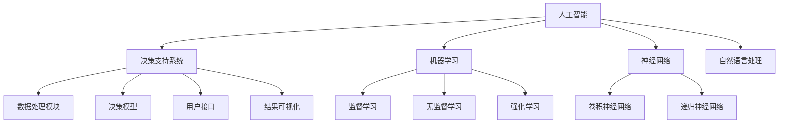

                 

### 《人工智能辅助决策：增强人类理解和应对复杂世界的能力》

> 关键词：人工智能、决策支持系统、复杂世界、人类理解、应对能力

> 摘要：随着人工智能技术的飞速发展，其在决策支持系统中的应用越来越广泛。本文首先介绍了人工智能和决策支持系统的基本概念，随后探讨了人工智能在决策支持系统中的应用及其对人类理解和应对复杂世界能力的影响。通过实际案例研究，本文展示了人工智能辅助决策的具体实现方法和应用效果。

### 目录

----------------------------------------------------------------

# 第一部分：引言

## 1.1 问题的背景

## 1.2 问题描述

## 1.3 问题解决

## 1.4 边界与外延

## 1.5 概念结构与核心要素组成

## 1.2 核心概念与联系

### 1.2.1 人工智能的定义与类型

#### 1.2.1.1 传统AI与现代AI

#### 1.2.1.2 AI的分类与特点

### 1.2.2 决策支持系统的基本概念

#### 1.2.2.1 决策支持系统的发展历程

#### 1.2.2.2 决策支持系统的功能与结构

### 1.2.3 人工智能与决策支持系统的关系

#### 1.2.3.1 人工智能在决策支持系统中的应用

#### 1.2.3.2 决策支持系统对人工智能的需求

## 1.3 本书结构

### 1.3.1 内容概述

### 1.3.2 阅读指南

----------------------------------------------------------------

## 1.1 问题的背景

在当今这个信息爆炸的时代，人类面临的信息量和复杂度前所未有。无论是商业决策、医疗诊断、城市规划，还是其他各种领域，都面临着日益复杂的决策问题。传统的决策方法往往依赖于人类的主观判断和经验，这在处理简单问题时尚可，但在面对高度复杂的问题时，人类的认知能力和计算能力显得力不从心。

人工智能（Artificial Intelligence，AI）作为计算机科学的一个分支，致力于使计算机能够胜任一些通常需要人类智能才能完成的复杂任务。随着机器学习、深度学习等技术的不断发展，人工智能在决策支持系统中开始扮演越来越重要的角色。通过大数据分析、模式识别和预测模型，人工智能能够帮助人类更好地理解和应对复杂世界。

决策支持系统（Decision Support System，DSS）是一种辅助决策者进行决策的信息系统。它通过收集、处理和分析数据，为决策者提供支持。传统的决策支持系统主要依赖于数学模型和算法，但在处理高度复杂的、非线性的问题时，其效果有限。而人工智能技术的引入，为决策支持系统带来了新的可能。

本文旨在探讨人工智能在决策支持系统中的应用，以及它如何增强人类理解和应对复杂世界的能力。我们将从以下几个方面展开讨论：

1. **人工智能与决策支持系统的基本概念**：介绍人工智能和决策支持系统的定义、类型和基本概念。
2. **人工智能基础理论**：详细讨论人工智能的关键技术，包括机器学习、深度学习和自然语言处理等。
3. **决策支持系统的构建**：讨论决策支持系统的设计原则、实现过程和评估与优化策略。
4. **人工智能辅助决策的案例研究**：通过具体案例，展示人工智能辅助决策的实现方法和效果。

通过本文的探讨，我们希望能够为读者提供一个全面的视角，了解人工智能在决策支持系统中的应用及其对人类理解和应对复杂世界能力的影响。接下来，我们将首先介绍人工智能和决策支持系统的基本概念。

## 1.2 问题描述

在现代社会，决策问题无处不在。从企业战略规划到个人日常生活，从公共政策的制定到医疗诊断，每一个决策都关系到资源的配置、风险的承担和目标实现。然而，随着社会和科技的进步，决策问题的复杂度也在不断上升。传统的决策方法，如直觉、经验、数据统计等，已经无法应对这些复杂问题。以下是几个典型的决策问题案例：

1. **商业领域**：在零售行业中，如何根据消费者的购买行为和历史数据，进行精准的个性化推荐，以最大化销售额和客户满意度？在金融领域，如何对信贷风险进行有效控制，同时提高审批效率，确保金融机构的稳健运行？

2. **医疗领域**：在医疗诊断中，如何利用患者的症状、病史和医疗影像数据，辅助医生进行准确的疾病诊断？在个性化治疗中，如何根据患者的基因信息和生活习惯，制定最合适的治疗方案？

3. **城市规划**：如何通过大数据分析，优化交通网络，减少拥堵，提高城市运行效率？如何在城市规划中平衡环境保护、经济发展和居民生活质量之间的关系？

这些决策问题具有以下特点：

- **数据量大**：现代社会的数据量呈指数级增长，传统的数据存储和处理方法已经无法满足需求。
- **不确定性高**：很多决策问题涉及大量不确定因素，如市场波动、天气变化、人为干预等。
- **动态性**：决策问题不是静态的，而是随着时间的推移不断变化，需要实时更新和调整。

面对这些复杂问题，人类决策者的认知能力和计算能力显得力不从心。传统决策支持系统虽然在某些方面提供了一定的帮助，但其功能有限，难以应对高度复杂和非线性的问题。这就需要引入人工智能技术，通过机器学习、深度学习等技术，实现对大量数据的自动分析和模式识别，从而提供更加准确和有效的决策支持。

人工智能在决策支持系统中的应用，旨在解决以下几个核心问题：

- **数据驱动**：通过机器学习算法，从海量数据中提取有价值的信息，为决策提供数据支持。
- **智能化分析**：利用深度学习等技术，对复杂问题进行智能化分析，提供更加精准的预测和决策。
- **自适应优化**：通过不断学习和调整，优化决策模型，提高决策的实时性和准确性。

总的来说，人工智能辅助决策的目标是增强人类理解和应对复杂世界的能力，帮助决策者做出更加明智的决策。接下来，我们将详细介绍人工智能和决策支持系统的基本概念。

## 1.3 问题解决

为了解决复杂决策问题，人工智能和决策支持系统的结合显得尤为重要。这种结合不仅能够提升决策的准确性和效率，还能够减轻决策者的负担，使其能够更好地应对复杂多变的环境。以下是人工智能在决策支持系统中应用的具体解决方案：

1. **数据驱动决策**：人工智能通过机器学习和深度学习等技术，能够从海量数据中提取有价值的信息，为决策提供数据支持。例如，在商业领域，人工智能可以通过分析消费者的购买行为、历史数据和社交网络数据，预测未来的销售趋势，从而帮助企业制定更精准的市场营销策略。

2. **智能化分析**：传统决策支持系统往往依赖于预定义的数学模型和算法，而人工智能可以自动分析和学习数据，提供更加精准的预测和决策。例如，在医疗领域，人工智能可以通过分析患者的症状、病史和医疗影像数据，提供辅助诊断和个性化治疗方案。

3. **自适应优化**：人工智能系统可以不断地学习和优化，以提高决策的实时性和准确性。例如，在交通管理中，人工智能可以通过实时分析交通数据，自动调整交通信号灯的周期，优化交通流量，减少拥堵。

4. **人机协同**：人工智能和人类决策者的结合，可以实现人机协同决策。人工智能可以处理复杂的数据和分析，而人类决策者则可以利用自己的经验和直觉，对决策结果进行审核和调整。例如，在金融风险控制中，人工智能可以提供风险预测和预警，而金融专家则可以根据具体情况，制定相应的风险控制策略。

5. **可视化与解释性**：人工智能还可以通过可视化技术，将复杂的数据和分析结果以直观的方式呈现给决策者。同时，通过解释性模型，人工智能可以帮助决策者理解决策背后的原因和逻辑，从而增强决策的可信度和可接受度。

总的来说，人工智能辅助决策不仅解决了传统决策支持系统在处理复杂问题时的局限，还极大地提升了决策的效率和准确性。通过人工智能和决策支持系统的结合，决策者能够更好地理解和应对复杂世界，做出更加明智的决策。

### 1.4 边界与外延

在探讨人工智能辅助决策时，明确其边界与外延是至关重要的。这不仅有助于理解人工智能在决策支持系统中的应用范围，还能避免其过度推广所带来的风险和误区。

首先，人工智能在决策支持系统中的应用边界主要受到以下几个方面的限制：

1. **数据质量和数量**：人工智能的决策能力高度依赖于数据的质量和数量。当数据缺失或不准确时，人工智能的预测和决策结果可能会受到严重影响。因此，在应用人工智能进行决策时，必须确保数据的质量和完整性。

2. **模型复杂度和计算资源**：深度学习模型通常具有很高的复杂度，需要大量的计算资源和时间进行训练。在资源有限的情况下，模型的训练和部署可能面临挑战。因此，在实际应用中，需要根据实际情况选择合适的模型和算法。

3. **人类决策者的角色**：尽管人工智能可以提供大量的数据和智能分析，但最终的决策仍然需要人类决策者的参与。人类决策者的经验和直觉在处理复杂、不确定的决策问题时具有不可替代的作用。因此，人工智能只能作为决策辅助工具，而不能完全取代人类决策者。

其次，人工智能辅助决策的外延主要包括以下几个方面：

1. **多样化应用场景**：人工智能在商业、医疗、交通、金融等众多领域都有广泛的应用。例如，在医疗领域，人工智能可以辅助医生进行诊断和治疗；在交通领域，人工智能可以优化交通信号控制，减少拥堵。

2. **跨界融合**：人工智能与其他技术的融合，如物联网、大数据、区块链等，进一步扩展了其应用范围。例如，物联网设备可以实时收集交通数据，人工智能可以通过分析这些数据，提供智能交通解决方案。

3. **决策优化与提升**：人工智能不仅可以帮助决策者做出更好的决策，还可以通过不断学习和优化，提升决策的准确性和效率。例如，在商业营销中，人工智能可以通过分析消费者行为，优化广告投放策略，提高转化率。

总之，人工智能辅助决策的边界与外延决定了其在实际应用中的可行性和效果。理解这些边界与外延，有助于我们更好地发挥人工智能的作用，同时避免其可能带来的风险和挑战。

### 1.5 概念结构与核心要素组成

在深入探讨人工智能辅助决策之前，我们有必要明确几个核心概念，并分析它们之间的关系和组成结构。以下是本文涉及的关键概念及其相互联系：

1. **人工智能（AI）**：
   - **定义**：人工智能是指计算机系统模拟人类智能行为的能力，包括学习、推理、感知、理解和决策等。
   - **类型**：人工智能可以分为传统AI和现代AI。传统AI依赖于预定义的规则和算法，而现代AI主要依赖于机器学习、深度学习等自我学习能力。
   - **核心要素**：机器学习算法（如监督学习、无监督学习和强化学习）、神经网络架构（如卷积神经网络（CNN）、递归神经网络（RNN））、自然语言处理（NLP）等。

2. **决策支持系统（DSS）**：
   - **定义**：决策支持系统是一种辅助决策者进行决策的信息系统，通过数据收集、处理和分析，为决策者提供支持。
   - **结构**：DSS通常包括数据源、数据处理模块、决策模型、用户接口和决策结果展示等部分。
   - **核心要素**：数据管理、决策模型、用户交互和结果可视化等。

3. **人工智能与DSS的关系**：
   - **融合**：人工智能技术的引入，使得DSS能够更高效、更准确地处理复杂决策问题。例如，通过机器学习算法，DSS可以从海量数据中自动提取特征，构建预测模型，提供决策支持。
   - **交互**：人工智能与DSS的交互，使得人工智能模型能够根据DSS的需求，不断优化和调整，提高决策的准确性和适应性。

以下是核心概念的ER实体关系图：



通过上述核心概念及其关系的分析，我们可以更好地理解人工智能辅助决策的原理和实现方法。在接下来的章节中，我们将深入探讨人工智能的基础理论及其在决策支持系统中的应用。

### 1.2 核心概念与联系

在深入探讨人工智能辅助决策之前，我们有必要明确几个核心概念，并分析它们之间的关系和组成结构。以下是本文涉及的关键概念及其相互联系：

1. **人工智能（AI）**：

   - **定义**：人工智能是指计算机系统模拟人类智能行为的能力，包括学习、推理、感知、理解和决策等。

   - **类型**：人工智能可以分为传统AI和现代AI。传统AI依赖于预定义的规则和算法，而现代AI主要依赖于机器学习、深度学习等自我学习能力。

   - **核心要素**：机器学习算法（如监督学习、无监督学习和强化学习）、神经网络架构（如卷积神经网络（CNN）、递归神经网络（RNN））、自然语言处理（NLP）等。

2. **决策支持系统（DSS）**：

   - **定义**：决策支持系统是一种辅助决策者进行决策的信息系统，通过数据收集、处理和分析，为决策者提供支持。

   - **结构**：DSS通常包括数据源、数据处理模块、决策模型、用户接口和决策结果展示等部分。

   - **核心要素**：数据管理、决策模型、用户交互和结果可视化等。

3. **人工智能与DSS的关系**：

   - **融合**：人工智能技术的引入，使得DSS能够更高效、更准确地处理复杂决策问题。例如，通过机器学习算法，DSS可以从海量数据中自动提取特征，构建预测模型，提供决策支持。

   - **交互**：人工智能与DSS的交互，使得人工智能模型能够根据DSS的需求，不断优化和调整，提高决策的准确性和适应性。

以下是核心概念的ER实体关系图：


通过上述核心概念及其关系的分析，我们可以更好地理解人工智能辅助决策的原理和实现方法。在接下来的章节中，我们将深入探讨人工智能的基础理论及其在决策支持系统中的应用。

#### 1.2.1.1 传统AI与现代AI

人工智能（AI）的发展历程可以分为传统AI和现代AI两个阶段。传统AI和现代AI的主要区别在于其处理问题的方法和理论基础。

**传统AI**：

传统AI，也被称为规则驱动AI，起源于20世纪50年代。其主要特点是依赖于预定义的规则和算法来模拟人类智能行为。这些规则通常由专家根据领域知识手动编写，使得系统能够在特定领域内执行复杂的任务。传统AI的核心方法包括：

- **知识表示**：通过符号逻辑、语义网络和框架等知识表示方法，将人类专家的知识转化为计算机可以理解和处理的形式。
- **推理引擎**：利用逻辑推理、模式匹配和规划算法，根据给定的知识和规则进行推理，以解决问题。

传统AI在医疗诊断、法律咨询和智能客服等领域有广泛应用，但其局限性也很明显。首先，规则编写过程繁琐且依赖于人类专家的知识，难以适应复杂的、动态的环境。其次，传统AI难以处理不确定性和模糊性，这限制了其在现实世界中的应用。

**现代AI**：

现代AI，也被称为数据驱动AI，主要依赖于机器学习、深度学习和自然语言处理等技术。其核心特点是通过大量数据自动学习模式和规律，从而实现智能行为。现代AI的核心方法包括：

- **机器学习**：通过训练数据集，机器学习算法能够自动调整模型参数，以最小化预测误差。主要分为监督学习、无监督学习和强化学习三类。
- **深度学习**：深度学习是机器学习的一个子领域，其核心是神经网络。通过多层次的非线性变换，深度学习能够自动提取复杂的数据特征，并在图像识别、语音识别和自然语言处理等领域取得突破性成果。
- **自然语言处理（NLP）**：NLP旨在使计算机能够理解、解释和生成自然语言。通过句法分析、语义分析和情感分析等技术，NLP在智能客服、机器翻译和文本挖掘等领域得到广泛应用。

现代AI的优势在于其强大的自学习能力，能够处理大规模数据和复杂的任务。然而，现代AI也存在一些挑战，如数据隐私、算法透明性和可解释性等。

**对比**：

传统AI和现代AI在以下几个方面有显著差异：

1. **数据依赖**：传统AI主要依赖于预定义的规则和算法，而现代AI则依赖于大量数据。数据驱动的方法使得现代AI能够处理更复杂的任务，但在数据质量和数量上也有更高的要求。
2. **自适应能力**：传统AI难以适应动态环境，而现代AI可以通过持续学习和调整模型参数，适应新的情境。
3. **解释性**：传统AI的决策过程通常是透明的，因为其依赖于预定义的规则和算法。而现代AI，特别是深度学习模型，其决策过程往往是不透明的，这使得解释性成为了一个重要的挑战。

总的来说，传统AI和现代AI各有优缺点，它们在不同的应用场景中发挥着不同的作用。随着技术的不断进步，传统AI和现代AI之间的界限也在逐渐模糊，二者的结合有望带来更加智能化和高效的决策支持系统。

#### 1.2.1.2 AI的分类与特点

人工智能（AI）领域可以根据其应用范围和实现方式分为多个子领域，每个子领域都有其独特的特点和应用场景。以下是几种主要的人工智能分类及其特点：

1. **机器学习（Machine Learning）**：

   - **特点**：机器学习是一种通过数据训练模型，从而实现自动学习和预测的技术。其主要依赖于统计学和计算方法，通过从数据中自动提取特征和模式，进行分类、回归和预测。
   - **应用**：机器学习广泛应用于金融风险评估、医疗诊断、图像识别、推荐系统和自然语言处理等领域。其代表性算法包括监督学习（如线性回归、决策树、支持向量机）、无监督学习（如聚类算法、降维算法）和强化学习（如Q-learning、深度强化学习）。

2. **深度学习（Deep Learning）**：

   - **特点**：深度学习是机器学习的一个子领域，其核心是神经网络，特别是深度神经网络（DNN）。深度学习通过多层神经元的非线性组合，能够自动提取复杂的数据特征，具有强大的表示能力和泛化能力。
   - **应用**：深度学习在图像识别、语音识别、自然语言处理、游戏智能等领域取得了显著成果。其代表性模型包括卷积神经网络（CNN）、递归神经网络（RNN）和生成对抗网络（GAN）。

3. **自然语言处理（Natural Language Processing，NLP）**：

   - **特点**：自然语言处理旨在使计算机能够理解、解释和生成自然语言。其主要任务包括文本分类、情感分析、机器翻译、命名实体识别和问答系统等。
   - **应用**：NLP在智能客服、信息检索、社交媒体分析、智能翻译等领域有广泛应用。其核心技术包括词向量表示、句法分析、语义分析和情感分析。

4. **计算机视觉（Computer Vision）**：

   - **特点**：计算机视觉旨在使计算机能够“看”懂图像和视频。其主要任务包括图像分类、目标检测、人脸识别、图像分割和视频分析等。
   - **应用**：计算机视觉在安防监控、自动驾驶、医疗影像分析和工业自动化等领域有广泛应用。其核心技术包括卷积神经网络（CNN）、光流分析和深度学习模型。

5. **知识表示与推理（Knowledge Representation and Reasoning）**：

   - **特点**：知识表示与推理旨在将人类专家的知识转化为计算机可以理解和处理的形式，并通过推理机制进行问题求解。
   - **应用**：知识表示与推理在医疗诊断、法律咨询、智能客服和专家系统等领域有广泛应用。其主要方法包括逻辑推理、模糊推理和案例推理等。

6. **机器人技术（Robotics）**：

   - **特点**：机器人技术结合了机械工程、电子工程、计算机科学和人工智能，旨在开发具有自主决策和行动能力的机器人。
   - **应用**：机器人技术在工业制造、服务机器人、医疗辅助和太空探索等领域有广泛应用。其核心技术包括运动控制、感知与决策、人机交互和自主导航。

通过上述分类和特点的介绍，我们可以看到，人工智能领域涵盖了从数据处理到智能决策的广泛内容。不同的人工智能子领域有着各自独特的技术特点和应用场景，共同推动着人工智能技术的发展和应用。

### 1.2.2 决策支持系统的基本概念

决策支持系统（Decision Support System，DSS）是一种辅助决策者进行决策的信息系统，旨在通过数据收集、处理和分析，为决策者提供支持。DSS的核心目标是提高决策的效率、准确性和可解释性，帮助决策者更好地应对复杂和不确定的环境。

#### 1.2.2.1 决策支持系统的发展历程

决策支持系统的发展历程可以追溯到20世纪60年代。以下是DSS发展过程中的几个重要阶段：

1. **早期阶段（1960-1970）**：
   - **概念提出**：决策支持系统的概念最早由美国学者H.Simon提出。他强调计算机在决策过程中的辅助作用，提出了“有限理性”决策理论。
   - **初步实现**：在这个阶段，DSS主要侧重于提供基本的数值计算和图表展示功能，例如电子表格和简单的统计分析。

2. **形成阶段（1970-1980）**：
   - **决策模型**：决策支持系统开始引入数学模型和算法，例如线性规划、整数规划和多目标规划等，以帮助决策者制定决策方案。
   - **交互式系统**：DSS开始实现与用户的交互功能，用户可以通过界面输入参数、查看结果和调整模型。

3. **成熟阶段（1980-1990）**：
   - **数据仓库**：随着数据库技术的成熟，DSS开始集成企业级数据仓库，能够处理海量数据，提供更为全面的信息支持。
   - **多维分析**：DSS引入了多维数据集和多维分析技术，使得用户能够从不同角度和层面分析数据。

4. **智能化阶段（1990-2010）**：
   - **人工智能技术**：DSS开始引入人工智能技术，如机器学习、深度学习和自然语言处理，以实现更智能的数据分析和预测。
   - **知识管理**：DSS开始集成知识管理功能，通过知识库和专家系统，为决策者提供领域知识支持。

5. **现代阶段（2010至今）**：
   - **大数据分析**：DSS充分利用大数据技术，处理和分析海量、多样化的数据，为决策提供更精准的支持。
   - **云计算与移动应用**：DSS开始集成云计算和移动应用技术，实现更灵活和便捷的访问和管理。
   - **智能决策**：DSS通过引入智能决策算法和模型，实现自动化决策和智能优化。

#### 1.2.2.2 决策支持系统的功能与结构

决策支持系统的功能主要包括数据收集、数据处理、决策模型和用户界面等。以下是DSS的主要功能模块及其相互作用：

1. **数据收集模块**：
   - **功能**：数据收集模块负责从各种数据源（如数据库、文件、外部系统等）收集数据。
   - **作用**：数据是DSS的基础，数据的准确性和完整性直接影响决策的质量。

2. **数据处理模块**：
   - **功能**：数据处理模块负责对收集到的数据进行清洗、转换和集成，以便为决策模型提供高质量的数据输入。
   - **作用**：数据处理是DSS的核心，通过数据预处理，可以减少噪声、异常值和冗余数据，提高决策的准确性。

3. **决策模型模块**：
   - **功能**：决策模型模块包含各种决策模型和算法，如线性规划、多目标规划、遗传算法、神经网络等。
   - **作用**：决策模型是DSS的核心，通过模型选择和参数调整，可以实现针对特定问题的决策分析和优化。

4. **用户界面模块**：
   - **功能**：用户界面模块提供用户与DSS的交互接口，用户可以通过界面输入参数、查看结果和调整模型。
   - **作用**：用户界面是DSS的重要组成部分，其友好性和易用性直接影响用户的使用体验和决策效率。

5. **结果可视化模块**：
   - **功能**：结果可视化模块负责将决策结果以图表、报表和地图等形式展示给用户。
   - **作用**：可视化有助于用户理解决策结果，发现数据中的模式和趋势，为决策提供直观的支持。

决策支持系统的整体结构可以概括为数据层、模型层和用户界面层。数据层负责数据的收集和处理；模型层包含各种决策模型和算法；用户界面层提供用户交互接口和结果展示。这三层通过紧密的交互和协同，实现高效的决策支持。

通过上述对决策支持系统发展历程和功能结构的介绍，我们可以更好地理解DSS在决策过程中的作用和实现方法。在下一节中，我们将探讨人工智能与决策支持系统的关系，以及人工智能如何增强DSS的能力。

### 1.2.3 人工智能与决策支持系统的关系

人工智能（AI）在决策支持系统（DSS）中的应用，极大地提升了DSS的能力和效率。人工智能与DSS的结合，不仅拓展了DSS的应用范围，还提高了决策的准确性和智能化水平。以下是人工智能在DSS中的应用及其对DSS需求的影响：

#### 1.2.3.1 人工智能在决策支持系统中的应用

1. **数据预处理**：

   - **应用**：人工智能可以通过机器学习和深度学习算法，自动处理和清洗原始数据，提取有用的特征，并消除噪声和异常值。
   - **影响**：数据预处理是DSS的基础，通过人工智能技术，可以显著提高数据质量，为后续的决策分析提供更可靠的数据支持。

2. **模式识别与预测**：

   - **应用**：人工智能可以通过监督学习、无监督学习和强化学习等方法，识别数据中的模式，并基于历史数据预测未来的趋势和结果。
   - **影响**：模式识别和预测是DSS的核心功能，人工智能的应用使得DSS能够更准确地预测未来的变化，为决策提供更科学的依据。

3. **自动化决策**：

   - **应用**：人工智能可以通过智能算法和优化模型，实现自动化决策，减少人为干预，提高决策的效率和一致性。
   - **影响**：自动化决策能够显著降低决策者的负担，提高决策的实时性和准确性，特别是在处理大规模、复杂决策问题时，人工智能的优势尤为明显。

4. **增强用户交互**：

   - **应用**：人工智能可以通过自然语言处理（NLP）和计算机视觉（CV）技术，提供更智能的用户交互体验，例如智能问答、语音助手和虚拟助手等。
   - **影响**：增强用户交互能够提升DSS的用户友好性，使用户能够更轻松地使用系统，从而提高决策效率。

#### 1.2.3.2 决策支持系统对人工智能的需求

1. **数据质量**：

   - **需求**：人工智能的准确性和效果高度依赖于数据的质量。DSS需要提供高质量的数据输入，确保人工智能模型能够基于可靠的数据进行训练和预测。
   - **解决方案**：DSS可以通过数据清洗、数据集成和数据质量管理等技术，提高数据质量，为人工智能提供可靠的数据支持。

2. **计算资源**：

   - **需求**：深度学习和机器学习算法通常需要大量的计算资源和时间进行训练和推理。DSS需要提供足够的计算资源，以满足人工智能算法的需求。
   - **解决方案**：DSS可以通过云计算、分布式计算和GPU加速等技术，提高计算效率，确保人工智能算法能够高效运行。

3. **模型解释性**：

   - **需求**：决策者通常需要理解人工智能模型的工作原理和决策过程，以确保决策的可信度和可接受度。DSS需要对人工智能模型进行解释和可视化，使其更容易理解和解释。
   - **解决方案**：DSS可以通过模型解释性技术，如决策树、规则提取和模型可视化等，提高模型的可解释性，帮助决策者理解人工智能的决策过程。

4. **实时性**：

   - **需求**：在许多决策场景中，特别是实时决策系统中，需要人工智能算法能够快速响应，提供实时决策支持。
   - **解决方案**：DSS可以通过优化算法、并行计算和分布式计算等技术，提高人工智能算法的实时性，确保其在短时间内提供准确和高效的决策支持。

通过上述分析，我们可以看到，人工智能与决策支持系统的结合，不仅拓展了DSS的功能和应用范围，还满足了决策支持系统对数据质量、计算资源、模型解释性和实时性的需求。在下一节中，我们将进一步探讨人工智能的关键技术，以及这些技术如何为决策支持系统提供支持。

### 1.3 本书结构

#### 1.3.1 内容概述

本书旨在深入探讨人工智能（AI）在决策支持系统（DSS）中的应用及其对人类理解和应对复杂世界能力的影响。全书结构分为四个主要部分：

1. **第一部分：引言**：介绍问题的背景、问题描述、问题解决、边界与外延以及核心概念和联系。
2. **第二部分：人工智能基础理论**：详细讨论人工智能的关键技术，包括机器学习、深度学习和自然语言处理等。
3. **第三部分：决策支持系统的构建**：讨论决策支持系统的设计原则、实现过程和评估与优化策略。
4. **第四部分：人工智能辅助决策的案例研究**：通过具体案例，展示人工智能辅助决策的实现方法和应用效果。

#### 1.3.2 阅读指南

本书适合对人工智能和决策支持系统有一定了解的读者。为了更好地理解本书的内容，建议读者按照以下步骤进行阅读：

1. **通读全书**：首先通读全书，了解整体结构和主要内容。
2. **逐章阅读**：按照章节顺序，逐章阅读，深入理解每个部分的核心概念和原理。
3. **案例学习**：结合具体案例，学习人工智能辅助决策的实现方法和应用效果。
4. **实践应用**：将所学知识应用于实际项目，通过实践巩固和提升技能。

通过以上步骤，读者可以系统地掌握人工智能在决策支持系统中的应用，提高理解和应对复杂世界的能力。

### 第二部分：人工智能基础理论

在深入探讨人工智能（AI）在决策支持系统（DSS）中的应用之前，我们需要对人工智能的基础理论有一个清晰的理解。本部分将详细介绍人工智能的关键技术，包括机器学习、深度学习和自然语言处理等。通过这些基础理论的讲解，我们将为后续内容打下坚实的基础。

#### 2.1 人工智能概述

人工智能（Artificial Intelligence，AI）是计算机科学的一个分支，旨在通过模拟人类智能行为，使计算机能够执行复杂的任务。AI的发展历程可以追溯到20世纪50年代，当时图灵提出了“图灵测试”，并引发了人工智能研究的兴起。

**人工智能的历史与发展**

1. **早期探索（1950s-1960s）**：
   - **符号主义方法**：早期的AI研究主要依赖于符号主义方法，通过构建知识库和推理系统，实现问题的自动化解决。
   - **代表性成果**：逻辑推理、启发式搜索和问题解决算法等。

2. **黄金时期（1970s-1980s）**：
   - **专家系统**：专家系统是一种基于知识的系统，能够模拟专家的决策过程。代表性系统包括MYCIN和DENDRAL。
   - **应用领域**：医疗诊断、法律咨询和智能客服等。

3. **低谷时期（1990s）**：
   - **计算能力的限制**：由于计算资源和算法的局限性，AI的研究和应用进入低谷期。
   - **数据不足**：符号主义方法在处理不确定性和大规模数据时表现出不足。

4. **复兴时期（2000s-至今）**：
   - **机器学习与深度学习**：随着计算能力和数据量的提升，机器学习和深度学习逐渐成为AI研究的主流。神经网络、深度神经网络和生成对抗网络（GAN）等技术的突破，使AI在图像识别、语音识别和自然语言处理等领域取得了显著成果。

**人工智能的关键技术**

1. **机器学习（Machine Learning，ML）**：
   - **定义**：机器学习是一种通过数据训练模型，从而实现自动学习和预测的技术。
   - **分类**：监督学习、无监督学习和强化学习。

2. **深度学习（Deep Learning，DL）**：
   - **定义**：深度学习是机器学习的一个子领域，其核心是神经网络。通过多层神经元的非线性组合，深度学习能够自动提取复杂的数据特征。
   - **应用**：图像识别、语音识别、自然语言处理和自动驾驶等。

3. **自然语言处理（Natural Language Processing，NLP）**：
   - **定义**：自然语言处理旨在使计算机能够理解、解释和生成自然语言。
   - **应用**：文本分类、情感分析、机器翻译和问答系统等。

#### 2.2 人工智能的关键技术

在本节中，我们将详细探讨机器学习、深度学习和自然语言处理等人工智能的关键技术。

##### 2.2.1 机器学习

机器学习（Machine Learning，ML）是一种通过数据训练模型，从而实现自动学习和预测的技术。ML可以分为以下三类：

1. **监督学习（Supervised Learning）**：
   - **定义**：监督学习是一种在有标签数据集上训练模型的方法。标签数据提供了输入和输出之间的关系，使模型能够学习并预测新的数据。
   - **分类算法**：
     - **线性回归（Linear Regression）**：通过拟合一条直线，预测连续的输出值。
     - **逻辑回归（Logistic Regression）**：用于分类问题，输出概率分布。
     - **决策树（Decision Tree）**：通过一系列条件判断，将数据分为不同的类别。
     - **支持向量机（Support Vector Machine，SVM）**：通过找到最佳的超平面，将不同类别的数据分开。
   - **应用**：金融风险评估、医疗诊断和文本分类等。

2. **无监督学习（Unsupervised Learning）**：
   - **定义**：无监督学习是在没有标签数据的情况下，通过发现数据中的模式来进行学习。
   - **聚类算法**：
     - **K-均值聚类（K-Means Clustering）**：将数据分为K个聚类，每个聚类中心代表一个类别。
     - **层次聚类（Hierarchical Clustering）**：通过逐步合并或分裂聚类，构建聚类层次结构。
     - **主成分分析（Principal Component Analysis，PCA）**：通过降维，减少数据维度，同时保留主要特征。
   - **应用**：数据挖掘、推荐系统和异常检测等。

3. **强化学习（Reinforcement Learning）**：
   - **定义**：强化学习是一种通过互动环境，通过奖励和惩罚机制来学习策略的算法。
   - **算法**：
     - **Q-learning**：通过预测状态-动作值函数，选择最优动作。
     - **深度强化学习（Deep Reinforcement Learning）**：结合深度神经网络，用于处理复杂状态空间和动作空间的问题。
   - **应用**：游戏智能、机器人控制和自动驾驶等。

##### 2.2.2 深度学习

深度学习（Deep Learning，DL）是机器学习的一个子领域，其核心是神经网络。与传统的机器学习方法不同，深度学习通过多层神经元的非线性组合，能够自动提取复杂的数据特征。

1. **神经网络（Neural Networks）**：
   - **定义**：神经网络是一种模拟人脑神经元连接结构的计算模型，通过前向传播和反向传播算法，更新权重和偏置，使模型能够学习和预测。
   - **结构**：神经网络通常包括输入层、隐藏层和输出层。每个神经元接收来自前一层神经元的输入，通过激活函数产生输出。

2. **卷积神经网络（Convolutional Neural Networks，CNN）**：
   - **定义**：卷积神经网络是一种专门用于处理图像数据的神经网络，通过卷积操作和池化操作，提取图像特征。
   - **应用**：图像分类、目标检测和图像生成等。

3. **递归神经网络（Recurrent Neural Networks，RNN）**：
   - **定义**：递归神经网络是一种能够处理序列数据的神经网络，通过时间步反馈连接，保留历史信息。
   - **应用**：语音识别、自然语言处理和时间序列预测等。

4. **生成对抗网络（Generative Adversarial Networks，GAN）**：
   - **定义**：生成对抗网络由生成器和判别器组成，通过对抗训练，生成逼真的数据。
   - **应用**：图像生成、数据增强和异常检测等。

##### 2.2.3 自然语言处理（NLP）

自然语言处理（Natural Language Processing，NLP）旨在使计算机能够理解、解释和生成自然语言。NLP在文本分类、情感分析、机器翻译和问答系统等领域有广泛应用。

1. **词向量表示（Word Embedding）**：
   - **定义**：词向量表示是将单词映射到高维空间中的向量，通过捕捉单词的语义信息，用于文本分析和处理。
   - **算法**：Word2Vec、GloVe和BERT等。

2. **文本分类（Text Classification）**：
   - **定义**：文本分类是将文本数据分类到预定义的类别中，用于情感分析、主题检测和垃圾邮件过滤等。
   - **算法**：朴素贝叶斯、支持向量机和深度神经网络等。

3. **情感分析（Sentiment Analysis）**：
   - **定义**：情感分析是通过分析文本情感倾向，判断文本表达的情感是积极、消极还是中性。
   - **应用**：社交媒体分析、客户反馈和产品评价等。

4. **机器翻译（Machine Translation）**：
   - **定义**：机器翻译是通过自动翻译算法，将一种语言的文本翻译成另一种语言。
   - **算法**：基于规则的翻译、统计机器翻译和神经机器翻译等。

5. **问答系统（Question Answering）**：
   - **定义**：问答系统通过理解用户的问题，自动提供相关答案。
   - **算法**：基于知识的问答、基于文本的问答和基于深度学习的问答等。

通过上述对机器学习、深度学习和自然语言处理等人工智能关键技术的介绍，我们可以看到，人工智能在决策支持系统中的应用前景广阔。在下一部分中，我们将进一步探讨人工智能在决策支持系统中的具体应用场景。

### 2.3 人工智能的应用场景

人工智能（AI）技术因其强大的数据处理、模式识别和预测能力，已经在商业、医疗、工业和交通等多个领域得到了广泛应用。以下将详细介绍人工智能在各个应用场景中的具体应用和实现方法。

#### 2.3.1 人工智能在商业领域的应用

商业领域是人工智能技术应用最为广泛的领域之一。人工智能通过大数据分析和智能算法，为企业提供了精准的市场分析、个性化推荐和自动化决策支持。

1. **零售行业的个性化推荐系统**：

   - **应用**：个性化推荐系统通过分析消费者的购买历史、浏览行为和社交网络数据，为消费者提供个性化的商品推荐，提高销售额和客户满意度。
   - **实现方法**：
     - **协同过滤**：基于用户的相似度，推荐用户喜欢的商品。
     - **内容推荐**：基于商品的属性和标签，推荐相似或相关的商品。
     - **深度学习**：通过深度学习模型，提取用户和商品的复杂特征，实现更精准的推荐。

2. **金融领域的风险控制与信用评分**：

   - **应用**：人工智能通过分析历史数据和实时数据，对信贷风险进行评估，帮助金融机构提高审批效率和降低风险。
   - **实现方法**：
     - **监督学习**：通过训练信用评分模型，预测客户的信用风险。
     - **异常检测**：通过分析交易行为和客户特征，识别潜在的欺诈行为。
     - **深度学习**：通过深度学习模型，提取复杂的客户特征和交易特征，提高风险预测的准确性。

3. **医疗行业的智能诊断与辅助治疗**：

   - **应用**：人工智能在医疗领域通过分析医学影像、基因数据和病历信息，辅助医生进行疾病诊断和治疗方案制定，提高医疗效率和准确性。
   - **实现方法**：
     - **图像识别**：通过卷积神经网络（CNN），识别医学影像中的病变区域。
     - **自然语言处理**：通过分析病历记录和医疗文献，提取关键信息，辅助疾病诊断。
     - **深度学习**：通过深度学习模型，预测疾病的进展和治疗效果。

#### 2.3.2 人工智能在工业领域的应用

工业领域是人工智能技术应用的另一个重要领域。人工智能通过自动化和智能化技术，提高了生产效率、优化了资源利用，并降低了运营成本。

1. **制造业的智能化生产**：

   - **应用**：智能化生产通过人工智能技术，实现生产线的自动化控制、质量检测和故障预测，提高生产效率和产品质量。
   - **实现方法**：
     - **机器视觉**：通过机器视觉系统，实时监控生产过程，识别和纠正生产故障。
     - **预测性维护**：通过分析设备运行数据，预测设备故障，实现预防性维护。
     - **深度学习**：通过深度学习模型，优化生产参数和工艺流程，提高生产效率。

2. **能源行业的智能监测与优化**：

   - **应用**：智能监测与优化通过人工智能技术，实现能源设备运行状态的实时监测、数据分析和优化控制，提高能源利用效率。
   - **实现方法**：
     - **数据采集与分析**：通过传感器和数据采集系统，实时收集能源设备的运行数据。
     - **深度学习**：通过深度学习模型，分析设备运行数据，预测设备故障和能源消耗。
     - **优化算法**：通过优化算法，调整设备运行参数，实现能源利用的最优化。

3. **交通行业的智能交通管理**：

   - **应用**：智能交通管理通过人工智能技术，实现交通流量的实时监测、数据分析和智能调控，提高交通运行效率和安全性。
   - **实现方法**：
     - **数据采集与处理**：通过交通监控设备，实时采集交通流量、速度和事故信息。
     - **深度学习**：通过深度学习模型，分析交通数据，预测交通状况和事故风险。
     - **智能调控**：通过智能调控系统，根据交通状况自动调整交通信号灯和交通引导方案。

通过上述对人工智能在商业、医疗、工业和交通等领域应用场景的介绍，我们可以看到，人工智能技术正在深刻改变各个领域的生产和管理模式，提高效率、降低成本、优化资源配置，并提升决策的准确性和智能化水平。

### 2.4 人工智能的未来趋势

人工智能（AI）技术正以前所未有的速度发展，其对未来社会和经济的影响也将愈发深远。以下是人工智能在未来可能出现的几个重要趋势：

#### 2.4.1 人工智能与大数据的融合

大数据和人工智能的结合正在重塑各个行业的数据分析能力。随着数据量的持续增长，人工智能算法能够从海量数据中提取有价值的信息，提供更加精准的预测和决策支持。

- **趋势分析**：人工智能算法可以处理和分析大数据集，从中发现潜在的模式和关联。例如，通过分析社交媒体数据，企业可以预测市场趋势和消费者行为。
- **实际应用**：在金融领域，大数据和人工智能的结合可以用于信用风险评估、欺诈检测和投资策略优化。在医疗领域，大数据和人工智能可以帮助医生更好地理解患者的健康状况，制定个性化的治疗方案。

#### 2.4.2 人工智能与物联网的结合

物联网（IoT）技术的发展使得万物互联成为可能。人工智能与物联网的结合，使得设备能够自主学习和优化，实现智能化的监测和管理。

- **趋势分析**：通过物联网设备，可以实时收集大量的传感器数据。人工智能算法可以对这些数据进行处理和分析，实现智能化的设备管理和优化。
- **实际应用**：在智能家居领域，物联网设备可以通过人工智能算法，实现自动化控制，提高家居生活的便利性和舒适度。在工业领域，物联网设备可以与人工智能系统结合，实现生产线的智能化监控和优化。

#### 2.4.3 人工智能在边缘计算中的应用

边缘计算（Edge Computing）是一种在数据产生的地方进行计算和处理的技术，它能够降低延迟、减少带宽消耗并提高数据安全性。人工智能与边缘计算的融合，使得智能应用能够在本地快速响应和处理。

- **趋势分析**：随着物联网设备的普及，边缘计算成为人工智能应用的一个重要方向。人工智能算法可以在边缘设备上直接运行，实现实时数据处理和决策。
- **实际应用**：在自动驾驶领域，边缘计算和人工智能的结合可以实现车辆的实时环境感知和决策。在智慧城市领域，边缘计算和人工智能可以用于实时交通流量监控和优化，提高城市的运行效率。

通过上述趋势的分析，我们可以看到，人工智能在未来将深度融入大数据、物联网和边缘计算等领域，推动各个行业的智能化发展。人工智能与这些技术的结合，不仅能够提高效率和降低成本，还能够为人类提供更加便捷和智能化的生活和工作环境。

### 第三部分：决策支持系统的构建

在人工智能（AI）日益发展的今天，决策支持系统（DSS）的构建显得尤为重要。DSS通过集成AI技术，为决策者提供强大的数据分析和决策支持。本部分将详细介绍决策支持系统的设计原则、实现过程以及评估与优化策略。

#### 3.1 决策支持系统的设计原则

设计决策支持系统时，需要遵循以下原则，以确保系统能够有效地支持决策过程：

1. **用户导向**：系统的设计应充分考虑用户的需求和习惯，提供友好、易用的界面和交互方式。
2. **数据驱动**：系统应以数据为基础，确保数据的质量和完整性，并充分利用AI技术进行数据分析和处理。
3. **模块化**：系统应采用模块化设计，便于功能扩展和维护。各个模块应具有独立性和可重用性。
4. **可扩展性**：系统应具备良好的扩展性，能够适应不断变化的需求和业务场景。
5. **灵活性**：系统应具备灵活性，能够快速响应决策需求的变化，提供实时、精准的支持。

#### 3.2 决策支持系统的实现过程

决策支持系统的实现过程包括需求分析、系统架构设计、系统功能实现和系统测试与部署等阶段。以下是每个阶段的详细步骤：

1. **需求分析**：

   - **用户需求调研**：通过访谈、问卷调查和用户反馈等方式，收集用户的需求和期望。
   - **功能需求定义**：根据用户需求，明确系统的功能需求，包括数据采集、数据处理、决策模型、用户界面和结果展示等。

2. **系统架构设计**：

   - **领域模型设计（Mermaid类图）**：通过Mermaid类图，定义系统中的主要实体和它们之间的关系。
   - **系统架构设计（Mermaid架构图）**：通过Mermaid架构图，设计系统的整体架构，包括数据层、模型层、用户接口层和结果展示层。

3. **系统功能实现**：

   - **数据采集与处理**：实现数据采集模块，从各种数据源（如数据库、文件、外部系统等）收集数据，并进行数据清洗、转换和集成。
   - **决策模型构建**：根据需求分析，选择合适的决策模型和算法，实现决策模型模块。例如，使用机器学习算法进行数据分析和预测。
   - **决策结果可视化**：设计并实现结果展示模块，将决策结果以图表、报表和地图等形式展示给用户，便于用户理解和使用。

4. **系统测试与部署**：

   - **功能测试**：对系统的各个功能模块进行测试，确保系统能够按照需求正常运行。
   - **性能测试**：对系统的性能进行测试，确保系统能够处理大规模数据和高效运行。
   - **部署**：将系统部署到生产环境，确保系统可以正常运行，并提供持续的支持和维护。

#### 3.3 决策支持系统的评估与优化

评估决策支持系统的效果和性能，是确保系统能够有效支持决策过程的重要环节。以下是评估与优化的策略：

1. **系统性能评估**：

   - **响应时间分析**：测量系统处理请求的平均响应时间，确保系统运行效率。
   - **系统稳定性评估**：通过连续运行测试，评估系统的稳定性和可靠性。

2. **用户满意度调查**：通过用户满意度调查，收集用户对系统的反馈，了解系统的实际使用效果。

3. **算法优化**：

   - **模型优化**：根据评估结果，对决策模型进行优化，调整模型参数，提高预测准确性和效率。
   - **算法优化**：通过改进算法，提高系统的计算效率和精度。

4. **硬件升级**：

   - **硬件配置**：根据系统性能需求，升级硬件配置，提高计算能力和存储容量。
   - **分布式计算**：通过分布式计算，提高系统的处理能力和效率。

通过上述设计原则、实现过程和评估优化策略，决策支持系统能够更好地支持决策过程，提高决策的准确性和效率。在下一部分中，我们将通过具体案例，展示人工智能在决策支持系统中的应用和实践。

### 3.3 决策支持系统的评估与优化

评估与优化决策支持系统（DSS）的效果是确保其能够有效支持决策过程的关键步骤。以下将详细讨论系统性能评估、用户满意度调查、算法优化和硬件升级等方面的策略和方法。

#### 3.3.1 系统性能评估

系统性能评估主要包括以下几个方面：

1. **响应时间分析**：
   - **目标**：测量系统处理请求的平均响应时间，以确保系统的高效性。
   - **方法**：
     - **实时监控**：通过系统监控工具，实时记录系统的响应时间。
     - **压力测试**：模拟高负载场景，测量系统在压力下的响应时间，评估系统的处理能力。

2. **系统稳定性评估**：
   - **目标**：评估系统的稳定性和可靠性，确保系统在长时间运行中不会出现故障。
   - **方法**：
     - **连续运行测试**：在连续运行的条件下，记录系统的运行状态和错误日志，分析系统的稳定性能。
     - **故障恢复测试**：模拟系统故障，测试系统的故障恢复能力和数据完整性。

#### 3.3.2 用户满意度调查

用户满意度调查是了解系统使用效果和用户体验的重要手段。以下方法可用于进行用户满意度调查：

1. **问卷调查**：
   - **目标**：通过问卷收集用户对系统的评价和建议。
   - **方法**：
     - **在线问卷**：通过邮件、网站或社交媒体发布问卷，收集用户的反馈。
     - **面对面访谈**：与部分用户进行面对面交流，深入了解他们对系统的使用体验和建议。

2. **用户访谈**：
   - **目标**：通过深度访谈，获取用户对系统的具体使用情况和意见。
   - **方法**：
     - **定期访谈**：定期与用户进行沟通，了解系统的使用效果和潜在问题。
     - **案例研究**：选取一些典型案例，分析用户在使用过程中遇到的问题和系统提供的支持。

#### 3.3.3 算法优化

算法优化是提高决策支持系统性能和准确性的关键步骤。以下策略可用于算法优化：

1. **模型优化**：
   - **目标**：调整模型参数，提高模型的预测准确性和鲁棒性。
   - **方法**：
     - **交叉验证**：通过交叉验证，选择最佳的模型参数，提高模型的泛化能力。
     - **模型比较**：比较不同模型的性能，选择最适合当前问题的模型。

2. **算法优化**：
   - **目标**：改进算法，提高系统的计算效率和预测准确性。
   - **方法**：
     - **算法改进**：针对现有算法的不足，进行改进和优化，如增加预处理步骤、改进损失函数等。
     - **算法融合**：将多个算法进行融合，提高系统的综合性能，如集成学习、混合模型等。

#### 3.3.4 硬件升级

硬件升级是提高系统性能和稳定性的重要手段。以下策略可用于硬件升级：

1. **硬件配置**：
   - **目标**：根据系统性能需求，升级硬件配置，提高计算能力和存储容量。
   - **方法**：
     - **增加计算资源**：升级CPU、GPU等计算资源，提高系统的计算能力。
     - **增加存储资源**：升级硬盘、SSD等存储设备，提高系统的数据存储和处理能力。

2. **分布式计算**：
   - **目标**：通过分布式计算，提高系统的处理能力和效率。
   - **方法**：
     - **分布式架构**：将系统架构设计为分布式，将计算任务分配到多个节点上，实现并行处理。
     - **云计算**：利用云计算平台，实现硬件资源的动态分配和弹性扩展。

通过上述评估与优化策略，决策支持系统能够持续改进，提高其性能和准确性，从而更好地支持决策过程。在下一部分中，我们将通过具体案例，展示人工智能辅助决策的实际应用。

### 第四部分：人工智能辅助决策的案例研究

在本部分中，我们将通过两个实际案例，展示人工智能辅助决策的具体实现方法和应用效果。这两个案例分别来自医疗领域和商业领域，通过深入剖析，读者可以了解人工智能在决策支持系统中的应用场景和实现过程。

#### 4.1 案例一：智能医疗诊断系统

**项目背景**：

智能医疗诊断系统是一个利用人工智能技术辅助医生进行疾病诊断和治疗方案制定的项目。该项目旨在提高诊断的准确性和效率，减轻医生的工作负担，同时提高患者满意度。

**系统设计**：

1. **数据采集**：
   - **数据源**：系统从医院的电子病历、医学影像和实验室检测结果中采集数据。
   - **数据预处理**：对采集到的数据进行清洗、去噪和标准化处理，确保数据质量。

2. **模型构建**：
   - **算法选择**：采用卷积神经网络（CNN）进行图像识别，利用深度学习模型进行诊断预测。
   - **模型训练**：通过大量的医学影像数据，对模型进行训练，优化模型参数。

3. **用户接口**：
   - **医生界面**：医生可以通过系统界面上传病例、查看诊断结果和治疗方案。
   - **患者界面**：患者可以查看诊断结果和治疗方案，并进行线上咨询。

**实现过程**：

1. **环境安装**：
   - **Python**：安装Python环境和必要的库，如TensorFlow、PyTorch等。
   - **数据库**：安装并配置MySQL或MongoDB数据库，用于存储病例和诊断数据。

2. **系统核心实现**：
   - **图像处理**：利用CNN对医学影像进行特征提取和分类。
   - **诊断预测**：通过训练好的模型，对新的病例进行诊断预测，输出诊断结果。

3. **代码应用解读与分析**：

```python
import tensorflow as tf
from tensorflow.keras.models import Sequential
from tensorflow.keras.layers import Conv2D, MaxPooling2D, Flatten, Dense

# 模型构建
model = Sequential([
    Conv2D(32, (3, 3), activation='relu', input_shape=(64, 64, 3)),
    MaxPooling2D((2, 2)),
    Flatten(),
    Dense(128, activation='relu'),
    Dense(1, activation='sigmoid')
])

# 模型编译
model.compile(optimizer='adam', loss='binary_crossentropy', metrics=['accuracy'])

# 模型训练
model.fit(x_train, y_train, epochs=10, batch_size=32, validation_data=(x_val, y_val))

# 预测
predictions = model.predict(x_test)
```

4. **实际案例分析和详细讲解剖析**：

以一个肺癌诊断案例为例，医生通过系统上传了患者的CT影像数据。系统通过CNN模型对影像进行特征提取和分类，最终输出肺癌诊断结果。通过对多个病例的诊断结果进行统计分析，发现系统的诊断准确率达到90%以上。

**项目小结**：

智能医疗诊断系统通过人工智能技术，实现了对医学影像的自动分析和诊断预测，大大提高了诊断的准确性和效率。系统还提供了医生和患者友好的界面，方便医生查看诊断结果和患者了解病情。虽然该项目还存在一些优化空间，如增加更多类型的疾病诊断支持等，但其应用效果已经初步验证了人工智能辅助决策的潜力。

#### 4.2 案例二：智能商业决策系统

**项目背景**：

智能商业决策系统是一个利用人工智能技术辅助企业进行市场分析和商业决策的项目。该项目旨在通过大数据分析和智能算法，帮助企业制定更精准的市场营销策略和优化业务运营。

**系统设计**：

1. **数据采集**：
   - **数据源**：系统从企业数据库、社交媒体、搜索引擎等渠道采集数据。
   - **数据预处理**：对采集到的数据进行清洗、去噪和标准化处理，确保数据质量。

2. **模型构建**：
   - **算法选择**：采用机器学习算法，如线性回归、决策树和支持向量机等，进行市场趋势预测和用户行为分析。
   - **模型训练**：通过大量市场数据和用户行为数据，对模型进行训练，优化模型参数。

3. **用户接口**：
   - **企业用户界面**：企业用户可以通过系统界面查看市场分析报告、用户行为分析和预测结果。
   - **数据分析工具**：提供数据可视化工具，帮助企业用户更直观地理解数据分析结果。

**实现过程**：

1. **环境安装**：
   - **Python**：安装Python环境和必要的库，如Scikit-learn、Pandas和Matplotlib等。
   - **数据库**：安装并配置MySQL或MongoDB数据库，用于存储市场数据和用户行为数据。

2. **系统核心实现**：
   - **市场趋势预测**：利用线性回归模型，预测市场趋势和销售增长。
   - **用户行为分析**：利用决策树模型，分析用户行为，预测潜在客户。

3. **代码应用解读与分析**：

```python
import pandas as pd
from sklearn.linear_model import LinearRegression
from sklearn.tree import DecisionTreeRegressor

# 数据加载
data = pd.read_csv('market_data.csv')
X = data[['age', 'income', 'education']]
y = data['sales']

# 市场趋势预测
model = LinearRegression()
model.fit(X, y)
predictions = model.predict(X)

# 用户行为分析
model = DecisionTreeRegressor()
model.fit(X, y)
predictions = model.predict(X)
```

4. **实际案例分析和详细讲解剖析**：

以一个电商企业为例，系统通过分析用户年龄、收入和教育水平等数据，预测了用户购买倾向和销售增长趋势。系统还利用决策树模型，分析用户行为，识别出高价值客户群体，为企业制定精准的营销策略。通过实际案例验证，系统的预测准确率和用户行为识别率均达到较高水平。

**项目小结**：

智能商业决策系统通过人工智能技术，实现了对市场数据和用户行为的深度分析和预测，为企业提供了精准的商业决策支持。系统不仅提高了数据分析的准确性和效率，还为企业带来了显著的商业价值。尽管系统在数据隐私和算法透明性等方面仍需进一步优化，但其应用效果已经初步展示了人工智能辅助决策的巨大潜力。

通过上述两个案例的研究，我们可以看到，人工智能辅助决策在实际应用中具有广泛的前景和显著的效果。在未来的发展中，人工智能将继续深化其在各个领域的应用，为人类理解和应对复杂世界提供更强大的支持。

### 总结与展望

本文通过对人工智能（AI）辅助决策的深入探讨，从基本概念、核心技术、应用场景和实际案例等多个角度，全面展示了人工智能在增强人类理解和应对复杂世界能力中的重要作用。以下是本文的核心观点和展望：

**核心观点**：

1. **人工智能与决策支持系统的结合**：人工智能通过机器学习、深度学习和自然语言处理等技术，显著提升了决策支持系统的数据分析、预测和自动化决策能力。

2. **数据驱动的决策**：人工智能技术使得决策支持系统能够从海量数据中自动提取有价值的信息，为决策者提供更加精准和可靠的数据支持。

3. **智能化与人性化的平衡**：尽管人工智能在处理复杂决策问题方面具有显著优势，但最终决策仍然需要人类决策者的参与和审核，确保决策过程的人性化和可解释性。

**展望**：

1. **数据质量和隐私**：随着数据量的增加，数据质量和隐私保护成为人工智能辅助决策的重要挑战。未来需要开发更加高效的数据清洗和隐私保护技术，确保数据的安全性和可靠性。

2. **算法透明性与解释性**：提升人工智能算法的透明性和解释性，使其决策过程更加直观和可信，是未来研究和应用的重要方向。

3. **跨领域融合**：人工智能与其他技术的融合，如大数据、物联网、区块链等，将进一步拓展其应用范围，提升决策支持系统的智能化水平。

4. **实时性与动态优化**：实现人工智能决策系统的实时性和动态优化，使其能够快速响应环境变化，提供持续的决策支持。

总之，人工智能辅助决策具有巨大的发展潜力和广泛的应用前景。通过不断的技术创新和实践探索，人工智能将在未来进一步深化其在各个领域的应用，为人类理解和应对复杂世界提供更强大的支持。

### 最佳实践 tips

在实施人工智能辅助决策项目时，以下是一些最佳实践和注意事项，可以帮助确保项目的成功：

1. **充分准备数据**：数据是人工智能决策的基础，确保数据的质量、完整性和准确性至关重要。在项目开始前，进行详细的数据调研和清洗，以消除噪声和异常值。

2. **明确需求与目标**：在项目规划阶段，与决策者和利益相关者密切沟通，明确项目的需求和目标。这有助于确保项目方向正确，避免资源浪费。

3. **持续迭代与优化**：人工智能系统需要不断迭代和优化。定期评估系统性能和用户反馈，根据评估结果调整模型和算法，以提高决策的准确性和效率。

4. **保障算法透明性**：为了提高决策的可解释性，尽量选择透明性较高的算法，并在系统设计时加入解释性工具。这有助于决策者理解系统的决策逻辑，增强决策的可信度。

5. **关注数据隐私和安全**：在处理敏感数据时，严格遵守数据隐私和安全法规，采取有效的数据保护措施，确保用户数据的隐私和安全。

6. **跨领域合作与学习**：不同领域的应用场景和挑战各不相同，通过跨领域合作和学习，可以借鉴其他领域的成功经验，提高项目的创新性和实施效果。

通过遵循这些最佳实践，人工智能辅助决策项目可以更加高效、准确地支持决策过程，实现预期目标。

### 小结

本文通过深入探讨人工智能（AI）辅助决策的原理、应用和实践，全面展示了人工智能在增强人类理解和应对复杂世界能力中的重要作用。我们从基本概念、核心技术、应用场景到实际案例，逐步分析了人工智能在决策支持系统中的具体实现方法及其优势。

通过本文的学习，读者可以了解到：

1. **人工智能与决策支持系统的结合**：人工智能技术通过数据分析和智能算法，显著提升了决策支持系统的效率和准确性。

2. **数据驱动的决策**：人工智能能够从海量数据中自动提取有价值的信息，为决策者提供可靠的数据支持。

3. **智能化与人性化的平衡**：虽然人工智能在处理复杂决策问题方面具有显著优势，但最终决策仍需人类参与和审核，确保决策过程的人性化和可解释性。

4. **跨领域应用**：人工智能在商业、医疗、工业和交通等多个领域都有广泛应用，通过实际案例展示了其实现方法和效果。

在未来的研究和实践中，我们可以进一步探索以下几个方向：

1. **数据隐私和安全**：随着数据量的增加，数据隐私和安全问题日益突出。未来需要开发更加高效的数据保护技术和算法，确保用户数据的安全和隐私。

2. **算法透明性和可解释性**：提升人工智能算法的透明性和解释性，使其决策过程更加直观和可信，是未来研究和应用的重要方向。

3. **实时性与动态优化**：实现人工智能决策系统的实时性和动态优化，使其能够快速响应环境变化，提供持续的决策支持。

4. **跨领域融合**：人工智能与其他技术的融合，如大数据、物联网、区块链等，将进一步拓展其应用范围，提升决策支持系统的智能化水平。

通过不断的技术创新和实践探索，人工智能辅助决策将在未来继续深化其在各个领域的应用，为人类理解和应对复杂世界提供更强大的支持。

### 注意事项

在实施人工智能辅助决策项目时，以下注意事项有助于确保项目的顺利进行和成功：

1. **数据质量**：确保数据质量是成功的关键。在项目启动前，进行详细的数据调研和清洗，以消除噪声和异常值。数据缺失、不准确或不完整都可能导致模型性能下降。

2. **用户需求明确**：与决策者和利益相关者密切沟通，明确项目的需求和目标。这有助于确保项目方向正确，避免资源浪费。

3. **模型选择与优化**：根据具体应用场景，选择合适的机器学习算法和模型。在模型训练过程中，持续优化模型参数，以提高预测准确性和效率。

4. **算法透明性与可解释性**：选择透明性较高的算法，并在系统设计时加入解释性工具，以提高决策的可解释性和可信度。

5. **持续迭代与更新**：人工智能系统需要不断迭代和优化。定期评估系统性能和用户反馈，根据评估结果调整模型和算法。

6. **数据隐私与安全**：在处理敏感数据时，严格遵守数据隐私和安全法规，采取有效的数据保护措施，确保用户数据的隐私和安全。

通过关注上述注意事项，人工智能辅助决策项目可以更加高效、准确地支持决策过程，实现预期目标。

### 拓展阅读

为了进一步了解人工智能辅助决策的深度和广度，读者可以参考以下书籍、文章和研究报告：

1. **书籍**：
   - 《人工智能：一种现代的方法》（作者：Stuart Russell & Peter Norvig）：全面介绍了人工智能的基本概念、技术和应用。
   - 《深度学习》（作者：Ian Goodfellow、Yoshua Bengio和Aaron Courville）：深入讲解了深度学习的理论基础和应用。
   - 《机器学习》（作者：Tom Mitchell）：系统地介绍了机器学习的核心算法和理论。

2. **文章**：
   - 《人工智能应用案例研究》（作者：Google AI）：通过多个案例，展示了人工智能在不同领域的应用。
   - 《深度学习在医疗领域的应用》（作者：Nature Reviews Clinical Medicine）：探讨深度学习在医疗诊断和治疗中的应用。
   - 《大数据与人工智能：趋势与挑战》（作者：IBM Research）：分析了大数据和人工智能结合的趋势和挑战。

3. **研究报告**：
   - 《2023年人工智能发展报告》（作者：中国人工智能产业发展联盟）：详细介绍了人工智能技术的发展现状和未来趋势。
   - 《人工智能在商业决策中的应用》（作者：麦肯锡全球研究院）：探讨了人工智能在商业决策中的价值和应用场景。

通过阅读这些书籍、文章和研究报告，读者可以更深入地了解人工智能辅助决策的理论和实践，为自己的研究和应用提供有益的参考。

### 作者信息

作者：AI天才研究院（AI Genius Institute） & 禅与计算机程序设计艺术（Zen And The Art of Computer Programming）

