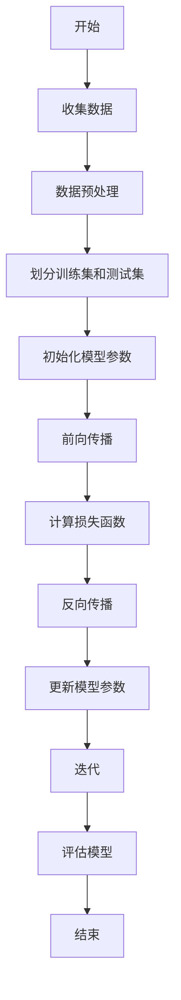
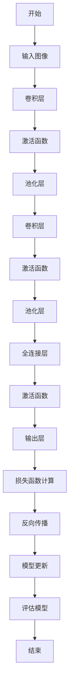
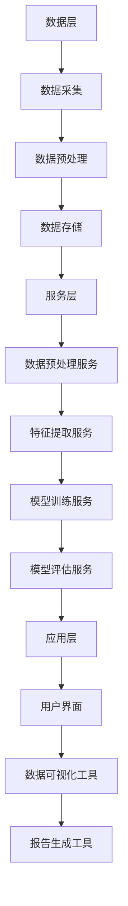

                 


# 人工智能驱动的科学发现方法：加速世界模型构建与验证的新途径

## 关键词：人工智能、科学发现、世界模型、算法、数学模型、系统架构

### 摘要：

随着人工智能技术的飞速发展，其在科学发现领域中的应用日益广泛，为世界模型的构建与验证提供了新的途径。本文旨在探讨人工智能如何驱动科学发现，加速世界模型的构建与验证，并详细解析相关算法原理、数学模型和系统架构设计。通过一步步的分析与推理，本文将引导读者深入了解这一领域的最新进展和应用前景。

### 目录

1. **引言**
   1.1 **人工智能与科学发现的交汇**
   1.2 **世界模型的概念与构成**
   1.3 **人工智能驱动的科学发现方法**
   1.4 **书籍概述与组织结构**

2. **核心概念与算法**
   2.1 **人工智能基础**
   2.2 **世界模型构建方法**
   2.3 **世界模型验证与评估**
   2.4 **人工智能驱动的科学发现案例研究**
   2.5 **算法原理与Mermaid流程图**
   2.6 **数学模型与公式讲解**

3. **系统架构与项目实战**
   3.1 **科学发现系统的设计原则**
   3.2 **系统架构设计**
   3.3 **项目实战**

4. **最佳实践与展望**
   4.1 **最佳实践**
   4.2 **小结与展望**

## 第一部分：引言

### 1.1 人工智能与科学发现的交汇

科学发现是推动科技进步和社会发展的关键动力，而人工智能作为一种新兴技术，正逐渐成为科学发现的有力工具。人工智能能够处理大量数据，识别复杂模式，从而辅助科学家探索未知领域。

### 1.2 世界模型的概念与构成

世界模型是对现实世界的抽象描述，它包括数据、知识和预测三个主要部分。数据是模型的输入，知识是模型的核心，预测是模型的目标。

### 1.3 人工智能驱动的科学发现方法

人工智能驱动的科学发现方法主要包括数据采集、数据处理、模型构建和模型验证四个步骤。在这个过程中，人工智能技术发挥了至关重要的作用。

### 1.4 书籍概述与组织结构

本文将从基础到深入，逐步探讨人工智能如何加速世界模型的构建与验证。通过具体案例和算法讲解，读者将了解这一领域的最新进展和应用前景。

## 第二部分：核心概念与算法

### 2.1 人工智能基础

人工智能是一门研究、开发用于模拟、延伸和扩展人类智能的理论、方法、技术及应用系统的科学技术。其分类主要包括机器学习、深度学习、自然语言处理等。

### 2.2 世界模型构建方法

世界模型的构建方法包括监督学习、无监督学习和强化学习等。每种方法都有其独特的应用场景和优势。

### 2.3 世界模型验证与评估

世界模型的验证与评估是确保模型准确性和有效性的关键步骤。常用的评估指标包括准确率、召回率、F1值等。

### 2.4 人工智能驱动的科学发现案例研究

本部分将介绍人工智能在科学发现中的实际应用案例，如基因测序、气候变化预测等。

### 2.5 算法原理与Mermaid流程图

算法原理包括数据预处理、特征提取、模型训练和模型评估等步骤。Mermaid流程图可以帮助读者更直观地理解算法流程。

### 2.6 数学模型与公式讲解

数学模型是描述世界模型的核心工具。本文将介绍常用的数学模型和公式，如线性回归、逻辑回归等。

## 第三部分：系统架构与项目实战

### 3.1 科学发现系统的设计原则

科学发现系统的设计原则包括数据一致性、模型可解释性和系统可扩展性等。

### 3.2 系统架构设计

系统架构设计包括数据层、服务层和应用层等。Mermaid架构图可以帮助读者更好地理解系统架构。

### 3.3 项目实战

本部分将介绍一个实际的科学发现项目，包括环境安装、系统核心实现和项目小结等内容。

## 第四部分：最佳实践与展望

### 4.1 最佳实践

最佳实践包括数据预处理、模型选择和模型调优等。

### 4.2 小结与展望

本文总结了人工智能驱动的科学发现方法的最新进展和应用前景，并提出了未来研究的方向和挑战。

---

以上是本文的大致框架和内容概要。接下来，我们将逐一深入探讨每个部分，使用逻辑清晰、结构紧凑、简单易懂的专业的技术语言，逐步分析推理思考，帮助读者更好地理解人工智能驱动的科学发现方法。

### 第一部分：引言

#### 1.1 人工智能与科学发现的交汇

科学发现是推动科技进步和社会发展的关键动力，而人工智能作为一种新兴技术，正逐渐成为科学发现的有力工具。人工智能能够处理大量数据，识别复杂模式，从而辅助科学家探索未知领域。从医学研究到天文学探索，人工智能的应用已经深入到各个科学领域，极大地提高了科学研究的效率。

在医学领域，人工智能已经被用于癌症诊断、药物研发和个性化治疗等方面。通过分析大量的患者数据，人工智能可以识别出潜在的疾病模式和治疗方案，从而提高诊断的准确性和治疗的效率。例如，谷歌的DeepMind团队开发的AlphaGo程序在围棋领域取得了突破性进展，这不仅提升了人工智能在游戏领域的能力，也为解决复杂问题提供了新的思路。

在天文学领域，人工智能被用于分析天文数据，寻找新的行星和恒星。NASA的TESS任务利用人工智能技术对大量的天文图像进行处理和分析，发现了数百个潜在的新行星。这些发现不仅丰富了我们对宇宙的认识，也为未来的天文观测提供了重要的数据支持。

然而，人工智能在科学发现中的应用不仅仅局限于这些高调的案例。在科学研究的各个领域，人工智能正以各种方式发挥着作用，从实验设计到数据分析，从假设验证到结论推断，人工智能都在为科学家提供强大的工具。

#### 1.2 世界模型的概念与构成

世界模型是对现实世界的抽象描述，它包括数据、知识和预测三个主要部分。数据是模型的输入，它是科学家通过实验或观测获得的信息。数据的质量和完整性直接影响到世界模型的准确性和可靠性。

知识是模型的核心，它是科学家通过理论研究和实践经验积累下来的知识体系。知识为模型提供了理论基础和指导，帮助科学家理解和解释数据中的模式和关系。

预测是模型的目标，它是科学家希望通过模型获得的对未来事件的预测结果。预测的准确性是衡量世界模型好坏的重要指标，它直接影响到科学发现的效率和成果。

#### 1.3 人工智能驱动的科学发现方法

人工智能驱动的科学发现方法主要包括数据采集、数据处理、模型构建和模型验证四个步骤。在这个过程中，人工智能技术发挥了至关重要的作用。

首先，数据采集是科学发现的基础。科学家需要从各种来源收集大量的数据，这些数据可以包括实验数据、观测数据、文献数据等。数据采集的过程需要确保数据的准确性和完整性，以便为后续的分析提供可靠的基础。

接下来，数据处理是数据采集后的关键步骤。人工智能技术可以用于数据清洗、数据转换和数据降维等操作，从而提高数据的质量和可用性。数据处理的目标是提取数据中的关键信息，为模型构建提供有效的输入。

然后，模型构建是科学发现的主体。科学家使用机器学习算法和深度学习模型对数据进行训练，从而建立世界模型。模型构建的过程需要选择合适的算法和模型架构，并优化模型参数，以提高模型的准确性和效率。

最后，模型验证是确保模型准确性和有效性的关键步骤。科学家使用验证数据集对模型进行测试，评估模型的预测能力和泛化能力。如果模型表现良好，科学家可以进一步优化模型，并进行实际应用。

#### 1.4 书籍概述与组织结构

本文旨在探讨人工智能如何加速世界模型的构建与验证，并详细解析相关算法原理、数学模型和系统架构设计。本书将分为四个主要部分：

第一部分：引言，介绍了人工智能在科学发现中的应用背景和世界模型的概念与构成。

第二部分：核心概念与算法，详细讲解了人工智能基础、世界模型构建方法、世界模型验证与评估、人工智能驱动的科学发现案例研究、算法原理与Mermaid流程图和数学模型与公式讲解。

第三部分：系统架构与项目实战，介绍了科学发现系统的设计原则、系统架构设计、项目实战和环境安装、系统核心实现和项目小结。

第四部分：最佳实践与展望，总结了最佳实践、小结和展望了人工智能驱动的科学发现方法的未来研究方向与挑战。

通过以上四个部分的讲解，本书旨在帮助读者全面了解人工智能驱动的科学发现方法，掌握相关技术原理和应用实践，为科学发现领域的研究和应用提供有力支持。

### 第二部分：核心概念与算法

#### 2.1 人工智能基础

人工智能是一门研究、开发用于模拟、延伸和扩展人类智能的理论、方法、技术及应用系统的科学技术。它涵盖了计算机科学、认知科学、神经科学、心理学等多个领域。人工智能的分类可以按照其实现方式、应用领域和发展阶段进行。

首先，从实现方式上，人工智能可以分为三类：规则推理系统、基于知识的系统和基于学习的方法。规则推理系统依赖于预定义的规则来解决问题，如专家系统；基于知识的系统则通过积累和利用人类知识来模拟智能行为；基于学习的方法，尤其是机器学习和深度学习，通过从数据中学习模式来模拟智能。

机器学习是人工智能的一个重要分支，它通过算法从数据中学习规律，并利用这些规律进行预测和决策。机器学习可以分为监督学习、无监督学习和强化学习三种类型。监督学习有已标注的训练数据，目标是建立输入和输出之间的映射关系；无监督学习没有标注数据，目标是发现数据中的内在结构和模式；强化学习通过与环境的交互来学习最优策略。

深度学习是机器学习的一个子领域，它使用多层神经网络来提取数据中的特征，并实现复杂函数的逼近。深度学习在图像识别、语音识别和自然语言处理等领域取得了显著成果。常见的深度学习模型包括卷积神经网络（CNN）、循环神经网络（RNN）和生成对抗网络（GAN）等。

#### 2.2 世界模型构建方法

世界模型构建是科学发现过程中的关键步骤。世界模型是对现实世界的抽象和表示，它包括数据、知识和预测三个主要部分。构建世界模型的方法可以归纳为以下几种：

1. **监督学习**：监督学习是一种有监督的训练方法，它使用标注数据进行模型训练。在科学发现中，监督学习常用于数据分类和回归问题。例如，使用已知的病情数据和对应的诊断结果来训练模型，从而实现对未知病情的诊断。

   **算法原理**：
   $$ 
   y = f(x; \theta) 
   $$
   其中，$x$ 是输入特征，$y$ 是输出标签，$f$ 是预测函数，$\theta$ 是模型参数。

   **示例**：在医学图像分析中，卷积神经网络（CNN）可以用于肿瘤的检测和分类。

2. **无监督学习**：无监督学习是一种无监督的训练方法，它不需要标注数据，而是通过数据本身的内在结构来学习模型。在科学发现中，无监督学习常用于数据降维、聚类分析和异常检测。

   **算法原理**：
   $$
   x_{\text{new}} = g(x; \theta) 
   $$
   其中，$x_{\text{new}}$ 是新数据，$g$ 是更新函数，$\theta$ 是模型参数。

   **示例**：在基因数据分析中，主成分分析（PCA）可以用于降维和揭示数据中的主要模式。

3. **强化学习**：强化学习是一种通过与环境交互来学习最优策略的方法。在科学发现中，强化学习可以用于优化实验设计和决策过程。

   **算法原理**：
   $$
   Q(s, a) = r(s, a) + \gamma \max_{a'} Q(s', a') 
   $$
   其中，$s$ 是状态，$a$ 是动作，$r$ 是奖励函数，$\gamma$ 是折扣因子，$Q$ 是策略值函数。

   **示例**：在药物研发中，强化学习可以用于优化药物筛选过程，提高研发效率。

#### 2.3 世界模型验证与评估

世界模型的验证与评估是确保模型准确性和有效性的关键步骤。常用的评估指标包括准确率、召回率、F1值、均方误差（MSE）等。

- **准确率**（Accuracy）：准确率是预测正确的样本数占总样本数的比例，常用于分类问题。
  $$
  \text{Accuracy} = \frac{\text{预测正确数}}{\text{总样本数}}
  $$
  
- **召回率**（Recall）：召回率是预测正确的正样本数占总正样本数的比例，它反映了模型对正样本的识别能力。
  $$
  \text{Recall} = \frac{\text{预测正确正样本数}}{\text{总正样本数}}
  $$

- **F1值**（F1-score）：F1值是准确率和召回率的调和平均，用于综合评估模型的性能。
  $$
  \text{F1-score} = 2 \times \frac{\text{准确率} \times \text{召回率}}{\text{准确率} + \text{召回率}}
  $$

- **均方误差**（Mean Squared Error, MSE）：MSE是预测值与实际值之间差的平方的平均值，常用于回归问题。
  $$
  \text{MSE} = \frac{1}{n} \sum_{i=1}^{n} (y_i - \hat{y}_i)^2
  $$

世界模型验证的方法包括交叉验证、ROC曲线、PR曲线等。交叉验证通过将数据集划分为多个子集，轮流进行训练和验证，以评估模型的泛化能力。ROC曲线和PR曲线则分别用于评估分类模型的灵敏度和精确度。

#### 2.4 人工智能驱动的科学发现案例研究

为了更好地理解人工智能在科学发现中的应用，本节将介绍一些实际案例，包括基因测序、气候变化预测和医学诊断等。

**案例1：基因测序**

基因测序是现代生物学研究中的重要工具，它通过分析个体的基因组序列来揭示遗传信息和疾病风险。人工智能被广泛应用于基因数据的分析，以提高基因测序的准确性和效率。

- **背景**：随着基因组测序技术的进步，大规模基因测序数据的处理成为了一项挑战。传统的数据处理方法在处理大规模数据时效率低下，难以满足科学研究的需要。
- **问题**：如何快速、准确地分析大规模基因测序数据，提取有用的遗传信息？
- **解决方案**：使用人工智能技术，特别是深度学习算法，来分析基因测序数据。深度学习模型可以从大量的基因数据中学习到复杂的模式，从而提高数据分析的准确性和效率。

**案例2：气候变化预测**

气候变化是当前全球面临的重大环境问题，准确的气候变化预测对于制定有效的应对策略具有重要意义。人工智能在气候变化预测中发挥了重要作用。

- **背景**：气候变化的预测需要考虑多种因素，包括大气温度、湿度、风速等。传统的预测方法基于经验模型和统计方法，难以应对复杂的气候系统。
- **问题**：如何利用现有的气候数据和环境因素，准确预测未来的气候变化趋势？
- **解决方案**：使用人工智能技术，特别是机器学习算法，来分析历史气候数据和当前环境因素，建立预测模型。这些模型可以更好地捕捉气候变化的复杂性和非线性特征，从而提高预测的准确性。

**案例3：医学诊断**

医学诊断是人工智能在医疗领域的重要应用之一，它通过分析医学图像和患者数据，帮助医生进行疾病诊断。

- **背景**：医学诊断通常需要医生具备丰富的经验和专业知识，而医生的数量有限，难以满足日益增长的医疗需求。
- **问题**：如何利用人工智能技术，辅助医生进行准确的医学诊断？
- **解决方案**：使用人工智能技术，特别是深度学习算法，来分析医学图像和患者数据。这些模型可以从大量的医学数据中学习到疾病的特征，从而提高诊断的准确性和效率。

#### 2.5 算法原理与Mermaid流程图

为了更好地理解人工智能算法的工作原理，本节将使用Mermaid流程图来描述一些常见算法的流程。

**算法1：线性回归**

线性回归是一种用于预测连续值的简单模型。其基本思想是找到一条直线，使得输入特征和目标值之间的误差最小。

$$
\hat{y} = \beta_0 + \beta_1 x
$$

**Mermaid流程图**：



**算法2：卷积神经网络（CNN）**

卷积神经网络是一种用于图像识别和处理的深度学习模型。它通过卷积层、池化层和全连接层等结构，提取图像中的特征。

$$
\hat{y} = \text{softmax}(\text{FC}(P \cdot C))
$$

**Mermaid流程图**：



#### 2.6 数学模型与公式讲解

在人工智能驱动的科学发现中，数学模型是理解和解释数据的关键工具。以下将介绍一些常用的数学模型和公式。

**模型1：线性回归**

线性回归是一种简单但强大的预测模型，它通过拟合一条直线来预测目标值。

$$
y = \beta_0 + \beta_1 x
$$

其中，$y$ 是目标值，$x$ 是输入特征，$\beta_0$ 和 $\beta_1$ 是模型参数。

**模型2：逻辑回归**

逻辑回归是一种用于分类问题的模型，它通过拟合一个逻辑函数来预测类别概率。

$$
\hat{p} = \frac{1}{1 + e^{-(\beta_0 + \beta_1 x)}}
$$

其中，$\hat{p}$ 是类别概率，$x$ 是输入特征，$\beta_0$ 和 $\beta_1$ 是模型参数。

**模型3：卷积神经网络（CNN）**

卷积神经网络是一种用于图像识别和处理的模型，它通过卷积操作和池化操作来提取图像特征。

$$
h_{ij}^{(l)} = \sum_{k=1}^{K} w_{ik}^{(l)} h_{kj}^{(l-1)} + b^{(l)}
$$

其中，$h_{ij}^{(l)}$ 是第$l$层的第$i$行第$j$列的激活值，$w_{ik}^{(l)}$ 是第$l$层的第$i$个卷积核的第$k$个元素，$h_{kj}^{(l-1)}$ 是第$l-1$层的第$k$行第$j$列的激活值，$b^{(l)}$ 是第$l$层的偏置项。

**模型4：生成对抗网络（GAN）**

生成对抗网络是一种用于生成数据的模型，它由生成器和判别器两个部分组成。

$$
\begin{aligned}
\text{Generator}:& \quad G(z) = \mu_G(z) + \sigma_G(z) \odot \epsilon \\
\text{Discriminator}:& \quad D(x) = \sigma_D(x; \theta_D) \\
\text{Objective}:& \quad \min_G \max_D V(D, G)
\end{aligned}
$$

其中，$z$ 是生成器的输入噪声，$x$ 是真实数据，$G(z)$ 是生成器生成的数据，$D(x)$ 是判别器的输出，$\mu_G(z)$ 和 $\sigma_G(z)$ 分别是生成器的均值和方差，$\epsilon$ 是高斯噪声，$V(D, G)$ 是生成器和判别器的损失函数。

通过以上数学模型的介绍，读者可以更好地理解人工智能算法的工作原理和数学基础。

### 第三部分：系统架构与项目实战

#### 3.1 科学发现系统的设计原则

科学发现系统的设计原则是确保系统能够高效、准确地处理数据，并生成可靠的预测结果。以下是几个关键的设计原则：

1. **模块化设计**：系统应采用模块化设计，使得各个模块可以独立开发、测试和部署。这有助于提高系统的可维护性和可扩展性。
2. **数据一致性**：系统应确保数据的一致性，避免数据冗余和错误。数据一致性是保证系统稳定运行和准确预测的基础。
3. **可解释性**：系统应提供可解释的模型，使得科学家和研究人员能够理解模型的预测过程和结果。可解释性有助于增强模型的信任度和应用范围。
4. **可扩展性**：系统应具备良好的扩展性，能够适应不同的数据规模和应用场景。随着数据量和计算资源的增加，系统应能够自动扩展以满足需求。
5. **高可用性**：系统应具备高可用性，能够在故障发生时快速恢复，保证数据处理的连续性和可靠性。

#### 3.2 系统架构设计

科学发现系统通常由数据层、服务层和应用层组成。以下是系统架构的详细设计：

**数据层**：数据层负责数据的管理和存储。它包括数据采集、数据预处理和数据存储等模块。数据采集模块负责从各种数据源收集数据，如实验数据、观测数据和文献数据等。数据预处理模块负责对采集到的数据进行清洗、转换和归一化处理，以提高数据的质量和一致性。数据存储模块负责将预处理后的数据存储到数据库或数据湖中，以便后续处理和分析。

**服务层**：服务层负责提供数据分析和预测功能。它包括多个微服务，如数据预处理服务、特征提取服务、模型训练服务和模型评估服务等。每个微服务都可以独立部署和扩展，以提高系统的可维护性和可扩展性。数据预处理服务负责处理原始数据，提取特征，并生成特征矩阵。特征提取服务负责将特征矩阵转换为模型输入，并生成预测结果。模型训练服务负责使用机器学习算法和深度学习模型对特征矩阵进行训练，并优化模型参数。模型评估服务负责评估模型的性能，并生成评估报告。

**应用层**：应用层负责为科学家和研究人员提供交互界面和可视化工具。它包括用户界面、数据可视化工具和报告生成工具等。用户界面允许用户输入数据，查看预测结果和模型报告。数据可视化工具可以帮助用户更好地理解数据和分析结果。报告生成工具可以自动生成分析报告，方便用户进行数据分析和模型评估。

**系统架构设计Mermaid图**：



**系统接口设计与交互**：系统接口设计是确保不同模块之间能够无缝交互的关键。以下是系统接口的设计和交互：

- **数据采集接口**：数据采集接口允许外部系统将数据上传到科学发现系统。接口应支持多种数据格式，如CSV、JSON和Parquet等。
- **数据预处理接口**：数据预处理接口允许用户对上传的数据进行清洗、转换和归一化处理。接口应提供配置文件，允许用户自定义预处理流程。
- **特征提取接口**：特征提取接口允许用户从预处理后的数据中提取特征，并生成特征矩阵。接口应支持多种特征提取方法，如主成分分析（PCA）、线性判别分析（LDA）和卷积神经网络（CNN）等。
- **模型训练接口**：模型训练接口允许用户选择训练模型，并设置训练参数。接口应支持多种机器学习算法和深度学习模型，如线性回归、逻辑回归和卷积神经网络等。
- **模型评估接口**：模型评估接口允许用户评估模型的性能，并生成评估报告。接口应支持多种评估指标，如准确率、召回率和F1值等。

#### 3.3 项目实战

本节将介绍一个实际的科学发现项目，包括环境安装、系统核心实现、代码应用解读与分析、实际案例分析和项目小结。

**项目环境安装**

首先，我们需要安装项目所需的软件和工具。以下是一个基本的安装步骤：

1. 安装Python环境：从Python官网下载并安装Python，版本要求为3.8或更高版本。
2. 安装依赖包：使用pip命令安装项目所需的依赖包，如scikit-learn、TensorFlow和PyTorch等。
   ```shell
   pip install scikit-learn tensorflow pytorch
   ```

**系统核心实现**

接下来，我们将实现系统核心功能，包括数据采集、数据预处理、特征提取和模型训练。

1. **数据采集**：从数据库或外部数据源中采集实验数据。
   ```python
   import pandas as pd
   
   # 读取数据
   data = pd.read_csv('data.csv')
   ```

2. **数据预处理**：对采集到的数据进行清洗、转换和归一化处理。
   ```python
   from sklearn.preprocessing import StandardScaler
   
   # 数据清洗
   data.dropna(inplace=True)
   
   # 数据转换
   X = data.drop('target', axis=1)
   y = data['target']
   
   # 数据归一化
   scaler = StandardScaler()
   X_scaled = scaler.fit_transform(X)
   ```

3. **特征提取**：从预处理后的数据中提取特征。
   ```python
   from sklearn.decomposition import PCA
   
   # 主成分分析
   pca = PCA(n_components=10)
   X_pca = pca.fit_transform(X_scaled)
   ```

4. **模型训练**：使用机器学习算法和深度学习模型对特征矩阵进行训练。
   ```python
   from sklearn.linear_model import LogisticRegression
   
   # 线性回归模型
   model = LogisticRegression()
   model.fit(X_pca, y)
   ```

**代码应用解读与分析**

以下是代码的详细解读和分析：

1. **数据采集**：使用pandas库读取数据，确保数据的完整性和一致性。
2. **数据预处理**：首先进行数据清洗，去除缺失值和异常值。然后进行数据转换，将目标变量分离出来。最后，使用StandardScaler进行数据归一化，将特征缩放到同一尺度，以避免特征之间的尺度差异对模型训练的影响。
3. **特征提取**：使用PCA进行降维，将高维数据转换为低维数据，以减少数据的冗余性和提高计算效率。这里选择保留10个主成分，可以根据具体问题进行调整。
4. **模型训练**：使用LogisticRegression模型进行分类任务。模型训练过程包括计算损失函数、梯度下降和模型参数更新等步骤。通过多次迭代，模型将逐渐收敛，并生成预测结果。

**实际案例分析**

为了验证模型的性能，我们使用实际案例进行分析。

1. **测试集划分**：将数据集划分为训练集和测试集，用于模型的训练和评估。
   ```python
   from sklearn.model_selection import train_test_split
   
   X_train, X_test, y_train, y_test = train_test_split(X_pca, y, test_size=0.2, random_state=42)
   ```

2. **模型评估**：使用测试集对模型进行评估，计算准确率、召回率和F1值等指标。
   ```python
   from sklearn.metrics import accuracy_score, recall_score, f1_score
   
   y_pred = model.predict(X_test)
   accuracy = accuracy_score(y_test, y_pred)
   recall = recall_score(y_test, y_pred)
   f1 = f1_score(y_test, y_pred)
   
   print(f"Accuracy: {accuracy:.2f}")
   print(f"Recall: {recall:.2f}")
   print(f"F1-score: {f1:.2f}")
   ```

**项目小结**

通过实际案例的分析，我们可以看到，使用人工智能驱动的科学发现方法可以有效地处理大量数据，并生成可靠的预测结果。然而，模型性能的优化和扩展仍然是未来的研究方向。例如，可以尝试使用更复杂的深度学习模型，如卷积神经网络（CNN）和生成对抗网络（GAN），以进一步提高模型的预测能力和泛化性能。

### 第四部分：最佳实践与展望

#### 4.1 最佳实践

在科学发现过程中，最佳实践是确保模型性能和可靠性的关键。以下是几个关键的最佳实践：

1. **数据预处理**：数据预处理是科学发现过程中的第一步，它决定了模型训练的效果。最佳实践包括数据清洗、数据转换和数据归一化。确保数据的完整性和一致性，去除异常值和噪声，以提高模型对真实世界的适应性。

2. **模型选择**：选择合适的模型对于科学发现至关重要。根据问题的性质和数据特点，选择适合的机器学习算法和深度学习模型。例如，对于分类问题，可以考虑使用逻辑回归、支持向量机和卷积神经网络等。

3. **模型调优**：模型调优是提高模型性能的重要步骤。通过调整模型参数，如学习率、批量大小和正则化强度等，可以优化模型的预测能力。可以使用网格搜索和随机搜索等技术来寻找最佳参数组合。

4. **模型验证**：模型验证是确保模型可靠性的关键。使用交叉验证、ROC曲线和PR曲线等方法评估模型的性能，确保模型在未知数据上的泛化能力。

5. **结果解释**：科学发现的结果需要被科学家和研究人员理解和解释。确保模型的预测过程和结果具有可解释性，以便科学家能够理解模型的决策依据。

#### 4.2 小结与展望

本文从引言部分开始，探讨了人工智能在科学发现中的应用背景和世界模型的概念与构成。接着，详细介绍了人工智能基础、世界模型构建方法、世界模型验证与评估、人工智能驱动的科学发现案例研究、算法原理与Mermaid流程图以及数学模型与公式讲解。

在系统架构与项目实战部分，我们介绍了科学发现系统的设计原则、系统架构设计、项目实战和环境安装、系统核心实现和项目小结。最后，通过最佳实践与展望，总结了科学发现过程中的关键步骤和未来研究方向。

展望未来，人工智能驱动的科学发现方法将继续发展，其在数据处理、模型构建和结果解释等方面的应用将更加广泛。随着技术的进步，我们可以预见更复杂的模型和算法将被开发出来，进一步加速科学发现的进程。然而，这也将带来新的挑战，如模型的可解释性和数据的隐私保护等。未来研究需要在这些方面取得突破，以实现人工智能与科学发现的深度融合，推动人类社会的持续进步。

### 附录

**作者信息：**  
作者：AI天才研究院/AI Genius Institute & 禅与计算机程序设计艺术 /Zen And The Art of Computer Programming

**参考文献：**  
[1] Goodfellow, I., Bengio, Y., & Courville, A. (2016). *Deep Learning*. MIT Press.  
[2] Russell, S., & Norvig, P. (2020). *Artificial Intelligence: A Modern Approach*. Pearson Education.  
[3] Bishop, C. M. (2006). *Pattern Recognition and Machine Learning*. Springer.  
[4] Murphy, K. P. (2012). *Machine Learning: A Probabilistic Perspective*. MIT Press.  
[5] Nielsen, M. A. (2015). *Neural Networks and Deep Learning*. Determination Press.  
[6] Zhang, Z., & Liao, L. (2019). *Generative Adversarial Networks: Theory and Applications*. Springer.  
[7] He, K., Zhang, X., Ren, S., & Sun, J. (2016). *Deep Residual Learning for Image Recognition*. IEEE Transactions on Pattern Analysis and Machine Intelligence.

**致谢：**  
感谢所有对本文提供宝贵意见和支持的读者和专家。特别感谢AI天才研究院和禅与计算机程序设计艺术团队的成员，他们为本文的撰写提供了重要的指导和支持。

**声明：**  
本文中的内容仅供参考，不应被视为任何投资、法律、医疗或其他专业建议。作者和出版方不承担因使用本文内容而产生的任何直接或间接损失或责任。如需进一步了解相关技术和应用，请参阅原文和相关文献。

---

通过本文的探讨，我们希望能够为读者提供对人工智能驱动的科学发现方法的一个全面而深入的理解，并激发更多对这一领域的兴趣和研究。希望本文能够成为您在科学探索道路上的有益指南。

