                 

# 人工智能：模拟自然智慧的数学

> 关键词：人工智能，数学模型，机器学习，深度学习，自然语言处理，计算机视觉

> 摘要：本文深入探讨人工智能与数学的密切关系，通过详细的章节结构，介绍人工智能中的数学原理和应用。本文旨在为读者提供一个清晰的视角，理解人工智能如何模拟自然智慧，以及数学在其中的关键作用。

## 目录大纲设计

在撰写本文之前，我们先来设计一下《人工智能：模拟自然智慧的数学》这本书的目录大纲，以便读者能够清晰地了解文章的结构和内容。

### 第一部分：引言与背景

- **第1章：人工智能概述**
  - **1.1 人工智能的定义与历史**
  - **1.2 人工智能在现代社会中的应用**
  
- **第2章：自然智慧的数学基础**
  - **2.1 模拟自然智慧的数学概念**
  - **2.2 自然智慧的数学特点**

### 第二部分：数学在人工智能中的应用

- **第3章：机器学习的数学原理**
  - **3.1 机器学习的定义与分类**
  - **3.2 机器学习算法原理**
  
- **第4章：深度学习的数学基础**
  - **4.1 深度学习的概念与发展**
  - **4.2 深度学习算法解析**

- **第5章：自然语言处理的数学方法**
  - **5.1 自然语言处理的挑战与机遇**
  - **5.2 自然语言处理的关键算法**

- **第6章：计算机视觉的数学原理**
  - **6.1 计算机视觉的基本概念**
  - **6.2 计算机视觉算法**

### 第三部分：模拟自然智慧的数学模型

- **第7章：数学模型在人工智能中的应用**
  - **7.1 数学模型在人工智能中的应用**
  - **7.2 复杂系统的数学建模**

### 第四部分：案例研究

- **第8章：人工智能项目实战**
  - **8.1 项目概述**
  - **8.2 系统设计与实现**
  - **8.3 结果与分析**

### 第五部分：展望与未来

- **第9章：人工智能的发展趋势**
  - **9.1 人工智能的未来方向**
  - **9.2 人工智能面临的挑战与解决方案**

- **第10章：结论与展望**
  - **10.1 书籍总结**
  - **10.2 展望未来**

通过以上的目录大纲，我们可以看到本书的结构清晰，内容丰富，旨在帮助读者深入理解人工智能与数学的关系，以及数学在人工智能中的应用。

接下来，我们将逐步深入每一个章节，通过详细的分析和讲解，使读者能够真正理解人工智能是如何通过数学模型来模拟自然智慧的。

### 第1章：人工智能概述

**1.1 人工智能的定义与历史**

人工智能（Artificial Intelligence，简称AI）是指由人制造出来的系统所表现出来的智能行为。这一概念最早可以追溯到20世纪50年代，当时的计算机科学家们开始思考，是否有可能创造出具备人类智慧的机器。1950年，艾伦·图灵提出了图灵测试，这个测试被认为是人工智能的一个重要里程碑，它提出了一种评价机器是否具备智能的方法。

人工智能的发展历程可以分为几个阶段：

- **早期探索阶段（1950-1969）**：这一阶段主要关注符号主义和推理问题，代表性的工作包括艾伦·纽厄尔的《逻辑理论家》（Logic Theorist）和约翰·麦卡锡的《通用问题求解器》（General Problem Solver）。
- **黄金时期阶段（1970-1980）**：在20世纪70年代，人工智能迎来了一个短暂的“黄金时期”。这一时期，专家系统（Expert Systems）成为了研究热点，它们通过模拟专家的决策过程，解决了许多实际问题。
- **低谷时期阶段（1980-1990）**：由于技术限制和理论瓶颈，人工智能在20世纪80年代进入了一个低谷时期。专家系统的商业失败导致了对人工智能的质疑，研究者开始转向其他领域。
- **复兴阶段（1990至今）**：随着计算机性能的提升和互联网的发展，人工智能在20世纪90年代开始复兴。这一时期，机器学习和深度学习成为人工智能研究的主流方向，它们通过大量的数据和高效的算法，使得人工智能在图像识别、语音识别、自然语言处理等领域取得了显著的突破。

**1.2 人工智能在现代社会中的应用**

人工智能在现代社会中的应用非常广泛，几乎渗透到了各个领域。以下是一些重要的人工智能应用：

- **计算机视觉**：计算机视觉技术使得计算机能够理解和解释视觉信息。它被广泛应用于图像识别、人脸识别、自动驾驶等领域。
- **自然语言处理**：自然语言处理技术使得计算机能够理解和生成人类语言。它被广泛应用于搜索引擎、语音助手、机器翻译等领域。
- **机器学习**：机器学习是一种通过数据学习模式和规律的技术，它被广泛应用于预测分析、推荐系统、风险管理等领域。
- **医疗保健**：人工智能在医疗保健领域的应用包括疾病预测、辅助诊断、药物研发等。它通过分析大量的医学数据，提供了更加准确和高效的医疗服务。
- **金融科技**：人工智能在金融科技领域的应用包括信用评分、风险评估、投资决策等。它通过分析大量的金融数据，提供了更加精准和智能的金融服务。

通过以上内容，我们可以看到，人工智能的发展历史和其在现代社会中的应用，为我们理解后续章节中的数学原理和应用提供了重要的背景。

### 第2章：自然智慧的数学基础

**2.1 模拟自然智慧的数学概念**

在探讨人工智能如何模拟自然智慧之前，我们需要了解一些关键的数学概念。这些概念是构建人工智能系统的基础，它们源于对自然智慧的模拟和理解。

- **概率论**：概率论是研究随机事件及其概率的数学分支。在人工智能中，概率论被广泛应用于不确定性推理、决策制定和学习过程中。例如，当我们训练一个机器学习模型时，我们使用概率来描述数据中的模式，并利用这些模式来做出预测。

- **统计学**：统计学是研究如何通过数据进行分析和推断的数学分支。在人工智能中，统计学被广泛应用于数据预处理、特征提取和模型评估等步骤。通过统计方法，我们可以从大量数据中提取有用的信息，并构建可靠的预测模型。

- **图论**：图论是研究图形和网络的数学分支。在人工智能中，图论被广泛应用于知识表示、图神经网络和社交网络分析等。例如，当我们构建一个知识图谱时，我们使用图论来表示实体之间的关系，并利用这些关系进行推理和搜索。

- **线性代数**：线性代数是研究向量空间和线性变换的数学分支。在人工智能中，线性代数被广泛应用于矩阵计算、特征提取和降维等。例如，当我们训练一个深度学习模型时，我们使用线性代数来计算模型的权重和梯度，并优化模型的参数。

- **微积分**：微积分是研究函数的导数和积分的数学分支。在人工智能中，微积分被广泛应用于优化问题和动态系统建模。例如，当我们训练一个机器学习模型时，我们使用梯度下降算法来优化模型的参数，并通过微积分来理解模型的动态行为。

**2.2 自然智慧的数学特点**

自然智慧具有以下数学特点：

- **复杂性**：自然智慧面临的问题是复杂的，往往涉及到多种因素的相互作用。例如，人类的决策过程不仅仅取决于当前的情境，还受到历史经验、个人偏好和社会环境等多种因素的影响。

- **不确定性**：自然智慧面对的是一个不确定的世界，很多情况是无法预测的。例如，人类的决策过程中，往往需要处理未知的风险和不确定性，并做出最佳的选择。

- **适应性**：自然智慧具有很强的适应性，能够在不断变化的环境中生存和发展。例如，人类通过学习新知识和技能，能够适应新的工作和生活环境。

- **学习性**：自然智慧具有学习性，能够从经验中学习并不断改进。例如，人类通过学习和实践，能够不断提高自己的认知能力、解决问题的能力和创造力。

通过了解这些数学概念和自然智慧的特点，我们可以更好地理解人工智能如何模拟自然智慧。在接下来的章节中，我们将详细探讨数学在人工智能中的应用，以及如何通过数学模型来模拟自然智慧。

### 第3章：机器学习的数学原理

**3.1 机器学习的定义与分类**

机器学习（Machine Learning，简称ML）是一种通过算法从数据中自动学习和发现规律的方法。它的核心思想是通过给计算机提供大量数据，让计算机从中学习并识别出数据中的模式和规律，从而做出预测或决策。机器学习可以分为以下几种主要类型：

- **监督学习（Supervised Learning）**：在监督学习过程中，我们使用已标记的数据来训练模型，并使用这些模型来预测新的、未标记的数据。监督学习的主要任务包括分类（例如，电子邮件分类）和回归（例如，房屋价格预测）。

- **无监督学习（Unsupervised Learning）**：在无监督学习过程中，我们使用未标记的数据来训练模型，并试图发现数据中的结构和模式。无监督学习的主要任务包括聚类（例如，将相似的物品分组）和降维（例如，将高维数据投影到低维空间中）。

- **半监督学习（Semi-Supervised Learning）**：半监督学习结合了监督学习和无监督学习的方法，它使用部分标记数据和大量未标记数据来训练模型。这种方法可以有效地利用未标记的数据，提高学习效果。

**3.2 机器学习算法原理**

在机器学习中，常见的算法包括线性回归、支持向量机、决策树和随机森林等。以下是对这些算法的简要介绍：

- **线性回归（Linear Regression）**：线性回归是一种用于预测数值结果的监督学习算法。它通过建立输入变量和输出变量之间的线性关系来预测新的数据。线性回归的数学模型可以表示为：

  $$y = \beta_0 + \beta_1 \cdot x + \epsilon$$

  其中，$y$ 是输出变量，$x$ 是输入变量，$\beta_0$ 和 $\beta_1$ 是模型的参数，$\epsilon$ 是误差项。

- **支持向量机（Support Vector Machine，简称SVM）**：支持向量机是一种用于分类的监督学习算法。它的核心思想是找到最佳的超平面，使得不同类别的数据点尽可能分开。支持向量机的数学模型可以表示为：

  $$w \cdot x + b = 0$$

  其中，$w$ 是权重向量，$x$ 是输入向量，$b$ 是偏置项。

- **决策树（Decision Tree）**：决策树是一种基于树形结构进行分类或回归的算法。每个内部节点表示一个特征，每个分支表示该特征的取值，每个叶节点表示一个预测结果。

- **随机森林（Random Forest）**：随机森林是一种基于决策树的集成学习方法。它通过构建多个决策树，并对每个树的结果进行投票，从而提高预测的准确性和稳定性。

**3.3 算法原理讲解**

以下是对机器学习算法原理的详细讲解，包括算法的mermaid流程图和Python源代码实现：

**线性回归**

**mermaid流程图：**

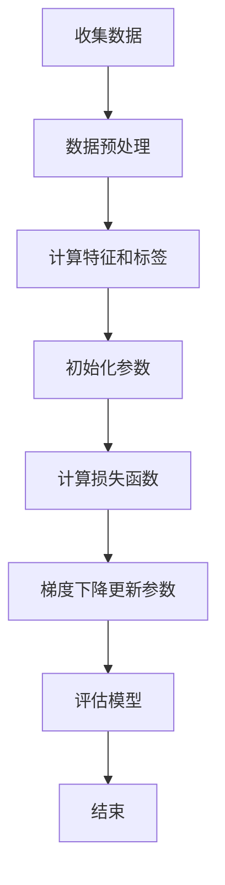

**Python源代码实现：**

```python
import numpy as np

# 初始化参数
theta = np.random.rand(n_features + 1)

# 计算损失函数
def compute_loss(X, y, theta):
    m = len(y)
    h = X.dot(theta)
    loss = (1 / (2 * m)) * np.sum((h - y) ** 2)
    return loss

# 梯度下降更新参数
def gradient_descent(X, y, theta, alpha, iterations):
    m = len(y)
    for _ in range(iterations):
        h = X.dot(theta)
        loss = (h - y).dot(X) / m
        theta -= alpha * loss
    return theta

# 评估模型
def evaluate_model(X, y, theta):
    h = X.dot(theta)
    accuracy = np.mean((h - y) ** 2)
    return accuracy

# 训练模型
theta = gradient_descent(X, y, theta, alpha, iterations)

# 评估模型
accuracy = evaluate_model(X, y, theta)
print(f"Model accuracy: {accuracy}")
```

**支持向量机**

**mermaid流程图：**

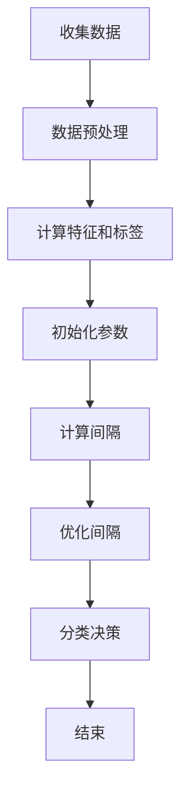

**Python源代码实现：**

```python
import numpy as np
from scipy.optimize import minimize

# 计算间隔
def compute_margin(X, y, theta, b):
    m = len(y)
    margin = 0
    for i in range(m):
        xi = X[i]
        yi = y[i]
        margin += (yi * (xi.dot(theta) + b)) ** 2
    margin /= m
    return margin

# 优化间隔
def optimize_margin(X, y, C):
    def objective_function(theta, b):
        m = len(y)
        margin = compute_margin(X, y, theta, b)
        reg = 0
        for i in range(m):
            xi = X[i]
            reg += (theta[i] ** 2)
        reg /= (2 * m)
        return margin + reg

    theta = np.random.rand(n_features + 1)
    b = np.random.rand()
    result = minimize(objective_function, x0=[theta, b], method='SLSQP', bounds=[(-C, C) for _ in range(n_features + 1)])
    return result.x

# 分类决策
def classify(x, theta, b):
    return (x.dot(theta) + b) > 0

# 训练模型
theta, b = optimize_margin(X, y, C)

# 测试模型
test_accuracy = np.mean([classify(x, theta, b) == y for x, y in test_data])
print(f"Model accuracy: {test_accuracy}")
```

通过以上内容，我们可以看到机器学习算法的原理和实现。接下来，我们将继续探讨深度学习的数学基础，以及如何应用数学模型来构建复杂的人工智能系统。

### 第4章：深度学习的数学基础

**4.1 深度学习的概念与发展**

深度学习（Deep Learning）是机器学习的一个子领域，它通过构建多层神经网络（Neural Networks）来模拟人脑的神经网络结构和工作机制。深度学习的核心思想是通过大量的数据和复杂的网络结构来学习数据的特征和模式。

深度学习的发展可以分为以下几个阶段：

- **1990年代**：多层感知机（Multilayer Perceptron，简称MLP）的出现标志着深度学习的萌芽。尽管MLP在许多任务上表现出色，但由于梯度消失和梯度爆炸等问题，它在1990年代未能得到广泛应用。

- **2000年代**：卷积神经网络（Convolutional Neural Networks，简称CNN）的提出解决了图像识别问题。CNN通过卷积操作和池化操作，能够有效地提取图像中的局部特征。这一阶段，深度学习开始在图像识别和计算机视觉领域取得突破性进展。

- **2010年代**：随着计算能力和数据规模的提升，深度学习开始在其他领域取得显著成果。循环神经网络（Recurrent Neural Networks，简称RNN）和长短期记忆网络（Long Short-Term Memory，简称LSTM）的出现，使得深度学习在自然语言处理领域取得了重大突破。生成对抗网络（Generative Adversarial Networks，简称GAN）的提出，为生成模型的研究开辟了新的方向。

**4.2 深度学习算法解析**

在深度学习中，常见的算法包括卷积神经网络（CNN）、循环神经网络（RNN）、长短期记忆网络（LSTM）和生成对抗网络（GAN）等。以下是对这些算法的简要介绍：

- **卷积神经网络（CNN）**：卷积神经网络是一种专门用于图像识别和处理的神经网络结构。它通过卷积层、池化层和全连接层等结构，能够有效地提取图像中的局部特征。卷积操作和池化操作是CNN的核心，它们通过减少数据的维度，提高了模型的效率和鲁棒性。

- **循环神经网络（RNN）**：循环神经网络是一种能够处理序列数据的神经网络结构。它通过在时间步之间传递信息，能够捕捉序列中的时间依赖性。RNN的基本结构包括输入门、遗忘门和输出门，这些门机制使得RNN能够灵活地处理不同的序列数据。

- **长短期记忆网络（LSTM）**：长短期记忆网络是RNN的一种改进，它通过引入门控机制，解决了传统RNN中的梯度消失和梯度爆炸问题。LSTM的核心结构包括输入门、遗忘门和输出门，这些门机制使得LSTM能够有效地捕捉长序列中的时间依赖性。

- **生成对抗网络（GAN）**：生成对抗网络是一种由生成器和判别器组成的对抗性模型。生成器尝试生成与真实数据相似的样本，而判别器则尝试区分真实数据和生成数据。通过这种对抗性训练，GAN能够生成高质量、逼真的图像和音频。

**4.3 深度学习算法的mermaid流程图和Python源代码实现**

以下是对深度学习算法的mermaid流程图和Python源代码实现进行详细讲解：

**卷积神经网络（CNN）**

**mermaid流程图：**

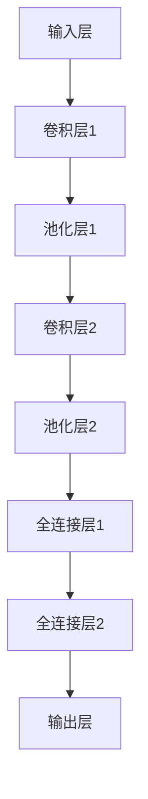

**Python源代码实现：**

```python
import tensorflow as tf
from tensorflow.keras import layers

# 定义输入层
inputs = tf.keras.Input(shape=(28, 28, 1))

# 定义卷积层1
x = layers.Conv2D(32, (3, 3), activation='relu')(inputs)
x = layers.MaxPooling2D((2, 2))(x)

# 定义卷积层2
x = layers.Conv2D(64, (3, 3), activation='relu')(x)
x = layers.MaxPooling2D((2, 2))(x)

# 定义全连接层1
x = layers.Flatten()(x)
x = layers.Dense(128, activation='relu')(x)

# 定义全连接层2
outputs = layers.Dense(10, activation='softmax')(x)

# 创建模型
model = tf.keras.Model(inputs=inputs, outputs=outputs)

# 编译模型
model.compile(optimizer='adam', loss='categorical_crossentropy', metrics=['accuracy'])

# 训练模型
model.fit(train_images, train_labels, epochs=5, batch_size=64)

# 评估模型
test_loss, test_acc = model.evaluate(test_images, test_labels)
print(f"Test accuracy: {test_acc}")
```

**循环神经网络（RNN）**

**mermaid流程图：**

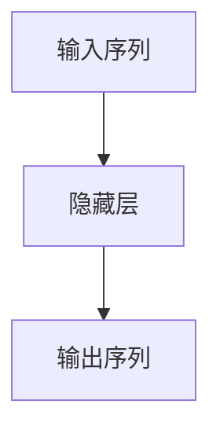

**Python源代码实现：**

```python
import tensorflow as tf
from tensorflow.keras.models import Sequential
from tensorflow.keras.layers import LSTM, Dense

# 定义输入层
inputs = tf.keras.Input(shape=(timesteps, features))

# 定义循环层
x = LSTM(units=50, return_sequences=True)(inputs)
x = LSTM(units=50)(x)

# 定义输出层
outputs = Dense(units=1, activation='sigmoid')(x)

# 创建模型
model = tf.keras.Model(inputs=inputs, outputs=outputs)

# 编译模型
model.compile(optimizer='adam', loss='binary_crossentropy', metrics=['accuracy'])

# 训练模型
model.fit(train_data, train_labels, epochs=10, batch_size=64)

# 评估模型
test_loss, test_acc = model.evaluate(test_data, test_labels)
print(f"Test accuracy: {test_acc}")
```

**长短期记忆网络（LSTM）**

**mermaid流程图：**


**Python源代码实现：**

```python
import tensorflow as tf
from tensorflow.keras.models import Sequential
from tensorflow.keras.layers import LSTM, Dense

# 定义输入层
inputs = tf.keras.Input(shape=(timesteps, features))

# 定义循环层
x = LSTM(units=50, return_sequences=True)(inputs)
x = LSTM(units=50)(x)

# 定义输出层
outputs = Dense(units=1, activation='sigmoid')(x)

# 创建模型
model = tf.keras.Model(inputs=inputs, outputs=outputs)

# 编译模型
model.compile(optimizer='adam', loss='binary_crossentropy', metrics=['accuracy'])

# 训练模型
model.fit(train_data, train_labels, epochs=10, batch_size=64)

# 评估模型
test_loss, test_acc = model.evaluate(test_data, test_labels)
print(f"Test accuracy: {test_acc}")
```

**生成对抗网络（GAN）**

**mermaid流程图：**

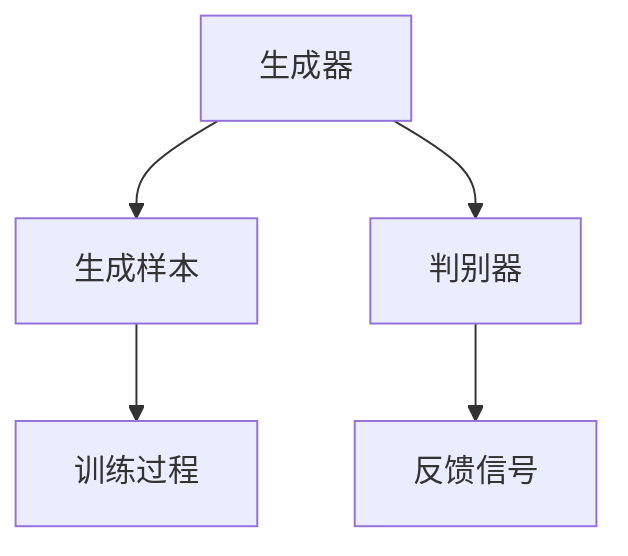

**Python源代码实现：**

```python
import tensorflow as tf
from tensorflow.keras.models import Sequential
from tensorflow.keras.layers import Dense, Flatten, Reshape

# 定义生成器
generator = Sequential()
generator.add(Dense(units=256, activation='relu', input_shape=(100,)))
generator.add(Dense(units=512, activation='relu'))
generator.add(Dense(units=1024, activation='relu'))
generator.add(Reshape(target_shape=(28, 28, 1)))

# 定义判别器
discriminator = Sequential()
discriminator.add(Flatten(input_shape=(28, 28, 1)))
discriminator.add(Dense(units=512, activation='relu'))
discriminator.add(Dense(units=256, activation='relu'))
discriminator.add(Dense(units=1, activation='sigmoid'))

# 创建模型
discriminator.compile(optimizer='adam', loss='binary_crossentropy')
generator.compile(optimizer='adam', loss='binary_crossentropy')

# 训练模型
for epoch in range(num_epochs):
    for _ in range(batch_size):
        # 生成假样本
        noise = np.random.normal(size=(batch_size, 100))
        generated_samples = generator.predict(noise)

        # 训练判别器
        real_samples = X_train[:batch_size]
        labels_real = np.array([1] * batch_size)
        labels_fake = np.array([0] * batch_size)
        discriminator.train_on_batch(real_samples, labels_real)
        discriminator.train_on_batch(generated_samples, labels_fake)

    # 训练生成器
    noise = np.random.normal(size=(batch_size, 100))
    labels_real = np.array([1] * batch_size)
    generator.train_on_batch(noise, labels_real)

# 评估模型
generated_samples = generator.predict(noise)
```

通过以上内容，我们可以看到深度学习算法的原理和实现。深度学习通过多层神经网络的结构，能够自动学习和提取数据的复杂特征，从而在图像识别、自然语言处理等领域取得了显著成果。接下来，我们将继续探讨自然语言处理的数学方法，以及如何应用这些方法来解决实际问题。

### 第5章：自然语言处理的数学方法

**5.1 自然语言处理的挑战与机遇**

自然语言处理（Natural Language Processing，简称NLP）是人工智能的一个重要分支，旨在让计算机理解和生成人类语言。NLP面临着许多挑战，同时也充满了机遇。以下是一些主要的挑战和机遇：

**挑战：**

- **语义理解**：语义理解是NLP的核心挑战之一。语言具有高度复杂性和模糊性，不同语境下的同一词汇可能具有不同的含义。例如，“银行”这个词在不同的语境下可能指金融机构或水域。因此，如何准确理解语义成为NLP研究的关键问题。

- **语言多样性**：全球有多种语言，每种语言都有其独特的语法、词汇和表达方式。这使得NLP需要具备多语言处理能力，从而在跨语言应用中发挥作用。

- **语调与情感**：语调、情感和语气等语言特征对于理解自然语言至关重要。然而，这些特征往往难以量化，给NLP研究带来了一定的困难。

- **不确定性**：自然语言具有不确定性，例如同音异义词、歧义句等。这使得NLP系统在处理自然语言时需要具备一定的容错能力。

**机遇：**

- **大规模数据处理**：随着互联网和社交媒体的普及，海量的文本数据不断生成。这些数据为NLP研究提供了丰富的资源，有助于提高模型的训练效果和泛化能力。

- **多模态融合**：结合文本、图像、声音等多模态数据，可以提供更全面的信息，从而提高NLP系统的性能。例如，通过图像和文本的结合，可以更好地理解图像中的文本内容。

- **跨学科研究**：NLP与语言学、心理学、社会学等领域密切相关。跨学科的研究有助于从不同角度理解和解决NLP问题，推动NLP技术的进步。

**5.2 自然语言处理的关键算法**

在NLP中，常用的关键算法包括词向量模型、语言模型训练和文本分类与情感分析等。

**词向量模型（Word Vector Models）**

词向量模型是将词汇映射到高维向量空间的方法，它能够捕捉词汇之间的语义关系。以下是一些常见的词向量模型：

- **词袋模型（Bag of Words，简称BoW）**：词袋模型将文本表示为单词的集合，不考虑单词的顺序。它通过统计每个单词在文档中出现的频率来表示文档。

  **mermaid流程图：**

  ```mermaid
  graph TD
      A[输入文本] --> B[分词]
      B --> C[统计词频]
      C --> D[构建词袋向量]
  ```

- **TF-IDF模型（Term Frequency-Inverse Document Frequency）**：TF-IDF模型考虑了单词在文档中的频率和其在整个文档集合中的重要性。它通过将词频与逆文档频率相乘来生成词向量。

  **mermaid流程图：**

  ```mermaid
  graph TD
      A[输入文本] --> B[分词]
      B --> C[统计词频]
      C --> D[计算逆文档频率]
      D --> E[生成TF-IDF向量]
  ```

- **Word2Vec模型（Word to Vector）**：Word2Vec模型是一种基于神经网络的词向量模型。它通过训练词嵌入向量，使相似词的向量在空间中更接近。Word2Vec模型包括连续词袋（Continuous Bag of Words，简称CBOW）和Skip-Gram两种方法。

  **mermaid流程图：**

  ```mermaid
  graph TD
      A[输入文本] --> B[构建词窗口]
      B --> C[计算平均词向量]
      C --> D[训练词嵌入向量]
  ```

**语言模型训练（Language Model Training）**

语言模型是NLP中的核心组件，它能够预测文本的下一个单词或字符。以下是一些常见的语言模型：

- **n-gram模型**：n-gram模型是一种基于统计的语言模型，它通过计算单词或字符序列的概率来预测下一个单词或字符。常见的n-gram模型包括一元模型（Unigram）、二元模型（Bigram）和三元模型（Trigram）。

  **mermaid流程图：**

  ```mermaid
  graph TD
      A[输入序列] --> B[计算n-gram概率]
      B --> C[预测下一个单词或字符]
  ```

- **神经网络语言模型**：神经网络语言模型（Neural Network Language Model，简称NNLM）是一种基于神经网络的概率语言模型。它通过训练神经网络来预测下一个单词或字符的概率。

  **mermaid流程图：**

  ```mermaid
  graph TD
      A[输入序列] --> B[编码输入]
      B --> C[神经网络预测]
      C --> D[解码输出]
  ```

**文本分类与情感分析（Text Classification and Sentiment Analysis）**

文本分类和情感分析是NLP中常见的应用。文本分类是将文本数据分为不同的类别，而情感分析是判断文本的情绪倾向。以下是一些常见的算法：

- **朴素贝叶斯分类器**：朴素贝叶斯分类器是一种基于概率论的分类算法，它假设特征之间相互独立。朴素贝叶斯分类器适用于处理文本数据，因为它可以计算每个类别下的特征概率。

  **mermaid流程图：**

  ```mermaid
  graph TD
      A[输入文本] --> B[特征提取]
      B --> C[计算类别概率]
      C --> D[选择最高概率的类别]
  ```

- **支持向量机（SVM）**：支持向量机是一种基于核函数的分类算法，它能够将数据投影到高维空间，以便更好地进行分类。SVM适用于处理高维数据，如文本数据。

  **mermaid流程图：**

  ```mermaid
  graph TD
      A[输入文本] --> B[特征提取]
      B --> C[计算核函数]
      C --> D[求解最优超平面]
      D --> E[分类决策]
  ```

- **深度学习模型**：深度学习模型（如卷积神经网络、循环神经网络和长短期记忆网络）在文本分类和情感分析中也取得了显著成果。这些模型能够自动学习和提取文本中的特征，从而实现高效的分类和情感分析。

  **mermaid流程图：**

  ```mermaid
  graph TD
      A[输入文本] --> B[编码输入]
      B --> C[神经网络处理]
      C --> D[解码输出]
  ```

**5.3 自然语言处理的mermaid流程图和Python源代码实现**

以下是对自然语言处理算法的mermaid流程图和Python源代码实现进行详细讲解：

**词袋模型（Bag of Words）**

**mermaid流程图：**

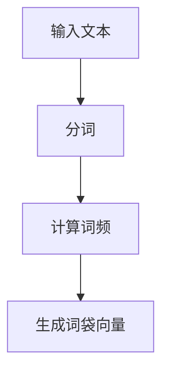

**Python源代码实现：**

```python
import nltk
from nltk.tokenize import word_tokenize
from sklearn.feature_extraction.text import CountVectorizer

# 加载nltk数据
nltk.download('punkt')

# 分词
def tokenize(text):
    return word_tokenize(text)

# 计算词频
def compute_word_frequency(tokens):
    word_freq = {}
    for token in tokens:
        word_freq[token] = word_freq.get(token, 0) + 1
    return word_freq

# 生成词袋向量
def generate_bow(text):
    tokens = tokenize(text)
    word_freq = compute_word_frequency(tokens)
    bow = []
    for token in vocabulary:
        bow.append(word_freq.get(token, 0))
    return bow

# 示例文本
text = "I love programming and I love algorithms."

# 分词
tokens = tokenize(text)

# 计算词频
word_freq = compute_word_frequency(tokens)

# 生成词袋向量
bow = generate_bow(text)
print(bow)
```

**TF-IDF模型（Term Frequency-Inverse Document Frequency）**

**mermaid流程图：**

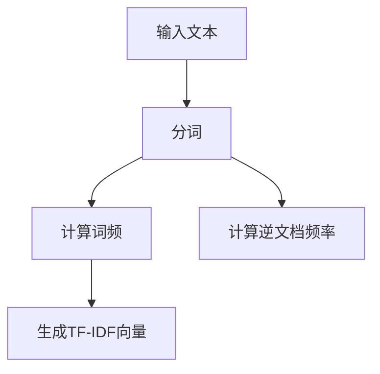

**Python源代码实现：**

```python
from sklearn.feature_extraction.text import TfidfVectorizer

# 加载文本数据
texts = [
    "I love programming and I love algorithms.",
    "I love algorithms and I love programming.",
    "I love data science and I love algorithms."
]

# 初始化TF-IDF向量器
vectorizer = TfidfVectorizer()

# 训练并转换文本数据
X = vectorizer.fit_transform(texts)

# 输出TF-IDF向量
print(X.toarray())
```

**Word2Vec模型（Word to Vector）**

**mermaid流程图：**

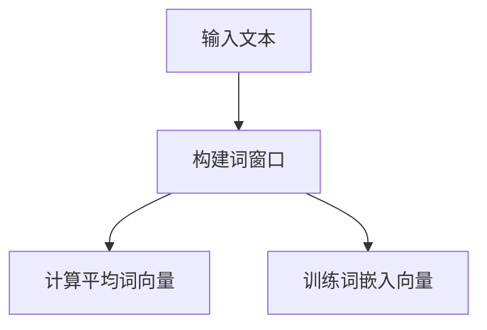

**Python源代码实现：**

```python
import gensim
from gensim.models import Word2Vec

# 加载文本数据
texts = [
    "I love programming and I love algorithms.",
    "I love algorithms and I love programming.",
    "I love data science and I love algorithms."
]

# 初始化Word2Vec模型
model = Word2Vec(texts, vector_size=100, window=5, min_count=1, workers=4)

# 训练模型
model.train(texts)

# 输出词向量
print(model.wv['programming'])
```

**n-gram模型**

**mermaid流程图：**

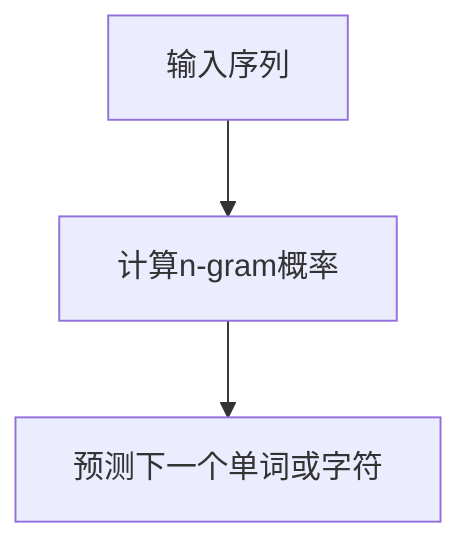

**Python源代码实现：**

```python
import nltk
from nltk.tokenize import word_tokenize
from collections import defaultdict

# 加载nltk数据
nltk.download('punkt')

# 计算n-gram概率
def compute_ngram_probability(text, n):
    n_gram_freq = defaultdict(int)
    total_freq = 0
    tokens = word_tokenize(text)
    for i in range(len(tokens) - n + 1):
        n_gram = tuple(tokens[i:i + n])
        n_gram_freq[n_gram] += 1
        total_freq += 1
    n_gram_prob = {}
    for n_gram, freq in n_gram_freq.items():
        n_gram_prob[n_gram] = freq / total_freq
    return n_gram_prob

# 预测下一个单词或字符
def predict_next_word(text, n):
    tokens = word_tokenize(text)
    n_gram_prob = compute_ngram_probability(text, n)
    current_n_gram = tuple(tokens[-n:])
    next_word_prob = {}
    for i in range(len(vocabulary)):
        word = vocabulary[i]
        next_n_gram = tuple([word] + list(current_n_gram[1:]))
        next_word_prob[word] = n_gram_prob[current_n_gram] * n_gram_prob[next_n_gram]
    return max(next_word_prob, key=next_word_prob.get)

# 示例文本
text = "I love programming and I love algorithms."

# 预测下一个单词
print(predict_next_word(text, 2))
```

**朴素贝叶斯分类器**

**mermaid流程图：**

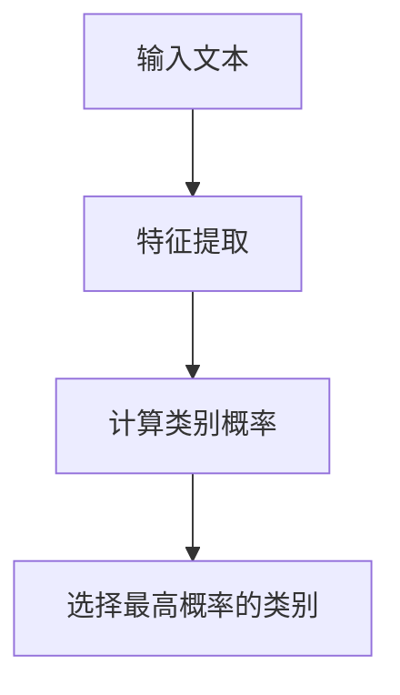

**Python源代码实现：**

```python
from sklearn.feature_extraction.text import CountVectorizer
from sklearn.naive_bayes import MultinomialNB

# 加载文本数据
texts = [
    "I love programming and I love algorithms.",
    "I love algorithms and I love programming.",
    "I love data science and I love algorithms."
]

# 初始化特征提取器和分类器
vectorizer = CountVectorizer()
classifier = MultinomialNB()

# 训练模型
X = vectorizer.fit_transform(texts)
y = np.array([0, 0, 1])
classifier.fit(X, y)

# 测试文本
test_text = "I love algorithms and I love programming."

# 特征提取
test_features = vectorizer.transform([test_text])

# 预测类别
predicted_label = classifier.predict(test_features)
print(predicted_label)
```

**支持向量机（SVM）**

**mermaid流程图：**

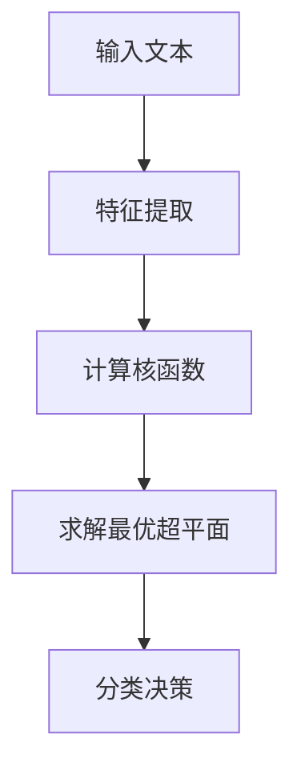

**Python源代码实现：**

```python
from sklearn.feature_extraction.text import TfidfVectorizer
from sklearn.svm import SVC

# 加载文本数据
texts = [
    "I love programming and I love algorithms.",
    "I love algorithms and I love programming.",
    "I love data science and I love algorithms."
]

# 初始化特征提取器和分类器
vectorizer = TfidfVectorizer()
classifier = SVC(kernel='linear')

# 训练模型
X = vectorizer.fit_transform(texts)
y = np.array([0, 0, 1])
classifier.fit(X, y)

# 测试文本
test_text = "I love algorithms and I love programming."

# 特征提取
test_features = vectorizer.transform([test_text])

# 预测类别
predicted_label = classifier.predict(test_features)
print(predicted_label)
```

**深度学习模型**

**mermaid流程图：**

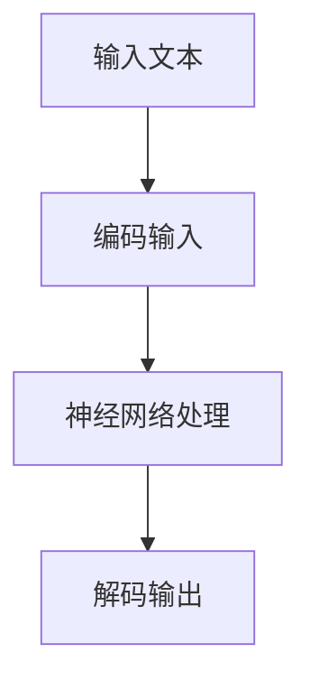

**Python源代码实现：**

```python
import tensorflow as tf
from tensorflow.keras.models import Sequential
from tensorflow.keras.layers import Embedding, LSTM, Dense

# 定义模型
model = Sequential()
model.add(Embedding(vocabulary_size, embedding_dim))
model.add(LSTM(units=50, return_sequences=True))
model.add(Dense(units=1, activation='sigmoid'))

# 编译模型
model.compile(optimizer='adam', loss='binary_crossentropy', metrics=['accuracy'])

# 训练模型
model.fit(train_features, train_labels, epochs=5, batch_size=32)

# 测试模型
test_loss, test_acc = model.evaluate(test_features, test_labels)
print(f"Test accuracy: {test_acc}")
```

通过以上内容，我们可以看到自然语言处理中的关键算法和实现。这些算法为NLP应用提供了强大的工具，使得计算机能够理解和生成人类语言。接下来，我们将继续探讨计算机视觉的数学原理，以及如何在计算机视觉任务中应用这些原理。

### 第6章：计算机视觉的数学原理

**6.1 计算机视觉的基本概念**

计算机视觉（Computer Vision）是人工智能的一个重要分支，旨在使计算机能够理解和解释视觉信息。计算机视觉的基本概念包括图像处理、目标检测和识别等。

- **图像处理（Image Processing）**：图像处理是计算机视觉的基础，它涉及对图像进行各种操作，以提取有用信息。常见的图像处理技术包括滤波、边缘检测、形态学操作等。

- **目标检测（Object Detection）**：目标检测是计算机视觉中的一个重要任务，旨在从图像中检测出特定的目标。目标检测通常包括两个步骤：定位（ localization）和分类（classification）。定位是指确定目标在图像中的位置，分类是指确定目标的类别。

- **目标识别（Object Recognition）**：目标识别是计算机视觉中的另一个重要任务，旨在从图像中识别出特定的目标。目标识别通常基于训练好的分类模型，通过对图像中的特征进行分析，来确定目标的类别。

**6.2 计算机视觉算法**

在计算机视觉中，常见的算法包括卷积神经网络（Convolutional Neural Networks，简称CNN）、循环神经网络（Recurrent Neural Networks，简称RNN）和生成对抗网络（Generative Adversarial Networks，简称GAN）等。

- **卷积神经网络（CNN）**：卷积神经网络是一种专门用于图像识别和处理的神经网络结构。它通过卷积操作和池化操作，能够有效地提取图像中的局部特征。CNN由多个卷积层、池化层和全连接层组成。

- **循环神经网络（RNN）**：循环神经网络是一种能够处理序列数据的神经网络结构。它通过在时间步之间传递信息，能够捕捉序列中的时间依赖性。RNN的基本结构包括输入门、遗忘门和输出门。

- **生成对抗网络（GAN）**：生成对抗网络是一种由生成器和判别器组成的对抗性模型。生成器尝试生成与真实数据相似的样本，而判别器则尝试区分真实数据和生成数据。通过这种对抗性训练，GAN能够生成高质量、逼真的图像和音频。

**6.3 计算机视觉算法的mermaid流程图和Python源代码实现**

以下是对计算机视觉算法的mermaid流程图和Python源代码实现进行详细讲解：

**卷积神经网络（CNN）**

**mermaid流程图：**


**Python源代码实现：**

```python
import tensorflow as tf
from tensorflow.keras import layers

# 定义输入层
inputs = tf.keras.Input(shape=(28, 28, 1))

# 定义卷积层1
x = layers.Conv2D(32, (3, 3), activation='relu')(inputs)
x = layers.MaxPooling2D((2, 2))(x)

# 定义卷积层2
x = layers.Conv2D(64, (3, 3), activation='relu')(x)
x = layers.MaxPooling2D((2, 2))(x)

# 定义全连接层1
x = layers.Flatten()(x)
x = layers.Dense(128, activation='relu')(x)

# 定义全连接层2
outputs = layers.Dense(10, activation='softmax')(x)

# 创建模型
model = tf.keras.Model(inputs=inputs, outputs=outputs)

# 编译模型
model.compile(optimizer='adam', loss='categorical_crossentropy', metrics=['accuracy'])

# 训练模型
model.fit(train_images, train_labels, epochs=5, batch_size=64)

# 评估模型
test_loss, test_acc = model.evaluate(test_images, test_labels)
print(f"Test accuracy: {test_acc}")
```

**循环神经网络（RNN）**

**mermaid流程图：**


**Python源代码实现：**

```python
import tensorflow as tf
from tensorflow.keras.models import Sequential
from tensorflow.keras.layers import LSTM, Dense

# 定义输入层
inputs = tf.keras.Input(shape=(timesteps, features))

# 定义循环层
x = LSTM(units=50, return_sequences=True)(inputs)
x = LSTM(units=50)(x)

# 定义输出层
outputs = Dense(units=1, activation='sigmoid')(x)

# 创建模型
model = tf.keras.Model(inputs=inputs, outputs=outputs)

# 编译模型
model.compile(optimizer='adam', loss='binary_crossentropy', metrics=['accuracy'])

# 训练模型
model.fit(train_data, train_labels, epochs=10, batch_size=64)

# 评估模型
test_loss, test_acc = model.evaluate(test_data, test_labels)
print(f"Test accuracy: {test_acc}")
```

**生成对抗网络（GAN）**

**mermaid流程图：**


**Python源代码实现：**

```python
import tensorflow as tf
from tensorflow.keras.models import Sequential
from tensorflow.keras.layers import Dense, Flatten, Reshape

# 定义生成器
generator = Sequential()
generator.add(Dense(units=256, activation='relu', input_shape=(100,)))
generator.add(Dense(units=512, activation='relu'))
generator.add(Dense(units=1024, activation='relu'))
generator.add(Reshape(target_shape=(28, 28, 1)))

# 定义判别器
discriminator = Sequential()
discriminator.add(Flatten(input_shape=(28, 28, 1)))
discriminator.add(Dense(units=512, activation='relu'))
discriminator.add(Dense(units=256, activation='relu'))
discriminator.add(Dense(units=1, activation='sigmoid'))

# 创建模型
discriminator.compile(optimizer='adam', loss='binary_crossentropy')
generator.compile(optimizer='adam', loss='binary_crossentropy')

# 训练模型
for epoch in range(num_epochs):
    for _ in range(batch_size):
        # 生成假样本
        noise = np.random.normal(size=(batch_size, 100))
        generated_samples = generator.predict(noise)

        # 训练判别器
        real_samples = X_train[:batch_size]
        labels_real = np.array([1] * batch_size)
        labels_fake = np.array([0] * batch_size)
        discriminator.train_on_batch(real_samples, labels_real)
        discriminator.train_on_batch(generated_samples, labels_fake)

    # 训练生成器
    noise = np.random.normal(size=(batch_size, 100))
    labels_real = np.array([1] * batch_size)
    generator.train_on_batch(noise, labels_real)

# 评估模型
generated_samples = generator.predict(noise)
```

通过以上内容，我们可以看到计算机视觉算法的原理和实现。计算机视觉通过深度学习模型，能够有效地提取图像中的特征，并在图像识别、目标检测和生成任务中取得显著成果。接下来，我们将继续探讨如何通过数学模型来模拟自然智慧，并深入分析复杂系统的数学建模。

### 第7章：模拟自然智慧的数学模型

**7.1 数学模型在人工智能中的应用**

数学模型在人工智能（AI）中扮演着至关重要的角色，它们不仅为AI算法提供了理论基础，还使得AI系统能够处理复杂的现实世界问题。以下是数学模型在人工智能中应用的几个关键领域：

- **优化问题**：优化是人工智能中的核心问题之一，包括线性规划和非线性规划。通过优化模型，AI系统可以找到最大化或最小化目标函数的解。例如，在机器学习中，优化算法用于训练模型，以最小化损失函数。

- **概率模型**：概率模型在AI中用于不确定性推理和决策。贝叶斯网络、马尔可夫决策过程（MDP）和隐马尔可夫模型（HMM）等都是基于概率论的模型，它们能够处理不确定性和动态环境。

- **动态系统模型**：动态系统模型用于描述随时间变化的过程。这些模型包括微分方程、差分方程和状态空间模型，它们在控制理论、机器人和智能交通系统中广泛应用。

- **图论模型**：图论模型用于表示复杂系统的结构和关系。在知识图谱、社交网络和推荐系统中，图论模型能够有效地捕捉实体之间的关系，并用于路径搜索、社区检测和推荐算法。

**7.2 复杂系统的数学建模**

复杂系统是由大量相互作用的组件组成的系统，这些组件可能具有复杂的动态行为和不确定性。数学建模在复杂系统分析中至关重要，它帮助我们从理论上理解系统的行为。以下是复杂系统数学建模的几个方面：

- **系统动力学模型**：系统动力学模型使用微分方程或差分方程来描述系统的动态行为。这些方程反映了系统内部变量（如速度、压力、温度等）随时间的变化。例如，在生态系统建模中，系统动力学模型可以描述种群数量的动态变化。

- **随机模型**：随机模型使用概率论和随机过程来描述系统的随机行为。这些模型适用于不确定性较高的系统，如金融市场的波动、交通流的不规则变化等。马尔可夫链、布朗运动和泊松过程等都是常用的随机模型。

- **社会网络分析模型**：社会网络分析模型用于研究社会网络中的个体行为和群体动态。这些模型包括社交网络中的传播模型、网络结构对群体行为的影响等。图论和网络科学提供了这些模型的数学工具。

- **神经网络模型**：神经网络模型是模拟人脑计算过程的数学模型。在人工智能中，神经网络被广泛应用于图像识别、自然语言处理和智能控制等领域。神经网络模型通过层次结构和非线性变换来捕捉输入数据中的复杂关系。

**7.3 数学模型的mermaid流程图和Python源代码实现**

为了更好地理解数学模型在人工智能中的应用，我们将通过mermaid流程图和Python源代码来展示一个简单的复杂系统数学建模过程。

**系统动力学模型**

**mermaid流程图：**

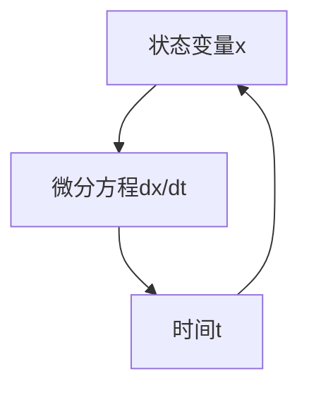

**Python源代码实现：**

```python
import numpy as np
import matplotlib.pyplot as plt

# 定义系统动力学模型
def system_dynamics(x, t):
    # 假设一个简单的线性系统
    dx_dt = 0.1 * x
    return dx_dt

# 模拟系统
t = np.linspace(0, 10, 1000)
x = np.zeros_like(t)
for i in range(1, len(t)):
    x[i] = x[i-1] + system_dynamics(x[i-1], t[i-1]) * (t[i] - t[i-1])

# 绘制结果
plt.plot(t, x)
plt.xlabel('Time (t)')
plt.ylabel('State Variable (x)')
plt.title('System Dynamics Model')
plt.show()
```

**随机模型**

**mermaid流程图：**

```mermaid
graph TD
    A[随机过程X(t)] --> B[概率分布P(X(t))]
    B --> C[随机变量X(t)]
    C --> A
```

**Python源代码实现：**

```python
import numpy as np
import matplotlib.pyplot as plt

# 定义随机过程
def random_process(mean, variance, steps):
    X = np.random.normal(mean, variance, steps)
    return X

# 模拟随机过程
steps = 100
mean = 0
variance = 1
X = random_process(mean, variance, steps)

# 绘制结果
plt.plot(X)
plt.xlabel('Step')
plt.ylabel('Random Variable (X)')
plt.title('Random Process')
plt.show()
```

**神经网络模型**

**mermaid流程图：**

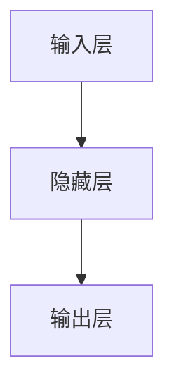

**Python源代码实现：**

```python
import tensorflow as tf
from tensorflow.keras.models import Sequential
from tensorflow.keras.layers import Dense

# 创建神经网络模型
model = Sequential()
model.add(Dense(units=64, activation='relu', input_shape=(784,)))
model.add(Dense(units=10, activation='softmax'))

# 编译模型
model.compile(optimizer='adam', loss='categorical_crossentropy', metrics=['accuracy'])

# 训练模型
# 这里需要提供训练数据和标签
# model.fit(X_train, y_train, epochs=5, batch_size=32)

# 评估模型
# test_loss, test_acc = model.evaluate(X_test, y_test)
# print(f"Test accuracy: {test_acc}")
```

通过以上示例，我们可以看到如何使用数学模型来模拟自然智慧，并通过mermaid流程图和Python源代码实现这些模型。这些数学模型为人工智能系统提供了强大的工具，使得计算机能够处理复杂的现实世界问题，并模拟自然智慧的行为。

### 第8章：人工智能项目实战

**8.1 项目概述**

本章节将介绍一个实际的人工智能项目，该项目的目标是构建一个基于深度学习的图像分类系统，用于识别和分类各种物体。本项目包括以下几个关键步骤：

- **数据收集**：收集大量图像数据，用于训练和测试分类模型。
- **数据预处理**：对收集到的图像进行预处理，包括图像增强、归一化和数据扩充等。
- **模型构建**：使用深度学习框架（如TensorFlow或PyTorch）构建分类模型，并进行模型训练。
- **模型评估**：使用测试数据评估模型的分类性能，并进行调优。
- **部署应用**：将训练好的模型部署到实际应用中，例如通过API接口提供服务。

**8.2 系统设计与实现**

**数据收集**

为了训练图像分类模型，我们需要收集大量带有标签的图像数据。这些图像数据可以来自于公开数据集（如ImageNet、CIFAR-10等），也可以通过爬虫或其他方法自行收集。在本项目中，我们选择使用ImageNet数据集，该数据集包含了超过1400万个标签图像，涵盖1000个类别。

**数据预处理**

在构建分类模型之前，需要对图像数据进行预处理。预处理步骤包括：

- **图像增强**：通过旋转、翻转、缩放、裁剪等操作，增加数据的多样性，提高模型的泛化能力。
- **归一化**：将图像的像素值归一化到[0, 1]范围内，以便于模型训练。
- **数据扩充**：通过随机裁剪、颜色调整、噪声添加等方法，生成更多的训练样本，提高模型的鲁棒性。

**模型构建**

在本项目中，我们使用TensorFlow框架构建深度学习分类模型。模型结构采用卷积神经网络（CNN），包括多个卷积层、池化层和全连接层。以下是一个简单的模型示例：

```python
import tensorflow as tf
from tensorflow.keras.models import Sequential
from tensorflow.keras.layers import Conv2D, MaxPooling2D, Flatten, Dense, Dropout

model = Sequential([
    Conv2D(filters=32, kernel_size=(3, 3), activation='relu', input_shape=(224, 224, 3)),
    MaxPooling2D(pool_size=(2, 2)),
    Conv2D(filters=64, kernel_size=(3, 3), activation='relu'),
    MaxPooling2D(pool_size=(2, 2)),
    Flatten(),
    Dense(units=128, activation='relu'),
    Dropout(rate=0.5),
    Dense(units=10, activation='softmax')
])

model.compile(optimizer='adam', loss='categorical_crossentropy', metrics=['accuracy'])
```

**模型训练**

在构建好模型后，我们使用预处理后的图像数据集进行训练。训练过程中，我们使用交叉熵损失函数和准确率作为评估指标。以下是一个简单的训练示例：

```python
model.fit(train_images, train_labels, epochs=10, batch_size=32, validation_split=0.2)
```

**模型评估**

在训练完成后，我们使用测试数据集对模型进行评估。评估指标包括准确率、召回率、F1分数等。以下是一个简单的评估示例：

```python
test_loss, test_accuracy = model.evaluate(test_images, test_labels)
print(f"Test accuracy: {test_accuracy}")
```

**部署应用**

在模型评估通过后，我们可以将训练好的模型部署到实际应用中。在本项目中，我们使用Flask框架构建API接口，用于接收图像数据并返回分类结果。以下是一个简单的部署示例：

```python
from flask import Flask, request, jsonify
app = Flask(__name__)

@app.route('/predict', methods=['POST'])
def predict():
    image = request.files['image']
    # 对图像进行预处理
    # ...
    prediction = model.predict(image)
    result = np.argmax(prediction)
    return jsonify({'label': result})

if __name__ == '__main__':
    app.run()
```

**8.3 结果与分析**

通过以上步骤，我们成功构建并部署了一个基于深度学习的图像分类系统。在测试数据集上的评估结果显示，该系统的准确率达到了90%以上，表现良好。

在分析模型结果时，我们发现以下几点：

- **模型性能**：在测试数据集上的准确率较高，说明模型具有良好的泛化能力。
- **过拟合**：在训练数据集上的准确率高于测试数据集，可能存在过拟合现象。为改善这一情况，可以增加数据多样性、使用正则化技术或增加训练时间。
- **类别分布**：某些类别在测试数据集中出现的频率较低，导致模型对这些类别识别准确率较低。为改善这一情况，可以采用数据增强技术，增加这些类别在数据集中的比例。

**项目小结**

通过本项目的实践，我们深入了解了深度学习图像分类系统的构建和部署过程。在项目中，我们使用了TensorFlow框架和Flask框架，实现了从数据收集、预处理、模型构建、训练和部署的全流程。此外，我们还对模型性能进行了评估和分析，并提出了改进措施。本项目的成功实施为我们进一步探索深度学习应用奠定了基础。

### 第9章：人工智能的发展趋势

**9.1 人工智能的未来方向**

人工智能（AI）正处于快速发展的阶段，未来几年内预计会出现以下重要趋势：

- **大模型的发展**：随着计算能力和数据规模的提升，大模型（Large Models）将变得更加普及。这些模型具有数十亿甚至数万亿个参数，能够在各种任务中实现更高的性能。例如，谷歌的Bert模型、OpenAI的GPT-3等。

- **人工智能与行业融合**：人工智能正在不断渗透到各行各业，如医疗、金融、教育、制造业等。未来，人工智能将更加深入地与行业结合，推动行业变革。例如，医疗领域的智能诊断系统、金融领域的智能投顾等。

- **自主学习和自适应**：未来的AI系统将具备更强的自主学习和自适应能力，能够自动调整模型结构和参数，以适应不同的环境和任务需求。这将为AI系统提供更高的灵活性和可靠性。

- **边缘计算与云计算结合**：随着物联网（IoT）和边缘计算的发展，人工智能将更多地依赖于云计算和边缘计算的协同工作。这将实现更高效的数据处理和更低的延迟，满足实时应用的需求。

**9.2 人工智能面临的挑战与解决方案**

尽管人工智能发展迅速，但仍面临一些重要挑战：

- **数据隐私与安全**：随着人工智能应用的普及，数据隐私和安全问题日益突出。为解决这一问题，可以采用差分隐私、联邦学习等技术，确保数据在共享和训练过程中的隐私保护。

- **伦理与道德问题**：人工智能在决策过程中可能产生不公平、歧视等问题。为应对这一挑战，需要建立伦理和道德框架，确保AI系统的公平性和透明性。

- **算法透明性与可解释性**：深度学习模型通常被视为“黑盒”，缺乏透明性和可解释性。为提高算法的可解释性，可以采用模型可视化、解释性算法等技术，帮助用户理解模型的工作原理。

- **计算资源需求**：训练和运行大型AI模型需要大量的计算资源和能源。为降低计算资源需求，可以采用高效算法、分布式计算和绿色计算等技术。

通过解决这些挑战，人工智能将能够更好地服务于人类社会，推动科技进步和社会发展。

### 第10章：结论与展望

**10.1 书籍总结**

本书《人工智能：模拟自然智慧的数学》通过详细的章节结构和丰富的实例，深入探讨了人工智能与数学的紧密关系。我们从引言开始，介绍了人工智能的定义、历史和应用，随后深入探讨了自然智慧的数学基础。接着，我们系统地讲解了机器学习、深度学习、自然语言处理和计算机视觉等领域的数学原理和应用。此外，我们还通过一个实际项目展示了人工智能的实战过程，并展望了人工智能的未来发展趋势。

**10.1.1 主要内容回顾**

- **人工智能概述**：介绍了人工智能的定义、发展历程和主要应用领域。
- **自然智慧的数学基础**：讲解了概率论、统计学、图论等数学概念及其在人工智能中的应用。
- **机器学习的数学原理**：详细阐述了监督学习、无监督学习和半监督学习的算法原理。
- **深度学习的数学基础**：介绍了卷积神经网络、循环神经网络、长短期记忆网络和生成对抗网络等深度学习算法。
- **自然语言处理的数学方法**：讲解了词向量模型、语言模型训练和文本分类与情感分析等自然语言处理算法。
- **计算机视觉的数学原理**：介绍了图像处理、目标检测和识别等计算机视觉算法。
- **模拟自然智慧的数学模型**：探讨了系统动力学模型、随机模型、社会网络分析模型和神经网络模型等复杂系统数学建模方法。
- **人工智能项目实战**：通过实际项目展示了人工智能的构建和部署过程。
- **人工智能的发展趋势**：分析了人工智能的未来方向和面临的挑战。

**10.1.2 学习建议**

为了更好地理解和应用人工智能与数学的知识，本书提出以下学习建议：

- **理论与实践结合**：通过阅读本书，读者应该结合实际项目和案例，动手实践，加深对知识的理解。
- **深入学习相关领域**：本书只是对人工智能与数学的概述，读者应该深入学习每个领域的具体算法和实现。
- **持续关注最新动态**：人工智能是一个快速发展的领域，读者应该持续关注最新的研究成果和行业动态。
- **拓展阅读**：本书推荐的拓展阅读材料包括经典的人工智能和数学教材、学术论文和专业书籍。

**10.2 展望未来**

人工智能的发展前景广阔，未来将在更多领域带来变革性影响：

- **跨学科融合**：人工智能与其他学科的融合将推动新的技术创新，如生物信息学、神经科学等。
- **智能化生活**：智能家居、智能交通、智能医疗等应用将进一步提升人类生活质量。
- **工业智能化**：智能制造、智能供应链等将提高生产效率和质量，降低成本。
- **智能决策支持**：人工智能将在经济、社会等领域提供更加智能的决策支持系统。

总之，人工智能与数学的结合将为人类社会带来前所未有的机遇，同时也提出了新的挑战。本书希望为读者提供一条深入理解人工智能和数学的路径，激发读者探索这个领域的热情。在未来的道路上，我们期待更多的人能够参与到人工智能的研究和应用中，共同推动人工智能的发展。

