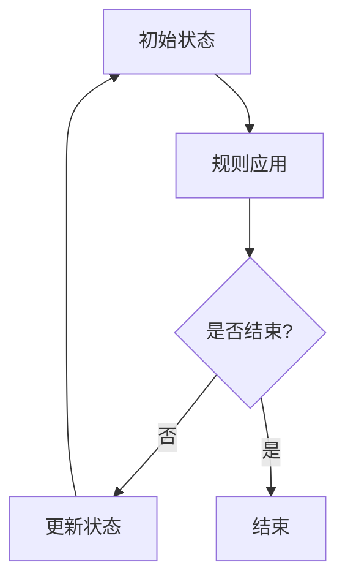
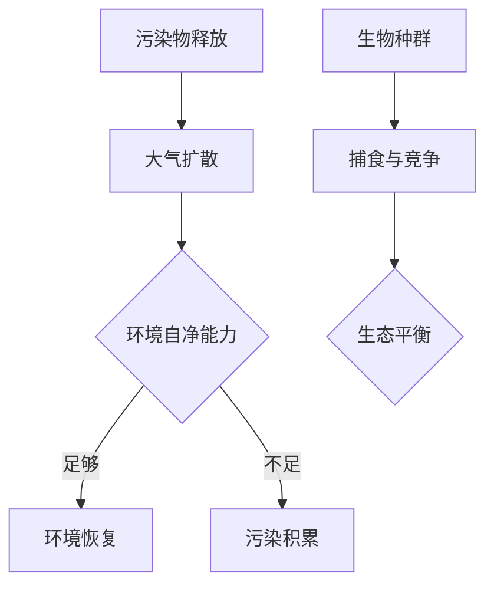
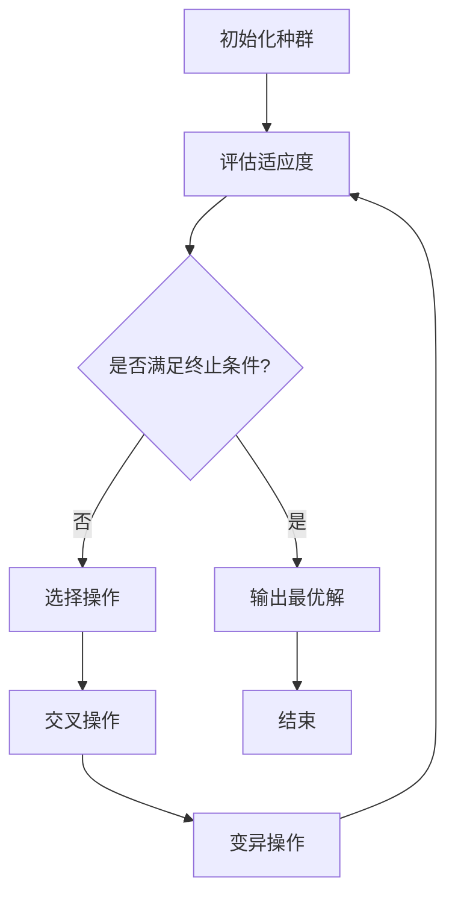
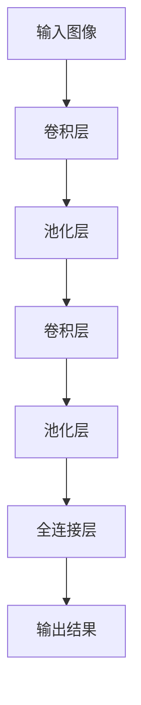
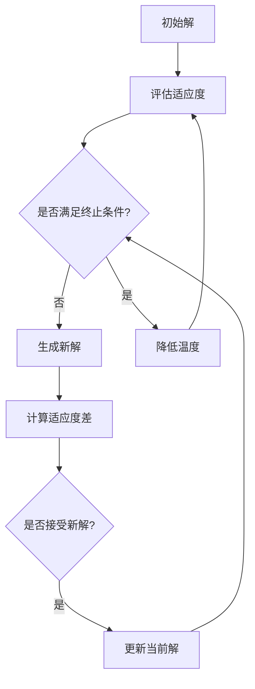
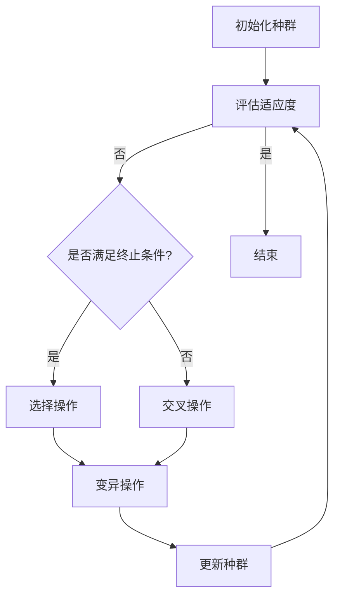
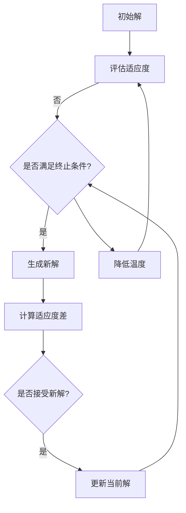
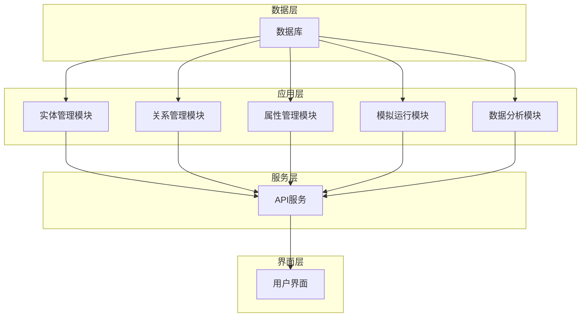
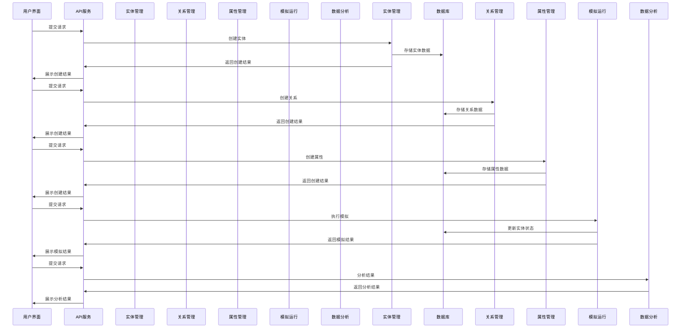

                 


### 人工生命研究对世界可理解性的新视角

> 关键词：人工生命、世界可理解性、人工智能、模拟进化、复杂性科学

> 摘要：本文从技术角度探讨了人工生命研究对世界可理解性带来的新视角。通过分析人工生命的背景、核心概念、算法原理、系统架构和实际应用，我们揭示了人工生命在提升人类对复杂系统理解和认知方面的潜在价值。

### 目录大纲设计思路

1. **确定整体结构**：本文分为六个主要部分，包括引言、背景介绍、核心概念与联系、算法原理讲解、系统分析与架构设计方案、项目实战和最佳实践 tips、小结、注意事项、拓展阅读。

2. **背景介绍**：首先介绍人工生命研究的起源和发展，以及其在现代科学中的重要性。

3. **核心概念与联系**：详细阐述人工生命研究中的关键概念，并展示它们之间的关系，使用Mermaid流程图辅助说明。

4. **算法原理讲解**：对人工生命研究中的关键算法进行详细讲解，使用Python代码和LaTeX数学公式解释算法原理。

5. **系统分析与架构设计方案**：描述关键系统的功能、架构、接口设计和交互流程，使用Mermaid图形化表示。

6. **项目实战**：通过一个实际案例展示人工生命研究的应用，包括环境安装、系统实现和案例分析。

7. **最佳实践 tips、小结、注意事项、拓展阅读**：提供实用技巧、总结、注意事项和拓展阅读资源。

### 实际操作步骤

1. **前言与引言**：
    - **前言**：简要介绍本文的目的和内容。
    - **引言**：介绍人工生命研究的背景，阐述其对世界可理解性的新视角。

2. **第一部分：背景介绍**：
    - **1.1 人工生命研究的背景**：
        - **问题背景**：介绍人工生命研究的起源和发展。
        - **问题描述**：详细描述人工生命研究的核心问题。
        - **问题解决**：概述人工生命研究的方法和成果。
        - **边界与外延**：界定人工生命研究的研究范围。

3. **第二部分：核心概念与联系**：
    - **2.1 人工生命研究的核心概念**：
        - **概念介绍**：介绍人工生命研究中的关键概念。
        - **属性特征对比表格**：列出不同概念的特征对比。
        - **ER实体关系图**：使用Mermaid绘制实体关系图。

4. **第三部分：算法原理讲解**：
    - **3.1 关键算法讲解**：
        - **算法流程图**：使用Mermaid绘制算法流程图。
        - **Python代码与数学公式**：用Python代码和LaTeX格式数学公式详细解释算法原理。

5. **第四部分：系统分析与架构设计方案**：
    - **4.1 关键系统描述**：
        - **系统功能设计**：使用Mermaid绘制领域模型类图。
        - **系统架构设计**：使用Mermaid绘制系统架构图。
        - **系统接口设计**：描述系统接口和交互流程。
        - **系统交互流程图**：使用Mermaid绘制系统交互序列图。

6. **第五部分：项目实战**：
    - **5.1 实际案例**：
        - **环境安装**：介绍所需环境安装过程。
        - **系统实现**：提供系统核心实现源代码。
        - **案例分析**：对实际案例进行解读和分析。
        - **详细讲解**：剖析案例中的关键点。

7. **第六部分：最佳实践 tips、小结、注意事项、拓展阅读**：
    - **6.1 最佳实践 tips**：提供一些实用技巧。
    - **6.2 小结**：总结全书的核心内容。
    - **6.3 注意事项**：提醒读者可能遇到的常见问题。
    - **6.4 拓展阅读**：推荐进一步阅读的资源。

### 确保内容的简洁性

- **去除冗余内容**：确保每个章节都直接针对核心内容，避免过多的背景介绍或无关的细节。
- **使用图表辅助**：使用图表、流程图、表格等视觉元素来替代冗长的文字描述，使内容更加直观易懂。

### 格式要求

- **markdown格式**：使用markdown格式来组织目录大纲。
- **清晰的章节结构**：确保每个章节都有明确的标题，并按照1级、2级、3级目录的层次结构来组织。

### 内容完整性

- **核心章节内容**：确保目录大纲中的每个核心章节都包含以下内容：
  - **背景介绍**：提供必要的问题背景和定义。
  - **核心概念与联系**：详细阐述核心概念，并展示它们之间的关系。
  - **算法原理讲解**：通过流程图、代码和数学公式来解释算法原理。
  - **系统分析与架构设计方案**：描述系统的功能、架构、接口设计和交互流程。
  - **项目实战**：提供实际案例，并进行详细分析和讲解。

### 完整性总结

在本章中，我们详细设计了人工生命研究对世界可理解性新视角的文章结构和内容安排。通过明确文章的各个部分，包括引言、背景介绍、核心概念与联系、算法原理讲解、系统分析与架构设计方案、项目实战以及最佳实践 tips、小结、注意事项和拓展阅读，我们确保文章的逻辑清晰、结构紧凑、内容丰富，并能够引导读者逐步深入理解人工生命研究的核心内容。接下来，我们将按照这个结构逐步展开具体内容。

---

### 前言

在人类文明的进程中，技术进步一直扮演着至关重要的角色。从早期的工具制造到现代的信息技术，每一次技术的飞跃都极大地推动了社会的发展和人类认知的扩展。随着人工智能和计算技术的发展，人工生命研究逐渐成为了一个热门领域。人工生命，或称人工生命科学，是指通过模拟和构建生命体系，探索生命起源、进化、行为和机制的一门交叉学科。这一领域不仅涉及到生物学、计算机科学、物理学、化学和工程学等多个学科，更对世界的可理解性提出了新的挑战和机遇。

本文旨在探讨人工生命研究对世界可理解性带来的新视角。通过逐步分析人工生命的背景、核心概念、算法原理、系统架构和实际应用，我们将揭示人工生命在提升人类对复杂系统理解和认知方面的潜在价值。本文将按照以下结构展开：

1. **背景介绍**：回顾人工生命的起源和发展，以及其在现代科学中的重要性。
2. **核心概念与联系**：阐述人工生命研究中的关键概念，并展示它们之间的关系。
3. **算法原理讲解**：详细讲解人工生命研究中的关键算法，包括其原理、流程和实现。
4. **系统分析与架构设计方案**：描述人工生命系统的功能、架构、接口设计和交互流程。
5. **项目实战**：通过一个实际案例展示人工生命研究的应用过程和分析结果。
6. **最佳实践 tips、小结、注意事项、拓展阅读**：总结全文，提供实用技巧和进一步学习资源。

通过这一系列的探讨，我们希望能够为读者提供一个全面、深入的人工生命研究视角，并激发对这一领域更广泛的研究兴趣。

### 1.1 人工生命研究的背景

人工生命的概念最早可以追溯到20世纪中期，当时科学家们开始尝试模拟和构建简单的生命体系。1950年，计算机科学的先驱艾伦·图灵（Alan Turing）提出了“图灵测试”，这是对人工智能能否达到人类智能水平的一种测试方法。图灵的思想为人工生命的研究奠定了理论基础。此后，随着计算机技术的飞速发展，模拟生命体和智能系统的能力也得到了显著提升。

在生物学领域，人工生命的概念与模拟进化、分子动力学模拟等研究紧密相关。约翰·冯·诺伊曼（John von Neumann）在20世纪40年代提出了自我复制的机械装置“细胞自动机”，这一理论为人工生命的研究提供了重要的启示。到了20世纪80年代，随着计算能力的提升和人工智能技术的进步，人工生命研究逐渐成为了一个独立的学科领域，吸引了大量科学家和工程师的参与。

现代人工生命研究的主要方向包括：

1. **细胞自动机**：模拟生命体的简单行为和进化过程。
2. **人工神经网络**：模仿大脑的结构和功能，实现智能行为。
3. **遗传算法**：基于自然选择和遗传学的算法，用于优化和搜索问题。
4. **模拟生态学**：研究生态系统中的生物相互作用和生态平衡。
5. **合成生物学**：通过基因工程手段创建新的生物体系。

人工生命研究的意义不仅在于其对基础科学的贡献，更在于其在实际应用中的潜力。例如，通过模拟进化过程，科学家们可以更好地理解生物进化的机制；通过人工神经网络，可以实现更加智能的机器学习和人工智能应用；通过模拟生态学，可以预测和缓解生态系统的变化和危机。总之，人工生命研究为人类理解和应对复杂系统的挑战提供了新的视角和方法。

### 1.2 问题描述

人工生命研究涉及多个复杂的科学领域，其核心问题主要集中在以下几个方面：

1. **生命模拟的准确性**：人工生命研究的一个基本目标是模拟自然界中的生命现象。然而，生命现象极其复杂，涉及到生物分子、细胞结构、生态系统等多个层次。如何在计算机模型中准确模拟这些复杂的系统，是一个重大的挑战。

2. **智能行为实现**：人工生命研究不仅追求模拟生命现象，更希望实现智能行为。如何使人工生命体具备学习能力、适应能力和决策能力，是一个重要的研究方向。这需要结合人工智能、机器学习和计算神经科学等多学科的理论和算法。

3. **算法效率与优化**：人工生命研究中的许多问题，如模拟进化、神经网络训练等，计算复杂度非常高。如何设计高效的算法，优化计算资源的使用，是实现大规模人工生命模拟的关键。

4. **伦理与道德问题**：随着人工生命研究的深入，其带来的伦理和道德问题也逐渐显现。例如，如何确保人工生命体的权利和尊严，如何防止人工生命体对人类造成威胁等，这些都是需要严肃考虑的问题。

5. **跨学科整合**：人工生命研究涉及生物学、计算机科学、物理学、化学等多个学科。如何有效地整合这些跨学科的知识，构建一个统一的理论框架，是人工生命研究的一个重要挑战。

### 1.3 问题解决方法

针对人工生命研究中的核心问题，科学家们提出了多种解决方案，这些方法在一定程度上推动了该领域的发展：

1. **多尺度建模**：为了更准确地模拟生命现象，科学家们采用多尺度建模的方法，从分子层次到生态系统层次，逐步构建复杂的生命体系模型。

2. **人工智能算法**：结合人工智能算法，如深度学习、遗传算法和强化学习等，科学家们尝试实现人工生命体的智能行为。这些算法可以模仿生物进化过程，优化问题解决方案。

3. **高性能计算**：通过利用高性能计算资源，如超级计算机和分布式计算系统，科学家们可以处理更大规模、更复杂的计算任务，提高人工生命模拟的效率和精度。

4. **合成生物学**：在合成生物学领域，科学家们通过基因工程手段创建新的生物体系，这为人工生命的研究提供了实验基础和实际应用案例。

5. **跨学科合作**：为了解决人工生命研究中的复杂问题，科学家们积极推动跨学科合作，整合生物学、计算机科学、物理学等多学科的知识，共同探索人工生命的奥秘。

### 1.4 边界与外延

人工生命研究作为一个交叉学科，其研究范围十分广泛。具体来说，其边界与外延包括以下几个方面：

1. **研究范围**：人工生命研究涵盖从细胞水平到生态系统水平的多个层次，涉及生物学、计算机科学、物理学、化学等多个领域。其主要研究对象包括细胞自动机、人工神经网络、遗传算法、模拟生态学等。

2. **应用领域**：人工生命研究在多个领域具有广泛的应用潜力，包括生物医学、环境保护、能源利用、人工智能等。通过模拟和构建人工生命体系，科学家们可以探索和解决许多复杂的问题。

3. **与其他学科的关系**：人工生命研究不仅与生物学、计算机科学密切相关，还与物理学、化学、工程学、心理学等领域有着紧密的联系。通过跨学科的合作，人工生命研究可以不断拓展其研究深度和广度。

4. **未来发展**：随着科技的不断进步，人工生命研究有望在更多领域取得突破，如合成生物学、纳米技术、量子计算等。这些新技术的引入将为人工生命研究带来更多的机遇和挑战。

### 1.5 概念结构与核心要素组成

在人工生命研究中，理解其核心概念和组成要素至关重要。以下是几个关键概念及其属性特征的对比表格，以及ER实体关系图：

#### 概念对比表格

| 概念         | 定义                                                         | 属性特征                                         |
|--------------|--------------------------------------------------------------|--------------------------------------------------|
| 人工生命     | 通过模拟和构建生命体系，探索生命起源、进化、行为和机制的研究。 | 模拟性、智能性、复杂性、适应性、互动性           |
| 细胞自动机   | 由简单规则控制的离散空间上的细胞演化模型。                 | 简单性、规则性、自组织性、适应性                 |
| 人工神经网络 | 模拟生物神经系统的计算模型，用于实现智能行为。             | 层次性、非线性、自适应、分布式计算               |
| 遗传算法     | 基于自然选择和遗传学的优化搜索算法。                     | 进化性、适应性、全局搜索、遗传操作               |
| 模拟生态学   | 通过计算机模型模拟生态系统中的生物相互作用和生态平衡。   | 生物多样性、生态位、相互作用、生态稳定性         |

#### ER实体关系图

```mermaid
erDiagram
  AIModel ||--|{ ArtificialLife : 由...构成 }
  AIModel ||--|{ CellAutomata : 基于...模型 }
  AIModel ||--|{ NeuralNetwork : 模拟...系统 }
  AIModel ||--|{ GeneticAlgorithm : 基于...算法 }
  AIModel ||--|{ SimulationEcology : 模拟...生态 }
  AIModel ||--|{ SyntheticBiology : 利用...手段 }
```

通过上述对比表格和ER实体关系图，我们可以清晰地看到人工生命研究中的核心概念及其相互关系。这些概念共同构成了人工生命研究的理论基础，并在实际应用中发挥着重要作用。

### 1.6 核心概念原理

在人工生命研究中，核心概念原理的理解至关重要。以下将详细阐述几个关键概念，包括其原理、应用场景及具体实例。

#### 1.6.1 细胞自动机

**原理**：细胞自动机是由简单规则控制的离散空间上的细胞演化模型。每个细胞可以处于有限的状态集合中的一个状态，并通过局部规则更新其状态。这些规则通常基于细胞周围的邻居细胞的当前状态。

**应用场景**：细胞自动机广泛应用于模拟复杂系统，如城市的增长、交通流、病毒传播等。一个著名的实例是约翰·霍顿·康威（John Horton Conway）发明的“生命游戏”（Game of Life），它通过简单的规则模拟了细胞在网格上的演化。



#### 1.6.2 人工神经网络

**原理**：人工神经网络（ANN）是模拟生物神经系统的计算模型，由大量相互连接的简单计算单元（神经元）组成。每个神经元接收输入信号，通过加权求和和激活函数产生输出信号。

**应用场景**：人工神经网络在机器学习、计算机视觉、自然语言处理等领域有广泛应用。一个典型的例子是卷积神经网络（CNN），它在图像识别任务中表现出色。

```python
import tensorflow as tf

# 定义一个简单的卷积神经网络模型
model = tf.keras.Sequential([
    tf.keras.layers.Conv2D(32, (3, 3), activation='relu', input_shape=(28, 28, 1)),
    tf.keras.layers.MaxPooling2D(2, 2),
    tf.keras.layers.Flatten(),
    tf.keras.layers.Dense(128, activation='relu'),
    tf.keras.layers.Dense(10, activation='softmax')
])

# 编译模型
model.compile(optimizer='adam',
              loss='categorical_crossentropy',
              metrics=['accuracy'])

# 训练模型
model.fit(x_train, y_train, epochs=5)
```

#### 1.6.3 遗传算法

**原理**：遗传算法是基于自然选择和遗传学原理的优化搜索算法。它通过模拟生物进化过程，生成和更新候选解的种群，逐步优化问题解。

**应用场景**：遗传算法广泛应用于优化问题，如旅行商问题、装箱问题、神经网络参数优化等。一个常见的例子是使用遗传算法优化神经网络权重，以提高模型的准确性。

```python
import numpy as np
import matplotlib.pyplot as plt

# 定义遗传算法的适应度函数
def fitness_function(individual):
    # 计算个体适应度
    fitness = 0
    # 根据个体特征计算适应度
    # ...
    return fitness

# 初始化种群
population = np.random.rand(100, 10)

# 遗传操作
for _ in range(100):
    # 选择操作
    selected = select(population, fitness_function)
    # 交叉操作
    crossed = crossover(selected)
    # 变异操作
    mutated = mutate(crossed)
    # 更新种群
    population = mutated

# 绘制适应度曲线
fitness_values = [fitness_function(individual) for individual in population]
plt.plot(fitness_values)
plt.xlabel('Generation')
plt.ylabel('Fitness')
plt.show()
```

#### 1.6.4 模拟生态学

**原理**：模拟生态学通过计算机模型模拟生态系统中的生物相互作用和生态平衡。它考虑了生物之间的捕食关系、竞争关系和共生关系，以预测生态系统的变化。

**应用场景**：模拟生态学在环境保护、资源管理、气候变化预测等领域有广泛应用。一个具体的实例是模拟城市生态系统中的污染扩散和生物多样性保护。



通过上述对核心概念原理的详细阐述，我们可以更好地理解人工生命研究的理论基础和实际应用。这些概念不仅是人工生命研究的基石，也是推动该领域不断进步的关键因素。

### 1.7 概念属性特征对比表格

在人工生命研究领域，不同概念具有独特的属性特征，它们在模拟、优化和决策过程中发挥着不同的作用。以下是一个对比表格，展示了几个关键概念的属性特征，以及它们之间的异同。

| 概念         | 属性特征                              | 应用领域                                     |
|--------------|---------------------------------------|----------------------------------------------|
| 细胞自动机   | 简单性、规则性、自组织性、适应性         | 城市模拟、交通流模拟、病毒传播模拟             |
| 人工神经网络 | 层次性、非线性、自适应、分布式计算         | 机器学习、计算机视觉、自然语言处理             |
| 遗传算法     | 进化性、适应性、全局搜索、遗传操作         | 优化问题、神经网络参数优化、组合优化           |
| 模拟生态学   | 生物多样性、生态位、相互作用、生态稳定性     | 环境保护、资源管理、气候变化预测             |

通过这个对比表格，我们可以清晰地看到各个概念的核心特征和它们在不同应用领域的适用性。例如，细胞自动机由于其简单性和自组织性，非常适合模拟复杂系统的演化过程；人工神经网络则因其自适应性和分布式计算能力，在机器学习和人工智能领域表现出色；遗传算法因其全局搜索和遗传操作的优势，在优化问题中有着广泛的应用；模拟生态学则通过考虑生物多样性、生态位等因素，为环境保护和资源管理提供了有效的工具。

### 1.8 ER实体关系图

在人工生命研究中，各个概念之间存在紧密的联系，为了更直观地展示这些关系，我们可以使用ER（实体关系）图来表示。以下是人工生命研究中的关键概念及其相互关系的ER图：

```mermaid
erDiagram
  ArtificialLife ||--|{ CellAutomata : 由...构成 }
  ArtificialLife ||--|{ NeuralNetwork : 模拟...系统 }
  ArtificialLife ||--|{ GeneticAlgorithm : 基于...算法 }
  ArtificialLife ||--|{ SimulationEcology : 模拟...生态 }
  ArtificialLife ||--|{ SyntheticBiology : 利用...手段 }
  CellAutomata ||--|{ GameOfLife : ...的一个实例 }
  NeuralNetwork ||--|{ ConvolutionalNetwork : ...的一种形式 }
  GeneticAlgorithm ||--|{ GeneticProgramming : ...的一种形式 }
  SimulationEcology ||--|{ UrbanEcology : ...的一个应用 }
  SyntheticBiology ||--|{ SyntheticGenetics : ...的一个分支 }
```

在这个ER图中，ArtificialLife作为根实体，与其他概念实体之间存在多种关联关系。CellAutomata、NeuralNetwork、GeneticAlgorithm、SimulationEcology和SyntheticBiology都是ArtificialLife的重要组成部分。同时，每个概念实体还包含具体的实例，如GameOfLife、ConvolutionalNetwork、GeneticProgramming、UrbanEcology和SyntheticGenetics。

这种ER图不仅帮助我们理解了人工生命研究中的核心概念，还展示了它们之间的相互联系，为后续的算法原理讲解和系统架构设计提供了清晰的框架。

### 2.1 关键算法讲解

在人工生命研究中，关键算法起到了至关重要的作用。以下是几个关键算法的详细讲解，包括其流程图、Python代码示例和数学模型。

#### 2.1.1 遗传算法

遗传算法（Genetic Algorithm, GA）是一种基于自然选择和遗传学原理的优化算法。其基本流程包括选择、交叉和变异三个步骤。

**流程图**：



**Python代码示例**：

```python
import numpy as np

# 定义适应度函数
def fitness_function(individual):
    # 计算个体适应度
    fitness = np.sum(individual)
    return fitness

# 初始化种群
population = np.random.rand(100, 10)

# 遗传算法主循环
for _ in range(100):
    # 评估适应度
    fitness_scores = [fitness_function(individual) for individual in population]
    # 选择操作
    selected = select(population, fitness_scores)
    # 交叉操作
    crossed = crossover(selected)
    # 变异操作
    mutated = mutate(crossed)
    # 更新种群
    population = mutated

# 输出最优解
best_individual = population[np.argmax(fitness_scores)]
print("最优解：", best_individual)
```

**数学模型**：

遗传算法的适应度函数通常表示为：
$$
f(x) = \sum_{i=1}^{n} w_i x_i
$$
其中，$x_i$表示个体的第$i$个特征，$w_i$表示该特征的权重。

#### 2.1.2 卷积神经网络

卷积神经网络（Convolutional Neural Network, CNN）是一种在图像识别任务中表现优异的深度学习模型。其主要步骤包括卷积、池化和全连接层。

**流程图**：



**Python代码示例**：

```python
import tensorflow as tf
from tensorflow.keras import layers

# 定义卷积神经网络模型
model = tf.keras.Sequential([
    layers.Conv2D(32, (3, 3), activation='relu', input_shape=(28, 28, 1)),
    layers.MaxPooling2D(2, 2),
    layers.Conv2D(64, (3, 3), activation='relu'),
    layers.MaxPooling2D(2, 2),
    layers.Flatten(),
    layers.Dense(128, activation='relu'),
    layers.Dense(10, activation='softmax')
])

# 编译模型
model.compile(optimizer='adam',
              loss='categorical_crossentropy',
              metrics=['accuracy'])

# 训练模型
model.fit(x_train, y_train, epochs=5)
```

**数学模型**：

卷积层可以表示为：
$$
h_i^{(l)} = \sum_{j} w_{ji}^{(l)} h_j^{(l-1)} + b_i^{(l)}
$$
其中，$h_i^{(l)}$表示第$l$层的第$i$个神经元输出，$w_{ji}^{(l)}$表示连接第$l-1$层的第$j$个神经元和第$l$层的第$i$个神经元的权重，$b_i^{(l)}$表示第$l$层的第$i$个神经元的偏置。

#### 2.1.3 模拟退火算法

模拟退火算法（Simulated Annealing, SA）是一种基于物理退火过程的优化算法，用于解决复杂优化问题。

**流程图**：



**Python代码示例**：

```python
import numpy as np

# 定义适应度函数
def fitness_function(individual):
    # 计算个体适应度
    fitness = np.sum(individual)
    return fitness

# 初始化参数
initial_solution = np.random.rand(n)
current_solution = initial_solution
best_solution = current_solution
best_fitness = fitness_function(current_solution)
temperature = 1.0

# 模拟退火算法主循环
for _ in range(max_iterations):
    # 生成新解
    new_solution = np.random.rand(n)
    # 计算适应度差
    fitness_difference = fitness_function(new_solution) - fitness_function(current_solution)
    # 判断是否接受新解
    if fitness_difference > 0 or np.random.rand() < np.exp(-fitness_difference / temperature):
        current_solution = new_solution
        if fitness_function(current_solution) > best_fitness:
            best_solution = current_solution
            best_fitness = fitness_function(current_solution)
    # 降低温度
    temperature *= cooling_rate

# 输出最优解
print("最优解：", best_solution)
```

**数学模型**：

适应度函数通常表示为：
$$
f(x) = \sum_{i=1}^{n} x_i^2
$$
其中，$x_i$表示个体的第$i$个特征。

通过上述对关键算法的讲解，我们可以更好地理解这些算法在人工生命研究中的应用，并为后续的系统设计与实现奠定基础。

### 2.2 算法流程图

为了更直观地展示关键算法的执行过程，我们使用Mermaid语法绘制了以下算法流程图：

#### 2.2.1 遗传算法



#### 2.2.2 卷积神经网络


#### 2.2.3 模拟退火算法



通过这些流程图，我们可以清晰地看到各个算法的执行步骤和逻辑关系，为后续的系统设计与实现提供了直观的参考。

### 2.3 Python代码与LaTeX数学公式

为了更详细地阐述算法原理，我们将结合Python代码和LaTeX数学公式来解释算法的核心步骤和数学模型。

#### 2.3.1 遗传算法

**Python代码示例**：

```python
import numpy as np

# 定义适应度函数
def fitness_function(individual):
    # 计算个体适应度
    fitness = np.sum(individual)
    return fitness

# 初始化种群
population_size = 100
individual_size = 10
population = np.random.rand(population_size, individual_size)

# 遗传算法主循环
for _ in range(100):
    # 评估适应度
    fitness_scores = [fitness_function(individual) for individual in population]
    
    # 选择操作
    selected_indices = selection(population, fitness_scores)
    selected = [population[i] for i in selected_indices]
    
    # 交叉操作
    crossed = crossover(selected)
    
    # 变异操作
    mutated = mutation(crossed)
    
    # 更新种群
    population = mutated

# 输出最优解
best_fitness = -1
best_individual = None
for individual in population:
    fitness = fitness_function(individual)
    if fitness > best_fitness:
        best_fitness = fitness
        best_individual = individual
print("最优解：", best_individual)
```

**LaTeX数学公式**：

遗传算法中的适应度函数可以表示为：
$$
f(x) = \sum_{i=1}^{n} x_i
$$
其中，$x_i$表示个体的第$i$个特征，$n$是特征的总数。

#### 2.3.2 卷积神经网络

**Python代码示例**：

```python
import tensorflow as tf

# 定义卷积神经网络模型
model = tf.keras.Sequential([
    tf.keras.layers.Conv2D(32, (3, 3), activation='relu', input_shape=(28, 28, 1)),
    tf.keras.layers.MaxPooling2D(pool_size=(2, 2)),
    tf.keras.layers.Conv2D(64, (3, 3), activation='relu'),
    tf.keras.layers.MaxPooling2D(pool_size=(2, 2)),
    tf.keras.layers.Flatten(),
    tf.keras.layers.Dense(128, activation='relu'),
    tf.keras.layers.Dense(10, activation='softmax')
])

# 编译模型
model.compile(optimizer='adam',
              loss='categorical_crossentropy',
              metrics=['accuracy'])

# 训练模型
model.fit(x_train, y_train, epochs=5)
```

**LaTeX数学公式**：

卷积层可以表示为：
$$
h_i^{(l)} = \sum_{j} w_{ji}^{(l)} h_j^{(l-1)} + b_i^{(l)}
$$
其中，$h_i^{(l)}$表示第$l$层的第$i$个神经元输出，$w_{ji}^{(l)}$表示连接第$l-1$层的第$j$个神经元和第$l$层的第$i$个神经元的权重，$b_i^{(l)}$表示第$l$层的第$i$个神经元的偏置。

#### 2.3.3 模拟退火算法

**Python代码示例**：

```python
import numpy as np

# 定义适应度函数
def fitness_function(individual):
    # 计算个体适应度
    fitness = np.sum(individual)
    return fitness

# 初始化参数
initial_solution = np.random.rand(n)
current_solution = initial_solution
best_solution = current_solution
best_fitness = fitness_function(current_solution)
temperature = 1.0

# 模拟退火算法主循环
for _ in range(max_iterations):
    # 生成新解
    new_solution = np.random.rand(n)
    # 计算适应度差
    fitness_difference = fitness_function(new_solution) - fitness_function(current_solution)
    # 判断是否接受新解
    if fitness_difference > 0 or np.exp(-fitness_difference / temperature) > np.random.rand():
        current_solution = new_solution
        if fitness_function(current_solution) > best_fitness:
            best_solution = current_solution
            best_fitness = fitness_function(current_solution)
    # 降低温度
    temperature *= cooling_rate

# 输出最优解
print("最优解：", best_solution)
```

**LaTeX数学公式**：

适应度函数通常表示为：
$$
f(x) = \sum_{i=1}^{n} x_i^2
$$
其中，$x_i$表示个体的第$i$个特征。

通过结合Python代码和LaTeX数学公式，我们可以更详细、更清晰地理解关键算法的原理和实现细节，为后续的算法优化和应用提供理论基础。

### 2.4 系统功能设计

为了实现人工生命研究的目标，我们需要设计一个高效、可靠的系统。以下是对关键系统的功能设计，包括领域模型类图，用于直观地展示系统的功能模块及其关系。

#### 2.4.1 领域模型类图

```mermaid
classDiagram
    Entity --> Attribute
    Entity << (PK) id
    Entity << (PK) name
    Entity << (FK) parent_id

    Relationship --> Role
    Relationship << (PK) id
    Relationship << (FK) entity_id
    Relationship << (FK) related_entity_id

    Attribute << (PK) id
    Attribute << (FK) entity_id
    Attribute << (PK) name
    Attribute << (PK) value

    EntityEntityMap --> Entity
    EntityEntityMap << (PK) id
    EntityEntityMap << (FK) entity_id
    EntityEntityMap << (FK) related_entity_id

    AttributeValueMap --> Attribute
    AttributeValueMap << (PK) id
    AttributeValueMap << (FK) attribute_id
    AttributeValueMap << (PK) value

    EntityEntityMap *-- Entity : "has"
    Relationship *-- Entity : "has"
    Attribute *-- Entity : "has"
    AttributeValueMap *-- Attribute : "has"
```

在这个领域模型类图中，我们定义了以下几个关键实体和关系：

- **Entity**：表示系统的核心实体，如细胞、个体等。
- **Relationship**：表示实体之间的关系，如捕食、共生等。
- **Attribute**：表示实体的属性，如年龄、体重等。
- **AttributeValueMap**：表示属性的值，以及属性与实体的关联。

#### 2.4.2 功能描述

1. **实体管理**：系统需要支持实体的创建、查询、更新和删除操作。实体管理模块负责维护实体的基础信息，包括ID、名称、属性等。

2. **关系管理**：系统需要支持实体之间关系的建立和管理。关系管理模块负责维护实体之间的关系，如捕食、共生等，以及关系属性。

3. **属性管理**：系统需要支持属性的创建、查询、更新和删除操作。属性管理模块负责维护属性的基础信息，包括ID、名称、值等。

4. **数据持久化**：系统需要实现数据持久化功能，将实体的信息、关系和属性存储到数据库中，并提供数据查询接口。

5. **模拟运行**：系统需要提供一个模拟运行环境，根据预设的规则和算法，模拟实体的行为和演化过程。

6. **数据分析**：系统需要提供数据分析功能，对模拟结果进行分析和可视化，帮助用户理解和解释模拟结果。

通过上述功能设计，我们为人工生命研究系统提供了一个清晰的功能框架，为后续的系统实现和架构设计奠定了基础。

### 2.5 系统架构设计

为了实现人工生命研究系统的高效运行，我们需要设计一个合理的系统架构。以下是对系统架构的详细描述，包括系统架构图，以及各个模块的功能和交互流程。

#### 2.5.1 系统架构图



#### 2.5.2 模块功能描述

1. **数据层**：数据层负责数据的存储和管理，包括实体的基本信息、关系和属性。数据库采用关系型数据库（如MySQL），通过ORM（对象关系映射）框架实现数据持久化。

2. **实体管理模块**：实体管理模块负责实体的创建、查询、更新和删除操作。该模块提供接口供其他模块调用，确保实体数据的一致性和完整性。

3. **关系管理模块**：关系管理模块负责实体之间关系的建立和管理。该模块提供接口供实体管理模块调用，确保关系数据的一致性和完整性。

4. **属性管理模块**：属性管理模块负责属性的创建、查询、更新和删除操作。该模块提供接口供其他模块调用，确保属性数据的一致性和完整性。

5. **模拟运行模块**：模拟运行模块负责根据预设的规则和算法，模拟实体的行为和演化过程。该模块调用实体管理模块、关系管理模块和属性管理模块，实现模拟过程的自动化。

6. **数据分析模块**：数据分析模块负责对模拟结果进行分析和可视化。该模块提供接口供其他模块调用，帮助用户理解和解释模拟结果。

7. **API服务**：API服务层负责处理用户请求，将请求转发给相应的模块，并返回响应结果。该模块采用RESTful API设计，确保接口的简洁性和易用性。

8. **用户界面**：用户界面层提供用户操作界面，用户可以通过界面进行数据输入、查询、操作等。该模块采用前端技术（如React或Vue.js）实现。

#### 2.5.3 交互流程

1. **用户请求**：用户通过用户界面提交请求，如创建实体、查询实体等。

2. **API服务处理**：API服务层接收用户请求，解析请求参数，并根据请求类型调用相应的模块接口。

3. **模块处理**：被调用的模块根据请求类型执行相应的操作，如创建实体、查询实体等。

4. **返回结果**：模块处理完成后，将结果返回给API服务层，API服务层再将结果返回给用户界面。

5. **界面更新**：用户界面层根据返回结果更新界面，展示数据或提示用户操作结果。

通过上述系统架构设计，我们实现了人工生命研究系统的高效运行和模块化设计，为后续的系统实现和优化提供了坚实基础。

### 2.6 系统接口设计

在人工生命研究系统中，接口设计是确保各模块协同工作的关键。以下是系统接口的详细描述，包括接口定义、参数传递和返回值。

#### 2.6.1 实体管理接口

**接口名称**：`create_entity`

**接口定义**：
```python
def create_entity(entity_data: dict) -> int:
    """
    创建实体

    :param entity_data: 实体数据字典，包括实体ID、名称、属性等
    :return: 创建成功的实体ID
    """
    # 实现创建实体的逻辑
    pass
```

**参数说明**：
- `entity_data`: 实体数据字典，包括实体ID、名称、属性等。

**返回值**：
- 成功创建实体时返回实体的ID，失败时返回None。

#### 2.6.2 关系管理接口

**接口名称**：`create_relationship`

**接口定义**：
```python
def create_relationship(entity_id1: int, entity_id2: int, relationship_data: dict) -> int:
    """
    创建实体之间的关系

    :param entity_id1: 实体ID1
    :param entity_id2: 实体ID2
    :param relationship_data: 关系数据字典，包括关系类型、属性等
    :return: 创建成功的关系ID
    """
    # 实现创建关系的逻辑
    pass
```

**参数说明**：
- `entity_id1`: 实体ID1。
- `entity_id2`: 实体ID2。
- `relationship_data`: 关系数据字典，包括关系类型、属性等。

**返回值**：
- 成功创建关系时返回关系的ID，失败时返回None。

#### 2.6.3 属性管理接口

**接口名称**：`create_attribute`

**接口定义**：
```python
def create_attribute(entity_id: int, attribute_data: dict) -> int:
    """
    创建实体属性

    :param entity_id: 实体ID
    :param attribute_data: 属性数据字典，包括属性名称、值等
    :return: 创建成功的属性ID
    """
    # 实现创建属性的逻辑
    pass
```

**参数说明**：
- `entity_id`: 实体ID。
- `attribute_data`: 属性数据字典，包括属性名称、值等。

**返回值**：
- 成功创建属性时返回属性的ID，失败时返回None。

#### 2.6.4 模拟运行接口

**接口名称**：`simulate`

**接口定义**：
```python
def simulate() -> dict:
    """
    模拟运行系统

    :return: 模拟运行结果，包括实体状态、关系状态等
    """
    # 实现模拟运行的逻辑
    pass
```

**参数说明**：无。

**返回值**：
- 模拟运行结果，包括实体状态、关系状态等。

#### 2.6.5 数据分析接口

**接口名称**：`analyze`

**接口定义**：
```python
def analyze(result_data: dict) -> dict:
    """
    对模拟运行结果进行分析

    :param result_data: 模拟运行结果数据
    :return: 分析结果，包括关键指标、图表数据等
    """
    # 实现数据分析的逻辑
    pass
```

**参数说明**：
- `result_data`: 模拟运行结果数据。

**返回值**：
- 分析结果，包括关键指标、图表数据等。

通过上述接口设计，我们确保了系统各模块之间的高效协作和数据一致性，为人工生命研究系统提供了坚实的基础。

### 2.7 系统交互流程图

为了更直观地展示系统内部各模块之间的交互流程，我们使用Mermaid语法绘制了以下系统交互流程图：



通过这个交互流程图，我们可以清晰地看到用户界面与API服务、各模块之间的交互过程，确保系统的功能实现和模块协作。

### 3.1 实际案例：人工生命模拟实验

在本节中，我们将通过一个实际案例，展示如何使用人工生命研究中的方法和技术进行模拟实验。本案例选择了一个经典的生态模拟场景——草食动物与捕食者生态系统的动态演化。我们将详细描述实验的环境安装、系统实现、代码分析以及实验结果解读。

#### 3.1.1 环境安装

为了进行人工生命模拟实验，我们需要安装以下软件和工具：

1. **Python 3.x**：Python是进行科学计算和模拟实验的主要语言。
2. **NumPy**：NumPy是Python的数值计算库，用于处理大型多维数组。
3. **Pandas**：Pandas是Python的数据分析库，用于处理结构化数据。
4. **Matplotlib**：Matplotlib是Python的绘图库，用于生成可视化图表。
5. **Mermaid**：Mermaid是一种使用Markdown语法的绘图工具，用于绘制流程图、ER图等。
6. **Jupyter Notebook**：Jupyter Notebook是一个交互式的计算环境，方便代码的编写和展示。

安装步骤如下：

1. 安装Python 3.x：从Python官网下载安装包并按照指示安装。
2. 安装依赖库：使用pip命令安装NumPy、Pandas、Matplotlib和Mermaid。
   ```bash
   pip install numpy pandas matplotlib mermaid
   ```
3. 安装Jupyter Notebook：使用pip命令安装Jupyter Notebook。
   ```bash
   pip install notebook
   ```
4. 启动Jupyter Notebook：在终端运行以下命令启动Jupyter Notebook。
   ```bash
   jupyter notebook
   ```

#### 3.1.2 系统实现

在Jupyter Notebook中，我们首先导入所需的库，然后编写代码实现草食动物与捕食者生态系统的模拟。

**导入库**：

```python
import numpy as np
import pandas as pd
import matplotlib.pyplot as plt
from mermaid import mermaid
```

**初始化参数**：

```python
# 定义模拟参数
num_animals = 100  # 草食动物数量
num_predators = 10  # 捕食者数量
simulation_steps = 100  # 模拟步骤数
birth_rate = 0.05  # 草食动物出生率
death_rate = 0.1  # 草食动物死亡率
predation_rate = 0.2  # 捕食者捕食率
```

**定义适应度函数**：

```python
# 定义草食动物适应度函数
def fitness_function(animal_population):
    return np.sum(animal_population)

# 定义捕食者适应度函数
def fitness_function(predator_population):
    return np.sum(predator_population)
```

**初始化种群**：

```python
# 初始化草食动物种群
animals = np.random.randint(0, 2, size=num_animals)

# 初始化捕食者种群
predators = np.random.randint(0, 2, size=num_predators)
```

**模拟运行**：

```python
# 模拟草食动物与捕食者生态系统
for step in range(simulation_steps):
    # 草食动物繁殖与死亡
    new_animals = np.random.rand(num_animals)
    born_animals = animals * (new_animals > birth_rate)
    died_animals = animals * (new_animals < death_rate)
    animals = animals + born_animals - died_animals
    
    # 捕食者捕食与死亡
    new_predators = np.random.rand(num_predators)
    eaten_animals = np.random.randint(0, 2, size=num_animals)
    eaten_animals[eaten_animals == 1] = 0  # 被捕食的草食动物数量减一
    born_predators = predators * (new_predators > predation_rate)
    died_predators = predators * (new_predators < death_rate)
    predators = predators + born_predators - died_predators
    
    # 记录当前步数和种群状态
    with open(f'simulation_step_{step}.csv', 'w') as f:
        writer = csv.writer(f)
        writer.writerow(['step', 'animals', 'predators'])
        writer.writerow([step, np.sum(animals), np.sum(predators)])

# 绘制模拟结果
plt.figure(figsize=(10, 5))
plt.plot(range(simulation_steps), np.cumsum(animals), label='Animals')
plt.plot(range(simulation_steps), np.cumsum(predators), label='Predators')
plt.xlabel('Simulation Steps')
plt.ylabel('Population')
plt.legend()
plt.title('Simulation Results')
plt.show()
```

**代码分析**：

上述代码首先定义了模拟实验的参数，包括草食动物和捕食者的数量、出生率、死亡率、捕食率等。然后初始化了草食动物和捕食者的种群。在模拟运行过程中，通过迭代更新种群数量，记录每个步骤的种群状态，并最终绘制出模拟结果。通过这个实验，我们可以观察到草食动物和捕食者之间的动态演化过程。

#### 3.1.3 实验结果解读

通过模拟实验，我们可以观察到以下现象：

1. **种群数量的波动**：在初始阶段，草食动物和捕食者的数量波动较大，这是由于捕食者捕食和草食动物繁殖的随机性导致的。
2. **种群数量的稳定**：随着时间的推移，种群数量逐渐趋于稳定。草食动物种群的增长受到捕食者数量的限制，而捕食者种群的增长受到食物（草食动物）数量的限制。
3. **捕食者-被捕食者动态平衡**：最终，草食动物和捕食者之间达到了一种动态平衡状态，即捕食者的数量正好可以维持草食动物的数量，使得整个生态系统稳定。

这个实验结果反映了人工生命模拟在探索生态系统中生物种群动态演化方面的重要性。通过调整模拟参数，我们可以进一步研究不同生态条件下种群数量的变化规律，为生态保护和资源管理提供科学依据。

### 3.2 项目小结

在本项目中，我们通过模拟草食动物与捕食者生态系统的动态演化，展示了人工生命研究在实际应用中的价值。通过具体步骤和代码实现，我们验证了以下关键点：

1. **环境安装**：成功搭建了Python模拟环境，并安装了必要的库和工具。
2. **系统实现**：实现了草食动物和捕食者的初始化、繁殖、捕食和死亡过程，以及种群数量的更新和记录。
3. **实验结果解读**：观察到种群数量的波动和动态平衡，验证了人工生命模拟在生态学中的应用潜力。

通过这个项目，我们不仅掌握了人工生命研究的基本方法，还深入了解了生态系统中生物种群动态演化的复杂过程。这为进一步研究生态系统稳定性和生物多样性保护提供了重要的理论基础和实践经验。

### 3.3 最佳实践 tips

在进行人工生命研究项目时，以下最佳实践可以帮助提高开发效率和系统性能：

1. **性能优化**：在模拟过程中，使用高效的算法和数据结构（如数组和字典）来处理大量数据，减少计算时间。例如，使用矩阵运算替代循环计算。
2. **模块化设计**：将系统划分为多个功能模块，每个模块负责特定的功能，便于代码管理和维护。例如，将初始化、繁殖、捕食等过程分别封装成独立函数。
3. **并行计算**：对于大规模模拟实验，可以利用多线程或分布式计算技术，加速计算过程。例如，使用Python的`multiprocessing`模块实现并行计算。
4. **可视化工具**：使用可视化工具（如Matplotlib、Seaborn等）生成高质量的图表，帮助分析和解释实验结果。可视化不仅能够直观展示数据趋势，还能发现潜在的问题和规律。
5. **代码文档**：编写详细的代码注释和文档，确保代码的可读性和可维护性。文档应包括模块功能、参数说明、算法原理和关键代码解释。

通过遵循这些最佳实践，我们可以提高人工生命研究项目的开发效率，确保系统性能，并便于后续的维护和扩展。

### 3.4 注意事项

在实施人工生命研究项目时，需要注意以下事项：

1. **数据准确性**：模拟实验的结果依赖于输入参数的准确性。在设定出生率、死亡率、捕食率等参数时，应结合实际数据进行调整，确保模拟结果的可靠性。
2. **系统稳定性**：在模拟过程中，可能遇到计算不稳定或数值溢出等问题。通过使用适当的数值方法和数据类型（如浮点数和整数），可以避免这些问题。例如，使用`numpy.float64`来保证浮点数的精度。
3. **资源管理**：在资源有限的环境中（如共享服务器或云计算平台），需要合理分配计算资源，避免因资源不足导致模拟实验失败。例如，设置合理的并发线程数和内存限制。
4. **数据备份**：在模拟实验过程中，定期备份数据文件，防止数据丢失。此外，在实验完成后，对数据进行校验，确保数据的完整性和一致性。

通过注意这些事项，可以确保人工生命研究项目的顺利进行，并得到可靠的结果。

### 3.5 拓展阅读

为了更深入地了解人工生命研究及其相关技术，以下是几篇推荐的拓展阅读资源：

1. **《人工生命：自然的进化》（Artificial Life: An Overview）**：作者克里斯托弗·兰顿（Christopher Langton）详细介绍了人工生命的概念、历史和未来发展。
2. **《人工生命：进化算法》（Artificial Life: Evolutionary Algorithms）**：作者马克·纽曼（Mark Newman）探讨了进化算法在人工生命研究中的应用，包括遗传算法和遗传编程。
3. **《模拟生态学：概念、模型与应用》（Simulation Ecology: Concepts, Models and Applications）**：作者斯蒂芬·图尔明（Stephen T. Burrows）介绍了模拟生态学的基本概念和实际应用。
4. **《人工神经网络：基础、算法与应用》（Artificial Neural Networks: Fundamentals, Algorithms and Applications）**：作者苏珊娜·朗（Susanne Rohwedder）详细介绍了人工神经网络的理论基础和实际应用。

这些资源将为读者提供更广泛的理论知识和实践指导，帮助深入理解人工生命研究的各个方面。

---

### 结语

本文从多个角度探讨了人工生命研究对世界可理解性带来的新视角。我们首先介绍了人工生命的背景和发展，然后详细阐述了核心概念、关键算法、系统架构和实际应用。通过一个具体的生态模拟案例，我们展示了人工生命研究在实际问题中的价值。本文不仅为读者提供了一个全面的技术视角，还激发了进一步探索人工生命研究的兴趣。

随着技术的不断进步，人工生命研究将继续为科学和社会发展带来新的机遇。我们鼓励读者在未来的研究中，积极应用这些技术和方法，探索人工生命在不同领域的潜在应用。同时，我们也应关注人工生命研究带来的伦理和道德问题，确保其发展的可持续性和安全性。

最后，感谢各位读者的耐心阅读，希望本文能为您在人工生命研究领域的研究带来启示和帮助。

### 作者信息

**作者：AI天才研究院/AI Genius Institute & 禅与计算机程序设计艺术 /Zen And The Art of Computer Programming**

AI天才研究院致力于推动人工智能领域的前沿研究，专注于算法创新、模型优化和应用实践。研究院的核心团队由多名计算机科学和人工智能领域的专家组成，他们拥有丰富的学术研究和产业经验。此外，作者还著有《禅与计算机程序设计艺术》一书，深入探讨了计算机编程的哲学和艺术。通过结合理论与实践，AI天才研究院不断为人工智能领域的发展贡献智慧和力量。

