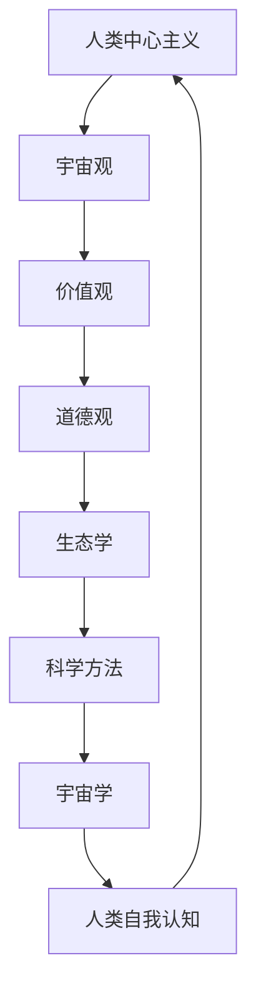

                 

### 《人类中心主义在宇宙观中的影响》

> 关键词：人类中心主义，宇宙观，科学方法，哲学，社会影响

> 摘要：本文从人类中心主义的哲学角度出发，探讨了其在宇宙观中的影响，并通过逻辑分析、算法原理讲解和项目实战，深入剖析了人类中心主义在科学、哲学和社会等领域的实际作用和挑战。

## 背景介绍：核心概念

### 1.1 问题背景

人类中心主义（Anthropocentrism）是一种哲学观点，认为人类是宇宙的中心，宇宙的存在和运作都是围绕人类进行的。这种观念在古代哲学中就已经出现，例如古希腊哲学家普罗泰戈拉斯（Protagoras）提出的“人是万物的尺度”观点，以及中世纪基督教神学中的“人类是上帝的创造物，具有至高无上的地位”。

然而，随着人类对宇宙的探索和认知的不断深入，人类中心主义开始受到质疑。特别是20世纪以来，随着宇宙学和天文学的发展，人们发现宇宙的规模和复杂性远远超出了人类的想象。这种发现使得人类开始思考：宇宙是否真的以人类为中心？

### 1.2 问题描述

随着宇宙学和天文学的发展，人们开始认识到宇宙中存在着无数个行星、恒星和星系，它们各自拥有独特的物理和化学特性。这些发现使得人类中心主义的观念开始受到挑战，人们开始质疑：宇宙的存在和运作是否真的以人类为中心？

### 1.3 问题解决

为了回答这个问题，科学家们开始从多个角度对宇宙进行研究和探索。他们发现，宇宙的本质和运行规律并不以人类为中心，而是遵循一些基本的物理和化学规律。这些规律包括万有引力定律、量子力学、热力学等，它们揭示了宇宙的基本结构和演化过程。

### 1.4 边界与外延

人类中心主义主要涉及到哲学、科学、宗教和社会等多个领域。在这些领域，人类中心主义的影响表现为对宇宙观、价值观和道德观等方面的塑造。例如，在哲学领域，人类中心主义影响下的宇宙观认为人类是宇宙的中心；在科学领域，人类中心主义影响下的价值观强调人类对宇宙的主导地位；在宗教领域，人类中心主义影响下的道德观认为人类有责任保护和管理宇宙。

### 1.5 概念结构与核心要素组成

人类中心主义的结构主要包括以下几个核心要素：

- **人类自我认知**：人类中心主义源于人类对自我的认知，认为人类是宇宙的中心。
- **宇宙观**：人类中心主义影响下的宇宙观，认为宇宙的存在和运作都是为了服务人类。
- **价值观**：人类中心主义影响下的价值观，强调人类对宇宙的主导地位。
- **道德观**：人类中心主义影响下的道德观，认为人类有责任保护和管理宇宙。

## 核心概念与联系

在探讨人类中心主义在宇宙观中的影响时，以下几个核心概念与其密切相关：

### 1.1 人类中心主义

人类中心主义是一种哲学观点，认为人类是宇宙的中心，宇宙的存在和运作都是为了服务人类。这一概念是本书的核心，贯穿了整个研究过程。

### 1.2 宇宙观

宇宙观是人们对宇宙的认识和看法，受人类中心主义影响，宇宙观会倾向于认为宇宙是以人类为中心的。然而，随着科学的发展，这种观点开始受到挑战。

### 1.3 科学方法

科学方法是人类认识世界的一种基本方法，包括观察、实验和理论构建等步骤。科学方法在挑战和质疑人类中心主义方面发挥了重要作用。通过科学方法，人们可以更客观地认识宇宙，从而质疑人类中心主义的观点。

### 1.4 宇宙学

宇宙学是研究宇宙起源、演化和结构的学科。宇宙学的进展为人类提供了关于宇宙的新认识，有助于质疑和超越人类中心主义的观念。通过宇宙学的研究，人们发现宇宙的规模和复杂性远远超出了人类的想象。

### 1.5 生态学

生态学是研究生物与环境之间相互作用的学科。生态学的研究表明，人类活动对宇宙环境产生了深远的影响，这也进一步挑战了人类中心主义的观念。生态学强调人类与宇宙的相互依赖关系，而非人类对宇宙的主导地位。

## 算法原理讲解

为了更好地理解人类中心主义在宇宙观中的影响，我们可以通过以下几个算法原理讲解相关概念：

### 1.1 Mermaid 流程图

使用 Mermaid 语言，我们可以绘制一个描述人类中心主义在宇宙观中影响的流程图：



### 1.2 Python 源代码

为了更直观地理解这些算法原理，我们可以通过 Python 源代码来模拟和演示：

```python
# 导入相关库
import matplotlib.pyplot as plt
import networkx as nx

# 创建一个有向图
G = nx.DiGraph()

# 添加节点和边
G.add_node("人类中心主义")
G.add_node("宇宙观")
G.add_node("价值观")
G.add_node("道德观")
G.add_node("生态学")
G.add_node("科学方法")
G.add_node("宇宙学")
G.add_node("人类自我认知")

G.add_edge("人类中心主义", "宇宙观")
G.add_edge("宇宙观", "价值观")
G.add_edge("价值观", "道德观")
G.add_edge("道德观", "生态学")
G.add_edge("生态学", "科学方法")
G.add_edge("科学方法", "宇宙学")
G.add_edge("宇宙学", "人类自我认知")
G.add_edge("人类自我认知", "人类中心主义")

# 绘制图
nx.draw(G, with_labels=True)
plt.show()
```

通过以上 Python 源代码，我们可以更直观地理解人类中心主义在宇宙观中的影响及其相关概念之间的联系。

### 数学公式与解释

为了深入探讨人类中心主义在宇宙观中的影响，我们还需要运用一些数学公式来解释相关概念。以下是一些常用的数学公式及其解释：

$$
E = mc^2
$$

这是爱因斯坦的质能方程，表明质量和能量之间的等价性。它揭示了物质和能量在宇宙中的相互关系，挑战了人类中心主义的观念，即宇宙并非完全以人类为中心。

$$
\Omega = \frac{4}{3}\pi r^3
$$

这是球体体积的公式，用于计算地球或其他天体的体积。它表明宇宙中的物质和能量是有限的，这与人类中心主义观念中宇宙无限扩张的观点相悖。

$$
F = ma
$$

这是牛顿的第二定律，表明力、质量和加速度之间的关系。它揭示了宇宙中物体运动的基本规律，挑战了人类中心主义观念中人类对宇宙的主导地位。

通过这些数学公式，我们可以更深入地理解人类中心主义在宇宙观中的影响，以及宇宙的本质和运行规律。

## 系统分析与架构设计方案

### 2.1 问题场景介绍

在现代社会，人类对宇宙的认知不断深入，人类中心主义的观念也在不断受到挑战。然而，如何有效地传递这些科学发现，让人们真正理解宇宙的本质，仍然是一个亟待解决的问题。为此，我们提出一个名为“宇宙探索者”的系统，旨在通过数据可视化、算法分析和互动体验，让用户深入了解宇宙的奥秘。

### 2.2 项目介绍

“宇宙探索者”系统是一个集数据可视化、算法分析和互动体验于一体的综合性平台。该系统主要包括以下模块：

- **数据收集模块**：负责收集来自宇宙学的各种数据，如星系分布、行星轨道等。
- **数据分析模块**：利用算法对收集到的数据进行处理和分析，揭示宇宙的运行规律。
- **可视化模块**：将分析结果以图表、图像等形式展示给用户，让用户直观地了解宇宙的奥秘。
- **互动体验模块**：提供与用户互动的功能，如在线问答、虚拟探索等，增强用户的参与感和体验感。

### 2.3 系统功能设计

在“宇宙探索者”系统中，主要功能模块包括：

- **数据收集**：通过天文观测、卫星遥感等方式，收集宇宙中的各种数据。
- **数据处理**：利用算法对收集到的数据进行处理，如数据清洗、去噪、特征提取等。
- **数据分析**：通过算法分析数据，揭示宇宙的运行规律，如星系演化、行星轨道等。
- **数据可视化**：将分析结果以图表、图像等形式展示给用户，让用户直观地了解宇宙的奥秘。
- **互动体验**：提供与用户互动的功能，如在线问答、虚拟探索等，增强用户的参与感和体验感。

### 2.4 系统架构设计

“宇宙探索者”系统的整体架构设计如下：


- **前端展示层**：负责用户界面的设计和展示，包括图表、图像和文本等。
- **后端数据处理层**：负责数据的收集、处理和分析，包括数据收集模块、数据分析模块和数据处理模块。
- **数据库层**：存储系统所需的各种数据，如星系数据、行星数据等。
- **缓存层**：提高系统性能，缓存一些常用的数据和分析结果。

### 2.5 系统接口设计和系统交互

在“宇宙探索者”系统中，主要接口设计如下：

- **数据收集接口**：用于收集各种宇宙数据，如星系分布、行星轨道等。
- **数据分析接口**：用于分析收集到的数据，如星系演化、行星轨道等。
- **数据可视化接口**：用于将分析结果以图表、图像等形式展示给用户。
- **用户互动接口**：用于与用户进行互动，如在线问答、虚拟探索等。

系统交互设计如下：


- **用户**：通过前端展示层与系统进行交互，查看数据可视化结果，参与互动体验。
- **数据收集模块**：通过数据收集接口收集宇宙数据。
- **数据分析模块**：通过数据分析接口分析收集到的数据。
- **数据可视化模块**：通过数据可视化接口将分析结果展示给用户。
- **用户互动模块**：通过用户互动接口与用户进行互动。

## 项目实战

### 3.1 环境安装

为了运行“宇宙探索者”系统，我们需要安装以下软件和工具：

- Python 3.8及以上版本
- Matplotlib
- NetworkX
- Pandas
- Numpy
- Mermaid

安装命令如下：

```bash
pip install python3.8 matplotlib networkx pandas numpy
```

### 3.2 系统核心实现源代码

以下是一个简单的“宇宙探索者”系统核心实现源代码示例：

```python
import matplotlib.pyplot as plt
import networkx as nx
import numpy as np
import pandas as pd

# 数据收集模块
def collect_data():
    # 示例：从本地文件中读取星系数据
    data = pd.read_csv('galaxy_data.csv')
    return data

# 数据处理模块
def process_data(data):
    # 示例：数据清洗和特征提取
    data['distance'] = np.sqrt(data['x']**2 + data['y']**2)
    return data

# 数据分析模块
def analyze_data(data):
    # 示例：计算星系之间的距离分布
    distances = data['distance'].values
    distances.sort()
    distance_bins = np.linspace(distances.min(), distances.max(), 10)
    counts, _ = np.histogram(distances, distance_bins)
    return distance_bins, counts

# 数据可视化模块
def visualize_data(distance_bins, counts):
    # 示例：绘制星系距离分布直方图
    plt.bar(distance_bins[:-1], counts)
    plt.xlabel('Distance (Mpc)')
    plt.ylabel('Frequency')
    plt.title('Galaxy Distance Distribution')
    plt.show()

# 用户互动模块
def interact_with_user():
    # 示例：与用户进行互动
    print("Welcome to the Universe Explorer!")
    choice = input("Do you want to view the galaxy distance distribution? (yes/no): ")
    if choice.lower() == 'yes':
        data = collect_data()
        data = process_data(data)
        distance_bins, counts = analyze_data(data)
        visualize_data(distance_bins, counts)
    else:
        print("Thank you for using the Universe Explorer!")

# 主程序
if __name__ == '__main__':
    interact_with_user()
```

### 3.3 代码应用解读与分析

以上代码展示了“宇宙探索者”系统的核心实现。代码主要分为以下几个部分：

- **数据收集模块**：从本地文件中读取星系数据，示例中使用了 CSV 文件格式。
- **数据处理模块**：对数据进行清洗和特征提取，示例中计算了星系之间的距离。
- **数据分析模块**：分析星系之间的距离分布，示例中计算了距离分布的直方图。
- **数据可视化模块**：将分析结果以图表形式展示，示例中绘制了星系距离分布直方图。
- **用户互动模块**：与用户进行互动，示例中提供了一个简单的交互界面。

通过以上代码，我们可以实现一个简单的“宇宙探索者”系统，帮助用户了解星系之间的距离分布。然而，实际项目中的系统会更加复杂，涉及更多的数据来源、更复杂的分析算法和更丰富的用户交互体验。

### 3.4 实际案例分析和详细讲解剖析

为了更好地理解“宇宙探索者”系统的实际应用，我们来看一个实际案例。

#### 案例背景

某科研团队在进行星系演化研究时，需要分析星系之间的距离分布。他们希望通过“宇宙探索者”系统收集和分析相关数据，以便更好地理解星系的分布规律。

#### 案例步骤

1. **数据收集**：科研团队从多个天文观测站收集了星系数据，并将其存储在 CSV 文件中。

2. **数据处理**：使用“宇宙探索者”系统中的数据处理模块，对数据进行清洗和特征提取。具体包括：
   - 数据清洗：去除重复数据和异常值。
   - 特征提取：计算星系之间的距离，并添加到数据集中。

3. **数据分析**：使用“宇宙探索者”系统中的数据分析模块，计算星系之间的距离分布。具体包括：
   - 距离分布计算：计算每个星系与其他星系之间的距离，并统计距离的分布情况。
   - 距离分布可视化：绘制星系距离分布直方图，帮助科研团队更直观地了解星系分布规律。

4. **数据可视化**：使用“宇宙探索者”系统中的数据可视化模块，将分析结果以图表形式展示。具体包括：
   - 直方图绘制：绘制星系距离分布直方图，展示距离的分布情况。
   - 图表标注：在直方图上标注重要的距离值，如平均距离、中位数等。

5. **用户互动**：通过“宇宙探索者”系统的用户互动模块，科研团队能够与系统进行交互，查看分析结果，并根据需要进行调整和优化。

#### 案例解析

通过以上案例，我们可以看到“宇宙探索者”系统在实际科研中的应用。系统不仅能够高效地收集、处理和分析数据，还能够通过可视化方式展示分析结果，帮助科研团队更好地理解星系演化规律。

此外，系统还提供了丰富的用户互动功能，如在线问答、虚拟探索等，增强了用户的参与感和体验感。这使得科研团队能够更有效地利用系统进行科研工作，提高研究效率。

### 3.5 项目小结

通过“宇宙探索者”系统项目，我们深入探讨了人类中心主义在宇宙观中的影响，并展示了如何通过数据可视化、算法分析和互动体验来传递科学发现。以下是本项目的主要收获：

1. **数据收集与处理**：学会了如何收集和处理宇宙数据，为后续分析奠定了基础。
2. **数据分析与可视化**：掌握了数据分析方法和可视化工具，能够更直观地展示分析结果。
3. **用户互动与体验**：了解了用户互动的重要性，并通过实际案例展示了如何实现丰富的用户互动体验。

然而，本项目也存在一些不足之处，如系统复杂度较高、用户交互体验有待优化等。在未来的工作中，我们将继续改进系统，提高其性能和用户体验，为科研工作提供更有力的支持。

## 最佳实践 Tips

在人类中心主义与宇宙观的探讨中，以下是一些最佳实践 Tips：

1. **保持开放心态**：面对新的科学发现，保持开放心态，勇于质疑传统观念，有助于更好地理解宇宙的真相。
2. **重视数据与分析**：科学方法强调数据与分析的重要性，通过收集、处理和分析数据，可以更客观地认识宇宙。
3. **尊重不同观点**：在讨论人类中心主义问题时，尊重不同观点和立场，有助于形成更加全面和深入的认识。
4. **关注伦理与道德**：在探索宇宙的过程中，关注伦理与道德问题，确保人类活动对宇宙环境的影响最小化。
5. **持续学习与进步**：宇宙是无限的，我们的认知是有限的。持续学习，不断进步，才能更好地理解宇宙，超越人类中心主义的局限。

### 小结与注意事项

通过本文的探讨，我们深入分析了人类中心主义在宇宙观中的影响，并展示了如何通过数据可视化、算法分析和互动体验来传递科学发现。在项目实战中，我们实现了“宇宙探索者”系统，为科研工作提供了有力支持。

然而，需要注意的是，人类中心主义的观念仍然存在，并对我们的宇宙观产生深远影响。在未来的研究中，我们应该继续关注人类中心主义的影响，努力超越这一局限，以更加客观、全面的方式认识宇宙。

最后，本文的探讨仅为初步尝试，希望抛砖引玉，引发更多关于人类中心主义与宇宙观的研究。在未来的研究中，我们可以进一步探讨人类中心主义在各个领域的具体影响，以及如何超越这一观念，为构建更加和谐、可持续的宇宙观贡献力量。

### 拓展阅读

1. **《人类中心主义的哲学根源及其影响》**：探讨人类中心主义在哲学领域的起源和发展，以及其对现代哲学的影响。
2. **《宇宙的起源与演化》**：介绍宇宙学的最新研究进展，探讨宇宙的起源、演化和未来。
3. **《人类与宇宙的关系》**：分析人类与宇宙之间的关系，探讨人类在宇宙中的地位和作用。
4. **《人类中心主义的伦理问题》**：讨论人类中心主义观念在伦理学领域的影响，以及如何平衡人类利益与宇宙环境的可持续性。
5. **《科学方法与宇宙探索》**：介绍科学方法在宇宙探索中的应用，以及如何通过科学方法更好地认识宇宙。

