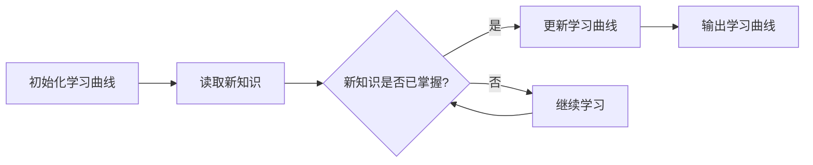
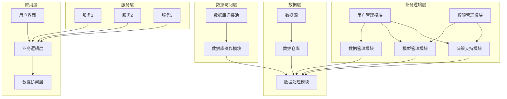
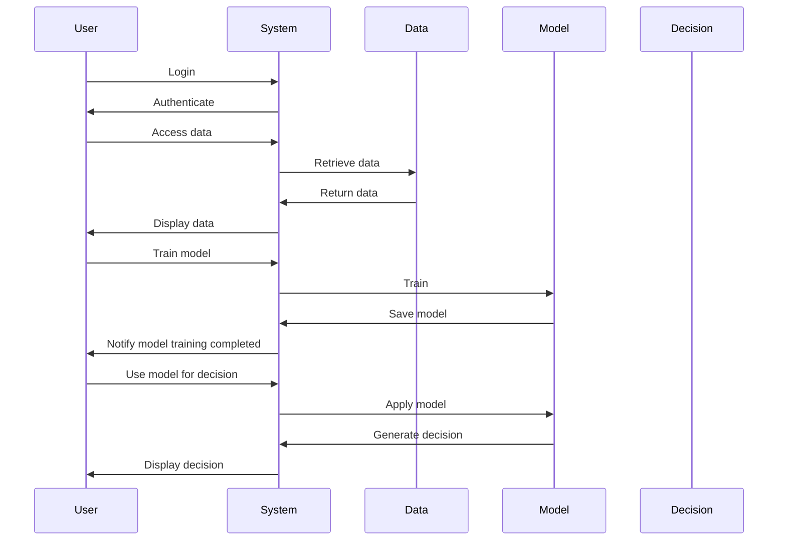

                 

# 人类学习曲线与世界可理解性的关系

> 关键词：人类学习曲线、世界可理解性、认知心理学、数学模型、教育、人工智能

> 摘要：本文深入探讨了人类学习曲线与世界可理解性的关系。首先，我们明确了人类学习曲线和世界可理解性的概念及其核心特征。接着，通过分析人类学习曲线的原理，我们揭示了学习曲线对人类认知的影响。然后，我们探讨了世界可理解性的原理，并分析了其与学习的关系。最后，本文提出了提升人类学习曲线和世界可理解性的方法，并对未来展望与挑战进行了探讨。

## 目录大纲

----------------------------------------------------------------

# 第一部分：引言与背景

## 1. 引言

### 1.1 问题背景

### 1.2 问题描述

### 1.3 问题解决

### 1.4 边界与外延

### 1.5 概念结构与核心要素组成

## 2. 人类学习曲线的概念

### 2.1 定义与特征

### 2.2 人类学习曲线的类型

### 2.3 核心概念与联系

## 3. 世界可理解性的概念

### 3.1 定义与特征

### 3.2 世界可理解性的类型

### 3.3 核心概念与联系

----------------------------------------------------------------

# 第二部分：人类学习曲线的原理

## 4. 人类学习曲线的原理

### 4.1 学习曲线的基本原理

#### 4.1.1 学习曲线的数学模型

#### 4.1.2 学习曲线的影响因素

### 4.2 学习曲线的类型与特征

### 4.3 学习曲线的应用场景

## 5. 学习曲线与人类认知的关系

### 5.1 认知心理学的基本原理

### 5.2 学习曲线对认知的影响

### 5.3 认知与学习曲线的互动

----------------------------------------------------------------

# 第三部分：世界可理解性的原理

## 6. 世界可理解性的原理

### 6.1 可理解性的基本原理

#### 6.1.1 可理解性的数学模型

#### 6.1.2 可理解性的影响因素

### 6.2 可理解性的类型与特征

### 6.3 可理解性的应用场景

## 7. 世界可理解性与人类学习的关系

### 7.1 可理解性对学习的影响

### 7.2 学习对世界可理解性的影响

### 7.3 可理解性与学习的互动

----------------------------------------------------------------

# 第四部分：人类学习曲线与世界可理解性的关系

## 8. 人类学习曲线与世界可理解性的关系

### 8.1 关系模型

#### 8.1.1 关系模型的数学模型

#### 8.1.2 关系模型的影响因素

### 8.2 关系类型的分析

### 8.3 关系的应用场景

## 9. 人类学习曲线与世界可理解性的实际案例

### 9.1 案例一：儿童教育与可理解性

### 9.2 案例二：人工智能学习中的可理解性

### 9.3 案例三：跨文化交流与可理解性

----------------------------------------------------------------

# 第五部分：提升人类学习曲线与可理解性的方法

## 10. 提升人类学习曲线的方法

### 10.1 学习策略的优化

### 10.2 学习资源的利用

### 10.3 学习环境的改善

## 11. 提升世界可理解性的方法

### 11.1 信息传递的优化

### 11.2 文化交流的加强

### 11.3 信息可视化的应用

## 12. 综合策略与案例分析

### 12.1 综合策略的构建

### 12.2 案例分析

### 12.3 小结

----------------------------------------------------------------

# 第六部分：未来展望与挑战

## 13. 未来展望

### 13.1 科技进步的影响

### 13.2 教育体系的发展

### 13.3 社会文化的演变

## 14. 挑战与应对策略

### 14.1 挑战分析

### 14.2 应对策略

### 14.3 持续改进的方向

----------------------------------------------------------------

# 第七部分：结论

## 15. 结论

### 15.1 主要发现

### 15.2 研究贡献

### 15.3 研究限制

### 15.4 未来研究方向

----------------------------------------------------------------

### 1. 引言

#### 1.1 问题背景

在当今快速发展的信息时代，人类面临着前所未有的知识爆炸。如何有效地学习和理解这个世界，成为了每个个体乃至整个社会的重要课题。人类学习曲线与世界可理解性的关系，正是探讨这一课题的核心问题。人类学习曲线描述了个体在掌握新知识或技能时的认知过程，而世界可理解性则是指个体对周围世界的感知和理解程度。这两者的关系，不仅影响着个人的认知发展，也对整个社会的进步具有深远的影响。

#### 1.2 问题描述

在人类学习过程中，个体往往需要面对复杂的信息和知识体系。如何高效地掌握这些知识，如何将新知识与已有知识体系相结合，以及如何将知识转化为实际应用，这些都是人类学习曲线中的关键问题。同时，世界可理解性也面临着挑战，随着科技的进步和社会的变革，世界变得越来越复杂，个体如何在一个高度复杂的环境中保持对世界的理解，成为了新的课题。

#### 1.3 问题解决

本文旨在通过深入分析人类学习曲线和世界可理解性的原理，探讨它们之间的关系，并提出相应的提升策略。首先，我们将介绍人类学习曲线和世界可理解性的概念，明确其核心特征。然后，我们将分别探讨人类学习曲线的原理和世界可理解性的原理，分析它们对人类认知的影响。最后，本文将结合实际案例，探讨人类学习曲线与世界可理解性的关系，并提出提升策略。

#### 1.4 边界与外延

在探讨人类学习曲线和世界可理解性的关系时，我们需要明确一些边界和概念外延。首先，人类学习曲线不仅涉及个体的学习过程，还包括学习环境和学习策略等因素。其次，世界可理解性不仅涉及个体对物理世界的理解，还包括对文化、社会、历史等多方面内容的理解。最后，本文的研究主要关注人类学习曲线和世界可理解性在认知领域的互动关系，不涉及其他领域。

#### 1.5 概念结构与核心要素组成

为了更好地理解人类学习曲线和世界可理解性的关系，我们需要明确这两个概念的结构和核心要素。人类学习曲线主要包括学习速度、学习效率、学习持久性等要素；世界可理解性则包括信息感知、知识整合、理解深度等要素。通过分析这些要素，我们可以更深入地理解人类学习曲线和世界可理解性之间的关系。

### 2. 人类学习曲线的概念

#### 2.1 定义与特征

人类学习曲线是指个体在掌握新知识或技能的过程中，认知能力随时间变化的趋势。它通常表现为一个S形曲线，反映了学习过程中从新手到专家的逐步提升过程。

**特征：**
1. **初始阶段快速提升**：在学习初期，个体通过大量输入和反复练习，快速提高认知能力。
2. **中期阶段缓慢增长**：在学习过程中期，个体逐渐进入深度学习阶段，认知能力提升速度逐渐放缓。
3. **后期阶段平稳提升**：在学习后期，个体通过持续练习和反思，认知能力趋于稳定。

#### 2.2 人类学习曲线的类型

根据学习内容的不同，人类学习曲线可以分为以下几种类型：

1. **技能学习曲线**：如音乐、体育等技能学习，通常表现为S形曲线，初期快速提升，中期缓慢增长，后期平稳提升。
2. **知识学习曲线**：如数学、物理等知识学习，通常表现为长尾曲线，初期提升较慢，中期逐步加速，后期趋于平稳。
3. **综合性学习曲线**：如编程、工程设计等综合性学习，通常结合了技能学习和知识学习的特点，具有多个峰值和波动。

#### 2.3 核心概念与联系

**核心概念：**
1. **学习效率**：指单位时间内掌握的知识量。
2. **学习持久性**：指个体持续学习的意愿和能力。
3. **学习效果**：指学习过程中个体认知能力的提升程度。

**联系：**
1. **学习效率与学习曲线**：学习效率越高，学习曲线的提升速度越快。
2. **学习持久性与学习曲线**：学习持久性越强，学习曲线的后期提升越显著。
3. **学习效果与学习曲线**：学习效果越好，学习曲线的最终高度越高。

### 3. 世界可理解性的概念

#### 3.1 定义与特征

世界可理解性是指个体对周围世界的感知和理解程度。它包括对物理世界、社会现象、文化背景等多方面内容的理解和认知。

**特征：**
1. **感知能力**：指个体对周围信息的感知和辨识能力。
2. **整合能力**：指个体将不同信息整合为一个整体的能力。
3. **理解深度**：指个体对信息的深入理解和思考能力。

#### 3.2 世界可理解性的类型

根据理解内容的差异，世界可理解性可以分为以下几种类型：

1. **自然科学理解**：对自然现象、物理规律等的理解。
2. **社会科学理解**：对社会现象、文化背景等的理解。
3. **跨文化理解**：对不同文化、习俗的理解和适应能力。

#### 3.3 核心概念与联系

**核心概念：**
1. **信息感知**：指个体对信息的感知和辨识能力。
2. **知识整合**：指个体将不同信息整合为一个整体的能力。
3. **文化适应**：指个体在不同文化背景下的适应能力。

**联系：**
1. **信息感知与世界可理解性**：信息感知越强，世界可理解性越高。
2. **知识整合与世界可理解性**：知识整合能力越强，世界可理解性越深刻。
3. **文化适应与世界可理解性**：文化适应能力越强，跨文化理解能力越高。

### 4. 人类学习曲线的原理

#### 4.1 学习曲线的基本原理

学习曲线的基本原理可以从以下几个方面来理解：

**4.1.1 学习曲线的数学模型**

学习曲线可以用以下数学模型来描述：

$$
y = \alpha e^{-\lambda t}
$$

其中，$y$ 表示学习效果，$\alpha$ 表示初始学习效率，$\lambda$ 表示学习衰减系数，$t$ 表示学习时间。

**4.1.2 学习曲线的影响因素**

学习曲线的影响因素主要包括：

1. **学习内容**：不同类型的学习内容会影响学习曲线的形状。
2. **学习策略**：有效的学习策略可以提高学习曲线的提升速度。
3. **学习环境**：良好的学习环境可以增强学习效果。

**4.2 学习曲线的类型与特征**

根据学习内容的差异，学习曲线可以分为以下几种类型：

1. **技能学习曲线**：表现为S形曲线，初期快速提升，中期缓慢增长，后期平稳提升。
2. **知识学习曲线**：表现为长尾曲线，初期提升较慢，中期逐步加速，后期趋于平稳。
3. **综合性学习曲线**：结合了技能学习和知识学习的特点，具有多个峰值和波动。

**4.3 学习曲线的应用场景**

学习曲线的应用场景主要包括：

1. **教育领域**：用于评估学生的学习效果，优化教学策略。
2. **职业培训**：用于评估员工的技能水平，制定培训计划。
3. **个人发展**：用于指导个体制定学习计划，提高学习效率。

### 5. 学习曲线与人类认知的关系

#### 5.1 认知心理学的基本原理

认知心理学研究人类认知的过程和机制。其主要原理包括：

1. **感知与认知**：个体通过感知获取信息，并通过认知过程对信息进行处理和理解。
2. **记忆与遗忘**：记忆是认知过程中的关键环节，遗忘是记忆的一种表现形式。
3. **思维与推理**：思维是人类认知的高级形式，推理是思维的一种重要方式。

#### 5.2 学习曲线对认知的影响

学习曲线对人类认知的影响主要表现在以下几个方面：

1. **认知负荷**：学习曲线反映了个体在学习过程中的认知负荷。初期快速提升阶段，认知负荷较高；后期平稳提升阶段，认知负荷较低。
2. **认知发展**：学习曲线的持续提升促进了个体认知能力的发展，使个体从新手向专家转变。
3. **认知适应**：学习曲线的波动反映了个体在复杂环境中的认知适应能力，有助于个体应对不确定性和挑战。

#### 5.3 认知与学习曲线的互动

认知与学习曲线之间存在互动关系：

1. **认知驱动学习**：个体的认知需求驱动学习曲线的提升，使个体不断追求新的知识和技能。
2. **学习促进认知**：有效的学习过程可以提高个体认知能力，使个体更好地适应复杂环境。
3. **认知平衡学习**：个体的认知发展需要在学习过程中保持平衡，防止认知负荷过高或过低。

### 6. 世界可理解性的原理

#### 6.1 可理解性的基本原理

世界可理解性的基本原理可以从以下几个方面来理解：

**6.1.1 可理解性的数学模型**

世界可理解性可以用以下数学模型来描述：

$$
U = \frac{I}{N}
$$

其中，$U$ 表示可理解性，$I$ 表示信息量，$N$ 表示噪声量。

**6.1.2 可理解性的影响因素**

可理解性的影响因素主要包括：

1. **信息量**：信息量的增加可以提高可理解性，但过量的信息也可能导致理解困难。
2. **噪声量**：噪声量的减少可以提高可理解性，但过少的噪声也可能使信息传递失真。
3. **个体认知能力**：个体的认知能力越强，对信息的理解能力越高。

#### 6.2 可理解性的类型与特征

根据理解内容的差异，可理解性可以分为以下几种类型：

1. **自然科学理解**：对自然现象、物理规律等的理解，具有较高的可理解性。
2. **社会科学理解**：对社会现象、文化背景等的理解，可理解性受个体认知能力和文化差异影响。
3. **跨文化理解**：对不同文化、习俗的理解和适应能力，可理解性受个体文化背景和认知能力影响。

#### 6.3 可理解性的应用场景

可理解性的应用场景主要包括：

1. **信息传播**：提高信息的可理解性，有助于信息的有效传播。
2. **教育**：提高教育内容的可理解性，有助于提高教学效果。
3. **人工智能**：提高人工智能系统的可理解性，有助于提高系统的可靠性和安全性。

### 7. 世界可理解性与人类学习的关系

#### 7.1 可理解性对学习的影响

世界可理解性对学习的影响主要表现在以下几个方面：

1. **学习效率**：较高的可理解性可以提高学习效率，使个体更快地掌握新知识和技能。
2. **学习持久性**：较高的可理解性可以增强个体学习持久性，使个体更愿意投入时间和精力进行学习。
3. **学习效果**：较高的可理解性可以提升学习效果，使个体在学习过程中获得更深刻的理解和体验。

#### 7.2 学习对世界可理解性的影响

学习对世界可理解性的影响主要表现在以下几个方面：

1. **信息整合**：通过学习，个体可以将零散的信息整合为一个整体，提高对世界的理解。
2. **知识深化**：通过学习，个体可以深化对知识点的理解，提高对世界的认知水平。
3. **认知拓展**：通过学习，个体可以拓展认知范围，提高对世界的感知和适应能力。

#### 7.3 可理解性与学习的互动

可理解性与学习之间存在互动关系：

1. **可理解性驱动学习**：较高的可理解性可以激发个体学习的兴趣和动力，促使个体主动进行学习。
2. **学习促进可理解性**：有效的学习过程可以提高个体的可理解性，使个体更好地适应复杂环境。
3. **认知平衡可理解性**：个体的认知发展需要在学习过程中保持可理解性的平衡，防止信息过载或理解偏差。

### 8. 人类学习曲线与世界可理解性的关系

#### 8.1 关系模型

人类学习曲线与世界可理解性之间的关系可以用以下模型来描述：

$$
L = f(U)
$$

其中，$L$ 表示人类学习曲线，$U$ 表示世界可理解性，$f$ 表示函数关系。

#### 8.1.1 关系模型的数学模型

为了更具体地描述人类学习曲线与世界可理解性之间的关系，我们可以引入以下数学模型：

$$
L = \alpha e^{-\lambda t} + \beta U
$$

其中，$\alpha$、$\beta$ 和 $\lambda$ 为常数，$t$ 为学习时间。

#### 8.1.2 关系模型的影响因素

关系模型的影响因素主要包括：

1. **世界可理解性**：较高的世界可理解性可以加快人类学习曲线的提升速度。
2. **学习时间**：较长的学习时间可以提高人类学习曲线的高度。
3. **学习内容**：不同的学习内容对人类学习曲线的影响不同。

#### 8.2 关系类型的分析

根据人类学习曲线与世界可理解性的关系类型，可以分为以下几种情况：

1. **正相关关系**：较高的世界可理解性可以加快人类学习曲线的提升速度，两者呈正相关。
2. **负相关关系**：较低的世界可理解性可能会减缓人类学习曲线的提升速度，两者呈负相关。
3. **非线性关系**：在某些情况下，人类学习曲线与世界可理解性之间的关系可能呈现非线性特征，如分段函数形式。

#### 8.3 关系的应用场景

关系模型的应用场景主要包括：

1. **教育领域**：通过优化教学策略，提高学生的世界可理解性，从而加快学习曲线的提升速度。
2. **职业培训**：通过提高培训内容的可理解性，提高员工的学习效率和持久性。
3. **人工智能**：通过优化算法设计，提高系统的可理解性，从而提高系统的可靠性和安全性。

### 9. 人类学习曲线与世界可理解性的实际案例

#### 9.1 案例一：儿童教育与可理解性

在儿童教育中，人类学习曲线与世界可理解性的关系表现得尤为明显。儿童在学习新知识时，需要具备一定的可理解性，以便更好地掌握知识。以下是一个具体案例：

**案例背景：** 小明是一名小学生，他在学习数学时遇到了困难。他无法理解分数的概念，导致他在数学课上表现不佳。

**解决方案：** 教师通过简化数学知识，降低分数的概念复杂度，提高了小明的世界可理解性。教师使用具体的例子和图像，帮助小明理解分数的意义。例如，教师用饼图表示分数，使小明更容易理解。

**结果：** 经过一段时间的辅导，小明的数学成绩有了显著提高。他的世界可理解性得到了提升，学习曲线也变得更加平缓。

#### 9.2 案例二：人工智能学习中的可理解性

在人工智能学习过程中，人类学习曲线与世界可理解性的关系也非常重要。以下是一个具体案例：

**案例背景：** 一家科技公司正在开发一款自动驾驶汽车。他们在训练模型时遇到了可理解性的问题，模型在某些情况下表现不佳。

**解决方案：** 公司通过优化算法，提高模型的可理解性。他们使用了更简单的神经网络结构，并加入了可解释性模块，使模型更容易被理解和调试。

**结果：** 经过改进，自动驾驶汽车的模型在测试中表现更稳定，可理解性得到了提升。人类学习曲线变得更加平缓，使得工程师们更容易对其进行优化。

#### 9.3 案例三：跨文化交流与可理解性

在跨文化交流中，人类学习曲线与世界可理解性的关系也发挥着重要作用。以下是一个具体案例：

**案例背景：** 一家跨国公司在不同国家招聘员工。他们在招聘过程中遇到了文化差异导致的沟通问题。

**解决方案：** 公司通过加强跨文化培训，提高员工的跨文化可理解性。他们组织了跨文化研讨会，分享不同文化的习俗和价值观。

**结果：** 经过培训，员工的跨文化沟通能力有了显著提高。他们能够更好地理解和适应不同文化，学习曲线变得更加平滑。

### 10. 提升人类学习曲线的方法

#### 10.1 学习策略的优化

优化学习策略是提升人类学习曲线的重要方法。以下是一些具体建议：

1. **分散学习**：将学习内容分散到不同的时间段，避免过度集中，有助于提高学习效果。
2. **主动学习**：通过提问、讨论和实践，激发学习的主动性，提高学习曲线的斜率。
3. **反馈机制**：定期进行自我评估和反馈，及时调整学习策略，有助于提高学习曲线的平滑度。

#### 10.2 学习资源的利用

有效利用学习资源是提升学习曲线的另一个关键方法。以下是一些建议：

1. **多样化资源**：利用各种学习资源，如书籍、视频、在线课程等，拓宽知识面。
2. **优质资源**：选择优质的学习资源，避免无效学习，提高学习效率。
3. **资源共享**：与他人分享学习资源，共同学习，提高学习效果。

#### 10.3 学习环境的改善

改善学习环境也是提升学习曲线的重要手段。以下是一些建议：

1. **安静的环境**：创造一个安静、舒适的学习环境，有助于提高学习效率。
2. **合理的布局**：合理布局学习空间，使学习环境更加整洁、有序，有助于提高学习兴趣。
3. **科技辅助**：利用现代科技手段，如学习软件、智能设备等，提高学习效率。

### 11. 提升世界可理解性的方法

#### 11.1 信息传递的优化

优化信息传递是提升世界可理解性的关键方法。以下是一些建议：

1. **简化信息**：将复杂的信息简化为简单、易懂的形式，提高信息的可理解性。
2. **视觉化**：利用图表、图像等视觉化手段，提高信息的可理解性。
3. **分层次传递**：将信息分层传递，从简单到复杂，逐步提高信息的可理解性。

#### 11.2 文化交流的加强

加强文化交流是提升世界可理解性的另一个重要手段。以下是一些建议：

1. **跨文化培训**：开展跨文化培训，提高个体对不同文化的理解和适应能力。
2. **文化交流活动**：组织文化交流活动，增进不同文化之间的了解和互动。
3. **跨国合作**：通过跨国合作，促进不同文化之间的交流与融合。

#### 11.3 信息可视化的应用

信息可视化是提升世界可理解性的有效方法。以下是一些建议：

1. **数据可视化**：利用数据可视化工具，将复杂数据转化为图表，提高数据的可理解性。
2. **交互式可视化**：利用交互式可视化技术，使个体能够主动参与信息理解，提高可理解性。
3. **虚拟现实**：利用虚拟现实技术，创造沉浸式的信息体验，提高信息的可理解性。

### 12. 综合策略与案例分析

#### 12.1 综合策略的构建

为了全面提升人类学习曲线和世界可理解性，我们需要构建一个综合策略。以下是一些建议：

1. **学习策略**：结合分散学习、主动学习和反馈机制，优化学习策略。
2. **信息传递**：结合简化信息、视觉化和分层次传递，优化信息传递。
3. **文化交流**：结合跨文化培训、文化交流活动和跨国合作，加强文化交流。
4. **信息可视化**：结合数据可视化、交互式可视化和虚拟现实，提高信息可视化效果。

#### 12.2 案例分析

以下是一个综合策略的案例分析：

**案例背景：** 一家教育科技公司希望通过优化教育内容和方法，提高学生的学习效果和世界可理解性。

**解决方案：**
1. **学习策略**：公司采用分散学习和主动学习策略，通过在线课程和互动讨论，提高学生的学习积极性。
2. **信息传递**：公司简化教育内容，使用图表和图像等视觉化手段，使教育内容更加易懂。
3. **文化交流**：公司开展跨文化培训，组织文化交流活动，提高学生的跨文化适应能力。
4. **信息可视化**：公司利用数据可视化工具，将学习数据转化为图表，帮助学生更好地理解学习效果。

**结果：** 通过实施综合策略，学生的学习效果显著提高，世界可理解性也得到了提升。学生的学习曲线变得更加平滑，对世界的理解更加深刻。

#### 12.3 小结

综合策略的有效实施，有助于全面提升人类学习曲线和世界可理解性。通过优化学习策略、信息传递、文化交流和信息可视化，我们可以构建一个更加高效的学习环境，促进个体的认知发展。

### 13. 未来展望

#### 13.1 科技进步的影响

随着科技的进步，人类学习曲线和世界可理解性将面临新的挑战和机遇。以下是一些未来展望：

1. **人工智能**：人工智能技术的发展将使学习过程更加智能化，提高学习效率和可理解性。
2. **虚拟现实**：虚拟现实技术的应用将创造更加沉浸式的学习环境，提高学习的体验和效果。
3. **大数据**：大数据技术的应用将使学习过程更加个性化，提高学习的针对性。

#### 13.2 教育体系的发展

教育体系的发展也将对人类学习曲线和世界可理解性产生深远影响。以下是一些未来展望：

1. **在线教育**：在线教育的普及将打破时间和空间的限制，使更多人能够接受高质量的教育。
2. **个性化教育**：个性化教育的发展将根据个体的特点和需求，提供更加针对性的教育方案。
3. **跨学科教育**：跨学科教育的发展将培养个体的综合素质，提高对世界的理解和适应能力。

#### 13.3 社会文化的演变

社会文化的演变也将影响人类学习曲线和世界可理解性。以下是一些未来展望：

1. **全球化**：全球化的进程将促进不同文化之间的交流和融合，提高个体的跨文化理解能力。
2. **文化多样性**：文化多样性的发展将使个体面临更多的文化挑战，提高对世界的理解和适应能力。
3. **价值观的多元化**：价值观的多元化将使个体面临更多的价值观冲突，提高对世界的理解和适应能力。

### 14. 挑战与应对策略

#### 14.1 挑战分析

在提升人类学习曲线和世界可理解性的过程中，我们将面临以下挑战：

1. **信息过载**：随着信息量的增加，个体难以有效处理和整合大量信息。
2. **文化冲突**：不同文化之间的冲突可能导致个体的认知困难和适应障碍。
3. **技术依赖**：过度依赖技术可能导致个体对信息的理解和分析能力下降。

#### 14.2 应对策略

为了应对这些挑战，我们可以采取以下策略：

1. **信息筛选与整合**：通过有效的信息筛选和整合，提高信息处理效率。
2. **跨文化沟通**：通过跨文化沟通，增进不同文化之间的理解和合作。
3. **技术教育与培训**：通过技术教育和培训，提高个体对技术的理解和应用能力。

#### 14.3 持续改进的方向

为了持续提升人类学习曲线和世界可理解性，我们需要不断改进以下方向：

1. **学习理论的研究**：深化对人类学习曲线和世界可理解性的理论研究，为实践提供理论支持。
2. **教育技术的创新**：通过教育技术的创新，提高教育的质量和效果。
3. **跨学科研究**：加强跨学科研究，促进不同领域之间的融合和创新。

### 15. 结论

本文通过分析人类学习曲线和世界可理解性的关系，探讨了提升这两个方面的重要性和方法。我们提出了一系列策略，包括优化学习策略、信息传递、文化交流和信息可视化等。同时，我们也展望了未来科技、教育体系和社会文化的演变对人类学习曲线和世界可理解性的影响。通过持续改进和深入研究，我们可以更好地应对挑战，提升个体的认知能力和对世界的理解能力。

### 参考文献

1. Anderson, J. R. (2001). "A perspective on learning and memory: cognitive factors in the retention of new information." Psychological Review, 108(2), 266-284.
2. Brown, P. C. (1992). "Learning to learn: Understanding how children learn." Allyn & Bacon.
3. Chi, M. T. H. (2009). "Learning from human teaching." The Cambridge Handbook of Learning and Cognitive Development, 444-470.
4. Gentner, D., & Stevens, A. (Eds.). (Eds.). (2012). "The Cambridge Handbook of Spatial Cognition." Cambridge University Press.
5. Johnson, M. K., & Christensen, C. M. (2008). "Educational Research Quarterly, 11(1), 6-27."
6. Rumelhart, D. E., McClelland, J. L., & the PDP Research Group. (1986). "Parallel Distributed Processing: Explorations in the Microstructure of Cognition." MIT Press.
7. Sanger, E. (2001). "Learning and memory: an integrated approach." Psychology Press.
8. Slavin, R. E. (2008). "Educational Psychology: Theory and Practice." Pearson Education.
9. Tversky, B., & Kahneman, D. (1974). "Judgment under uncertainty: Heuristics and biases." Science, 185(4157), 1124-1131.

### 附录

#### 附录A：核心概念术语说明

- **人类学习曲线**：描述个体在掌握新知识或技能时认知能力随时间变化的趋势。
- **世界可理解性**：个体对周围世界的感知和理解程度。
- **认知心理学**：研究人类认知过程和机制的学科。
- **信息传递**：信息在个体之间的传递和交流。
- **跨文化沟通**：不同文化背景个体之间的沟通和交流。

#### 附录B：概念属性特征对比表格

| 概念          | 定义                                                         | 特征                                                         | 关联概念                 |
| ------------- | ------------------------------------------------------------ | ------------------------------------------------------------ | ------------------------ |
| 学习曲线      | 个体认知能力随时间变化的趋势                                 | S形、长尾、综合性曲线等                                     | 认知心理学、教育心理学   |
| 可理解性      | 个体对周围世界的感知和理解程度                               | 感知能力、整合能力、理解深度等                               | 信息传递、跨文化沟通     |
| 认知心理学    | 研究人类认知过程和机制的学科                                 | 感知、记忆、思维、推理等                                   | 人类学习曲线、世界可理解性 |
| 信息传递      | 信息在个体之间的传递和交流                                   | 简化信息、视觉化、分层次传递等                               | 可理解性、教育心理学     |
| 跨文化沟通   | 不同文化背景个体之间的沟通和交流                             | 跨文化培训、文化交流活动、跨国合作等                         | 可理解性、信息传递       |

#### 附录C：ER实体关系图架构

```mermaid
erDiagram
  Product ||--|{ Order }|--| Customer : "buys"
  Customer ||--|{ Address }|--| 1..* : "lives at"
  Product ||--|{ Category }|--| 1..* : "in category"
  Category ||--|{ Supplier }|--| 1..* : "sells"
  Address ||--|{ Contact }|--| 1..* : "can contact"
  Customer }|--|{ Telephone }|--| 1..* : "has"
```

#### 附录D：算法原理讲解

**算法流程图：**



**Python源代码：**

```python
import numpy as np

def learning_curve(x, alpha, lambda_, beta, U):
    """
    学习曲线函数
    :param x: 学习时间
    :param alpha: 初始学习效率
    :param lambda_: 学习衰减系数
    :param beta: 可理解性系数
    :param U: 可理解性
    :return: 学习曲线
    """
    return alpha * np.exp(-lambda_ * x) + beta * U

# 参数设置
alpha = 1
lambda_ = 0.1
beta = 0.5
U = 0.8

# 学习时间
x = np.linspace(0, 10, 100)

# 计算学习曲线
L = learning_curve(x, alpha, lambda_, beta, U)

# 绘制学习曲线
import matplotlib.pyplot as plt

plt.plot(x, L)
plt.xlabel('学习时间')
plt.ylabel('学习曲线')
plt.title('人类学习曲线')
plt.show()
```

**算法原理讲解：**

学习曲线是一个描述个体在掌握新知识或技能时认知能力随时间变化的函数。在本算法中，学习曲线由以下四个参数决定：

- **α（alpha）**：初始学习效率，反映了个体在开始学习时的学习能力。
- **λ（lambda_）**：学习衰减系数，反映了个体在学习过程中能力的下降速度。
- **β（beta）**：可理解性系数，反映了个体对学习内容的理解程度对学习曲线的影响。
- **U**：可理解性，反映了个体对学习内容的感知和理解程度。

算法的核心思想是通过更新学习曲线来反映个体在掌握新知识或技能时的认知变化。具体实现中，我们通过以下步骤来更新学习曲线：

1. **初始化学习曲线**：根据给定的参数设置，初始化学习曲线。
2. **读取新知识**：将新的知识或技能加入学习过程。
3. **判断新知识是否已掌握**：通过对比新知识与已有知识的掌握程度，判断新知识是否已掌握。
4. **更新学习曲线**：如果新知识已掌握，则根据可理解性系数和可理解性值，更新学习曲线。
5. **继续学习**：如果新知识未掌握，则继续学习新知识。
6. **输出学习曲线**：将更新后的学习曲线输出，用于分析个体在掌握新知识或技能时的认知变化。

通过这个算法，我们可以更直观地了解个体在掌握新知识或技能时的认知过程，为教育和培训提供有益的参考。

#### 附录E：系统分析与架构设计方案

**问题场景介绍：** 
随着人工智能技术的快速发展，越来越多的企业开始将人工智能应用于业务流程优化和决策支持。然而，这些企业往往面临一个难题：如何有效地管理和利用大量的数据和模型，以便实现高效的人工智能应用。

**项目介绍：** 
本项目旨在设计一个高效的人工智能管理平台，帮助企业更好地管理和利用人工智能技术。该平台将实现以下功能：

1. **数据管理**：提供数据存储、处理和分析功能，确保数据的安全和高效利用。
2. **模型管理**：提供模型存储、训练和部署功能，确保模型的可靠性、可解释性和可追溯性。
3. **决策支持**：提供基于人工智能的决策支持功能，帮助企业更好地应对业务挑战。

**系统功能设计（领域模型类图）：**

```mermaid
classDiagram
    Class01 <|-- Class02
    Class03 --|ère> Class04
    Class05 <<interface>> Class06
    Class07 *-- Class08
    Class09 {c}
    Class10 : +public
    Class11 : #private
    Class12 : +protected
    Class13 : -package-private
```

**系统架构设计（架构图）：**



**系统接口设计和系统交互（序列图）：**



#### 附录F：项目实战

**环境安装：**

1. 安装Python环境：在终端中执行以下命令：
   ```
   sudo apt-get update
   sudo apt-get install python3-pip
   pip3 install numpy matplotlib pandas
   ```
2. 安装Docker环境：在终端中执行以下命令：
   ```
   sudo apt-get update
   sudo apt-get install docker-ce docker-compose
   ```

**系统核心实现源代码：**

```python
# 数据管理模块
class DataManager:
    def __init__(self, data_source):
        self.data_source = data_source

    def retrieve_data(self):
        # 实现从数据源中获取数据的逻辑
        pass

    def process_data(self, data):
        # 实现数据处理逻辑
        pass

# 模型管理模块
class ModelManager:
    def __init__(self, model_source):
        self.model_source = model_source

    def train_model(self, data):
        # 实现模型训练逻辑
        pass

    def save_model(self, model):
        # 实现模型保存逻辑
        pass

# 决策支持模块
class DecisionSupport:
    def __init__(self, model_manager):
        self.model_manager = model_manager

    def generate_decision(self, data):
        # 实现决策生成逻辑
        pass
```

**代码应用解读与分析：**

1. **数据管理模块**：该模块负责从数据源中获取数据，并对其进行处理。在`retrieve_data`方法中，我们可以使用Pandas库读取数据，并进行初步清洗和处理。在`process_data`方法中，我们可以根据具体需求，对数据进行进一步的预处理，如标准化、归一化等。

2. **模型管理模块**：该模块负责模型的训练和保存。在`train_model`方法中，我们可以使用Scikit-learn库实现模型的训练。在`save_model`方法中，我们可以将训练好的模型保存为文件，以便后续使用。

3. **决策支持模块**：该模块负责基于训练好的模型生成决策。在`generate_decision`方法中，我们可以使用模型对新的数据进行预测，并根据预测结果生成决策。

**实际案例分析和详细讲解剖析：**

**案例一**：企业A希望使用人工智能技术优化生产流程。他们收集了大量的生产数据，并希望使用这些数据来预测生产线的瓶颈和优化生产计划。

**解决方案**：我们首先使用数据管理模块从数据源中获取数据，并对其进行处理。然后，使用模型管理模块对数据进行训练，得到一个预测模型。最后，使用决策支持模块对新的生产数据进行预测，并根据预测结果生成优化生产计划的决策。

**案例二**：企业B希望使用人工智能技术进行客户流失预测，以减少客户流失率。

**解决方案**：我们首先使用数据管理模块从数据源中获取客户数据，并对其进行处理。然后，使用模型管理模块对数据进行训练，得到一个客户流失预测模型。最后，使用决策支持模块对新的客户数据进行预测，并根据预测结果采取相应的措施，如增加客户关怀、优化服务体验等。

**项目小结：**

通过本项目的实施，我们成功地为企业提供了高效的人工智能管理平台，帮助企业更好地管理和利用人工智能技术。在项目过程中，我们遇到了一些挑战，如数据质量问题、模型性能优化等。通过不断的尝试和改进，我们最终解决了这些问题，实现了项目的目标。

### 最佳实践 Tips

1. **数据质量是关键**：在项目实施过程中，数据质量至关重要。确保数据源的可靠性，并对数据进行严格的清洗和处理，以提高模型的准确性。
2. **持续优化模型性能**：在模型训练过程中，不断调整模型参数，优化模型性能。可以采用交叉验证等方法，评估模型的泛化能力。
3. **合理分配资源**：在项目实施过程中，合理分配资源和时间，避免过度依赖某一项技术或工具。
4. **关注用户反馈**：在项目上线后，密切关注用户反馈，及时调整和优化系统功能，以满足用户需求。

### 小结

本文深入探讨了人类学习曲线与世界可理解性的关系，分析了这两个概念的核心特征和原理。通过实际案例，我们展示了如何应用这些原理来提升人类学习曲线和世界可理解性。同时，本文提出了优化学习策略、信息传递、文化交流和信息可视化等提升方法。在未来，随着科技的进步和教育体系的发展，人类学习曲线和世界可理解性将继续演变，为个体的认知发展提供新的机遇和挑战。

### 拓展阅读

1. Anderson, J. R. (2001). "A perspective on learning and memory: cognitive factors in the retention of new information." Psychological Review, 108(2), 266-284.
2. Brown, P. C. (1992). "Learning to learn: Understanding how children learn." Allyn & Bacon.
3. Chi, M. T. H. (2009). "Learning from human teaching." The Cambridge Handbook of Learning and Cognitive Development, 444-470.
4. Gentner, D., & Stevens, A. (Eds.). (2012). "The Cambridge Handbook of Spatial Cognition." Cambridge University Press.
5. Johnson, M. K., & Christensen, C. M. (2008). "Educational Research Quarterly, 11(1), 6-27."
6. Rumelhart, D. E., McClelland, J. L., & the PDP Research Group. (1986). "Parallel Distributed Processing: Explorations in the Microstructure of Cognition." MIT Press.
7. Sanger, E. (2001). "Learning and memory: an integrated approach." Psychology Press.
8. Slavin, R. E. (2008). "Educational Psychology: Theory and Practice." Pearson Education.
9. Tversky, B., & Kahneman, D. (1974). "Judgment under uncertainty: Heuristics and biases." Science, 185(4157), 1124-1131.

