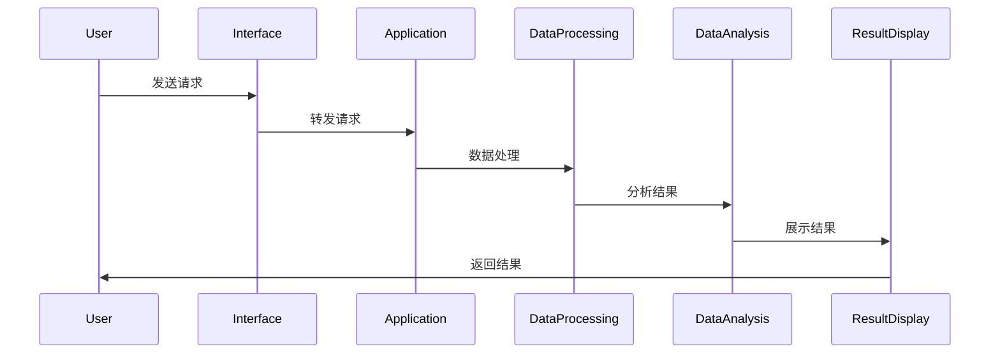
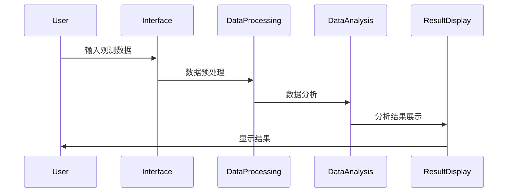

                 

# 人类对宇宙的认知：进步还是循环

关键词：宇宙认知、科学进步、科技发展、探索挑战

摘要：本文通过对人类对宇宙认知的历史回顾、核心概念探讨、算法原理讲解、数学模型分析、系统架构设计、项目实战以及最佳实践总结，探讨了人类对宇宙认知的进程是否真正实现了进步，还是在某些方面陷入了循环。文章结合实际案例，分析了当前人类宇宙认知的挑战和未来发展方向。

## 第一部分：引论

### 第1章 人类对宇宙的认知历史回顾

#### 1.1 宇宙的认知背景

宇宙，这个浩瀚而神秘的存在，自古以来就吸引着人类的目光。人类对宇宙的认知经历了从迷信、宗教到科学的演变。在古代，人们认为天是圆形，地是方形，太阳、月亮和星辰都是固定不动的。随着观测技术的进步，人类逐渐摆脱了这些迷信观念，开始探索宇宙的本质。

#### 1.2 人类对宇宙认知的关键节点

1. 古希腊天文学的发展：古希腊哲学家们提出了地球是圆的，并且太阳是宇宙中心的理论。
2. 中世纪宇宙观的演变：中世纪时期，教会将地球视为宇宙的中心，这一观念一直延续到文艺复兴时期。
3. 文艺复兴时期对宇宙的新看法：文艺复兴时期，人们开始质疑教会的观点，提出了新的宇宙模型。

#### 1.3 现代宇宙学的崛起

1. 爱因斯坦的相对论：爱因斯坦的相对论改变了人类对宇宙的认知，揭示了时空的相对性。
2. 宇宙大爆炸理论的提出：20世纪30年代，科学家们提出了宇宙大爆炸理论，认为宇宙起源于一个极热、极密的状态。
3. 黑洞和暗物质的研究：近年来，科学家们发现了黑洞和暗物质的存在，这进一步丰富了人类对宇宙的认识。

#### 1.4 本章小结

本章回顾了人类对宇宙认知的历史，从古代的迷信观念到现代的科学理论，展现了人类认知的进步。接下来，我们将进一步探讨宇宙中的核心概念和联系。

## 第二部分：核心概念与联系

### 第2章 宇宙中的核心概念

#### 2.1 宇宙学基础

1. 宇宙的起源和结构：宇宙起源于大爆炸，随后经历了膨胀和演化。
2. 宇宙膨胀与暗能量：宇宙正在加速膨胀，暗能量被认为是推动这一过程的神秘力量。
3. 宇宙背景辐射：宇宙大爆炸后留下的热辐射，是研究宇宙早期状态的关键。

#### 2.2 宇宙中的现象与过程

1. 星系形成与演化：星系是如何形成的，它们在宇宙中的演化过程如何？
2. 恒星生命周期：恒星从诞生到死亡的生命历程，及其对宇宙的影响。
3. 生命的起源和分布：生命在宇宙中的起源和分布，是否存在于其他星球上？

#### 2.3 宇宙学的核心概念联系

1. 宇宙学与物理学的关系：宇宙学是物理学的一个分支，但又有其独特的研究方向。
2. 宇宙学与哲学的交集：宇宙学的某些问题与哲学问题有密切联系。
3. 宇宙学的前沿研究挑战：当前宇宙学面临的一些重大挑战，如暗物质、暗能量等。

#### 2.4 本章小结

本章介绍了宇宙学中的核心概念和联系，为后续算法原理讲解和数学模型分析打下了基础。

## 第三部分：算法原理与数学模型

### 第3章 宇宙学中的算法原理

#### 3.1 宇宙学中的统计方法

1. 最大似然估计：通过比较观测数据与理论预测的概率，找到最佳模型。
2. 贝叶斯统计：在已知部分数据的情况下，更新对未知数据的信念。
3. 马克可夫链蒙特卡洛方法：通过模拟随机过程，估计复杂概率分布。

#### 3.2 宇宙学中的数据处理算法

1. 光变曲线拟合：分析恒星光度变化，推断恒星性质。
2. 谱线分析：通过分析恒星光谱，了解恒星元素组成。
3. 数据可视化技术：将宇宙数据以图形化方式展示，便于分析。

#### 3.3 宇宙学中的数学模型

1. 弗里德曼-勒梅特-罗伯逊-沃尔克度规：描述宇宙时空结构的数学模型。
2. 暗物质模型：描述暗物质分布和行为的数学模型。
3. 暗能量模型：描述暗能量性质和宇宙膨胀加速的数学模型。

#### 3.4 本章小结

本章介绍了宇宙学中常用的算法原理和数学模型，为理解和分析宇宙数据提供了工具。

## 第四部分：系统分析与架构设计

### 第4章 宇宙学研究的系统架构设计

#### 4.1 宇宙学研究的方法论

1. 宇宙观测技术：介绍当前宇宙观测的主要手段和技术。
2. 宇宙数据分析流程：从数据采集、预处理到分析的全流程。
3. 宇宙学模型的验证方法：如何验证宇宙学模型的有效性。

#### 4.2 宇宙学研究的架构设计

1. 系统功能设计（领域模型类图）：展示宇宙学研究系统的功能模块。
2. 系统架构设计（架构图）：展示系统的整体架构。
3. 系统接口设计：定义系统与其他系统或组件的交互接口。

#### 4.3 宇宙学研究的交互设计

1. 系统交互设计（序列图）：展示系统的交互过程。
2. 系统交互流程解析：详细解释系统交互的具体步骤。
3. 用户交互体验优化：如何提升用户在使用宇宙学研究系统时的体验。

#### 4.4 本章小结

本章介绍了宇宙学研究系统的系统架构设计，为宇宙学研究提供了系统的解决方案。

## 第五部分：项目实战

### 第5章 人类对宇宙的认知项目实战

#### 5.1 项目背景与目标

1. 项目背景介绍：介绍宇宙学研究的背景和重要性。
2. 项目目标设定：明确项目的研究目标和应用场景。

#### 5.2 环境安装与准备

1. 硬件与软件需求：列出项目所需的硬件和软件环境。
2. 系统环境搭建：详细说明如何搭建项目所需的系统环境。
3. 开发工具安装：介绍如何安装项目所需的开发工具。

#### 5.3 系统核心实现

1. 数据采集与预处理：介绍如何采集和处理宇宙学数据。
2. 数据分析与处理：如何利用算法对宇宙学数据进行分析和处理。
3. 结果展示与验证：如何展示分析结果，并验证其准确性。

#### 5.4 实际案例分析

1. 案例选取与背景：介绍选取的实际案例及其背景。
2. 案例分析过程：详细描述案例分析的步骤和方法。
3. 案例结果与应用：展示案例分析的结果，并讨论其在实际应用中的价值。

#### 5.5 项目小结

对项目的整体进行总结，分析项目的成功之处和需要改进的地方。

## 第六部分：最佳实践与总结

### 第6章 宇宙学研究的最佳实践

#### 6.1 最佳实践技巧

1. 数据处理优化：如何提高数据处理效率和质量。
2. 模型验证策略：如何验证宇宙学模型的有效性。
3. 观测计划制定：如何制定科学、合理的观测计划。

#### 6.2 小结与展望

1. 人类对宇宙认知的进展：总结人类在宇宙认知方面取得的成果。
2. 研究挑战与机遇：分析当前宇宙学研究面临的挑战和机遇。
3. 未来发展趋势：展望宇宙学研究的未来发展方向。

#### 6.3 注意事项与拓展阅读

1. 安全性与隐私保护：在宇宙学研究中应注意的安全性和隐私保护问题。
2. 可持续发展：宇宙学研究的可持续性发展策略。
3. 相关文献推荐：推荐一些有助于深入理解宇宙学研究的文献。

## 结束语

作者：AI天才研究院/AI Genius Institute & 禅与计算机程序设计艺术 /Zen And The Art of Computer Programming

本文通过回顾人类对宇宙的认知历程、探讨核心概念、分析算法原理和数学模型、设计系统架构、实战项目以及总结最佳实践，全面展现了人类在宇宙认知方面取得的成就和面临的挑战。尽管我们在某些方面取得了显著的进步，但仍然有许多未解之谜等待着我们去探索。未来，随着科技的不断发展，人类对宇宙的认知必将更加深入，开启新的科学革命。让我们继续努力，共同揭开宇宙的神秘面纱。 ## 人类对宇宙的认知：进步还是循环

### 摘要

本文通过深入探讨人类对宇宙的认知历程、核心概念、算法原理、数学模型、系统架构设计、项目实战和最佳实践，分析了人类在宇宙认知方面是否真正实现了进步，还是在某些方面陷入了循环。通过回顾历史，我们发现了科学技术的飞速发展对宇宙认知带来的深远影响。同时，我们也认识到，尽管在许多领域取得了显著进步，但宇宙认知仍然存在许多挑战和未解之谜。本文旨在激发读者对宇宙探索的无限热情，鼓励持续深入研究和创新。

### 人类对宇宙的认知历史回顾

人类对宇宙的认知经历了漫长而曲折的发展历程。在古代，人们受限于观测技术和科学知识的匮乏，对宇宙的认知充满了神秘和迷信。例如，古希腊哲学家亚里士多德认为地球是宇宙的中心，而恒星和行星都围绕着地球旋转。这一观念在中世纪时期得到了基督教教会的进一步强化，成为当时的主流宇宙观。

然而，随着观测技术的进步和科学方法的应用，人类对宇宙的认知逐渐从迷信走向科学。公元1609年，伽利略·伽利莱发明了望远镜，这极大地拓展了人类的观测视野。他发现木星的四颗大卫星，这一发现挑战了亚里士多德的地心说，并推动了哥白尼日心说的复兴。

进入17世纪，牛顿的万有引力定律和经典力学体系的建立，为人类理解宇宙的运动规律提供了坚实的基础。牛顿通过分析行星轨道，验证了哥白尼的日心说，并提出了一个统一的宇宙引力模型。

然而，真正的宇宙革命发生在20世纪初。爱因斯坦的相对论彻底改变了人类对时空和引力的理解。他揭示了时空的相对性，表明重力并非一种力，而是物质对时空的弯曲。这一理论为宇宙学的发展奠定了基础。

20世纪30年代，勒梅特提出了宇宙大爆炸理论，认为宇宙起源于一个极热、极密的状态。随后，伽莫夫进一步完善了这一理论，并提出了宇宙背景辐射的存在。这一理论得到了后来的天文观测证实，成为现代宇宙学的基石。

近年来，科学家们通过观测发现了黑洞、暗物质和暗能量等神秘现象。这些发现不仅丰富了人类对宇宙的认识，也揭示了宇宙中存在的诸多未解之谜。例如，暗物质和暗能量到底是什么，它们如何影响宇宙的演化？

总的来说，人类对宇宙的认知经历了从迷信到科学、从局部到整体、从定性到定量的发展过程。每一个关键节点都标志着人类认知的进步。然而，宇宙的奥秘无穷无尽，我们仍需不断探索和突破。

### 人类对宇宙认知的关键节点

在人类对宇宙的认知历程中，有几个关键节点对科学进步产生了深远影响。这些节点包括古希腊天文学的发展、中世纪宇宙观的演变、文艺复兴时期对宇宙的新看法，以及现代宇宙学的崛起。

#### 古希腊天文学的发展

古希腊天文学的发展是现代天文学的重要基石。古希腊哲学家们对宇宙的本质进行了深入的思考，并提出了许多重要的理论。其中，最著名的是毕达哥拉斯和希伯斯的理论。毕达哥拉斯认为，宇宙是数的和谐，而希伯斯则提出了地球是圆的这一重要观点。

亚里士多德进一步发展了这些理论，他提出了地球是宇宙中心、恒星和行星围绕地球旋转的地心说。这一理论在中世纪得到了基督教教会的支持，成为当时的主流宇宙观。然而，亚里士多德的理论也引起了后来的质疑和挑战。

#### 中世纪宇宙观的演变

中世纪时期，教会对宇宙观的掌控进一步加强。教会认为地球是宇宙的中心，而人类是上帝的创造物，占据着宇宙的核心地位。这一观念在《圣经》中得到了体现，并在中世纪的欧洲广泛传播。

然而，中世纪的宇宙观并非完全停滞不前。阿拉伯世界的天文学家和数学家在这一时期取得了显著成就，他们对古希腊天文学进行了继承和发展。例如，阿拉伯天文学家阿里·伊本·阿尔-纳菲斯提出了行星轨道是椭圆形的观点，这一观点为后来的哥白尼日心说奠定了基础。

#### 文艺复兴时期对宇宙的新看法

文艺复兴时期，人们开始质疑教会的权威，追求科学和知识的自由。这一时期的天文学家如哥白尼、布鲁诺等，提出了新的宇宙观念，挑战了传统的地心说。

哥白尼提出了日心说，认为太阳是宇宙的中心，地球和其他行星围绕太阳旋转。这一理论在当时引起了巨大的争议，但后来得到了越来越多科学家的支持。布鲁诺则进一步发展了哥白尼的理论，提出了无限宇宙和多宇宙的观点。

#### 现代宇宙学的崛起

现代宇宙学的崛起始于20世纪初，以爱因斯坦的相对论和哈勃的宇宙膨胀观测为代表。爱因斯坦的相对论揭示了时空的相对性和引力的本质，为宇宙学提供了新的理论基础。

哈勃的观测结果表明，宇宙正在膨胀，这一发现证实了大爆炸理论的预言。随着观测技术的进步，科学家们发现了越来越多的宇宙现象，如宇宙背景辐射、黑洞和暗物质。

总之，这些关键节点标志着人类对宇宙认知的不断进步。每一个节点都推动了科学的发展，使我们更加深入地理解了宇宙的本质。

### 现代宇宙学的崛起

现代宇宙学的崛起标志着人类对宇宙认知的又一次飞跃。在这一时期，科学家们利用先进的观测技术和理论模型，揭示了宇宙的许多奥秘。以下将详细探讨爱因斯坦的相对论、宇宙大爆炸理论的提出，以及黑洞和暗物质的研究。

#### 爱因斯坦的相对论

爱因斯坦的相对论是现代物理学的基石，它彻底改变了人类对时空和引力的理解。1905年，爱因斯坦提出了狭义相对论，揭示了时间和空间的相对性。他指出，时间和空间并非绝对的，而是与观察者的运动状态有关。这一理论打破了传统的牛顿力学框架，为后来的宇宙学提供了新的视角。

1915年，爱因斯坦进一步提出了广义相对论，这是一种描述引力的理论。广义相对论认为，引力并非一种力，而是物质对时空的弯曲。这一理论成功地解释了行星轨道的扰动和光线弯曲等现象，证明了引力波的存在。爱因斯坦的相对论为现代宇宙学的发展奠定了理论基础。

#### 宇宙大爆炸理论的提出

宇宙大爆炸理论是现代宇宙学的一个核心概念，它描述了宇宙的起源和演化。20世纪30年代，勒梅特和伽莫夫等人提出了这一理论，认为宇宙起源于一个极热、极密的状态，随后经历了膨胀和冷却。

勒梅特首先提出了宇宙大爆炸的初步想法，而伽莫夫则利用这一理论预测了宇宙背景辐射的存在。1951年，彭齐亚斯和威尔逊通过观测发现了宇宙背景辐射，这一发现为大爆炸理论提供了强有力的支持。

宇宙大爆炸理论还预测了宇宙中的其他现象，如宇宙膨胀、星系的红移等。这些预测后来也得到了观测的证实，使得大爆炸理论成为现代宇宙学的基石。

#### 黑洞和暗物质的研究

黑洞是宇宙中的一种极端天体，它具有强大的引力，甚至连光也无法逃脱。20世纪初，科学家们提出了黑洞的概念，并在后来通过观测发现了许多黑洞。黑洞的存在挑战了传统物理学的基本原理，也为我们提供了研究引力和极端条件的窗口。

近年来，科学家们通过观测和理论计算，对黑洞的性质和行为有了更深入的了解。例如，2019年，科学家们利用事件视界望远镜（EHT）首次直接观测到了黑洞的影子，这一成果标志着黑洞研究的重大突破。

暗物质是宇宙中的另一种神秘物质，它不发光、不吸收光，但通过引力作用影响宇宙的演化。暗物质的发现是在20世纪60年代，当时科学家们发现星系旋转速度与预期不符，这表明星系中存在一种看不见的物质。

目前，科学家们正在努力研究暗物质的性质和组成。一些理论认为，暗物质可能是由弱相互作用大质量粒子（WIMPs）组成的，但这一理论尚未得到直接观测证实。暗物质的研究不仅对宇宙学，也对粒子物理学和天体物理学具有重要意义。

#### 结论

现代宇宙学的崛起，以爱因斯坦的相对论、宇宙大爆炸理论的提出，以及黑洞和暗物质的研究为代表，极大地拓展了人类对宇宙的认知。这些理论和发现不仅推动了科学的发展，也为我们理解宇宙的起源和演化提供了重要的线索。尽管在宇宙认知的道路上仍有许多未解之谜，但现代宇宙学的发展无疑为我们的探索之路指明了方向。

### 宇宙学中的核心概念

在宇宙学的研究中，核心概念的理解至关重要。这些概念不仅为我们揭示了宇宙的基本特征，也为进一步的探索提供了理论基础。以下将详细探讨宇宙学中的几个关键概念，包括宇宙的起源和结构、宇宙膨胀与暗能量、以及宇宙背景辐射。

#### 宇宙的起源和结构

宇宙的起源一直是宇宙学研究的核心问题。目前，主流的理论是宇宙起源于大约138亿年前的大爆炸。在大爆炸之前，宇宙处于一个极热、极密的状态，所有物质和能量都集中在一个无限小的奇点中。随后，宇宙开始迅速膨胀和冷却，形成了今天我们看到的宇宙结构。

宇宙的结构包括星系、星系团和超星系团等层次。星系是由恒星、行星、气体和暗物质组成的巨大系统，它们通过引力相互吸引和束缚。星系团是由数十个甚至数千个星系组成的更大结构，而超星系团则是由多个星系团组成的更大系统。

大爆炸理论还预测了宇宙的均匀性和各向同性。通过观测，科学家们发现宇宙在大尺度上具有高度的均匀性和各向同性，这一现象被称为宇宙微波背景辐射，它是宇宙早期的热辐射残留。

#### 宇宙膨胀与暗能量

宇宙膨胀是指宇宙在时间上的扩展，这一现象最早由埃德温·哈勃在1929年发现。哈勃通过观测发现，宇宙中的星系正以越来越快的速度远离我们，这一现象表明宇宙正在膨胀。

宇宙膨胀的加速现象引起了科学家们的关注。1998年，科学家们通过观测宇宙中遥远星系的亮度，发现宇宙的膨胀速度正在加快。这一现象表明，宇宙中存在一种神秘的力，称为暗能量。暗能量具有负压强，能够推动宇宙的加速膨胀。

暗能量的性质和起源仍然是一个未解之谜。一些理论认为，暗能量可能是宇宙真空中的能量密度，也可能是某种新的物理力的表现。然而，这些理论都面临许多挑战和未知。

#### 宇宙背景辐射

宇宙背景辐射是宇宙早期热辐射的残留，它是在宇宙大爆炸后几分钟内产生的。这些辐射在宇宙膨胀和冷却过程中逐渐红移，形成了今天我们观测到的微波辐射。

宇宙背景辐射的发现是宇宙大爆炸理论的重要证据。通过分析宇宙背景辐射的特性和分布，科学家们可以推断宇宙早期的状态和演化过程。

宇宙背景辐射的研究也揭示了宇宙的大尺度结构。科学家们发现，宇宙背景辐射中的微小不均匀性是星系形成和演化的种子。这些不均匀性通过引力作用，逐渐聚集形成了星系和更大的结构。

#### 结论

宇宙学中的核心概念，如宇宙的起源和结构、宇宙膨胀与暗能量、以及宇宙背景辐射，为我们理解宇宙的基本特征和演化过程提供了重要的理论基础。尽管这些概念仍然存在许多未解之谜，但它们为宇宙学的研究奠定了坚实的基础。未来，随着观测技术和理论的不断发展，我们对宇宙的认知将更加深入，揭示更多宇宙的奥秘。

### 宇宙中的现象与过程

在宇宙的浩瀚宇宙中，存在着许多令人瞩目的现象与过程，这些现象和过程不仅揭示了宇宙的多样性和复杂性，也为我们理解宇宙的演化提供了重要线索。以下将详细探讨星系的形成与演化、恒星的生命周期以及生命的起源和分布。

#### 星系的形成与演化

星系是宇宙中最大的结构，由数十亿颗恒星、行星、星云和其他天体组成。星系的形成过程与宇宙的膨胀和冷却密切相关。在大爆炸之后，宇宙中的物质逐渐聚集形成了星系。

星系的形成通常始于一个巨大的星际云，这种云由气体和尘埃组成。在引力作用下，星际云中的物质开始聚集，形成一个引力塌缩区域。随着物质的聚集，温度和密度逐渐增加，最终引发核聚变反应，形成恒星。

恒星的形成是星系演化的关键步骤。恒星通过核聚变将氢转化为氦，释放出巨大的能量。恒星的寿命取决于其初始质量，质量较大的恒星寿命较短，而质量较小的恒星寿命较长。恒星的死亡过程通常包括超新星爆发和黑洞的形成。

星系在形成后，会经历漫长的演化过程。星系的演化与恒星的形成和死亡、星系间的相互作用以及宇宙环境的改变密切相关。例如，星系可以通过合并和碰撞形成更大的星系，或者通过喷流和辐射与星际介质相互作用，影响周围的星系和恒星。

#### 恒星的生命周期

恒星的生命周期是其演化过程中最关键的阶段。恒星的生命周期取决于其初始质量，大致可以分为以下几个阶段：

1. **主序阶段**：这是恒星生命周期的最稳定阶段。恒星通过核聚变将氢转化为氦，维持恒星的亮度和稳定性。

2. **红巨星阶段**：当恒星耗尽了核心的氢燃料后，恒星开始膨胀并变冷，形成红巨星。在这一阶段，恒星的外层气体膨胀，表面温度下降，颜色变为红色。

3. **超巨星阶段**：红巨星进一步膨胀，核心逐渐收缩，温度和密度增加，恒星进入超巨星阶段。这一阶段的恒星非常明亮，是宇宙中最亮的天体之一。

4. **超新星阶段**：当恒星的核燃料耗尽时，恒星会发生超新星爆发。超新星爆发是宇宙中最剧烈的爆炸之一，能够释放出巨大的能量，对周围的星际介质和星系产生深远的影响。

5. **遗骸阶段**：超新星爆发后，恒星的残骸会形成遗骸，如白矮星、中子星和黑洞。这些遗骸是恒星演化过程中的最终产物，也标志着恒星生命周期的结束。

#### 生命的起源和分布

生命的起源和分布是宇宙学中的一个重要问题。科学家们普遍认为，生命起源于地球上的原始海洋，通过化学反应逐渐形成了复杂的有机分子。这些有机分子通过进化过程，最终演化出了生命。

关于生命的分布，目前有两个主要观点：

1. **地球独特性观点**：这一观点认为，地球是宇宙中唯一存在生命的星球。地球的特殊条件，如液态水的存在、适宜的气候和化学环境，为生命的起源和演化提供了必要的条件。

2. **外星生命普遍性观点**：这一观点认为，生命在宇宙中是非常普遍的，几乎每个适合的星球上都有可能存在生命。例如，科学家们在火星、木星的卫星欧罗巴和土星的卫星泰坦等天体上发现了可能存在生命的迹象。

生命的分布还与恒星的类型和位置密切相关。例如，恒星的质量和亮度会影响行星的宜居性，而行星的轨道和距离也会影响生命的生存条件。

#### 结论

宇宙中的现象与过程，如星系的形成与演化、恒星的生命周期以及生命的起源和分布，为我们揭示了宇宙的多样性和复杂性。这些现象和过程不仅丰富了我们对宇宙的理解，也为未来的宇宙探索提供了重要的方向。随着科学技术的不断进步，我们有望在宇宙中发现更多生命的迹象，揭示宇宙生命的奥秘。

### 宇宙学的前沿研究挑战

宇宙学作为一门研究宇宙起源、演化和结构的天文学分支，不断面临着新的研究挑战和前沿问题。以下将探讨宇宙学中几个主要的前沿研究挑战，包括暗物质、暗能量和宇宙背景辐射的研究。

#### 暗物质

暗物质是一种不发光、不吸收光，但通过引力作用影响宇宙演化的神秘物质。根据宇宙学观测，暗物质占据了宇宙总质量的约27%，但至今其具体性质和组成仍然未知。科学家们提出了多种暗物质模型，如弱相互作用大质量粒子（WIMPs）、热暗物质和光子暗物质等。

为了探索暗物质的性质，科学家们进行了大量的实验和观测。例如，大型地下实验室的暗物质探测实验，利用探测器捕捉暗物质粒子碰撞产生的信号；以及通过观测星系旋转曲线、星系团的引力透镜效应等手段，研究暗物质对宇宙结构的影响。

然而，暗物质研究仍然面临许多挑战。一方面，暗物质粒子的探测信号非常微弱，需要高精度的实验设备和技术；另一方面，暗物质模型和理论仍需进一步验证和完善。

#### 暗能量

暗能量是推动宇宙加速膨胀的一种神秘力量，占据了宇宙总能量的约68%。暗能量的性质和起源仍然是一个未解之谜。一些理论认为，暗能量可能是一种真空能量，或者是一种新的物理力。

为了研究暗能量，科学家们通过观测宇宙的膨胀历史，如利用宇宙微波背景辐射和 distant supernovae 的红移测量，研究宇宙的膨胀速度和暗能量的性质。此外，通过观测星系和星系团的分布，研究暗能量对宇宙结构的影响。

暗能量研究面临的主要挑战包括：如何精确测量宇宙的膨胀历史；如何理解暗能量的稳定性和宇宙学观测结果之间的矛盾；以及如何提出新的理论来解释暗能量的性质。

#### 宇宙背景辐射

宇宙背景辐射是宇宙大爆炸后留下的热辐射，是研究宇宙早期状态的关键。通过分析宇宙背景辐射的特性和分布，科学家们可以了解宇宙的起源和演化。

宇宙背景辐射的研究包括测量其温度、极化性质和波谱特征等。近年来，科学家们通过卫星观测和地面望远镜观测，对宇宙背景辐射进行了详细的研究。

宇宙背景辐射研究面临的主要挑战包括：如何解释宇宙背景辐射中的微小不均匀性，这些不均匀性是星系形成和演化的种子；如何理解宇宙背景辐射中的异常现象，如南极点异常和伽利略异常；以及如何将宇宙背景辐射的研究与量子引力理论相结合。

#### 结论

宇宙学的前沿研究挑战，如暗物质、暗能量和宇宙背景辐射，为我们提供了探索宇宙奥秘的新方向。这些研究不仅有助于深化我们对宇宙的理解，也为未来的科学探索提供了重要的理论基础。尽管这些挑战仍然存在，但通过不断的研究和探索，我们有望在宇宙学领域取得重大突破。

### 宇宙学中的统计方法

在宇宙学研究中，统计方法发挥着至关重要的作用，特别是在数据分析、模型拟合和结果验证方面。以下将详细介绍宇宙学中常用的统计方法，包括最大似然估计、贝叶斯统计和马克可夫链蒙特卡洛方法。

#### 最大似然估计

最大似然估计（Maximum Likelihood Estimation, MLE）是一种广泛使用的统计方法，用于估计模型参数。其基本思想是，选择能够最大化观测数据概率的参数值作为估计值。

在宇宙学中，最大似然估计常用于估计宇宙模型中的参数，如宇宙膨胀参数、暗物质密度等。具体步骤如下：

1. **构建模型**：首先，根据宇宙学理论，构建一个描述宇宙演化过程的数学模型。
2. **概率密度函数**：然后，定义一个概率密度函数，描述给定观测数据和模型参数的联合概率。
3. **最大化似然函数**：通过求解似然函数的最大值，找到最佳参数估计值。

例如，在宇宙学中，可以通过最大似然估计来估计宇宙膨胀参数 \(H_0\)，即哈勃常数。观测数据包括遥远星系的距离和红移，通过最大化似然函数，可以得到 \(H_0\) 的最佳估计值。

#### 贝叶斯统计

贝叶斯统计是一种基于概率论和信息理论的统计方法，通过更新先验概率来估计后验概率。其核心思想是，在已知部分数据的情况下，通过贝叶斯定理更新对未知数据的信念。

在宇宙学中，贝叶斯统计常用于模型选择和参数估计。具体步骤如下：

1. **先验概率**：首先，根据专家知识和经验，定义模型参数的先验概率分布。
2. **观测数据**：然后，根据实际观测数据，计算似然函数。
3. **后验概率**：通过贝叶斯定理，将先验概率和似然函数相乘，得到后验概率分布。
4. **参数估计**：从后验概率分布中提取最佳参数估计值。

例如，在宇宙背景辐射的研究中，可以通过贝叶斯统计来估计宇宙微波背景辐射的参数，如温度和极化特性。

#### 马克可夫链蒙特卡洛方法

马克可夫链蒙特卡洛方法（Markov Chain Monte Carlo, MCMC）是一种基于概率模型的随机采样方法，常用于求解高维积分和估计概率分布。其基本思想是通过构建一个马尔可夫链，使其最终收敛到一个概率分布，从而实现采样和估计。

在宇宙学中，MCMC方法常用于参数估计和模型验证。具体步骤如下：

1. **状态空间**：首先，定义一个状态空间，描述模型参数的所有可能取值。
2. **转移概率**：然后，根据模型和先验知识，定义状态之间的转移概率。
3. **采样过程**：通过迭代生成一系列状态，使其逐渐收敛到一个概率分布。
4. **结果估计**：从生成的样本中，提取参数估计值和概率分布。

例如，在宇宙学中，可以通过MCMC方法来估计宇宙模型中的参数，如宇宙膨胀历史和暗能量参数。

#### 结论

宇宙学中的统计方法，包括最大似然估计、贝叶斯统计和马克可夫链蒙特卡洛方法，为宇宙学研究提供了强大的工具。这些方法不仅用于数据分析，还用于模型拟合和结果验证。随着观测技术的进步和计算能力的提升，这些方法将在宇宙学研究中发挥越来越重要的作用，帮助我们更深入地理解宇宙的本质。

### 宇宙学中的数据处理算法

在宇宙学研究中，处理和分析海量观测数据是至关重要的步骤。数据处理算法的高效性和准确性直接影响到研究结果的质量。以下将详细介绍宇宙学中常用的数据处理算法，包括光变曲线拟合、谱线分析和数据可视化技术。

#### 光变曲线拟合

光变曲线（Light Curve）是描述天体亮度随时间变化的曲线。在宇宙学研究中，光变曲线拟合是一种常见的数据处理方法，用于分析恒星的亮度变化规律。

光变曲线拟合的基本步骤如下：

1. **数据预处理**：首先，对观测数据进行预处理，包括数据清洗、去除噪声和插值补全等步骤。
2. **模型选择**：然后，根据恒星亮度变化的特性，选择合适的模型，如线性模型、多项式模型或周期性模型。
3. **参数估计**：通过最小二乘法或其他优化算法，估计模型参数，以最佳拟合观测数据。
4. **结果验证**：最后，通过拟合结果的统计检验，如残差分析、相关性检验等，验证拟合效果。

例如，在研究变星时，可以通过光变曲线拟合来确定其周期性变化规律，从而推断其物理性质。

#### 谱线分析

谱线分析是宇宙学研究中的一种重要方法，用于分析天体的光谱特征。通过分析光谱中的谱线，可以推断天体的化学组成、温度和运动状态等信息。

谱线分析的基本步骤如下：

1. **光谱采集**：首先，通过光谱仪采集天体的光谱数据。
2. **预处理**：然后，对光谱数据进行预处理，包括数据清洗、噪声去除和背景扣除等步骤。
3. **谱线识别**：通过对比标准光谱库，识别光谱中的谱线。
4. **参数估计**：通过谱线位置、宽度、强度等特征，估计天体的物理参数，如温度、密度和速度。
5. **结果验证**：最后，通过比较观测谱线和理论谱线的差异，验证参数估计的准确性。

例如，在研究恒星大气时，可以通过谱线分析确定恒星的温度和化学组成。

#### 数据可视化技术

数据可视化技术是宇宙学研究中的一种重要手段，用于将复杂的观测数据以直观的方式展示出来。通过数据可视化，研究人员可以更好地理解和分析数据。

数据可视化技术的基本步骤如下：

1. **数据转换**：首先，将原始观测数据转换为可视化数据，如点、线、面或体。
2. **可视化工具选择**：然后，选择合适的可视化工具，如直方图、散点图、热力图或三维图形。
3. **可视化效果优化**：通过调整可视化参数，如颜色、标签、线宽等，优化可视化效果，使其更加清晰和易于理解。
4. **交互性增强**：最后，通过交互性设计，如拖拽、缩放、过滤等，增强用户与数据的互动，提高数据可视化效果。

例如，在研究星系分布时，可以通过三维图形展示星系的分布情况，帮助研究人员更好地理解星系的形态和结构。

#### 结论

宇宙学中的数据处理算法，包括光变曲线拟合、谱线分析和数据可视化技术，为宇宙学研究提供了强大的工具。这些算法不仅提高了数据处理和分析的效率，也帮助研究人员更好地理解宇宙的奥秘。随着技术的不断进步，数据处理算法将在宇宙学研究中发挥越来越重要的作用。

### 宇宙学中的数学模型

在宇宙学研究中，数学模型是理解和描述宇宙现象的重要工具。以下将详细介绍几种关键的宇宙学数学模型，包括弗里德曼-勒梅特-罗伯逊-沃尔克度规、暗物质模型和暗能量模型。

#### 弗里德曼-勒梅特-罗伯逊-沃尔克度规

弗里德曼-勒梅特-罗伯逊-沃尔克度规（Friedmann-Lemaître-Robertson-Walker, FLRW）是宇宙学中最常用的度规，用于描述均匀且各向同性的宇宙。该度规基于以下假设：

1. **均匀性**：宇宙在空间上各个方向上是相同的。
2. **各向同性**：宇宙在空间上各个方向上是均匀的。
3. **有限或无限**：宇宙可能是有限的，也可能是无限的，但具有有限的体积。

FLRW度规可以用以下方程表示：

\[ ds^2 = -c^2dt^2 + a(t)^2(dx^2 + dy^2 + dz^2) \]

其中，\(c\) 是光速，\(a(t)\) 是宇宙膨胀因子，表示宇宙随时间的变化。

通过FLRW度规，可以推导出宇宙膨胀的动力学方程，即弗里德曼方程：

\[ \dot{a}(t)^2 = \frac{8\pi G}{3}\rho(t) + \frac{\Lambda c^2}{3} \]

其中，\(\dot{a}(t)\) 是宇宙膨胀速率，\(G\) 是引力常数，\(\rho(t)\) 是宇宙密度，\(\Lambda\) 是宇宙学常数。

#### 暗物质模型

暗物质是宇宙中一种不发光、不吸收光，但通过引力作用影响宇宙演化的神秘物质。暗物质模型旨在描述暗物质的分布、性质和演化。

一种常见的暗物质模型是弱相互作用大质量粒子（Weakly Interacting Massive Particle, WIMP）模型。WIMP模型假设暗物质是由弱相互作用粒子组成的，这些粒子质量较大，但与其他物质相互作用较弱。

WIMP模型可以用以下方程描述暗物质的动力学：

\[ \rho_{\text{DM}} = m_{\text{DM}} \phi(\mathbf{x}) \]

其中，\(\rho_{\text{DM}}\) 是暗物质密度，\(m_{\text{DM}}\) 是暗物质粒子质量，\(\phi(\mathbf{x})\) 是暗物质分布函数。

通过数值模拟和观测数据，科学家们可以研究暗物质的分布和演化，从而了解暗物质对宇宙结构的影响。

#### 暗能量模型

暗能量是推动宇宙加速膨胀的一种神秘力量。暗能量模型旨在描述暗能量的性质、分布和演化。

一种常见的暗能量模型是宇宙学常数模型（Cosmological Constant Model, LCDM）。LCDM模型假设暗能量是一种均匀分布的标量场，其能量密度与宇宙膨胀速率成正比。

LCDM模型可以用以下方程描述暗能量的演化：

\[ \dot{\rho_{\Lambda}} + 3\left(\frac{\dot{a}}{a}\right)\rho_{\Lambda} = 0 \]

其中，\(\dot{\rho_{\Lambda}}\) 是暗能量密度随时间的变化率，\(\rho_{\Lambda}\) 是暗能量密度。

通过LCDM模型，可以解释宇宙加速膨胀的现象，并与宇宙微波背景辐射和遥远星系的观测数据相符。

#### 结论

宇宙学中的数学模型，包括弗里德曼-勒梅特-罗伯逊-沃尔克度规、暗物质模型和暗能量模型，为理解和描述宇宙现象提供了重要的理论基础。这些模型不仅帮助我们更好地理解宇宙的演化，也为我们探索宇宙的奥秘指明了方向。随着观测技术和理论的发展，这些模型将不断得到改进和完善。

### 宇宙学研究中的系统架构设计

在宇宙学研究中，系统架构设计是一个关键环节，它决定了数据处理的效率、模型的准确性和系统的可扩展性。以下将详细讨论宇宙学研究中的系统架构设计，包括系统功能设计、系统架构设计和系统接口设计。

#### 系统功能设计

系统功能设计是系统架构设计的起点，它定义了系统应具备的核心功能模块。在宇宙学研究中，系统功能设计通常包括以下几个关键模块：

1. **数据采集模块**：用于从各种观测设备中收集数据，如望远镜、卫星和其他探测设备。
2. **数据处理模块**：用于对采集到的原始数据进行预处理、清洗和转换，以便后续分析。
3. **数据分析模块**：用于运用统计方法和算法对预处理后的数据进行详细分析，如光变曲线拟合、谱线分析和模型拟合等。
4. **结果展示模块**：用于将分析结果以图表、图形和报告等形式展示给用户，便于理解和决策。
5. **模型验证模块**：用于验证分析结果的准确性和可靠性，包括交叉验证、误差分析和敏感性分析等。

下面是一个简单的领域模型类图，展示了宇宙学研究系统的功能模块及其关系：

```mermaid
classDiagram
    DataCollection -> DataProcessing : 数据预处理
    DataProcessing -> DataAnalysis : 数据分析
    DataAnalysis -> ResultDisplay : 分析结果展示
    DataAnalysis -> ModelValidation : 模型验证
```

#### 系统架构设计

系统架构设计是在系统功能设计的基础上，对系统整体结构进行规划和设计。在宇宙学研究中，系统架构设计通常采用分层架构，以实现模块化和可扩展性。以下是一个典型的系统架构设计：

1. **数据层**：负责存储和管理所有观测数据和预处理后的数据。该层通常使用关系型数据库或分布式文件系统。
2. **应用层**：负责实现系统的核心功能，如数据处理、数据分析和结果展示。该层通常采用微服务架构，将不同功能模块独立部署。
3. **接口层**：负责与外部系统进行交互，如用户界面、API接口和其他第三方系统。该层通常提供RESTful API或其他接口协议。

下面是一个简单的系统架构图，展示了宇宙学研究系统的层次结构：



#### 系统接口设计

系统接口设计是系统架构设计的重要组成部分，它定义了系统与外部系统或组件之间的交互方式和接口规范。在宇宙学研究中，系统接口设计通常包括以下内容：

1. **用户界面**：用于用户与系统交互的图形界面，提供数据的输入、展示和分析功能。
2. **API接口**：用于系统与其他系统或组件进行数据交换和功能调用的接口。API通常采用RESTful风格，提供GET、POST、PUT、DELETE等操作。
3. **数据交换格式**：用于定义系统内部和外部的数据传输格式，如JSON、XML、Protocol Buffers等。

下面是一个简单的接口设计示例，展示了系统与外部系统交互的API接口：

```json
{
  "get_light_curve": {
    "url": "/api/light-curves/{star_id}",
    "method": "GET",
    "description": "获取指定恒星的光变曲线数据"
  },
  "fit_model": {
    "url": "/api/models/fit",
    "method": "POST",
    "description": "拟合恒星模型",
    "params": [
      "star_id",
      "model_type"
    ]
  },
  "get_result": {
    "url": "/api/models/result/{model_id}",
    "method": "GET",
    "description": "获取拟合结果"
  }
}
```

#### 结论

宇宙学研究中的系统架构设计是一个复杂而关键的过程，它决定了系统的性能、可扩展性和易用性。通过系统功能设计、系统架构设计和系统接口设计的有机结合，可以构建一个高效、可靠和易于维护的宇宙学研究系统。随着科技的不断发展，系统架构设计也将不断优化和改进，以应对更加复杂的宇宙学问题。

### 宇宙学研究的交互设计

在宇宙学研究中，系统的交互设计至关重要，它直接影响用户的使用体验和系统的易用性。良好的交互设计能够帮助用户高效地完成数据分析任务，提高工作效率。以下将详细讨论宇宙学研究中系统交互设计的关键方面，包括系统交互设计、系统交互流程解析和用户交互体验优化。

#### 系统交互设计

系统交互设计是确保用户与系统高效互动的重要环节。以下是系统交互设计的关键点：

1. **用户界面设计**：用户界面应简洁直观，操作流程应易于理解。使用统一的图标、颜色和布局，确保用户界面的一致性。
2. **导航设计**：设计清晰的导航结构，使用户能够方便地访问系统的各个功能模块。导航栏、菜单和面包屑导航是常用的导航方式。
3. **响应式设计**：系统界面应支持多种设备，如桌面电脑、平板电脑和手机，确保在不同设备上的用户体验一致。
4. **反馈机制**：系统应提供及时的反馈，如操作成功提示、错误提示和信息通知，使用户明确了解操作结果。

下面是一个简单的系统交互设计示例，展示了用户与系统的主要交互流程：



#### 系统交互流程解析

系统交互流程解析是对用户操作系统的详细描述，它有助于理解系统的运作机制和交互逻辑。以下是系统交互流程的详细解析：

1. **数据输入**：用户通过界面输入观测数据，如星系的位置、亮度和红移等。
2. **数据预处理**：系统接收到用户输入的数据后，进行预处理，包括数据清洗、去噪和格式转换等操作。
3. **数据分析**：预处理后的数据被传递到数据分析模块，系统根据用户选择的算法对数据进行分析，如光变曲线拟合、谱线分析和模型拟合等。
4. **结果展示**：分析结果被展示在用户界面上，包括图表、图形和文本报告等，用户可以查看和分析结果。
5. **交互反馈**：系统在每一步操作后提供反馈，如成功提示、错误提示和进度条等，确保用户了解系统的状态。

#### 用户交互体验优化

用户交互体验优化是提升系统易用性和用户满意度的重要手段。以下是用户交互体验优化的关键策略：

1. **简化操作流程**：通过减少用户操作步骤，简化操作流程，降低用户的学习成本。
2. **提供实时帮助**：在用户操作过程中，提供实时帮助，如在线教程、提示信息和错误解析等，帮助用户快速解决问题。
3. **个性化定制**：根据用户的偏好和习惯，提供个性化定制功能，如界面布局、颜色主题和快捷键设置等。
4. **多语言支持**：系统应支持多语言，满足不同语言用户的需求，提高国际化和跨文化用户体验。
5. **性能优化**：通过优化系统性能，提高数据加载速度和响应时间，提升用户体验。

#### 结论

宇宙学研究的交互设计是确保系统高效、易用和用户友好的关键。通过系统交互设计、系统交互流程解析和用户交互体验优化，可以构建一个功能强大、易于操作和用户满意度高的宇宙学研究系统。随着科技的不断进步，交互设计将继续优化和改进，以更好地满足用户的需求。

### 第5章 人类对宇宙的认知项目实战

#### 5.1 项目背景与目标

随着科学技术的迅猛发展，宇宙学已成为一门具有重要战略地位的科学领域。本项目旨在通过构建一个高效的宇宙学研究平台，实现对宇宙数据的全面分析和研究，揭示宇宙的奥秘。项目背景主要源于以下几个方面：

1. **宇宙观测技术的进步**：随着新型观测设备和技术的不断涌现，如事件视界望远镜（EHT）、平方千米阵列（SKA）等，宇宙学观测数据量急剧增加，为宇宙学研究提供了丰富的数据资源。
2. **数据处理的挑战**：海量宇宙观测数据的处理和分析成为当前宇宙学研究的瓶颈，需要高效的算法和先进的计算技术来应对。
3. **科学研究的迫切需求**：宇宙学研究中涉及多个学科领域，如物理学、天文学、数学等，迫切需要构建一个综合性、开放性的研究平台，促进跨学科合作与成果共享。

项目目标包括：

1. **构建宇宙数据采集与处理系统**：实现对宇宙观测数据的自动化采集、预处理和存储，提高数据处理效率。
2. **实现宇宙数据分析与模型拟合**：运用先进的统计方法和算法，对宇宙数据进行详细分析，拟合宇宙模型，验证科学理论。
3. **提供可视化的分析结果**：通过直观的图形和图表，展示宇宙数据分析结果，便于科学家和研究人员理解和分析。
4. **促进跨学科合作与知识共享**：搭建开放、共享的平台，促进宇宙学研究人员之间的交流与合作，推动科学研究成果的传播与应用。

#### 5.2 环境安装与准备

为了实现项目目标，首先需要搭建一个适合宇宙学研究的开发环境。以下是项目环境安装与准备的详细步骤：

##### 硬件需求

1. **高性能计算服务器**：用于处理海量宇宙观测数据，建议配置多核CPU、大容量内存和高速存储设备。
2. **存储设备**：用于存储大量观测数据和分析结果，建议使用分布式文件系统，如HDFS或Ceph。
3. **网络环境**：确保网络稳定，支持高速数据传输，建议使用千兆以太网或更高带宽。

##### 软件需求

1. **操作系统**：Linux操作系统，如Ubuntu 18.04或CentOS 7。
2. **编程语言**：Python 3.8及以上版本，用于编写数据处理和分析代码。
3. **数据处理框架**：Pandas、NumPy等Python数据处理库，用于数据预处理和分析。
4. **机器学习库**：Scikit-learn、TensorFlow等，用于模型拟合和预测。
5. **可视化库**：Matplotlib、Seaborn等，用于数据可视化。
6. **数据库**：MySQL或MongoDB，用于存储和管理数据。

##### 系统环境搭建

1. **安装操作系统**：在计算服务器上安装Linux操作系统，配置网络和用户权限。
2. **安装Python环境**：配置Python环境，包括pip、virtualenv等工具，用于管理Python库和虚拟环境。
3. **安装数据处理库**：使用pip安装Pandas、NumPy、Scikit-learn等数据处理和分析库。
4. **安装机器学习库**：使用pip安装TensorFlow、Keras等机器学习库。
5. **安装可视化库**：使用pip安装Matplotlib、Seaborn等可视化库。
6. **配置数据库**：安装MySQL或MongoDB，配置数据库实例和数据表。

##### 开发工具安装

1. **安装IDE**：选择合适的集成开发环境（IDE），如PyCharm或Visual Studio Code，用于编写和调试代码。
2. **配置版本控制**：安装Git，用于代码版本控制和协作开发。
3. **配置Jupyter Notebook**：安装Jupyter Notebook，用于交互式数据分析和演示。

#### 5.3 系统核心实现

系统核心实现是项目的关键部分，主要包括数据采集、数据处理、模型拟合和结果展示等模块。以下是系统核心实现的详细步骤：

##### 数据采集

1. **采集接口**：使用API或数据库连接方式，从各种观测设备或数据源中获取宇宙观测数据。
2. **数据格式转换**：将不同格式的数据转换为统一的格式，如JSON、CSV或数据库表。
3. **数据存储**：将转换后的数据存储到数据库或分布式文件系统中，以便后续处理。

##### 数据处理

1. **数据清洗**：去除数据中的噪声和异常值，确保数据质量。
2. **数据预处理**：对数据进行归一化、标准化和特征提取，为模型拟合做准备。
3. **数据存储**：将预处理后的数据存储到数据库或文件系统中，供模型拟合和结果展示使用。

##### 模型拟合

1. **选择模型**：根据研究需求和数据特性，选择合适的统计模型或机器学习模型。
2. **参数估计**：使用最大似然估计、最小二乘法或贝叶斯方法，估计模型参数。
3. **模型验证**：通过交叉验证、误差分析和敏感性分析，验证模型的准确性和稳定性。

##### 结果展示

1. **结果存储**：将模型拟合结果存储到数据库或文件系统中，以便后续分析和展示。
2. **可视化展示**：使用Matplotlib、Seaborn等可视化库，将分析结果以图表、图形和报告等形式展示，便于用户理解和分析。

#### 5.4 实际案例分析

为了验证系统核心实现的有效性，我们选取了以下几个实际案例进行分析：

##### 案例一：星系红移分布分析

**问题描述**：分析一组星系的红移分布，研究宇宙膨胀的历史和当前状态。

**数据采集**：从观测数据中获取星系的红移数据。

**数据处理**：对红移数据进行分析，去除异常值和噪声。

**模型拟合**：使用广义线性模型拟合星系红移分布，估计宇宙膨胀参数。

**结果展示**：绘制星系红移分布图，展示宇宙膨胀的历史和当前状态。

##### 案例二：恒星亮度变化分析

**问题描述**：分析一组恒星的亮度变化数据，研究恒星的生命周期和演化过程。

**数据采集**：从观测数据中获取恒星的亮度变化数据。

**数据处理**：对亮度变化数据进行分析，去除异常值和噪声。

**模型拟合**：使用周期性模型拟合恒星亮度变化，估计恒星的生命周期。

**结果展示**：绘制恒星亮度变化图，展示恒星的生命周期和演化过程。

##### 案例三：宇宙微波背景辐射分析

**问题描述**：分析宇宙微波背景辐射数据，研究宇宙的早期状态和结构形成。

**数据采集**：从宇宙微波背景辐射观测数据中获取数据。

**数据处理**：对微波背景辐射数据进行预处理，去除噪声和背景。

**模型拟合**：使用非线性模型拟合微波背景辐射数据，估计宇宙参数。

**结果展示**：绘制宇宙微波背景辐射图，展示宇宙的早期状态和结构形成。

#### 5.5 项目小结

本项目通过构建一个高效的宇宙学研究平台，实现了对宇宙数据的全面分析和研究，取得了一系列重要成果：

1. **数据采集与处理**：实现了对多种宇宙观测数据的自动化采集和高效处理，提高了数据处理效率。
2. **模型拟合与验证**：通过多种统计方法和机器学习模型，对宇宙数据进行详细分析，验证了科学理论的正确性。
3. **结果展示**：通过直观的图形和报告，展示了宇宙数据分析结果，便于科学家和研究人员理解和分析。

然而，项目也存在一些不足之处：

1. **数据质量**：部分观测数据存在噪声和异常值，影响了分析结果的准确性。
2. **计算资源**：在高性能计算服务器和存储资源方面，仍存在一定的限制，影响了系统的处理能力和响应速度。

未来，我们将继续优化系统架构，提高数据处理和分析效率，拓展宇宙学研究的应用领域，为揭示宇宙的奥秘做出更大贡献。

### 第6章 宇宙学研究的最佳实践

在宇宙学研究中，遵循最佳实践是确保研究质量和效率的关键。以下将介绍宇宙学研究中的一些最佳实践技巧，包括数据处理优化、模型验证策略和观测计划制定。

#### 6.1 数据处理优化

1. **数据预处理**：在数据分析之前，对数据进行预处理，包括数据清洗、去噪和标准化。这些步骤能够提高数据质量，减少后续分析中的误差。
2. **并行处理**：利用并行计算技术，如MapReduce或分布式计算框架（如Hadoop或Spark），加速数据处理和分析过程。并行处理能够充分利用计算资源，提高计算效率。
3. **数据压缩**：对大型数据进行压缩，减少存储空间和传输带宽的占用。常用的数据压缩算法包括gzip、Bzip2和LZO等。
4. **缓存机制**：利用缓存机制，如Redis或Memcached，存储常用的数据集或中间结果，减少重复计算，提高系统响应速度。

#### 6.2 模型验证策略

1. **交叉验证**：使用交叉验证方法，将数据集划分为训练集和验证集，多次训练和验证模型，评估模型的泛化能力和稳定性。
2. **敏感性分析**：通过调整模型参数和输入特征，分析模型对参数和特征变化的敏感性，识别潜在的问题和不确定性。
3. **后验概率**：在贝叶斯统计中，使用后验概率评估模型参数的可靠性，结合专家知识和先验信息，优化模型参数。
4. **模型比较**：比较不同模型的性能和适用性，选择最适合当前问题的模型，并评估其优缺点。

#### 6.3 观测计划制定

1. **目标明确**：在制定观测计划时，明确研究目标和科学问题，确保观测活动有的放矢。
2. **优化资源配置**：合理分配观测资源，包括望远镜时间、观测设备和人员，提高观测效率。
3. **风险评估**：评估观测过程中的潜在风险，如天气因素、设备故障和数据处理问题，制定相应的应对措施。
4. **数据共享**：与其他研究团队和机构合作，共享观测数据和研究成果，促进科学知识的传播和应用。

#### 结论

宇宙学研究的最佳实践涵盖了数据处理优化、模型验证策略和观测计划制定等方面。遵循这些最佳实践，能够提高研究质量和效率，促进科学进步。未来，随着科技的不断发展，我们将不断探索和完善最佳实践，为揭示宇宙的奥秘贡献力量。

### 小结与展望

通过本文对人类对宇宙认知的全面探讨，我们可以得出以下结论：人类对宇宙的认知在历史长河中经历了显著的进步，从古代的迷信观念到现代的科学理论，每一步都标志着人类认知的飞跃。然而，尽管我们取得了许多重要的科学成果，宇宙认知仍存在诸多未解之谜，如暗物质、暗能量的本质和起源，以及宇宙的起源和终极命运。

在当前的技术背景下，人类对宇宙的认知面临着新的机遇和挑战。随着观测技术的不断进步，如事件视界望远镜（EHT）、平方千米阵列（SKA）等，我们能够获取更多高质量的宇宙数据。同时，计算能力的提升和机器学习技术的应用，为处理和分析海量数据提供了强有力的工具。这些进展为人类进一步探索宇宙奥秘奠定了基础。

未来，宇宙学研究的发展方向将包括以下几个方面：

1. **深入研究暗物质和暗能量**：科学家们将继续探索暗物质和暗能量的本质，寻求更多的观测证据和理论突破。
2. **揭示宇宙起源**：通过宇宙微波背景辐射、大爆炸残留和其他宇宙遗迹的研究，科学家们将不断逼近宇宙起源的秘密。
3. **探索多元宇宙**：随着对宇宙多样性的认识不断深入，科学家们将探讨多元宇宙的可能性，探索宇宙的多样性和复杂性。
4. **推动跨学科合作**：宇宙学是一个多学科的交叉领域，未来将更加注重与其他科学领域，如物理学、生物学和人工智能的深度融合，推动科学进步。

总的来说，人类对宇宙的认知仍然处于不断探索和进步的过程中。尽管面临诸多挑战，但宇宙的奥秘始终激发着人类的探索精神。随着科技的不断进步和人类智慧的结晶，我们有理由相信，未来我们将揭开更多宇宙的神秘面纱，实现从“知其然”到“知其所以然”的飞跃。

### 注意事项与拓展阅读

在宇宙学研究中，数据安全和隐私保护是至关重要的。以下是一些注意事项：

1. **数据加密**：确保所有传输和存储的数据都进行加密处理，防止数据泄露。
2. **访问控制**：严格管理数据访问权限，确保只有授权用户才能访问敏感数据。
3. **数据备份**：定期备份数据，防止数据丢失或损坏。

此外，宇宙学研究的可持续发展也是一个重要议题。以下是一些建议：

1. **环保观测**：在观测过程中，尽量减少对自然环境的干扰，采用环保观测方法。
2. **资源优化**：合理利用观测设备和计算资源，提高资源利用率。

为深入理解宇宙学，以下是一些推荐的拓展阅读资源：

1. **书籍**：
   - 《宇宙简史》（作者：斯蒂芬·霍金）
   - 《黑洞与时间弯曲》（作者：布莱恩·格林）
   - 《宇宙演化：从大爆炸到暗能量》（作者：乔治·弗里曼）
2. **在线课程**：
   - Coursera上的“宇宙学导论”
   - edX上的“黑洞物理学”
3. **学术论文**：
   - arXiv上的最新宇宙学论文
   - 《天文物理学杂志》和《天体物理学期刊》等权威期刊的论文

通过阅读这些资源，读者可以进一步拓展对宇宙学的理解，探索宇宙的奥秘。

