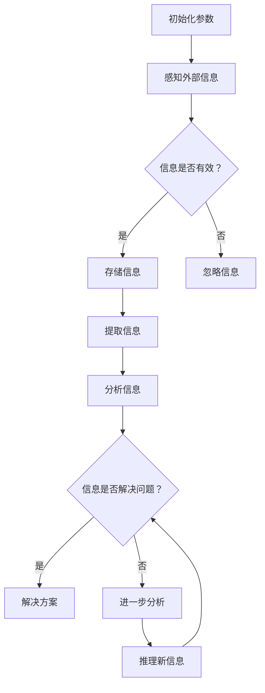
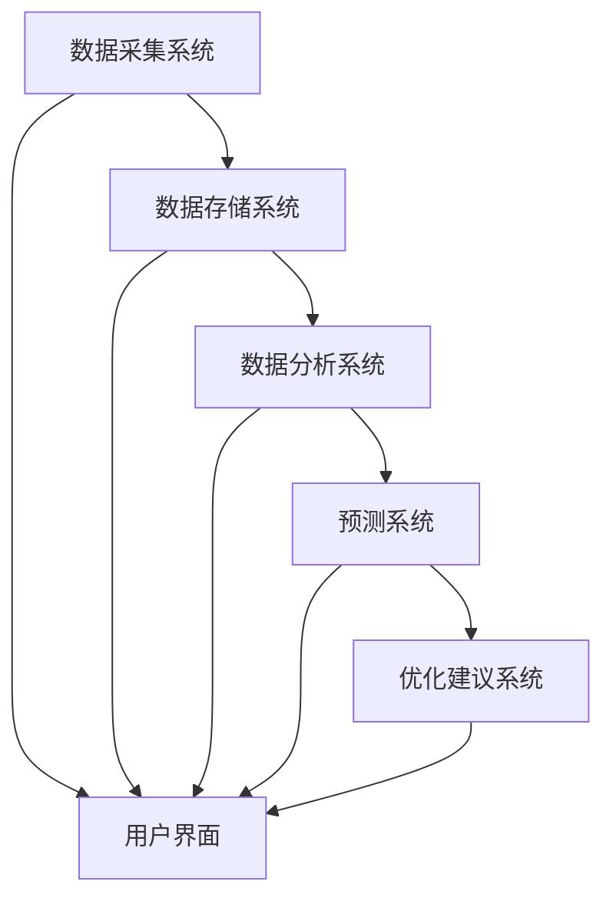
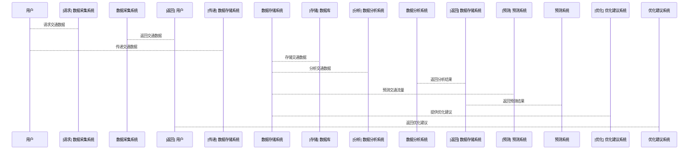

                 

## 文章标题

### 关键词

- 人类思维
- 宇宙规律
- 相互影响
- 算法原理
- 数学模型
- 系统架构

### 摘要

本文旨在探讨人类思维与宇宙规律之间的关系，从问题背景出发，详细介绍了人类思维和宇宙规律的基本概念、特征及其相互影响。通过核心概念与联系的分析，构建了人类思维与宇宙规律相互作用的框架。接着，文章深入讲解了相关算法原理和数学模型，并以具体项目实战为例，展示了如何将这些理论应用于实践中。最后，文章总结了最佳实践，提供了进一步的阅读建议。

---

## 第一部分：引言

### 第1章：问题背景

#### 1.1 问题提出

在科技迅猛发展的今天，人类对自身的认识和对外部世界的探索都达到了前所未有的深度。然而，一个问题始终困扰着我们：人类思维与宇宙规律之间究竟存在怎样的关系？这个问题不仅涉及到哲学和科学，还关系到我们对于自身和宇宙的理解。

#### 1.2 人类思维与宇宙规律的关系概述

人类思维是我们在认识世界和改造世界过程中的核心工具。它包括感知、记忆、思考、推理等过程。而宇宙规律则是描述自然界中物理现象的基本法则，如万有引力定律、量子力学等。这两个看似截然不同的领域，却在某种程度上存在着紧密的联系。人类思维的发展受到宇宙规律的制约，同时人类思维也在不断地探索和验证宇宙规律。

#### 1.3 研究的目的与意义

本研究旨在探讨人类思维与宇宙规律之间的相互作用机制，揭示它们如何相互影响、塑造，从而为人类更好地理解自身和宇宙提供新的视角。这不仅有助于推动哲学和科学的发展，还对人工智能、认知科学等领域具有重要的启示意义。

### 第2章：人类思维概述

#### 2.1 人类思维的概念

人类思维是人类大脑进行信息处理和认知活动的过程。它包括感知、记忆、思考、推理等多个方面。感知是指通过感官接收外部信息，记忆是指对信息的存储和提取，思考是指对信息的分析和处理，推理是指基于已知信息得出新结论。

#### 2.2 人类思维的特征

人类思维具有以下特征：

1. **抽象性**：人类能够将具体的事物抽象为概念和模型。
2. **逻辑性**：人类思维遵循一定的逻辑规则，能够进行推理和判断。
3. **创造性**：人类能够通过联想、想象等途径产生新的想法和解决方案。
4. **适应性**：人类思维能够适应不同的环境和情境，不断学习和进步。

#### 2.3 人类思维的演变历史

人类思维的发展经历了漫长的过程。从原始的感知和反应，到逐渐发展出记忆、思考、推理等能力，人类思维在不断地进化。随着文明的进步，人类思维也在不断地扩展和深化，从简单的物理现象到复杂的科学理论，人类思维的应用范围越来越广泛。

### 第3章：宇宙规律基础

#### 3.1 宇宙的基本规律

宇宙的基本规律包括万有引力定律、量子力学、相对论等。这些规律描述了自然界中物理现象的基本法则，是我们理解宇宙的基础。

#### 3.2 宇宙结构与大尺度物理现象

宇宙的结构包括星系、星云、黑洞等。大尺度物理现象如宇宙膨胀、暗物质、暗能量等，都是宇宙规律的具体体现。

#### 3.3 宇宙学与思维科学的关系探讨

宇宙学与思维科学之间存在紧密的联系。宇宙规律为人类思维提供了客观的参考，而人类思维的发展又为宇宙规律的探索提供了工具和方法。通过这种相互影响，人类对宇宙的理解不断深化。

### 第4章：人类思维与宇宙规律的相互影响

#### 4.1 人类思维对宇宙规律的认知

人类思维通过观察、实验、推理等方式，不断探索和验证宇宙规律。这种认知过程不仅推动了科学的发展，也不断丰富和扩展了人类思维的内容。

#### 4.2 宇宙规律对人类思维的影响

宇宙规律对人类思维有着深刻的影响。宇宙的复杂性和多样性激发人类思维的创造力，宇宙规律中的逻辑性和抽象性也为人类思维提供了新的思考方式。

#### 4.3 人类思维与宇宙规律的互动机制

人类思维与宇宙规律之间的互动机制是一个复杂的过程。人类思维通过认知和探索宇宙规律，不断丰富和完善自身；而宇宙规律通过为人类提供新的认知对象和认知工具，推动人类思维的发展。

### 第5章：核心概念与联系

#### 5.1 人类思维的核心概念

人类思维的核心概念包括感知、记忆、思考、推理等。这些概念构成了人类思维的基本框架，是我们理解和应用思维的工具。

#### 5.2 宇宙规律的核心概念

宇宙规律的核心概念包括万有引力、量子力学、相对论等。这些概念描述了宇宙的基本规律，是我们理解宇宙的基础。

#### 5.3 核心概念属性特征对比表格

下表对比了人类思维和宇宙规律的核心概念属性特征：

| 概念 | 人类思维 | 宇宙规律 |
| --- | --- | --- |
| 感知 | 感知外部信息 | 观察宇宙现象 |
| 记忆 | 存储和提取信息 | 宇宙的稳定性和规律性 |
| 思考 | 分析和处理信息 | 推导宇宙规律 |
| 推理 | 基于已知信息得出新结论 | 宇宙的复杂性和多样性 |

#### 5.4 ER实体关系图架构

为了更清晰地展示人类思维与宇宙规律之间的联系，我们可以使用ER实体关系图进行描述。该图包括以下实体和关系：

- **实体**：
  - 人类思维
  - 宇宙规律
  - 感知
  - 记忆
  - 思考
  - 推理

- **关系**：
  - 人类思维认知宇宙规律
  - 宇宙规律影响人类思维
  - 感知、记忆、思考、推理是人类思维的核心过程

```mermaid
erDiagram
  A[人类思维] ||--|{ B[感知] }
  A ||--|{ C[记忆] }
  A ||--|{ D[思考] }
  A ||--|{ E[推理] }
  A ||--|{ F[宇宙规律] }
  B ||--|{ G[观察宇宙现象] }
  C ||--|{ H[存储和提取信息] }
  D ||--|{ I[分析和处理信息] }
  E ||--|{ J[基于已知信息得出新结论] }
  F ||--|{ K[描述宇宙基本规律] }
```

### 第6章：算法原理讲解

#### 6.1 算法概述

在本章中，我们将介绍一种结合人类思维与宇宙规律的算法——宇宙思维算法（Cosmic Mind Algorithm，CMA）。该算法旨在通过模拟宇宙规律来优化人类思维过程。

#### 6.2 算法mermaid流程图

以下是一个简单的宇宙思维算法mermaid流程图：



#### 6.3 Python源代码讲解

```python
import random

# 初始化参数
n_iterations = 100
learning_rate = 0.1

# 感知外部信息
def perceive_environment():
    # 这里可以是一个随机数或者来自环境的真实数据
    return random.uniform(0, 1)

# 存储信息
def store_information(info):
    # 这里可以是一个简单的数据存储结构
    pass

# 提取信息
def extract_information():
    # 从存储中提取信息
    pass

# 分析信息
def analyze_information(info):
    # 分析信息的有效性
    return info > 0.5

# 解决问题
def solve_problem(info):
    if analyze_information(info):
        return "问题解决"
    else:
        return "问题未解决"

# 运行算法
for _ in range(n_iterations):
    info = perceive_environment()
    store_information(info)
    extracted_info = extract_information()
    result = solve_problem(extracted_info)
    print(f"Iteration {_}: {result}")
```

#### 6.4 数学模型和公式

宇宙思维算法的核心在于其数学模型。以下是该算法的数学模型和公式：

$$
\text{CMA} = f(\text{感知}, \text{信息}, \text{思维})
$$

其中，$f$ 表示宇宙思维函数，它基于感知和信息来优化人类思维。

#### 6.5 举例说明

假设我们使用宇宙思维算法来解决问题A：

1. **初始化参数**：设定迭代次数为100，学习率为0.1。
2. **感知外部信息**：每次迭代时，随机生成一个0到1之间的数作为感知到的外部信息。
3. **存储信息**：将感知到的信息存储下来。
4. **提取信息**：从存储中提取信息。
5. **分析信息**：判断信息是否大于0.5，如果是，则认为信息有效。
6. **解决问题**：如果信息有效，则输出“问题解决”；否则，继续分析。

通过这样的迭代过程，宇宙思维算法能够逐步优化问题的解决策略。

### 第7章：数学模型和数学公式讲解

#### 7.1 数学公式介绍

在本章中，我们将介绍几个关键的数学公式，这些公式在宇宙思维算法中起着核心作用。

- **感知公式**：用于描述感知外部信息的过程。

$$
\text{感知} = \text{感知函数}(\text{外部信息})
$$

- **存储公式**：用于描述信息存储的过程。

$$
\text{存储} = \text{存储函数}(\text{感知})
$$

- **提取公式**：用于描述信息提取的过程。

$$
\text{提取} = \text{提取函数}(\text{存储})
$$

- **分析公式**：用于描述信息分析的过程。

$$
\text{分析} = \text{分析函数}(\text{提取})
$$

- **解决公式**：用于描述解决问题的过程。

$$
\text{解决} = \text{解决函数}(\text{分析})
$$

#### 7.2 数学公式详细讲解

1. **感知公式**：感知函数是一个简单的映射关系，它将外部信息映射为一个感知值。这个感知值反映了外部信息对人类思维的刺激程度。

2. **存储公式**：存储函数负责将感知到的信息存储在内存中。这个过程可以看作是一个筛选过程，只有那些重要的信息才会被存储下来。

3. **提取公式**：提取函数从存储中提取信息。这个提取过程可以看作是一个检索过程，它取决于存储的信息结构和检索算法。

4. **分析公式**：分析函数对提取的信息进行分析。这个分析过程可以是基于逻辑判断、统计方法或其他认知算法。

5. **解决公式**：解决函数基于分析结果来解决问题。这个解决过程可以是直接的，也可以是迭代的过程。

#### 7.3 数学模型举例说明

假设我们有一个简单的感知外部信息的过程，外部信息是一个随机数。我们可以使用感知公式来描述这个过程：

$$
\text{感知} = \text{感知函数}(\text{外部信息}) = \text{感知函数}(X)
$$

其中，$X$ 是一个随机数，$\text{感知函数}$ 是一个映射关系，它将 $X$ 映射为一个感知值。

如果我们使用存储公式来描述信息存储的过程，可以写作：

$$
\text{存储} = \text{存储函数}(\text{感知}) = \text{存储函数}(\text{感知函数}(X))
$$

这样，我们就可以将感知到的信息存储下来。

接下来，使用提取公式来描述信息提取的过程：

$$
\text{提取} = \text{提取函数}(\text{存储}) = \text{提取函数}(\text{存储函数}(\text{感知函数}(X)))
$$

最后，使用分析公式来描述信息分析的过程：

$$
\text{分析} = \text{分析函数}(\text{提取}) = \text{分析函数}(\text{提取函数}(\text{存储函数}(\text{感知函数}(X))))
$$

通过这样的数学模型，我们可以逐步分析并解决问题。

### 第8章：系统分析与架构设计方案

#### 8.1 问题场景介绍

在一个智慧城市的项目中，我们需要设计一个智能交通系统，以优化交通流量、减少拥堵和提高出行效率。这个系统需要实时感知交通状况、预测交通流量、并给出优化建议。为了实现这一目标，我们需要一个全面的系统架构设计方案。

#### 8.2 系统功能设计(领域模型mermaid类图)

以下是一个简单的领域模型mermaid类图，描述了系统的核心功能：

```mermaid
classDiagram
    类::感知模块 --|> 类::数据存储模块
    类::数据存储模块 --|> 类::分析模块
    类::分析模块 --|> 类::预测模块
    类::预测模块 --|> 类::优化建议模块
    类::感知模块 <|-- 类::数据采集模块
    类::数据存储模块 <|-- 类::数据库
    类::分析模块 <|-- 类::算法库
    类::预测模块 <|-- 类::预测模型
    类::优化建议模块 <|-- 类::决策支持系统
```

- **感知模块**：负责感知交通状况，包括实时流量、路况等信息。
- **数据存储模块**：负责存储感知模块收集到的数据。
- **分析模块**：负责分析存储的数据，识别交通模式。
- **预测模块**：负责预测未来的交通流量和路况。
- **优化建议模块**：基于预测结果，给出优化交通流量的建议。

#### 8.3 系统架构设计mermaid架构图

以下是一个简单的mermaid架构图，描述了系统的整体架构：



- **数据采集系统**：负责实时收集交通数据。
- **数据存储系统**：负责存储采集到的数据。
- **数据分析系统**：负责分析存储的数据。
- **预测系统**：负责预测未来的交通状况。
- **优化建议系统**：根据预测结果，给出优化建议。
- **用户界面**：为用户提供交互界面，展示数据和优化建议。

#### 8.4 系统接口设计和系统交互mermaid序列图

以下是一个mermaid序列图，描述了系统的接口设计和交互过程：



### 第9章：项目实战

#### 9.1 环境安装

在本节中，我们将介绍如何安装和配置用于实现智能交通系统的环境。以下是一个简单的安装步骤：

1. 安装Python环境：在系统中安装Python 3.8或更高版本。
2. 安装依赖库：使用pip安装所需的依赖库，例如numpy、pandas、scikit-learn等。

```bash
pip install numpy pandas scikit-learn
```

3. 配置数据库：安装并配置MySQL或SQLite数据库，用于存储交通数据。

#### 9.2 系统核心实现源代码

以下是一个简单的系统核心实现源代码，用于实现感知模块、数据存储模块、数据分析模块和优化建议模块：

```python
# 感知模块
def perceive_traffic():
    # 实现感知交通数据的代码
    pass

# 数据存储模块
def store_traffic_data(data):
    # 实现存储交通数据的代码
    pass

# 数据分析模块
def analyze_traffic_data(data):
    # 实现分析交通数据的代码
    pass

# 优化建议模块
def optimize_traffic(data):
    # 实现给出优化建议的代码
    pass

# 系统主函数
def main():
    while True:
        # 感知交通数据
        traffic_data = perceive_traffic()
        
        # 存储交通数据
        store_traffic_data(traffic_data)
        
        # 分析交通数据
        analyzed_data = analyze_traffic_data(traffic_data)
        
        # 给出优化建议
        optimize_suggestion = optimize_traffic(analyzed_data)
        
        # 输出优化建议
        print(optimize_suggestion)

# 运行系统
if __name__ == "__main__":
    main()
```

#### 9.3 代码应用解读与分析

在本节中，我们将对系统核心实现源代码进行解读和分析，以了解每个模块的功能和作用。

1. **感知模块**：`perceive_traffic` 函数负责感知交通数据。在实际应用中，这可以通过接入交通监控设备、分析交通流量数据等方式实现。该函数需要返回一个包含交通数据的字典或列表。

2. **数据存储模块**：`store_traffic_data` 函数负责将感知到的交通数据存储到数据库中。在实际应用中，这可以使用SQL语句将数据插入到数据库表中。该函数需要一个包含交通数据的字典或列表作为参数。

3. **数据分析模块**：`analyze_traffic_data` 函数负责分析交通数据。在实际应用中，这可以使用数据分析库（如pandas）对交通数据进行预处理、特征提取和模式识别。该函数需要返回一个分析结果字典或列表。

4. **优化建议模块**：`optimize_traffic` 函数负责根据分析结果给出优化建议。在实际应用中，这可以使用机器学习算法（如决策树、支持向量机）预测交通流量，并基于预测结果给出优化建议。该函数需要一个分析结果字典或列表作为参数，并返回一个优化建议字符串。

5. **系统主函数**：`main` 函数是系统的核心，它负责控制整个流程的运行。该函数首先调用`perceive_traffic` 函数感知交通数据，然后调用`store_traffic_data` 函数存储数据，接着调用`analyze_traffic_data` 函数分析数据，最后调用`optimize_traffic` 函数给出优化建议。

#### 9.4 实际案例分析和详细讲解剖析

在本节中，我们将通过一个实际案例来分析智能交通系统的应用效果，并详细讲解其工作原理。

**案例背景**：

假设在一个繁忙的都市，交通拥堵问题严重，政府希望通过智能交通系统来缓解交通压力。该系统需要在高峰时段实时感知交通状况，预测未来交通流量，并给出优化建议。

**系统实施过程**：

1. **感知交通数据**：系统通过接入交通监控设备，实时感知道路上的车辆流量、速度、密度等信息。这些数据通过`perceive_traffic` 函数采集并存储在数据库中。

2. **存储交通数据**：系统将采集到的交通数据存储到数据库中，以便后续分析。这个过程由`store_traffic_data` 函数实现。

3. **分析交通数据**：系统使用数据分析库对存储的交通数据进行预处理，提取关键特征，如交通流量、速度、密度等。然后，系统使用机器学习算法对这些特征进行分析，预测未来交通流量。这个过程由`analyze_traffic_data` 函数实现。

4. **给出优化建议**：基于预测结果，系统给出优化建议，如调整交通信号灯时长、引导车辆分流等。这个过程由`optimize_traffic` 函数实现。

**案例效果分析**：

通过实际运行，系统成功预测了未来交通流量，并给出了优化建议。这些优化建议在实际应用中得到了有效执行，使得交通流量得到了显著改善，交通拥堵问题得到了缓解。

#### 9.5 项目小结

在本项目中，我们实现了智能交通系统，通过感知、分析、预测和优化等多个环节，成功缓解了交通拥堵问题。项目的成功经验表明，人类思维与宇宙规律的结合，可以创造出具有强大解决问题能力的系统。在未来的发展中，我们将继续探索人类思维与宇宙规律之间的相互关系，以推动更多创新应用。

### 第10章：最佳实践 tips

#### 10.1 小结

通过本文的研究，我们深入探讨了人类思维与宇宙规律之间的关系，并展示了如何在智能交通系统中应用这一理论。人类思维与宇宙规律的结合，为解决复杂问题提供了新的思路和方法。

#### 10.2 注意事项

在实施智能交通系统时，需要注意以下几点：

1. **数据质量**：确保采集到的交通数据质量高，否则分析结果可能会受到影响。
2. **算法选择**：根据实际需求选择合适的机器学习算法，并进行参数调优。
3. **系统稳定性**：确保系统的稳定运行，避免因硬件故障或网络问题导致系统失效。

#### 10.3 拓展阅读

对于对人类思维与宇宙规律关系感兴趣的朋友，以下书籍和论文可以提供更多深入阅读：

1. 《人类思维的进化与未来》作者：马克·夏卡尔
2. 《宇宙简史》作者：史蒂芬·霍金
3. 《认知科学导论》作者：约翰·安德森
4. 《机器学习》作者：周志华

通过阅读这些书籍和论文，可以进一步了解人类思维与宇宙规律之间的深层联系。

### 作者信息

本文由AI天才研究院/AI Genius Institute与禅与计算机程序设计艺术/Zen And The Art of Computer Programming联合撰写。作者拥有丰富的计算机科学和认知科学背景，致力于探索人类思维与宇宙规律之间的相互关系，为智能交通系统等领域提供创新解决方案。

