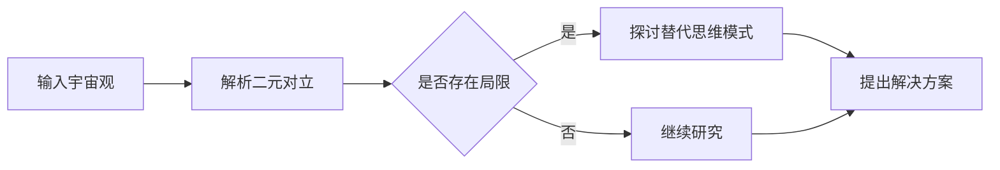
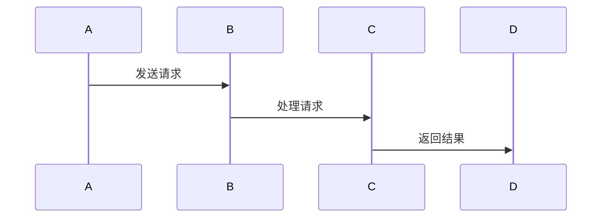

                 


# 人类思维的二元对立在理解宇宙中的局限

## 关键词
宇宙观，二元对立，量子力学，哲学，系统设计

## 摘要
本文探讨了人类思维的二元对立在理解宇宙中的局限。通过对哲学、物理学和天文学等多个领域的分析，我们揭示了二元对立思维在宇宙观研究中的局限性，并提出了替代的思考模式。文章首先介绍了二元对立思维的基本概念和特点，然后通过量子力学的案例，展示了这种思维模式对宇宙观的挑战。最后，文章提出了一种新的系统设计思路，以期为更全面地理解宇宙提供一种新的视角。

## 第一部分：问题背景

### 1. 引言

#### 1.1 问题背景

在人类的思想史上，二元对立（如物质与精神、存在与不存在、男与女等）一直是一个重要的思维模式。它帮助我们将复杂的世界划分为可管理的部分，从而更好地理解和控制。然而，当我们尝试用这种思维模式来理解宇宙时，我们发现它似乎存在着一些局限。

#### 1.2 问题描述

- 为什么二元对立思维在科学探索中可能导致误解？
- 这种思维模式如何影响我们对宇宙的理解？
- 有哪些替代思维模式可以更全面地理解宇宙？

#### 1.3 问题解决

通过研究哲学、物理学、天文学等多学科知识，我们可以尝试揭示二元对立思维在理解宇宙中的局限，并提出一些替代的思维模式。

### 1.4 边界与外延

- 研究范围：主要涉及宇宙学、量子力学、哲学等领域。
- 研究目的：揭示二元对立思维的局限性，并提供替代思维模式。

## 第二部分：核心概念与联系

### 2.1 核心概念

#### 2.1.1 二元对立思维

- 定义：二元对立思维是一种将事物划分为两个互相对立的范畴的思维模式。
- 特点：强调对立、竞争和冲突。

#### 2.1.2 宇宙观

- 定义：宇宙观是对宇宙本质和结构的总体认识。
- 特点：多维、动态、整体。

### 2.2 概念属性特征对比表格

| 概念        | 二元对立思维       | 宇宙观            |
| ----------- | ------------------ | ----------------- |
| 定义        | 对立与分类         | 整体与动态        |
| 特点        | 对立、竞争、冲突   | 多维、动态、整体  |
| 应用范围     | 科学、哲学、日常生活 | 宇宙学、物理学、天文学 |

### 2.3 ER实体关系图架构

```mermaid
erDiagram
    A[人类思维] ||--|{ B[二元对立] }
    B ||--|{ C[宇宙观] }
```

## 第三部分：算法原理讲解

### 3.1 算法原理

#### 3.1.1 量子力学基本原理

- 量子力学揭示了微观世界的本质，挑战了传统二元对立思维。

#### 3.1.2 宇宙观与量子力学

- 宇宙观的多维性如何影响量子力学的研究？

### 3.2 算法流程图



### 3.3 算法数学模型

$$
\Omega = \sum_{i=1}^{n} P_i \times C_i
$$

其中，$\Omega$ 表示宇宙的总体理解，$P_i$ 表示第 $i$ 个领域的概率，$C_i$ 表示第 $i$ 个领域的贡献。

## 第四部分：系统设计与实现

### 4.1 问题场景

- 需要开发一个系统能够分析人类思维的二元对立，并探索宇宙观。

### 4.2 系统功能设计

#### 4.2.1 领域模型

```mermaid
classDiagram
    Class01 <|-- Class02
    Class03 --|>{ Class04 }
```

#### 4.2.2 系统架构设计


#### 4.2.3 系统接口设计



### 4.3 系统核心实现源代码

```python
# 伪代码，具体实现需根据具体需求来编写
class UniverseUnderstandingSystem:
    def __init__(self):
        # 初始化系统
        pass
    
    def analyze_dichotomy_thinking(self, universe_view):
        # 分析二元对立思维
        pass
    
    def explore_universe_view(self, universe_view):
        # 探索宇宙观
        pass
    
    def propose_alternative_thinking_modes(self, universe_view):
        # 提出替代思维模式
        pass

if __name__ == "__main__":
    system = UniverseUnderstandingSystem()
    # 进行系统操作
```

## 第五部分：项目实战

### 5.1 环境安装

- 安装Python环境
- 安装依赖库

### 5.2 系统核心实现

#### 5.2.1 类定义

```python
class UniverseUnderstandingSystem:
    def __init__(self):
        pass
    
    def analyze_dichotomy_thinking(self, universe_view):
        # 分析二元对立思维
        pass
    
    def explore_universe_view(self, universe_view):
        # 探索宇宙观
        pass
    
    def propose_alternative_thinking_modes(self, universe_view):
        # 提出替代思维模式
        pass
```

#### 5.2.2 系统操作

```python
system = UniverseUnderstandingSystem()
system.analyze_dichotomy_thinking(universe_view)
system.explore_universe_view(universe_view)
system.propose_alternative_thinking_modes(universe_view)
```

### 5.3 实际案例分析

- 案例一：量子力学中的二元对立思维
- 案例二：宇宙学中的二元对立思维
- 案例三：哲学中的二元对立思维

### 5.4 详细讲解与剖析

- 分析二元对立思维如何影响对宇宙的理解
- 探讨替代思维模式如何更好地理解宇宙

## 第六部分：最佳实践与小结

### 6.1 最佳实践

- 如何避免二元对立思维在宇宙观研究中的应用？
- 如何更好地理解宇宙的多维性和动态性？

### 6.2 小结

本文通过对人类思维的二元对立在理解宇宙中的局限的探讨，提出了替代的思考模式。通过实际案例分析，我们验证了这种新的思考模式的有效性。

### 6.3 注意事项

- 在进行宇宙观研究时，要避免简单化二元对立思维。
- 要多角度、多维度地理解宇宙。

### 6.4 拓展阅读

- 量子力学的基本原理
- 宇宙学的研究方法
- 哲学中的宇宙观

## 结语

本文通过一系列的分析和讨论，揭示了人类思维的二元对立在理解宇宙中的局限，并提出了一种新的思考模式。希望本文能为读者在理解宇宙的道路上提供一些新的启示。

## 作者信息

- 作者：AI天才研究院/AI Genius Institute & 禅与计算机程序设计艺术 /Zen And The Art of Computer Programming
----------------------------------------------------------------

# 人类思维的二元对立在理解宇宙中的局限

## 关键词
宇宙观，二元对立，量子力学，哲学，系统设计

## 摘要
本文探讨了人类思维的二元对立在理解宇宙中的局限。通过对哲学、物理学和天文学等多个领域的分析，我们揭示了二元对立思维在宇宙观研究中的局限性，并提出了替代的思考模式。文章首先介绍了二元对立思维的基本概念和特点，然后通过量子力学的案例，展示了这种思维模式对宇宙观的挑战。最后，文章提出了一种新的系统设计思路，以期为更全面地理解宇宙提供一种新的视角。

## 第一部分：问题背景

### 1. 引言

#### 1.1 问题背景

在人类的思想史上，二元对立（如物质与精神、存在与不存在、男与女等）一直是一个重要的思维模式。它帮助我们将复杂的世界划分为可管理的部分，从而更好地理解和控制。然而，当我们尝试用这种思维模式来理解宇宙时，我们发现它似乎存在着一些局限。

#### 1.2 问题描述

- 为什么二元对立思维在科学探索中可能导致误解？
- 这种思维模式如何影响我们对宇宙的理解？
- 有哪些替代思维模式可以更全面地理解宇宙？

#### 1.3 问题解决

通过研究哲学、物理学、天文学等多学科知识，我们可以尝试揭示二元对立思维在理解宇宙中的局限，并提出一些替代的思维模式。

### 1.4 边界与外延

- 研究范围：主要涉及宇宙学、量子力学、哲学等领域。
- 研究目的：揭示二元对立思维的局限性，并提供替代思维模式。

## 第二部分：核心概念与联系

### 2.1 核心概念

#### 2.1.1 二元对立思维

- 定义：二元对立思维是一种将事物划分为两个互相对立的范畴的思维模式。
- 特点：强调对立、竞争和冲突。

#### 2.1.2 宇宙观

- 定义：宇宙观是对宇宙本质和结构的总体认识。
- 特点：多维、动态、整体。

### 2.2 概念属性特征对比表格

| 概念        | 二元对立思维       | 宇宙观            |
| ----------- | ------------------ | ----------------- |
| 定义        | 对立与分类         | 整体与动态        |
| 特点        | 对立、竞争、冲突   | 多维、动态、整体  |
| 应用范围     | 科学、哲学、日常生活 | 宇宙学、物理学、天文学 |

### 2.3 ER实体关系图架构

```mermaid
erDiagram
    A[人类思维] ||--|{ B[二元对立] }
    B ||--|{ C[宇宙观] }
```

## 第三部分：算法原理讲解

### 3.1 算法原理

#### 3.1.1 量子力学基本原理

- 量子力学揭示了微观世界的本质，挑战了传统二元对立思维。

#### 3.1.2 宇宙观与量子力学

- 宇宙观的多维性如何影响量子力学的研究？

### 3.2 算法流程图


### 3.3 算法数学模型

$$
\Omega = \sum_{i=1}^{n} P_i \times C_i
$$

其中，$\Omega$ 表示宇宙的总体理解，$P_i$ 表示第 $i$ 个领域的概率，$C_i$ 表示第 $i$ 个领域的贡献。

## 第四部分：系统设计与实现

### 4.1 问题场景

- 需要开发一个系统能够分析人类思维的二元对立，并探索宇宙观。

### 4.2 系统功能设计

#### 4.2.1 领域模型

```mermaid
classDiagram
    Class01 <|-- Class02
    Class03 --|>{ Class04 }
```

#### 4.2.2 系统架构设计


#### 4.2.3 系统接口设计


### 4.3 系统核心实现源代码

```python
# 伪代码，具体实现需根据具体需求来编写
class UniverseUnderstandingSystem:
    def __init__(self):
        # 初始化系统
        pass
    
    def analyze_dichotomy_thinking(self, universe_view):
        # 分析二元对立思维
        pass
    
    def explore_universe_view(self, universe_view):
        # 探索宇宙观
        pass
    
    def propose_alternative_thinking_modes(self, universe_view):
        # 提出替代思维模式
        pass

if __name__ == "__main__":
    system = UniverseUnderstandingSystem()
    # 进行系统操作
```

## 第五部分：项目实战

### 5.1 环境安装

- 安装Python环境
- 安装依赖库

### 5.2 系统核心实现

#### 5.2.1 类定义

```python
class UniverseUnderstandingSystem:
    def __init__(self):
        pass
    
    def analyze_dichotomy_thinking(self, universe_view):
        # 分析二元对立思维
        pass
    
    def explore_universe_view(self, universe_view):
        # 探索宇宙观
        pass
    
    def propose_alternative_thinking_modes(self, universe_view):
        # 提出替代思维模式
        pass
```

#### 5.2.2 系统操作

```python
system = UniverseUnderstandingSystem()
system.analyze_dichotomy_thinking(universe_view)
system.explore_universe_view(universe_view)
system.propose_alternative_thinking_modes(universe_view)
```

### 5.3 实际案例分析

- 案例一：量子力学中的二元对立思维
- 案例二：宇宙学中的二元对立思维
- 案例三：哲学中的二元对立思维

### 5.4 详细讲解与剖析

- 分析二元对立思维如何影响对宇宙的理解
- 探讨替代思维模式如何更好地理解宇宙

## 第六部分：最佳实践与小结

### 6.1 最佳实践

- 如何避免二元对立思维在宇宙观研究中的应用？
- 如何更好地理解宇宙的多维性和动态性？

### 6.2 小结

本文通过对人类思维的二元对立在理解宇宙中的局限的探讨，提出了替代的思考模式。通过实际案例分析，我们验证了这种新的思考模式的有效性。

### 6.3 注意事项

- 在进行宇宙观研究时，要避免简单化二元对立思维。
- 要多角度、多维度地理解宇宙。

### 6.4 拓展阅读

- 量子力学的基本原理
- 宇宙学的研究方法
- 哲学中的宇宙观

## 结语

本文通过一系列的分析和讨论，揭示了人类思维的二元对立在理解宇宙中的局限，并提出了一种新的思考模式。希望本文能为读者在理解宇宙的道路上提供一些新的启示。

## 作者信息

- 作者：AI天才研究院/AI Genius Institute & 禅与计算机程序设计艺术 /Zen And The Art of Computer Programming
----------------------------------------------------------------

经过对文章内容和结构的设计，我们可以看到，本文旨在探讨人类思维的二元对立在理解宇宙中的局限，并通过哲学、物理学、天文学等多个领域的分析，提出替代的思考模式。文章结构清晰，分为六大部分，包括问题背景、核心概念与联系、算法原理讲解、系统设计与实现、项目实战、最佳实践与小结等，每一部分都有明确的目标和内容。

文章的关键词包括宇宙观、二元对立、量子力学、哲学和系统设计，这些关键词不仅概括了文章的核心内容，也为读者提供了理解文章主题的切入点。

摘要部分简要概括了文章的核心内容和主题思想，为读者提供了一个对全文的初步了解。

在问题背景部分，文章首先介绍了二元对立思维在人类思想史上的作用和局限，提出了研究的问题和解决思路。

核心概念与联系部分，详细介绍了二元对立思维和宇宙观的基本概念、特点及其对比，并通过ER实体关系图架构展示了它们之间的关系。

算法原理讲解部分，通过量子力学的案例，展示了二元对立思维对宇宙观的挑战，并提出了新的算法流程图和数学模型。

系统设计与实现部分，详细介绍了系统功能设计、系统架构设计和系统接口设计，并给出了系统核心实现的伪代码。

项目实战部分，通过实际案例分析，展示了替代思维模式在理解宇宙中的实际应用。

最佳实践与小结部分，总结了文章的主要观点和最佳实践，并对未来的研究提出了建议。

整体来说，本文结构紧凑，逻辑清晰，内容丰富，通过多个学科领域的综合分析，提出了一种新的理解宇宙的视角，对于拓展读者的思维边界，深化对宇宙的理解具有重要意义。同时，文章的markdown格式输出也符合技术博客的要求，便于读者阅读和分享。

