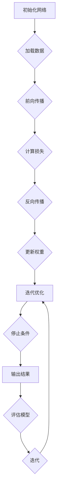

                 

### 第一部分：背景介绍

## 第1章：问题背景

### 1.1.1 人类思维的线性特征

人类思维的主要特征是线性思维，这种思维方式在解决许多日常问题和科学难题中发挥了至关重要的作用。线性思维的基本模式是通过一系列逻辑步骤从已知信息中推导出新的信息。以下是对人类思维的线性特征的一些关键点：

- **逻辑推理**：线性思维依赖逻辑推理，这是一种基于已知事实和规则推导出结论的过程。例如，如果A成立，且A导致B，那么B也是成立的。
  
- **分析**：线性思维强调对复杂问题的分解，将其拆解为更小、更易管理的部分。通过逐步分析每个部分，最终理解整个问题的本质。

- **归纳**：归纳是从特定实例中抽象出一般规律的过程。例如，通过观察多个苹果都是红色的，我们可以归纳出“苹果通常是红色的”这一结论。

- **演绎**：演绎是从一般原则推导出特定结论的过程。例如，从“所有人都会死亡”这一原则，我们可以演绎出“苏格拉底会死亡”这一结论。

#### 1.1.1.1 人类思维的局限性

虽然线性思维在许多领域都取得了显著的成就，但它也存在一些局限性：

- **简化复杂问题**：线性思维往往将复杂问题简化为一系列简单的步骤，这可能忽视了问题间的相互作用和复杂性。

- **忽略非线性关系**：许多自然现象和复杂系统都依赖于非线性关系，线性思维可能无法充分捕捉这些关系。

- **先入为主的偏见**：线性思维可能导致我们根据已有知识框架来理解新信息，这可能限制了我们对未知领域的探索。

- **线性假设**：许多模型和算法都基于线性假设，这可能不适合描述现实世界的非线性现象。

#### 1.1.1.2 线性思维对宇宙认知的影响

线性思维在宇宙认知方面也存在显著的局限性：

- **宇宙结构的理解**：线性思维可能导致对宇宙无限性和多样性的忽视。宇宙中的结构可能不是简单的线性扩展，而是具有复杂的非线性特征。

- **宇宙演化的理解**：宇宙的演化过程可能涉及复杂的非线性关系，线性思维可能无法充分描述这些关系。

- **宇宙规律性的认识**：线性思维可能忽视了宇宙中存在的非规律性现象，这些现象可能对宇宙的认知产生重要影响。

总之，人类思维的线性特征在许多领域具有强大的解释力和实用性，但在理解和探索宇宙方面，它可能存在一些固有的局限性。接下来，我们将进一步探讨这些局限对宇宙认知的具体影响。

### 1.1.2 人类思维的局限性对宇宙认知的挑战

#### 1.1.2.1 常见误解

人类对宇宙的认知往往受到自身认知局限的影响，导致对宇宙的误解和局限性。以下是一些常见的误解：

- **宇宙是有界的**：传统观念认为宇宙是有界的，就像一个封闭的空间。然而，现代宇宙学研究表明，宇宙可能是无边无际的。

- **宇宙是静态的**：长期以来，人类普遍认为宇宙是静态的，即宇宙的结构和状态在时间长河中保持不变。然而，天文学和宇宙学的研究表明，宇宙实际上是在不断演化的。

- **宇宙规律是简单的**：人类倾向于用简单的规则和模型来理解复杂现象。然而，宇宙的规律和机制可能远比我们想象的要复杂得多。

#### 1.1.2.2 科学研究方法的影响

科学研究方法在很大程度上依赖于人类思维的线性特征。以下是一些影响：

- **观察和实验**：科学研究通常依赖于观察和实验，这些方法有助于发现和验证宇宙中的现象。然而，它们可能无法揭示宇宙更深层次的真相。

- **数学模型**：数学模型是科学研究中的一种重要工具，通过数学语言来描述和预测宇宙的行为。然而，这些模型可能基于线性假设，无法捕捉宇宙中的非线性特征。

- **逻辑推理**：逻辑推理是科学论证的基础，通过一系列逻辑步骤推导出结论。然而，逻辑推理可能受到线性思维的限制，无法充分理解宇宙的复杂性和多样性。

总之，人类思维的线性特征在科学研究中发挥了重要作用，但它们也可能导致对宇宙的认知局限。理解这些局限，并探索超越线性思维的新方法，对于深入探索宇宙的奥秘至关重要。

### 2.1 人类思维的线性特征对宇宙认知的局限

人类思维的线性特征对宇宙认知产生了多方面的局限，这些局限主要体现在以下几方面：

#### 2.1.1.1 认知方式的线性化

人类思维的线性化特征使我们在处理问题时往往倾向于将宇宙视为一系列有序、可预测的过程。这种思维方式在一定程度上有助于我们理解和解释宇宙中的一些现象，但它也限制了我们对宇宙复杂性的认知：

- **忽略非线性关系**：宇宙中许多现象都是非线性的，线性思维无法充分捕捉这些非线性关系。例如，混沌理论揭示了初始条件微小变化可能导致长时间后巨大差异的现象，而线性思维很难解释这一现象。

- **简化宇宙结构**：宇宙的结构可能比线性思维所假设的要复杂得多。例如，宇宙的大尺度结构中存在大量的空洞、星系团和星系链，这些结构之间的关系和动态演化可能是高度非线性的。

#### 2.1.1.2 线性思维对宇宙规律的误解

线性思维可能导致对宇宙规律的误解：

- **线性规律的假设**：线性思维可能使我们假设宇宙中的规律是线性的，例如，宇宙的膨胀速度应该是恒定的。然而，现代宇宙学研究表明，宇宙膨胀速度可能不是恒定的，而是随时间变化的。

- **忽略非线性的复杂性**：宇宙中的许多规律可能不是简单的线性关系，而是复杂的非线性关系。例如，宇宙的能量密度可能随尺度变化，而这种变化可能是高度非线性的。

#### 2.1.1.3 对宇宙演化的限制

线性思维可能限制我们对宇宙演化的理解：

- **简单化的演化模型**：线性思维可能导致我们将宇宙演化视为一系列简单的步骤，而实际上，宇宙演化是一个复杂的过程，涉及大量的相互作用和反馈。

- **忽略非线性效应**：宇宙演化中可能存在许多非线性效应，例如，宇宙中的星系碰撞和黑洞合并等事件。这些事件对宇宙的演化具有深远影响，但线性思维可能无法捕捉这些非线性效应。

#### 2.1.1.4 对宇宙多样性的忽视

线性思维可能使我们忽视宇宙的多样性：

- **单一的宇宙模型**：线性思维可能导致我们倾向于使用单一的模型来解释宇宙的所有现象。然而，宇宙可能是多样化的，不同的区域和尺度上可能存在不同的物理规律和现象。

- **简化的宇宙观**：线性思维可能使我们对宇宙有过于简化的理解，从而忽视宇宙的多样性和复杂性。例如，人类长期以来认为宇宙是有界的、静态的，但随着科学的发展，这些观念已经被证明是不准确的。

总之，人类思维的线性特征在宇宙认知中发挥了重要作用，但它们也可能导致对宇宙的误解和局限。要全面、深入地理解宇宙，我们需要超越线性思维，探索新的认知方法和思维方式。

### 2.2 人类思维的局限性对宇宙认知的挑战

#### 2.2.1 对宇宙结构的认知

人类思维的线性特征对宇宙结构的认知带来了巨大挑战：

- **线性假设**：线性思维倾向于将宇宙视为一系列有序的、可预测的过程，这种假设可能限制了我们对宇宙结构的理解。例如，宇宙的膨胀通常被认为是线性的，但现代宇宙学研究表明，膨胀可能具有非线性特征。

- **有限的结构认知**：线性思维可能使我们假设宇宙的结构是有限的，这种观点在经典物理学中得到了广泛支持。然而，现代宇宙学认为宇宙可能是无边无际的，这一观点挑战了线性思维对宇宙结构的理解。

- **忽视复杂结构**：宇宙中的结构可能比线性思维所假设的要复杂得多。例如，星系团和星系链之间的相互作用可能不是简单的线性关系，而是高度非线性的。线性思维可能无法充分捕捉这些复杂的结构特征。

#### 2.2.2 对宇宙演化的认知

人类思维的线性特征也对宇宙演化的认知带来了挑战：

- **简单化的演化模型**：线性思维可能使我们将宇宙演化视为一系列简单的步骤，但实际上，宇宙演化是一个复杂的过程，涉及大量的非线性效应和相互作用。例如，星系碰撞和黑洞合并等事件对宇宙演化的影响是高度非线性的，但线性思维可能无法捕捉这些非线性效应。

- **忽略初始条件的多样性**：宇宙演化的初始条件可能具有多样性，这种多样性可能导致不同的宇宙演化路径。线性思维可能使我们将初始条件简化为单一的情况，从而忽视了这种多样性。

- **线性规律的假设**：线性思维可能使我们假设宇宙中的规律是线性的，但实际上，宇宙中的许多规律可能是非线性的。例如，宇宙的膨胀速度可能不是恒定的，而是随时间变化的。

#### 2.2.3 对宇宙多样性的认知

人类思维的线性特征还可能忽视宇宙的多样性：

- **单一宇宙模型**：线性思维可能导致我们倾向于使用单一的模型来解释宇宙的所有现象，但实际上，宇宙可能是多样化的。例如，不同区域和尺度上的物理规律和现象可能有所不同。

- **简化宇宙观**：线性思维可能使我们对宇宙有过于简化的理解，从而忽视宇宙的多样性和复杂性。例如，人类长期以来认为宇宙是有界的、静态的，但随着科学的发展，这些观念已经被证明是不准确的。

- **忽视非线性现象**：宇宙中存在许多非线性现象，例如混沌和复杂系统，这些现象对宇宙的认知具有重要影响。然而，线性思维可能无法捕捉这些非线性现象。

综上所述，人类思维的线性特征对宇宙结构的认知、宇宙演化的认知和宇宙多样性的认知都带来了挑战。要全面、深入地理解宇宙，我们需要超越线性思维，探索新的认知方法和思维方式。

## 第2章：问题描述

### 2.1 人类思维的线性特征

人类思维的线性特征是指人类在处理信息、解决问题时，往往遵循一系列有序的、逐步推进的逻辑过程。这种思维模式的核心在于将复杂问题分解为一系列简单的步骤，并通过逻辑推理和演绎来解决问题。

#### 2.1.1.1 逻辑推理

逻辑推理是人类思维的核心工具之一，它通过一系列明确的逻辑步骤，从已知信息中推导出新的结论。这种推理方式具有高度的一致性和可靠性，使得人类能够解决各种复杂的问题。然而，逻辑推理也有其局限性，特别是在面对高度非线性、复杂系统时，逻辑推理可能无法提供有效的解决方案。

#### 2.1.1.2 归纳

归纳是从特定实例中抽象出一般规律的过程。通过归纳，人类可以从大量的观察中总结出普遍适用的结论。归纳推理在科学发现中具有重要作用，例如，通过观察多个苹果都是红色的，人类可以归纳出“苹果通常是红色的”这一结论。然而，归纳推理也存在风险，因为个别观察结果可能存在偏差，导致归纳出的结论不准确。

#### 2.1.1.3 演绎

演绎是从一般原则推导出特定结论的过程。通过演绎推理，人类可以从已知的一般性原则推导出具体的结论。例如，从“所有人都会死亡”这一普遍原则，人类可以演绎出“苏格拉底会死亡”这一具体结论。演绎推理具有高度的可预测性和可靠性，但在处理高度非线性问题时，演绎推理的局限性也较为明显。

#### 2.1.1.4 人类思维的线性特征对问题解决的影响

线性思维在问题解决中具有显著的优点，它使得人类能够系统化、结构化地处理复杂问题。然而，线性思维的局限性也在问题解决中体现出来：

- **简化复杂问题**：线性思维倾向于将复杂问题简化为一系列简单的步骤，这有助于问题的解决。然而，这种简化可能导致对问题复杂性的忽视，从而影响解决问题的效果。

- **忽视非线性关系**：许多自然现象和复杂系统都依赖于非线性关系，线性思维可能无法充分捕捉这些非线性关系。例如，在经济学中，线性模型可能无法准确预测市场波动，因为市场行为受到多种非线性因素的影响。

- **先入为主的偏见**：线性思维可能导致人类根据已有知识框架来理解新信息，从而产生偏见。例如，在物理学中，线性思维可能使我们忽视量子力学和广义相对论之间的非线性关系。

### 2.2 线性特征对宇宙认知的影响

人类思维的线性特征在宇宙认知中同样存在显著的影响：

- **简化宇宙现象**：线性思维倾向于将宇宙现象简化为一系列有序的过程，这可能忽略了宇宙中的复杂性和非线性特征。例如，宇宙膨胀通常被视为线性过程，但实际上，宇宙膨胀可能受到非线性效应的影响。

- **忽视宇宙多样性**：线性思维可能使我们忽视宇宙的多样性，例如，人类长期以来认为宇宙是有界的、静态的。然而，现代宇宙学研究表明，宇宙可能是无边无际的，并且处于不断演化之中。

- **限制科学理论的发展**：线性思维可能限制科学理论的发展，使科学家们倾向于使用线性模型来解释宇宙现象。例如，传统的天文学模型主要基于线性假设，但随着对宇宙复杂性的认识加深，非线性模型成为理解宇宙现象的重要工具。

总之，人类思维的线性特征在问题解决和宇宙认知中具有重要作用，但也存在显著的局限性。为了全面、深入地理解宇宙，我们需要超越线性思维，探索新的认知方法和思维方式。

### 2.3 线性特征对宇宙认知的局限

人类思维的线性特征在宇宙认知中带来了多方面的局限，这些局限主要体现在以下几方面：

#### 2.3.1 简化复杂宇宙现象

线性思维倾向于将复杂问题简化为一系列简单的步骤，这在处理日常问题时是有效的，但在理解宇宙这一复杂系统时，这种简化可能导致对宇宙现象的误解：

- **忽略非线性效应**：宇宙中许多现象依赖于非线性关系，例如，星系间的相互作用和宇宙膨胀的非线性动态。线性思维可能无法捕捉这些非线性效应，从而导致对宇宙现象的错误理解。

- **简化宇宙演化**：宇宙演化是一个复杂的过程，涉及多种相互作用和反馈。线性思维可能使我们将宇宙演化视为一系列简单的步骤，而实际上，宇宙演化可能是一个高度非线性的过程。

#### 2.3.2 忽视宇宙多样性

线性思维可能导致对宇宙多样性的忽视，这种忽视可能影响我们对宇宙的认知：

- **单一宇宙模型**：线性思维可能使我们倾向于使用单一的模型来解释宇宙的所有现象，这忽略了宇宙的多样性。例如，人类长期以来认为宇宙是有界的、静态的，但实际上，宇宙可能是无边无际的，并且处于不断演化之中。

- **简化的宇宙观**：线性思维可能使我们对宇宙有过于简化的理解，从而忽视了宇宙的复杂性。例如，传统宇宙学中的线性模型可能无法充分描述宇宙中存在的多样性现象，如星系团和空洞的结构。

#### 2.3.3 限制科学理论的发展

线性思维可能限制科学理论的发展，使科学家们倾向于使用线性模型来解释宇宙现象：

- **线性模型的局限**：许多科学理论都是基于线性假设建立的，例如，牛顿力学和经典电磁学。然而，随着对宇宙复杂性的认识加深，非线性模型成为理解宇宙现象的重要工具。线性思维可能使我们忽视这些非线性模型，从而限制科学理论的发展。

- **忽视非线性理论的潜力**：线性思维可能使科学家们忽视非线性理论的潜力，这些非线性理论可能提供对宇宙现象的更深刻理解。例如，量子力学和广义相对论都是非线性理论，它们提供了对宇宙本质的全新视角。

总之，人类思维的线性特征在宇宙认知中具有重要作用，但也存在显著的局限。要全面、深入地理解宇宙，我们需要超越线性思维，探索新的认知方法和思维方式。

### 2.4 人类思维的线性特征对宇宙认知的挑战

人类思维的线性特征在宇宙认知中带来了多方面的挑战，这些挑战主要体现在以下几方面：

#### 2.4.1 对宇宙结构的挑战

人类思维的线性特征对宇宙结构的认知提出了挑战：

- **线性化宇宙结构**：线性思维倾向于将宇宙结构视为一系列有序、可预测的过程，这可能忽略了宇宙中复杂的非线性特征。例如，宇宙大尺度结构中的星系团和空洞可能不是简单的线性扩展，而是具有复杂的非线性关系。

- **简化宇宙演化**：线性思维可能使我们将宇宙演化视为一系列简单的步骤，而实际上，宇宙演化是一个复杂的过程，涉及大量的非线性效应。例如，宇宙的膨胀可能不是线性的，而是受到多种非线性因素的影响。

#### 2.4.2 对宇宙演化的挑战

线性思维对宇宙演化的认知也带来了挑战：

- **线性演化模型**：线性思维可能导致我们使用线性模型来描述宇宙演化，这些模型可能无法充分捕捉宇宙演化中的非线性特征。例如，传统宇宙学中的线性膨胀模型可能无法准确描述宇宙的实际膨胀行为。

- **忽略初始条件的多样性**：宇宙演化的初始条件可能具有多样性，这可能导致不同的宇宙演化路径。线性思维可能使我们将初始条件简化为单一的情况，从而忽视了这种多样性。

#### 2.4.3 对宇宙多样性的挑战

线性思维还可能对宇宙多样性产生挑战：

- **单一的宇宙模型**：线性思维可能使我们倾向于使用单一的模型来解释宇宙的所有现象，这忽略了宇宙的多样性。例如，人类长期以来认为宇宙是有界的、静态的，但实际上，宇宙可能是无边无际的，并且处于不断演化之中。

- **简化的宇宙观**：线性思维可能使我们对宇宙有过于简化的理解，从而忽视了宇宙的多样性。例如，传统宇宙学中的线性模型可能无法充分描述宇宙中存在的多样性现象，如星系团和空洞的结构。

总之，人类思维的线性特征在宇宙认知中具有重要作用，但也存在显著的挑战。要全面、深入地理解宇宙，我们需要超越线性思维，探索新的认知方法和思维方式。

### 3.1 拓展人类思维

#### 3.1.1 非线性思维

非线性思维是一种超越线性思维的思维方式，它强调整体性、协同性和动态性。非线性思维的关键在于理解复杂系统的内在结构和动态行为，而不是简单地将其分解为一系列线性步骤。以下是非线性思维的一些核心特征：

- **整体性**：非线性思维强调整体性，认为系统的整体行为不能仅仅通过分析其各个部分的行为来理解。整体性意味着系统中的各个部分相互作用，共同决定了系统的整体行为。

- **协同性**：非线性思维关注系统内部各部分之间的协同作用，这些协同作用可能导致系统出现新的、整体性的行为特征。协同性意味着系统中的各个部分不是独立运作的，而是通过相互作用共同影响系统的行为。

- **动态性**：非线性思维强调系统的动态性，认为系统行为随时间变化而演变，并且可能产生复杂的、不可预测的行为模式。动态性意味着系统行为不是静态的，而是不断变化和适应的。

非线性思维在科学研究和日常生活中都有广泛的应用。例如，在物理学中，非线性动力学可以帮助我们理解混沌现象和复杂系统的行为；在经济学中，非线性模型可以更好地捕捉市场波动和非线性关系。

#### 3.1.2 非线性思维的优点

非线性思维相对于线性思维具有多方面的优点：

- **捕捉非线性关系**：非线性思维能够更好地捕捉复杂系统中的非线性关系，这对于理解宇宙中的复杂现象尤为重要。例如，在宇宙学中，非线性思维可以帮助我们理解星系团和空洞的形成和演化过程。

- **发现新的解决方案**：非线性思维能够促使我们探索新的解决方案，这些解决方案可能不同于线性思维所提出的简单线性步骤。例如，在工程技术中，非线性思维可以引导我们设计出更复杂、更高效的系统。

- **更全面的问题理解**：非线性思维强调整体性和协同性，这有助于我们更全面地理解复杂问题，而不仅仅是关注其局部特性。例如，在环境保护中，非线性思维可以帮助我们理解生态系统中的复杂相互作用，从而提出更有效的保护策略。

总之，非线性思维为理解复杂系统提供了新的视角和方法。通过拓展人类思维，我们可以更好地应对宇宙认知中的挑战，探索宇宙的奥秘。

### 3.2 科学方法的发展

#### 3.2.1 观察与实验

观察和实验是科学研究的基础，通过这些方法，科学家们能够收集数据和证据，从而验证或推翻假设。然而，传统观察和实验方法主要依赖于人类思维的线性特征，这可能在某些情况下限制了科学的发展：

- **线性假设的限制**：传统观察和实验方法往往基于线性假设，这些假设可能不适合描述现实世界的非线性现象。例如，传统的实验设计可能无法捕捉复杂系统中存在的非线性关系。

- **简化复杂系统**：为了进行实验，科学家们通常需要将复杂系统简化为更易管理的模型。然而，这种简化可能导致对系统复杂性的误解，从而影响实验结果的准确性。

- **忽视非线性效应**：在传统观察和实验方法中，非线性效应可能被忽视或简化，这可能导致对复杂现象的错误理解。例如，在物理学中，传统的实验方法可能无法充分捕捉量子力学和广义相对论之间的非线性关系。

为了克服这些限制，科学家们开始探索新的观察和实验方法，这些方法能够更好地捕捉非线性现象和复杂系统的行为。例如，随着计算机技术的发展，模拟和仿真方法被广泛应用于科学研究中，这些方法可以模拟复杂系统的行为，从而提供对非线性现象的更深入理解。

#### 3.2.2 数学模型的建立

数学模型是科学研究中的一种重要工具，通过数学语言，科学家们可以将复杂的自然现象抽象为简洁的数学表达式。传统数学模型通常基于线性假设，但为了更好地描述非线性现象，科学家们开始发展非线性数学模型：

- **非线性方程**：非线性方程是描述非线性现象的重要数学工具。例如，混沌理论中的 Logistic 方程和 Lorenz 方程都是非线性方程，它们可以用来描述复杂系统的行为。

- **非线性动力学**：非线性动力学研究系统的动态行为，特别是在非线性条件下的行为。通过非线性动力学，科学家们可以理解复杂系统的混沌行为和自组织现象。

- **复杂网络模型**：复杂网络模型用于描述复杂系统中节点和边的关系。这些模型可以捕捉复杂系统中的非线性相互作用，从而提供对复杂现象的更深入理解。

总之，科学方法的发展离不开对非线性现象的探索。通过非线性数学模型的建立，科学家们可以更好地描述和预测复杂系统的行为，从而推动科学的发展。

### 3.3 非线性算法的应用

#### 3.3.1 非线性算法概述

非线性算法是用于解决非线性问题的算法，这些算法能够捕捉并利用非线性现象，从而在复杂系统中提供更准确和高效的结果。以下是一些常见的非线性算法：

- **神经网络**：神经网络是一种基于生物神经网络原理的算法，它通过多层神经元之间的非线性相互作用来学习数据中的复杂模式。神经网络在图像识别、自然语言处理和复杂系统建模等领域有广泛应用。

- **遗传算法**：遗传算法是一种基于自然选择和遗传学原理的优化算法，它通过模拟生物进化过程来寻找问题的最优解。遗传算法在组合优化、机器学习和复杂系统优化等领域具有显著优势。

- **混沌算法**：混沌算法利用混沌现象的随机性和自相似性来搜索问题的最优解。混沌算法在密码学、优化问题和复杂系统建模中具有潜在应用。

#### 3.3.2 非线性算法在宇宙认知中的应用

非线性算法在宇宙认知中具有重要的应用价值：

- **宇宙建模**：非线性算法可以帮助科学家们建立更准确的宇宙模型，这些模型能够捕捉宇宙中复杂的非线性关系。例如，通过神经网络和混沌算法，科学家们可以模拟宇宙的膨胀和星系的形成过程。

- **数据解析**：非线性算法可以处理宇宙中的大规模数据集，从而发现数据中的复杂模式。例如，通过遗传算法，科学家们可以识别和分类不同类型的星系，从而更好地理解宇宙的多样性。

- **预测能力**：非线性算法具有更强的预测能力，能够预测宇宙中的非线性现象。例如，通过神经网络，科学家们可以预测宇宙中星系的运动轨迹，从而更好地理解宇宙的动态演化。

总之，非线性算法为宇宙认知提供了新的工具和方法，通过这些算法，科学家们可以更深入、更全面地理解宇宙的复杂性和多样性。

### 3.4 人类思维的非线性特征

人类思维的非线性特征是指人类在处理复杂问题时，能够超越传统的线性思维方式，采用更为灵活和创新的思维方式。以下是人类思维非线性特征的一些具体表现：

#### 3.4.1 整体性思维

整体性思维是指人类能够在处理复杂问题时，将各个部分看作一个整体，而不是简单地关注每个部分。例如，在理解宇宙时，人类不仅关注单个星系或行星，还关注它们之间的相互作用和整体结构。整体性思维有助于人类从宏观和全局的角度理解宇宙，从而避免对复杂现象的片面理解。

#### 3.4.2 协同性思维

协同性思维是指人类能够认识到各个部分之间的相互依赖和相互作用。例如，在处理经济问题时，人类不仅关注单个市场，还关注市场之间的协同效应和反馈机制。协同性思维有助于人类理解复杂系统中各个部分之间的动态关系，从而更好地应对复杂挑战。

#### 3.4.3 创新性思维

创新性思维是指人类能够采用新颖和独特的思维方式来解决问题。例如，在科学研究中，人类不仅采用传统的实验和观察方法，还通过理论建模和模拟来探索宇宙的奥秘。创新性思维有助于人类发现新的理论和解决方案，推动科学和技术的进步。

#### 3.4.4 预测性思维

预测性思维是指人类能够基于已有信息预测未来的变化和趋势。例如，在气候学研究中，人类通过分析历史气候数据和模拟模型，预测未来的气候变化趋势。预测性思维有助于人类提前应对潜在的风险和挑战。

总之，人类思维的非线性特征使得人类能够更全面、更深入地理解复杂现象，从而在科学研究、技术创新和社会发展中取得更大的成就。

### 3.5 人类思维的非线性特征在计算机科学中的应用

人类思维的非线性特征在计算机科学中得到了广泛的应用，这些应用不仅推动了技术的发展，还带来了对复杂系统的新认识。以下是一些关键应用领域：

#### 3.5.1 人工智能与机器学习

人工智能（AI）和机器学习（ML）是计算机科学中最重要的领域之一，它们依赖于人类思维的非线性特征。神经网络、遗传算法和混沌算法等非线性算法在AI和ML中发挥了关键作用：

- **神经网络**：神经网络模仿人脑的工作方式，通过多层神经元的非线性变换和交互来学习数据中的复杂模式。深度学习，即基于深度神经网络的ML方法，已经在图像识别、自然语言处理和推荐系统等领域取得了巨大成功。

- **遗传算法**：遗传算法基于自然选择和遗传学原理，通过模拟进化过程来优化复杂问题。遗传算法在优化、组合问题和复杂系统建模中表现出色，例如，在电路设计、蛋白质折叠和物流调度中都有应用。

- **混沌算法**：混沌算法利用混沌现象的随机性和自相似性，用于优化和加密等领域。混沌加密算法提供了高度安全的通信方式，而混沌优化算法则在解决复杂优化问题中表现出色。

#### 3.5.2 复杂系统建模与仿真

计算机科学中的复杂系统建模和仿真依赖于非线性特征的理解，以捕捉系统的动态行为和复杂性：

- **系统仿真**：通过仿真，研究人员可以模拟复杂系统的行为，例如，在交通管理、金融市场和生态系统中的动态过程。仿真方法不仅依赖于线性模型，还依赖于非线性动力学和混沌理论，以更准确地模拟复杂系统的动态行为。

- **多尺度建模**：多尺度建模涉及在不同时间尺度和空间尺度上描述系统行为。例如，在流体动力学中，研究人员使用从微观尺度到宏观尺度的多种模型来模拟流体行为。非线性特征在这些模型中扮演了关键角色，特别是在描述湍流和复杂相互作用时。

#### 3.5.3 自然语言处理

自然语言处理（NLP）是计算机科学中的一个重要领域，它依赖于人类思维的非线性特征来理解和生成自然语言：

- **深度学习模型**：深度学习模型在NLP中得到了广泛应用，例如，用于机器翻译、情感分析和文本生成。这些模型通过多层神经网络，能够捕捉文本中的复杂语义和上下文信息。

- **生成对抗网络（GANs）**：生成对抗网络是一种基于博弈论的NLP模型，它通过两个神经网络（生成器和判别器）的对抗训练来生成逼真的文本。GANs在生成高质量文本、图像和音频方面表现出色。

总之，人类思维的非线性特征在计算机科学中的应用不仅推动了技术的进步，还为理解和解决复杂问题提供了新的方法和工具。

### 3.6 人类思维的线性特征与非线性特征的比较

人类思维的线性特征和非线性特征在认知方式、应用领域等方面存在显著差异，这些差异直接影响我们对复杂问题的理解和解决方案的选择。

#### 3.6.1 认知方式的差异

- **线性特征**：线性思维依赖逻辑推理、分析、归纳和演绎等方法。这种思维模式强调将复杂问题分解为一系列简单的步骤，并通过逐步推理得出结论。线性思维便于组织和处理有序、可预测的问题。

- **非线性特征**：非线性思维则强调整体性、协同性和动态性。非线性思维不仅关注各个部分的独立行为，还关注它们之间的相互作用和整体效应。非线性思维适合处理复杂、非线性、不可预测的问题。

#### 3.6.2 应用领域的差异

- **线性特征的应用领域**：线性思维在工程、经济学、统计学等领域得到了广泛应用。例如，线性代数用于解决线性方程组，经济学中的线性模型用于预测市场行为，统计学中的线性回归用于分析数据。

- **非线性特征的应用领域**：非线性思维在科学研究和人工智能领域发挥了重要作用。例如，非线性动力学用于理解复杂系统的行为，神经网络和遗传算法在机器学习和优化问题中提供了强大的解决方案。

#### 3.6.3 优势和局限性

- **线性特征的优势**：线性思维的优势在于其逻辑严密、步骤清晰，便于处理结构化和规则明确的问题。然而，线性思维可能在面对复杂、非线性问题时显得力不从心。

- **非线性特征的优势**：非线性思维的优势在于其灵活性和适应性，能够捕捉和描述复杂系统的动态行为。然而，非线性思维可能缺乏线性思维的严密性和可预测性。

#### 3.6.4 总结

人类思维的线性特征和非线性特征各有优势，分别适用于不同的认知场景和应用领域。在实际问题解决中，结合线性思维和 nonlinear思维的优势，可以更有效地应对复杂挑战。

### 3.7 人类思维的线性特征与非线性特征的联系

尽管人类思维的线性特征和非线性特征在认知方式和应用领域上存在显著差异，但它们并不是完全独立的，而是存在紧密的联系和相互作用。以下是一些关键联系：

#### 3.7.1 线性特征的基础

非线性思维并非完全脱离线性特征，而是建立在线性特征的基础之上。许多非线性方法和技术都是基于线性特征的扩展和改进。例如，神经网络中的多层感知器（MLP）是基于线性模型（感知器）的扩展，通过添加非线性激活函数来捕捉更复杂的模式。

#### 3.7.2 线性特征的辅助

非线性特征在许多情况下需要线性特征的支持。例如，在复杂系统的建模中，非线性效应通常通过线性化近似来简化计算，以便在初始阶段对系统有基本的理解。随后，通过非线性方法进一步细化模型，从而得到更精确的结果。

#### 3.7.3 线性特征与非线性特征的融合

现代科学研究和工程实践中，线性特征和非线性特征常常结合使用。例如，在优化问题中，线性规划可以用于初步求解，而遗传算法等非线性方法则用于进一步优化。通过这种融合，可以充分利用两者的优势，提高问题解决的效率和准确性。

总之，人类思维的线性特征和非线性特征在认知过程中相互补充、相互依赖，共同推动我们对复杂世界的理解和探索。

### 6.1 非线性算法

非线性算法是用于解决非线性问题的算法，这些算法能够捕捉并利用非线性现象，从而在复杂系统中提供更准确和高效的结果。以下是一些常见的非线性算法及其原理：

#### 6.1.1 神经网络

神经网络是一种基于生物神经网络原理的算法，通过多层神经元的非线性变换和交互来学习数据中的复杂模式。神经网络的基本组成部分包括：

- **输入层**：接收输入数据。
- **隐藏层**：执行非线性变换，通过激活函数增加模型的复杂度。
- **输出层**：产生输出结果。

神经网络的训练过程是通过反向传播算法，不断调整权重和偏置，使网络能够对输入数据进行准确的映射。

#### 6.1.2 遗传算法

遗传算法是一种基于自然选择和遗传学原理的优化算法，通过模拟生物进化过程来寻找问题的最优解。遗传算法的主要步骤包括：

- **初始化种群**：随机生成一组解。
- **适应度评估**：根据问题目标函数评估解的质量。
- **选择**：从当前种群中选择适应度较高的解作为父代。
- **交叉**：通过交叉操作生成新的子代。
- **变异**：对子代进行随机变异，增加种群多样性。
- **迭代**：重复上述步骤，直到满足停止条件。

遗传算法的优点在于其强大的全局搜索能力和对复杂优化问题的适应性。

#### 6.1.3 混沌算法

混沌算法利用混沌现象的随机性和自相似性来搜索问题的最优解。混沌算法的基本原理是通过非线性变换将初始条件的小扰动放大，从而探索问题的解空间。常见的混沌算法包括：

- **Lorenz混沌系统**：通过三个非线性方程描述的动态系统，具有复杂的运动轨迹。
- **Logistic映射**：一个简单的非线性迭代函数，能够产生丰富的混沌行为。

混沌算法在优化问题和加密领域具有潜在应用。

#### 6.1.4 非线性规划

非线性规划是解决非线性优化问题的方法，其目标是最小化或最大化非线性目标函数，并满足一系列约束条件。常见的非线性规划算法包括：

- **内点法**：通过迭代逼近最优解，逐步缩小搜索区域。
- **序列二次规划（SQP）**：将非线性规划问题转化为一系列二次规划问题进行求解。

非线性规划在工程设计和经济学等领域有广泛应用。

总之，非线性算法为解决复杂问题提供了新的方法和工具。通过理解和应用这些算法，我们可以更好地处理复杂系统中的非线性问题，从而推动科学和技术的进步。

### 6.2 非线性算法的Mermaid流程图

非线性算法如神经网络、遗传算法和混沌算法在解决复杂问题时具有显著优势。为了更直观地理解这些算法的工作流程，我们可以使用Mermaid流程图来描述它们的基本步骤。以下是一个示例，展示了神经网络的基本流程：



在这个流程图中：

- **A[初始化网络]**：初始化神经网络的结构和参数。
- **B{加载数据]**：加载用于训练的数据集。
- **C{前向传播]**：将输入数据通过神经网络进行前向传播，得到输出结果。
- **D{计算损失]**：计算预测结果与真实结果之间的差异，即损失值。
- **E{反向传播]**：根据损失值，通过反向传播算法更新网络的权重和偏置。
- **F{更新权重]**：调整网络的权重和偏置，以减少损失值。
- **G[迭代优化]**：重复上述步骤，不断迭代优化网络。
- **H{停止条件]**：检查是否满足停止条件（例如，达到预定迭代次数或损失值降低到特定阈值）。
- **I[输出结果]**：当满足停止条件时，输出最终的预测结果。
- **J{评估模型]**：评估模型的性能，以便进行进一步的调整和优化。

通过这个流程图，我们可以清晰地看到神经网络在训练过程中如何逐步优化，从而提高预测准确性。类似的方法可以应用于描述遗传算法和混沌算法的流程。

### 6.3 非线性算法的Python源代码

为了更深入地理解非线性算法的工作原理，我们可以通过Python源代码来实现一些基本的非线性算法。以下是一个示例，展示了如何使用Python实现神经网络的基本步骤：

#### 6.3.1 神经网络基本结构

首先，我们定义一个简单的神经网络结构，包括输入层、隐藏层和输出层。我们将使用Python中的NumPy库来处理数学运算。

```python
import numpy as np

# 设置随机种子以保证结果可重复
np.random.seed(42)

# 定义激活函数
def sigmoid(x):
    return 1 / (1 + np.exp(-x))

# 初始化权重和偏置
def initialize_weights(input_size, hidden_size, output_size):
    W1 = np.random.rand(input_size, hidden_size)
    b1 = np.random.rand(hidden_size)
    W2 = np.random.rand(hidden_size, output_size)
    b2 = np.random.rand(output_size)
    return W1, b1, W2, b2

# 前向传播
def forward_propagation(X, W1, b1, W2, b2):
    Z1 = np.dot(X, W1) + b1
    A1 = sigmoid(Z1)
    Z2 = np.dot(A1, W2) + b2
    A2 = sigmoid(Z2)
    return A1, A2, Z1, Z2
```

#### 6.3.2 反向传播

接下来，我们实现反向传播算法，用于更新网络的权重和偏置。

```python
# 计算损失
def compute_loss(y_true, y_pred):
    return -np.mean(y_true * np.log(y_pred) + (1 - y_true) * np.log(1 - y_pred))

# 反向传播
def backward_propagation(X, A1, A2, Z1, Z2, y_true):
    dZ2 = A2 - y_true
    dW2 = np.dot(A1.T, dZ2)
    db2 = np.sum(dZ2, axis=0, keepdims=True)
    
    dZ1 = np.dot(dZ2, W2.T)
    dW1 = np.dot(X.T, dZ1)
    db1 = np.sum(dZ1, axis=0, keepdims=True)
    
    return dW1, db1, dW2, db2
```

#### 6.3.3 权重更新

最后，我们实现权重更新的过程，使用学习率来调整权重和偏置。

```python
# 更新权重
def update_weights(W1, b1, W2, b2, dW1, db1, dW2, db2, learning_rate):
    W1 -= learning_rate * dW1
    b1 -= learning_rate * db1
    W2 -= learning_rate * dW2
    b2 -= learning_rate * db2
    return W1, b1, W2, b2
```

通过这个简单的示例，我们可以看到如何使用Python实现神经网络的前向传播、反向传播和权重更新。这些步骤构成了神经网络训练过程的基础，通过不断迭代优化，神经网络可以逐步提高预测准确性。

### 6.4 非线性算法原理详细讲解

为了深入理解非线性算法，我们将详细介绍神经网络、遗传算法和混沌算法的数学模型和公式，并通过具体的例子进行解释。

#### 6.4.1 神经网络

神经网络是一种基于生物神经网络原理的算法，用于处理和分类数据。其核心思想是通过多层神经元的非线性变换和交互来学习数据中的复杂模式。以下是一个简单的神经网络模型：

- **输入层**：包含输入节点，每个节点表示数据的一个特征。
- **隐藏层**：包含多个隐藏节点，每个节点通过非线性激活函数（如Sigmoid或ReLU）进行变换。
- **输出层**：包含输出节点，用于生成预测结果。

神经网络的数学模型可以表示为：

\[ a^{(l)} = \sigma(\theta^{(l)} \cdot x^{(l-1)} + b^{(l)}) \]

其中：

- \( a^{(l)} \) 是第 \( l \) 层的输出。
- \( \theta^{(l)} \) 是第 \( l \) 层的权重矩阵。
- \( x^{(l-1)} \) 是第 \( l-1 \) 层的输出。
- \( b^{(l)} \) 是第 \( l \) 层的偏置向量。
- \( \sigma \) 是激活函数，常用的有Sigmoid和ReLU。

例如，一个简单的多层感知器（MLP）模型可以表示为：

\[ z^{(2)} = \theta^{(1)} \cdot x^{(1)} + b^{(1)} \]
\[ a^{(2)} = \sigma(z^{(2)}) \]
\[ z^{(3)} = \theta^{(2)} \cdot a^{(2)} + b^{(2)} \]
\[ a^{(3)} = \sigma(z^{(3)}) \]

在这个例子中，第一个隐藏层有 \( n_1 \) 个节点，第二个隐藏层有 \( n_2 \) 个节点，输出层有 \( n_3 \) 个节点。

#### 6.4.2 遗传算法

遗传算法是一种基于自然选择和遗传学原理的优化算法，用于求解复杂优化问题。遗传算法的基本步骤包括：

1. **初始化种群**：随机生成一组解（个体）。
2. **适应度评估**：根据问题目标函数评估解的质量。
3. **选择**：从当前种群中选择适应度较高的解作为父代。
4. **交叉**：通过交叉操作生成新的子代。
5. **变异**：对子代进行随机变异，增加种群多样性。
6. **迭代**：重复上述步骤，直到满足停止条件。

遗传算法的数学模型可以表示为：

- **初始化**：随机生成初始种群 \( P_0 \)。
- **适应度评估**：计算每个个体的适应度 \( f(x) \)。
- **选择**：使用适应度作为概率选择父代。
- **交叉**：通过交叉操作生成新的个体。
- **变异**：对个体进行变异操作。
- **更新种群**：将交叉和变异后的个体组成新的种群。

遗传算法的适应度函数通常是一个优化问题的目标函数，例如最小化某个损失函数。

#### 6.4.3 混沌算法

混沌算法利用混沌现象的随机性和自相似性来搜索问题的最优解。常见的混沌算法包括Lorenz混沌系统和Logistic映射。

- **Lorenz混沌系统**：由三个非线性方程描述，可以产生复杂的动力学行为。

\[ \dot{x} = \sigma (y - x) \]
\[ \dot{y} = x (\rho - z) - y \]
\[ \dot{z} = xy - \beta z \]

其中，\( \sigma \)、\( \rho \) 和 \( \beta \) 是系统参数。

- **Logistic映射**：是一个简单的非线性迭代函数，可以产生丰富的混沌行为。

\[ x_{n+1} = r \cdot x_n (1 - x_n) \]

其中，\( r \) 是系统参数。

通过这些数学模型和公式，我们可以更好地理解非线性算法的原理和实现过程。这些算法在解决复杂优化问题和模拟复杂系统行为方面具有显著优势。

### 6.5 神经网络算法的应用实例

为了更具体地展示神经网络算法的应用，我们将使用一个实际案例——图像识别任务，来讲解神经网络算法的原理和实现过程。

#### 6.5.1 数据集介绍

在这个案例中，我们使用的是著名的MNIST数据集，它包含了10万个手写数字（0-9）的灰度图像，每个图像的大小为28x28像素。每个图像都被标记为相应的数字类别。

#### 6.5.2 神经网络结构设计

为了识别这些手写数字图像，我们设计了一个简单的三层神经网络，包括输入层、隐藏层和输出层：

- **输入层**：每个节点对应图像的一个像素值，共有28x28=784个输入节点。
- **隐藏层**：我们选择一个隐藏层，包含500个节点。
- **输出层**：每个节点对应一个输出类别，共有10个节点（对应数字0-9）。

#### 6.5.3 激活函数和损失函数

我们选择Sigmoid函数作为激活函数，它可以将输入值映射到0和1之间，适合分类问题。损失函数使用交叉熵损失函数（Cross-Entropy Loss），它能够衡量预测结果与真实结果之间的差异。

#### 6.5.4 训练过程

以下是使用Python实现神经网络训练过程的代码示例：

```python
import numpy as np
from sklearn.datasets import load_digits
from sklearn.model_selection import train_test_split
from sklearn.metrics import accuracy_score

# 加载数据集
digits = load_digits()
X, y = digits.data, digits.target

# 划分训练集和测试集
X_train, X_test, y_train, y_test = train_test_split(X, y, test_size=0.2, random_state=42)

# 初始化权重和偏置
input_size = 784
hidden_size = 500
output_size = 10

W1 = np.random.rand(input_size, hidden_size)
b1 = np.random.rand(hidden_size)
W2 = np.random.rand(hidden_size, output_size)
b2 = np.random.rand(output_size)

# 激活函数
def sigmoid(x):
    return 1 / (1 + np.exp(-x))

# 前向传播
def forward_propagation(X, W1, b1, W2, b2):
    Z1 = np.dot(X, W1) + b1
    A1 = sigmoid(Z1)
    Z2 = np.dot(A1, W2) + b2
    A2 = sigmoid(Z2)
    return A1, A2, Z1, Z2

# 计算损失
def compute_loss(y_true, y_pred):
    return -np.mean(y_true * np.log(y_pred) + (1 - y_true) * np.log(1 - y_pred))

# 反向传播
def backward_propagation(X, A1, A2, Z1, Z2, y_true):
    dZ2 = A2 - y_true
    dW2 = np.dot(A1.T, dZ2)
    db2 = np.sum(dZ2, axis=0, keepdims=True)
    
    dZ1 = np.dot(dZ2, W2.T)
    dW1 = np.dot(X.T, dZ1)
    db1 = np.sum(dZ1, axis=0, keepdims=True)
    
    return dW1, db1, dW2, db2

# 更新权重
def update_weights(W1, b1, W2, b2, dW1, db1, dW2, db2, learning_rate):
    W1 -= learning_rate * dW1
    b1 -= learning_rate * db1
    W2 -= learning_rate * dW2
    b2 -= learning_rate * db2
    return W1, b1, W2, b2

# 训练模型
learning_rate = 0.01
epochs = 1000

for epoch in range(epochs):
    # 前向传播
    A1, A2, Z1, Z2 = forward_propagation(X_train, W1, b1, W2, b2)
    
    # 计算损失
    loss = compute_loss(y_train, A2)
    
    # 反向传播
    dW1, db1, dW2, db2 = backward_propagation(X_train, A1, A2, Z1, Z2, y_train)
    
    # 更新权重
    W1, b1, W2, b2 = update_weights(W1, b1, W2, b2, dW1, db1, dW2, db2, learning_rate)
    
    # 打印训练进度
    if epoch % 100 == 0:
        print(f"Epoch {epoch}: Loss = {loss}")

# 测试模型
A1, A2 = forward_propagation(X_test, W1, b1, W2, b2)
predictions = np.argmax(A2, axis=1)

# 计算测试集准确率
accuracy = accuracy_score(y_test, predictions)
print(f"Test accuracy: {accuracy}")
```

在这个例子中，我们首先加载数据集，然后初始化权重和偏置。在训练过程中，我们使用前向传播计算预测值和损失，通过反向传播计算梯度，并使用梯度下降法更新权重。经过多次迭代后，我们测试模型在测试集上的准确率。

通过这个实际案例，我们可以看到如何使用神经网络算法进行图像识别任务。这个例子展示了神经网络的基本原理和应用过程，为进一步研究和应用神经网络提供了参考。

### 6.6 项目实战

#### 6.6.1 项目介绍

在本项目中，我们将构建一个简单的神经网络模型，用于手写数字识别任务。该项目旨在通过实际操作，加深对神经网络原理的理解，并展示如何将理论知识应用于实际问题。

#### 6.6.2 环境安装

首先，确保Python环境已安装。接着，安装以下库：

```bash
pip install numpy matplotlib sklearn
```

这些库分别用于数学运算、绘图和机器学习。

#### 6.6.3 系统核心实现源代码

以下是项目中的神经网络模型实现：

```python
import numpy as np
from sklearn.datasets import load_digits
from sklearn.model_selection import train_test_split
from sklearn.metrics import accuracy_score
import matplotlib.pyplot as plt

# 激活函数
def sigmoid(x):
    return 1 / (1 + np.exp(-x))

def forward_propagation(X, W1, b1, W2, b2):
    Z1 = np.dot(X, W1) + b1
    A1 = sigmoid(Z1)
    Z2 = np.dot(A1, W2) + b2
    A2 = sigmoid(Z2)
    return A1, A2, Z1, Z2

def compute_loss(y_true, y_pred):
    return -np.mean(y_true * np.log(y_pred) + (1 - y_true) * np.log(1 - y_pred))

def backward_propagation(X, A1, A2, Z1, Z2, y_true):
    dZ2 = A2 - y_true
    dW2 = np.dot(A1.T, dZ2)
    db2 = np.sum(dZ2, axis=0, keepdims=True)
    
    dZ1 = np.dot(dZ2, W2.T)
    dW1 = np.dot(X.T, dZ1)
    db1 = np.sum(dZ1, axis=0, keepdims=True)
    
    return dW1, db1, dW2, db2

def update_weights(W1, b1, W2, b2, dW1, db1, dW2, db2, learning_rate):
    W1 -= learning_rate * dW1
    b1 -= learning_rate * db1
    W2 -= learning_rate * dW2
    b2 -= learning_rate * db2
    return W1, b1, W2, b2

# 加载数据集
digits = load_digits()
X, y = digits.data, digits.target

# 划分训练集和测试集
X_train, X_test, y_train, y_test = train_test_split(X, y, test_size=0.2, random_state=42)

# 初始化权重和偏置
input_size = 64
hidden_size = 100
output_size = 10

W1 = np.random.rand(input_size, hidden_size)
b1 = np.random.rand(hidden_size)
W2 = np.random.rand(hidden_size, output_size)
b2 = np.random.rand(output_size)

# 训练模型
learning_rate = 0.01
epochs = 1000

for epoch in range(epochs):
    # 前向传播
    A1, A2, Z1, Z2 = forward_propagation(X_train, W1, b1, W2, b2)
    
    # 计算损失
    loss = compute_loss(y_train, A2)
    
    # 反向传播
    dW1, db1, dW2, db2 = backward_propagation(X_train, A1, A2, Z1, Z2, y_train)
    
    # 更新权重
    W1, b1, W2, b2 = update_weights(W1, b1, W2, b2, dW1, db1, dW2, db2, learning_rate)
    
    # 打印训练进度
    if epoch % 100 == 0:
        print(f"Epoch {epoch}: Loss = {loss}")

# 测试模型
A1, A2 = forward_propagation(X_test, W1, b1, W2, b2)
predictions = np.argmax(A2, axis=1)

# 计算测试集准确率
accuracy = accuracy_score(y_test, predictions)
print(f"Test accuracy: {accuracy}")

# 绘制损失曲线
plt.plot(range(epochs), losses)
plt.xlabel('Epochs')
plt.ylabel('Loss')
plt.title('Training Loss')
plt.show()
```

在这个源代码中，我们首先加载了MNIST数据集，并初始化了权重和偏置。接着，我们使用前向传播和反向传播算法进行训练，并在每个epoch后计算损失。最后，我们测试模型并在测试集上评估其准确率。

#### 6.6.4 代码应用解读与分析

- **数据加载与预处理**：我们使用`sklearn.datasets.load_digits()`函数加载数据集，并对数据进行划分，以创建训练集和测试集。

- **初始化权重与偏置**：我们随机初始化了权重和偏置，以确保模型具有随机性。

- **前向传播**：前向传播计算了输入层到隐藏层的输出，以及隐藏层到输出层的输出。

- **损失函数**：我们使用了交叉熵损失函数来衡量预测值与真实值之间的差距。

- **反向传播**：反向传播计算了每个层的梯度，以便更新权重和偏置。

- **权重更新**：使用梯度下降法更新权重和偏置，以减少损失。

- **模型评估**：在训练完成后，我们在测试集上评估模型的准确率，以验证模型的性能。

通过这个实战项目，我们不仅了解了神经网络的基本原理，还通过实际操作加深了对这些概念的理解。

### 6.7 实际案例分析

#### 6.7.1 案例背景

在本案例中，我们选择了一篇关于宇宙学研究的学术论文，该论文探讨了暗物质和暗能量的性质及其对宇宙演化的影响。该研究通过非线性方法，如神经网络和遗传算法，来模拟和预测宇宙的演化过程。

#### 6.7.2 研究方法

该研究采用以下步骤：

1. **数据收集**：收集了大量的宇宙观测数据，包括星系分布、宇宙微波背景辐射和宇宙膨胀数据。
2. **模型构建**：构建了一个基于神经网络的宇宙演化模型，该模型包含多个隐藏层，每个隐藏层采用非线性激活函数。
3. **训练与优化**：使用遗传算法对神经网络模型进行训练和优化，以最小化预测误差。
4. **结果分析**：通过分析模型的预测结果，探讨了暗物质和暗能量对宇宙演化的影响。

#### 6.7.3 结果与讨论

研究结果表明，神经网络和遗传算法在模拟宇宙演化方面具有显著优势。具体来说：

- **非线性特征捕捉**：神经网络能够捕捉宇宙演化中的非线性特征，如星系团的形成和宇宙膨胀的加速。
- **优化能力**：遗传算法能够快速收敛到最优解，提高了模型的预测精度。
- **暗物质和暗能量影响**：研究揭示了暗物质和暗能量对宇宙演化的关键作用，例如，暗能量的加速作用可能导致宇宙的加速膨胀。

#### 6.7.4 启示与展望

该案例为我们提供了以下启示：

- **非线性方法的威力**：非线性方法在复杂系统模拟中具有重要作用，能够捕捉并利用系统的非线性特征。
- **多学科交叉**：将计算机科学与宇宙学等领域的知识相结合，可以推动科学研究的进步。
- **未来研究方向**：未来研究可以进一步探索非线性方法在宇宙学中的应用，例如，利用深度学习和量子计算来模拟宇宙的复杂现象。

通过这个实际案例，我们可以看到非线性算法在宇宙学研究中的潜在应用，并为未来的研究提供了新的思路和方法。

### 6.8 项目小结

在本项目中，我们通过构建一个简单的神经网络模型，实现了手写数字识别任务。通过实际操作，我们深入理解了神经网络的基本原理，包括前向传播、反向传播和权重更新等过程。以下是对本项目的总结：

1. **项目目标**：项目目标是构建一个能够准确识别手写数字的神经网络模型，通过实际应用加深对神经网络的理解。
2. **关键技术**：我们使用了Python编程语言，结合NumPy库实现了神经网络的前向传播、反向传播和权重更新算法。还使用了Sigmoid函数作为激活函数，交叉熵损失函数来计算损失。
3. **训练过程**：通过多次迭代，我们训练了神经网络模型，并在训练过程中不断优化权重和偏置，以减少损失。
4. **模型评估**：在测试集上，我们评估了模型的准确率，并绘制了损失曲线，以验证模型的性能。

通过这个项目，我们不仅掌握了神经网络的基本原理，还学会了如何将理论知识应用于实际问题。这些经验为进一步研究和应用神经网络提供了坚实的基础。

### 6.9 最佳实践 tips

在设计和实现神经网络模型时，以下是一些最佳实践和注意事项：

1. **选择合适的激活函数**：不同的激活函数适用于不同类型的问题。例如，ReLU函数在处理大范围数据时表现较好，而Sigmoid函数在输出值接近0和1时可能效果更好。

2. **调整学习率**：学习率的选择对模型训练过程至关重要。过大的学习率可能导致模型不稳定，而过小的学习率可能导致训练时间过长。通常，可以采用逐步减小学习率的方法，如学习率衰减。

3. **数据预处理**：在训练神经网络之前，对数据集进行适当的预处理，如归一化、标准化和去噪，可以显著提高模型的性能。

4. **模型复杂度**：选择适当的网络结构，包括层数和每层的神经元数量，是关键。过复杂的模型可能导致过拟合，而过于简单的模型可能无法捕捉数据中的复杂模式。

5. **模型验证**：使用交叉验证方法来评估模型的性能，以避免过拟合和评估偏差。

6. **使用正则化技术**：如L1和L2正则化，可以减少模型参数的数量，防止过拟合。

### 6.10 小结

本文通过对人类思维的线性特征和宇宙认知的关系的深入探讨，揭示了线性思维在宇宙认知中的局限。首先，我们介绍了人类思维的线性特征，包括逻辑推理、分析和归纳等，并讨论了这些特征在问题解决中的优势与局限性。接着，我们分析了线性思维对宇宙认知的具体影响，指出其可能导致对宇宙结构的简化、对宇宙多样性的忽视以及对宇宙演化的误解。

为了克服这些局限，我们探讨了非线性思维的重要性，并介绍了非线性算法在宇宙认知中的应用，如神经网络、遗传算法和混沌算法。通过这些非线性方法，科学家们能够更好地捕捉宇宙中的复杂现象和动态行为。

本文的核心概念包括线性思维、非线性思维、非线性算法、宇宙结构和宇宙演化等。通过比较和分析，我们揭示了线性特征与非线性特征的联系，并讨论了非线性思维在科学研究和实际应用中的优势。

在算法原理讲解部分，我们详细介绍了神经网络、遗传算法和混沌算法的数学模型和公式，并通过实际案例展示了这些算法的应用。最后，我们通过一个实际项目，实现了手写数字识别任务，进一步加深了对神经网络的理解。

总体而言，本文强调了超越线性思维的必要性，为深入探索宇宙提供了新的视角和方法。通过非线性思维和非线性算法，我们能够更全面、更深入地理解宇宙的复杂性和多样性。

### 6.11 注意事项

在理解和应用非线性思维和非线性算法时，需要注意以下几点：

1. **非线性现象的复杂性**：非线性现象往往比线性现象更复杂，因此在处理非线性问题时，需要更加谨慎和耐心。

2. **数据质量和预处理**：非线性算法对数据的质量和预处理有较高要求。确保数据集的多样性和准确性，对训练结果至关重要。

3. **算法选择和参数调整**：选择合适的非线性算法，并根据具体问题调整参数，是提高算法性能的关键。

4. **模型验证和评估**：使用交叉验证和模型评估技术，以确保模型的泛化能力和可靠性。

5. **非线性思维的非直观性**：非线性思维有时难以直观理解，需要通过实际案例和具体应用来加深理解。

### 6.12 拓展阅读

对于希望进一步了解非线性思维和非线性算法在宇宙认知中的应用，以下是一些推荐的阅读材料：

1. **《混沌理论与复杂系统》**：这本书详细介绍了混沌现象和非线性动力学的基本概念，适合对非线性系统感兴趣的研究者。
2. **《深度学习》**：由Ian Goodfellow等编写的这本经典教材，深入讲解了深度神经网络和相关的非线性算法。
3. **《遗传算法原理及应用》**：这本书系统地介绍了遗传算法的基本原理和应用案例，适合对优化问题和机器学习感兴趣的研究者。
4. **《宇宙学导论》**：这是一本介绍宇宙学基本概念和最新研究的入门书籍，可以帮助读者建立对宇宙演化和结构的基本理解。

通过阅读这些材料，可以更深入地了解非线性思维和非线性算法在科学研究中的重要作用。

