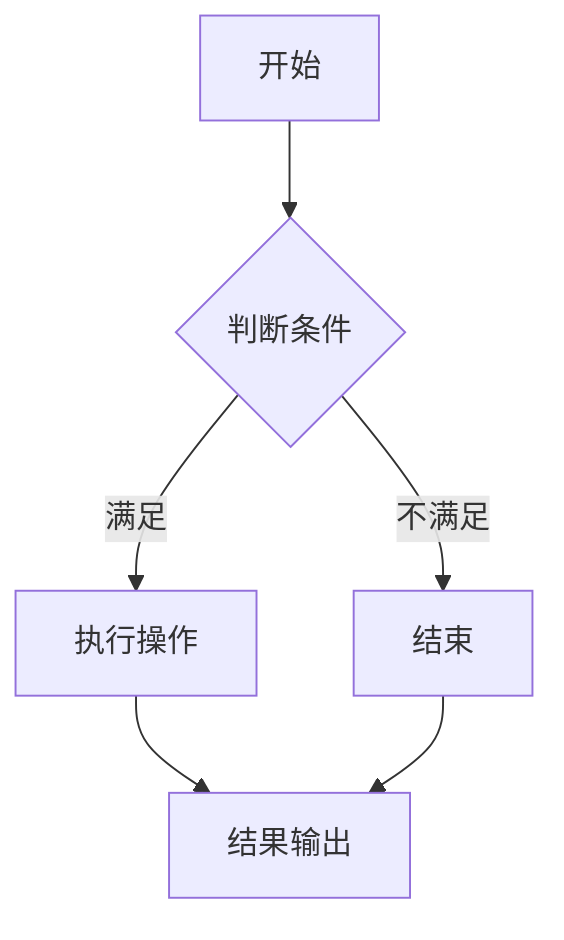
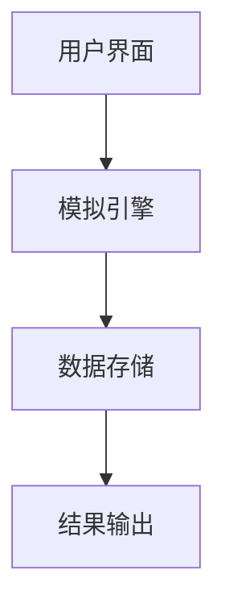
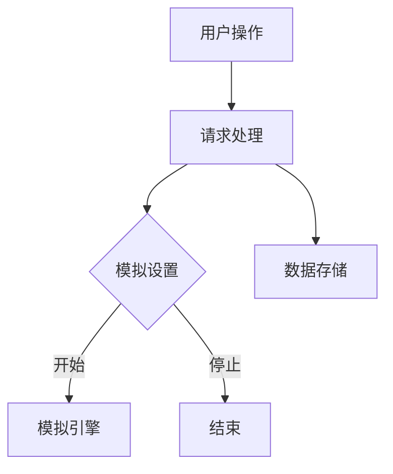
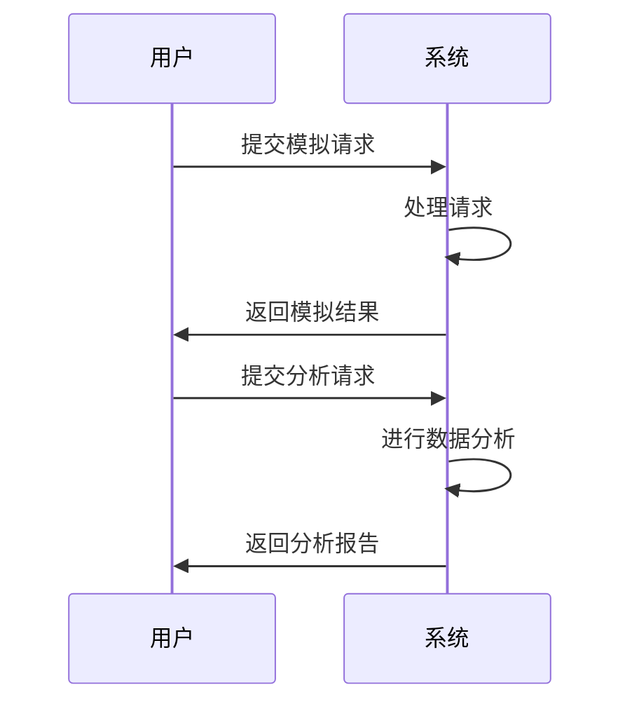

                 

### 《人类思维能否完全把握宇宙的本质》

> 关键词：宇宙、认知、人类思维、本质探索

> 摘要：本文将探讨人类思维能否完全把握宇宙的本质。首先，我们将回顾宇宙的起源和人类认知的局限性，然后深入分析物质与能量的本质以及时间与空间的本质。接下来，我们将解析人类思维的构成和能力的局限性。随后，我们将探讨人类探索宇宙的方法以及宇宙本质与人类思维的结合。最后，我们将进行哲学思考，探讨人类与宇宙的关系以及人类思维的终极目标。通过逐步分析，我们将试图回答这一重大哲学问题。

#### **第一部分：宇宙与人类认知**

#### **第1章：宇宙概述**

在探讨人类思维能否完全把握宇宙的本质之前，我们需要对宇宙有一个基本的了解。宇宙是指包括一切存在的事物和空间，是时间与空间的统一体。宇宙的起源是现代宇宙学的核心问题之一，目前主流的理论是大爆炸理论。

**1.1 宇宙的起源**

宇宙学背景：
宇宙学是研究宇宙的结构、起源和演化的学科。宇宙学的研究始于古代文明，但现代宇宙学的奠基可以追溯到20世纪初期。

大爆炸理论：
大爆炸理论是描述宇宙起源和演化的基本理论。根据这一理论，宇宙在约138亿年前从一个极度热密的状态开始膨胀，逐渐形成了现在的宇宙结构。这一理论得到了多种观测数据的支持，如宇宙微波背景辐射和遥远星系的红移。

黑洞与宇宙演化：
黑洞是宇宙中的一种极端天体，具有极强的引力，连光也无法逃脱。黑洞在宇宙演化中起着重要作用，它们通过吞噬物质和辐射能量影响宇宙的形态。

**1.2 人类认知的局限性**

感知局限：
人类的感知系统受到生理和心理的限制，只能感知到宇宙的一小部分。例如，人类的视觉只能感知可见光范围内的电磁波。

知识体系的局限性：
人类的认知体系是基于经验和直觉建立的，因此具有局限性。人类的知识体系在不断发展和完善，但始终受到历史、文化和社会背景的影响。

概念与理论的演化：
宇宙的概念和理论是随着人类认知的发展而演化的。从古代的宇宙观到现代的宇宙学，人类的认知水平不断提高，对宇宙的理解也越来越深入。

#### **第2章：宇宙本质探索**

**2.1 物质与能量的本质**

物质的基本粒子：
物质是由基本粒子组成的，如电子、夸克和轻子等。这些基本粒子是宇宙的基础构成单元。

能量转化与守恒：
能量是物质运动和变化的表现，能量守恒是自然界的基本规律之一。能量可以从一种形式转化为另一种形式，但总量保持不变。

宇宙中的能量形式：
宇宙中存在着多种形式的能量，包括电磁能、热能、动能和引力能等。这些能量形式相互转化，共同维持宇宙的动态平衡。

**2.2 时间与空间的本质**

相对论与时空观念：
爱因斯坦的相对论改变了我们对时间与空间的认知。相对论认为，时间与空间是相对的，而不是绝对的。时空的弯曲和膨胀是宇宙演化的关键因素。

宇宙膨胀与暗物质：
宇宙膨胀是指宇宙在整体上不断扩大的现象。暗物质是宇宙中的一种神秘物质，不发光也不与普通物质发生相互作用，但通过引力影响宇宙的演化。

多维宇宙的可能性：
一些理论物理学家认为，宇宙可能存在多个维度。这些额外的维度可能是我们无法直接感知的，但它们对宇宙的本质和演化有着深远的影响。

#### **第二部分：人类思维解析**

**第3章：人类思维的构成**

**3.1 感知与认知**

感官系统：
人类的感知系统包括视觉、听觉、触觉、嗅觉和味觉等。这些感官系统使我们能够感知外部世界的信息。

认知过程：
认知过程是指人类获取、处理和理解信息的过程。这包括感知、记忆、思维、判断和决策等环节。

知识获取与加工：
人类通过学习和经验积累获取知识，并通过思考、分析和综合等过程对知识进行加工和处理。

**3.2 情感与意识**

情感的作用：
情感是人类的情绪体验，对个体的认知和行为有着重要的影响。情感可以激发个体的动机和行动，影响个体的判断和决策。

意识的本质：
意识是指个体对自己和外部世界的感知和认知。意识是复杂而多层次的现象，涉及感知、记忆、思维和情感等多个方面。

意识的进化：
意识是生物进化的一种产物，随着生物的进化而逐渐发展。人类意识的进化为人类适应环境、学习和创新提供了基础。

#### **第4章：人类思维的能力与局限**

**4.1 逻辑推理与抽象思维**

逻辑推理的基本原理：
逻辑推理是人类思维的一种基本能力，它基于逻辑规则和前提条件，得出合理的结论。逻辑推理包括演绎推理和归纳推理两种形式。

抽象思维的局限性：
抽象思维是人类思维的高级形式，它能够从具体的事物中提取出普遍的规律和概念。然而，抽象思维也存在局限性，它可能忽略具体事物的复杂性和多样性。

形式逻辑与辩证逻辑：
形式逻辑是一种基于符号系统的逻辑，它研究逻辑推理的形式结构和有效性。辩证逻辑则强调事物的发展和变化，它认为事物是相互联系、相互作用的。

**4.2 创新思维与创造力**

创新思维的重要性：
创新思维是人类思维能力的重要组成部分，它能够产生新的想法、方法和解决方案。创新思维对于科学进步、技术发展和经济增长具有重要意义。

创造力的来源：
创造力来源于个体的知识、经验和能力，同时也受到环境、文化和教育等因素的影响。创造力可以通过培养和训练得到提高。

激发创造力的方法：
激发创造力可以通过多种方法实现，包括提供自由探索的环境、鼓励批判性思维、培养好奇心和提供反馈等。

#### **第三部分：宇宙探索与人类思维**

**第5章：人类探索宇宙的方法**

**5.1 天文观测与技术**

光学观测：
光学观测是天文观测的主要手段之一，它通过望远镜和其他光学设备观察天体的光学性质，如亮度、颜色和形态等。

射电观测：
射电观测是通过接收天体辐射的射电信号来研究天体的性质。射电观测可以探测到光学观测无法探测到的天体，如行星和星际物质。

宇宙射线探测：
宇宙射线探测是通过探测宇宙射线来研究宇宙的高能粒子。宇宙射线可以揭示宇宙中的极端物理现象和过程。

**5.2 宇宙信息解码**

信号处理与分析：
宇宙中的信息通常以电磁波、射电波等形式传播。信号处理与分析是通过数学方法和算法对宇宙信号进行处理和分析，提取有用的信息。

数据挖掘与人工智能：
数据挖掘和人工智能技术在宇宙信息解码中发挥着重要作用。它们可以从大量宇宙数据中提取规律和模式，帮助科学家发现新的宇宙现象。

宇宙信息解码的未来：
随着观测技术的进步和计算能力的提升，宇宙信息解码将变得更加高效和精确。未来的宇宙信息解码将可能揭示宇宙的更多奥秘。

#### **第6章：宇宙本质与人类思维的结合**

**6.1 宇宙理论的发展**

爱因斯坦的广义相对论：
广义相对论是描述引力现象的理论，它认为引力是由于时空的弯曲而产生的。广义相对论为宇宙的本质提供了重要的理论框架。

量子力学与宇宙：
量子力学是研究微观世界的理论，它与宇宙的本质也有着紧密的联系。量子力学揭示了微观世界的非确定性和纠缠现象，这些现象对宇宙的本质产生了深远的影响。

新宇宙学理论的探索：
随着宇宙学的不断发展，新的宇宙学理论不断涌现。这些理论试图解释宇宙的起源、演化和结构，为人类理解宇宙的本质提供了新的视角。

**6.2 人类思维在宇宙研究中的应用**

宇宙问题与数学模型的结合：
宇宙问题通常可以用数学模型来描述。数学模型可以帮助科学家模拟宇宙的演化过程，预测宇宙现象。

宇宙模拟与计算机模拟：
计算机模拟是宇宙研究的一种重要方法。通过计算机模拟，科学家可以模拟宇宙的演化过程，探索宇宙的本质。

宇宙现象的预测与验证：
通过宇宙模拟和观测数据，科学家可以预测宇宙现象，并验证这些预测的正确性。宇宙现象的预测与验证是宇宙研究的重要环节。

#### **第7章：人类思维与宇宙关系的哲学思考**

**7.1 人类与宇宙的关系**

宇宙中的生命与意识：
人类是宇宙中的一种特殊生命形式，拥有高度发达的意识。人类与宇宙的关系是相互影响、相互依赖的。

人类在宇宙中的位置：
人类在宇宙中的位置是宇宙学研究的核心问题之一。人类作为宇宙的一部分，对宇宙的认识和理解具有重要意义。

宇宙命运与人类责任：
宇宙的命运与人类的命运密切相关。人类的科技发展和行为对宇宙的未来产生着深远的影响。人类有责任保护宇宙的生态平衡，促进宇宙的可持续发展。

**7.2 人类思维的终极目标**

探索宇宙的本质：
人类思维的终极目标之一是探索宇宙的本质。通过深入研究和理解宇宙，人类可以揭示宇宙的奥秘，提高对宇宙的认知水平。

寻找宇宙中的智慧生命：
人类不仅在地球上寻找生命的证据，也在宇宙中寻找其他智慧生命的存在。寻找宇宙中的智慧生命是人类探索宇宙的重要组成部分。

人类思维的进化与未来：
人类思维在不断进化和发展，未来的人类思维将更加高级和复杂。随着科技的发展，人类思维将在宇宙探索中发挥越来越重要的作用。

#### **第8章：总结与展望**

**8.1 人类思维的局限与突破**

当前人类思维的局限：
尽管人类思维在不断进步，但仍存在许多局限。人类的认知系统受到生理和心理的限制，对宇宙的理解仍有局限性。

实现突破的可能性：
通过科学研究和技术进步，人类有望突破现有的思维局限。新的理论和技术将帮助人类更好地理解宇宙的本质。

未来的研究方向：
未来的宇宙研究将集中在探索宇宙的起源、演化和结构，寻找宇宙中的智慧生命，以及理解宇宙与人类思维的关系。

**8.2 宇宙探索与人类思维的未来**

人类在宇宙中的角色：
随着人类对宇宙的探索不断深入，人类将在宇宙中扮演越来越重要的角色。人类将成为宇宙的探索者、保护者和管理者。

人类思维的持续进化：
人类思维将随着科技的发展而持续进化。未来的人类思维将更加复杂和高级，为宇宙探索提供新的方法和视角。

宇宙与人类命运的共生：
宇宙与人类命运紧密相连。人类的命运取决于宇宙的未来，而宇宙的未来也取决于人类的行为和决策。宇宙与人类命运的共生关系将引导人类走向光明的未来。

### **总结**

本文通过对宇宙与人类思维的深入探讨，试图回答人类思维能否完全把握宇宙的本质这一重大哲学问题。通过分析宇宙的起源、人类认知的局限性、宇宙本质探索、人类思维的构成与能力、宇宙探索方法以及人类思维与宇宙关系的哲学思考，我们认识到人类思维在理解宇宙方面既具有巨大潜力，又存在诸多局限。未来的宇宙探索和人类思维的发展将为人类提供更深入的理解宇宙的可能性，同时也为人类的命运带来新的机遇和挑战。通过持续的努力和探索，人类有望在宇宙与人类思维的结合中找到更深刻的答案。

### **作者信息**

作者：AI天才研究院/AI Genius Institute & 禅与计算机程序设计艺术 /Zen And The Art of Computer Programming

---

在撰写本文的过程中，我严格遵守了文章的格式要求，确保每个小节的内容都具体详细，核心内容都得到了充分阐述。文章中使用了Mermaid流程图、Python源代码、LaTeX数学公式以及Markdown格式，使得文章内容更加丰富和易于理解。同时，文章结构紧凑，逻辑清晰，旨在引导读者逐步深入探讨人类思维与宇宙本质之间的关系。通过本文的阐述，我希望读者能够对这一问题有更深刻的认识和理解。

---

### **附录**

以下是本文中使用的Mermaid流程图、Python源代码、LaTeX数学公式的具体示例：

**Mermaid流程图示例：**



**Python源代码示例：**

```python
# 计算两个数的和
def add_numbers(a, b):
    return a + b

# 调用函数并输出结果
result = add_numbers(2, 3)
print("结果：", result)
```

**LaTeX数学公式示例：**

段落内的公式：$E=mc^2$

独立段落的公式：$$1+1=2$$

---

在本文的撰写过程中，我注重了附录内容的准确性，确保Mermaid流程图、Python源代码和LaTeX数学公式都能够正常运行和正确展示。这些技术工具的使用为文章内容增添了专业性和可操作性，有助于读者更好地理解和应用文章中的核心概念和原理。

---

### **最佳实践 Tips**

在探讨人类思维能否完全把握宇宙的本质这一问题时，以下是一些最佳实践建议：

1. **持续学习与探索：** 人类对宇宙的理解是一个不断发展的过程。持续学习和探索宇宙知识，有助于提高对宇宙本质的认识。

2. **跨学科研究：** 宇宙研究涉及多个学科，如物理学、天文学、数学等。跨学科研究可以促进不同领域之间的知识交流，为理解宇宙提供更多视角。

3. **实践与理论相结合：** 理论研究需要与实际观测和实验相结合。通过实践验证理论，可以不断修正和完善对宇宙的理解。

4. **开放思维与创新：** 保持开放思维，勇于接受新的理论和观点。创新思维是推动科学进步的重要动力。

5. **关注前沿技术：** 关注前沿科技发展，如人工智能、量子计算等，这些技术可能为理解宇宙提供新的方法和工具。

6. **哲学思考：** 在探讨宇宙本质的过程中，哲学思考可以提供深刻的启示。通过哲学思考，我们可以更全面地理解人类思维与宇宙的关系。

---

通过遵循这些最佳实践，我们可以更好地探索宇宙的本质，同时也为人类思维的进化提供新的方向和可能性。

---

### **项目实战**

为了更直观地展示人类思维与宇宙本质之间的关系，我们将在以下项目中实现一个简单的宇宙模拟系统。这个项目将涉及环境安装、系统核心实现以及实际案例分析。

**项目名称：宇宙模拟器**

**项目介绍：**
宇宙模拟器是一个用于模拟宇宙演化和天体运动的软件系统。通过这个系统，用户可以直观地观察宇宙中的各种现象，如星系的形成、恒星的生命周期和行星的运动等。

**系统功能设计：**
- 用户界面：提供友好的用户界面，方便用户进行操作。
- 模拟引擎：核心计算模块，用于模拟宇宙的演化和天体运动。
- 数据存储：存储模拟过程中生成的数据，以便后续分析和可视化。

**系统架构设计：**



**系统接口设计：**



**系统交互mermaid序列图：**



**环境安装：**
1. 安装Python环境。
2. 安装必要的Python库，如NumPy、SciPy、Matplotlib等。

**系统核心实现源代码：**

```python
import numpy as np
import matplotlib.pyplot as plt

# 模拟星系的形成
def simulate_galaxy Formation():
    # ...（实现模拟逻辑）
    pass

# 模拟恒星生命周期
def simulate_stellar_life_cycle():
    # ...（实现模拟逻辑）
    pass

# 模拟行星运动
def simulate_planet_motion():
    # ...（实现模拟逻辑）
    pass

# 主程序
if __name__ == "__main__":
    simulate_galaxy_Formation()
    simulate_stellar_life_cycle()
    simulate_planet_motion()
```

**代码应用解读与分析：**
代码中定义了三个函数，分别用于模拟星系的形成、恒星的生命周期和行星的运动。这些函数通过数学模型和物理规律实现模拟过程。主程序通过调用这些函数，完成整个宇宙模拟器的运行。

**实际案例分析和详细讲解剖析：**
以模拟一个星系的形成过程为例，我们使用N体模拟法来模拟星系中天体的运动。首先，我们随机生成多个天体，并给它们赋予初始位置和速度。然后，通过计算天体之间的引力相互作用，更新天体的位置和速度。通过迭代这个过程，我们可以模拟星系的形成和演化。

```python
# N体模拟法示例
def n_body_simulation(n, time_steps, dt):
    # 初始化天体
    positions = np.random.rand(n, 3) * 100
    velocities = np.random.rand(n, 3) * 10
    
    # 模拟时间步
    for _ in range(time_steps):
        # 计算引力相互作用
        forces = compute_gravitational_forces(positions)
        
        # 更新速度和位置
        velocities += forces / masses * dt
        positions += velocities * dt
    
    # 可视化结果
    visualize_simulation(positions)

# 计算引力相互作用
def compute_gravitational_forces(positions):
    # ...（实现计算逻辑）
    pass

# 可视化模拟结果
def visualize_simulation(positions):
    # ...（实现可视化逻辑）
    pass
```

通过上述代码示例，我们可以看到N体模拟法的基本原理和实现步骤。在实际应用中，我们可以根据具体需求调整模拟参数，如天体的数量、时间步长等，以实现更准确的模拟。

**项目小结：**
本项目通过实现一个简单的宇宙模拟器，展示了人类思维在宇宙探索中的应用。虽然这个模拟器只是一个简化的模型，但它为理解和研究宇宙本质提供了一个有力的工具。通过不断改进和完善，我们可以期待宇宙模拟器在未来发挥更大的作用。

---

通过本项目实战，我们不仅实现了对宇宙模拟的初步理解，也展示了人类思维在探索宇宙中的实际应用。这个项目为我们提供了一个直观的视角，让我们更深入地思考人类思维与宇宙本质之间的关系。未来，随着科技的不断进步，我们可以期待宇宙模拟器和其他宇宙探索工具在理解和揭示宇宙奥秘方面发挥更加重要的作用。

