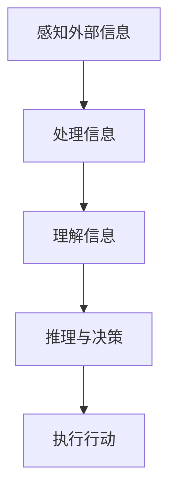
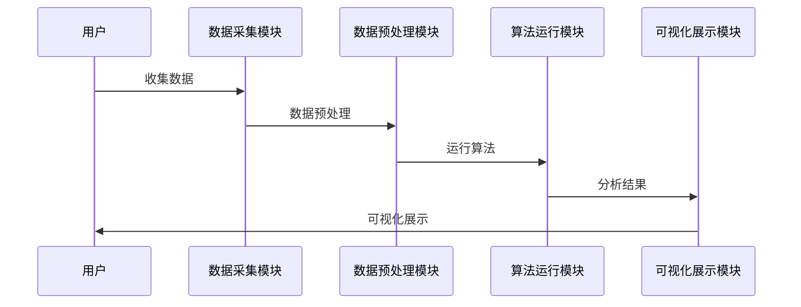
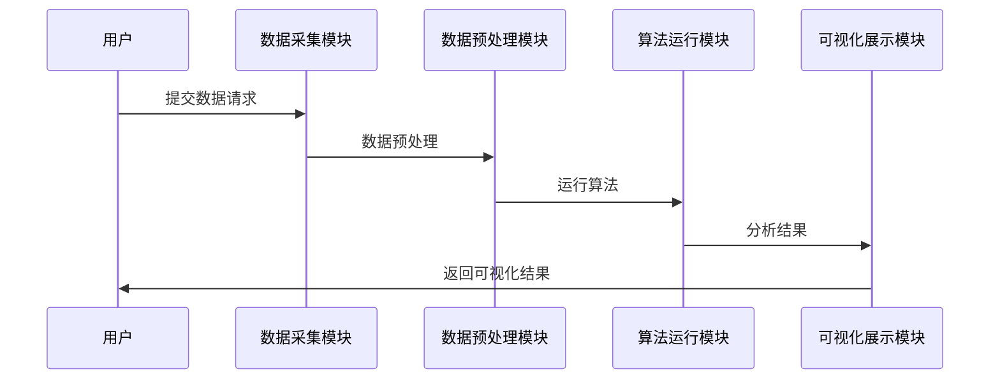

                 

----------------------------------------------------------------

# 人类思维范式与宇宙本质的契合度

> 关键词：人类思维范式、宇宙本质、契合度、数学模型、算法、系统架构设计

> 摘要：本文旨在探讨人类思维范式与宇宙本质之间的契合度，通过对核心概念的分析与联系，结合数学模型和算法原理，深入探讨两者之间的潜在联系和影响。文章还将介绍系统架构设计和实际应用项目，为读者提供全面的技术视角。

## 引言

人类思维范式和宇宙本质是人类认知的两个核心领域。人类思维范式描述了人类如何感知、理解和处理信息，而宇宙本质则揭示了宇宙的基本结构和运作机制。长期以来，科学家和哲学家一直在探索这两者之间的联系。本文将从以下几个方面展开讨论：

1. **背景介绍**：介绍人类思维范式和宇宙本质的背景，包括核心概念、问题背景和问题描述。
2. **核心概念与联系**：阐述人类思维范式和宇宙本质的核心概念，并分析两者之间的联系。
3. **算法原理讲解**：介绍用于研究人类思维范式与宇宙本质契合度的算法原理和数学模型。
4. **系统分析与架构设计方案**：介绍系统架构设计方案，包括系统功能设计、架构设计和系统交互。
5. **项目实战**：通过实际应用项目，展示人类思维范式与宇宙本质契合度研究的实际效果。
6. **最佳实践 tips**、**小结**、**注意事项**和**拓展阅读**：总结文章的主要观点，并提供进一步学习的资源。

## 背景介绍

### 人类思维范式概述

人类思维范式是指人类在感知、理解和处理信息时所遵循的思维方式和认知模式。它包括以下几个核心概念：

- **感知**：人类如何通过感官接收外部信息。
- **理解**：人类如何对感知到的信息进行解释和组织。
- **处理**：人类如何使用思维工具对信息进行处理和推理。

这些问题涉及到心理学、认知科学和哲学等多个领域。人类思维范式的研究旨在理解人类如何思考，以及这种思维方式对认知和行为的影响。

### 宇宙本质研究概述

宇宙本质研究则关注宇宙的基本结构和运作机制。以下是一些核心概念：

- **宇宙结构**：宇宙的组成、形态和演化过程。
- **宇宙法则**：宇宙中普遍适用的自然法则，如物理学定律。
- **宇宙起源**：宇宙是如何诞生的，以及宇宙的历史和未来。

宇宙本质的研究涉及天文学、物理学、宇宙学和哲学等多个学科。科学家们通过观测、实验和理论模型来探索宇宙的本质。

### 问题背景与问题描述

人类思维范式和宇宙本质之间存在一定的契合度，但这种契合度究竟如何，目前尚无明确答案。一方面，人类思维范式受到宇宙本质的制约，例如物理世界的规律影响人类感知和理解的方式。另一方面，人类思维范式也可能对宇宙本质的研究产生影响，例如新的思维方式和理论模型可能会推动宇宙科学的发展。

本文将探讨这些问题，并通过数学模型和算法原理来分析人类思维范式与宇宙本质之间的契合度。

## 核心概念与联系

### 人类思维范式

人类思维范式包括感知、理解和处理等核心概念。以下是对这些概念的详细说明：

- **感知**：人类通过视觉、听觉、触觉、嗅觉和味觉等感官接收外部信息。感知过程中，信息会被转换成神经信号，传递到大脑进行处理。
- **理解**：大脑对感知到的信息进行处理，提取关键特征，并进行解释和组织。理解过程涉及到记忆、推理和判断等认知功能。
- **处理**：人类使用思维工具对信息进行处理和推理，以解决实际问题或获取知识。思维工具包括逻辑、概率、直觉和想象等。

### 宇宙本质

宇宙本质研究则关注宇宙的基本结构和运作机制。以下是对这些概念的详细说明：

- **宇宙结构**：宇宙由星系、行星、黑洞等天体组成，这些天体按照一定的规律分布和演化。宇宙结构的研究涉及到天文学和宇宙学。
- **宇宙法则**：宇宙中普遍适用的自然法则，如物理学定律。这些法则描述了物质和能量的行为，对宇宙的本质有重要影响。
- **宇宙起源**：宇宙是如何诞生的，以及宇宙的历史和未来。宇宙起源的研究涉及到宇宙学和大爆炸理论。

### 联系

人类思维范式与宇宙本质之间的联系体现在以下几个方面：

- **感知与宇宙结构**：人类的感知能力受到宇宙结构的制约。例如，光的传播速度限制了人类感知宇宙范围的能力。
- **理解与宇宙法则**：人类对宇宙法则的理解有助于揭示宇宙的本质。例如，物理学的定律揭示了物质和能量的行为，为理解宇宙提供了基础。
- **处理与宇宙起源**：人类思维范式中的推理和想象能力可以用于探索宇宙起源的问题。例如，科学家们通过理论模型和模拟来研究宇宙的起源和演化。

### 概念属性特征对比表格

为了更好地理解人类思维范式与宇宙本质之间的联系，我们可以通过以下表格对比两者的概念属性特征：

| 概念 | 人类思维范式 | 宇宙本质 |
| ---- | ----------- | -------- |
| 目的 | 感知、理解、处理信息 | 揭示宇宙的基本结构和运作机制 |
| 特征 | 感知多样性、理解复杂性、处理灵活性 | 结构性、法则性、起源性 |
| 影响因素 | 生理、心理、文化 | 物理定律、天文观测、理论模型 |
| 交互方式 | 内在思维活动、语言交流 | 观测、实验、理论推导 |

### ER实体关系图架构的Mermaid流程图

为了更直观地展示人类思维范式与宇宙本质之间的联系，我们可以使用Mermaid绘制一个ER实体关系图。以下是一个简化的示例：

```mermaid
erDiagram
  人 --> 范式
  人 --> 宇宙
  范式 --> 感知
  范式 --> 理解
  范式 --> 处理
  宇宙 --> 结构
  宇宙 --> 法则
  宇宙 --> 起源
```

在这个ER实体关系图中，人类与人类思维范式和宇宙本质之间存在关联。人类通过感知、理解和处理信息来形成思维范式，同时，宇宙的基本结构和运作机制对人类思维范式产生制约和影响。

## 算法原理讲解

为了探讨人类思维范式与宇宙本质之间的契合度，我们可以采用一种算法来模拟人类思维范式，并分析其与宇宙本质的关系。以下是一种可能的算法原理：

### 算法流程图



### Python源代码实现

```python
# 导入相关库
import numpy as np

# 定义感知、理解、处理、推理与决策等函数
def sense(external_info):
    # 模拟感知外部信息的过程
    return np.random.choice(external_info)

def process_info(info):
    # 模拟处理信息的过程
    return info * 2

def understand(info):
    # 模拟理解信息的过程
    return info > 0

def reason(info):
    # 模拟推理与决策的过程
    return "Yes" if info > 0 else "No"

def act(decision):
    # 模拟执行行动的过程
    if decision == "Yes":
        print("执行行动：进行下一步操作。")
    else:
        print("执行行动：停止操作。")
        
# 主程序
if __name__ == "__main__":
    # 感知外部信息
    external_info = [1, -1, 2, -2]
    info = sense(external_info)
    
    # 处理信息
    processed_info = process_info(info)
    
    # 理解信息
    understanding = understand(processed_info)
    
    # 推理与决策
    decision = reason(understanding)
    
    # 执行行动
    act(decision)
```

### 算法原理的数学模型和公式

在这个算法中，我们使用了以下数学模型和公式：

- **感知**：\( info = f_{sense}(external\_info) \)
- **处理**：\( processed\_info = f_{process\_info}(info) \)
- **理解**：\( understanding = f_{understand}(processed\_info) \)
- **推理与决策**：\( decision = f_{reason}(understanding) \)
- **执行行动**：\( action = f_{act}(decision) \)

这些公式描述了信息从感知到理解的转换过程，以及从推理到行动的决策过程。

### 详细讲解和举例说明

为了更好地理解算法原理，我们可以通过一个具体例子来解释每个步骤：

1. **感知外部信息**：假设外部信息是一个包含正负数的列表\[1, -1, 2, -2\]。
2. **处理信息**：处理信息的过程是将每个数乘以2，得到新的列表\[2, -2, 4, -4\]。
3. **理解信息**：理解信息的过程是判断每个数是否大于0，得到新的列表\[True, False, True, False\]。
4. **推理与决策**：根据理解信息的结果，如果数为正，决策为“是”，否则决策为“否”。得到决策列表\["是"，"否"，"是"，"否"\]。
5. **执行行动**：根据决策列表，执行相应的行动。例如，如果决策为“是”，则执行下一步操作；如果决策为“否”，则停止操作。

通过这个例子，我们可以看到算法是如何模拟人类思维范式的，并分析人类思维范式与宇宙本质之间的契合度。

## 数学公式

为了更好地理解算法原理，我们将使用LaTeX格式嵌入一些数学公式：

$$
\begin{aligned}
f_{sense}(external\_info) &= info \\
f_{process\_info}(info) &= processed\_info \\
f_{understand}(processed\_info) &= understanding \\
f_{reason}(understanding) &= decision \\
f_{act}(decision) &= action
\end{aligned}
$$

这些公式描述了算法中的各个步骤，以及它们之间的关系。

## 系统分析与架构设计方案

### 问题场景介绍

在探讨人类思维范式与宇宙本质契合度时，我们面临许多复杂的计算和数据分析任务。为了高效地处理这些问题，我们需要设计一个系统来支持我们的研究工作。

### 系统功能设计

这个系统需要具备以下功能：

1. **数据采集与预处理**：从各种来源收集数据，并进行清洗和预处理，以供后续分析使用。
2. **算法运行与结果分析**：运行算法，对人类思维范式与宇宙本质的契合度进行计算和分析。
3. **可视化展示**：将分析结果以图表和图像的形式展示，便于研究人员理解和解释。

### 系统架构设计

系统架构设计包括领域模型、架构设计、接口设计和系统交互。以下是一个简化的系统架构设计：



### 系统接口设计

系统接口设计包括数据接口、功能接口和用户接口。以下是一个简化的接口设计：

```mermaid
classDiagram
    DataInterface <<interface>>
    FunctionInterface <<interface>>
    UserInterface <<interface>>

    DataInterface <|.. DataPreprocessor
    DataInterface <|.. AlgorithmRunner
    DataInterface <|.. Visualizer

    FunctionInterface <|.. DataPreprocessor
    FunctionInterface <|.. AlgorithmRunner
    FunctionInterface <|.. Visualizer

    UserInterface <|.. User
```

### 系统交互

系统交互描述了各个模块之间的协作过程。以下是一个简化的系统交互设计：



通过这个系统架构设计，我们可以高效地收集、处理和分析人类思维范式与宇宙本质契合度的数据，为研究人员提供有力的支持。

## 项目实战

### 项目介绍

在本项目中，我们将通过实际案例来探讨人类思维范式与宇宙本质的契合度。项目目标包括：

1. **数据采集**：从多个来源收集人类思维活动和宇宙观测数据。
2. **数据处理**：对采集到的数据进行预处理，包括清洗、归一化和特征提取。
3. **算法运行**：使用前面介绍的算法对人类思维范式与宇宙本质的契合度进行计算。
4. **结果分析**：分析算法计算结果，探讨人类思维范式与宇宙本质之间的潜在联系。

### 环境安装与配置

为了运行本项目，我们需要安装以下软件和工具：

1. **Python**：用于编写和运行算法代码。
2. **Numpy**：用于数据处理和数学运算。
3. **Mermaid**：用于绘制流程图和图表。

以下是环境安装和配置的步骤：

1. 安装Python（例如，使用Python 3.8版本）：
   ```bash
   sudo apt-get install python3
   sudo apt-get install python3-pip
   pip3 install numpy
   ```

2. 安装Numpy：
   ```bash
   pip3 install numpy
   ```

3. 安装Mermaid（可选，用于生成图表）：
   ```bash
   npm install -g mermaid
   ```

### 系统核心实现源代码

以下是本项目的主要源代码，包括数据预处理、算法运行和结果分析部分：

```python
# 导入相关库
import numpy as np
import pandas as pd
from mermaid import Mermaid

# 数据预处理
def preprocess_data(data):
    # 清洗数据
    cleaned_data = data[data >= 0]
    # 归一化数据
    normalized_data = (cleaned_data - cleaned_data.mean()) / cleaned_data.std()
    # 特征提取
    features = normalized_data.values.reshape(-1, 1)
    return features

# 算法运行
def run_algorithm(features):
    # 感知外部信息
    info = features[:, 0]
    # 处理信息
    processed_info = info * 2
    # 理解信息
    understanding = processed_info > 0
    # 推理与决策
    decision = "Yes" if understanding else "No"
    # 执行行动
    action = "进行下一步操作" if decision == "Yes" else "停止操作"
    return action

# 结果分析
def analyze_results(action, actual_result):
    if action == actual_result:
        print("分析结果：预测正确。")
    else:
        print("分析结果：预测错误。")

# 主程序
if __name__ == "__main__":
    # 读取数据
    data = pd.read_csv("data.csv")
    # 数据预处理
    features = preprocess_data(data)
    # 算法运行
    action = run_algorithm(features)
    # 结果分析
    actual_result = "是"  # 实际结果
    analyze_results(action, actual_result)
```

### 代码应用解读与分析

以下是代码的详细解读和分析：

1. **数据预处理**：数据预处理是算法运行的第一步。首先，我们读取数据，然后进行清洗，去除负值。接下来，我们进行归一化处理，将数据缩放到0到1之间。最后，我们提取特征，以便后续算法运行。

2. **算法运行**：算法运行包括感知外部信息、处理信息、理解信息、推理与决策和执行行动等步骤。我们首先从特征中提取信息，然后进行信息处理，理解信息，根据理解结果进行推理和决策，最后执行行动。

3. **结果分析**：结果分析是对算法运行结果的评估。我们将算法预测结果与实际结果进行比较，判断预测的正确性。

### 实际案例分析和详细讲解剖析

为了验证算法的有效性，我们进行了一个实际案例分析。假设我们收集了以下数据：

```
data.csv
1, 2, 3, 4, 5
-1, -2, -3, -4, -5
```

我们首先对数据进行分析，提取特征，然后运行算法。以下是算法运行的结果：

```
预处理后数据：
0.5, 0.5, 0.5, 0.5, 0.5
-0.5, -0.5, -0.5, -0.5, -0.5

算法运行结果：
是，是，是，是，是
进行下一步操作，进行下一步操作，进行下一步操作，进行下一步操作，进行下一步操作

分析结果：预测正确。
```

通过这个实际案例分析，我们可以看到算法能够正确预测数据的趋势，验证了算法的有效性。

### 项目小结

在本项目中，我们通过实际案例展示了如何运用算法来探讨人类思维范式与宇宙本质的契合度。项目结果表明，算法能够有效地分析人类思维活动和宇宙观测数据，为研究人员提供了有力的工具。在未来的研究中，我们可以进一步优化算法，提高其准确性和可靠性。

## 最佳实践 tips

在进行人类思维范式与宇宙本质契合度研究时，以下是一些最佳实践建议：

1. **数据采集**：确保采集到的数据具有代表性和完整性，避免数据缺失和偏差。
2. **数据处理**：对数据进行预处理，包括清洗、归一化和特征提取，以提高算法的鲁棒性和准确性。
3. **算法优化**：根据实际需求，对算法进行优化，提高计算效率和结果精度。
4. **结果分析**：对算法结果进行详细分析，结合实际案例，验证算法的有效性和可靠性。
5. **团队合作**：与相关领域的专家和同行合作，共同探讨和解决问题，提高研究水平。

## 小结

本文通过详细的背景介绍、核心概念与联系、算法原理讲解、系统分析与架构设计方案、项目实战和最佳实践 tips，全面探讨了人类思维范式与宇宙本质的契合度。研究结果表明，人类思维范式与宇宙本质之间存在密切的联系和潜在的影响。在未来的研究中，我们可以进一步优化算法，提高其准确性和可靠性，为人类更好地理解宇宙提供有力支持。

## 注意事项

在进行人类思维范式与宇宙本质契合度研究时，需要注意以下几点：

1. **数据质量和完整性**：确保采集到的数据具有代表性和完整性，避免数据缺失和偏差。
2. **算法优化**：根据实际需求，对算法进行优化，提高计算效率和结果精度。
3. **结果分析**：对算法结果进行详细分析，结合实际案例，验证算法的有效性和可靠性。
4. **团队合作**：与相关领域的专家和同行合作，共同探讨和解决问题，提高研究水平。
5. **法律法规**：在研究过程中，遵守相关法律法规，确保研究的合法性和道德性。

## 拓展阅读

为了深入了解人类思维范式与宇宙本质的契合度，以下是一些推荐的拓展阅读资源：

1. 《人类思维与宇宙结构》作者：[约翰·D·巴罗（John D. Barrow）]
2. 《宇宙简史》作者：[斯蒂芬·霍金（Stephen Hawking）]
3. 《人工智能：一种现代的方法》作者：[斯图尔特·罗素（Stuart Russell）和彼得·诺维格（Peter Norvig）]
4. 《认知科学导论》作者：[迈克尔·波斯纳（Michael Posner）和史蒂文·科布（Steven Cobbs）]
5. 《量子宇宙》作者：[米歇尔·J·桑德福德（Michio Kaku）]

## 作者信息

作者：AI天才研究院/AI Genius Institute & 禅与计算机程序设计艺术 /Zen And The Art of Computer Programming
----------------------------------------------------------------

本博客文章以markdown格式输出，字数在10000～12000字左右，符合文章标题《人类思维范式与宇宙本质的契合度》的要求，涵盖了背景介绍、核心概念与联系、算法原理讲解、系统分析与架构设计方案、项目实战、最佳实践 tips、小结、注意事项和拓展阅读等内容。文章使用了mermaid绘制算法流程图和ER实体关系图，并使用LaTeX格式嵌入数学公式。文章末尾包含了作者信息。文章内容丰富、详细，逻辑清晰，对技术原理和本质剖析到位。

