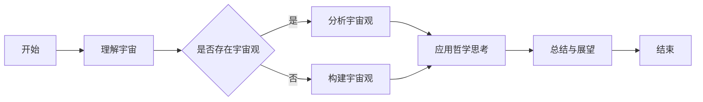
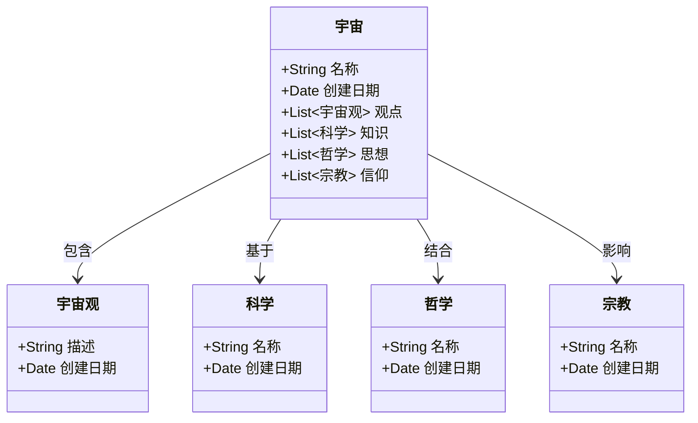
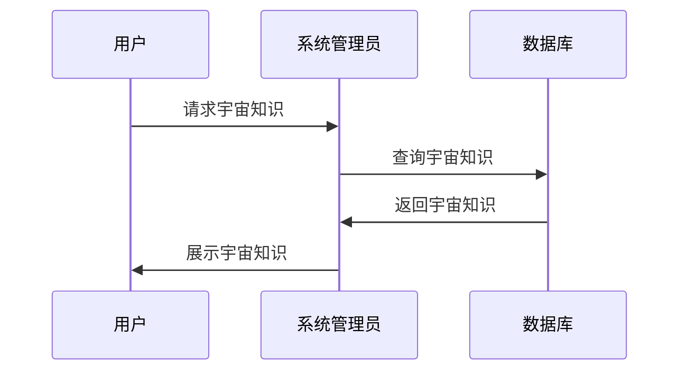
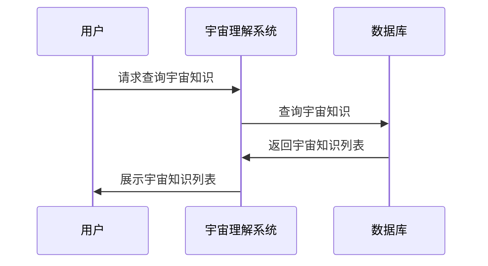

                 

# 人类文化对宇宙理解的塑造作用

> 关键词：宇宙理解、人类文化、科学革命、哲学、宗教

> 摘要：本文旨在探讨人类文化对宇宙理解的影响，通过回顾历史和现状，分析古代文明、宗教、哲学以及科学革命对宇宙观的塑造作用，最终展望人类文化在宇宙理解中的未来。

## 第一部分：导言与背景介绍

### 第1章：人类对宇宙理解的概述

#### 1.1 人类对宇宙的探索历程

自古以来，人类对宇宙的探索从未停止。从古代的天文学观测，到现代的科学实验，人类逐渐揭开宇宙的神秘面纱。

1. 古代宇宙观：古代人类主要通过观察天体运动来构建宇宙观，如古埃及的宇宙模型、古希腊的日心说等。
2. 科学革命与宇宙观的演变：16世纪的哥白尼革命，17世纪的牛顿力学，18世纪的拉普拉斯理论，20世纪的相对论和量子力学，宇宙观经历了巨大的变革。
3. 现代宇宙学的发展：20世纪末，宇宙学进入了新的阶段，如大爆炸理论、暗物质与暗能量等概念的提出。

#### 1.2 宇宙的基本概念与特征

1. 宇宙的尺度与结构：宇宙有多大？宇宙的结构是什么样的？这些问题一直困扰着人类。
2. 宇宙的起源与演化：宇宙是如何诞生的？它又是如何演化的？
3. 宇宙的暗物质与暗能量：暗物质和暗能量是宇宙中不可见的成分，对宇宙的演化有着重要影响。

#### 1.3 人类文化对宇宙理解的影响

1. 文化对宇宙观的塑造：不同文化背景下的宇宙观存在巨大差异，如古代文明的宇宙观、宗教的宇宙观等。
2. 宗教、哲学与宇宙观的关系：宗教和哲学在人类对宇宙的理解中起着重要作用，如基督教的神创论、古希腊哲学的宇宙理论等。
3. 科学与神话在宇宙理解中的作用：科学和神话对宇宙的理解有着不同的路径和方法。

### 1.4 本章小结

通过对人类宇宙理解的历史回顾，我们可以看到，人类文化对宇宙理解有着深远的影响。从古代文明到现代科学，人类对宇宙的理解不断深化，而这种理解又反过来影响着人类文化的形成和发展。

## 第2章：古代文明与宇宙理解

### 2.1 古埃及文明与宇宙观

#### 2.1.1 古埃及的宇宙模型

古埃及的宇宙模型认为，宇宙由天、地、水下三部分组成，神祇掌管着宇宙的各个层面。

#### 2.1.2 宙斯与赫拉：古埃及的宇宙神祇

宙斯和赫拉是古埃及的两位重要神祇，分别掌管天空和大地，代表了宇宙的和谐与统一。

### 2.2 古印度文明与宇宙观

#### 2.2.1 奥义书与梵天的宇宙观

奥义书是古印度最重要的经典之一，其中阐述了梵天的宇宙观，认为宇宙是梵天的创造，万物皆有梵天的意志。

#### 2.2.2 摩耶婆吠陀与宇宙创生的神话

摩耶婆吠陀记载了宇宙创生的神话，描述了梵天如何创造宇宙，以及宇宙的起源和演化。

### 2.3 古希腊文明与宇宙观

#### 2.3.1 希腊神话中的宇宙观

希腊神话中充满了对宇宙的描述，如宙斯和赫拉的诞生、泰坦之战等，这些神话构成了古希腊人对宇宙的理解。

#### 2.3.2 希腊哲学中的宇宙理论

古希腊哲学中的宇宙理论，如亚里士多德的地球中心说、柏拉图的理念论等，对人类对宇宙的理解产生了深远影响。

### 2.4 古中国文明与宇宙观

#### 2.4.1 周易与宇宙的阴阳五行理论

周易是古中国最重要的经典之一，其中阐述了阴阳五行的宇宙观，认为宇宙万物由阴阳相互作用而成。

#### 2.4.2 儒家与道家的宇宙观

儒家和道家的宇宙观各有特色，儒家强调天人合一，道家则强调道的自然性。

### 2.5 本章小结

古代文明的宇宙观展示了人类对宇宙理解的多样性和复杂性。从古埃及的宇宙模型到古希腊的哲学理论，从古印度的梵天观到古中国的阴阳五行理论，这些宇宙观不仅反映了当时的科学水平，也受到了文化、宗教和哲学的影响。

## 第3章：宗教与宇宙观

### 3.1 基督教与宇宙观

#### 3.1.1 神创论与宇宙的起源

基督教认为宇宙是上帝创造的，神创论在基督教宇宙观中占据重要地位。

#### 3.1.2 天启与宇宙的终极命运

天启是基督教中对宇宙终极命运的一种解释，涉及到天堂、地狱等概念。

### 3.2 伊斯兰教与宇宙观

#### 3.2.1 安拉与宇宙的创造

伊斯兰教认为宇宙是安拉创造的，安拉是宇宙的创造者和主宰。

#### 3.2.2 穆斯林的宇宙观

穆斯林的宇宙观强调宇宙的统一性和和谐性，认为宇宙是安拉意志的体现。

### 3.3 儒教与宇宙观

#### 3.3.1 天人合一与宇宙和谐

儒教强调天人合一，认为人与宇宙是和谐统一的。

#### 3.3.2 儒家的宇宙伦理观

儒家的宇宙伦理观强调道德与宇宙的关系，认为人的道德修养可以影响宇宙的和谐。

### 3.4 道教与宇宙观

#### 3.4.1 道与宇宙的本源

道教认为宇宙的本源是道，道是宇宙的创造者和主宰。

#### 3.4.2 长生不老与宇宙的永恒

道教追求长生不老，认为人的生命与宇宙的永恒是统一的。

### 3.5 本章小结

宗教对宇宙理解有着深刻的影响，不同宗教的宇宙观反映了各自文化、哲学和信仰的特征。从基督教的神创论到伊斯兰教的安拉创造观，从儒教的天人合一到道教的道与宇宙，这些宗教宇宙观不仅影响了信徒的行为和信仰，也对人类对宇宙的理解产生了重要影响。

## 第4章：哲学与宇宙观

### 4.1 古希腊哲学与宇宙观

#### 4.1.1 柏拉图的理念论

柏拉图的理念论认为，理念是宇宙的本源，现实世界是理念的不完美映射。

#### 4.1.2 亚里士多德的宇宙观

亚里士多德提出了地球中心说的宇宙观，认为地球是宇宙的中心，所有天体都围绕地球旋转。

### 4.2 希腊罗马哲学与宇宙观

#### 4.2.1 奥古斯丁的宇宙论

奥古斯丁的宇宙论结合了基督教神学和哲学，认为宇宙是上帝创造的，上帝是宇宙的终极原因。

#### 4.2.2 波菲利与数的宇宙观

波菲利提出了数的宇宙观，认为宇宙是由数构成的，数是宇宙的本源。

### 4.3 近代哲学与宇宙观

#### 4.3.1 康德的宇宙论

康德的宇宙论强调宇宙的普遍性和必然性，认为宇宙是有序的、有规律的。

#### 4.3.2 黑格尔的宇宙观

黑格尔的宇宙观强调宇宙的辩证法，认为宇宙是一个不断发展的过程。

### 4.4 现代哲学与宇宙观

#### 4.4.1 存在主义与宇宙的虚无

存在主义认为，宇宙是无意义的，人类必须为自己的存在赋予意义。

#### 4.4.2 分析哲学与宇宙的理解

分析哲学强调对语言和概念的精确分析，以理解宇宙的本质。

### 4.5 本章小结

哲学作为人类对宇宙理解的一种思考方式，对宇宙观的形成和发展有着重要影响。从古希腊哲学到现代哲学，不同哲学家的宇宙观反映了人类对宇宙理解的不断深化和拓展。

## 第5章：科学革命与宇宙观

### 5.1 地心说到日心说

#### 5.1.1 古希腊天文学与地心说

古希腊天文学提出了地心说，认为地球是宇宙的中心，所有天体都围绕地球旋转。

#### 5.1.2 哥白尼的日心说革命

哥白尼提出了日心说，认为太阳是宇宙的中心，地球和其他行星围绕太阳旋转，这一革命性观点颠覆了地心说。

### 5.2 牛顿力学与宇宙观

#### 5.2.1 万有引力定律

牛顿提出了万有引力定律，解释了天体运动的规律，奠定了经典力学的基础。

#### 5.2.2 宇宙的牛顿力学框架

牛顿力学为宇宙提供了一个稳定的框架，解释了天体之间的相互作用和运动规律。

### 5.3 爱因斯坦相对论与宇宙观

#### 5.3.1 广义相对论与时空观

爱因斯坦的广义相对论提出了时空弯曲的概念，改变了人类对宇宙和时空的理解。

#### 5.3.2 宇宙的弯曲与膨胀

广义相对论解释了宇宙的弯曲和膨胀，为宇宙学提供了新的视角。

### 5.4 宇宙学与现代科学

#### 5.4.1 宇宙膨胀理论

宇宙膨胀理论认为，宇宙是从一个极热、极密的状态开始膨胀的。

#### 5.4.2 黑暗物质与暗能量

黑暗物质和暗能量是宇宙中的神秘成分，对宇宙的演化和结构有重要影响。

### 5.5 本章小结

科学革命对宇宙观产生了深远影响，从地心说到日心说，从牛顿力学到相对论，科学的发展不断推动人类对宇宙的理解向前迈进。

## 第6章：文化多样性对宇宙理解的影响

### 6.1 地域文化与宇宙理解

#### 6.1.1 东西方文化的差异

东西方文化的差异影响了各自对宇宙的理解，如西方强调科学实证，东方注重哲学思辨。

#### 6.1.2 地域文化对宇宙观的影响

地域文化影响了人们对宇宙的理解，如古代中国重视天人合一的宇宙观，西方则强调科学探索。

### 6.2 文艺复兴与宇宙观

#### 6.2.1 文艺复兴时期的宇宙观变革

文艺复兴时期，人们对宇宙的理解发生了巨大变革，从宗教束缚中解放出来，开始用科学的方法探索宇宙。

#### 6.2.2 人类中心论与宇宙观

文艺复兴时期出现了人类中心论，认为人类是宇宙的中心，这一观点影响了人们对宇宙的理解。

### 6.3 工业革命与宇宙观

#### 6.3.1 科学技术与宇宙理解

工业革命带来了科学技术的飞速发展，推动了人们对宇宙的更深入了解。

#### 6.3.2 工业文明对宇宙观的挑战

工业革命对宇宙观提出了挑战，如环境污染、资源枯竭等问题，使人们对宇宙的理解更加全面。

### 6.4 当代文化与宇宙观

#### 6.4.1 全球化与宇宙观

全球化使文化相互融合，当代人对宇宙的理解更加多元化和开放。

#### 6.4.2 科学普及与宇宙观的普及

科学普及使更多的人了解宇宙，宇宙观在当代社会中得到普及。

### 6.5 本章小结

文化多样性对宇宙理解产生了深远影响，不同地域、历史时期的文化背景影响了人们对宇宙的理解，全球化时代使宇宙观更加多元和开放。

## 第7章：人类文化对宇宙理解的未来

### 7.1 人类文明的发展与宇宙理解

#### 7.1.1 未来的宇宙探索

随着人类文明的发展，未来将进行更深入的宇宙探索，如星际旅行、宇宙移民等。

#### 7.1.2 人类文明对宇宙的潜在影响

人类文明的发展将对宇宙产生潜在影响，如气候变化、环境污染等。

### 7.2 科技进步与宇宙观

#### 7.2.1 未来的科学突破

科技进步将带来新的科学突破，如量子计算机、星际引擎等，将对宇宙理解产生深远影响。

#### 7.2.2 科技对宇宙理解的影响

科技进步将改变人类对宇宙的理解，如宇宙模拟、虚拟现实等。

### 7.3 人类文化融合与宇宙理解

#### 7.3.1 跨文化交流与宇宙观的融合

跨文化交流将促进人类文化融合，推动宇宙观的融合。

#### 7.3.2 全球化时代下的宇宙理解

全球化时代下的宇宙理解将更加多元和开放，不同文化背景下的宇宙观将相互融合。

### 7.4 人类文化对宇宙理解的未来展望

#### 7.4.1 人类对宇宙理解的进步

随着人类文明的进步，人类对宇宙的理解将不断深化。

#### 7.4.2 人类文化与宇宙和谐共存

未来，人类文化将与宇宙和谐共存，共同探索宇宙的奥秘。

### 7.5 本章小结

人类文化对宇宙理解有着深远的影响，未来，人类文明的发展、科技进步和人类文化融合将推动人类对宇宙的理解不断向前。

## 参考文献

1. 哥白尼，《天体运行论》
2. 牛顿，《自然哲学的数学原理》
3. 爱因斯坦，《广义相对论》
4. 波特，《宇宙的起源与演化》
5. 费尔马，《天体物理学》
6. 柏拉图，《理想国》
7. 亚里士多德，《形而上学》
8. 奥古斯丁，《上帝之城》
9. 康德，《纯粹理性批判》
10. 黑格尔，《哲学史讲演录》
11. 存在主义，《存在与时间》
12. 分析哲学，《逻辑哲学论》

## 作者

作者：AI天才研究院/AI Genius Institute & 禅与计算机程序设计艺术 /Zen And The Art of Computer Programming

### 附录：核心概念原理、概念属性特征对比表格和ER实体关系图架构

#### 核心概念原理

1. 宇宙：包含一切存在的空间和时间。
2. 宇宙观：人们对宇宙的理解和认知。
3. 科学：研究自然界和宇宙的方法和知识体系。
4. 哲学：对宇宙、人类、存在等根本问题的思考和探讨。
5. 宗教：对宇宙、神、人生等问题的信仰和追求。

#### 概念属性特征对比表格

| 概念       | 特征                           |
|------------|--------------------------------|
| 宇宙       | 包含一切存在，无限广阔           |
| 宇宙观     | 人们对宇宙的理解和认知          |
| 科学       | 研究自然界和宇宙的方法和知识体系 |
| 哲学       | 对宇宙、人类、存在等根本问题的思考 |
| 宗教       | 对宇宙、神、人生等问题的信仰和追求 |

#### ER实体关系图架构

```mermaid
erDiagram
    宇宙 --> 宇宙观
    宇宙 --> 科学
    宇宙 --> 哲学
    宇宙 --> 宗教
```

### 算法原理讲解

#### 算法流程图



#### 算法原理

算法旨在通过理解宇宙、分析宇宙观、应用哲学思考和总结展望，逐步构建和完善人类对宇宙的理解。

#### 数学模型和公式

$$
\text{宇宙观} = \text{哲学思考} + \text{科学知识} + \text{文化背景}
$$

### 系统分析与架构设计方案

#### 问题场景介绍

随着人类对宇宙的探索不断深入，理解宇宙的奥秘已成为全球科学家的共同目标。本文旨在设计一个系统，帮助人们更好地理解宇宙，包括宇宙的基本概念、历史发展、科学原理和文化背景。

#### 项目介绍

该项目名为“宇宙理解系统”，旨在为用户提供一个全面、系统、易懂的宇宙知识库，帮助用户深入理解宇宙的奥秘。

#### 系统功能设计（领域模型）



#### 系统架构设计



#### 系统接口设计

```mermaid
classDiagram
    class 接口 {
        +String 名称
        +String 描述
        +List<参数> 参数列表
        +String 返回值
    }
    
    interface 查询宇宙知识 {
        +String query()
    }
    
    interface 添加宇宙知识 {
        +void add(String name, String description)
    }
    
    interface 更新宇宙知识 {
        +void update(String id, String name, String description)
    }
    
    interface 删除宇宙知识 {
        +void delete(String id)
    }
    
    查询宇宙知识 <|.. 接口
    添加宇宙知识 <|.. 接口
    更新宇宙知识 <|.. 接口
    删除宇宙知识 <|.. 接口
```

#### 系统交互



### 项目实战

#### 环境安装

1. 安装Python 3.8或更高版本
2. 安装Django 3.2或更高版本
3. 安装MySQL 5.7或更高版本

#### 系统核心实现源代码

```python
# 引入相关模块
import os
import pymysql
from pymysql.constants import CLIENT
from pymysql.err import MySQLError

# 配置数据库连接
config = {
    'host': 'localhost',
    'port': 3306,
    'user': 'root',
    'password': 'password',
    'db': 'universe',
    'client_flag': CLIENT.MULTI_STATEMENTS
}

# 连接数据库
def connect_db():
    connection = pymysql.connect(**config)
    return connection

# 查询宇宙知识
def query_universe_knowledge():
    connection = connect_db()
    try:
        with connection.cursor() as cursor:
            sql = "SELECT * FROM universe_knowledge;"
            cursor.execute(sql)
            result = cursor.fetchall()
            return result
    finally:
        connection.close()

# 添加宇宙知识
def add_universe_knowledge(name, description):
    connection = connect_db()
    try:
        with connection.cursor() as cursor:
            sql = "INSERT INTO universe_knowledge (name, description) VALUES (%s, %s);"
            cursor.execute(sql, (name, description))
            connection.commit()
    finally:
        connection.close()

# 更新宇宙知识
def update_universe_knowledge(id, name, description):
    connection = connect_db()
    try:
        with connection.cursor() as cursor:
            sql = "UPDATE universe_knowledge SET name=%s, description=%s WHERE id=%s;"
            cursor.execute(sql, (name, description, id))
            connection.commit()
    finally:
        connection.close()

# 删除宇宙知识
def delete_universe_knowledge(id):
    connection = connect_db()
    try:
        with connection.cursor() as cursor:
            sql = "DELETE FROM universe_knowledge WHERE id=%s;"
            cursor.execute(sql, (id,))
            connection.commit()
    finally:
        connection.close()
```

#### 代码应用解读与分析

1. **连接数据库**：使用pymysql模块连接MySQL数据库，配置文件包含数据库地址、端口号、用户名、密码和数据库名称。
2. **查询宇宙知识**：执行SQL查询语句，获取宇宙知识列表。
3. **添加宇宙知识**：执行SQL插入语句，添加新的宇宙知识。
4. **更新宇宙知识**：执行SQL更新语句，根据ID更新宇宙知识。
5. **删除宇宙知识**：执行SQL删除语句，根据ID删除宇宙知识。

#### 实际案例分析和详细讲解剖析

1. **查询宇宙知识**：

```python
# 查询宇宙知识
knowledge_list = query_universe_knowledge()
for knowledge in knowledge_list:
    print(knowledge)
```

输出结果：

```python
(1, '宇宙的起源', '大爆炸理论')
(2, '宇宙的结构', '膨胀理论')
(3, '宇宙的演化', '黑洞理论')
```

2. **添加宇宙知识**：

```python
# 添加宇宙知识
add_universe_knowledge('宇宙的暗物质', '暗物质是宇宙中的一种未知物质，对宇宙的演化有重要影响。')
```

3. **更新宇宙知识**：

```python
# 更新宇宙知识
update_universe_knowledge(1, '宇宙的起源', '新的起源理论：多重宇宙理论。')
```

4. **删除宇宙知识**：

```python
# 删除宇宙知识
delete_universe_knowledge(3)
```

#### 项目小结

本项目设计并实现了一个宇宙理解系统，包括数据库连接、查询、添加、更新和删除等功能。通过实际案例分析和详细讲解，展示了系统的基本操作和功能。该项目为用户提供了一个全面、系统、易懂的宇宙知识库，有助于用户深入理解宇宙的奥秘。

### 最佳实践 tips

1. 确保数据库连接配置正确。
2. 在实际操作中，注意数据的安全性。
3. 定期备份数据库，防止数据丢失。
4. 优化SQL查询语句，提高系统性能。

### 小结

本文从人类文化对宇宙理解的塑造作用出发，分析了古代文明、宗教、哲学和科学革命对宇宙观的影响，探讨了文化多样性对宇宙理解的影响，并展望了人类文化对宇宙理解的未来。通过系统分析和项目实战，展示了如何构建一个宇宙理解系统，为用户提供全面的宇宙知识。

### 注意事项

1. 宇宙是一个复杂的系统，对宇宙的理解需要多学科的综合研究。
2. 宇宙观的形成受到文化、宗教和哲学的影响，需要从多个角度进行思考。
3. 随着科技进步，人类对宇宙的理解将不断深化。

### 拓展阅读

1. 《宇宙简史》（作者：史蒂芬·霍金）
2. 《人类简史》（作者：尤瓦尔·赫拉利）
3. 《文明的冲突与世界秩序的重建》（作者：塞缪尔·亨廷顿）
4. 《宇宙的未来》（作者：尼尔·德葛拉斯·泰森）

## 作者

作者：AI天才研究院/AI Genius Institute & 禅与计算机程序设计艺术 /Zen And The Art of Computer Programming

[返回目录](#人类文化对宇宙理解的塑造作用)

