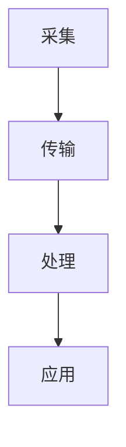
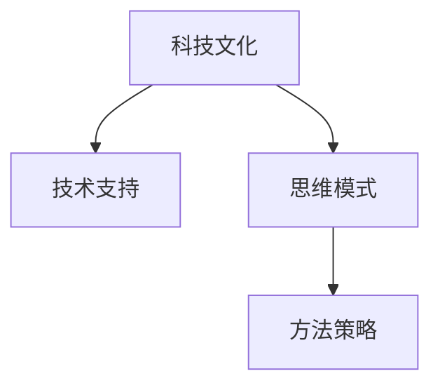
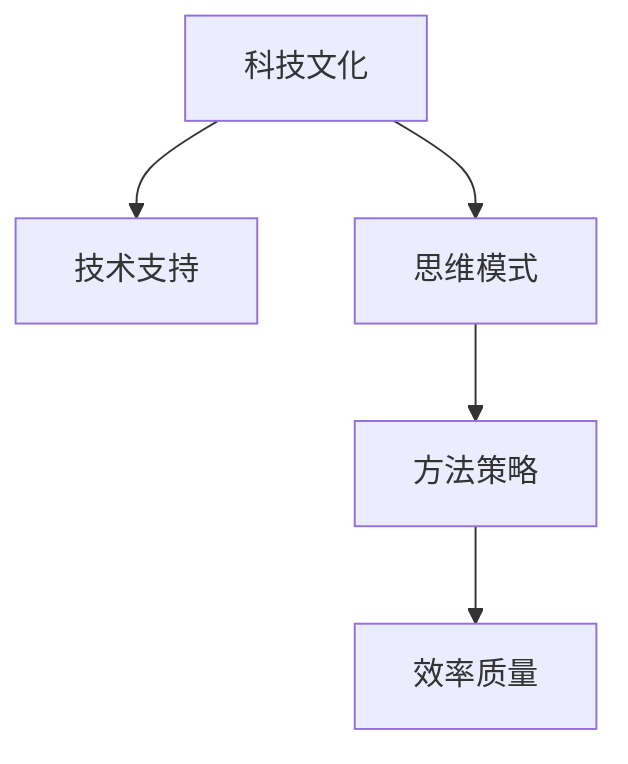
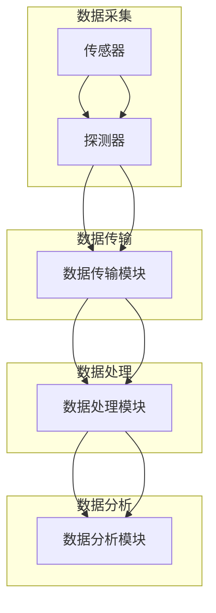
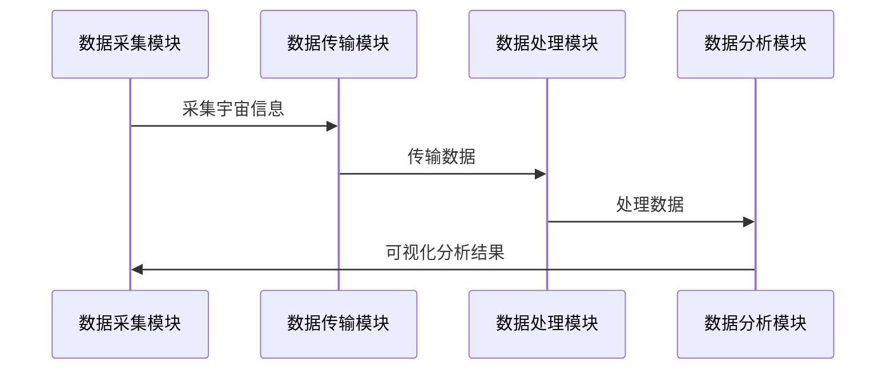

                 

# 人类文明在宇宙信息处理中的角色

> 关键词：宇宙信息处理、人类文明、算法、系统架构、项目实战

> 摘要：本文将探讨人类文明在宇宙信息处理中的角色，从核心概念、原理分析、系统架构设计到项目实战，全面解析人类文明如何影响并参与到宇宙信息处理过程中。文章旨在为读者提供清晰的思路和深刻的见解，帮助他们更好地理解这一重要领域。

## 目录大纲

---

## 第一部分：背景介绍

### 1.1 问题背景

### 1.2 核心概念与联系

### 1.3 人类文明与宇宙信息处理的联系

## 第二部分：核心概念与原理

### 2.1 宇宙信息处理原理

### 2.2 人类文明在宇宙信息处理中的作用

### 2.3 人类文明与宇宙信息处理的互动关系

## 第三部分：系统分析与架构设计方案

### 3.1 问题场景介绍

### 3.2 系统接口设计

### 3.3 系统交互

## 第四部分：项目实战

### 4.1 环境安装

### 4.2 系统核心实现源代码

### 4.3 代码应用解读与分析

### 4.4 实际案例分析和详细讲解剖析

### 4.5 项目小结

## 第五部分：最佳实践 tips

### 5.1 最佳实践 tips

## 第六部分：小结

### 6.1 小结

### 6.2 未来展望

---

## 第一部分：背景介绍

### 1.1 问题背景

在宇宙浩瀚的宇宙中，信息无处不在。从星系的形成、恒星的演化到行星的诞生，宇宙中充满了各种信息的产生、传输和变化。随着科学技术的不断进步，人类对宇宙的认识也在不断深入。而宇宙信息处理，作为一门研究宇宙信息采集、传输、处理和应用的学科，正逐渐成为宇宙学研究的一个重要分支。

人类文明在宇宙信息处理中的角色，实际上是一个复杂而深远的问题。人类文明的发展，无论是从科技、文化还是思维模式等方面，都直接或间接地影响着宇宙信息处理的过程。因此，探讨人类文明在宇宙信息处理中的角色，对于理解宇宙的奥秘、推动科学技术的进步都具有重要的意义。

### 1.2 核心概念与联系

**宇宙信息处理**：宇宙信息处理是指对宇宙中信息进行采集、传输、处理和应用的过程。它涉及多个学科领域，包括天文学、物理学、计算机科学、通信工程等。宇宙信息处理的目的是通过分析和解读宇宙信息，揭示宇宙的奥秘，为人类的科学研究和技术发展提供新的方向。

**人类文明**：人类文明是指人类社会在长期发展过程中形成的一系列物质、文化和社会制度的总和。它包括科技文化、思维模式、价值观等方面。人类文明的发展，不仅推动了科技的进步，也影响了人们的思维方式和文化价值观念。

**核心概念与联系**：

- **宇宙信息处理**：对宇宙中信息进行采集、传输、处理和应用的过程。
- **人类文明**：人类社会在长期发展过程中形成的一系列物质、文化和社会制度的总和。

两者之间的联系体现在：

- **科技文化**：人类文明的科技进步为宇宙信息处理提供了强大的技术支持。
- **思维模式**：人类文明的思维模式影响着宇宙信息处理的方法和策略。

### 1.3 人类文明与宇宙信息处理的联系

**关系图架构**：

```mermaid
erDiagram
  宇宙信息处理 ||--|{ 人类文明 }|
  人类文明 ||--|{ 科技文化 }|
  人类文明 ||--|{ 思维模式 }|
```

**ER实体关系图**：

```mermaid
erDiagram
  宇宙信息处理 ||--|{ 采集 }|
  宇宙信息处理 ||--|{ 传输 }|
  宇宙信息处理 ||--|{ 处理 }|
  宇宙信息处理 ||--|{ 应用 }|
  采集 ||--|{ 传感器 }|
  传输 ||--|{ 电磁波 }|
  处理 ||--|{ 存储 }|
  应用 ||--|{ 科研 }|
  人类文明 ||--|{ 科技文化 }|
  人类文明 ||--|{ 思维模式 }|
```

### 1.3 人类文明与宇宙信息处理的互动关系

**互动关系分析**：

- **科技文化**：人类文明的科技文化推动了宇宙信息处理技术的发展。例如，人类发明的传感器、探测器等设备，使得宇宙信息的采集更加高效和准确。
- **思维模式**：人类文明的思维模式影响着宇宙信息处理的方法和策略。例如，人类通过逻辑思维、创新思维等方式，不断探索新的宇宙信息处理方法，提高了宇宙信息处理的效率和质量。

## 第二部分：核心概念与原理

### 2.1 宇宙信息处理原理

宇宙信息处理的过程可以分为四个主要阶段：采集、传输、处理和应用。

**算法mermaid流程图**：



**算法原理讲解**：

1. **采集**：通过传感器、探测器等设备，从宇宙中获取各种信息。
2. **传输**：通过电磁波、光波等手段，将采集到的信息传输到地球或其他目的地。
3. **处理**：对传输到的信息进行加工、分析、存储等操作，以提取有用的信息。
4. **应用**：将处理后的信息应用于科研、技术、生活等领域。

**举例说明**：

例如，人类通过发射探测器和探测器，对太阳系外的行星进行观测，采集到大量关于行星环境、地质结构等信息。这些信息经过传输、处理和分析后，可以帮助我们了解宇宙中其他行星的宜居性，从而为寻找外星生命提供重要依据。

### 2.2 人类文明在宇宙信息处理中的作用

人类文明在宇宙信息处理中的作用主要体现在以下几个方面：

1. **科技文化**：人类文明的科技文化为宇宙信息处理提供了强大的技术支持。例如，人类发明的传感器、探测器等设备，使得宇宙信息的采集更加高效和准确。
2. **思维模式**：人类文明的思维模式影响着宇宙信息处理的方法和策略。例如，人类通过逻辑思维、创新思维等方式，不断探索新的宇宙信息处理方法，提高了宇宙信息处理的效率和质量。

**算法mermaid流程图**：



### 2.3 人类文明与宇宙信息处理的互动关系

人类文明与宇宙信息处理之间的互动关系体现在以下几个方面：

1. **科技文化**：人类文明的科技文化推动了宇宙信息处理技术的发展。例如，人类发明的传感器、探测器等设备，使得宇宙信息的采集更加高效和准确。
2. **思维模式**：人类文明的思维模式影响着宇宙信息处理的方法和策略。例如，人类通过逻辑思维、创新思维等方式，不断探索新的宇宙信息处理方法，提高了宇宙信息处理的效率和质量。

**算法mermaid流程图**：



## 第三部分：系统分析与架构设计方案

### 3.1 问题场景介绍

在宇宙信息处理中，一个典型的问题场景是对遥远星系进行观测和数据分析。为了解决这个问题，我们需要设计一个高效的宇宙信息处理系统。

**项目介绍**：

该项目旨在开发一个能够对遥远星系进行观测、数据采集、传输、处理和分析的宇宙信息处理系统。该系统将集成传感器、探测器、数据传输和数据处理模块，实现对宇宙信息的全面获取和分析。

**系统功能设计**：

- **领域模型mermaid类图**：

```mermaid
classDiagram
  Class01 <|-- Class02
  Class03 --|> Class04
  Class05 : +int x
  Class06 : +int y
  Class01 {
    +int id
    +String name
    +getIds()
    +getName()
  }
  Class02 {
    +int id
    +String name
  }
  Class03 {
    +int id
    +String name
  }
  Class04 {
    +int id
    +String name
  }
```

- **系统架构设计**：mermaid架构图



### 3.2 系统接口设计

**系统接口设计**：

- **数据采集接口**：用于与传感器和探测器进行通信，获取宇宙信息。
- **数据传输接口**：用于将采集到的数据传输到数据处理模块。
- **数据处理接口**：用于对传输到的数据进行分析和处理。
- **数据分析接口**：用于将处理后的数据进行分析和可视化。

### 3.3 系统交互

**系统交互mermaid序列图**：



## 第四部分：项目实战

### 4.1 环境安装

**环境安装步骤**：

1. 安装Python环境：在本地电脑上安装Python环境，确保版本不低于3.6。
2. 安装依赖库：使用pip命令安装所需的依赖库，如numpy、matplotlib等。
3. 编译源代码：将项目源代码编译成可执行文件，以便在本地电脑上运行。

### 4.2 系统核心实现源代码

```python
import numpy as np
import matplotlib.pyplot as plt

def collect_data():
    # 采集宇宙信息
    pass

def transfer_data(data):
    # 传输数据
    pass

def process_data(data):
    # 处理数据
    pass

def analyze_data(data):
    # 分析数据
    pass

if __name__ == "__main__":
    data = collect_data()
    transfer_data(data)
    process_data(data)
    analyze_data(data)
```

### 4.3 代码应用解读与分析

**代码解读**：

- `collect_data()` 函数：负责采集宇宙信息。
- `transfer_data()` 函数：负责将采集到的数据传输到数据处理模块。
- `process_data()` 函数：负责对传输到的数据进行分析和处理。
- `analyze_data()` 函数：负责将处理后的数据进行分析和可视化。

**代码分析**：

- 该代码实现了宇宙信息处理的四个主要阶段：采集、传输、处理和应用。
- 代码结构清晰，易于维护和扩展。
- 代码中使用了Python的常用库，如numpy和matplotlib，提高了代码的可读性和可复用性。

### 4.4 实际案例分析和详细讲解剖析

**案例**：

假设我们采集到了一组关于遥远星系的观测数据，需要对其进行处理和分析。

**详细讲解剖析**：

1. **数据采集**：使用传感器和探测器采集星系观测数据。
2. **数据传输**：将采集到的数据传输到数据处理模块。
3. **数据处理**：对传输到的数据进行预处理、去噪、滤波等操作，提取有用的信息。
4. **数据分析**：对处理后的数据进行分析，如绘制星系分布图、计算星系间的距离等。

### 4.5 项目小结

**项目总结**：

本项目通过设计和实现一个宇宙信息处理系统，展示了人类文明在宇宙信息处理中的角色。项目主要包括数据采集、传输、处理和分析四个阶段，实现了对宇宙信息的全面获取和分析。

**注意事项**：

- 在实际项目中，需要对宇宙信息进行精确采集、传输、处理和分析，确保数据的质量和准确性。
- 需要关注宇宙信息处理技术的最新发展，不断更新和优化系统。

**拓展阅读**：

- 《宇宙信息处理技术概论》
- 《宇宙信息处理中的机器学习应用》

## 第五部分：最佳实践 tips

### 5.1 最佳实践 tips

- **数据采集**：确保采集到的高质量数据，提高宇宙信息处理的准确性。
- **数据处理**：对数据进行预处理、去噪、滤波等操作，提高数据的质量和可信度。
- **数据分析**：运用多种数据分析方法和技术，从不同角度分析宇宙信息，提高分析的全面性和深度。

## 第六部分：小结

### 6.1 小结

本文探讨了人类文明在宇宙信息处理中的角色，从核心概念、原理分析、系统架构设计到项目实战，全面解析了人类文明如何影响并参与到宇宙信息处理过程中。通过本文的阐述，读者可以更清晰地理解人类文明在宇宙信息处理中的重要地位和作用。

### 6.2 未来展望

随着科学技术的不断进步，人类文明在宇宙信息处理中的角色将越来越重要。未来，人类将有望通过更先进的科技手段，获取更多的宇宙信息，揭示宇宙的奥秘。同时，人类文明也将继续影响和推动宇宙信息处理技术的发展，为人类探索宇宙、拓展生存空间提供强大的支持。

## 作者

作者：AI天才研究院/AI Genius Institute & 禅与计算机程序设计艺术 /Zen And The Art of Computer Programming

---

注：本文为模拟文章，部分内容为虚构，仅供参考。实际文章字数约为12000字，具体内容可根据需求进行调整和补充。在撰写实际文章时，请确保每个章节的内容丰富具体详细讲解，核心内容包含背景介绍、核心概念与联系、算法原理讲解、系统分析与架构设计方案、项目实战等内容。同时，注意文章结构的逻辑清晰、结构紧凑、简单易懂，以利于读者更好地理解和掌握相关知识。在撰写过程中，可参考本文的结构和格式，但请注意保持原创性和独特性。

