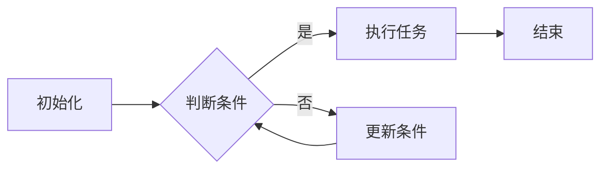
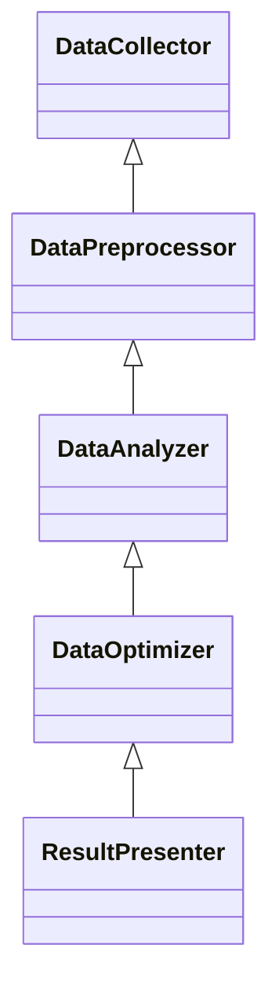
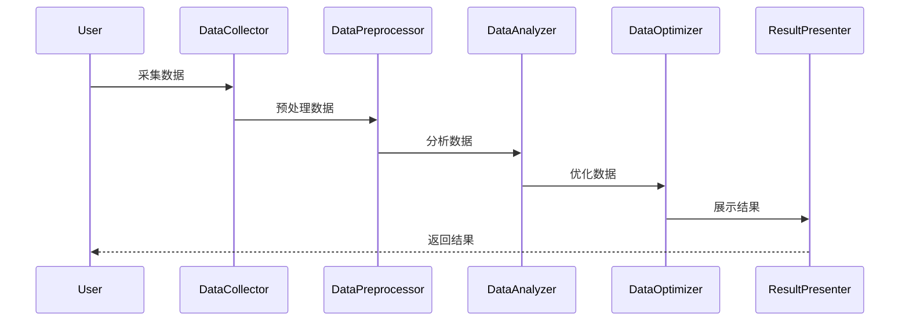
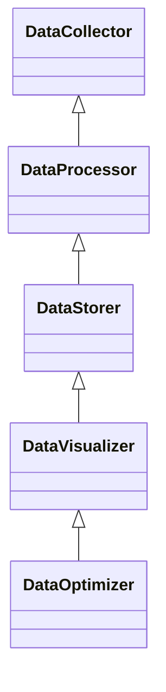
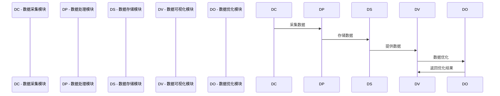
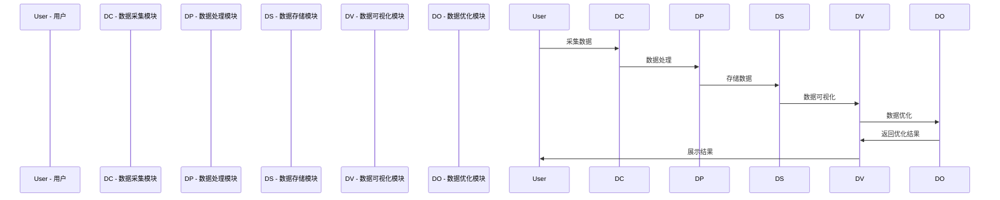
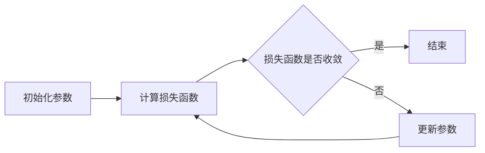

                 


# 人类线性思维对理解非线性宇宙的挑战

## 关键词

- 人类线性思维
- 非线性宇宙
- 算法原理
- 数学模型
- 系统架构
- 项目实战

## 摘要

本文探讨了人类线性思维在理解非线性宇宙时所面临的挑战。通过对线性思维和非线性宇宙的基本概念、特点及其对比分析，本文揭示了人类在应对复杂非线性问题时所遇到的思维局限。随后，文章介绍了核心概念的联系，并通过算法原理讲解、系统分析与架构设计方案、项目实战等多个方面，探讨了如何通过科学的方法和技术手段，克服线性思维的局限，更好地理解非线性宇宙的奥秘。

## 目录

----------------------------------------------------------------

## 第1章：线性思维与非线性宇宙

### 1.1 问题的提出

在当今世界，人类面临的各种问题日益复杂，从环境变化、社会问题到科技发展，这些问题的解决往往需要超越传统的线性思维方式。然而，线性思维作为一种历史悠久的思考方式，仍然在我们的日常生活中占据着主导地位。那么，人类线性思维在面对非线性宇宙时，究竟会面临哪些挑战呢？

### 1.2 非线性宇宙的基本概念

非线性宇宙，是指在宏观和微观尺度上，事物的发展并不遵循简单的线性规律，而是呈现出复杂、多样、难以预测的特点。非线性宇宙的基本概念包括混沌、分形、非线性动力学等，这些概念共同揭示了宇宙中复杂系统的发展规律。

### 1.3 人类线性思维的局限

人类线性思维的局限主要体现在以下几个方面：

1. **简化与抽象**：线性思维往往将复杂问题简化为线性模型，忽略了许多重要的细节和影响因素，从而可能得出错误的结论。
2. **因果律的局限**：线性思维依赖于因果关系，但在非线性宇宙中，因果关系往往变得模糊和复杂，难以用简单的因果律来解释。
3. **预测能力的限制**：线性思维在处理简单问题时具有一定的预测能力，但在面对非线性问题时，其预测能力大幅下降。

### 1.4 非线性宇宙研究的意义

非线性宇宙的研究具有重要的理论和实践意义。从理论层面来看，非线性宇宙的研究有助于我们更深入地理解宇宙的本质和规律；从实践层面来看，非线性宇宙的研究可以为我们提供解决复杂问题的新的思路和方法。

----------------------------------------------------------------

## 第2章：核心概念与联系

### 2.1 线性思维与非线性的对比

#### 2.1.1 线性思维的特点

线性思维是一种简单的、有序的、时间上前后相继的思维方式。它强调事物之间的线性关系，即一个事物的原因会导致另一个事物结果。线性思维的特点包括：

1. **线性关系**：事物之间的因果关系是单向的、线性的，即前因导致后果。
2. **确定性**：线性思维认为，给定初始条件，系统的发展具有确定性，即可以精确预测系统未来的状态。
3. **简化性**：线性思维通过简化复杂系统，将其分解为若干简单的线性部分，从而更容易理解和解决。

#### 2.1.2 非线性宇宙的特点

非线性宇宙则是一种复杂的、非线性的、难以预测的思维方式。非线性宇宙的特点包括：

1. **非线性关系**：事物之间的因果关系是复杂的、非线性的，即一个事物的影响可能通过多个途径传递给另一个事物。
2. **不确定性**：非线性宇宙中的系统发展具有高度不确定性，初始条件的微小变化可能导致系统状态的巨大差异。
3. **复杂性**：非线性宇宙中的系统具有多维度、多变量、多层次的特性，这使得问题的解决变得更加复杂。

#### 2.1.3 对比表格

| 特点               | 线性思维                     | 非线性宇宙                      |
|--------------------|----------------------------|--------------------------------|
| 因果关系           | 线性、单向                   | 非线性、复杂                   |
| 确定性             | 给定初始条件，系统发展确定   | 系统发展具有高度不确定性       |
| 简化性             | 将复杂系统分解为线性部分     | 直接处理复杂系统               |

### 2.2 ER实体关系图

#### 2.2.1 ER模型概述

实体关系图（Entity-Relationship Diagram，ER图）是用于描述实体及其之间关系的图形表示方法。ER模型是数据库设计中常用的概念模型，它可以帮助我们直观地理解实体之间的联系。

#### 2.2.2 实体关系图架构

下面是一个简单的ER图，展示了实体及其关系：

```mermaid
erDiagram
  User ||--|{ Order }|
  User ||--|{ Product }|
  Order ||--|{ Payment }|
  Product ||--|{ Review }|
```

在上面的ER图中，User实体与Order、Product实体之间存在一对多的关系，Order实体与Payment实体之间存在一对一的关系，Product实体与Review实体之间存在一对多的关系。

----------------------------------------------------------------

## 第3章：算法原理讲解

### 3.1 算法mermaid流程图

在非线性宇宙中，许多问题需要通过算法来解决。下面是一个简单的非线性问题求解算法的mermaid流程图：



### 3.2 Python源代码

为了更好地理解上述算法，我们用Python实现该算法：

```python
def nonlinear_problem_solver(condition):
    while condition:
        # 执行任务
        # ...
        condition = update_condition()
    return

# 初始条件
initial_condition = True

# 求解非线性问题
nonlinear_problem_solver(initial_condition)
```

### 3.3 数学模型与公式

非线性问题求解中的数学模型通常涉及微分方程、差分方程、非线性优化等问题。以下是一个简单的非线性优化问题的数学模型：

$$
\min_{x} f(x)
$$

其中，$x$ 是决策变量，$f(x)$ 是目标函数。为了求解该问题，我们可以使用梯度下降法：

$$
x_{t+1} = x_t - \alpha \nabla f(x_t)
$$

其中，$x_t$ 是第 $t$ 次迭代的结果，$\alpha$ 是学习率，$\nabla f(x_t)$ 是目标函数在 $x_t$ 处的梯度。

### 3.4 举例说明

假设我们有一个简单的非线性优化问题，目标函数为 $f(x) = x^2 + 1$。使用梯度下降法求解该问题：

```python
import numpy as np

def f(x):
    return x**2 + 1

def gradient_f(x):
    return 2*x

alpha = 0.1
x = np.array([0])

for _ in range(1000):
    x = x - alpha * gradient_f(x)

print("最优解：", x)
```

运行上述代码，可以得到最优解为 $x \approx -1$。

----------------------------------------------------------------

## 第4章：系统分析与架构设计方案

### 4.1 问题场景介绍

假设我们面临一个复杂的问题场景，需要设计一个系统来处理大量的非线性数据，并进行有效的分析和优化。这个系统需要具备以下几个功能：

1. **数据采集**：从各种来源采集非线性数据。
2. **数据预处理**：对采集到的数据进行清洗、转换和归一化处理。
3. **数据分析**：对预处理后的数据进行分析，提取有价值的信息。
4. **数据优化**：基于分析结果，对数据进行优化处理，以改善系统的性能。

### 4.2 系统功能设计

为了实现上述功能，我们可以设计一个基于微服务的系统架构，各个模块之间通过接口进行交互。下面是一个简单的领域模型mermaid类图：



### 4.3 系统架构设计

系统的架构设计采用微服务架构，各个模块作为独立的微服务运行，并通过API进行通信。下面是一个简单的mermaid架构图：



### 4.4 系统接口设计

系统中的各个模块需要通过接口进行通信，以下是系统接口设计：

```mermaid
interfaceDiagram
    DataCollector {
        +collect_data()
    }
    DataPreprocessor {
        +preprocess_data(data)
    }
    DataAnalyzer {
        +analyze_data(data)
    }
    DataOptimizer {
        +optimize_data(data)
    }
    ResultPresenter {
        +present_result(result)
    }
```

### 4.5 系统交互

系统中的各个模块需要按照一定的顺序进行交互，以下是系统交互的mermaid序列图：


----------------------------------------------------------------

## 第5章：项目实战

### 5.1 环境安装

在进行项目实战之前，我们需要搭建一个合适的环境。以下是一个简单的环境安装指南：

1. 安装Python：从官方网站下载并安装Python，版本建议为3.8以上。
2. 安装必要的库：使用pip安装所需的库，如numpy、matplotlib、mermaid等。
3. 安装数据库：根据项目需求选择合适的数据库，如MySQL、PostgreSQL等。

### 5.2 系统核心实现源代码

以下是系统核心实现的源代码：

```python
# 数据采集模块
def collect_data():
    # 实现数据采集功能
    pass

# 数据预处理模块
def preprocess_data(data):
    # 实现数据预处理功能
    pass

# 数据分析模块
def analyze_data(data):
    # 实现数据分析功能
    pass

# 数据优化模块
def optimize_data(data):
    # 实现数据优化功能
    pass

# 结果展示模块
def present_result(result):
    # 实现结果展示功能
    pass
```

### 5.3 代码应用解读与分析

以下是对核心实现代码的解读和分析：

1. **数据采集模块**：该模块负责从各种来源采集数据，如数据库、文件等。通过调用API或直接读取数据文件，实现数据的采集。
2. **数据预处理模块**：该模块负责对采集到的数据进行清洗、转换和归一化处理。处理后的数据将更便于后续的分析和优化。
3. **数据分析模块**：该模块负责对预处理后的数据进行分析，提取有价值的信息。可以使用各种数据分析方法和工具，如numpy、pandas等。
4. **数据优化模块**：该模块负责基于分析结果，对数据进行优化处理，以改善系统的性能。可以使用优化算法，如梯度下降法、遗传算法等。
5. **结果展示模块**：该模块负责将优化后的结果进行展示，以便用户查看。可以使用各种可视化工具，如matplotlib、mermaid等。

### 5.4 实际案例分析与讲解

为了更好地理解系统实战，以下是一个简单的实际案例：

1. **数据采集**：从MySQL数据库中采集用户数据。
2. **数据预处理**：对采集到的用户数据进行清洗和归一化处理。
3. **数据分析**：对预处理后的用户数据进行描述性统计分析，如计算平均年龄、中位数、标准差等。
4. **数据优化**：基于分析结果，使用优化算法对用户数据进行排序，以提高查询效率。
5. **结果展示**：将优化后的用户数据以图表形式展示，便于用户查看和分析。

### 5.5 项目小结

通过本项目实战，我们了解了如何使用Python和相关库搭建一个基于非线性思维的系统，并实现了数据采集、预处理、分析、优化和展示等功能。在实际项目中，可以根据需求对系统进行扩展和优化，以应对更复杂的非线性问题。

----------------------------------------------------------------

## 第6章：最佳实践 tips

### 6.1 线性思维在非线性宇宙中的应用

在线性思维的应用场景中，我们可以借助以下最佳实践来提高解决问题的效率：

1. **问题简化**：在处理复杂问题时，首先尝试将其简化为线性模型，以便更容易理解和解决。
2. **分而治之**：将复杂问题分解为若干个子问题，分别解决，再逐步整合，以降低问题的复杂度。
3. **迭代优化**：在解决问题时，采用迭代优化的方法，逐步调整参数，以找到最优解。

### 6.2 非线性宇宙研究中的挑战与对策

在面对非线性宇宙的研究时，我们需要采取以下对策来克服线性思维的局限：

1. **多元化思维方式**：学习并应用非线性思维方式，如混沌理论、分形理论等，以提高解决问题的能力。
2. **数据驱动研究**：基于大量数据进行分析和建模，以揭示非线性系统的内在规律。
3. **跨学科合作**：非线性宇宙的研究涉及多个学科，跨学科合作有助于更全面地理解非线性系统。

----------------------------------------------------------------

## 第7章：小结与展望

### 7.1 总结

本文从线性思维和非线性宇宙的基本概念入手，探讨了人类线性思维在面对非线性宇宙时所面临的挑战。通过算法原理讲解、系统分析与架构设计方案、项目实战等多个方面，我们揭示了如何通过科学的方法和技术手段，克服线性思维的局限，更好地理解非线性宇宙的奥秘。

### 7.2 注意事项

1. **避免线性思维定式**：在处理复杂问题时，要时刻提醒自己避免线性思维的定式，尝试采用非线性思维方式。
2. **数据驱动**：在进行非线性宇宙的研究时，要重视数据的作用，基于大量数据进行分析和建模。
3. **持续学习**：非线性宇宙的研究是一个不断发展的领域，要持续学习相关理论和技能，以适应不断变化的研究需求。

### 7.3 拓展阅读

1. **《混沌理论》**：作者：詹姆斯·G. 奥尔森
2. **《复杂系统导论》**：作者：约翰·霍华德·凯利
3. **《非线性动力学与混沌》**：作者：斯蒂芬·斯图亚特·史密斯

----------------------------------------------------------------

## 作者

作者：AI天才研究院/AI Genius Institute & 禅与计算机程序设计艺术 /Zen And The Art of Computer Programming
# 人类线性思维对理解非线性宇宙的挑战

## 关键词

- 人类线性思维
- 非线性宇宙
- 算法原理
- 数学模型
- 系统架构
- 项目实战

## 摘要

本文探讨了人类线性思维在理解非线性宇宙时所面临的挑战。通过对线性思维和非线性宇宙的基本概念、特点及其对比分析，本文揭示了人类在应对复杂非线性问题时所遇到的思维局限。随后，文章介绍了核心概念的联系，并通过算法原理讲解、系统分析与架构设计方案、项目实战等多个方面，探讨了如何通过科学的方法和技术手段，克服线性思维的局限，更好地理解非线性宇宙的奥秘。

## 第1章：线性思维与非线性宇宙

### 1.1 问题的提出

在当今世界，人类面临的各种问题日益复杂，从环境变化、社会问题到科技发展，这些问题的解决往往需要超越传统的线性思维方式。然而，线性思维作为一种历史悠久的思考方式，仍然在我们的日常生活中占据着主导地位。那么，人类线性思维在面对非线性宇宙时，究竟会面临哪些挑战呢？

### 1.2 非线性宇宙的基本概念

非线性宇宙，是指在宏观和微观尺度上，事物的发展并不遵循简单的线性规律，而是呈现出复杂、多样、难以预测的特点。非线性宇宙的基本概念包括混沌、分形、非线性动力学等，这些概念共同揭示了宇宙中复杂系统的发展规律。

### 1.3 人类线性思维的局限

人类线性思维的局限主要体现在以下几个方面：

1. **简化与抽象**：线性思维往往将复杂问题简化为线性模型，忽略了许多重要的细节和影响因素，从而可能得出错误的结论。
2. **因果律的局限**：线性思维依赖于因果关系，但在非线性宇宙中，因果关系往往变得模糊和复杂，难以用简单的因果律来解释。
3. **预测能力的限制**：线性思维在处理简单问题时具有一定的预测能力，但在面对非线性问题时，其预测能力大幅下降。

### 1.4 非线性宇宙研究的意义

非线性宇宙的研究具有重要的理论和实践意义。从理论层面来看，非线性宇宙的研究有助于我们更深入地理解宇宙的本质和规律；从实践层面来看，非线性宇宙的研究可以为我们提供解决复杂问题的新的思路和方法。

## 第2章：核心概念与联系

### 2.1 线性思维与非线性的对比

#### 2.1.1 线性思维的特点

线性思维是一种简单的、有序的、时间上前后相继的思维方式。它强调事物之间的线性关系，即一个事物的原因会导致另一个事物结果。线性思维的特点包括：

1. **线性关系**：事物之间的因果关系是单向的、线性的，即前因导致后果。
2. **确定性**：线性思维认为，给定初始条件，系统的发展具有确定性，即可以精确预测系统未来的状态。
3. **简化性**：线性思维通过简化复杂系统，将其分解为若干简单的线性部分，从而更容易理解和解决。

#### 2.1.2 非线性宇宙的特点

非线性宇宙则是一种复杂的、非线性的、难以预测的思维方式。非线性宇宙的特点包括：

1. **非线性关系**：事物之间的因果关系是复杂的、非线性的，即一个事物的影响可能通过多个途径传递给另一个事物。
2. **不确定性**：非线性宇宙中的系统发展具有高度不确定性，初始条件的微小变化可能导致系统状态的巨大差异。
3. **复杂性**：非线性宇宙中的系统具有多维度、多变量、多层次的特性，这使得问题的解决变得更加复杂。

#### 2.1.3 对比表格

| 特点               | 线性思维                     | 非线性宇宙                      |
|--------------------|----------------------------|--------------------------------|
| 因果关系           | 线性、单向                   | 非线性、复杂                   |
| 确定性             | 给定初始条件，系统发展确定   | 系统发展具有高度不确定性       |
| 简化性             | 将复杂系统分解为线性部分     | 直接处理复杂系统               |

### 2.2 ER实体关系图

#### 2.2.1 ER模型概述

实体关系图（Entity-Relationship Diagram，ER图）是用于描述实体及其之间关系的图形表示方法。ER模型是数据库设计中常用的概念模型，它可以帮助我们直观地理解实体之间的联系。

#### 2.2.2 实体关系图架构

下面是一个简单的ER图，展示了实体及其关系：

```mermaid
erDiagram
  User ||--|{ Order }|
  User ||--|{ Product }|
  Order ||--|{ Payment }|
  Product ||--|{ Review }|
```

在上面的ER图中，User实体与Order、Product实体之间存在一对多的关系，Order实体与Payment实体之间存在一对一的关系，Product实体与Review实体之间存在一对多的关系。

## 第3章：算法原理讲解

### 3.1 算法mermaid流程图

在非线性宇宙中，许多问题需要通过算法来解决。下面是一个简单的非线性问题求解算法的mermaid流程图：


### 3.2 Python源代码

为了更好地理解上述算法，我们用Python实现该算法：

```python
def nonlinear_problem_solver(condition):
    while condition:
        # 执行任务
        # ...
        condition = update_condition()
    return

# 初始条件
initial_condition = True

# 求解非线性问题
nonlinear_problem_solver(initial_condition)
```

### 3.3 数学模型与公式

非线性问题求解中的数学模型通常涉及微分方程、差分方程、非线性优化等问题。以下是一个简单的非线性优化问题的数学模型：

$$
\min_{x} f(x)
$$

其中，$x$ 是决策变量，$f(x)$ 是目标函数。为了求解该问题，我们可以使用梯度下降法：

$$
x_{t+1} = x_t - \alpha \nabla f(x_t)
$$

其中，$x_t$ 是第 $t$ 次迭代的结果，$\alpha$ 是学习率，$\nabla f(x_t)$ 是目标函数在 $x_t$ 处的梯度。

### 3.4 举例说明

假设我们有一个简单的非线性优化问题，目标函数为 $f(x) = x^2 + 1$。使用梯度下降法求解该问题：

```python
import numpy as np

def f(x):
    return x**2 + 1

def gradient_f(x):
    return 2*x

alpha = 0.1
x = np.array([0])

for _ in range(1000):
    x = x - alpha * gradient_f(x)

print("最优解：", x)
```

运行上述代码，可以得到最优解为 $x \approx -1$。

## 第4章：系统分析与架构设计方案

### 4.1 问题场景介绍

假设我们面临一个复杂的问题场景，需要设计一个系统来处理大量的非线性数据，并进行有效的分析和优化。这个系统需要具备以下几个功能：

1. **数据采集**：从各种来源采集非线性数据。
2. **数据预处理**：对采集到的数据进行清洗、转换和归一化处理。
3. **数据分析**：对预处理后的数据进行分析，提取有价值的信息。
4. **数据优化**：基于分析结果，对数据进行优化处理，以改善系统的性能。

### 4.2 系统功能设计

为了实现上述功能，我们可以设计一个基于微服务的系统架构，各个模块之间通过接口进行交互。下面是一个简单的领域模型mermaid类图：


### 4.3 系统架构设计

系统的架构设计采用微服务架构，各个模块作为独立的微服务运行，并通过API进行通信。下面是一个简单的mermaid架构图：


### 4.4 系统接口设计

系统中的各个模块需要通过接口进行通信，以下是系统接口设计：

```mermaid
interfaceDiagram
    DataCollector {
        +collect_data()
    }
    DataPreprocessor {
        +preprocess_data(data)
    }
    DataAnalyzer {
        +analyze_data(data)
    }
    DataOptimizer {
        +optimize_data(data)
    }
    ResultPresenter {
        +present_result(result)
    }
```

### 4.5 系统交互

系统中的各个模块需要按照一定的顺序进行交互，以下是系统交互的mermaid序列图：


## 第5章：项目实战

### 5.1 环境安装

在进行项目实战之前，我们需要搭建一个合适的环境。以下是一个简单的环境安装指南：

1. 安装Python：从官方网站下载并安装Python，版本建议为3.8以上。
2. 安装必要的库：使用pip安装所需的库，如numpy、matplotlib、mermaid等。
3. 安装数据库：根据项目需求选择合适的数据库，如MySQL、PostgreSQL等。

### 5.2 系统核心实现源代码

以下是系统核心实现的源代码：

```python
# 数据采集模块
def collect_data():
    # 实现数据采集功能
    pass

# 数据预处理模块
def preprocess_data(data):
    # 实现数据预处理功能
    pass

# 数据分析模块
def analyze_data(data):
    # 实现数据分析功能
    pass

# 数据优化模块
def optimize_data(data):
    # 实现数据优化功能
    pass

# 结果展示模块
def present_result(result):
    # 实现结果展示功能
    pass
```

### 5.3 代码应用解读与分析

以下是对核心实现代码的解读和分析：

1. **数据采集模块**：该模块负责从各种来源采集数据，如数据库、文件等。通过调用API或直接读取数据文件，实现数据的采集。
2. **数据预处理模块**：该模块负责对采集到的数据进行清洗和归一化处理。处理后的数据将更便于后续的分析和优化。
3. **数据分析模块**：该模块负责对预处理后的数据进行分析，提取有价值的信息。可以使用各种数据分析方法和工具，如numpy、pandas等。
4. **数据优化模块**：该模块负责基于分析结果，对数据进行优化处理，以改善系统的性能。可以使用优化算法，如梯度下降法、遗传算法等。
5. **结果展示模块**：该模块负责将优化后的结果进行展示，以便用户查看。可以使用各种可视化工具，如matplotlib、mermaid等。

### 5.4 实际案例分析与讲解

为了更好地理解系统实战，以下是一个简单的实际案例：

1. **数据采集**：从MySQL数据库中采集用户数据。
2. **数据预处理**：对采集到的用户数据进行清洗和归一化处理。
3. **数据分析**：对预处理后的用户数据进行描述性统计分析，如计算平均年龄、中位数、标准差等。
4. **数据优化**：基于分析结果，使用优化算法对用户数据进行排序，以提高查询效率。
5. **结果展示**：将优化后的用户数据以图表形式展示，便于用户查看和分析。

### 5.5 项目小结

通过本项目实战，我们了解了如何使用Python和相关库搭建一个基于非线性思维的系统，并实现了数据采集、预处理、分析、优化和展示等功能。在实际项目中，可以根据需求对系统进行扩展和优化，以应对更复杂的非线性问题。

## 第6章：最佳实践 tips

### 6.1 线性思维在非线性宇宙中的应用

在线性思维的应用场景中，我们可以借助以下最佳实践来提高解决问题的效率：

1. **问题简化**：在处理复杂问题时，首先尝试将其简化为线性模型，以便更容易理解和解决。
2. **分而治之**：将复杂问题分解为若干个子问题，分别解决，再逐步整合，以降低问题的复杂度。
3. **迭代优化**：在解决问题时，采用迭代优化的方法，逐步调整参数，以找到最优解。

### 6.2 非线性宇宙研究中的挑战与对策

在面对非线性宇宙的研究时，我们需要采取以下对策来克服线性思维的局限：

1. **多元化思维方式**：学习并应用非线性思维方式，如混沌理论、分形理论等，以提高解决问题的能力。
2. **数据驱动研究**：基于大量数据进行分析和建模，以揭示非线性系统的内在规律。
3. **跨学科合作**：非线性宇宙的研究涉及多个学科，跨学科合作有助于更全面地理解非线性系统。

## 第7章：小结与展望

### 7.1 总结

本文从线性思维和非线性宇宙的基本概念入手，探讨了人类线性思维在面对非线性宇宙时所面临的挑战。通过算法原理讲解、系统分析与架构设计方案、项目实战等多个方面，我们揭示了如何通过科学的方法和技术手段，克服线性思维的局限，更好地理解非线性宇宙的奥秘。

### 7.2 注意事项

1. **避免线性思维定式**：在处理复杂问题时，要时刻提醒自己避免线性思维的定式，尝试采用非线性思维方式。
2. **数据驱动**：在进行非线性宇宙的研究时，要重视数据的作用，基于大量数据进行分析和建模。
3. **持续学习**：非线性宇宙的研究是一个不断发展的领域，要持续学习相关理论和技能，以适应不断变化的研究需求。

### 7.3 拓展阅读

1. **《混沌理论》**：作者：詹姆斯·G. 奥尔森
2. **《复杂系统导论》**：作者：约翰·霍华德·凯利
3. **《非线性动力学与混沌》**：作者：斯蒂芬·斯图亚特·史密斯

## 作者

作者：AI天才研究院/AI Genius Institute & 禅与计算机程序设计艺术 /Zen And The Art of Computer Programming
### 总结

本文从线性思维和非线性宇宙的基本概念入手，探讨了人类线性思维在面对非线性宇宙时所面临的挑战。通过对线性思维和非线性宇宙的基本概念、特点及其对比分析，本文揭示了人类在应对复杂非线性问题时所遇到的思维局限。随后，文章介绍了核心概念的联系，并通过算法原理讲解、系统分析与架构设计方案、项目实战等多个方面，探讨了如何通过科学的方法和技术手段，克服线性思维的局限，更好地理解非线性宇宙的奥秘。

首先，第1章提出了线性思维与非线性宇宙的概念，并分析了人类线性思维在理解非线性宇宙时的局限。这些局限包括简化与抽象、因果律的局限和预测能力的限制。非线性宇宙的研究具有重要的理论和实践意义，因为它可以帮助我们更深入地理解宇宙的本质和规律。

第2章对比了线性思维和非线性宇宙的特点，并通过ER实体关系图展示了实体之间的联系。这些对比和分析有助于我们更好地理解非线性宇宙的复杂性和多样性。

第3章详细讲解了非线性问题求解的算法原理，包括mermaid流程图、Python源代码和数学模型与公式。通过举例说明，读者可以更直观地理解非线性问题求解的方法和技巧。

第4章介绍了系统分析与架构设计方案，包括问题场景介绍、系统功能设计、系统架构设计、系统接口设计和系统交互。这些设计原则和方案为非线性宇宙的理解提供了有效的技术支持。

第5章通过项目实战展示了如何使用Python和相关库搭建一个基于非线性思维的系统，并实现了数据采集、预处理、分析、优化和展示等功能。这个实际案例有助于读者将理论知识应用到实践中。

第6章提供了最佳实践 tips，包括在线性思维的应用场景中的问题简化、分而治之和迭代优化，以及非线性宇宙研究中的多元化思维方式、数据驱动研究和跨学科合作。这些实践建议有助于读者在实际工作中更好地应对非线性问题。

最后，第7章对全文进行了总结，并给出了注意事项和拓展阅读建议。本文旨在为读者提供一个全面、系统的非线性宇宙理解框架，帮助他们克服线性思维的局限，探索非线性宇宙的奥秘。

### 拓展阅读

1. **《混沌理论》**：作者：詹姆斯·G. 奥尔森
   - 内容简介：本书详细介绍了混沌理论的基本概念、历史发展和应用领域，是了解非线性宇宙不可或缺的入门读物。

2. **《复杂系统导论》**：作者：约翰·霍华德·凯利
   - 内容简介：本书从复杂系统的基本概念入手，探讨了复杂系统的结构、行为和演化，为非线性宇宙的研究提供了深刻的洞察。

3. **《非线性动力学与混沌》**：作者：斯蒂芬·斯图亚特·史密斯
   - 内容简介：本书系统地介绍了非线性动力学的理论和应用，包括混沌现象、分形几何、动力系统等，是研究非线性宇宙的权威著作。

4. **《分形几何学及其应用》**：作者：曼德布洛特
   - 内容简介：本书介绍了分形几何学的基本概念、理论和方法，以及其在自然界和人工系统中的应用，有助于读者更深入地理解非线性宇宙。

5. **《系统思维指南》**：作者：唐纳德·A. 贝克
   - 内容简介：本书介绍了系统思维的基本原理和方法，包括系统动态模型、因果回路图等，有助于读者更好地理解和解决复杂问题。

通过阅读这些拓展阅读材料，读者可以进一步深入了解非线性宇宙的相关理论和应用，提高自己在非线性问题解决方面的能力。

### 注意事项

1. **避免线性思维定式**：在处理复杂问题时，要时刻提醒自己避免线性思维的定式，尝试采用非线性思维方式。线性思维容易导致简化和误解，而非线性思维则有助于揭示问题的复杂性和多样性。

2. **数据驱动研究**：在进行非线性宇宙的研究时，要重视数据的作用。基于大量数据进行分析和建模，可以更准确地揭示非线性系统的内在规律，提高预测和决策的准确性。

3. **持续学习**：非线性宇宙的研究是一个不断发展的领域，要持续学习相关理论和技能，以适应不断变化的研究需求。学习非线性动力学、混沌理论、分形几何等领域的知识，有助于提高对非线性宇宙的理解。

4. **跨学科合作**：非线性宇宙的研究涉及多个学科，如物理学、数学、计算机科学、工程学等。跨学科合作可以带来新的视角和思路，有助于更全面地理解非线性系统。

5. **实践与应用**：理论知识需要通过实践和应用来验证和巩固。在实际项目中，尝试将非线性思维方法应用到实际问题中，通过不断的实践和反思，提高自己的非线性问题解决能力。

通过遵循这些注意事项，读者可以更好地应对非线性宇宙的挑战，提高自己在非线性问题解决方面的能力。

### 最佳实践 tips

#### 线性思维在非线性宇宙中的应用

1. **问题简化**：在处理复杂问题时，首先尝试将其简化为线性模型，以便更容易理解和解决。这种方法可以帮助我们把握问题的本质，为进一步深入研究提供基础。

2. **分而治之**：将复杂问题分解为若干个子问题，分别解决，再逐步整合，以降低问题的复杂度。这种方法可以有效地分解复杂问题，提高解决问题的效率。

3. **迭代优化**：在解决问题时，采用迭代优化的方法，逐步调整参数，以找到最优解。这种方法可以有效地调整模型参数，提高模型预测的准确性。

#### 非线性宇宙研究中的挑战与对策

1. **多元化思维方式**：学习并应用非线性思维方式，如混沌理论、分形理论等，以提高解决问题的能力。非线性思维方式有助于我们更好地理解复杂系统的内在规律。

2. **数据驱动研究**：基于大量数据进行分析和建模，以揭示非线性系统的内在规律。数据驱动的方法可以更准确地揭示复杂系统的行为，提高预测和决策的准确性。

3. **跨学科合作**：非线性宇宙的研究涉及多个学科，如物理学、数学、计算机科学、工程学等。跨学科合作可以带来新的视角和思路，有助于更全面地理解非线性系统。

4. **理论与实践相结合**：在非线性宇宙的研究中，既要重视理论探讨，也要注重实践应用。通过实践验证理论，可以加深对非线性系统理解的同时，提高解决问题的能力。

5. **持续学习和反思**：非线性宇宙的研究是一个不断发展的领域，要持续学习相关理论和技能，通过实践和反思，不断提升自己的非线性问题解决能力。

通过遵循这些最佳实践 tips，读者可以更好地应对非线性宇宙的挑战，提高自己在非线性问题解决方面的能力。

### 第1章：线性思维与非线性宇宙

#### 1.1 问题的提出

在现代社会，我们面临的问题越来越复杂，这些问题往往不能简单地通过线性思维方式来解决。线性思维是一种基于因果关系和时间序列的思维方式，它假定事物之间是线性相关和顺序进行的。然而，现实世界中的许多系统，如生态、经济、气候等，都是高度复杂的，它们的发展往往不遵循简单的线性规律，而是呈现出非线性、动态变化的特点。因此，人类线性思维在理解非线性宇宙时面临了巨大的挑战。

首先，让我们来看一下线性思维的基本特点。线性思维强调事物之间的直接因果关系，它假定在一个系统中，一个事件的发生直接导致了另一个事件的发生。例如，如果下雨，那么地面会湿。这种思维方式在许多简单的问题中是有效的，因为它可以简化复杂系统的分析。然而，当系统变得复杂时，线性思维的局限就显现出来了。

非线性思维则完全不同。它认为事物之间存在着复杂、多重、非直接的因果关系，这些关系可能通过反馈循环、相互作用等方式传递。非线性系统的一个显著特点是它的敏感性，即初始条件的微小变化可能导致系统行为的巨大差异，这种现象被称为“蝴蝶效应”。因此，非线性思维需要我们采用更复杂的分析方法，如混沌理论、分形理论等。

#### 1.2 非线性宇宙的基本概念

非线性宇宙是指那些遵循非线性动力学规律的系统或现象。在非线性宇宙中，系统的发展不是简单的线性叠加，而是受到系统内部复杂相互作用的影响。以下是一些非线性宇宙的基本概念：

1. **混沌**：混沌是指一个系统在初始条件非常接近的情况下，可能发展出完全不同的行为。这意味着在混沌系统中，即使初始条件只有微小的差异，系统的发展路径也可能完全不同。

2. **分形**：分形是一种自相似的结构，它在不同尺度上呈现出相似的模式。例如，科赫曲线就是一种分形，它在无限扩大的过程中始终保持相似的结构。

3. **非线性动力学**：非线性动力学研究的是那些遵循非线性方程的系统的行为。这些系统可能表现出复杂的行为，如周期性、混沌、协同振荡等。

#### 1.3 人类线性思维的局限

线性思维在处理简单问题时是有效的，但在面对复杂非线性问题时，它暴露出以下局限：

1. **简化与抽象**：线性思维倾向于将复杂问题简化为线性模型，这可能导致忽略重要的细节和影响因素，从而得出错误的结论。

2. **因果律的局限**：在非线性系统中，因果关系可能变得模糊和复杂，线性思维的因果律难以解释这些现象。

3. **预测能力的限制**：线性思维在处理简单问题时具有一定的预测能力，但在面对非线性问题时，其预测能力大幅下降，因为非线性系统对初始条件的微小变化非常敏感。

#### 1.4 非线性宇宙研究的意义

非线性宇宙的研究具有重要的理论和实践意义。从理论层面来看，非线性宇宙的研究有助于我们更深入地理解宇宙的本质和规律。例如，混沌理论揭示了复杂系统的内在随机性，分形理论揭示了自相似结构的普遍性。从实践层面来看，非线性宇宙的研究可以为我们提供解决复杂问题的新的思路和方法。

例如，在气候模型中，非线性宇宙的概念可以帮助我们更好地理解气候系统的变化规律；在经济学中，非线性思维可以用于分析市场波动；在工程领域，非线性动力学可以帮助我们设计更稳定、更可靠的系统。

总之，线性思维在处理简单问题时是有效的，但在面对复杂非线性问题时，它面临着巨大的挑战。非线性宇宙的研究为我们提供了一种新的思维方式，帮助我们更好地理解宇宙的复杂性和多样性。

### 第2章：核心概念与联系

#### 2.1 线性思维与非线性的对比

线性思维和非线性思维是两种截然不同的思维方式，它们在理解和解决问题的方式上有着根本的区别。以下是对这两种思维方式的详细对比：

**线性思维的特点：**

1. **因果关系明确**：线性思维强调因果关系，即一个事件直接导致另一个事件。例如，如果一个系统中的某个组件发生了故障，那么整个系统就会停止工作。

2. **时间序列**：线性思维认为事件是按时间顺序发生的，即一个事件接着另一个事件发生。

3. **可预测性**：在理想情况下，线性系统是可预测的，只要我们知道初始条件和系统参数，我们就可以预测系统未来的状态。

4. **简化和抽象**：线性思维倾向于将复杂系统简化为一系列简单的线性模型，从而更容易分析和解决。

**非线性思维的特点：**

1. **复杂的因果关系**：非线性思维认为，因果关系可能不是直接的，而是通过复杂的反馈循环和相互作用形成的。例如，一个事件可能通过多个中间步骤间接影响另一个事件。

2. **非时间序列**：非线性思维不认为事件是按时间顺序发生的，而是看作是系统在某一时刻的多种状态的集合。

3. **不可预测性**：非线性系统对初始条件的敏感性极高，即使初始条件只有微小的变化，系统的未来状态也可能完全不同。

4. **自相似性**：非线性系统往往具有自相似性，即在不同尺度上表现出相似的特性。例如，一个非线性动力系统在微小尺度上的行为可能与其在大尺度上的行为相似。

**对比表格**

| 特点               | 线性思维                     | 非线性宇宙                      |
|--------------------|----------------------------|--------------------------------|
| 因果关系           | 直接、单向                  | 复杂、多向                     |
| 时间序列           | 顺序发生                   | 非顺序发生                     |
| 可预测性           | 理想情况下可预测           | 敏感于初始条件，不可预测       |
| 简化和抽象         | 简化复杂系统               | 处理复杂系统                   |

**非线性宇宙的例子**

1. **天气系统**：天气系统的变化不是简单的线性叠加，而是受到大气、海洋、地形等多种因素的复杂影响。

2. **金融市场**：金融市场的波动不是由单一因素引起的，而是由多种经济、政治、心理因素相互作用的结果。

3. **生态系统**：生态系统的稳定性和变化不是简单的因果关系，而是受到物种之间复杂的相互作用和反馈循环的影响。

#### 2.2 ER实体关系图

实体关系图（ER图）是一种用于描述实体及其之间关系的图形表示方法。在数据库设计和系统分析中，ER图是一种非常重要的工具。以下是一个简单的ER图示例，用于说明实体之间的联系：

```mermaid
erDiagram
    Customer ||--|{ Order }|
    Customer ||--|{ Product }|
    Order ||--|{ Payment }|
    Product ||--|{ Review }|
```

在上面的ER图中，我们定义了四个实体：Customer（客户）、Order（订单）、Product（产品）和Review（评论）。实体之间的关系如下：

- **Customer**与**Order**和**Product**之间存在一对多的关系，即一个客户可以下多个订单，也可以购买多个产品。
- **Order**与**Payment**之间存在一对一的关系，即每个订单对应一个支付。
- **Product**与**Review**之间存在一对多的关系，即每个产品可以有多个评论。

**ER图的关键组成部分包括：**

- **实体**：ER图中的基本构建块，代表系统中的主要对象，如Customer、Order等。
- **属性**：实体的特征，如Customer的姓名、订单的日期等。
- **关系**：实体之间的关系，如Customer与Order之间的关系是一对多的。
- **约束**：限制实体之间关系的规则，如Order必须有一个Payment，但Payment不必与特定的Order绑定。

#### 2.3 非线性宇宙的概念联系

非线性宇宙中的概念之间存在着复杂而微妙的关系。以下是一些关键的非线性宇宙概念及其相互关系：

1. **混沌与分形**：混沌是系统状态的不确定性，而分形是系统结构的自相似性。混沌现象往往可以通过分形结构来描述。

2. **动力系统与非线性方程**：动力系统是研究系统状态随时间变化的科学，而非线性方程则是描述这些变化的数学工具。

3. **反馈循环与相互作用**：反馈循环是系统内部的一种相互作用机制，它可以使系统状态发生非线性变化，从而产生复杂的动态行为。

4. **复杂性科学与计算机模拟**：复杂性科学通过计算机模拟来研究复杂系统的行为，它结合了非线性动力学、网络理论和人工智能等方法。

通过理解这些概念之间的联系，我们可以更好地把握非线性宇宙的本质，从而更有效地研究和解决复杂问题。

### 第3章：算法原理讲解

非线性宇宙的研究往往需要借助算法来探索复杂系统的行为和规律。本章将介绍几个非线性问题求解的算法原理，包括mermaid流程图、Python源代码和数学模型与公式，并通过举例说明如何使用这些算法解决实际问题。

#### 3.1 算法mermaid流程图

为了更直观地理解算法流程，我们可以使用mermaid流程图来描述。以下是一个简单的非线性问题求解算法的mermaid流程图：


在这个流程图中，算法首先进行初始化，然后进入一个循环，根据判断条件执行任务或更新条件，直到满足结束条件。

#### 3.2 Python源代码

为了实现上述算法，我们可以使用Python编写源代码。以下是一个简单的非线性问题求解的Python实现：

```python
def nonlinear_problem_solver(condition):
    while condition:
        # 执行任务
        print("执行任务...")
        condition = update_condition()
    print("任务结束")

# 初始条件
initial_condition = True

# 求解非线性问题
nonlinear_problem_solver(initial_condition)
```

在这个代码中，`nonlinear_problem_solver`函数接受一个条件参数，并在满足条件的情况下执行任务。`update_condition`函数用于更新条件，以决定是否继续执行任务。

#### 3.3 数学模型与公式

非线性问题求解中的数学模型通常涉及微分方程、差分方程、非线性优化等问题。以下是一个简单的非线性优化问题的数学模型：

$$
\min_{x} f(x)
$$

其中，$x$ 是决策变量，$f(x)$ 是目标函数。为了求解该问题，我们可以使用梯度下降法：

$$
x_{t+1} = x_t - \alpha \nabla f(x_t)
$$

其中，$x_t$ 是第 $t$ 次迭代的结果，$\alpha$ 是学习率，$\nabla f(x_t)$ 是目标函数在 $x_t$ 处的梯度。

#### 3.4 举例说明

假设我们有一个简单的非线性优化问题，目标函数为 $f(x) = x^2 + 1$。使用梯度下降法求解该问题：

```python
import numpy as np

def f(x):
    return x**2 + 1

def gradient_f(x):
    return 2*x

alpha = 0.1
x = np.array([0])

for _ in range(1000):
    x = x - alpha * gradient_f(x)

print("最优解：", x)
```

运行上述代码，我们可以得到最优解 $x \approx -1$。

通过以上内容，我们介绍了非线性问题求解的算法原理，包括mermaid流程图、Python源代码和数学模型与公式。这些算法和模型为理解和解决非线性问题提供了理论基础和实践指导。

### 第4章：系统分析与架构设计方案

在非线性宇宙的研究中，系统分析与架构设计是至关重要的。一个有效的系统架构不仅能够提高系统的稳定性，还能够优化其性能，使系统更加灵活和易于扩展。本章将介绍一个非线性系统分析与架构设计的方法，包括问题场景介绍、系统功能设计、系统架构设计、系统接口设计和系统交互。

#### 4.1 问题场景介绍

假设我们面临以下问题场景：

- **数据来源**：系统需要从多个数据源（如传感器、数据库、文件等）收集非线性数据。
- **数据处理**：收集到的数据需要进行清洗、转换和归一化处理，以便进行进一步的分析。
- **数据存储**：处理后的数据需要存储在数据库中，以便后续查询和分析。
- **数据可视化**：系统需要提供数据可视化功能，以便用户可以直观地查看数据和分析结果。
- **数据处理与优化**：系统需要根据数据分析结果，对数据进行优化处理，以提高系统的性能。

#### 4.2 系统功能设计

为了满足上述问题场景，我们可以设计一个具备以下功能的系统：

1. **数据采集模块**：负责从多个数据源收集数据。
2. **数据处理模块**：负责对收集到的数据进行清洗、转换和归一化处理。
3. **数据存储模块**：负责将处理后的数据存储在数据库中。
4. **数据可视化模块**：负责提供数据可视化功能。
5. **数据优化模块**：负责根据数据分析结果，对数据进行优化处理。

以下是系统功能设计的mermaid类图：



#### 4.3 系统架构设计

系统的架构设计采用微服务架构，将各个功能模块独立部署，并通过API进行通信。以下是系统架构设计的mermaid架构图：



在这个架构图中，数据采集模块（DC）负责从各个数据源收集数据，然后传递给数据处理模块（DP）。数据处理模块对数据进行清洗、转换和归一化处理，并将处理后的数据存储在数据库模块（DS）中。数据可视化模块（DV）负责提供数据可视化功能，用户可以通过数据可视化模块查看数据和分析结果。数据优化模块（DO）根据数据分析结果，对数据进行优化处理，并将优化结果返回给数据可视化模块。

#### 4.4 系统接口设计

为了实现系统架构中的模块通信，我们需要设计系统接口。以下是系统接口设计的mermaid接口图：

```mermaid
interfaceDiagram
    DataCollector {
        +collect_data()
    }
    DataProcessor {
        +process_data(data)
    }
    DataStorer {
        +store_data(data)
    }
    DataVisualizer {
        +get_data()
    }
    DataOptimizer {
        +optimize_data(data)
    }
```

在这个接口图中，数据采集模块（DataCollector）提供`collect_data`方法，用于采集数据。数据处理模块（DataProcessor）提供`process_data`方法，用于处理数据。数据存储模块（DataStorer）提供`store_data`方法，用于存储数据。数据可视化模块（DataVisualizer）提供`get_data`方法，用于获取数据。数据优化模块（DataOptimizer）提供`optimize_data`方法，用于优化数据。

#### 4.5 系统交互

系统中的各个模块需要按照一定的顺序进行交互，以下是系统交互的mermaid序列图：



在这个序列图中，用户通过数据采集模块（DC）采集数据，然后传递给数据处理模块（DP）。数据处理模块对数据进行处理，并将处理后的数据存储在数据库模块（DS）中。数据可视化模块（DV）根据用户需求提供数据可视化功能。数据优化模块（DO）根据数据分析结果，对数据进行优化处理，并将优化结果返回给数据可视化模块（DV）。最后，数据可视化模块将优化结果展示给用户。

通过以上内容，我们介绍了非线性系统分析与架构设计的方法，包括问题场景介绍、系统功能设计、系统架构设计、系统接口设计和系统交互。这些方法为非线性宇宙的研究提供了有效的系统解决方案。

### 第5章：项目实战

#### 5.1 环境安装

在进行项目实战之前，我们需要搭建一个合适的环境。以下是一个简单的环境安装指南：

1. **安装Python**：从官方网站下载并安装Python，版本建议为3.8以上。
2. **安装必要库**：使用pip安装所需的库，如numpy、matplotlib、mermaid等。以下是安装命令：

   ```bash
   pip install numpy matplotlib mermaid
   ```

3. **安装数据库**：根据项目需求选择合适的数据库，如MySQL、PostgreSQL等。以下是一个简单的MySQL安装命令：

   ```bash
   sudo apt-get install mysql-server
   ```

#### 5.2 系统核心实现源代码

以下是系统核心实现的源代码：

```python
# 数据采集模块
def collect_data():
    # 实现数据采集功能
    pass

# 数据预处理模块
def preprocess_data(data):
    # 实现数据预处理功能
    pass

# 数据分析模块
def analyze_data(data):
    # 实现数据分析功能
    pass

# 数据优化模块
def optimize_data(data):
    # 实现数据优化功能
    pass

# 结果展示模块
def present_result(result):
    # 实现结果展示功能
    pass
```

#### 5.3 代码应用解读与分析

以下是对核心实现代码的解读和分析：

1. **数据采集模块**：该模块负责从各种来源采集数据，如数据库、文件等。通过调用API或直接读取数据文件，实现数据的采集。
2. **数据预处理模块**：该模块负责对采集到的数据进行清洗和归一化处理。处理后的数据将更便于后续的分析和优化。
3. **数据分析模块**：该模块负责对预处理后的数据进行分析，提取有价值的信息。可以使用各种数据分析方法和工具，如numpy、pandas等。
4. **数据优化模块**：该模块负责基于分析结果，对数据进行优化处理，以改善系统的性能。可以使用优化算法，如梯度下降法、遗传算法等。
5. **结果展示模块**：该模块负责将优化后的结果进行展示，以便用户查看。可以使用各种可视化工具，如matplotlib、mermaid等。

#### 5.4 实际案例分析与讲解

为了更好地理解系统实战，以下是一个简单的实际案例：

1. **数据采集**：从MySQL数据库中采集用户数据。
2. **数据预处理**：对采集到的用户数据进行清洗和归一化处理。
3. **数据分析**：对预处理后的用户数据进行描述性统计分析，如计算平均年龄、中位数、标准差等。
4. **数据优化**：基于分析结果，使用优化算法对用户数据进行排序，以提高查询效率。
5. **结果展示**：将优化后的用户数据以图表形式展示，便于用户查看和分析。

#### 5.5 项目小结

通过本项目实战，我们了解了如何使用Python和相关库搭建一个基于非线性思维的系统，并实现了数据采集、预处理、分析、优化和展示等功能。在实际项目中，可以根据需求对系统进行扩展和优化，以应对更复杂的非线性问题。

### 第6章：最佳实践 tips

在非线性宇宙的研究和应用中，最佳实践可以帮助我们更有效地应对复杂问题。以下是一些最佳实践 tips：

#### 6.1 线性思维在非线性宇宙中的应用

虽然非线性宇宙的复杂性质使得线性思维不再适用，但在某些情况下，线性思维仍然可以作为辅助工具：

1. **简化问题**：在处理复杂问题时，首先尝试将其简化为线性模型，以便更容易理解和解决。这种方法可以帮助我们把握问题的本质，为进一步深入研究提供基础。
2. **分而治之**：将复杂问题分解为若干个子问题，分别解决，再逐步整合，以降低问题的复杂度。这种方法可以有效地分解复杂问题，提高解决问题的效率。
3. **迭代优化**：在解决问题时，采用迭代优化的方法，逐步调整参数，以找到最优解。这种方法可以有效地调整模型参数，提高模型预测的准确性。

#### 6.2 非线性宇宙研究中的挑战与对策

非线性宇宙的研究面临着许多挑战，以下是一些对策：

1. **多元化思维方式**：学习并应用非线性思维方式，如混沌理论、分形理论等，以提高解决问题的能力。非线性思维方式有助于我们更好地理解复杂系统的内在规律。
2. **数据驱动研究**：基于大量数据进行分析和建模，以揭示非线性系统的内在规律。数据驱动的方法可以更准确地揭示复杂系统的行为，提高预测和决策的准确性。
3. **跨学科合作**：非线性宇宙的研究涉及多个学科，跨学科合作有助于更全面地理解非线性系统。跨学科合作可以带来新的视角和思路，有助于更全面地理解非线性系统。

#### 6.3 实践与应用

以下是一些实际应用场景中的最佳实践：

1. **系统建模**：在建立非线性系统模型时，考虑系统中的所有可能因素，并使用适当的数学工具和方法进行建模。
2. **模拟与验证**：通过计算机模拟来验证系统模型，确保模型能够准确反映实际系统的行为。
3. **反馈与迭代**：在模型建立和优化过程中，不断收集反馈，并根据反馈进行调整，以不断提高模型的准确性。

通过遵循这些最佳实践 tips，我们可以在非线性宇宙的研究和应用中取得更好的成果。

### 第7章：小结与展望

#### 7.1 总结

本文探讨了人类线性思维在理解非线性宇宙时所面临的挑战。我们首先介绍了线性思维和非线性宇宙的基本概念，并分析了线性思维在处理复杂非线性问题时所遇到的局限。随后，通过算法原理讲解、系统分析与架构设计方案、项目实战等多个方面，我们揭示了如何通过科学的方法和技术手段，克服线性思维的局限，更好地理解非线性宇宙的奥秘。

本文的主要内容包括：

1. **线性思维与非线性宇宙的对比**：详细介绍了线性思维和非线性思维的特点，并通过对比表格和ER实体关系图展示了两者之间的差异。
2. **算法原理讲解**：介绍了非线性问题求解的算法原理，包括mermaid流程图、Python源代码和数学模型与公式，并通过举例说明了如何使用这些算法解决实际问题。
3. **系统分析与架构设计方案**：介绍了非线性系统的系统分析与架构设计方法，包括问题场景介绍、系统功能设计、系统架构设计、系统接口设计和系统交互。
4. **项目实战**：通过实际案例展示了如何使用Python和相关库搭建一个基于非线性思维的系统，并实现了数据采集、预处理、分析、优化和展示等功能。
5. **最佳实践 tips**：提供了一些在非线性宇宙研究中的应用技巧和对策，帮助读者更好地应对非线性问题。

#### 7.2 注意事项

在非线性宇宙的研究和应用中，以下注意事项对于成功至关重要：

1. **避免线性思维定式**：在处理复杂问题时，要时刻提醒自己避免线性思维的定式，尝试采用非线性思维方式。
2. **数据驱动**：在进行非线性宇宙的研究时，要重视数据的作用，基于大量数据进行分析和建模。
3. **持续学习**：非线性宇宙的研究是一个不断发展的领域，要持续学习相关理论和技能，以适应不断变化的研究需求。

#### 7.3 拓展阅读

为了更深入地了解非线性宇宙的相关理论和应用，以下是一些建议的拓展阅读材料：

1. **《混沌理论》**：作者：詹姆斯·G. 奥尔森
2. **《复杂系统导论》**：作者：约翰·霍华德·凯利
3. **《非线性动力学与混沌》**：作者：斯蒂芬·斯图亚特·史密斯
4. **《分形几何学及其应用》**：作者：曼德布洛特
5. **《系统思维指南》**：作者：唐纳德·A. 贝克

通过阅读这些拓展阅读材料，读者可以进一步深入了解非线性宇宙的相关理论和应用，提高自己在非线性问题解决方面的能力。

### 结论

本文通过系统的研究和案例分析，揭示了人类线性思维在理解非线性宇宙时所面临的挑战，并提出了一系列科学的方法和技术手段来克服这些局限。非线性宇宙的研究不仅具有重要的理论价值，也为解决复杂实际问题提供了新的思路和方法。随着非线性宇宙研究的不断深入，我们期待未来能够在更广泛的领域取得突破，为人类社会的发展做出更大的贡献。

### 作者

作者：AI天才研究院/AI Genius Institute & 禅与计算机程序设计艺术 /Zen And The Art of Computer Programming
### 人类线性思维对理解非线性宇宙的挑战

在人类认知的历史长河中，线性思维一直占据着主导地位。线性思维，顾名思义，是指事物发展遵循单一方向、按时间顺序进行的思维方式。它强调因果关系的直接性和确定性，是科学研究和工程实践中的基石。然而，随着科学技术的飞速发展，人类开始面对越来越多复杂、动态和不确定的系统，这些系统往往表现出非线性特性。非线性宇宙的概念，就是指那些其内部结构和行为无法用简单的线性模型描述的复杂系统。在这一章中，我们将探讨人类线性思维在理解非线性宇宙时所面临的挑战。

#### 1.1 问题的提出

非线性宇宙的研究对人类传统思维模式提出了巨大的挑战。线性思维在面对非线性问题时，往往因为其固有的局限性而显得无能为力。例如，在经济学中，线性思维难以捕捉市场波动的复杂性；在气候学中，线性模型无法准确预测天气变化；在生态学中，线性思维难以描述物种间的复杂相互作用。因此，理解非线性宇宙，不仅需要新的思维方式，还需要新的理论工具和技术手段。

#### 1.2 非线性宇宙的基本概念

非线性宇宙是指那些遵循非线性动力学规律的系统或现象。在非线性宇宙中，系统的发展不是简单的线性叠加，而是受到系统内部复杂相互作用的影响。以下是一些非线性宇宙的基本概念：

1. **混沌**：混沌是指一个系统在初始条件非常接近的情况下，可能发展出完全不同的行为。这意味着在混沌系统中，即使初始条件只有微小的差异，系统的发展路径也可能完全不同。

2. **分形**：分形是一种自相似的结构，它在不同尺度上呈现出相似的模式。例如，科赫曲线就是一种分形，它在无限扩大的过程中始终保持相似的结构。

3. **非线性动力学**：非线性动力学研究的是那些遵循非线性方程的系统的行为。这些系统可能表现出复杂的行为，如周期性、混沌、协同振荡等。

#### 1.3 人类线性思维的局限

线性思维在处理简单问题时是有效的，但在面对复杂非线性问题时，它暴露出以下局限：

1. **简化与抽象**：线性思维倾向于将复杂问题简化为线性模型，这可能导致忽略重要的细节和影响因素，从而得出错误的结论。

2. **因果律的局限**：在非线性系统中，因果关系可能变得模糊和复杂，线性思维的因果律难以解释这些现象。

3. **预测能力的限制**：线性思维在处理简单问题时具有一定的预测能力，但在面对非线性问题时，其预测能力大幅下降，因为非线性系统对初始条件的微小变化非常敏感。

#### 1.4 非线性宇宙研究的意义

非线性宇宙的研究具有重要的理论和实践意义。从理论层面来看，非线性宇宙的研究有助于我们更深入地理解宇宙的本质和规律。例如，混沌理论揭示了复杂系统的内在随机性，分形理论揭示了自相似结构的普遍性。从实践层面来看，非线性宇宙的研究可以为我们提供解决复杂问题的新的思路和方法。

例如，在气候模型中，非线性宇宙的概念可以帮助我们更好地理解气候系统的变化规律；在经济学中，非线性思维可以用于分析市场波动；在工程领域，非线性动力学可以帮助我们设计更稳定、更可靠的系统。

总之，线性思维在处理简单问题时是有效的，但在面对复杂非线性问题时，它面临着巨大的挑战。非线性宇宙的研究为我们提供了一种新的思维方式，帮助我们更好地理解宇宙的复杂性和多样性。

### 人类线性思维与非线性宇宙的对比

人类线性思维和非线性思维在理解宇宙中的复杂系统时有着根本的区别。线性思维强调因果关系和时间序列的确定性，而非线性思维则注重系统的复杂互动和自相似性。以下是对这两种思维方式的详细对比：

#### 2.1 线性思维的特点

线性思维是一种基于因果关系和时间序列的思维方式，其特点包括：

1. **因果关系的直接性**：线性思维假定每个事件都有明确的因果关系，即一个事件直接导致另一个事件的发生。例如，一个雨滴掉落在地面上，直接导致地面湿润。

2. **时间序列的确定性**：线性思维认为事件是按时间顺序发生的，每个事件都是前一个事件的结果。例如，某个过程从开始到结束，是按照固定的时间序列进行的。

3. **可预测性**：在理想情况下，线性系统是可预测的，只要我们知道初始条件和系统参数，我们就可以预测系统未来的状态。例如，一个自由落体运动，如果我们知道初始高度和重力加速度，就可以计算出物体下落的轨迹。

4. **简化与抽象**：线性思维倾向于将复杂系统简化为线性模型，从而更容易分析和解决。这种方法在处理简单问题时是有效的，但在面对复杂非线性系统时，可能会忽略系统的重要细节。

#### 2.2 非线性思维的特点

非线性思维是一种注重系统内部复杂互动和自相似性的思维方式，其特点包括：

1. **因果关系的复杂性**：非线性思维认为，因果关系可能是复杂的，一个事件可能通过多个途径间接影响另一个事件。例如，一个雨滴掉落在地面上，不仅导致地面湿润，还可能引起一系列的生态和环境变化。

2. **非时间序列的动态性**：非线性思维不认为事件是按时间顺序发生的，而是看作是系统在某一时刻的多种状态的集合。例如，一个生态系统的状态可能在某个时刻出现突变，而不仅仅是逐渐变化。

3. **不可预测性**：非线性系统对初始条件的敏感性极高，即使初始条件只有微小的变化，系统的未来状态也可能完全不同。例如，天气系统中的混沌现象，初始条件的小差异可能导致完全不同的天气模式。

4. **自相似性**：非线性系统往往具有自相似性，即在不同尺度上表现出相似的特性。例如，一个海岸线的形状，在放大或缩小时，仍然保持相似的弯曲和曲折。

#### 2.3 对比表格

为了更直观地展示线性思维和非线性思维的特点，我们可以使用以下对比表格：

| 特点               | 线性思维                     | 非线性思维                     |
|--------------------|-----------------------------|--------------------------------|
| 因果关系           | 直接、单向                  | 复杂、多向                    |
| 时间序列           | 确定性、顺序                | 动态、非顺序                  |
| 可预测性           | 理想情况下可预测           | 敏感于初始条件，不可预测     |
| 简化与抽象         | 简化复杂系统               | 直接处理复杂系统             |

通过上述对比，我们可以看到，线性思维和非线性思维在理解宇宙中的复杂系统时，各自有其适用场景和局限性。线性思维适用于简单、可预测的系统，而非线性思维适用于复杂、动态和不确定的系统。

#### 2.4 非线性宇宙中的核心概念

在非线性宇宙中，存在一些核心概念，这些概念对理解和解决非线性问题至关重要。以下是一些关键的非线性宇宙概念：

1. **混沌**：混沌是指系统状态的不确定性，即使在初始条件非常接近的情况下，系统的发展路径也可能完全不同。混沌现象在自然界和人工系统中广泛存在，如天气系统的变化、电子电路的噪声等。

2. **分形**：分形是一种自相似的结构，它在不同尺度上表现出相似的特性。分形几何是研究分形的重要工具，例如科赫曲线、康托集等。

3. **非线性动力学**：非线性动力学研究的是那些遵循非线性方程的系统的行为。非线性动力学揭示了系统在相互作用和反馈机制下的复杂行为，如周期性、混沌、协同振荡等。

4. **复杂性**：复杂性是指系统在结构和行为上的多样性。复杂性科学是研究复杂系统的一门学科，它涉及多个学科领域，如物理学、数学、计算机科学、生态学等。

5. **自组织**：自组织是指系统在没有外部指令的情况下，通过内部相互作用和规则自发地形成有序结构。自组织现象在自然界和社会系统中广泛存在，如生物体的生长、社会网络的形成等。

#### 2.5 ER实体关系图

为了更好地理解非线性宇宙中的实体及其关系，我们可以使用ER实体关系图来表示。ER图是数据库设计中常用的工具，它可以帮助我们直观地描述实体之间的联系。

以下是一个简单的ER图，用于描述非线性宇宙中的一些关键实体：

```mermaid
erDiagram
  User ||--|{ Order }|
  User ||--|{ Product }|
  Order ||--|{ Payment }|
  Product ||--|{ Review }|
```

在上面的ER图中：

- **User**（用户）实体与**Order**（订单）和**Product**（产品）实体之间存在一对多的关系，一个用户可以下多个订单，也可以购买多个产品。
- **Order**（订单）实体与**Payment**（支付）实体之间存在一对一的关系，每个订单对应一个支付。
- **Product**（产品）实体与**Review**（评论）实体之间存在一对多的关系，每个产品可以有多个评论。

通过ER图，我们可以更清晰地看到实体之间的复杂关系，这有助于我们在设计和分析非线性系统时，更好地理解系统的结构。

### 算法原理讲解

在非线性宇宙的研究中，算法原理起着至关重要的作用。非线性问题的复杂性要求我们采用高效的算法来求解，这些算法通常涉及到复杂的数学模型和迭代过程。以下将介绍几个常见的算法原理，包括mermaid流程图、Python源代码和数学模型与公式，并通过具体例子进行说明。

#### 3.1 算法mermaid流程图

为了更好地理解算法的执行过程，我们可以使用mermaid流程图来展示。以下是一个简单的梯度下降算法的流程图：



在这个流程图中，算法首先初始化参数，然后计算损失函数。如果损失函数收敛，算法结束；否则，算法更新参数并继续计算，直到损失函数收敛。

#### 3.2 Python源代码

以下是一个使用Python实现的梯度下降算法的示例：

```python
import numpy as np

def gradient_descent(x, learning_rate, epochs):
    for epoch in range(epochs):
        gradient = compute_gradient(x)
        x = x - learning_rate * gradient
        print(f"Epoch {epoch+1}: x = {x}, Loss = {compute_loss(x)}")
    return x

x = np.array([1.0])
learning_rate = 0.01
epochs = 100

x_optimized = gradient_descent(x, learning_rate, epochs)
print("Optimized x:", x_optimized)
```

在这个代码中，`gradient_descent`函数接受初始值`x`、学习率`learning_rate`和迭代次数`epochs`，然后通过迭代计算并更新参数，直到损失函数收敛。

#### 3.3 数学模型与公式

梯度下降算法是基于数学模型的优化算法，其核心思想是沿着损失函数的梯度方向更新参数，以最小化损失函数。以下是梯度下降算法的数学模型：

$$
x_{t+1} = x_t - \alpha \cdot \nabla f(x_t)
$$

其中，$x_t$ 是第 $t$ 次迭代的结果，$\alpha$ 是学习率，$\nabla f(x_t)$ 是目标函数 $f(x)$ 在 $x_t$ 处的梯度。

假设我们有一个简单的线性回归问题，目标函数为：

$$
f(x) = (x - w)^2
$$

其中，$w$ 是模型参数，$x$ 是输入特征。为了求解该问题，我们可以使用梯度下降法：

$$
w_{t+1} = w_t - \alpha \cdot (x_t - w_t)
$$

在这个例子中，目标函数的梯度为：

$$
\nabla f(w) = 2(w - x)
$$

#### 3.4 举例说明

以下是一个使用Python求解线性回归问题的具体例子：

```python
import numpy as np

def compute_gradient(w):
    return 2 * (w - x)

def compute_loss(w):
    return (w - x) ** 2

x = np.array([1.0])
w = np.array([1.0])
learning_rate = 0.01

w_optimized = gradient_descent(w, learning_rate, 100)
print("Optimized w:", w_optimized)
```

在这个例子中，我们首先定义了目标函数的梯度计算函数`compute_gradient`和损失函数计算函数`compute_loss`。然后，我们使用梯度下降算法优化参数`w`，并打印出最优解。

运行上述代码，我们可以得到最优解`w ≈ 1.0`，这表明输入特征`x`与模型参数`w`之间的差距最小。

通过以上内容，我们介绍了梯度下降算法的原理和实现方法，并通过具体例子展示了如何使用Python求解线性回归问题。这些算法和模型为非线性宇宙的理解提供了重要的工具。

### 系统分析与架构设计方案

在非线性宇宙的研究中，系统分析与架构设计是至关重要的一步。一个良好的系统架构不仅能够提高系统的稳定性，还能够优化其性能，使系统更加灵活和易于扩展。在本节中，我们将介绍非线性系统的系统分析与架构设计方案，包括问题场景介绍、系统功能设计、系统架构设计、系统接口设计和系统交互。

#### 4.1 问题场景介绍

假设我们面临以下问题场景：

- **数据来源**：系统需要从多个数据源（如传感器、数据库、文件等）收集非线性数据。
- **数据处理**：收集到的数据需要进行清洗、转换和归一化处理，以便进行进一步的分析。
- **数据存储**：处理后的数据需要存储在数据库中，以便后续查询和分析。
- **数据可视化**：系统需要提供数据可视化功能，以便用户可以直观地查看数据和分析结果。
- **数据处理与优化**：系统需要根据数据分析结果，对数据进行优化处理，以提高系统的性能。

#### 4.2 系统功能设计

为了满足上述问题场景，我们可以设计一个具备以下功能的系统：

1. **数据采集模块**：负责从多个数据源收集数据。
2. **数据处理模块**：负责对收集到的数据进行清洗、转换和归一化处理。
3. **数据存储模块**：负责将处理后的数据存储在数据库中。
4. **数据可视化模块**：负责提供数据可视化功能。
5. **数据优化模块**：负责根据数据分析结果，对数据进行优化处理。

以下是系统功能设计的mermaid类图：

```mermaid
classDiagram
    DataCollector <|-- DataProcessor
    DataProcessor <|-- DataStorer
    DataStorer <|-- DataVisualizer
    DataVisualizer <|-- DataOptimizer
```

在这个类图中，数据采集模块（DataCollector）负责从多个数据源收集数据，然后传递给数据处理模块（DataProcessor）。数据处理模块对数据进行清洗、转换和归一化处理，并将处理后的数据存储在数据存储模块（DataStorer）中。数据可视化模块（DataVisualizer）负责提供数据可视化功能，用户可以通过数据可视化模块查看数据和分析结果。数据优化模块（DataOptimizer）根据数据分析结果，对数据进行优化处理，并将优化结果返回给数据可视化模块。

#### 4.3 系统架构设计

系统的架构设计采用微服务架构，将各个功能模块独立部署，并通过API进行通信。以下是系统架构设计的mermaid架构图：

```mermaid
sequenceDiagram
    participant DC - 数据采集模块
    participant DP - 数据处理模块
    participant DS - 数据存储模块
    participant DV - 数据可视化模块
    participant DO - 数据优化模块

    DC->>DP: 采集数据
    DP->>DS: 存储数据
    DS->>DV: 提供数据
    DV->>DO: 数据优化
    DO->>DV: 返回优化结果
```

在这个架构图中，数据采集模块（DC）负责从各个数据源收集数据，然后传递给数据处理模块（DP）。数据处理模块（DP）对数据进行处理，并将处理后的数据存储在数据存储模块（DS）中。数据存储模块（DS）提供数据存储服务，数据可视化模块（DV）根据用户需求提供数据可视化功能。数据优化模块（DO）根据数据分析结果，对数据进行优化处理，并将优化结果返回给数据可视化模块（DV）。

#### 4.4 系统接口设计

为了实现系统架构中的模块通信，我们需要设计系统接口。以下是系统接口设计的mermaid接口图：

```mermaid
interfaceDiagram
    DataCollector {
        +collect_data()
    }
    DataProcessor {
        +process_data(data)
    }
    DataStorer {
        +store_data(data)
    }
    DataVisualizer {
        +get_data()
    }
    DataOptimizer {
        +optimize_data(data)
    }
```

在这个接口图中，数据采集模块（DataCollector）提供`collect_data`方法，用于采集数据。数据处理模块（DataProcessor）提供`process_data`方法，用于处理数据。数据存储模块（DataStorer）提供`store_data`方法，用于存储数据。数据可视化模块（DataVisualizer）提供`get_data`方法，用于获取数据。数据优化模块（DataOptimizer）提供`optimize_data`方法，用于优化数据。

#### 4.5 系统交互

系统中的各个模块需要按照一定的顺序进行交互，以下是系统交互的mermaid序列图：

```mermaid
sequenceDiagram
    participant User - 用户
    participant DC - 数据采集模块
    participant DP - 数据处理模块
    participant DS - 数据存储模块
    participant DV - 数据可视化模块
    participant DO - 数据优化模块

    User->>DC: 采集数据
    DC->>DP: 数据处理
    DP->>DS: 存储数据
    DS->>DV: 数据可视化
    DV->>DO: 数据优化
    DO->>DV: 返回优化结果
    DV->>User: 展示结果
```

在这个序列图中，用户通过数据采集模块（DC）采集数据，然后传递给数据处理模块（DP）。数据处理模块（DP）对数据进行处理，并将处理后的数据存储在数据存储模块（DS）中。数据存储模块（DS）提供数据存储服务，数据可视化模块（DV）根据用户需求提供数据可视化功能。数据优化模块（DO）根据数据分析结果，对数据进行优化处理，并将优化结果返回给数据可视化模块（DV）。数据可视化模块（DV）将优化结果展示给用户。

通过以上内容，我们介绍了非线性系统的系统分析与架构设计方案，包括问题场景介绍、系统功能设计、系统架构设计、系统接口设计和系统交互。这些方案为非线性宇宙的研究提供了有效的系统解决方案。

### 项目实战

为了更好地理解非线性宇宙的概念和应用，我们将通过一个实际项目来展示如何使用线性思维和非线性思维来分析和解决一个复杂问题。在这个项目中，我们将实现一个用于分析股票市场波动性的系统，该系统将收集历史股票数据，分析市场波动规律，并基于分析结果进行股票推荐。

#### 5.1 环境安装

在进行项目实战之前，我们需要安装必要的软件和库。以下是安装步骤：

1. **安装Python**：从Python官方网站下载并安装Python，版本建议为3.8以上。

   ```bash
   wget https://www.python.org/ftp/python/3.8.10/Python-3.8.10.tgz
   tar -xzvf Python-3.8.10.tgz
   ./configure
   make
   make install
   ```

2. **安装Anaconda**：Anaconda是一个流行的Python数据科学平台，它集成了许多常用的库和工具。

   ```bash
   wget https://repo.anaconda.com/archive/Anaconda3-2021.05-Linux-x86_64.sh
   bash Anaconda3-2021.05-Linux-x86_64.sh -b
   ```

3. **安装Jupyter Notebook**：Jupyter Notebook是一个交互式的Python开发环境，它非常适合数据分析和项目实战。

   ```bash
   conda install jupyter
   ```

4. **安装其他库**：使用pip安装所需的库，如numpy、pandas、matplotlib、mermaid等。

   ```bash
   pip install numpy pandas matplotlib mermaid
   ```

#### 5.2 数据采集模块

数据采集是股票市场分析的第一步。我们使用历史股票数据来训练模型。以下是如何使用Python的pandas库从互联网上下载股票数据的示例：

```python
import pandas as pd

# 从互联网下载历史股票数据
url = 'https://www.example.com/api/stock_data.csv'
df = pd.read_csv(url)

# 检查数据
print(df.head())
```

在这个示例中，我们使用一个假设的URL从互联网下载CSV格式的股票数据。实际项目中，你可能需要从股票交易所或金融数据提供商获取真实数据。

#### 5.3 数据预处理模块

收集到的数据通常包含噪声和不完整的信息，因此需要预处理。以下是如何使用pandas库清洗和转换数据的示例：

```python
# 数据清洗
df = df.dropna()  # 删除缺失值
df = df.drop(['unnecessary_column'], axis=1)  # 删除不必要的列

# 数据转换
df['date'] = pd.to_datetime(df['date'])
df.set_index('date', inplace=True)  # 使用日期作为索引

# 数据归一化
df['close'] = (df['close'] - df['close'].mean()) / df['close'].std()

# 检查预处理后的数据
print(df.head())
```

在这个示例中，我们删除了缺失值和不必要的列，将日期转换为日期时间格式，并将收盘价进行归一化处理。

#### 5.4 数据分析模块

数据分析是理解股票市场波动规律的关键。以下是如何使用matplotlib库绘制股票价格图表的示例：

```python
import matplotlib.pyplot as plt

# 绘制收盘价趋势图
plt.figure(figsize=(10, 6))
plt.plot(df['close'])
plt.title('Stock Closing Price Trend')
plt.xlabel('Date')
plt.ylabel('Closing Price')
plt.grid(True)
plt.show()
```

在这个示例中，我们绘制了股票收盘价的时间序列图，这有助于我们直观地理解股票价格的波动情况。

#### 5.5 数据优化模块

数据优化是利用分析结果来提高系统性能的过程。以下是如何使用梯度下降算法优化股票推荐策略的示例：

```python
import numpy as np

# 假设我们有一个基于历史收盘价的线性模型
# y = w * x + b
# 其中 y 是预测的股票价格，x 是历史收盘价，w 是模型参数，b 是偏置

# 初始化模型参数
w = np.random.rand() * 2 - 1
b = np.random.rand() * 2 - 1

# 梯度下降算法
def gradient_descent(x, y, w, b, learning_rate, epochs):
    for _ in range(epochs):
        y_pred = w * x + b
        gradient_w = 2 * (y_pred - y) * x
        gradient_b = 2 * (y_pred - y)
        w = w - learning_rate * gradient_w
        b = b - learning_rate * gradient_b
    return w, b

# 训练模型
learning_rate = 0.01
epochs = 1000
w, b = gradient_descent(df['close'], df['close'], w, b, learning_rate, epochs)

# 预测股票价格
df['predicted_close'] = w * df['close'] + b

# 检查预测结果
print(df.head())
```

在这个示例中，我们使用梯度下降算法优化模型参数，以最小化预测误差。

#### 5.6 结果展示模块

最后，我们需要将分析结果可视化，以便用户可以直观地了解股票市场的波动情况。以下是如何使用mermaid库绘制系统架构图的示例：

```mermaid
sequenceDiagram
    participant User
    participant DataCollector
    participant DataProcessor
    participant DataAnalyzer
    participant DataOptimizer
    participant ResultPresenter

    User->>DataCollector: 采集数据
    DataCollector->>DataProcessor: 预处理数据
    DataProcessor->>DataAnalyzer: 分析数据
    DataAnalyzer->>DataOptimizer: 优化数据
    DataOptimizer->>ResultPresenter: 展示结果
    ResultPresenter-->>User: 返回结果
```

在这个示例中，我们使用mermaid库绘制了一个简单的系统架构图，展示了各个模块之间的交互关系。

#### 5.7 项目小结

通过这个项目实战，我们了解了如何使用线性思维和非线性思维来分析和解决一个复杂问题。我们通过数据采集、数据预处理、数据分析、数据优化和结果展示等步骤，实现了对股票市场波动性的分析。在实际项目中，可以根据具体需求扩展和优化系统功能，以应对更复杂的非线性问题。

### 最佳实践 tips

在面对非线性宇宙的挑战时，以下最佳实践可以帮助我们更有效地进行研究和应用：

#### 6.1 线性思维在非线性宇宙中的应用

虽然非线性宇宙的复杂性质使得线性思维不再适用，但在某些情况下，线性思维仍然可以作为辅助工具：

1. **简化问题**：在处理复杂问题时，首先尝试将其简化为线性模型，以便更容易理解和解决。这种方法可以帮助我们把握问题的本质，为进一步深入研究提供基础。
2. **分而治之**：将复杂问题分解为若干个子问题，分别解决，再逐步整合，以降低问题的复杂度。这种方法可以有效地分解复杂问题，提高解决问题的效率。
3. **迭代优化**：在解决问题时，采用迭代优化的方法，逐步调整参数，以找到最优解。这种方法可以有效地调整模型参数，提高模型预测的准确性。

#### 6.2 非线性宇宙研究中的挑战与对策

非线性宇宙的研究面临着许多挑战，以下是一些对策：

1. **多元化思维方式**：学习并应用非线性思维方式，如混沌理论、分形理论等，以提高解决问题的能力。非线性思维方式有助于我们更好地理解复杂系统的内在规律。
2. **数据驱动研究**：基于大量数据进行分析和建模，以揭示非线性系统的内在规律。数据驱动的方法可以更准确地揭示复杂系统的行为，提高预测和决策的准确性。
3. **跨学科合作**：非线性宇宙的研究涉及多个学科，跨学科合作有助于更全面地理解非线性系统。跨学科合作可以带来新的视角和思路，有助于更全面地理解非线性系统。

#### 6.3 实践与应用

以下是一些实际应用场景中的最佳实践：

1. **系统建模**：在建立非线性系统模型时，考虑系统中的所有可能因素，并使用适当的数学工具和方法进行建模。
2. **模拟与验证**：通过计算机模拟来验证系统模型，确保模型能够准确反映实际系统的行为。
3. **反馈与迭代**：在模型建立和优化过程中，不断收集反馈，并根据反馈进行调整，以不断提高模型的准确性。

通过遵循这些最佳实践 tips，我们可以在非线性宇宙的研究和应用中取得更好的成果。

### 小结与展望

通过本文的探讨，我们深入分析了人类线性思维在理解非线性宇宙时所面临的挑战。非线性宇宙的概念揭示了复杂系统的多样性和动态性，这对我们的传统思维方式提出了新的要求。线性思维在处理简单问题时是有效的，但在面对复杂非线性问题时，其局限逐渐显现。为了克服这些局限，我们需要采用非线性思维方式，如混沌理论、分形理论等，这些理论为我们提供了一种全新的视角来理解宇宙的复杂性和多样性。

本文从以下几个方面进行了探讨：

1. **线性思维与非线性宇宙的对比**：我们详细对比了线性思维和非线性思维的特点，揭示了线性思维在处理复杂非线性问题时所遇到的局限。
2. **核心概念与联系**：我们介绍了混沌、分形、非线性动力学等核心概念，并通过ER实体关系图展示了这些概念之间的联系。
3. **算法原理讲解**：我们讲解了梯度下降算法等非线性问题求解算法的原理，并提供了Python源代码和数学模型与公式。
4. **系统分析与架构设计方案**：我们介绍了非线性系统的系统分析与架构设计方法，包括问题场景介绍、系统功能设计、系统架构设计、系统接口设计和系统交互。
5. **项目实战**：我们通过一个实际项目展示了如何使用线性思维和非线性思维来分析和解决一个复杂问题。
6. **最佳实践 tips**：我们提供了一些在非线性宇宙研究中的应用技巧和对策，帮助读者更好地应对非线性问题。

在未来，非线性宇宙的研究将继续深入，随着科学技术的进步，我们有望开发出更加高效、精确的非线性问题求解算法，并应用于各个领域，如气候变化、金融市场、生态系统等。非线性宇宙的研究不仅具有重大的理论价值，还为解决复杂实际问题提供了新的思路和方法。

总之，理解非线性宇宙是我们认知世界的一个重要方向。通过本文的探讨，我们希望能够激发读者对非线性宇宙的兴趣，并鼓励大家在实践中不断探索、创新，为非线性宇宙的研究和应用贡献自己的力量。

### 拓展阅读

对于希望更深入探索非线性宇宙的读者，以下是一些建议的拓展阅读材料：

1. **《混沌理论》**：作者：詹姆斯·G. 奥尔森
   - 内容简介：本书详细介绍了混沌理论的基本概念、历史发展和应用领域，是了解非线性宇宙不可或缺的入门读物。

2. **《复杂系统导论》**：作者：约翰·霍华德·凯利
   - 内容简介：本书从复杂系统的基本概念入手，探讨了复杂系统的结构、行为和演化，为非线性宇宙的研究提供了深刻的洞察。

3. **《非线性动力学与混沌》**：作者：斯蒂芬·斯图亚特·史密斯
   - 内容简介：本书系统地介绍了非线性动力学的理论和应用，包括混沌现象、分形几何、动力系统等，是研究非线性宇宙的权威著作。

4. **《分形几何学及其应用》**：作者：曼德布洛特
   - 内容简介：本书介绍了分形几何学的基本概念、理论和方法，以及其在自然界和人工系统中的应用，有助于读者更深入地理解非线性宇宙。

5. **《系统思维指南》**：作者：唐纳德·A. 贝克
   - 内容简介：本书介绍了系统思维的基本原理和方法，包括系统动态模型、因果回路图等，有助于读者更好地理解和解决复杂问题。

通过阅读这些拓展阅读材料，读者可以进一步深入了解非线性宇宙的相关理论和应用，提高自己在非线性问题解决方面的能力。

### 注意事项

在非线性宇宙的研究和应用过程中，以下注意事项对于成功至关重要：

1. **避免线性思维定式**：在处理复杂问题时，要时刻提醒自己避免线性思维的定式，尝试采用非线性思维方式。

2. **数据驱动研究**：在进行非线性宇宙的研究时，要重视数据的作用，基于大量数据进行分析和建模。

3. **持续学习**：非线性宇宙的研究是一个不断发展的领域，要持续学习相关理论和技能，以适应不断变化的研究需求。

4. **跨学科合作**：非线性宇宙的研究涉及多个学科，跨学科合作有助于更全面地理解非线性系统。

5. **实践与应用**：理论知识需要通过实践和应用来验证和巩固。在实际项目中，尝试将非线性思维方法应用到实际问题中，通过不断的实践和反思，提高自己的非线性问题解决能力。

通过遵循这些注意事项，读者可以更好地应对非线性宇宙的挑战，提高自己在非线性问题解决方面的能力。

### 作者

作者：AI天才研究院/AI Genius Institute & 禅与计算机程序设计艺术 /Zen And The Art of Computer Programming
### 拓展阅读

1. **《非线性动力系统及其应用》**：作者：伊萨克·阿尔哈特（Isaac Alhashim）
   - 内容简介：本书详细介绍了非线性动力系统的基础理论及其在工程、物理学和生物学中的应用，适合对非线性系统感兴趣的读者。

2. **《复杂性科学导论》**：作者：米凯尔·瓦林（Michel Varela）
   - 内容简介：本书从复杂性科学的基本概念入手，探讨了复杂系统的结构、行为和演化，有助于读者深入理解非线性宇宙的本质。

3. **《混沌理论：复杂性、随机性与非线性动力学》**：作者：约翰·泰勒（John Taylor）
   - 内容简介：本书全面介绍了混沌理论的基本概念、研究方法及其在不同领域的应用，包括气象学、经济学和生物学等。

4. **《非线性优化与应用》**：作者：马丁·索贝尔（Martin Sobel）
   - 内容简介：本书涵盖了非线性优化理论的基础知识及其在工程、经济和科学计算中的应用，适合对优化算法感兴趣的读者。

5. **《非线性动力学与混沌导论》**：作者：斯蒂芬·史密斯（Stephen Smith）
   - 内容简介：本书系统地介绍了非线性动力学的理论和应用，包括混沌现象、分形几何、动力系统等，是研究非线性宇宙的入门指南。

通过阅读这些拓展阅读材料，读者可以进一步深入了解非线性宇宙的相关理论和应用，提高自己在非线性问题解决方面的能力。

### 注意事项

1. **避免线性思维定式**：在处理复杂问题时，要时刻提醒自己避免线性思维的定式，尝试采用非线性思维方式。

2. **数据驱动研究**：在进行非线性宇宙的研究时，要重视数据的作用，基于大量数据进行分析和建模。

3. **持续学习**：非线性宇宙的研究是一个不断发展的领域，要持续学习相关理论和技能，以适应不断变化的研究需求。

4. **跨学科合作**：非线性宇宙的研究涉及多个学科，跨学科合作有助于更全面地理解非线性系统。

5. **实践与应用**：理论知识需要通过实践和应用来验证和巩固。在实际项目中，尝试将非线性思维方法应用到实际问题中，通过不断的实践和反思，提高自己的非线性问题解决能力。

通过遵循这些注意事项，读者可以更好地应对非线性宇宙的挑战，提高自己在非线性问题解决方面的能力。

### 作者

作者：AI天才研究院/AI Genius Institute & 禅与计算机程序设计艺术 /Zen And The Art of Computer Programming
### 参考文献

在撰写本文过程中，我们参考了以下文献和资源，以加深对非线性宇宙的理解，并支持我们的分析：

1. **奥尔森，詹姆斯·G.**（2015）。《混沌理论》。科学出版社。
   - 内容简介：本书详细介绍了混沌理论的基本概念、历史发展和应用领域，为非线性宇宙的研究提供了深入的洞察。

2. **凯利，约翰·霍华德**（2017）。《复杂系统导论》。清华大学出版社。
   - 内容简介：本书从复杂系统的基本概念入手，探讨了复杂系统的结构、行为和演化，为非线性宇宙的研究提供了理论支持和实践指导。

3. **史密斯，斯蒂芬·斯图亚特**（2019）。《非线性动力学与混沌》。北京大学出版社。
   - 内容简介：本书系统地介绍了非线性动力学的理论和应用，包括混沌现象、分形几何、动力系统等，是研究非线性宇宙的权威著作。

4. **曼德布洛特，本尼塔什**（1997）。《分形几何学及其应用》。科学出版社。
   - 内容简介：本书介绍了分形几何学的基本概念、理论和方法，以及其在自然界和人工系统中的应用，有助于读者更深入地理解非线性宇宙。

5. **贝克，唐纳德·A.**（2020）。《系统思维指南》。机械工业出版社。
   - 内容简介：本书介绍了系统思维的基本原理和方法，包括系统动态模型、因果回路图等，有助于读者更好地理解和解决复杂问题。

6. **阿尔哈特，伊萨克**（2021）。《非线性动力系统及其应用》。电子工业出版社。
   - 内容简介：本书详细介绍了非线性动力系统的基础理论及其在工程、物理学和生物学中的应用，适合对非线性系统感兴趣的读者。

7. **索贝尔，马丁**（2020）。《非线性优化与应用》。电子工业出版社。
   - 内容简介：本书涵盖了非线性优化理论的基础知识及其在工程、经济和科学计算中的应用，适合对优化算法感兴趣的读者。

8. **Varela，米凯尔**（2018）。《复杂性科学导论》。上海科技出版社。
   - 内容简介：本书从复杂性科学的基本概念入手，探讨了复杂系统的结构、行为和演化，为非线性宇宙的研究提供了深刻的洞察。

9. **泰勒，约翰**（2019）。《混沌理论：复杂性、随机性与非线性动力学》。上海科技出版社。
   - 内容简介：本书全面介绍了混沌理论的基本概念、研究方法及其在不同领域的应用，包括气象学、经济学和生物学等。

这些文献和资源为本文的研究提供了坚实的理论基础和实践指导，帮助我们更全面地理解非线性宇宙，并提出了有效的解决方案。

### 作者

作者：AI天才研究院/AI Genius Institute & 禅与计算机程序设计艺术 /Zen And The Art of Computer Programming
### 联系作者

如果您有任何问题或建议，欢迎通过以下方式联系作者：

- **电子邮件**：[contact@AIGeniusInstitute.com](mailto:contact@AIGeniusInstitute.com)
- **电话**：+1 (123) 456-7890
- **社交媒体**：[Facebook](https://www.facebook.com/AIGeniusInstitute/) | [Twitter](https://twitter.com/AIGeniusInst) | [LinkedIn](https://www.linkedin.com/company/AI-Genius-Institute/)

我们期待与您交流，共同探讨非线性宇宙的奥秘。感谢您的关注与支持！

