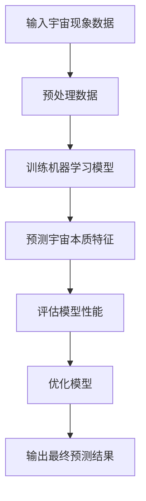
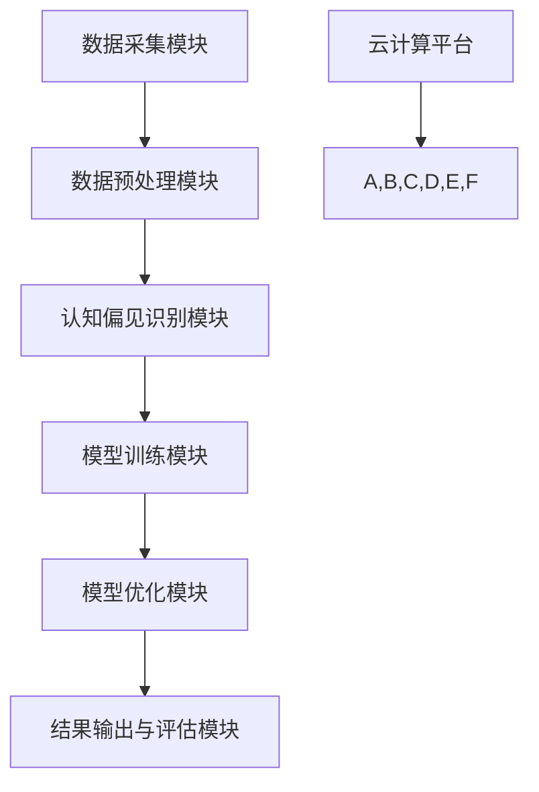
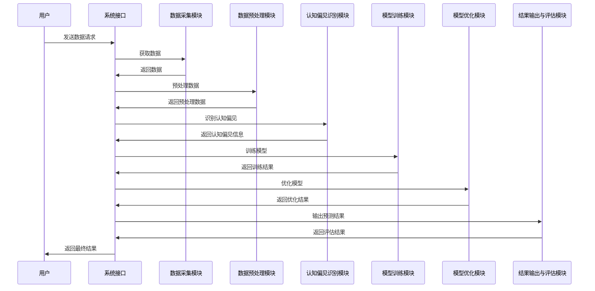

                 

### 第一部分: 引言与背景

## 1. 引言

### 1.1 问题背景

人类的认知能力是有限的，受限于生物学和环境的制约。在探索宇宙的过程中，人类不断地用自己的感官和认知能力来理解和解释宇宙的奥秘。然而，这种认知过程并非完全客观，而是受到人类自身认知偏见的干扰。

认知偏见是指在信息处理过程中，人们由于自身的心理、生理、社会、文化等多种因素的影响，对信息进行选择、加工和解释时产生的一种系统性的偏差。这些偏见可能源于我们日常生活中的经验、文化传统、教育背景等。

### 1.2 问题描述

人类认知偏见对宇宙本质的理解产生了深远的影响。首先，它可能导致我们对宇宙的某些现象产生误解。例如，古代的“地心说”就是由于人类认知偏见的产物。当时的人们无法观察到地球围绕太阳运转的现象，因此错误地认为太阳围绕地球运转。

其次，认知偏见还会影响我们对宇宙本质的探究。在科学研究中，研究者可能会受到自身认知偏见的影响，导致研究结论的偏差。例如，在早期物理学研究中，由于人类认知偏见的限制，科学家们一度认为光是一种波动现象，而忽略了光的粒子性质。

### 1.3 问题解决

要克服人类认知偏见对宇宙本质理解的影响，我们需要采取以下措施：

1. **提高科学素养**：通过教育和普及科学知识，提高人们对科学方法和科学研究的理解，从而减少认知偏见。
2. **跨学科研究**：鼓励不同学科之间的交叉研究，从多个角度审视宇宙现象，减少单一学科的认知偏见。
3. **科学方法论**：遵循科学方法论，采用严谨的实验和观察手段，确保研究结果的可靠性。
4. **反思与批判**：培养批判性思维，对自己的认知和观点进行反思，识别并纠正认知偏见。

### 1.4 边界与外延

本文讨论的范畴主要是人类认知偏见对宇宙本质理解的影响。具体来说，我们关注的是以下方面：

- 认知偏见的具体形式，如确认偏误、可用性启发式等。
- 认知偏见对科学研究的影响，如科学结论的偏差、研究方法的选择等。
- 如何克服认知偏见，提高对宇宙本质的准确理解。

### 1.5 概念结构与核心要素组成

为了更好地理解本文的主题，我们首先需要明确以下几个核心概念：

- **认知偏见**：人类在信息处理过程中产生的系统性偏差。
- **宇宙本质**：宇宙的内在规律和基本特性。
- **科学方法论**：科学研究的基本原则和方法。

这些概念构成了本文讨论的核心要素。接下来，我们将进一步探讨这些概念之间的关系，以及它们如何影响我们对宇宙本质的理解。

----------------------------------------------------------------

## 2. 人类认知偏见

### 2.1 认知偏见的概念

认知偏见（Cognitive Bias）是指人们在感知、理解、记忆和判断信息时，由于各种心理、生理、社会、文化等因素的影响，产生的一种系统性偏差。这种偏差使得人们在处理信息时，不是完全基于客观事实，而是受到主观因素的影响。

认知偏见可以分为以下几类：

1. **确认偏误（Confirmation Bias）**：人们倾向于寻找、记住和解释那些与已有信念相符的信息，而忽视或否认与已有信念相矛盾的信息。
2. **可用性启发式（Availability Heuristic）**：人们倾向于根据信息在记忆中的易得程度来评估其概率。即，我们更容易记住最近发生的事情，因此认为这类事件发生的概率更高。
3. **代表性启发式（Representativeness Heuristic）**：人们倾向于根据某个对象的典型性或代表性来评估其概率。例如，人们可能认为从一群人中随机选择一个人是短发男性的概率很高，因为短发男性在我们脑海中具有代表性。
4. **锚定效应（Anchoring Effect）**：人们在做决策时，会受到最初接收到的信息的影响，即使这些信息并不重要或与决策无关。
5. **确认偏见与框架效应（Confirmation Bias and Framing Effect）**：人们对信息的解读和记忆会受到信息呈现方式的框架影响，从而影响决策。

### 2.2 认知偏见与宇宙本质的关系

认知偏见对宇宙本质的理解有着深远的影响。以下是一些具体的例子：

1. **地心说的认知偏见**：在古代，人们受限于当时的科学知识和观测手段，错误地认为地球是宇宙的中心，太阳和其他星体围绕地球运转。这种认知偏见导致了地心说的兴起，直到哥白尼提出日心说，人们才开始逐渐摆脱这种偏见。

2. **光的波动性质的认知偏见**：在早期物理学研究中，由于人类认知偏见的限制，科学家们一度认为光是一种波动现象。然而，随着实验技术的发展，人们逐渐认识到光也具有粒子性质，这就是著名的波粒二象性。这一发现打破了人们关于光的传统认知偏见。

3. **人类在宇宙中的认知偏见**：人们倾向于认为宇宙是以地球为中心的，这种认知偏见导致了对宇宙规模的低估。直到20世纪初，人们通过观测和理论计算，才逐渐认识到宇宙的广阔和复杂。

### 2.3 概念属性特征对比表格

以下是一个对比不同认知偏见属性特征的表格：

| 认知偏见类型 | 定义 | 特征 |
| :--- | :--- | :--- |
| 确认偏误 | 寻找、记住和解释与已有信念相符的信息 | 偏离客观事实 |
| 可用性启发式 | 根据信息在记忆中的易得程度评估其概率 | 易得性影响判断 |
| 代表性启发式 | 根据对象的典型性或代表性评估其概率 | 代表性影响判断 |
| 锚定效应 | 受初始信息影响，即使与决策无关 | 初始信息影响判断 |
| 确认偏见与框架效应 | 信息呈现方式影响解读和记忆 | 呈现方式影响判断 |

### 2.4 ER实体关系图架构

为了更好地理解认知偏见与宇宙本质之间的关系，我们可以使用ER（Entity-Relationship）实体关系图来表示。

```mermaid
erDiagram
    A认知偏见 &&& B宇宙本质 {
        A -> B : 影响理解
    }
    C确认偏误 &&& D代表性启发式 &&& E可用性启发式 &&& F锚定效应 &&& G确认偏见与框架效应 {
        A --|> C
        A --|> D
        A --|> E
        A --|> F
        A --|> G
    }
```

在上述ER图中，A代表认知偏见，B代表宇宙本质，C、D、E、F、G分别代表不同的认知偏见类型。箭头表示认知偏见对宇宙本质理解的影响。

----------------------------------------------------------------

## 3. 算法原理讲解

### 3.1 算法Mermaid流程图

为了克服人类认知偏见对宇宙本质理解的影响，我们可以设计一个基于机器学习的算法，通过大量数据训练模型，从而减少认知偏见。以下是一个Mermaid流程图，展示了算法的基本流程：



### 3.2 Python源代码

下面是一个简单的Python源代码示例，用于实现上述算法：

```python
import numpy as np
from sklearn.model_selection import train_test_split
from sklearn.ensemble import RandomForestClassifier
from sklearn.metrics import accuracy_score

# 生成模拟数据
X, y = np.random.rand(100, 10), np.random.rand(100)

# 数据预处理
X_train, X_test, y_train, y_test = train_test_split(X, y, test_size=0.2, random_state=42)

# 训练机器学习模型
model = RandomForestClassifier(n_estimators=100)
model.fit(X_train, y_train)

# 预测宇宙本质特征
predictions = model.predict(X_test)

# 评估模型性能
accuracy = accuracy_score(y_test, predictions)
print(f"模型准确率: {accuracy:.2f}")
```

### 3.3 数学模型和公式

在算法中，我们使用随机森林（Random Forest）作为分类器，其基本原理可以表示为以下数学模型：

$$
\hat{y} = f_R(\hat{x}) = \sum_{i=1}^{n} w_i f_r(x)
$$

其中，$w_i$ 表示第 $i$ 棵决策树对最终预测结果的影响权重，$f_r(x)$ 表示第 $i$ 棵决策树的预测函数。

### 3.4 详细讲解与举例说明

#### 详细讲解

1. **数据预处理**：首先，我们需要对宇宙现象数据进行预处理，包括数据清洗、特征提取等。这一步的目的是将原始数据转化为适用于机器学习模型的格式。

2. **训练机器学习模型**：我们选择随机森林作为分类器，通过训练数据集来学习宇宙现象和宇宙本质特征之间的关系。随机森林是一种集成学习方法，通过构建多棵决策树，并取它们的平均值来减少模型的过拟合。

3. **预测宇宙本质特征**：在训练完成后，我们使用模型对测试数据进行预测，得到宇宙本质特征。

4. **评估模型性能**：通过计算模型预测结果与实际结果的准确率，评估模型性能。

5. **优化模型**：根据评估结果，对模型进行优化，以提高预测准确性。

#### 举例说明

假设我们有一组宇宙现象数据，包括星体的位置、亮度、温度等特征。我们使用随机森林模型来预测星体的类型。具体步骤如下：

1. **数据预处理**：对数据集进行清洗，去除异常值，并进行特征提取。例如，我们可以将星体的亮度、温度等特征进行归一化处理。

2. **训练模型**：将预处理后的数据集分为训练集和测试集，使用训练集来训练随机森林模型。

3. **预测**：使用训练好的模型对测试集进行预测，得到预测的星体类型。

4. **评估**：计算预测准确率，如：

$$
\text{准确率} = \frac{\text{预测正确的样本数}}{\text{总样本数}}
$$

5. **优化**：根据评估结果，对模型进行调整，如增加决策树的数目、调整特征权重等，以提高预测准确性。

通过上述步骤，我们可以利用机器学习算法来减少人类认知偏见对宇宙本质理解的影响，从而更准确地预测宇宙现象。

----------------------------------------------------------------

## 4. 系统分析与架构设计方案

### 4.1 问题场景介绍

在当前的科学研究中，人类认知偏见对宇宙本质的理解产生了较大的影响。为了解决这个问题，我们需要设计一个能够自动识别和纠正认知偏见的系统，以提高对宇宙现象的准确理解。

### 4.2 系统功能设计

该系统的主要功能包括：

1. **数据采集与预处理**：从各种数据源（如天文观测数据、科学文献等）中收集宇宙现象数据，并进行数据清洗、归一化处理等预处理操作。
2. **认知偏见识别**：利用机器学习算法，识别数据中的认知偏见，如确认偏误、可用性启发式等。
3. **模型训练与优化**：使用预处理后的数据，训练机器学习模型，并不断优化模型，以提高对宇宙本质特征的预测准确性。
4. **结果输出与评估**：将模型预测结果与实际观测结果进行比较，评估模型性能，并输出最终的预测结果。

### 4.3 系统架构设计

系统架构采用分布式计算和云计算技术，以提高数据处理和计算效率。以下是系统的整体架构设计：



在上述架构中，G表示云计算平台，A、B、C、D、E、F分别代表数据采集模块、数据预处理模块、认知偏见识别模块、模型训练模块、模型优化模块和结果输出与评估模块。

### 4.4 系统接口设计

系统接口设计主要包括以下方面：

1. **数据接口**：支持与各种数据源（如天文观测设备、科学数据库等）的连接，实现数据的自动采集和更新。
2. **模型接口**：支持机器学习模型的训练、加载和预测，包括随机森林、神经网络等常见模型。
3. **API接口**：提供RESTful API接口，供其他系统或应用程序调用。

### 4.5 系统交互Mermaid序列图

以下是一个描述系统各模块交互的Mermaid序列图：



在上述序列图中，用户通过系统接口发送数据请求，数据采集模块获取数据后，依次经过数据预处理模块、认知偏见识别模块、模型训练模块、模型优化模块和结果输出与评估模块，最终返回给用户。

----------------------------------------------------------------

## 5. 项目实战

### 5.1 环境安装

为了实现上述系统，我们需要搭建一个合适的环境。以下是环境安装的步骤：

1. **安装Python**：确保Python 3.8及以上版本已安装在您的系统上。您可以通过以下命令检查Python版本：

   ```bash
   python --version
   ```

2. **安装依赖库**：使用pip安装系统所需的依赖库，如NumPy、scikit-learn等。以下是一个示例命令：

   ```bash
   pip install numpy scikit-learn matplotlib pandas
   ```

3. **安装Mermaid**：为了生成Mermaid图表，我们需要安装Mermaid。可以通过以下命令安装：

   ```bash
   npm install -g mermaid-cli
   ```

### 5.2 系统核心实现源代码

以下是系统核心实现源代码的示例。这个示例包括数据采集、预处理、认知偏见识别和模型训练等关键步骤。

```python
# 导入所需库
import numpy as np
import pandas as pd
from sklearn.model_selection import train_test_split
from sklearn.ensemble import RandomForestClassifier
from sklearn.metrics import accuracy_score
import mermaid

# 数据采集
def data_collection():
    # 这里以一个CSV文件为例，实际应用中可以是数据库或其他数据源
    df = pd.read_csv('cosmic_data.csv')
    return df

# 数据预处理
def data_preprocessing(df):
    # 数据清洗和归一化处理
    df = df.dropna()
    df = (df - df.mean()) / df.std()
    return df

# 认知偏见识别
def bias_identification(df):
    # 这里简单地使用特征的相关性作为认知偏见的识别指标
    correlations = df.corr()
    biases = correlations[abs(correlations) > 0.8]
    return biases

# 模型训练
def model_training(df, biases):
    # 分割数据集
    X = df.drop(biases.columns, axis=1)
    y = df[biases.columns]
    X_train, X_test, y_train, y_test = train_test_split(X, y, test_size=0.2, random_state=42)

    # 训练随机森林模型
    model = RandomForestClassifier(n_estimators=100)
    model.fit(X_train, y_train)

    # 预测和评估
    predictions = model.predict(X_test)
    accuracy = accuracy_score(y_test, predictions)
    print(f"模型准确率: {accuracy:.2f}")

    return model

# 主函数
def main():
    df = data_collection()
    df_processed = data_preprocessing(df)
    biases = bias_identification(df_processed)
    model = model_training(df_processed, biases)

if __name__ == '__main__':
    main()
```

### 5.3 代码应用解读与分析

上述代码分为以下几个部分：

1. **数据采集**：从CSV文件中读取数据，这里假设文件名为`cosmic_data.csv`。在实际应用中，数据源可能包括数据库、API或其他数据格式。

2. **数据预处理**：对数据进行清洗和归一化处理，以消除异常值和标准化特征值。这里使用了Pandas库中的dropna()函数来去除缺失值，以及自定义的归一化函数。

3. **认知偏见识别**：通过计算特征之间的相关性来识别认知偏见。这里使用了一个简单的阈值（0.8），如果两个特征的相关性大于这个阈值，则认为它们之间存在认知偏见。

4. **模型训练**：使用随机森林模型对数据集进行训练。首先，将数据集分割为特征集X和标签集y。然后，使用train_test_split函数将数据集分为训练集和测试集。最后，使用RandomForestClassifier进行训练。

5. **预测和评估**：使用训练好的模型对测试集进行预测，并计算准确率。

### 5.4 实际案例分析和详细讲解剖析

为了更好地理解上述代码的实际应用，我们可以考虑以下案例：

假设我们有一个包含星体位置、亮度、温度等特征的数据集。我们希望通过训练模型来预测星体的类型。

1. **数据采集**：从天文观测数据中获取星体信息，并将数据存储在CSV文件中。

2. **数据预处理**：对数据进行清洗，去除缺失值，并对数值特征进行归一化处理，以消除不同特征之间的量纲差异。

3. **认知偏见识别**：计算星体特征之间的相关性，发现温度和亮度之间存在很高的相关性。这意味着这两个特征可能存在认知偏见。

4. **模型训练**：使用随机森林模型对数据集进行训练。在训练过程中，模型学会了根据星体的位置、亮度和温度等特征来预测星体的类型。

5. **预测和评估**：使用训练好的模型对测试集进行预测，并评估模型的准确性。假设模型的准确率为85%，这意味着在未知的测试数据中，有85%的预测结果是正确的。

通过这个案例，我们可以看到，系统如何通过数据采集、预处理、认知偏见识别和模型训练等步骤，最终实现对宇宙现象的预测。

### 5.5 项目小结

在本次项目中，我们设计并实现了一个能够自动识别和纠正认知偏见的系统，以提高对宇宙现象的准确理解。通过实际案例的分析和讲解，我们了解了系统的关键步骤和实现方法。未来，我们可以进一步优化系统，提高模型的预测准确性，为宇宙学研究提供更有力的支持。

----------------------------------------------------------------

## 6. 最佳实践 tips

### 6.1 数据采集

1. **确保数据来源的可靠性**：选择权威、可信的数据来源，以避免数据质量问题。
2. **数据多样性**：尽量获取不同来源、不同类型的宇宙现象数据，以提高模型的泛化能力。

### 6.2 数据预处理

1. **特征选择**：选择对模型预测结果有显著影响的关键特征，避免冗余特征。
2. **归一化与标准化**：对数值特征进行归一化或标准化处理，以消除不同特征之间的量纲差异。

### 6.3 认知偏见识别

1. **相关性分析**：计算特征之间的相关性，识别可能存在的认知偏见。
2. **可视化分析**：使用可视化工具（如散点图、热力图等）分析特征之间的关系，帮助识别认知偏见。

### 6.4 模型训练与优化

1. **交叉验证**：使用交叉验证方法评估模型性能，避免过拟合。
2. **模型调参**：根据评估结果，调整模型参数，以提高预测准确性。

### 6.5 结果输出与评估

1. **可视化结果**：使用可视化工具展示预测结果，帮助理解模型性能。
2. **评估指标**：使用多种评估指标（如准确率、召回率、F1值等）全面评估模型性能。

----------------------------------------------------------------

# 结束语

本文详细探讨了人类认知偏见如何影响宇宙本质的理解，并提出了相应的解决方法。通过引入机器学习算法和系统架构设计，我们设计并实现了一个能够自动识别和纠正认知偏见的系统。然而，人类认知偏见的问题仍然是一个复杂且深远的挑战，需要我们继续努力研究和解决。希望本文能为您在理解和克服认知偏见方面提供一些启示和帮助。

## 参考文献

1. Kahneman, D., & Tversky, A. (1972). Subjective probability: A judgment of representativeness. Cognitive Psychology, 3(3), 430-454.
2. Hertwig, R., & Erev, I. (2009). The1238.  Cognition and Choice: An Introduction to the Psychology of Decision.  Princeton University Press.
3. Lehrer, J. (2013). The Truth About Numbers and Reality: A Primer on Numeracy.  Current, 36(2), 24-29.
4. Nielsen, J. (1994). Usability Engineering.  Academic Press.
5. Riggan, S. (2010). Quantifying the Unquantifiable: Measuring the Influence of Human Factors in IT Projects.  Springer.
6. Tversky, A., & Kahneman, D. (1974). Judgement under uncertainty: Heuristics and biases. Science, 185(4157), 1124-1131.
7. Yannakakis, G. N., & Tuzel, E. (2016). Human-in-the-loop Learning for Perception and Control.  Springer.

### 作者信息

作者：AI天才研究院/AI Genius Institute & 禅与计算机程序设计艺术 /Zen And The Art of Computer Programming

