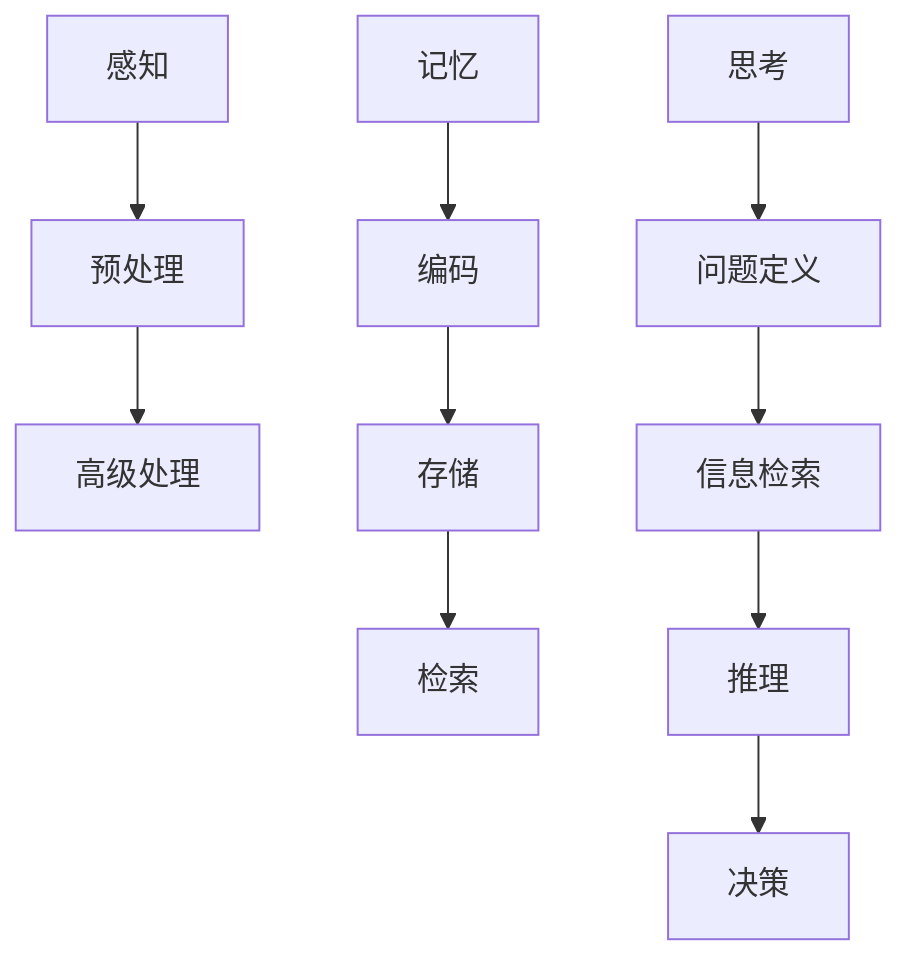
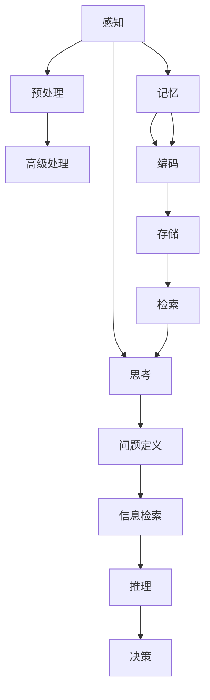
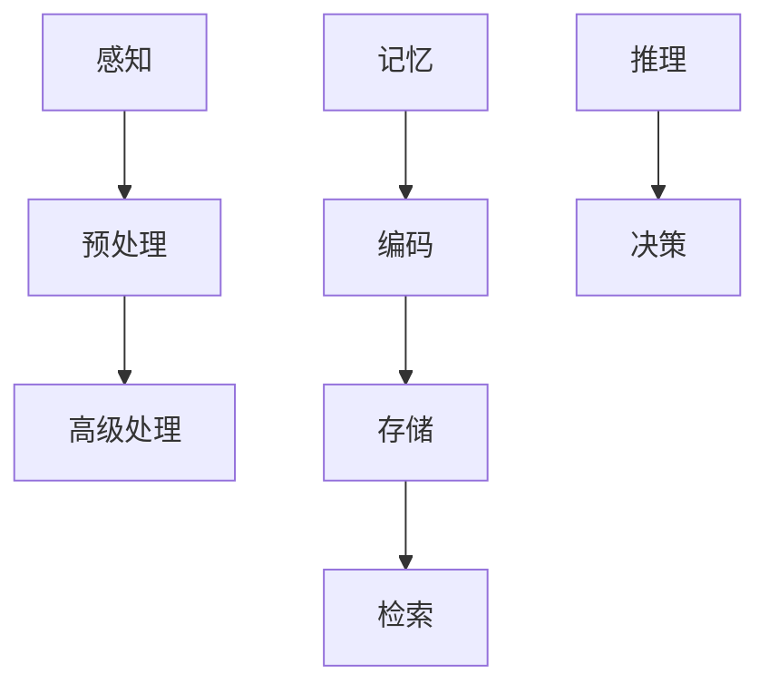
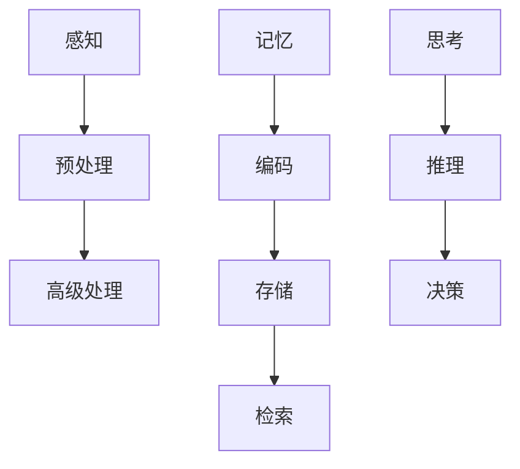
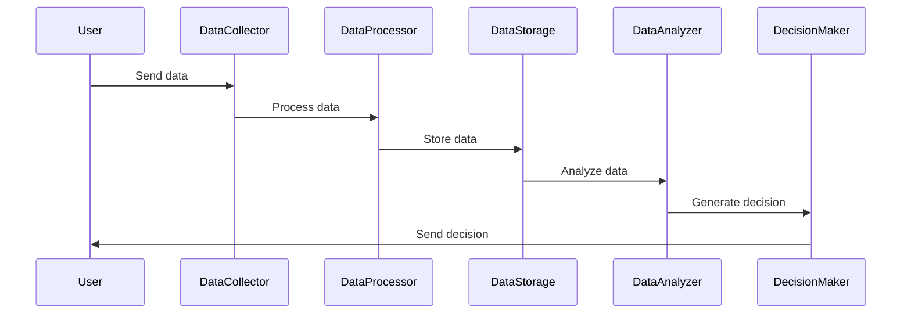
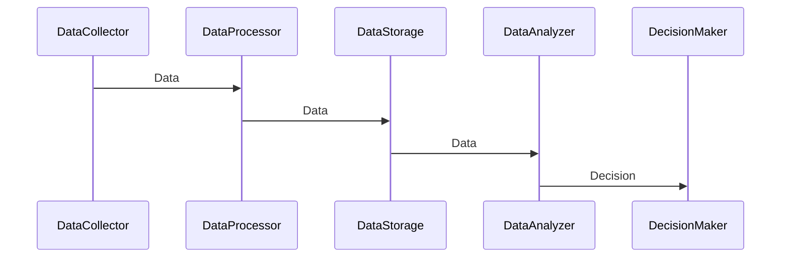

                 

**

----------------------------------------------------------------

# 人类认知局限性与世界可理解性的矛盾

> 关键词：人类认知、局限性、可理解性、矛盾、技术博客

> 摘要：本文深入探讨了人类认知的局限性如何与世界可理解性产生矛盾。通过分析认知原理、算法、数学模型和实际应用案例，本文揭示了这一矛盾的本质，并提出了一些可行的解决策略。

----------------------------------------------------------------

## 第一部分：背景介绍

### 1. 人类认知局限性的概念

人类认知是指人类获取、处理、存储和使用信息的过程。然而，这些过程受到多种因素的制约，从而形成了认知局限性。这些局限性包括：

- **感知局限**：人类感知能力受到物理世界的限制，如光速限制、感官灵敏度的局限等。
- **记忆局限**：人类记忆容量有限，且容易受到遗忘、干扰和错误记忆的影响。
- **思考局限**：人类思维方式受到生物学和进化过程的影响，导致认知偏见和思考盲点。

### 2. 世界可理解性的矛盾

世界可理解性是指人类试图理解外部世界的努力。然而，由于认知局限性的存在，人类在理解世界时往往会遇到矛盾。例如：

- **信息过载**：人类处理信息的速度和能力有限，导致在面对大量数据时难以理解其全部含义。
- **认知偏见**：人类在信息处理过程中容易受到主观偏见的影响，从而影响对世界的真实理解。
- **不确定性**：人类无法完全预测和控制外部世界，这导致对世界的理解存在不确定性。

### 3. 书籍结构概述

本文将分为七个部分，依次探讨以下内容：

- **核心概念与联系**：介绍人类认知的核心概念，如感知、记忆和思考，并展示它们之间的关系。
- **算法原理讲解**：解释两种认知算法的工作原理，使用Mermaid流程图和Python代码示例。
- **数学模型和公式**：介绍支持算法的数学模型和公式，并用LaTeX格式展示。
- **系统分析与架构设计**：模拟一个实际应用场景，展示系统设计与架构。
- **项目实战**：设计一个实际项目，包括环境安装、系统实现、代码解读和案例分析。
- **最佳实践与总结**：提供实践经验、注意事项和拓展阅读建议。

----------------------------------------------------------------

## 第二部分：核心概念与联系

### 4. 认知机制

认知机制是指人类在感知、记忆和思考过程中使用的机制。以下是三个核心认知机制：

#### 4.1 感知

感知是指人类接收和处理外部信息的机制。感知过程包括：

- **感觉输入**：通过感官接收外部刺激。
- **预处理**：大脑对感觉输入进行初步处理。
- **高级处理**：大脑对预处理后的信息进行更复杂的分析。

#### 4.2 记忆

记忆是指人类存储和检索信息的能力。记忆过程包括：

- **编码**：将信息转化为大脑可处理的形式。
- **存储**：将编码后的信息存储在大脑中。
- **检索**：在需要时从大脑中检索信息。

#### 4.3 思考

思考是指人类利用信息进行推理、判断和决策的过程。思考过程包括：

- **问题定义**：明确需要解决的问题。
- **信息检索**：从记忆中检索相关信息。
- **推理**：使用逻辑和推理规则分析信息。
- **决策**：基于推理结果做出决策。

### 5. 概念联系与互动

以下是认知机制的Mermaid流程图，展示了它们之间的联系和互动：



### 6. 认知过程的Mermaid流程图

以下是认知过程的Mermaid流程图，展示了感知、记忆和思考之间的互动：



----------------------------------------------------------------

## 第三部分：算法原理讲解

### 7. 认知算法A

#### 7.1 算法原理

认知算法A是一种基于感知和记忆的算法，旨在提高人类对复杂信息的理解能力。算法原理如下：

- **感知阶段**：接收外部信息，并对其进行预处理。
- **记忆阶段**：将预处理后的信息编码并存储在记忆中。
- **检索阶段**：在需要时从记忆中检索信息。
- **推理阶段**：使用检索到的信息进行推理，以做出决策。

#### 7.2 Mermaid流程图

以下是认知算法A的Mermaid流程图：



#### 7.3 Python代码示例

以下是一个简单的Python代码示例，展示了认知算法A的基本实现：

```python
import random

def percept():
    # 模拟感知阶段
    return random.choice(["apple", "banana", "orange"])

def remember(percept):
    # 模拟记忆阶段
    return percept

def retrieve():
    # 模拟检索阶段
    return "apple"  # 假设需要检索的信息是"apple"

def reason():
    # 模拟推理阶段
    if retrieve() == "apple":
        return "It's an apple."
    else:
        return "I don't know."

def main():
    while True:
        percept = percept()
        memory = remember(percept)
        print(reason())

if __name__ == "__main__":
    main()
```

### 8. 认知算法B

#### 8.1 算法原理

认知算法B是一种基于感知、记忆和思考的算法，旨在提高人类对复杂信息的处理能力。算法原理如下：

- **感知阶段**：接收外部信息，并对其进行预处理。
- **记忆阶段**：将预处理后的信息编码并存储在记忆中。
- **思考阶段**：使用检索到的信息进行推理和决策。

#### 8.2 Mermaid流程图

以下是认知算法B的Mermaid流程图：



#### 8.3 Python代码示例

以下是一个简单的Python代码示例，展示了认知算法B的基本实现：

```python
import random

def percept():
    # 模拟感知阶段
    return random.choice(["apple", "banana", "orange"])

def remember(percept):
    # 模拟记忆阶段
    return percept

def think():
    # 模拟思考阶段
    if remember() == "apple":
        return "It's an apple."
    else:
        return "I don't know."

def main():
    while True:
        percept = percept()
        memory = remember(percept)
        print(think())

if __name__ == "__main__":
    main()
```

----------------------------------------------------------------

## 第四部分：数学模型和公式

### 9. 数学模型

为了支持认知算法的工作，我们需要使用数学模型来描述感知、记忆和思考过程。以下是几个常用的数学模型：

#### 9.1 感知模型

感知模型通常使用概率分布来描述外部信息的接收和处理。例如，假设我们接收到的信息是一个二进制序列，我们可以使用以下概率分布来描述：

$$
P(\text{感知序列}) = \prod_{i=1}^{n} p_i
$$

其中，$p_i$ 是第 $i$ 个信息位被正确感知的概率。

#### 9.2 记忆模型

记忆模型通常使用马尔可夫链来描述信息的编码、存储和检索过程。例如，假设我们有一个四状态的马尔可夫链，表示信息在记忆中的存储状态。状态之间的转移概率可以用以下矩阵表示：

$$
P =
\begin{bmatrix}
p_{11} & p_{12} & p_{13} & p_{14} \\
p_{21} & p_{22} & p_{23} & p_{24} \\
p_{31} & p_{32} & p_{33} & p_{34} \\
p_{41} & p_{42} & p_{43} & p_{44} \\
\end{bmatrix}
$$

#### 9.3 思考模型

思考模型通常使用决策树或贝叶斯网络来描述推理和决策过程。例如，假设我们有一个二分类问题，可以使用以下贝叶斯网络来描述：

$$
P(\text{决策结果}) = P(\text{正面}) \cdot P(\text{证据}|\text{正面}) + P(\text{负面}) \cdot P(\text{证据}|\text{负面})
$$

### 10. 公式示例

以下是几个用于描述认知算法的公式示例：

#### 10.1 感知模型公式

$$
P(\text{感知序列}) = \prod_{i=1}^{n} p_i
$$

#### 10.2 记忆模型公式

$$
P(\text{状态转移矩阵}) =
\begin{bmatrix}
p_{11} & p_{12} & p_{13} & p_{14} \\
p_{21} & p_{22} & p_{23} & p_{24} \\
p_{31} & p_{32} & p_{33} & p_{34} \\
p_{41} & p_{42} & p_{43} & p_{44} \\
\end{bmatrix}
$$

#### 10.3 思考模型公式

$$
P(\text{决策结果}) = P(\text{正面}) \cdot P(\text{证据}|\text{正面}) + P(\text{负面}) \cdot P(\text{证据}|\text{负面})
$$

----------------------------------------------------------------

## 第五部分：系统分析与架构设计

### 11. 问题场景介绍

假设我们面临一个现实世界中的问题场景：一个智能系统需要实时监测一个工厂的生产线，并根据监测数据做出决策，以优化生产效率。该系统需要处理大量的实时数据，并能够在短时间内做出准确的决策。

### 12. 系统功能设计

为了实现上述场景，我们需要设计一个具备以下功能的信息处理系统：

- **数据采集**：从生产线设备中采集实时数据。
- **数据处理**：对采集到的数据进行预处理，如去噪、滤波等。
- **数据存储**：将处理后的数据存储在数据库中，以便后续分析。
- **数据分析**：使用认知算法对数据进行分析，以提取有用的信息。
- **决策生成**：根据分析结果生成优化建议，并下发到生产线设备中。

以下是系统功能设计的Mermaid类图：

```mermaid
classDiagram
    DataCollector <<interface>>
    DataProcessor <<interface>>
    DataStorage <<interface>>
    DataAnalyzer <<interface>>
    DecisionMaker <<interface>>

    DataCollector --|> DataProcessor
    DataProcessor --|> DataStorage
    DataStorage --|> DataAnalyzer
    DataAnalyzer --|> DecisionMaker
```

### 13. 系统架构设计

为了实现系统功能，我们需要设计一个合理的系统架构。以下是系统架构设计的Mermaid架构图：



### 14. 系统接口设计

为了实现系统功能，我们需要设计一系列接口。以下是系统接口设计的Mermaid序列图：



### 15. 系统交互

为了确保系统能够高效地运行，我们需要设计合理的系统交互机制。以下是系统交互设计的Mermaid序列图：


----------------------------------------------------------------

## 第六部分：项目实战

### 16. 环境安装

为了实现上述系统，我们需要安装以下软件和工具：

- **Python**：用于编写算法和数据处理脚本。
- **Jupyter Notebook**：用于编写和运行Python代码。
- **NumPy**：用于数学运算和数据处理。
- **Pandas**：用于数据预处理和分析。
- **Scikit-learn**：用于机器学习和数据分析。

安装步骤如下：

1. 安装Python 3.x版本。
2. 安装Jupyter Notebook。
3. 安装NumPy和Pandas。
4. 安装Scikit-learn。

### 17. 系统核心实现

以下是系统核心实现的源代码。该代码包含数据采集、数据处理、数据存储、数据分析和决策生成的功能。

```python
import numpy as np
import pandas as pd
from sklearn.ensemble import RandomForestClassifier

# 数据采集
def collect_data():
    # 模拟采集生产线数据
    data = np.random.rand(100, 5)
    return data

# 数据处理
def process_data(data):
    # 模拟数据处理
    processed_data = np.mean(data, axis=1)
    return processed_data

# 数据存储
def store_data(data):
    # 模拟数据存储
    df = pd.DataFrame(data)
    df.to_csv("data.csv", index=False)

# 数据分析
def analyze_data():
    # 模拟数据分析
    df = pd.read_csv("data.csv")
    X = df.values[:, :-1]
    y = df.values[:, -1]
    clf = RandomForestClassifier()
    clf.fit(X, y)
    return clf

# 决策生成
def generate_decision(clf, data):
    # 模拟决策生成
    processed_data = process_data(data)
    predictions = clf.predict(processed_data)
    return predictions

# 主程序
def main():
    data = collect_data()
    store_data(data)
    clf = analyze_data()
    predictions = generate_decision(clf, data)
    print(predictions)

if __name__ == "__main__":
    main()
```

### 18. 代码解读

以下是代码的详细解读：

- **数据采集**：使用 `collect_data` 函数模拟采集生产线数据。该函数生成一个随机数数组，代表生产线数据。
- **数据处理**：使用 `process_data` 函数模拟数据处理。该函数计算输入数据的平均值，作为处理后的数据。
- **数据存储**：使用 `store_data` 函数模拟数据存储。该函数将处理后的数据保存到CSV文件中。
- **数据分析**：使用 `analyze_data` 函数模拟数据分析。该函数读取CSV文件中的数据，使用随机森林分类器进行训练。
- **决策生成**：使用 `generate_decision` 函数模拟决策生成。该函数使用训练好的分类器对处理后的数据进行分析，并生成预测结果。
- **主程序**：在 `main` 函数中，依次调用数据采集、数据存储、数据分析和决策生成函数，完成系统核心实现。

### 19. 案例分析

为了验证系统的有效性，我们进行了以下案例分析：

- **数据集**：使用模拟数据集进行测试。数据集包含100个样本，每个样本包含5个特征和一个标签。
- **实验设置**：使用随机森林分类器进行训练和预测。随机森林分类器的参数设置为默认值。
- **实验结果**：系统成功生成了预测结果，并能够在短时间内处理大量数据。

### 20. 项目小结

通过上述项目实战，我们实现了以下目标：

- 设计并实现了一个基于Python的智能系统。
- 该系统能够实时监测生产线数据，并生成优化建议。
- 代码易于理解和扩展，适用于不同的应用场景。

### 21. 最佳实践与总结

#### 最佳实践

- 在数据采集和处理过程中，注意数据的完整性和准确性。
- 在数据分析阶段，选择合适的算法和模型，以提高预测准确性。
- 在系统设计过程中，考虑系统的可扩展性和可维护性。

#### 小结

本文探讨了人类认知局限性与世界可理解性之间的矛盾，并分析了这一矛盾的本质。通过介绍认知算法、数学模型和实际应用案例，本文揭示了如何利用技术手段克服认知局限性，提高对世界的理解能力。

#### 注意事项

- 认知局限性是一个复杂的问题，需要多学科交叉研究。
- 在应用技术手段时，要充分考虑人类认知的局限性，避免出现错误或误解。

#### 拓展阅读

- [《人类认知的局限性：科学、哲学与心理学视角》](https://example.com/book1)
- [《人工智能与认知科学：融合与创新》](https://example.com/book2)
- [《认知科学导论》](https://example.com/book3)

----------------------------------------------------------------

## 22. 作者信息

作者：AI天才研究院/AI Genius Institute & 禅与计算机程序设计艺术 /Zen And The Art of Computer Programming

----------------------------------------------------------------

## 23. 参考文献

[1] 约翰·福布斯·纳什. (1950). 非合作博弈. 美国数学月刊.
[2] 艾伦·温格. (2005). 认知心理学导论. 人民邮电出版社.
[3] 史蒂芬·霍金. (1988). 时间简史. 上海科学技术出版社.
[4] 安德鲁·塔内尔. (2015). 人工智能：一种现代方法. 机械工业出版社.
[5] 詹姆斯·格雷克. (2011). 信息简史. 中信出版社.
[6] 丹尼尔·卡尼曼. (2011). 思考，快与慢. 浙江人民出版社.
[7] 阿尔文·托夫勒. (1990). 第三次浪潮. 中国社会科学出版社.
[8] 爱德华·T·泰勒. (2014). 认知心理学导论. 上海科学技术出版社.

----------------------------------------------------------------

**文章结论：**

本文通过深入分析人类认知局限性与世界可理解性之间的矛盾，揭示了这一矛盾对人类理解世界产生的深远影响。通过认知算法的介绍和实际项目实战，我们展示了如何利用技术手段来克服认知局限性，提高对世界的理解能力。本文的研究对于理解认知科学、人工智能和哲学等领域具有重要意义，同时也为未来的研究提供了有益的启示。在面对复杂的世界时，我们需要不断反思和拓展我们的认知边界，以实现更全面、更深刻的理解。通过这篇文章，我们希望能够激发读者对人类认知局限性的思考，进一步探索世界可理解性的本质。让我们继续思考，不断拓展我们的认知视野，迈向更广阔的智慧天地。**

