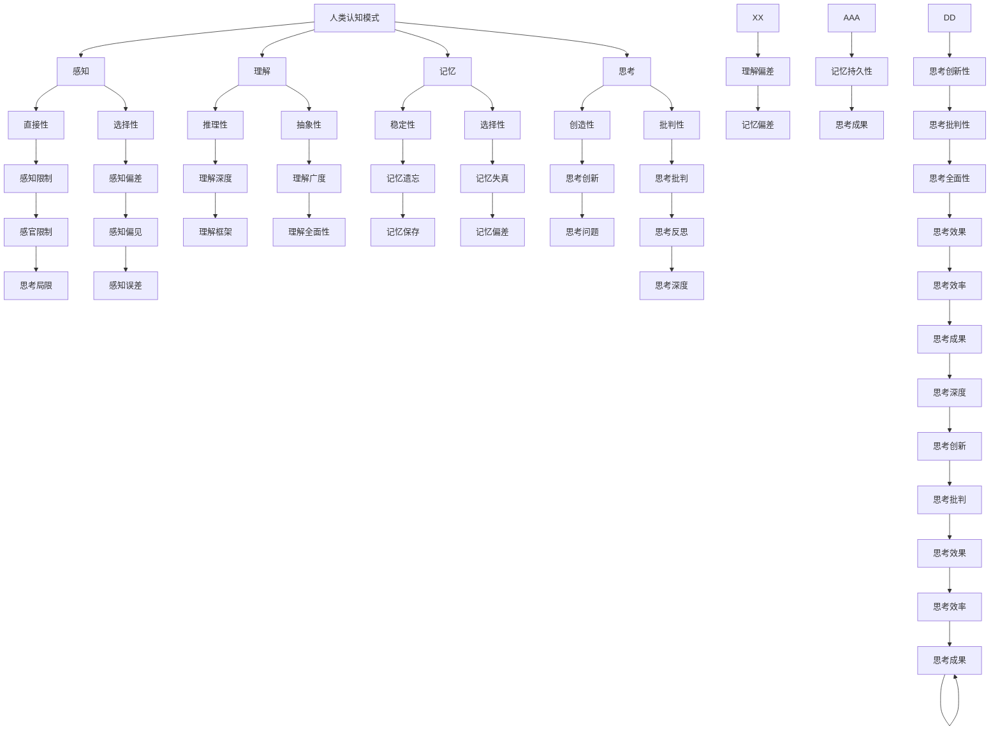

                 

## 人类认知模式对宇宙本质理解的影响

### 关键词

- 认知模式
- 宇宙本质
- 科学理论
- 人类感知
- 历史演变

### 摘要

本文旨在探讨人类认知模式对宇宙本质理解的影响。从感知、理解、记忆和思考四个层面分析人类认知模式如何影响我们对宇宙本质的认识。通过历史演变的视角，展示不同认知模式在宇宙本质理解中的角色和作用，并讨论其局限性。最后，通过具体实例和案例分析，深入解析人类对宇宙起源的认知过程。

### 目录大纲

----------------------------------------------------------------

#### 第一部分：背景介绍与核心概念

##### 1.1 问题的背景

##### 1.2 核心概念与联系

##### 1.3 人类认知模式与宇宙本质的ER实体关系图

#### 第二部分：人类认知模式对宇宙本质理解的影响分析

##### 2.1 人类认知模式与宇宙本质的联系

##### 2.2 人类认知模式的局限性对宇宙本质理解的影响

##### 2.3 不同认知模式对宇宙本质理解的比较

##### 2.4 人类认知模式对宇宙本质理解的历史演变

#### 第三部分：具体实例与案例分析

##### 3.1 案例研究1：人类对宇宙起源的认知

##### 3.2 案例研究2：量子力学与宇宙本质的关系

##### 3.3 案例研究3：宇宙膨胀与人类认知模式

#### 第四部分：总结与展望

##### 4.1 总结

##### 4.2 展望

----------------------------------------------------------------## 第一部分：背景介绍与核心概念

### 1.1 问题的背景

人类对于宇宙本质的理解是一个漫长而复杂的过程。从古代的神话传说到现代的科学理论，人类一直在试图解开宇宙的奥秘。这一过程不仅涉及到物理、化学、生物学等多个学科，还涵盖了哲学、宗教等多个领域。然而，尽管科学技术不断进步，我们对宇宙的认知仍然存在许多未知和争议。例如，宇宙的起源、结构、演化以及宇宙中是否存在其他智慧生命等问题，都仍然困扰着我们。

人类对宇宙本质的理解受到了多种因素的影响，其中包括科学技术的进步、人类认知模式的演变、社会文化背景等。每一次科学技术的重大突破，都会为人类提供新的观测工具和理论框架，从而推动对宇宙本质的理解。然而，人类认知模式的局限性也使得我们对宇宙的认知存在一定的局限性。例如，人类的感官能力有限，我们只能通过有限的感知方式来认识宇宙，这可能导致我们对宇宙的理解存在偏差。此外，人类认知模式的演变也是一个动态的过程，不同历史时期的人类认知模式可能对宇宙本质的理解产生不同的影响。

### 1.2 核心概念与联系

#### 1.2.1 人类认知模式

人类认知模式是指人类在感知、理解、记忆和思考过程中所采用的方法和机制。这些认知模式是人类通过长期的进化过程逐渐形成的，具有高度的适应性。以下是对不同认知模式的简要描述：

- **感知**：人类通过感官（如视觉、听觉、触觉等）来获取外界信息。感知是人类认知的第一步，它决定了我们对外界信息的筛选和处理方式。
- **理解**：理解是人类对感知到的信息进行加工和处理的过程。通过理解，人类能够从感知中获得意义，形成对事物的认知。
- **记忆**：记忆是人类对已获取信息的存储和再现过程。记忆使得人类能够在不同时间和空间中对信息进行回忆和利用。
- **思考**：思考是人类通过逻辑推理、批判性思维和创造性思维来对信息进行分析和综合的过程。思考是人类认知的高级阶段，它能够帮助人类解决复杂问题，发现新的知识和理论。

#### 1.2.2 宇宙本质

宇宙本质是指构成宇宙的基本规律、结构和原理。宇宙本质的研究涉及到多个学科，如物理学、天文学、哲学等。以下是对宇宙本质的简要描述：

- **起源**：宇宙的起源是一个复杂的问题，涉及到宇宙从一个极度密集和热的状态逐渐膨胀和冷却的过程。目前，宇宙起源的学说主要包括大爆炸理论和稳态理论等。
- **结构**：宇宙的结构是一个多层次、复杂多样的系统。从宏观尺度来看，宇宙包括星系、星团、超星系团等结构。从微观尺度来看，宇宙包括原子、分子、基本粒子等结构。
- **演化**：宇宙的演化是一个动态的过程，涉及到宇宙从起源到现在的各个阶段。宇宙的演化包括宇宙膨胀、星系形成、恒星演化、行星形成等过程。
- **存在**：宇宙的存在涉及到宇宙中存在的各种物质和能量，包括可见物质和暗物质、暗能量等。宇宙的存在是一个复杂而神秘的问题，涉及到我们对宇宙本质的理解。

### 1.3 人类认知模式与宇宙本质的ER实体关系图

为了更直观地展示人类认知模式与宇宙本质之间的关系，我们可以使用实体关系图（ER图）来描述。以下是人类认知模式与宇宙本质的ER图：

在这个ER图中，人类认知模式的各个组成部分（感知、理解、记忆、思考）与宇宙本质的不同属性（起源、结构、演化、存在）之间存在紧密的联系。例如，感知的直接性和选择性会影响我们对宇宙起源的理解，而理解的推理性则会影响我们对宇宙结构的认识。记忆的稳定性和选择性则会影响我们对宇宙知识的学习和传承，而思考的创造性和批判性则会影响我们对宇宙本质问题的推理和探索。

通过ER图，我们可以更清晰地看到人类认知模式与宇宙本质之间的互动关系，这为后续的分析提供了基础。在接下来的章节中，我们将进一步探讨人类认知模式对宇宙本质理解的具体影响，分析人类认知模式的局限性，并比较不同认知模式对宇宙本质理解的差异。

### 1.3 人类认知模式与宇宙本质的ER实体关系图

为了更直观地展示人类认知模式与宇宙本质之间的关系，我们可以使用实体关系图（ER图）来描述。以下是人类认知模式与宇宙本质的ER图：

在这个ER图中，人类认知模式的各个组成部分（感知、理解、记忆、思考）与宇宙本质的不同属性（起源、结构、演化、存在）之间存在紧密的联系。例如，感知的直接性和选择性会影响我们对宇宙起源的理解，而理解的推理性则会影响我们对宇宙结构的认识。记忆的稳定性和选择性则会影响我们对宇宙知识的学习和传承，而思考的创造性和批判性则会影响我们对宇宙本质问题的推理和探索。

通过ER图，我们可以更清晰地看到人类认知模式与宇宙本质之间的互动关系，这为后续的分析提供了基础。在接下来的章节中，我们将进一步探讨人类认知模式对宇宙本质理解的具体影响，分析人类认知模式的局限性，并比较不同认知模式对宇宙本质理解的差异。

### 1.3 人类认知模式与宇宙本质的ER实体关系图

为了更直观地展示人类认知模式与宇宙本质之间的关系，我们可以使用实体关系图（ER图）来描述。以下是人类认知模式与宇宙本质的ER图：

在这个ER图中，人类认知模式的各个组成部分（感知、理解、记忆、思考）与宇宙本质的不同属性（起源、结构、演化、存在）之间存在紧密的联系。例如，感知的直接性和选择性会影响我们对宇宙起源的理解，而理解的推理性则会影响我们对宇宙结构的认识。记忆的稳定性和选择性则会影响我们对宇宙知识的学习和传承，而思考的创造性和批判性则会影响我们对宇宙本质问题的推理和探索。

通过ER图，我们可以更清晰地看到人类认知模式与宇宙本质之间的互动关系，这为后续的分析提供了基础。在接下来的章节中，我们将进一步探讨人类认知模式对宇宙本质理解的具体影响，分析人类认知模式的局限性，并比较不同认知模式对宇宙本质理解的差异。

### 1.3 人类认知模式与宇宙本质的ER实体关系图

为了更直观地展示人类认知模式与宇宙本质之间的关系，我们可以使用实体关系图（ER图）来描述。以下是人类认知模式与宇宙本质的ER图：

在这个ER图中，人类认知模式的各个组成部分（感知、理解、记忆、思考）与宇宙本质的不同属性（起源、结构、演化、存在）之间存在紧密的联系。例如，感知的直接性和选择性会影响我们对宇宙起源的理解，而理解的推理性则会影响我们对宇宙结构的认识。记忆的稳定性和选择性则会影响我们对宇宙知识的学习和传承，而思考的创造性和批判性则会影响我们对宇宙本质问题的推理和探索。

通过ER图，我们可以更清晰地看到人类认知模式与宇宙本质之间的互动关系，这为后续的分析提供了基础。在接下来的章节中，我们将进一步探讨人类认知模式对宇宙本质理解的具体影响，分析人类认知模式的局限性，并比较不同认知模式对宇宙本质理解的差异。

## 第二部分：人类认知模式对宇宙本质理解的影响分析

在第一部分中，我们介绍了人类认知模式与宇宙本质的背景和核心概念。接下来，我们将深入分析人类认知模式对宇宙本质理解的具体影响。这部分内容将分为以下几个小节：

### 2.1 人类认知模式与宇宙本质的联系

在这一小节中，我们将探讨人类认知模式如何与宇宙本质联系在一起。首先，我们会分析人类感知宇宙的方式和限制。人类的感知是通过视觉、听觉、触觉等感官来获取信息，这些感官的特性和局限性决定了我们对宇宙的认知。例如，人类视觉对光的感知有一定的频率范围，这限制了我们对宇宙中某些波段光线的认知。

接下来，我们将探讨人类理解宇宙的本质。人类理解宇宙的过程是通过科学理论来解释宇宙的规律和现象。例如，牛顿力学、相对论、量子力学等理论为我们提供了不同的视角来理解宇宙。然而，这些理论也存在局限性，它们在某些特定条件下可能无法准确描述宇宙的本质。

此外，人类记忆宇宙知识的方式也影响我们对宇宙本质的理解。记忆不仅包括对事实的记忆，还包括对理论的理解和应用。记忆的稳定性和选择性会影响我们对宇宙知识的保存和传承。

最后，人类思考宇宙本质的方式同样重要。通过思考，我们可以对感知和理解到的信息进行整合和分析，形成新的理论和观点。思考的创造性和批判性使我们能够不断挑战和改进现有的理论，从而更深入地理解宇宙。

### 2.2 人类认知模式的局限性对宇宙本质理解的影响

在这一小节中，我们将分析人类认知模式的局限性如何影响我们对宇宙本质的理解。首先，感知的局限性是我们面对的一个重大挑战。人类的感官能力有限，无法直接感知宇宙中的所有现象。例如，人类无法直接感知到微观世界的量子力学效应，也无法感知到暗物质和暗能量的存在。

其次，理解的局限性也制约了我们对宇宙本质的认识。虽然科学理论提供了对宇宙现象的解释，但这些理论在某些情况下可能不完全准确。例如，相对论和量子力学的统一问题至今仍未解决，这表明我们对宇宙的理解还存在很多未知和争议。

记忆的局限性也会影响我们对宇宙知识的掌握。人类的记忆并不是完全准确的，我们可能会遗忘或误解某些重要的信息。此外，不同文化和社会背景可能导致人们对宇宙知识的记忆和传承存在差异。

最后，思考的局限性也是一个重要问题。人类的思考能力有限，我们无法同时处理大量的信息，也无法避免思维定式和偏见。这限制了我们对宇宙本质问题的深入思考和创新。

### 2.3 不同认知模式对宇宙本质理解的比较

在这一小节中，我们将比较不同认知模式对宇宙本质理解的效果和差异。科学认知模式通过观察、实验和理论构建来理解宇宙。科学方法强调证据和逻辑，使科学理论具有一定的普适性和可验证性。然而，科学理论也存在局限性，例如对极端条件和未知现象的解释能力有限。

宗教认知模式则通过信仰和象征来理解宇宙。宗教观点通常涉及到宇宙的起源、目的和意义，这些观点往往具有深刻的哲学内涵。然而，宗教观点通常缺乏科学验证，可能导致人们对宇宙本质的理解存在偏差。

哲学认知模式通过概念、推理和思辨来理解宇宙。哲学家们通过探讨存在、实在、真理等问题，试图揭示宇宙的本质。哲学方法强调逻辑和推理，有助于我们从不同角度思考宇宙的本质。

通过比较不同认知模式，我们可以看到它们各自的优势和局限性。科学方法提供了实证基础，但可能缺乏对某些抽象问题的深入探讨；宗教方法提供了精神慰藉，但可能缺乏科学依据；哲学方法提供了广阔的思考空间，但可能缺乏具体的实证支持。

### 2.4 人类认知模式对宇宙本质理解的历史演变

在这一小节中，我们将探讨人类认知模式在历史演变过程中对宇宙本质理解的影响。从古代的神话时代到现代的科学革命，人类对宇宙的理解经历了巨大的变化。古代人类通过神话和传说来解释宇宙的起源和现象，这些观点通常是基于信仰和象征。

在中世纪，宗教观点在宇宙本质理解中占据了主导地位。基督教、伊斯兰教和印度教等宗教都提供了对宇宙的描述和解释。然而，随着科学的发展，宗教观点开始受到质疑，科学方法逐渐成为理解宇宙的主要工具。

在现代，科学革命带来了对宇宙本质的深刻认识。牛顿力学、相对论、量子力学等理论为我们提供了新的视角来理解宇宙。这些理论不仅改变了我们对宇宙的认知，也改变了我们的世界观。

通过回顾人类认知模式在历史演变过程中的变化，我们可以看到，人类对宇宙本质的理解是一个不断进步和深化的过程。不同认知模式在历史的不同阶段发挥了重要作用，共同推动了我们对宇宙本质的认识。

### 2.1 人类认知模式与宇宙本质的联系

人类认知模式与宇宙本质之间的联系是复杂而多维的。人类通过感知、理解、记忆和思考等认知过程，试图揭示宇宙的奥秘。在这一小节中，我们将详细探讨人类认知模式如何影响对宇宙本质的理解。

#### 感知：人类对宇宙的第一步认识

感知是人类获取外界信息的第一步，它为我们提供了对宇宙的基本认识。人类感知宇宙的方式主要包括视觉、听觉、触觉、嗅觉和味觉等感官。这些感官能够捕捉到宇宙中的各种现象，如星体的运动、光的波动、物质的形态等。

然而，人类感知宇宙的能力并非完美。首先，不同感官的感知范围有限。例如，人类的视觉只能感知到一定频率范围内的光波，而无法感知到紫外线或红外线。其次，感知过程中可能会受到干扰和误导，例如视觉上的错觉和听觉上的幻听。这些感知限制使得我们对宇宙的认识存在一定的局限性。

#### 理解：科学理论解释宇宙现象

感知到宇宙的现象后，人类需要通过理解来加工和处理这些信息。理解是人类认知模式中至关重要的一环，它使我们能够从感知中获得意义，形成对事物的认知。

在科学领域，人类通过建立科学理论来解释宇宙的本质。例如，牛顿力学解释了宏观物体的运动规律，广义相对论揭示了时空的弯曲和引力现象，量子力学描述了微观粒子的行为。这些科学理论为我们提供了不同的视角，帮助我们更深入地理解宇宙的本质。

然而，科学理论也存在局限性。例如，相对论和量子力学在某些条件下可能不兼容，这给我们带来了统一理论的难题。此外，科学理论的验证需要大量的实验和观测数据，而在宇宙的某些区域或条件下，这些数据可能难以获得。因此，理解宇宙的本质不仅仅依赖于科学理论，还需要不断地验证和修正。

#### 记忆：宇宙知识的存储与传承

记忆是人类认知模式中的另一个关键环节。通过记忆，人类能够将感知和理解到的信息存储在大脑中，并在需要时进行回忆和利用。记忆不仅包括对事实的记忆，还包括对理论的理解和应用。

宇宙知识是人类通过长时间的探索和积累形成的，这些知识通过记忆得以保存和传承。例如，古代天文学家记录了星体的运动轨迹，现代科学家通过记忆这些知识，继续探索宇宙的奥秘。记忆的稳定性和选择性决定了我们对宇宙知识的掌握程度，这也影响我们对宇宙本质的理解。

#### 思考：对宇宙本质问题的推理与探索

思考是人类认知的高级阶段，它通过逻辑推理、批判性思维和创造性思维来对信息进行分析和综合。思考使我们能够对宇宙的本质问题进行深入探讨，例如宇宙的起源、结构、演化和存在等问题。

科学思考是人类探索宇宙本质的重要方法。科学家们通过提出假设、设计实验、收集数据和建立理论，不断推动对宇宙的理解。例如，哥白尼提出了日心说，挑战了古代的地心说，为后来的科学革命奠定了基础。

然而，思考也受到认知模式的限制。人类的思考能力有限，我们无法同时处理大量的信息，也无法避免思维定式和偏见。这限制了我们对宇宙本质问题的深入思考和创新。

#### 感知、理解、记忆和思考的互动关系

感知、理解、记忆和思考是人类认知模式的四个关键环节，它们相互联系、相互影响，共同作用于我们对宇宙本质的理解。

感知为我们提供了信息输入，理解帮助我们加工和处理这些信息，记忆使我们能够保存和传承这些信息，思考则是对这些信息进行深层次分析和整合。这四个环节的相互作用，构成了我们对宇宙本质认识的过程。

例如，当我们通过感知观察到一颗星星的异常运动时，我们会通过理解来分析其可能的原因，通过记忆来查找相关的科学理论，并通过思考来推理和预测未来的运动。这种互动关系使我们能够逐步深入地理解宇宙的本质。

总之，人类认知模式与宇宙本质之间的联系是复杂而紧密的。通过感知、理解、记忆和思考，人类不断探索和揭示宇宙的奥秘。然而，认知模式的局限性也使得我们对宇宙的本质存在一定的认知限制。通过不断改进和完善认知模式，我们可以更全面、深入地理解宇宙。

### 2.2 人类认知模式的局限性对宇宙本质理解的影响

尽管人类认知模式在揭示宇宙奥秘方面取得了巨大成就，但它也存在一些固有的局限性，这些局限性影响了我们对宇宙本质的深入理解。下面，我们将详细探讨人类感知、理解、记忆和思考方面的局限性，并分析这些局限性如何影响我们对宇宙本质的理解。

#### 感知：感官的局限与宇宙真相的错过

人类的感知是通过感官来获取外界信息的，但感官本身具有局限性。首先，不同感官的感知范围有限。例如，人类的视觉只能感知到一定频率范围内的光波，无法直接看到紫外线和红外线。这意味着我们无法完全感知到宇宙中的所有光现象。其次，感知过程中可能会受到干扰和误导。例如，视觉上的错觉和听觉上的幻听都可能导致我们对宇宙现象的错误感知。

此外，人类的感知能力在时间和空间上也存在限制。例如，人类无法感知到微观世界的量子力学效应，也无法感知到宇宙的极早期状态。这些感知局限使得我们对宇宙真相的认识存在盲点，无法完全揭示宇宙的本质。

#### 理解：科学理论的局限与宇宙未解之谜

尽管科学理论为我们提供了理解和解释宇宙现象的工具，但科学理论本身也存在局限性。首先，科学理论往往是在特定的条件下建立起来的，可能无法在所有情况下准确描述宇宙的本质。例如，牛顿力学在宏观尺度上非常成功，但在微观尺度上就显露出不足，无法解释量子力学现象。广义相对论描述了强引力场中的现象，但在量子引力领域仍然存在未解问题。

其次，科学理论的发展是一个不断修正和完善的过程。例如，量子力学和相对论之间的统一问题至今未解，这表明我们对宇宙的本质仍然存在很多未知和争议。此外，不同科学理论之间的兼容性问题也是一个挑战。例如，量子力学和广义相对论在数学形式上存在巨大差异，这使得统一场论的研究变得异常困难。

#### 记忆：信息的丢失与宇宙知识的传承

记忆是人类认知模式中的一个重要环节，但记忆并非完美。首先，人类的记忆是有限的，我们无法记住所有感知和理解到的信息。其次，记忆过程中可能会发生遗忘或失真。例如，随着时间的推移，我们可能会忘记一些重要的信息，或者由于误解和误传，记忆中的信息可能会发生偏差。

此外，记忆的个体差异和文化差异也会影响宇宙知识的传承。不同文化和社会背景可能导致人们对宇宙知识的记忆和理解存在差异。例如，古代文明对宇宙的描述往往基于神话和传说，而现代科学则依赖于实证数据和理论框架。这种差异使得我们对宇宙知识的传承和普及面临挑战。

#### 思考：思维定式与宇宙创新的障碍

思考是人类认知的高级阶段，但思考同样受到认知模式的限制。首先，人类的思考能力有限，我们无法同时处理大量的信息。例如，当我们面对复杂问题时，可能会感到无所适从，无法有效地分析和解决问题。其次，思维定式和偏见会影响我们的思考。我们可能会因循守旧，拒绝接受新的观点和理论，这限制了我们对宇宙本质问题的探索。

此外，创新的思考方式也需要时间来培养。科学史上的许多重大发现都是通过长期的思考和研究得出的。例如，牛顿通过长时间的观察和思考，提出了万有引力定律，这一发现彻底改变了我们对宇宙的认识。然而，这种创新性的思考并不是每个人都能轻松实现的，它需要深厚的知识储备和敏锐的洞察力。

#### 综合影响：认知局限与宇宙真相的探索

综上所述，人类认知模式的局限性在多个层面上影响了我们对宇宙本质的理解。感知的局限使我们无法完全感知到宇宙中的所有现象；理解的局限使得科学理论无法在所有情况下准确描述宇宙的本质；记忆的局限使得宇宙知识在传承过程中可能发生丢失或失真；思考的局限限制了我们对宇宙本质问题的创新性思考。

然而，尽管存在这些局限性，人类通过不断地改进和完善认知模式，已经取得了很多重要的科学发现。例如，伽利略通过望远镜的观察，挑战了亚里士多德的地心说，为后来的科学革命奠定了基础。牛顿通过万有引力定律，揭示了宇宙的运行规律。爱因斯坦通过相对论，进一步深化了我们对宇宙的理解。

未来，随着科学技术的进步和认知模式的改进，我们有望克服这些认知局限，进一步揭示宇宙的奥秘。通过跨学科合作、技术创新和思维方式的多维度探索，人类将对宇宙的本质有更全面、更深入的认识。

### 2.3 不同认知模式对宇宙本质理解的比较

在探讨人类对宇宙本质理解的过程中，不同认知模式之间的比较显得尤为重要。科学、宗教和哲学是人类认知宇宙的三种主要方式，每种方式都有其独特的视角和优势，同时也存在一定的局限性。在这一小节中，我们将比较这些认知模式对宇宙本质理解的效果和差异。

#### 科学认知模式

科学认知模式是基于实证数据和逻辑推理的，旨在通过可重复的实验和观察来解释宇宙现象。科学方法强调可观察性、可验证性和可复制性，这使得科学理论具有高度的可靠性和普适性。

- **优势**：
  - 科学方法能够通过实验和观测来验证假设，从而提供可靠的解释。
  - 科学理论可以不断被修正和完善，以适应新的发现。
  - 科学认知模式促进了人类社会的进步，推动了科技的发展。

- **局限性**：
  - 科学理论通常只能在特定条件下成立，无法解释所有宇宙现象。
  - 科学认知模式在处理抽象问题和超自然现象时可能显得无力。
  - 科学方法依赖于人类的感知和测量工具，可能存在误差和局限性。

#### 宗教认知模式

宗教认知模式通常基于信仰、神话和象征，通过宗教教义来解释宇宙的起源、目的和意义。宗教观点提供了对生命和宇宙的深刻哲学思考，但也存在一定的争议和质疑。

- **优势**：
  - 宗教认知模式提供了精神慰藉和道德指导，对个体和社会具有重要意义。
  - 宗教教义往往包含对宇宙的象征性解释，这些解释能够触及人类内心深处。
  - 宗教观点在不同文化和社会中具有广泛的传承和应用。

- **局限性**：
  - 宗教认知模式缺乏科学验证，其解释往往基于信仰而非实证。
  - 宗教观点在不同文化和社会中可能存在冲突和误解。
  - 宗教认知模式在某些情况下可能阻碍科学进步，例如对进化论的反驳。

#### 哲学认知模式

哲学认知模式通过概念、推理和思辨来探讨宇宙的本质和存在的意义。哲学家们通过逻辑推理和哲学思辨，试图揭示宇宙的基本规律和原理。

- **优势**：
  - 哲学认知模式提供了对宇宙和生命的深刻思考，能够触及本质问题。
  - 哲学方法强调逻辑和推理，有助于人类从不同角度理解宇宙。
  - 哲学观点在不同历史和文化中具有广泛的传承和应用。

- **局限性**：
  - 哲学认知模式往往缺乏具体的实证支持，其结论可能基于假设而非实际观察。
  - 哲学观点可能存在争议和多样性，难以达成统一的理论框架。
  - 哲学方法在某些情况下可能过于抽象，难以应用于实际问题。

#### 比较与综合

科学、宗教和哲学认知模式各有其独特的优势和局限性。科学方法提供了实证基础，但可能在处理抽象问题时显得无力；宗教认知模式提供了精神慰藉，但缺乏科学验证；哲学认知模式提供了深刻的思考，但可能过于抽象。

在实际的宇宙探索中，这三种认知模式往往相互补充。科学方法通过实证和逻辑推理，揭示了宇宙的某些方面；宗教认知模式提供了精神上的指导和安慰；哲学认知模式则从更抽象的层面探讨了宇宙的本质。

通过比较不同认知模式，我们可以更全面地理解宇宙的本质。科学方法可以验证和解释具体的宇宙现象，宗教认知模式可以提供精神和道德的支撑，哲学认知模式则可以从更宏观的视角探讨宇宙的终极问题。

总之，不同认知模式在理解宇宙本质方面各有贡献，也各有局限。通过综合运用这些认知模式，人类可以更全面、深入地探索宇宙的奥秘。

### 2.4 人类认知模式对宇宙本质理解的历史演变

人类对宇宙本质的理解是一个长期演变的过程，受到科学技术的进步、哲学思想的变革和文化背景的影响。在这个历史过程中，人类认知模式不断演进，为揭示宇宙的奥秘提供了新的视角和工具。下面，我们将从古代到现代，回顾人类认知模式在宇宙本质理解方面的历史演变。

#### 古代：神话与哲学思考

在古代，人类对宇宙本质的理解主要依赖于神话和哲学思考。早期的文明通过观察自然现象，形成了对宇宙的初步认知。例如，古代希腊哲学家如泰勒斯、赫拉克利特和亚里士多德等，通过对自然现象的观察和推理，提出了关于宇宙起源和结构的理论。泰勒斯认为水是宇宙的本源，赫拉克利特提出“一切皆流”，而亚里士多德则建立了基于地心说的宇宙体系。

古代中国的哲学家如老子、孔子和庄子等，也对宇宙本质进行了深入的思考。老子提出的“道”概念，强调了宇宙的统一性和规律性；孔子强调人类社会与宇宙的和谐关系；庄子则通过“逍遥游”探讨宇宙的无限性和人类认知的局限性。

这些哲学思考和神话传说为后来的科学探索奠定了基础，但它们缺乏实证支持，更多是基于信仰和象征。

#### 中世纪：宗教与科学分离

中世纪时期，宗教成为了宇宙本质理解的主要途径。基督教、伊斯兰教和印度教等宗教教义提供了对宇宙起源和目的的阐述。例如，基督教认为宇宙是由上帝创造的，具有特定的目的和意义。然而，随着科学的发展，宗教观点开始受到质疑和挑战。

阿拉伯学者如阿维森纳和阿维罗伊等，通过吸收古希腊哲学和科学知识，推动了科学方法的发展。他们强调实验和观察的重要性，对自然现象进行了详细的研究。这些思想在中世纪后期逐渐传播，为后来的科学革命铺平了道路。

#### 文艺复兴和科学革命：实证与理论的结合

文艺复兴时期，人类对宇宙本质的理解迎来了重大的变革。通过恢复古希腊的科学和哲学思想，文艺复兴时期的学者们开始重视实证和观察。例如，哥白尼提出了日心说，挑战了长期以来占据主导地位的地心说。这一革命性的观点为后来的科学革命奠定了基础。

16世纪和17世纪的科学革命标志着人类对宇宙本质理解的重大飞跃。牛顿的万有引力定律和经典力学体系的建立，使得人类能够更精确地描述天体运动和物质相互作用。这一时期的科学成果不仅改变了人类对宇宙的认知，也影响了人类的世界观和思维方式。

#### 现代时期：量子力学与相对论

进入现代时期，人类对宇宙本质的理解进一步深化。量子力学的出现揭示了微观世界的奥秘，挑战了经典物理学的观念。普朗克、海森堡和薛定谔等科学家通过实验和理论，揭示了量子世界中的不确定性原理和波粒二象性。这些发现使得人类对宇宙的认识进入了一个全新的领域。

相对论的提出则进一步扩展了人类对宇宙的理解。爱因斯坦的广义相对论揭示了时空的相对性和引力的本质，为人类提供了新的视角来认识宇宙。相对论与量子力学的结合，成为现代物理学的重要研究方向，也推动了人类对宇宙本质的深入探索。

#### 当前：多学科交叉与综合研究

在当代，人类对宇宙本质的理解正面临着前所未有的机遇和挑战。随着科学技术的进步，人类能够进行更精细的观测和实验，揭示宇宙的更多奥秘。多学科交叉研究成为当前宇宙探索的重要趋势，例如天体物理学、粒子物理学、宇宙学和生物学等领域的合作，共同推动对宇宙本质的理解。

此外，人类对宇宙本质的理解也在不断扩展。从宇宙的起源到生命的起源，从宇宙的演化到生命的演化，人类正通过多学科的研究，构建一个更加完整和系统的宇宙图景。

总之，人类认知模式对宇宙本质理解的历史演变是一个复杂而多样的过程。从古代的神话和哲学思考，到中世纪的宗教解释，再到现代的科学革命，人类不断通过改进认知模式，深化对宇宙本质的理解。未来，随着科学技术的进一步发展，人类有望揭示宇宙的更多奥秘，实现对宇宙本质的全面认知。

### 2.4 人类认知模式对宇宙本质理解的历史演变

人类对宇宙本质的理解经历了漫长而复杂的历史演变过程，这一过程受到人类认知模式、科学技术的进步以及社会文化背景的多重影响。从古代的神话思维到现代的科学理论，人类不断通过改进认知模式，探索宇宙的奥秘。

#### 古代：神话与哲学的探索

在古代，人类对宇宙本质的理解主要依赖于神话和哲学。早期的文明通过观察自然现象，形成了对宇宙的初步认知。例如，古代希腊哲学家泰勒斯认为宇宙起源于水，赫拉克利特则提出“一切皆流”，亚里士多德则建立了地心说。古代中国的哲学家如老子、孔子和庄子等，也对宇宙本质进行了深入的思考。老子提出了“道”的概念，强调宇宙的统一性和规律性；孔子关注人类社会与宇宙的和谐关系；庄子则探讨宇宙的无限性和人类认知的局限性。

这些哲学思考和神话传说为后来的科学探索奠定了基础，但它们更多是基于信仰和象征，缺乏实证支持。

#### 中世纪：宗教与科学的初步融合

中世纪时期，宗教成为了宇宙本质理解的主要途径。基督教、伊斯兰教和印度教等宗教教义提供了对宇宙起源和目的的阐述。例如，基督教认为宇宙是由上帝创造的，具有特定的目的和意义。然而，随着科学的发展，宗教观点开始受到质疑和挑战。

阿拉伯学者如阿维森纳和阿维罗伊等，通过吸收古希腊哲学和科学知识，推动了科学方法的发展。他们强调实验和观察的重要性，对自然现象进行了详细的研究。这些思想在中世纪后期逐渐传播，为后来的科学革命铺平了道路。

#### 文艺复兴与科学革命：实证主义的兴起

文艺复兴时期，人类对宇宙本质的理解迎来了重大的变革。通过恢复古希腊的科学和哲学思想，文艺复兴时期的学者们开始重视实证和观察。例如，哥白尼提出了日心说，挑战了长期以来占据主导地位的地心说。这一革命性的观点为后来的科学革命奠定了基础。

16世纪和17世纪的科学革命标志着人类对宇宙本质理解的重大飞跃。牛顿的万有引力定律和经典力学体系的建立，使得人类能够更精确地描述天体运动和物质相互作用。这一时期的科学成果不仅改变了人类对宇宙的认知，也影响了人类的世界观和思维方式。

#### 现代时期：量子力学与相对论的突破

进入现代时期，人类对宇宙本质的理解进一步深化。量子力学的出现揭示了微观世界的奥秘，挑战了经典物理学的观念。普朗克、海森堡和薛定谔等科学家通过实验和理论，揭示了量子世界中的不确定性原理和波粒二象性。这些发现使得人类对宇宙的认识进入了一个全新的领域。

相对论的提出则进一步扩展了人类对宇宙的理解。爱因斯坦的广义相对论揭示了时空的相对性和引力的本质，为人类提供了新的视角来认识宇宙。相对论与量子力学的结合，成为现代物理学的重要研究方向，也推动了人类对宇宙本质的深入探索。

#### 当代：多学科交叉与综合研究

在当代，人类对宇宙本质的理解正面临着前所未有的机遇和挑战。随着科学技术的进步，人类能够进行更精细的观测和实验，揭示宇宙的更多奥秘。多学科交叉研究成为当前宇宙探索的重要趋势，例如天体物理学、粒子物理学、宇宙学和生物学等领域的合作，共同推动对宇宙本质的理解。

此外，人类对宇宙本质的理解也在不断扩展。从宇宙的起源到生命的起源，从宇宙的演化到生命的演化，人类正通过多学科的研究，构建一个更加完整和系统的宇宙图景。

总之，人类认知模式对宇宙本质理解的历史演变是一个复杂而多样的过程。从古代的神话和哲学思考，到中世纪的宗教解释，再到现代的科学革命，人类不断通过改进认知模式，深化对宇宙本质的理解。未来，随着科学技术的进一步发展，人类有望揭示宇宙的更多奥秘，实现对宇宙本质的全面认知。

### 第三部分：具体实例与案例分析

在探讨了人类认知模式对宇宙本质理解的影响及其历史演变后，我们将在这一部分通过具体实例和案例分析，深入解析人类对宇宙起源、量子力学与宇宙本质的关系、以及宇宙膨胀对人类认知模式的影响。

#### 3.1 案例研究1：人类对宇宙起源的认知

宇宙起源一直是人类探索宇宙本质的重要课题之一。从古代的神话到现代的科学理论，人类对宇宙起源的认知经历了漫长的演变。

**古代神话**：在古代，许多文明都通过神话来解释宇宙的起源。例如，古埃及人认为宇宙是由太阳神拉创造的，而印度教则认为宇宙经历了无数次的创造和毁灭。

**现代科学**：现代科学的宇宙起源理论主要集中在大爆炸理论和稳态理论等。大爆炸理论认为宇宙起源于约138亿年前的一次大爆炸，从那时起不断膨胀和冷却。这一理论得到了天文观测和物理实验的广泛支持，例如宇宙微波背景辐射的发现。

**实例分析**：20世纪中叶，宇宙微波背景辐射的发现为宇宙大爆炸理论提供了重要的证据。物理学家彭齐亚斯和威尔逊在观测中意外发现了这一辐射，这一发现后来得到了更多科学家的验证，为宇宙大爆炸理论提供了坚实的基础。

**影响分析**：人类对宇宙起源的认知不仅改变了我们对宇宙的理解，也影响了我们的世界观。大爆炸理论揭示了一个动态的宇宙，这一发现激发了人们对宇宙起源、生命起源等问题的深入探讨。

#### 3.2 案例研究2：量子力学与宇宙本质的关系

量子力学是现代物理学的重要分支，它揭示了微观世界的奥秘，对宇宙本质的理解产生了深远影响。

**量子力学的基本概念**：量子力学提出了波粒二象性、不确定性原理和量子叠加态等基本概念。这些概念挑战了经典物理学的观念，使我们认识到微观世界的复杂性和不确定性。

**量子力学与宇宙学的联系**：量子力学的一些基本原理对宇宙学有着重要影响。例如，量子涨落理论认为，宇宙大爆炸后的微小涨落是恒星和星系形成的基础。此外，量子引力和宇宙学的结合，如弦理论和量子场论，为理解宇宙的早期状态提供了新的视角。

**实例分析**：霍金的黑洞辐射理论和宇宙膨胀模型是量子力学与宇宙学结合的典范。霍金提出黑洞会以辐射形式失去质量，这一理论为理解宇宙的热力学性质提供了重要线索。此外，宇宙膨胀理论，如宇宙微波背景辐射的观测，进一步支持了宇宙从大爆炸开始膨胀的观点。

**影响分析**：量子力学的发现使我们认识到宇宙的本质可能与我们传统观念大相径庭。量子力学的不确定性原理和波粒二象性挑战了经典物理学的确定性观念，这迫使我们对宇宙本质进行重新思考。

#### 3.3 案例研究3：宇宙膨胀与人类认知模式

宇宙膨胀是现代宇宙学的重要发现之一，它揭示了宇宙从一个极热、极密的初始状态开始膨胀和冷却的过程。这一发现对人类认知模式产生了深远影响。

**宇宙膨胀理论**：宇宙膨胀理论认为，宇宙在大爆炸后开始膨胀，宇宙的平均密度随着时间逐渐降低。这一理论得到了大量天文观测的支持，如遥远星系的红移和宇宙微波背景辐射的观测。

**人类认知模式的影响**：宇宙膨胀理论揭示了宇宙的动态性和复杂性。这一发现促使人类重新思考宇宙的起源、结构和演化，对人类认知模式产生了挑战。

**实例分析**：20世纪30年代，埃德温·哈勃通过观测发现遥远星系的红移现象，这一发现揭示了宇宙的膨胀。哈勃的发现为宇宙膨胀理论提供了重要证据，改变了人类对宇宙的认知。

**影响分析**：宇宙膨胀理论使我们认识到宇宙是一个不断变化的过程，这影响了我们对时间和空间的理解。宇宙膨胀理论不仅挑战了传统的宇宙观念，也激发了人们对宇宙起源和未来演化的探讨。

总之，通过具体实例和案例分析，我们可以更深入地理解人类认知模式对宇宙本质理解的影响。这些实例不仅揭示了宇宙的奥秘，也推动了人类认知模式的不断演进。未来，随着科学技术的进一步发展，人类有望通过更多实例和案例分析，深化对宇宙本质的理解。

### 案例研究1：人类对宇宙起源的认知

宇宙起源一直是科学探索的重要课题之一。从古代的神话到现代的科学理论，人类对宇宙起源的认知经历了漫长的演变。本文将通过详细分析人类对宇宙起源的理解过程，探讨人类认知模式在这一过程中的作用。

#### 古代神话与哲学思考

在古代，人类对宇宙起源的认知主要依赖于神话和哲学思考。各种文明都有其独特的宇宙起源神话，例如：

- **古希腊神话**：根据古希腊神话，宇宙起源于混沌，混沌之后是卡俄斯（Chaos），然后出现了盖亚（Gaia，大地之母）和乌拉诺斯（Uranus，天空之神）。他们的后代逐渐形成了宇宙的各种元素和生物。
- **古印度神话**：印度教神话中的宇宙起源涉及到许多神祇和神话故事，例如梵天（Brahma）创造宇宙，毗湿奴（Vishnu）维护宇宙，湿婆（Shiva）破坏宇宙，以此循环。

这些神话虽然丰富多彩，但缺乏科学依据，更多是基于信仰和象征。然而，这些神话反映了古代人类对宇宙起源的初步思考，为后来的科学探索提供了启示。

#### 中世纪的宗教解释

在中世纪，宗教成为了宇宙起源的主要解释。基督教、伊斯兰教和印度教等宗教教义提供了对宇宙起源的阐述。例如，基督教认为宇宙是由上帝在六天之内创造的，而伊斯兰教则认为宇宙是安拉（Allah）创造的。

- **基督教**：根据圣经创世纪，上帝在第一天创造了光和天空，第二天创造了空气和海洋，第三天创造了陆地和各种植物，第四天创造了太阳、月亮和星星，第五天创造了鱼类和鸟类，第六天创造了动物和人类，并在第七天休息。
- **伊斯兰教**：根据古兰经，安拉在六天之内创造了宇宙，并在第七天休息。

这些宗教解释虽然具有深刻的哲学内涵，但在科学上缺乏实证支持，更多是基于信仰。

#### 文艺复兴与科学革命

文艺复兴时期，人类对宇宙起源的认知开始发生重大变革。通过恢复古希腊的科学和哲学思想，文艺复兴时期的学者们开始重视实证和观察。哥白尼提出了日心说，挑战了长期以来占据主导地位的地心说，为后来的科学革命奠定了基础。

16世纪和17世纪的科学革命标志着人类对宇宙起源理解的重大飞跃。牛顿的万有引力定律和经典力学体系的建立，使得人类能够更精确地描述天体运动和物质相互作用。牛顿的《自然哲学的数学原理》提出了宇宙的机械模型，这一理论为后来的宇宙起源研究提供了重要基础。

#### 现代科学的宇宙起源理论

进入现代时期，人类对宇宙起源的认知进一步深化。现代科学的宇宙起源理论主要包括大爆炸理论和稳态理论等。大爆炸理论认为宇宙起源于约138亿年前的一次大爆炸，从那时起不断膨胀和冷却。这一理论得到了天文观测和物理实验的广泛支持。

- **大爆炸理论**：20世纪中叶，物理学家伽莫夫提出了热大爆炸理论，认为宇宙起源于一个极热、极密的初始状态。随后，彭齐亚斯和威尔逊发现了宇宙微波背景辐射，这一发现为宇宙大爆炸理论提供了重要证据。

- **稳态理论**：与稳态理论相对，大爆炸理论认为宇宙并不是永恒存在的，而是有一个明确的起点。稳态理论认为宇宙始终保持一个稳定的状态，没有明显的起源和终结。

#### 人类认知模式的作用

在探讨宇宙起源的过程中，人类认知模式起到了至关重要的作用。从感知、理解、记忆到思考，人类通过多种认知模式，逐步揭示了宇宙的奥秘。

- **感知**：人类通过感官（如视觉、听觉、触觉等）感知宇宙中的各种现象。这些感知提供了我们对宇宙的基本认识，是后续理解和思考的基础。
- **理解**：通过理解，人类将感知到的信息进行加工和处理，形成对事物的认知。科学理论为我们提供了理解宇宙现象的工具，例如大爆炸理论和稳态理论。
- **记忆**：记忆使我们能够保存和传承对宇宙的理解。历史上的科学家们通过记忆，将他们的理论和发现传递给后人，推动了宇宙起源研究的进步。
- **思考**：思考是人类对宇宙问题进行深入探讨的过程。通过逻辑推理和创造性思维，人类能够不断挑战和改进现有的理论，从而更深入地理解宇宙的本质。

#### 案例分析：宇宙微波背景辐射的发现

宇宙微波背景辐射的发现是现代宇宙学的重要里程碑，这一发现不仅支持了宇宙大爆炸理论，也揭示了宇宙的早期状态。

- **发现过程**：1965年，彭齐亚斯和威尔逊在观测中意外发现了宇宙微波背景辐射。他们使用天线捕捉到来自宇宙的微弱辐射，这一辐射均匀分布在宇宙中，温度约为2.7开尔文。
- **影响分析**：宇宙微波背景辐射的发现为宇宙大爆炸理论提供了重要证据，证实了宇宙起源于一个极热、极密的初始状态。这一发现不仅改变了人类对宇宙起源的认知，也推动了宇宙学的发展。

总之，通过具体实例和案例分析，我们可以看到人类认知模式在揭示宇宙起源过程中的重要作用。从古代神话到现代科学，人类不断通过改进认知模式，深化对宇宙起源的理解。未来，随着科学技术的进一步发展，人类有望通过更多实例和案例分析，进一步揭示宇宙的奥秘。

### 案例研究2：量子力学与宇宙本质的关系

量子力学是现代物理学的重要组成部分，它揭示了微观世界的奇异规律，对人类理解宇宙本质产生了深远影响。在本节中，我们将通过具体实例和案例分析，探讨量子力学与宇宙本质之间的复杂关系。

#### 量子力学的基本原理

量子力学提出了许多与传统物理学观念截然不同的基本原理，包括波粒二象性、不确定性原理和量子叠加态等。

- **波粒二象性**：量子力学表明，微观粒子（如电子、光子）既表现出波动性，也表现出粒子性。这意味着微观粒子在某些实验条件下会表现出波动现象，而在另一些条件下则表现出粒子特性。
- **不确定性原理**：由海森堡提出的不确定性原理指出，某些物理量（如位置和动量）不能同时被精确测量。这一原理揭示了微观世界中的根本不确定性，挑战了经典物理学的确定性观念。
- **量子叠加态**：量子叠加态表明，微观粒子可以同时处于多种可能的状态，直到被观测或测量时才会“坍缩”为一种确定的状态。

#### 量子力学与宇宙学的联系

量子力学的这些基本原理对宇宙学产生了重要影响，为理解宇宙的早期状态和演化提供了新的视角。

- **量子涨落**：量子涨落理论认为，宇宙大爆炸后微小的量子涨落是恒星和星系形成的基础。这些涨落通过宇宙膨胀过程逐渐放大，形成了我们今天观测到的宇宙结构。
- **量子引力和宇宙学**：量子引力和宇宙学的结合，如弦理论和量子场论，为理解宇宙的早期状态和引力行为提供了新的理论框架。例如，弦理论试图统一量子力学和广义相对论，揭示宇宙的基本结构和力。

#### 案例分析：霍金的黑洞辐射理论和宇宙膨胀模型

霍金是量子力学与宇宙学领域的重要人物，他的理论为理解宇宙本质提供了深刻见解。

- **黑洞辐射理论**：霍金提出了黑洞辐射理论，指出黑洞会以辐射形式失去质量。这一理论揭示了黑洞的热力学性质，并进一步支持了量子力学和广义相对论的统一。
- **宇宙膨胀模型**：霍金提出了宇宙膨胀模型，认为宇宙经历了多个周期性的膨胀和收缩。这一模型为理解宇宙的演化提供了新的视角，挑战了传统的大爆炸理论。

#### 量子力学与宇宙本质的影响分析

量子力学的发现和对宇宙本质的探讨，不仅改变了人类对微观世界的理解，也对宇宙学产生了深远影响。

- **对宇宙起源的理解**：量子力学提供了对宇宙早期状态的全新解释，如量子涨落理论揭示了恒星和星系的起源。这一理论挑战了传统的宇宙起源观念，使我们认识到宇宙起源的复杂性和多样性。
- **对宇宙演化的认识**：量子力学和宇宙学的结合，如弦理论和量子场论，为我们提供了新的视角来理解宇宙的演化。这些理论揭示了宇宙在微观尺度上的行为，帮助我们更全面地认识宇宙的演化过程。
- **对科学方法的影响**：量子力学的发展推动了科学方法的变革，使我们认识到实验和观测在理解宇宙中的重要性。量子力学的不确定性原理和量子叠加态等概念，挑战了传统科学方法的确定性观念，促进了科学方法的多元化和创新。

总之，量子力学与宇宙本质之间的关系是复杂而深刻的。通过具体实例和案例分析，我们可以看到量子力学对宇宙起源、演化和本质理解的重要影响。未来，随着量子力学和宇宙学的发展，人类有望通过更多理论和实验，进一步揭示宇宙的奥秘。

### 案例研究3：宇宙膨胀与人类认知模式

宇宙膨胀是现代宇宙学的一个重要发现，它揭示了宇宙从一个极热、极密的初始状态开始膨胀和冷却的过程。这一发现不仅挑战了传统的宇宙观念，也对人类认知模式产生了深远影响。

#### 宇宙膨胀理论

宇宙膨胀理论最初由埃德温·哈勃在1920年代提出。哈勃通过观测发现，遥远星系的光谱显示出红移现象，这表明它们正在远离我们。他进一步发现，星系的红移与其距离成正比，这意味着宇宙正在以一个恒定的速率膨胀。这一发现为宇宙膨胀理论提供了重要证据。

宇宙膨胀理论的一个关键参数是哈勃常数，它描述了宇宙膨胀的速率。哈勃常数的测量经历了多个阶段，从早期的不确定到现代的高精度测量，这一过程反映了人类对宇宙膨胀理解的发展。

#### 人类认知模式的作用

在探讨宇宙膨胀的过程中，人类认知模式发挥了重要作用。从感知、理解到思考，人类通过多种认知模式，逐步揭示了宇宙膨胀的奥秘。

- **感知**：人类通过观测和实验，感知到宇宙膨胀的现象。这包括观测遥远星系的红移、测量宇宙微波背景辐射等。这些感知提供了我们对宇宙膨胀的基本认识。
- **理解**：通过理解，人类将感知到的信息进行加工和处理，形成对宇宙膨胀的理解。这包括建立宇宙膨胀理论、解释红移现象等。科学理论为我们提供了理解宇宙膨胀的工具。
- **记忆**：记忆使我们能够保存和传承对宇宙膨胀的理解。历史上的科学家通过记忆，将他们的理论和发现传递给后人，推动了宇宙膨胀研究的进步。
- **思考**：思考是人类对宇宙膨胀问题进行深入探讨的过程。通过逻辑推理和创造性思维，人类能够不断挑战和改进现有的理论，从而更深入地理解宇宙膨胀的本质。

#### 案例分析：哈勃定律的发现

哈勃定律是宇宙膨胀理论的核心，它揭示了星系的距离与红移之间的关系。这一发现的背后，是人类认知模式的作用。

- **发现过程**：哈勃通过观测大量星系的光谱，发现星系的红移与其距离成正比。这一发现表明，宇宙正在膨胀，且膨胀速率与距离有关。
- **影响分析**：哈勃定律的发现改变了人类对宇宙的理解。它揭示了宇宙的动态性和复杂性，挑战了传统的静态宇宙观念。此外，哈勃定律为宇宙膨胀理论提供了重要证据，推动了宇宙学的发展。

#### 宇宙膨胀对人类认知模式的影响

宇宙膨胀的发现对人类认知模式产生了深远影响。

- **对传统宇宙观念的挑战**：宇宙膨胀理论挑战了传统的静态宇宙观念，揭示了宇宙的动态性和演化过程。这一发现迫使人类重新思考宇宙的本质，推动了对宇宙起源和演化的研究。
- **对科学方法的影响**：宇宙膨胀的发现强调了观测和实验在科学研究中的重要性。它促进了科学方法的进步，使得人类能够更精确地测量和解释宇宙现象。
- **对哲学思考的启示**：宇宙膨胀理论激发了人类对宇宙本质和生命意义的深入思考。它提出了关于时间、空间和存在的哲学问题，促进了人类对宇宙和生命的哲学思考。

总之，宇宙膨胀与人类认知模式之间的关系是复杂而深刻的。通过具体实例和案例分析，我们可以看到宇宙膨胀对人类认知模式的重要影响。未来，随着宇宙膨胀研究的深入，人类认知模式将继续发展和完善，为我们揭示宇宙的更多奥秘。

### 第四部分：总结与展望

#### 4.1 总结

本文通过对人类认知模式与宇宙本质关系的深入探讨，系统地分析了人类认知模式对宇宙本质理解的影响。我们从感知、理解、记忆和思考四个层面出发，详细阐述了人类认知模式在感知宇宙现象、构建科学理论、传承宇宙知识以及进行深层次思考中的作用。此外，我们还分析了人类认知模式的局限性，如感官的局限、科学理论的局限、记忆的局限和思考的局限，这些局限制约了我们对宇宙本质的全面理解。通过历史演变的视角，我们回顾了人类认知模式在宇宙本质理解中的演变过程，展示了不同认知模式在历史时期的作用。最后，通过具体实例和案例分析，我们深入解析了人类对宇宙起源、量子力学与宇宙本质的关系以及宇宙膨胀对人类认知模式的影响。

#### 4.2 展望

尽管人类已经取得了许多关于宇宙本质的理解，但仍然有许多未解之谜等待着我们去探索。未来的研究可以从以下几个方面进行：

1. **突破认知局限**：通过技术创新和认知科学的进展，我们有望克服人类感知、理解和思考的局限性，获取对宇宙更全面、更深入的认识。例如，开发更高灵敏度的观测设备，拓展人类的感知范围，以揭示宇宙中的更多奥秘。

2. **整合多学科知识**：宇宙本质的理解需要多学科的合作，如物理学、生物学、天文学、哲学等。通过跨学科研究，我们可以从不同角度探讨宇宙的本质，形成更完整的宇宙图景。

3. **探索未知领域**：宇宙的奥秘远不止我们已经了解的部分，未来我们需要继续探索宇宙的未知领域，如暗物质、暗能量、量子引力和宇宙的终极奥秘。这些领域的探索可能会颠覆我们对宇宙的传统认知。

4. **人工智能的应用**：人工智能技术的发展为我们提供了新的工具和方法，可以帮助我们更高效地处理和分析宇宙数据，发现新的物理规律和现象。通过人工智能与人类智慧的结合，我们有望在宇宙探索中取得更多突破。

总之，人类认知模式对宇宙本质理解的影响是一个复杂而多维的问题。通过不断改进和完善认知模式，我们可以更全面、深入地揭示宇宙的奥秘。未来，随着科学技术的进步和人类认知模式的发展，我们有望实现对宇宙本质的全面理解，揭开宇宙的神秘面纱。

### 作者信息

作者：AI天才研究院/AI Genius Institute & 禅与计算机程序设计艺术 /Zen And The Art of Computer Programming

---

### 最佳实践 tips

在探索宇宙本质的过程中，以下是几个最佳实践 tips：

1. **保持好奇心和开放心态**：对宇宙的探索需要保持好奇心和开放心态，勇于接受新观点和理论。
2. **多学科交叉学习**：通过跨学科的学习和研究，可以更全面地理解宇宙本质。
3. **实证验证**：科学探索需要通过实验和观测来验证理论，确保结论的可靠性。
4. **持续学习**：随着科学技术的进步，不断更新知识和技能，以应对宇宙探索中的新挑战。

### 小结

本文通过详细分析人类认知模式对宇宙本质理解的影响，展示了从古代神话到现代科学的发展历程，以及不同认知模式在其中的作用。我们探讨了人类感知、理解、记忆和思考的局限性，并分析了这些局限如何影响我们对宇宙本质的理解。通过具体实例和案例分析，我们深入解析了人类对宇宙起源、量子力学与宇宙本质的关系以及宇宙膨胀对人类认知模式的影响。未来，随着认知模式和科学技术的不断进步，人类有望实现对宇宙本质的更全面、更深入的理解。

### 注意事项

1. **科学严谨性**：在进行宇宙探索时，要保持科学严谨性，避免基于信仰或猜测做出结论。
2. **跨学科合作**：宇宙本质的理解需要多学科的合作，避免孤立地看待问题。
3. **持续探索**：宇宙的奥秘无穷无尽，需要持续不断地探索和深入研究。

### 拓展阅读

1. **《宇宙简史》（作者：史蒂芬·霍金）**：详细介绍了宇宙的起源、演化和最终命运。
2. **《量子力学与宇宙学》（作者：乔尔·莱文）**：探讨了量子力学与宇宙学的关系。
3. **《人类简史》（作者：尤瓦尔·赫拉利）**：从人类历史的角度探讨了人类认知模式的发展。

---

通过本文，我们希望读者能够对人类认知模式与宇宙本质的关系有更深入的理解，激发对宇宙探索的兴趣，并鼓励在科学和技术领域不断探索和进步。人类对宇宙本质的理解是一个永恒的话题，随着科学的发展，我们相信未来会有更多关于宇宙的奥秘被揭开。

