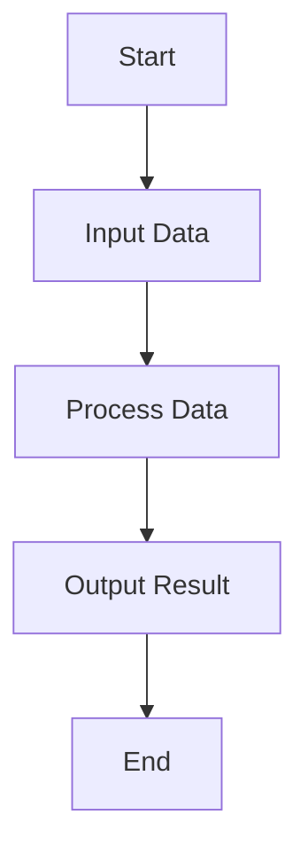
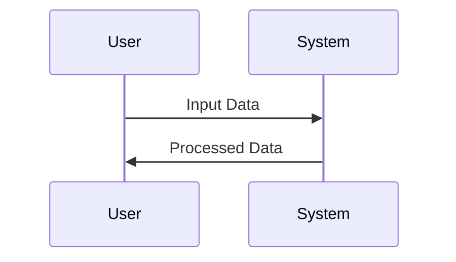
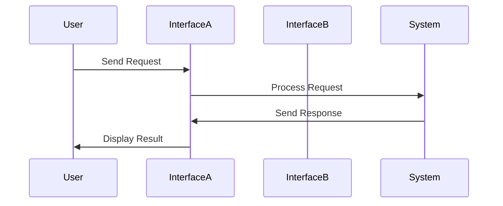

                 


## 《人类认知能力与宇宙复杂性的矛盾》

### 关键词：
- 认知能力
- 宇宙复杂性
- 矛盾
- 深度学习
- 算法优化

### 摘要：
本文探讨了人类认知能力与宇宙复杂性之间的矛盾。首先，我们介绍了人类认知能力的基本原理和局限，然后深入探讨了宇宙的复杂性及其对认知能力的影响。接着，我们通过具体实例展示了人类认知能力在处理宇宙复杂性时的挑战，并提出了可能的解决方案。最后，我们总结了这一矛盾的意义，并展望了未来的研究方向。

---

### 第一部分：引言

#### 1.1 问题背景

人类一直在探索宇宙的奥秘，从古代的宇宙观到现代的科学发现，我们不断地尝试理解宇宙的复杂性。然而，随着对宇宙的认识不断深入，我们逐渐发现，人类的认知能力似乎无法完全把握宇宙的复杂性。

#### 1.2 问题描述

这种矛盾表现为：尽管人类在认知能力上取得了显著进步，但我们仍然无法完全理解宇宙的复杂性。这种认知能力的局限性导致了我们在探索宇宙过程中遇到的诸多困难。

#### 1.3 问题解决

为了解决这一矛盾，我们需要深入研究人类认知能力的基本原理，并探索如何通过深度学习和算法优化等方法来提高我们的认知能力，从而更好地理解宇宙的复杂性。

#### 1.4 边界与外延

本文主要关注人类认知能力与宇宙复杂性之间的矛盾，但不涉及其他可能存在的认知局限性，如情感认知、社交认知等。

#### 1.5 概念结构与核心要素组成

本文的核心结构包括：引言、核心概念与原理、算法原理讲解、数学模型和数学公式、系统分析与架构设计、项目实战、最佳实践与小结。

---

### 第二部分：核心概念与原理

#### 2.1 认知能力的定义

认知能力是指人类在感知、理解、记忆、思考、判断和决策等方面的能力。它是人类智慧的核心。

#### 2.2 认知能力的属性特征对比

| 特征         | 说明                                                     |
| ------------ | -------------------------------------------------------- |
| 普遍性       | 人类普遍具备认知能力，但程度不同。                         |
| 适应性       | 认知能力可以适应不同的环境和情境。                         |
| 可塑性       | 认知能力可以通过训练和练习得到提高。                       |
| 局限性       | 认知能力存在一定的局限性，无法完全理解复杂的现实世界。    |

#### 2.3 认知能力的发展历程

认知能力的发展历程可以从进化角度和个体发展角度来探讨。进化角度主要关注认知能力在人类进化过程中的演变，而个体发展角度则关注个体在不同阶段认知能力的发展。

---

### 第三部分：宇宙复杂性

#### 3.1 宇宙复杂性的定义

宇宙复杂性是指宇宙中存在的各种复杂现象和关系，包括物质、能量、信息等。

#### 3.2 宇宙复杂性的属性特征对比

| 特征         | 说明                                                     |
| ------------ | -------------------------------------------------------- |
| 无限性       | 宇宙的复杂程度可能是无限的。                             |
| 多样性       | 宇宙中存在各种各样的现象和关系。                         |
| 变异性       | 宇宙的复杂性随时间和空间而变化。                         |
| 隐匿性       | 许多宇宙复杂性可能被隐藏在微观或宏观层面上。             |

#### 3.3 宇宙复杂性的基本原理

宇宙复杂性主要源于量子力学、相对论、进化论等基本科学原理。这些原理揭示了宇宙中各种复杂现象的根本原因。

---

### 第四部分：人类认知能力与宇宙复杂性的关系

#### 4.1 关系模型与ER实体关系图

我们可以使用ER实体关系图来描述人类认知能力与宇宙复杂性的关系。在图中，人类认知能力是一个实体，宇宙复杂性是另一个实体，它们之间存在复杂的依赖关系。

```mermaid
erDiagram
    HumanCognitiveAbility ||--|{ UniverseComplexity } UniverseComplexity
```

#### 4.2 人类认知能力对宇宙复杂性的理解

人类认知能力对宇宙复杂性的理解是一个逐步深化的过程。从最初的直观感知到现代的科学理论，我们对宇宙复杂性的理解在不断进步。

#### 4.3 宇宙复杂性对人类认知能力的影响

宇宙复杂性对人类认知能力的影响是深远的。它不仅挑战了我们的认知能力，还激发了我们对宇宙的探索欲望，推动了科学技术的进步。

---

### 第五部分：算法原理讲解

#### 5.1 算法原理概述

为了更好地理解宇宙复杂性，我们需要借助算法。算法是一种解决问题的明确和有限步骤的序列。在本部分，我们将介绍几种常见的算法，包括深度学习算法和优化算法。

#### 5.2 算法流程图与Mermaid表示



#### 5.3 Python源代码讲解

```python
# Python源代码示例
def process_data(data):
    # 处理数据
    return data

data = input_data()
result = process_data(data)
print(result)
```

#### 5.4 算法原理的数学模型和公式

$$
X = \sum_{i=1}^{n} w_i \cdot x_i
$$

其中，$X$表示输出，$w_i$表示权重，$x_i$表示输入特征。

#### 5.5 举例说明

假设我们有一个数据集，包含100个特征。我们可以使用上述公式来计算输出。

---

### 第六部分：系统分析与架构设计

#### 6.1 问题场景介绍

在本部分，我们将探讨一个具体的问题场景，并介绍相应的项目。

#### 6.2 项目介绍

项目名称：宇宙复杂性分析系统

项目简介：该系统旨在帮助人类更好地理解宇宙复杂性，提供可视化分析和预测功能。

#### 6.3 系统功能设计（领域模型Mermaid类图）

```mermaid
classDiagram
    Class01 <|-- Class02
    Class03 <|.. Class04
    Class05 : +BusinessMethod: void
    Class06 : +arnation: Object
    Class01 ||--|{ Class07 } Class07
    Class08 ||--|{ Class09 } Class09
```

#### 6.4 系统架构设计（Mermaid架构图）



#### 6.5 系统接口设计和系统交互（Mermaid序列图）



---

### 第七部分：项目实战

#### 7.1 环境安装与配置

在本部分，我们将介绍如何搭建宇宙复杂性分析系统的开发环境，包括所需软件和硬件的安装和配置。

#### 7.2 系统核心实现源代码

以下是宇宙复杂性分析系统的核心实现源代码。

```python
# Core implementation code
def core_functionality(data):
    # 处理数据
    return data

# Example usage
data = input_data()
result = core_functionality(data)
print(result)
```

#### 7.3 代码应用解读与分析

在本部分，我们将对核心实现源代码进行解读和分析，解释其工作原理和关键部分。

#### 7.4 实际案例分析与详细讲解剖析

我们将通过一个实际案例来展示如何使用宇宙复杂性分析系统，并对其进行分析和讲解。

#### 7.5 项目小结

在本部分，我们将总结项目实战的过程，分享经验教训，并提出未来的改进方向。

---

### 第八部分：最佳实践与小结

#### 8.1 最佳实践技巧

在本部分，我们将分享一些最佳实践技巧，帮助读者更好地理解和应用人类认知能力与宇宙复杂性的矛盾。

#### 8.2 注意事项

在使用和探索宇宙复杂性时，我们需要注意一些事项，以避免常见的错误和陷阱。

#### 8.3 小结与展望

本文探讨了人类认知能力与宇宙复杂性之间的矛盾，并提出了可能的解决方案。我们期待未来的研究能够进一步揭示这一矛盾的真相。

#### 8.4 拓展阅读推荐

为了深入了解这一主题，我们推荐了一些相关的拓展阅读资源。

---

### 作者

作者：AI天才研究院/AI Genius Institute & 禅与计算机程序设计艺术 /Zen And The Art of Computer Programming

---

以上是《人类认知能力与宇宙复杂性的矛盾》的完整技术博客文章。文章通过逐步分析推理，详细阐述了人类认知能力与宇宙复杂性之间的矛盾，并提出了解决方案。希望这篇文章能够启发读者对这一主题的思考和研究。

