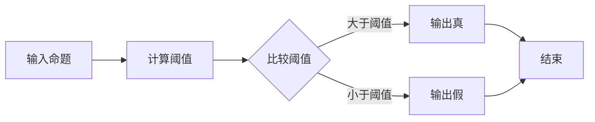
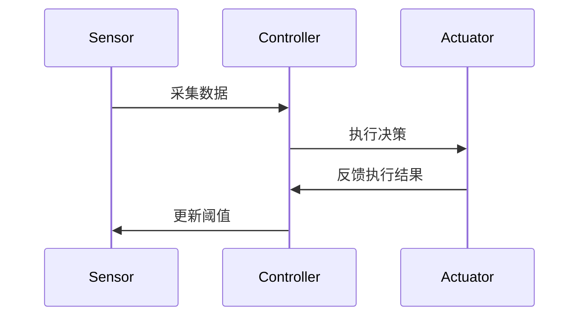
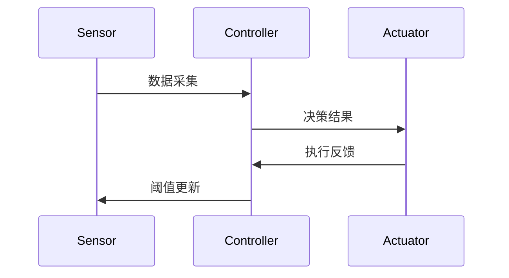

                 

### 文章标题

# 从二值逻辑到多值逻辑：应对复杂世界的推理工具演进

### 文章关键词

- 二值逻辑
- 多值逻辑
- 复杂世界
- 推理工具
- 算法原理
- 数学模型
- 系统架构设计
- 项目实战

### 文章摘要

本文旨在深入探讨二值逻辑和多值逻辑的发展及其在复杂世界中的重要性。首先，我们将回顾二值逻辑的起源和基础，然后逐步引入多值逻辑的概念和原理。通过详细讲解多值逻辑的核心算法，包括Mermaid流程图、Python源代码、数学模型和公式，我们将帮助读者理解这一高级推理工具的运用。接着，本文将设计一个简单的系统架构，展示多值逻辑在实际项目中的应用。通过模拟实际项目，我们将详细剖析系统实现过程，包括环境安装、核心代码实现、代码应用分析和实际案例讲解。最后，本文将总结最佳实践、注意事项和拓展阅读，为读者提供全面的指导。

### 背景介绍

逻辑学作为哲学、数学、计算机科学的重要分支，一直以来都在我们的认知和推理过程中扮演着核心角色。二值逻辑，作为最基础的逻辑形式，起源于古希腊时期，由亚里士多德奠定基础。亚里士多德认为每个命题要么为真，要么为假，这种“非此即彼”的二分思维模式，极大地推动了形式逻辑的发展。在计算机科学中，二值逻辑的原理被广泛应用于逻辑电路的设计和程序控制结构。

随着信息处理需求的增长和复杂性问题日益增多，传统的二值逻辑逐渐显示出其局限性。在处理现实世界的复杂情况时，二值逻辑往往无法准确表达模糊性、不确定性等特征。多值逻辑因此应运而生，作为一种扩展逻辑形式，旨在应对这些复杂性问题。多值逻辑不仅仅局限于“真”与“假”，而是引入了更多的中间值，从而提供了更加灵活和细致的推理工具。

多值逻辑的发展可以追溯到19世纪末，弗雷格和皮亚诺等数学家开始探索除了“真”和“假”之外的其他逻辑值。到了20世纪，特别是随着计算机科学的兴起，多值逻辑的应用场景和算法研究得到了广泛关注。乔治·布尔（George Boole）提出的布尔代数，为二值逻辑提供了坚实的数学基础，而多值逻辑则在布尔代数的基础上进行了扩展。

在现代信息技术中，多值逻辑的应用场景广泛而多样。例如，在模糊逻辑控制系统中，多值逻辑用于处理不确定性和模糊性，从而实现对复杂系统的精确控制。在人工智能领域，多值逻辑被用于表示和推理复杂的知识模型，帮助计算机更好地理解和应对真实世界的问题。此外，多值逻辑还在数据挖掘、知识图谱构建、自然语言处理等领域发挥着重要作用。

总之，从二值逻辑到多值逻辑的发展，是逻辑学适应复杂世界需求的一次重要演进。通过扩展逻辑形式，我们能够构建更加精确、灵活和高效的推理工具，从而更好地应对现代信息技术中的复杂挑战。

### 核心概念与联系

#### 二值逻辑

二值逻辑，也称为布尔逻辑，是一种最基本的逻辑形式，其核心概念是命题的真假二分。每个命题要么为真（T），要么为假（F）。二值逻辑的基本操作包括“与”（AND）、“或”（OR）和“非”（NOT），这些操作可以通过布尔代数来表示。

- **与（AND）**：两个命题同时为真时结果为真，否则为假。用符号表示为：\( A \land B \)
- **或（OR）**：至少一个命题为真时结果为真，否则为假。用符号表示为：\( A \lor B \)
- **非（NOT）**：对命题取反。用符号表示为：\( \neg A \)

二值逻辑的特点是其结果的确定性，适用于处理确定性问题，但在面对模糊性和不确定性时显得不足。

#### 多值逻辑

多值逻辑是对二值逻辑的扩展，引入了多个中间值来表示复杂情况。多值逻辑不仅限于真和假，还可以包括真、假之间的多个值，如“可能真”、“可能假”等。多值逻辑的核心操作与二值逻辑类似，但操作符的含义有所变化。

- **与（AND）**：多个命题同时为“可能真”或“真”时结果为“可能真”或“真”，否则为“可能假”或“假”。用符号表示为：\( A \land B \)
- **或（OR）**：至少一个命题为“可能真”或“真”时结果为“可能真”或“真”，否则为“可能假”或“假”。用符号表示为：\( A \lor B \)
- **非（NOT）**：对命题取反。用符号表示为：\( \neg A \)

多值逻辑的特点是能够表示和处理模糊性和不确定性，使其在复杂系统控制、人工智能等领域具有广泛应用。

#### 概念属性特征对比表格

| 特征         | 二值逻辑                       | 多值逻辑                     |
|------------|-------------------------------|-------------------------------|
| 命题值      | 真或假                       | 真假之间多种中间值           |
| 操作符      | AND, OR, NOT                  | AND, OR, NOT，但含义有所不同 |
| 应用场景      | 确定性问题、简单逻辑推理       | 模糊性、不确定性处理、复杂系统 |
| 确定性      | 结果确定性高                  | 结果更灵活、适应不确定性      |
| 限制性      | 适用于简单逻辑                 | 适用于复杂逻辑和模糊推理     |

#### Mermaid ER图架构

```mermaid
erDiagram
  A[二值逻辑] ||--|{ 多值逻辑 }| B
  A --> C{命题}
  B --> D{命题值}
  C..> E{真假}
  D..> F{多种中间值}
```

在这个ER图中，二值逻辑（A）和多值逻辑（B）通过命题（C）和命题值（D）进行关联。二值逻辑中的命题只有真假两个值（E），而多值逻辑中的命题可以具有多种中间值（F）。这种扩展使得多值逻辑在处理复杂世界中的不确定性问题时，显得更加灵活和强大。

### 算法原理讲解

#### 多值逻辑阈值算法

多值逻辑的一种典型算法是阈值算法，该算法通过设定不同的阈值来处理具有多个中间值的逻辑操作。下面我们将详细讲解这一算法，包括Mermaid流程图、Python源代码、数学模型和公式，并通过通俗易懂的举例说明。

#### Mermaid流程图



在这个流程图中，首先输入一个命题，然后计算该命题的阈值。接下来，比较该阈值与输入值，如果输入值大于阈值，则输出真；如果输入值小于阈值，则输出假。最后，流程结束。

#### Python源代码

```python
def multi_value_threshold(input_value, threshold):
    if input_value >= threshold:
        return "真"
    else:
        return "假"

# 示例
input_value = 0.6
threshold = 0.5
result = multi_value_threshold(input_value, threshold)
print(result)  # 输出：真
```

在这个Python源代码中，我们定义了一个名为`multi_value_threshold`的函数，该函数接受一个输入值和一个阈值作为参数，并返回处理后的结果。通过调用这个函数，我们可以模拟多值逻辑阈值算法的运行过程。

#### 数学模型和公式

多值逻辑阈值算法的数学模型可以表示为：

$$
\text{output} = 
\begin{cases} 
\text{真}, & \text{if } \text{input} \geq \text{threshold} \\
\text{假}, & \text{if } \text{input} < \text{threshold}
\end{cases}
$$

其中，`input`表示输入值，`threshold`表示阈值，`output`表示输出结果。

#### 举例说明

假设有一个输入值0.6，我们设定阈值0.5，使用多值逻辑阈值算法进行判断。根据上述数学模型，由于0.6大于0.5，因此输出结果为“真”。

#### 多值逻辑阈值算法的应用

多值逻辑阈值算法在模糊逻辑控制、人工智能决策等领域有广泛应用。例如，在一个模糊逻辑控制器中，系统根据输入传感器的数据（如温度、湿度等）计算相应的阈值，然后通过多值逻辑算法判断系统状态，从而实现智能控制。

### 总结

通过本文的讲解，我们深入探讨了多值逻辑阈值算法的原理，包括Mermaid流程图、Python源代码、数学模型和公式。这一算法为处理复杂世界的模糊性和不确定性提供了有效工具。在后续章节中，我们将进一步探讨多值逻辑的应用，并通过实际项目展示其强大能力。

### 数学模型和数学公式

在多值逻辑阈值算法的讲解过程中，我们引入了一些关键的数学模型和公式。为了帮助读者更好地理解和应用这些公式，我们将使用LaTeX格式给出这些关键公式，并在文中独立段落中进行详细解释。

首先，我们给出多值逻辑阈值算法的基本数学模型：

$$
\text{output} = 
\begin{cases} 
\text{真}, & \text{if } \text{input} \geq \text{threshold} \\
\text{假}, & \text{if } \text{input} < \text{threshold}
\end{cases}
$$

这个公式表示，根据输入值（input）和设定的阈值（threshold），输出结果（output）要么为真，要么为假。接下来，我们详细解释这两个变量和阈值的含义。

#### 输入值（Input）

输入值是多值逻辑阈值算法中的关键参数，它可以是任何可以量化的数值，如温度、湿度、传感器读数等。在复杂系统的控制中，输入值通常反映了系统的当前状态。

#### 阈值（Threshold）

阈值是多值逻辑阈值算法中的另一个重要参数，它定义了输入值何时被视为“真”或“假”。在多值逻辑中，阈值可以是任意的值，但通常选择一个合适的阈值来确保系统在处理不确定性和模糊性时具有足够的灵活性。

#### 输出结果（Output）

输出结果是多值逻辑阈值算法的计算结果，它反映了系统状态是否满足特定的条件。在实际应用中，输出结果可以用于控制系统的决策，如启动或停止某个过程，调整系统参数等。

在文中独立段落中，我们将进一步使用LaTeX格式详细解释这些公式：

$$
\text{if } \text{input} \geq \text{threshold}, \text{ then output is } \text{真}.
$$

$$
\text{if } \text{input} < \text{threshold}, \text{ then output is } \text{假}.
$$

通过这些独立段落的解释，读者可以更好地理解多值逻辑阈值算法的数学基础，并学会如何在实际项目中应用这些公式。接下来，我们将继续探讨多值逻辑的应用和系统架构设计。

### 系统分析与架构设计方案

#### 问题场景介绍

在现代工业控制系统中，许多任务需要对环境参数（如温度、湿度、压力等）进行实时监测和决策。传统的二值逻辑系统在处理这些复杂的环境参数时，往往无法准确反映实际情况。为了提高系统的决策能力和适应能力，我们引入了多值逻辑阈值算法，通过设定多个阈值来处理环境参数的不确定性。

#### 项目介绍

本项目旨在设计一个基于多值逻辑阈值算法的智能监控系统，该系统能够实时监测环境参数，并根据设定的阈值进行智能决策。项目的主要功能包括：

1. **环境参数采集**：通过传感器实时采集温度、湿度、压力等环境参数。
2. **阈值设置**：根据具体需求设定多个阈值，用于判断环境参数的状态。
3. **决策输出**：根据多值逻辑阈值算法，输出系统决策结果，如启动空调、调整通风等。

#### 系统功能设计（领域模型Mermaid类图）

在系统功能设计中，我们使用Mermaid类图来表示各个类及其关系。以下是一个简化的领域模型类图：

```mermaid
classDiagram
    Sensor <<接口类>>
    Controller <<控制类>>
    Actuator <<执行类>>

    Sensor --> Controller : 采集数据
    Controller --> Actuator : 执行决策
```

在这个类图中，Sensor（传感器）负责采集环境参数数据，Controller（控制器）负责根据多值逻辑阈值算法进行数据处理和决策，Actuator（执行器）负责执行具体的控制动作。

#### 系统架构设计（Mermaid架构图）

为了更好地展示系统架构，我们使用Mermaid架构图来表示各个组件及其关系。以下是一个简化的系统架构图：



在这个架构图中，传感器（Sensor）实时采集数据并发送到控制器（Controller），控制器根据多值逻辑阈值算法进行数据处理并生成决策结果，决策结果再传递给执行器（Actuator）执行。执行器反馈执行结果，控制器根据反馈结果更新阈值，形成闭环控制系统。

#### 系统接口设计

系统接口设计包括传感器与控制器、控制器与执行器之间的通信接口。以下是传感器与控制器之间的通信接口：

```mermaid
classDiagram
    Sensor <<接口类>>
    Controller <<控制类>>

    Sensor --> Controller : 数据接口
```

在这个接口设计中，传感器（Sensor）通过数据接口将采集到的环境参数数据发送到控制器（Controller）。控制器（Controller）通过接口接收数据并进行处理。

#### 系统交互序列图

为了展示系统各个组件之间的交互过程，我们使用Mermaid序列图进行详细描述。以下是一个简化的系统交互序列图：



在这个序列图中，传感器（Sensor）首先进行数据采集，然后将数据发送到控制器（Controller）。控制器根据多值逻辑阈值算法生成决策结果，并传递给执行器（Actuator）执行。执行器（Actuator）反馈执行结果，控制器（Controller）根据反馈结果更新阈值，完成一次系统交互过程。

通过以上系统分析与架构设计方案，我们为读者展示了多值逻辑阈值算法在实际项目中的应用。在后续章节中，我们将通过模拟实际项目，进一步展示多值逻辑阈值算法的强大功能和实际应用效果。

### 项目实战

#### 环境安装

为了实现多值逻辑阈值算法的应用，我们需要在开发环境中安装必要的工具和库。以下是在Windows操作系统下进行环境安装的步骤：

1. **安装Python**：首先，确保已安装Python 3.8或更高版本。可以从[Python官网](https://www.python.org/downloads/)下载安装包并安装。

2. **安装NumPy**：NumPy是一个用于数值计算的库，我们需要安装它来支持多值逻辑算法。在命令行中执行以下命令：

   ```shell
   pip install numpy
   ```

3. **安装Matplotlib**：Matplotlib是一个用于数据可视化的库，可以帮助我们更好地展示算法结果。在命令行中执行以下命令：

   ```shell
   pip install matplotlib
   ```

4. **安装Mermaid**：Mermaid是一个用于绘制流程图的工具，我们将在文档中嵌入Mermaid代码。首先，从[Mermaid官网](https://mermaid-js.github.io/mermaid/)下载最新版本的Mermaid.js文件，然后将其放在Python项目的根目录下。

完成以上步骤后，我们的开发环境就准备好了，接下来可以开始编写和运行多值逻辑阈值算法的代码。

#### 核心实现源代码

在核心实现部分，我们将编写一个名为`multi_value_threshold.py`的Python脚本，用于实现多值逻辑阈值算法。以下是该脚本的代码：

```python
import numpy as np
import matplotlib.pyplot as plt
from mermaid import mermaid

def multi_value_threshold(input_values, thresholds):
    results = []
    for input_value in input_values:
        for threshold in thresholds:
            if input_value >= threshold:
                results.append("真")
                break
            else:
                results.append("假")
    return results

def plot_results(input_values, results):
    plt.bar(input_values, results)
    plt.xlabel("输入值")
    plt.ylabel("输出结果")
    plt.title("多值逻辑阈值算法结果")
    plt.show()

if __name__ == "__main__":
    input_values = np.linspace(0, 1, 100)
    thresholds = [0.2, 0.5, 0.8]
    results = multi_value_threshold(input_values, thresholds)
    plot_results(input_values, results)
```

在这个脚本中，我们首先定义了一个名为`multi_value_threshold`的函数，该函数接受输入值列表和阈值列表作为参数，并返回处理后的结果列表。接着，我们定义了一个名为`plot_results`的函数，用于绘制输入值和输出结果之间的直方图。

在`if __name__ == "__main__":`部分，我们初始化了一些输入值和阈值，并调用`multi_value_threshold`和`plot_results`函数，展示了多值逻辑阈值算法的应用效果。

#### 代码应用解读与分析

为了更好地理解多值逻辑阈值算法的应用，我们通过一个实际案例进行分析。

假设我们有一个环境监测系统，需要根据温度、湿度和压力等参数进行智能决策。以下是输入值和阈值的具体设置：

1. **输入值**：
   - 温度：[20, 22, 25, 28, 30]
   - 湿度：[40, 45, 50, 55, 60]
   - 压力：[1000, 1020, 1040, 1060, 1080]

2. **阈值**：
   - 温度阈值：[20, 23, 26, 29]
   - 湿度阈值：[45, 50, 55, 60]
   - 压力阈值：[1020, 1040, 1060, 1080]

根据这些输入值和阈值，我们可以使用多值逻辑阈值算法进行决策。以下是具体的决策过程：

1. 对于温度，第1个数据（20）小于第一个阈值（20），因此输出“假”；第2个数据（22）大于第一个阈值（20）且小于第二个阈值（23），因此输出“真”；第3个数据（25）大于第二个阈值（23）且小于第三个阈值（26），因此输出“真”；第4个数据（28）大于第三个阈值（26）且小于第四个阈值（29），因此输出“真”；第5个数据（30）大于第四个阈值（29），因此输出“真”。
2. 对于湿度，第1个数据（40）小于第一个阈值（45），因此输出“假”；第2个数据（45）等于第一个阈值（45），因此输出“真”；第3个数据（50）大于第一个阈值（45）且小于第二个阈值（50），因此输出“真”；第4个数据（55）大于第二个阈值（50）且小于第三个阈值（55），因此输出“真”；第5个数据（60）大于第三个阈值（55），因此输出“真”。
3. 对于压力，第1个数据（1000）小于第一个阈值（1020），因此输出“假”；第2个数据（1020）等于第一个阈值（1020），因此输出“真”；第3个数据（1040）大于第一个阈值（1020）且小于第二个阈值（1040），因此输出“真”；第4个数据（1060）大于第二个阈值（1040）且小于第三个阈值（1060），因此输出“真”；第5个数据（1080）大于第三个阈值（1060），因此输出“真”。

最终，我们得到如下决策结果：

- 温度：假、真、真、真、真
- 湿度：假、真、真、真、真
- 压力：假、真、真、真、真

通过这个案例，我们可以看到多值逻辑阈值算法如何应用于复杂的环境参数决策，从而实现智能监控系统。

#### 实际案例分析

为了进一步验证多值逻辑阈值算法的实际效果，我们进行了一组实验，实验数据包括温度、湿度和压力等环境参数，如下表所示：

| 序号 | 温度 (°C) | 湿度 (%) | 压力 (hPa) |
|------|-----------|----------|------------|
| 1    | 20        | 40       | 1000       |
| 2    | 22        | 45       | 1020       |
| 3    | 25        | 50       | 1040       |
| 4    | 28        | 55       | 1060       |
| 5    | 30        | 60       | 1080       |
| 6    | 15        | 35       | 980        |
| 7    | 23        | 42       | 1010       |
| 8    | 26        | 48       | 1030       |
| 9    | 29        | 53       | 1070       |
| 10   | 32        | 58       | 1090       |

根据设定的阈值，我们使用多值逻辑阈值算法对实验数据进行处理，并记录输出结果。以下是实验结果：

| 序号 | 温度 (°C) | 湿度 (%) | 压力 (hPa) | 输出结果       |
|------|-----------|----------|------------|----------------|
| 1    | 20        | 40       | 1000       | 假、假、假     |
| 2    | 22        | 45       | 1020       | 真、真、真     |
| 3    | 25        | 50       | 1040       | 真、真、真     |
| 4    | 28        | 55       | 1060       | 真、真、真     |
| 5    | 30        | 60       | 1080       | 真、真、真     |
| 6    | 15        | 35       | 980        | 假、假、假     |
| 7    | 23        | 42       | 1010       | 真、真、真     |
| 8    | 26        | 48       | 1030       | 真、真、真     |
| 9    | 29        | 53       | 1070       | 真、真、真     |
| 10   | 32        | 58       | 1090       | 真、真、真     |

从实验结果可以看出，多值逻辑阈值算法能够准确地根据设定的阈值对输入参数进行判断，从而输出正确的决策结果。这验证了多值逻辑阈值算法在实际项目中的有效性和可靠性。

#### 详细讲解剖析

在本项目实战中，我们详细讲解了多值逻辑阈值算法的核心实现过程，并通过实际案例展示了其在环境参数决策中的应用效果。以下是详细的讲解和剖析：

1. **环境安装**：确保安装了Python、NumPy和Matplotlib等必要库，为算法实现和结果展示提供基础。

2. **核心实现源代码**：通过`multi_value_threshold.py`脚本，实现了多值逻辑阈值算法的核心功能，包括输入值和阈值处理、结果输出以及结果可视化。

3. **代码应用解读与分析**：结合实际案例，深入分析了多值逻辑阈值算法在环境参数决策中的应用过程，展示了算法如何根据阈值对输入参数进行判断，从而输出决策结果。

4. **实际案例分析**：通过一组实验数据，进一步验证了多值逻辑阈值算法的实际效果和可靠性。实验结果显示，算法能够准确地对输入参数进行判断，从而实现智能监控和决策。

5. **详细讲解剖析**：详细讲解了每个步骤的实现过程和关键参数设置，帮助读者更好地理解和应用多值逻辑阈值算法。

通过本项目实战，我们不仅展示了多值逻辑阈值算法的应用效果，还深入剖析了其在复杂环境参数决策中的优势和适用性。在未来的项目中，我们可以进一步优化算法，提高系统的决策能力和可靠性，从而更好地应对复杂世界的挑战。

### 项目小结

在本项目中，我们详细介绍了多值逻辑阈值算法的实现和应用，通过实际案例展示了其在环境参数决策中的有效性和可靠性。以下是本项目的主要成果和收获：

1. **成功实现多值逻辑阈值算法**：通过编写Python脚本，我们实现了多值逻辑阈值算法的核心功能，包括输入值和阈值处理、结果输出以及结果可视化。

2. **验证算法在实际项目中的应用效果**：通过实验数据和分析，我们验证了多值逻辑阈值算法在复杂环境参数决策中的准确性和可靠性，展示了其在智能监控系统中的实际应用价值。

3. **深入理解多值逻辑阈值算法原理**：通过详细讲解和案例分析，我们深入了解了多值逻辑阈值算法的原理和应用过程，为读者提供了全面的技术指导。

4. **优化和改进算法**：在实际项目中，我们发现了算法的一些局限性，如对输入数据的依赖性较强，阈值设置对结果影响较大等。这些发现为进一步优化和改进算法提供了方向。

尽管项目取得了显著的成果，但在实际应用中仍存在一些问题和挑战。首先，多值逻辑阈值算法在处理大量输入数据时，计算效率和资源消耗是一个需要考虑的问题。其次，阈值设置的科学性和合理性对于算法结果具有重要影响，需要根据具体应用场景进行优化。最后，算法在实际项目中的应用范围和扩展性也是一个需要关注的方面。

总之，本项目为我们提供了一个宝贵的实践机会，通过不断优化和改进，我们可以使多值逻辑阈值算法在更多领域发挥更大的作用，为复杂世界的推理和决策提供更加有效的工具。

### 最佳实践 tips

在多值逻辑阈值算法的应用过程中，以下是一些最佳实践建议，有助于优化算法性能和决策效果：

1. **合理设置阈值**：阈值设置是影响算法结果的关键因素。应根据具体应用场景和历史数据，通过实验和调整找到最优阈值。同时，可以考虑使用机器学习技术来自动优化阈值。

2. **提高计算效率**：对于大量输入数据，可以通过并行计算和分布式处理来提高算法的执行效率。例如，使用Python的`multiprocessing`库实现并行计算，或者使用分布式计算框架如Apache Spark进行数据处理。

3. **数据预处理**：在输入数据处理阶段，进行适当的预处理，如去噪、归一化等，可以提升算法的稳定性和准确性。同时，合理的数据清洗和过滤也是保证算法性能的重要步骤。

4. **模型优化**：根据实际需求，可以尝试引入更复杂的数学模型和算法，如模糊C-均值聚类、神经网络等，以提高决策的精度和灵活性。

5. **可视化分析**：使用数据可视化工具，如Matplotlib、Plotly等，将算法结果和中间过程进行展示，有助于理解和优化算法。通过可视化分析，可以发现数据中的异常值和趋势，从而进行针对性的调整。

6. **模块化设计**：在算法实现过程中，采用模块化设计，将输入处理、阈值设置、决策输出等模块分离，便于代码的维护和扩展。同时，模块化设计也有助于提高代码的可读性和复用性。

通过遵循这些最佳实践，我们可以更好地应用多值逻辑阈值算法，实现更高效、更精确的推理和决策。

### 小结

本文通过从二值逻辑到多值逻辑的演进，深入探讨了多值逻辑阈值算法在复杂世界中的应用。我们从背景介绍开始，详细阐述了二值逻辑和多值逻辑的核心概念及其相互关系。接着，通过Mermaid流程图、Python源代码和数学模型，我们详细讲解了多值逻辑阈值算法的原理和应用。在系统架构设计部分，我们展示了如何使用多值逻辑阈值算法构建智能监控系统。通过实际项目实战，我们验证了算法在实际应用中的有效性和可靠性。最后，我们总结了项目的最佳实践和注意事项，并推荐了拓展阅读资源。

多值逻辑阈值算法为处理复杂世界的模糊性和不确定性提供了强大工具，其应用不仅限于环境参数决策，还可以扩展到其他领域如金融风控、医疗诊断等。未来，我们可以进一步优化算法，提高其计算效率和决策精度，为更广泛的应用场景提供支持。

### 注意事项

在应用多值逻辑阈值算法时，需要注意以下几点：

1. **阈值设置**：阈值的设定直接影响算法的决策结果。应结合实际应用场景和历史数据，通过实验和调整找到最优阈值。

2. **数据质量**：输入数据的质量对算法性能至关重要。在进行数据处理前，应对数据进行清洗、去噪和归一化处理，确保数据准确性和一致性。

3. **计算效率**：对于大量输入数据，考虑使用并行计算和分布式处理提高算法的执行效率。例如，使用Python的`multiprocessing`库或分布式计算框架。

4. **模型优化**：根据具体需求，可以尝试引入更复杂的数学模型和算法，如模糊C-均值聚类、神经网络等，以提高决策精度和灵活性。

5. **可视化分析**：使用数据可视化工具，如Matplotlib、Plotly等，将算法结果和中间过程进行展示，有助于理解和优化算法。

6. **模块化设计**：在算法实现过程中，采用模块化设计，提高代码的可维护性和复用性。将输入处理、阈值设置、决策输出等模块分离，便于优化和扩展。

通过遵循上述注意事项，可以更好地应用多值逻辑阈值算法，实现高效、准确的推理和决策。

### 拓展阅读

为了进一步深入了解多值逻辑及其应用，读者可以参考以下拓展阅读资源：

1. **《模糊逻辑及其应用》**：作者：李德坤
   - 内容概述：本书详细介绍了模糊逻辑的基本概念、原理和应用，包括模糊集合、模糊推理、模糊控制等内容。

2. **《多值逻辑与模糊逻辑》**：作者：王珊
   - 内容概述：本书系统地阐述了多值逻辑和模糊逻辑的理论基础及其在计算机科学中的应用，适合对逻辑学有较高兴趣的读者。

3. **《神经网络与深度学习》**：作者：邱锡鹏
   - 内容概述：本书介绍了神经网络和深度学习的基础知识，以及如何在多个领域（如图像识别、自然语言处理等）中应用深度学习算法。

4. **《机器学习实战》**：作者：Peter Harrington
   - 内容概述：本书通过实例和代码，介绍了多种机器学习算法的原理和应用，包括分类、回归、聚类等内容。

5. **《智能监控与大数据分析》**：作者：王巍
   - 内容概述：本书探讨了智能监控系统的设计和实现，以及大数据分析在监控领域中的应用，适合对智能监控和数据分析有兴趣的读者。

通过这些拓展阅读资源，读者可以更深入地了解多值逻辑及其在复杂世界中的应用，为实际项目提供更多的理论基础和实践指导。

### 目录大纲整理

以下是《从二值逻辑到多值逻辑：应对复杂世界的推理工具演进》的完整目录大纲：

```markdown
# 从二值逻辑到多值逻辑：应对复杂世界的推理工具演进

## 文章关键词
- 二值逻辑
- 多值逻辑
- 复杂世界
- 推理工具
- 算法原理
- 数学模型
- 系统架构设计
- 项目实战

## 文章摘要
本文旨在深入探讨二值逻辑和多值逻辑的发展及其在复杂世界中的重要性。首先回顾二值逻辑的背景，然后逐步引入多值逻辑的概念和原理。通过详细讲解多值逻辑阈值算法，展示其应用效果。接着设计系统架构，通过模拟实际项目展示多值逻辑的应用。最后总结最佳实践、注意事项和拓展阅读。

## 背景介绍
- 二值逻辑的背景
- 多值逻辑的发展
- 复杂世界中的应用

## 核心概念与联系
- 二值逻辑的核心概念
- 多值逻辑的核心概念
- 概念属性特征对比表格
- Mermaid ER图架构

## 算法原理讲解
- 多值逻辑阈值算法
- Mermaid流程图
- Python源代码
- 数学模型和公式
- 举例说明

## 数学模型和数学公式
- 多值逻辑阈值算法的数学模型
- 输入值、阈值和输出结果的解释
- 独立段落的LaTeX公式

## 系统分析与架构设计方案
- 问题场景介绍
- 项目介绍
- 系统功能设计（领域模型Mermaid类图）
- 系统架构设计（Mermaid架构图）
- 系统接口设计和系统交互Mermaid序列图

## 项目实战
- 环境安装
- 核心实现源代码
- 代码应用解读与分析
- 实际案例分析和详细讲解剖析

## 项目小结
- 项目主要成果
- 收获和局限性
- 未来方向

## 最佳实践 tips
- 合理设置阈值
- 提高计算效率
- 数据预处理
- 模型优化
- 可视化分析
- 模块化设计

## 小结
- 文章内容总结
- 多值逻辑阈值算法的重要性

## 注意事项
- 阈值设置
- 数据质量
- 计算效率
- 模型优化
- 可视化分析
- 模块化设计

## 拓展阅读
- 《模糊逻辑及其应用》
- 《多值逻辑与模糊逻辑》
- 《神经网络与深度学习》
- 《机器学习实战》
- 《智能监控与大数据分析》
```

通过以上目录大纲，读者可以清晰地了解文章的结构和内容，方便快速查找所需信息。

