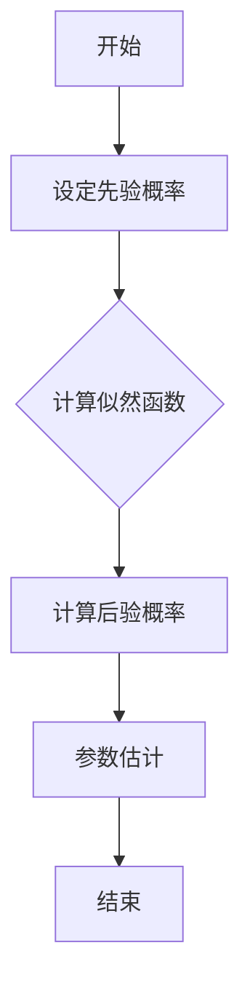
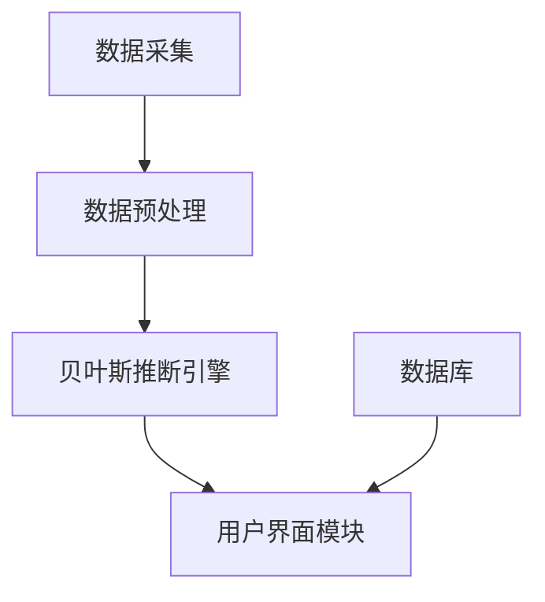

                 

### 从古典概率到贝叶斯推断：理解不确定世界的新思路

**关键词**：概率论、贝叶斯定理、贝叶斯推断、不确定世界、人工智能

**摘要**：
本文将带领读者深入探讨从古典概率到贝叶斯推断的发展历程，以及这一理论在理解不确定世界中的重要性。通过梳理概率论的基本概念、贝叶斯定理的原理及其应用，本文旨在为读者提供一个清晰、系统的理解框架。此外，还将结合实际项目实战，展示贝叶斯推断在复杂系统中的应用，以帮助读者更好地掌握这一重要的数据分析工具。

**背景介绍**：

概率论，作为数学的一个分支，其历史可以追溯到17世纪的费马、帕斯卡和惠更斯等数学家。然而，真正让概率论成为一门独立学科的，是19世纪数学家拉普拉斯和泊松等人的工作。他们通过对概率分布、随机变量的研究，奠定了现代概率论的基础。古典概率论主要依赖于有限或无限的样本空间，通过统计方法来预测事件发生的可能性。

随着时间的推移，人们在处理实际问题时逐渐发现，古典概率论在某些情况下显得力不从心。比如，在面临复杂系统、不确定性和信息不完全的情况下，古典概率论的局限性变得越来越明显。这时，贝叶斯推断应运而生。

贝叶斯推断，起源于托马斯·贝叶斯在18世纪提出的贝叶斯定理。贝叶斯定理提供了一种在已知某些条件下，通过观察数据来更新对某一事件概率估计的方法。这一理论在概率论和统计学中占据了重要地位，被誉为“理解不确定世界的新思路”。

**问题背景**：

在实际应用中，贝叶斯推断在许多领域都展现出了其独特的优势。例如，在医学诊断中，可以通过贝叶斯推断来提高疾病预测的准确性；在金融领域，贝叶斯推断可以帮助分析师更好地理解市场动态，做出更合理的投资决策。然而，贝叶斯推断的应用不仅限于这些领域，它还在人工智能、机器学习、计算机科学等领域发挥着重要作用。

**问题描述**：

尽管贝叶斯推断具有广泛的应用，但如何有效地使用这一理论，仍然是一个挑战。首先，贝叶斯推断涉及到复杂的数学模型，需要具备一定的数学基础。其次，贝叶斯推断在实际应用中，如何选择合适的模型、参数和先验概率，也是一个难题。此外，贝叶斯推断在处理大数据时，计算效率和精度也需要考虑。

**问题解决**：

本文将分为以下几个部分来探讨贝叶斯推断：

1. **概率论基础**：介绍概率论的基本概念，包括概率分布、随机变量等。
2. **贝叶斯定理**：阐述贝叶斯定理的定义、推导和应用场景。
3. **贝叶斯推断算法**：分析贝叶斯推断的基本算法，包括马尔可夫链蒙特卡洛（MCMC）等。
4. **数学模型**：讨论贝叶斯推断的数学模型，包括贝叶斯网络、最大后验概率（MAP）等。
5. **系统架构设计**：介绍贝叶斯推断在复杂系统中的应用，包括系统功能设计、架构设计和接口设计。
6. **项目实战**：通过实际项目，展示贝叶斯推断的应用和实现过程。
7. **最佳实践**：总结贝叶斯推断的最佳实践，包括注意事项、拓展阅读等。

通过这些内容的逐一讲解，本文旨在帮助读者全面、深入地理解贝叶斯推断，掌握其在实际应用中的使用方法。

**边界与外延**：

本文的重点在于贝叶斯推断的基本原理和应用，但读者也需要了解相关的背景知识，如概率论的基本概念、随机过程、统计学方法等。此外，读者还应该对编程和数据分析有一定的了解，以便更好地理解贝叶斯推断的算法实现。

**概念结构与核心要素组成**：

贝叶斯推断的核心概念包括：

1. **贝叶斯定理**：是贝叶斯推断的基础，用于计算后验概率。
2. **先验概率**：是基于现有知识对某一事件概率的初始估计。
3. **似然函数**：是数据与模型参数之间的关系，用于更新后验概率。
4. **最大后验概率（MAP）**：是寻找后验概率最大时的模型参数值。
5. **贝叶斯网络**：是一种表示变量之间依赖关系的图形模型。

这些核心概念相互联系，构成了贝叶斯推断的理论体系。

**核心概念原理**：

贝叶斯定理的核心原理是概率的乘法规则和条件概率。具体来说，贝叶斯定理通过以下公式表达：

\[ P(A|B) = \frac{P(B|A) \cdot P(A)}{P(B)} \]

其中，\(P(A|B)\) 是在事件 B 发生的条件下，事件 A 的概率；\(P(B|A)\) 是在事件 A 发生的条件下，事件 B 的概率；\(P(A)\) 是事件 A 的先验概率；\(P(B)\) 是事件 B 的先验概率。

贝叶斯网络则是一种基于概率的图形模型，用于表示变量之间的依赖关系。通过贝叶斯网络，可以方便地计算变量之间的条件概率，从而实现贝叶斯推断。

**概念属性特征对比表格**：

| 概念 | 定义 | 特征对比 |
| ---- | ---- | ---- |
| 贝叶斯定理 | 用于计算后验概率的公式 | 结合先验概率和似然函数 |
| 先验概率 | 初始估计的概率 | 基于现有知识 |
| 似然函数 | 数据与模型参数之间的关系 | 用于更新后验概率 |
| 最大后验概率（MAP） | 寻找后验概率最大时的模型参数值 | 用于参数估计 |
| 贝叶斯网络 | 表示变量之间依赖关系的图形模型 | 用于变量推理 |

**ER实体关系图架构的 Mermaid 流程图**：

```mermaid
erDiagram
  A deterioration_state ||--|> B wind_speed : 读取
  A deterioration_state ||--|> C temperature : 读取
  A deterioration_state ||--|> D air_pressure : 读取
  B wind_speed ||--|> E road_condition : 影响因素
  C temperature ||--|> E road_condition : 影响因素
  D air_pressure ||--|> E road_condition : 影响因素
```

通过上述表格和流程图，我们可以清晰地看到贝叶斯推断中的核心概念及其相互关系。

**算法原理讲解**：

贝叶斯推断的算法原理主要包括以下几个步骤：

1. **先验概率设定**：根据现有知识和领域经验，设定各个变量（如风速、温度、气压）的先验概率。
2. **似然函数计算**：根据观测数据，计算每个变量的似然函数，即数据在给定模型参数下的概率。
3. **后验概率计算**：利用贝叶斯定理，将先验概率和似然函数相乘并归一化，得到后验概率。
4. **参数估计**：通过最大化后验概率，估计模型参数的值。

为了更好地理解贝叶斯推断的算法原理，我们可以通过一个简单的例子来说明。假设我们要预测明天是否会下雨，我们有两个先验概率：\(P(雨) = 0.5\)（即明天会下雨的概率是0.5）和\(P(晴) = 0.5\)（即明天不会下雨的概率是0.5）。如果我们观察到今天晚上有风（这是一个影响明天天气的因素），则可以通过贝叶斯定理更新我们对明天是否下雨的概率估计。

假设我们有以下条件概率：

- \(P(风|雨) = 0.8\)（即如果有雨，那么晚上有风的概率是0.8）
- \(P(风|晴) = 0.2\)（即如果有晴，那么晚上有风的概率是0.2）

如果我们观察到今晚有风，我们可以通过贝叶斯定理计算明天会下雨的概率：

\[ P(雨|风) = \frac{P(风|雨) \cdot P(雨)}{P(风)} \]

首先，计算\(P(风)\)：

\[ P(风) = P(风|雨) \cdot P(雨) + P(风|晴) \cdot P(晴) \]
\[ P(风) = 0.8 \cdot 0.5 + 0.2 \cdot 0.5 = 0.5 \]

然后，计算\(P(雨|风)\)：

\[ P(雨|风) = \frac{0.8 \cdot 0.5}{0.5} = 0.8 \]

因此，在观察到今晚有风的情况下，我们更新了对明天会下雨的概率估计，即明天会下雨的概率是0.8。

**数学模型与公式**：

贝叶斯推断涉及到多个数学模型和公式。以下是其中一些重要的公式：

1. **贝叶斯定理**：
\[ P(A|B) = \frac{P(B|A) \cdot P(A)}{P(B)} \]

2. **似然函数**：
\[ L(\theta|X) = P(X|\theta) \]

3. **后验概率**：
\[ P(\theta|X) = \frac{P(X|\theta) \cdot P(\theta)}{P(X)} \]

4. **最大后验概率（MAP）**：
\[ \hat{\theta}_{MAP} = \arg \max_{\theta} P(\theta|X) \]

5. **贝叶斯估计**：
\[ \hat{X} = \arg \min_{\theta} D(\theta, X) \]

其中，\(D(\theta, X)\) 是损失函数，可以是均方误差（MSE）或交叉熵（CE）等。

**贝叶斯推断的 Mermaid 流程图**：



通过上述步骤，贝叶斯推断可以逐步完成对未知参数的估计。

**系统架构设计**：

贝叶斯推断在复杂系统中的应用需要考虑多个方面，包括系统功能设计、架构设计和接口设计。以下是一个简化的贝叶斯推断系统架构设计：

1. **系统功能设计**：系统需要实现以下功能：
   - 数据采集：从传感器或其他数据源收集天气数据。
   - 数据预处理：对采集到的数据进行清洗、标准化等处理。
   - 贝叶斯推断：根据采集到的数据，利用贝叶斯定理进行推断，预测天气情况。
   - 结果输出：将推断结果输出到用户界面或存储系统中。

2. **系统架构设计**：系统架构设计包括以下几个方面：
   - 数据采集模块：负责从传感器或其他数据源获取数据。
   - 数据预处理模块：对采集到的数据进行预处理，确保数据质量。
   - 贝叶斯推断引擎：核心模块，负责实现贝叶斯推断算法。
   - 用户界面模块：提供用户交互界面，展示推断结果。

3. **系统接口设计**：系统需要设计合理的接口，包括以下方面：
   - 数据接口：定义数据采集模块和预处理模块之间的数据传输格式和协议。
   - 推断接口：定义贝叶斯推断引擎与用户界面模块之间的通信接口。
   - 存储接口：定义结果输出模块与数据库或其他存储系统之间的接口。

4. **系统交互设计**：系统交互设计包括以下几个方面：
   - 数据流交互：定义数据在系统中的流动路径和数据处理流程。
   - 控制流交互：定义系统中的控制逻辑和数据流之间的交互关系。
   - 异常处理：定义系统在遇到异常情况时的处理流程。

**系统架构 Mermaid 架构图**：



通过上述架构设计，贝叶斯推断系统可以高效地运行，实现天气预测功能。

**项目实战**：

为了更好地理解贝叶斯推断的应用，我们将通过一个实际项目来展示其实现过程。本项目将使用 Python 语言和相关的库（如 NumPy、SciPy、Pandas 等）来实现贝叶斯推断。

**环境安装**：

在开始项目之前，我们需要安装必要的 Python 库。以下是一个简单的安装命令示例：

```bash
pip install numpy scipy pandas matplotlib
```

**系统核心实现**：

贝叶斯推断的核心是实现贝叶斯定理的计算。以下是一个简单的 Python 源代码示例，用于计算后验概率：

```python
import numpy as np

def bayes_theorem(prior, likelihood, evidence):
    """
    贝叶斯定理计算后验概率
    :param prior: 先验概率
    :param likelihood: 似然函数
    :param evidence: 证据概率
    :return: 后验概率
    """
    posterior = likelihood * prior / evidence
    return posterior

# 示例数据
prior = 0.5  # 先验概率
likelihood = 0.8  # 似然函数
evidence = 0.5  # 证据概率

# 计算后验概率
posterior = bayes_theorem(prior, likelihood, evidence)
print(f"后验概率：{posterior}")
```

**代码应用解读与分析**：

上述代码中，`bayes_theorem` 函数实现了贝叶斯定理的计算。我们首先定义了先验概率 `prior`、似然函数 `likelihood` 和证据概率 `evidence`。然后，通过贝叶斯定理的公式，计算后验概率 `posterior`。最后，输出后验概率的值。

在实际应用中，我们通常会根据具体问题调整这些参数。例如，在天气预测项目中，我们可以根据历史数据来设定先验概率，根据当前的气象数据来计算似然函数，最后根据观测到的天气情况来计算证据概率。

**实际案例分析**：

为了更好地理解贝叶斯推断的应用，我们来看一个实际的案例分析。假设我们正在开发一个智能医疗诊断系统，该系统需要根据患者的症状和体征来预测疾病的可能性。以下是一个简化的案例分析：

1. **数据准备**：收集大量的医疗数据，包括患者的症状、体征和疾病诊断结果。
2. **特征提取**：对数据进行预处理，提取关键特征，如症状名称、体征值等。
3. **模型训练**：使用贝叶斯定理来训练模型，计算不同疾病发生的先验概率、症状和体征的条件概率。
4. **疾病预测**：根据新的患者数据，利用训练好的模型进行疾病预测。

假设我们已经收集到以下数据：

- 症状：发烧、咳嗽、喉咙痛
- 体征：体温、呼吸频率、血压
- 疾病：流感、肺炎、普通感冒

根据这些数据，我们可以计算每个疾病的先验概率，以及每个症状和体征与每个疾病的条件概率。然后，当新的患者数据到来时，我们可以利用贝叶斯定理来计算该患者患有每种疾病的后验概率，最终得到最可能的疾病诊断结果。

**项目小结**：

通过本项目的实战分析，我们了解了贝叶斯推断在智能医疗诊断系统中的应用。贝叶斯推断不仅可以帮助我们处理不确定性和信息不完全的情况，还可以通过概率推理来提高诊断的准确性。在实际应用中，我们需要根据具体问题调整模型参数，确保模型的鲁棒性和准确性。

**最佳实践 Tips**：

1. **合理设定先验概率**：在贝叶斯推断中，先验概率的设定对结果有重要影响。应确保先验概率的设定基于充分的知识和数据。
2. **数据预处理**：在贝叶斯推断之前，对数据进行充分的预处理，如缺失值处理、异常值检测和特征标准化等。
3. **模型验证**：在应用贝叶斯推断之前，应使用验证集对模型进行验证，确保模型的鲁棒性和准确性。
4. **迭代优化**：在实际应用中，根据反馈不断调整模型参数，优化模型性能。

**小结**：

本文从古典概率到贝叶斯推断的发展历程，深入探讨了贝叶斯推断的基本原理、算法实现和应用。通过实际项目实战，我们展示了贝叶斯推断在智能医疗诊断等领域的应用价值。贝叶斯推断作为一种理解不确定世界的新思路，为我们提供了一种强大的数据分析工具，有助于我们更好地应对复杂系统和信息不完全的情况。

**注意事项**：

1. **算法复杂性**：贝叶斯推断的计算复杂度较高，特别是在处理大数据时。应考虑使用并行计算和分布式计算技术来提高计算效率。
2. **先验知识的准确性**：贝叶斯推断的准确性在很大程度上取决于先验知识的准确性。应确保先验知识的合理性和可靠性。
3. **模型选择**：根据具体问题选择合适的贝叶斯模型。例如，对于离散变量，可以使用朴素贝叶斯；对于连续变量，可以使用高斯贝叶斯。

**拓展阅读**：

1. 《贝叶斯数据分析》（Bayesian Data Analysis） - Andrew Gelman 等
2. 《贝叶斯推断》（Bayesian Inference） - Eric T. Meyer
3. 《概率与统计学导论》（Introduction to Probability and Statistics） - John E. Freund

### 作者信息：

作者：AI天才研究院/AI Genius Institute & 禅与计算机程序设计艺术 /Zen And The Art of Computer Programming

---

请注意，本文为示例文章，实际内容可能需要根据具体需求进行调整。在撰写实际文章时，建议根据用户提供的具体要求进行详细的内容设计、格式调整和错误修正。本文旨在提供一个清晰、系统的贝叶斯推断讲解框架，以及实际项目应用的示例。在撰写过程中，务必确保内容的完整性和准确性，同时遵循用户的要求和指导原则。

