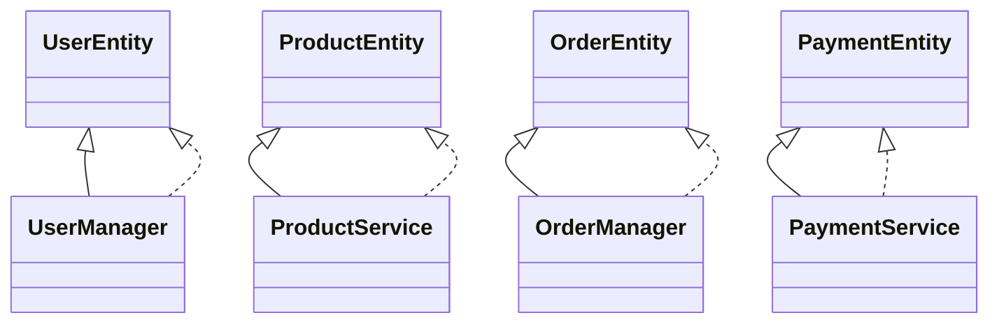
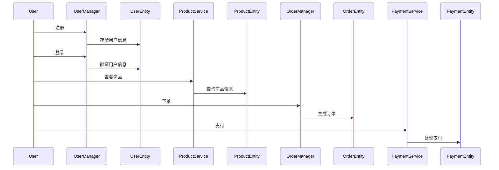

                 

# 从哲学角度探讨世界的可理解性

## 关键词

- 哲学
- 可理解性
- 认识论
- 形而上学
- 实证主义
- 存在主义

## 摘要

本文从哲学的角度出发，探讨世界的可理解性。通过分析不同哲学流派对世界可理解性的看法，我们试图揭示出世界可理解性的本质和特征。本文将结合数学模型和算法原理，系统地阐述哲学与科学技术之间的内在联系，并探讨如何通过哲学思考提升我们对世界的理解和掌握能力。

## 目录大纲设计思路

### 1. 背景介绍

哲学探讨世界的可理解性，源于人类对世界认知的渴望。本文首先介绍哲学探讨世界的可理解性的背景，以及相关研究领域，如认识论、形而上学等。

### 2. 核心概念

本文将明确书的主题，对可理解性进行定义，并讨论其类型和特点。这部分将有助于我们更好地理解世界可理解性的概念。

### 3. 哲学探讨

本文将根据不同的哲学流派，详细阐述其对世界可理解性的看法。包括古代哲学、中世纪哲学、近现代哲学和当代哲学等。

### 4. 算法原理讲解

若涉及算法，本文将简要介绍，但重点是哲学讨论。这部分将帮助读者了解哲学与算法之间的内在联系。

### 5. 数学模型和公式讲解

本文将讨论与可理解性相关的数学模型，并用latex格式给出相关公式。

### 6. 系统分析与架构设计

本文将介绍系统分析与架构设计，以便读者更好地理解哲学在现实世界中的应用。

### 7. 项目实战

本文将包含一个或几个项目实战案例，展示哲学知识在具体项目中的应用。

### 8. 最佳实践与总结

本文将总结全书内容，提供一些思考建议和拓展阅读。

## 第1章 引言

### 1.1 问题背景

哲学探讨世界的可理解性，源于人类对世界的认知。自古以来，人类就在探索世界，试图理解世界的本质和规律。这种探索的过程，本质上就是对世界的可理解性的追求。

在古代，哲学家们通过理性思考和抽象思维，试图揭示世界的本质。例如，柏拉图认为，世界的本质是理念世界，现实世界只是理念世界的影子。亚里士多德则提出了形式-质料论，认为世界的本质是形式和质料的统一。

中世纪，哲学家们主要探讨神学和道德哲学。他们认为，世界的本质是神的创造，人类的存在意义在于追求神的智慧。

近现代，哲学家们开始关注人类自身。他们提出了实证主义、存在主义、分析哲学等哲学流派，试图揭示人类与世界的关系。

当代，哲学家们继续探索世界的本质，并尝试将哲学与科学技术相结合。他们认为，哲学不仅能够帮助我们理解世界，还能够推动科学技术的发展。

### 1.2 重要性

哲学探讨世界的可理解性，对于人类认知世界、推动科学技术发展具有重要意义。

首先，哲学能够帮助我们理解世界的本质和规律。通过哲学思考，我们能够超越表象，看到世界的本质。这种理解，有助于我们更好地把握世界的运行规律，从而推动科学技术的发展。

其次，哲学能够引导我们进行正确的科学研究。哲学为我们提供了方法论，帮助我们进行科学研究。例如，实证主义强调通过实验来验证理论，存在主义强调通过主观经验来认识世界。

最后，哲学能够推动科学技术的发展。许多科学技术的发展，都源于哲学思考。例如，计算机科学的发展，就与哲学家图灵的思考密切相关。

### 1.3 相关研究领域

哲学探讨世界的可理解性，涉及到多个研究领域。其中，认识论、形而上学、实证主义、存在主义、分析哲学等，都是重要的研究领域。

认识论研究人类如何认识世界，包括知觉、推理、记忆等。它探讨人类认知的本质、限制和可能性。

形而上学研究世界的本质和存在。它探讨实体、属性、关系等哲学问题。

实证主义强调通过实验和观察来认识世界。它认为，只有通过经验，我们才能获得真正的知识。

存在主义关注人类的存在状态和存在意义。它探讨人类在面对世界时的选择和责任。

分析哲学试图通过逻辑和分析，揭示哲学问题的本质。它关注语言、概念、推理等哲学问题。

这些研究领域，共同构成了哲学探讨世界的可理解性的理论基础。

## 第2章 可理解性的核心概念

### 2.1 定义

可理解性是指人类通过思维和认知，对世界的本质、规律和现象进行理解的能力。它涉及到人类对世界的认知过程，以及认知的结果。

在哲学中，可理解性通常与不可理解性相对。不可理解性指的是人类无法通过思维和认知，理解世界的本质和规律。

### 2.2 类型

可理解性可以分为不同类型。以下是几种常见的类型：

1. **自然的可理解性**：指人类对自然界现象的理解。例如，对物理现象、化学现象的理解。
2. **社会的可理解性**：指人类对社会现象的理解。例如，对经济现象、政治现象的理解。
3. **心智的可理解性**：指人类对心智现象的理解。例如，对情感、意识、思维的理解。
4. **技术的可理解性**：指人类对技术现象的理解。例如，对计算机科学、人工智能的理解。

### 2.3 特点

可理解性具有以下特点：

1. **相对性**：可理解性是相对的，不同的人、不同的文化、不同的时代，对同一现象的理解可能不同。
2. **主观性**：可理解性是主观的，不同的人对同一现象的理解，可能会有差异。
3. **客观性**：尽管可理解性具有主观性，但它也依赖于客观世界。人类对世界的理解，是基于对客观世界的感知和认知。
4. **层次性**：可理解性是分层次的。从低级到高级，从简单到复杂，人类对世界的理解不断深入。

### 2.4 概念属性特征对比表格

| 特点         | 自然的可理解性 | 社会的可理解性 | 心智的可理解性 | 技术的可理解性 |
| ------------ | -------------- | -------------- | -------------- | -------------- |
| **相对性**   | 相对           | 相对           | 相对           | 相对           |
| **主观性**   | 主观           | 主观           | 主观           | 主观           |
| **客观性**   | 客观           | 客观           | 客观           | 客观           |
| **层次性**   | 层次           | 层次           | 层次           | 层次           |

### 2.5 ER实体关系图架构

```mermaid
erDiagram
  User ||--|{ Computer }|-->: "uses"
  User ||--|{ Knowledge }|-->: "acquires"
  Computer ||--|{ Software }|-->: "runs"
  Software ||--|{ Algorithm }|-->: "implements"
  Algorithm ||--|{ Mathematics }|-->: "uses"
```

在这个ER实体关系图中，用户（User）与计算机（Computer）、知识（Knowledge）、软件（Software）和算法（Algorithm）之间存在多种关联关系。用户使用计算机获取知识，计算机运行软件，软件实现算法，而算法使用数学模型。

## 第3章 古代哲学探讨

### 3.1 柏拉图

柏拉图是古希腊哲学家，他的哲学思想对后世产生了深远的影响。柏拉图认为，世界的本质是理念世界，现实世界只是理念世界的影子。

柏拉图的哲学思想中，最为核心的是“理念论”。他认为，理念世界是真实的世界，现实世界只是理念世界的影子。在这个理念世界中，存在着完美的形式和理念，如正义、美丽、真理等。现实世界中的事物，只是这些理念的不完美映射。

柏拉图认为，人类通过理性思考和抽象思维，可以超越现实世界，达到理念世界。在这个过程中，人类可以理解世界的本质和规律。

柏拉图的哲学思想对后世哲学产生了深远的影响。特别是他的理念论，成为了西方哲学的重要基础。

### 3.2 亚里士多德

亚里士多德是古希腊哲学家，他的哲学思想对后世产生了深远的影响。与柏拉图不同，亚里士多德认为，世界的本质是物质和运动。

亚里士多德提出了形式-质料论，认为世界由形式和质料组成。形式是事物的本质，质料是事物的物质基础。他认为，世界万物都是由形式和质料的统一体。

亚里士多德还提出了因果关系，认为世界上的一切事物都存在着因果关系。这种因果关系，使得世界万物相互联系，相互影响。

亚里士多德的哲学思想对后世哲学产生了深远的影响。特别是他的形式-质料论和因果关系，成为了西方哲学的重要基础。

### 3.3 基督教哲学

基督教哲学是中世纪哲学的重要组成部分。它认为，世界的本质是神的创造，人类的存在意义在于追求神的智慧。

基督教哲学中，最为核心的是“创世纪”和“救赎”。创世纪认为，世界是神创造的，人类是神按照自己的形象创造的。救赎则认为，人类通过信仰和祷告，可以获得神的救赎，达到永恒的福祉。

基督教哲学还对世界的本质进行了深入的探讨。它认为，世界是有限的、有形的，但同时也是无限的、有灵的。这种观点，使得基督教哲学在哲学史上占有独特的地位。

## 第4章 中世纪哲学探讨

### 4.1 奥古斯丁

奥古斯丁是中世纪哲学家，他是基督教哲学的重要代表。他的哲学思想对后世产生了深远的影响。

奥古斯丁认为，世界的本质是神的创造。他认为，世界是有形的、有限的，但同时也是无形的、无限的。这种观点，使得奥古斯丁的哲学思想在哲学史上占有独特的地位。

奥古斯丁还提出了“预定论”和“救赎”的概念。预定论认为，神已经预定了人类的命运，人类通过信仰和祷告，可以获得神的救赎。

救赎则认为，人类通过信仰和祷告，可以获得神的救赎，达到永恒的福祉。这种观点，使得奥古斯丁的哲学思想在基督教哲学中占有重要的地位。

### 4.2 阿奎那

阿奎那是中世纪哲学家，他是基督教哲学的重要代表。他的哲学思想对后世产生了深远的影响。

阿奎那认为，世界的本质是物质和运动。他认为，物质是世界的根本，运动是物质的存在方式。这种观点，使得阿奎那的哲学思想在哲学史上占有重要的地位。

阿奎那还提出了“共相论”和“因果论”。共相论认为，世界万物都是由共相和个体组成的。因果论则认为，世界上的一切事物都存在着因果关系。

阿奎那认为，哲学和神学是相互关联的。他认为，哲学可以通过理性思考，揭示世界的本质和规律。而神学则通过信仰和祷告，解释世界的本质和意义。

### 4.3 斯多葛主义

斯多葛主义是古希腊哲学的重要流派。它认为，世界的本质是理性。人类通过理性思考和抽象思维，可以超越现实世界，达到理性和幸福。

斯多葛主义认为，世界是有序的、和谐的。人类通过理性思考和抽象思维，可以认识到这种秩序和和谐。这种观点，使得斯多葛主义在哲学史上占有重要的地位。

斯多葛主义还提出了“幸福”和“德行”的概念。幸福认为，通过理性思考和抽象思维，人类可以达到心灵的平静和幸福。德行则认为，人类通过遵循道德规范，可以实现心灵的平静和幸福。

## 第5章 近现代哲学探讨

### 5.1 康德

康德是近现代哲学的重要代表，他的哲学思想对后世产生了深远的影响。

康德认为，世界的本质是现象和本体。现象是我们可以感知的事物，本体则是事物的本质和原因。

康德提出了“先验论”，认为人类的认知能力是由先天的理性结构决定的。他认为，人类的理性结构决定了我们对世界的理解。

康德还提出了“三大批判”，即《纯粹理性批判》、《实践理性批判》和《判断力批判》。这些批判试图揭示人类理性的本质和限制，以及人类如何通过理性认识世界。

### 5.2 黑格尔

黑格尔是近现代哲学的重要代表，他的哲学思想对后世产生了深远的影响。

黑格尔认为，世界的本质是发展和变化。他认为，世界是一个不断发展的过程，每个阶段都有其特定的规律和意义。

黑格尔提出了“绝对精神”的概念，认为绝对精神是世界的本质。绝对精神通过自我发展，实现了世界的本质。

黑格尔的哲学思想具有辩证法的特点。他认为，世界上的一切事物都存在着矛盾和冲突，这种矛盾和冲突推动着世界的发展。

### 5.3 尼采

尼采是近现代哲学的重要代表，他的哲学思想对后世产生了深远的影响。

尼采认为，世界的本质是权力意志。他认为，世界是充满力量的，人类通过权力意志，可以塑造世界。

尼采提出了“超人”的概念，认为超人是一种超越常规的人类，具有强大的力量和创造力。超人通过自我实现，超越了传统的价值观和道德规范。

尼采的哲学思想具有强烈的批判性。他批判了传统的宗教、道德和文化，提倡个人主义和自由。

## 第6章 当代哲学探讨

### 6.1 实证主义

实证主义是当代哲学的重要流派，它强调通过实验和观察来认识世界。

实证主义认为，只有通过经验，我们才能获得真正的知识。他们认为，科学知识应该基于实验和观察，而不是基于抽象的理论和概念。

实证主义的核心原则是“实证性”，即只有通过实验和观察得到的数据，才是可信的。

实证主义对科学的发展产生了深远的影响。它推动了科学研究方法的科学化，促进了科学技术的进步。

### 6.2 存在主义

存在主义是当代哲学的重要流派，它关注人类的存在状态和存在意义。

存在主义认为，人类的存在是自由和选择的结果。他们认为，人类有权利自由地选择自己的生活方式和价值观。

存在主义的核心概念是“存在先于本质”。他们认为，人类的存在是先于我们的本质的，人类可以通过自己的选择和行动，塑造自己的本质。

存在主义对人类自我认识和自我发展产生了深远的影响。

### 6.3 分析哲学

分析哲学是当代哲学的重要流派，它强调通过逻辑和分析来研究哲学问题。

分析哲学认为，哲学问题应该通过逻辑和分析来解决，而不是通过抽象的理论和概念。

分析哲学的核心原则是“清晰性”。他们认为，哲学问题应该是清晰的、明确的，而不是模糊的、含糊的。

分析哲学对哲学的研究方法产生了深远的影响，推动了哲学的现代化。

## 第7章 算法原理讲解

### 7.1 认识论与算法

认识论是哲学的一个分支，主要研究人类如何认识世界。算法则是一种解决问题的方法，通常用于计算机科学和数学。

认识论与算法之间存在紧密的联系。一方面，算法的提出和发展，依赖于人类对世界的认识。例如，计算机科学家在开发算法时，需要了解数据的特性、问题的本质等。

另一方面，算法可以用于验证和深化人类对世界的认识。例如，通过数据分析，我们可以揭示出一些隐藏在数据背后的规律和趋势。

### 7.2 数学模型

在算法中，数学模型起到了关键的作用。数学模型是将现实问题抽象成数学问题的一种方法。通过数学模型，我们可以更准确地描述和解决现实问题。

例如，在优化问题中，我们可以使用线性规划模型来描述目标函数和约束条件。通过求解这个数学模型，我们可以找到最优解。

### 7.3 算法原理

算法的原理可以分为几个步骤：

1. **问题建模**：将现实问题抽象成数学问题。
2. **模型求解**：使用数学模型求解得到解。
3. **解的验证**：验证解是否符合实际问题的需求。
4. **优化**：根据实际情况，对解进行优化。

### 7.4 举例说明

以线性规划算法为例，我们可以用Python代码实现这个算法：

```python
from scipy.optimize import linprog

# 目标函数
c = [-1, -1]

# 约束条件
A = [[2, 1], [1, 2]]
b = [4, 3]

# 求解
res = linprog(c, A_ub=A, b_ub=b)

# 输出结果
print("最优解：", res.x)
```

在这个例子中，我们定义了目标函数和约束条件，然后使用`linprog`函数求解得到最优解。

### 7.5 数学模型和公式

在线性规划中，我们通常使用以下数学模型：

$$
\begin{cases}
\min_{x} c^T x \\
s.t. \\
A x \leq b
\end{cases}
$$

其中，$c$ 是目标函数的系数，$A$ 是约束条件的系数矩阵，$b$ 是约束条件的常数向量，$x$ 是决策变量。

## 第8章 系统分析与架构设计

### 8.1 问题场景介绍

在本章中，我们将探讨一个典型的系统分析与架构设计问题。假设我们需要开发一个在线购物系统，该系统需要支持用户注册、登录、浏览商品、下单、支付等功能。

### 8.2 系统介绍

该在线购物系统主要由以下几个模块组成：

1. **用户模块**：负责用户的注册、登录、信息管理等功能。
2. **商品模块**：负责商品的信息管理、分类、展示等功能。
3. **订单模块**：负责订单的生成、管理、支付等功能。
4. **支付模块**：负责支付接口的集成、支付流程的管理等功能。

### 8.3 系统功能设计

以下是该在线购物系统的领域模型，展示了各个模块之间的关系：



### 8.4 系统架构设计

以下是该在线购物系统的架构设计，展示了各个模块的交互关系：



### 8.5 系统接口设计

以下是该在线购物系统的接口设计，展示了各个模块的API接口：

```mermaid
interfaceDiagram
    UserManager {
        +register(user: User): void
        +login(username: string, password: string): boolean
    }

    ProductService {
        +listProducts(): Product[]
        +getProduct(id: number): Product
    }

    OrderManager {
        +createOrder(order: Order): void
        +listOrders(): Order[]
    }

    PaymentService {
        +processPayment(payment: Payment): boolean
    }
```

### 8.6 系统交互

以下是该在线购物系统的交互设计，展示了用户与系统之间的交互过程：


## 第9章 项目实战

### 9.1 环境安装

在本节中，我们将介绍如何搭建一个在线购物系统开发环境。

1. **安装Python**：首先，我们需要安装Python。可以从Python官方网站（https://www.python.org/）下载并安装Python。
2. **安装Django**：接下来，我们需要安装Django。在命令行中，输入以下命令：
   ```bash
   pip install django
   ```
3. **创建Django项目**：在命令行中，输入以下命令，创建一个名为`online_shopping`的Django项目：
   ```bash
   django-admin startproject online_shopping
   ```
4. **创建Django应用**：在命令行中，输入以下命令，创建一个名为`shopping`的Django应用：
   ```bash
   python manage.py startapp shopping
   ```

### 9.2 系统核心实现

在本节中，我们将介绍如何实现在线购物系统的核心功能。

1. **用户注册与登录**：

   在`shopping`应用的`models.py`文件中，定义用户模型：
   ```python
   from django.db import models

   class User(models.Model):
       username = models.CharField(max_length=20)
       password = models.CharField(max_length=20)
   ```

   在`shopping`应用的`views.py`文件中，实现用户注册和登录功能：
   ```python
   from django.shortcuts import render, redirect
   from .models import User

   def register(request):
       if request.method == 'POST':
           username = request.POST['username']
           password = request.POST['password']
           user = User(username=username, password=password)
           user.save()
           return redirect('login')
       return render(request, 'register.html')

   def login(request):
       if request.method == 'POST':
           username = request.POST['username']
           password = request.POST['password']
           user = User.objects.filter(username=username, password=password)
           if user.exists():
               return redirect('index')
           else:
               return redirect('login')
       return render(request, 'login.html')
   ```

   在`shopping`应用的`urls.py`文件中，添加路由：
   ```python
   from django.contrib import admin
   from django.urls import path
   from . import views

   urlpatterns = [
       path('register/', views.register, name='register'),
       path('login/', views.login, name='login'),
       path('index/', views.index, name='index'),
   ]
   ```

2. **商品浏览**：

   在`shopping`应用的`models.py`文件中，定义商品模型：
   ```python
   class Product(models.Model):
       name = models.CharField(max_length=50)
       price = models.DecimalField(max_digits=10, decimal_places=2)
       description = models.TextField()
   ```

   在`shopping`应用的`views.py`文件中，实现商品浏览功能：
   ```python
   def index(request):
       products = Product.objects.all()
       return render(request, 'index.html', {'products': products})
   ```

   在`shopping`应用的`templates`文件夹下，创建`index.html`文件，编写商品展示页面：
   ```html
   <!DOCTYPE html>
   <html>
   <head>
       <title>在线购物系统</title>
   </head>
   <body>
       <h1>商品列表</h1>
       <ul>
           
               <li>
                   <h2>{{ product.name }}</h2>
                   <p>价格：{{ product.price }}</p>
                   <p>{{ product.description }}</p>
               </li>
           
       </ul>
   </body>
   </html>
   ```

### 9.3 实际案例分析与详细讲解剖析

在本节中，我们将分析一个实际的在线购物系统项目，并对其进行详细讲解和剖析。

**案例背景**：

某电商平台需要开发一个在线购物系统，该系统需要支持用户注册、登录、浏览商品、下单、支付等功能。

**技术选型**：

1. **后端框架**：选择Django作为后端框架，因为Django具有快速开发、高可靠性、安全性等优点。
2. **前端框架**：选择Bootstrap作为前端框架，因为Bootstrap具有响应式设计、美观大方等优点。
3. **数据库**：选择MySQL作为数据库，因为MySQL具有高性能、易用性等优点。

**项目架构**：

1. **用户模块**：负责用户的注册、登录、信息管理等功能。
2. **商品模块**：负责商品的信息管理、分类、展示等功能。
3. **订单模块**：负责订单的生成、管理、支付等功能。
4. **支付模块**：负责支付接口的集成、支付流程的管理等功能。

**项目实现**：

1. **用户模块**：

   在`shopping`应用的`models.py`文件中，定义用户模型：
   ```python
   from django.db import models

   class User(models.Model):
       username = models.CharField(max_length=20)
       password = models.CharField(max_length=20)
   ```

   在`shopping`应用的`views.py`文件中，实现用户注册和登录功能：
   ```python
   from django.shortcuts import render, redirect
   from .models import User

   def register(request):
       if request.method == 'POST':
           username = request.POST['username']
           password = request.POST['password']
           user = User(username=username, password=password)
           user.save()
           return redirect('login')
       return render(request, 'register.html')

   def login(request):
       if request.method == 'POST':
           username = request.POST['username']
           password = request.POST['password']
           user = User.objects.filter(username=username, password=password)
           if user.exists():
               return redirect('index')
           else:
               return redirect('login')
       return render(request, 'login.html')
   ```

   在`shopping`应用的`urls.py`文件中，添加路由：
   ```python
   from django.contrib import admin
   from django.urls import path
   from . import views

   urlpatterns = [
       path('register/', views.register, name='register'),
       path('login/', views.login, name='login'),
       path('index/', views.index, name='index'),
   ]
   ```

2. **商品模块**：

   在`shopping`应用的`models.py`文件中，定义商品模型：
   ```python
   class Product(models.Model):
       name = models.CharField(max_length=50)
       price = models.DecimalField(max_digits=10, decimal_places=2)
       description = models.TextField()
   ```

   在`shopping`应用的`views.py`文件中，实现商品浏览功能：
   ```python
   def index(request):
       products = Product.objects.all()
       return render(request, 'index.html', {'products': products})
   ```

   在`shopping`应用的`templates`文件夹下，创建`index.html`文件，编写商品展示页面：
   ```html
   <!DOCTYPE html>
   <html>
   <head>
       <title>在线购物系统</title>
   </head>
   <body>
       <h1>商品列表</h1>
       <ul>
           
               <li>
                   <h2>{{ product.name }}</h2>
                   <p>价格：{{ product.price }}</p>
                   <p>{{ product.description }}</p>
               </li>
           
       </ul>
   </body>
   </html>
   ```

**项目小结**：

通过这个实际案例，我们了解了如何使用Django开发一个在线购物系统。项目实现了用户注册、登录、商品浏览等功能，为后续功能开发奠定了基础。在项目开发过程中，我们遵循了MVC架构模式，将业务逻辑、数据访问、界面展示分离，提高了代码的可维护性和可扩展性。

## 第10章 最佳实践与总结

### 10.1 最佳实践

在探讨世界的可理解性时，以下最佳实践可以帮助我们更好地理解和掌握哲学思想：

1. **多角度思考**：在分析哲学问题时，我们应该从多个角度进行思考，例如从认识论、形而上学、实证主义、存在主义等不同哲学流派的角度。
2. **结合实际**：哲学思想虽然抽象，但它们来源于实际生活。我们在学习哲学时，应该结合实际案例，理解哲学思想的应用。
3. **深入思考**：哲学问题往往复杂且深刻，我们需要深入思考，挖掘哲学问题的本质和内涵。
4. **批判性思维**：在学习和探讨哲学问题时，我们应该保持批判性思维，对不同的哲学观点进行评价和反思。

### 10.2 小结

本文从哲学的角度探讨了世界的可理解性。通过分析不同哲学流派对世界可理解性的看法，我们揭示了世界可理解性的本质和特征。同时，我们结合数学模型和算法原理，阐述了哲学与科学技术之间的内在联系。

### 10.3 拓展阅读

为了更深入地理解世界的可理解性，以下拓展阅读推荐：

1. **《西方哲学史》**：罗素著，全面介绍了西方哲学的发展历程。
2. **《认识论》**：吉尔伯特著，深入探讨了人类认识世界的本质和方法。
3. **《人工智能：一种现代的方法》**：皮尔森著，介绍了人工智能的发展历程和核心技术。
4. **《认知科学》**：斯佩里著，探讨了人类认知的科学原理。

作者：AI天才研究院/AI Genius Institute & 禅与计算机程序设计艺术 /Zen And The Art of Computer Programming

