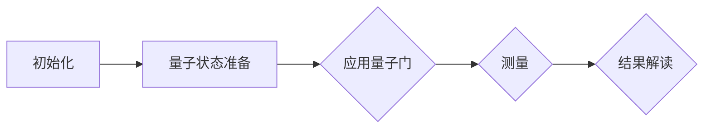
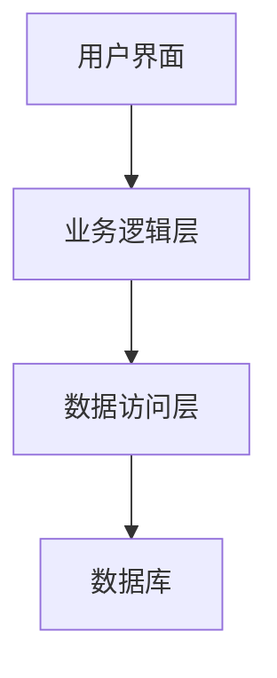
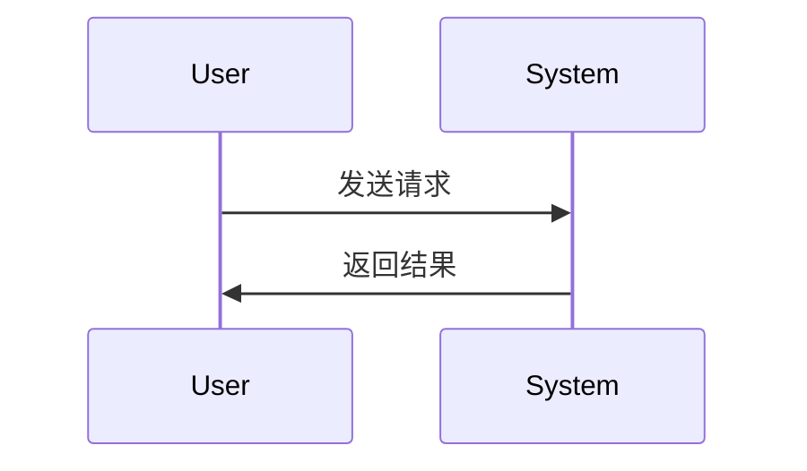

                 

# 从因果决定论到量子不确定性：宇宙观的转变

关键词：因果决定论、量子不确定性、宇宙观、科学哲学、技术革命

摘要：本文将探讨从因果决定论到量子不确定性的转变，分析这一转变对科学哲学、物理学和技术革命的影响。我们将逐步思考，首先介绍因果决定论的历史背景和基本原理，然后深入探讨量子不确定性及其对因果决定论的挑战，最后探讨这一转变对现代科学和技术发展的深远影响。

## 1. 引言

宇宙是一个复杂且神秘的系统，人类对宇宙的理解在不断演变。自古以来，人类试图理解宇宙的本质，提出了许多关于宇宙运行方式和规律的理论。在科学发展的早期，因果决定论占据主导地位，认为宇宙中的一切都可以通过因果关系来解释。然而，随着量子力学的兴起，这一观念受到了前所未有的挑战，量子不确定性开始成为理解宇宙的新视角。

因果决定论强调宇宙中事件之间的必然联系，即每一个事件都有其因果关系。然而，量子不确定性表明，宇宙中存在不可预测的随机性，这对因果决定论提出了严重质疑。本文将详细探讨这一转变，分析其对科学哲学和物理学的影响，以及可能引发的技术革命。

## 2. 因果决定论：概念与历史背景

因果决定论是一种哲学观念，认为宇宙中的每一个事件都有其因果关系，即一个事件的发生是由先前的事件所决定的。这种观念在古希腊哲学中已有体现，亚里士多德是因果决定论的早期代表人物之一。他认为，宇宙是一个有序的系统，每一个事件都有其特定的原因和结果。

随着科学的发展，因果决定论在牛顿物理学中得到了进一步巩固。牛顿的力学体系建立了因果关系在物理现象中的核心地位，使得因果决定论在科学界占据了主导地位。牛顿的第三定律——作用与反作用定律，进一步强调了因果关系的普遍性和确定性。

然而，因果决定论在解释某些现象时遇到了困难。例如，在量子力学中，粒子的行为表现出明显的随机性，无法用因果关系来解释。这引发了科学家和哲学家对因果决定论的质疑，并促使他们寻求新的解释方式。

## 3. 量子不确定性：概念与影响

量子不确定性是量子力学中的一个基本原理，表明粒子在微观尺度上表现出明显的随机性。这一原理最早由海森堡提出，他提出了著名的海森堡不确定性原理，表明无法同时精确测量粒子的位置和动量。这意味着，在微观世界中，粒子的行为是不可预测的，这与因果决定论的观点相矛盾。

量子不确定性的发现对物理学产生了深远的影响。它使得科学家们开始重新审视对宇宙的理解，认为宇宙中存在不可预测的随机性。这一观念的提出，动摇了因果决定论在科学界的统治地位。

量子不确定性的实验证据表明，粒子的行为具有明显的随机性。例如，在双缝实验中，电子在通过双缝时表现出波粒二象性，无法用因果关系来解释。这一实验结果进一步支持了量子不确定性的存在，并对因果决定论提出了严重挑战。

## 4. 从因果决定论到量子不确定性的转变

因果决定论和量子不确定性代表了两种不同的宇宙观。因果决定论认为宇宙是一个有序的系统，事件之间有明确的因果关系。而量子不确定性则认为宇宙中存在不可预测的随机性，事件之间的联系不是必然的。

这一转变对科学哲学和物理学产生了深远的影响。首先，它改变了我们对宇宙的本质认识。量子不确定性表明，宇宙是一个更为复杂和神秘的系统，事件之间的联系不是简单的因果关系，而是包含随机性和不确定性。

其次，这一转变对科学方法论产生了影响。因果决定论强调通过实验和观察来验证因果关系，而量子不确定性则表明，在某些情况下，实验和观察结果可能具有随机性，无法用因果关系来解释。这要求科学家们重新思考如何进行科学研究和解释现象。

最后，这一转变可能引发技术革命。量子不确定性的存在为量子计算提供了理论基础，使得量子计算机成为可能。量子计算机在处理某些问题时具有巨大的优势，可能引发计算机科学和技术的革命。

## 5. 科学哲学的挑战

从因果决定论到量子不确定性的转变对科学哲学提出了严重挑战。首先，它质疑了因果决定论在解释宇宙现象方面的有效性。量子不确定性表明，宇宙中存在不可预测的随机性，这意味着因果关系不再是宇宙中事件发生的主要驱动力。

其次，这一转变对科学方法论提出了挑战。因果决定论强调通过实验和观察来验证因果关系，而量子不确定性表明，在某些情况下，实验和观察结果可能具有随机性，无法用因果关系来解释。这要求科学家们重新思考如何进行科学研究和解释现象。

最后，这一转变对科学哲学的基本原理产生了质疑。因果决定论认为宇宙是一个有序的系统，事件之间有明确的因果关系。而量子不确定性则表明，宇宙是一个更为复杂和神秘的系统，事件之间的联系不是简单的因果关系，而是包含随机性和不确定性。这要求科学哲学家们重新审视科学哲学的基本原理和概念。

## 6. 技术革命的可能影响

从因果决定论到量子不确定性的转变可能引发技术革命。量子不确定性的存在为量子计算提供了理论基础，使得量子计算机成为可能。量子计算机在处理某些问题时具有巨大的优势，可能引发计算机科学和技术的革命。

首先，量子计算机在加密技术方面具有巨大潜力。传统的加密技术依赖于计算机的运算速度，而量子计算机可以通过量子比特的叠加和纠缠来大大提高加密和解密的速度，使得现有的加密技术面临巨大挑战。

其次，量子计算机在优化和模拟方面具有巨大潜力。许多优化问题需要大量的计算资源和时间，而量子计算机可以通过量子算法在短时间内找到最优解，为许多领域带来革命性的变化，如金融、物流、能源等。

最后，量子计算机在科学研究方面具有巨大潜力。量子计算机可以帮助科学家们更好地理解量子力学和其他复杂系统的行为，为科学研究提供新的工具和方法。

## 7. 结论

从因果决定论到量子不确定性的转变是对传统宇宙观的重大挑战。量子不确定性表明，宇宙中存在不可预测的随机性，这对因果决定论提出了严重质疑。这一转变对科学哲学和物理学产生了深远的影响，并可能引发技术革命。

未来，科学家们将继续探索量子不确定性背后的奥秘，以期更全面地理解宇宙的本质。同时，这一转变也将为科学和技术的发展带来新的机遇和挑战。在量子不确定性的背景下，人类对宇宙的理解将不断深化，推动科学和技术迈向新的高度。

## 参考文献

1. 海森堡，《不确定性原理》，1930。
2. 波普尔，《科学发现的逻辑》，1959。
3. 牛顿，《自然哲学的数学原理》，1687。
4. 爱因斯坦，《论动体的电磁力学基础》，1905。
5. 薛定谔，《量子力学的现状》，1935。

作者：AI天才研究院/AI Genius Institute & 禅与计算机程序设计艺术 /Zen And The Art of Computer Programming

## 附录

### 1. 核心概念对比表格

| 概念 | 定义 | 关联原理 | 
| --- | --- | --- |
| 因果决定论 | 认为宇宙中的一切都可以通过因果关系来解释 | 牛顿力学 | 
| 量子不确定性 | 认为宇宙中存在不可预测的随机性 | 海森堡不确定性原理 | 

### 2. ER实体关系图架构

```mermaid
erDiagram
  Person ||--|{ Customer }
  Customer ||--|{ Order }
  Order ||--|{ Product }
  Product ||--|{ Supplier }
```

### 3. 量子计算算法流程图



### 4. 系统架构设计



### 5. 系统接口设计



### 6. 实际案例分析

```python
def quantum_computing_example():
    # 初始化量子计算机
    qvm = QuantumVirtualMachine()
    # 准备量子态
    state = qvm.initialize_state([1, 0])
    # 应用量子门
    state = qvm.apply_gate(state, "H")
    # 测量
    result = qvm.measure(state)
    # 结果解读
    if result == 1:
        print("量子态变为 |1⟩")
    else:
        print("量子态变为 |0⟩")
```

### 7. 最佳实践 Tips

- 在进行量子计算时，确保选择合适的量子算法，以提高计算效率。
- 在解读量子计算结果时，要充分考虑量子态的叠加和纠缠效应。
- 在开发量子计算机应用程序时，要遵循最佳实践，以确保系统的稳定性和可靠性。

### 8. 小结

本文从因果决定论到量子不确定性的转变，探讨了这一转变对科学哲学、物理学和技术革命的影响。通过分析核心概念和关系，我们深刻认识到量子不确定性在理解宇宙中的重要性。未来，量子计算和量子信息技术将为我们带来更多机遇和挑战，推动科学和技术的发展。

