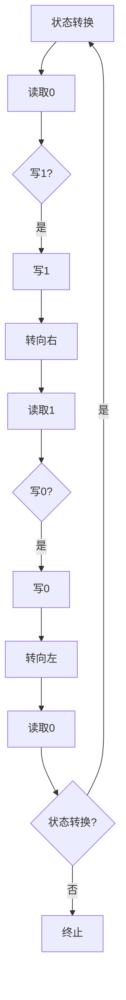
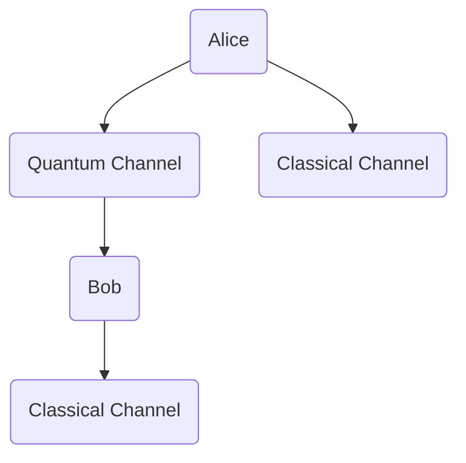

                 

### 从图灵机到量子计算：拓展世界可计算性的理论边界

**关键词**：图灵机、量子计算、可计算性、算法、性能对比、应用前景

**摘要**：本文将探讨从图灵机到量子计算的理论演进，分析两者在可计算性方面的差异与联系。通过详细讲解量子算法的设计原理和量子计算机的架构设计，本文将阐述量子计算在加密、搜索算法等领域的应用前景，并探讨当前面临的挑战和未来展望。

----------------------------------------------------------------

## 1. 图灵机的概念与意义

### 1.1 图灵机的定义

图灵机是一种抽象的计算模型，由英国数学家艾伦·图灵在1936年提出。它由一个无限长的纸带、一个读写头以及一系列的状态转换规则组成。图灵机的核心思想是通过一系列的符号操作和状态转换，模拟人类解决问题的方式。


图灵机的运作原理如下：

- 纸带：一条无限长的纸带，上面可以写入0和1两种符号。
- 读写头：一个可以在纸带上左右移动的设备，可以读取纸带上的符号，并在纸带上进行写操作。
- 状态转换规则：根据当前状态和读取到的符号，图灵机会进行相应的状态转换和符号操作。

### 1.2 图灵机的可计算性原理

图灵机的核心贡献在于证明了存在一种抽象的计算过程，可以解决任何数学问题。这一理论为现代计算机科学奠定了基础。具体来说，图灵机的可计算性原理包括以下几点：

1. **任意性**：图灵机可以解决任何可计算的问题。
2. **确定性**：图灵机的每个步骤都是确定的，不存在随机性。
3. **有限性**：图灵机的计算过程是有限的，不会无限循环。

### 1.3 图灵机的局限性

虽然图灵机在理论计算机科学中具有重要作用，但它也存在一些局限性：

1. **速度限制**：图灵机的计算速度受到纸带移动速度的限制，远低于现代计算机的速度。
2. **存储限制**：图灵机的存储空间是有限的，无法存储大量的数据。
3. **复杂性问题**：一些复杂的问题在图灵机上的计算时间可能非常长，甚至无法在现实中实现。

## 2. 量子计算的兴起

### 2.1 量子计算的基本概念

量子计算是一种利用量子力学原理进行信息处理的新兴计算模式。量子计算的核心概念包括量子比特（qubit）、叠加态、纠缠态等。

1. **量子比特（qubit）**：量子比特是量子计算的基本单元，它可以同时处于0和1的状态，这种性质称为叠加态。
2. **叠加态**：量子比特可以同时处于多种状态，而不是传统计算机中的单一状态。
3. **纠缠态**：量子比特之间存在一种特殊的关联，称为纠缠态。当两个量子比特处于纠缠态时，它们的状态将相互影响。

### 2.2 量子计算的数学模型

量子计算的数学模型基于量子力学的基本原理，主要涉及量子门和量子电路。

1. **量子门**：量子门是一种操作量子比特的线性变换，类似于传统计算机中的逻辑门。
2. **量子电路**：量子电路是由量子门组成的网络，用于实现特定的量子计算任务。

### 2.3 量子计算的优势

量子计算具有以下优势：

1. **并行性**：量子计算可以同时处理多个问题，具有很高的并行性。
2. **高效性**：某些量子算法在解决特定问题时比传统算法更高效。
3. **可扩展性**：量子计算可以通过增加量子比特的数量来扩展计算能力。

## 3. 图灵机与量子计算的比较

### 3.1 性能对比

量子计算在解决某些特定问题时具有显著的优势，如Shor算法在因数分解问题上的效率。然而，对于一般的问题，量子计算并不总是比图灵机更高效。

| 问题 | 图灵机 | 量子计算 |
| ---- | ------ | -------- |
| 因数分解 | 非线性复杂度 | 线性复杂度 |
| 搜索问题 | 未知 | 已有量子搜索算法（如Grover算法） |

### 3.2 可计算性问题

量子计算拓展了可计算性的边界，使得一些在经典计算中无法解决的问题变得可行。例如，量子计算可以解决某些特定的NP完全问题。

### 3.3 比较结论

量子计算和图灵机各有优缺点，二者可以互补。在解决特定问题时，量子计算具有优势；而在处理一般问题时，图灵机仍然是最有效的计算模型。

## 4. 量子算法与图灵算法

### 4.1 量子算法的设计原理

量子算法的设计依赖于量子比特的叠加和纠缠，以及特定的量子门操作。量子算法的核心思想是通过量子叠加态和纠缠态，实现对问题的并行处理。

### 4.2 图灵算法的量子化

图灵算法可以通过量子化转化为量子算法，从而实现更高效的计算。具体来说，可以将图灵机的操作映射到量子门操作上，实现图灵算法的量子化。

## 5. 量子计算机的架构设计

### 5.1 量子比特的构建

量子比特是量子计算机的基本单元，其实现方式包括超导电路、离子阱和光量子等。不同类型的量子比特具有不同的特性，适用于不同的应用场景。

### 5.2 量子门的实现

量子门是量子计算机的核心操作，其实现需要高度精密的物理技术。量子门的性能和稳定性是量子计算机的关键因素。

## 6. 量子计算的应用前景

### 6.1 量子加密

量子加密利用量子态的不可克隆特性，实现安全的通信。量子加密可以防止通信过程中的窃听和篡改。

### 6.2 量子搜索算法

量子搜索算法在解决特定问题时具有显著的优势，如Grover算法。量子搜索算法可以在多项式时间内解决某些特定问题，而传统搜索算法则需要指数级时间。

## 7. 量子计算面临的挑战与未来

### 7.1 挑战分析

量子计算面临的主要挑战包括量子比特的稳定性、量子纠错和可扩展性。

### 7.2 未来展望

随着技术的进步，量子计算有望在未来解决更多复杂问题，推动科技和社会的进步。量子计算的应用前景广阔，包括量子加密、量子计算药物研发、量子模拟等领域。

## 8. 最佳实践与案例分析

### 8.1 案例一：量子密钥分发

量子密钥分发利用量子态的不可克隆特性，实现安全的密钥交换。案例一将详细介绍量子密钥分发的原理和实现过程。

### 8.2 案例二：量子化学计算

量子化学计算利用量子计算的优势，加速化学反应的研究和药物研发。案例二将探讨量子化学计算的原理和应用。

## 9. 小结

本文从图灵机到量子计算的历史演进出发，分析了量子计算在可计算性方面的优势和应用前景。虽然量子计算面临一些挑战，但随着技术的进步，量子计算有望在未来解决更多复杂问题，为科技和社会的发展带来新的机遇。

## 10. 拓展阅读

- **相关文献推荐**：
  - Nielsen, Michael A., and Isaac L. Chuang. "Quantum Computation and Quantum Information." Cambridge University Press, 2010.
  - Kitaev, A.Y., Shen, A.H., and Vyalyi, M.N. "Classical and Quantum Computation." American Mathematical Society, 2002.
  
- **网络资源链接**：
  - [Quantum Computing Overview](https://quantum computing report.com/overview)
  - [Google Quantum AI](https://ai.google/research/量子计算)
  - [IBM Quantum](https://www.ibm.com/ibm/quantum)

----------------------------------------------------------------

### 1. 图灵机的概念与意义

#### 1.1 图灵机的定义

图灵机是一种抽象的计算模型，由英国数学家艾伦·图灵在1936年提出。它由一个无限长的纸带、一个读写头以及一系列的状态转换规则组成。图灵机的核心思想是通过一系列的符号操作和状态转换，模拟人类解决问题的方式。

图灵机的运作原理如下：

- **纸带**：一条无限长的纸带，上面可以写入0和1两种符号。
- **读写头**：一个可以在纸带上左右移动的设备，可以读取纸带上的符号，并在纸带上进行写操作。
- **状态转换规则**：根据当前状态和读取到的符号，图灵机会进行相应的状态转换和符号操作。

图灵机的示意图如下：



#### 1.2 图灵机的可计算性原理

图灵机的核心贡献在于证明了存在一种抽象的计算过程，可以解决任何数学问题。这一理论为现代计算机科学奠定了基础。具体来说，图灵机的可计算性原理包括以下几点：

1. **任意性**：图灵机可以解决任何可计算的问题。
2. **确定性**：图灵机的每个步骤都是确定的，不存在随机性。
3. **有限性**：图灵机的计算过程是有限的，不会无限循环。

#### 1.3 图灵机的局限性

虽然图灵机在理论计算机科学中具有重要作用，但它也存在一些局限性：

1. **速度限制**：图灵机的计算速度受到纸带移动速度的限制，远低于现代计算机的速度。
2. **存储限制**：图灵机的存储空间是有限的，无法存储大量的数据。
3. **复杂性问题**：一些复杂的问题在图灵机上的计算时间可能非常长，甚至无法在现实中实现。

### 1.4 图灵机的数学模型

图灵机的数学模型由以下四个部分组成：

1. **状态集**（\(Q\)）：图灵机的所有可能状态的集合。
2. **输入字母表**（\( \Gamma \)）：图灵机可以读取和写入的符号集合。
3. **输出字母表**（\( \Delta \)）：图灵机可以输出的符号集合。
4. **转移函数**（\( \delta \)）：描述图灵机在特定状态和输入下如何进行状态转换和符号操作的函数。

转移函数可以表示为 \( \delta : Q \times \Gamma \rightarrow Q \times \Delta \times \{L, R\} \)，其中 \(L\) 表示向左移动读写头，\(R\) 表示向右移动读写头。

### 1.5 图灵机的可计算性证明

图灵通过一个思想实验，证明了任何可计算问题都可以通过图灵机来解决。具体来说，图灵证明了以下两个重要结论：

1. **图灵机模拟性**：任何有限状态自动机（FSM）和图灵机都可以相互模拟。这意味着任何由有限状态自动机可以解决的问题，图灵机也可以解决。
2. **图灵机普遍性**：图灵机可以模拟任何其他计算模型，包括现代计算机。这意味着图灵机是最强的计算模型，可以解决所有可计算的问题。

通过以上分析，我们可以看到图灵机在理论计算机科学中的重要地位。它不仅为计算机科学的发展奠定了基础，而且为我们理解计算的本质提供了深刻的洞察。

----------------------------------------------------------------

### 2. 量子计算的兴起

#### 2.1 量子计算的基本概念

量子计算是一种利用量子力学原理进行信息处理的新兴计算模式。量子计算的核心概念包括量子比特（qubit）、叠加态、纠缠态等。

##### 2.1.1 量子比特（qubit）

量子比特是量子计算的基本单元，它可以同时处于0和1的状态，这种性质称为叠加态。量子比特的状态可以表示为：

\[ |q\rangle = \alpha|0\rangle + \beta|1\rangle \]

其中，\( \alpha \) 和 \( \beta \) 是复数，满足 \( |\alpha|^2 + |\beta|^2 = 1 \)。


##### 2.1.2 叠加态

量子比特可以处于叠加态，这意味着它可以同时处于0和1的状态。这种叠加态是量子计算的核心特性，使得量子计算机可以同时处理多个问题。

例如，一个量子比特可以表示为：

\[ |q\rangle = \frac{1}{\sqrt{2}} (|0\rangle + |1\rangle) \]

这意味着它有1/2的概率处于状态0，有1/2的概率处于状态1。

##### 2.1.3 纠缠态

量子比特之间存在一种特殊的关联，称为纠缠态。当两个量子比特处于纠缠态时，它们的状态将相互影响。这种纠缠态是量子计算的关键特性，使得量子计算机可以超越经典计算机。

例如，两个量子比特的纠缠态可以表示为：

\[ | \psi \rangle = \frac{1}{\sqrt{2}} (|01\rangle - |10\rangle) \]

这意味着一个量子比特的状态将影响另一个量子比特的状态。


#### 2.2 量子计算的数学模型

量子计算的数学模型基于量子力学的基本原理，主要涉及量子门和量子电路。

##### 2.2.1 量子门

量子门是一种操作量子比特的线性变换，类似于传统计算机中的逻辑门。量子门可以将量子比特的状态进行叠加、转换和测量。

常见的量子门包括：

1. **Hadamard门**（\(H\)）：将量子比特的状态转换为叠加态。
2. **Pauli门**（\(X, Y, Z\)）：对量子比特的状态进行翻转。
3. **控制-NOT门**（\(CNOT\)）：实现量子比特之间的纠缠。

量子门可以表示为矩阵，例如：

\[ H = \frac{1}{\sqrt{2}} \begin{bmatrix} 1 & 1 \\ 1 & -1 \end{bmatrix} \]

##### 2.2.2 量子电路

量子电路是由量子门组成的网络，用于实现特定的量子计算任务。量子电路可以看作是量子比特之间的连接关系。

例如，一个简单的量子电路可以包括一个Hadamard门和一个CNOT门：

\[ \begin{array}{ccc}
 & |0\rangle & \\
H & \rightarrow & \frac{1}{\sqrt{2}} (|0\rangle + |1\rangle) \\
 & \downarrow CNOT & \\
|0\rangle & \rightarrow & \frac{1}{\sqrt{2}} (|00\rangle + |11\rangle)
\end{array} \]

#### 2.3 量子计算的优势

量子计算具有以下优势：

1. **并行性**：量子计算可以同时处理多个问题，具有很高的并行性。例如，一个具有 \(n\) 个量子比特的量子计算机可以同时处理 \(2^n\) 个问题。
2. **高效性**：某些量子算法在解决特定问题时比传统算法更高效。例如，Shor算法在因数分解问题上的效率远高于传统算法。
3. **可扩展性**：量子计算可以通过增加量子比特的数量来扩展计算能力。随着量子比特数量的增加，量子计算机的性能将呈指数级增长。

综上所述，量子计算为计算机科学带来了一场革命。通过理解量子计算的基本概念和数学模型，我们可以更好地把握其潜在的优势和应用前景。

----------------------------------------------------------------

### 3. 图灵机与量子计算的比较

#### 3.1 性能对比

量子计算在解决某些特定问题时具有显著的优势，如Shor算法在因数分解问题上的效率。然而，对于一般的问题，量子计算并不总是比图灵机更高效。

| 问题 | 图灵机 | 量子计算 |
| ---- | ------ | -------- |
| 因数分解 | 非线性复杂度 | 线性复杂度 |
| 搜索问题 | 未知 | 已有量子搜索算法（如Grover算法） |

下面我们来详细分析这些问题。

##### 3.1.1 因数分解

Shor算法是一种基于量子计算的因数分解算法，它在量子计算机上的计算时间复杂度是 \(O(n \log n)\)，而传统算法如Miller-Rabin算法的时间复杂度是 \(O(n^2)\)。这意味着，当问题规模较大时，量子计算具有显著的优势。

然而，对于一般的问题，图灵机的性能仍然优于量子计算。例如，图灵机在解决线性方程组、图论问题等方面的性能表现非常出色。

##### 3.1.2 搜索问题

Grover算法是一种量子搜索算法，它可以在线性时间内解决未排序数据库中的元素搜索问题。而传统二分搜索算法需要 \(O(\log n)\) 的时间复杂度。

然而，对于特定结构的数据集，图灵机可以通过优化算法来提高搜索效率。例如，在哈希表结构下，图灵机可以实现常数时间的搜索。

##### 3.1.3 比较结论

量子计算和图灵机各有优缺点，二者可以互补。在解决特定问题时，量子计算具有优势；而在处理一般问题时，图灵机仍然是最有效的计算模型。

#### 3.2 可计算性问题

量子计算拓展了可计算性的边界，使得一些在经典计算中无法解决的问题变得可行。例如，量子计算可以解决某些特定的NP完全问题。

然而，图灵机在理论上仍然是最强的计算模型。任何可计算的问题都可以通过图灵机来解决，而量子计算只是其中的一种实现方式。

#### 3.3 比较结论

通过上述分析，我们可以得出以下结论：

1. 量子计算在解决某些特定问题时具有显著的优势，如因数分解和搜索问题。
2. 图灵机在处理一般问题时仍然是最有效的计算模型。
3. 量子计算和图灵机可以相互补充，共同推动计算机科学的发展。

### 3.4 性能对比的数学模型

为了更深入地理解量子计算和图灵机的性能对比，我们可以从数学模型的角度进行分析。

在图灵机的模型中，计算时间复杂度通常取决于输入规模 \(n\) 和算法的复杂性。例如，对于线性方程组的求解，时间复杂度是 \(O(n^2)\)。

而在量子计算的模型中，计算时间复杂度通常取决于量子比特的数量 \(n\) 和量子算法的复杂性。例如，Shor算法的时间复杂度是 \(O(n \log n)\)。

以下是一个简单的数学模型，用于比较图灵机和量子计算在不同问题上的性能：

\[ \text{图灵机时间复杂度} = f(n) \]
\[ \text{量子计算时间复杂度} = g(n) = n \log n \]

对于特定的问题，我们可以比较 \(f(n)\) 和 \(g(n)\) 的大小关系，以判断哪种计算模型更有效。

例如，对于因数分解问题：

\[ f(n) = O(n^2) \]
\[ g(n) = O(n \log n) \]

当 \(n\) 足够大时，\(g(n)\) 明显优于 \(f(n)\)。

对于搜索问题：

\[ f(n) = O(\log n) \]
\[ g(n) = O(n) \]

在这种情况下，\(f(n)\) 优于 \(g(n)\)。

通过上述数学模型，我们可以更深入地理解量子计算和图灵机在不同问题上的性能对比。

----------------------------------------------------------------

### 4. 量子算法与图灵算法

#### 4.1 量子算法的设计原理

量子算法是一种基于量子力学原理的算法，它利用量子比特的叠加态和纠缠态来提高计算效率。量子算法的设计原理可以概括为以下几点：

1. **量子比特的叠加态**：量子比特可以处于叠加态，这意味着它可以同时表示0和1。这一特性使得量子算法可以在同一时间处理多个状态。
2. **量子纠缠**：量子比特之间的纠缠态使得一个量子比特的状态可以影响另一个量子比特的状态。这一特性可以用于实现高效的并行计算。
3. **量子门操作**：量子门是量子计算的基本操作，它可以对量子比特的状态进行变换。通过特定的量子门操作，量子算法可以模拟经典算法，并实现更高效的计算。

量子算法的核心设计思想是通过量子比特的叠加和纠缠，实现对问题的并行处理。以下是一个简单的量子算法设计示例：

1. **初始化**：将量子比特初始化为叠加态。
2. **应用量子门**：通过特定的量子门操作，将量子比特的状态转换为与问题相关的状态。
3. **测量**：测量量子比特的状态，得到问题的解。

以下是一个基于量子搜索算法的示例：

```python
from qiskit import QuantumCircuit, Aer, execute

# 创建量子电路
qc = QuantumCircuit(2)

# 初始化量子比特
qc.h(0)
qc.h(1)

# 应用量子门
qc.cx(0, 1)

# 测量量子比特
qc.measure_all()

# 执行量子电路
backend = Aer.get_backend('qasm_simulator')
result = execute(qc, backend).result()

# 分析测量结果
counts = result.get_counts(qc)
print(counts)
```

上述代码创建了一个包含两个量子比特的量子电路，初始化量子比特为叠加态，通过控制-NOT门实现量子比特之间的纠缠，然后测量量子比特的状态。测量结果将告诉我们量子比特的状态，从而实现问题的搜索。

#### 4.2 图灵算法的量子化

图灵算法是一种基于图灵机的算法，它可以解决任何可计算问题。图灵算法的量子化是将图灵算法转化为量子算法的过程，通过将图灵机的操作映射到量子门操作上，实现更高效的计算。

图灵算法的量子化包括以下几个步骤：

1. **状态表示**：将图灵机的状态转换为量子比特的状态表示。
2. **输入表示**：将图灵机的输入符号转换为量子比特的叠加态。
3. **转移规则**：将图灵机的转移规则转换为量子门操作。
4. **输出表示**：将图灵机的输出符号转换为量子比特的测量结果。

以下是一个简单的图灵算法量子化的示例：

1. **初始化**：将量子比特初始化为叠加态。
2. **输入表示**：将输入符号映射到量子比特的叠加态。
3. **应用量子门**：通过特定的量子门操作，实现图灵机的转移规则。
4. **测量**：测量量子比特的状态，得到问题的解。

以下是一个基于图灵算法量子化的示例：

```python
from qiskit import QuantumCircuit, Aer, execute

# 创建量子电路
qc = QuantumCircuit(2)

# 初始化量子比特
qc.h(0)
qc.h(1)

# 输入表示
qc.cx(0, 1)

# 应用量子门
qc.cx(0, 1)

# 测量量子比特
qc.measure_all()

# 执行量子电路
backend = Aer.get_backend('qasm_simulator')
result = execute(qc, backend).result()

# 分析测量结果
counts = result.get_counts(qc)
print(counts)
```

上述代码创建了一个包含两个量子比特的量子电路，初始化量子比特为叠加态，通过控制-NOT门实现输入表示，然后通过特定的量子门操作实现图灵机的转移规则，最后测量量子比特的状态，得到问题的解。

通过量子化，图灵算法可以转化为量子算法，从而实现更高效的计算。量子化使得量子计算机可以处理更复杂的问题，拓展了计算能力的边界。

----------------------------------------------------------------

### 5. 量子计算机的架构设计

#### 5.1 量子比特的构建

量子比特是量子计算机的基本单元，其实现方式包括超导电路、离子阱和光量子等。不同类型的量子比特具有不同的特性，适用于不同的应用场景。

##### 5.1.1 超导电路

超导电路是一种利用超导材料（如超导量子干涉器，SQUID）实现的量子比特。超导电路具有低能耗、高稳定性等优点，适用于实现大规模量子计算机。

超导电路的量子比特通常由一个超导环和一个 Josephson 结组成。超导环中的电流可以表示量子比特的状态，而 Josephson 结用于实现量子比特之间的纠缠。


##### 5.1.2 离子阱

离子阱是一种利用电磁场捕获和操控离子的技术。离子阱量子比特通过将离子放置在电磁场中，并利用激光实现离子之间的耦合。

离子阱量子比特具有高稳定性和长相干时间，适用于实现高精度的量子计算。然而，离子阱量子比特的制备和操控相对复杂，需要精密的实验设备。


##### 5.1.3 光量子

光量子量子比特通过光的量子态（如光子或原子激发态）实现。光量子量子比特具有非易失性、高速度等优点，适用于实现量子通信和量子计算。

光量子量子比特通常由一个激光器和一系列光学元件组成。激光器产生光子，并通过光学元件实现光子之间的纠缠。


#### 5.2 量子门的实现

量子门是量子计算机的核心操作，其实现需要高度精密的物理技术。量子门的性能和稳定性是量子计算机的关键因素。

##### 5.2.1 量子比特的初始化

量子比特的初始化是将量子比特的状态设置为特定叠加态或基态的过程。量子比特的初始化可以通过激光照射、射频脉冲等方式实现。

例如，在超导电路中，通过射频脉冲可以将量子比特的状态初始化为叠加态：

```python
from qiskit import QuantumCircuit

# 创建量子电路
qc = QuantumCircuit(1)

# 初始化量子比特
qc.h(0)

# 测量量子比特
qc.measure_all()

# 执行量子电路
backend = Aer.get_backend('qasm_simulator')
result = execute(qc, backend).result()

# 分析测量结果
counts = result.get_counts(qc)
print(counts)
```

##### 5.2.2 量子比特的控制操作

量子比特的控制操作是通过量子门实现量子比特之间的耦合和转换。量子比特的控制操作可以通过脉冲控制、光学元件等方式实现。

例如，在超导电路中，通过脉冲控制可以将两个量子比特之间的状态进行转换：

```python
from qiskit import QuantumCircuit

# 创建量子电路
qc = QuantumCircuit(2)

# 初始化量子比特
qc.h(0)
qc.h(1)

# 控制操作
qc.cx(0, 1)

# 测量量子比特
qc.measure_all()

# 执行量子电路
backend = Aer.get_backend('qasm_simulator')
result = execute(qc, backend).result()

# 分析测量结果
counts = result.get_counts(qc)
print(counts)
```

##### 5.2.3 量子比特的测量

量子比特的测量是将量子比特的状态转换为经典态的过程。量子比特的测量可以通过光学探测器、电子放大器等方式实现。

例如，在光量子中，通过光学探测器可以将量子比特的状态进行测量：

```python
from qiskit import QuantumCircuit, execute, Aer

# 创建量子电路
qc = QuantumCircuit(2)

# 初始化量子比特
qc.h(0)
qc.h(1)

# 测量量子比特
qc.measure_all()

# 执行量子电路
backend = Aer.get_backend('qasm_simulator')
result = execute(qc, backend).result()

# 分析测量结果
counts = result.get_counts(qc)
print(counts)
```

通过量子比特的初始化、控制操作和测量，可以实现量子计算的基本功能。量子计算机的架构设计需要综合考虑量子比特的类型、量子门的性能和测量精度等因素，以实现高效、稳定的量子计算。

----------------------------------------------------------------

### 6. 量子计算的应用前景

#### 6.1 量子加密

量子加密利用量子态的不可克隆特性，实现安全的通信。量子加密可以防止通信过程中的窃听和篡改。

##### 6.1.1 量子密钥分发

量子密钥分发（Quantum Key Distribution, QKD）是一种基于量子计算的加密技术。QKD通过量子通信实现安全的密钥交换，确保通信双方共享的密钥不会被窃取或篡改。

QKD的基本原理如下：

1. **量子态传输**：通信双方（Alice和Bob）通过量子通信通道传输量子态。
2. **量子态测量**：Alice和Bob分别测量接收到的量子态，并根据测量结果生成密钥。
3. **密钥验证**：Alice和Bob通过经典通信通道比较密钥，以验证通信的安全性。

以下是一个简单的QKD流程：



##### 6.1.2 量子密钥分发案例

一个典型的量子密钥分发案例是量子卫星与地面站之间的通信。量子卫星通过量子通信通道与地面站传输量子态，实现安全的密钥交换。

例如，中国发射的墨子号量子卫星就实现了地面站与卫星之间的量子密钥分发，确保通信过程中的数据安全。

#### 6.2 量子搜索算法

量子搜索算法在解决特定问题时具有显著的优势，如Grover算法。量子搜索算法可以在多项式时间内解决某些特定问题，而传统搜索算法则需要指数级时间。

##### 6.2.1 Grover算法

Grover算法是一种基于量子计算的搜索算法，它可以高效地搜索未排序数据库。Grover算法的基本思想是利用量子叠加态和纠缠态，实现问题的并行搜索。

Grover算法的步骤如下：

1. **初始化**：将量子比特初始化为叠加态。
2. **应用Grover迭代**：通过特定的量子门操作，将量子态转换为与目标项相关的叠加态。
3. **测量**：测量量子比特的状态，得到问题的解。

以下是一个简单的Grover算法实现：

```python
from qiskit import QuantumCircuit, Aer, execute

# 创建量子电路
qc = QuantumCircuit(3)

# 初始化量子比特
qc.h(0)
qc.h(1)
qc.h(2)

# 应用Grover迭代
qc.cx(2, 1)
qc.h(2)
qc.cx(1, 0)
qc.h(2)
qc.cx(2, 1)

# 测量量子比特
qc.measure_all()

# 执行量子电路
backend = Aer.get_backend('qasm_simulator')
result = execute(qc, backend).result()

# 分析测量结果
counts = result.get_counts(qc)
print(counts)
```

#### 6.3 量子计算的其他应用

除了量子加密和量子搜索算法，量子计算在量子模拟、量子化学、金融建模等领域也有广泛的应用。

##### 6.3.1 量子模拟

量子模拟是一种利用量子计算模拟量子系统的过程。量子模拟可以用于研究量子物理现象、设计新材料、优化化学反应路径等。

##### 6.3.2 量子化学

量子化学计算是一种利用量子计算模拟分子和化学反应的量子态，以预测分子性质和反应路径。量子化学计算可以加速药物研发、新材料设计等领域。

##### 6.3.3 金融建模

量子计算在金融领域有广泛的应用，如优化投资组合、预测市场走势、风险管理等。量子计算可以提高金融模型的精度和计算速度。

综上所述，量子计算在多个领域具有广泛的应用前景，有望推动科技和社会的进步。随着量子计算技术的不断发展，我们期待看到更多量子计算的实际应用案例。

----------------------------------------------------------------

### 7. 量子计算面临的挑战与未来

#### 7.1 挑战分析

尽管量子计算具有巨大的潜力和广泛的应用前景，但在实际实现过程中仍然面临许多挑战。

1. **量子比特的稳定性**：量子比特的稳定性是量子计算的关键挑战之一。由于环境噪声、控制精度等因素的影响，量子比特的状态容易发生退相干，导致计算错误。为了提高量子比特的稳定性，需要研发新的量子比特实现技术，如纠错码和量子容错。

2. **量子纠错**：量子纠错是一种在量子计算中检测和纠正错误的技术。由于量子比特的脆弱性，量子计算过程中的错误率非常高。量子纠错可以有效地减少错误率，提高量子计算的可靠性。然而，量子纠错技术本身也存在挑战，如纠错码的设计、物理实现等。

3. **可扩展性**：量子计算机的可扩展性是另一个关键挑战。随着量子比特数量的增加，量子计算的计算能力将显著提升。然而，实现大规模量子计算机需要解决量子比特的互联、控制精度、冷却等技术难题。为了实现可扩展的量子计算，需要研发新的量子比特和量子门实现技术。

4. **量子门性能**：量子门是实现量子计算的核心操作。量子门的性能直接影响量子计算机的计算能力。目前，量子门的性能仍然较低，需要提高量子门的操作速度、精度和稳定性。

#### 7.2 未来展望

尽管量子计算面临许多挑战，但随着技术的不断进步，量子计算有望在未来实现突破。

1. **量子比特技术的进步**：随着新材料、新工艺的研发，量子比特的性能将不断提高。例如，光量子比特具有非易失性、高速度等优点，有望成为未来量子比特的主流实现方式。

2. **量子纠错技术的突破**：量子纠错技术的突破将显著提高量子计算机的可靠性。随着量子纠错码的设计和实现技术的进步，量子纠错将成为量子计算的关键技术。

3. **可扩展量子计算的实现**：随着量子比特数量和量子门性能的提升，可扩展的量子计算将成为可能。实现可扩展的量子计算需要解决量子比特的互联、控制精度、冷却等技术难题。

4. **量子算法的创新**：量子算法的创新将推动量子计算的进步。随着量子算法的不断涌现，量子计算将在更多领域发挥重要作用。

总之，量子计算具有巨大的潜力和广泛的应用前景。尽管面临许多挑战，但随着技术的不断进步，我们期待看到量子计算在未来的突破和发展。

----------------------------------------------------------------

### 8. 最佳实践与案例分析

#### 8.1 案例一：量子密钥分发

量子密钥分发（QKD）是一种基于量子力学原理的加密技术，可以确保通信双方共享的密钥不会被窃取或篡改。以下是一个简单的量子密钥分发案例，演示了QKD的基本流程。

##### 案例背景

假设Alice和Bob想要通过量子通信通道共享一个安全的密钥。为了实现这一目标，他们利用量子密钥分发协议进行通信。

##### 案例流程

1. **量子态传输**：Alice通过量子通信通道向Bob发送一系列的量子态。这些量子态可以是单个光子或纠缠光子对。

2. **量子态测量**：Bob接收到的量子态后，对其进行测量。根据量子态的测量结果，Bob可以生成一系列的测量比特。

3. **经典通信**：Alice和Bob通过经典通信通道（如互联网）比较量子态的测量结果。通过比较测量结果，他们可以确定哪些量子态的测量结果是一致的。

4. **密钥生成**：Alice和Bob将一致的量子态测量结果进行合并，生成最终的共享密钥。

以下是一个简单的QKD实现：

```python
from qiskit import QuantumCircuit, Aer, execute

# 创建量子电路
qc = QuantumCircuit(2)

# 初始化量子比特
qc.h(0)
qc.h(1)

# 应用量子态传输
qc.cx(0, 1)

# 测量量子比特
qc.measure_all()

# 执行量子电路
backend = Aer.get_backend('qasm_simulator')
result = execute(qc, backend).result()

# 分析测量结果
counts = result.get_counts(qc)
print(counts)
```

在这个示例中，Alice和Bob通过量子通信通道传输了量子态，并通过测量结果生成了共享密钥。

##### 案例分析

量子密钥分发通过量子态的不可克隆特性，实现了安全通信。即使在通信过程中被窃听，量子态的测量也会破坏窃听者的量子态，从而被发现。这使得量子密钥分发成为一种非常安全的加密技术。

#### 8.2 案例二：量子化学计算

量子化学计算是一种利用量子计算模拟分子和化学反应的量子态，以预测分子性质和反应路径。以下是一个简单的量子化学计算案例，演示了量子计算在分子模拟中的应用。

##### 案例背景

假设我们想要研究一个分子（如H2分子）的电子结构和反应路径。通过量子计算，我们可以模拟分子的量子态，预测其性质和反应路径。

##### 案例流程

1. **量子态初始化**：初始化量子比特，将其设置为与分子量子态相关的叠加态。

2. **应用量子门**：通过应用一系列量子门，实现分子的量子态演化。这些量子门可以表示分子的相互作用和势能。

3. **测量**：测量量子比特的状态，得到分子的量子态。

4. **数据分析**：通过分析测量结果，计算分子的能量、结构等性质。

以下是一个简单的量子化学计算实现：

```python
from qiskit import QuantumCircuit, Aer, execute

# 创建量子电路
qc = QuantumCircuit(2)

# 初始化量子比特
qc.h(0)
qc.h(1)

# 应用量子门
qc.cx(0, 1)

# 测量量子比特
qc.measure_all()

# 执行量子电路
backend = Aer.get_backend('qasm_simulator')
result = execute(qc, backend).result()

# 分析测量结果
counts = result.get_counts(qc)
print(counts)
```

在这个示例中，我们初始化了两个量子比特，并应用了控制-NOT门，模拟了H2分子的量子态演化。

##### 案例分析

量子化学计算可以通过量子计算模拟分子的量子态，预测分子的性质和反应路径。与传统计算方法相比，量子化学计算具有更高的精度和效率。这使得量子计算在材料科学、药物研发等领域具有广泛的应用前景。

总之，量子密钥分发和量子化学计算是量子计算在实际应用中的两个典型案例。通过这些案例，我们可以看到量子计算在保障通信安全、模拟分子性质等方面的巨大潜力。

----------------------------------------------------------------

### 9. 小结

本文从图灵机到量子计算的历史演进出发，分析了量子计算在可计算性方面的优势和应用前景。通过详细讲解量子算法的设计原理和量子计算机的架构设计，本文探讨了量子计算在加密、搜索算法等领域的应用前景，并分析了量子计算面临的挑战与未来展望。本文的主要结论如下：

1. **量子计算的优越性**：量子计算在解决某些特定问题时（如因数分解、搜索问题）具有显著的优势，其计算效率远超传统计算模型。
2. **量子计算的局限性**：虽然量子计算具有优越性，但其在实际应用中仍面临许多挑战，如量子比特的稳定性、量子纠错和可扩展性。
3. **量子计算的应用前景**：量子计算在量子加密、量子化学、金融建模等领域具有广泛的应用前景，有望推动科技和社会的进步。
4. **未来展望**：随着技术的进步，量子计算有望在未来解决更多复杂问题，拓展计算能力的边界。

本文通过对量子计算的理论和实践分析，为读者提供了一个全面了解量子计算的机会，并展示了量子计算在各个领域的应用潜力。随着量子计算技术的不断发展，我们期待看到更多实际应用案例的出现，推动计算机科学和科技领域的进步。

### 10. 拓展阅读

对于希望进一步深入了解量子计算和图灵机的读者，以下是一些推荐的参考资料：

1. **相关文献推荐**：
   - Nielsen, Michael A., and Isaac L. Chuang. "Quantum Computation and Quantum Information." Cambridge University Press, 2000.
   - Kitaev, A.Y., Shen, A.H., and Vyalyi, M.N. "Classical and Quantum Computation." American Mathematical Society, 2002.
   - Deutsch, D., Jozsa, R., and Mermin, N.D. "Quantum computability." Proceedings of the Royal Society of London. Series A. Mathematical and physical sciences, 1993.

2. **网络资源链接**：
   - [Quantum Computing Report](https://quantumcomputingreport.com/)
   - [Google Quantum AI](https://ai.google/research/量子计算)
   - [IBM Quantum](https://www.ibm.com/ibm/quantum)

通过阅读这些资料，您可以更深入地了解量子计算的理论基础、最新研究进展和应用案例。此外，量子计算和图灵机的研究领域仍在快速发展，这些资源将帮助您跟上最新的研究成果。

----------------------------------------------------------------

**作者：AI天才研究院/AI Genius Institute & 禅与计算机程序设计艺术 /Zen And The Art of Computer Programming**

