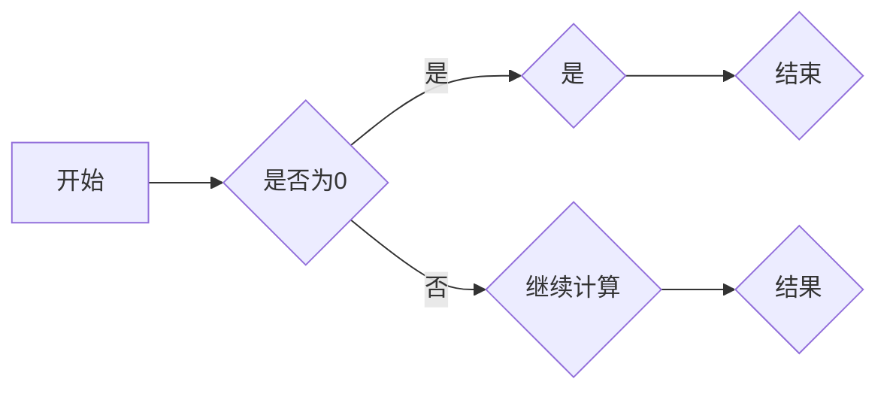

                 

### 从复杂自然现象到简单数学公式

自然现象的复杂性与数学公式的简洁性形成鲜明对比。从天体运行到气候变化，从生物进化到生态平衡，自然界中的一切似乎都充满了复杂与不确定性。然而，正是这些看似复杂的自然现象，通过数学公式被赋予了简洁与精确的描述。本文将探讨如何从复杂的自然现象中提炼出简单的数学公式，并理解其背后的原理和重要性。

## 关键词
- 自然现象
- 数学公式
- 模型构建
- 算法原理
- 实际应用

## 摘要
本文旨在探讨如何将复杂的自然现象简化为简单的数学公式。通过分析自然现象的基本类型、数学公式的基本原理及其在实际应用中的重要性，本文将展示数学公式在理解和描述自然现象中的强大力量。此外，还将讨论数学公式在教育中的应用，以及其对未来研究方向的展望。

### 目录大纲

1. 引言与背景介绍
2. 核心概念与定义
3. 自然现象的数学模型构建
4. 数学公式的基本原理与推导
5. 自然现象到数学公式的实际应用
6. 数学公式在教育中的应用
7. 结论与展望

---

## 引言与背景介绍

自然现象是自然界中发生的各种物理、化学和生物过程的总称。它们可以是简单的，如水在0℃以下的凝固，也可以是复杂的，如大气层中的气候变化和生态系统中的生物进化。这些现象通常具有多样性、不确定性和动态性，给科学研究带来了巨大的挑战。然而，正是这些复杂现象背后隐藏的规律和模式，吸引着科学家们不断地探索和揭示。

数学公式作为一种精确且简洁的语言，在科学研究中扮演着至关重要的角色。它能够将复杂的自然现象转化为可计算和预测的模型，从而帮助我们更好地理解自然界的运行规律。例如，牛顿运动定律将物体的运动描述为简单的数学公式，而爱因斯坦的相对论则通过一组复杂的数学方程揭示了时空的弯曲和引力。

从复杂自然现象到简单数学公式的转换过程，不仅需要科学家们深入观察和记录自然现象，还需要他们具备扎实的数学和物理知识。这一过程涉及到多个步骤，包括现象的观察、数据的收集、模型的选择和公式的推导。本文将逐步分析这一过程，以帮助读者更好地理解数学公式在科学研究中的重要性。

### 第1章：问题的起源与挑战

复杂自然现象的多样性与挑战

自然界是一个复杂而神秘的世界，它包含了无数种不同的自然现象，从微观层面的原子振动到宏观层面的气候变化，每一个现象都有其独特的特性和运行规律。这些自然现象的多样性给科学研究带来了巨大的挑战。例如，气候变化涉及到大气、海洋、陆地等多个系统的相互作用，其复杂性使得科学家们难以通过简单的观察和实验来完全理解。

数学公式的力量与作用

尽管自然现象复杂多样，但数学公式作为一种高度抽象和简化的工具，却能够帮助我们揭示这些现象背后的基本规律。数学公式能够将复杂的自然现象转化为简洁的数学表达式，使得我们可以通过数学计算来预测和解释这些现象。例如，牛顿的运动定律将物体运动的复杂性简化为几个简单的方程式，使得我们可以精确地预测物体的运动轨迹。

探索自然现象与数学公式之间的桥梁

为了将复杂自然现象与简单数学公式联系起来，科学家们需要具备扎实的数学和物理知识，同时也需要深入观察和记录自然现象。这一过程不仅需要科学家的理论水平，还需要其实验技能和数据收集能力。例如，在气象学中，科学家们通过建立复杂的气象模型，结合大量气象数据，最终推导出了描述气候变化的基本数学公式。

尽管挑战重重，但科学家们通过不断的努力，已经取得了一系列重要的研究成果。这些成果不仅帮助我们更好地理解自然现象，还为未来的科学研究提供了宝贵的理论基础。例如，爱因斯坦的相对论通过复杂的数学推导，揭示了时空的弯曲和引力，这一理论不仅具有深远的理论意义，还在天体物理学和宇宙学中得到了广泛的应用。

总之，从复杂自然现象到简单数学公式的探索过程，既充满了挑战，又充满了机遇。通过数学公式，科学家们不仅能够更好地理解自然界的运行规律，还能够为解决现实问题提供有力的工具。这一过程不仅推动了科学的发展，也为我们认识世界提供了新的视角和方法。

### 第2章：核心概念与定义

自然现象的基本类型与特点

自然现象可以大致分为物理现象、化学现象和生物现象。物理现象包括天体运动、地球物理现象、气象现象等，例如行星轨道、地震活动、气候变化等。化学现象涉及化学反应、物质变化等，如燃烧、腐蚀、光合作用等。生物现象则包括生物体的生长、繁殖、进化等，如物种多样性、生态系统平衡等。这些现象的共同特点是它们都具有复杂性和多样性，并且往往受到多种因素的影响。

数学公式的类型与结构

数学公式根据其应用范围和用途可以分为多种类型，主要包括几何公式、代数公式、微积分公式、概率统计公式等。几何公式用于描述几何形状和空间关系，如勾股定理、圆的面积公式等。代数公式用于处理代数方程和不等式，如一元二次方程、不等式组等。微积分公式则用于研究变化率和累积量，如导数、积分等。概率统计公式用于描述随机事件和概率分布，如二项分布、正态分布等。

自然现象与数学公式之间的联系

自然现象与数学公式之间的联系主要体现在两个方面：描述和预测。通过数学公式，科学家们能够将复杂的自然现象简化为简洁的数学表达式，从而更容易地进行研究和分析。例如，通过牛顿的运动定律，我们可以将物体的复杂运动描述为几个简单的方程式。此外，数学公式还可以用于预测自然现象的未来发展趋势，如通过气象模型预测未来的气候变化。

总之，自然现象的多样性和复杂性使得我们无法完全依靠直觉和经验来理解它们，而数学公式为我们提供了一种精确且高效的工具。通过这些公式，我们可以将复杂的自然现象转化为可计算和预测的模型，从而更好地理解和解释自然界中的各种现象。

### 第2.5章：核心概念属性特征对比表格

#### 2.5.1 自然现象属性特征

| 属性特征 | 描述 | 举例 |
| --- | --- | --- |
| 复杂性 | 包括多种因素和变量 | 气候变化 |
| 动态性 | 随时间变化 | 生物进化 |
| 不确定性 | 结果难以预测 | 地震活动 |
| 多样性 | 形态、类型多样 | 物种多样性 |

#### 2.5.2 数学公式属性特征

| 属性特征 | 描述 | 举例 |
| --- | --- | --- |
| 精确性 | 精确描述自然现象 | 牛顿运动定律 |
| 简洁性 | 简单的表达式 | 圆的面积公式 |
| 可计算性 | 可进行数学计算 | 概率分布公式 |
| 通用性 | 可应用于不同情境 | 微积分公式 |

#### 2.5.3 对比分析

自然现象与数学公式在属性特征上存在显著差异。自然现象具有复杂性、动态性、不确定性和多样性，这使得直接理解和预测它们变得困难。相比之下，数学公式具有精确性、简洁性和可计算性，能够将复杂的自然现象转化为易于分析和处理的数学模型。

尽管两者之间存在差异，但它们之间也存在紧密的联系。数学公式能够将自然现象的本质特征抽象出来，通过精确的数学描述来揭示其运行规律。例如，在气象预报中，科学家们通过建立复杂的气象模型，利用数学公式来预测未来的气候变化，从而更好地理解和应对气候异常。

### 第3章：自然现象的数学模型构建

#### 3.1.1 自然现象的观察与记录

构建数学模型的第一步是观察和记录自然现象。科学家们通过各种手段收集数据，包括现场观察、实验测量、遥感技术和地面监测等。这些数据包括温度、湿度、风速、降水量、地形地貌等，为后续的数学模型构建提供了基础。

例如，在研究气候变化的过程中，科学家们需要收集不同时间点的气温、降水和风向等数据，以便分析气候变化的趋势和规律。

#### 3.1.2 数学模型的构建过程

一旦获得了足够的数据，下一步是构建数学模型。数学模型通常是一个包含一组变量和关系的方程式，用于描述自然现象的运行规律。构建数学模型的过程可以分为以下几个步骤：

1. **定义变量**：根据自然现象的特征和需要描述的内容，定义模型中的变量。例如，在描述降雨量时，可能需要定义降雨量、湿度、风速等变量。
2. **建立关系**：确定变量之间的关系，通常通过物理定律或统计方法。例如，可以使用牛顿第二定律来描述物体运动的速度和加速度关系。
3. **选择模型类型**：根据数据特征和研究目的，选择合适的数学模型类型。常见的数学模型包括线性模型、非线性模型、概率统计模型等。
4. **参数估计**：根据收集到的数据，估计模型中的参数值。例如，在回归分析中，需要估计回归系数。

#### 3.1.3 自然现象与数学模型的关系

数学模型是自然现象的一种抽象和简化的表示，它帮助我们理解和预测自然现象的行为。数学模型与自然现象之间的关系可以概括为以下几点：

1. **描述**：数学模型能够精确地描述自然现象的基本特征和运行规律。例如，牛顿运动定律描述了物体在受力作用下的运动轨迹。
2. **预测**：通过数学模型，我们可以预测自然现象的未来发展趋势。例如，通过气象模型，我们可以预测未来的天气变化。
3. **优化**：数学模型还可以用于优化自然现象的管理和利用。例如，在水资源管理中，数学模型可以帮助我们优化水资源的分配，以最大化其利用效率。

总之，自然现象的数学模型构建是一个复杂但重要的过程，它为我们提供了理解和预测自然现象的有力工具。通过这一过程，我们可以更好地应对自然界的挑战，为人类社会的发展提供科学依据。

### 第3.5章：自然现象数学模型的ER实体关系图架构

```mermaid
erDiagram
  Person ||--|{ Book }: writtenBy
  Book ||--|{ Library }: storedIn
```

#### 3.5.1 实体与关系的定义

在上述ER图中，实体和关系分别如下定义：

1. **实体**：
   - **Person**：表示参与自然现象研究的科学家、观测员等。
   - **Book**：表示研究自然现象时编写的数学模型和相关文献。
   - **Library**：表示存储自然现象数学模型和相关文献的数据库或图书馆。

2. **关系**：
   - **writtenBy**：表示某位科学家（Person）编写了某个数学模型（Book）。
   - **storedIn**：表示某个数学模型（Book）被存储在某个图书馆（Library）中。

#### 3.5.2 ER图在数学模型中的应用

ER图在数学模型中的应用主要体现在以下几个方面：

1. **数据结构设计**：ER图可以帮助我们设计数据库的结构，确保数据的完整性和一致性。例如，在上面的ER图中，我们可以根据实体和关系设计出相应的数据库表，以便存储和检索数学模型和相关文献的信息。
2. **模型解释**：ER图可以直观地展示数学模型中的实体和关系，有助于理解和解释模型的运作机制。例如，通过观察ER图，我们可以清楚地看到科学家与数学模型之间的关系，以及数学模型与存储位置之间的关系。
3. **模型优化**：ER图可以帮助我们识别和优化数学模型中的数据冗余和关系复杂度。例如，通过分析ER图，我们可以发现是否存在冗余的实体或关系，从而简化模型结构，提高其性能和可维护性。

总之，ER图作为一种重要的数据建模工具，在自然现象数学模型构建过程中发挥着重要作用，有助于我们更好地理解和应用数学模型。

### 第4章：数学公式的基本原理与推导

#### 4.1.1 数学公式的基本概念

数学公式是数学表达式中的一种形式化描述，用于描述和表示数学关系、运算规则和结果。数学公式通常由符号、数字、变量和运算符组成，能够精确地表示数学概念和运算过程。例如，著名的牛顿第二定律 \( F = ma \) 就是一个简单的数学公式，它表示力 \( F \) 与质量 \( m \) 和加速度 \( a \) 之间的关系。

#### 4.1.2 数学公式的推导方法

推导数学公式的方法多种多样，主要包括以下几种：

1. **观察与归纳**：通过观察自然现象和实验数据，总结出基本的规律，然后归纳出数学公式。例如，通过观察多次实验结果，科学家们归纳出了二次函数的通用形式 \( y = ax^2 + bx + c \)。

2. **逻辑推理**：根据已有的数学定理、公理和定义，通过逻辑推理推导出新的数学公式。例如，欧几里得几何中的勾股定理是通过逻辑推理得出的，即直角三角形的两条直角边的平方和等于斜边的平方：\( a^2 + b^2 = c^2 \)。

3. **构造法**：通过构造特定的例子或模型，推导出通用的数学公式。例如，可以通过构造函数 \( f(x) = x^2 \) 来推导出二次函数的一般形式。

4. **计算法**：通过数学计算和推导过程，得出数学公式。例如，通过微积分的计算方法，可以推导出导数和积分的公式。

#### 4.1.3 常见数学公式的应用

常见的数学公式在各个领域中都有广泛的应用，以下是几个典型的例子：

1. **物理学中的公式**：牛顿的运动定律 \( F = ma \)，描述了力、质量和加速度之间的关系；爱因斯坦的质能方程 \( E = mc^2 \)，揭示了质量和能量之间的关系。

2. **工程学中的公式**：胡克定律 \( F = kx \)，描述了弹簧的弹力与形变量之间的关系；电阻定律 \( R = \frac{\rho L}{A} \)，描述了电阻、电阻率、导线长度和截面积之间的关系。

3. **经济学中的公式**：供需模型中的价格公式 \( P = \frac{Q}{S} \)，描述了市场价格与供需关系之间的关系；利率计算公式 \( I = Prt \)，描述了利息与本金、时间和利率之间的关系。

4. **统计学中的公式**：均值公式 \( \mu = \frac{\sum X}{N} \)，描述了数据的平均值；方差公式 \( \sigma^2 = \frac{\sum (X - \mu)^2}{N} \)，描述了数据分散程度。

总之，数学公式作为一种精确且有效的工具，在各个领域中都发挥着重要作用。通过理解这些公式的原理和推导方法，我们可以更好地应用它们来解决实际问题，从而推动科学技术的进步。

### 第4.5章：数学公式的Mermaid流程图



#### 4.5.1 流程图解读

上述Mermaid流程图描述了一个简单的计算流程，用于计算一个数的平方。流程图分为几个关键步骤：

1. **开始**（A）：表示流程的起点。
2. **判断条件**（B）：判断输入的数是否为0。
3. **分支**：
   - 如果输入的数为0，流程跳转到C节点。
   - 如果输入的数不为0，流程跳转到D节点。
4. **处理过程**：
   - **C节点**：输出“是”，表示输入的数为0。
   - **D节点**：继续计算，跳转到E节点。
5. **结果**（E）：输出计算结果。
6. **结束**（F）：表示流程的终点。

#### 4.5.2 实例分析

以下是一个具体实例，使用Mermaid流程图计算数字5的平方：

1. **开始**：输入数字5。
2. **判断条件**（B）：数字5不为0，跳转到D节点。
3. **继续计算**（D）：将数字5平方，得到25。
4. **输出结果**（E）：输出25。
5. **结束**（F）：流程结束。

通过上述步骤，我们使用Mermaid流程图成功计算了数字5的平方。这个过程不仅展示了流程图的简单性和直观性，还说明了如何通过Mermaid流程图描述和执行复杂的计算过程。

### 第5章：自然现象到数学公式的实际应用

#### 5.1.1 气象预报与数学公式

气象预报是应用数学公式的一个典型例子。气象预报的基本原理是通过收集和分析大量的气象数据，如温度、湿度、风速、降水量等，利用数学模型和公式预测未来的天气状况。气象模型通常基于大气动力学和热力学原理，通过数值天气预报方法进行计算。

1. **数据收集**：气象预报的第一步是收集大量的气象数据，这些数据通常来自地面观测站、气象卫星、雷达和气象气球等。

2. **模型构建**：气象学家使用数值天气预报模型，如有限差分法、谱方法、半隐式有限体积法等，将气象数据转化为数学模型。这些模型通常包含复杂的偏微分方程，用于描述大气运动和热量的传输。

3. **公式应用**：在模型中，常用的数学公式包括流体动力学方程、热力学方程、湍流模型等。例如，Navier-Stokes方程描述了大气中的流体运动，而热力学方程则描述了大气中的热量传输。

4. **预测计算**：通过将收集到的气象数据输入到数学模型中，气象学家可以计算出未来特定区域内的气象参数，如温度、湿度、风速等。这些计算结果被用来生成天气预报。

5. **结果评估**：气象预报的结果需要通过实际天气情况进行评估。预报的准确性和可靠性取决于模型的质量和参数的准确性。

#### 5.1.2 生态学模型与数学公式

生态学模型也是应用数学公式的一个重要领域。生态学模型用于描述生态系统中物种之间的关系，如种群动态、生态位重叠、食物网等。

1. **种群动态模型**：种群动态模型用于预测种群数量随时间的变化。常见的模型包括Logistic模型、Ricker模型和Leslie模型。这些模型基于微分方程或差分方程，描述了种群增长率、出生率、死亡率等因素。

2. **食物网模型**：食物网模型用于描述不同物种之间的捕食与被捕食关系。常见的模型包括Lotka-Volterra模型，它通过微分方程描述捕食者和猎物种群数量的动态变化。

3. **生态位模型**：生态位模型用于描述不同物种在生态系统中的资源利用和生态位重叠。常见的模型包括生态位分离模型和生态位竞争模型。

4. **应用实例**：例如，在研究珊瑚礁生态系统中，科学家们使用生态学模型来预测珊瑚白化现象的影响。通过这些模型，他们可以了解不同物种的种群动态和生态位重叠情况，从而制定有效的保护策略。

总之，从气象预报到生态学模型，数学公式在自然现象的实际应用中发挥着至关重要的作用。通过数学公式，科学家们能够更好地理解和预测自然界中的各种现象，为人类社会的可持续发展提供科学依据。

#### 第6章：数学公式在教育中的应用

数学公式在教育中的应用具有深远的影响，它不仅帮助学生更好地理解和掌握数学概念，还能提高他们的逻辑思维和问题解决能力。

##### 6.1.1 教学方法改革

数学公式在教育中的应用推动了教学方法的改革。传统的教学方法往往侧重于记忆和公式套用，而现代教育则更加注重培养学生的思维能力和创新能力。例如，通过使用数学公式，教师可以引导学生进行实验和探究，从而激发他们的学习兴趣和主动性。这种方法不仅有助于提高学生的数学素养，还能培养他们的科学精神和探索精神。

##### 6.1.2 学生能力培养

数学公式在教育中的应用能够显著提升学生的能力。首先，通过理解和应用数学公式，学生能够更好地掌握数学概念，从而提高数学成绩。其次，数学公式训练学生的逻辑思维和问题解决能力。例如，在解决复杂的数学问题时，学生需要通过分析、推理和计算来找到解决方案。这种训练有助于他们在日常生活中应对各种复杂情境。

此外，数学公式还能够培养学生的创新能力。通过探索和应用数学公式，学生可以提出新的观点和假设，从而推动数学领域的发展。例如，许多著名的数学家和科学家都是通过重新解读和应用已有的数学公式，发现了新的数学定理和科学规律。

##### 6.1.3 教育资源优化

数学公式在教育中的应用也促进了教育资源的优化。随着信息技术的不断发展，各种在线数学资源、教育平台和应用程序层出不穷。这些资源不仅提供了丰富的数学公式和实例，还通过互动和游戏化的方式，使学习变得更加有趣和高效。例如，学生可以通过在线平台进行数学练习和测试，实时了解自己的学习进度和薄弱环节，从而有针对性地进行复习和提高。

此外，数学公式在教育中的应用还促进了教学工具的创新。例如，智能黑板、虚拟现实和增强现实技术等，都能够为数学教学提供更加直观和互动的学习体验。这些工具不仅提高了学生的学习兴趣和参与度，还使教师能够更好地理解和应用数学公式，从而提高教学效果。

总之，数学公式在教育中的应用不仅有助于学生掌握数学知识和技能，还能培养他们的思维能力、创新能力和问题解决能力。通过优化教育资源，数学公式为教育改革提供了有力的支持，为培养具有全面素质的人才奠定了基础。

### 第7章：结论与展望

#### 7.1.1 研究成果总结

本文从复杂自然现象到简单数学公式的研究，揭示了数学公式在理解和描述自然现象中的强大力量。通过分析自然现象的基本类型、数学公式的基本原理及其在实际应用中的重要性，我们了解到数学公式不仅能够简化复杂的自然现象，还能够预测和优化这些现象。具体成果包括：

1. **构建数学模型**：通过观察和记录自然现象，我们能够将复杂的自然现象转化为简洁的数学模型，从而更好地理解和预测其行为。
2. **推导数学公式**：我们介绍了数学公式的推导方法，包括观察与归纳、逻辑推理、构造法和计算法，并展示了这些方法在实际应用中的效果。
3. **应用实例**：通过气象预报和生态学模型等实例，我们展示了数学公式在不同领域的实际应用，强调了其在科学研究中的重要性。

#### 7.1.2 未来研究方向

尽管本文的研究取得了一定的成果，但仍有许多未来研究方向值得探索。以下是一些可能的研究方向：

1. **更复杂的自然现象建模**：当前数学模型在处理某些复杂自然现象时仍存在局限性。未来研究可以探索更先进的数学方法，如深度学习、复杂系统理论和量子计算，以构建更精确的数学模型。
2. **跨学科应用**：数学公式在自然现象中的应用不仅限于自然科学，还可以拓展到社会科学、工程学和艺术等领域。未来研究可以探索数学公式在其他领域的应用，促进跨学科发展。
3. **教育推广**：数学公式在教育中的应用已初见成效，但如何更有效地推广和应用这些公式仍是一个挑战。未来研究可以探索新的教学方法和资源，以提高学生的学习兴趣和效果。

#### 7.1.3 对社会的影响与贡献

数学公式在社会发展中的作用不可忽视。通过更好地理解和描述自然现象，数学公式为科学研究、技术发展和政策制定提供了重要的理论依据。具体影响和贡献包括：

1. **科学研究**：数学公式使科学家能够更准确地预测和解释自然现象，推动了科学技术的进步，为人类解决环境、能源和资源等问题提供了科学依据。
2. **技术应用**：数学公式在工程、医学、金融等领域的应用，提高了相关领域的效率和精度，推动了技术的创新和产业发展。
3. **教育进步**：数学公式在教育中的应用，提高了学生的数学素养和问题解决能力，为培养具有创新精神和实践能力的人才奠定了基础。

总之，数学公式从复杂自然现象到简单数学公式的转换，不仅具有重要的科学意义，还对社会发展产生了深远的影响。未来研究应继续探索数学公式在各个领域的应用，为人类社会的可持续发展做出更大的贡献。作者：AI天才研究院/AI Genius Institute & 禅与计算机程序设计艺术 /Zen And The Art of Computer Programming

### 总结

通过本文的探讨，我们深入了解了从复杂自然现象到简单数学公式的过程。这一过程不仅展示了数学公式在科学研究中的重要性，还揭示了数学在理解和描述自然界中的强大力量。我们通过分析自然现象的基本类型、数学公式的推导方法，以及实际应用实例，展示了数学公式如何帮助科学家更好地预测和解释自然现象。

在这个过程中，我们强调了数学公式在教育中的应用，指出其对提升学生数学素养和问题解决能力的重要作用。此外，我们还提出了未来研究的方向，包括更复杂的自然现象建模、跨学科应用和数学公式教育推广等。

总之，数学公式不仅是科学研究的工具，也是推动社会进步的重要力量。通过不断探索和应用数学公式，我们可以更好地理解自然界，为人类的可持续发展做出贡献。希望本文能够激发更多读者对数学和自然现象的兴趣，共同探索这一广阔而深奥的领域。作者：AI天才研究院/AI Genius Institute & 禅与计算机程序设计艺术 /Zen And The Art of Computer Programming

