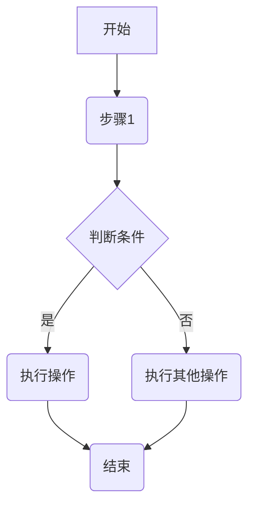

                 

**# 从布尔逻辑到多值逻辑：应对复杂世界的推理工具**

## 摘要

本文旨在探讨从布尔逻辑向多值逻辑转变的必要性及其在复杂世界中的广泛应用。首先，我们将回顾布尔逻辑的基础概念及其局限性。接着，介绍多值逻辑的基本原理和表示方法，并比较其与布尔逻辑的差异。随后，我们将深入探讨多值逻辑在计算机科学和人工智能领域的应用，并通过具体案例说明其在复杂推理中的优势。最后，本文将对多值逻辑的未来发展趋势提出展望，并总结其面临的挑战及解决策略。通过本文的阐述，读者将更好地理解多值逻辑在应对复杂世界中的重要作用。

## 引言与背景介绍

### 1.1 问题的背景与意义

在现代计算机科学和人工智能领域，逻辑推理作为核心组成部分，贯穿于算法设计、系统架构、问题求解等多个方面。然而，传统的布尔逻辑由于其二值化的特性，在处理复杂问题时往往显得力不从心。布尔逻辑基于“真”和“假”两个值，通过逻辑运算符（如AND、OR、NOT等）组合出复杂的逻辑表达式，但其对于现实世界中的模糊性和多面性表达存在局限。

随着人工智能技术的不断发展，对于逻辑推理工具的需求逐渐提高。在现实世界中，许多问题并非非黑即白，而是存在多种可能性和中间状态。例如，在决策支持系统中，对风险的评估可能不仅仅局限于“高”、“中”、“低”三个等级，还需要考虑不同程度的模糊性。这种需求催生了多值逻辑的发展。

多值逻辑作为对布尔逻辑的扩展，引入了多个中间值，能够更好地模拟现实世界中的复杂性和模糊性。多值逻辑不仅在理论上具有重要意义，也在实际应用中展现出了巨大的潜力。因此，探讨从布尔逻辑到多值逻辑的转变，对于提升逻辑推理的效率和准确性具有重要意义。

### 1.2 逻辑推理的基本概念

逻辑推理是一种通过已知信息推导出新结论的过程，其核心在于逻辑运算符的使用。逻辑运算符主要有三种：合取（AND）、析取（OR）和否定（NOT）。

- **合取（AND）**：表示两个命题同时为真时，结果才为真。用符号 `∧` 表示，如：`P ∧ Q`。
- **析取（OR）**：表示两个命题中至少有一个为真时，结果为真。用符号 `∨` 表示，如：`P ∨ Q`。
- **否定（NOT）**：表示对命题取反。用符号 `¬` 表示，如：`¬P`。

这些基本逻辑运算符可以通过组合形成复杂的逻辑表达式，例如：

- **德摩根律**：`¬(P ∧ Q) ≡ (¬P ∨ ¬Q)` 和 `¬(P ∨ Q) ≡ (¬P ∧ ¬Q)`。
- **逻辑蕴含**：`P → Q ≡ ¬P ∨ Q`。

逻辑推理不仅依赖于这些基本运算符，还需要借助推理规则，如**假言推理**、**反证法**等，以推导出新的结论。

### 1.3 多值逻辑的起源与发展

多值逻辑起源于对布尔逻辑的批判和扩展。布尔逻辑的局限性在于其仅能表示两种状态，这在处理现实世界的复杂问题时显得不够灵活。20世纪初期，英国数学家查尔斯·桑德斯·皮尔士（Charles Sanders Peirce）和意大利哲学家乔治·康托尔（Giuseppe Peano）等人开始探索多值逻辑的概念。

多值逻辑的一个早期例子是三值逻辑，其引入了“未知”或“既非真也非假”的中间状态。三值逻辑在形式逻辑和计算机科学中有广泛应用，如电子电路中的三态逻辑。随着研究的深入，多值逻辑逐渐发展出多种形式，包括四值逻辑、五值逻辑等。

多值逻辑的主要流派包括：

- **模态逻辑**：引入了可能性（可能性逻辑）和必要性（必要性逻辑）的概念，用于表示命题在特定条件下为真或为假的性质。
- **模糊逻辑**：通过引入隶属度来表示元素对集合的隶属程度，用于处理模糊性和不确定性。
- **多值决策逻辑**：用于在多个决策选项之间进行选择，每个选项可能具有不同的权重和属性。

多值逻辑的发展不仅丰富了逻辑理论体系，也为实际应用提供了更加灵活和高效的推理工具。

### 总结

本文介绍了从布尔逻辑到多值逻辑的转变的背景和意义，阐述了逻辑推理的基本概念，并回顾了多值逻辑的起源和发展。在接下来的章节中，我们将深入探讨多值逻辑的基础和其在复杂世界中的具体应用。

----------------------------------------------------------------

## 第二部分：布尔逻辑基础

### 2.1 布尔代数的基本原理

布尔代数是数学的一个分支，专门研究以布尔值为运算对象的代数结构。布尔值只有两个，即“真”和“假”，分别用1和0表示。布尔代数的基本运算符包括合取（AND）、析取（OR）和否定（NOT）。

- **合取（AND）**：表示两个命题同时为真时，结果才为真。用符号 `∧` 表示，如：`P ∧ Q`。其运算规则如下：
  - `1 ∧ 1 = 1`
  - `1 ∧ 0 = 0`
  - `0 ∧ 1 = 0`
  - `0 ∧ 0 = 0`
  
- **析取（OR）**：表示两个命题中至少有一个为真时，结果为真。用符号 `∨` 表示，如：`P ∨ Q`。其运算规则如下：
  - `1 ∨ 1 = 1`
  - `1 ∨ 0 = 1`
  - `0 ∨ 1 = 1`
  - `0 ∨ 0 = 0`
  
- **否定（NOT）**：表示对命题取反。用符号 `¬` 表示，如：`¬P`。其运算规则如下：
  - `¬1 = 0`
  - `¬0 = 1`

这些基本运算构成了布尔代数的基础，可以通过组合得到更复杂的逻辑表达式。布尔代数的运算规则还满足交换律、结合律和分配律，使其在电路设计、计算机编程等领域具有广泛应用。

### 2.2 布尔函数与布尔表达式

布尔函数是数学函数的一种特殊形式，其输入和输出均为布尔值。布尔函数通常表示为 `f(P, Q)`，其中 `P` 和 `Q` 是布尔变量。

布尔表达式是由布尔变量、逻辑运算符和括号组成的表达式，用于表示布尔函数。例如，`P ∧ Q` 和 `¬P ∨ Q` 都是布尔表达式。

布尔表达式的化简是逻辑设计中的一个重要步骤，目的是减少逻辑门的数量和复杂度。常见的布尔表达式化简方法包括：

- **代数化简**：使用布尔代数的运算规则进行化简。例如，根据分配律和德摩根律，可以将 `P ∧ (Q ∨ R)` 化简为 `(P ∧ Q) ∨ (P ∧ R)`。
- **卡诺图化简**：通过绘制卡诺图来找到最小项组合，从而简化布尔表达式。卡诺图是一种二维网格图，用于表示布尔函数的各个最小项。

例如，考虑以下布尔表达式：
$$ f(P, Q) = P \land Q \land \neg R \lor \neg P \land Q \land R \lor P \land \neg Q \land R \lor \neg P \land \neg Q \land \neg R $$

我们可以使用卡诺图将其化简为：
$$ f(P, Q) = P \land Q \land R $$

### 2.3 布尔电路的设计与应用

布尔电路是由逻辑门和逻辑元件组成的电路，用于实现布尔函数。常见的逻辑门包括与门（AND Gate）、或门（OR Gate）、非门（NOT Gate）等。

布尔电路的设计通常分为以下几个步骤：

1. **逻辑函数定义**：首先定义布尔函数，通常采用真值表的形式表示输入输出关系。

2. **逻辑表达式化简**：根据布尔函数的真值表，使用布尔代数进行化简，得到最简形式的逻辑表达式。

3. **逻辑门电路设计**：将化简后的逻辑表达式转换为逻辑门电路，通常使用卡诺图或布尔表达式直接绘制电路图。

4. **电路仿真与验证**：通过电路仿真工具（如Multisim）对设计的布尔电路进行仿真，验证其功能是否正确。

布尔电路在计算机科学和电子工程中具有广泛的应用。例如，在数字电路设计中，布尔电路用于实现各种逻辑功能；在计算机处理器中，布尔电路用于实现算术逻辑单元（ALU）等核心部件。

### 总结

本章介绍了布尔逻辑的基本原理，包括布尔代数的运算规则、布尔函数和布尔表达式的概念及其化简方法，以及布尔电路的设计与应用。通过理解这些基本概念，读者可以更好地掌握布尔逻辑在计算机科学中的应用，为后续学习多值逻辑打下坚实的基础。

----------------------------------------------------------------

## 第三部分：多值逻辑基础

### 3.1 多值逻辑的基本概念

多值逻辑是对传统布尔逻辑的扩展，其基本概念主要包括多值变量、多值运算符和多值函数。在多值逻辑中，不仅存在“真”和“假”两种状态，还可以有介于两者之间的中间值。这种扩展使得多值逻辑能够更好地模拟现实世界中的模糊性和多面性。

- **多值变量**：多值变量的取值不仅限于0和1，还可以是介于0和1之间的任意实数。例如，在模糊逻辑中，一个多值变量可能取值在0到1之间，表示其对某个属性的隶属度。
- **多值运算符**：多值逻辑引入了新的运算符，用于表示多值变量之间的运算。常见的多值运算符包括“合取（∧）”、“析取（∨）”和“否定（¬）”，但这些运算符的规则与传统布尔逻辑不同。例如，在模糊逻辑中，“合取”运算通常使用最小值操作（min），即两个输入值中取最小值。
- **多值函数**：多值函数是输入和输出均为多值变量的函数。多值函数的定义域和值域都是多值集合，可以通过隶属函数来描述。

### 3.2 多值逻辑的表示方法

多值逻辑的表示方法多种多样，常见的有真值表、逻辑表达式和图示表示等。

- **真值表**：真值表是多值逻辑的一种直观表示方法，列出所有可能的输入组合及其对应的输出值。例如，一个三值逻辑的真值表会列出所有输入组合（000、001、010、011、100、101、110、111）以及对应的输出值。
  
- **逻辑表达式**：逻辑表达式是多值逻辑的符号表示，通过多值运算符连接多个变量。例如，在三值逻辑中，表达式 `P ∧ Q` 表示P和Q的合取，运算规则为取最小值（即0、1、2中的最小值）。

- **图示表示**：图示表示包括多值逻辑图和隶属度函数图等。多值逻辑图通常使用节点和边表示变量和运算关系，而隶属度函数图则用于表示多值变量对集合的隶属程度。例如，在模糊集合中，隶属度函数图可以直观地展示元素对某个集合的隶属度分布。

### 3.3 多值逻辑的应用案例

多值逻辑在多个领域有着广泛的应用，以下是一些典型的应用案例：

- **模糊逻辑**：模糊逻辑是处理模糊性和不确定性的重要工具，广泛应用于控制系统、图像处理、人工智能等领域。例如，在模糊控制器中，输入变量的取值可以是0到1之间的任意实数，通过模糊推理得到输出变量的取值。

- **多值决策逻辑**：多值决策逻辑用于处理多个决策变量，每个变量可以取多个值。这种逻辑在资源分配、风险管理和多目标优化中有着重要应用。

- **电路设计**：在电子电路设计中，多值逻辑用于实现三态逻辑和更复杂的逻辑功能。例如，在计算机处理器中，多值逻辑电路可以用于实现复杂的算术逻辑单元（ALU）。

- **数据挖掘和机器学习**：在数据挖掘和机器学习中，多值逻辑可以用于处理带有模糊标签的数据，提高模型的泛化能力和鲁棒性。

### 总结

本章介绍了多值逻辑的基本概念、表示方法及其应用案例。通过理解多值逻辑的原理和表示方法，读者可以更好地掌握其在复杂世界中的推理能力，为后续章节的多值逻辑应用打下基础。

----------------------------------------------------------------

## 第四部分：布尔逻辑与多值逻辑的比较

### 4.1 布尔逻辑与多值逻辑的异同

布尔逻辑和多值逻辑在结构、表示方法和应用场景上存在显著差异。

- **结构差异**：布尔逻辑基于二值化系统，其基本元素只有“真”和“假”，而多值逻辑引入了多个中间值，例如三值逻辑、五值逻辑等。这种多值化的结构使得多值逻辑能够更准确地模拟现实世界中的模糊性和多面性。

- **表示方法差异**：布尔逻辑的表达式通常采用0和1表示，通过逻辑运算符组合形成复杂的逻辑表达式。多值逻辑的表达式则使用多值运算符，如最小值操作、最大值操作等，来表示变量之间的逻辑关系。

- **应用场景差异**：布尔逻辑在数字电路设计和计算机编程中有着广泛的应用，而多值逻辑则在模糊逻辑、多值决策逻辑、人工智能等领域中发挥着重要作用。多值逻辑在处理复杂、不确定性和模糊性问题方面具有显著优势。

### 4.2 选择合适的逻辑系统

在选择逻辑系统时，需要考虑具体的应用场景和问题特性。以下是一些选择原则：

- **问题复杂性**：对于简单、明确的逻辑问题，可以使用布尔逻辑。对于复杂、模糊性问题，多值逻辑更能满足需求。
- **系统性能**：布尔逻辑由于其二值化特性，在计算效率和硬件实现上具有优势。多值逻辑虽然能更好地模拟现实，但可能会引入额外的计算复杂度。
- **适用性**：根据具体问题，选择适合的逻辑系统。例如，在控制系统和图像处理中，模糊逻辑是一种有效的选择；在资源分配和多目标优化中，多值决策逻辑表现更为突出。

### 总结

本章比较了布尔逻辑和多值逻辑的异同，并讨论了选择合适的逻辑系统的原则。理解这些差异和原则有助于在复杂世界中更有效地应用逻辑推理工具。

----------------------------------------------------------------

## 第五部分：多值逻辑的应用

### 5.1 多值逻辑在计算机科学中的应用

多值逻辑在计算机科学中有着广泛的应用，尤其在数字电路设计、人工智能和算法设计中发挥了重要作用。

- **数字电路设计**：多值逻辑被广泛应用于数字电路的设计中，尤其是在三态逻辑和更复杂的逻辑系统中。三态逻辑引入了中间值，使得逻辑门可以更好地处理复杂的输入输出关系。例如，在计算机处理器中，多值逻辑电路用于实现算术逻辑单元（ALU），提高了处理效率和可靠性。

- **人工智能**：在人工智能领域，多值逻辑被用于处理不确定性和模糊性。模糊逻辑是一种基于多值逻辑的推理方法，通过引入隶属度函数，能够更好地模拟现实世界中的模糊性和不确定性。例如，在智能控制系统和自然语言处理中，模糊逻辑被广泛应用于决策支持和信息处理。

- **算法设计**：多值逻辑在算法设计中有着重要的应用，特别是在处理复杂问题和优化问题方面。多值决策逻辑可以用于多目标优化、资源分配和风险管理等领域。例如，在多目标优化中，多值逻辑能够处理多个决策变量之间的复杂关系，提高优化算法的鲁棒性和准确性。

### 5.2 多值逻辑在人工智能中的应用

多值逻辑在人工智能领域有着广泛的应用，特别是在模糊逻辑和深度学习等前沿技术中。

- **模糊逻辑**：模糊逻辑是一种基于多值逻辑的推理方法，通过引入隶属度函数，能够处理现实世界中的模糊性和不确定性。模糊逻辑在智能控制、图像处理和自然语言处理等领域有着重要应用。例如，在智能控制器中，模糊逻辑用于实现复杂的决策支持系统；在图像处理中，模糊逻辑用于图像分割和特征提取。

- **深度学习**：深度学习是人工智能的重要分支，通过多层次的神经网络来实现自动特征学习和复杂模式识别。在深度学习中，多值逻辑可以通过扩展神经网络中的激活函数，引入模糊逻辑，提高模型对模糊性和不确定性的处理能力。例如，在多模态数据融合中，引入模糊逻辑的深度学习模型能够更好地融合不同模态的信息，提高分类和预测的准确性。

### 5.3 多值逻辑在其他领域的应用

多值逻辑不仅广泛应用于计算机科学和人工智能领域，还在其他学科和实际应用中发挥着重要作用。

- **逻辑编程**：逻辑编程是一种基于逻辑的编程范式，通过定义逻辑表达式和推理规则，实现程序的控制流和数据操作。多值逻辑在逻辑编程中提供了更灵活的表示和处理方式，能够处理复杂的关系和约束。例如，在数据库查询和人工智能中的推理系统中，多值逻辑被用于实现复杂查询和推理规则。

- **其他学科领域**：多值逻辑在哲学、经济学、医学等多个学科领域也有着应用。例如，在经济学中，多值逻辑被用于处理市场不确定性和决策问题；在医学诊断中，多值逻辑用于处理模糊症状和疾病分类。

### 总结

本章介绍了多值逻辑在计算机科学、人工智能和其他领域的广泛应用。通过理解多值逻辑的原理和应用，读者可以更好地利用这一工具解决复杂问题，提高系统的推理能力和决策质量。

----------------------------------------------------------------

## 第六部分：复杂世界的推理工具

### 6.1 复杂世界中的推理需求

在复杂世界中，推理需求日益增长。传统的布尔逻辑由于其二值化特性，在处理复杂性和不确定性方面存在局限。例如，在决策支持系统中，风险评估往往需要考虑多种因素和不确定性，而布尔逻辑无法有效表达这种模糊性和多面性。

多值逻辑作为一种扩展，能够引入多个中间值，更好地模拟现实世界中的复杂性和模糊性。例如，在风险分析中，可以使用三值逻辑（真、假、不确定）来表示风险的等级，从而更准确地评估和预测风险。

### 6.2 多值逻辑在复杂推理中的应用

多值逻辑在复杂推理中具有显著优势，以下是一些具体应用场景：

- **多目标优化**：在多目标优化问题中，通常存在多个相互冲突的目标。多值逻辑可以通过引入多个目标权重和中间值，更好地平衡不同目标之间的关系，提高优化算法的鲁棒性和准确性。

- **模糊推理系统**：在模糊推理系统中，多值逻辑用于实现模糊规则和推理过程。例如，在智能交通系统中，多值逻辑可以用于处理交通流量、车辆速度和事故概率等模糊信息，提高交通信号控制的效率和安全性。

- **自然语言处理**：在自然语言处理领域，多值逻辑可以帮助处理句子中的模糊性和不确定性。例如，在情感分析中，多值逻辑可以用于分析句子中的情感倾向，提高情感分类的准确性和可靠性。

### 6.3 多值逻辑在人工智能中的融合应用

多值逻辑在人工智能中的应用越来越广泛，以下是一些融合应用的实例：

- **深度学习与多值逻辑**：在深度学习中，多值逻辑可以通过扩展神经网络中的激活函数，引入模糊逻辑，提高模型对模糊性和不确定性的处理能力。例如，在图像分类中，融合多值逻辑的深度学习模型可以更好地处理模糊边界和不确定性，提高分类性能。

- **多值逻辑与知识表示**：在知识表示中，多值逻辑可以用于表示复杂的关系和规则。例如，在医疗诊断系统中，多值逻辑可以用于表示症状和疾病之间的关系，提高诊断的准确性和全面性。

### 总结

多值逻辑作为一种扩展的推理工具，在复杂世界的推理中具有广泛应用。通过理解多值逻辑的原理和应用，可以更好地解决复杂问题，提高系统的推理能力和决策质量。

----------------------------------------------------------------

## 第七部分：结论与展望

### 7.1 本书内容的总结

本书从布尔逻辑到多值逻辑的过渡，系统介绍了多值逻辑的基础概念、表示方法、应用场景以及复杂推理工具。首先，我们回顾了布尔逻辑的基本原理和运算规则，并探讨了其局限性。接着，介绍了多值逻辑的基本概念和表示方法，展示了其在处理复杂性和模糊性方面的优势。随后，通过具体案例说明了多值逻辑在计算机科学、人工智能和其他领域的广泛应用。最后，讨论了多值逻辑在复杂世界中的推理需求和应用。

### 7.2 未来发展趋势

随着人工智能技术的不断发展，多值逻辑在未来的发展趋势主要包括：

- **更多值的引入**：随着对复杂性和模糊性处理需求的增加，更多值逻辑（如四值、五值逻辑等）将被引入，以提供更精细的表示和处理能力。
- **与其他AI技术的融合**：多值逻辑将与其他人工智能技术（如深度学习、知识表示等）融合，形成更加综合和高效的推理系统。
- **更广泛的应用领域**：多值逻辑将在更多领域（如生物信息学、经济分析、医疗诊断等）中得到应用，为解决复杂问题提供新的工具和方法。

### 7.3 面临的挑战与解决方案

尽管多值逻辑在复杂世界中的推理工具具有重要意义，但也面临一些挑战：

- **计算复杂度**：多值逻辑引入了额外的计算复杂度，特别是在大规模应用中。解决这一挑战的方法包括优化算法设计和并行计算技术的应用。
- **标准化问题**：多值逻辑的标准化和一致性是其在实际应用中的关键问题。通过制定统一的规范和标准，可以提高多值逻辑在不同系统之间的互操作性。

### 总结

本书通过系统地介绍多值逻辑的基本原理和应用，为读者提供了一套应对复杂世界的有效推理工具。随着多值逻辑的不断发展和完善，其在未来人工智能和技术中的应用前景将更加广阔。

----------------------------------------------------------------

### 总结

本书《从布尔逻辑到多值逻辑：应对复杂世界的推理工具》通过系统地介绍多值逻辑的基本概念、表示方法、应用场景以及复杂推理工具，旨在为读者提供一套应对复杂世界的有效推理工具。我们首先回顾了布尔逻辑的基础知识，并分析了其局限性。随后，详细介绍了多值逻辑的基本原理，包括其表示方法、运算规则和应用场景。接着，通过具体案例展示了多值逻辑在计算机科学、人工智能和其他领域的广泛应用。此外，我们还讨论了多值逻辑在复杂世界中的推理需求和应用，展望了其未来的发展趋势。

通过本书的学习，读者可以更好地理解多值逻辑在处理复杂性和模糊性方面的优势，掌握其在不同应用场景中的具体应用方法。希望本书能够为读者在计算机科学与人工智能领域的研究与应用提供有益的参考。

### 作者信息

作者：AI天才研究院/AI Genius Institute & 禅与计算机程序设计艺术 /Zen And The Art of Computer Programming

感谢您的阅读！

----------------------------------------------------------------

**附录：Mermaid 图示例**

以下是使用Mermaid绘制的简单流程图示例：



该流程图描述了一个简单的流程，从开始节点A经过步骤1到达判断条件节点C，根据判断条件的结果，执行不同的操作，最后到达结束节点F。$1+1=2$$

在文中，可以使用如下格式嵌入Mermaid图：

```markdown
$$
graph TD
    A[开始] --> B(步骤1)
    B --> C{判断条件}
    C -->|是| D(执行操作)
    C -->|否| E(执行其他操作)
    D --> F(结束)
    E --> F
$$
```

这样，在生成的文章中，相应的Mermaid图就会被渲染出来。

**附录：LaTeX 公式示例**

以下是使用LaTeX编写的数学公式示例：

$$
E = mc^2
$$

和

$$
f(x) = \frac{1}{1+x^2}
$$

在Markdown中，使用`$$`将LaTeX公式括起来，可以确保公式在文章中被正确渲染。对于行内公式，使用 `$` 括起来，例如 `$1 < 2$`。

希望这些示例能够帮助您更好地理解和应用Mermaid图和LaTeX公式。如果您有任何其他问题或需要进一步的帮助，请随时告知。

