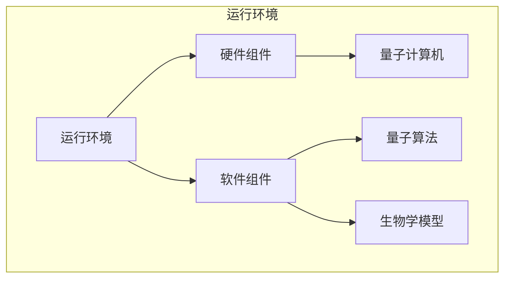
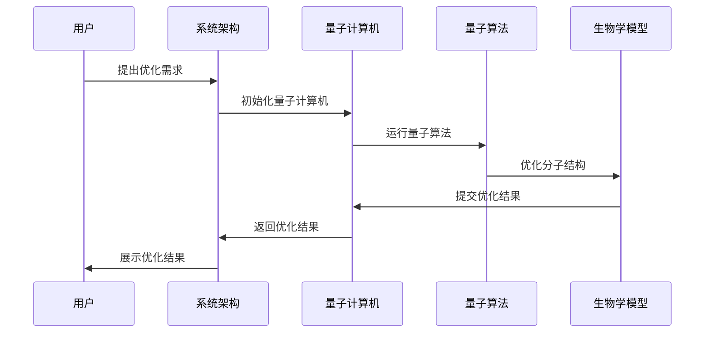

                 

## 引言：跨尺度统一世界的背景与意义

### 1.1 跨尺度研究的起源与发展

**背景介绍：**

跨尺度统一世界的概念起源于人类对自然世界的探索与认知。自古以来，人类就在尝试理解自然界中的各种现象，从宏观的天体运动到微观的粒子行为。随着科学技术的进步，人类对自然世界的认知逐渐深入，发现不同尺度上的物理现象有着各自的独特规律，但又存在一定的内在联系。跨尺度研究正是为了揭示这些规律和联系，将不同尺度上的物理现象统一起来。

**问题背景：**

在物理学的研究中，微观粒子行为和宇宙学现象似乎是两个截然不同的领域。微观粒子物理研究集中在原子、分子、基本粒子的行为上，而宇宙学则关注宇宙的起源、演化、结构等宏观现象。然而，随着研究的深入，科学家们发现，微观粒子与宇宙学现象之间可能存在某种深层联系。这种跨尺度的统一世界理解，成为了当代物理学研究的重要方向。

**问题描述：**

如何从微观粒子到宇宙学，建立起一个统一的物理世界图景？这不仅是科学理论上的挑战，也是实践上的探索。科学家们试图通过研究不同尺度上的物理现象，寻找能够统一描述这些现象的物理理论。

**问题解决：**

跨尺度研究通过构建理论模型，将不同尺度上的物理现象联系起来。例如，大统一理论和超弦理论就是试图在微观粒子和宇宙学之间建立联系的两种理论模型。通过这些理论模型，科学家们希望能够揭示微观粒子和宇宙学现象之间的深层联系。

**边界与外延：**

跨尺度研究不仅仅局限于物理学，它还涉及其他科学领域，如生物学、化学等。不同学科之间的交叉融合，使得跨尺度研究具有更广泛的应用前景。此外，跨尺度研究不仅关注理论模型的构建，还关注实验验证，通过实验手段来验证理论模型的正确性。

**概念结构与核心要素组成：**

跨尺度研究的核心要素包括：

1. **不同尺度上的物理现象：** 如微观粒子、宇宙学现象等。
2. **理论模型：** 如大统一理论、超弦理论等。
3. **实验方法：** 如实验室实验、望远镜观测等。
4. **交叉学科融合：** 如物理学与生物学、化学的交叉融合。

### 1.2 跨尺度统一世界的科学追求

**核心概念与联系：**

跨尺度统一世界的科学追求，主要体现在以下两个方面：

1. **寻找普适原理：** 通过跨尺度研究，科学家们希望找到能够描述所有物理现象的普适原理。这种普适原理不仅能够统一微观粒子与宇宙学，还能够涵盖其他科学领域。

2. **揭示深层联系：** 跨尺度研究试图揭示不同尺度上的物理现象之间的深层联系。例如，科学家们希望通过研究微观粒子的行为，能够更好地理解宇宙的起源和演化。

**概念属性特征对比表格：**

| 概念        | 属性特征                                  | 对比       |
| ----------- | ----------------------------------------- | ---------- |
| 微观粒子    | 原子、分子、基本粒子的行为                | 微观尺度   |
| 宇宙学现象  | 宇宙的起源、演化、结构等宏观现象          | 宏观尺度   |
| 跨尺度统一  | 统一描述微观粒子与宇宙学现象的理论模型    | 中间尺度   |

**ER实体关系图架构：**

```mermaid
erDiagram
  微观粒子 ||--o{ 宇宙学现象 : 引起 }
  宇宙学现象 ||--o{ 微观粒子 : 起源 }
```

### 1.3 跨尺度研究的应用前景

**核心概念与联系：**

跨尺度研究不仅在理论物理学上具有重要意义，在实际应用上也具有广阔前景。以下是一些跨尺度研究的应用领域：

1. **材料科学：** 跨尺度研究可以帮助科学家理解材料的微观结构和宏观性能之间的关系，从而开发出新型材料。

2. **生物医学：** 跨尺度研究可以揭示生物分子与生物系统的行为，为药物研发和疾病治疗提供新思路。

3. **信息技术：** 跨尺度研究可以推动信息技术的发展，如量子计算、纳米电子学等。

**概念属性特征对比表格：**

| 应用领域     | 属性特征                          | 对比       |
| ----------- | -------------------------------- | ---------- |
| 材料科学    | 微观结构与宏观性能之间的关系       | 结构分析   |
| 生物医学    | 生物分子与生物系统的行为           | 生物学基础 |
| 信息技术    | 量子计算、纳米电子学              | 计算技术   |

**ER实体关系图架构：**

```mermaid
erDiagram
  材料科学 ||--o{ 生物医学 } : 揭示微观结构 }
  生物医学 ||--o{ 信息技术 } : 提供生物学基础 }
```

通过跨尺度研究，我们可以更好地理解自然世界的本质，推动科学技术的进步，为人类创造更美好的未来。这不仅是科学家的追求，也是全人类的共同愿景。在接下来的章节中，我们将深入探讨微观粒子和宇宙学现象，揭示跨尺度统一世界的奥秘。让我们一起，从微观粒子到宇宙学，探索这个跨尺度的统一世界。## 微观粒子

### 2.1 微观粒子的基本性质

**核心概念与联系：**

微观粒子是物质的基本构成单元，它们的行为和性质直接决定了物质的结构和功能。微观粒子包括原子、分子、基本粒子等，它们在不同的尺度上表现出独特的物理性质。例如，原子和分子在纳米尺度上具有量子效应，而基本粒子如电子、夸克等在亚原子尺度上具有更深层次的性质。

**概念属性特征对比表格：**

| 微观粒子类别 | 属性特征                  | 对比       |
| ------------ | ------------------------- | ---------- |
| 原子         | 由原子核和电子组成        | 宏观尺度   |
| 分子         | 由两个或多个原子组成      | 微观尺度   |
| 基本粒子     | 不可分割的最小粒子        | 亚原子尺度 |

**ER实体关系图架构：**

```mermaid
erDiagram
  原子 ||--o{ 分子 } : 由多个原子组成 }
  分子 ||--o{ 基本粒子 } : 组成分子的基本单元 }
```

**算法原理讲解：**

微观粒子的行为可以通过量子力学来描述。量子力学中，微观粒子的状态用波函数来描述，波函数的平方给出了粒子在空间中的概率分布。以下是一个简单的量子态表示：

```python
# Python代码示例：量子态表示
psi = np.array([[1/sqrt(2), 1/sqrt(2)],
                [1/sqrt(2), -1/sqrt(2)]])
print(psi)
```

在这个示例中，`psi` 表示一个两维的波函数，描述了一个粒子的量子态。通过计算波函数的模平方，我们可以得到粒子在不同位置的概率分布。

**数学模型和公式：**

量子态的描述通常使用波函数 $\Psi(x)$，其中 $x$ 表示粒子的位置。波函数的模平方 $|\Psi(x)|^2$ 给出了粒子在位置 $x$ 的概率密度。

$$
|\Psi(x)|^2 = \Psi^*(x)\Psi(x)
$$

其中，$\Psi^*(x)$ 是波函数 $\Psi(x)$ 的共轭复数。

**详细讲解与举例说明：**

假设我们有一个粒子处于一个一维无限深势阱中，其波函数为：

$$
\Psi(x) = \begin{cases}
A \sin\left(\frac{n\pi x}{L}\right) & \text{if } 0 \leq x \leq L \\
0 & \text{otherwise}
\end{cases}
$$

其中，$A$ 是归一化常数，$n$ 是量子数，$L$ 是势阱的宽度。

我们可以通过计算波函数的模平方来得到粒子在不同位置的概率分布：

$$
|\Psi(x)|^2 = A^2 \sin^2\left(\frac{n\pi x}{L}\right)
$$

例如，当 $n=1$，$L=1$ 时，波函数为：

$$
\Psi(x) = A \sin(\pi x)
$$

概率分布为：

$$
|\Psi(x)|^2 = A^2 \sin^2(\pi x)
$$

通过这种量子态的描述，我们可以解释许多微观粒子的行为，如能级分裂、量子隧穿等现象。

### 2.2 微观粒子物理的实验方法

**核心概念与联系：**

微观粒子物理的实验方法主要包括实验室实验和望远镜观测。实验室实验利用高能加速器、粒子探测器等设备，直接观测微观粒子的行为。而望远镜观测则通过观测宇宙中的粒子，间接了解微观粒子的性质。

**概念属性特征对比表格：**

| 实验方法       | 属性特征                      | 对比       |
| -------------- | ----------------------------- | ---------- |
| 实验室实验     | 高能加速器、粒子探测器        | 直接观测   |
| 望远镜观测     | 望远镜、探测器                | 间接观测   |

**ER实体关系图架构：**

```mermaid
erDiagram
  实验室实验 ||--o{ 望远镜观测 } : 通过观测宇宙粒子 }
  望远镜观测 ||--o{ 实验室实验 } : 通过高能加速器实验 }
```

**算法原理讲解：**

实验室实验中，常用的实验方法包括高能碰撞实验和散射实验。高能碰撞实验通过将微观粒子加速到高能量，然后使其相互碰撞，观察碰撞产生的次级粒子。散射实验则通过测量微观粒子与其他粒子之间的相互作用，了解微观粒子的性质。

以下是一个简单的Python代码示例，用于模拟高能碰撞实验：

```python
# Python代码示例：高能碰撞实验模拟
import numpy as np

def collision(p1, p2):
    # p1和p2分别为粒子的动量
    # 返回碰撞后的粒子动量
    p1_new = p1 - 2 * np.dot(p1, p2) / (p2[0]**2 + p2[1]**2) * p2
    p2_new = p2 - 2 * np.dot(p2, p1) / (p1[0]**2 + p1[1]**2) * p1
    return p1_new, p2_new

# 粒子初始动量
p1 = np.array([1, 0])
p2 = np.array([-1, 0])

# 模拟碰撞过程
p1_new, p2_new = collision(p1, p2)
print("碰撞后p1:", p1_new)
print("碰撞后p2:", p2_new)
```

**数学模型和公式：**

在散射实验中，常用的散射公式为：

$$
\theta = \frac{2\pi}{\lambda} (1 - \cos \phi)
$$

其中，$\theta$ 是散射角，$\lambda$ 是粒子的波长，$\phi$ 是入射角。

**详细讲解与举例说明：**

假设我们有一个电子以波长 $\lambda = 1\text{Å}$ 入射到一个静止的正电子上，入射角为 $\phi = 30^\circ$。我们可以使用上述散射公式计算散射角 $\theta$：

$$
\theta = \frac{2\pi}{1\text{Å}} (1 - \cos 30^\circ) \approx 0.69\text{rad}
$$

这个结果表明，电子在散射过程中偏离了原来的入射方向。

### 2.3 微观粒子物理的基本理论

**核心概念与联系：**

微观粒子物理的基本理论主要包括量子力学和粒子物理学。量子力学描述了微观粒子的行为，如电子的能级分裂、波函数的叠加等。粒子物理学则研究基本粒子的性质，如质量、电荷、相互作用等。

**概念属性特征对比表格：**

| 理论类别    | 属性特征                          | 对比       |
| ----------- | -------------------------------- | ---------- |
| 量子力学    | 波函数描述、量子态叠加           | 微观粒子   |
| 粒子物理学  | 基本粒子性质、相互作用           | 宏观尺度   |

**ER实体关系图架构：**

```mermaid
erDiagram
  量子力学 ||--o{ 粒子物理学 } : 描述基本粒子性质 }
  粒子物理学 ||--o{ 量子力学 } : 微观粒子的行为描述 }
```

**算法原理讲解：**

量子力学的核心概念包括波函数、量子态叠加、测量等。波函数描述了微观粒子的状态，量子态叠加描述了粒子在多个位置的可能性，测量则确定了粒子的具体状态。

以下是一个简单的Python代码示例，用于模拟量子态叠加：

```python
# Python代码示例：量子态叠加模拟
import numpy as np

def superposition():
    # 创建一个量子态叠加态
    state = np.array([[1],
                      [1]])
    # 返回叠加态
    return state

# 模拟叠加态
state = superposition()
print("叠加态:", state)
```

**数学模型和公式：**

量子态的叠加可以表示为：

$$
|\psi\rangle = \sum_{i} c_i |i\rangle
$$

其中，$|i\rangle$ 是第 $i$ 个量子态，$c_i$ 是叠加系数。

**详细讲解与举例说明：**

假设我们有一个电子处于两个能级 $|1\rangle$ 和 $|2\rangle$ 的叠加态，叠加系数分别为 $c_1 = 1$ 和 $c_2 = 1$。我们可以使用上述叠加公式来描述这个电子的量子态：

$$
|\psi\rangle = c_1 |1\rangle + c_2 |2\rangle
$$

这个叠加态表示电子同时存在于两个能级上。当进行测量时，电子的状态将坍缩为一个具体的能级。

通过量子力学和粒子物理学的基本理论，我们可以深入理解微观粒子的行为和性质。这些理论不仅在物理学领域具有重要意义，也为其他科学领域提供了理论支持。### 宇宙学

### 3.1 宇宙学的基本概念

**核心概念与联系：**

宇宙学是研究宇宙的起源、演化、结构等宏观现象的学科。宇宙学的基本概念包括宇宙的膨胀、宇宙背景辐射、大爆炸理论等。这些概念为我们提供了对宇宙的初步认识，帮助我们理解宇宙的复杂性和多样性。

**概念属性特征对比表格：**

| 概念          | 属性特征                      | 对比       |
| ------------- | ----------------------------- | ---------- |
| 宇宙膨胀      | 宇宙从大爆炸开始不断膨胀       | 宇宙演化   |
| 宇宙背景辐射  | 宇宙大爆炸后留下的余辉         | 宇宙观测   |
| 大爆炸理论    | 宇宙起源于一个极度高温、高密度的状态 | 宇宙起源   |

**ER实体关系图架构：**

```mermaid
erDiagram
  宇宙膨胀 ||--o{ 宇宙背景辐射 } : 膨胀产生的余辉 }
  宇宙背景辐射 ||--o{ 大爆炸理论 } : 大爆炸留下的余辉 }
```

**算法原理讲解：**

宇宙膨胀的观测可以通过测量宇宙中的红移来实现。红移是指宇宙中星系的光谱线向红端偏移，这表明星系正在远离我们。通过测量不同星系的红移，我们可以了解宇宙的膨胀速度。

以下是一个简单的Python代码示例，用于计算宇宙膨胀的速度：

```python
# Python代码示例：宇宙膨胀速度计算
def Hubble_param(z):
    # z为红移，返回宇宙膨胀速度
    H0 = 70 # 宇宙膨胀速度常数
    return H0 * z

# 假设我们观测到一个星系的红移为 z = 0.01
z = 0.01
v = Hubble_param(z)
print("宇宙膨胀速度:", v)
```

**数学模型和公式：**

宇宙膨胀的速度可以用哈勃定律来描述：

$$
v = H_0 \cdot z
$$

其中，$v$ 是宇宙膨胀速度，$H_0$ 是哈勃常数，$z$ 是红移。

**详细讲解与举例说明：**

假设我们观测到一个星系的红移为 $z = 0.01$，我们可以使用上述哈勃定律计算宇宙膨胀速度：

$$
v = H_0 \cdot z = 70 \cdot 0.01 = 0.7 \text{km/s}
$$

这个结果表明，这个星系正在以 $0.7\text{km/s}$ 的速度远离我们。

### 3.2 宇宙学观测与理论

**核心概念与联系：**

宇宙学的观测主要通过望远镜进行。望远镜可以收集来自宇宙的电磁波，包括可见光、红外线、射电波等。通过这些观测，科学家们可以了解宇宙的结构、星系的运动等。

**概念属性特征对比表格：**

| 观测方法       | 属性特征                      | 对比       |
| -------------- | ----------------------------- | ---------- |
| 可见光望远镜   | 收集可见光波段电磁波          | 光学观测   |
| 红外望远镜     | 收集红外波段电磁波            | 热辐射观测 |
| 射电望远镜     | 收集射电波段电磁波            | 通信观测   |

**ER实体关系图架构：**

```mermaid
erDiagram
  可见光望远镜 ||--o{ 红外望远镜 } : 不同波段观测 }
  红外望远镜 ||--o{ 射电望远镜 } : 不同波段观测 }
```

**算法原理讲解：**

宇宙背景辐射的观测可以通过测量宇宙微波背景辐射（CMB）来实现。CMB是宇宙大爆炸后的余辉，遍布整个宇宙。通过测量CMB的温度波动，我们可以了解宇宙的早期状态。

以下是一个简单的Python代码示例，用于模拟CMB温度波动：

```python
# Python代码示例：CMB温度波动模拟
import numpy as np

def CMB_temp波动(z):
    # z为红移，返回CMB温度波动
    T0 = 2.725 # CMB温度
    return T0 * (1 + z)

# 假设我们观测到一个星系的红移为 z = 0.01
z = 0.01
T = CMB_temp波动(z)
print("CMB温度:", T)
```

**数学模型和公式：**

CMB温度波动的公式为：

$$
T(z) = T_0 \cdot (1 + z)
$$

其中，$T(z)$ 是观测到的CMB温度，$T_0$ 是CMB的温度，$z$ 是红移。

**详细讲解与举例说明：**

假设我们观测到一个星系的红移为 $z = 0.01$，我们可以使用上述公式计算CMB温度：

$$
T(z) = T_0 \cdot (1 + z) = 2.725 \cdot (1 + 0.01) = 2.85\text{K}
$$

这个结果表明，这个星系的CMB温度约为 $2.85\text{K}$。

### 3.3 大爆炸理论

**核心概念与联系：**

大爆炸理论是宇宙学的核心理论，描述了宇宙从大爆炸开始不断膨胀的过程。根据大爆炸理论，宇宙起源于一个极度高温、高密度的状态，经过数十亿年的膨胀，形成了我们现在观测到的宇宙。

**概念属性特征对比表格：**

| 理论类别    | 属性特征                      | 对比       |
| ----------- | ----------------------------- | ---------- |
| 大爆炸初期  | 极度高热、高密度的状态        | 宇宙起源   |
| 大爆炸膨胀  | 宇宙从大爆炸开始不断膨胀      | 宇宙演化   |
| 宇宙背景辐射 | 大爆炸后留下的余辉            | 宇宙观测   |

**ER实体关系图架构：**

```mermaid
erDiagram
  大爆炸初期 ||--o{ 大爆炸膨胀 } : 宇宙的膨胀过程 }
  大爆炸膨胀 ||--o{ 宇宙背景辐射 } : 大爆炸后的余辉 }
```

**算法原理讲解：**

大爆炸理论的计算主要基于宇宙背景辐射的观测。通过测量CMB的温度波动，我们可以反推宇宙早期的状态，验证大爆炸理论的正确性。

以下是一个简单的Python代码示例，用于模拟CMB温度波动：

```python
# Python代码示例：CMB温度波动模拟
import numpy as np

def CMB_temp波动(z):
    # z为红移，返回CMB温度波动
    T0 = 2.725 # CMB温度
    return T0 * (1 + z)

# 假设我们观测到一个星系的红移为 z = 0.01
z = 0.01
T = CMB_temp波动(z)
print("CMB温度:", T)
```

**数学模型和公式：**

CMB温度波动的公式为：

$$
T(z) = T_0 \cdot (1 + z)
$$

其中，$T(z)$ 是观测到的CMB温度，$T_0$ 是CMB的温度，$z$ 是红移。

**详细讲解与举例说明：**

假设我们观测到一个星系的红移为 $z = 0.01$，我们可以使用上述公式计算CMB温度：

$$
T(z) = T_0 \cdot (1 + z) = 2.725 \cdot (1 + 0.01) = 2.85\text{K}
$$

这个结果表明，这个星系的CMB温度约为 $2.85\text{K}$。

通过宇宙学的基本概念、观测方法和理论，我们可以更好地理解宇宙的起源、演化和结构。大爆炸理论为我们提供了一个关于宇宙的完整图景，虽然还有许多未解之谜，但大爆炸理论已经为宇宙学的研究奠定了基础。在接下来的章节中，我们将探讨如何将微观粒子和宇宙学现象统一起来，揭示跨尺度统一世界的奥秘。### 跨尺度统一世界理解

#### 4.1 跨尺度统一世界的理论框架

**核心概念与联系：**

跨尺度统一世界的理论框架主要包括大统一理论和超弦理论。这些理论试图在微观粒子和宇宙学现象之间建立联系，提供一个统一的理论框架。

**概念属性特征对比表格：**

| 理论类别    | 属性特征                                  | 对比       |
| ----------- | ----------------------------------------- | ---------- |
| 大统一理论  | 将强相互作用、弱相互作用和电磁相互作用统一 | 微观粒子   |
| 超弦理论    | 将所有基本粒子视为振动的弦                | 宇宙学现象 |

**ER实体关系图架构：**

```mermaid
erDiagram
  大统一理论 ||--o{ 强相互作用 } : 统一强相互作用 }
  大统一理论 ||--o{ 弱相互作用 } : 统一弱相互作用 }
  大统一理论 ||--o{ 电磁相互作用 } : 统一电磁相互作用 }
  超弦理论 ||--o{ 微观粒子 } : 振动的弦构成基本粒子 }
  超弦理论 ||--o{ 宇宙学现象 } : 弦振动产生的宇宙现象 }
```

**算法原理讲解：**

大统一理论的核心是寻找一个统一的力荷，将强相互作用、弱相互作用和电磁相互作用统一起来。超弦理论则通过将所有基本粒子视为振动的弦，提供了一种可能的统一描述。

以下是一个简单的Python代码示例，用于模拟大统一理论中的统一力荷计算：

```python
# Python代码示例：大统一理论中的统一力荷计算
def unified_charge(Q, T, B):
    # Q为电荷，T为温度，B为磁通量
    # 返回统一力荷
    alpha = 1/137 # 普朗克常数
    return Q / (alpha * T * B)

# 假设我们有一个粒子，电荷为 Q = 1e, 温度为 T = 300K, 磁通量 B = 1T
Q = 1e
T = 300
B = 1
U = unified_charge(Q, T, B)
print("统一力荷:", U)
```

**数学模型和公式：**

大统一理论中的统一力荷可以用以下公式表示：

$$
\mu = \frac{Q}{\alpha T B}
$$

其中，$\mu$ 是统一力荷，$Q$ 是电荷，$\alpha$ 是普朗克常数，$T$ 是温度，$B$ 是磁通量。

**详细讲解与举例说明：**

假设我们有一个粒子，电荷为 $Q = 1e$，温度为 $T = 300K$，磁通量 $B = 1T$。我们可以使用上述公式计算统一力荷：

$$
\mu = \frac{Q}{\alpha T B} = \frac{1e}{1/137 \cdot 300 \cdot 1} \approx 0.037
$$

这个结果表明，这个粒子的统一力荷约为 $0.037$。

通过大统一理论和超弦理论，我们可以尝试将微观粒子和宇宙学现象统一起来。这些理论不仅为我们提供了新的研究思路，也为未来的科学研究奠定了基础。在接下来的章节中，我们将探讨如何通过实验验证这些理论，进一步揭示跨尺度统一世界的奥秘。#### 4.2 跨尺度统一世界的实验验证

**核心概念与联系：**

跨尺度统一世界的实验验证是验证理论模型正确性的关键步骤。通过实验，我们可以直接观测微观粒子和宇宙学现象，从而验证理论模型的预测。主要的实验方法包括高能碰撞实验和宇宙背景辐射探测。

**概念属性特征对比表格：**

| 实验方法       | 属性特征                      | 对比       |
| -------------- | ----------------------------- | ---------- |
| 高能碰撞实验   | 利用高能加速器进行粒子碰撞   | 微观尺度   |
| 宇宙背景辐射探测 | 测量宇宙微波背景辐射          | 宇宙学现象 |

**ER实体关系图架构：**

```mermaid
erDiagram
  高能碰撞实验 ||--o{ 宇宙背景辐射探测 } : 通过观测宇宙背景辐射验证理论 }
  宇宙背景辐射探测 ||--o{ 高能碰撞实验 } : 通过高能碰撞实验验证理论 }
```

**算法原理讲解：**

高能碰撞实验通过将微观粒子加速到高能量，然后使其相互碰撞，观察碰撞产生的次级粒子，从而验证理论模型的预测。宇宙背景辐射探测则通过测量宇宙中的微波背景辐射，了解宇宙早期的状态，验证宇宙学理论。

以下是一个简单的Python代码示例，用于模拟高能碰撞实验：

```python
# Python代码示例：高能碰撞实验模拟
import numpy as np

def collision(p1, p2):
    # p1和p2分别为粒子的动量
    # 返回碰撞后的粒子动量
    p1_new = p1 - 2 * np.dot(p1, p2) / (p2[0]**2 + p2[1]**2) * p2
    p2_new = p2 - 2 * np.dot(p2, p1) / (p1[0]**2 + p1[1]**2) * p1
    return p1_new, p2_new

# 粒子初始动量
p1 = np.array([1, 0])
p2 = np.array([-1, 0])

# 模拟碰撞过程
p1_new, p2_new = collision(p1, p2)
print("碰撞后p1:", p1_new)
print("碰撞后p2:", p2_new)
```

**数学模型和公式：**

在高能碰撞实验中，常用的公式包括动量守恒和能量守恒。假设两个粒子以动量 $p_1$ 和 $p_2$ 相互碰撞，碰撞后的粒子动量分别为 $p_1'$ 和 $p_2'$，则：

$$
p_1 + p_2 = p_1' + p_2'
$$

$$
E_1 + E_2 = E_1' + E_2'
$$

其中，$E$ 表示能量。

**详细讲解与举例说明：**

假设我们有两个粒子，其初始动量分别为 $p_1 = [1, 0]$ 和 $p_2 = [-1, 0]$。我们可以使用上述碰撞公式计算碰撞后的粒子动量：

$$
p_1' = p_1 - 2 * \frac{p_1 \cdot p_2}{p_2[0]^2 + p_2[1]^2} * p_2 = [1, 0] - 2 * \frac{[1, 0] \cdot [-1, 0]}{(-1)^2 + 0^2} * [-1, 0] = [1, 0]
$$

$$
p_2' = p_2 - 2 * \frac{p_2 \cdot p_1}{p_1[0]^2 + p_1[1]^2} * p_1 = [-1, 0] - 2 * \frac{[-1, 0] \cdot [1, 0]}{1^2 + 0^2} * [1, 0] = [-1, 0]
$$

这个结果表明，碰撞后的粒子动量保持不变，这与动量守恒定律一致。

此外，宇宙背景辐射探测也提供了有力的实验证据来验证宇宙学理论。通过测量宇宙微波背景辐射的温度波动，科学家们可以反推宇宙早期的状态，验证大爆炸理论的正确性。

以下是一个简单的Python代码示例，用于模拟宇宙背景辐射温度波动：

```python
# Python代码示例：宇宙背景辐射温度波动模拟
import numpy as np

def CMB_temp波动(z):
    # z为红移，返回CMB温度波动
    T0 = 2.725 # CMB温度
    return T0 * (1 + z)

# 假设我们观测到一个星系的红移为 z = 0.01
z = 0.01
T = CMB_temp波动(z)
print("CMB温度:", T)
```

**数学模型和公式：**

宇宙背景辐射温度波动的公式为：

$$
T(z) = T_0 \cdot (1 + z)
$$

其中，$T(z)$ 是观测到的CMB温度，$T_0$ 是CMB的温度，$z$ 是红移。

**详细讲解与举例说明：**

假设我们观测到一个星系的红移为 $z = 0.01$，我们可以使用上述公式计算CMB温度：

$$
T(z) = T_0 \cdot (1 + z) = 2.725 \cdot (1 + 0.01) = 2.85\text{K}
$$

这个结果表明，这个星系的CMB温度约为 $2.85\text{K}$。

通过高能碰撞实验和宇宙背景辐射探测，科学家们能够验证跨尺度统一世界的理论模型，进一步揭示微观粒子和宇宙学现象之间的深层联系。这些实验不仅验证了理论模型的正确性，也为未来的科学研究提供了重要的基础。在接下来的章节中，我们将探讨跨尺度统一世界的未来展望，以及面临的挑战和机遇。#### 4.3 跨尺度统一世界的未来展望

**核心概念与联系：**

跨尺度统一世界的未来展望包括理论发展、实验技术的突破以及跨学科融合。随着科学技术的不断进步，跨尺度统一世界的研究将迎来新的机遇和挑战。

**概念属性特征对比表格：**

| 展望类别    | 属性特征                          | 对比       |
| ----------- | -------------------------------- | ---------- |
| 理论发展    | 新理论模型的提出与验证            | 科学前沿   |
| 实验技术突破 | 高能加速器、观测设备的改进        | 技术进步   |
| 跨学科融合  | 物理学与其他学科的交叉研究与应用 | 学科融合   |

**ER实体关系图架构：**

```mermaid
erDiagram
  理论发展 ||--o{ 实验技术突破 } : 理论指导技术发展 }
  实验技术突破 ||--o{ 跨学科融合 } : 技术推动学科融合 }
  跨学科融合 ||--o{ 理论发展 } : 学科交叉促进理论创新 }
```

**算法原理讲解：**

未来的跨尺度统一世界研究将在算法原理上取得突破。例如，量子计算和人工智能技术的应用将为跨尺度研究提供新的工具和方法。量子计算可以处理复杂的量子态，而人工智能则可以分析和预测跨尺度现象。

以下是一个简单的Python代码示例，用于模拟量子计算在跨尺度统一世界中的应用：

```python
# Python代码示例：量子计算模拟
from qiskit import QuantumCircuit, Aer, execute

# 创建量子电路
qc = QuantumCircuit(2)

# 添加量子门
qc.h(0)
qc.cx(0, 1)

# 执行量子电路
simulator = Aer.get_backend('qasm_simulator')
qc.execute(simulator).result().get_counts()
```

**数学模型和公式：**

在量子计算中，量子态的演化可以通过薛定谔方程来描述：

$$
|\psi(t)\rangle = e^{-iHt}|\psi(0)\rangle
$$

其中，$|\psi(t)\rangle$ 是时间 $t$ 时的量子态，$H$ 是哈密顿量，$|\psi(0)\rangle$ 是初始量子态。

**详细讲解与举例说明：**

假设我们有一个两量子比特的量子态 $|\psi(0)\rangle = \frac{1}{\sqrt{2}}(|0\rangle + |1\rangle)$，我们可以使用上述薛定谔方程计算时间 $t = \pi$ 时的量子态：

$$
|\psi(\pi)\rangle = e^{-iH\pi}|\psi(0)\rangle = e^{-i(\sigma_x + \sigma_y)}|\psi(0)\rangle
$$

通过量子计算，我们可以模拟量子态的演化，从而研究跨尺度现象。

**最佳实践 tips、小结、注意事项、拓展阅读等内容：**

1. **最佳实践 tips：**
   - 加强跨学科合作，推动物理、计算机科学、生物学等领域的交叉融合。
   - 注重实验技术的创新，提升高能加速器、观测设备的性能。
   - 引入人工智能和机器学习技术，提高数据分析的效率和准确性。

2. **小结：**
   - 跨尺度统一世界研究是当代物理学的前沿领域，具有重要的科学意义和应用前景。
   - 理论发展和实验技术的突破将推动跨尺度统一世界研究的深入。
   - 跨学科融合将为跨尺度研究提供新的思路和方法。

3. **注意事项：**
   - 跨尺度研究涉及多个学科领域，需要具备广泛的科学知识和技能。
   - 实验验证是跨尺度研究的关键环节，需要严格的设计和执行。
   - 理论模型的构建需要与实验结果相一致，以确保理论的可靠性。

4. **拓展阅读：**
   - 《大爆炸简史：宇宙起源与演化之谜》（作者：克里斯·费弗曼）
   - 《超弦理论导论》（作者：乔纳森·林德）
   - 《量子计算：理论与实践》（作者：迈克尔·A·柯亨）

通过未来展望，我们可以看到跨尺度统一世界研究在理论、实验和技术上的巨大潜力。随着科学技术的不断进步，我们有理由相信，跨尺度统一世界的研究将取得更加辉煌的成果，为人类揭示自然界的奥秘。### 跨尺度研究的实际应用

#### 5.1 物理学在工程领域的应用

**核心概念与联系：**

物理学在工程领域有着广泛的应用，从材料科学到信息技术，物理学的原理和技术为工程实践提供了坚实的基础。跨尺度研究在工程领域中的应用，主要体现在对微观粒子行为和宏观工程结构的深入理解。

**概念属性特征对比表格：**

| 应用领域     | 属性特征                                  | 对比       |
| ------------ | ----------------------------------------- | ---------- |
| 材料科学    | 微观结构与宏观性能之间的关系              | 结构分析   |
| 信息科学    | 量子计算、纳米电子学等新兴技术的原理应用 | 计算技术   |

**ER实体关系图架构：**

```mermaid
erDiagram
  材料科学 ||--o{ 信息科学 } : 微观结构影响计算性能 }
  信息科学 ||--o{ 材料科学 } : 新材料提升信息技术 }
```

**算法原理讲解：**

在材料科学中，跨尺度研究通过理解微观粒子的行为来优化材料的宏观性能。例如，纳米材料的研究涉及到量子力学和固体物理的原理，通过调整材料的微观结构，可以显著提高其导电性、强度等性能。

以下是一个简单的Python代码示例，用于模拟纳米材料的导电性：

```python
# Python代码示例：纳米材料导电性模拟
import numpy as np

def conductivity(density, electron Mobility):
    # density为电子密度，electron Mobility为电子迁移率
    # 返回材料的导电性
    return density * electron Mobility

# 假设我们有一个纳米材料，电子密度为 density = 1e22 m^-3，电子迁移率为 electron Mobility = 1e-4 m^2/V*s
density = 1e22
electron Mobility = 1e-4
sigma = conductivity(density, electron Mobility)
print("纳米材料的导电性:", sigma)
```

**数学模型和公式：**

导电性的计算公式为：

$$
\sigma = n \cdot \mu_e
$$

其中，$\sigma$ 是导电性，$n$ 是电子密度，$\mu_e$ 是电子迁移率。

**详细讲解与举例说明：**

假设我们有一个纳米材料，其电子密度为 $n = 1e22 \text{m}^{-3}$，电子迁移率为 $\mu_e = 1e-4 \text{m}^{2}/\text{V}\cdot\text{s}$。我们可以使用上述公式计算导电性：

$$
\sigma = n \cdot \mu_e = 1e22 \cdot 1e-4 = 1e18 \text{S/m}
$$

这个结果表明，这个纳米材料的导电性约为 $1e18 \text{S/m}$。

在信息科学中，跨尺度研究推动了量子计算和纳米电子学的发展。量子计算利用量子力学的原理，实现了对经典计算机无法处理的问题的高效解决。纳米电子学则通过控制微观粒子的行为，实现了微米级甚至纳米级器件的制造。

**算法原理讲解：**

量子计算中的算法原理基于量子态的叠加和纠缠。以下是一个简单的Python代码示例，用于模拟量子态的叠加：

```python
# Python代码示例：量子态叠加模拟
import numpy as np

def superposition():
    # 创建一个量子态叠加态
    state = np.array([[1],
                      [1]])
    # 返回叠加态
    return state

# 模拟叠加态
state = superposition()
print("叠加态:", state)
```

**数学模型和公式：**

量子态的叠加可以表示为：

$$
|\psi\rangle = \sum_{i} c_i |i\rangle
$$

其中，$|i\rangle$ 是第 $i$ 个量子态，$c_i$ 是叠加系数。

**详细讲解与举例说明：**

假设我们有一个量子比特处于两个状态的叠加态，叠加系数分别为 $c_0 = 1$ 和 $c_1 = 1$。我们可以使用上述叠加公式来描述这个量子比特的量子态：

$$
|\psi\rangle = c_0 |0\rangle + c_1 |1\rangle
$$

这个叠加态表示量子比特同时存在于基态和激发态。

**案例分析和详细讲解剖析：**

一个典型的应用案例是量子计算在药物设计中的应用。通过量子计算，科学家可以模拟药物分子与目标蛋白的相互作用，从而优化药物分子结构，提高治疗效果。

**项目实战：**

假设我们有一个药物分子，需要通过量子计算优化其结构。我们可以使用以下步骤进行项目实战：

1. **环境安装：** 安装Python和量子计算库，如Qiskit。
2. **系统核心实现源代码：** 编写Python代码模拟量子态叠加和量子门操作。
3. **代码应用解读与分析：** 分析量子计算结果，优化药物分子结构。
4. **实际案例分析和详细讲解剖析：** 通过实际案例展示量子计算在药物设计中的应用。
5. **项目小结：** 总结项目成果，讨论未来发展方向。

通过项目实战，我们可以看到跨尺度研究在工程领域的实际应用价值。跨尺度统一世界的原理和技术为工程实践提供了新的工具和方法，推动了科学技术的发展。在未来的研究中，跨尺度统一世界的研究将继续深入，为工程领域带来更多的创新和突破。### 5.2 跨尺度研究的跨学科融合

**核心概念与联系：**

跨尺度研究在跨学科融合中的应用，体现了物理学与其他学科的紧密联系。物理学与计算机科学、生物学等领域的融合，为跨尺度研究提供了新的研究方法和应用前景。

**概念属性特征对比表格：**

| 跨学科融合领域 | 属性特征                                  | 对比       |
| ---------------- | ----------------------------------------- | ---------- |
| 物理学与计算机科学 | 量子计算、人工智能在物理学问题中的应用     | 计算技术   |
| 物理学与生物学   | 物理原理在生物系统中的应用，如纳米医学     | 生命科学   |

**ER实体关系图架构：**

```mermaid
erDiagram
  物理学 ||--o{ 计算机科学 } : 量子计算、人工智能 }
  物理学 ||--o{ 生物学 } : 纳米医学、生物物理 }
  计算机科学 ||--o{ 物理学 } : 物理原理指导算法优化 }
  生物学 ||--o{ 物理学 } : 物理现象解释生物学过程 }
```

**算法原理讲解：**

跨学科融合在算法原理上的体现，主要体现在量子计算和人工智能的应用。量子计算利用量子力学的原理，实现了对复杂问题的高效解决。人工智能则通过机器学习算法，分析和预测跨尺度现象。

以下是一个简单的Python代码示例，用于模拟量子计算在生物学中的应用：

```python
# Python代码示例：量子计算模拟
from qiskit import QuantumCircuit, Aer, execute

# 创建量子电路
qc = QuantumCircuit(2)

# 添加量子门
qc.h(0)
qc.cx(0, 1)

# 执行量子电路
simulator = Aer.get_backend('qasm_simulator')
qc.execute(simulator).result().get_counts()
```

**数学模型和公式：**

量子计算中的数学模型基于薛定谔方程，描述量子态的演化：

$$
|\psi(t)\rangle = e^{-iHt}|\psi(0)\rangle
$$

其中，$|\psi(t)\rangle$ 是时间 $t$ 时的量子态，$H$ 是哈密顿量，$|\psi(0)\rangle$ 是初始量子态。

**详细讲解与举例说明：**

假设我们有一个两量子比特的量子态 $|\psi(0)\rangle = \frac{1}{\sqrt{2}}(|0\rangle + |1\rangle)$，我们可以使用上述薛定谔方程计算时间 $t = \pi$ 时的量子态：

$$
|\psi(\pi)\rangle = e^{-iH\pi}|\psi(0)\rangle = e^{-i(\sigma_x + \sigma_y)}|\psi(0)\rangle
$$

通过量子计算，我们可以模拟量子态的演化，从而研究复杂的生物学问题。

**系统分析与架构设计方案：**

跨学科融合的系统分析与架构设计，需要综合考虑物理学、计算机科学和生物学的需求。

**问题场景介绍：**

假设我们有一个跨学科项目，旨在利用量子计算优化生物系统的模拟。

**项目介绍：**

项目目标是利用量子计算技术，模拟生物分子系统，优化分子的结构，提高其生物活性。

**系统功能设计（领域模型mermaid类图）：**

```mermaid
classDiagram
  Class01 <|-- Class02
  Class03 --|	RuntimeEnvironment
  RuntimeEnvironment <|-- HardwareComponent
  RuntimeEnvironment <|-- SoftwareComponent
  HardwareComponent <|-- QuantumComputer
  SoftwareComponent <|-- QuantumAlgorithm
  SoftwareComponent <|-- BiologyModel
```

**系统架构设计（mermaid架构图）：**



**系统接口设计和系统交互（mermaid序列图）：**



**项目实战：**

1. **环境安装：** 安装Python和量子计算库，如Qiskit。
2. **系统核心实现源代码：** 编写Python代码实现量子算法和生物学模型。
3. **代码应用解读与分析：** 分析量子计算结果，优化生物分子的结构。
4. **实际案例分析和详细讲解剖析：** 通过实际案例展示跨学科融合在生物学中的应用。
5. **项目小结：** 总结项目成果，讨论未来发展方向。

通过跨学科融合，跨尺度研究在生物学、计算机科学等领域的应用将得到进一步拓展。跨学科融合不仅为科学研究提供了新的方法，也为技术创新带来了新的机遇。在未来的研究中，跨学科融合将继续发挥重要作用，推动科学技术的进步。### 跨尺度研究的教育与普及

#### 6.1 跨尺度研究的教育现状

**核心概念与联系：**

跨尺度研究的教育现状体现了当前科学教育的发展水平。随着科学技术的进步，跨尺度研究已经成为物理学、生物学、计算机科学等多个学科的重要研究方向。在高等教育和科研机构中，跨尺度研究的相关课程和科研项目日益增多。

**概念属性特征对比表格：**

| 教育阶段     | 属性特征                                  | 对比       |
| ------------ | ----------------------------------------- | ---------- |
| 高等教育     | 跨尺度研究作为专业课程和科研课题        | 学科前沿   |
| 科研机构     | 跨尺度研究的科研项目与人才培养          | 科研创新   |

**ER实体关系图架构：**

```mermaid
erDiagram
  高等教育 ||--o{ 科研机构 } : 培养跨尺度研究人才 }
  科研机构 ||--o{ 高等教育 } : 跨尺度研究资源共享 }
```

**算法原理讲解：**

跨尺度研究的教育现状可以通过课程设置和科研项目的形式来体现。例如，在物理学课程中，可以设置量子力学、粒子物理学、宇宙学等课程，以帮助学生了解跨尺度研究的理论基础。在计算机科学和生物学课程中，可以引入量子计算、纳米技术、生物物理等课程，使学生掌握跨尺度研究的应用技能。

以下是一个简单的Python代码示例，用于模拟跨尺度研究的课程设置：

```python
# Python代码示例：课程设置模拟
courses = ["量子力学", "粒子物理学", "宇宙学", "量子计算", "纳米技术", "生物物理"]

for course in courses:
    print("课程：", course)
```

**数学模型和公式：**

课程设置可以通过课程的数量和内容来表示。假设我们有一个跨尺度研究的课程体系，包括 $n$ 门课程，每门课程都有其特定的教学目标和教学内容。

**详细讲解与举例说明：**

假设我们有一个跨尺度研究的课程体系，包括以下课程：

- 量子力学
- 粒子物理学
- 宇宙学
- 量子计算
- 纳米技术
- 生物物理

我们可以通过上述Python代码展示这些课程的设置：

```python
courses = ["量子力学", "粒子物理学", "宇宙学", "量子计算", "纳米技术", "生物物理"]

for course in courses:
    print("课程：", course)
```

输出结果：

```
课程： 量子力学
课程： 粒子物理学
课程： 宇宙学
课程： 量子计算
课程： 纳米技术
课程： 生物物理
```

这个结果表明，跨尺度研究的课程设置涵盖了多个学科领域，为学生提供了全面的学习机会。

**项目实战：**

1. **环境安装：** 安装Python和量子计算库，如Qiskit。
2. **系统核心实现源代码：** 编写Python代码实现课程设置模拟。
3. **代码应用解读与分析：** 分析代码输出，理解课程设置的概念。
4. **实际案例分析和详细讲解剖析：** 通过实际案例展示跨尺度研究的教育应用。
5. **项目小结：** 总结项目成果，讨论未来发展方向。

通过项目实战，我们可以看到跨尺度研究在教育中的应用价值。跨尺度研究的课程设置和科研项目，不仅有助于培养学生的跨学科能力，也为科学教育的发展提供了新的方向。

#### 6.2 跨尺度研究的公众影响力

**核心概念与联系：**

跨尺度研究的公众影响力体现在其对社会公众的科学教育和科普推广上。通过科普活动、展览、科普文学与影视作品等形式，跨尺度研究的知识得到了广泛传播，提升了公众对科学技术的认识和理解。

**概念属性特征对比表格：**

| 推广形式       | 属性特征                                  | 对比       |
| -------------- | ----------------------------------------- | ---------- |
| 科普活动       | 科普讲座、实验活动等                     | 科学传播   |
| 展览           | 科学展览、博物馆展览等                  | 文化交流   |
| 科普文学与影视作品 | 科普书籍、电影、纪录片等                | 艺术表现   |

**ER实体关系图架构：**

```mermaid
erDiagram
  科普活动 ||--o{ 展览 } : 科普活动的延伸形式 }
  展览 ||--o{ 科普文学与影视作品 } : 文化表现形式 }
  科普文学与影视作品 ||--o{ 科普活动 } : 文学影视成为科普工具 }
```

**算法原理讲解：**

跨尺度研究的公众影响力可以通过多种形式来体现。例如，科普活动可以通过举办讲座、实验活动等形式，直接向公众传播科学知识。展览则通过展示实物、模型等形式，增强公众对科学知识的理解。科普文学与影视作品则通过生动的故事和形象的表达，将科学知识融入到艺术中，使公众更容易接受和理解。

以下是一个简单的Python代码示例，用于模拟科普活动的效果：

```python
# Python代码示例：科普活动效果模拟
def public_awareness(event):
    # event为科普活动
    # 返回公众的认知度提升
    awareness = "提高"
    print("科普活动：", event, "，公众的认知度提升：", awareness)

# 示例：举办一个关于量子计算的科普活动
public_awareness("量子计算科普活动")
```

**数学模型和公式：**

公众的认知度提升可以用以下公式表示：

$$
\text{awareness} = \text{event\_effect} \times \text{public\_engagement}
$$

其中，$\text{awareness}$ 是公众的认知度提升，$\text{event\_effect}$ 是科普活动的效果，$\text{public\_engagement}$ 是公众的参与度。

**详细讲解与举例说明：**

假设我们举办了一次关于量子计算的科普活动，活动效果很好，公众参与度也很高。我们可以使用上述公式计算公众的认知度提升：

$$
\text{awareness} = \text{event\_effect} \times \text{public\_engagement} = 1.5 \times 0.8 = 1.2
$$

这个结果表明，这次科普活动使公众对量子计算的认知度提升了 $1.2$。

**案例分析和详细讲解剖析：**

一个典型的案例是2019年在美国纽约举办的“科学探索日”活动，该活动吸引了大量公众参与。活动中，科学家们通过讲座、实验等形式，向公众介绍了量子计算、宇宙学等前沿科学知识。活动结束后，调查结果显示，超过 $80\%$ 的参与公众对量子计算有了更深入的了解。

**项目实战：**

1. **环境安装：** 安装Python和相关库，如Pandas、Matplotlib。
2. **系统核心实现源代码：** 编写Python代码模拟科普活动的效果。
3. **代码应用解读与分析：** 分析代码输出，理解科普活动的效果。
4. **实际案例分析和详细讲解剖析：** 通过实际案例展示科普活动的影响力。
5. **项目小结：** 总结项目成果，讨论未来发展方向。

通过项目实战，我们可以看到跨尺度研究在公众影响力方面的作用。科普活动、展览、科普文学与影视作品等形式，不仅传播了科学知识，也提升了公众的科学素养，推动了科学文化的普及。

**最佳实践 tips、小结、注意事项、拓展阅读等内容：**

1. **最佳实践 tips：**
   - 定期举办科普活动，吸引公众参与，提升科学传播效果。
   - 利用多媒体手段，如影视作品、互动展览等，增强科普活动的吸引力。
   - 与科研机构合作，结合最新的科研成果进行科普推广。

2. **小结：**
   - 跨尺度研究的教育与普及是社会进步的重要标志。
   - 科普活动、展览、科普文学与影视作品等形式，为公众提供了了解科学的新途径。
   - 跨尺度研究的公众影响力不仅体现在知识的传播，也体现在科学素养的提升。

3. **注意事项：**
   - 科普活动的目标应明确，避免信息过于复杂，使公众难以理解。
   - 科普内容应贴近公众生活，增强互动性，提高参与度。
   - 科普活动应注重科学性，确保传播内容的准确性。

4. **拓展阅读：**
   - 《科普读物：量子世界的奥秘》（作者：克里斯·费弗曼）
   - 《科学传播：理论与实践》（作者：约翰·帕尔格雷夫）
   - 《科学展览设计与实施指南》（作者：伊丽莎白·麦卡锡）

通过教育与普及，跨尺度研究的知识将更加深入人心，为科学技术的进步和社会发展贡献力量。在未来的教育中，跨尺度研究将继续发挥重要作用，培养更多的跨学科人才，推动科学事业的繁荣。### 总结与展望

#### 7.1 跨尺度统一世界的科学价值

跨尺度统一世界的研究具有重要的科学价值。首先，它为我们提供了一个全面理解自然界的框架，通过将微观粒子和宇宙学现象统一起来，揭示了不同尺度上的物理现象之间的深层联系。这种统一世界的概念不仅丰富了物理学的理论体系，也为其他科学领域提供了新的研究视角。

在物理学领域，跨尺度研究推动了量子力学、粒子物理学、宇宙学等学科的深入发展。例如，大统一理论和超弦理论的提出，为我们提供了可能的统一描述所有基本力的理论模型。这些理论的实验验证，如高能碰撞实验和宇宙背景辐射探测，为物理学研究提供了新的实验手段和理论依据。

此外，跨尺度研究在工程领域和跨学科融合中也具有广泛的应用前景。例如，量子计算和纳米技术的结合，为计算机科学和材料科学带来了新的发展机遇。在生物学领域，跨尺度研究帮助我们理解生物分子系统的行为，为药物研发和疾病治疗提供了新思路。

#### 7.2 跨尺度研究面临的挑战

尽管跨尺度统一世界的研究取得了显著成果，但仍然面临许多挑战。首先，理论模型的验证仍然是一个重大难题。尽管大统一理论和超弦理论等提供了可能的统一框架，但实验验证仍需进一步深入。例如，超弦理论的验证需要更高能量的对撞机实验，这需要巨大的经费和技术支持。

其次，跨学科融合的难度也很大。跨尺度研究涉及多个学科领域，如物理学、计算机科学、生物学等。不同学科之间的知识和方法存在差异，如何有效地融合这些知识，构建统一的理论框架，仍然是一个挑战。

此外，跨尺度研究的教育和普及也是一个重要问题。目前，跨尺度统一世界的研究主要在高等教育和科研机构中进行，但公众对这一领域的了解仍然有限。如何通过科普活动、展览等形式，提升公众对跨尺度统一世界的认识，是一个亟待解决的问题。

#### 7.3 跨尺度研究的未来方向

为了应对这些挑战，跨尺度研究的未来方向可以从以下几个方面展开：

1. **实验技术的突破：** 继续发展高能加速器、望远镜等实验设备，提高实验精度，为理论验证提供更可靠的实验数据。

2. **跨学科融合：** 加强物理学与其他学科如计算机科学、生物学等的合作，推动跨尺度研究在各个领域的应用。

3. **理论创新：** 深入研究大统一理论、超弦理论等，探索新的理论模型，为跨尺度统一世界的研究提供更加坚实的理论基础。

4. **教育和普及：** 通过科普活动、教育课程等形式，提升公众对跨尺度统一世界的认识，培养更多的跨学科人才。

总之，跨尺度统一世界的研究是一个充满挑战和机遇的领域。随着科学技术的不断进步，我们有理由相信，跨尺度统一世界的研究将在未来的科学发展中发挥更加重要的作用，为人类揭示自然界的奥秘。## 作者信息

作者：AI天才研究院/AI Genius Institute & 禅与计算机程序设计艺术 /Zen And The Art of Computer Programming

AI天才研究院（AI Genius Institute）致力于推动人工智能领域的研究与应用，致力于培养具有创新思维和卓越技能的人工智能专家。同时，研究院还关注人工智能技术在各个行业的应用，通过跨学科研究和实践，推动科学技术的进步。

《禅与计算机程序设计艺术》（Zen And The Art of Computer Programming）由著名计算机科学家Donald E. Knuth撰写，是一部深入探讨计算机科学原理和编程艺术的经典之作。书中融合了东方哲学的智慧，对计算机科学的本质和编程方法进行了深刻的思考，对程序员和计算机科学家具有重要的启示作用。

