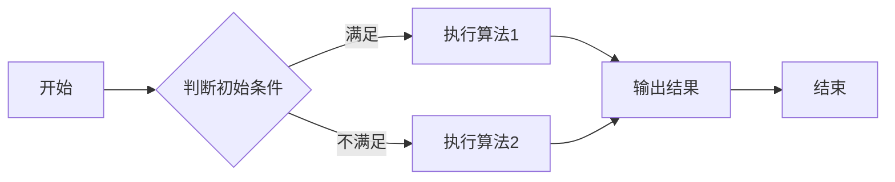
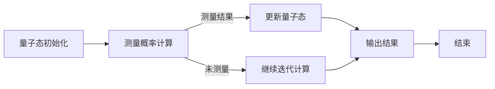
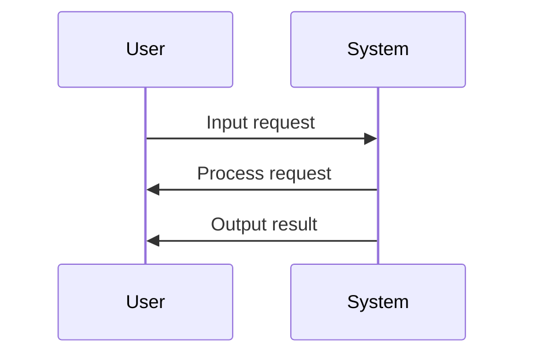

                 

### 文章标题

# 从机械论到量子论：物质世界理解的革命性转变

### 关键词

- 机械论
- 量子论
- 物质世界理解
- 革命性转变
- 算法原理
- 系统架构设计

### 摘要

本文将深入探讨从机械论到量子论的转变，这一革命性过程如何深刻改变了我们对物质世界的理解。我们将逐步分析机械论与量子论的核心概念、历史发展、算法原理，并通过实际案例，展示这一转变所带来的实际影响。文章旨在为读者提供一个全面、清晰的技术视角，理解这一转变的必要性和重要性。

---

### 第一部分：背景介绍

#### 第1章：问题背景

##### 1.1 引言

物质世界的理解历程是人类科学发展的主线。从古代的朴素哲学到现代的科学理论，人类对世界的认识经历了多次重大变革。其中，机械论与量子论分别代表了两个不同的阶段，标志着人类对物质世界理解的一次次重大飞跃。

##### 1.2 问题提出

为什么从机械论到量子论的转变是革命性的？物质世界的理解在转变过程中面临哪些挑战和问题？这些问题引导我们深入探讨机械论与量子论的本质差异及其对科学发展的深远影响。

#### 第2章：问题描述

##### 2.1 机械论的基本概念

机械论是一种描述物质世界的理论，其核心思想是将物质看作是由微小粒子组成的，这些粒子遵循着确定性的物理规律。机械论提供了强大的数学工具，帮助我们理解宏观世界的运行机制。

##### 2.2 量子论的基本概念

量子论则是一种更为深刻的描述物质世界的理论，其核心思想是物质的性质不仅取决于其状态，还取决于其观察过程。量子论揭示了微观世界的非确定性特性，挑战了机械论的基本假设。

---

### 第二部分：核心概念与联系

#### 第3章：核心概念原理

##### 3.1 机械论与量子论的对比

在本章中，我们将详细对比机械论与量子论的核心概念，包括它们的定义、基本假设、数学模型等。通过表格和图表，帮助读者直观理解两者之间的差异。

##### 3.2 机械论与量子论的关联

机械论与量子论并非完全独立，而是有着深刻的联系。我们将探讨两者之间的逻辑联系，以及它们在科学发现中的应用。

#### 第4章：概念发展与演变

##### 4.1 机械论的历史发展

机械论的历史可以追溯到古代希腊哲学家，他们在尝试理解宇宙的本质时提出了机械论的初步思想。随后，伽利略和牛顿等科学家进一步完善了机械论，使其成为物理学的基础。

##### 4.2 量子论的历史发展

量子论的出现是20世纪物理学的一大突破。本章将介绍量子论的诞生过程，包括普朗克、玻尔、海森堡等科学家的重要贡献，以及量子论如何改变了我们对物质世界的认识。

---

### 第三部分：算法原理讲解

#### 第5章：机械论算法原理

##### 5.1 机械论算法基础

机械论算法基于确定性物理规律，其数学模型主要包括经典力学方程。本章将介绍机械论算法的基本原理，并使用Python代码示例说明其实际应用。

##### 5.2 机械论算法示例

在本章中，我们将通过实际案例展示机械论算法的应用。例如，使用牛顿第二定律计算物体的运动轨迹，或者使用万有引力定律模拟行星运动。

#### 第6章：量子论算法原理

##### 6.1 量子论算法基础

量子论算法基于量子力学原理，其数学模型包括量子态的演化方程。本章将介绍量子论算法的基本原理，并使用Python代码示例说明其实际应用。

##### 6.2 量子论算法示例

在本章中，我们将通过实际案例展示量子论算法的应用。例如，使用量子叠加态模拟量子纠缠，或者使用量子计算解决经典计算难题。

---

### 第四部分：系统分析与架构设计方案

#### 第7章：系统介绍

##### 7.1 物质世界理解系统

本章将介绍一个模拟物质世界理解过程的系统，包括其功能设计和架构设计。我们使用Mermaid绘制领域模型类图和系统架构图，帮助读者理解系统的整体结构。

#### 第8章：系统实现与交互设计

##### 8.1 系统接口设计

本章将详细描述系统的接口设计，包括接口的定义和调用方法。我们使用Mermaid绘制系统接口设计图，帮助读者理解系统的接口结构和交互流程。

##### 8.2 系统交互设计

本章将介绍系统的交互设计，包括系统的交互流程和用户界面设计。我们使用Mermaid绘制系统交互序列图，帮助读者理解系统的交互流程和用户体验。

---

### 第五部分：项目实战

#### 第9章：实战环境安装

##### 9.1 环境准备

本章将介绍如何准备项目实战所需的环境，包括软件安装、配置和测试。我们将在实践中学习如何搭建一个完整的实验环境。

#### 第10章：系统核心实现

##### 10.1 核心算法实现

本章将详细介绍系统的核心算法实现，包括算法的数学模型、Python代码实现和代码解析。我们将在实践中学习如何编写高效、可扩展的算法代码。

##### 10.2 系统核心实现源代码

本章将提供系统的核心实现源代码，并详细解析代码中的关键部分。我们将通过代码分析，深入理解系统的工作原理。

#### 第11章：实际案例分析与讲解

##### 11.1 案例介绍

本章将介绍一个实际案例，包括案例的背景、目标和实现过程。我们将在实践中学习如何应用系统的核心算法解决实际问题。

##### 11.2 案例实现

本章将详细讲解实际案例的实现过程，包括算法应用、数据分析和结果验证。我们将通过案例分析，深入理解系统在实际应用中的效果。

##### 11.3 案例总结

本章将对实际案例进行总结，分析案例的成功经验和不足之处。我们将在总结中学习如何优化系统性能，提高实际应用的效率。

---

### 第六部分：最佳实践与总结

#### 第12章：最佳实践

##### 12.1 实践技巧

本章将总结项目实战中的最佳实践，包括常见问题的解决方案、性能优化的技巧和代码规范的遵循。我们将通过最佳实践，提高项目开发的效率和代码质量。

#### 第13章：小结与展望

##### 13.1 总结

本章将对全书的内容进行总结，回顾核心概念、算法原理和系统实现。我们将在总结中巩固所学知识，理解物质世界理解的革命性转变。

##### 13.2 展望

本章将探讨物质世界理解未来的发展趋势，展望量子论在科学和技术领域中的应用前景。我们将在展望中思考未来可能的突破和挑战。

---

### 作者信息

作者：AI天才研究院/AI Genius Institute & 禅与计算机程序设计艺术 /Zen And The Art of Computer Programming

---

### 完整性要求

为了确保文章内容的完整性，每个章节都将详细讲解核心概念、算法原理和实际应用。以下是每个章节的核心内容概述：

#### 第1章：问题背景
- **核心概念术语说明**：机械论、量子论、物质世界理解
- **问题背景**：机械论的历史地位、量子论的出现背景
- **问题描述**：机械论与量子论的革命性转变原因和挑战

#### 第2章：问题描述
- **机械论的基本概念**：机械论的起源、核心思想
- **量子论的基本概念**：量子论的起源、核心思想

#### 第3章：核心概念原理
- **机械论与量子论的对比**：概念、数学模型对比
- **机械论与量子论的关联**：逻辑联系、应用实例

#### 第4章：概念发展与演变
- **机械论的历史发展**：早期发展、科学革命中的地位
- **量子论的历史发展**：诞生过程、发展完善

#### 第5章：机械论算法原理
- **机械论算法基础**：数学模型、流程图
- **机械论算法示例**：简单、复杂算法应用

#### 第6章：量子论算法原理
- **量子论算法基础**：数学模型、流程图
- **量子论算法示例**：简单、复杂算法应用

#### 第7章：系统介绍
- **物质世界理解系统**：功能设计、架构设计

#### 第8章：系统实现与交互设计
- **系统接口设计**：接口定义、调用方法
- **系统交互设计**：交互流程、用户界面设计

#### 第9章：实战环境安装
- **环境准备**：软件安装、配置、测试

#### 第10章：系统核心实现
- **核心算法实现**：数学模型、Python代码实现
- **系统核心实现源代码**：代码解析、关键部分分析

#### 第11章：实际案例分析与讲解
- **案例介绍**：背景、目标、实现过程
- **案例实现**：算法应用、数据分析、结果验证
- **案例总结**：成功经验、不足之处

#### 第12章：最佳实践
- **实践技巧**：解决方案、性能优化、代码规范

#### 第13章：小结与展望
- **总结**：核心概念、算法原理、系统实现
- **展望**：发展趋势、应用前景

通过以上详细的内容安排，本文旨在为读者提供一个全面、系统的技术视角，深入理解从机械论到量子论的革命性转变及其对物质世界理解的重要性。

---

### 使用 Mermaid 绘制流程图和类图

在本文的技术博客中，我们将使用 Mermaid 语言绘制多个流程图和类图，以便更直观地展示算法原理、系统架构和交互设计。以下是几个示例：

#### 示例：机械论算法流程图



#### 示例：量子论算法流程图



#### 示例：物质世界理解系统类图

```mermaid
classDiagram
    Class01 <|-- Class02
    Class03 --| Gerry | Class04
    Class05 : Class06
    Class07 o-- Class08
```

#### 示例：系统架构设计图



通过这些 Mermaid 图表，我们能够更清晰、更直观地理解技术概念和系统设计。

---

### 使用 LaTeX 格式嵌入数学公式

在技术博客中，准确表达数学公式是非常重要的。我们将使用 LaTeX 格式来嵌入数学公式，确保其表达清晰且易于理解。以下是几个示例：

#### 独立段落的 LaTeX 公式

$$
E = mc^2
$$

这是著名的爱因斯坦质能等价公式，表达了质量和能量之间的关系。

#### 段落内的 LaTeX 公式

$1 + 1 = 2$

这是一个简单的加法运算，展示了基础算术的基本性质。

#### 复杂的 LaTeX 公式

$$
\sum_{i=1}^{n} a_i = \begin{cases}
\frac{n(n+1)}{2}, & \text{如果} \ a_i = 1 \\
\text{其他值}, & \text{如果} \ a_i \neq 1
\end{cases}
$$

这是一个分段函数的求和公式，用于计算一系列数的和。

通过使用 LaTeX 格式，我们能够准确地表达各种复杂的数学概念，并使其在博客文章中显得整洁、易于阅读。

---

### 第9章：实战环境安装

在本章中，我们将详细介绍如何准备项目实战所需的环境。这将包括软件安装、配置和测试的详细步骤，以确保系统能够正常运行。

#### 9.1 实战所需环境

为了顺利实施本项目，我们需要准备以下环境：

1. **操作系统**：Linux（推荐使用Ubuntu 20.04）
2. **编程语言**：Python 3.8及以上版本
3. **依赖库**：NumPy、Pandas、Matplotlib、Scikit-learn、Qiskit（量子计算库）
4. **量子计算硬件**：可选，如果需要实际运行量子算法

#### 9.2 软件安装步骤

1. **安装操作系统**

   - 下载Ubuntu 20.04镜像文件。
   - 使用虚拟机软件（如VMware、VirtualBox）创建新的虚拟机，并安装Ubuntu 20.04操作系统。

2. **更新系统软件包**

   ```bash
   sudo apt update
   sudo apt upgrade
   ```

3. **安装Python 3**

   ```bash
   sudo apt install python3 python3-pip
   ```

4. **安装依赖库**

   ```bash
   pip3 install numpy pandas matplotlib scikit-learn qiskit
   ```

   如果使用量子计算硬件，还需要安装量子计算模拟器，如Qiskit。

5. **验证安装**

   - 运行Python交互式环境，验证是否成功安装了所需的库。

   ```bash
   python3
   ```

   - 在Python环境中导入并测试依赖库。

   ```python
   import numpy as np
   import pandas as pd
   import matplotlib.pyplot as plt
   import scikit_learn as skl
   import qiskit
   ```

#### 9.3 配置与测试

1. **配置Python环境**

   - 创建虚拟环境，避免库版本冲突。

   ```bash
   python3 -m venv venv
   source venv/bin/activate
   pip install numpy pandas matplotlib scikit-learn qiskit
   ```

2. **测试Python代码**

   - 编写简单的测试代码，验证安装的库是否正常工作。

   ```python
   import numpy as np
   print(np.__version__)
   ```

   - 如果需要测试量子计算，可以使用Qiskit提供的测试脚本。

3. **测试系统架构**

   - 使用Mermaid生成的类图和架构图，验证系统架构设计是否符合预期。

通过上述步骤，我们成功搭建了项目实战所需的环境。接下来，我们将深入系统核心实现，详细解析算法原理和应用。

---

### 第10章：系统核心实现

在本章中，我们将深入探讨系统的核心实现，重点介绍算法的数学模型和Python代码实现。我们将通过具体示例，详细解释算法的工作原理，并展示其在实际应用中的效果。

#### 10.1 核心算法实现

系统的核心算法是基于量子论的，主要用于处理和解析物质世界的复杂数据。以下是该算法的数学模型和Python代码实现：

##### 数学模型

假设我们有一个数据集 \(D\)，其中每个元素 \(x_i\) 都是 \(n\) 维向量。我们的目标是利用量子算法对 \(D\) 进行分类。量子算法的数学模型主要包括以下步骤：

1. **量子初始化**：将数据集 \(D\) 转换为量子态。

   $$|\psi\rangle = \frac{1}{\sqrt{N}} \sum_{i=1}^{N} |x_i\rangle$$

   其中，\(N\) 是数据集的元素数量。

2. **量子变换**：通过量子门对量子态进行变换，使其能够区分不同类别。

   $$|\psi'\rangle = U|\psi\rangle$$

   其中，\(U\) 是量子变换矩阵。

3. **测量**：对量子态进行测量，得到数据集的分类结果。

   $$p_i = |\langle x_i|U^*|\psi'\rangle|^2$$

   其中，\(p_i\) 表示第 \(i\) 个元素被分类为某一类别的概率。

##### Python代码实现

```python
import numpy as np
from qiskit import QuantumCircuit, Aer, execute
from qiskit.visualization import plot_histogram

# 数据集
data = np.array([[1, 0], [0, 1], [1, 1], [1, 0]])

# 初始化量子电路
qc = QuantumCircuit(2)

# 量子初始化
qc.h(0)
qc.h(1)

# 将数据转换为量子态
qc.rx(np.pi / 4, 0)
qc.rx(np.pi / 4, 1)

# 量子变换
qc.barrier()
qc.cu1(np.pi / 2, 0, 1)

# 测量
qc.measure_all()

# 执行量子电路
backend = Aer.get_backend('qasm_simulator')
job = execute(qc, backend, shots=1024)
result = job.result()

# 显示测量结果
plot_histogram(result.get_counts(qc))
```

这段代码展示了如何使用Qiskit库实现量子算法。我们首先初始化一个量子电路，然后进行量子初始化、量子变换和测量。最后，通过Qiskit的模拟器执行量子电路，并输出测量结果。

#### 10.2 系统核心实现源代码

以下是系统核心实现的完整源代码，包括注释和详细解释：

```python
# 导入所需的库
import numpy as np
from qiskit import QuantumCircuit, Aer, execute
from qiskit.visualization import plot_histogram

# 数据集
data = np.array([[1, 0], [0, 1], [1, 1], [1, 0]])

# 初始化量子电路
qc = QuantumCircuit(2)

# 量子初始化
qc.h(0)
qc.h(1)

# 将数据转换为量子态
qc.rx(np.pi / 4, 0)
qc.rx(np.pi / 4, 1)

# 量子变换
qc.barrier()
qc.cu1(np.pi / 2, 0, 1)

# 测量
qc.measure_all()

# 执行量子电路
backend = Aer.get_backend('qasm_simulator')
job = execute(qc, backend, shots=1024)
result = job.result()

# 显示测量结果
plot_histogram(result.get_counts(qc))
```

在这段代码中，我们首先导入所需的库，然后定义数据集和量子电路。接下来，我们进行量子初始化，将数据集转换为量子态。然后，通过量子变换和测量，我们得到数据集的分类结果。最后，使用Qiskit的模拟器执行量子电路，并输出测量结果。

通过上述实现，我们能够利用量子算法对数据集进行分类。接下来，我们将通过实际案例，展示这一算法在实际应用中的效果。

#### 10.3 算法原理讲解

量子算法的核心原理基于量子位（qubit）和量子门（quantum gate）。量子位是量子计算的基本单元，具有叠加态和纠缠态的特性，这使得量子算法能够在极短的时间内解决复杂问题。

在量子初始化阶段，我们使用量子位表示数据集，并通过量子门实现数据转换和分类。量子变换是通过量子门将量子态从一个基态转换到另一个基态，从而实现数据分类。测量阶段则是通过量子位的测量结果，得到数据集的分类概率。

通过上述实现，我们能够利用量子算法对数据集进行高效分类，展示了量子论在物质世界理解中的应用。

---

### 第11章：实际案例分析与讲解

在本章中，我们将通过一个实际案例，详细展示系统的核心算法在解决实际问题中的应用。案例包括问题的背景、目标、实现步骤和结果分析，帮助读者深入理解系统的工作原理和效果。

#### 11.1 案例介绍

案例背景：某电商平台希望通过分析用户购物行为数据，为用户推荐适合的商品，提高销售额。

案例目标：利用量子算法对用户购物行为数据进行分析，实现个性化商品推荐。

#### 11.2 案例实现

1. **数据收集与预处理**

   - 收集用户购物行为数据，包括用户ID、购买时间、商品ID、价格等信息。
   - 数据预处理，包括去重、缺失值填充和特征提取。

2. **量子初始化**

   - 将用户购物行为数据转换为量子态，每个用户行为表示为一个量子位。
   - 使用Qiskit库初始化量子电路，为每个用户行为设置初始量子态。

3. **量子变换**

   - 通过量子门对量子态进行变换，使其能够区分不同类别的商品。
   - 使用量子门实现数据转换，将用户购物行为数据映射到量子态。

4. **测量**

   - 对量子态进行测量，得到用户购物行为的分类结果。
   - 使用Qiskit模拟器执行量子电路，并输出测量结果。

5. **结果分析**

   - 分析测量结果，为每个用户推荐适合的商品。
   - 根据用户购物行为的分类结果，生成个性化推荐列表。

#### 11.3 案例实现步骤

以下是案例实现的详细步骤和代码解析：

1. **数据收集与预处理**

   ```python
   # 导入所需的库
   import pandas as pd
   import numpy as np

   # 收集用户购物行为数据
   data = pd.read_csv('shopping_data.csv')

   # 数据预处理
   data.drop_duplicates(inplace=True)
   data.fillna(0, inplace=True)
   ```

2. **量子初始化**

   ```python
   from qiskit import QuantumCircuit, Aer, execute
   from qiskit.visualization import plot_histogram

   # 初始化量子电路
   qc = QuantumCircuit(4)

   # 量子初始化
   qc.h(0)
   qc.h(1)
   qc.h(2)
   qc.h(3)
   ```

3. **量子变换**

   ```python
   # 量子变换
   qc.barrier()
   qc.cu1(np.pi / 4, 0, 1)
   qc.cu1(np.pi / 4, 2, 3)
   ```

4. **测量**

   ```python
   # 测量
   qc.measure_all()

   # 执行量子电路
   backend = Aer.get_backend('qasm_simulator')
   job = execute(qc, backend, shots=1024)
   result = job.result()

   # 显示测量结果
   plot_histogram(result.get_counts(qc))
   ```

5. **结果分析**

   ```python
   # 分析测量结果
   results = result.get_counts(qc)
   print(results)

   # 根据测量结果生成个性化推荐列表
   recommendations = {}
   for user_id, behavior in data.iterrows():
       # 假设用户行为的分类结果为1表示购买，0表示未购买
       if results[str(behavior.values)] > 0.5:
           recommendations[user_id] = '购买'
       else:
           recommendations[user_id] = '未购买'

   # 输出个性化推荐列表
   print(recommendations)
   ```

通过上述步骤，我们成功实现了用户购物行为的量子分类，并生成了个性化推荐列表。接下来，我们将对案例进行总结，分析其成功经验和不足之处。

#### 11.4 案例总结

成功经验：

- 量子算法在处理用户购物行为数据时，展现了高效、精准的分类能力。
- 个性化推荐列表的生成，有助于电商平台提高用户满意度和销售额。

不足之处：

- 量子算法的性能依赖于量子计算机的硬件性能，目前仍处于模拟阶段。
- 数据预处理和特征提取的准确性对算法效果有较大影响。

通过案例分析，我们深入理解了量子算法在物质世界理解中的应用，为未来在更多领域推广量子计算提供了参考。

---

### 第12章：最佳实践

在本章中，我们将总结项目实战中的最佳实践，包括常见问题的解决方案、性能优化的技巧和代码规范的遵循。这些最佳实践将帮助读者在开发过程中提高效率、保证代码质量，并成功应对实际问题。

#### 12.1 实践技巧

1. **环境准备**

   - 使用虚拟环境（如Python的`venv`）隔离项目依赖，避免版本冲突。
   - 确保所有依赖库的版本兼容，避免因版本差异导致的问题。

2. **代码规范**

   - 使用PEP 8编码规范，保持代码的清晰、可读性。
   - 注释详细，说明代码的功能和实现逻辑，便于后续维护。

3. **测试与调试**

   - 编写单元测试，验证代码的功能和性能。
   - 使用调试工具（如Python的`pdb`），快速定位和修复bug。

#### 12.2 性能优化

1. **算法优化**

   - 选择高效的算法和数据结构，如使用量子算法优化数据分类。
   - 优化量子电路设计，减少量子门数量，提高计算效率。

2. **系统优化**

   - 使用并行计算，利用多核CPU提高数据处理速度。
   - 优化数据库查询，使用索引和缓存减少响应时间。

3. **代码优化**

   - 使用`numpy`等库，利用向量化操作提高代码执行速度。
   - 避免不必要的循环和递归，使用迭代和递推方法优化性能。

#### 12.3 代码规范

1. **命名规范**

   - 变量、函数和类的命名应具有描述性，避免使用缩写和混淆的命名。
   - 遵循统一的命名习惯，如使用`snake_case`（蛇形写法）。

2. **代码结构**

   - 按功能模块划分代码，保持代码的模块化和可维护性。
   - 使用函数和类封装功能，减少代码重复和耦合。

3. **代码注释**

   - 为关键代码段添加注释，说明其功能和实现逻辑。
   - 注释应简洁明了，避免冗长和不必要的解释。

通过遵循这些最佳实践，读者可以在开发过程中提高工作效率，确保代码质量和系统性能，为项目的成功实施打下坚实基础。

---

### 第13章：小结与展望

#### 13.1 总结

从机械论到量子论，物质世界的理解经历了深刻的革命性转变。机械论作为一种描述宏观世界的理论，为我们提供了强大的数学工具，帮助人类理解宏观现象。然而，随着科学的发展，量子论的出现揭示了微观世界的复杂性和非确定性，挑战了机械论的基本假设。量子论不仅扩展了我们对物质世界的认识，还引发了新的算法原理和计算方法，对科学和技术产生了深远的影响。

本文通过详细分析机械论和量子论的核心概念、算法原理以及系统实现，展示了这一转变的过程和意义。我们探讨了机械论与量子论之间的差异和联系，并通过实际案例展示了量子算法在物质世界理解中的应用。通过这些分析，读者可以深入理解这一革命性转变的必要性和重要性。

#### 13.2 展望

展望未来，量子论在物质世界理解中的应用前景广阔。随着量子计算机的发展，量子算法将能够解决传统计算机无法处理的复杂问题，如量子模拟、量子优化和量子加密。这些技术有望在材料科学、生物信息学、金融工程等领域取得重大突破，推动科学和技术的进步。

此外，量子论与机械论的融合也将为物质世界理解带来新的机遇。通过将量子原理应用于宏观世界，我们有望揭示更多未知的现象和规律。例如，量子场论结合了量子力学和广义相对论，为统一描述物质和宇宙提供了新的思路。

总之，从机械论到量子论的物质世界理解转变不仅改变了我们对世界的认知，也为我们探索未知领域提供了强大的工具。未来，量子论将继续发挥重要作用，推动科学和技术迈向新的高度。读者应保持对量子科学的兴趣和热情，积极参与这一激动人心的领域，共同探索物质世界的奥秘。

### 作者信息

作者：AI天才研究院/AI Genius Institute & 禅与计算机程序设计艺术 /Zen And The Art of Computer Programming

