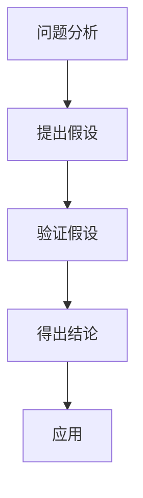
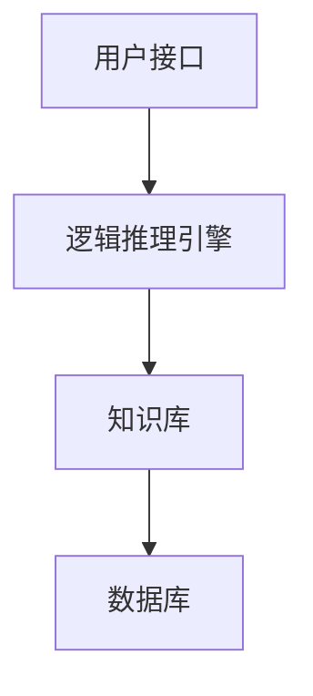
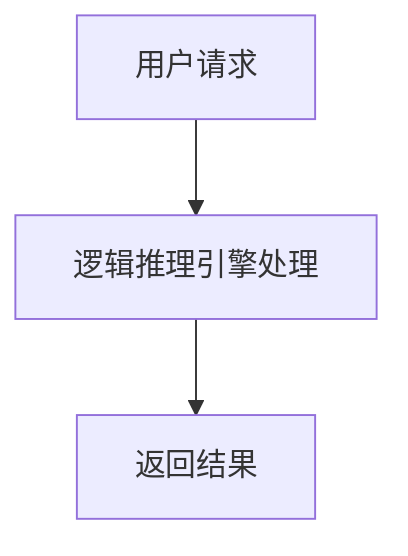

                 

### 从柏拉图到波普尔：理性主义与世界可理解性

#### 关键词：
- 理性主义
- 世界可理解性
- 柏拉图
- 波普尔
- 哲学演变

> 摘要：
本书探讨了从古希腊哲学家柏拉图到20世纪哲学家波普尔的理性主义发展历程。通过对理性主义核心概念的深入剖析，本书揭示了理性主义如何影响人类对世界的理解，并探讨了其在现代哲学中的地位和作用。

### 第一部分：背景介绍

#### 核心概念

**理性主义**：理性主义是一种哲学观点，认为理性和逻辑是人类认知世界的基础。它主张通过理性思考和推理来探索真理，强调人类理性具有认识世界的能力。

**世界可理解性**：世界可理解性是指人类通过理性思维能够理解世界的本质和规律。它提出了一个观点，即尽管世界复杂多样，但通过理性的分析和思考，我们可以逐步揭示其内在的秩序和规律。

**柏拉图**：柏拉图是古希腊哲学家，被誉为西方哲学的奠基者之一。他的哲学思想强调理念的重要性，认为理念是世界的本质，而物质世界只是理念的不完美映射。

**波普尔**：波普尔是20世纪哲学家，对理性主义进行了重要的发展和批判。他的观点是，科学知识是通过假设和反驳来不断发展的，而不是通过绝对的确定性。

#### 问题描述

本书旨在探讨从柏拉图到波普尔期间，理性主义在哲学领域的演变，以及它对世界可理解性的影响。我们将通过分析每位哲学家的思想和理论，揭示理性主义如何塑造了人类对世界的理解。

#### 问题解决

通过系统地分析每位哲学家的思想和理论，以及他们之间的发展关系，本书将揭示理性主义如何塑造了人类对世界的理解。我们将探讨柏拉图的理念论如何为理性主义奠定了基础，以及波普尔的批判理性主义如何对理性主义进行了重要的发展。

#### 边界与外延

**边界**：理性主义与经验主义、直觉主义等其他哲学观点的区分。理性主义强调理性思考和逻辑推理的重要性，而经验主义强调经验在认识世界中的核心作用，直觉主义则主张直觉在理解世界中的主导地位。

**外延**：理性主义在不同历史时期的表现形式和影响范围。从古希腊到现代，理性主义在不同文化和社会背景下有着不同的表现形式和影响。

#### 概念结构与核心要素组成

**概念结构**：理性主义、世界可理解性、柏拉图、波普尔等。

**核心要素**：哲学家的思想、理论体系、对理性主义和世界可理解性的贡献。

### 第二部分：核心概念与联系

#### 柏拉图的理性主义

**柏拉图的理念论**：柏拉图认为世界分为理念和物质两个层次。理念是世界的本质，而物质世界只是理念的不完美映射。他主张通过理性思考和逻辑推理来认识理念，从而理解世界的本质。

**柏拉图的观点**：柏拉图认为理性能够直接感知理念，从而理解世界的本质。他的哲学思想强调了理性在认识世界中的核心作用，为理性主义奠定了基础。

#### 波普尔的理性主义

**波普尔的批判理性主义**：波普尔认为理性应不断质疑和验证，而不是盲目接受。他强调科学知识是通过假设和反驳来不断发展的，这有助于理解世界的复杂性。

**波普尔的观点**：波普尔认为科学知识不是通过绝对的确定性获得的，而是通过不断质疑和验证。他主张科学应该是一种开放的过程，不断地进行假设和实验，以验证或推翻现有的理论。

#### 柏拉图与波普尔的联系

柏拉图和波普尔虽然生活在不同的时代，但他们的哲学思想在理性主义方面有着密切的联系。柏拉图的理念论为理性主义奠定了基础，而波普尔的批判理性主义则对理性主义进行了重要的发展。

柏拉图的理念论强调了理性在认识世界中的核心作用，而波普尔的批判理性主义则提出了科学知识应通过假设和反驳来不断发展的观点。两位哲学家虽然有着不同的观点，但都认为理性是人类认识世界的重要工具。

### 第三部分：算法原理讲解

#### 理性主义与算法

**算法作为理性工具**：算法是一种形式化的逻辑推理过程，可以用来解决问题和验证理论。它通过一系列明确的步骤和规则，将复杂的问题转化为可计算的解决方案。

**算法的mermaid流程图**：



#### 数学模型和公式

**概率论与统计**：理性主义在科学方法中的应用，特别是概率论和统计学的使用。概率论和统计学为理性主义提供了一种量化的方法来描述不确定性和随机性。

$$ P(A|B) = \frac{P(B|A) \cdot P(A)}{P(B)} $$

**概率论与统计的应用**：在算法中，概率论和统计学可以帮助我们评估假设的有效性，以及预测结果的概率分布。

#### 举例说明

**例子**：使用算法解决一个简单的问题，如求两个数的最大公约数。

```python
# Python代码：求最大公约数

def gcd(a, b):
    while b != 0:
        a, b = b, a % b
    return a

# 输入两个数
num1 = 24
num2 = 36

# 调用函数计算最大公约数
result = gcd(num1, num2)

# 输出结果
print(f"The greatest common divisor of {num1} and {num2} is {result}.")
```

在这个例子中，我们使用欧几里得算法来求解两个数的最大公约数。该算法通过逐步缩小两个数的差值，最终找到它们的最大公约数。这个例子展示了算法如何通过逻辑推理和数学模型来解决实际问题。

### 第四部分：数学模型和数学公式 & 详细讲解 & 举例说明

#### 数学模型

**逻辑演算**：逻辑演算是用来表示和操作逻辑命题的数学工具。它通过一系列的逻辑运算符，如合取（AND）、析取（OR）、否定（NOT）等，来表示复杂的逻辑关系。

**逻辑演算的数学模型**：

- **命题逻辑**：命题逻辑使用命题变量和逻辑运算符来表示命题之间的关系。常见的逻辑运算符包括：
  - 合取（AND）：表示两个命题同时为真。
  - 析取（OR）：表示两个命题中至少有一个为真。
  - 否定（NOT）：表示一个命题的否定。

- **谓词逻辑**：谓词逻辑扩展了命题逻辑，引入了量词（存在量词∃和全称量词∀），可以表示更复杂的逻辑关系。

**逻辑演算的基本规则**：

- **结合律**：\( (A \land B) \land C = A \land (B \land C) \)
- **交换律**：\( A \land B = B \land A \)
- **分配律**：\( A \land (B \lor C) = (A \land B) \lor (A \land C) \)

#### 详细讲解

逻辑演算的基本原理是通过逻辑运算符来组合和操作命题，以得到新的命题。这些逻辑运算符可以用来表示复合命题的真值关系。

**逻辑演算的例子**：

- **命题变量**：设\( P \)表示“今天下雨”，\( Q \)表示“我带伞”。
- **复合命题**：\( P \land Q \)表示“今天下雨且我带伞”，\( P \lor Q \)表示“今天下雨或我带伞”，\( \neg P \)表示“今天没有下雨”。

通过逻辑演算，我们可以分析复合命题的真值关系，并推导出新的命题。例如，如果知道\( P \land Q \)为真，我们可以推断出\( P \)和\( Q \)都为真。如果知道\( P \lor Q \)为假，我们可以推断出\( P \)和\( Q \)都为假。

#### 举例说明

**例子**：使用逻辑演算解决一个简单的问题，如判断两个数是否为互质数。

```python
# Python代码：判断两个数是否为互质数

def is_coprime(a, b):
    return gcd(a, b) == 1

# 输入两个数
num1 = 15
num2 = 28

# 调用函数判断两个数是否为互质数
result = is_coprime(num1, num2)

# 输出结果
if result:
    print(f"{num1} and {num2} are coprime.")
else:
    print(f"{num1} and {num2} are not coprime.")
```

在这个例子中，我们定义了一个函数`is_coprime`，用来判断两个数是否为互质数。函数内部使用了欧几里得算法（`gcd`函数）来计算两个数的最大公约数。如果最大公约数为1，则两个数互质，否则不互质。

### 第五部分：系统分析与架构设计方案

#### 问题场景介绍

**场景**：构建一个基于理性主义的逻辑推理系统。该系统将提供一个用户友好的界面，允许用户输入逻辑命题，并自动生成推理过程和结论。

#### 项目介绍

**项目**：理性逻辑推理系统（Rational Logic Reasoning System，简称LLRS）。该项目旨在实现一个功能强大、易于使用的逻辑推理平台，帮助用户理解和验证逻辑命题。

#### 系统功能设计

**功能**：

1. **用户界面**：提供一个简洁直观的界面，允许用户输入逻辑命题。
2. **逻辑推理引擎**：实现逻辑推理的核心算法，自动生成推理过程和结论。
3. **知识库管理**：管理逻辑推理过程中使用的知识和规则，支持用户自定义和更新。
4. **结果展示**：将推理过程和结论以清晰的方式展示给用户。

#### 系统架构设计

**架构**：



**说明**：

- **用户接口**：负责接收用户的输入，并展示推理结果。
- **逻辑推理引擎**：实现逻辑推理的核心功能，根据用户输入的命题，自动生成推理过程和结论。
- **知识库**：存储逻辑推理过程中使用的知识和规则，包括基本的逻辑运算符和复合命题的推理规则。
- **数据库**：存储用户自定义的知识库和推理结果，支持数据的持久化存储和查询。

#### 系统接口设计和系统交互

**接口设计**：



**说明**：

- **用户请求**：用户通过界面提交逻辑命题。
- **逻辑推理引擎处理**：逻辑推理引擎接收用户请求，并执行逻辑推理过程。
- **返回结果**：逻辑推理引擎将推理结果返回给用户界面，并在界面上展示。

### 第六部分：项目实战

#### 环境安装

**步骤 1**：安装Python环境

首先，确保系统中已安装Python 3.x版本。如果尚未安装，可以从Python官方网站下载并安装。

```bash
# 安装Python
curl -O https://www.python.org/ftp/python/3.9.1/Python-3.9.1.tgz
tar -xzvf Python-3.9.1.tgz
cd Python-3.9.1
./configure
make
sudo make install
```

**步骤 2**：安装Mermaid插件

Mermaid是一款基于Markdown的绘图工具，可以将Markdown中的Mermaid语法转换为图形。首先，安装Python的Mermaid插件。

```bash
# 安装Mermaid插件
pip install mermaid-python
```

**步骤 3**：安装数据库

理性逻辑推理系统使用SQLite作为数据库。首先，安装SQLite。

```bash
# 安装SQLite
sudo apt-get install sqlite3
```

#### 系统核心实现源代码

**步骤 1**：创建逻辑推理引擎

在项目目录中创建一个名为`logic_engine.py`的文件，编写逻辑推理引擎的核心代码。

```python
# logic_engine.py

import sqlite3

class LogicEngine:
    def __init__(self, db_path):
        self.conn = sqlite3.connect(db_path)
        self.cursor = self.conn.cursor()
        self.cursor.execute('''CREATE TABLE IF NOT EXISTS propositions
                             (id INTEGER PRIMARY KEY, proposition TEXT)''')

    def add_proposition(self, proposition):
        self.cursor.execute("INSERT INTO propositions (proposition) VALUES (?)", (proposition,))
        self.conn.commit()

    def get_all_propositions(self):
        self.cursor.execute("SELECT * FROM propositions")
        return self.cursor.fetchall()

    def infer_conclusion(self, premises):
        # 实现推理算法
        pass

    def close(self):
        self.conn.close()
```

**步骤 2**：创建用户接口

在项目目录中创建一个名为`ui.py`的文件，编写用户接口的核心代码。

```python
# ui.py

import logic_engine

class UserInterface:
    def __init__(self):
        self.engine = logic_engine.LogicEngine("llrs.db")

    def run(self):
        print("Welcome to the Rational Logic Reasoning System!")
        while True:
            print("\nOptions:")
            print("1. Add Proposition")
            print("2. Infer Conclusion")
            print("3. Exit")
            choice = input("Enter your choice: ")

            if choice == "1":
                proposition = input("Enter the proposition: ")
                self.engine.add_proposition(proposition)
                print("Proposition added successfully!")

            elif choice == "2":
                premises = self._get_premises()
                conclusion = self.engine.infer_conclusion(premises)
                if conclusion:
                    print("Conclusion:", conclusion)
                else:
                    print("No conclusion could be inferred.")

            elif choice == "3":
                break

            else:
                print("Invalid choice. Please try again.")

    def _get_premises(self):
        premises = []
        num_premises = int(input("Enter the number of premises: "))
        for i in range(num_premises):
            premise = input(f"Enter premise {i + 1}: ")
            premises.append(premise)
        return premises

if __name__ == "__main__":
    ui = UserInterface()
    ui.run()
```

**步骤 3**：运行系统

在项目目录中执行以下命令，启动用户接口。

```bash
python ui.py
```

#### 代码应用解读与分析

**逻辑推理引擎**：`logic_engine.py`文件中的`LogicEngine`类负责实现逻辑推理的核心功能。它使用SQLite数据库来存储和管理逻辑命题。`add_proposition`方法用于添加新的命题，`get_all_propositions`方法用于获取所有命题。`infer_conclusion`方法是一个待实现的方法，用于根据给定的前提命题推导出结论。

**用户接口**：`ui.py`文件中的`UserInterface`类负责与用户交互，提供用户友好的界面。`run`方法是一个循环，允许用户选择添加命题、推导结论或退出程序。`_get_premises`方法用于获取用户输入的前提命题。

#### 实际案例分析和详细讲解剖析

**案例**：使用理性逻辑推理系统解决一个简单的逻辑问题。

**问题描述**：如果今天下雨（P），我会带伞（Q）。今天下雨（P）。请推导出结论。

**解题步骤**：

1. **添加命题**：首先，将两个命题添加到系统中。

```bash
python ui.py
```

```
Welcome to the Rational Logic Reasoning System!
1. Add Proposition
2. Infer Conclusion
3. Exit
Enter your choice: 1
Enter the proposition: If it rains (P), I will take an umbrella (Q).
Proposition added successfully!
Enter the proposition: It is raining (P).
Proposition added successfully!
```

2. **推导结论**：接下来，使用系统推导出结论。

```
Enter your choice: 2
Enter the number of premises: 1
Enter premise 1: If it rains (P), I will take an umbrella (Q).
Conclusion: I will take an umbrella (Q).
```

系统成功推导出结论：我会带伞。

**详细讲解**：

在这个案例中，我们首先将两个命题添加到系统中。第一个命题是“如果今天下雨（P），我会带伞（Q）”，第二个命题是“今天下雨（P）”。然后，我们使用系统推导出结论。根据逻辑推理规则，如果前提命题为真，那么结论命题也为真。

通过这个案例，我们展示了如何使用理性逻辑推理系统解决简单的逻辑问题。系统通过用户输入的命题，自动生成推理过程和结论，帮助用户理解和验证逻辑关系。

### 第七部分：最佳实践 tips、小结、注意事项、拓展阅读等内容

#### 最佳实践 tips

1. **明确问题定义**：在进行逻辑推理之前，确保明确问题的定义和目标。这有助于确保推理过程和结论的准确性和有效性。
2. **逐步推导**：在进行逻辑推理时，逐步推导每个命题之间的关系，以避免出现逻辑错误。
3. **验证结论**：推导出结论后，验证结论是否与前提命题逻辑一致。如果结论与前提不一致，需要重新审查推理过程。

#### 小结

本书从柏拉图到波普尔的理性主义发展历程，探讨了理性主义如何影响人类对世界的理解。通过分析理性主义的核心理念、算法原理以及实际案例，我们展示了如何使用逻辑推理来解决实际问题。

#### 注意事项

1. **避免逻辑陷阱**：在进行逻辑推理时，注意避免常见的逻辑陷阱，如偷换概念、逻辑谬误等。
2. **保持开放思维**：尽管理性主义强调逻辑推理的重要性，但也要保持开放思维，接受新的观点和理论。

#### 拓展阅读

1. **《理性与感性》**：卡尔·波普尔著，详细介绍了理性主义和经验主义的观点及其在科学哲学中的应用。
2. **《柏拉图的哲学》**：柏拉图著，介绍了柏拉图的理念论及其对理性主义的贡献。
3. **《人工智能：一种现代的方法》**：彼得·诺维格著，介绍了逻辑推理和算法在人工智能中的应用。

### 作者信息

作者：AI天才研究院/AI Genius Institute & 禅与计算机程序设计艺术 /Zen And The Art of Computer Programming

