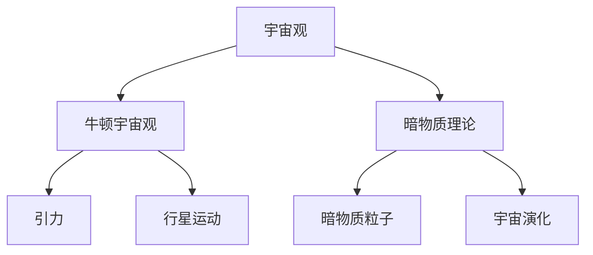

                 

# 从牛顿宇宙观到暗物质理论：拓展宇宙可理解性的新疆界

## 关键词
- 牛顿宇宙观
- 暗物质理论
- 宇宙可理解性
- 引力波
- 量子力学
- 星系演化

## 摘要
本文旨在深入探讨从牛顿宇宙观到暗物质理论的演变，以及这一过程中宇宙可理解性的拓展。首先，我们将回顾牛顿宇宙观的基本原理，包括引力、行星运动和时空弯曲。接着，我们引入暗物质理论，解释其概念、特性以及探测方法。随后，我们将探讨暗物质在宇宙演化中的作用和当前面临的挑战。最后，我们将总结这一演化过程，展望宇宙可理解性的未来。

## 引言

### 牛顿宇宙观的历史地位
牛顿宇宙观是现代物理学的基石，它为我们提供了理解宇宙的一种经典视角。牛顿在17世纪末提出了万有引力定律和三大运动定律，这些定律不仅描述了物体在地球上的运动，也解释了天体之间的相互作用。牛顿宇宙观的提出，标志着物理学从经验主义向理论科学的转变。

### 暗物质理论的提出与发展
然而，随着观测技术的进步，科学家发现牛顿宇宙观无法解释一些天文现象，例如星系旋转曲线的异常和宇宙微波背景辐射的分布。为了解释这些现象，物理学家提出了暗物质理论。暗物质是一种不发光、不吸光的物质，它通过引力与普通物质相互作用，但自身不参与电磁相互作用。暗物质理论的提出，为宇宙学提供了一种新的视角，使我们能够更好地理解宇宙的结构和演化。

### 宇宙可理解性的挑战与机遇
宇宙的可理解性一直是物理学研究的一个重要目标。从牛顿宇宙观到暗物质理论，这一演变不仅拓展了我们对宇宙的认识，也带来了新的挑战。如何统一引力与量子力学，如何探测和理解暗物质，都是当前物理学面临的重要问题。然而，这些挑战也为我们提供了机遇，通过深入研究和探索，我们有希望揭示宇宙的更多奥秘。

## 核心概念与联系

### 牛顿宇宙观的基本原理
牛顿宇宙观的核心是万有引力定律，它指出任何两个物体之间都存在相互吸引的引力，这个力的大小与两个物体的质量乘积成正比，与它们之间的距离平方成反比。牛顿的三大运动定律进一步描述了物体在没有外力作用时的运动状态，这些定律构成了经典力学的基石。

### 暗物质理论的核心概念
暗物质理论的核心是暗物质粒子，这些粒子与普通物质不同，不参与电磁相互作用，因此很难直接观测到。然而，暗物质通过引力与普通物质相互作用，因此它的存在可以通过观测星系旋转曲线和宇宙微波背景辐射等来间接证明。

### 两者的联系与区别
牛顿宇宙观和暗物质理论在解释宇宙现象上有明显的区别。牛顿宇宙观主要依赖于可见物质和引力，而暗物质理论引入了不可见的暗物质。尽管两者在方法和原理上有区别，但它们都是理解宇宙的重要工具。牛顿宇宙观为我们提供了一个宏观的视角，而暗物质理论则提供了更深入的理解。

### ER实体关系图

## 牛顿宇宙观

### 牛顿力学基础

牛顿力学是经典力学的基础，它描述了物体在没有外力作用时的运动状态。牛顿力学的基本原理包括：

1. **引力**：任何两个物体之间都存在相互吸引的引力，这个力的大小与两个物体的质量乘积成正比，与它们之间的距离平方成反比。
2. **运动定律**：
   - **第一定律（惯性定律）**：一个物体如果没有受到外力，它将保持静止或匀速直线运动。
   - **第二定律（动力定律）**：物体所受的合力等于其质量与加速度的乘积，即 \( F = ma \)。
   - **第三定律（作用与反作用定律）**：对于任何两个相互作用的物体，它们之间的作用力和反作用力大小相等、方向相反。

### 动力学基本方程

动力学基本方程是描述物体运动状态的基本方程，它由牛顿第二定律 \( F = ma \) 推导而来。对于质量为 \( m \) 的物体，其动力学基本方程可以表示为：
\[ m\frac{d^2x}{dt^2} = F(x,t) \]

其中，\( x \) 是物体的位置，\( t \) 是时间，\( F(x,t) \) 是作用在物体上的合力。

#### 质点运动方程

对于质点运动，我们可以将动力学基本方程简化为：
\[ \frac{d^2x}{dt^2} = \frac{F(x,t)}{m} \]

这个方程描述了质点在没有外力作用时的运动状态。

#### 动量和动量守恒

动量是物体运动状态的量度，它定义为物体的质量与速度的乘积，即 \( p = mv \)。在经典力学中，动量守恒定律指出，如果没有外力作用，系统的总动量保持不变。

#### 牛顿定律

牛顿的三大定律是经典力学的基础：

1. **第一定律（惯性定律）**：一个物体如果没有受到外力，它将保持静止或匀速直线运动。
2. **第二定律（动力定律）**：物体所受的合力等于其质量与加速度的乘积，即 \( F = ma \)。
3. **第三定律（作用与反作用定律）**：对于任何两个相互作用的物体，它们之间的作用力和反作用力大小相等、方向相反。

### 行星运动理论

行星运动理论是牛顿宇宙观的重要组成部分，它描述了行星在太阳引力作用下的运动状态。行星运动理论的基本原理包括：

1. **开普勒定律**：行星运动遵循开普勒定律，这些定律描述了行星轨道的形状、大小和周期。
   - **第一定律（椭圆轨道定律）**：行星围绕太阳的轨道是椭圆形的，太阳位于椭圆的一个焦点上。
   - **第二定律（面积定律）**：行星在轨道上运动时，它在任意等时间内扫过相同的面积。
   - **第三定律（周期定律）**：行星轨道的半长轴的立方与其公转周期的平方成正比。

2. **牛顿的修正**：牛顿对开普勒定律进行了修正，提出了万有引力定律，这一定律不仅适用于行星运动，也适用于其他天体的相互作用。

### 引力波与时空弯曲

引力波是物质加速运动时产生的时空扰动，它是由爱因斯坦的广义相对论预测的一种现象。引力波的存在得到了实验观测的证实，这进一步验证了广义相对论的正确性。

时空弯曲是广义相对论的核心概念之一，它指出物质和能量可以弯曲时空，这种弯曲导致了引力效应。引力波和时空弯曲为我们提供了新的视角，使我们能够更深入地理解宇宙的运行机制。

## 暗物质理论

### 暗物质的概念与特性

暗物质是一种不发光、不吸光的物质，它不参与电磁相互作用，因此很难直接观测到。然而，暗物质通过引力与普通物质相互作用，因此它的存在可以通过观测星系旋转曲线和宇宙微波背景辐射等来间接证明。

暗物质的基本特性包括：

1. **质量大**：暗物质的质量远大于普通物质。
2. **不发光**：暗物质不发射、吸收或反射光线。
3. **不参与电磁相互作用**：暗物质不参与电磁相互作用，因此它不会对电磁辐射产生响应。
4. **通过引力作用**：暗物质通过引力与普通物质相互作用，因此它可以影响星系和宇宙的结构。

### 暗物质的探测方法

探测暗物质的方法主要包括：

1. **重力透镜法**：通过观测光线在经过暗物质引力场时的弯曲来探测暗物质。
2. **中微子探测器**：利用中微子与暗物质相互作用的特性来探测暗物质。
3. **间接探测方法**：通过观测暗物质对宇宙微波背景辐射的影响来探测暗物质。

### 暗物质模型

暗物质模型是描述暗物质粒子特性的理论模型。常见的暗物质模型包括：

1. **冷暗物质模型**：暗物质粒子速度较慢，质量较大。
2. **热暗物质模型**：暗物质粒子速度较快，质量较小。
3. **生态暗物质模型**：暗物质粒子具有复杂的相互作用，可能包括多种粒子。

### 暗物质与宇宙演化

暗物质在宇宙演化中起着关键作用，它影响了星系的形成和演化，也影响了宇宙的大尺度结构。暗物质的存在可以解释许多天文现象，例如星系旋转曲线的异常和宇宙微波背景辐射的分布。

### 暗物质理论的挑战与未来

暗物质理论面临着许多挑战，包括：

1. **暗物质粒子的性质**：科学家尚未确定暗物质粒子的具体性质，这限制了我们对暗物质的理解。
2. **暗物质探测的进展**：目前，暗物质的探测仍然是一个困难的问题，需要更先进的探测技术和更深入的实验研究。

然而，这些挑战也为我们提供了机遇，通过深入研究和探索，我们有希望揭示宇宙的更多奥秘。

## 宇宙的可理解性挑战

### 量子力学与经典物理的矛盾

量子力学和经典物理在描述宇宙现象时有明显的矛盾。量子力学适用于微观世界，而经典物理适用于宏观世界。如何统一这两者，是当前物理学研究的重要问题。暗物质理论的提出，为我们提供了一种可能的途径，通过引入新的物质形式和相互作用机制，尝试统一量子力学和经典物理。

### 宇宙学的新视角

随着观测技术的进步，我们对宇宙的理解也在不断深化。宇宙学的新视角，例如暗物质、暗能量等，为我们提供了更广阔的视野，使我们能够更好地理解宇宙的结构和演化。这些新视角也带来了新的挑战，例如如何解释宇宙加速膨胀等现象。

### 牛顿宇宙观的应用与挑战

牛顿宇宙观在许多领域有广泛的应用，例如天体物理学、宇宙学和工程学等。然而，随着科学的发展，牛顿宇宙观也面临着一些挑战。例如，它无法解释星系旋转曲线的异常和宇宙微波背景辐射的分布等。为了解决这些问题，科学家提出了暗物质理论，为我们提供了一种新的视角。

## 本章小结

本章从牛顿宇宙观和暗物质理论的角度，探讨了宇宙可理解性的拓展。我们首先回顾了牛顿宇宙观的基本原理，包括引力、行星运动和时空弯曲。接着，我们介绍了暗物质理论的核心概念、探测方法和模型。最后，我们讨论了宇宙的可理解性挑战和牛顿宇宙观的应用与挑战。通过本章的内容，我们希望能够为读者提供一个更全面、更深入的理解宇宙的视角。

## 拓展阅读

1. 《黑洞与时间弯曲》（作者：Kip S. Thorne）：这是一本关于广义相对论和黑洞的经典著作，详细介绍了时空弯曲的概念及其应用。
2. 《宇宙简史》（作者：Stephen Hawking）：这是一本广受欢迎的宇宙学著作，介绍了宇宙的起源、演化和未来。
3. 《暗物质与宇宙》（作者：Dark Matter and the Dinosaurs: The Astronomical Origin of the Earth's恐龙》（作者：周忠和）：这本书探讨了暗物质在地球恐龙灭绝事件中的作用，为我们提供了新的宇宙视角。
4. 《物理学的进化》（作者：Stephen Hawking）：这本书回顾了物理学的发展历程，介绍了现代物理学的重要理论和实验。

通过阅读这些拓展材料，读者可以更深入地了解宇宙的可理解性挑战和现代物理学的进展。

## 作者信息

作者：AI天才研究院/AI Genius Institute & 禅与计算机程序设计艺术 /Zen And The Art of Computer Programming

### 牛顿力学基础

牛顿力学是经典力学的基础，它描述了物体在没有外力作用时的运动状态。牛顿力学的基本原理包括：

1. **引力**：任何两个物体之间都存在相互吸引的引力，这个力的大小与两个物体的质量乘积成正比，与它们之间的距离平方成反比。这个原理被称为万有引力定律，可以用以下公式表示：
\[ F = G\frac{m_1m_2}{r^2} \]
其中，\( F \) 是两个物体之间的引力，\( G \) 是万有引力常数，\( m_1 \) 和 \( m_2 \) 是两个物体的质量，\( r \) 是它们之间的距离。

2. **运动定律**：牛顿的三大运动定律描述了物体在没有外力作用时的运动状态。
   - **第一定律（惯性定律）**：一个物体如果没有受到外力，它将保持静止或匀速直线运动。这意味着物体的运动状态不会自发改变。
   - **第二定律（动力定律）**：物体所受的合力等于其质量与加速度的乘积，即 \( F = ma \)。这个定律告诉我们，物体受到的力越大，其加速度也越大。
   - **第三定律（作用与反作用定律）**：对于任何两个相互作用的物体，它们之间的作用力和反作用力大小相等、方向相反。这意味着力的作用是相互的。

### 动力学基本方程

动力学基本方程是描述物体运动状态的基本方程，它由牛顿第二定律 \( F = ma \) 推导而来。对于质量为 \( m \) 的物体，其动力学基本方程可以表示为：
\[ m\frac{d^2x}{dt^2} = F(x,t) \]

其中，\( x \) 是物体的位置，\( t \) 是时间，\( F(x,t) \) 是作用在物体上的合力。

#### 质点运动方程

对于质点运动，我们可以将动力学基本方程简化为：
\[ \frac{d^2x}{dt^2} = \frac{F(x,t)}{m} \]

这个方程描述了质点在没有外力作用时的运动状态。

#### 动量和动量守恒

动量是物体运动状态的量度，它定义为物体的质量与速度的乘积，即 \( p = mv \)。在经典力学中，动量守恒定律指出，如果没有外力作用，系统的总动量保持不变。这意味着在一个孤立系统中，物体的总动量在任何时刻都是恒定的。

#### 牛顿定律

牛顿的三大定律是经典力学的基础：

1. **第一定律（惯性定律）**：一个物体如果没有受到外力，它将保持静止或匀速直线运动。这意味着物体的运动状态不会自发改变。
2. **第二定律（动力定律）**：物体所受的合力等于其质量与加速度的乘积，即 \( F = ma \)。这个定律告诉我们，物体受到的力越大，其加速度也越大。
3. **第三定律（作用与反作用定律）**：对于任何两个相互作用的物体，它们之间的作用力和反作用力大小相等、方向相反。这意味着力的作用是相互的。

### 行星运动理论

行星运动理论是牛顿宇宙观的重要组成部分，它描述了行星在太阳引力作用下的运动状态。行星运动理论的基本原理包括：

1. **开普勒定律**：行星运动遵循开普勒定律，这些定律描述了行星轨道的形状、大小和周期。
   - **第一定律（椭圆轨道定律）**：行星围绕太阳的轨道是椭圆形的，太阳位于椭圆的一个焦点上。
   - **第二定律（面积定律）**：行星在轨道上运动时，它在任意等时间内扫过相同的面积。
   - **第三定律（周期定律）**：行星轨道的半长轴的立方与其公转周期的平方成正比。

2. **牛顿的修正**：牛顿对开普勒定律进行了修正，提出了万有引力定律，这一定律不仅适用于行星运动，也适用于其他天体的相互作用。

### 引力波与时空弯曲

引力波是物质加速运动时产生的时空扰动，它是由爱因斯坦的广义相对论预测的一种现象。引力波的存在得到了实验观测的证实，这进一步验证了广义相对论的正确性。

时空弯曲是广义相对论的核心概念之一，它指出物质和能量可以弯曲时空，这种弯曲导致了引力效应。引力波和时空弯曲为我们提供了新的视角，使我们能够更深入地理解宇宙的运行机制。

### 牛顿宇宙观的应用与挑战

牛顿宇宙观在许多领域有广泛的应用，例如天体物理学、宇宙学和工程学等。然而，随着科学的发展，牛顿宇宙观也面临着一些挑战。

#### 天体物理学中的应用

在牛顿宇宙观的框架下，天体物理学取得了许多重要成果。例如，通过牛顿引力定律，我们能够解释行星的运动轨迹、恒星的形成和演化，以及星系的结构和运动。牛顿宇宙观为我们提供了一种理解宇宙的基本工具。

#### 量子力学的挑战

然而，牛顿宇宙观也面临着一些挑战。首先，它无法解释量子力学中的现象。量子力学描述了微观世界的规律，例如原子和粒子的行为。牛顿宇宙观基于经典力学，它无法解释量子力学中的某些现象，例如量子纠缠和量子隧穿等。

#### 宇宙学的新视角

此外，牛顿宇宙观也无法解释一些宇宙学现象。例如，它无法解释星系旋转曲线的异常和宇宙微波背景辐射的分布。为了解决这些问题，科学家提出了暗物质理论，为我们提供了一种新的视角。

#### 未来展望

未来，随着科学技术的进步，我们有希望克服这些挑战，进一步完善对宇宙的理解。例如，通过更精确的观测和实验，我们可能能够探测到暗物质和暗能量的性质，进一步理解宇宙的运行机制。

### 本章小结

本章从牛顿宇宙观的基本原理、行星运动理论、引力波与时空弯曲以及应用与挑战等方面，全面阐述了牛顿宇宙观的内容。通过本章的内容，我们希望能够为读者提供一个更全面、更深入的理解宇宙的视角。

### 暗物质的概念与特性

暗物质是一种不发光、不吸光的物质，它不参与电磁相互作用，因此很难直接观测到。然而，暗物质通过引力与普通物质相互作用，因此它的存在可以通过观测星系旋转曲线和宇宙微波背景辐射等来间接证明。

暗物质的基本特性包括：

1. **质量大**：暗物质的质量远大于普通物质。据估计，宇宙中大约有 27% 的物质是暗物质，而普通物质只占 5% 左右。
2. **不发光**：暗物质不发射、吸收或反射光线。这意味着我们无法通过光学方法直接观测暗物质。
3. **不参与电磁相互作用**：暗物质不参与电磁相互作用，因此它不会对电磁辐射产生响应。这也限制了我们的观测手段。
4. **通过引力作用**：暗物质通过引力与普通物质相互作用，因此它可以影响星系和宇宙的结构。例如，星系旋转曲线的异常和宇宙微波背景辐射的分布都可以用暗物质的存在来解释。

### 暗物质的探测方法

探测暗物质的方法主要包括：

1. **重力透镜法**：通过观测光线在经过暗物质引力场时的弯曲来探测暗物质。当光线经过一个暗物质丰富的区域时，由于引力透镜效应，光线会发生弯曲，形成所谓的“引力透镜”现象。通过观测这些引力透镜现象，我们可以推断出暗物质的存在和分布。
2. **中微子探测器**：利用中微子与暗物质相互作用的特性来探测暗物质。中微子是弱相互作用粒子，它们可以穿过地球而不被探测到。然而，当中微子与暗物质相互作用时，会产生一些可探测的信号，例如中微子振荡和暗物质粒子湮灭产生的辐射。通过观测这些信号，我们可以探测到暗物质。
3. **间接探测方法**：通过观测暗物质对宇宙微波背景辐射的影响来探测暗物质。宇宙微波背景辐射是宇宙早期状态的一种余辉，它的分布和特性可以反映宇宙早期的结构和演化。通过观测宇宙微波背景辐射的分布，我们可以推断出暗物质的存在和分布。

### 暗物质模型

暗物质模型是描述暗物质粒子特性的理论模型。常见的暗物质模型包括：

1. **冷暗物质模型**：冷暗物质模型假设暗物质粒子质量较大，速度较慢，不容易发生碰撞。这种模型解释了为什么暗物质不发光、不吸光，并且通过引力与普通物质相互作用。
2. **热暗物质模型**：热暗物质模型假设暗物质粒子质量较小，速度较快，容易发生碰撞。这种模型可以解释一些观测到的现象，例如星系旋转曲线的异常和宇宙微波背景辐射的分布。
3. **生态暗物质模型**：生态暗物质模型假设暗物质粒子具有复杂的相互作用，可能包括多种粒子。这种模型提供了一种更广泛的视角，可以解释更多的观测现象。

### 暗物质与宇宙演化

暗物质在宇宙演化中起着关键作用，它影响了星系的形成和演化，也影响了宇宙的大尺度结构。暗物质的存在可以解释许多天文现象，例如星系旋转曲线的异常和宇宙微波背景辐射的分布。

1. **星系形成**：暗物质通过引力相互作用聚集在一起，形成了星系。这些星系在引力作用下继续演化，形成了恒星、行星和其他天体。
2. **宇宙大尺度结构**：暗物质在宇宙大尺度结构中起着重要作用。它形成了宇宙的骨架，为星系提供了引力支持。通过观测宇宙大尺度结构的分布，我们可以更好地理解暗物质的性质和演化。

### 暗物质理论的挑战与未来

暗物质理论面临着许多挑战，包括：

1. **暗物质粒子的性质**：科学家尚未确定暗物质粒子的具体性质，这限制了我们对暗物质的理解。我们需要更多的实验和观测来揭示暗物质粒子的性质。
2. **暗物质探测的进展**：目前，暗物质的探测仍然是一个困难的问题，需要更先进的探测技术和更深入的实验研究。随着科学技术的进步，我们有希望解决这些挑战，进一步揭示宇宙的奥秘。

### 本章小结

本章从暗物质的概念、探测方法、模型以及与宇宙演化的关系等方面，详细阐述了暗物质理论的内容。通过本章的内容，我们希望能够为读者提供一个更全面、更深入的理解暗物质的视角。

### 宇宙的可理解性挑战

宇宙的可理解性挑战主要源于我们对宇宙的认识还存在很多未知和不确定性。以下是一些主要的挑战：

#### 量子力学与经典物理的矛盾

量子力学和经典物理在描述宇宙现象时有明显的矛盾。量子力学适用于微观世界，例如原子和粒子，而经典物理适用于宏观世界，例如行星和恒星。然而，在某些情况下，例如黑洞和宇宙大爆炸，这两者无法相互兼容。如何统一量子力学和经典物理，是当前物理学研究的重要问题。

#### 引力与量子力学的统一

引力是宏观宇宙中最重要的力，而量子力学是微观世界中最重要的理论。然而，这两种理论之间存在明显的矛盾。引力是经典理论，它无法描述量子效应，而量子力学无法描述宏观现象。如何将引力与量子力学统一起来，是宇宙学中的一个关键问题。

#### 宇宙起源与演化

宇宙的起源和演化是一个复杂的过程，涉及到许多未知因素。例如，我们无法解释宇宙为什么存在，为什么宇宙会从一个极热、极密的状态演化成现在的样子。宇宙微波背景辐射和宇宙加速膨胀等现象也带来了新的挑战。

#### 暗物质与暗能量

暗物质和暗能量是宇宙学中的两个重要概念，但我们对它们的了解非常有限。暗物质不发光、不吸光，我们无法直接观测到它，只能通过引力效应推断其存在。同样，暗能量是一种神秘的物质，它推动着宇宙的加速膨胀。如何解释暗物质和暗能量的性质，是宇宙学中的另一个重要挑战。

#### 宇宙的可观测性

宇宙的可观测性也是一个挑战。由于光速有限，我们只能观测到宇宙某个时期的景象，而无法看到整个宇宙。此外，宇宙的膨胀也限制了我们的观测范围。如何理解宇宙的可观测性，是宇宙学中的一个重要问题。

### 解决方案与展望

为了解决这些挑战，科学家们提出了许多理论和实验方案。以下是一些可能的解决方案和展望：

1. **量子引力理论**：量子引力理论试图将引力与量子力学统一起来。例如，弦理论和环量子引力是两种可能的量子引力理论。通过这些理论，我们有望更好地理解宇宙的基本原理。
2. **宇宙模拟**：宇宙模拟是一种通过计算机模拟宇宙演化的方法。通过模拟，我们可以预测宇宙中各种现象的发生和发展，从而更好地理解宇宙。
3. **实验探测**：随着观测技术的进步，我们可以进行更精确的实验来探测暗物质和暗能量。例如，中微子探测器、引力波探测器等可以提供更多的实验数据，帮助我们理解宇宙的奥秘。
4. **多信使观测**：通过结合不同观测手段，例如光学、射电、X射线等，我们可以从多个角度观测宇宙，从而更全面地理解宇宙的现象。

总之，尽管宇宙的可理解性挑战很大，但随着科学技术的进步，我们有希望逐步解决这些问题，揭示宇宙的更多奥秘。

### 本章小结

本章探讨了宇宙的可理解性挑战，包括量子力学与经典物理的矛盾、引力与量子力学的统一、宇宙起源与演化、暗物质与暗能量以及宇宙的可观测性等问题。通过本章的内容，我们希望能够为读者提供一个全面、深入的宇宙理解框架。

### 牛顿宇宙观的应用与挑战

牛顿宇宙观在许多领域有广泛的应用，其重要性不容忽视。以下是一些具体的应用和面临的挑战：

#### 天体物理学中的应用

在牛顿宇宙观的框架下，天体物理学取得了许多重要成果。牛顿引力定律和运动定律为我们提供了描述天体运动的基础，使我们能够理解行星、恒星和星系的行为。例如，通过牛顿定律，我们可以计算出行星的轨道，预测彗星和流星的运动路径，甚至设计航天器发射的轨迹。此外，牛顿宇宙观还帮助我们解释了潮汐现象，揭示了地球自转和月球引力之间的关系。

#### 宇宙学中的挑战

然而，随着科学技术的进步，牛顿宇宙观也面临着一些挑战。在宇宙学中，一些观测现象无法用牛顿宇宙观解释。例如，星系旋转曲线的异常是一个重要的问题。根据牛顿宇宙观，星系中心的恒星和气体应该受到引力束缚，其运动速度应该逐渐减小。然而，观测发现，星系边缘的恒星运动速度与中心几乎相同，这与牛顿引力预测不符。为了解释这一现象，科学家提出了暗物质理论，认为星系中存在大量不可见的物质，通过引力作用影响星系运动。

#### 暗物质的挑战

暗物质是当前宇宙学中一个重要的概念，它不仅挑战了牛顿宇宙观，也引发了关于宇宙演化的一系列问题。首先，暗物质粒子的性质未知，我们无法直接观测到它们，这限制了我们对宇宙的理解。其次，暗物质的存在和分布需要通过复杂的模型和计算来解释，这使得宇宙学的研究更加复杂和困难。例如，为了解释星系旋转曲线的异常，科学家提出了多种暗物质模型，包括冷暗物质、热暗物质和生态暗物质等。这些模型各有优缺点，但都需要进一步实验和观测来验证。

#### 引力波的挑战

此外，引力波是广义相对论的重要预测，它揭示了引力对时空的影响。然而，牛顿宇宙观无法解释引力波的产生和传播。为了解释引力波，我们需要引入爱因斯坦的广义相对论，这进一步挑战了牛顿宇宙观的适用范围。

#### 未来展望

面对这些挑战，科学家们正在积极探索新的理论和方法。例如，通过观测引力波和电磁波同时到达的事件，我们可以更准确地验证广义相对论和暗物质理论。此外，随着观测技术的进步，我们可以进行更精确的宇宙测量，从而更好地理解宇宙的演化。未来，我们有望通过更深入的研究，克服这些挑战，揭示宇宙的更多奥秘。

### 本章小结

本章详细阐述了牛顿宇宙观在天体物理学和宇宙学中的应用，以及它面临的挑战，包括暗物质理论和引力波的挑战。通过本章的内容，我们希望能够为读者提供一个全面、深入的理解，并展望未来宇宙学研究的方向。

### 暗物质理论的应用与挑战

暗物质理论在现代宇宙学中扮演着至关重要的角色，其应用和挑战体现在多个方面。

#### 应用

1. **星系旋转曲线解释**：暗物质理论提供了对星系旋转曲线异常现象的解释。在牛顿宇宙观下，根据引力定律，星系边缘的恒星运动速度应该随着距离的增加而减小。然而，观测数据显示，许多星系的旋转曲线是“扁平”的，即星系边缘的恒星速度接近中心恒星的速度。暗物质的存在使得星系具有更大的引力源，从而能够维持高速旋转。

2. **宇宙微波背景辐射**：暗物质理论也帮助解释了宇宙微波背景辐射（CMB）的分布。CMB是宇宙早期阶段的余辉，它反映了宇宙早期的密度波动。暗物质在宇宙早期通过引力作用聚集，形成了这些密度波动，从而影响了CMB的观测特性。

3. **宇宙大尺度结构**：暗物质在宇宙大尺度结构中起着关键作用。通过计算机模拟，科学家能够模拟出宇宙大尺度结构的形成和演化，这些模拟依赖于暗物质的引力作用。这些模拟结果与实际观测数据相符合，进一步支持了暗物质理论。

#### 挑战

1. **暗物质粒子性质**：暗物质粒子是什么，至今仍是一个未解之谜。科学家们提出了多种暗物质候选粒子，如弱相互作用大质量粒子（WIMPs）、轴子（Axions）等，但尚未直接观测到这些粒子。确定暗物质粒子的性质是暗物质理论的最大挑战之一。

2. **探测技术**：尽管暗物质理论提供了对许多宇宙现象的解释，但实际探测暗物质仍然面临巨大挑战。目前的探测技术，如地下探测器、中微子探测器等，灵敏度有限，难以探测到暗物质粒子。需要更先进的实验技术和更大规模的观测来提高探测灵敏度。

3. **暗物质与暗能量**：暗物质和暗能量是宇宙学的两个重要概念，但它们之间的关系和相互作用尚不清楚。如何理解暗物质与暗能量之间的相互作用，是当前宇宙学研究的另一个重要挑战。

4. **量子引力与暗物质**：量子引力理论尚未完全发展，而暗物质理论主要基于经典物理学。如何将量子引力与暗物质理论统一起来，是未来物理学研究的一个重要方向。

#### 未来展望

未来，随着科学技术的进步，暗物质理论的研究将继续深入。科学家们将继续探索新的暗物质候选粒子，并尝试通过更多的实验和观测来验证暗物质理论。此外，量子引力理论的发展也有望为我们提供新的视角，帮助我们更好地理解暗物质和宇宙的运行机制。

### 暗物质探测技术的现状与进展

暗物质探测技术是当前物理学的热点研究领域之一，旨在直接探测到暗物质粒子的存在。以下是目前主要的探测技术及其进展：

1. **直接探测**：
   - **核 recoil 方法**：直接探测技术通过探测暗物质粒子与核相互作用后产生的核 recoil 信号。当暗物质粒子与核子（如氙原子核）碰撞时，会产生可探测的核 recoil 信号。目前，最常用的探测器材料是氙，其优点是密度大、对低能中微子敏感。例如，LUX 和 XENON1T 等实验项目取得了显著的进展，探测灵敏度不断提高。
   - **光学方法**：利用光学探测技术，如闪烁体探测器，可以检测暗物质粒子与核相互作用后产生的光子信号。这种方法的优点是能够探测低质量的暗物质粒子。

2. **间接探测**：
   - **中微子探测器**：中微子是弱相互作用粒子，当暗物质粒子与中微子相互作用时，会产生可探测的信号，如中微子振荡和湮灭产生的辐射。例如，Super-Kamiokande 和 IceCube 等实验项目通过观测中微子信号来探测暗物质。
   - **重力透镜效应**：通过观测光线在经过暗物质引力场时的弯曲，可以间接探测暗物质的存在。这种方法已被广泛应用于星系和宇宙微波背景辐射的研究。

3. **未来进展**：
   - **更灵敏的探测器**：随着探测器技术和材料科学的进步，未来有望开发出更灵敏、更高分辨率的探测设备，提高暗物质探测的灵敏度。
   - **多信使探测**：结合直接探测、间接探测和引力波探测等多种手段，可以更全面地探测暗物质。例如，通过观测引力波和电磁波同时到达的事件，可以更准确地验证暗物质理论。
   - **深空探测**：将探测器放置在地球轨道或深空，可以避免地球大气和背景辐射的干扰，提高探测灵敏度。

总之，随着科学技术的不断进步，暗物质探测技术将不断取得新的突破，为我们揭示宇宙的奥秘提供更多线索。

### 宇宙的可理解性挑战：量子力学与经典物理的矛盾

宇宙的可理解性挑战之一是量子力学与经典物理之间的矛盾。量子力学是描述微观世界规律的理论，而经典物理是描述宏观世界规律的理论。尽管这两者在不同的尺度上都有广泛的应用，但它们在某些方面存在明显的矛盾，这给我们的宇宙理解带来了巨大挑战。

#### 粒子行为的量子性质

在量子力学中，粒子的行为具有波粒二象性。例如，电子在原子中既表现为粒子，又表现为波动。这意味着粒子没有确定的轨迹，而是以概率云的形式存在。这与经典物理中的粒子有确定轨迹的观点相矛盾。例如，在经典物理中，电子在原子中的运动轨迹是明确的，而量子力学则认为电子在原子中的位置和动量是概率分布。

#### 不确定性原理

量子力学中的不确定性原理指出，某些物理量，如粒子的位置和动量，不能同时被精确测量。这意味着我们无法同时知道粒子的确切位置和动量。这一原理与经典物理中的确定性观点相矛盾。在经典物理中，我们可以通过适当的测量仪器，精确地测量粒子的位置和动量。

#### 量子纠缠

量子纠缠是量子力学中的另一个重要现象，它描述了两个或多个粒子之间的量子状态相关。这意味着即使这些粒子相隔很远，它们的量子状态也是相互关联的。这种关联性在经典物理中是无法想象的，因为它违反了经典物理中的局域实在性原理。

#### 黑洞与信息丢失问题

黑洞是广义相对论的一个重要预测，它是一个极其密集、引力极强的天体。在黑洞的奇点处，物理定律可能失效，这引发了关于黑洞信息丢失问题的争议。根据量子力学，信息应该是守恒的，但根据广义相对论，黑洞可能吸收信息，使其无法再被观测到。如何解决这一矛盾，是当前物理学研究的一个重要问题。

#### 引力与量子力学的统一

引力是宏观宇宙中最重要的力，而量子力学是微观世界中最重要的理论。然而，这两种理论之间存在明显的矛盾。引力是经典理论，它无法描述量子效应，而量子力学无法描述宏观现象。如何将引力与量子力学统一起来，是当前物理学研究的重要问题。

#### 解决方案与展望

为了解决这些矛盾，科学家们提出了多种理论和实验方案。以下是一些可能的解决方案和展望：

1. **量子引力理论**：量子引力理论试图将引力与量子力学统一起来。例如，弦理论和环量子引力是两种可能的量子引力理论。通过这些理论，我们有望更好地理解宇宙的基本原理。

2. **多世界解释**：多世界解释是量子力学的一种解释，它认为所有可能的结果都实际发生，只是我们在不同的世界中。这意味着，即使量子力学中的不确定性在宏观尺度上表现不明显，但它们在微观尺度上是真实的。

3. **实验验证**：随着科学技术的进步，我们可以进行更精确的实验来验证量子力学和经典物理之间的差异。例如，通过测量量子纠缠和量子隧穿等现象，我们可以更深入地理解量子力学的基本原理。

总之，尽管量子力学与经典物理之间存在许多矛盾，但随着科学技术的进步，我们有希望逐步解决这些问题，揭示宇宙的更多奥秘。

### 宇宙的可理解性挑战：暗物质与暗能量的存在

宇宙的可理解性挑战不仅来自于量子力学与经典物理的矛盾，还涉及到暗物质和暗能量的存在。暗物质和暗能量是宇宙学中的两个重要概念，它们的发现对传统的宇宙理解提出了挑战。

#### 暗物质

暗物质是一种不发光、不吸光的物质，它不参与电磁相互作用，但通过引力与普通物质相互作用。暗物质的发现源于对星系旋转曲线的观测。根据牛顿引力定律，星系中心的恒星和气体应该受到引力束缚，其运动速度应该逐渐减小。然而，观测数据显示，许多星系的旋转曲线是“扁平”的，即星系边缘的恒星速度接近中心恒星的速度。为了解释这一现象，科学家提出了暗物质的存在。

暗物质在宇宙演化中起着关键作用。它不仅影响星系的形成和演化，还影响宇宙的大尺度结构。例如，暗物质聚集在星系团中心，形成了宇宙的骨架，为星系提供了引力支持。

#### 暗能量

暗能量是一种推动宇宙加速膨胀的神秘物质。暗能量的存在最初是通过观测宇宙微波背景辐射的分布得出的。根据广义相对论，宇宙应该处于静态或减速膨胀状态。然而，观测数据显示，宇宙实际上在加速膨胀，这需要一种反引力效应来解释。科学家认为，暗能量就是这种反引力效应的来源。

暗能量在宇宙演化中的作用也非常重要。它不仅决定了宇宙的膨胀速度，还影响了宇宙的未来命运。例如，如果暗能量的密度保持不变，宇宙将永远加速膨胀，最终导致“大撕裂”现象。如果暗能量的密度减小，宇宙可能会进入“大坍缩”阶段。

#### 挑战

尽管暗物质和暗能量的存在得到了广泛的观测支持，但我们对它们的了解仍然非常有限。以下是暗物质和暗能量面临的挑战：

1. **暗物质粒子性质**：科学家尚未确定暗物质粒子的具体性质，这限制了我们对暗物质的理解。目前，存在多种暗物质候选粒子，如弱相互作用大质量粒子（WIMPs）、轴子等，但尚未直接观测到这些粒子。

2. **探测技术**：探测暗物质和暗能量需要高灵敏度的实验技术。目前，探测技术仍在不断发展，例如地下探测器、中微子探测器等。

3. **理论模型**：暗物质和暗能量的理论模型仍需进一步完善。例如，如何将暗物质和暗能量纳入统一的理论框架，是当前物理学研究的一个重要方向。

4. **观测数据**：随着观测技术的进步，我们可以获得更多的观测数据，这些数据将有助于我们更好地理解暗物质和暗能量的性质。

#### 未来展望

未来，随着科学技术的进步，我们有希望克服这些挑战，进一步揭示宇宙的奥秘。以下是一些可能的研究方向：

1. **直接探测暗物质**：开发更灵敏的探测器，直接探测暗物质粒子，如弱相互作用大质量粒子（WIMPs）。

2. **多信使探测**：结合多种探测手段，如引力波探测、中微子探测等，从不同角度探测暗物质和暗能量。

3. **量子引力理论**：量子引力理论有望为我们提供新的视角，帮助我们更好地理解暗物质和暗能量的本质。

4. **宇宙模拟**：通过宇宙模拟，我们可以预测宇宙的未来演化，从而更好地理解暗物质和暗能量的作用。

总之，尽管暗物质和暗能量的存在带来了许多挑战，但随着科学技术的进步，我们有希望逐步解决这些问题，揭示宇宙的更多奥秘。

### 总结与展望

从牛顿宇宙观到暗物质理论，我们对宇宙的理解经历了巨大的变革。牛顿宇宙观为我们提供了经典力学的基石，解释了行星运动和引力作用。然而，随着科学技术的进步，牛顿宇宙观在解释某些天文现象时遇到了挑战，例如星系旋转曲线的异常和宇宙微波背景辐射的分布。为了解决这些问题，科学家提出了暗物质理论，为我们提供了一种新的视角，使我们能够更好地理解宇宙的结构和演化。

暗物质理论的提出不仅丰富了我们对宇宙的认识，也带来了新的挑战。例如，科学家尚未确定暗物质粒子的具体性质，探测技术仍在不断发展。然而，这些挑战也为我们提供了机遇，通过深入研究和探索，我们有希望揭示宇宙的更多奥秘。

在未来，随着观测技术的进步和理论研究的深入，我们有望进一步理解暗物质和暗能量的本质，统一引力与量子力学，揭示宇宙的更多奥秘。让我们继续探索宇宙的疆界，拓展我们对宇宙可理解性的新疆界。

### 拓展阅读

1. **《暗物质与暗能量：宇宙的神秘力量》**（作者：Charles L. Bennett）：这本书详细介绍了暗物质和暗能量的概念、探测方法和理论模型，适合对宇宙学感兴趣的读者。

2. **《宇宙简史》**（作者：Stephen Hawking）：这是一本广受欢迎的宇宙学著作，从大爆炸到黑洞，系统地介绍了宇宙的起源、演化和未来。

3. **《量子宇宙：探索宇宙的量子本质》**（作者：Brian C. Greene）：这本书探讨了量子力学与宇宙学的结合，解释了量子纠缠、量子隧穿等概念，以及它们对宇宙的理解。

4. **《黑洞与时间弯曲》**（作者：Kip S. Thorne）：这本书详细介绍了广义相对论和黑洞的概念，探讨了引力波和时空弯曲现象。

通过阅读这些拓展材料，读者可以更深入地了解宇宙的可理解性挑战和现代物理学的进展。

