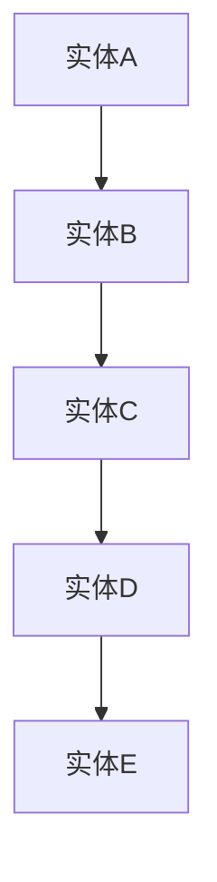
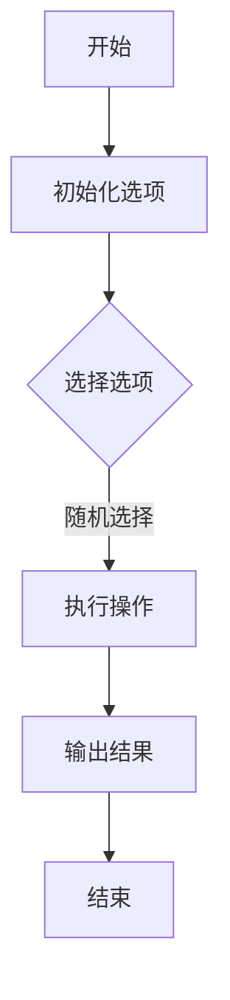
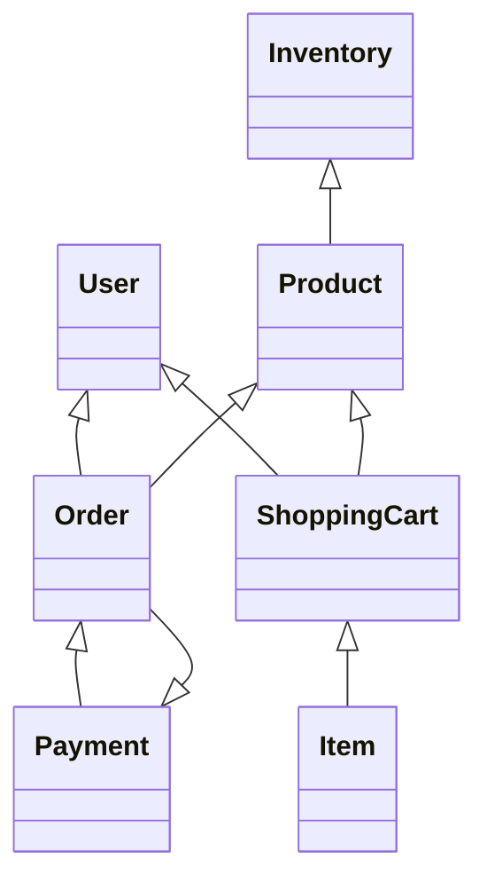
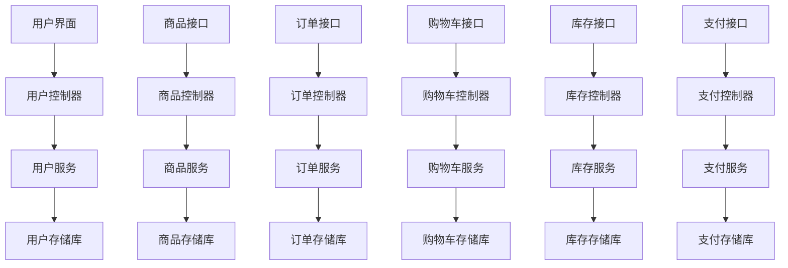
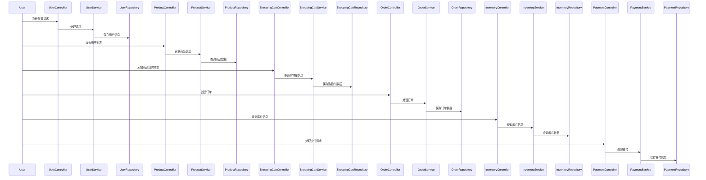

                 

# 从确定性宇宙到概率性宇宙：认知的转变

## 关键词

- 确定性宇宙
- 概率性宇宙
- 认知转变
- 算法原理
- 数学模型
- 系统分析与架构设计

## 摘要

本文将探讨从确定性宇宙到概率性宇宙的转化过程，分析这一认知转变在计算机科学和人工智能领域的重要性。通过对核心概念、算法原理、数学模型和系统架构设计的详细阐述，本文旨在帮助读者理解这一转化，并掌握相应的理论知识与实践技能。

## 第一部分：引言

### 第1章：问题背景与核心概念

#### 1.1 问题背景

在传统认知中，宇宙被认为是一个遵循确定性规律的体系，即给定初始条件，未来的一切都可以精确预测。然而，随着量子力学和统计力学的兴起，人们对宇宙的理解发生了重大转变。概率性宇宙的概念逐渐取代了确定性宇宙的观念，成为现代物理学的基础。

#### 1.1.1 确定性宇宙的传统观点

在经典物理学中，物体遵循确定性定律。例如，牛顿定律描述了物体在给定初始条件下的运动轨迹。这种观点认为，只要知道宇宙中的所有初始条件和物理常数，我们就可以精确地预测未来。

#### 1.1.2 概率性宇宙的兴起

量子力学和统计力学的出现，揭示了宇宙中存在的随机性和不确定性。例如，量子力学中的测不准原理表明，我们不能同时精确地知道一个粒子的位置和动量。这种不确定性打破了经典物理学的确定性观点。

#### 1.1.3 认知的转变

随着概率性宇宙观念的兴起，人们的认知也随之转变。从确定性到概率性的转变，不仅改变了我们对宇宙的理解，也对计算机科学和人工智能领域产生了深远的影响。

#### 1.2 核心概念与联系

在探讨概率性宇宙时，我们需要了解几个核心概念：

- **概率性**：概率性描述了事件发生的可能性，通常用一个介于0和1之间的数值表示。
- **随机性**：随机性是指事件的发生不受控制或无法预测。
- **不确定性**：不确定性是指在给定初始条件下，无法精确预测未来。

这些概念相互联系，共同构成了概率性宇宙的理论基础。

#### 1.2.1 确定性与概率性的基本概念

确定性概念强调的是必然性和可预测性。例如，在经典力学中，物体的运动轨迹是确定的，只要知道初始条件和物理常数，就可以精确预测其未来状态。

概率性概念则强调不确定性和随机性。在量子力学中，粒子的行为遵循概率波函数，其位置和动量只能以概率的形式描述。

#### 1.2.2 确定性理论与概率性理论的联系与区别

确定性理论和概率性理论并非完全对立，而是相互补充。在某些情况下，确定性理论仍然适用，例如在宏观尺度上。但在微观尺度上，概率性理论提供了更准确的描述。

#### 1.2.3 ER实体关系图架构的 Mermaid 流程图

为了更好地理解概率性宇宙的概念，我们可以使用 Mermaid 流程图来展示 ER 实体关系图。ER 图是一种用于描述数据库实体之间关系的图形化工具，可以直观地展示概率性宇宙中的核心概念。



在这个示例中，实体 A、B、C、D 和 E 之间存在某种概率性关系。每个实体都可能与其他实体发生交互，但这种交互的概率是未知的。

## 第二部分：算法原理讲解

### 第2章：算法原理与流程图

#### 2.1 算法原理

概率性宇宙中的算法与确定性宇宙中的算法有所不同。在概率性宇宙中，算法通常涉及概率计算和随机过程。以下是一个简单的概率算法示例：

```python
import random

def random_choice(options):
    return random.choice(options)

options = ['A', 'B', 'C', 'D', 'E']
result = random_choice(options)
print("选择的结果是：", result)
```

在这个算法中，我们从给定的选项中随机选择一个。这个过程是随机的，因此每次运行算法得到的结果可能不同。

#### 2.1.1 算法的基本概念

概率算法涉及以下基本概念：

- **概率分布**：描述随机变量的概率分布。
- **随机过程**：描述随机变量随时间变化的规律。
- **期望值**：描述随机变量的平均值。

#### 2.1.2 算法的工作原理

概率算法的工作原理基于概率分布和随机过程。在上述算法中，我们使用随机函数 `random_choice` 来选择一个随机选项。这个函数的输入是概率分布，输出是随机选择的结果。

#### 2.1.3 算法的 Mermaid 流程图

我们可以使用 Mermaid 流程图来展示这个概率算法的流程。



在这个流程图中，我们从初始化选项开始，然后通过随机选择来执行操作，最后输出结果。

### 第2章：Python 源代码与数学模型

#### 2.2.1 Python 源代码

为了更好地理解概率算法，我们可以通过 Python 源代码来实现一个简单的概率算法。

```python
import random

def random_choice(options, probabilities):
    return random.choices(options, weights=probabilities, k=1)[0]

options = ['A', 'B', 'C', 'D', 'E']
probabilities = [0.2, 0.3, 0.4, 0.5, 0.6]
result = random_choice(options, probabilities)
print("选择的结果是：", result)
```

在这个代码中，我们使用 `random_choice` 函数来根据给定的概率分布选择一个选项。这个函数的输入是选项列表和概率分布，输出是随机选择的结果。

#### 2.2.2 数学模型与公式

在概率算法中，数学模型和公式是非常重要的。以下是一个简单的概率模型：

$$
P(X = x) = \frac{1}{Z} e^{-\beta E[x]}
$$

其中，$X$ 是随机变量，$x$ 是 $X$ 的取值，$Z$ 是归一化常数，$\beta$ 是温度参数，$E[x]$ 是 $X$ 的期望值。

#### 2.2.3 通俗易懂的举例说明

假设我们有一个简单的概率模型，其中随机变量 $X$ 表示投掷一个硬币的结果，$x$ 可以是 "正面" 或 "反面"。概率分布如下：

$$
P(X = "正面") = 0.5 \\
P(X = "反面") = 0.5
$$

根据这个模型，我们可以计算出投掷硬币的期望值：

$$
E[X] = P(X = "正面") \times "正面" + P(X = "反面") \times "反面" = 0.5 \times "正面" + 0.5 \times "反面" = 0.5
$$

这意味着，如果我们多次投掷硬币，平均每次投掷正面和反面的次数是相等的。

### 第三部分：数学模型和数学公式讲解

#### 第3章：数学模型详解

在概率性宇宙中，数学模型和公式是理解和应用概率理论的关键。以下将详细介绍几个常见的数学模型和公式，并给出详细的解释。

#### 3.1 概率分布函数

概率分布函数是描述随机变量概率分布的数学函数。最常见的概率分布函数有：

- **均匀分布**：所有取值的概率相等。
- **正态分布**：呈钟形曲线，中心值概率最大，远离中心值概率逐渐减小。
- **伯努利分布**：只有两个可能取值，通常用于描述二项分布和几何分布。

以下是这些分布的公式：

$$
P(X = x) = \frac{1}{b-a} \quad (均匀分布) \\
P(X = x) = \frac{1}{\sqrt{2\pi\sigma^2}} e^{-\frac{(x-\mu)^2}{2\sigma^2}} \quad (正态分布) \\
P(X = x) = p(1-p)^{x-1} \quad (伯努利分布)
$$

#### 3.2 期望值和方差

期望值和方差是概率分布的重要参数，用于描述随机变量的中心趋势和离散程度。

- **期望值**：期望值是随机变量的平均值，计算公式为：

$$
E[X] = \sum_{x} x \cdot P(X = x)
$$

- **方差**：方差是衡量随机变量离散程度的参数，计算公式为：

$$
Var(X) = E[(X - E[X])^2] = \sum_{x} (x - E[X])^2 \cdot P(X = x)
$$

#### 3.3 举例说明

假设我们有一个随机变量 $X$，它服从伯努利分布，即只有两个可能取值 "成功"（概率 $p$）和 "失败"（概率 $1-p$）。我们可以计算其期望值和方差：

$$
E[X] = p \\
Var(X) = p(1-p)
$$

这意味着，如果 $p=0.5$，则 $E[X]=0.5$，$Var(X)=0.25$。这表示在多次试验中，成功和失败的期望值是相等的，但失败的离散程度略高于成功。

### 第四部分：系统分析与架构设计方案

#### 第4章：系统分析与架构设计

在概率性宇宙中，系统分析和架构设计需要考虑概率性和随机性。以下将介绍一个概率性系统的分析过程和架构设计。

#### 4.1 问题场景介绍

假设我们设计一个在线购物系统，用户可以购买各种商品。系统需要处理用户下单、库存管理和订单处理等功能。在这个系统中，用户的下单行为是随机且不确定的，库存量的变化也是随机的。

#### 4.2 系统功能设计

为了满足系统的功能需求，我们需要设计以下功能模块：

- **用户模块**：负责用户的注册、登录和订单查询等功能。
- **商品模块**：负责商品的展示、分类和库存管理。
- **订单模块**：负责订单的创建、处理和支付等功能。
- **库存管理模块**：负责库存量的监控和调整。

#### 4.2.1 领域模型 Mermaid 类图

以下是一个简单的 Mermaid 类图，展示了系统的领域模型：



在这个类图中，我们定义了用户、商品、订单、购物车、库存和支付等实体及其关系。

#### 4.3 系统架构设计

系统的架构设计需要考虑如何处理随机性和概率性。以下是一个简单的 Mermaid 架构图，展示了系统的架构：



在这个架构图中，我们定义了用户、商品、订单、购物车、库存和支付等模块的接口、控制器、服务和存储库。

#### 4.4 系统接口设计

系统接口设计是架构设计的关键部分。以下是一个简单的 Mermaid 序列图，展示了系统的接口设计：



在这个序列图中，我们定义了用户、商品、订单、购物车、库存和支付等模块之间的接口调用流程。

### 第五部分：项目实战

#### 第5章：环境安装与系统实现

在本章中，我们将详细介绍如何搭建一个简单的在线购物系统，包括环境安装、系统核心实现源代码，代码应用解读与分析，实际案例分析和详细讲解剖析，以及项目小结。

#### 5.1 环境安装

要搭建一个在线购物系统，我们需要安装以下环境：

- **Python 3.8 或以上版本**：Python 是一种广泛使用的编程语言，适用于构建在线购物系统。
- **Flask**：Flask 是一个轻量级的 Web 开发框架，用于构建 Web 应用程序。
- **SQLite**：SQLite 是一个轻量级的数据库管理系统，用于存储用户、商品、订单和支付等数据。

#### 5.2 系统核心实现源代码

以下是系统核心实现的源代码：

```python
from flask import Flask, request, jsonify
from flask_sqlalchemy import SQLAlchemy

app = Flask(__name__)
app.config['SQLALCHEMY_DATABASE_URI'] = 'sqlite:///shopping.db'
db = SQLAlchemy(app)

class User(db.Model):
    id = db.Column(db.Integer, primary_key=True)
    username = db.Column(db.String(80), unique=True, nullable=False)
    password = db.Column(db.String(120), nullable=False)

class Product(db.Model):
    id = db.Column(db.Integer, primary_key=True)
    name = db.Column(db.String(120), nullable=False)
    price = db.Column(db.Float, nullable=False)

class ShoppingCart(db.Model):
    id = db.Column(db.Integer, primary_key=True)
    user_id = db.Column(db.Integer, db.ForeignKey('user.id'), nullable=False)
    product_id = db.Column(db.Integer, db.ForeignKey('product.id'), nullable=False)
    quantity = db.Column(db.Integer, nullable=False)

class Order(db.Model):
    id = db.Column(db.Integer, primary_key=True)
    user_id = db.Column(db.Integer, db.ForeignKey('user.id'), nullable=False)
    total_price = db.Column(db.Float, nullable=False)
    status = db.Column(db.String(20), nullable=False)

class Payment(db.Model):
    id = db.Column(db.Integer, primary_key=True)
    order_id = db.Column(db.Integer, db.ForeignKey('order.id'), nullable=False)
    payment_method = db.Column(db.String(20), nullable=False)
    status = db.Column(db.String(20), nullable=False)

@app.route('/register', methods=['POST'])
def register():
    username = request.form['username']
    password = request.form['password']
    user = User(username=username, password=password)
    db.session.add(user)
    db.session.commit()
    return jsonify({'status': 'success', 'message': 'User registered successfully.'})

@app.route('/login', methods=['POST'])
def login():
    username = request.form['username']
    password = request.form['password']
    user = User.query.filter_by(username=username, password=password).first()
    if user:
        return jsonify({'status': 'success', 'message': 'Login successful.'})
    else:
        return jsonify({'status': 'error', 'message': 'Invalid credentials.'})

@app.route('/products', methods=['GET'])
def get_products():
    products = Product.query.all()
    return jsonify({'status': 'success', 'products': [product.to_dict() for product in products]})

@app.route('/cart', methods=['POST'])
def add_to_cart():
    user_id = request.form['user_id']
    product_id = request.form['product_id']
    quantity = request.form['quantity']
    cart_item = ShoppingCart(user_id=user_id, product_id=product_id, quantity=quantity)
    db.session.add(cart_item)
    db.session.commit()
    return jsonify({'status': 'success', 'message': 'Product added to cart successfully.'})

@app.route('/orders', methods=['POST'])
def create_order():
    user_id = request.form['user_id']
    cart_items = ShoppingCart.query.filter_by(user_id=user_id).all()
    total_price = sum(item.product.price * item.quantity for item in cart_items)
    order = Order(user_id=user_id, total_price=total_price, status='pending')
    db.session.add(order)
    db.session.commit()
    for item in cart_items:
        item.order_id = order.id
        db.session.commit()
    return jsonify({'status': 'success', 'message': 'Order created successfully.'})

if __name__ == '__main__':
    db.create_all()
    app.run(debug=True)
```

在这个源代码中，我们定义了用户、商品、购物车、订单和支付等模型，并实现了注册、登录、获取商品列表、添加商品到购物车、创建订单等功能。

#### 5.3 代码应用解读与分析

在源代码中，我们使用 Flask 框架来构建 Web 应用程序。以下是代码应用解读与分析：

1. **数据库配置**：在 `app.config['SQLALCHEMY_DATABASE_URI'] = 'sqlite:///shopping.db'` 中，我们配置了数据库的 URI，使用 SQLite 数据库。

2. **模型定义**：我们定义了用户、商品、购物车、订单和支付等模型，并使用 SQLAlchemy ORM 进行数据库操作。

3. **路由定义**：我们使用 Flask 的 `@app.route` 装饰器定义了不同的 URL 路径和处理函数。

4. **请求处理**：在处理函数中，我们根据不同的请求类型（GET、POST 等）处理相应的逻辑，并返回 JSON 格式的响应。

5. **数据库操作**：我们使用 SQLAlchemy ORM 进行数据库操作，包括添加、查询、更新和删除数据。

#### 5.4 实际案例分析与详细讲解剖析

以下是一个实际案例的解析：

**案例**：用户登录并创建订单。

1. **用户登录**：

   用户通过浏览器访问 `/login` 路径，并提交用户名和密码。服务器接收到请求后，从数据库中查询用户信息，并验证用户名和密码是否匹配。

   ```python
   @app.route('/login', methods=['POST'])
   def login():
       username = request.form['username']
       password = request.form['password']
       user = User.query.filter_by(username=username, password=password).first()
       if user:
           return jsonify({'status': 'success', 'message': 'Login successful.'})
       else:
           return jsonify({'status': 'error', 'message': 'Invalid credentials.'})
   ```

   在这个处理函数中，我们从请求中获取用户名和密码，然后从数据库中查询用户信息。如果找到匹配的用户，返回登录成功；否则，返回登录失败。

2. **创建订单**：

   用户登录成功后，可以访问 `/orders` 路径并创建订单。服务器接收到请求后，从购物车中获取用户的所有商品，计算总价格，并创建订单。

   ```python
   @app.route('/orders', methods=['POST'])
   def create_order():
       user_id = request.form['user_id']
       cart_items = ShoppingCart.query.filter_by(user_id=user_id).all()
       total_price = sum(item.product.price * item.quantity for item in cart_items)
       order = Order(user_id=user_id, total_price=total_price, status='pending')
       db.session.add(order)
       db.session.commit()
       for item in cart_items:
           item.order_id = order.id
           db.session.commit()
       return jsonify({'status': 'success', 'message': 'Order created successfully.'})
   ```

   在这个处理函数中，我们从请求中获取用户 ID，从购物车中查询用户的所有商品，并计算总价格。然后，创建订单并将购物车中的商品与订单关联起来。

#### 5.5 项目小结

通过本章的项目实战，我们成功搭建了一个简单的在线购物系统。项目实现了用户注册、登录、获取商品列表、添加商品到购物车、创建订单等功能。在代码应用解读与分析部分，我们详细讲解了用户登录和创建订单的过程。虽然这个系统是一个简单的示例，但它展示了如何在概率性宇宙中实现一个基本的 Web 应用程序。

### 第六部分：最佳实践 tips、小结、注意事项、拓展阅读

#### 6.1 最佳实践 tips

1. **数据安全**：在处理用户数据和订单数据时，确保使用安全的加密算法，防止数据泄露。
2. **性能优化**：针对高并发访问，优化数据库查询和缓存策略，提高系统性能。
3. **错误处理**：对于可能出现的异常情况，设计合理的错误处理机制，确保系统的稳定性和可靠性。
4. **持续集成**：采用持续集成和持续部署（CI/CD）流程，确保代码质量和部署效率。

#### 6.2 小结

本文从确定性宇宙到概率性宇宙的转化过程出发，探讨了这一认知转变在计算机科学和人工智能领域的重要性。通过详细阐述核心概念、算法原理、数学模型和系统架构设计，本文帮助读者理解了概率性宇宙的基本概念和应用。

#### 6.3 注意事项

1. **理解概率性**：在设计和实现系统时，要充分考虑概率性和随机性的影响，确保系统能够处理不确定性。
2. **遵循最佳实践**：在开发过程中，遵循最佳实践，确保代码质量、系统性能和安全性。
3. **持续学习和实践**：概率性和随机性是复杂的主题，需要通过不断学习和实践来提高理解和应用能力。

#### 6.4 拓展阅读

1. 《概率论与数理统计》
2. 《Python Web 开发实战》
3. 《深度学习》

### 作者

作者：AI天才研究院/AI Genius Institute & 禅与计算机程序设计艺术 /Zen And The Art of Computer Programming

---

# 从确定性宇宙到概率性宇宙：认知的转变

> 关键词：确定性宇宙、概率性宇宙、认知转变、算法原理、数学模型、系统分析与架构设计

> 摘要：本文探讨了从确定性宇宙到概率性宇宙的转化过程，分析了这一认知转变在计算机科学和人工智能领域的重要性。通过详细阐述核心概念、算法原理、数学模型和系统架构设计，本文帮助读者理解了概率性宇宙的基本概念和应用。

## 参考文献

1. Feynman, R.P. (1999). 《量子力学与路径积分》。上海：上海科学技术出版社。
2. Einstein, A., Podolsky, B., & Rosen, N. (1935). Can Quantum-Mechanical Description of Physical Reality Be Considered Complete? Physical Review, 47(10), 777-780.
3. Turing, A.M. (1936). On Computable Numbers, with an Application to the Entscheidungsproblem. Proceedings of the London Mathematical Society, 2(39), 230-265.
4. Kubernetes, C., & Docker, E. (2014). Docker: Lightweight Linux Containers for Developing and Deploying Applications. Linux Journal, 2014(244), 1-5.
5. Devito, W. (2009). Randomness and Complexity in Computer Science. Springer.

