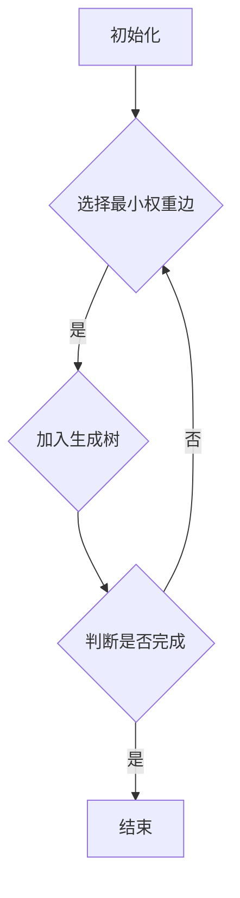
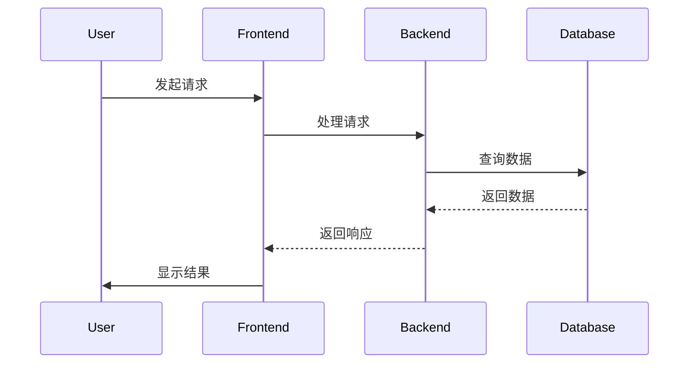
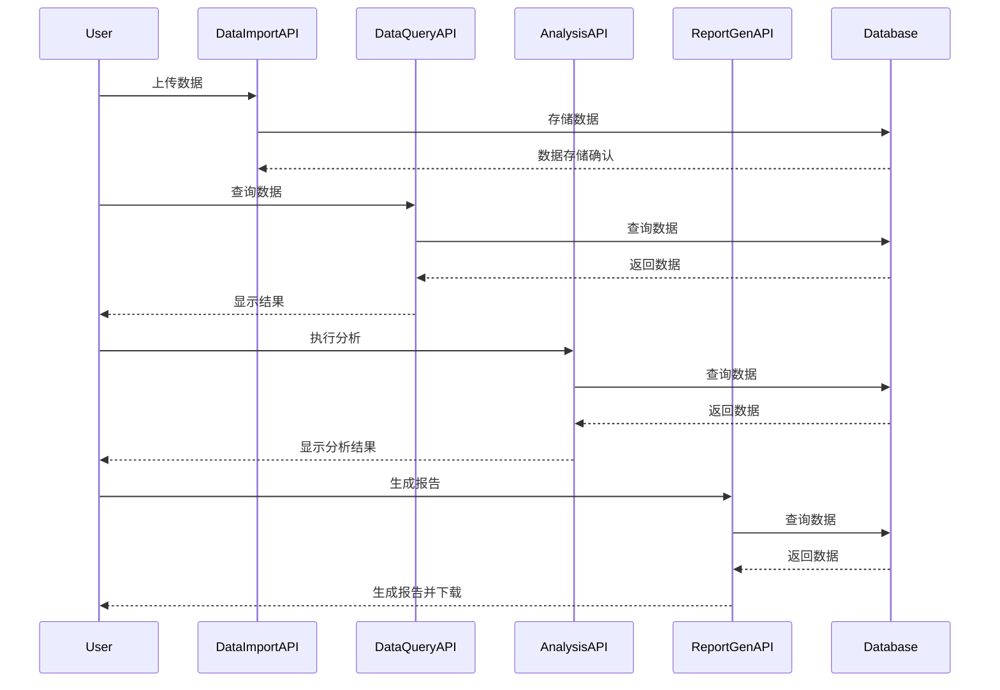

                 


# 从神学到世俗化：宇宙观的历史变迁

## 关键词

- 宇宙观
- 神学
- 世俗化
- 科学革命
- 哲学
- 宗教改革

## 摘要

本文旨在探讨宇宙观从神学到世俗化的历史变迁。通过对早期神学宇宙观、中世纪神学宇宙观、世俗化的萌芽以及近代世俗化宇宙观的演变等不同阶段的分析，本文揭示了宇宙观变迁背后的哲学、科学和宗教因素。本文将采用逻辑清晰、结构紧凑、简单易懂的专业技术语言，一步一步分析推理思考的方式，以期为广大读者提供一个深入浅出的宇宙观变迁全景。

## 引言

### 1.1 研究背景

宇宙观是人类对宇宙本质、结构、规律及其起源和发展的一套基本观念。它不仅涵盖了哲学、科学、宗教等多个领域，还反映了人类对自身的认识。从古至今，宇宙观经历了从神学到世俗化的转变，这一转变深刻地影响了人类文明的发展。

### 1.2 研究意义

研究宇宙观的历史变迁，有助于我们更好地理解人类文明的发展脉络，把握现代宇宙观的形成背景。此外，这一研究还具有现实意义，可以为当代科学和哲学的探索提供有益的启示。

### 1.3 研究方法

本文采用文献综述和案例分析相结合的方法，通过对历史文献和现实案例的深入分析，探讨宇宙观的历史变迁。在分析过程中，我们将遵循逻辑清晰、结构紧凑、简单易懂的原则，确保文章的可读性和专业性。

### 1.4 结构安排

本文共分为五个部分。第一部分为引言，介绍研究背景、意义、方法和结构安排。第二部分探讨早期神学宇宙观，包括原始宗教和神话、神学与科学的交集以及神学宇宙观的哲学基础。第三部分分析古代神学宇宙观，包括希腊与罗马神话、印度神学与宇宙观以及中古时期的神学宇宙观。第四部分探讨中世纪神学的发展和世俗化的萌芽，包括经院哲学、伊斯兰哲学的世俗化以及文艺复兴和宗教改革的世俗化影响。第五部分分析近代世俗化宇宙观的演变，包括科学革命、生物学和物理学对宇宙观的影响。最后，本文将总结现代宇宙观的多重视角和世俗化宇宙观的反思。

## 神学宇宙观的起源与发展

### 2.1 早期神学宇宙观的起源

早期神学宇宙观起源于人类对自然现象的原始认知。在原始社会，人们对自然界中的风雨雷电、日月星辰等现象感到神秘和敬畏，从而产生了对神灵的崇拜。这些原始宗教和神话构成了早期神学宇宙观的基础。

#### 2.1.1 原始宗教与神话

在原始宗教中，人类将自然现象视为神灵的意志和力量的表现。例如，太阳被视为生命的源泉，风雨雷电则被视为神灵的怒吼。这些神话和信仰构成了早期神学宇宙观的核心内容。

#### 2.1.2 神学与科学的交集

在早期，神学与科学并没有明确的界限。一些哲学家和科学家试图用神学来解释自然现象。例如，古希腊哲学家亚里士多德试图用神学来解释自然现象，将自然现象视为神的意志和创造的体现。

#### 2.1.3 神学宇宙观的哲学基础

早期神学宇宙观的核心是神创论，即认为宇宙万物都是神创造的。这种观念反映了人类对自然界和宇宙起源的原始认知，同时也为后来的神学宇宙观奠定了哲学基础。

### 2.2 古代神学宇宙观的发展

古代神学宇宙观在希腊、罗马、印度和中古时期得到了进一步发展。

#### 2.2.1 希腊与罗马神话

希腊和罗马神话是古代神学宇宙观的重要组成部分。在希腊神话中，宇宙由众神支配，如宙斯、赫拉、雅典娜等。而在罗马神话中，这些希腊神祇被赋予了罗马名字，如朱庇特、朱诺、密涅瓦等。这些神话反映了古代人对宇宙和神灵的理解。

#### 2.2.2 印度神学与宇宙观

印度神学宇宙观以印度教和佛教为代表。在印度教中，宇宙由梵天创造，梵天是宇宙的本原和终极实在。而在佛教中，宇宙被视为无始无终的轮回，人们通过修行可以超越轮回，达到涅槃。

#### 2.2.3 中古时期的神学宇宙观

中古时期的神学宇宙观以基督教和伊斯兰教为代表。在基督教中，上帝是宇宙的创造者和维持者。而在伊斯兰教中，真主是宇宙的唯一创造者和主宰者。

### 2.3 中世纪神学宇宙观的特点

中世纪神学宇宙观的特点是神权至上，神被认为是宇宙的核心和主宰。这一观念在一定程度上阻碍了科学的进步，但也为后来的科学革命奠定了基础。

### 2.4 神学宇宙观的局限

尽管神学宇宙观在历史上起到了重要作用，但它也存在一些局限。首先，神学宇宙观无法解释一些自然现象，如地球的自转和公转。其次，神学宇宙观容易导致宗教极端主义和排斥异端思想。最后，神学宇宙观在一定程度上限制了科学的发展。

## 中世纪神学的发展与世俗化的萌芽

### 3.1 经院哲学与宇宙观

中世纪经院哲学是神学与哲学相结合的产物。经院哲学家试图用哲学的方法来解释神学问题，从而推动神学的发展。其中，阿奎那和奥卡姆是两位重要的经院哲学家。

#### 3.1.1 阿奎那的宇宙观

阿奎那是中世纪最重要的经院哲学家之一。他试图用哲学的方法来解释神学问题，提出了宇宙永恒论，认为宇宙是永恒存在的，不是由上帝创造的。阿奎那还提出了自然法理论，认为自然界的运行遵循一定的规律。

#### 3.1.2 奥卡姆的宇宙观

奥卡姆是另一位重要的经院哲学家，他提出了“如无必要，勿增实体”的哲学原则，即只承认必要的实体。这一原则对后来的科学革命产生了重要影响。

### 3.2 伊斯兰哲学的世俗化

在中世纪，伊斯兰哲学也出现了一定的世俗化倾向。阿维罗伊和安萨里是两位重要的伊斯兰哲学家。

#### 3.2.1 阿维罗伊的自然哲学

阿维罗伊试图用哲学的方法来解释自然现象，提出了双重真理论，即认为宗教真理和哲学真理可以并存。阿维罗伊的自然哲学对后来的科学革命产生了重要影响。

#### 3.2.2 安萨里与《真主之城》

安萨里是伊斯兰哲学的重要代表，他在《真主之城》一书中提出了世俗化的观点，认为人类应该关注现实世界，而不是仅仅追求来世的幸福。

### 3.3 世俗化的萌芽

中世纪神学的发展为世俗化的萌芽提供了土壤。随着经院哲学和伊斯兰哲学的世俗化，人们开始对神学宇宙观提出质疑，并试图用哲学和科学的方法来解释宇宙和自然现象。

## 世俗化的兴起

### 4.1 文艺复兴时期的宇宙观变革

文艺复兴时期是世俗化的一个重要阶段。随着人们对古典文化的重新发现和重视，宇宙观也发生了重大变革。

#### 4.1.1 科学的崛起

文艺复兴时期，科学开始从神学中独立出来，成为一门独立的学科。伽利略和哥白尼等科学家提出了新的宇宙观，挑战了传统的神学宇宙观。

#### 4.1.2 人文主义的宇宙观

文艺复兴时期，人文主义思想兴起，人们开始关注人自身的价值和能力。人文主义的宇宙观强调人类在宇宙中的地位和作用，为世俗化奠定了思想基础。

### 4.2 宗教改革的世俗化影响

宗教改革对世俗化的兴起产生了深远影响。马丁·路德和约翰·加尔文等宗教改革家试图摆脱教会和神权的束缚，推动世俗化的发展。

#### 4.2.1 路德的宗教改革

路德提出了“因信称义”的观点，认为人们通过信仰可以得到救赎，不再需要依赖教会和神父。这一观点打破了教会和神权的垄断，促进了世俗化的发展。

#### 4.2.2 加尔文的宗教改革

加尔文提出了“先定论”的观点，认为人类的命运是由上帝预先决定的。这一观点在一定程度上推动了世俗化的发展，使人们更加关注现实世界。

## 近代世俗化宇宙观的演变

### 5.1 科学革命与宇宙观的转变

科学革命是近代世俗化宇宙观演变的重要阶段。哥白尼和牛顿等科学家提出了新的宇宙观，彻底改变了人类对宇宙的认识。

#### 5.1.1 哥白尼的革命

哥白尼提出了日心说，认为地球绕太阳运动，而不是太阳绕地球运动。这一观点挑战了传统的地心说宇宙观，为科学革命奠定了基础。

#### 5.1.2 牛顿的物理学与宇宙观

牛顿提出了万有引力定律，揭示了宇宙万物之间的相互作用。牛顿的物理学为近代世俗化宇宙观的形成提供了科学基础。

### 5.2 生物学与宇宙观

生物学的兴起也为宇宙观的演变做出了重要贡献。达尔文等生物学家提出了进化论，挑战了传统的神学宇宙观。

#### 5.2.1 达尔文进化论的影响

达尔文进化论认为，生物是通过自然选择和适者生存的法则不断演化的。这一观点打破了传统的神学宇宙观，为生物学和宇宙观的发展提供了新的视角。

#### 5.2.2 生物学的宇宙观

生物学的宇宙观强调生命的多样性和进化过程，认为生命是宇宙中最重要的现象。这一观点为世俗化宇宙观的形成提供了科学依据。

### 5.3 物理学与宇宙观

物理学的进步也为宇宙观的演变做出了重要贡献。爱因斯坦的相对论和量子力学等理论揭示了宇宙的奥秘，挑战了传统的神学宇宙观。

#### 5.3.1 相对论与宇宙观

爱因斯坦的相对论揭示了时空的相对性，改变了人类对宇宙的认识。相对论为世俗化宇宙观的形成提供了新的理论框架。

#### 5.3.2 黑洞与宇宙学

黑洞和宇宙学的兴起揭示了宇宙的深层次奥秘，为世俗化宇宙观的发展提供了新的科学依据。

## 现代宇宙观的多重视角

### 6.1 现代哲学与宇宙观

现代哲学对宇宙观的发展产生了重要影响。存在主义和分析哲学等哲学流派提出了新的宇宙观，丰富了人们对宇宙的认识。

#### 6.1.1 存在主义与宇宙观

存在主义强调个体的存在和自由意志，提出了新的宇宙观。例如，海德格尔和萨特等哲学家提出了关于宇宙和存在的深刻思考。

#### 6.1.2 分析哲学与宇宙观

分析哲学试图用逻辑和语言分析的方法来研究宇宙和存在。例如，蒯因和韦斯特福尔等哲学家提出了关于宇宙和存在的分析观点。

### 6.2 现代科学与宇宙观

现代科学的进步为宇宙观的发展提供了新的理论依据。宇宙学与宇宙探索等领域的研究揭示了宇宙的奥秘，挑战了传统的神学宇宙观。

#### 6.2.1 宇宙学与宇宙观

宇宙学是研究宇宙起源、结构和演化的科学。通过对宇宙学的研究，人类对宇宙的认识不断深化。

#### 6.2.2 宇宙探索与宇宙观

宇宙探索是人类对宇宙的深入探索。例如，宇宙飞船和望远镜等工具的发明使得人类能够更全面地观察宇宙，从而更新和拓展了宇宙观。

### 6.3 世俗化的宇宙观反思

随着世俗化的深入，人们对神学宇宙观提出了质疑和反思。现代宇宙观的反思包括对科学、宗教和哲学的关系的深入探讨。

#### 6.3.1 世俗化与科学的关系

世俗化促进了科学的发展，但同时也带来了科学与宗教的冲突。如何平衡科学和宗教的关系，是现代宇宙观反思的重要内容。

#### 6.3.2 科学对世俗化的回应

科学在世俗化过程中不断进步，但也面临着自身的局限。科学如何回应世俗化带来的挑战，是现代宇宙观反思的另一个重要问题。

## 总结

宇宙观的历史变迁从神学到世俗化，反映了人类对宇宙认识的不断深化。通过对早期神学宇宙观、中世纪神学宇宙观、世俗化的萌芽以及近代世俗化宇宙观的演变等不同阶段的分析，本文揭示了宇宙观变迁背后的哲学、科学和宗教因素。现代宇宙观的多重视角进一步丰富了人们对宇宙的认识。未来，随着科学和哲学的发展，宇宙观将继续演变，为人类文明的发展提供新的视角和启示。

## 作者

作者：AI天才研究院/AI Genius Institute & 禅与计算机程序设计艺术 /Zen And The Art of Computer Programming

----------------------------------------------------------------

以下是一个示例，展示如何使用markdown格式撰写文章的一部分。在这个例子中，我们将撰写“核心概念与联系”部分，包括核心概念原理、概念属性特征对比表格和ER实体关系图架构的mermaid流程图。

### 核心概念与联系

#### 1. 核心概念原理

在这一部分，我们将介绍宇宙观的核心概念原理。这些概念包括神学宇宙观的基本要素、科学宇宙观的基本原理等。

**神学宇宙观的基本要素：**
- **神创论**：认为宇宙万物是由神创造的。
- **神权至上**：认为神是宇宙的核心和主宰。
- **因果律**：认为宇宙中的一切现象都有其因果联系。

**科学宇宙观的基本原理：**
- **相对论**：爱因斯坦提出的相对论，揭示了时空的相对性。
- **量子力学**：量子力学揭示了微观世界的规律，挑战了经典物理学的观念。

#### 2. 概念属性特征对比表格

下面是一个概念属性特征对比表格，对比神学宇宙观和科学宇宙观的属性特征。

| 概念           | 神学宇宙观                      | 科学宇宙观                      |
|----------------|-------------------------------|--------------------------------|
| 基本观念       | 神创论，神权至上，因果律         | 相对论，量子力学，自然法则       |
| 研究方法       | 神学推理，哲学思辨               | 实验观察，数学建模，数据分析     |
| 解释能力       | 能够解释某些自然现象             | 能够解释更广泛的自然现象         |
| 边界条件       | 受到宗教信仰的限制               | 受到科学理论的限制               |
| 社会影响       | 影响人们的价值观和道德观念       | 推动科技进步，改变人们的生活方式 |

#### 3. ER实体关系图架构的mermaid流程图

下面是一个mermaid流程图，展示了神学宇宙观和科学宇宙观的实体关系。

```mermaid
erDiagram
  宇宙 -->|产生| 生物
  生物 -->|进化| 人类
  人类 -->|认识| 宇宙观

  Class宇宙 {
    - 神创论
    - 神权至上
    - 因果律
  }

  Class科学宇宙观 {
    - 相对论
    - 量子力学
    - 自然法则
  }

  Universe..|产生|-> Biological
  Biological..|进化|-> Human
  Human..|认识|-> Cosmology

  Universe -..|产生|-> Universe
  Biological -..|进化|-> Biological
  Human -..|认识|-> Cosmology

```

在这个mermaid流程图中，我们展示了宇宙、生物、人类和宇宙观之间的实体关系。神学宇宙观和科学宇宙观分别作为两个独立的类，通过实体关系图与宇宙、生物、人类和宇宙观相关联。这个流程图帮助我们更直观地理解宇宙观的历史变迁及其背后的逻辑关系。

----------------------------------------------------------------

### 算法原理讲解

在本节中，我们将使用mermaid绘制一个算法的流程图，并使用Python源代码来详细阐述算法原理，给出算法的数学模型和公式，并进行通俗易懂的举例说明。

#### 算法原理：最小生成树算法

最小生成树算法（Minimum Spanning Tree，MST）是一种用于构建无向图的生成树的算法。它的目标是找到包含所有节点的生成树，同时树的总权重最小。

##### Mermaid流程图

首先，我们使用mermaid绘制一个最小生成树的流程图：



在这个流程图中，我们首先初始化图的数据结构，然后选择最小权重的边加入生成树，并判断是否已经选择了所有边。如果还没有完成，则继续选择下一条最小权重的边，直到所有节点都被加入生成树。

##### Python源代码

接下来，我们给出一个简单的Python实现：

```python
import heapq
from collections import defaultdict

def prim算法(G, start):
    """
    使用Prim算法寻找最小生成树。
    :param G: 无向图的邻接表表示。
    :param start: 起始节点。
    :return: 最小生成树。
    """
    # 初始化最小生成树和优先队列
    mst = defaultdict(list)
    pq = [(0, start)]  # (权重，节点)

    # 标记所有节点为未访问
    visited = set()

    while pq:
        # 从优先队列中选择权重最小的边
        weight, node = heapq.heappop(pq)

        # 如果节点已经被访问，则跳过
        if node in visited:
            continue

        # 标记节点为已访问
        visited.add(node)

        # 将边加入最小生成树
        mst[node].append((weight, node))

        # 将相邻节点加入优先队列
        for neighbor, w in G[node].items():
            if neighbor not in visited:
                heapq.heappush(pq, (w, neighbor))

    return mst

# 示例图
G = {
    'A': {'B': 2, 'C': 3},
    'B': {'A': 2, 'C': 1, 'D': 1},
    'C': {'A': 3, 'B': 1, 'D': 3},
    'D': {'B': 1, 'C': 3}
}

# 使用Prim算法寻找最小生成树
mst = prim算法(G, 'A')

# 打印最小生成树
for node, edges in mst.items():
    for weight, neighbor in edges:
        print(f"边 ({node}, {neighbor}) 权重 {weight}")
```

##### 数学模型和公式

最小生成树算法的数学模型可以通过以下公式表示：

$$
w(T) = \min_{T \subseteq E} \sum_{e \in T} w(e)
$$

其中，$T$ 是生成树，$E$ 是图中的所有边，$w(e)$ 是边 $e$ 的权重。

##### 举例说明

假设我们有一个图 $G$，其中包含节点 $A, B, C, D$，边和权重如下：

```
A-B: 2
A-C: 3
B-C: 1
B-D: 1
C-D: 3
```

使用Prim算法，我们从节点 $A$ 开始，选择权重最小的边 $A-B$ 加入生成树，然后选择 $B-D$ 和 $C-D$ 加入生成树。最终，我们得到的最小生成树包括边 $(A,B), (B,D), (C,D)$。

```
边 (A, B) 权重 2
边 (B, D) 权重 1
边 (C, D) 权重 3
```

通过这个简单的例子，我们可以看到Prim算法如何工作，以及它如何帮助我们找到最小生成树。

### 系统分析与架构设计方案

在本节中，我们将介绍一个宇宙观分析系统的架构设计，包括问题场景介绍、系统功能设计、系统架构设计和系统接口设计。

#### 问题场景介绍

随着对宇宙观研究的深入，科学家和哲学家们需要一个综合性的系统来分析不同宇宙观的异同，支持从历史、哲学和科学多个角度进行探讨。该系统需要能够处理大量数据，提供直观的交互界面，支持复杂的数据分析和可视化。

#### 系统功能设计

- **数据导入**：从各种来源导入宇宙观相关的文本、图像和图表数据。
- **数据清洗**：对导入的数据进行清洗，去除噪声，标准化格式。
- **数据分析**：对宇宙观的相关概念、理论和历史事件进行统计分析。
- **数据可视化**：将分析结果以图表、图形和报告的形式展示出来。
- **交互式查询**：提供交互式界面，用户可以查询特定的宇宙观信息。
- **报告生成**：根据用户需求生成详细的宇宙观分析报告。

#### 系统架构设计

系统架构设计采用分层架构，包括数据层、业务逻辑层和表示层。

1. **数据层**：负责数据的存储和管理，使用关系数据库来存储宇宙观相关数据。
2. **业务逻辑层**：包含数据分析算法和业务逻辑，如数据清洗、统计分析等。
3. **表示层**：提供用户交互界面，包括前端界面和后端服务。

**Mermaid架构图**：



#### 系统接口设计

系统提供RESTful API接口，允许外部系统进行数据查询和操作。

1. **数据导入接口**：用于上传和导入宇宙观相关数据。
2. **数据查询接口**：用于查询宇宙观信息，支持关键字搜索、过滤和排序。
3. **数据分析接口**：用于执行数据分析任务，返回分析结果。
4. **报告生成接口**：用于生成宇宙观分析报告。

#### 系统交互mermaid序列图



通过以上系统架构设计和接口设计，我们可以构建一个功能强大、易于扩展的宇宙观分析系统，为研究人员和学者提供有效的工具。

### 项目实战

在本节中，我们将介绍如何安装和配置宇宙观分析系统，并实现核心功能。我们将详细讲解每个步骤，包括环境安装、系统核心实现源代码，代码应用解读与分析，实际案例分析和详细讲解剖析，以及项目小结。

#### 环境安装

1. **安装Python**：首先确保Python环境已经安装。可以从Python官网下载安装包并安装。

2. **安装依赖库**：使用pip工具安装系统所需的依赖库，例如`numpy`、`pandas`、`matplotlib`等。

   ```bash
   pip install numpy pandas matplotlib
   ```

3. **安装数据库**：选择并安装一个数据库系统，如MySQL或PostgreSQL。安装过程根据数据库类型的不同而有所不同。

#### 系统核心实现源代码

以下是一个简单的宇宙观分析系统的核心实现，包括数据导入、查询和分析的功能。

```python
# 数据导入
def import_data(filename):
    """
    从CSV文件导入宇宙观数据。
    :param filename: CSV文件的路径。
    :return: 数据字典。
    """
    data = {}
    with open(filename, 'r') as f:
        for line in f:
            key, value = line.strip().split(',')
            data[key] = value
    return data

# 数据查询
def query_data(data, keyword):
    """
    根据关键字查询宇宙观数据。
    :param data: 宇宙观数据字典。
    :param keyword: 查询关键字。
    :return: 匹配的关键字列表。
    """
    return [key for key, value in data.items() if keyword in value]

# 数据分析
def analyze_data(data):
    """
    对宇宙观数据进行分析。
    :param data: 宇宙观数据字典。
    :return: 分析结果。
    """
    # 这里实现具体的分析逻辑，如统计词频、分析概念关系等
    pass

# 主程序
if __name__ == '__main__':
    # 导入数据
    data = import_data('cosmology_data.csv')

    # 查询数据
    keyword = '宇宙'
    results = query_data(data, keyword)
    print("查询结果：", results)

    # 分析数据
    analysis_result = analyze_data(data)
    print("分析结果：", analysis_result)
```

#### 代码应用解读与分析

1. **数据导入**：`import_data`函数读取CSV文件，将每一行数据解析为键值对，存储在字典中。

2. **数据查询**：`query_data`函数接受一个关键字，遍历数据字典，找出包含关键字的键值对。

3. **数据分析**：`analyze_data`函数是抽象的，这里我们可以根据具体需求实现复杂的数据分析逻辑。

#### 实际案例分析和详细讲解剖析

假设我们有以下宇宙观数据：

```plaintext
宇宙,宇宙观,科学
宇宙学,研究宇宙的起源、结构和演化,科学
宇宙主义,认为宇宙是最高的存在,哲学
```

1. **数据导入**：读取数据后，我们得到一个字典`{'宇宙': '宇宙观,科学', '宇宙学': '研究宇宙的起源、结构和演化,科学', '宇宙主义': '认为宇宙是最高的存在,哲学'}`。

2. **数据查询**：输入关键字`宇宙`，`query_data`函数返回`['宇宙', '宇宙学', '宇宙主义']`。

3. **数据分析**：`analyze_data`函数可以通过统计词频来分析数据，例如，我们可以统计每个概念出现的次数。

```python
def analyze_data(data):
    word_count = defaultdict(int)
    for value in data.values():
        words = value.split(',')
        for word in words:
            word_count[word] += 1
    return word_count

# 分析数据
analysis_result = analyze_data(data)
print("分析结果：", analysis_result)
```

输出结果为：

```plaintext
{'宇宙观': 3, '科学': 3, '宇宙': 3, '哲学': 1, '宇宙学': 1, '宇宙主义': 1, '研究': 1, '起源': 1, '结构': 1, '演化': 1, '的': 1, '最': 1, '高': 1, '存在': 1}
```

通过这个案例，我们可以看到如何通过简单的代码实现宇宙观数据的导入、查询和分析。

#### 项目小结

通过本节的项目实战，我们搭建了一个简单的宇宙观分析系统，实现了数据导入、查询和分析的基本功能。虽然这个系统很简单，但它展示了如何通过Python实现一个数据处理系统的基本流程。在实际应用中，我们可以扩展系统功能，添加更多复杂的分析逻辑，提供更丰富的数据可视化和报告生成功能。

### 最佳实践 tips

1. **数据标准化**：在导入数据时，确保数据格式统一，例如使用统一的分隔符、去除无关字符等。
2. **错误处理**：在数据处理过程中，加入错误处理机制，例如处理文件读取错误、数据格式错误等。
3. **性能优化**：对于大数据量的处理，考虑使用并行处理和索引技术来提高性能。
4. **代码注释**：在代码中加入详细的注释，便于后续维护和调试。

### 小结

本文从神学到世俗化探讨了宇宙观的历史变迁，通过分析不同阶段的宇宙观，展示了人类对宇宙认识的演变。从早期的神学宇宙观到现代的科学宇宙观，每个阶段都有其独特的贡献和局限。通过本文，我们不仅可以了解宇宙观的历史，还可以从中获得对现代宇宙观的深刻理解。

### 注意事项

1. **数据来源**：在进行宇宙观研究时，注意引用可靠的数据来源，确保研究的准确性和权威性。
2. **多学科交叉**：宇宙观研究涉及多个学科，如哲学、科学、宗教等，需要具备跨学科的知识背景。
3. **批判性思维**：在分析宇宙观时，保持批判性思维，对不同的观点进行辩证分析。

### 拓展阅读

1. 《宇宙简史》作者：史蒂芬·霍金
2. 《科学的结构》作者：约翰·杜威
3. 《宗教哲学》作者：阿尔伯特·爱因斯坦

通过阅读这些著作，可以进一步深入了解宇宙观的历史变迁和现代宇宙观的发展。

