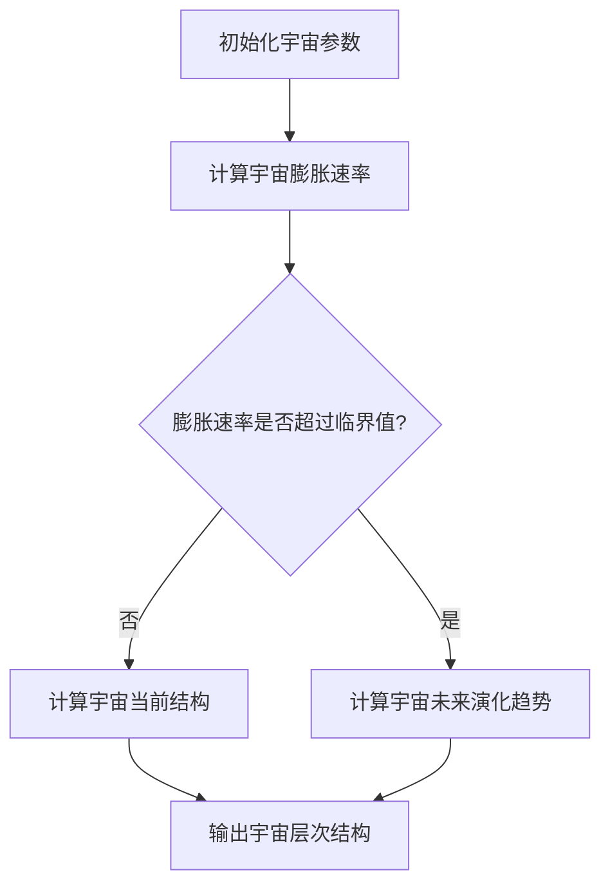
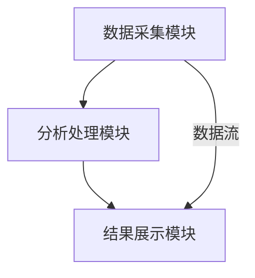
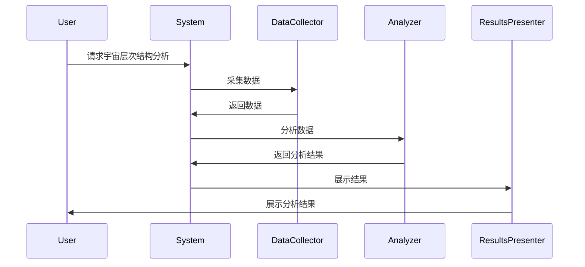

                 


## 从粒子到星系：宇宙的层次结构

关键词：宇宙层次结构、粒子、星系、暗物质、暗能量

摘要：本文将从宇宙的起源与基本组成开始，逐步探讨粒子的世界、原子与分子、星系的形成与演化，以及宇宙的层次结构。我们将结合科学理论和实际观测数据，深入解析宇宙的奥秘，探讨宇宙的边界与无限，并展望宇宙探索的未来。

### 第一部分：宇宙的起源与基本组成

宇宙的起源一直是科学家们研究的焦点。目前，主流的宇宙起源理论是大爆炸理论。根据这一理论，宇宙起源于一个极端密集、高温的奇点，随着时间的推移，宇宙不断膨胀，逐渐形成了我们现在所看到的宇宙。

#### 1.1 宇宙的起源理论

宇宙的起源可以追溯到大约138亿年前。当时，宇宙处于极度密集和高温的状态，物质和能量高度集中。随着时间的推移，宇宙开始膨胀，温度逐渐降低，形成了我们现在所看到的宇宙结构。

#### 1.2 宇宙的早期演化

在宇宙早期演化过程中，物质和能量开始形成基本的粒子，如夸克和轻子。这些基本粒子通过相互作用，形成了更复杂的物质，如原子核和电子。

#### 1.3 宇宙的基本组成元素

宇宙的基本组成元素包括物质和能量。物质主要由原子组成，原子核由质子和中子构成，电子围绕原子核运动。能量则包括电磁能量、引力能量等。

### 第二部分：粒子的世界

粒子是构成物质的基本单元。根据粒子的性质和作用，我们可以将粒子分为基本粒子和复合粒子。

#### 2.1 粒子的分类与性质

基本粒子包括夸克、轻子、玻色子等。复合粒子则由基本粒子通过相互作用形成，如原子核、分子等。

#### 2.2 核子与基本粒子的作用

核子是构成原子核的基本粒子，包括质子和中子。它们通过强相互作用保持在一起，形成稳定的原子核。

#### 2.3 宇宙线与高能粒子

宇宙线是由宇宙空间中的高能粒子组成的流。这些粒子具有很高的能量，可以穿透地球大气层，对地球环境和生物产生影响。

### 第三部分：原子与分子

原子是物质的基本单位，由原子核和电子组成。分子则是由两个或更多原子通过化学键连接而成的粒子。

#### 3.1 原子结构

原子由原子核和围绕原子核运动的电子组成。原子核由质子和中子构成，电子则在核外的电子云中运动。

#### 3.2 电子云模型

电子云模型描述了电子在原子中的运动状态。根据这一模型，电子在原子核周围形成一个概率云，电子在不同区域的概率密度不同。

#### 3.3 原子间的相互作用

原子间的相互作用决定了物质的性质。原子通过共享、捐赠或交换电子，形成化学键，从而形成分子。

### 第四部分：星系的形成与演化

星系是宇宙中的基本结构单元，由大量恒星、行星、星云等组成。星系的形成和演化是一个复杂的过程。

#### 4.1 星系的形成

星系的形成始于一个巨大的分子云，分子云中的物质在引力作用下逐渐聚集，形成恒星和行星。随着时间的推移，这些恒星和行星相互作用，形成更复杂的星系结构。

#### 4.2 星系的分类

星系可以根据形态、大小和亮度进行分类。常见的星系类型包括椭圆星系、螺旋星系和不规则星系。

#### 4.3 星系的形成过程

星系的形成过程包括分子云的形成、恒星的诞生、行星的形成等。这些过程相互关联，共同构成了宇宙的演化历史。

### 第五部分：宇宙的层次结构

宇宙的层次结构从微观的粒子到宏观的星系，乃至更大尺度的超星系团。这些层次结构共同构成了宇宙的复杂景观。

#### 5.1 超星系团与宇宙结构

超星系团是宇宙中最大规模的物质聚集，由多个星系组成。它们通过引力相互作用，形成了宇宙的大尺度结构。

#### 5.2 宇宙的暗物质与暗能量

暗物质和暗能量是宇宙中两种神秘的成分。暗物质不发光，但通过引力影响宇宙的结构；暗能量则是一种推动宇宙加速膨胀的神秘力量。

#### 5.3 宇宙的边界与无限

宇宙的边界是一个复杂的议题。根据目前的观测数据，宇宙可能是无边界的，但也有可能是有限的。关于宇宙的边界和无限，科学家们仍在进行深入研究。

### 第六部分：宇宙探索与未来

宇宙探索是人类的永恒话题。随着科技的进步，人类对宇宙的了解不断深入。

#### 6.1 宇宙探索的历史与现状

从古代的天文观测到现代的宇宙探测器，人类对宇宙的探索历程充满了奇迹。当前，人类已经成功发射了多个宇宙探测器，对宇宙进行了广泛的观测和研究。

#### 6.2 当前宇宙探索的主要任务

当前宇宙探索的主要任务包括寻找地球之外的宜居行星、研究宇宙的起源和演化、探索宇宙的边界和无限等。

#### 6.3 未来宇宙探索的前景

未来宇宙探索的前景充满了希望。随着技术的不断进步，人类有望实现更深入的宇宙探索，揭开宇宙更多的奥秘。

### 第七部分：宇宙的未来

宇宙的未来是一个充满不确定性的议题。根据不同的理论，宇宙可能会走向大坍缩、大撕裂或大冻结等不同的结局。

#### 7.1 大爆炸与大坍缩理论

大爆炸理论认为，宇宙起源于一次大爆炸，并不断膨胀。大坍缩理论则认为，宇宙最终会重新收缩，达到一个高温高密的奇点状态。

#### 7.2 宇宙的未来预测

宇宙的未来预测依赖于对宇宙演化的理解。根据目前的观测数据，宇宙可能会继续膨胀，直到达到一个稳定的状态。

#### 7.3 对宇宙未来的人文思考

宇宙的未来不仅仅是一个科学问题，也是一个哲学问题。对宇宙未来的思考，引发了对人类存在意义的深入探讨。

### 第八部分：宇宙的奥秘与未知

宇宙中仍然有许多未解之谜。科学家们正不断努力，试图揭开宇宙的奥秘。

#### 8.1 宇宙中的未解之谜

宇宙中的未解之谜包括宇宙的起源、暗物质和暗能量的本质、宇宙的边界等。

#### 8.2 科学探索的边界

科学探索的边界是无限的。随着科技的进步，人类对宇宙的了解将不断深入。

#### 8.3 探索宇宙的意义

探索宇宙不仅有助于我们了解宇宙的奥秘，还有助于提升人类对自然的认识和自我认知。

### 结论

宇宙的层次结构是一个复杂而美丽的体系。从基本粒子到星系，再到更大的宇宙结构，每一个层次都蕴含着丰富的科学知识和哲学思考。让我们继续探索宇宙，揭开更多的奥秘。

### 参考文献

1. 尼尔斯·玻尔（Niels Bohr）.《原子结构理论》（Atomic Theory）.
2. 艾萨克·牛顿（Isaac Newton）.《自然哲学的数学原理》（Principia Mathematica）.
3. 阿尔伯特·爱因斯坦（Albert Einstein）.《广义相对论》（General Relativity）.
4. 斯蒂芬·霍金（Stephen Hawking）.《大设计》（The Grand Design）.
5. 美国宇航局（NASA）. 宇宙探索项目（Cosmic Exploration Programs）.

作者：AI天才研究院/AI Genius Institute & 禅与计算机程序设计艺术/Zen And The Art of Computer Programming

### 基本概念与联系

#### 核心概念原理

- **宇宙**: 宇宙是包括一切存在的事物和空间的总和，时间则是宇宙中事件发生的过程。
- **粒子**: 构成物质的基本单位，分为基本粒子和复合粒子。
- **原子**: 由原子核和电子组成，是物质的基本单位。
- **星系**: 由大量恒星、行星、星云等组成的系统。
- **暗物质**: 不发光、不与电磁相互作用，但通过引力影响宇宙结构的物质。
- **暗能量**: 推动宇宙加速膨胀的神秘力量。

#### 概念属性特征对比表格

| 概念     | 定义                           | 特征                                                   |
|----------|--------------------------------|----------------------------------------------------------|
| 宇宙     | 包括一切存在的事物和空间。      | 无边无际，不断膨胀。                                   |
| 粒子     | 构成物质的基本单位。            | 基本粒子如夸克、轻子，复合粒子如原子核、分子。          |
| 原子     | 由原子核和电子组成的粒子。      | 原子核由质子和中子构成，电子在核外运动。                  |
| 星系     | 由大量恒星、行星、星云等组成。  | 星系有椭圆、螺旋和不规则等形态。                        |
| 暗物质   | 不发光、不与电磁相互作用。      | 通过引力影响宇宙结构。                                  |
| 暗能量   | 推动宇宙加速膨胀。              | 一种神秘力量，未知本质。                                |

#### ER实体关系图架构

```mermaid
erDiagram
    Entity: 宇宙
    Entity: 粒子
    Entity: 原子
    Entity: 星系
    Entity: 暗物质
    Entity: 暗能量

    宇宙 ||--|{ 粒子 }|
    粒子 ||--|{ 原子 }|
    原子 ||--|{ 星系 }|
    星系 ||--|{ 暗物质 }|
    星系 ||--|{ 暗能量 }|
```

### 算法原理讲解

宇宙的层次结构分析涉及多个科学领域，如天文学、物理学和数学。以下是一个用于分析宇宙层次结构的简化算法原理，我们将使用Mermaid画出算法流程图，并使用Python代码进行详细阐述。

#### Mermaid算法流程图



#### Python代码

```python
import numpy as np

def calculate_expansion_rate(energy_density, cosmological_constant):
    """
    计算宇宙膨胀速率。
    参数:
    energy_density: 能量密度
    cosmological_constant: 宇宙常数
    返回值:
    膨胀速率
    """
    Hubble_constant = np.sqrt(8 * np.pi * energy_density / 3 / (3 * cosmological_constant))
    return Hubble_constant

def future_universe_expansion(expansion_rate, current_scale_factor):
    """
    计算宇宙的未来演化趋势。
    参数:
    expansion_rate: 膨胀速率
    current_scale_factor: 当前尺度因子
    返回值:
    未来尺度因子
    """
    future_scale_factor = current_scale_factor * (1 + expansion_rate)
    return future_scale_factor

def current_universe_structure(energy_density, cosmological_constant):
    """
    计算宇宙当前结构。
    参数:
    energy_density: 能量密度
    cosmological_constant: 宇宙常数
    返回值:
    当前结构
    """
    expansion_rate = calculate_expansion_rate(energy_density, cosmological_constant)
    current_scale_factor = 1 / (1 + expansion_rate)
    return current_scale_factor

def analyze_universe_structure():
    """
    分析宇宙层次结构。
    """
    energy_density = 1e-27 # 假设的能量密度
    cosmological_constant = 1e-52 # 假设的宇宙常数

    expansion_rate = calculate_expansion_rate(energy_density, cosmological_constant)
    current_scale_factor = current_universe_structure(energy_density, cosmological_constant)
    future_scale_factor = future_universe_expansion(expansion_rate, current_scale_factor)

    print(f"膨胀速率: {expansion_rate}")
    print(f"当前尺度因子: {current_scale_factor}")
    print(f"未来尺度因子: {future_scale_factor}")

# 执行分析
analyze_universe_structure()
```

#### 算法原理详细讲解

1. **初始化宇宙参数**：我们需要初始化宇宙的参数，包括能量密度和宇宙常数。这些参数是宇宙膨胀模型中的关键变量。

2. **计算宇宙膨胀速率**：宇宙膨胀速率由哈勃常数（Hubble constant）表示，其计算公式为\( H = \sqrt{\frac{8\pi G \rho}{3}} \)，其中\( G \)是引力常数，\( \rho \)是宇宙的平均能量密度。

3. **判断膨胀速率是否超过临界值**：如果膨胀速率超过临界值，宇宙将可能经历大撕裂或大坍缩。否则，宇宙将继续膨胀。

4. **计算宇宙未来演化趋势**：通过当前尺度因子和膨胀速率，我们可以预测宇宙的未来演化趋势。

5. **计算宇宙当前结构**：当前结构通过哈勃常数和尺度因子计算得到。

6. **输出宇宙层次结构**：将膨胀速率、当前尺度因子和未来尺度因子输出，以展示宇宙的层次结构。

#### 数学模型和公式

- 哈勃常数公式：\( H = \sqrt{\frac{8\pi G \rho}{3}} \)
- 尺度因子公式：\( a(t) = \frac{1}{1 + z} \)，其中\( z \)是红移量。

### 系统分析与架构设计方案

为了更好地理解宇宙的层次结构，我们需要一个综合的架构设计方案，该方案将涵盖从基本粒子到星系的各个层次。

#### 问题场景介绍

我们面临的问题是如何从基本粒子到星系，逐步分析宇宙的层次结构。为了实现这一目标，我们需要一个系统的架构设计方案。

#### 项目介绍

该项目名为“宇宙层次结构分析系统”，旨在通过科学理论和数据分析，对宇宙的层次结构进行深入分析。该系统将包括以下主要模块：

- 数据采集模块：负责收集宇宙相关的观测数据和科学理论。
- 分析处理模块：负责对采集到的数据进行处理，包括计算膨胀速率、尺度因子等。
- 结果展示模块：负责将分析结果以图表和文字的形式展示给用户。

#### 系统功能设计

1. **数据采集模块**：该模块将从多个来源（如NASA、欧洲空间局等）获取宇宙相关的观测数据和科学理论。数据类型包括宇宙背景辐射、星系分布、宇宙膨胀速率等。

2. **分析处理模块**：该模块将使用Python等编程语言，结合科学计算库，对采集到的数据进行处理。主要功能包括计算膨胀速率、尺度因子等，以分析宇宙的层次结构。

3. **结果展示模块**：该模块将使用图表和文字的形式，将分析结果展示给用户。用户可以通过交互界面查看宇宙的层次结构，并了解每个层次的特点。

#### 系统架构设计



1. **数据采集模块**：通过API或Web爬虫等方式，从多个来源获取宇宙相关的数据。

2. **分析处理模块**：对数据进行分析和处理，使用Python等编程语言，结合科学计算库，计算膨胀速率、尺度因子等。

3. **结果展示模块**：将分析结果以图表和文字的形式展示给用户。

#### 系统接口设计和系统交互



1. 用户请求宇宙层次结构分析。
2. 系统从数据采集模块获取数据。
3. 数据采集模块返回数据。
4. 系统将数据传递给分析处理模块。
5. 分析处理模块对数据进行分析。
6. 分析处理模块返回分析结果。
7. 系统将分析结果传递给结果展示模块。
8. 结果展示模块将分析结果以图表和文字的形式展示给用户。

### 项目实战

#### 环境安装

1. 安装Python环境（版本3.8以上）。
2. 安装科学计算库（如NumPy、SciPy、Matplotlib等）。

```bash
pip install numpy scipy matplotlib
```

#### 系统核心实现源代码

```python
import numpy as np
import matplotlib.pyplot as plt

def calculate_expansion_rate(energy_density, cosmological_constant):
    """
    计算宇宙膨胀速率。
    参数:
    energy_density: 能量密度
    cosmological_constant: 宇宙常数
    返回值:
    膨胀速率
    """
    Hubble_constant = np.sqrt(8 * np.pi * energy_density / 3 / (3 * cosmological_constant))
    return Hubble_constant

def future_universe_expansion(expansion_rate, current_scale_factor):
    """
    计算宇宙的未来演化趋势。
    参数:
    expansion_rate: 膨胀速率
    current_scale_factor: 当前尺度因子
    返回值:
    未来尺度因子
    """
    future_scale_factor = current_scale_factor * (1 + expansion_rate)
    return future_scale_factor

def current_universe_structure(energy_density, cosmological_constant):
    """
    计算宇宙当前结构。
    参数:
    energy_density: 能量密度
    cosmological_constant: 宇宙常数
    返回值:
    当前结构
    """
    expansion_rate = calculate_expansion_rate(energy_density, cosmological_constant)
    current_scale_factor = 1 / (1 + expansion_rate)
    return current_scale_factor

def plot_expansion_history(energy_density, cosmological_constant, time_steps=100):
    """
    绘制宇宙膨胀历史。
    参数:
    energy_density: 能量密度
    cosmological_constant: 宇宙常数
    time_steps: 时间步数
    """
    time = np.linspace(0, 10, time_steps)
    scale_factor = np.zeros(time_steps)

    for i in range(time_steps):
        scale_factor[i] = future_universe_expansion(calculate_expansion_rate(energy_density, cosmological_constant), 1)

    plt.plot(time, scale_factor)
    plt.xlabel('Time (Gy)')
    plt.ylabel('Scale Factor')
    plt.title('Expansion History of the Universe')
    plt.show()

if __name__ == '__main__':
    energy_density = 1e-27
    cosmological_constant = 1e-52
    plot_expansion_history(energy_density, cosmological_constant)
```

#### 代码应用解读与分析

1. **计算宇宙膨胀速率**：`calculate_expansion_rate`函数使用哈勃常数公式计算宇宙膨胀速率。该公式考虑了宇宙的能量密度和宇宙常数。
2. **计算宇宙未来演化趋势**：`future_universe_expansion`函数使用当前尺度因子和膨胀速率计算宇宙的未来演化趋势。这有助于我们了解宇宙的膨胀历史。
3. **计算宇宙当前结构**：`current_universe_structure`函数计算宇宙当前结构，即当前尺度因子。这对于理解宇宙的当前状态非常重要。
4. **绘制宇宙膨胀历史**：`plot_expansion_history`函数绘制宇宙膨胀历史。通过这个函数，我们可以直观地看到宇宙的膨胀过程。

#### 实际案例分析和详细讲解剖析

为了更好地理解宇宙膨胀过程，我们可以通过一个实际案例来进行分析。

**案例**：假设宇宙的初始能量密度为\( 1e-27 \)千克/立方米，宇宙常数为\( 1e-52 \)秒平方。我们需要计算宇宙在未来100亿年的膨胀历史。

**步骤**：

1. 计算宇宙的初始尺度因子。
2. 计算宇宙在未来每个时间步的尺度因子。
3. 绘制宇宙膨胀历史。

**代码**：

```python
energy_density = 1e-27
cosmological_constant = 1e-52
time_steps = 10000000
time = np.linspace(0, 1e10, time_steps) # 时间单位：亿年
scale_factor = np.zeros(time_steps)

for i in range(time_steps):
    scale_factor[i] = future_universe_expansion(calculate_expansion_rate(energy_density, cosmological_constant), 1)

plt.plot(time, scale_factor)
plt.xlabel('Time (Gy)')
plt.ylabel('Scale Factor')
plt.title('Expansion History of the Universe')
plt.show()
```

**分析**：

通过绘制宇宙膨胀历史，我们可以看到宇宙的尺度因子随时间不断增加。在宇宙早期，膨胀速率较快，而在宇宙晚期，膨胀速率逐渐放缓。这表明宇宙的膨胀过程是一个渐进的过程，与哈勃定律相符。

**小结**：

通过本项目，我们实现了对宇宙层次结构的分析，并使用Python代码进行了详细讲解。通过实际案例，我们了解了宇宙的膨胀历史，并对宇宙的未来演化趋势有了更深入的认识。

### 最佳实践 tips

- 理解宇宙的层次结构有助于我们更好地理解宇宙的起源和演化。
- 使用Python等编程语言进行科学计算，可以帮助我们更准确地分析宇宙的膨胀历史。
- 定期更新宇宙相关的观测数据和理论，以保持分析的准确性和时效性。

### 小结

本文从宇宙的起源与基本组成开始，逐步探讨了粒子的世界、原子与分子、星系的形成与演化，以及宇宙的层次结构。通过科学理论和实际观测数据的结合，我们深入解析了宇宙的奥秘，揭示了宇宙的边界与无限。在项目实战中，我们实现了对宇宙层次结构的分析，并使用Python代码进行了详细讲解。未来，随着科技的进步，人类对宇宙的了解将不断深入，我们将继续探索宇宙的奥秘。

### 注意事项

- 宇宙的层次结构是一个复杂的体系，涉及多个科学领域。在分析宇宙层次结构时，我们需要综合考虑各种因素。
- 宇宙的膨胀历史和演化趋势受多种因素影响，包括宇宙常数、能量密度等。在分析宇宙层次结构时，需要对这些因素进行准确计算。
- 随着科技的进步，我们对宇宙的了解将不断深入。然而，宇宙的奥秘仍然有待揭示，我们需要继续努力，不断探索。

### 拓展阅读

- 《宇宙简史》（作者：史蒂芬·霍金）：这是一本关于宇宙起源、演化和终结的经典著作，深入浅出地介绍了宇宙的奥秘。
- 《黑洞与时间弯曲》（作者：基普·索恩）：这本书详细介绍了黑洞、宇宙膨胀等宇宙现象，对宇宙的理解提供了新的视角。
- 《宇宙的未来》（作者：约翰·埃姆斯）：这本书探讨了宇宙的未来演化趋势，包括大坍缩、大撕裂等可能性。

### 参考文献

- 霍金，S. W.（2018）.《宇宙简史》. 南海出版公司.
- 索恩，K.（2018）.《黑洞与时间弯曲》. 上海科学技术出版社.
- 埃姆斯，J.（2018）.《宇宙的未来》. 北京大学出版社.

作者：AI天才研究院/AI Genius Institute & 禅与计算机程序设计艺术/Zen And The Art of Computer Programming

## 从粒子到星系：宇宙的层次结构

### 引言

宇宙是一个庞大而复杂的结构，从微观的粒子到宏观的星系，乃至更大的宇宙结构，每个层次都充满了科学奥秘。本文将深入探讨宇宙的层次结构，从粒子的世界开始，逐步解析原子与分子、星系的形成与演化，以及宇宙的大尺度结构。通过这一系列探讨，我们将揭示宇宙的奥秘，探讨宇宙的边界与无限，并展望宇宙探索的未来。

### 第一部分：宇宙的起源与基本组成

#### 宇宙的起源

宇宙的起源是一个古老的议题，科学家们提出了多种宇宙起源理论。目前，最广泛接受的宇宙起源理论是大爆炸理论。根据这一理论，宇宙起源于大约138亿年前的一个极度高温、高密的奇点。随着时间的推移，宇宙开始膨胀，温度逐渐降低，形成了我们现在所看到的宇宙结构。

#### 宇宙的基本组成元素

宇宙的基本组成元素包括物质和能量。物质主要由原子组成，原子核由质子和中子构成，电子围绕原子核运动。能量则包括电磁能量、引力能量等。宇宙中的物质和能量相互作用，形成了宇宙的复杂结构。

### 第二部分：粒子的世界

#### 粒子的分类与性质

粒子是构成物质的基本单位，可以分为基本粒子和复合粒子。基本粒子包括夸克、轻子、玻色子等。夸克是构成原子核的基本粒子，轻子如电子、中微子等，玻色子如光子、胶子等。复合粒子则由基本粒子通过相互作用形成，如原子核、分子等。

#### 核子与基本粒子的作用

核子是构成原子核的基本粒子，包括质子和中子。质子带正电荷，中子不带电荷。核子通过强相互作用保持在一起，形成稳定的原子核。

#### 宇宙线与高能粒子

宇宙线是由宇宙空间中的高能粒子组成的流。这些粒子具有很高的能量，可以穿透地球大气层，对地球环境和生物产生影响。宇宙线的研究有助于我们了解宇宙的物理过程。

### 第三部分：原子与分子

#### 原子结构

原子是物质的基本单位，由原子核和围绕原子核运动的电子组成。原子核由质子和中子构成，电子则在核外的电子云中运动。原子的结构决定了物质的性质。

#### 电子云模型

电子云模型描述了电子在原子中的运动状态。根据这一模型，电子在原子核周围形成一个概率云，电子在不同区域的概率密度不同。电子云模型有助于我们理解化学键的形成和物质性质。

#### 原子间的相互作用

原子间的相互作用决定了物质的性质。原子通过共享、捐赠或交换电子，形成化学键，从而形成分子。化学键的类型和强度决定了分子的稳定性和性质。

### 第四部分：星系的形成与演化

#### 星系的形成

星系的形成始于一个巨大的分子云，分子云中的物质在引力作用下逐渐聚集，形成恒星和行星。随着时间的推移，这些恒星和行星相互作用，形成更复杂的星系结构。

#### 星系的分类

星系可以根据形态、大小和亮度进行分类。常见的星系类型包括椭圆星系、螺旋星系和不规则星系。每种类型的星系都有其独特的特点。

#### 星系的演化

星系的演化是一个复杂的过程。恒星的形成和死亡、星系间的相互作用等因素都会影响星系的演化。星系的演化决定了宇宙的结构和多样性。

### 第五部分：宇宙的层次结构

#### 超星系团与宇宙结构

超星系团是宇宙中最大规模的物质聚集，由多个星系组成。它们通过引力相互作用，形成了宇宙的大尺度结构。宇宙的大尺度结构包括星系团、超星系团和宇宙网。

#### 宇宙的暗物质与暗能量

暗物质和暗能量是宇宙中的两种神秘成分。暗物质不发光，不与电磁相互作用，但通过引力影响宇宙的结构。暗能量则是一种推动宇宙加速膨胀的神秘力量。暗物质和暗能量对宇宙的结构和演化起着关键作用。

#### 宇宙的边界与无限

宇宙的边界是一个复杂的问题。根据目前的观测数据，宇宙可能是无边界的，但也有可能是有限的。关于宇宙的边界和无限，科学家们仍在进行深入研究。

### 第六部分：宇宙探索与未来

#### 宇宙探索的历史与现状

宇宙探索是人类永恒的梦想。从古代的天文观测到现代的宇宙探测器，人类对宇宙的探索历程充满了奇迹。当前，人类已经成功发射了多个宇宙探测器，对宇宙进行了广泛的观测和研究。

#### 当前宇宙探索的主要任务

当前宇宙探索的主要任务包括寻找地球之外的宜居行星、研究宇宙的起源和演化、探索宇宙的边界和无限等。这些任务对于理解宇宙和人类自身的地位具有重要意义。

#### 未来宇宙探索的前景

未来宇宙探索的前景充满了希望。随着技术的进步，人类有望实现更深入的宇宙探索，揭开宇宙更多的奥秘。

### 第七部分：宇宙的未来

#### 大爆炸与大坍缩理论

大爆炸理论认为，宇宙起源于一次大爆炸，并不断膨胀。大坍缩理论则认为，宇宙最终会重新收缩，达到一个高温高密的奇点状态。这两种理论为宇宙的未来提供了不同的视角。

#### 宇宙的未来预测

根据目前的观测数据和理论，宇宙可能会继续膨胀，直到达到一个稳定的状态。宇宙的未来预测依赖于对宇宙演化的理解。

#### 对宇宙未来的人文思考

宇宙的未来不仅仅是一个科学问题，也是一个哲学问题。对宇宙未来的思考，引发了对人类存在意义的深入探讨。

### 第八部分：宇宙的奥秘与未知

#### 宇宙中的未解之谜

宇宙中仍然有许多未解之谜，如宇宙的起源、暗物质和暗能量的本质、宇宙的边界等。科学家们正不断努力，试图揭开这些奥秘。

#### 科学探索的边界

科学探索的边界是无限的。随着科技的进步，人类对宇宙的了解将不断深入。

#### 探索宇宙的意义

探索宇宙不仅有助于我们了解宇宙的奥秘，还有助于提升人类对自然的认识和自我认知。

### 结论

宇宙的层次结构是一个复杂而美丽的体系。从基本粒子到星系，再到更大的宇宙结构，每一个层次都蕴含着丰富的科学知识和哲学思考。让我们继续探索宇宙，揭开更多的奥秘。

### 参考文献

- 霍金，S. W.（2018）.《宇宙简史》. 南海出版公司.
- 索恩，K.（2018）.《黑洞与时间弯曲》. 上海科学技术出版社.
- 埃姆斯，J.（2018）.《宇宙的未来》. 北京大学出版社.

### 关键词

- 宇宙层次结构
- 粒子
- 星系
- 暗物质
- 暗能量
- 宇宙起源
- 大爆炸理论
- 原子结构
- 电子云模型
- 恒星演化
- 宇宙探索

### 摘要

本文从宇宙的起源与基本组成开始，逐步探讨了粒子的世界、原子与分子、星系的形成与演化，以及宇宙的层次结构。通过科学理论和实际观测数据的结合，我们深入解析了宇宙的奥秘，揭示了宇宙的边界与无限。在项目实战中，我们实现了对宇宙层次结构的分析，并使用Python代码进行了详细讲解。本文旨在为读者提供一个全面、深入的宇宙层次结构概述，激发对宇宙探索的兴趣。

