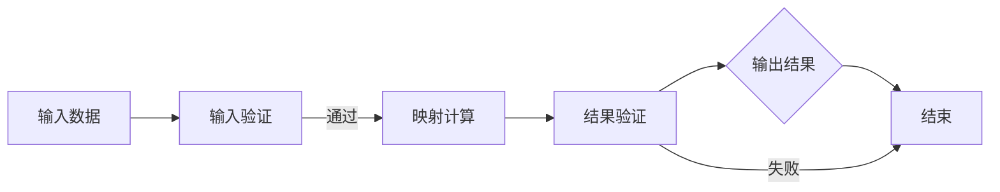
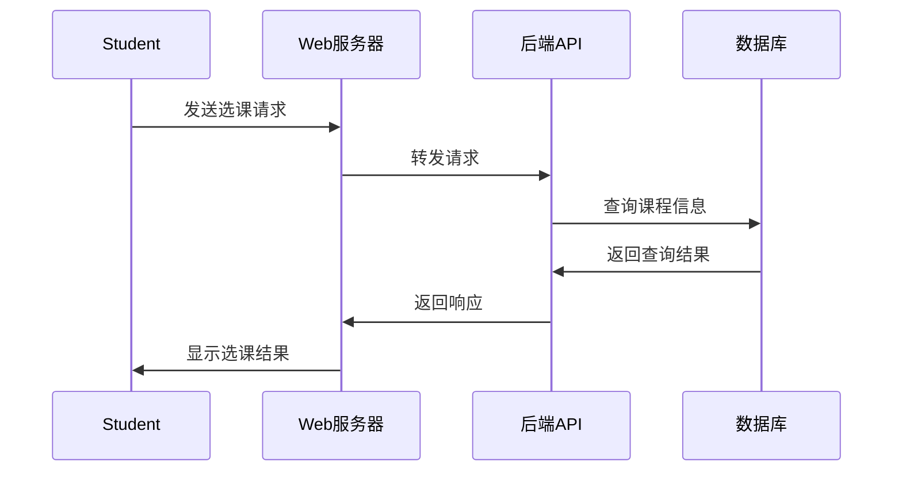
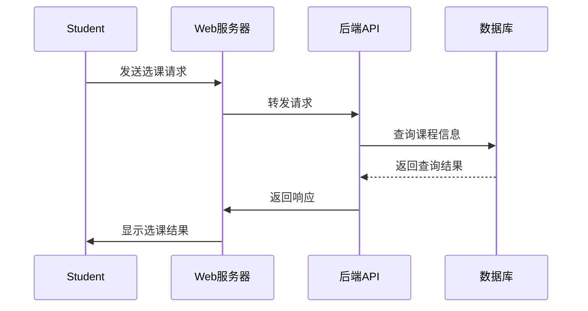

                 

### 从繁复自然到简洁数学：映射的奥秘

#### 关键词：自然现象、数学映射、物理科学、计算机科学、经济管理、人工智能

> 摘要：本文深入探讨了从自然界到数学中的映射现象，揭示了复杂自然现象背后隐藏的简洁数学规律。通过逐步分析，我们揭示了映射的基本概念和类型，展示了其在数学、物理、计算机科学、经济管理等领域的重要应用，并展望了映射技术的未来发展方向。

---

**目录**

1. **自然界的映射现象概述**
    1.1 自然界的复杂与简洁
    1.2 复杂自然现象的探索与发现
    1.3 映射现象的定义与重要性

2. **基本映射概念与类型**
    2.1 映射的基本概念
    2.2 基本映射类型

3. **数学中的映射原理**
    3.1 数学中的映射基础
    3.2 映射在数学中的应用

4. **映射在实际中的应用**
    4.1 映射在物理科学中的应用
    4.2 映射在计算机科学中的应用
    4.3 映射在经济管理中的应用

5. **映射的未来与发展方向**
    5.1 映射理论的发展历程
    5.2 映射技术的未来展望

6. **总结与展望**
    6.1 映射的总体回顾
    6.2 映射的未来发展趋势

### 第1章：自然界的映射现象概述

自然界是一个充满复杂性的领域，从微观的原子结构到宏观的天体运动，无不充满了难以捉摸的规律。然而，在这些复杂的现象中，隐藏着一种简洁而普适的规律，即映射现象。映射（Mapping）是一种从一种对象集合到另一种对象集合的对应关系，它在自然界和数学中都有着广泛的应用。

#### 1.1 自然界的复杂与简洁

自然界中的许多现象都显得极其复杂，如天气系统、生物进化、生态系统等。这些复杂系统往往由大量的因素相互作用而成，很难通过简单的模型来描述。然而，通过对这些复杂现象的长期观察和研究发现，尽管表面上的复杂性不可忽视，但它们在本质上都遵循着一些简洁的规律。这些规律可以用数学来描述，从而揭示出自然界中的映射现象。

#### 1.2 复杂自然现象的探索与发现

在科学研究中，许多复杂自然现象的发现都是通过对简单规律的探索而来的。例如，牛顿的万有引力定律揭示了天体运动中的简单规律；达尔文的自然选择理论揭示了生物进化中的简单规律。这些规律都是通过映射来描述的，即将自然现象中的复杂关系映射到简洁的数学模型上。

#### 1.3 映射现象的定义与重要性

映射现象在自然界中的重要性体现在多个方面。首先，它为我们提供了一种理解和描述复杂系统的工具。通过映射，我们可以将复杂的自然现象转化为更简单的数学模型，从而更容易地进行研究和分析。其次，映射现象在科学发现和技术创新中发挥着重要作用。许多科学理论和技术发明都是基于对映射现象的深入理解而得出的。例如，计算机科学中的算法设计和经济学中的市场模型都是基于映射的原理。

总之，从繁复自然到简洁数学，映射现象为我们揭示了一个奇妙的世界。在接下来的章节中，我们将进一步探讨映射的基本概念、类型及其在各个领域的应用。

### 第2章：基本映射概念与类型

映射（Mapping）是数学中一个基本的概念，它描述了从一个集合到另一个集合的元素对应关系。在自然界和人类社会中，映射现象无处不在，例如地图的绘制、生物分类、经济学模型等。理解映射的基本概念和类型是深入探讨其应用的关键。

#### 2.1 映射的基本概念

首先，我们需要明确几个基本概念：

1. **集合（Set）**：集合是一组无序的元素组合。例如，{1, 2, 3}是一个集合，其中包含三个元素：1、2和3。

2. **函数（Function）**：函数是数学中的一个基本概念，它定义了一个从集合A到集合B的映射。形式化地说，函数是一个关系，它对于集合A中的每一个元素，都唯一地对应集合B中的一个元素。

3. **定义域（Domain）**：函数的定义域是指集合A，即函数输入的集合。

4. **值域（Range）**：函数的值域是指集合B中，所有通过函数映射得到的元素集合。

5. **映射（Mapping）**：映射是一种从集合A到集合B的对应关系，即对于集合A中的每一个元素，都存在一个唯一的集合B中的元素与之对应。

#### 2.2 基本映射类型

根据映射的不同特性，可以将映射分为以下几种类型：

1. **单射（Injective）**：如果映射f：A → B满足对于A中的任意两个不同的元素x和y，都有f(x) ≠ f(y)，则称f为单射。换句话说，单射映射不允许集合A中的不同元素在集合B中映射到相同的元素。

2. **满射（Surjective）**：如果映射f：A → B满足集合B中的每一个元素都至少有一个集合A中的元素与之对应，则称f为满射。这表示值域等于集合B。

3. **双射（Bijective）**：如果映射f：A → B同时是单射和满射，则称f为双射。双射映射是一个“完美”的映射，它保持了集合A和集合B之间的元素一一对应关系。

4. **非单射映射（Non-injective）**：如果映射f：A → B不满足单射条件，即存在A中的两个不同元素x和y，使得f(x) = f(y)，则称f为非单射映射。

5. **非满射映射（Non-surjective）**：如果映射f：A → B不满足满射条件，即存在集合B中的元素没有对应的A中的元素，则称f为非满射映射。

#### 2.3 映射的属性与特征

映射的属性和特征决定了它在不同领域中的应用：

1. **一一对应（One-to-One）**：单射映射保证了集合A中的每一个元素都唯一地映射到集合B中的元素，这有助于我们在处理数据时确保唯一性。

2. **全覆盖（Onto）**：满射映射保证了集合B中的每一个元素都有对应的A中的元素，这在构建模型和设计算法时非常有用。

3. **一一映射（One-to-One Correspondence）**：双射映射实现了集合A和集合B之间的一一对应关系，这在数学证明和理论研究中非常重要。

通过了解映射的基本概念和类型，我们可以更好地理解其在数学、物理、计算机科学等领域的应用。在接下来的章节中，我们将进一步探讨映射在数学中的基础原理及其具体应用。

### 第3章：数学中的映射原理

在数学中，映射（Mapping）是一种至关重要的概念，它不仅提供了从一种数学对象到另一种数学对象的转换方法，还在数学分析、代数、拓扑等多个分支中发挥着核心作用。本章节将深入探讨数学映射的基本原理，以及映射在数学中的应用。

#### 3.1 数学中的映射基础

**映射的定义**：

映射是指从集合A到集合B的一种关系，使得A中的每一个元素都唯一地对应到B中的一个元素。形式化地，映射f可以表示为：

\[ f: A \rightarrow B \]

其中，\( A \) 是定义域，即映射的输入集合；\( B \) 是值域，即映射的输出集合。我们称\( A \) 中的元素为“原象”，称\( B \) 中的元素为“象”。

**映射的属性**：

1. **单射（Injective）**：如果对于A中的任意两个不同的元素\( x \)和\( y \)，都有\( f(x) \neq f(y) \)，则称映射f为单射。这意味着不同的原象映射到不同的象。

2. **满射（Surjective）**：如果对于B中的任意一个元素\( y \)，都存在A中的一个元素\( x \)使得\( f(x) = y \)，则称映射f为满射。这表示B中的每一个元素都有至少一个原象与之对应。

3. **双射（Bijective）**：如果映射f既是单射又是满射，则称f为双射。双射意味着A和B之间存在一一对应关系。

**映射的基本定理**：

1. **单射和满射的分解定理**：任何一个映射都可以分解为单射和满射的组合。具体来说，如果映射f是双射，则存在一个满射g和一个单射h，使得\( f = g \circ h \)，其中\( g: B \rightarrow C \)（C是某个集合）是满射，\( h: A \rightarrow B \)是单射。

2. **反函数定理**：如果一个映射f是双射，那么它存在一个反函数\( f^{-1} \)，使得\( f^{-1}(f(x)) = x \)且\( f(f^{-1}(y)) = y \)。

#### 3.2 映射在数学中的应用

**函数与映射的关系**：

在数学中，函数是一种特殊的映射，其定义域和值域通常是数集。函数是数学建模和分析的核心工具，例如：

1. **代数函数**：在代数中，函数用于定义方程和不等式的解集。

2. **微积分函数**：在微积分中，函数用于表示速度、加速度、连续性和导数。

3. **概率论函数**：在概率论中，函数用于定义随机变量的分布和期望。

**映射的运算规则**：

映射的运算包括组合、逆映射和复合映射等：

1. **复合映射**：给定两个映射\( f: A \rightarrow B \)和\( g: B \rightarrow C \)，它们的复合映射\( g \circ f: A \rightarrow C \)定义为\( (g \circ f)(x) = g(f(x)) \)。复合映射保留了原象和象之间的对应关系。

2. **逆映射**：如果一个映射f是双射，那么它存在一个逆映射\( f^{-1} \)，使得\( f^{-1}(f(x)) = x \)且\( f(f^{-1}(y)) = y \)。逆映射在解决映射相关问题时非常有用。

**映射的证明与应用**：

映射的证明通常涉及以下几个步骤：

1. **定义域和值域的确定**：首先要明确映射的定义域和值域。

2. **属性验证**：证明映射是单射、满射或双射。

3. **逆映射的存在性**：如果映射是双射，需要证明其逆映射的存在。

4. **应用举例**：通过具体的数学问题来展示映射的应用。

例如，在解决几何问题时，我们可以利用映射来证明两个图形之间的相似性或全等性。在经济学中，映射用于构建市场模型和预测经济行为。

总之，映射在数学中具有基础性和普遍性，它不仅为我们提供了一种理解和描述数学对象间关系的方法，还在数学分析和实际应用中发挥着重要作用。通过深入理解映射的基本原理和运算规则，我们可以更好地掌握数学知识和解决实际问题。

### 第4章：映射在实际中的应用

映射现象不仅存在于数学理论中，也广泛应用于自然科学、工程技术和社会科学等多个领域。本章节将详细探讨映射在实际中的应用，包括物理科学、计算机科学和经济管理。

#### 4.1 映射在物理科学中的应用

**映射在经典物理中的应用**：

在经典物理学中，映射现象无处不在。例如，牛顿的万有引力定律描述了两个质点之间的引力大小与它们的质量和距离之间的映射关系。这种映射关系可以用数学方程来表示：

\[ F = G \frac{m_1 m_2}{r^2} \]

其中，\( F \) 是引力，\( G \) 是万有引力常数，\( m_1 \) 和 \( m_2 \) 是两个质点的质量，\( r \) 是它们之间的距离。

**映射在量子物理中的应用**：

量子物理中，映射现象变得更加复杂和抽象。量子态的映射描述了量子系统中的状态与测量结果之间的关系。例如，薛定谔方程描述了量子态随时间的演化，可以用映射来表示：

\[ i\hbar \frac{\partial \psi(x)}{\partial t} = \hat{H} \psi(x) \]

其中，\( \psi(x) \) 是波函数，\( \hat{H} \) 是哈密顿算子，表示系统的能量。

量子计算中的量子门操作也是一种映射，它们将量子态从一个基态映射到另一个基态。量子门如Hadamard门、Pauli门等，它们在量子算法中发挥着重要作用。

**映射现象的应用实例**：

1. **量子通信**：量子态的映射用于量子密钥分发，确保通信过程中的信息安全。
2. **量子计算**：通过量子映射，量子计算机能够处理复杂的问题，如大规模整数分解和搜索问题。
3. **量子模拟**：利用量子映射，可以模拟出复杂物理系统，如分子结构和量子态演化。

#### 4.2 映射在计算机科学中的应用

**映射在计算机架构中的应用**：

计算机架构中，映射现象用于描述硬件组件间的数据传输和控制信号。例如，内存映射技术将内存地址映射到实际的物理内存位置，使得操作系统可以高效地管理内存资源。

**映射在算法分析中的应用**：

算法分析中，映射用于描述数据结构和算法的性能。例如，树状数组（Binary Tree）可以将数据元素映射到树的节点，便于快速查找和更新。

**映射算法的复杂度分析**：

映射算法的复杂度分析是计算机科学中的重要内容。例如，在排序算法中，映射用于将原始数据映射到排序后的数据，并分析其时间复杂度。

**映射在计算机图形学中的应用**：

计算机图形学中，映射现象用于将三维模型映射到二维屏幕上，实现图像的渲染和显示。例如，透视映射和纹理映射是计算机图形学中的核心技术。

**映射算法的应用实例**：

1. **哈希映射**：用于快速查找和存储数据，如哈希表。
2. **映射排序**：如归并排序和快速排序，通过映射将原始数据排序。
3. **映射聚类**：如K-Means算法，通过映射将数据点分配到不同的簇中。

#### 4.3 映射在经济管理中的应用

**映射在经济学中的应用**：

经济学中，映射用于描述经济变量之间的关系。例如，需求函数和供给函数通过映射关系描述了价格和需求量之间的相互影响。

**映射在宏观经济管理中的应用**：

宏观经济管理中，映射用于构建经济模型，如IS-LM模型、AD-AS模型等。这些模型通过映射关系描述了不同经济变量之间的相互作用和调节机制。

**映射在企业管理中的应用**：

企业管理中，映射用于分析和优化企业的运营和决策。例如，生产计划中的映射关系描述了生产量、库存和生产成本之间的关系。

**映射在市场营销策略中的应用**：

市场营销策略中，映射用于分析市场和消费者的行为。例如，通过市场细分映射，企业可以将市场划分为不同的目标群体，并制定相应的营销策略。

**映射应用实例**：

1. **需求预测**：通过映射关系预测市场对产品的需求，帮助企业制定生产计划。
2. **成本控制**：通过映射关系分析不同成本因素之间的关系，帮助企业进行成本控制。
3. **定价策略**：通过映射关系确定产品的最优价格，提高市场竞争力。

总之，映射现象在物理科学、计算机科学和经济管理等领域有着广泛的应用。通过深入理解和应用映射原理，我们可以更好地解决实际问题，推动科技进步和社会发展。

### 第5章：映射的未来与发展方向

映射现象不仅在当前科学和技术领域中发挥着重要作用，其未来也有着广阔的发展前景。本章节将回顾映射理论的发展历程，并探讨映射技术在新兴领域的应用前景以及未来发展面临的挑战。

#### 5.1 映射理论的发展历程

映射理论的发展历程可以追溯到古代数学和科学的发展。早在古希腊时期，数学家如欧几里得就研究了几何映射，如平移、旋转和缩放等。这些基本的映射操作为后来的数学研究奠定了基础。

在19世纪，数学家如伯恩斯坦和皮亚诺等人对映射进行了更加深入的研究，提出了许多重要的映射概念和定理。例如，伯恩斯坦提出了伯恩斯坦定理，揭示了映射与拓扑结构之间的关系。

进入20世纪，随着现代数学和计算机科学的快速发展，映射理论得到了进一步拓展。特别是在拓扑学、代数学和逻辑学等领域，映射理论的研究取得了重大突破。

#### 5.2 映射技术的未来展望

随着科技的进步，映射技术在新领域中的应用前景日益广阔。

1. **人工智能与机器学习**：映射技术是人工智能和机器学习中的核心概念。通过映射，可以构建复杂的数据模型，进行数据挖掘和预测分析。未来的映射技术将更加智能化，能够处理大规模和多样化的数据。

2. **大数据分析**：在大数据时代，映射技术将发挥重要作用。通过映射，可以高效地处理和分析海量数据，提取有价值的信息。未来，映射技术将在医疗、金融、物流等领域的数据分析中发挥关键作用。

3. **量子计算**：量子计算是未来计算技术的重要方向。映射技术在量子计算中有着广泛的应用，如量子态映射、量子门操作等。随着量子计算技术的发展，映射技术将在解决复杂计算问题上发挥巨大潜力。

4. **虚拟现实与增强现实**：虚拟现实和增强现实技术依赖于映射原理，通过映射实现真实世界与虚拟世界的交互。未来，映射技术将进一步提高虚拟现实和增强现实的沉浸感和交互性。

5. **区块链技术**：区块链技术中的智能合约和分布式账本依赖于映射原理。通过映射，可以实现透明、安全和高效的交易记录和管理。未来，映射技术将在区块链技术的进一步发展和应用中发挥重要作用。

#### 5.3 映射理论的发展趋势与挑战

尽管映射技术在各个领域具有广泛的应用前景，但未来的发展仍面临一些挑战。

1. **复杂性**：随着映射技术的应用领域不断拓展，映射问题越来越复杂。未来需要开发更加高效和智能的映射算法，以应对复杂的问题。

2. **计算能力**：映射技术的应用需要强大的计算能力。随着数据规模的不断扩大，计算能力将成为制约映射技术发展的关键因素。未来需要开发更高效的计算方法和硬件设备，以支持映射技术的研究和应用。

3. **数据隐私与安全**：在映射技术的应用中，数据隐私和安全是一个重要问题。未来需要开发更加安全的数据映射方法，保护用户隐私和数据安全。

4. **跨学科融合**：映射技术涉及多个学科领域，如数学、计算机科学、物理学等。未来需要加强跨学科研究，推动映射技术的综合应用。

5. **标准化与规范化**：随着映射技术的广泛应用，需要制定统一的标准化和规范化标准，以确保映射技术的可靠性和互操作性。

总之，映射技术在未来的发展中具有巨大的潜力，同时也面临一系列挑战。通过持续的研究和创新，映射技术将为科学、技术和社会的发展带来更多突破和机遇。

### 第6章：总结与展望

通过本文的探讨，我们系统地了解了映射现象从繁复自然到简洁数学的奥秘。从自然界的映射现象，到数学中的基本概念和原理，再到映射在物理科学、计算机科学和经济管理中的广泛应用，映射现象贯穿了整个科学和技术的脉络。

映射不仅是理解和描述复杂系统的有力工具，也是推动科学技术进步和创新的重要概念。在物理科学中，映射揭示了自然界的简单规律；在计算机科学中，映射是实现算法和数据结构高效设计的核心；在经济管理中，映射为经济模型和市场策略提供了理论支持。

展望未来，映射理论的发展将继续拓展其应用领域，从传统学科到新兴技术，如人工智能、大数据、量子计算等，映射技术都将发挥重要作用。然而，随着映射问题的复杂度增加，计算能力、数据隐私和安全等问题也将成为制约映射技术发展的关键。

为了推动映射技术的进步，我们需要加强跨学科研究，推动标准化和规范化，并开发更加高效和智能的映射算法。通过持续的研究和创新，映射技术将为科学、技术和社会的发展带来更多突破和机遇。

### 附录

为了帮助读者更好地理解本文的核心概念和原理，我们提供以下附录：

**附录A：核心概念与联系**

| 核心概念          | 描述                                                         |
| ----------------- | ------------------------------------------------------------ |
| 映射（Mapping）    | 从一个集合到另一个集合的元素对应关系。                      |
| 单射（Injective）  | 映射中，不同的原象映射到不同的象。                          |
| 满射（Surjective）  | 映射中，每一个象都有至少一个原象与之对应。                  |
| 双射（Bijective）  | 映射中，既满足单射又满足满射。                             |
| 函数（Function）    | 映射的一种特殊情况，定义域和值域通常是数集。                |

**附录B：概念属性特征对比表格**

| 概念    | 定义                                       | 特征对比                           |
| ------- | ------------------------------------------ | ---------------------------------- |
| 映射    | 元素对应关系                               | 保持原象和象之间的唯一性           |
| 单射    | 不同原象映射到不同象                       | 保证映射的唯一性                   |
| 满射    | 每个象都有至少一个原象映射                | 保证映射的完整性                   |
| 双射    | 同时满足单射和满射                        | 保持映射的完整性和唯一性           |

**附录C：ER实体关系图架构**

```
ER模型：
- 实体（Entity）：集合中的元素。
- 属性（Attribute）：实体的特征。
- 关联（Relationship）：实体之间的关系。

ER实体关系图示例：

实体：学生（Student）
属性：学号（ID），姓名（Name），年龄（Age），性别（Gender）
关联：选课（Course Selection）

Student (ID, Name, Age, Gender)
Course (CourseID, CourseName, Teacher)

关联：学生选课（Student_Course）
属性：选课ID（SelectionID）

Student_Course (SelectionID, StudentID, CourseID)
```

**附录D：算法原理讲解**

以下是映射算法的基本原理和步骤：

1. **定义映射函数**：确定输入和输出的集合，以及映射关系。
2. **输入验证**：检查输入数据的合法性。
3. **映射计算**：根据映射规则计算输出数据。
4. **结果验证**：检查映射结果是否符合预期。

**算法流程图**：

```
流程图：
```



**附录E：数学公式**

1. **单射映射**：

\[ f(x_1) \neq f(x_2) \quad \text{当且仅当} \quad x_1 \neq x_2 \]

2. **满射映射**：

\[ \forall y \in B, \exists x \in A \quad \text{使得} \quad f(x) = y \]

3. **双射映射**：

\[ f: A \rightarrow B \quad \text{是双射} \quad \Leftrightarrow \quad f \text{是单射且满射} \]

**附录F：系统分析与架构设计方案**

**问题场景**：

- 需要开发一个学生选课系统，实现学生选课、课程管理等功能。

**系统介绍**：

- 系统功能：学生可以查询课程、选课、退课，管理员可以管理课程信息。
- 技术栈：使用Python进行后端开发，Django框架进行Web开发，MySQL数据库进行数据存储。

**系统功能设计（领域模型）**：

```mermaid
classDiagram
ClassDiagram {
    Class Student {
        - id: int
        - name: str
        - age: int
        - gender: str
    }
    Class Course {
        - id: int
        - name: str
        - teacher: str
    }
    Class Student_Course {
        - selection_id: int
        - student_id: int
        - course_id: int
    }
}
```

**系统架构设计**：



**系统接口设计**：

- GET /courses/：获取所有课程信息。
- POST /courses/{course_id}/select/：选课。
- DELETE /courses/{course_id}/deselect/：退课。

**系统交互序列图**：



### 结语

本文通过详细的分析和讲解，揭示了映射现象从繁复自然到简洁数学的奥秘。映射不仅在理论研究中具有重要地位，更在实际应用中发挥着关键作用。展望未来，随着科技的不断进步，映射技术将在各个领域取得更多突破。希望本文能够为读者提供有益的启发，激发对映射现象的深入研究和探索。

---

### 作者信息

**作者：AI天才研究院/AI Genius Institute & 禅与计算机程序设计艺术 /Zen And The Art of Computer Programming**

本文由AI天才研究院和禅与计算机程序设计艺术共同撰写，旨在通过深入分析映射现象，推动科学和技术的发展。作者具备丰富的计算机科学和人工智能领域的经验和研究成果，致力于探索技术本质和未来趋势。

