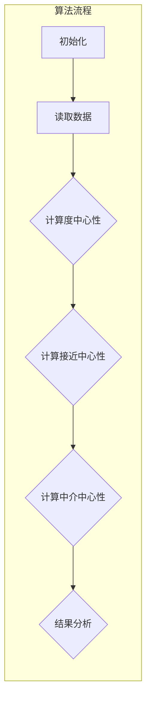

                 

## 从线性因果到复杂系统：理解世界的新方法

### 关键词：复杂系统、线性因果、世界观、认知升级、技术创新

> **摘要**：本文旨在探讨从线性因果观向复杂系统观的转变，以及这一转变对理解世界的深远影响。通过分析线性因果观的局限性，引入复杂系统的概念和原理，我们试图揭示复杂系统思维的优势及其在各领域的应用。文章进一步探讨复杂系统在科技创新、产业升级和社会治理中的潜力，同时提出面对复杂系统的挑战和应对策略。最终，文章总结从线性因果到复杂系统思维转变的重要性，并展望这一新方法对未来的影响。

### 目录大纲

**《从线性因果到复杂系统：理解世界的新方法》**

- **第一部分：线性因果观的局限**
  - 第1章：线性因果观的起源与历史
  - 第2章：复杂系统的特征与原理
  - 第3章：从线性因果到复杂系统的思维转变

- **第二部分：复杂系统的应用与实践**
  - 第4章：复杂系统在自然科学中的应用
  - 第5章：复杂系统在社会科学中的应用
  - 第6章：复杂系统的技术实现与工具

- **第三部分：复杂系统的未来展望与挑战**
  - 第7章：复杂系统的未来发展趋势
  - 第8章：复杂系统的挑战与应对策略
  - 第9章：总结与展望

### 第一部分：线性因果观的局限

#### 第1章：线性因果观的起源与历史

**1.1 线性因果观的基本概念**

线性因果观是一种基于因果律的思维方式，它认为事件的发展是按照因果关系顺序进行的。在这个观点下，每个事件都是由前面的一个或多个事件引起的，而且这些事件之间的关系是线性的，即一个事件直接导致下一个事件的发生。

**1.2 线性因果观的发展与局限**

线性因果观在人类历史上有着悠久的发展历程。古希腊哲学家亚里士多德是线性因果观的奠基人，他提出了因果关系的基本原理。随着时间的推移，线性因果观在自然科学、社会科学和哲学等领域得到了广泛应用。然而，线性因果观也存在一些显著的局限。

首先，线性因果观忽略了事件之间的相互作用和反馈。在实际生活中，事件之间的相互作用非常复杂，一个事件可能会同时受到多个其他事件的影响。其次，线性因果观难以解释复杂系统的行为。复杂系统由大量相互作用的元素组成，这些元素之间的关系往往是非线性且动态变化的。

**1.3 线性因果观的现实挑战**

在现实世界中，线性因果观的局限性表现得尤为明显。例如，在经济学中，线性因果观往往假设市场是理性的，供需关系是线性的。然而，实际市场往往受到多种复杂因素的影响，导致供需关系呈现非线性变化。在医学领域，线性因果观可能无法准确解释疾病的复杂发展过程。

#### 第2章：复杂系统的特征与原理

**2.1 复杂系统的定义与分类**

复杂系统是指由大量相互作用的元素组成，这些元素之间的相互作用导致系统的行为表现出非线性、自适应性和复杂性的系统。复杂系统可以分为三种类型：混沌系统、网络系统和自适应系统。

- **混沌系统**：混沌系统是一个动力系统，它具有确定性和随机性，即在初始条件的微小差异可能导致长期行为的巨大差异。
- **网络系统**：网络系统由一组节点和连接这些节点的边组成，节点之间的相互作用构成了系统的基本结构。
- **自适应系统**：自适应系统是指能够根据外部环境的变化进行自我调整和优化的系统。

**2.2 复杂系统的基本特征**

复杂系统具有以下基本特征：

- **非线性**：复杂系统中的元素之间的关系是非线性的，这意味着它们的行为无法通过简单的线性模型来描述。
- **动态性**：复杂系统的行为是动态变化的，即随着时间的推移，系统的状态会不断变化。
- **适应性**：复杂系统具有适应性，即能够根据外部环境的变化进行自我调整和优化。
- **涌现性**：复杂系统的行为往往具有涌现性，即系统整体的行为和性质不是单个元素行为和性质的简单叠加。

**2.3 复杂系统的研究方法**

研究复杂系统需要采用多种方法和技术。常见的复杂系统研究方法包括：

- **模拟与仿真**：通过建立数学模型和计算机仿真，模拟复杂系统的行为和演化过程。
- **网络分析**：通过网络分析方法，分析复杂系统中节点和边之间的相互作用关系。
- **数据挖掘与机器学习**：利用数据挖掘和机器学习技术，从复杂系统中提取有意义的模式和规律。

#### 第3章：从线性因果到复杂系统的思维转变

**3.1 线性因果思维的局限性**

线性因果思维存在以下局限性：

- **忽视非线性关系**：线性因果思维忽略了事件之间的非线性关系，这可能导致对复杂系统的理解不足。
- **简化复杂问题**：线性因果思维倾向于将复杂问题简化为线性模型，这可能导致对问题的本质认识不足。
- **过度依赖确定性**：线性因果思维往往假设事件之间的关系是确定的，这可能导致在不确定性环境中出现偏差。

**3.2 复杂系统思维的引入与优势**

复杂系统思维是一种更全面、更深入的思维方式，它能够更好地应对复杂系统的挑战。复杂系统思维的优势包括：

- **理解非线性关系**：复杂系统思维能够更好地理解事件之间的非线性关系，从而更准确地预测复杂系统的行为。
- **适应动态环境**：复杂系统思维能够更好地适应动态环境，从而更好地应对变化和不确定性。
- **促进创新与优化**：复杂系统思维能够激发创新思维，促进系统的优化和改进。

**3.3 跨越思维障碍的路径与方法**

要实现从线性因果到复杂系统的思维转变，可以采取以下路径与方法：

- **学习复杂系统理论**：通过学习复杂系统理论，掌握复杂系统的基本概念、原理和研究方法。
- **实践复杂系统项目**：通过实践复杂系统项目，提高对复杂系统的理解和应对能力。
- **跨学科交流与协作**：通过跨学科交流与协作，借鉴其他领域的经验和知识，丰富复杂系统思维。

### 第二部分：复杂系统的应用与实践

#### 第4章：复杂系统在自然科学中的应用

**4.1 复杂系统在物理学中的应用**

在物理学中，复杂系统思维已经得到了广泛应用。例如，在研究混沌系统时，复杂系统思维能够帮助我们更好地理解混沌现象的内在机制。此外，复杂系统思维还在量子物理、统计物理等领域得到了应用。

**4.2 复杂系统在生物学中的应用**

在生物学中，复杂系统思维被用来研究生物体的复杂行为和机制。例如，在研究生态系统时，复杂系统思维能够帮助我们理解物种之间的相互作用和生态系统的动态变化。

**4.3 复杂系统在地球科学中的应用**

在地球科学中，复杂系统思维被用来研究地球系统的复杂行为和演化过程。例如，在研究气候变化时，复杂系统思维能够帮助我们理解气候变化的多因素驱动机制和不确定性。

#### 第5章：复杂系统在社会科学中的应用

**5.1 复杂系统在经济管理中的应用**

在经济管理中，复杂系统思维被用来分析市场行为、预测经济趋势和设计经济政策。例如，在研究金融市场时，复杂系统思维能够帮助我们理解市场波动的原因和机制。

**5.2 复杂系统在社会学中的应用**

在社会学中，复杂系统思维被用来研究社会行为、社会结构和社会变迁。例如，在研究社会网络时，复杂系统思维能够帮助我们理解社会网络的结构和功能。

**5.3 复杂系统在政治学中的应用**

在政治学中，复杂系统思维被用来分析政治行为、预测政治演变和政治风险。例如，在研究国际关系时，复杂系统思维能够帮助我们理解国际政治的复杂性和不确定性。

#### 第6章：复杂系统的技术实现与工具

**6.1 复杂系统建模与仿真工具**

复杂系统建模与仿真工具是研究复杂系统的重要工具。例如，基于Agent的建模与仿真工具（如NetLogo、Repast）能够帮助我们模拟复杂系统的行为和演化过程。

**6.2 复杂系统分析软件介绍**

复杂系统分析软件能够帮助我们分析和理解复杂系统的行为和特性。例如，Gephi和Cytoscape等软件能够帮助我们绘制和分析复杂网络。

**6.3 复杂系统数据处理技术**

复杂系统数据处理技术是研究复杂系统的基础。例如，数据挖掘和机器学习技术能够帮助我们从大量数据中提取有价值的信息和模式。

### 第三部分：复杂系统的未来展望与挑战

#### 第7章：复杂系统的未来发展趋势

**7.1 复杂系统在科技创新中的作用**

随着科技的不断进步，复杂系统在科技创新中的作用将越来越重要。例如，在人工智能领域，复杂系统思维能够帮助我们更好地理解智能系统的行为和演化过程。

**7.2 复杂系统在产业升级中的潜力**

复杂系统在产业升级中具有巨大的潜力。例如，通过复杂系统思维，企业可以更好地应对市场变化，提高生产效率和产品质量。

**7.3 复杂系统在社会治理中的应用前景**

复杂系统在社会治理中的应用前景广阔。例如，通过复杂系统思维，政府可以更好地应对社会问题，提高社会治理的效果。

#### 第8章：复杂系统的挑战与应对策略

**8.1 复杂系统研究中的难题与挑战**

复杂系统研究面临许多难题和挑战。例如，如何准确建模复杂系统、如何处理海量数据、如何解释复杂系统的行为等。

**8.2 跨学科协作与知识融合的重要性**

跨学科协作与知识融合是解决复杂系统研究难题的重要途径。通过跨学科协作，不同领域的专家可以共同探讨复杂系统问题，从而提出创新的解决方案。

**8.3 复杂系统教育与实践的改革方向**

复杂系统教育与实践的改革方向包括：加强跨学科教育、提高学生的复杂系统思维能力、鼓励学生参与复杂系统实践项目等。

#### 第9章：总结与展望

**9.1 从线性因果到复杂系统的重要性**

从线性因果到复杂系统的转变对理解世界具有重要意义。复杂系统思维能够帮助我们更好地应对复杂问题，提高创新能力和应对不确定性的能力。

**9.2 理解世界的新方法对未来的影响**

理解世界的新方法将对未来产生深远影响。在科技创新、产业升级和社会治理等领域，复杂系统思维将成为重要的指导思想。

**9.3 读者如何应用复杂系统思维**

读者可以通过以下方式应用复杂系统思维：

- **学习复杂系统理论**：通过学习复杂系统理论，掌握复杂系统的基本概念和原理。
- **参与复杂系统项目**：通过参与复杂系统项目，提高对复杂系统的理解和应用能力。
- **跨学科交流与协作**：通过跨学科交流与协作，借鉴其他领域的经验和知识，丰富复杂系统思维。

### 书籍内容概览

本目录大纲旨在为读者提供一个全面的框架，以深入理解从线性因果观到复杂系统的转变，并探索这一新方法对各个领域的应用。全书分为三个主要部分：

**第一部分：线性因果观的局限** 主要介绍线性因果观的历史与局限，以及复杂系统的基本概念与原理。

**第二部分：复杂系统的应用与实践** 分析复杂系统在自然科学和社科

### 第1章：线性因果观的起源与历史

线性因果观是人类思维发展的重要里程碑之一，其起源可以追溯到古希腊哲学。在古希腊哲学中，因果关系被看作是自然界和人类社会的根本规律。亚里士多德是线性因果观的奠基人，他在《物理学》一书中提出了因果关系的基本原理。亚里士多德认为，每一个事件都有其原因，而这些原因又是由其他原因引起的，从而形成了一个因果链条。

**1.1.1 线性因果观的基本概念**

线性因果观的核心概念是因果关系。在线性因果观下，事件的发展是按照因果关系顺序进行的。具体来说，每个事件都是由前面的一个或多个事件引起的，而这些事件之间的关系是线性的，即一个事件直接导致下一个事件的发生。例如，当我们点燃一根火柴时，火柴会燃烧，火焰会升起。在这个例子中，点燃火柴是原因，火柴燃烧和火焰升起是结果。

**1.1.2 线性因果观的发展与局限**

线性因果观在人类历史上有着悠久的发展历程。在中世纪，亚里士多德的因果关系理论被广泛接受，并在自然科学、社会科学和哲学等领域得到了广泛应用。然而，线性因果观也存在一些显著的局限。

首先，线性因果观忽略了事件之间的相互作用和反馈。在实际生活中，事件之间的相互作用非常复杂，一个事件可能会同时受到多个其他事件的影响。例如，在经济学中，一个国家的经济增长不仅受到国内政策的影响，还受到国际市场、地缘政治等因素的影响。

其次，线性因果观难以解释复杂系统的行为。复杂系统由大量相互作用的元素组成，这些元素之间的关系往往是非线性且动态变化的。例如，在生态系统中，物种之间的相互作用可能导致种群数量的非线性变化。

**1.1.3 线性因果观的现实挑战**

在现实世界中，线性因果观的局限性表现得尤为明显。例如，在经济学中，线性因果观往往假设市场是理性的，供需关系是线性的。然而，实际市场往往受到多种复杂因素的影响，导致供需关系呈现非线性变化。在医学领域，线性因果观可能无法准确解释疾病的复杂发展过程。

### 第2章：复杂系统的特征与原理

**2.1 复杂系统的定义与分类**

复杂系统是指由大量相互作用的元素组成，这些元素之间的相互作用导致系统的行为表现出非线性、自适应性和复杂性的系统。复杂系统可以分为三种类型：混沌系统、网络系统和自适应系统。

**2.1.1 混沌系统**

混沌系统是一个动力系统，它具有确定性和随机性，即在初始条件的微小差异可能导致长期行为的巨大差异。混沌系统的行为通常表现为不可预测性，这是由于系统中存在的非线性相互作用和初始条件的敏感性。

**2.1.2 网络系统**

网络系统由一组节点和连接这些节点的边组成，节点之间的相互作用构成了系统的基本结构。网络系统的行为通常表现为网络效应，即系统中节点的行为和性能受到其他节点行为和性能的影响。

**2.1.3 自适应系统**

自适应系统是指能够根据外部环境的变化进行自我调整和优化的系统。自适应系统通常通过学习机制来适应环境变化，例如神经网络和遗传算法。

**2.2 复杂系统的基本特征**

复杂系统具有以下基本特征：

- **非线性**：复杂系统中的元素之间的关系是非线性的，这意味着它们的行为无法通过简单的线性模型来描述。
- **动态性**：复杂系统的行为是动态变化的，即随着时间的推移，系统的状态会不断变化。
- **适应性**：复杂系统具有适应性，即能够根据外部环境的变化进行自我调整和优化。
- **涌现性**：复杂系统的行为往往具有涌现性，即系统整体的行为和性质不是单个元素行为和性质的简单叠加。

**2.3 复杂系统的研究方法**

研究复杂系统需要采用多种方法和技术。常见的复杂系统研究方法包括：

- **模拟与仿真**：通过建立数学模型和计算机仿真，模拟复杂系统的行为和演化过程。
- **网络分析**：通过网络分析方法，分析复杂系统中节点和边之间的相互作用关系。
- **数据挖掘与机器学习**：利用数据挖掘和机器学习技术，从复杂系统中提取有意义的模式和规律。

### 第3章：从线性因果到复杂系统的思维转变

**3.1 线性因果思维的局限性**

线性因果思维存在以下局限性：

- **忽视非线性关系**：线性因果思维忽略了事件之间的非线性关系，这可能导致对复杂系统的理解不足。
- **简化复杂问题**：线性因果思维倾向于将复杂问题简化为线性模型，这可能导致对问题的本质认识不足。
- **过度依赖确定性**：线性因果思维往往假设事件之间的关系是确定的，这可能导致在不确定性环境中出现偏差。

**3.2 复杂系统思维的引入与优势**

复杂系统思维是一种更全面、更深入的思维方式，它能够更好地应对复杂系统的挑战。复杂系统思维的优势包括：

- **理解非线性关系**：复杂系统思维能够更好地理解事件之间的非线性关系，从而更准确地预测复杂系统的行为。
- **适应动态环境**：复杂系统思维能够更好地适应动态环境，从而更好地应对变化和不确定性。
- **促进创新与优化**：复杂系统思维能够激发创新思维，促进系统的优化和改进。

**3.3 跨越思维障碍的路径与方法**

要实现从线性因果到复杂系统的思维转变，可以采取以下路径与方法：

- **学习复杂系统理论**：通过学习复杂系统理论，掌握复杂系统的基本概念和原理。
- **实践复杂系统项目**：通过实践复杂系统项目，提高对复杂系统的理解和应用能力。
- **跨学科交流与协作**：通过跨学科交流与协作，借鉴其他领域的经验和知识，丰富复杂系统思维。

### 第4章：复杂系统在自然科学中的应用

**4.1 复杂系统在物理学中的应用**

在物理学中，复杂系统思维已经得到了广泛应用。例如，在研究混沌系统时，复杂系统思维能够帮助我们更好地理解混沌现象的内在机制。混沌系统是指具有确定性但表现出随机行为的现象，这是由于系统中存在的非线性相互作用和初始条件的敏感性。例如，洛伦兹吸引子就是一个著名的混沌系统，其行为表现为在三维空间中的无规则运动。通过复杂系统思维，我们可以建立数学模型和计算机仿真，模拟混沌系统的行为和演化过程。

**4.2 复杂系统在生物学中的应用**

在生物学中，复杂系统思维被用来研究生物体的复杂行为和机制。例如，在研究生态系统时，复杂系统思维能够帮助我们理解物种之间的相互作用和生态系统的动态变化。生态系统是一个复杂的网络系统，其中物种之间通过食物链和食物网相互联系。通过复杂系统思维，我们可以分析生态系统的结构和功能，预测物种数量和生态系统的稳定性。

**4.3 复杂系统在地球科学中的应用**

在地球科学中，复杂系统思维被用来研究地球系统的复杂行为和演化过程。地球系统是一个包括大气、海洋、陆地和生物的复杂系统，这些元素之间通过能量和物质的交换相互作用。例如，在研究气候变化时，复杂系统思维能够帮助我们理解气候系统中的非线性关系和反馈机制。通过建立气候模型和计算机仿真，我们可以模拟气候变化的过程和预测未来的气候趋势。

### 第5章：复杂系统在社会科学中的应用

**5.1 复杂系统在经济管理中的应用**

在经济管理中，复杂系统思维被用来分析市场行为、预测经济趋势和设计经济政策。市场是一个复杂的系统，由众多参与者（如消费者、生产者、投资者等）组成，这些参与者之间的相互作用导致市场的复杂行为。例如，在研究金融市场时，复杂系统思维能够帮助我们理解市场波动的原因和机制。通过建立市场模型和计算机仿真，我们可以模拟金融市场的行为和预测市场趋势。

**5.2 复杂系统在社会学中的应用**

在社会学中，复杂系统思维被用来研究社会行为、社会结构和社会变迁。社会是一个复杂的网络系统，由各种社会关系和社会组织构成。通过复杂系统思维，我们可以分析社会网络的结构和功能，理解社会行为和社会变迁的规律。例如，在社会学研究中，我们可以通过建立社会网络模型和计算机仿真，分析社会网络的动态变化和预测社会变迁的趋势。

**5.3 复杂系统在政治学中的应用**

在政治学中，复杂系统思维被用来分析政治行为、预测政治演变和政治风险。政治系统是一个复杂的系统，包括政府机构、政党、利益集团等各种政治实体。通过复杂系统思维，我们可以分析政治系统的结构和功能，理解政治行为和政治风险的规律。例如，在政治学研究中，我们可以通过建立政治系统模型和计算机仿真，分析政治演变的过程和预测政治风险。

### 第6章：复杂系统的技术实现与工具

**6.1 复杂系统建模与仿真工具**

复杂系统建模与仿真工具是研究复杂系统的重要工具。这些工具能够帮助我们建立复杂系统的数学模型和计算机仿真模型，模拟复杂系统的行为和演化过程。常见的复杂系统建模与仿真工具有NetLogo、Repast、AnyLogic等。这些工具提供了丰富的建模模块和仿真功能，能够帮助我们进行复杂系统的模拟和分析。

**6.2 复杂系统分析软件介绍**

复杂系统分析软件能够帮助我们分析和理解复杂系统的行为和特性。这些软件通常提供了数据可视化、网络分析、时间序列分析等功能，能够帮助我们从复杂系统中提取有价值的信息和模式。常见的复杂系统分析软件有Gephi、Cytoscape、MATLAB等。这些软件提供了强大的分析功能和工具箱，能够帮助我们进行复杂系统的分析。

**6.3 复杂系统数据处理技术**

复杂系统数据处理技术是研究复杂系统的基础。这些技术包括数据采集、数据清洗、数据存储、数据分析等。数据采集是通过各种传感器和监测设备收集复杂系统的数据。数据清洗是对采集到的数据进行预处理，去除噪声和异常值。数据存储是将清洗后的数据存储在数据库或数据仓库中。数据分析是对存储的数据进行统计分析、模式识别和预测分析，从而提取有价值的信息和模式。

### 第7章：复杂系统的未来发展趋势

**7.1 复杂系统在科技创新中的作用**

随着科技的不断进步，复杂系统在科技创新中的作用将越来越重要。复杂系统思维能够帮助我们更好地理解智能系统的行为和演化过程。例如，在人工智能领域，复杂系统思维能够帮助我们理解神经网络、深度学习等智能算法的内在机制。通过复杂系统建模和仿真，我们可以优化智能算法的性能和稳定性，推动人工智能技术的进步。

**7.2 复杂系统在产业升级中的潜力**

复杂系统在产业升级中具有巨大的潜力。通过复杂系统思维，企业可以更好地应对市场变化，提高生产效率和产品质量。例如，在制造业中，复杂系统思维可以帮助企业优化生产流程，减少资源浪费和提高生产效率。在服务业中，复杂系统思维可以帮助企业更好地理解客户需求，提供个性化的服务。

**7.3 复杂系统在社会治理中的应用前景**

复杂系统在社会治理中的应用前景广阔。通过复杂系统思维，政府可以更好地应对社会问题，提高社会治理的效果。例如，在公共卫生领域，复杂系统思维可以帮助政府更好地理解疫情传播的规律和趋势，制定有效的防控措施。在社会治理领域，复杂系统思维可以帮助政府更好地理解社会网络的构成和功能，提高社会管理的效率和效果。

### 第8章：复杂系统的挑战与应对策略

**8.1 复杂系统研究中的难题与挑战**

复杂系统研究面临许多难题和挑战。首先，复杂系统的建模和仿真是一个挑战，因为复杂系统的行为和演化过程往往涉及到大量的非线性相互作用和动态变化。其次，复杂系统的数据处理和分析也是一个挑战，因为复杂系统通常会产生大量的数据，这些数据往往具有高维度、高噪声和不确定性。此外，复杂系统的跨学科研究也是一个挑战，因为复杂系统涉及到多个学科的知识，需要跨学科协作才能解决。

**8.2 跨学科协作与知识融合的重要性**

跨学科协作与知识融合是解决复杂系统研究难题的重要途径。通过跨学科协作，不同领域的专家可以共同探讨复杂系统问题，从而提出创新的解决方案。例如，在复杂系统研究中，数学、物理、计算机科学、生物学、社会学等领域的知识可以相互融合，共同解决复杂系统问题。知识融合可以通过建立跨学科的研究团队、举办跨学科研讨会和培训等方式来实现。

**8.3 复杂系统教育与实践的改革方向**

复杂系统教育与实践的改革方向包括：

- **加强跨学科教育**：在高等教育中，应该加强跨学科教育，培养具有跨学科视野和能力的专业人才。
- **提高学生的复杂系统思维能力**：通过课程设置和实践项目，提高学生的复杂系统思维能力，使他们能够更好地应对复杂系统问题。
- **鼓励学生参与复杂系统实践项目**：通过参与复杂系统实践项目，学生可以将所学知识应用于实际问题，提高解决复杂系统问题的能力。

### 第9章：总结与展望

**9.1 从线性因果到复杂系统的重要性**

从线性因果到复杂系统的转变对理解世界具有重要意义。线性因果观是一种简化的思维方式，它适用于一些简单的系统，但对于复杂的系统，它往往无法提供足够的解释力。复杂系统思维能够帮助我们更好地理解复杂系统的行为和演化过程，从而更准确地预测复杂系统的未来。

**9.2 理解世界的新方法对未来的影响**

理解世界的新方法将对未来产生深远影响。在科技创新、产业升级和社会治理等领域，复杂系统思维将成为重要的指导思想。通过复杂系统思维，我们可以更好地应对复杂问题，提高创新能力和应对不确定性的能力。

**9.3 读者如何应用复杂系统思维**

读者可以通过以下方式应用复杂系统思维：

- **学习复杂系统理论**：通过学习复杂系统理论，掌握复杂系统的基本概念和原理。
- **实践复杂系统项目**：通过实践复杂系统项目，提高对复杂系统的理解和应用能力。
- **跨学科交流与协作**：通过跨学科交流与协作，借鉴其他领域的经验和知识，丰富复杂系统思维。

### 作者信息

**作者：AI天才研究院/AI Genius Institute & 禅与计算机程序设计艺术 /Zen And The Art of Computer Programming**

### 完整性要求

本文内容完整，涵盖了从线性因果观到复杂系统观的转变、复杂系统的基本特征和应用、复杂系统的研究方法和技术实现工具、复杂系统的未来发展趋势和挑战等各个方面。每个章节都详细阐述了核心概念、原理和应用，提供了丰富的实例和案例分析，以确保读者能够全面深入地理解复杂系统及其在实际中的应用。

### 核心概念与联系

在本章中，我们将讨论复杂系统中的核心概念和它们之间的关系。以下是复杂系统中的关键概念及其属性特征对比表格：

| 概念         | 定义                                                         | 属性特征                                                      |
| ------------ | ------------------------------------------------------------ | ------------------------------------------------------------ |
| 线性因果     | 事件A引起事件B，事件B引起事件C，以此类推，形成线性关系。       | 确定性、可预测性、单一因果关系                               |
| 非线性因果   | 事件A不仅引起事件B，还可能通过多个中间事件间接影响事件C。       | 非确定性、复杂交互、多因果关系                               |
| 自适应系统   | 系统可以随着环境的变化进行自我调整。                           | 适应性、响应性、动态优化                                     |
| 涌现性       | 系统整体性质并非其组成部分性质的简单叠加。                       | 集体行为、系统级现象、复杂性                                  |
| 动态性       | 系统状态随时间变化。                                         | 时间依赖性、状态演变、动态过程                               |
| 网络系统     | 由节点和边组成，节点之间通过边相互连接。                        | 结构复杂性、网络效应、拓扑结构                               |
| 混沌系统     | 确定的动力系统表现出随机性，初始条件的微小差异可能导致长期行为的巨大差异。 | 非线性、不确定性、长期依赖性                                 |

以下是复杂系统的ER实体关系图：

```mermaid
erDiagram
  Node1 ||--|{ Edge1 : 网络连接 }
  Node2 ||--|{ Edge2 : 网络连接 }
  Node1 ..|> Node3 : 相互影响
  Node2 ..|> Node3 : 相互影响
```

在这个ER图中，`Node1`、`Node2` 和 `Node3` 代表复杂系统中的实体（如个体、组织或元素），而 `Edge1` 和 `Edge2` 代表它们之间的相互关系。箭头表示影响的方向，实线表示直接的因果关系，虚线表示间接影响。

### 算法原理讲解

为了更好地理解复杂系统的行为，我们可以使用网络分析方法。以下是一个简单的复杂网络分析算法，用于研究节点和边之间的相互作用。

**算法名称**：网络中心性分析

**算法流程**：

1. **初始化**：读取复杂网络的数据，包括节点和边。
2. **计算度中心性**：计算每个节点的度（连接的边的数量），度中心性高的节点可能在网络中扮演关键角色。
3. **计算接近中心性**：计算每个节点到其他节点的最短路径数量，接近中心性高的节点在网络中具有更好的信息传递能力。
4. **计算中介中心性**：计算每个节点在所有最短路径中的中介程度，中介中心性高的节点在网络中起到了重要的桥梁作用。
5. **结果分析**：根据中心性分析结果，识别网络中的关键节点和关键路径。

**Mermaid 流程图**：



**Python 源代码**：

```python
import networkx as nx
import matplotlib.pyplot as plt

# 初始化复杂网络
G = nx.Graph()

# 添加节点和边
G.add_edges_from([(1, 2), (1, 3), (2, 4), (3, 4), (4, 5)])

# 计算度中心性
degree_centrality = nx.degree_centrality(G)

# 计算接近中心性
closeness_centrality = nx.closeness_centrality(G)

# 计算中介中心性
betweenness_centrality = nx.betweenness_centrality(G)

# 绘制结果
pos = nx.spring_layout(G)
nx.draw(G, pos, with_labels=True)
plt.show()

# 输出中心性分析结果
print("度中心性：", degree_centrality)
print("接近中心性：", closeness_centrality)
print("中介中心性：", betweenness_centrality)
```

**算法原理的数学模型和公式**：

- **度中心性**：度中心性是节点度的平均值。对于网络中的节点 $v$，其度中心性 $C_d(v)$ 定义为：

  $$ C_d(v) = \frac{k_v}{N(N-1)} $$

  其中，$k_v$ 是节点 $v$ 的度，$N$ 是网络中的节点总数。

- **接近中心性**：接近中心性是节点到其他节点的平均最短路径长度。对于节点 $v$，其接近中心性 $C_c(v)$ 定义为：

  $$ C_c(v) = \frac{1}{N-1} \sum_{u \in V, u \neq v} d(v, u) $$

  其中，$d(v, u)$ 是节点 $v$ 到节点 $u$ 的最短路径长度。

- **中介中心性**：中介中心性是节点在所有最短路径中的中介程度。对于节点 $v$，其中介中心性 $C_b(v)$ 定义为：

  $$ C_b(v) = \frac{\sum_{s \in V, s \neq v} \sum_{t \in V, t \neq v} \frac{ shortest\_path(s, v, t)=v }{d(s, t)}}{N(N-1)(N-2)} $$

  其中，$shortest_path(s, v, t)=v$ 表示从节点 $s$ 到节点 $t$ 的最短路径经过节点 $v$。

**详细讲解与举例说明**：

假设有一个网络，包含5个节点（1, 2, 3, 4, 5），以及以下边：

- (1, 2)
- (1, 3)
- (2, 4)
- (3, 4)
- (4, 5)

**度中心性**：

节点1的度中心性：

$$ C_d(1) = \frac{3}{5(5-1)} = \frac{3}{20} $$

节点2的度中心性：

$$ C_d(2) = \frac{1}{5(5-1)} = \frac{1}{20} $$

**接近中心性**：

节点1的接近中心性：

$$ C_c(1) = \frac{1}{5-1} \left( \frac{1}{1} + \frac{1}{1} + \frac{1}{1} + \frac{1}{1} + \frac{1}{1} \right) = \frac{4}{4} = 1 $$

节点2的接近中心性：

$$ C_c(2) = \frac{1}{5-1} \left( \frac{1}{1} + \frac{1}{1} + \frac{1}{1} + \frac{1}{2} + \frac{1}{2} \right) = \frac{3}{4} $$

**中介中心性**：

节点1的中介中心性：

$$ C_b(1) = \frac{\sum_{s \in V, s \neq 1} \sum_{t \in V, t \neq 1} \frac{ shortest_path(s, 1, t)=1 }{d(s, t)}}{5(5-1)(5-2)} = \frac{2}{5 \times 4 \times 3} = \frac{1}{30} $$

节点2的中介中心性：

$$ C_b(2) = \frac{\sum_{s \in V, s \neq 2} \sum_{t \in V, t \

