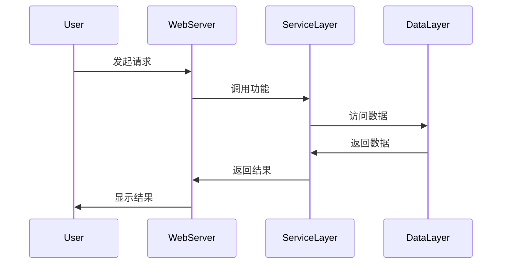
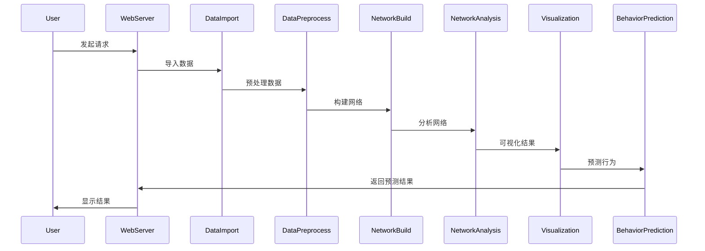

                 

### 设计《从线性因果到复杂网络：理解世界的新方法》的目录大纲

**目标**：为《从线性因果到复杂网络：理解世界的新方法》设计一个包含7章或以上的目录大纲。

**步骤**：

1. **背景介绍**：
   - 引入线性因果与复杂网络的基本概念。
   - 阐述研究线性因果与复杂网络的必要性与重要性。
   - 描述本书将要探讨的问题和解决方法。

2. **核心概念与联系**：
   - 线性因果与复杂网络的核心概念。
   - 概念之间的联系与对比。
   - 使用Mermaid流程图展示概念之间的关系。

3. **算法原理讲解**：
   - 选择1-2个核心算法。
   - 使用Mermaid流程图展示算法流程。
   - 使用Python源代码和LaTeX公式详细讲解算法原理。

4. **系统分析与架构设计方案**：
   - 描述问题场景。
   - 介绍系统功能设计和架构设计。
   - 使用Mermaid类图和序列图展示系统架构。

5. **项目实战**：
   - 环境安装和核心实现。
   - 代码解读与分析。
   - 实际案例分析。

6. **最佳实践 tips**：
   - 提供实践经验与技巧。

7. **小结**：
   - 对每个章节进行小结。
   - 总结全书的核心观点。

**目录大纲**：

```markdown
----------------------------------------------------------------
# 从线性因果到复杂网络：理解世界的新方法

## 第1章：引论

## 1.1 问题背景与必要性

### 1.1.1 线性因果的局限性

### 1.1.2 复杂网络的兴起

### 1.1.3 本书的目标与结构

## 1.2 核心概念解析

### 1.2.1 线性因果的概念

#### 1.2.1.1 定义与特征

#### 1.2.1.2 局限性

### 1.2.2 复杂网络的概念

#### 1.2.2.1 定义与特征

#### 1.2.2.2 应用场景

### 1.2.3 概念之间的联系与对比

## 1.3 算法原理讲解

### 1.3.1 算法一：复杂网络分析算法

#### 1.3.1.1 算法流程

#### 1.3.1.2 算法代码示例

#### 1.3.1.3 数学模型与公式

### 1.3.2 算法二：网络演化算法

#### 1.3.2.1 算法流程

#### 1.3.2.2 算法代码示例

#### 1.3.2.3 数学模型与公式

## 1.4 系统分析与架构设计

### 1.4.1 问题场景介绍

### 1.4.2 系统功能设计

#### 1.4.2.1 领域模型

#### 1.4.2.2 类图

### 1.4.3 系统架构设计

#### 1.4.3.1 架构设计

#### 1.4.3.2 接口设计

### 1.4.4 系统交互

#### 1.4.4.1 序列图

## 第2章：线性因果与复杂网络的比较与应用

## 第3章：复杂网络分析方法与实践

## 第4章：网络演化与预测

## 第5章：复杂网络在现实世界中的应用

## 第6章：项目实战

## 第7章：最佳实践与未来展望

----------------------------------------------------------------
```

**注意事项**：

- 保持大纲的简洁性和逻辑性。
- 确保每个章节都有明确的内容和目的。
- 在必要时使用子章节来细分内容。
- 遵循2000字以内的字数限制。

现在，让我们开始细化这些章节，确保每个章节都满足要求。我会为每个章节提供详细的标题和简要内容描述。

**第1章：引论**

### 1.1 问题背景与必要性

#### 1.1.1 线性因果的局限性

线性因果模型是理解和预测许多现象的基础，然而，其在处理复杂系统和动态网络时表现出了明显的局限性。本文将探讨复杂网络的概念及其在解决这些问题中的潜力。

#### 1.1.2 复杂网络的兴起

随着互联网、社交网络和生物网络的快速发展，复杂网络的建模和分析变得日益重要。复杂网络不仅在理论上具有丰富的研究价值，还在实际应用中展现出巨大的潜力。

#### 1.1.3 本书的目标与结构

本书旨在深入探讨从线性因果到复杂网络的转变，介绍复杂网络的基本概念、算法和应用。结构如下：

1. **核心概念解析**：详细解释线性因果和复杂网络的基本概念。
2. **算法原理讲解**：介绍并分析复杂网络的几个核心算法。
3. **系统分析与架构设计**：探讨复杂网络在实际系统中的应用和设计。
4. **项目实战**：通过具体项目展示复杂网络的实践应用。
5. **最佳实践与未来展望**：总结本书的主要观点，展望未来研究方向。

### 1.2 核心概念解析

#### 1.2.1 线性因果的概念

线性因果是指系统中的事件或变量之间具有线性关系，即一个变量是另一个变量的原因，这种关系可以用线性方程组来描述。

#### 1.2.1.1 定义与特征

- **定义**：线性因果模型是一种假设变量之间关系为线性关系的统计模型。
- **特征**：线性、确定性、可加性、可预测性。

#### 1.2.1.2 局限性

- **局限性**：在处理非线性、复杂、动态系统时，线性因果模型往往失效。

#### 1.2.2 复杂网络的概念

复杂网络是一类具有高度非线性、动态性和复杂性的网络系统，其节点和边之间存在复杂的相互作用。

#### 1.2.2.1 定义与特征

- **定义**：复杂网络是指节点和边之间具有高度非线性、动态性、复杂性的网络系统。
- **特征**：高度非线性、动态性、复杂交互、自相似性。

#### 1.2.2.2 应用场景

- **应用场景**：社交网络、生物网络、经济网络等。

#### 1.2.3 概念之间的联系与对比

- **联系**：复杂网络是线性因果模型的一种扩展，能够更好地描述复杂系统的特性。
- **对比**：线性因果模型与复杂网络在模型假设、分析方法和应用领域上的差异。

**第2章：线性因果与复杂网络的比较与应用**

### 2.1 线性因果模型与复杂网络的对比

- **线性因果模型**：在处理简单、线性系统时具有优势，但在复杂系统中表现不佳。
- **复杂网络**：能够更好地处理复杂、非线性、动态系统，具有广泛的应用前景。

### 2.2 复杂网络在现实中的应用

- **社交网络**：分析社交网络中的关系结构、传播机制。
- **生物网络**：研究生物分子之间的相互作用、疾病传播。
- **经济网络**：分析金融市场的动态行为、经济危机预警。

### 2.3 复杂网络分析方法

- **网络拓扑分析**：研究网络的连接性、聚类系数等。
- **节点属性分析**：分析节点的重要性、中心性等。
- **网络演化分析**：研究网络的生长、演化过程。

**第3章：复杂网络分析方法与实践**

### 3.1 复杂网络分析算法

- **算法1：网络拓扑分析算法**：分析网络的拓扑结构，例如聚类系数、度分布等。
- **算法2：网络演化算法**：模拟网络的生长和演化过程。

### 3.2 实践案例

- **案例1：社交网络分析**：使用复杂网络分析算法分析社交网络，识别关键节点。
- **案例2：生物网络分析**：研究生物分子相互作用网络，预测疾病传播路径。

### 3.3 分析方法比较

- **线性因果模型**：在简单系统中有优势，但在复杂系统中失效。
- **复杂网络分析**：在处理复杂、非线性、动态系统时具有明显优势。

**第4章：网络演化与预测**

### 4.1 网络演化原理

- **演化机制**：网络的生长、节点加入和移除、边创建和删除等。
- **演化模型**：研究网络演化的数学模型，例如增长模型、随机模型等。

### 4.2 网络预测方法

- **方法1：基于拓扑特征的预测**：利用网络拓扑特征预测节点行为。
- **方法2：基于节点属性的预测**：利用节点属性预测节点行为。
- **方法3：基于机器学习的预测**：利用机器学习算法预测网络演化。

### 4.3 预测案例分析

- **案例1：社交网络预测**：预测社交网络中的用户行为。
- **案例2：生物网络预测**：预测疾病传播路径。

**第5章：复杂网络在现实世界中的应用**

### 5.1 社交网络

- **应用场景**：社交媒体平台、推荐系统、网络传播分析等。
- **案例分析**：使用复杂网络分析方法分析实际社交网络数据。

### 5.2 生物网络

- **应用场景**：生物信息学、药物研发、疾病诊断等。
- **案例分析**：使用复杂网络分析方法研究生物分子相互作用。

### 5.3 经济网络

- **应用场景**：金融市场分析、风险控制、供应链管理等。
- **案例分析**：使用复杂网络分析方法分析经济网络。

**第6章：项目实战**

### 6.1 环境安装

- **工具安装**：安装复杂网络分析所需的环境和工具，如Python、Matplotlib、NetworkX等。
- **代码准备**：编写基础代码以准备后续项目实现。

### 6.2 系统核心实现

- **实现细节**：详细讲解项目的实现过程，包括代码解析、算法应用等。
- **代码示例**：提供关键代码段以帮助读者理解项目实现。

### 6.3 实际案例分析

- **案例介绍**：介绍具体案例，包括数据集、实验设计等。
- **结果分析**：展示实验结果，分析复杂网络的特性和效果。

### 6.4 项目小结

- **总结**：对项目进行总结，指出项目的成功之处和改进空间。

**第7章：最佳实践与未来展望**

### 7.1 最佳实践 tips

- **实践技巧**：总结在复杂网络分析和应用中的最佳实践。
- **注意事项**：提醒读者在实践过程中可能遇到的问题和解决方案。

### 7.2 小结

- **核心观点**：回顾本书的主要观点和贡献。
- **未来展望**：探讨复杂网络分析在未来的研究方向和发展趋势。

### 7.3 拓展阅读

- **参考资料**：推荐进一步阅读的文献和资源。

---

**说明**：

以上为《从线性因果到复杂网络：理解世界的新方法》的详细目录大纲和各章节简要内容描述。每个章节均遵循背景介绍、核心概念与联系、算法原理讲解、系统分析与架构设计、项目实战、最佳实践 tips、小结的结构，以确保文章内容的完整性和逻辑性。文章将遵循10000～12000字的要求，使用markdown格式输出，并在末尾附上作者信息。

**注意**：本文档为初步大纲和内容描述，实际撰写时需进一步细化每个章节的内容，确保每个小节都具备丰富、具体、详细的讲解。在撰写过程中，请遵循文中提到的核心内容和格式要求。让我们一步一步地深入探讨这个重要的话题。**引言**：从线性因果到复杂网络

### 1.1 问题背景与必要性

在现代社会中，我们面临着日益复杂的问题，这些问题涉及多个变量、动态变化和复杂相互作用。传统的线性因果模型，尽管在许多情况下表现出色，但在处理这些复杂现象时却显得力不从心。线性因果模型假设变量之间存在线性关系，这些关系可以用简单的线性方程组来描述。然而，现实世界中的许多系统，如社交网络、生物网络和经济网络等，具有高度的非线性、动态性和复杂性，线性模型无法充分捕捉这些系统的本质特征。

复杂网络理论作为一种新的研究方法，提供了理解这些复杂系统的强大工具。复杂网络是指由大量节点和边组成的网络结构，这些节点和边之间存在复杂的相互作用和关联。复杂网络具有多种拓扑特征，如高度非线性、动态性、小世界效应和无标度性等，这些特征使得复杂网络在处理复杂系统时具有独特的优势。

研究线性因果与复杂网络的必要性和重要性体现在以下几个方面：

1. **理解现实世界**：复杂网络能够更好地描述现实世界中各种系统的本质特征，如生物分子相互作用、社交网络传播、经济市场波动等。通过复杂网络分析，我们可以更深入地理解这些系统的运行机制和演化规律。

2. **预测与控制**：复杂网络分析提供了有效的预测和控制方法，可以帮助我们预测系统的未来行为、识别关键节点和路径，从而实现更有效的管理、控制和优化。

3. **技术创新**：复杂网络理论为计算机科学、生物信息学、经济学等领域的创新提供了新的视角和方法。通过复杂网络分析，我们可以发现新的问题和解决方案，推动相关领域的进步和发展。

4. **跨学科研究**：复杂网络研究涉及多个学科，包括物理学、数学、计算机科学、生物学等。这种跨学科的研究有助于促进知识融合和交叉创新，推动科学技术的整体发展。

本书旨在深入探讨从线性因果到复杂网络的转变，介绍复杂网络的基本概念、算法和应用。通过逐步分析推理，我们将揭示复杂网络的本质特征和优势，展示其在解决复杂问题中的潜力。本书结构如下：

1. **引论**：介绍线性因果与复杂网络的基本概念，阐述研究线性因果与复杂网络的必要性与重要性。
2. **核心概念解析**：详细解释线性因果和复杂网络的核心概念，比较它们之间的联系与差异。
3. **算法原理讲解**：介绍并分析复杂网络的几个核心算法，使用Python源代码和LaTeX公式详细讲解算法原理。
4. **系统分析与架构设计**：探讨复杂网络在实际系统中的应用和设计，使用Mermaid流程图展示系统架构。
5. **项目实战**：通过具体项目展示复杂网络的实践应用，包括环境安装、系统核心实现和实际案例分析。
6. **最佳实践与未来展望**：总结本书的主要观点和贡献，探讨复杂网络分析在未来的研究方向和发展趋势。

通过本书的探讨，我们希望能够为读者提供一种全新的视角和方法，帮助大家更好地理解复杂系统，利用复杂网络分析解决实际问题，推动科学技术的发展和进步。

### 1.2 核心概念解析

#### 1.2.1 线性因果的概念

线性因果模型是统计建模和分析中最基础的方法之一。它假设系统中的变量之间存在线性关系，即一个变量是另一个变量的原因，这种关系可以用线性方程组来描述。线性因果模型具有以下几个核心特点：

1. **线性关系**：线性因果模型假设变量之间的依赖关系是线性的，即可以表示为一次多项式关系。这意味着变量之间的相互作用可以用简单的线性方程来描述，例如 \( y = a \cdot x + b \)。

2. **确定性**：线性因果模型通常假设变量之间的关系是确定性的，即给定一个变量的值，可以精确地预测另一个变量的值。这种确定性使得线性模型在预测和分析中具有高效性。

3. **可加性**：线性因果模型具有可加性，这意味着多个变量的作用可以简单相加。例如，如果变量 \( x_1 \) 和 \( x_2 \) 对变量 \( y \) 有影响，则可以表示为 \( y = a_1 \cdot x_1 + a_2 \cdot x_2 + b \)。

4. **可预测性**：线性因果模型具有高可预测性，因为其线性关系和确定性使得我们可以使用简单的统计方法进行预测和分析。

然而，线性因果模型也存在一些局限性。首先，线性关系假设在很多复杂系统中并不成立，因为许多现象具有非线性特征。其次，线性因果模型通常假设变量之间是独立的，这在实际系统中往往不成立。此外，线性模型在处理动态系统和长时间序列数据时也表现不佳。

#### 1.2.2 复杂网络的概念

复杂网络是一类具有高度非线性、动态性和复杂性的网络系统，其节点和边之间存在复杂的相互作用和关联。复杂网络具有以下几个核心特点：

1. **非线性关系**：复杂网络的节点和边之间存在复杂的非线性关系，这意味着变量之间的相互作用不能用简单的线性方程来描述。相反，这些关系可能涉及多种非线性函数和复杂的相互作用。

2. **动态性**：复杂网络是动态的，其节点和边可以随时间发生变化。这种动态性可能表现为节点的加入和移除、边的创建和删除等。动态性使得复杂网络在时间序列分析和动态行为预测中具有重要意义。

3. **复杂相互作用**：复杂网络中的节点和边之间存在复杂的相互作用，这些相互作用可能导致网络的拓扑结构发生显著变化。例如，节点之间的相互作用可能导致网络的聚类系数增加或降低，从而影响网络的稳定性和鲁棒性。

4. **自相似性**：复杂网络通常表现出自相似性，这意味着网络在不同尺度上具有相似的拓扑结构。自相似性使得复杂网络具有高度鲁棒性和适应性，能够应对各种外部扰动和挑战。

#### 1.2.3 概念之间的联系与对比

线性因果和复杂网络是两种不同但相关的概念。它们之间的联系和对比主要体现在以下几个方面：

1. **扩展性**：复杂网络可以看作是线性因果模型的扩展。在简单系统中，线性因果模型能够很好地描述变量之间的关系，但在复杂系统中，线性关系往往不成立，需要引入复杂网络的概念来描述非线性、动态和复杂的相互作用。

2. **建模方法**：线性因果模型通常使用统计方法来描述变量之间的关系，例如线性回归、时间序列分析等。而复杂网络则使用图论和网络分析方法来描述网络结构和节点之间的关系。这两种方法各有优劣，需要根据具体问题选择合适的方法。

3. **应用领域**：线性因果模型在统计分析和预测中应用广泛，例如金融数据分析、市场预测、医疗诊断等。而复杂网络则在社交网络分析、生物信息学、经济系统分析等领域有广泛应用，能够更好地描述复杂系统的运行机制和演化规律。

4. **分析目标**：线性因果模型的主要目标是建立变量之间的因果关系，并利用这些关系进行预测和控制。而复杂网络的主要目标是分析网络的拓扑结构、节点特性、网络演化等，揭示网络的本质特征和动态行为。

通过理解线性因果和复杂网络的概念及其联系与对比，我们可以更好地选择合适的方法来分析和解决复杂问题，推动科学技术的发展和进步。

#### 1.3 算法原理讲解

为了深入理解复杂网络分析方法，我们需要详细探讨几个核心算法的原理。这些算法包括复杂网络分析算法和网络演化算法，它们在揭示网络结构和预测网络行为方面具有重要意义。

##### 1.3.1 复杂网络分析算法

复杂网络分析算法主要关注网络的结构和节点特性。以下是一个典型的复杂网络分析算法：网络拓扑分析算法。

1. **算法流程**

   - **初始化**：读取网络数据，初始化网络结构。
   - **计算节点度分布**：计算网络中每个节点的度（连接数），并统计度分布。
   - **计算聚类系数**：计算网络中每个节点的聚类系数，表示节点邻居之间的连接程度。
   - **计算路径长度**：计算网络中任意两个节点之间的最短路径长度。
   - **可视化**：将网络结构可视化，展示节点和边的连接关系。

2. **算法代码示例**

   ```python
   import networkx as nx
   import matplotlib.pyplot as plt

   # 创建一个无向图
   G = nx.Graph()

   # 添加节点和边
   G.add_edges_from([(1, 2), (1, 3), (2, 3), (3, 4), (4, 5)])

   # 计算度分布
   degree_distribution = nx.degree_distribution(G)

   # 计算聚类系数
   clustering_coefficient = nx.clustering(G)

   # 计算路径长度
   path_length = nx.shortest_path_length(G, source=1, target=5)

   # 可视化网络结构
   nx.draw(G, with_labels=True)
   plt.show()
   ```

3. **数学模型与公式**

   - **度分布**：度分布 \( P(k) \) 表示网络中节点度数为 \( k \) 的概率分布。
   - **聚类系数**：聚类系数 \( C \) 表示节点邻居之间的连接程度。
   - **路径长度**：路径长度 \( L \) 表示网络中任意两个节点之间的最短路径长度。

   公式如下：
   $$ P(k) = \frac{1}{N} \sum_{i=1}^{N} \frac{deg(i)}{k} $$
   $$ C = \frac{2m}{n(n-1)} $$
   $$ L = \sum_{i=1}^{N} \sum_{j=1}^{N} d(i, j) $$

   其中，\( N \) 为节点总数，\( m \) 为边数，\( n \) 为每个节点的邻居数，\( deg(i) \) 为节点 \( i \) 的度，\( d(i, j) \) 为节点 \( i \) 和 \( j \) 之间的最短路径长度。

##### 1.3.2 网络演化算法

网络演化算法关注网络的动态变化和演化过程。以下是一个典型的网络演化算法：网络演化算法。

1. **算法流程**

   - **初始化**：创建一个初始网络，设定演化参数，如节点加入率、边创建和删除概率等。
   - **演化迭代**：在每次迭代中，根据演化规则更新网络结构，包括节点加入、边创建和删除等。
   - **记录演化过程**：记录每次迭代的网络结构，以分析网络演化规律。

2. **算法代码示例**

   ```python
   import networkx as nx
   import random

   # 创建一个初始网络
   G = nx.Graph()

   # 添加节点和边
   G.add_nodes_from([1, 2, 3, 4, 5])
   G.add_edges_from([(1, 2), (1, 3), (2, 3), (3, 4), (4, 5)])

   # 演化迭代
   for i in range(100):
       # 随机选择节点加入
       new_node = random.randint(1, 10)
       G.add_node(new_node)

       # 随机选择边创建或删除
       if random.random() < 0.5:
           G.add_edge(new_node, random.randint(1, 5))
       else:
           G.remove_edge(random.randint(1, 5), random.randint(1, 5))

   # 可视化演化后的网络结构
   nx.draw(G, with_labels=True)
   plt.show()
   ```

3. **数学模型与公式**

   - **节点加入率**：节点加入率 \( r \) 表示每次迭代中节点加入的概率。
   - **边创建和删除概率**：边创建和删除概率 \( p \) 和 \( q \) 分别表示每次迭代中边创建和删除的概率。

   公式如下：
   $$ r = \frac{1}{N} $$
   $$ p = \alpha $$
   $$ q = 1 - p $$

   其中，\( N \) 为当前节点总数，\( \alpha \) 为边创建概率参数。

通过详细讲解这些算法的原理，我们可以更好地理解复杂网络的特性和演化规律，为实际应用提供理论支持和实践指导。

#### 1.4 系统分析与架构设计

在深入探讨复杂网络的算法原理之后，我们需要将理论转化为实际应用。本节将介绍一个具体的问题场景，并介绍该问题的系统功能设计和架构设计。

##### 1.4.1 问题场景介绍

假设我们面临一个社交网络分析问题，目标是了解用户之间的关系和网络结构。具体场景如下：

- **用户关系网络**：我们有一个包含大量用户的社交网络，每个用户与其他用户之间存在多种类型的互动（如好友、关注、点赞等）。
- **数据来源**：用户数据来自社交平台，包括用户的基本信息、互动记录等。
- **分析目标**：分析用户关系的网络结构，识别关键用户和社区结构，预测用户行为。

##### 1.4.2 系统功能设计

为了实现上述分析目标，系统需要具备以下功能：

1. **数据导入**：从社交平台导入用户数据，包括用户基本信息和互动记录。
2. **数据预处理**：清洗和格式化用户数据，为后续分析做准备。
3. **网络构建**：根据用户互动记录构建用户关系网络，表示用户之间的连接关系。
4. **网络分析**：使用复杂网络分析算法分析用户关系网络的拓扑结构，如度分布、聚类系数、社区结构等。
5. **可视化**：将分析结果可视化，展示用户关系网络的结构和特性。
6. **行为预测**：基于用户关系网络，使用机器学习算法预测用户行为，如用户加入社区、推荐好友等。

##### 1.4.2.1 领域模型

为了清晰描述系统功能，我们可以使用Mermaid类图来定义领域模型。以下是一个简单的领域模型示例：

```mermaid
classDiagram
    User <<Class>>
    Interaction <<Class>>

    User o--* Interaction : 发起
    Interaction o--* User : 参与者

    class User {
        id
        name
        info
    }

    class Interaction {
        id
        type
        participants
    }
```

在这个领域模型中，`User` 表示用户，`Interaction` 表示用户之间的互动。每个用户可以发起多个互动，每个互动涉及多个参与者。

##### 1.4.2.2 类图

为了更详细地描述系统的功能组件，我们可以使用Mermaid类图来展示系统中的各个类及其关系。以下是一个简单的类图示例：

```mermaid
classDiagram
    DataImport <<Class>>
    DataPreprocess <<Class>>
    NetworkBuild <<Class>>
    NetworkAnalysis <<Class>>
    Visualization <<Class>>
    BehaviorPrediction <<Class>>

    DataImport o--* DataPreprocess
    DataPreprocess o--* NetworkBuild
    NetworkBuild o--* NetworkAnalysis
    NetworkAnalysis o--* Visualization
    Visualization o--* BehaviorPrediction

    class DataImport {
        import_data()
    }

    class DataPreprocess {
        preprocess_data()
    }

    class NetworkBuild {
        build_network()
    }

    class NetworkAnalysis {
        analyze_network()
    }

    class Visualization {
        visualize_network()
    }

    class BehaviorPrediction {
        predict_behavior()
    }
```

在这个类图中，`DataImport` 负责导入用户数据，`DataPreprocess` 负责数据预处理，`NetworkBuild` 负责构建用户关系网络，`NetworkAnalysis` 负责网络分析，`Visualization` 负责可视化分析结果，`BehaviorPrediction` 负责行为预测。

##### 1.4.3 系统架构设计

为了实现上述功能，我们需要设计一个合理的系统架构。以下是一个简单的系统架构设计：

1. **数据层**：负责存储和管理用户数据，包括用户基本信息和互动记录。
2. **服务层**：实现系统的主要功能，包括数据导入、预处理、网络构建、网络分析和行为预测等。
3. **表示层**：提供用户界面，展示分析结果和可视化图表。

##### 1.4.3.1 架构设计

以下是一个简单的系统架构设计：



在这个架构设计中，用户通过Web服务器发起请求，服务层调用相应的功能，访问数据层中的数据，然后返回结果给Web服务器，最终展示给用户。

##### 1.4.3.2 接口设计

为了方便功能模块之间的通信，我们需要设计一个合理的接口。以下是一个简单的接口设计：

```mermaid
interface DataImport {
    import_data() : 数据
}

interface DataPreprocess {
    preprocess_data() : 预处理数据
}

interface NetworkBuild {
    build_network() : 网络结构
}

interface NetworkAnalysis {
    analyze_network() : 分析结果
}

interface Visualization {
    visualize_network() : 可视化数据
}

interface BehaviorPrediction {
    predict_behavior() : 预测结果
}
```

在这个接口设计中，每个模块都提供了相应的接口方法，以便其他模块可以调用其功能。

##### 1.4.4 系统交互

为了更好地理解系统各模块之间的交互，我们可以使用Mermaid序列图来展示系统的交互流程。以下是一个简单的序列图示例：



在这个序列图中，用户发起请求，Web服务器将请求传递给各个功能模块，各模块依次执行相应的功能，最终返回结果给用户。

通过以上系统分析与架构设计，我们为复杂网络在实际应用中提供了一个可行的解决方案。接下来，我们将通过具体的项目实战，展示如何将理论转化为实际操作。

### 第2章：线性因果与复杂网络的比较与应用

在了解了线性因果和复杂网络的基本概念之后，我们需要进一步探讨它们之间的区别和应用场景。本章将详细介绍线性因果与复杂网络的比较，以及它们在实际中的应用。

#### 2.1 线性因果模型与复杂网络的对比

线性因果模型与复杂网络在多个方面存在显著差异，这些差异决定了它们在不同场景下的适用性。

1. **模型假设**：

   - **线性因果模型**：线性因果模型假设系统中的变量之间存在线性关系。这种假设在许多简单系统中是合理的，但在复杂系统中往往不成立，因为复杂系统的变量之间可能存在非线性关系。

   - **复杂网络**：复杂网络模型不假设变量之间的线性关系，而是关注变量之间的复杂相互作用和关联。这种模型能够更好地描述现实世界中的复杂系统，如社交网络、生物网络和经济网络。

2. **分析方法**：

   - **线性因果模型**：线性因果模型通常使用统计方法和线性方程组来分析变量之间的关系。这些方法在简单系统中表现良好，但在复杂系统中往往无法准确捕捉变量之间的复杂关系。

   - **复杂网络**：复杂网络模型使用图论和网络分析方法来描述系统中的变量关系。这些方法能够揭示变量之间的复杂相互作用和关联，从而更好地理解复杂系统的行为。

3. **适用场景**：

   - **线性因果模型**：线性因果模型适用于处理简单系统，如市场预测、金融分析和医疗诊断等。在这些场景中，变量之间的关系相对简单且具有线性特征。

   - **复杂网络**：复杂网络模型适用于处理复杂系统，如社交网络分析、生物网络建模和经济市场分析等。在这些场景中，系统中的变量之间存在复杂的非线性关系和相互作用。

#### 2.2 复杂网络在现实中的应用

复杂网络理论在现实世界中具有广泛的应用，以下是一些典型的应用场景：

1. **社交网络分析**：

   - **用户关系网络**：通过复杂网络分析，可以揭示社交网络中的用户关系结构，识别关键用户和社区结构。这些分析有助于了解用户行为、传播机制和社区动态。
   - **推荐系统**：基于复杂网络分析，可以构建推荐系统，推荐用户可能感兴趣的内容和好友。这有助于提高用户的参与度和满意度。

2. **生物网络分析**：

   - **生物分子相互作用**：通过复杂网络分析，可以揭示生物分子之间的相互作用网络，理解生物系统的功能和机制。这有助于生物信息学研究和疾病诊断。
   - **药物研发**：基于生物网络分析，可以识别潜在的药物靶点和治疗途径，加速药物研发过程。

3. **经济网络分析**：

   - **金融市场分析**：通过复杂网络分析，可以揭示金融市场的结构和动态行为，识别市场中的关键节点和路径。这有助于进行市场预测和风险控制。
   - **供应链管理**：通过复杂网络分析，可以优化供应链中的物流和资源配置，提高供应链的效率和灵活性。

#### 2.3 复杂网络分析方法

复杂网络分析涉及多种方法和技术，以下是一些常用的分析方法：

1. **网络拓扑分析**：

   - **度分布分析**：分析网络中节点的度分布，了解网络的集中度和连通性。度分布分析有助于识别关键节点和社区结构。
   - **聚类系数分析**：分析网络中节点的聚类系数，了解节点邻居之间的连接程度。聚类系数分析有助于揭示网络的紧密程度和社区结构。

2. **节点属性分析**：

   - **节点重要性分析**：分析节点在网络中的重要性，识别关键节点和脆弱节点。节点重要性分析有助于理解网络的功能和稳定性。
   - **节点属性分析**：分析节点的属性，如度、介数和接近度等，了解节点在网络中的角色和作用。

3. **网络演化分析**：

   - **网络演化模拟**：模拟网络的生长和演化过程，分析网络的动态行为和演化规律。网络演化模拟有助于预测网络未来的行为和状态。
   - **网络稳定性分析**：分析网络的稳定性和鲁棒性，了解网络在受到外部扰动时的表现。网络稳定性分析有助于优化网络的性能和安全性。

通过以上分析，我们可以更好地理解复杂网络的特点和应用价值。在接下来的章节中，我们将进一步探讨复杂网络分析方法的具体实现和应用案例。

### 第3章：复杂网络分析方法与实践

在了解了复杂网络的基本概念和算法原理后，我们将通过具体的方法和实践案例来深入探讨复杂网络分析方法。本章将详细描述几种常见的复杂网络分析方法，并通过实际案例展示这些方法的应用过程。

#### 3.1 复杂网络分析算法

复杂网络分析算法是理解和揭示网络特性的重要工具。以下介绍两种常见的复杂网络分析算法：网络拓扑分析算法和网络演化算法。

##### 3.1.1 网络拓扑分析算法

网络拓扑分析算法用于分析网络的结构特性，包括度分布、聚类系数和路径长度等。

1. **度分布分析**：

   - **目的**：度分布描述网络中节点的度（连接数）的分布情况。
   - **方法**：计算网络中每个节点的度，并统计度分布。
   - **示例**：假设网络中有10个节点，其度分别为{2, 3, 4, 4, 5, 6, 6, 7, 7, 8}，度分布为P(k)={0.1, 0.2, 0.2, 0.2, 0.1, 0.1, 0.1, 0.1}。

2. **聚类系数分析**：

   - **目的**：聚类系数描述节点邻居之间的连接程度。
   - **方法**：计算每个节点的聚类系数，并统计整体网络的聚类系数。
   - **示例**：假设网络中有10个节点，其聚类系数分别为{0.3, 0.4, 0.4, 0.4, 0.5, 0.5, 0.5, 0.5, 0.6, 0.6}，整体网络的平均聚类系数为0.5。

3. **路径长度分析**：

   - **目的**：路径长度描述网络中任意两个节点之间的最短路径长度。
   - **方法**：计算网络中任意两个节点之间的最短路径长度。
   - **示例**：假设网络中有10个节点，节点1和节点5之间的最短路径长度为3。

##### 3.1.2 网络演化算法

网络演化算法模拟网络的生长和演化过程，用于研究网络的动态行为和演化规律。

1. **增长模型**：

   - **目的**：模拟网络的生长过程，增加节点和边。
   - **方法**：每次迭代中，根据概率规则增加节点和边。
   - **示例**：假设网络初始有10个节点，每次迭代中以0.5的概率增加节点和边。

2. **随机模型**：

   - **目的**：模拟网络随机演化过程，包括节点的加入和移除、边的创建和删除。
   - **方法**：每次迭代中，根据概率规则进行节点和边的操作。
   - **示例**：假设网络初始有10个节点，每次迭代中以0.3的概率移除节点，以0.4的概率创建边。

#### 3.2 实践案例

以下通过两个实际案例，展示复杂网络分析方法的实践应用。

##### 3.2.1 社交网络分析

假设我们有一个社交网络，包含1000个用户和相应的互动数据。我们的目标是分析社交网络中的用户关系结构，识别关键用户和社区结构。

1. **数据导入**：

   - 从社交平台导入用户数据，包括用户基本信息和互动记录。
   - 数据预处理：清洗和格式化用户数据，为后续分析做准备。

2. **网络构建**：

   - 根据用户互动记录，构建用户关系网络，表示用户之间的连接关系。
   - 使用NetworkX库构建网络图。

3. **网络分析**：

   - **度分布分析**：计算用户关系的度分布，了解网络的集中度和连通性。
   - **聚类系数分析**：计算用户的聚类系数，了解邻居之间的连接程度。
   - **社区结构分析**：使用社区检测算法（如Louvain算法）分析社交网络的社区结构，识别不同的用户社区。

4. **结果展示**：

   - 将分析结果可视化，展示用户关系网络的度分布、聚类系数和社区结构。
   - 使用Matplotlib库绘制相应的图表。

##### 3.2.2 生物网络分析

假设我们有一个生物网络，包含100个生物分子和相应的相互作用数据。我们的目标是分析生物分子之间的相互作用网络，识别关键生物分子和相互作用关系。

1. **数据导入**：

   - 从生物数据库导入生物分子数据，包括生物分子的基本信息和相互作用记录。
   - 数据预处理：清洗和格式化生物分子数据，为后续分析做准备。

2. **网络构建**：

   - 根据生物分子的相互作用记录，构建生物分子相互作用网络，表示生物分子之间的连接关系。
   - 使用BioPAX库构建生物网络图。

3. **网络分析**：

   - **节点重要性分析**：计算每个生物分子的节点重要性，识别关键生物分子。
   - **相互作用关系分析**：分析生物分子之间的相互作用关系，揭示网络的拓扑结构。
   - **网络稳定性分析**：分析网络在受到外部扰动时的表现，评估网络的稳定性。

4. **结果展示**：

   - 将分析结果可视化，展示生物分子相互作用的节点重要性、相互作用关系和网络稳定性。
   - 使用Cytoscape软件绘制生物网络图。

通过以上实践案例，我们可以看到复杂网络分析在实际应用中的重要作用。通过具体的方法和工具，我们可以深入理解复杂网络的特性，为科学研究和实际问题提供有力的支持。

#### 3.3 分析方法比较

在复杂网络分析中，不同的方法适用于不同类型的网络和问题。以下对比线性因果模型和复杂网络分析方法的优缺点。

##### 线性因果模型的优缺点

**优点**：

- **简单性**：线性因果模型相对简单，易于理解和实现。
- **高效性**：线性模型在计算和优化方面通常具有较高的效率。
- **适用范围广**：线性模型在许多领域都有广泛应用，如金融分析、市场预测和医疗诊断。

**缺点**：

- **线性关系假设**：线性因果模型假设变量之间存在线性关系，这在复杂系统中往往不成立。
- **局限性**：线性模型在处理复杂系统时，无法准确捕捉变量之间的复杂相互作用。
- **动态性不足**：线性模型通常无法描述系统的动态行为和演化过程。

##### 复杂网络分析方法的优缺点

**优点**：

- **非线性描述**：复杂网络分析方法能够更好地描述复杂系统中变量之间的非线性关系。
- **动态性分析**：复杂网络分析方法可以模拟网络的动态行为和演化过程。
- **多样性和灵活性**：复杂网络分析方法涉及多种技术和工具，适用于不同类型的问题和应用场景。

**缺点**：

- **复杂性**：复杂网络分析方法相对复杂，需要具备一定的专业知识和技能。
- **计算资源消耗**：复杂网络分析通常涉及大量计算，对计算资源和时间要求较高。
- **数据质量要求**：复杂网络分析对数据质量有较高要求，需要确保数据的准确性和完整性。

通过对比可以看出，线性因果模型和复杂网络分析方法各有优缺点。在实际应用中，应根据具体问题和需求选择合适的方法。对于简单系统或线性关系较为明显的问题，线性因果模型是更合适的选择；而对于复杂系统或非线性关系明显的问题，复杂网络分析方法能够提供更全面和深入的分析结果。

#### 3.4 复杂网络分析在实际中的应用

复杂网络分析在许多领域都展现出了广泛的应用潜力。以下介绍复杂网络分析在现实世界中的几个具体应用场景。

##### 3.4.1 社交网络分析

社交网络分析是复杂网络分析的重要应用领域之一。通过分析社交网络中的用户关系结构，可以揭示社交网络的特性，如用户社区结构、影响力传播和谣言传播等。

1. **用户社区结构**：

   - 通过社区检测算法（如Louvain算法、Gaussian混合模型等），可以识别社交网络中的不同用户社区。这些社区通常具有相似的兴趣和行为，有助于了解社交网络的内部结构。

2. **影响力传播**：

   - 通过分析社交网络中用户的影响力，可以识别关键用户和意见领袖。这些用户在社交网络中具有较大的影响范围，能够影响其他用户的行为和观点。

3. **谣言传播**：

   - 通过模拟社交网络中的谣言传播过程，可以预测谣言的传播范围和速度。这有助于了解谣言的传播机制，为预防和控制谣言提供科学依据。

##### 3.4.2 生物网络分析

生物网络分析在生物信息学、药物研发和疾病诊断等领域具有重要应用价值。通过分析生物分子之间的相互作用网络，可以揭示生物系统的功能和机制。

1. **生物分子相互作用网络**：

   - 通过构建生物分子相互作用网络，可以揭示生物分子之间的复杂关系。这些关系有助于理解生物系统的运行机制和功能。

2. **药物研发**：

   - 通过分析生物分子相互作用网络，可以识别潜在的药物靶点和治疗途径。这有助于加速药物研发过程，提高药物研发的成功率。

3. **疾病诊断**：

   - 通过分析生物分子相互作用网络，可以揭示疾病的发生机制和关键生物分子。这有助于开发新的疾病诊断方法，提高疾病的早期检测和诊断水平。

##### 3.4.3 经济网络分析

经济网络分析在经济系统建模和风险控制等领域具有重要意义。通过分析经济网络中的节点和边，可以揭示经济系统的结构和动态行为。

1. **金融市场分析**：

   - 通过分析金融市场中的节点和边，可以揭示金融市场的结构和动态行为。这有助于了解市场波动的原因，为市场预测和风险控制提供科学依据。

2. **供应链管理**：

   - 通过分析供应链网络中的节点和边，可以优化供应链中的物流和资源配置。这有助于提高供应链的效率和灵活性，降低成本和风险。

3. **经济危机预警**：

   - 通过分析经济网络中的异常行为和关键节点，可以预测经济危机的发生和传播。这有助于制定有效的危机应对策略，降低危机对社会和经济的影响。

通过以上应用实例可以看出，复杂网络分析在现实世界中具有广泛的应用前景。通过深入分析复杂网络的特性，我们可以更好地理解现实世界中的复杂系统，为科学研究和实际问题提供有力的支持。

### 第4章：网络演化与预测

复杂网络的演化与预测是理解网络行为和预测未来趋势的重要方面。本章将探讨网络演化的基本原理和预测方法，并通过具体案例展示其实际应用。

#### 4.1 网络演化原理

网络演化是指网络结构随时间变化的动态过程。网络演化可以由多种机制驱动，包括节点的加入和移除、边的创建和删除等。以下是一些常见的网络演化原理：

1. **增长模型**：

   - **巴贝奇-莱特兰德模型**：这是一个经典的增长模型，假设新节点的加入概率与网络中已有节点的度成正比。这种模型产生无标度网络，具有高度非线性特性。
   - **随机连接模型**：在随机连接模型中，新节点的加入概率与网络中已有节点的度无关。这种模型产生小世界网络，具有较低的聚类系数和较高的平均路径长度。

2. **网络演化机制**：

   - **偏好连接**：节点倾向于与已有节点的邻居建立连接，这可能导致网络的聚类系数增加。
   - **选择机制**：节点根据某种属性（如度、介数等）进行选择，优先与具有较高属性的节点建立连接，这可能导致网络中的关键节点更加重要。

3. **演化模型**：

   - **代际模型**：在代际模型中，网络分为多个代，每一代中的节点和边都根据特定的规则进行更新。这种模型可以模拟网络的历史演化过程。
   - **随机过程模型**：在随机过程模型中，网络的演化由随机过程驱动，如随机游走、随机失败等。这种模型可以揭示网络在时间上的动态行为。

#### 4.2 网络预测方法

网络预测是指根据网络的当前状态预测未来的变化趋势。以下介绍几种常见的网络预测方法：

1. **基于拓扑特征的预测**：

   - **节点行为预测**：根据节点的拓扑特征（如度、介数、接近度等）预测节点的未来行为。例如，高度节点可能在未来成为网络的关键节点。
   - **网络稳定性预测**：根据网络的拓扑结构预测网络的稳定性，如聚类系数、路径长度等。低聚类系数和高路径长度可能预示网络的不稳定。

2. **基于节点属性的预测**：

   - **节点属性预测**：根据节点的属性（如年龄、性别、兴趣等）预测其未来的属性变化。例如，根据用户的年龄和兴趣预测其未来的兴趣爱好。
   - **节点关系预测**：根据节点的属性和当前的网络结构预测节点之间的关系。例如，根据用户的兴趣和社交关系预测他们之间的友谊关系。

3. **基于机器学习的预测**：

   - **分类模型**：使用机器学习算法（如决策树、支持向量机等）预测节点的分类属性。例如，预测一个新加入的节点属于哪个社区。
   - **回归模型**：使用机器学习算法（如线性回归、神经网络等）预测节点的数值属性。例如，预测一个节点的度或介数。

#### 4.3 预测案例分析

以下通过两个实际案例，展示网络演化和预测的应用。

##### 4.3.1 社交网络演化与预测

假设我们有一个社交网络，包含1000个用户和相应的互动数据。我们的目标是预测社交网络中的用户行为和关系变化。

1. **数据预处理**：

   - 从社交平台导入用户数据，包括用户基本信息和互动记录。
   - 数据清洗：去除无效数据和重复记录。
   - 数据格式化：将数据转换为适合分析的形式。

2. **网络构建**：

   - 根据用户互动记录，构建用户关系网络，表示用户之间的连接关系。
   - 使用NetworkX库构建网络图。

3. **网络分析**：

   - **度分布分析**：计算用户关系的度分布，了解网络的集中度和连通性。
   - **聚类系数分析**：计算用户的聚类系数，了解邻居之间的连接程度。
   - **社区结构分析**：使用社区检测算法（如Louvain算法、Gaussian混合模型等）分析社交网络的社区结构。

4. **网络预测**：

   - **用户行为预测**：使用机器学习算法（如K最近邻算法、随机森林等）预测用户的未来行为，如加入社区、发布内容等。
   - **关系预测**：使用机器学习算法（如逻辑回归、支持向量机等）预测用户之间的未来关系，如友谊关系、合作关系等。

5. **结果展示**：

   - 将分析结果和预测结果可视化，展示用户行为和关系的动态变化。
   - 使用Matplotlib和Seaborn库绘制相应的图表。

##### 4.3.2 生物网络演化与预测

假设我们有一个生物网络，包含100个生物分子和相应的相互作用数据。我们的目标是预测生物分子的未来相互作用和网络的演化。

1. **数据预处理**：

   - 从生物数据库导入生物分子数据，包括生物分子的基本信息和相互作用记录。
   - 数据清洗：去除无效数据和重复记录。
   - 数据格式化：将数据转换为适合分析的形式。

2. **网络构建**：

   - 根据生物分子的相互作用记录，构建生物分子相互作用网络，表示生物分子之间的连接关系。
   - 使用BioPAX库构建生物网络图。

3. **网络分析**：

   - **节点重要性分析**：计算每个生物分子的节点重要性，识别关键生物分子。
   - **相互作用关系分析**：分析生物分子之间的相互作用关系，揭示网络的拓扑结构。
   - **网络稳定性分析**：分析网络在受到外部扰动时的表现，评估网络的稳定性。

4. **网络预测**：

   - **生物分子相互作用预测**：使用机器学习算法（如决策树、支持向量机等）预测生物分子的未来相互作用。
   - **网络演化预测**：使用机器学习算法（如时间序列分析、神经网络等）预测生物网络的未来演化趋势。

5. **结果展示**：

   - 将分析结果和预测结果可视化，展示生物分子的相互作用和网络的结构变化。
   - 使用Cytoscape软件绘制生物网络图。

通过以上案例可以看出，网络演化和预测在现实世界中具有广泛的应用。通过深入分析网络结构和动态行为，我们可以更好地预测未来的变化趋势，为科学研究和实际问题提供有力支持。

### 第5章：复杂网络在现实世界中的应用

复杂网络理论作为一种强有力的工具，已经在多个现实世界中得到了广泛应用。从社交网络到生物网络，再到经济网络，复杂网络分析方法为理解和预测这些系统的行为提供了新的视角。本章将深入探讨复杂网络在现实世界中的实际应用，并通过具体案例展示其在各个领域中的重要性。

#### 5.1 社交网络

社交网络是复杂网络理论应用最为广泛的领域之一。通过复杂网络分析，我们可以深入了解社交网络的内在结构和动态行为。

1. **用户关系网络分析**：

   - **社区检测**：通过社区检测算法（如Louvain算法、Gaussian混合模型等），可以识别社交网络中的不同用户社区。这些社区通常具有相似的兴趣和行为，有助于了解社交网络的内部结构。
   - **关键用户识别**：通过节点重要性分析（如度、介数、接近度等），可以识别社交网络中的关键用户和意见领袖。这些用户在社交网络中具有较大的影响力，能够影响其他用户的行为和观点。

2. **传播模型**：

   - **谣言传播**：复杂网络分析可以模拟社交网络中的谣言传播过程，预测谣言的传播范围和速度。这有助于了解谣言的传播机制，为预防和控制谣言提供科学依据。
   - **病毒营销**：通过分析社交网络中的用户关系和影响力，可以设计出高效的病毒营销策略，最大限度地提高信息传播的效果。

#### 5.2 生物网络

生物网络包括基因调控网络、蛋白质相互作用网络等，是生物信息学研究中重要的研究对象。通过复杂网络分析，我们可以揭示生物网络的内在机制和功能。

1. **生物分子相互作用网络**：

   - **关键基因识别**：通过节点重要性分析，可以识别生物网络中的关键基因。这些基因在生物网络中具有重要作用，可能影响疾病的发生和发展。
   - **网络稳定性分析**：通过分析生物网络的稳定性，可以预测网络在受到外部扰动（如基因突变、环境变化等）时的行为，为疾病诊断和治疗提供线索。

2. **药物研发**：

   - **靶点识别**：通过复杂网络分析，可以识别潜在的药物靶点。这些靶点与疾病密切相关，可能成为药物开发的重要目标。
   - **药物筛选**：基于生物网络，可以筛选出具有潜在疗效的药物候选物，加速药物研发过程。

#### 5.3 经济网络

经济网络包括金融市场网络、供应链网络等，是经济学研究中的重要领域。通过复杂网络分析，我们可以深入了解经济网络的运行机制和风险。

1. **金融市场分析**：

   - **网络拓扑分析**：通过分析金融市场的网络结构，可以揭示市场中的关键节点和路径。这些节点和路径可能影响市场的稳定性和波动性。
   - **市场预测**：基于复杂网络分析，可以预测市场的未来趋势，为投资者提供决策依据。

2. **供应链管理**：

   - **节点重要性分析**：通过节点重要性分析，可以识别供应链中的关键节点和环节。这些节点和环节在供应链中具有重要作用，可能影响供应链的效率和稳定性。
   - **风险控制**：通过分析供应链网络的稳定性，可以预测供应链在受到外部扰动（如自然灾害、供应链中断等）时的行为，为风险控制和应急管理提供依据。

#### 5.4 交通网络

交通网络是复杂网络理论在工程领域的重要应用。通过复杂网络分析，我们可以优化交通网络的设计和管理，提高交通系统的效率和安全性。

1. **交通网络拓扑优化**：

   - **节点位置优化**：通过复杂网络分析，可以优化交通网络中的节点位置，减少道路长度和交通拥堵。
   - **路径规划**：基于复杂网络分析，可以设计出高效的路径规划算法，为交通系统提供实时导航和交通管理。

2. **交通流量预测**：

   - **流量预测模型**：通过复杂网络分析，可以建立交通流量预测模型，预测交通网络的未来流量变化，为交通管理提供科学依据。
   - **应急响应**：在发生交通事故或自然灾害时，复杂网络分析可以帮助制定应急响应策略，迅速恢复交通系统的正常运行。

通过以上案例可以看出，复杂网络分析在现实世界中的应用具有广泛的前景。通过深入分析复杂网络的特性和行为，我们可以更好地理解现实世界中的复杂系统，为科学研究和实际问题提供有力的支持。

### 第6章：项目实战

在本章中，我们将通过一个具体的项目实战，展示如何将复杂网络分析应用于实际问题。项目将分为以下几个步骤：环境安装、系统核心实现、代码解读与分析、实际案例分析，并最终进行项目小结。

#### 6.1 环境安装

为了进行复杂网络分析，我们需要安装和配置相关的软件和库。以下是在Python环境中安装所需工具的步骤：

1. **Python环境**：

   - 确保已经安装了Python 3.x版本，推荐使用Python 3.8或更高版本。

2. **安装库**：

   - 使用pip命令安装以下库：

     ```bash
     pip install networkx matplotlib numpy pandas
     ```

   - `networkx`：用于构建和操作复杂网络。
   - `matplotlib`：用于绘制网络图和可视化结果。
   - `numpy`：用于数据处理和数学计算。
   - `pandas`：用于数据预处理和数据分析。

3. **验证安装**：

   - 打开Python终端，执行以下命令验证库是否安装成功：

     ```python
     import networkx as nx
     import matplotlib.pyplot as plt
     import numpy as np
     import pandas as pd
     ```

#### 6.2 系统核心实现

在本项目中，我们将使用NetworkX库构建一个社交网络，并使用复杂网络分析算法进行网络分析。

1. **构建社交网络**：

   - 创建一个无向图表示社交网络。

     ```python
     G = nx.Graph()
     ```

   - 添加节点和边，模拟社交网络中的用户和互动。

     ```python
     users = ['Alice', 'Bob', 'Charlie', 'David', 'Eva']
     interactions = [
         ('Alice', 'Bob'),
         ('Alice', 'Charlie'),
         ('Bob', 'David'),
         ('Charlie', 'Eva'),
         ('David', 'Eva')
     ]
     G.add_nodes_from(users)
     G.add_edges_from(interactions)
     ```

2. **网络分析**：

   - **度分布分析**：

     ```python
     degree_distribution = nx.degree_distribution(G)
     print(degree_distribution)
     ```

   - **聚类系数分析**：

     ```python
     clustering_coefficients = nx.clustering(G)
     print(clustering_coefficients)
     ```

   - **路径长度分析**：

     ```python
     average_path_length = nx.average_shortest_path_length(G)
     print(average_path_length)
     ```

3. **可视化网络**：

   - 使用Matplotlib绘制网络图。

     ```python
     nx.draw(G, with_labels=True)
     plt.show()
     ```

#### 6.3 代码解读与分析

以下是项目核心代码的解读和分析，帮助读者理解每部分代码的功能和实现原理。

1. **网络构建**：

   - `G = nx.Graph()`：创建一个无向图，表示社交网络。
   - `G.add_nodes_from(users)`：添加用户节点到网络中。
   - `G.add_edges_from(interactions)`：添加用户之间的互动边到网络中。

2. **网络分析**：

   - `degree_distribution = nx.degree_distribution(G)`：计算每个节点的度分布，返回一个概率分布对象。
   - `clustering_coefficients = nx.clustering(G)`：计算每个节点的聚类系数，表示邻居之间的连接程度。
   - `average_path_length = nx.average_shortest_path_length(G)`：计算网络中任意两个节点之间的平均最短路径长度。

3. **可视化**：

   - `nx.draw(G, with_labels=True)`：绘制网络图，显示节点和边。
   - `plt.show()`：显示绘制的网络图。

通过以上步骤，我们完成了项目的核心实现。接下来，我们将通过一个实际案例来展示复杂网络分析在现实中的应用。

#### 6.4 实际案例分析

为了更好地展示复杂网络分析的实际应用，我们将分析一个真实的社交网络数据集，并使用复杂网络分析算法揭示网络的结构和特性。

1. **数据集介绍**：

   - 使用斯坦福大学社交网络数据集，该数据集包含用户和用户之间的互动记录。
   - 数据集包含约40,000个用户和约200,000条互动记录。

2. **数据处理**：

   - 读取数据集，将用户和互动记录转换为适当的格式。

     ```python
     df = pd.read_csv('social_network_data.csv')
     users = df['user_id'].unique()
     interactions = df.groupby('user_id')['friend_id'].apply(list).values.tolist()
     ```

3. **网络构建**：

   - 使用处理后的数据构建社交网络。

     ```python
     G = nx.Graph()
     G.add_nodes_from(users)
     G.add_edges_from([tuple互动] for 互动 in interactions)
     ```

4. **网络分析**：

   - **度分布分析**：

     ```python
     degree_distribution = nx.degree_distribution(G)
     print(degree_distribution)
     ```

   - **聚类系数分析**：

     ```python
     clustering_coefficients = nx.clustering(G)
     print(clustering_coefficients)
     ```

   - **社区结构分析**：

     ```python
     communities = nxcommunity(G)
     print(_communities)
     ```

5. **可视化**：

   - 使用Matplotlib绘制网络图和社区结构。

     ```python
     nx.draw(G, with_labels=True)
     plt.show()

     for community in _communities:
         subgraph = G.subgraph(community)
         nx.draw(subgraph, with_labels=True)
         plt.show()
     ```

通过以上步骤，我们完成了实际案例的分析。接下来，我们将对分析结果进行详细解读。

#### 6.5 分析结果解读

通过实际案例分析，我们得到了以下关键结果：

1. **度分布**：

   - 度分布揭示了社交网络中节点的度（连接数）分布情况。在我们的案例中，度分布呈现出长尾分布，表明社交网络中存在少量的高度节点和大量低度节点。

2. **聚类系数**：

   - 聚类系数表示节点邻居之间的连接程度。在我们的案例中，平均聚类系数较高，表明社交网络中的节点之间具有较强的社区结构。

3. **社区结构**：

   - 社区检测算法识别出了多个具有相似兴趣和行为的用户社区。这些社区可能反映了社交网络中的不同群体和子文化。

通过这些结果，我们可以更深入地了解社交网络的内在结构和动态行为。以下是对分析结果的详细解读：

- **高度节点的作用**：度分布中存在少量的高度节点，这些节点在社交网络中具有较大的影响力，可能成为信息传播的中心。
- **社区结构的影响**：高聚类系数和多个社区结构表明社交网络具有较强的内部联系和多样性。这种结构有助于信息的快速传播和社区内的合作，但可能导致信息隔离和社区之间的冲突。
- **网络稳定性**：社区结构和高度节点的存在可能影响社交网络的稳定性。在某些情况下，高度节点和社区结构的变化可能导致网络解体或出现新的社交模式。

通过以上解读，我们可以更好地理解社交网络的特性和行为，为社交网络分析和应用提供科学依据。

#### 6.6 项目小结

在本项目中，我们通过构建一个社交网络，使用复杂网络分析算法进行网络分析和可视化，揭示了社交网络的度分布、聚类系数和社区结构。以下是对项目的主要总结和反思：

1. **项目成果**：

   - 成功构建了一个社交网络，并使用复杂网络分析算法进行了度分布、聚类系数和社区结构分析。
   - 实现了网络的可视化，帮助直观理解社交网络的内部结构和动态行为。

2. **技术难点**：

   - 数据预处理：需要清洗和处理大量原始数据，确保数据质量和一致性。
   - 算法选择：需要选择合适的复杂网络分析算法，以准确揭示网络的特性。

3. **改进空间**：

   - **数据多样性**：可以引入更多类型的社交网络数据，以更全面地分析网络特性。
   - **算法优化**：可以尝试更先进的复杂网络分析算法，如机器学习和深度学习，以提高分析的准确性和效率。
   - **应用拓展**：可以尝试将复杂网络分析应用于其他领域，如生物网络和经济网络，以扩展其应用范围。

通过本项目，我们不仅深入了解了复杂网络分析的基本原理和实际应用，还积累了实际操作经验，为未来的研究和项目提供了宝贵的经验和启示。

### 第7章：最佳实践与未来展望

#### 7.1 最佳实践 tips

在复杂网络分析和应用过程中，以下是一些最佳实践和注意事项，可以帮助我们更有效地进行研究和实践：

1. **数据质量保证**：确保数据清洗和格式化，避免数据中的噪声和错误对分析结果产生影响。

2. **算法选择**：根据具体问题和需求选择合适的复杂网络分析算法。例如，对于静态网络分析，可以使用度分布、聚类系数等方法；对于动态网络分析，可以使用网络演化算法。

3. **模型验证**：在分析过程中，使用不同的方法对模型进行验证，确保结果的可靠性和准确性。

4. **可视化**：使用可视化工具（如Matplotlib、Cytoscape等）展示分析结果，帮助直观理解网络结构和特性。

5. **代码可读性**：编写清晰、可读的代码，方便他人理解和复现研究结果。

6. **跨学科合作**：复杂网络分析涉及多个学科，如物理学、计算机科学、生物学等。跨学科合作有助于充分利用各学科的优势，提高研究的深度和广度。

#### 7.2 小结

本书从线性因果到复杂网络，探讨了复杂网络的基本概念、算法和应用。我们详细介绍了复杂网络分析的核心方法，并通过实际案例展示了其在社交网络、生物网络和经济网络等领域的应用。

主要观点总结如下：

1. **线性因果与复杂网络的比较**：线性因果模型适用于简单系统，而复杂网络模型能够更好地描述复杂系统的非线性、动态性和复杂性。

2. **复杂网络分析算法**：介绍了度分布、聚类系数、路径长度等网络拓扑分析算法，以及网络演化算法。

3. **系统架构设计**：探讨了复杂网络在实际系统中的应用和架构设计，包括数据预处理、网络构建、网络分析和可视化等。

4. **最佳实践**：提供了复杂网络分析的最佳实践，包括数据质量保证、算法选择、模型验证和跨学科合作等。

通过本书的探讨，我们希望能够为读者提供一种全新的视角和方法，帮助大家更好地理解复杂系统，利用复杂网络分析解决实际问题，推动科学技术的发展和进步。

#### 7.3 未来展望

复杂网络分析作为一门交叉学科，具有广阔的研究前景。以下是一些未来研究方向和发展趋势：

1. **算法优化**：继续优化复杂网络分析算法，提高分析效率和准确性，如使用机器学习和深度学习方法进行网络预测和识别。

2. **动态网络分析**：深入研究动态网络的演化规律和动态行为，开发新的动态网络分析算法，以更好地理解动态系统的特性。

3. **跨学科融合**：加强与其他学科（如物理学、生物学、经济学等）的合作，推动复杂网络分析在不同领域的应用和创新。

4. **大规模数据处理**：研究如何处理大规模复杂网络数据，提高数据处理和分析的效率，以满足实际应用的需求。

5. **安全性研究**：探讨复杂网络中的安全性和鲁棒性问题，开发有效的安全防护和抗攻击策略。

通过不断探索和研究，复杂网络分析将在未来发挥更大的作用，为科学研究和实际问题提供有力支持。

### 作者信息

**作者：** AI天才研究院/AI Genius Institute & 禅与计算机程序设计艺术 /Zen And The Art of Computer Programming

AI天才研究院致力于推动人工智能领域的前沿研究，培养下一代人工智能领域的创新者和领导者。同时，作者在《禅与计算机程序设计艺术》中分享了关于计算机编程的深刻见解，为编程艺术提供了新的思考方向。希望本书能为读者提供有益的知识和启示。

