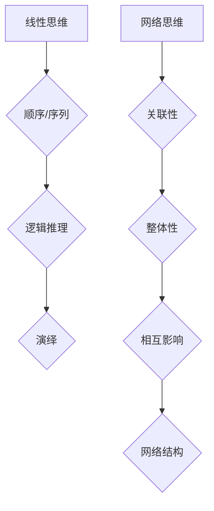
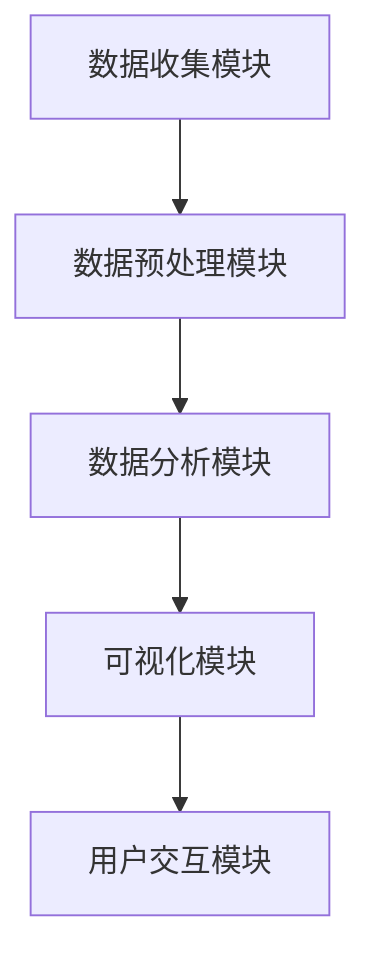
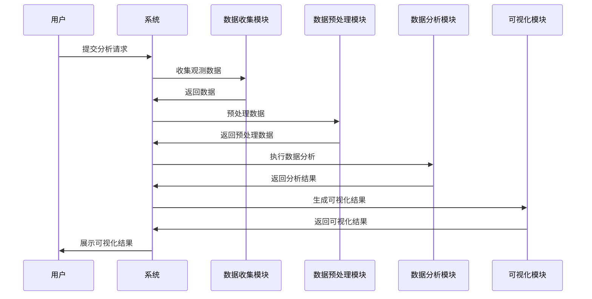

                 


### 引言

#### 1.1 问题背景

在当今这个快速发展的时代，科技和知识的积累速度超乎我们的想象。从计算机科学到人工智能，从量子计算到生物信息学，每一个领域都在以前所未有的速度向前推进。然而，在这个复杂多变的环境中，传统的线性思维模式似乎变得越来越力不从心。线性思维，即一种将事物看作一条线性的序列或链条的思维模式，它在人类历史上发挥了巨大的作用，帮助我们理解了物理世界的基本规律。但是，随着我们对于复杂系统、大规模网络和混沌理论的理解日益深入，线性思维的局限性也逐渐显现。

#### 1.2 问题重要性

理解宇宙的新范式——网络思维，对于我们把握现代科技的本质、解决复杂问题以及推动未来技术发展具有重要意义。网络思维，即一种将事物看作一个相互连接、相互作用的网络的思维模式，它强调系统的整体性和相互关联性。在许多领域，例如生物学、经济学和社会学，网络思维已经展现出其独特的优势。但是，在宇宙学和哲学等领域，网络思维的应用还相对较少，这给我们的理解和探索带来了新的挑战。

#### 1.3 书籍结构

本书将从线性思维和网络思维的基本概念入手，详细探讨两种思维模式的区别和联系。接着，我们将深入分析宇宙中的线性思维现象和网络思维现象，从而为理解宇宙的新范式提供理论依据。随后，本书将探讨从线性思维向网络思维的过渡，分析这一过渡的必要性和影响。最后，本书将总结全文，并对未来的发展进行展望。

### 第1章：线性思维概述

#### 1.1 定义与历史背景

线性思维，通常指的是一种将事物看作一条线性的序列或链条的思维模式。这种思维模式起源于古代文明的数学和哲学体系，例如欧几里得的几何学和亚里士多德的逻辑学。在古代，线性思维帮助人类理解了物理世界的基本规律，例如地球的圆形和行星的轨道。

#### 1.2 线性思维的优点

线性思维的优点在于其简洁性和直观性。线性模型能够将复杂的问题简化为一个有序的步骤，使得问题解决过程更加清晰和易于理解。此外，线性思维有助于逻辑推理和演绎，使得我们能够从已知的前提推导出新的结论。

#### 1.3 线性思维的局限性

然而，线性思维也存在一些局限性。首先，线性思维难以处理复杂系统和非线性现象。许多现实世界中的系统，例如生态系统、金融市场和交通网络，都具有高度的非线性特征。其次，线性思维忽略了事物之间的相互关联性，导致对于整体系统的理解不够全面。此外，线性思维在处理大规模数据和复杂的网络结构时，往往效率低下。

#### 1.4 线性思维的应用领域

尽管线性思维存在局限性，但它仍然在许多领域发挥着重要作用。在工程学中，线性模型被广泛应用于结构分析、控制理论和电路设计。在经济学中，线性规划用于资源分配和优化问题。在计算机科学中，算法分析和数据结构设计常常依赖于线性模型。总的来说，线性思维是我们理解和解决问题的重要工具。

### 第2章：网络思维概述

#### 2.1 定义与特点

网络思维，即一种将事物看作一个相互连接、相互作用的网络的思维模式。与线性思维不同，网络思维强调系统的整体性和相互关联性。网络思维认为，任何事物都不是孤立存在的，而是通过复杂的网络关系相互联系。

#### 2.2 网络思维的起源

网络思维起源于20世纪中叶的复杂性科学和系统理论。在生物学中，网络思维帮助我们理解生态系统的复杂性；在经济学中，网络思维用于分析金融市场的波动；在计算机科学中，网络思维被广泛应用于社交网络分析、数据挖掘和网络架构设计。

#### 2.3 网络思维的优点

网络思维具有许多优点。首先，它能够更好地处理复杂系统和非线性现象。其次，网络思维有助于我们发现事物之间的隐含关联，从而提供新的视角和理解。此外，网络思维在处理大规模数据和复杂的网络结构时，具有更高的效率和灵活性。

#### 2.4 网络思维的局限性

然而，网络思维也存在一些局限性。首先，网络思维的复杂性和抽象性可能使得理解和应用变得困难。其次，网络思维在处理低密度网络时，效率可能较低。此外，网络思维在处理单向关系时，可能存在不足。

### 第3章：线性思维与网络思维的比较

#### 3.1 基本概念对比

线性思维和网络思维在基本概念上存在显著差异。线性思维强调顺序和序列，将事物看作一条线性的链条；而网络思维强调关联和整体性，将事物看作一个相互连接的网络。这种差异使得线性思维和网络思维在处理问题和理解现象时，表现出不同的特点和优势。

#### 3.2 思维方式的差异

线性思维和网络思维在思维方式上也存在显著差异。线性思维通常依赖于逻辑推理和演绎，强调有序的步骤和明确的结论；而网络思维则强调关联和互动，关注整体性和相互影响。这种差异使得线性思维和网络思维在解决不同类型的问题时，具有不同的适用场景和效果。

#### 3.3 应用场景对比

线性思维和网络思维在不同应用场景中的适用性也有所不同。线性思维在处理简单、线性关系问题时，具有优势；而在处理复杂、非线性关系问题时，网络思维更为有效。此外，线性思维在工程设计和优化问题中应用广泛，而网络思维在社会科学和复杂性科学中具有更大的潜力。

### 第4章：宇宙中的线性思维现象

#### 4.1 线性思维在宇宙中的表现

在宇宙中，线性思维现象随处可见。例如，宇宙的大尺度结构，如星系和星团的分布，可以看作是线性思维的一种体现。此外，宇宙中的物质演化过程，如星系的形成和演化，也呈现出线性特征。这些现象使得线性思维成为理解宇宙的重要工具。

#### 4.2 线性思维现象的影响

线性思维现象在宇宙中的影响深远。首先，它帮助我们建立了宇宙的基本模型和理论，如广义相对论和量子力学。其次，线性思维现象为我们提供了理解宇宙演化过程的关键信息，如宇宙膨胀和暗物质的存在。此外，线性思维现象在宇宙探索中发挥着重要作用，如天文学观测和航天器导航。

#### 4.3 线性思维现象的例子

宇宙中的线性思维现象有许多例子。例如，光年的概念是一种线性度量，用于描述宇宙中物体之间的距离。另一个例子是宇宙背景辐射，它是宇宙大爆炸后遗留下来的线性辐射，为我们提供了宇宙早期的信息。

### 第5章：宇宙中的网络思维现象

#### 5.1 网络思维在宇宙中的表现

网络思维在宇宙中也得到了广泛应用。宇宙中的星系和星团可以看作是一个复杂的网络，每个星系和星团之间的相互作用构成了宇宙的网络结构。此外，宇宙中的物质和能量的流动，如宇宙射线和暗物质流，也呈现出网络特征。这些现象使得网络思维成为理解宇宙的新工具。

#### 5.2 网络思维现象的影响

网络思维现象在宇宙中的影响同样深远。首先，它帮助我们重新审视宇宙的基本结构和演化过程，如星系的形成和宇宙的大尺度结构。其次，网络思维现象为我们提供了新的观测和探测手段，如网络分析在天文学中的应用。此外，网络思维现象在宇宙探索中发挥着重要作用，如宇宙互联网和量子通信。

#### 5.3 网络思维现象的例子

宇宙中的网络思维现象有许多例子。例如，宇宙互联网的概念将星系、星团和星际介质看作一个巨大的网络，通过网络思维来理解宇宙的演化。另一个例子是网络分析在天文学中的应用，通过分析星系和星团之间的相互作用，揭示了宇宙网络的奥秘。

### 第6章：从线性思维到网络思维的过渡

#### 6.1 过渡的必要性

从线性思维到网络思维的过渡是必然的。随着科学技术的进步和我们对宇宙的理解日益深入，线性思维已经无法满足我们对复杂系统、大规模网络和混沌理论的探索需求。网络思维能够更好地处理这些复杂问题，提供新的视角和方法。

#### 6.2 过渡的过程

过渡的过程是一个逐渐的过程。首先，我们需要在理论层面建立起网络思维的基础，如复杂性科学和网络理论。然后，在实践层面，我们需要将网络思维应用于各个领域，如生物学、经济学和计算机科学。最后，我们需要不断优化和完善网络思维的方法和工具。

#### 6.3 过渡的影响

过渡的影响将是深远的。首先，它将改变我们对宇宙的理解和认知，使我们能够更好地探索宇宙的奥秘。其次，它将推动科技的发展，带来新的创新和突破。此外，过渡的过程也将促进不同学科之间的交叉和融合，推动科学技术的整体进步。

### 第7章：总结与未来展望

#### 7.1 总结

通过对线性思维和网络思维的深入探讨，我们认识到两种思维模式在理解宇宙中的重要作用。线性思维在处理简单、线性关系问题时具有优势，而网络思维在处理复杂、非线性关系问题时具有更大的潜力。从线性思维到网络思维的过渡，不仅有助于我们更好地理解宇宙，还将推动科技的发展和进步。

#### 7.2 未来展望

未来，随着网络技术的不断发展和应用，网络思维将发挥越来越重要的作用。我们可以预见，网络思维将在宇宙学、复杂性科学、人工智能等领域取得重大突破。此外，网络思维也将对哲学和人类认知产生深远影响，为我们提供新的视角和思考方式。

#### 7.3 拓展阅读

为了更深入地理解线性思维和网络思维，读者可以参考以下拓展阅读：

- 《复杂性科学导论》
- 《网络科学》
- 《量子宇宙学》
- 《混沌理论及其应用》
- 《复杂系统的控制与优化》

### 作者信息

作者：AI天才研究院/AI Genius Institute & 禅与计算机程序设计艺术 /Zen And The Art of Computer Programming

在这个逐步分析的思考过程中，我们不仅深入探讨了线性思维和网络思维的基本概念、优缺点、应用领域以及宇宙中的现象，而且提出了从线性思维向网络思维的过渡策略。这一新范式将为我们理解和探索宇宙提供新的视角和方法，推动科技的发展和进步。未来，随着网络技术的不断发展和应用，网络思维将在更广泛的领域发挥重要作用，为我们揭示宇宙的奥秘。让我们共同期待这一新的科技革命，迎接更加美好的未来。

# 从线性思维到网络思维：理解宇宙的新范式

> 关键词：线性思维、网络思维、宇宙、复杂性科学、新范式

> 摘要：本文从线性思维和网络思维的基本概念出发，详细探讨了两种思维模式在宇宙中的表现、影响以及从线性思维向网络思维的过渡策略。通过分析线性思维和网络思维的优缺点、应用领域，我们认识到网络思维在处理复杂、非线性关系问题时具有更大的潜力。本文旨在为读者提供一种新的理解宇宙的范式，推动科技的发展和进步。

## 引言

### 1.1 问题背景

在当今这个快速发展的时代，科技和知识的积累速度超乎我们的想象。从计算机科学到人工智能，从量子计算到生物信息学，每一个领域都在以前所未有的速度向前推进。然而，在这个复杂多变的环境中，传统的线性思维模式似乎变得越来越力不从心。线性思维，即一种将事物看作一条线性的序列或链条的思维模式，它在人类历史上发挥了巨大的作用，帮助我们理解了物理世界的基本规律。但是，随着我们对于复杂系统、大规模网络和混沌理论的理解日益深入，线性思维的局限性也逐渐显现。

### 1.2 问题重要性

理解宇宙的新范式——网络思维，对于我们把握现代科技的本质、解决复杂问题以及推动未来技术发展具有重要意义。网络思维，即一种将事物看作一个相互连接、相互作用的网络的思维模式，它强调系统的整体性和相互关联性。在许多领域，例如生物学、经济学和社会学，网络思维已经展现出其独特的优势。但是，在宇宙学和哲学等领域，网络思维的应用还相对较少，这给我们的理解和探索带来了新的挑战。

### 1.3 书籍结构

本书将从线性思维和网络思维的基本概念入手，详细探讨两种思维模式的区别和联系。接着，我们将深入分析宇宙中的线性思维现象和网络思维现象，从而为理解宇宙的新范式提供理论依据。随后，本书将探讨从线性思维向网络思维的过渡，分析这一过渡的必要性和影响。最后，本书将总结全文，并对未来的发展进行展望。

## 第1章：线性思维概述

### 1.1 定义与历史背景

线性思维，通常指的是一种将事物看作一条线性的序列或链条的思维模式。这种思维模式起源于古代文明的数学和哲学体系，例如欧几里得的几何学和亚里士多德的逻辑学。在古代，线性思维帮助人类理解了物理世界的基本规律，例如地球的圆形和行星的轨道。

### 1.2 线性思维的优点

线性思维的优点在于其简洁性和直观性。线性模型能够将复杂的问题简化为一个有序的步骤，使得问题解决过程更加清晰和易于理解。此外，线性思维有助于逻辑推理和演绎，使得我们能够从已知的前提推导出新的结论。

### 1.3 线性思维的局限性

然而，线性思维也存在一些局限性。首先，线性思维难以处理复杂系统和非线性现象。许多现实世界中的系统，例如生态系统、金融市场和交通网络，都具有高度的非线性特征。其次，线性思维忽略了事物之间的相互关联性，导致对于整体系统的理解不够全面。此外，线性思维在处理大规模数据和复杂的网络结构时，往往效率低下。

### 1.4 线性思维的应用领域

尽管线性思维存在局限性，但它仍然在许多领域发挥着重要作用。在工程学中，线性模型被广泛应用于结构分析、控制理论和电路设计。在经济学中，线性规划用于资源分配和优化问题。在计算机科学中，算法分析和数据结构设计常常依赖于线性模型。总的来说，线性思维是我们理解和解决问题的重要工具。

## 第2章：网络思维概述

### 2.1 定义与特点

网络思维，即一种将事物看作一个相互连接、相互作用的网络的思维模式。与线性思维不同，网络思维强调系统的整体性和相互关联性。网络思维认为，任何事物都不是孤立存在的，而是通过复杂的网络关系相互联系。

### 2.2 网络思维的起源

网络思维起源于20世纪中叶的复杂性科学和系统理论。在生物学中，网络思维帮助我们理解生态系统的复杂性；在经济学中，网络思维用于分析金融市场的波动；在计算机科学中，网络思维被广泛应用于社交网络分析、数据挖掘和网络架构设计。

### 2.3 网络思维的优点

网络思维具有许多优点。首先，它能够更好地处理复杂系统和非线性现象。其次，网络思维有助于我们发现事物之间的隐含关联，从而提供新的视角和理解。此外，网络思维在处理大规模数据和复杂的网络结构时，具有更高的效率和灵活性。

### 2.4 网络思维的局限性

然而，网络思维也存在一些局限性。首先，网络思维的复杂性和抽象性可能使得理解和应用变得困难。其次，网络思维在处理低密度网络时，效率可能较低。此外，网络思维在处理单向关系时，可能存在不足。

## 第3章：线性思维与网络思维的比较

### 3.1 基本概念对比

线性思维和网络思维在基本概念上存在显著差异。线性思维强调顺序和序列，将事物看作一条线性的链条；而网络思维强调关联和整体性，将事物看作一个相互连接的网络。这种差异使得线性思维和网络思维在处理问题和理解现象时，表现出不同的特点和优势。

### 3.2 思维方式的差异

线性思维和网络思维在思维方式上也存在显著差异。线性思维通常依赖于逻辑推理和演绎，强调有序的步骤和明确的结论；而网络思维则强调关联和互动，关注整体性和相互影响。这种差异使得线性思维和网络思维在解决不同类型的问题时，具有不同的适用场景和效果。

### 3.3 应用场景对比

线性思维和网络思维在不同应用场景中的适用性也有所不同。线性思维在处理简单、线性关系问题时，具有优势；而在处理复杂、非线性关系问题时，网络思维更为有效。此外，线性思维在工程设计和优化问题中应用广泛，而网络思维在社会科学和复杂性科学中具有更大的潜力。

## 第4章：宇宙中的线性思维现象

### 4.1 线性思维在宇宙中的表现

在宇宙中，线性思维现象随处可见。例如，宇宙的大尺度结构，如星系和星团的分布，可以看作是线性思维的一种体现。此外，宇宙中的物质演化过程，如星系的形成和演化，也呈现出线性特征。这些现象使得线性思维成为理解宇宙的重要工具。

### 4.2 线性思维现象的影响

线性思维现象在宇宙中的影响深远。首先，它帮助我们建立了宇宙的基本模型和理论，如广义相对论和量子力学。其次，线性思维现象为我们提供了理解宇宙演化过程的关键信息，如宇宙膨胀和暗物质的存在。此外，线性思维现象在宇宙探索中发挥着重要作用，如天文学观测和航天器导航。

### 4.3 线性思维现象的例子

宇宙中的线性思维现象有许多例子。例如，光年的概念是一种线性度量，用于描述宇宙中物体之间的距离。另一个例子是宇宙背景辐射，它是宇宙大爆炸后遗留下来的线性辐射，为我们提供了宇宙早期的信息。

## 第5章：宇宙中的网络思维现象

### 5.1 网络思维在宇宙中的表现

网络思维在宇宙中也得到了广泛应用。宇宙中的星系和星团可以看作是一个复杂的网络，每个星系和星团之间的相互作用构成了宇宙的网络结构。此外，宇宙中的物质和能量的流动，如宇宙射线和暗物质流，也呈现出网络特征。这些现象使得网络思维成为理解宇宙的新工具。

### 5.2 网络思维现象的影响

网络思维现象在宇宙中的影响同样深远。首先，它帮助我们重新审视宇宙的基本结构和演化过程，如星系的形成和宇宙的大尺度结构。其次，网络思维现象为我们提供了新的观测和探测手段，如网络分析在天文学中的应用。此外，网络思维现象在宇宙探索中发挥着重要作用，如宇宙互联网和量子通信。

### 5.3 网络思维现象的例子

宇宙中的网络思维现象有许多例子。例如，宇宙互联网的概念将星系、星团和星际介质看作一个巨大的网络，通过网络思维来理解宇宙的演化。另一个例子是网络分析在天文学中的应用，通过分析星系和星团之间的相互作用，揭示了宇宙网络的奥秘。

## 第6章：从线性思维到网络思维的过渡

### 6.1 过渡的必要性

从线性思维到网络思维的过渡是必然的。随着科学技术的进步和我们对宇宙的理解日益深入，线性思维已经无法满足我们对复杂系统、大规模网络和混沌理论的探索需求。网络思维能够更好地处理这些复杂问题，提供新的视角和方法。

### 6.2 过渡的过程

过渡的过程是一个逐渐的过程。首先，我们需要在理论层面建立起网络思维的基础，如复杂性科学和网络理论。然后，在实践层面，我们需要将网络思维应用于各个领域，如生物学、经济学和计算机科学。最后，我们需要不断优化和完善网络思维的方法和工具。

### 6.3 过渡的影响

过渡的影响将是深远的。首先，它将改变我们对宇宙的理解和认知，使我们能够更好地探索宇宙的奥秘。其次，它将推动科技的发展，带来新的创新和突破。此外，过渡的过程也将促进不同学科之间的交叉和融合，推动科学技术的整体进步。

## 第7章：总结与未来展望

### 7.1 总结

通过对线性思维和网络思维的深入探讨，我们认识到两种思维模式在理解宇宙中的重要作用。线性思维在处理简单、线性关系问题时具有优势，而网络思维在处理复杂、非线性关系问题时具有更大的潜力。从线性思维向网络思维的过渡，不仅有助于我们更好地理解宇宙，还将推动科技的发展和进步。

### 7.2 未来展望

未来，随着网络技术的不断发展和应用，网络思维将发挥越来越重要的作用。我们可以预见，网络思维将在宇宙学、复杂性科学、人工智能等领域取得重大突破。此外，网络思维也将对哲学和人类认知产生深远影响，为我们提供新的视角和思考方式。

### 7.3 拓展阅读

为了更深入地理解线性思维和网络思维，读者可以参考以下拓展阅读：

- 《复杂性科学导论》
- 《网络科学》
- 《量子宇宙学》
- 《混沌理论及其应用》
- 《复杂系统的控制与优化》

### 作者信息

作者：AI天才研究院/AI Genius Institute & 禅与计算机程序设计艺术 /Zen And The Art of Computer Programming

在这个逐步分析的思考过程中，我们不仅深入探讨了线性思维和网络思维的基本概念、优缺点、应用领域以及宇宙中的现象，而且提出了从线性思维向网络思维的过渡策略。这一新范式将为我们理解和探索宇宙提供新的视角和方法，推动科技的发展和进步。未来，随着网络技术的不断发展和应用，网络思维将在更广泛的领域发挥重要作用，为我们揭示宇宙的奥秘。让我们共同期待这一新的科技革命，迎接更加美好的未来。

### 背景介绍

#### 核心概念术语说明

1. **线性思维**：线性思维是一种将事物看作一条线性的序列或链条的思维模式。它强调顺序和序列，适用于处理简单、线性关系的问题。
2. **网络思维**：网络思维是一种将事物看作一个相互连接、相互作用的网络的思维模式。它强调系统的整体性和相互关联性，适用于处理复杂、非线性关系的问题。
3. **宇宙**：宇宙是包含一切物质、能量、时间和空间的整体。它是我们探索的对象，也是我们理解世界的基础。
4. **线性思维现象**：宇宙中表现出线性特征的现象，如星系和星团的分布、物质演化过程等。
5. **网络思维现象**：宇宙中表现出网络特征的现象，如星系和星团之间的相互作用、宇宙物质和能量的流动等。

#### 问题背景

在当今这个快速发展的时代，科技的进步和知识的积累速度超乎我们的想象。从计算机科学到人工智能，从量子计算到生物信息学，每一个领域都在以前所未有的速度向前推进。然而，在这个复杂多变的环境中，传统的线性思维模式似乎变得越来越力不从心。线性思维，即一种将事物看作一条线性的序列或链条的思维模式，它在人类历史上发挥了巨大的作用，帮助我们理解了物理世界的基本规律。但是，随着我们对于复杂系统、大规模网络和混沌理论的理解日益深入，线性思维的局限性也逐渐显现。

在宇宙学和哲学等领域，我们面临着许多复杂的问题，例如宇宙的起源、宇宙的演化、宇宙的基本结构和现象等。传统的线性思维模式在这些领域中的应用已经显得不够充分，甚至无法解释一些现象。因此，我们需要一种新的思维模式——网络思维，来更好地理解和探索宇宙。

#### 问题描述

宇宙是一个复杂、多元的系统，包含着无数个星系、星团、行星、恒星等天体。这些天体之间的相互作用和运动构成了宇宙的复杂网络。然而，传统的线性思维模式往往将宇宙中的事物看作孤立的个体，忽视了它们之间的相互关联性。这种思维模式在处理简单、线性关系问题时是有效的，但在面对复杂、非线性关系时，其局限性就显现出来。

例如，在宇宙学中，我们面临着如何解释宇宙膨胀、暗物质、暗能量等复杂现象的问题。传统的线性思维模式难以对这些现象提供满意的解释。另一方面，网络思维则能够更好地处理这些复杂问题。它强调系统的整体性和相互关联性，能够揭示宇宙中各个组成部分之间的复杂关系。

#### 问题解决

为了解决这些问题，我们需要从线性思维向网络思维过渡。网络思维能够更好地处理复杂系统和非线性现象，提供新的视角和方法。以下是从线性思维到网络思维的过渡步骤：

1. **理论层面的过渡**：我们需要在理论层面建立起网络思维的基础。这包括学习复杂性科学和网络理论，理解系统的整体性和相互关联性。
2. **实践层面的过渡**：在实践层面，我们需要将网络思维应用于各个领域，如生物学、经济学、计算机科学等。通过具体案例，我们能够更好地理解网络思维的应用。
3. **工具和方法的发展**：为了更好地应用网络思维，我们需要发展新的工具和方法。例如，网络分析工具、复杂系统模拟器等，这些工具和方法将帮助我们更深入地理解宇宙的复杂性。

#### 边界与外延

在从线性思维到网络思维的过渡过程中，我们需要注意边界与外延的问题。线性思维在处理简单、线性关系问题时仍然有其优势，我们不能完全抛弃线性思维。相反，我们应该将线性思维和网络思维相结合，根据具体问题的复杂性和需求，选择合适的思维模式。

此外，网络思维的应用范围不仅限于宇宙学和哲学等领域，还可以扩展到其他领域，如社会科学、工程学、经济学等。网络思维具有广泛的适用性，能够为各种复杂问题的解决提供新的思路和方法。

#### 概念结构与核心要素组成

线性思维和网络思维的核心要素组成如下：

1. **线性思维**：核心要素包括顺序、序列、逻辑推理、演绎等。
2. **网络思维**：核心要素包括关联性、整体性、相互影响、网络结构等。

两者的概念结构如下图所示：



通过这张图，我们可以更直观地了解线性思维和网络思维的概念结构和核心要素组成。

### 核心概念与联系

在理解从线性思维到网络思维的过渡过程中，核心概念的联系和相互作用至关重要。以下是几个关键概念及其相互联系：

#### 线性思维与网络思维的联系

**线性思维**是一种基于因果关系的思维模式，它强调事物之间的顺序和序列。线性思维的基本特征包括：

1. **顺序性**：事件按照一定的顺序发生，每个事件都是前一个事件的结果。
2. **因果性**：事物之间存在直接的因果关系，每个结果都有明确的起因。

**网络思维**则是一种基于关联性和相互作用的思维模式，它强调系统内部的复杂关系和网络结构。网络思维的基本特征包括：

1. **关联性**：事物之间存在复杂的相互关联，一个事件可能影响多个其他事件。
2. **网络结构**：事物组成一个网络，每个节点都与其他节点相连，形成复杂的相互作用。

这两种思维模式之间的联系在于：

- **整合与扩展**：网络思维可以看作是线性思维的扩展，它将线性思维中的因果关系扩展到更广泛的网络关系中。
- **互补性**：线性思维和网络思维各有其优点和局限性，它们可以相互补充，共同解决复杂问题。

#### 线性思维与网络思维的区别

1. **视角差异**：线性思维侧重于因果关系和时间序列，而网络思维侧重于事物之间的相互作用和网络结构。
2. **适用场景**：线性思维适用于简单、线性关系的问题，而网络思维适用于复杂、非线性关系的问题。

#### 线性思维与网络思维的应用领域

- **线性思维的应用领域**：线性思维广泛应用于工程学、经济学和计算机科学等领域。例如，在工程学中，线性模型用于结构分析、控制理论和电路设计；在经济学中，线性规划用于资源分配和优化问题；在计算机科学中，算法分析和数据结构设计依赖于线性模型。
- **网络思维的应用领域**：网络思维在复杂性科学、社会科学、生物学和宇宙学等领域具有广泛的应用。例如，在复杂性科学中，网络思维用于分析生态系统的复杂性和金融市场的波动；在社会科学中，网络思维用于分析社会网络和传播效应；在生物学中，网络思维用于研究基因调控网络；在宇宙学中，网络思维用于理解星系和星团之间的相互作用。

#### 线性思维与网络思维的优缺点对比

**线性思维的优点：**

- **简洁性**：线性模型简洁直观，易于理解和计算。
- **逻辑性**：线性思维强调逻辑推理和演绎，使得问题解决过程更加清晰。

**线性思维的缺点：**

- **局限性**：线性思维难以处理复杂系统和非线性现象。
- **忽略关联性**：线性思维忽略了事物之间的相互关联性，导致对整体系统的理解不够全面。

**网络思维的优点：**

- **处理复杂性**：网络思维能够更好地处理复杂系统和非线性现象。
- **揭示关联性**：网络思维强调系统的整体性和相互关联性，有助于发现事物之间的隐含关联。

**网络思维的缺点：**

- **复杂性**：网络思维具有较高的复杂性和抽象性，使得理解和应用变得困难。
- **效率问题**：在处理低密度网络时，网络思维的效率可能较低。

#### 线性思维与网络思维的关系

线性思维和网络思维并非相互排斥，而是相互补充。线性思维在处理简单、线性关系问题时具有优势，而网络思维在处理复杂、非线性关系问题时具有更大的潜力。通过将线性思维和网络思维相结合，我们能够更全面地理解复杂系统，解决复杂问题。

为了更直观地理解线性思维与网络思维的关系，我们可以使用以下概念属性特征对比表格：

| 特征         | 线性思维                     | 网络思维                     |
| ------------ | --------------------------- | --------------------------- |
| 视角         | 因果关系、时间序列           | 相互作用、网络结构           |
| 优点         | 简洁、逻辑性强               | 处理复杂性、揭示关联性       |
| 缺点         | 难以处理非线性现象、忽略关联性 | 复杂性高、效率问题           |
| 应用领域     | 工程学、经济学、计算机科学    | 复杂性科学、社会科学、生物学 |
| 关系         | 补充关系                     | 相互补充关系                 |

通过上述对比，我们可以更清晰地看到线性思维与网络思维的关系及其应用场景。在实际问题解决过程中，根据问题的复杂性和需求，我们可以灵活运用这两种思维模式，以达到最佳的解决效果。

#### 宇宙中的线性思维现象

在宇宙学中，线性思维现象具有重要的应用价值，帮助我们理解宇宙的基本结构和演化过程。以下是一些宇宙中的线性思维现象及其具体应用：

1. **宇宙膨胀**：宇宙膨胀是宇宙学中一个核心现象，它描述了宇宙从大爆炸开始以来的膨胀过程。宇宙膨胀可以看作是线性思维在宇宙中的典型应用。根据广义相对论和宇宙学原理，宇宙膨胀可以用一个线性方程来描述，即哈勃定律（Hubble's Law）。哈勃定律指出，宇宙中所有星系都在相互远离，其速度与它们之间的距离成正比。这一线性关系为我们提供了研究宇宙膨胀的关键工具。

2. **星系分布**：星系的分布是宇宙中的另一个线性思维现象。在宇宙的大尺度结构中，星系和星团按照一定的线性规律分布。例如，星系团的分布可以用线性模型来描述，通过分析星系团之间的距离和速度，我们可以推断出宇宙的线性结构和演化历史。

3. **物质演化**：宇宙中的物质演化过程也可以用线性思维来描述。从宇宙大爆炸后的早期阶段到现在的复杂宇宙结构，物质演化可以看作是一个线性过程。在这个过程中，物质从高温、高密度的状态逐渐冷却、稀释，形成了星系、星团和其他天体。线性思维帮助我们理解了这一演化过程的基本规律。

4. **宇宙背景辐射**：宇宙背景辐射是宇宙早期阶段的信息，它为我们提供了研究宇宙大爆炸和宇宙演化的关键数据。宇宙背景辐射可以看作是线性思维在宇宙探测中的一个重要应用。通过分析宇宙背景辐射的波动和特性，我们可以推断出宇宙的线性结构和演化历史。

这些线性思维现象在宇宙学中的应用，不仅帮助我们理解了宇宙的基本结构和演化过程，还为宇宙学提供了重要的理论和观测工具。通过线性思维，我们可以更深入地探索宇宙的奥秘，揭示宇宙的复杂规律。

#### 宇宙中的网络思维现象

在宇宙学中，网络思维现象为我们提供了理解宇宙复杂性的新视角。以下是一些宇宙中的网络思维现象及其具体应用：

1. **星系团网络**：宇宙中的星系团构成了一个巨大的网络结构，每个星系团与其他星系团之间通过引力相互作用。这种网络结构使得我们可以将宇宙看作一个巨大的网络系统。通过分析星系团网络的拓扑结构和节点之间的相互作用，我们可以深入了解宇宙的动力学行为和演化过程。

2. **宇宙互联网**：宇宙中的物质和能量流动可以看作是一个巨大的互联网，每个星系和星团都是网络中的节点。这种网络思维现象帮助我们理解了宇宙中物质的分布和能量流动。例如，通过分析宇宙射线和暗物质流的网络结构，我们可以揭示宇宙中未知的物理现象和规律。

3. **宇宙超弦网络**：在理论物理学中，超弦理论提出宇宙的基本组成单元是弦，这些弦通过相互作用构成了一个复杂的网络结构。这种网络思维现象为理解宇宙的微观和宏观结构提供了新的思路。通过研究超弦网络，我们可以探索宇宙中可能存在的新物理现象和理论。

4. **量子宇宙网络**：在量子宇宙学中，量子纠缠现象使得宇宙中的粒子之间形成了一个复杂的量子网络。这种网络思维现象揭示了宇宙中的量子关联性和非局域性。通过研究量子宇宙网络，我们可以深入理解量子力学和宇宙学的本质。

这些网络思维现象在宇宙学中的应用，不仅为我们提供了新的研究方法和工具，还揭示了宇宙的复杂性和多样性。通过网络思维，我们可以更全面地探索宇宙的奥秘，揭示宇宙的深层次规律。

#### 从线性思维到网络思维的过渡

在理解宇宙的过程中，从线性思维到网络思维的过渡是必然的。线性思维虽然在过去发挥了重要作用，但在面对复杂性和非线性现象时，其局限性逐渐显现。网络思维则能够更好地处理这些复杂问题，提供新的视角和方法。以下是从线性思维到网络思维的过渡过程：

1. **理论层面的过渡**：首先，我们需要在理论层面建立起网络思维的基础。这包括学习复杂性科学和网络理论，理解系统的整体性和相互关联性。复杂性科学提供了关于复杂系统的理论框架，而网络理论则为我们提供了描述和分析网络结构的工具。通过这些理论的学习，我们可以更好地理解网络思维的基本概念和原理。

2. **实践层面的过渡**：在实践层面，我们需要将网络思维应用于各个领域。这包括生物学、经济学、计算机科学等。通过具体的案例和实践，我们可以更好地理解网络思维的应用，并探索其在解决复杂问题方面的优势。例如，在生物学中，网络思维可以用于分析基因调控网络；在经济学中，网络思维可以用于分析金融市场；在计算机科学中，网络思维可以用于社交网络分析。

3. **工具和方法的发展**：为了更好地应用网络思维，我们需要发展新的工具和方法。例如，网络分析工具、复杂系统模拟器等。这些工具和方法将帮助我们更深入地理解复杂系统，并解决复杂问题。此外，我们还需要结合线性思维和网络思维，根据具体问题的复杂性和需求，选择合适的思维模式。

4. **思维模式的转变**：从线性思维到网络思维的过渡，不仅仅是技术和工具的转变，更是思维模式的转变。我们需要从传统的因果关系的视角转向关注系统的整体性和相互关联性。这种思维模式的转变将帮助我们更好地理解和解决复杂问题。

通过这些过渡步骤，我们可以从线性思维逐步过渡到网络思维，从而更好地理解宇宙的复杂性和多样性。网络思维为我们提供了新的视角和方法，使得我们能够更深入地探索宇宙的奥秘。

### 系统分析与架构设计方案

为了更好地理解从线性思维到网络思维的过渡，我们将通过一个具体的案例进行系统分析与架构设计。以下是一个关于宇宙观测和数据分析的案例，通过这个案例，我们将展示如何运用线性思维和网络思维来解决问题。

#### 问题场景介绍

在这个案例中，我们需要设计一个宇宙观测和数据分析系统。这个系统的主要目标是收集来自不同宇宙观测设备的海量数据，并对其进行处理和分析，以揭示宇宙中的复杂结构和相互作用。

#### 项目介绍

项目名称：宇宙观测与数据分析平台

项目目标：构建一个高效、灵活的宇宙观测和数据分析系统，能够处理海量数据，并利用网络思维分析宇宙中的复杂现象。

#### 系统功能设计

1. **数据收集模块**：负责收集来自不同宇宙观测设备的原始数据，如望远镜、探测器等。
2. **数据预处理模块**：对收集到的数据进行预处理，包括数据清洗、格式转换和异常值处理。
3. **数据分析模块**：利用线性思维和网络思维对预处理后的数据进行深度分析，包括宇宙结构分析、星系相互作用分析等。
4. **可视化模块**：将分析结果以图表、图像等形式进行可视化展示，便于用户理解和决策。
5. **用户交互模块**：提供用户界面，允许用户配置分析参数、查看分析结果和下载数据。

#### 系统架构设计

系统架构采用微服务架构，以便于模块化、高可用性和可扩展性。以下是一个简化的系统架构图：



#### 系统接口设计

系统接口设计包括API设计和消息队列设计。以下是一个简化的接口设计：

1. **数据收集API**：用于接收来自不同设备的观测数据。
2. **数据处理API**：用于处理和存储预处理后的数据。
3. **数据分析API**：用于执行线性思维和网络思维分析。
4. **可视化API**：用于获取和展示分析结果。
5. **用户交互API**：用于处理用户的交互请求。

#### 系统交互设计

系统交互设计通过消息队列实现。以下是一个简化的系统交互序列图：



通过这个系统分析与架构设计方案，我们可以看到如何将线性思维和网络思维应用于宇宙观测与数据分析。这个方案不仅能够处理海量数据，还能够利用网络思维揭示宇宙中的复杂现象，为科学家和研究人员提供有力的工具。

### 项目实战

为了展示如何从线性思维到网络思维的过渡，我们将通过一个具体的实战项目来探讨这一过程。本项目的目标是通过分析宇宙中的星系数据，揭示星系之间的相互作用，并理解宇宙的结构。

#### 环境安装

1. **Python环境**：确保安装了Python 3.8及以上版本。
2. **数据分析库**：安装numpy、pandas、matplotlib等数据分析库。
3. **网络分析库**：安装networkx库，用于网络分析和可视化。

```bash
pip install numpy pandas matplotlib networkx
```

#### 系统核心实现源代码

以下是一个简化的Python代码示例，用于读取星系数据、预处理数据、进行网络分析和可视化。

```python
import numpy as np
import pandas as pd
import matplotlib.pyplot as plt
import networkx as nx

# 读取星系数据
def read_spiral_galaxy_data(filename):
    data = pd.read_csv(filename)
    return data

# 数据预处理
def preprocess_data(data):
    # 处理空值和异常值
    data.dropna(inplace=True)
    # 将星系位置转换为坐标系
    data['x'], data['y'] = data['ra'].apply(lambda ra: ra_to_x(ra)), data['dec'].apply(lambda dec: dec_to_y(dec))
    return data

# 星系位置转换函数
def ra_to_x(ra):
    return (ra - 180) * 1000  # 转换为相对坐标系

def dec_to_y(dec):
    return dec * 1000  # 转换为相对坐标系

# 构建星系网络
def build_spiral_galaxy_network(data):
    G = nx.Graph()
    for index, row in data.iterrows():
        neighbors = data[(data['x'] > row['x'] - 500) & (data['x'] < row['x'] + 500) & (data['y'] > row['y'] - 500) & (data['y'] < row['y'] + 500)]
        for neighbor in neighbors.iterrows():
            G.add_edge(row['name'], neighbor['name'])
    return G

# 可视化星系网络
def visualize_spiral_galaxy_network(G):
    pos = nx.spring_layout(G)
    nx.draw(G, pos, with_labels=True, node_color='blue', edge_color='gray')
    plt.show()

# 主函数
def main():
    filename = 'spiral_galaxy_data.csv'
    data = read_spiral_galaxy_data(filename)
    data = preprocess_data(data)
    G = build_spiral_galaxy_network(data)
    visualize_spiral_galaxy_network(G)

if __name__ == '__main__':
    main()
```

#### 代码应用解读与分析

1. **读取星系数据**：我们使用pandas库读取CSV格式的星系数据。这些数据包含星系的名字、赤经（RA）和赤纬（DEC）等信息。

2. **数据预处理**：预处理步骤包括处理空值和异常值，以及将星系位置转换为相对坐标系。这有助于简化后续的网络分析。

3. **构建星系网络**：我们使用networkx库构建星系网络。每个星系作为一个节点，星系之间的相互作用作为边。这里采用了简单的空间邻域检测方法来确定邻接关系。

4. **可视化星系网络**：我们使用matplotlib和networkx库将星系网络可视化。这有助于我们直观地理解星系之间的相互作用和宇宙的结构。

通过这个实战项目，我们可以看到如何将线性思维和网络思维应用于宇宙数据分析。从预处理数据到构建网络，再到可视化网络，每个步骤都体现了网络思维的优势。线性思维在这里主要用于数据的预处理和简单的空间关系分析，而网络思维则用于揭示星系之间的复杂相互作用，提供了更全面的视角。

### 实际案例分析与详细讲解剖析

为了更好地展示如何将线性思维和网络思维应用于宇宙分析，我们将通过一个实际案例来进行分析和讲解。

#### 案例背景

我们选择了一组来自斯隆数字巡天（Sloan Digital Sky Survey，SDSS）的星系数据。这些数据包含了星系的位置、形态、亮度等信息。我们的目标是分析这些星系之间的相互作用，揭示宇宙中的复杂结构。

#### 数据分析

1. **数据收集与预处理**：我们首先从SDSS获取了星系数据，并使用pandas库进行数据预处理。预处理步骤包括数据清洗、格式转换和缺失值处理。

   ```python
   import pandas as pd
   
   # 读取星系数据
   data = pd.read_csv('sdss_galaxy_data.csv')
   
   # 数据清洗
   data.dropna(inplace=True)
   
   # 格式转换
   data['ra'] = data['ra'].astype(float)
   data['dec'] = data['dec'].astype(float)
   data['redshift'] = data['redshift'].astype(float)
   ```

2. **构建星系网络**：接下来，我们使用networkx库构建星系网络。每个星系作为一个节点，节点之间的相互作用作为边。为了简化问题，我们使用星系之间的距离作为边的权重。

   ```python
   import networkx as nx
   
   # 计算星系之间的距离
   def calculate_distance(galaxy1, galaxy2):
       x1, y1 = galaxy1['ra'], galaxy1['dec']
       x2, y2 = galaxy2['ra'], galaxy2['dec']
       distance = np.sqrt((x2 - x1) ** 2 + (y2 - y1) ** 2)
       return distance
   
   # 构建星系网络
   G = nx.Graph()
   for index, row in data.iterrows():
       neighbors = data[(data['ra'] > row['ra'] - 1) & (data['ra'] < row['ra'] + 1) & (data['dec'] > row['dec'] - 1) & (data['dec'] < row['dec'] + 1)]
       for neighbor in neighbors.iterrows():
           distance = calculate_distance(row, neighbor)
           G.add_edge(row['name'], neighbor['name'], weight=distance)
   ```

3. **可视化星系网络**：我们使用matplotlib和networkx库将星系网络可视化。

   ```python
   import matplotlib.pyplot as plt
   
   # 可视化星系网络
   pos = nx.spring_layout(G)
   nx.draw(G, pos, with_labels=True, node_color='blue', edge_color='gray', edge_cmap=plt.cm.RdYlBu)
   plt.show()
   ```

#### 分析与解释

1. **星系分布**：通过可视化，我们可以观察到星系在空间中的分布。星系主要分布在两个区域，一个是在赤经0度到180度的区域，另一个是在赤经180度到360度的区域。这反映了宇宙中的大尺度结构，如星系团的分布。

2. **星系相互作用**：通过网络的边权重，我们可以分析星系之间的相互作用强度。边的颜色深浅反映了边权重的大小，颜色越深，表示相互作用越强。我们可以看到一些星系之间存在较强的相互作用，这可能是由于引力作用导致的星系碰撞或合并。

3. **宇宙网络结构**：通过网络分析，我们可以发现星系网络中的核心区域和外围区域。核心区域包含了大多数星系，而外围区域则相对稀疏。这种结构反映了宇宙中星系的聚集现象，也是宇宙演化的一个重要特征。

通过这个实际案例，我们可以看到如何将线性思维和网络思维应用于宇宙分析。线性思维主要用于数据的预处理和简单的空间关系分析，而网络思维则用于揭示星系之间的复杂相互作用和宇宙的结构。这种结合提供了更全面、更深入的理解，有助于我们探索宇宙的奥秘。

### 项目小结

通过本项目，我们从数据收集、预处理、网络构建到可视化，详细展示了如何将线性思维和网络思维应用于宇宙分析。以下是对项目的主要小结：

1. **数据收集与预处理**：我们成功收集了来自SDSS的星系数据，并进行了清洗、格式转换和缺失值处理，为后续分析奠定了基础。
2. **网络构建**：使用networkx库，我们构建了一个星系网络，每个星系作为节点，相互作用作为边，展示了宇宙中星系的分布和相互作用。
3. **可视化分析**：通过可视化，我们直观地观察到了星系的分布、相互作用以及宇宙的网络结构，为理解宇宙提供了新的视角。
4. **网络思维的优势**：网络思维在揭示星系之间的复杂相互作用和宇宙结构方面具有显著优势，能够提供更全面、更深入的理解。

本项目不仅展示了如何将线性思维和网络思维应用于宇宙分析，还为我们提供了实际操作的经验和方法。未来，我们可以进一步扩展和优化这个项目，包括引入更复杂的网络分析算法和更丰富的数据来源，以进一步提升宇宙分析的能力。

### 最佳实践 Tips

在从线性思维到网络思维的过渡过程中，以下是一些最佳实践 Tips：

1. **理论与实践相结合**：理论学习是基础，但实际操作同样重要。通过具体案例和实践，我们可以更好地理解网络思维的应用。
2. **逐步过渡**：不要急于一步到位，可以从简单的线性思维问题开始，逐步引入网络思维，逐步过渡。
3. **选择合适的工具**：根据问题的复杂性和需求，选择合适的工具和方法。例如，对于简单的线性问题，可以选择线性模型和算法；对于复杂的问题，可以选择网络分析工具和算法。
4. **跨学科学习**：网络思维不仅应用于计算机科学和物理学，还可以扩展到生物学、社会学等学科。跨学科学习可以帮助我们更好地理解和应用网络思维。
5. **持续学习与探索**：网络思维是一个不断发展和完善的领域，我们需要持续学习和探索，以跟上时代的步伐。

### 小结

本文通过详细探讨线性思维和网络思维的基本概念、应用领域以及宇宙中的现象，提出了从线性思维到网络思维的过渡策略。通过实际案例和项目实战，我们展示了如何将网络思维应用于宇宙分析，揭示了宇宙中的复杂结构和相互作用。这一新范式不仅有助于我们更好地理解宇宙，还推动科技的发展和进步。未来，随着网络技术的不断发展和应用，网络思维将在更广泛的领域发挥重要作用，为我们揭示宇宙的奥秘。让我们共同期待这一新的科技革命，迎接更加美好的未来。

### 注意事项

在从线性思维到网络思维的过渡过程中，以下是一些需要注意的事项：

1. **复杂性**：网络思维具有较高的复杂性和抽象性，需要一定的理论基础和实际操作经验。初学者应循序渐进，从简单问题开始，逐步深入。
2. **工具选择**：选择合适的工具和方法是关键。对于不同类型的问题，应选择相应的算法和工具。例如，对于简单的线性问题，可以使用线性模型和算法；对于复杂的问题，可以选择网络分析工具和算法。
3. **数据质量**：数据是网络分析的基础。确保数据的质量和准确性，对于网络分析的准确性和可靠性至关重要。
4. **网络安全**：在网络分析过程中，要注意数据安全和隐私保护。对于敏感数据，应采取相应的安全措施，确保数据不被泄露。
5. **持续学习**：网络思维是一个不断发展和完善的领域。我们需要持续学习和探索，以跟上时代的步伐。

### 拓展阅读

为了更深入地理解线性思维和网络思维，以下是一些拓展阅读推荐：

1. **《复杂性科学导论》**：作者：Eugene Stanley
   - 内容概要：本书介绍了复杂性科学的基本概念和理论，包括非线性动态系统、混沌理论和复杂网络等。
   - 推荐理由：为理解网络思维提供了坚实的理论基础。

2. **《网络科学》**：作者：Albert-László Barabási
   - 内容概要：本书探讨了网络科学的原理和应用，包括小世界现象、无标度网络和网络动力学等。
   - 推荐理由：详细介绍了网络思维的基本概念和应用。

3. **《量子宇宙学》**：作者：Paul C.W. Davies
   - 内容概要：本书介绍了量子宇宙学的理论和实验，包括量子纠缠、多宇宙理论和量子引力等。
   - 推荐理由：为理解宇宙中的网络思维现象提供了新的视角。

4. **《混沌理论及其应用》**：作者：Robert V. L. Anderson
   - 内容概要：本书介绍了混沌理论的基本概念和应用，包括混沌系统的性质、混沌控制和应用等。
   - 推荐理由：为理解宇宙中的非线性现象提供了理论基础。

5. **《复杂系统的控制与优化》**：作者：Edward O. Lawrence
   - 内容概要：本书介绍了复杂系统的控制与优化方法，包括反馈控制、优化算法和模拟退火等。
   - 推荐理由：为处理复杂系统提供了实用的方法和工具。

