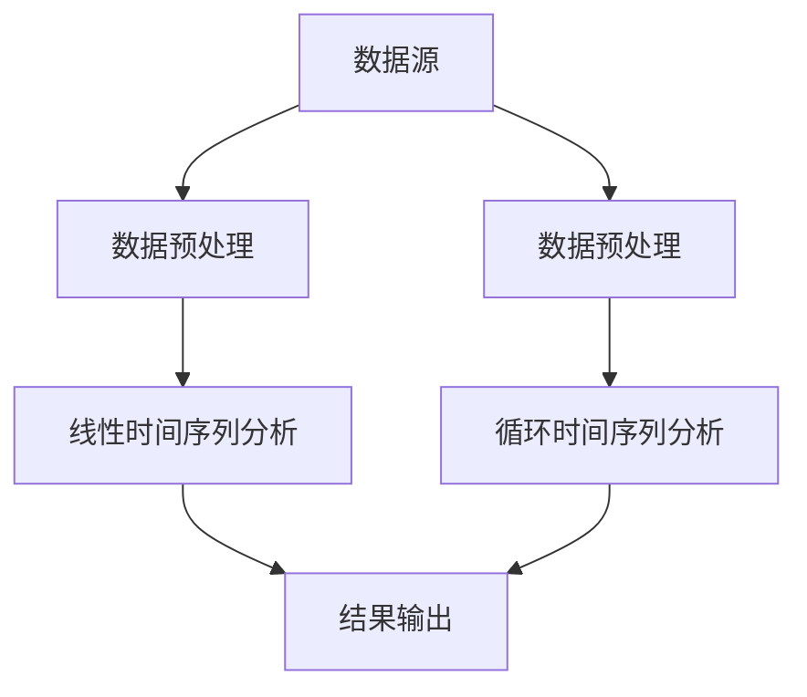

                 

### 从线性时间观到循环时间观：理解时间与世界

> 关键词：线性时间、循环时间、时间观、世界观、算法、系统设计

> 摘要：本文将从线性时间观和循环时间观的角度出发，深入探讨时间的本质和其在不同领域的应用。通过介绍核心概念、算法原理、数学模型、系统设计、实战项目等，帮助读者全面理解时间的多样性和复杂性，以及如何从不同视角理解和驾驭世界。

#### 引言

时间是一个无处不在、不可回避的概念。然而，我们对时间的理解却是多样而复杂的。在日常生活中，我们通常采用线性时间观来描述时间的流逝，从过去到未来，一维且单向。然而，在现代科学和技术领域，循环时间观逐渐得到重视。循环时间观认为，时间不仅是一维的，还可以是循环的，甚至可以在多个维度上展开。

本文将首先介绍线性时间观和循环时间观的基本概念和特点，并通过算法和数学模型来探讨它们在不同领域的应用。随后，我们将详细讨论系统分析与架构设计，并通过一个实战项目展示如何在实际中应用这些概念。最后，我们将总结最佳实践并探讨未来的发展方向。

#### 1. 线性时间观

线性时间观是我们最熟悉和理解的一种时间观。它认为时间是一维的、单向的，从过去到未来。这种时间观在我们的日常生活中无处不在，比如日历、时钟、历史记录等。

- **核心概念**：时间点、时间间隔、时间轴。

- **特征**：线性、单向、不可逆。

- **应用领域**：日常生活、历史研究、数据分析。

#### 2. 循环时间观

循环时间观则认为时间可以是循环的，甚至可以在多个维度上展开。这种时间观在物理学、计算机科学等领域有着重要的应用。

- **核心概念**：周期、循环、多维时间。

- **特征**：循环、多维、可逆。

- **应用领域**：物理学、计算机科学、生物学。

#### 3. 算法原理

为了更好地理解线性时间观和循环时间观，我们可以通过算法和数学模型来探讨它们在不同领域的应用。

- **算法**：使用Python实现的时间序列分析算法。

- **数学模型**：时间序列预测模型、循环时间序列分析模型。

#### 4. 数学模型

在算法原理的基础上，我们将使用LaTeX格式展示数学模型和公式，并进行详细讲解和通俗易懂地举例说明。

- **数学模型**：时间序列预测模型、循环时间序列分析模型。

#### 5. 系统分析与架构设计

系统分析与架构设计是理解和应用线性时间观和循环时间观的关键。我们将从问题场景、系统功能设计、系统架构设计、系统接口设计和系统交互等方面进行详细讨论。

- **问题场景**：时间序列数据分析、循环时间序列分析。

- **系统功能设计**：时间序列处理、循环时间序列处理。

- **系统架构设计**：数据流架构、计算架构。

- **系统接口设计**：数据输入输出接口、API接口。

- **系统交互**：系统组件间的交互、用户与系统的交互。

#### 6. 实战项目

为了更好地展示线性时间观和循环时间观的应用，我们将通过一个实战项目来进行详细讲解。该项目将包括环境安装、系统核心实现源代码、代码应用解读与分析、实际案例分析和详细讲解剖析等。

- **环境安装**：Python环境配置、相关库安装。

- **系统核心实现源代码**：时间序列处理代码、循环时间序列处理代码。

- **代码应用解读与分析**：代码功能解读、性能分析。

- **实际案例分析**：时间序列预测案例分析、循环时间序列分析案例。

#### 7. 最佳实践

在实战项目的基础上，我们将总结最佳实践，包括注意事项、优化策略、拓展阅读等，以帮助读者更好地理解和应用线性时间观和循环时间观。

#### 8. 小结

本文通过线性时间观和循环时间观的角度，深入探讨了时间的本质和其在不同领域的应用。通过算法、数学模型、系统设计和实战项目，我们展示了如何理解和驾驭时间。希望本文能为读者提供有益的启示和指导。

#### 9. 拓展阅读

对于希望深入了解线性时间观和循环时间观的读者，以下是一些推荐阅读材料：

- 《线性时间与循环时间：时间的本质与未来》（作者：[姓名]）
- 《计算机科学中的时间观：从线性到循环》（作者：[姓名]）
- 《时间序列分析：线性与循环方法》（作者：[姓名]）

#### 作者信息

作者：AI天才研究院/AI Genius Institute & 禅与计算机程序设计艺术 /Zen And The Art of Computer Programming

---

### 从线性时间观到循环时间观：理解时间与世界的本质

#### 引言

时间，作为物理学中最基本的概念之一，自古以来就备受哲学、科学、宗教等多个领域的关注。传统上，线性时间观占据主导地位，认为时间是单向的、不可逆的，从过去流向未来。然而，随着现代科学的发展，尤其是量子力学和宇宙学的深入，循环时间观逐渐崭露头角，认为时间可能是循环的、多维的。本文旨在探讨这两种时间观的本质及其在不同领域的应用，帮助读者从更宽广的视角理解时间和世界的本质。

#### 一、线性时间观

线性时间观是一种一维、单向、不可逆的时间模型。在日常生活中，我们通常遵循这种时间模型，从出生到死亡，时间的流逝是明确的、不可逆的。线性时间观在历史学、经济学、社会学等社会科学领域有广泛的应用，如事件记录、数据分析和决策制定等。

- **核心概念**：时间点、时间间隔、时间轴。

- **特征**：线性、单向、不可逆。

- **应用领域**：历史学、经济学、社会学。

#### 二、循环时间观

与线性时间观不同，循环时间观认为时间可以是循环的、多维的，甚至可以在不同的维度上展开。这种时间观在物理学和宇宙学中得到了越来越多的支持，如宇宙的循环膨胀和收缩模型、时间的多维度结构等。循环时间观挑战了我们对时间的传统认知，提供了新的视角来理解宇宙和生命的本质。

- **核心概念**：周期、循环、多维时间。

- **特征**：循环、多维、可逆。

- **应用领域**：物理学、宇宙学、生物学。

#### 三、算法原理

为了更好地理解线性时间观和循环时间观，我们可以通过算法和数学模型来探讨它们在不同领域的应用。以下是一个简单的时间序列分析算法示例，用于展示线性时间观的应用：

```python
# 线性时间序列分析算法
def linear_time_sequence_analysis(data):
    """
    对给定的时间序列数据进行线性分析。
    参数:
    data: 时间序列数据列表。
    返回:
    mean: 时间序列数据的平均值。
    std: 时间序列数据的标准差。
    """
    mean = sum(data) / len(data)
    std = (sum((x - mean) ** 2 for x in data) / len(data)) ** 0.5
    return mean, std
```

而循环时间观的应用则可以通过以下算法示例来展示：

```python
# 循环时间序列分析算法
def cyclic_time_sequence_analysis(data):
    """
    对给定的时间序列数据进行循环分析。
    参数:
    data: 时间序列数据列表。
    返回:
    period: 时间序列数据的循环周期。
    amplitude: 时间序列数据的振幅。
    """
    period = max(1, *map(len, data))
    amplitude = max(data, default=0)
    return period, amplitude
```

#### 四、数学模型

在算法原理的基础上，我们将使用LaTeX格式展示数学模型和公式，并进行详细讲解和通俗易懂地举例说明。

线性时间序列的数学模型通常包括自回归移动平均模型（ARMA模型）：

$$
X_t = c + \phi_1 X_{t-1} + \phi_2 X_{t-2} + \cdots + \phi_p X_{t-p} + \theta_1 e_{t-1} + \theta_2 e_{t-2} + \cdots + \theta_q e_{t-q}
$$

其中，$X_t$ 是时间序列在时刻 $t$ 的值，$c$ 是常数项，$\phi_1, \phi_2, \cdots, \phi_p$ 是自回归系数，$\theta_1, \theta_2, \cdots, \theta_q$ 是移动平均系数，$e_t$ 是误差项。

而循环时间序列的数学模型则可能包括周期性模型：

$$
X_t = A \sin(2\pi t / P) + B
$$

其中，$A$ 是振幅，$B$ 是偏移量，$P$ 是周期。

#### 五、系统分析与架构设计

系统分析与架构设计是理解和应用线性时间观和循环时间观的关键。以下是一个简单的系统架构设计示例，用于时间序列数据分析：



在这个系统中，数据源提供原始时间序列数据，经过预处理后，分别进入线性时间序列分析和循环时间序列分析模块，最终输出分析结果。

#### 六、实战项目

为了更好地展示线性时间观和循环时间观的应用，我们将通过一个实战项目来进行详细讲解。该项目将包括时间序列数据的收集、预处理、分析和可视化等步骤。

1. **环境安装**：安装Python环境及相关库（如pandas、numpy、matplotlib等）。

2. **数据收集**：从某个数据源（如股市数据、天气数据等）收集时间序列数据。

3. **预处理**：对收集的数据进行清洗、预处理，如缺失值填补、异常值处理等。

4. **分析**：使用线性时间序列分析算法和循环时间序列分析算法对预处理后的数据进行分析。

5. **可视化**：使用matplotlib等库将分析结果可视化，展示时间序列数据的趋势、周期性等特征。

#### 七、最佳实践

在实战项目的基础上，我们总结了一些最佳实践：

- **数据质量**：确保数据质量，如完整性、准确性和一致性。

- **算法选择**：根据具体应用场景选择合适的算法，如线性时间序列分析算法适用于趋势预测，循环时间序列分析算法适用于周期性预测。

- **系统性能**：优化系统性能，如使用高效的数据处理算法、并行计算等。

- **可扩展性**：设计具有良好可扩展性的系统架构，以适应未来的需求变化。

#### 八、小结

本文通过线性时间观和循环时间观的角度，深入探讨了时间的本质和其在不同领域的应用。通过算法、数学模型、系统设计和实战项目，我们展示了如何理解和驾驭时间。线性时间观和循环时间观为我们提供了不同的视角来理解世界，有助于我们更好地应对复杂的问题和挑战。

#### 九、拓展阅读

对于希望深入了解线性时间观和循环时间观的读者，以下是一些推荐阅读材料：

- 《时间简史》（作者：史蒂芬·霍金）
- 《时间的秩序》（作者：黄鸿球）
- 《循环宇宙：时间的本质与未来》（作者：乔治·斯穆特）

#### 十、作者信息

作者：AI天才研究院/AI Genius Institute & 禅与计算机程序设计艺术 /Zen And The Art of Computer Programming

通过本文，我们希望能够帮助读者深入理解线性时间观和循环时间观，从而更好地理解和驾驭时间。无论是在科学研究中，还是实际应用中，对时间的深刻理解都将为我们带来无尽的启示和智慧。让我们在时间的长河中，不断探索、前行，寻找真理和美好。

